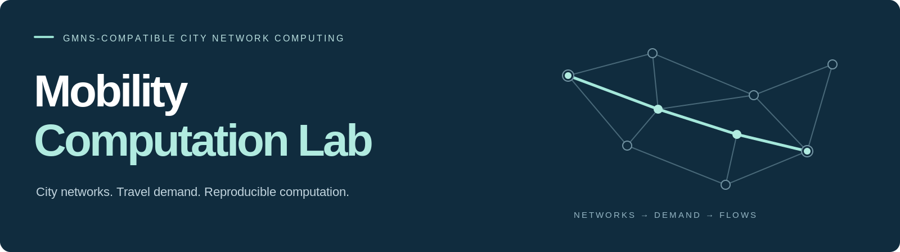

<p align="center"></p>

<p align="center">
  <a href="#city-network-workflow">City workflow</a> ·
  <a href="docs/datasets.md">Network catalog</a> ·
  <a href="docs/visualizations.md">Visual results</a> ·
  <a href="#quick-start">Quick start</a> ·
  <a href="docs/data-contract.md">GMNS-compatible inputs</a> ·
  <a href="docs/methods.md">Methods</a>
</p>

# Mobility Computation Lab

**City networks, travel demand and reproducible network computation.**

Mobility Computation Lab organizes road networks, zone access, origin–destination demand and supporting mobility evidence around a shared city-modelling workflow. Its computational core turns **prepared network and demand tables** into paths, flows and independently checked results.

Use the current release to run finite space–time column generation, inspect road-benchmark visualizations, apply a separate static Frank–Wolfe baseline, or prepare local city/catalog metadata. New cities are added through explicit inputs, units and provenance—not by creating another solver for every city.

## City network workflow

The organizing unit is a **city network instance**, not a count of available data feeds. A complete city model connects the following components; the linked guides distinguish the current interfaces from extensions.

| Component | What belongs together | Current entry |
|---|---|---|
| **Road network** | Directed nodes and links, identifiers, geometry and mode | [Prepared network tables and input profile](docs/data-contract.md) |
| **Zones and hierarchy** | Zone IDs, centroids, network access and spatial levels | Supplied [zone-access mappings](docs/data-contract.md); [hierarchical extensions](docs/city-workflow.md) |
| **OD demand** | Origin, destination, volume, time and declared data source | Supplied [demand tables](docs/data-contract.md); generation and estimation are separate extensions |
| **Mobility evidence** | GPS, counts, speeds and transit data linked to the same network | [Local metadata preparation](docs/data-tools.md) and [source summaries](docs/open-data.md); trace matching is a separate extension |
| **Assignment and optimization** | Model-specific routes, path flows, arc loads and checks | [Space–time CG and static FW](docs/methods.md) |

The current release does **not** implement this entire chain from raw city data. Network acquisition, hierarchical zone generation, OD estimation and GPS map matching are documented in the [city workflow](docs/city-workflow.md) and [development roadmap](docs/roadmap.md). They are not prerequisites for using the prepared-network solver today.

## Sioux Falls benchmark series

Explore the actual saved results before running an example. The two panels below are **different selected-OD benchmark instances**, not a comparison of algorithms on the same demand.

<table>
<tr>
<th>Sioux Falls · 200 OD</th><th>Sioux Falls · 250 OD</th>
</tr>
<tr>
<td width="50%"><a href="docs/datasets/sioux-200od.md"></a></td>
<td width="50%"><a href="docs/datasets/sioux-250od.md"></a></td>
</tr>
<tr>
<td>24 nodes · 64 selected links · 446 final columns<br><a href="docs/datasets/sioux-200od.md">Open 200-OD results →</a></td>
<td>24 nodes · 69 selected links · 567 final columns<br><a href="docs/datasets/sioux-250od.md">Open 250-OD results →</a></td>
</tr>
<tr>
<td><a href="docs/assets/benchmarks/sioux_200od_phase2_objective_trace.png"></a></td>
<td><a href="docs/assets/benchmarks/sioux_250od_phase2_objective_trace.png"></a></td>
</tr>
</table>

*Map line width represents final movement flow accumulated over the modelled time horizon. These are schematic physical-link views, not observed traffic, static V/C or a full 528-OD assignment. Opposite directions can overlap in the existing map rendering; use the data cards for numerical interpretation.*

| Road benchmark | Physical nodes | Selected links | OD pairs | Final columns | Objective | Access |
|---|---:|---:|---:|---:|---:|---|
| [Sioux Falls · 200 OD](docs/datasets/sioux-200od.md) | 24 | 64 | 200 | 446 | 943,155.589771 | Historical result record |
| [Sioux Falls · 250 OD](docs/datasets/sioux-250od.md) | 24 | 69 | 250 | 567 | 1,521,090.836620 | Historical result record |
| [Sioux Falls · static FW](docs/datasets/sioux-static-fw.md) | 24 | 76 | 528 | — | 4,236,715.140438 | Approximate static baseline |

[**All six benchmark figures**](docs/visualizations.md) · [Network and example catalog](docs/datasets.md) · [Verification scope](docs/outputs.md)

Historical road records include checked results and approved figures, **not redistributed raw inputs**. Self-contained [synthetic reference inputs](docs/examples.md) are bundled separately for installation and regression testing. Static FW and space–time CG solve different model formulations; their objective values are not directly comparable.

## Quick start

Use a compatible Python environment and install the network-workflow dependencies. The source has been exercised with Python 3.12 and 3.13; see the [tested profiles and installation guide](docs/getting-started.md).

```bash
python -m pip install -r requirements.txt
python tools/mnl.py catalog
```

Run the self-contained capacity regression from network and demand tables:

```bash
python tools/mnl.py run --input app/cases/capacity_zone_probe/input --config app/cases/capacity_zone_probe/case.json --seed-mode auto --seed-k 1 --output results/capacity-demo
python tools/mnl.py verify --run results/capacity-demo
```

Open `results/capacity-demo/report.html`. The reference example allocates 3 units to one route and 7 to the alternative, with objective **27**. This is a labelled regression example, not a city dataset. Use a new output directory for each run.

## Use your own network

Declare node/link/demand fields, units and zone-access rules in `case.json`, then use the same numerical entry point:

```bash
python tools/mnl.py validate --input /path/to/network/input --config /path/to/network/case.json
python tools/mnl.py run --input /path/to/network/input --config /path/to/network/case.json --seed-mode auto --seed-k 5 --output results/network-run
python tools/mnl.py verify --run results/network-run
```

The current CG profile uses one-minute steps, positive integer travel times, a common departure time, fixed costs, continuous path flows and shared hard arc capacities. [Read the exact contract](docs/data-contract.md) before adapting a dataset; this is not a general static user-equilibrium or unrestricted city-scale DTA interface.

**Network + demand → route initialization → explicit space–time network → reference LP + Phase-I/II → final pool, flows and duals → independent checks.**

The allowed network is independent of the initial route pool. Every column in the last successfully solved pool is exported, including zero-flow columns. Reference agreement and independently established pricing closure are distinct statements.

## Mobility data support

Selected OMDV code supports the city-data preparation layer without replacing the network-modelling workflow. It normalizes a local feed catalog and city table, performs exact city/country named-entity matching, and exports standardized records, ambiguities and quality checks.

```bash
python -m pip install -r requirements-data-tools.txt
python -B tools/mcl_data.py catalog-city-match --catalog examples/data-tools/feeds_sample.csv --cities examples/data-tools/external_city_universe_sample.csv --output results/data-tools-demo
```

[Data-tool input/output guide](docs/data-tools.md) · [Open mobility data summaries](docs/open-data.md) · [Source provenance](docs/omdv-provenance.md)

This tool does not infer travel demand or match GPS to roads. The separate OMDV evidence catalog documents a study of **11,422 GHSL urban centres**; it is not a release of 11,422 runnable city models. These evidence layers are not additive. Complete source-specific statistics remain in the evidence guide, rather than defining the scope of the modelling software.

## Tools, methods and extensions

[GMNS](https://github.com/zephyr-data-specs/GMNS) supplies the common network vocabulary. [GMNS Plus Dataset](https://github.com/HanZhengIntelliTransport/GMNS_Plus_Dataset), [OSM2GMNS](https://github.com/asu-trans-ai-lab/OSM2GMNS), [grid2demand](https://github.com/asu-trans-ai-lab/grid2demand) and [TAPLab](https://github.com/asu-trans-ai-lab/TAPLab) are upstream data/tools with their own implementations and licenses. A reference link is not evidence of a bundled executable integration.

The computational release includes **space–time CG** and a separate **static Frank–Wolfe** implementation. The roadmap extends the city framework through hierarchical zones, OD generation/estimation, GPS traces and map matching, and origin-based / Policy Bush methods with forward-flow and backward-value computations. Coupled primal–dual, Lagrangian and ADMM methods remain research extensions, not shipped solvers. [Methods](docs/methods.md) · [City workflow](docs/city-workflow.md) · [Roadmap](docs/roadmap.md)

## Project layout

```text
app/src/gmns_dynamic/   Existing network input and space–time CG engine
app/cases/             Self-contained, labelled regression examples
algorithms/static_fw/  Separate static traffic-assignment baseline
launcher/              Saved-output verification
src/mobilitylab/        Authorized metadata tools and supporting adapters
catalog/               Network records, evidence summaries and provenance
schemas/               Explicit input and output contracts
docs/                  City workflow, visual results and project website
tools/                 User commands, documentation build and checks
```

## Contributing, citation and licenses

Contribute a traceable city/network instance, a focused adapter, a verification improvement or a documented method. Keep observed, estimated and synthetic inputs distinct. [Contribution guide](CONTRIBUTING.md) · [Add a network](docs/add-a-network.md) · [Citation](docs/citation.md)

Original code in the public tree is distributed under [MIT](LICENSE) within the stated authorization scope. Datasets and third-party tools retain their own terms. See [data licenses](DATA_LICENSES.md), [third-party notices](THIRD_PARTY_NOTICES.md) and [data access](docs/data-access.md).
