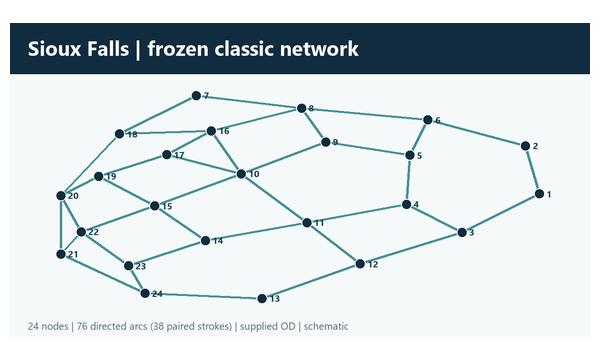

# Mobility Computation Lab

**An open research and learning environment for city networks, travel demand, and reproducible network computation.**

I am [Hao Zheng](https://scholarhaozheng.github.io/), a recent M.S. graduate from Tsinghua University working on transportation network modeling and optimization. I developed Mobility Computation Lab through research collaboration with Professor Xuesong Zhou.

The repository uses the [General Modeling Network Specification (GMNS)](https://github.com/zephyr-data-specs/GMNS) as its portable network and data contract. Selected static traffic-assignment experiments build on [TAPLab: An Open Laboratory for Reproducible Traffic Assignment Experiments](https://github.com/asu-trans-ai-lab/TAPLab) and the official [tap-b Algorithm B](https://github.com/spartalab/tap-b), with upstream software, methods, and datasets attributed explicitly.

My work in this repository is to assemble and adapt the Boston, Sioux Falls, and Hong Kong cases; connect city data and four-stage demand models to documented network computations; implement and evaluate project-specific adapters, workflows, and experiments; and make each result traceable to its actual instance, units, assumptions, and evidence.

[My contributions and upstream foundations](docs/contributions.md) · [Full technical walkthrough](docs/full-walkthrough.md) · [Start with a saved example](docs/getting-started.md) · [Source and citation](docs/citation.md)

<a id="what-this-project-adds"></a>
## 01 / What this project adds

### City-to-model representations

The project links roads, hierarchical zones, population and activity inputs, transit services, and supported observations to explicit demand and network models. Its adapters preserve identifiers, units, access semantics, and physical-link mappings across the documented city cases. [Implementation and source map](docs/contributions.md#city-to-model-representations).

### Computational implementations and diagnostics

The repository brings together path-based and compressed static-assignment experiments with finite time-expanded CG, Lagrangian, and ADMM implementations. Project-specific work includes feasibility restoration, pricing and degeneracy handling, local-subproblem scaling, and reconstruction in the original flow space. [Methods and evidence](docs/contributions.md#computational-implementations-and-diagnostics).

### Reusable cross-city computational tools

The project packages shared data interfaces, case configurations, and analysis tools into an open-source environment for Boston, Sioux Falls, and Hong Kong. Documented examples connect zonal demand, generated paths, and physical-link results, allowing researchers to reuse the supported workflows and compare demand scales, network representations, and solution methods. [Tools, attribution and demonstrated scope](docs/contributions.md#reusable-cross-city-computational-tools).

<a id="framework"></a>
## 02 / Complete project structure

[](https://scholarhaozheng.github.io/mobility-network-lab/assets/project_structure_r3/project_structure.svg)

*A selective module map, not one command or a required sequence through every lane.* Open the [clickable SVG](https://scholarhaozheng.github.io/mobility-network-lab/assets/project_structure_r3/project_structure.svg) to follow each card to its documentation. [PNG](docs/assets/project_structure_r3/project_structure.png) · [Accessible module and source table](docs/architecture.md).

<a id="gmns-in-action"></a><a id="four-step-workflow"></a>
GMNS keeps directed physical roads, hierarchical zones, centroids, nonphysical access and source IDs distinct. Population, household and activity preparation precedes **01 trip generation → 02 trip distribution → 03 mode choice → 04 traffic assignment** where those stages are supported; declared vehicle OD can instead enter assignment directly. GPS traces and map matching, service records and detector context require explicit quality and network-association rules, not an automatic observed-OD or calibrated-demand pipeline. [GMNS exchange](docs/datasets/boston-gmns-exchange.md) · [Four-stage city workflow](docs/city-workflow.md) · [Observation example](docs/datasets/boston-behavior-feedback.md).

Static **BPR/Beckmann** assignment and finite **fixed-cost, hard-capacity time-expanded** optimization are separate mathematical branches. The latter is not an automatically calibrated dynamic version of the former. [Architecture](docs/architecture.md) · [Data contract](docs/data-contract.md).

<a id="coverage"></a>
## 03 / Case coverage and selected evidence

Each row uses one evidence graphic type and one 600 × 360 source canvas across the three cities. Local scales, instance scope and missing stages remain explicit; static BPR/Beckmann and fixed-cost hard-capacity computations are separate branches. [Complete statistics](docs/capabilities.md#comparable-statistics).

### A / City data and model foundations

<table class="home-coverage" data-component="01">
<thead><tr><th colspan="3" scope="colgroup">Source data and preparation</th></tr>
<tr><th scope="col" width="33%">Boston</th><th scope="col" width="33%">Sioux Falls</th><th scope="col" width="33%">Hong Kong</th></tr></thead><tbody>
<tr class="coverage-scope"><td valign="top">GMNS Plus, ACS/GTFS and registered source preparation.</td><td valign="top">Frozen classic 24-node/76-link source graph and supplied vehicle OD.</td><td valign="top">Official-derived bounded network and source layers.</td></tr>
<tr class="coverage-preview"><td align="center"><a href="docs/cases/boston.md#gmns-zones-and-source-evidence"></a></td><td align="center"><a href="docs/cases/sioux-falls.md#gmns-zones-and-source-evidence"></a></td><td align="center"><a href="docs/cases/hong-kong.md#gmns-zones-and-source-evidence"></a></td></tr>
<tr class="coverage-caption"><td><small>minimal base-network source map</small></td><td><small>minimal base-network source map</small></td><td><small>minimal base-network source map</small></td></tr>
<tr class="coverage-links">
<td width="33%"><sub><a href="docs/cases/boston.md#gmns-zones-and-source-evidence">Evidence</a> · <a href="docs/assets/homepage_evidence_r2/row_01_boston.png">Full preview</a> · <a href="examples/boston/gmns_exchange_r1/data/link.csv">Source record</a></sub></td>
<td width="33%"><sub><a href="docs/cases/sioux-falls.md#gmns-zones-and-source-evidence">Evidence</a> · <a href="docs/assets/homepage_evidence_r2/row_01_sioux_falls.png">Full preview</a> · <a href="examples/sioux-falls/native_l3_r1/inputs_snapshot/SiouxFalls/link.csv">Source record</a></sub></td>
<td width="33%"><sub><a href="docs/cases/hong-kong.md#gmns-zones-and-source-evidence">Evidence</a> · <a href="docs/assets/homepage_evidence_r2/row_01_hong_kong.png">Full preview</a> · <a href="examples/hong-kong/gmns_pilot_r1/instance/link.csv">Source record</a></sub></td>
</tr></tbody></table>

<table class="home-coverage" data-component="02">
<thead><tr><th colspan="3" scope="colgroup">GMNS network, zones and access</th></tr>
<tr><th scope="col" width="33%">Boston</th><th scope="col" width="33%">Sioux Falls</th><th scope="col" width="33%">Hong Kong</th></tr></thead><tbody>
<tr class="coverage-scope"><td valign="top">5,091 physical links; 177 H3 fine zones, nine parents; connectors separate.</td><td valign="top">24-node, 76-link supplied directed benchmark; schematic topology, no city zone hierarchy.</td><td valign="top">780 physical nodes, 1,239 links; 95 fine zones, ten parents and turn-aware access.</td></tr>
<tr class="coverage-preview"><td align="center"><a href="docs/cases/boston.md#gmns-zones-and-source-evidence"></a></td><td align="center"><a href="docs/cases/sioux-falls.md#gmns-zones-and-source-evidence"></a></td><td align="center"><a href="docs/datasets/hong-kong-gmns.md"></a></td></tr>
<tr class="coverage-caption"><td><small>GMNS object-relation map</small></td><td><small>GMNS object-relation map</small></td><td><small>GMNS object-relation map</small></td></tr>
<tr class="coverage-links">
<td width="33%"><sub><a href="docs/cases/boston.md#gmns-zones-and-source-evidence">Evidence</a> · <a href="docs/assets/homepage_evidence_r2/row_02_boston.png">Full preview</a> · <a href="examples/boston/gmns_exchange_r1/data/link.csv">Source record</a></sub></td>
<td width="33%"><sub><a href="docs/cases/sioux-falls.md#gmns-zones-and-source-evidence">Evidence</a> · <a href="docs/assets/homepage_alignment_r3/sioux_gmns_directed_objects.png">Full preview</a> · <a href="examples/sioux-falls/native_l3_r1/inputs_snapshot/SiouxFalls/link.csv">Source record</a></sub></td>
<td width="33%"><sub><a href="docs/datasets/hong-kong-gmns.md">Evidence</a> · <a href="docs/assets/homepage_evidence_r2/row_02_hong_kong.png">Full preview</a> · <a href="examples/hong-kong/gmns_pilot_r1/instance/link.csv">Source record</a></sub></td>
</tr></tbody></table>

<table class="home-coverage" data-component="03">
<thead><tr><th colspan="3" scope="colgroup">Population, households and activity</th></tr>
<tr><th scope="col" width="33%">Boston</th><th scope="col" width="33%">Sioux Falls</th><th scope="col" width="33%">Hong Kong</th></tr></thead><tbody>
<tr class="coverage-scope"><td valign="top">ACS 2024 five-year block groups allocated to 177 clipped H3 zones.</td><td valign="top">Supplied OD; no demographic city compiler.</td><td valign="top">2021 census households/population and explicitly modeled building activity proxies.</td></tr>
<tr class="coverage-preview"><td align="center"><a href="docs/datasets/boston-population-households.md"></a></td><td align="center"><a href="docs/cases/sioux-falls.md#demand-transit-and-observations"></a></td><td align="center"><a href="docs/cases/hong-kong-four-stage.md"></a></td></tr>
<tr class="coverage-caption"><td><small>three-panel zone small multiple</small></td><td><small>three-panel zone small multiple</small></td><td><small>three-panel zone small multiple</small></td></tr>
<tr class="coverage-links">
<td width="33%"><sub><a href="docs/datasets/boston-population-households.md">Evidence</a> · <a href="docs/assets/homepage_evidence_r2/row_03_boston.png">Full preview</a> · <a href="examples/boston/population_r1/data/population_or_household_by_zone.csv">Source record</a></sub></td>
<td width="33%"><sub><a href="docs/cases/sioux-falls.md#demand-transit-and-observations">Evidence</a> · <a href="docs/assets/homepage_evidence_r2/row_03_sioux_falls.png">Full preview</a></sub></td>
<td width="33%"><sub><a href="docs/cases/hong-kong-four-stage.md">Evidence</a> · <a href="docs/assets/homepage_evidence_r2/row_03_hong_kong.png">Full preview</a> · <a href="docs/assets/hong_kong/full_stack_r5/r2r4_baseline/phase_b/zone_activity_r2.csv">Source record</a></sub></td>
</tr></tbody></table>

### B / Transit and observation evidence

<table class="home-coverage" data-component="04">
<thead><tr><th colspan="3" scope="colgroup">Transit and pedestrian inputs</th></tr>
<tr><th scope="col" width="33%">Boston</th><th scope="col" width="33%">Sioux Falls</th><th scope="col" width="33%">Hong Kong</th></tr></thead><tbody>
<tr class="coverage-scope"><td valign="top">MBTA service and pedestrian access support the bounded demand/feedback example.</td><td valign="top">No GTFS or pedestrian city-input lane.</td><td valign="top">GTFS same-trip rides, fares, headways and pedestrian access enter generalized costs.</td></tr>
<tr class="coverage-preview"><td align="center"><a href="docs/cases/boston.md#demand-transit-and-observations"></a></td><td align="center"><a href="docs/cases/sioux-falls.md#demand-transit-and-observations"></a></td><td align="center"><a href="docs/cases/hong-kong-four-stage.md"></a></td></tr>
<tr class="coverage-caption"><td><small>transit/access overlay map</small></td><td><small>transit/access overlay map</small></td><td><small>transit/access overlay map</small></td></tr>
<tr class="coverage-links">
<td width="33%"><sub><a href="docs/cases/boston.md#demand-transit-and-observations">Evidence</a> · <a href="docs/assets/homepage_evidence_r2/row_04_boston.png">Full preview</a> · <a href="examples/boston/gmns_exchange_r1/data/transit_stop_route_relation.csv">Source record</a></sub></td>
<td width="33%"><sub><a href="docs/cases/sioux-falls.md#demand-transit-and-observations">Evidence</a> · <a href="docs/assets/homepage_evidence_r2/row_04_sioux_falls.png">Full preview</a></sub></td>
<td width="33%"><sub><a href="docs/cases/hong-kong-four-stage.md">Evidence</a> · <a href="docs/assets/homepage_evidence_r2/row_04_hong_kong.png">Full preview</a> · <a href="examples/hong-kong/gmns_pilot_r1/instance/transit_stops.csv">Source record</a></sub></td>
</tr></tbody></table>

<table class="home-coverage" data-component="05">
<thead><tr><th colspan="3" scope="colgroup">GPS, trajectory and detector evidence</th></tr>
<tr><th scope="col" width="33%">Boston</th><th scope="col" width="33%">Sioux Falls</th><th scope="col" width="33%">Hong Kong</th></tr></thead><tbody>
<tr class="coverage-scope"><td valign="top">Exploratory map matching and service feedback; not held-out calibration.</td><td valign="top">No modern GPS or detector observations.</td><td valign="top">Detector and private trajectory association; no held-out validation claim.</td></tr>
<tr class="coverage-preview"><td align="center"><a href="docs/datasets/boston-behavior-feedback.md"></a></td><td align="center"><a href="docs/cases/sioux-falls.md#demand-transit-and-observations"></a></td><td align="center"><a href="docs/cases/hong-kong-four-stage.md"></a></td></tr>
<tr class="coverage-caption"><td><small>observation-to-network relation map</small></td><td><small>observation-to-network relation map</small></td><td><small>observation-to-network relation map</small></td></tr>
<tr class="coverage-links">
<td width="33%"><sub><a href="docs/datasets/boston-behavior-feedback.md">Evidence</a> · <a href="docs/assets/homepage_evidence_r2/row_05_boston.png">Full preview</a> · <a href="examples/boston/gmns_exchange_r1/figure_sample/gps_point_progress.csv">Source record</a></sub></td>
<td width="33%"><sub><a href="docs/cases/sioux-falls.md#demand-transit-and-observations">Evidence</a> · <a href="docs/assets/homepage_evidence_r2/row_05_sioux_falls.png">Full preview</a></sub></td>
<td width="33%"><sub><a href="docs/cases/hong-kong-four-stage.md">Evidence</a> · <a href="docs/assets/homepage_evidence_r2/row_05_hong_kong.png">Full preview</a> · <a href="examples/hong-kong/gmns_pilot_r1/instance/detector_to_link.csv">Source record</a></sub></td>
</tr></tbody></table>

### C / Four-stage travel-demand workflow

<table class="home-coverage" data-component="06">
<thead><tr><th colspan="3" scope="colgroup">01 / Trip generation — productions / attractions</th></tr>
<tr><th scope="col" width="33%">Boston</th><th scope="col" width="33%">Sioux Falls</th><th scope="col" width="33%">Hong Kong</th></tr></thead><tbody>
<tr class="coverage-scope"><td valign="top">Purpose-level productions and attractions in the bounded Boston example.</td><td valign="top">Vehicle OD supplied; no trip-generation run.</td><td valign="top">Transferred rate and declared capture sensitivity, not local calibration.</td></tr>
<tr class="coverage-preview"><td align="center"><a href="docs/cases/boston.md#demand-transit-and-observations"></a></td><td align="center"><a href="docs/cases/sioux-falls.md#demand-transit-and-observations"></a></td><td align="center"><a href="docs/cases/hong-kong-four-stage.md"></a></td></tr>
<tr class="coverage-caption"><td><small>two-panel zone map</small></td><td><small>two-panel zone map</small></td><td><small>two-panel zone map</small></td></tr>
<tr class="coverage-links">
<td width="33%"><sub><a href="docs/cases/boston.md#demand-transit-and-observations">Evidence</a> · <a href="docs/assets/homepage_evidence_r2/row_06_boston.png">Full preview</a> · <a href="docs/assets/boston/four_step_results_r1/data/hbw_midday_matrix.csv">Source record</a></sub></td>
<td width="33%"><sub><a href="docs/cases/sioux-falls.md#demand-transit-and-observations">Evidence</a> · <a href="docs/assets/homepage_evidence_r2/row_06_sioux_falls.png">Full preview</a></sub></td>
<td width="33%"><sub><a href="docs/cases/hong-kong-four-stage.md">Evidence</a> · <a href="docs/assets/homepage_evidence_r2/row_06_hong_kong.png">Full preview</a> · <a href="docs/assets/hong_kong/full_stack_r5/r2r4_baseline/phase_b/production_attraction_r2.csv">Source record</a></sub></td>
</tr></tbody></table>

<table class="home-coverage" data-component="07">
<thead><tr><th colspan="3" scope="colgroup">02 / Trip distribution — zonal OD demand</th></tr>
<tr><th scope="col" width="33%">Boston</th><th scope="col" width="33%">Sioux Falls</th><th scope="col" width="33%">Hong Kong</th></tr></thead><tbody>
<tr class="coverage-scope"><td valign="top">Zonal OD construction for the bounded semantic scenario.</td><td valign="top">Supplied OD is input, not a modeled distribution stage.</td><td valign="top">Turn-aware gravity/IPF balances 8,930 reachable directed OD pairs.</td></tr>
<tr class="coverage-preview"><td align="center"><a href="docs/cases/boston.md#demand-transit-and-observations"></a></td><td align="center"><a href="docs/cases/sioux-falls.md#demand-transit-and-observations"></a></td><td align="center"><a href="docs/cases/hong-kong-four-stage.md"></a></td></tr>
<tr class="coverage-caption"><td><small>OD-matrix heatmap</small></td><td><small>OD-matrix heatmap</small></td><td><small>OD-matrix heatmap</small></td></tr>
<tr class="coverage-links">
<td width="33%"><sub><a href="docs/cases/boston.md#demand-transit-and-observations">Evidence</a> · <a href="docs/assets/homepage_evidence_r2/row_07_boston.png">Full preview</a> · <a href="docs/assets/boston/four_step_results_r1/data/hbw_midday_matrix.csv">Source record</a></sub></td>
<td width="33%"><sub><a href="docs/cases/sioux-falls.md#demand-transit-and-observations">Evidence</a> · <a href="docs/assets/homepage_evidence_r2/row_07_sioux_falls.png">Full preview</a></sub></td>
<td width="33%"><sub><a href="docs/cases/hong-kong-four-stage.md">Evidence</a> · <a href="docs/assets/homepage_evidence_r2/row_07_hong_kong.png">Full preview</a> · <a href="docs/assets/hong_kong/full_stack_r5/r2r4_baseline/phase_b/od_person_distribution_r2.csv">Source record</a></sub></td>
</tr></tbody></table>

<table class="home-coverage" data-component="08">
<thead><tr><th colspan="3" scope="colgroup">03 / Mode choice — mode-specific demand</th></tr>
<tr><th scope="col" width="33%">Boston</th><th scope="col" width="33%">Sioux Falls</th><th scope="col" width="33%">Hong Kong</th></tr></thead><tbody>
<tr class="coverage-scope"><td valign="top">S1/S2 service response and conditional absolute choice remain separate.</td><td valign="top">Vehicle OD supplied; no mode-choice run.</td><td valign="top">GTFS/pedestrian generalized cost and declared sensitivity logit.</td></tr>
<tr class="coverage-preview"><td align="center"><a href="docs/cases/boston.md#demand-transit-and-observations"></a></td><td align="center"><a href="docs/cases/sioux-falls.md#demand-transit-and-observations"></a></td><td align="center"><a href="docs/cases/hong-kong-four-stage.md"></a></td></tr>
<tr class="coverage-caption"><td><small>mode-share bar chart</small></td><td><small>mode-share bar chart</small></td><td><small>mode-share bar chart</small></td></tr>
<tr class="coverage-links">
<td width="33%"><sub><a href="docs/cases/boston.md#demand-transit-and-observations">Evidence</a> · <a href="docs/assets/homepage_evidence_r2/row_08_boston.png">Full preview</a> · <a href="docs/assets/boston/four_step_results_r1/data/selected_mode_response.csv">Source record</a></sub></td>
<td width="33%"><sub><a href="docs/cases/sioux-falls.md#demand-transit-and-observations">Evidence</a> · <a href="docs/assets/homepage_evidence_r2/row_08_sioux_falls.png">Full preview</a></sub></td>
<td width="33%"><sub><a href="docs/cases/hong-kong-four-stage.md">Evidence</a> · <a href="docs/assets/homepage_evidence_r2/row_08_hong_kong.png">Full preview</a> · <a href="docs/assets/hong_kong/full_stack_r5/r2r4_baseline/phase_b/mode_demand_by_od.csv">Source record</a></sub></td>
</tr></tbody></table>

<table class="home-coverage" data-component="09">
<thead><tr><th colspan="3" scope="colgroup">04 / Traffic assignment — assigned network flows</th></tr>
<tr><th scope="col" width="33%">Boston</th><th scope="col" width="33%">Sioux Falls</th><th scope="col" width="33%">Hong Kong</th></tr></thead><tbody>
<tr class="coverage-scope"><td valign="top">Static road flow from the bounded demand scenario; methods below.</td><td valign="top">Static network flow from supplied vehicle OD; no upstream four-stage compiler.</td><td valign="top">Modeled one-hour static PCE road flow, not measured traffic.</td></tr>
<tr class="coverage-preview"><td align="center"><a href="docs/cases/boston.md#static-assignment"></a></td><td align="center"><a href="docs/cases/sioux-falls.md#static-assignment"></a></td><td align="center"><a href="docs/cases/hong-kong-static-assignment.md"></a></td></tr>
<tr class="coverage-caption"><td><small>primary static physical-link flow map</small></td><td><small>primary static physical-link flow map</small></td><td><small>primary static physical-link flow map</small></td></tr>
<tr class="coverage-links">
<td width="33%"><sub><a href="docs/cases/boston.md#static-assignment">Evidence</a> · <a href="docs/assets/homepage_evidence_r2/row_09_boston.png">Full preview</a> · <a href="examples/boston/scalable_tool_r1/runs/all/physical_link_flow.csv">Source record</a></sub></td>
<td width="33%"><sub><a href="docs/cases/sioux-falls.md#static-assignment">Evidence</a> · <a href="docs/assets/homepage_evidence_r2/row_09_sioux_falls.png">Full preview</a> · <a href="algorithms/origin_based_algorithm_b/accepted_results/sioux_physical_link_flow.csv">Source record</a></sub></td>
<td width="33%"><sub><a href="docs/cases/hong-kong-static-assignment.md">Evidence</a> · <a href="docs/assets/homepage_evidence_r2/row_09_hong_kong.png">Full preview</a> · <a href="docs/assets/hong_kong/full_stack_r5/r2r4_baseline/phase_b/static_runs/full_algorithm_b/link_flow.csv">Source record</a></sub></td>
</tr></tbody></table>

### D1 / Static assignment · BPR/Beckmann

<table class="home-coverage" data-component="10">
<thead><tr><th colspan="3" scope="colgroup">Frank–Wolfe</th></tr>
<tr><th scope="col" width="33%">Boston</th><th scope="col" width="33%">Sioux Falls</th><th scope="col" width="33%">Hong Kong</th></tr></thead><tbody>
<tr class="coverage-scope"><td valign="top">Expanded Boston FW, up to 17,522 loaded node ODs; separate from 26-OD controls.</td><td valign="top">Classic 528-OD static FW; preview compares ID-matched link flows against Algorithm B.</td><td valign="top">Turn-aware one-hour 723.191 PCE static engineering scenario.</td></tr>
<tr class="coverage-preview"><td align="center"><a href="docs/cases/boston-assignment.md#primary-scale-result-versus-controlled-method-comparison"></a></td><td align="center"><a href="docs/datasets/sioux-static-fw.md"></a></td><td align="center"><a href="docs/cases/hong-kong-static-assignment.md"></a></td></tr>
<tr class="coverage-caption"><td><small>FW physical-link flow map</small></td><td><small>FW physical-link flow map</small></td><td><small>FW physical-link flow map</small></td></tr>
<tr class="coverage-links">
<td width="33%"><sub><a href="docs/cases/boston-assignment.md#primary-scale-result-versus-controlled-method-comparison">Evidence</a> · <a href="docs/assets/homepage_evidence_r2/row_10_boston.png">Full preview</a> · <a href="examples/boston/scalable_tool_r1/runs/all/physical_link_flow.csv">Source record</a></sub></td>
<td width="33%"><sub><a href="docs/datasets/sioux-static-fw.md">Evidence</a> · <a href="docs/assets/homepage_evidence_r2/row_10_sioux_falls.png">Full preview</a> · <a href="docs/assets/algorithm_b_r21/source_panels/sioux_fw_flow.svg">Source record</a></sub></td>
<td width="33%"><sub><a href="docs/cases/hong-kong-static-assignment.md">Evidence</a> · <a href="docs/assets/homepage_evidence_r2/row_10_hong_kong.png">Full preview</a> · <a href="docs/assets/hong_kong/full_stack_r5/r2r4_baseline/figures/hk_static_fw_flow.png">Source record</a></sub></td>
</tr></tbody></table>

<table class="home-coverage" data-component="11">
<thead><tr><th colspan="3" scope="colgroup">Official tap-b Algorithm B</th></tr>
<tr><th scope="col" width="33%">Boston</th><th scope="col" width="33%">Sioux Falls</th><th scope="col" width="33%">Hong Kong</th></tr></thead><tbody>
<tr class="coverage-scope"><td valign="top">B0/B1 numerical transfer via task-local lossless TAPLab-compatible adapter.</td><td valign="top">Official TAPLab registered-adapter parity passes on Sioux Falls.</td><td valign="top">Accepted task-local lossless adapter; not official-adapter parity.</td></tr>
<tr class="coverage-preview"><td align="center"><a href="docs/cases/boston-algorithm-b.md"></a></td><td align="center"><a href="docs/cases/sioux-algorithm-b.md"></a></td><td align="center"><a href="docs/cases/hong-kong-static-assignment.md"></a></td></tr>
<tr class="coverage-caption"><td><small>Algorithm B physical-link flow map</small></td><td><small>Algorithm B physical-link flow map</small></td><td><small>Algorithm B physical-link flow map</small></td></tr>
<tr class="coverage-links">
<td width="33%"><sub><a href="docs/cases/boston-algorithm-b.md">Evidence</a> · <a href="docs/assets/homepage_evidence_r2/row_11_boston.png">Full preview</a> · <a href="algorithms/origin_based_algorithm_b/accepted_results/boston_b1_physical_link_flow.csv">Source record</a></sub></td>
<td width="33%"><sub><a href="docs/cases/sioux-algorithm-b.md">Evidence</a> · <a href="docs/assets/homepage_evidence_r2/row_11_sioux_falls.png">Full preview</a> · <a href="algorithms/origin_based_algorithm_b/accepted_results/sioux_physical_link_flow.csv">Source record</a></sub></td>
<td width="33%"><sub><a href="docs/cases/hong-kong-static-assignment.md">Evidence</a> · <a href="docs/assets/homepage_evidence_r2/row_11_hong_kong.png">Full preview</a> · <a href="docs/assets/hong_kong/full_stack_r5/r2r4_baseline/phase_b/static_runs/full_algorithm_b/link_flow.csv">Source record</a></sub></td>
</tr></tbody></table>

<table class="home-coverage" data-component="12">
<thead><tr><th colspan="3" scope="colgroup">Finite-path reference</th></tr>
<tr><th scope="col" width="33%">Boston</th><th scope="col" width="33%">Sioux Falls</th><th scope="col" width="33%">Hong Kong</th></tr></thead><tbody>
<tr class="coverage-scope"><td valign="top">26 OD, 130-path uncompressed SLSQP reference on ABS_PLANNED.</td><td valign="top">Frozen 2,218-path static representation; numerical profile is not city demand.</td><td valign="top">No accepted finite-path static reference in this case.</td></tr>
<tr class="coverage-preview"><td align="center"><a href="docs/cases/boston-assignment.md#same-instance-saved-result"></a></td><td align="center"><a href="docs/cases/sioux-falls.md#static-assignment"></a></td><td align="center"><a href="docs/cases/hong-kong-static-assignment.md"></a></td></tr>
<tr class="coverage-caption"><td><small>finite-path reconstruction panel</small></td><td><small>finite-path reconstruction panel</small></td><td><small>finite-path reconstruction panel</small></td></tr>
<tr class="coverage-links">
<td width="33%"><sub><a href="docs/cases/boston-assignment.md#same-instance-saved-result">Evidence</a> · <a href="docs/assets/homepage_evidence_r2/row_12_boston.png">Full preview</a> · <a href="examples/boston/assignment_methods_r1/reference/link_flow.csv">Source record</a></sub></td>
<td width="33%"><sub><a href="docs/cases/sioux-falls.md#static-assignment">Evidence</a> · <a href="docs/assets/homepage_evidence_r2/row_12_sioux_falls.png">Full preview</a> · <a href="examples/sioux-falls/native_l3_r1/runs/SiouxFalls/B_BECKMANN/outer_04_link_flows.csv">Source record</a></sub></td>
<td width="33%"><sub><a href="docs/cases/hong-kong-static-assignment.md">Evidence</a> · <a href="docs/assets/homepage_evidence_r2/row_12_hong_kong.png">Full preview</a></sub></td>
</tr></tbody></table>

<table class="home-coverage" data-component="13">
<thead><tr><th colspan="3" scope="colgroup">Native Diagnostic L3 / compression</th></tr>
<tr><th scope="col" width="33%">Boston</th><th scope="col" width="33%">Sioux Falls</th><th scope="col" width="33%">Hong Kong</th></tr></thead><tbody>
<tr class="coverage-scope"><td valign="top">Rank-26/52 native controls on the same 26-OD ABS_PLANNED instance.</td><td valign="top">Rank-50 classic static benchmark candidates, not an empirical speedup.</td><td valign="top">No accepted native L3 result in this case.</td></tr>
<tr class="coverage-preview"><td align="center"><a href="docs/cases/boston-assignment.md#controlled-comparison-board"></a></td><td align="center"><a href="docs/cases/sioux-falls.md#static-assignment"></a></td><td align="center"><a href="docs/cases/hong-kong-static-assignment.md"></a></td></tr>
<tr class="coverage-caption"><td><small>L3 reconstruction/difference panel</small></td><td><small>L3 reconstruction/difference panel</small></td><td><small>L3 reconstruction/difference panel</small></td></tr>
<tr class="coverage-links">
<td width="33%"><sub><a href="docs/cases/boston-assignment.md#controlled-comparison-board">Evidence</a> · <a href="docs/assets/homepage_evidence_r2/row_13_boston.png">Full preview</a> · <a href="examples/boston/assignment_methods_r1/runs/rank26/outer_02_link_flows.csv">Source record</a></sub></td>
<td width="33%"><sub><a href="docs/cases/sioux-falls.md#static-assignment">Evidence</a> · <a href="docs/assets/homepage_evidence_r2/row_13_sioux_falls.png">Full preview</a> · <a href="examples/sioux-falls/native_l3_r1/runs/SiouxFalls/A_REG001/outer_04_link_flows.csv">Source record</a></sub></td>
<td width="33%"><sub><a href="docs/cases/hong-kong-static-assignment.md">Evidence</a> · <a href="docs/assets/homepage_evidence_r2/row_13_hong_kong.png">Full preview</a></sub></td>
</tr></tbody></table>

### D2 / Finite time-expanded · fixed cost, hard capacity

<table class="home-coverage" data-component="14">
<thead><tr><th colspan="3" scope="colgroup">Network construction and generated columns</th></tr>
<tr><th scope="col" width="33%">Boston</th><th scope="col" width="33%">Sioux Falls</th><th scope="col" width="33%">Hong Kong</th></tr></thead><tbody>
<tr class="coverage-scope"><td valign="top">90-node/125-link/10-OD finite graph; saved time-indexed column.</td><td valign="top">Selected 200/250-OD finite graphs; saved time-indexed columns.</td><td valign="top">Approved model-generated HK10 excerpt in the 100-node/111-link/10-OD graph.</td></tr>
<tr class="coverage-preview"><td align="center"><a href="docs/cases/boston-space-time.md#from-the-physical-network-to-the-finite-time-expanded-graph"></a></td><td align="center"><a href="docs/cases/sioux-space-time.md#from-the-physical-network-to-the-finite-time-expanded-graph"></a></td><td align="center"><a href="docs/cases/hong-kong-space-time.md#a-generated-column-as-a-time-indexed-path"></a></td></tr>
<tr class="coverage-caption"><td><small>layered physical-to-time graph preview</small></td><td><small>layered physical-to-time graph preview</small></td><td><small>layered physical-to-time graph preview</small></td></tr>
<tr class="coverage-links">
<td width="33%"><sub><a href="docs/cases/boston-space-time.md#from-the-physical-network-to-the-finite-time-expanded-graph">Evidence</a> · <a href="docs/assets/homepage_evidence_r2/row_14_boston.png">Full preview</a> · <a href="docs/assets/three_city_r2/data/boston_construction_edges.csv">Source record</a></sub></td>
<td width="33%"><sub><a href="docs/cases/sioux-space-time.md#from-the-physical-network-to-the-finite-time-expanded-graph">Evidence</a> · <a href="docs/assets/homepage_evidence_r2/row_14_sioux_falls.png">Full preview</a> · <a href="docs/assets/three_city_r2/data/sioux_construction_edges.csv">Source record</a></sub></td>
<td width="33%"><sub><a href="docs/cases/hong-kong-space-time.md#a-generated-column-as-a-time-indexed-path">Evidence</a> · <a href="docs/assets/homepage_evidence_r2/row_14_hong_kong.png">Full preview</a> · <a href="docs/assets/three_city_r2/data/hong_kong_construction_edges.csv">Source record</a></sub></td>
</tr></tbody></table>

<table class="home-coverage" data-component="15">
<thead><tr><th colspan="3" scope="colgroup">Arc-flow LP reference</th></tr>
<tr><th scope="col" width="33%">Boston</th><th scope="col" width="33%">Sioux Falls</th><th scope="col" width="33%">Hong Kong</th></tr></thead><tbody>
<tr class="coverage-scope"><td valign="top">Own-graph LP reference for the bounded ten-OD fixed-cost instance.</td><td valign="top">Own selected-graph LP references for historical 200/250 ODs.</td><td valign="top">Own-graph LP reference for R5 ten-OD finite case.</td></tr>
<tr class="coverage-preview"><td align="center"><a href="docs/cases/boston-space-time.md#reference-objective-agreement"></a></td><td align="center"><a href="docs/cases/sioux-space-time.md#reference-objective-agreement"></a></td><td align="center"><a href="docs/cases/hong-kong-space-time.md#reference-objective-agreement"></a></td></tr>
<tr class="coverage-caption"><td><small>same-graph LP reference result panel</small></td><td><small>same-graph LP reference result panel</small></td><td><small>same-graph LP reference result panel</small></td></tr>
<tr class="coverage-links">
<td width="33%"><sub><a href="docs/cases/boston-space-time.md#reference-objective-agreement">Evidence</a> · <a href="docs/assets/homepage_evidence_r2/row_15_boston.png">Full preview</a> · <a href="docs/assets/boston/space_time_cg_r4/data/validation_summary.json">Source record</a></sub></td>
<td width="33%"><sub><a href="docs/cases/sioux-space-time.md#reference-objective-agreement">Evidence</a> · <a href="docs/assets/homepage_evidence_r2/row_15_sioux_falls.png">Full preview</a> · <a href="docs/assets/sioux/phase_i_r1/data/200_phase_ii_trace.csv">Source record</a></sub></td>
<td width="33%"><sub><a href="docs/cases/hong-kong-space-time.md#reference-objective-agreement">Evidence</a> · <a href="docs/assets/homepage_evidence_r2/row_15_hong_kong.png">Full preview</a> · <a href="docs/assets/hong_kong/full_stack_r5/cg_run/full_cg_v1_phase_ii_objective_trace.csv">Source record</a></sub></td>
</tr></tbody></table>

<table class="home-coverage" data-component="16">
<thead><tr><th colspan="3" scope="colgroup">Two-phase column generation</th></tr>
<tr><th scope="col" width="33%">Boston</th><th scope="col" width="33%">Sioux Falls</th><th scope="col" width="33%">Hong Kong</th></tr></thead><tbody>
<tr class="coverage-scope"><td valign="top">Phase I/II and independent 10/10 pricing closure.</td><td valign="top">200/250-OD own-LP agreement; independent full-DAG closure not established.</td><td valign="top">Phase I/II, same-graph LP agreement and independent 10/10 closure.</td></tr>
<tr class="coverage-preview"><td align="center"><a href="docs/cases/boston-space-time.md#phase-i-restores-feasibility"></a></td><td align="center"><a href="docs/cases/sioux-space-time.md#phase-i-restores-feasibility"></a></td><td align="center"><a href="docs/cases/hong-kong-space-time.md#phase-i-restores-feasibility"></a></td></tr>
<tr class="coverage-caption"><td><small>Phase I / Phase II / final-check triptych</small></td><td><small>Phase I / Phase II / final-check triptych</small></td><td><small>Phase I / Phase II / final-check triptych</small></td></tr>
<tr class="coverage-links">
<td width="33%"><sub><a href="docs/cases/boston-space-time.md#phase-i-restores-feasibility">Evidence</a> · <a href="docs/assets/homepage_evidence_r2/row_16_boston.png">Full preview</a> · <a href="docs/assets/boston/space_time_cg_r4/data/phase_i_total.csv">Source record</a></sub></td>
<td width="33%"><sub><a href="docs/cases/sioux-space-time.md#phase-i-restores-feasibility">Evidence</a> · <a href="docs/assets/homepage_evidence_r2/row_16_sioux_falls.png">Full preview</a> · <a href="docs/assets/sioux/phase_i_r1/data/200_phase_i_trace.csv">Source record</a></sub></td>
<td width="33%"><sub><a href="docs/cases/hong-kong-space-time.md#phase-i-restores-feasibility">Evidence</a> · <a href="docs/assets/homepage_evidence_r2/row_16_hong_kong.png">Full preview</a> · <a href="docs/assets/hong_kong/full_stack_r5/cg_run/full_cg_v1_phase_i_artificial_flow_trace.csv">Source record</a></sub></td>
</tr></tbody></table>

<table class="home-coverage" data-component="17">
<thead><tr><th colspan="3" scope="colgroup">Lagrangian</th></tr>
<tr><th scope="col" width="33%">Boston</th><th scope="col" width="33%">Sioux Falls</th><th scope="col" width="33%">Hong Kong</th></tr></thead><tbody>
<tr class="coverage-scope"><td valign="top">Feasible primal, but frozen 1% gap gate missed (1.1002%).</td><td valign="top">Selected 200/250-OD feasible recovery and certified bounded gaps.</td><td valign="top">Ten-OD feasible recovery with 0.7444% certified gap.</td></tr>
<tr class="coverage-preview"><td align="center"><a href="docs/cases/boston.md#finite-time-expanded-algorithms"></a></td><td align="center"><a href="docs/methods/distributed-assignment.md"></a></td><td align="center"><a href="docs/cases/hong-kong-space-time.md"></a></td></tr>
<tr class="coverage-caption"><td><small>dual/primal/gap summary</small></td><td><small>dual/primal/gap summary</small></td><td><small>dual/primal/gap summary</small></td></tr>
<tr class="coverage-links">
<td width="33%"><sub><a href="docs/cases/boston.md#finite-time-expanded-algorithms">Evidence</a> · <a href="docs/assets/homepage_evidence_r2/row_17_boston.png">Full preview</a> · <a href="docs/cases/boston.md">Source record</a></sub></td>
<td width="33%"><sub><a href="docs/methods/distributed-assignment.md">Evidence</a> · <a href="docs/assets/homepage_evidence_r2/row_17_sioux_falls.png">Full preview</a> · <a href="docs/methods/distributed-assignment.md">Source record</a></sub></td>
<td width="33%"><sub><a href="docs/cases/hong-kong-space-time.md">Evidence</a> · <a href="docs/assets/homepage_evidence_r2/row_17_hong_kong.png">Full preview</a> · <a href="docs/assets/hong_kong/full_stack_r5/r2r4_baseline/phase_c/lagrangian_run/history.csv">Source record</a></sub></td>
</tr></tbody></table>

<table class="home-coverage" data-component="18">
<thead><tr><th colspan="3" scope="colgroup">ADMM</th></tr>
<tr><th scope="col" width="33%">Boston</th><th scope="col" width="33%">Sioux Falls</th><th scope="col" width="33%">Hong Kong</th></tr></thead><tbody>
<tr class="coverage-scope"><td valign="top">Ten-OD original-space checks; own-LP gap 6.68e-6.</td><td valign="top">Selected 200/250-OD original-space checks; not the full static 528 ODs.</td><td valign="top">Frozen transfer diagnostic; no accepted Hong Kong ADMM objective.</td></tr>
<tr class="coverage-preview"><td align="center"><a href="docs/cases/boston-admm.md"></a></td><td align="center"><a href="docs/cases/sioux-admm.md"></a></td><td align="center"><a href="docs/cases/hong-kong-space-time.md"></a></td></tr>
<tr class="coverage-caption"><td><small>residual/objective/flow summary</small></td><td><small>residual/objective/flow summary</small></td><td><small>residual/objective/flow summary</small></td></tr>
<tr class="coverage-links">
<td width="33%"><sub><a href="docs/cases/boston-admm.md">Evidence</a> · <a href="docs/assets/homepage_evidence_r2/row_18_boston.png">Full preview</a> · <a href="docs/assets/admm_r2/figures/admm_boston_10od_case_sequence.png">Source record</a></sub></td>
<td width="33%"><sub><a href="docs/cases/sioux-admm.md">Evidence</a> · <a href="docs/assets/homepage_evidence_r2/row_18_sioux_falls.png">Full preview</a> · <a href="docs/assets/admm_r2/figures/admm_sioux_200_case_sequence.png">Source record</a></sub></td>
<td width="33%"><sub><a href="docs/cases/hong-kong-space-time.md">Evidence</a> · <a href="docs/assets/homepage_evidence_r2/row_18_hong_kong.png">Full preview</a> · <a href="docs/assets/hong_kong/full_stack_r5/r2r4_baseline/phase_c/admm_run/result.json">Source record</a></sub></td>
</tr></tbody></table>

<a id="cg-experiments"></a><a id="admm-r2"></a><a id="algorithm-b"></a><a id="distributed-assignment"></a>
The [cross-case CG evidence](docs/methods/space-time-cg.md#cg-experiments), [ADMM](docs/methods/admm-space-time.md), [official tap-b Algorithm B method](docs/methods/origin-based-algorithm-b.md) and [adapter distinction](docs/integrations/taplab-tapb.md), and [Lagrangian records](docs/methods/distributed-assignment.md) retain their full figure families. Boston and Hong Kong have independent 10/10 pricing closure on **different** ten-demand graphs; this is not imputed to the historical Sioux runs.
## 04 / Explore the three cases

Each city has a complete stage atlas. The same stage order is used throughout; different data, static and finite instance scales are never combined into a single case size. Covers are navigation assets, not scientific validation.

<a id="boston"></a>
<article class="case-atlas" data-city="boston">
<h3>Boston</h3>
<p>City GMNS, population/demand, MBTA/GPS linkage and separate bounded static and finite computations. <a href="docs/cases/boston.md">Open complete case →</a></p>
<a href="docs/cases/boston.md"></a>
<table class="atlas-quick-facts" width="100%"><colgroup><col width="25%"><col width="25%"><col width="25%"><col width="25%"></colgroup><thead><tr><th width="25%">City/model foundation</th><th width="25%">Static assignment</th><th width="25%">Finite time-expanded</th><th width="25%">Observation/data scope</th></tr></thead>
<tbody><tr><td width="25%">2,852 physical nodes; 5,091 directed links; 177 H3 fine zones</td><td width="25%">B1: 453 ODs / 1,936.238475 PCE in 2 h; expanded FW and 26-OD controls are distinct</td><td width="25%">90 nodes; 125 links; 10 ODs</td><td width="25%">MBTA inputs and exploratory GPS matching; no held-out citywide calibration</td></tr></tbody></table>
<a id="boston-tools"></a>
<p class="atlas-nav"><a href="#boston-sources">Sources and GMNS</a> · <a href="#boston-population">Population, households and activity</a> · <a href="#boston-transit">Transit and observations</a> · <a href="#boston-generation">Trip generation</a> · <a href="#boston-distribution">Trip distribution</a> · <a href="#boston-mode">Mode choice</a> · <a href="#boston-static">Static assignment methods</a> · <a href="#boston-finite">Finite time-expanded computation</a> · <a href="docs/cases/boston.md#reproduction">Tools and reproducibility</a></p>
<section class="atlas-stage" id="boston-sources"><h4>Sources and GMNS</h4>
<table class="atlas-stage-table" data-columns="3" width="75%"><colgroup><col width="33%"><col width="33%"><col width="33%"></colgroup><tbody>
<tr class="atlas-image-row"><td width="33%" align="center"><a href="docs/cases/boston.md#gmns-zones-and-source-evidence"></a></td><td width="33%" align="center"><a href="docs/cases/boston.md#gmns-zones-and-source-evidence"></a></td><td width="33%" align="center"><a href="docs/cases/boston.md#gmns-zones-and-source-evidence"></a></td></tr>
<tr class="atlas-caption-row"><td width="33%"><small><strong>Source data and preparation</strong></small><br><small><small>GMNS Plus, ACS/GTFS and registered source preparation.</small></small></td><td width="33%"><small><strong>GMNS network, zones and access</strong></small><br><small><small>5,091 physical links; 177 H3 fine zones, nine parents; connectors separate.</small></small></td><td width="33%"><small><strong>Special zones and access</strong></small><br><small><small>GMNS · Central Boston</small></small></td></tr>
<tr class="atlas-links-row"><td width="33%"><small><a href="docs/cases/boston.md#gmns-zones-and-source-evidence">Evidence</a> · <a href="docs/assets/homepage_evidence_r2/row_01_boston.png">Figure</a></small></td><td width="33%"><small><a href="docs/cases/boston.md#gmns-zones-and-source-evidence">Evidence</a> · <a href="docs/assets/homepage_evidence_r2/row_02_boston.png">Figure</a></small></td><td width="33%"><small><a href="docs/cases/boston.md#gmns-zones-and-source-evidence">Evidence</a> · <a href="docs/assets/boston/visual_release_r1/boston_network_zones.png">Figure</a></small></td></tr></tbody></table>
</section>
<section class="atlas-stage" id="boston-population"><h4>Population, households and activity</h4>
<table class="atlas-stage-table" data-columns="2" width="50%"><colgroup><col width="50%"><col width="50%"></colgroup><tbody>
<tr class="atlas-image-row"><td width="50%" align="center"><a href="docs/datasets/boston-population-households.md"></a></td><td width="50%" align="center"><a href="docs/datasets/boston-population-households.md"></a></td></tr>
<tr class="atlas-caption-row"><td width="50%"><small><strong>Population, households and activity</strong></small><br><small><small>ACS 2024 five-year block groups allocated to 177 clipped H3 zones.</small></small></td><td width="50%"><small><strong>ACS/H3 allocation</strong></small><br><small><small>Population · ACS 2024 five-year</small></small></td></tr>
<tr class="atlas-links-row"><td width="50%"><small><a href="docs/datasets/boston-population-households.md">Evidence</a> · <a href="docs/assets/homepage_evidence_r2/row_03_boston.png">Figure</a></small></td><td width="50%"><small><a href="docs/datasets/boston-population-households.md">Evidence</a> · <a href="docs/assets/boston/population_r1/population_allocation.png">Figure</a></small></td></tr></tbody></table>
</section>
<section class="atlas-stage" id="boston-transit"><h4>Transit and observations</h4>
<table class="atlas-stage-table" data-columns="3" width="75%"><colgroup><col width="33%"><col width="33%"><col width="33%"></colgroup><tbody>
<tr class="atlas-image-row"><td width="33%" align="center"><a href="docs/cases/boston.md#demand-transit-and-observations"></a></td><td width="33%" align="center"><a href="docs/datasets/boston-behavior-feedback.md"></a></td><td width="33%" align="center"><a href="docs/datasets/boston-behavior-feedback.md"></a></td></tr>
<tr class="atlas-caption-row"><td width="33%"><small><strong>Transit and pedestrian inputs</strong></small><br><small><small>MBTA service and pedestrian access support the bounded demand/feedback example.</small></small></td><td width="33%"><small><strong>GPS, trajectory and detector evidence</strong></small><br><small><small>Exploratory map matching and service feedback; not held-out calibration.</small></small></td><td width="33%"><small><strong>GPS-to-GMNS association</strong></small><br><small><small>GPS linkage · exploratory</small></small></td></tr>
<tr class="atlas-links-row"><td width="33%"><small><a href="docs/cases/boston.md#demand-transit-and-observations">Evidence</a> · <a href="docs/assets/homepage_evidence_r2/row_04_boston.png">Figure</a></small></td><td width="33%"><small><a href="docs/datasets/boston-behavior-feedback.md">Evidence</a> · <a href="docs/assets/homepage_evidence_r2/row_05_boston.png">Figure</a></small></td><td width="33%"><small><a href="docs/datasets/boston-behavior-feedback.md">Evidence</a> · <a href="docs/assets/boston/visual_release_r1/boston_gps_projection.png">Figure</a></small></td></tr></tbody></table>
</section>
<section class="atlas-stage" id="boston-generation"><h4>Trip generation</h4>
<table class="atlas-stage-table" data-columns="2" width="50%"><colgroup><col width="50%"><col width="50%"></colgroup><tbody>
<tr class="atlas-image-row"><td width="50%" align="center"><a href="docs/cases/boston.md#demand-transit-and-observations"></a></td><td width="50%" align="center"><a href="docs/cases/boston.md#stage-01-trip-generation"></a></td></tr>
<tr class="atlas-caption-row"><td width="50%"><small><strong>Trip generation — productions / attractions</strong></small><br><small><small>Purpose-level productions and attractions in the bounded Boston example.</small></small></td><td width="50%"><small><strong>Generation by purpose</strong></small><br><small><small>Trip generation · bounded example</small></small></td></tr>
<tr class="atlas-links-row"><td width="50%"><small><a href="docs/cases/boston.md#demand-transit-and-observations">Evidence</a> · <a href="docs/assets/homepage_evidence_r2/row_06_boston.png">Figure</a></small></td><td width="50%"><small><a href="docs/cases/boston.md#stage-01-trip-generation">Evidence</a> · <a href="docs/assets/boston/four_step_results_r1/step1_generation.png">Figure</a></small></td></tr></tbody></table>
</section>
<section class="atlas-stage" id="boston-distribution"><h4>Trip distribution</h4>
<table class="atlas-stage-table" data-columns="2" width="50%"><colgroup><col width="50%"><col width="50%"></colgroup><tbody>
<tr class="atlas-image-row"><td width="50%" align="center"><a href="docs/cases/boston.md#demand-transit-and-observations"></a></td><td width="50%" align="center"><a href="docs/cases/boston.md#stage-02-trip-distribution"></a></td></tr>
<tr class="atlas-caption-row"><td width="50%"><small><strong>Trip distribution — zonal OD demand</strong></small><br><small><small>Zonal OD construction for the bounded semantic scenario.</small></small></td><td width="50%"><small><strong>HBW OD distribution</strong></small><br><small><small>Trip distribution · bounded example</small></small></td></tr>
<tr class="atlas-links-row"><td width="50%"><small><a href="docs/cases/boston.md#demand-transit-and-observations">Evidence</a> · <a href="docs/assets/homepage_evidence_r2/row_07_boston.png">Figure</a></small></td><td width="50%"><small><a href="docs/cases/boston.md#stage-02-trip-distribution">Evidence</a> · <a href="docs/assets/boston/four_step_results_r1/step2_distribution.png">Figure</a></small></td></tr></tbody></table>
</section>
<section class="atlas-stage" id="boston-mode"><h4>Mode choice</h4>
<table class="atlas-stage-table" data-columns="2" width="50%"><colgroup><col width="50%"><col width="50%"></colgroup><tbody>
<tr class="atlas-image-row"><td width="50%" align="center"><a href="docs/cases/boston.md#demand-transit-and-observations"></a></td><td width="50%" align="center"><a href="docs/cases/boston.md#stage-03-mode-choice"></a></td></tr>
<tr class="atlas-caption-row"><td width="50%"><small><strong>Mode choice — mode-specific demand</strong></small><br><small><small>S1/S2 service response and conditional absolute choice remain separate.</small></small></td><td width="50%"><small><strong>Service-response mode choice</strong></small><br><small><small>Mode choice · S1/S2 sensitivity</small></small></td></tr>
<tr class="atlas-links-row"><td width="50%"><small><a href="docs/cases/boston.md#demand-transit-and-observations">Evidence</a> · <a href="docs/assets/homepage_evidence_r2/row_08_boston.png">Figure</a></small></td><td width="50%"><small><a href="docs/cases/boston.md#stage-03-mode-choice">Evidence</a> · <a href="docs/assets/boston/four_step_results_r1/step3_mode_response.png">Figure</a></small></td></tr></tbody></table>
</section>
<section class="atlas-stage" id="boston-static"><h4>Static assignment methods</h4>
<table class="atlas-stage-table" data-columns="4" width="100%"><colgroup><col width="25%"><col width="25%"><col width="25%"><col width="25%"></colgroup><tbody>
<tr class="atlas-image-row"><td width="25%" align="center"><a href="docs/cases/boston-assignment.md#primary-scale-result-versus-controlled-method-comparison"></a></td><td width="25%" align="center"><a href="docs/cases/boston-algorithm-b.md"></a></td><td width="25%" align="center"><a href="docs/cases/boston-assignment.md#same-instance-saved-result"></a></td><td width="25%" align="center"><a href="docs/cases/boston-assignment.md#controlled-comparison-board"></a></td></tr>
<tr class="atlas-caption-row"><td width="25%"><small><strong>Frank–Wolfe</strong></small><br><small><small>Expanded Boston FW, up to 17,522 loaded node ODs; separate from 26-OD controls.</small></small></td><td width="25%"><small><strong>Official tap-b Algorithm B</strong></small><br><small><small>B0/B1 numerical transfer via task-local lossless TAPLab-compatible adapter.</small></small></td><td width="25%"><small><strong>Finite-path reference</strong></small><br><small><small>26 OD, 130-path uncompressed SLSQP reference on ABS_PLANNED.</small></small></td><td width="25%"><small><strong>Native Diagnostic L3 / compression</strong></small><br><small><small>ABS_PLANNED 26-OD; rank-26 diagnostic</small></small></td></tr>
<tr class="atlas-links-row"><td width="25%"><small><a href="docs/cases/boston-assignment.md#primary-scale-result-versus-controlled-method-comparison">Evidence</a> · <a href="docs/assets/homepage_evidence_r2/row_10_boston.png">Figure</a></small></td><td width="25%"><small><a href="docs/cases/boston-algorithm-b.md">Evidence</a> · <a href="docs/assets/homepage_evidence_r2/row_11_boston.png">Figure</a></small></td><td width="25%"><small><a href="docs/cases/boston-assignment.md#same-instance-saved-result">Evidence</a> · <a href="docs/assets/homepage_evidence_r2/row_12_boston.png">Figure</a></small></td><td width="25%"><small><a href="docs/cases/boston-assignment.md#controlled-comparison-board">Evidence</a> · <a href="docs/assets/boston/assignment_methods_r1/boston_abs_planned_l3_rank26_flow.png">Figure</a></small></td></tr></tbody></table>
</section>
<section class="atlas-stage" id="boston-finite"><h4>Finite time-expanded computation</h4>
<table class="atlas-stage-table" data-columns="4" width="100%"><colgroup><col width="25%"><col width="25%"><col width="25%"><col width="25%"></colgroup><tbody>
<tr class="atlas-image-row"><td width="25%" align="center"><a href="docs/cases/boston-space-time.md#from-the-physical-network-to-the-finite-time-expanded-graph"></a></td><td width="25%" align="center"><a href="docs/cases/boston-space-time.md#reference-objective-agreement"></a></td><td width="25%" align="center"><a href="docs/cases/boston-space-time.md#phase-i-restores-feasibility"></a></td><td width="25%" align="center"><a href="docs/cases/boston.md#finite-time-expanded-algorithms"></a></td></tr>
<tr class="atlas-caption-row"><td width="25%"><small><strong>Network construction and generated columns</strong></small><br><small><small>90-node/125-link/10-OD finite graph; saved time-indexed column.</small></small></td><td width="25%"><small><strong>Arc-flow LP reference</strong></small><br><small><small>Own-graph LP reference for the bounded ten-OD fixed-cost instance.</small></small></td><td width="25%"><small><strong>Two-phase column generation</strong></small><br><small><small>Phase I/II and independent 10/10 pricing closure.</small></small></td><td width="25%"><small><strong>Lagrangian</strong></small><br><small><small>Feasible primal, but frozen 1% gap gate missed (1.1002%).</small></small></td></tr>
<tr class="atlas-links-row"><td width="25%"><small><a href="docs/cases/boston-space-time.md#from-the-physical-network-to-the-finite-time-expanded-graph">Evidence</a> · <a href="docs/assets/homepage_evidence_r2/row_14_boston.png">Figure</a></small></td><td width="25%"><small><a href="docs/cases/boston-space-time.md#reference-objective-agreement">Evidence</a> · <a href="docs/assets/homepage_evidence_r2/row_15_boston.png">Figure</a></small></td><td width="25%"><small><a href="docs/cases/boston-space-time.md#phase-i-restores-feasibility">Evidence</a> · <a href="docs/assets/homepage_evidence_r2/row_16_boston.png">Figure</a></small></td><td width="25%"><small><a href="docs/cases/boston.md#finite-time-expanded-algorithms">Evidence</a> · <a href="docs/assets/homepage_evidence_r2/row_17_boston.png">Figure</a></small></td></tr></tbody></table>
<table class="atlas-stage-table" data-columns="4" width="100%"><colgroup><col width="25%"><col width="25%"><col width="25%"><col width="25%"></colgroup><tbody>
<tr class="atlas-image-row"><td width="25%" align="center"><a href="docs/cases/boston-admm.md"></a></td><td width="25%" align="center"><a href="docs/cases/boston-space-time.md#case-role-scope-and-model-statistics"></a></td><td width="25%" align="center"><a href="docs/cases/boston-space-time.md#from-the-physical-network-to-the-finite-time-expanded-graph"></a></td><td width="25%" align="center"><a href="docs/cases/boston-space-time.md#a-generated-column-as-a-time-indexed-path"></a></td></tr>
<tr class="atlas-caption-row"><td width="25%"><small><strong>ADMM</strong></small><br><small><small>Ten-OD original-space checks; own-LP gap 6.68e-6.</small></small></td><td width="25%"><small><strong>Case-sequence overview</strong></small><br><small><small>CG · 10-OD</small></small></td><td width="25%"><small><strong>Physical to time-expanded graph</strong></small><br><small><small>CG construction · 10-OD</small></small></td><td width="25%"><small><strong>Generated time-indexed column</strong></small><br><small><small>CG column · 10-OD</small></small></td></tr>
<tr class="atlas-links-row"><td width="25%"><small><a href="docs/cases/boston-admm.md">Evidence</a> · <a href="docs/assets/homepage_evidence_r2/row_18_boston.png">Figure</a></small></td><td width="25%"><small><a href="docs/cases/boston-space-time.md#case-role-scope-and-model-statistics">Evidence</a> · <a href="docs/assets/presentation_r5/boston_cg_case_sequence.png">Figure</a></small></td><td width="25%"><small><a href="docs/cases/boston-space-time.md#from-the-physical-network-to-the-finite-time-expanded-graph">Evidence</a> · <a href="docs/assets/cg_layered_companions_r1/boston_layered_space_time_construction.png">Figure</a></small></td><td width="25%"><small><a href="docs/cases/boston-space-time.md#a-generated-column-as-a-time-indexed-path">Evidence</a> · <a href="docs/assets/three_city_r2/boston_generated_column_time_indexed_path.png">Figure</a></small></td></tr></tbody></table>
<table class="atlas-stage-table" data-columns="4" width="100%"><colgroup><col width="25%"><col width="25%"><col width="25%"><col width="25%"></colgroup><tbody>
<tr class="atlas-image-row"><td width="25%" align="center"><a href="docs/cases/boston-space-time.md#phase-i-restores-feasibility"></a></td><td width="25%" align="center"><a href="docs/cases/boston-space-time.md#shared-capacity-couples-different-od-demands"></a></td><td width="25%" align="center"><a href="docs/cases/boston-space-time.md#phase-ii-improves-the-real-path-objective"></a></td><td width="25%" align="center"><a href="docs/cases/boston-space-time.md#from-time-expanded-flows-back-to-final-physical-link-movement-flow"></a></td></tr>
<tr class="atlas-caption-row"><td width="25%"><small><strong>Phase I artificial-flow clearance</strong></small><br><small><small>CG Phase I · 10-OD</small></small></td><td width="25%"><small><strong>Shared-capacity event</strong></small><br><small><small>CG capacity · 10-OD</small></small></td><td width="25%"><small><strong>Phase II objective</strong></small><br><small><small>CG Phase II · 10-OD</small></small></td><td width="25%"><small><strong>Final physical-link movement flow</strong></small><br><small><small>CG flow · 10-OD</small></small></td></tr>
<tr class="atlas-links-row"><td width="25%"><small><a href="docs/cases/boston-space-time.md#phase-i-restores-feasibility">Evidence</a> · <a href="docs/assets/boston/space_time_cg_r4/boston_phase_i_artificial_flow.png">Figure</a></small></td><td width="25%"><small><a href="docs/cases/boston-space-time.md#shared-capacity-couples-different-od-demands">Evidence</a> · <a href="docs/assets/boston/space_time_cg_r4/boston_shared_capacity_event.png">Figure</a></small></td><td width="25%"><small><a href="docs/cases/boston-space-time.md#phase-ii-improves-the-real-path-objective">Evidence</a> · <a href="docs/assets/boston/space_time_cg_r4/boston_phase_ii_objective.png">Figure</a></small></td><td width="25%"><small><a href="docs/cases/boston-space-time.md#from-time-expanded-flows-back-to-final-physical-link-movement-flow">Evidence</a> · <a href="docs/assets/boston/space_time_cg_r4/boston_cg_final_physical_link_flow.png">Figure</a></small></td></tr></tbody></table>
<table class="atlas-stage-table" data-columns="3" width="75%"><colgroup><col width="33%"><col width="33%"><col width="33%"></colgroup><tbody>
<tr class="atlas-image-row"><td width="33%" align="center"><a href="docs/cases/boston-space-time.md#independent-pricing-closure"></a></td><td width="33%" align="center"><a href="docs/cases/boston-admm.md#original-saved-convergence-view"></a></td><td width="33%" align="center"><a href="docs/cases/boston-admm.md#physical-link-movement-flow-and-lp-comparison"></a></td></tr>
<tr class="atlas-caption-row"><td width="33%"><small><strong>Independent pricing closure</strong></small><br><small><small>CG pricing · 10/10</small></small></td><td width="33%"><small><strong>ADMM convergence</strong></small><br><small><small>R2_S 10-OD accepted</small></small></td><td width="33%"><small><strong>ADMM physical flow and LP difference</strong></small><br><small><small>R2_S 10-OD accepted</small></small></td></tr>
<tr class="atlas-links-row"><td width="33%"><small><a href="docs/cases/boston-space-time.md#independent-pricing-closure">Evidence</a> · <a href="docs/assets/boston/space_time_cg_r4/boston_pricing_closure_by_demand.png">Figure</a></small></td><td width="33%"><small><a href="docs/cases/boston-admm.md#original-saved-convergence-view">Evidence</a> · <a href="docs/assets/admm_r2/figures/convergence_Boston_10OD.png">Figure</a></small></td><td width="33%"><small><a href="docs/cases/boston-admm.md#physical-link-movement-flow-and-lp-comparison">Evidence</a> · <a href="docs/assets/admm_r2/figures/admm_boston_10od_minus_lp.png">Figure</a></small></td></tr></tbody></table>
</section>
</article>

<a id="sioux-falls"></a>
<article class="case-atlas" data-city="sioux-falls">
<h3>Sioux Falls</h3>
<p>Supplied-OD controlled static benchmark and separate historical selected-OD finite cases; not a four-stage city compiler. <a href="docs/cases/sioux-falls.md">Open complete case →</a></p>
<a href="docs/cases/sioux-falls.md"></a>
<table class="atlas-quick-facts" width="100%"><colgroup><col width="25%"><col width="25%"><col width="25%"><col width="25%"></colgroup><thead><tr><th width="25%">City/model foundation</th><th width="25%">Static assignment</th><th width="25%">Finite time-expanded</th><th width="25%">Observation/data scope</th></tr></thead>
<tbody><tr><td width="25%">24 nodes; 76 directed links; supplied benchmark OD</td><td width="25%">528 positive OD records; official Algorithm B, historical FW and native controls</td><td width="25%">24 nodes; 64/69 selected links; 200/250 ODs</td><td width="25%">No modern city population, GTFS, GPS or detector stage</td></tr></tbody></table>
<a id="sioux-falls-tools"></a>
<p class="atlas-nav"><a href="#sioux-falls-sources">Sources and GMNS</a> · <a href="#sioux-falls-population">Population, households and activity</a> · <a href="#sioux-falls-transit">Transit and observations</a> · <a href="#sioux-falls-generation">Trip generation</a> · <a href="#sioux-falls-distribution">Trip distribution</a> · <a href="#sioux-falls-mode">Mode choice</a> · <a href="#sioux-falls-static">Static assignment methods</a> · <a href="#sioux-falls-finite">Finite time-expanded computation</a> · <a href="docs/cases/sioux-falls.md#reproduction">Tools and reproducibility</a></p>
<h4>City-data and four-stage scope</h4>
<table class="atlas-benchmark-scope" width="100%"><colgroup><col width="33%"><col width="33%"><col width="33%"></colgroup><thead><tr><th width="33%">Stage</th><th width="33%">Scope in Sioux Falls benchmark</th><th width="33%">Relevant next entry</th></tr></thead><tbody>
<tr><td width="33%"><a id="sioux-falls-population"></a>Population, households and activity</td><td width="33%">Not part of the supplied benchmark</td><td width="33%"><a href="#sioux-falls-static">Static assignment</a></td></tr>
<tr><td width="33%"><a id="sioux-falls-transit"></a>Transit and observations</td><td width="33%">Not part of the supplied benchmark</td><td width="33%"><a href="#sioux-falls-static">Static assignment</a></td></tr>
<tr><td width="33%"><a id="sioux-falls-generation"></a>Trip generation</td><td width="33%">Supplied OD enters downstream methods directly</td><td width="33%"><a href="#sioux-falls-static">Static assignment</a></td></tr>
<tr><td width="33%"><a id="sioux-falls-distribution"></a>Trip distribution</td><td width="33%">Supplied OD enters downstream methods directly</td><td width="33%"><a href="#sioux-falls-static">Static assignment</a></td></tr>
<tr><td width="33%"><a id="sioux-falls-mode"></a>Mode choice</td><td width="33%">Vehicle OD is supplied; no mode-choice run</td><td width="33%"><a href="#sioux-falls-static">Static assignment</a></td></tr>
</tbody></table>
<section class="atlas-stage" id="sioux-falls-sources"><h4>Sources and GMNS</h4>
<table class="atlas-stage-table" data-columns="3" width="75%"><colgroup><col width="33%"><col width="33%"><col width="33%"></colgroup><tbody>
<tr class="atlas-image-row"><td width="33%" align="center"><a href="docs/cases/sioux-falls.md#gmns-zones-and-source-evidence"></a></td><td width="33%" align="center"><a href="docs/cases/sioux-falls.md#gmns-zones-and-source-evidence"></a></td><td width="33%" align="center"><a href="docs/cases/sioux-falls.md#gmns-zones-and-source-evidence"></a></td></tr>
<tr class="atlas-caption-row"><td width="33%"><small><strong>Source data and preparation</strong></small><br><small><small>Frozen classic 24-node/76-link source graph and supplied vehicle OD.</small></small></td><td width="33%"><small><strong>GMNS network, zones and access</strong></small><br><small><small>24-node, 76-link supplied directed benchmark; schematic topology, no city zone hierarchy.</small></small></td><td width="33%"><small><strong>Classic network topology</strong></small><br><small><small>Network · 24-node / 76-link</small></small></td></tr>
<tr class="atlas-links-row"><td width="33%"><small><a href="docs/cases/sioux-falls.md#gmns-zones-and-source-evidence">Evidence</a> · <a href="docs/assets/homepage_evidence_r2/row_01_sioux_falls.png">Figure</a></small></td><td width="33%"><small><a href="docs/cases/sioux-falls.md#gmns-zones-and-source-evidence">Evidence</a> · <a href="docs/assets/homepage_alignment_r3/sioux_gmns_directed_objects.png">Figure</a></small></td><td width="33%"><small><a href="docs/cases/sioux-falls.md#gmns-zones-and-source-evidence">Evidence</a> · <a href="docs/assets/homepage_evidence_r1/sioux_falls_classic_topology.png">Figure</a></small></td></tr></tbody></table>
</section>
<section class="atlas-stage" id="sioux-falls-static"><h4>Static assignment methods</h4>
<table class="atlas-stage-table" data-columns="4" width="100%"><colgroup><col width="25%"><col width="25%"><col width="25%"><col width="25%"></colgroup><tbody>
<tr class="atlas-image-row"><td width="25%" align="center"><a href="docs/datasets/sioux-static-fw.md"></a></td><td width="25%" align="center"><a href="docs/cases/sioux-algorithm-b.md"></a></td><td width="25%" align="center"><a href="docs/cases/sioux-falls.md#static-assignment"></a></td><td width="25%" align="center"><a href="docs/cases/sioux-falls.md#static-assignment"></a></td></tr>
<tr class="atlas-caption-row"><td width="25%"><small><strong>Frank–Wolfe</strong></small><br><small><small>528-OD historical approximate result; saved objective and gap</small></small></td><td width="25%"><small><strong>Official tap-b Algorithm B</strong></small><br><small><small>Official TAPLab registered-adapter parity passes on Sioux Falls.</small></small></td><td width="25%"><small><strong>Finite-path reference</strong></small><br><small><small>Frozen 2,218-path static representation; numerical profile is not city demand.</small></small></td><td width="25%"><small><strong>Native Diagnostic L3 / compression</strong></small><br><small><small>rank-50 diagnostic; not UE</small></small></td></tr>
<tr class="atlas-links-row"><td width="25%"><small><a href="docs/datasets/sioux-static-fw.md">Evidence</a> · <a href="docs/assets/homepage_alignment_r3/sioux_historical_fw_summary.png">Figure</a></small></td><td width="25%"><small><a href="docs/cases/sioux-algorithm-b.md">Evidence</a> · <a href="docs/assets/homepage_evidence_r2/row_11_sioux_falls.png">Figure</a></small></td><td width="25%"><small><a href="docs/cases/sioux-falls.md#static-assignment">Evidence</a> · <a href="docs/assets/homepage_evidence_r2/row_12_sioux_falls.png">Figure</a></small></td><td width="25%"><small><a href="docs/cases/sioux-falls.md#static-assignment">Evidence</a> · <a href="docs/assets/homepage_alignment_r3/sioux_native_l3_rank50_link_flows.png">Figure</a></small></td></tr></tbody></table>
</section>
<section class="atlas-stage" id="sioux-falls-finite"><h4>Finite time-expanded computation</h4>
<table class="atlas-stage-table" data-columns="4" width="100%"><colgroup><col width="25%"><col width="25%"><col width="25%"><col width="25%"></colgroup><tbody>
<tr class="atlas-image-row"><td width="25%" align="center"><a href="docs/cases/sioux-space-time.md#from-the-physical-network-to-the-finite-time-expanded-graph"></a></td><td width="25%" align="center"><a href="docs/cases/sioux-space-time.md#reference-objective-agreement"></a></td><td width="25%" align="center"><a href="docs/cases/sioux-space-time.md#phase-i-restores-feasibility"></a></td><td width="25%" align="center"><a href="docs/methods/distributed-assignment.md"></a></td></tr>
<tr class="atlas-caption-row"><td width="25%"><small><strong>Network construction and generated columns</strong></small><br><small><small>Selected 200/250-OD finite graphs; saved time-indexed columns.</small></small></td><td width="25%"><small><strong>Arc-flow LP reference</strong></small><br><small><small>Own selected-graph LP references for historical 200/250 ODs.</small></small></td><td width="25%"><small><strong>Two-phase column generation</strong></small><br><small><small>200/250-OD own-LP agreement; independent full-DAG closure not established.</small></small></td><td width="25%"><small><strong>Lagrangian</strong></small><br><small><small>Selected 200/250-OD feasible recovery and certified bounded gaps.</small></small></td></tr>
<tr class="atlas-links-row"><td width="25%"><small><a href="docs/cases/sioux-space-time.md#from-the-physical-network-to-the-finite-time-expanded-graph">Evidence</a> · <a href="docs/assets/homepage_evidence_r2/row_14_sioux_falls.png">Figure</a></small></td><td width="25%"><small><a href="docs/cases/sioux-space-time.md#reference-objective-agreement">Evidence</a> · <a href="docs/assets/homepage_evidence_r2/row_15_sioux_falls.png">Figure</a></small></td><td width="25%"><small><a href="docs/cases/sioux-space-time.md#phase-i-restores-feasibility">Evidence</a> · <a href="docs/assets/homepage_evidence_r2/row_16_sioux_falls.png">Figure</a></small></td><td width="25%"><small><a href="docs/methods/distributed-assignment.md">Evidence</a> · <a href="docs/assets/homepage_evidence_r2/row_17_sioux_falls.png">Figure</a></small></td></tr></tbody></table>
<table class="atlas-stage-table" data-columns="4" width="100%"><colgroup><col width="25%"><col width="25%"><col width="25%"><col width="25%"></colgroup><tbody>
<tr class="atlas-image-row"><td width="25%" align="center"><a href="docs/cases/sioux-admm.md"></a></td><td width="25%" align="center"><a href="docs/cases/sioux-space-time.md#case-role-scope-and-model-statistics"></a></td><td width="25%" align="center"><a href="docs/cases/sioux-space-time.md#from-the-physical-network-to-the-finite-time-expanded-graph"></a></td><td width="25%" align="center"><a href="docs/cases/sioux-space-time.md#a-generated-column-as-a-time-indexed-path"></a></td></tr>
<tr class="atlas-caption-row"><td width="25%"><small><strong>ADMM</strong></small><br><small><small>Selected 200/250-OD original-space checks; not the full static 528 ODs.</small></small></td><td width="25%"><small><strong>200/250-OD case overview</strong></small><br><small><small>CG · historical selected ODs</small></small></td><td width="25%"><small><strong>Physical to time-expanded graph</strong></small><br><small><small>CG construction · selected graph</small></small></td><td width="25%"><small><strong>Generated time-indexed column</strong></small><br><small><small>CG column · selected graph</small></small></td></tr>
<tr class="atlas-links-row"><td width="25%"><small><a href="docs/cases/sioux-admm.md">Evidence</a> · <a href="docs/assets/homepage_evidence_r2/row_18_sioux_falls.png">Figure</a></small></td><td width="25%"><small><a href="docs/cases/sioux-space-time.md#case-role-scope-and-model-statistics">Evidence</a> · <a href="docs/assets/presentation_r5/sioux_cg_case_sequence.png">Figure</a></small></td><td width="25%"><small><a href="docs/cases/sioux-space-time.md#from-the-physical-network-to-the-finite-time-expanded-graph">Evidence</a> · <a href="docs/assets/three_city_r2/sioux_physical_to_time_expanded_graph.png">Figure</a></small></td><td width="25%"><small><a href="docs/cases/sioux-space-time.md#a-generated-column-as-a-time-indexed-path">Evidence</a> · <a href="docs/assets/three_city_r2/sioux_generated_column_time_indexed_path.png">Figure</a></small></td></tr></tbody></table>
<table class="atlas-stage-table" data-columns="4" width="100%"><colgroup><col width="25%"><col width="25%"><col width="25%"><col width="25%"></colgroup><tbody>
<tr class="atlas-image-row"><td width="25%" align="center"><a href="docs/cases/sioux-space-time.md#200-od-pairs"></a></td><td width="25%" align="center"><a href="docs/cases/sioux-space-time.md#250-od-pairs"></a></td><td width="25%" align="center"><a href="docs/cases/sioux-space-time.md#recorded-shared-capacity-reallocation-event"></a></td><td width="25%" align="center"><a href="docs/cases/sioux-space-time.md#phase-ii-improves-the-real-path-objective"></a></td></tr>
<tr class="atlas-caption-row"><td width="25%"><small><strong>Phase I 200 OD</strong></small><br><small><small>CG Phase I · 200-OD</small></small></td><td width="25%"><small><strong>Phase I 250 OD</strong></small><br><small><small>CG Phase I · 250-OD</small></small></td><td width="25%"><small><strong>Shared-capacity reallocation</strong></small><br><small><small>CG capacity · 200-OD example</small></small></td><td width="25%"><small><strong>Phase II / own-LP objective</strong></small><br><small><small>CG Phase II · selected 200-OD trace; 250-OD linked</small></small></td></tr>
<tr class="atlas-links-row"><td width="25%"><small><a href="docs/cases/sioux-space-time.md#200-od-pairs">Evidence</a> · <a href="docs/assets/sioux/phase_i_r1/sioux_falls_200od_phase_i_academic.png">Figure</a></small></td><td width="25%"><small><a href="docs/cases/sioux-space-time.md#250-od-pairs">Evidence</a> · <a href="docs/assets/sioux/phase_i_r1/sioux_falls_250od_phase_i_academic.png">Figure</a></small></td><td width="25%"><small><a href="docs/cases/sioux-space-time.md#recorded-shared-capacity-reallocation-event">Evidence</a> · <a href="docs/assets/presentation_r5/sioux_shared_capacity_canonical.png">Figure</a></small></td><td width="25%"><small><a href="docs/cases/sioux-space-time.md#phase-ii-improves-the-real-path-objective">Evidence</a> · <a href="docs/assets/benchmarks/sioux_200od_phase2_objective_trace.png">Figure</a></small></td></tr></tbody></table>
<table class="atlas-stage-table" data-columns="4" width="100%"><colgroup><col width="25%"><col width="25%"><col width="25%"><col width="25%"></colgroup><tbody>
<tr class="atlas-image-row"><td width="25%" align="center"><a href="docs/cases/sioux-space-time.md#from-time-expanded-flows-back-to-final-physical-link-movement-flow"></a></td><td width="25%" align="center"><a href="docs/cases/sioux-space-time.md#from-time-expanded-flows-back-to-final-physical-link-movement-flow"></a></td><td width="25%" align="center"><a href="docs/methods/distributed-assignment.md#lagrangian-capacity-pricing-with-separate-primal-recovery"></a></td><td width="25%" align="center"><a href="docs/cases/sioux-admm.md#original-saved-convergence-views"></a></td></tr>
<tr class="atlas-caption-row"><td width="25%"><small><strong>Final movement flow 200 OD</strong></small><br><small><small>CG flow · 200-OD</small></small></td><td width="25%"><small><strong>Final movement flow 250 OD</strong></small><br><small><small>CG flow · 250-OD</small></small></td><td width="25%"><small><strong>Lagrangian accepted recovery</strong></small><br><small><small>selected 200/250-OD</small></small></td><td width="25%"><small><strong>ADMM 200-OD convergence</strong></small><br><small><small>R2_S 200-OD</small></small></td></tr>
<tr class="atlas-links-row"><td width="25%"><small><a href="docs/cases/sioux-space-time.md#from-time-expanded-flows-back-to-final-physical-link-movement-flow">Evidence</a> · <a href="docs/assets/benchmarks/sioux_200od_final_physical_link_flow.png">Figure</a></small></td><td width="25%"><small><a href="docs/cases/sioux-space-time.md#from-time-expanded-flows-back-to-final-physical-link-movement-flow">Evidence</a> · <a href="docs/assets/benchmarks/sioux_250od_final_physical_link_flow.png">Figure</a></small></td><td width="25%"><small><a href="docs/methods/distributed-assignment.md#lagrangian-capacity-pricing-with-separate-primal-recovery">Evidence</a> · <a href="docs/assets/sioux/distributed_r1/Sioux_200OD_P07.png">Figure</a></small></td><td width="25%"><small><a href="docs/cases/sioux-admm.md#original-saved-convergence-views">Evidence</a> · <a href="docs/assets/admm_r2/figures/convergence_Sioux_200OD.png">Figure</a></small></td></tr></tbody></table>
<table class="atlas-stage-table" data-columns="1" width="25%"><colgroup><col width="100%"></colgroup><tbody>
<tr class="atlas-image-row"><td width="100%" align="center"><a href="docs/cases/sioux-admm.md#physical-link-movement-flow"></a></td></tr>
<tr class="atlas-caption-row"><td width="100%"><small><strong>ADMM 250-OD physical flow</strong></small><br><small><small>R2_S 250-OD</small></small></td></tr>
<tr class="atlas-links-row"><td width="100%"><small><a href="docs/cases/sioux-admm.md#physical-link-movement-flow">Evidence</a> · <a href="docs/assets/admm_r2/figures/admm_sioux_250_final_physical_link_flow.png">Figure</a></small></td></tr></tbody></table>
</section>
</article>

<a id="hong-kong"></a>
<article class="case-atlas" data-city="hong-kong">
<h3>Hong Kong</h3>
<p>Bounded turn-aware GMNS and four-stage engineering scenario with separate ten-OD finite CG evidence. <a href="docs/cases/hong-kong.md">Open complete case →</a></p>
<a href="docs/cases/hong-kong.md"></a>
<table class="atlas-quick-facts" width="100%"><colgroup><col width="25%"><col width="25%"><col width="25%"><col width="25%"></colgroup><thead><tr><th width="25%">City/model foundation</th><th width="25%">Static assignment</th><th width="25%">Finite time-expanded</th><th width="25%">Observation/data scope</th></tr></thead>
<tbody><tr><td width="25%">780 physical nodes; 1,239 directed links; 95 fine zones</td><td width="25%">8,930 OD pairs; 723.191 modeled PCE in 1 h</td><td width="25%">100 selected nodes; 111 links; 10 ODs; approved HK10 generated column</td><td width="25%">Detector/trajectory association is contextual; modeled flow is not observed traffic</td></tr></tbody></table>
<a id="hong-kong-tools"></a>
<p class="atlas-nav"><a href="#hong-kong-sources">Sources and GMNS</a> · <a href="#hong-kong-population">Population, households and activity</a> · <a href="#hong-kong-transit">Transit and observations</a> · <a href="#hong-kong-generation">Trip generation</a> · <a href="#hong-kong-distribution">Trip distribution</a> · <a href="#hong-kong-mode">Mode choice</a> · <a href="#hong-kong-static">Static assignment methods</a> · <a href="#hong-kong-finite">Finite time-expanded computation</a> · <a href="docs/cases/hong-kong.md#reproduction">Tools and reproducibility</a></p>
<section class="atlas-stage" id="hong-kong-sources"><h4>Sources and GMNS</h4>
<table class="atlas-stage-table" data-columns="3" width="75%"><colgroup><col width="33%"><col width="33%"><col width="33%"></colgroup><tbody>
<tr class="atlas-image-row"><td width="33%" align="center"><a href="docs/cases/hong-kong.md#gmns-zones-and-source-evidence"></a></td><td width="33%" align="center"><a href="docs/datasets/hong-kong-gmns.md"></a></td><td width="33%" align="center"><a href="docs/cases/hong-kong.md#gmns-zones-and-source-evidence"></a></td></tr>
<tr class="atlas-caption-row"><td width="33%"><small><strong>Source data and preparation</strong></small><br><small><small>Official-derived bounded network and source layers.</small></small></td><td width="33%"><small><strong>GMNS network, zones and access</strong></small><br><small><small>780 physical nodes, 1,239 links; 95 fine zones, ten parents and turn-aware access.</small></small></td><td width="33%"><small><strong>Roads, zones and turns</strong></small><br><small><small>GMNS · 780 nodes / 1,239 links</small></small></td></tr>
<tr class="atlas-links-row"><td width="33%"><small><a href="docs/cases/hong-kong.md#gmns-zones-and-source-evidence">Evidence</a> · <a href="docs/assets/homepage_evidence_r2/row_01_hong_kong.png">Figure</a></small></td><td width="33%"><small><a href="docs/datasets/hong-kong-gmns.md">Evidence</a> · <a href="docs/assets/homepage_evidence_r2/row_02_hong_kong.png">Figure</a></small></td><td width="33%"><small><a href="docs/cases/hong-kong.md#gmns-zones-and-source-evidence">Evidence</a> · <a href="docs/assets/hong_kong/full_stack_r5/r2r4_baseline/figures/hk_assignment_ready_network.png">Figure</a></small></td></tr></tbody></table>
</section>
<section class="atlas-stage" id="hong-kong-population"><h4>Population, households and activity</h4>
<table class="atlas-stage-table" data-columns="2" width="50%"><colgroup><col width="50%"><col width="50%"></colgroup><tbody>
<tr class="atlas-image-row"><td width="50%" align="center"><a href="docs/cases/hong-kong-four-stage.md"></a></td><td width="50%" align="center"><a href="docs/cases/hong-kong-four-stage.md"></a></td></tr>
<tr class="atlas-caption-row"><td width="50%"><small><strong>Population, households and activity</strong></small><br><small><small>2021 census households/population and explicitly modeled building activity proxies.</small></small></td><td width="50%"><small><strong>2021 census allocation and activity proxy</strong></small><br><small><small>Population/proxy · not observed employment</small></small></td></tr>
<tr class="atlas-links-row"><td width="50%"><small><a href="docs/cases/hong-kong-four-stage.md">Evidence</a> · <a href="docs/assets/homepage_evidence_r2/row_03_hong_kong.png">Figure</a></small></td><td width="50%"><small><a href="docs/cases/hong-kong-four-stage.md">Evidence</a> · <a href="docs/assets/hong_kong/full_stack_r5/r2r4_baseline/figures/hk_population_households_activity.png">Figure</a></small></td></tr></tbody></table>
</section>
<section class="atlas-stage" id="hong-kong-transit"><h4>Transit and observations</h4>
<table class="atlas-stage-table" data-columns="3" width="75%"><colgroup><col width="33%"><col width="33%"><col width="33%"></colgroup><tbody>
<tr class="atlas-image-row"><td width="33%" align="center"><a href="docs/cases/hong-kong-four-stage.md"></a></td><td width="33%" align="center"><a href="docs/cases/hong-kong-four-stage.md"></a></td><td width="33%" align="center"><a href="docs/cases/hong-kong.md#demand-transit-and-observations"></a></td></tr>
<tr class="atlas-caption-row"><td width="33%"><small><strong>Transit and pedestrian inputs</strong></small><br><small><small>GTFS same-trip rides, fares, headways and pedestrian access enter generalized costs.</small></small></td><td width="33%"><small><strong>GPS, trajectory and detector evidence</strong></small><br><small><small>Detector and private trajectory association; no held-out validation claim.</small></small></td><td width="33%"><small><strong>Detector/trajectory association</strong></small><br><small><small>Observation linkage · not held-out validation</small></small></td></tr>
<tr class="atlas-links-row"><td width="33%"><small><a href="docs/cases/hong-kong-four-stage.md">Evidence</a> · <a href="docs/assets/homepage_evidence_r2/row_04_hong_kong.png">Figure</a></small></td><td width="33%"><small><a href="docs/cases/hong-kong-four-stage.md">Evidence</a> · <a href="docs/assets/homepage_evidence_r2/row_05_hong_kong.png">Figure</a></small></td><td width="33%"><small><a href="docs/cases/hong-kong.md#demand-transit-and-observations">Evidence</a> · <a href="docs/assets/hong_kong/full_stack_r5/r2r4_baseline/figures/hk_detector_and_trajectory_evidence.png">Figure</a></small></td></tr></tbody></table>
</section>
<section class="atlas-stage" id="hong-kong-generation"><h4>Trip generation</h4>
<table class="atlas-stage-table" data-columns="2" width="50%"><colgroup><col width="50%"><col width="50%"></colgroup><tbody>
<tr class="atlas-image-row"><td width="50%" align="center"><a href="docs/cases/hong-kong-four-stage.md"></a></td><td width="50%" align="center"><a href="docs/cases/hong-kong-four-stage.md"></a></td></tr>
<tr class="atlas-caption-row"><td width="50%"><small><strong>Trip generation — productions / attractions</strong></small><br><small><small>Transferred rate and declared capture sensitivity, not local calibration.</small></small></td><td width="50%"><small><strong>Production/attraction scenario</strong></small><br><small><small>Trip generation · engineering scenario</small></small></td></tr>
<tr class="atlas-links-row"><td width="50%"><small><a href="docs/cases/hong-kong-four-stage.md">Evidence</a> · <a href="docs/assets/homepage_evidence_r2/row_06_hong_kong.png">Figure</a></small></td><td width="50%"><small><a href="docs/cases/hong-kong-four-stage.md">Evidence</a> · <a href="docs/assets/hong_kong/full_stack_r5/r2r4_baseline/figures/hk_trip_generation_distribution.png">Figure</a></small></td></tr></tbody></table>
</section>
<section class="atlas-stage" id="hong-kong-distribution"><h4>Trip distribution</h4>
<table class="atlas-stage-table" data-columns="1" width="25%"><colgroup><col width="100%"></colgroup><tbody>
<tr class="atlas-image-row"><td width="100%" align="center"><a href="docs/cases/hong-kong-four-stage.md"></a></td></tr>
<tr class="atlas-caption-row"><td width="100%"><small><strong>Trip distribution — zonal OD demand</strong></small><br><small><small>Turn-aware gravity/IPF balances 8,930 reachable directed OD pairs.</small></small></td></tr>
<tr class="atlas-links-row"><td width="100%"><small><a href="docs/cases/hong-kong-four-stage.md">Evidence</a> · <a href="docs/assets/homepage_evidence_r2/row_07_hong_kong.png">Figure</a></small></td></tr></tbody></table>
</section>
<section class="atlas-stage" id="hong-kong-mode"><h4>Mode choice</h4>
<table class="atlas-stage-table" data-columns="2" width="50%"><colgroup><col width="50%"><col width="50%"></colgroup><tbody>
<tr class="atlas-image-row"><td width="50%" align="center"><a href="docs/cases/hong-kong-four-stage.md"></a></td><td width="50%" align="center"><a href="docs/cases/hong-kong-four-stage.md"></a></td></tr>
<tr class="atlas-caption-row"><td width="50%"><small><strong>Mode choice — mode-specific demand</strong></small><br><small><small>GTFS/pedestrian generalized cost and declared sensitivity logit.</small></small></td><td width="50%"><small><strong>Mode costs and shares</strong></small><br><small><small>Mode choice · one-hour AM</small></small></td></tr>
<tr class="atlas-links-row"><td width="50%"><small><a href="docs/cases/hong-kong-four-stage.md">Evidence</a> · <a href="docs/assets/homepage_evidence_r2/row_08_hong_kong.png">Figure</a></small></td><td width="50%"><small><a href="docs/cases/hong-kong-four-stage.md">Evidence</a> · <a href="docs/assets/hong_kong/full_stack_r5/r2r4_baseline/figures/hk_mode_choice_costs_and_shares.png">Figure</a></small></td></tr></tbody></table>
</section>
<section class="atlas-stage" id="hong-kong-static"><h4>Static assignment methods</h4>
<table class="atlas-stage-table" data-columns="2" width="50%"><colgroup><col width="50%"><col width="50%"></colgroup><tbody>
<tr class="atlas-image-row"><td width="50%" align="center"><a href="docs/cases/hong-kong-static-assignment.md"></a></td><td width="50%" align="center"><a href="docs/cases/hong-kong-static-assignment.md"></a></td></tr>
<tr class="atlas-caption-row"><td width="50%"><small><strong>Frank–Wolfe</strong></small><br><small><small>Turn-aware one-hour 723.191 PCE static engineering scenario.</small></small></td><td width="50%"><small><strong>Official tap-b Algorithm B</strong></small><br><small><small>Accepted task-local lossless adapter; not official-adapter parity.</small></small></td></tr>
<tr class="atlas-links-row"><td width="50%"><small><a href="docs/cases/hong-kong-static-assignment.md">Evidence</a> · <a href="docs/assets/homepage_evidence_r2/row_10_hong_kong.png">Figure</a></small></td><td width="50%"><small><a href="docs/cases/hong-kong-static-assignment.md">Evidence</a> · <a href="docs/assets/homepage_evidence_r2/row_11_hong_kong.png">Figure</a></small></td></tr></tbody></table>
</section>
<a id="hong-kong-cg-r5"></a>
<section class="atlas-stage" id="hong-kong-finite"><h4>Finite time-expanded computation</h4>
<table class="atlas-stage-table" data-columns="4" width="100%"><colgroup><col width="25%"><col width="25%"><col width="25%"><col width="25%"></colgroup><tbody>
<tr class="atlas-image-row"><td width="25%" align="center"><a href="docs/cases/hong-kong-space-time.md#a-generated-column-as-a-time-indexed-path"></a></td><td width="25%" align="center"><a href="docs/cases/hong-kong-space-time.md#reference-objective-agreement"></a></td><td width="25%" align="center"><a href="docs/cases/hong-kong-space-time.md#phase-i-restores-feasibility"></a></td><td width="25%" align="center"><a href="docs/cases/hong-kong-space-time.md"></a></td></tr>
<tr class="atlas-caption-row"><td width="25%"><small><strong>Network construction and generated columns</strong></small><br><small><small>Approved model-generated HK10 excerpt in the 100-node/111-link/10-OD graph.</small></small></td><td width="25%"><small><strong>Arc-flow LP reference</strong></small><br><small><small>Own-graph LP reference for R5 ten-OD finite case.</small></small></td><td width="25%"><small><strong>Two-phase column generation</strong></small><br><small><small>Phase I/II, same-graph LP agreement and independent 10/10 closure.</small></small></td><td width="25%"><small><strong>Lagrangian</strong></small><br><small><small>Ten-OD feasible recovery with 0.7444% certified gap.</small></small></td></tr>
<tr class="atlas-links-row"><td width="25%"><small><a href="docs/cases/hong-kong-space-time.md#a-generated-column-as-a-time-indexed-path">Evidence</a> · <a href="docs/assets/homepage_evidence_r2/row_14_hong_kong.png">Figure</a></small></td><td width="25%"><small><a href="docs/cases/hong-kong-space-time.md#reference-objective-agreement">Evidence</a> · <a href="docs/assets/homepage_evidence_r2/row_15_hong_kong.png">Figure</a></small></td><td width="25%"><small><a href="docs/cases/hong-kong-space-time.md#phase-i-restores-feasibility">Evidence</a> · <a href="docs/assets/homepage_evidence_r2/row_16_hong_kong.png">Figure</a></small></td><td width="25%"><small><a href="docs/cases/hong-kong-space-time.md">Evidence</a> · <a href="docs/assets/homepage_evidence_r2/row_17_hong_kong.png">Figure</a></small></td></tr></tbody></table>
<table class="atlas-stage-table" data-columns="4" width="100%"><colgroup><col width="25%"><col width="25%"><col width="25%"><col width="25%"></colgroup><tbody>
<tr class="atlas-image-row"><td width="25%" align="center"><a href="docs/cases/hong-kong-space-time.md"></a></td><td width="25%" align="center"><a href="docs/cases/hong-kong-space-time.md#case-role-scope-and-model-statistics"></a></td><td width="25%" align="center"><a href="docs/cases/hong-kong-space-time.md#from-the-physical-network-to-the-finite-time-expanded-graph"></a></td><td width="25%" align="center"><a href="docs/cases/hong-kong-space-time.md#a-generated-column-as-a-time-indexed-path"></a></td></tr>
<tr class="atlas-caption-row"><td width="25%"><small><strong>ADMM</strong></small><br><small><small>Frozen transfer diagnostic; no accepted Hong Kong ADMM objective.</small></small></td><td width="25%"><small><strong>Bounded case overview</strong></small><br><small><small>CG · R5 10-OD</small></small></td><td width="25%"><small><strong>Physical to time-indexed movement</strong></small><br><small><small>CG construction · R5 10-OD</small></small></td><td width="25%"><small><strong>Approved HK10 77-arc column</strong></small><br><small><small>CG column · model-generated; approved exact excerpt</small></small></td></tr>
<tr class="atlas-links-row"><td width="25%"><small><a href="docs/cases/hong-kong-space-time.md">Evidence</a> · <a href="docs/assets/homepage_evidence_r2/row_18_hong_kong.png">Figure</a></small></td><td width="25%"><small><a href="docs/cases/hong-kong-space-time.md#case-role-scope-and-model-statistics">Evidence</a> · <a href="docs/assets/hong_kong/full_stack_r5/figures/hk_cg_case_sequence.png">Figure</a></small></td><td width="25%"><small><a href="docs/cases/hong-kong-space-time.md#from-the-physical-network-to-the-finite-time-expanded-graph">Evidence</a> · <a href="docs/assets/cg_layered_companions_r1/hong_kong_layered_space_time_construction.png">Figure</a></small></td><td width="25%"><small><a href="docs/cases/hong-kong-space-time.md#a-generated-column-as-a-time-indexed-path">Evidence</a> · <a href="docs/assets/three_city_r2/hong_kong_generated_column_time_indexed_path.png">Figure</a></small></td></tr></tbody></table>
<table class="atlas-stage-table" data-columns="4" width="100%"><colgroup><col width="25%"><col width="25%"><col width="25%"><col width="25%"></colgroup><tbody>
<tr class="atlas-image-row"><td width="25%" align="center"><a href="docs/cases/hong-kong-space-time.md#phase-i-restores-feasibility"></a></td><td width="25%" align="center"><a href="docs/cases/hong-kong-space-time.md#phase-ii-improves-the-real-path-objective"></a></td><td width="25%" align="center"><a href="docs/cases/hong-kong-space-time.md#from-time-expanded-flows-back-to-final-physical-link-movement-flow"></a></td><td width="25%" align="center"><a href="docs/cases/hong-kong-space-time.md#independent-pricing-closure"></a></td></tr>
<tr class="atlas-caption-row"><td width="25%"><small><strong>Phase I artificial flow</strong></small><br><small><small>CG Phase I · R5 10-OD</small></small></td><td width="25%"><small><strong>Phase II objective</strong></small><br><small><small>CG Phase II · R5 10-OD</small></small></td><td width="25%"><small><strong>Final physical-link movement flow</strong></small><br><small><small>CG flow · R5 10-OD</small></small></td><td width="25%"><small><strong>Independent 10/10 pricing closure</strong></small><br><small><small>CG pricing · R5 10-OD</small></small></td></tr>
<tr class="atlas-links-row"><td width="25%"><small><a href="docs/cases/hong-kong-space-time.md#phase-i-restores-feasibility">Evidence</a> · <a href="docs/assets/hong_kong/full_stack_r5/figures/hk_cg_phase_i_artificial_flow.png">Figure</a></small></td><td width="25%"><small><a href="docs/cases/hong-kong-space-time.md#phase-ii-improves-the-real-path-objective">Evidence</a> · <a href="docs/assets/hong_kong/full_stack_r5/figures/hk_cg_phase_ii_objective.png">Figure</a></small></td><td width="25%"><small><a href="docs/cases/hong-kong-space-time.md#from-time-expanded-flows-back-to-final-physical-link-movement-flow">Evidence</a> · <a href="docs/assets/hong_kong/full_stack_r5/figures/hk_cg_final_physical_link_movement_flow.png">Figure</a></small></td><td width="25%"><small><a href="docs/cases/hong-kong-space-time.md#independent-pricing-closure">Evidence</a> · <a href="docs/assets/hong_kong/full_stack_r5/figures/hk_cg_pricing_closure.png">Figure</a></small></td></tr></tbody></table>
<table class="atlas-stage-table" data-columns="2" width="50%"><colgroup><col width="50%"><col width="50%"></colgroup><tbody>
<tr class="atlas-image-row"><td width="50%" align="center"><a href="docs/cases/hong-kong-space-time.md#reference-objective-agreement"></a></td><td width="50%" align="center"><a href="docs/cases/hong-kong-space-time.md#reference-objective-agreement"></a></td></tr>
<tr class="atlas-caption-row"><td width="50%"><small><strong>Lagrangian certified gap</strong></small><br><small><small>bounded accepted 0.7444%</small></small></td><td width="50%"><small><strong>ADMM gated diagnostic</strong></small><br><small><small>gated; no accepted objective</small></small></td></tr>
<tr class="atlas-links-row"><td width="50%"><small><a href="docs/cases/hong-kong-space-time.md#reference-objective-agreement">Evidence</a> · <a href="docs/assets/hong_kong/full_stack_r5/r2r4_baseline/figures/hk_lagrangian_dual_primal_gap.png">Figure</a></small></td><td width="50%"><small><a href="docs/cases/hong-kong-space-time.md#reference-objective-agreement">Evidence</a> · <a href="docs/assets/hong_kong/full_stack_r5/r2r4_baseline/figures/hk_admm_residuals_and_feasibility.png">Figure</a></small></td></tr></tbody></table>
</section>
</article>

[All retained scientific figure families](docs/visualizations.md) · [Full technical walkthrough](docs/full-walkthrough.md).

<a id="run-your-input"></a>
## 05 / Run and inspect

**Inspect saved evidence:** [result queries and source records](docs/visualizations.md). **Run a documented example:** in a compatible Python environment at the repository root, use:

```bash
python -B examples/boston/run_saved_example.py --data-dir "examples/boston/behavior_feedback_r1_semantic_fix_r1" --output "results/boston_saved_example"
```

This rebuilds a local SQLite query database from released CSV tables and exports five saved-result queries; it does **not** run demand estimation, FW, CG or matching. Use a new output directory. [Installation and dependencies](docs/getting-started.md) · [Saved-result guide](examples/boston/SAVED_EXAMPLE.md).

**Use your own inputs:** [vehicle-OD preparation and static FW](docs/RUN_YOUR_OWN_GMNS.md), or the separately documented [generic space–time network command](docs/getting-started.md#run-from-raw-input). **Version scope:** `tools/mnl.py` retains the 0.3.0-rc5 generic engine; later Boston and Hong Kong CG cases use separately versioned implementations and saved-result checks, so that command does not reproduce those case runs unchanged.

<a id="mobility-data-support"></a>
## 06 / Attribution, scope and further reading

GMNS, `tap-b`/TAPLab and source datasets retain their upstream attribution; this project documents its own adapters, computations and bounded results separately. [Contribution/source attribution](docs/contributions.md) · [Third-party notices](THIRD_PARTY_NOTICES.md) · [Data licenses](DATA_LICENSES.md) · [Citation](docs/citation.md). Results distinguish source-derived city inputs, engineering scenarios, supplied benchmarks and observed evidence; no shown case is a calibrated citywide forecast.

The [open-data explorer](docs/open-data-explorer.md) and data tools, including `mcl_data.py catalog-city-match` for named-entity matching of user-supplied catalogs, support source inspection rather than automatic OD creation. **These evidence layers are not additive.** [Data-tools instructions](docs/data-tools.md) · [Source and access scope](docs/open-data.md). Future directions such as Policy Bush remain outside the current demonstrated modules.

[Full technical walkthrough — every retained experiment, table and figure in reading order](docs/full-walkthrough.md) · [Architecture and project-map sources](docs/architecture.md) · [Complete case/method coverage](docs/capabilities.md) · [Roadmap](docs/roadmap.md).
