# Mobility Computation Lab

**City networks, travel demand and reproducible network computation.** Project author: [Hao Zheng](CITATION.cff). This open-source research environment connects explicit city representations to documented demand and network calculations while keeping each result tied to its own instance, units and evidence. [Full technical walkthrough](docs/full-walkthrough.md) · [Start with a saved example](docs/getting-started.md) · [Source and citation](docs/citation.md).

<a id="what-this-project-adds"></a>
## 01 / What this project adds

### City-to-model representations

The project links roads, hierarchical zones, population and activity inputs, transit services, and supported observations to explicit demand and network models. Its adapters preserve identifiers, units, access semantics, and physical-link mappings across the documented city cases. [Implementation and source map](docs/contributions.md#city-to-model-representations).

### Computational implementations and diagnostics

The repository brings together path-based and compressed static-assignment experiments with finite time-expanded CG, Lagrangian, and ADMM implementations. Project-specific work includes feasibility restoration, pricing and degeneracy handling, local-subproblem scaling, and reconstruction in the original flow space. [Methods and evidence](docs/contributions.md#computational-implementations-and-diagnostics).

### Reusable cross-city computational tools

The project packages shared data interfaces, case configurations, and analysis tools into an open-source environment for Boston, Sioux Falls, and Hong Kong. Documented examples connect zonal demand, generated paths, and physical-link results, allowing researchers to reuse the supported workflows and compare demand scales, network representations, and solution methods. [Tools, attribution and demonstrated scope](docs/contributions.md#reusable-cross-city-computational-tools).

<a id="framework"></a>
## 02 / Complete project structure


*A conceptual map of supported modules and case-specific connections, not a single command that runs every lane.* [Full-size editable SVG](docs/assets/project_structure_r2/project_structure.svg) · [PNG](docs/assets/project_structure_r2/project_structure.png) · [Accessible module and source table](docs/architecture.md).

<a id="gmns-in-action"></a><a id="four-step-workflow"></a>
GMNS keeps directed physical roads, hierarchical zones, centroids, nonphysical access and source IDs distinct. Population, household and activity preparation precedes **01 trip generation → 02 trip distribution → 03 mode choice → 04 traffic assignment** where those stages are supported; declared vehicle OD can instead enter assignment directly. GPS traces and map matching, service records and detector context require explicit quality and network-association rules, not an automatic observed-OD or calibrated-demand pipeline. [GMNS exchange](docs/datasets/boston-gmns-exchange.md) · [Four-stage city workflow](docs/city-workflow.md) · [Observation example](docs/datasets/boston-behavior-feedback.md).

Static **BPR/Beckmann** assignment and finite **fixed-cost, hard-capacity time-expanded** optimization are separate mathematical branches. The latter is not an automatically calibrated dynamic version of the former. [Architecture](docs/architecture.md) · [Data contract](docs/data-contract.md).

<a id="coverage"></a>
## 03 / Case coverage and selected evidence

The cells show saved results and their actual instance scope. A thumbnail is a navigational preview; full units, numerical values and source records remain in the linked evidence. City-data, static BPR/Beckmann and finite fixed-cost hard-capacity results are separate branches. [Complete statistics](docs/capabilities.md#comparable-statistics).

### A / City data and model foundations

<table class="home-coverage"><thead><tr><th>Component / output</th><th>Boston</th><th>Sioux Falls</th><th>Hong Kong</th></tr></thead><tbody>
<tr><th scope="row">Source data and preparation</th><td><span class="home-city-label">Boston</span><span class="evidence-status">saved</span><br>GMNS Plus, ACS/GTFS and registered source preparation.<div class="evidence-thumbs"><a href="docs/cases/boston.md#gmns-zones-and-source-evidence">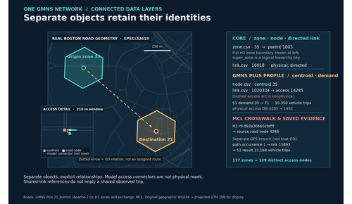</a></div><small><a href="docs/assets/boston/gmns_in_action_r1/gmns_connected_layers.png">Original figure</a> · <a href="docs/cases/boston.md#gmns-zones-and-source-evidence">Specific evidence</a></small></td><td><span class="home-city-label">Sioux Falls</span><span class="evidence-status">saved</span><br>Frozen classic 24-node/76-link source graph and supplied vehicle OD.<div class="evidence-thumbs"><a href="docs/cases/sioux-falls.md#gmns-zones-and-source-evidence">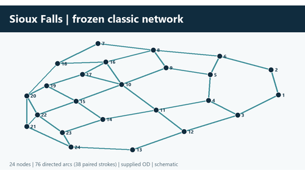</a></div><small><a href="docs/assets/homepage_evidence_r1/sioux_falls_classic_topology.png">Original figure</a> · <a href="docs/cases/sioux-falls.md#gmns-zones-and-source-evidence">Specific evidence</a></small></td><td><span class="home-city-label">Hong Kong</span><span class="evidence-status">saved</span><br>Official-derived bounded network and source layers.<div class="evidence-thumbs"><a href="docs/cases/hong-kong.md#gmns-zones-and-source-evidence"></a></div><small><a href="docs/assets/hong_kong/full_stack_r5/r2r4_baseline/figures/hk_assignment_ready_network.png">Original figure</a> · <a href="docs/cases/hong-kong.md#gmns-zones-and-source-evidence">Specific evidence</a></small></td></tr>
<tr><th scope="row">GMNS network, zones and access</th><td><span class="home-city-label">Boston</span><span class="evidence-status">saved</span><br>5,091 physical links; 177 H3 fine zones, nine parents; connectors separate.<div class="evidence-thumbs"><a href="docs/cases/boston.md#gmns-zones-and-source-evidence">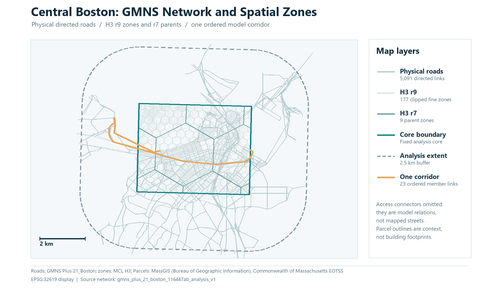</a></div><small><a href="docs/assets/boston/visual_release_r1/boston_network_zones.png">Original figure</a> · <a href="docs/cases/boston.md#gmns-zones-and-source-evidence">Specific evidence</a></small></td><td><span class="home-city-label">Sioux Falls</span><span class="evidence-status">saved</span><br>24-node, 76-link supplied directed benchmark; schematic topology, no city zone hierarchy.<div class="evidence-thumbs"><a href="docs/cases/sioux-falls.md#gmns-zones-and-source-evidence"></a></div><small><a href="docs/assets/homepage_evidence_r1/sioux_falls_classic_topology.png">Original figure</a> · <a href="docs/cases/sioux-falls.md#gmns-zones-and-source-evidence">Specific evidence</a></small></td><td><span class="home-city-label">Hong Kong</span><span class="evidence-status">saved</span><br>780 physical nodes, 1,239 links; 95 fine zones, ten parents and turn-aware access.<div class="evidence-thumbs"><a href="docs/datasets/hong-kong-gmns.md"></a></div><small><a href="docs/assets/hong_kong/full_stack_r5/r2r4_baseline/figures/hk_assignment_ready_network.png">Original figure</a> · <a href="docs/datasets/hong-kong-gmns.md">Specific evidence</a></small></td></tr>
<tr><th scope="row">Population, households and activity</th><td><span class="home-city-label">Boston</span><span class="evidence-status">saved</span><br>ACS 2024 five-year block groups allocated to 177 clipped H3 zones.<div class="evidence-thumbs"><a href="docs/datasets/boston-population-households.md">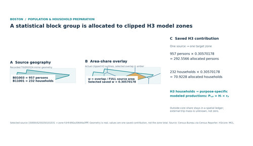</a></div><small><a href="docs/assets/boston/population_r1/population_allocation.png">Original figure</a> · <a href="docs/datasets/boston-population-households.md">Specific evidence</a></small></td><td><span class="home-city-label">Sioux Falls</span><span class="evidence-status">outside benchmark</span><br>Supplied OD; no demographic city compiler. <a href="docs/cases/sioux-falls.md#demand-transit-and-observations">Scope and evidence</a></td><td><span class="home-city-label">Hong Kong</span><span class="evidence-status">saved proxy</span><br>2021 census households/population and explicitly modeled building activity proxies.<div class="evidence-thumbs"><a href="docs/cases/hong-kong-four-stage.md">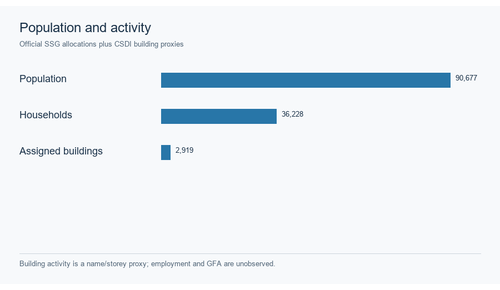</a></div><small><a href="docs/assets/hong_kong/full_stack_r5/r2r4_baseline/figures/hk_population_households_activity.png">Original figure</a> · <a href="docs/cases/hong-kong-four-stage.md">Specific evidence</a></small></td></tr>
</tbody></table>

### B / Transit and observation evidence

<table class="home-coverage"><thead><tr><th>Component / output</th><th>Boston</th><th>Sioux Falls</th><th>Hong Kong</th></tr></thead><tbody>
<tr><th scope="row">Transit and pedestrian inputs</th><td><span class="home-city-label">Boston</span><span class="evidence-status">saved input</span><br>MBTA service and pedestrian access support the bounded demand/feedback example.<div class="evidence-thumbs"><a href="docs/cases/boston.md#demand-transit-and-observations"></a></div><small><a href="docs/assets/boston/gmns_in_action_r1/gmns_connected_layers.png">Original figure</a> · <a href="docs/cases/boston.md#demand-transit-and-observations">Specific evidence</a></small></td><td><span class="home-city-label">Sioux Falls</span><span class="evidence-status">outside benchmark</span><br>No GTFS or pedestrian city-input lane. <a href="docs/cases/sioux-falls.md#demand-transit-and-observations">Scope and evidence</a></td><td><span class="home-city-label">Hong Kong</span><span class="evidence-status">saved input</span><br>GTFS same-trip rides, fares, headways and pedestrian access enter generalized costs.<div class="evidence-thumbs"><a href="docs/cases/hong-kong-four-stage.md">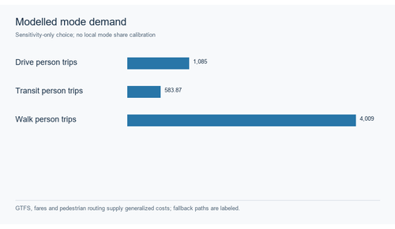</a></div><small><a href="docs/assets/hong_kong/full_stack_r5/r2r4_baseline/figures/hk_mode_choice_costs_and_shares.png">Original figure</a> · <a href="docs/cases/hong-kong-four-stage.md">Specific evidence</a></small></td></tr>
<tr><th scope="row">GPS, trajectory and detector evidence</th><td><span class="home-city-label">Boston</span><span class="evidence-status">exploratory linkage</span><br>Exploratory map matching and service feedback; not held-out calibration.<div class="evidence-thumbs"><a href="docs/datasets/boston-behavior-feedback.md">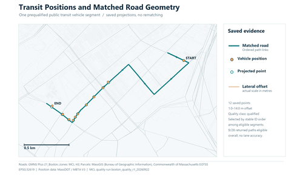</a></div><small><a href="docs/assets/boston/visual_release_r1/boston_gps_projection.png">Original figure</a> · <a href="docs/datasets/boston-behavior-feedback.md">Specific evidence</a></small></td><td><span class="home-city-label">Sioux Falls</span><span class="evidence-status">outside benchmark</span><br>No modern GPS or detector observations. <a href="docs/cases/sioux-falls.md#demand-transit-and-observations">Scope and evidence</a></td><td><span class="home-city-label">Hong Kong</span><span class="evidence-status">context only</span><br>Detector and private trajectory association; no held-out validation claim.<div class="evidence-thumbs"><a href="docs/cases/hong-kong-four-stage.md">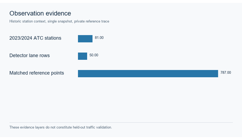</a></div><small><a href="docs/assets/hong_kong/full_stack_r5/r2r4_baseline/figures/hk_detector_and_trajectory_evidence.png">Original figure</a> · <a href="docs/cases/hong-kong-four-stage.md">Specific evidence</a></small></td></tr>
</tbody></table>

### C / Four-stage travel-demand workflow

<table class="home-coverage"><thead><tr><th>Component / output</th><th>Boston</th><th>Sioux Falls</th><th>Hong Kong</th></tr></thead><tbody>
<tr><th scope="row">01 / Trip generation — productions / attractions</th><td><span class="home-city-label">Boston</span><span class="evidence-status">saved example</span><br>Purpose-level productions and attractions in the bounded Boston example.<div class="evidence-thumbs"><a href="docs/cases/boston.md#demand-transit-and-observations">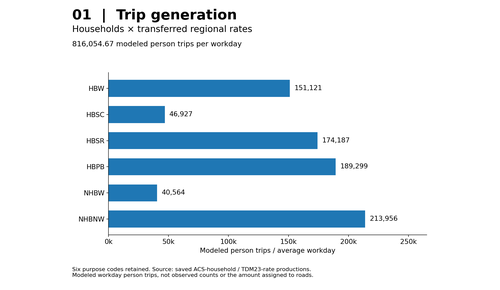</a></div><small><a href="docs/assets/boston/four_step_results_r1/step1_generation.png">Original figure</a> · <a href="docs/cases/boston.md#demand-transit-and-observations">Specific evidence</a></small></td><td><span class="home-city-label">Sioux Falls</span><span class="evidence-status">outside benchmark</span><br>Vehicle OD supplied; no trip-generation run. <a href="docs/cases/sioux-falls.md#demand-transit-and-observations">Scope and evidence</a></td><td><span class="home-city-label">Hong Kong</span><span class="evidence-status">engineering scenario</span><br>Transferred rate and declared capture sensitivity, not local calibration.<div class="evidence-thumbs"><a href="docs/cases/hong-kong-four-stage.md">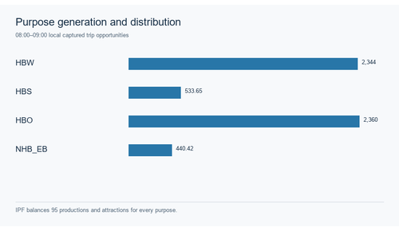</a></div><small><a href="docs/assets/hong_kong/full_stack_r5/r2r4_baseline/figures/hk_trip_generation_distribution.png">Original figure</a> · <a href="docs/cases/hong-kong-four-stage.md">Specific evidence</a></small></td></tr>
<tr><th scope="row">02 / Trip distribution — zonal OD demand</th><td><span class="home-city-label">Boston</span><span class="evidence-status">saved example</span><br>Zonal OD construction for the bounded semantic scenario.<div class="evidence-thumbs"><a href="docs/cases/boston.md#demand-transit-and-observations">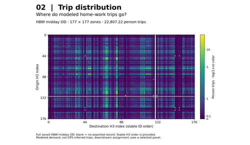</a></div><small><a href="docs/assets/boston/four_step_results_r1/step2_distribution.png">Original figure</a> · <a href="docs/cases/boston.md#demand-transit-and-observations">Specific evidence</a></small></td><td><span class="home-city-label">Sioux Falls</span><span class="evidence-status">outside benchmark</span><br>Supplied OD is input, not a modeled distribution stage. <a href="docs/cases/sioux-falls.md#demand-transit-and-observations">Scope and evidence</a></td><td><span class="home-city-label">Hong Kong</span><span class="evidence-status">engineering scenario</span><br>Turn-aware gravity/IPF balances 8,930 reachable directed OD pairs.<div class="evidence-thumbs"><a href="docs/cases/hong-kong-four-stage.md"></a></div><small><a href="docs/assets/hong_kong/full_stack_r5/r2r4_baseline/figures/hk_trip_generation_distribution.png">Original figure</a> · <a href="docs/cases/hong-kong-four-stage.md">Specific evidence</a></small></td></tr>
<tr><th scope="row">03 / Mode choice — mode-specific demand</th><td><span class="home-city-label">Boston</span><span class="evidence-status">saved sensitivity</span><br>S1/S2 service response and conditional absolute choice remain separate.<div class="evidence-thumbs"><a href="docs/cases/boston.md#demand-transit-and-observations">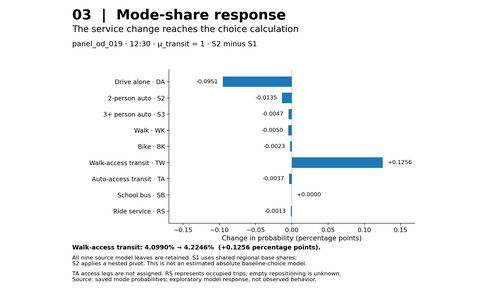</a></div><small><a href="docs/assets/boston/four_step_results_r1/step3_mode_response.png">Original figure</a> · <a href="docs/cases/boston.md#demand-transit-and-observations">Specific evidence</a></small></td><td><span class="home-city-label">Sioux Falls</span><span class="evidence-status">outside benchmark</span><br>Vehicle OD supplied; no mode-choice run. <a href="docs/cases/sioux-falls.md#demand-transit-and-observations">Scope and evidence</a></td><td><span class="home-city-label">Hong Kong</span><span class="evidence-status">engineering sensitivity</span><br>GTFS/pedestrian generalized cost and declared sensitivity logit.<div class="evidence-thumbs"><a href="docs/cases/hong-kong-four-stage.md"></a></div><small><a href="docs/assets/hong_kong/full_stack_r5/r2r4_baseline/figures/hk_mode_choice_costs_and_shares.png">Original figure</a> · <a href="docs/cases/hong-kong-four-stage.md">Specific evidence</a></small></td></tr>
<tr><th scope="row">04 / Traffic assignment — assigned network flows</th><td><span class="home-city-label">Boston</span><span class="evidence-status">saved</span><br>Static road flow from the bounded demand scenario; methods below.<div class="evidence-thumbs"><a href="docs/cases/boston.md#static-assignment">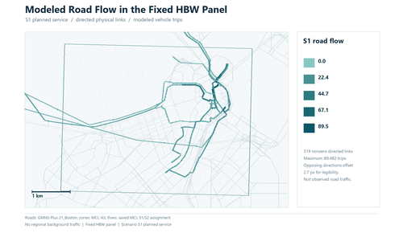</a></div><small><a href="docs/assets/boston/visual_release_r1/boston_panel_flow_s1.png">Original figure</a> · <a href="docs/cases/boston.md#static-assignment">Specific evidence</a></small></td><td><span class="home-city-label">Sioux Falls</span><span class="evidence-status">benchmark</span><br>Static network flow from supplied vehicle OD; no upstream four-stage compiler.<div class="evidence-thumbs"><a href="docs/cases/sioux-falls.md#static-assignment"></a></div><small><a href="docs/assets/algorithm_b_r21/presentation/sioux_fw_flow_compact.png">Original figure</a> · <a href="docs/cases/sioux-falls.md#static-assignment">Specific evidence</a></small></td><td><span class="home-city-label">Hong Kong</span><span class="evidence-status">engineering scenario</span><br>Modeled one-hour static PCE road flow, not measured traffic.<div class="evidence-thumbs"><a href="docs/cases/hong-kong-static-assignment.md">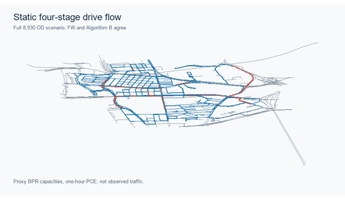</a></div><small><a href="docs/assets/hong_kong/full_stack_r5/r2r4_baseline/figures/hk_static_fw_flow.png">Original figure</a> · <a href="docs/cases/hong-kong-static-assignment.md">Specific evidence</a></small></td></tr>
</tbody></table>

### D1 / Static assignment · BPR/Beckmann

<table class="home-coverage"><thead><tr><th>Component / output</th><th>Boston</th><th>Sioux Falls</th><th>Hong Kong</th></tr></thead><tbody>
<tr><th scope="row">Frank–Wolfe</th><td><span class="home-city-label">Boston</span><span class="evidence-status">saved</span><br>Expanded Boston FW, up to 17,522 loaded node ODs; separate from 26-OD controls.<div class="evidence-thumbs"><a href="docs/cases/boston-assignment.md#primary-scale-result-versus-controlled-method-comparison"></a></div><small><a href="docs/assets/boston/scalable_tool_r1/fw_all_flow.png">Original figure</a> · <a href="docs/cases/boston-assignment.md#primary-scale-result-versus-controlled-method-comparison">Specific evidence</a></small></td><td><span class="home-city-label">Sioux Falls</span><span class="evidence-status">saved</span><br>Classic 528-OD static FW; preview compares ID-matched link flows against Algorithm B.<div class="evidence-thumbs"><a href="docs/datasets/sioux-static-fw.md"></a></div><small><a href="docs/assets/algorithm_b_r21/presentation/sioux_fw_flow_compact.png">Original figure</a> · <a href="docs/datasets/sioux-static-fw.md">Specific evidence</a></small></td><td><span class="home-city-label">Hong Kong</span><span class="evidence-status">saved</span><br>Turn-aware one-hour 723.191 PCE static engineering scenario.<div class="evidence-thumbs"><a href="docs/cases/hong-kong-static-assignment.md"></a></div><small><a href="docs/assets/hong_kong/full_stack_r5/r2r4_baseline/figures/hk_static_fw_flow.png">Original figure</a> · <a href="docs/cases/hong-kong-static-assignment.md">Specific evidence</a></small></td></tr>
<tr><th scope="row">Official tap-b Algorithm B</th><td><span class="home-city-label">Boston</span><span class="evidence-status">task-local adapter</span><br>B0/B1 numerical transfer via task-local lossless TAPLab-compatible adapter.<div class="evidence-thumbs"><a href="docs/cases/boston-algorithm-b.md">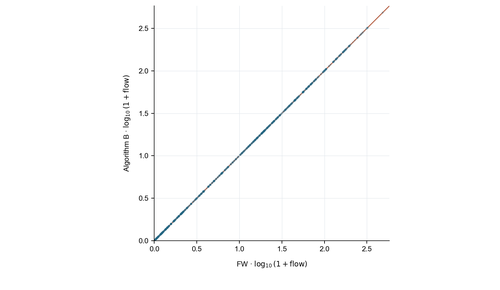</a></div><small><a href="docs/assets/algorithm_b_r21/presentation/boston_b1_fw_flow_compact.png">Original figure</a> · <a href="docs/cases/boston-algorithm-b.md">Specific evidence</a></small></td><td><span class="home-city-label">Sioux Falls</span><span class="evidence-status">official adapter</span><br>Official TAPLab registered-adapter parity passes on Sioux Falls.<div class="evidence-thumbs"><a href="docs/cases/sioux-algorithm-b.md"></a></div><small><a href="docs/assets/algorithm_b_r21/presentation/sioux_fw_flow_compact.png">Original figure</a> · <a href="docs/cases/sioux-algorithm-b.md">Specific evidence</a></small></td><td><span class="home-city-label">Hong Kong</span><span class="evidence-status">task-local adapter</span><br>Accepted task-local lossless adapter; not official-adapter parity.<div class="evidence-thumbs"><a href="docs/cases/hong-kong-static-assignment.md">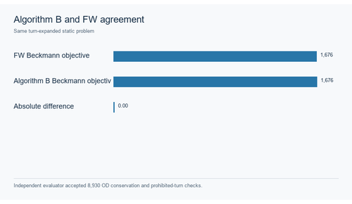</a></div><small><a href="docs/assets/hong_kong/full_stack_r5/r2r4_baseline/figures/hk_algorithm_b_vs_fw.png">Original figure</a> · <a href="docs/cases/hong-kong-static-assignment.md">Specific evidence</a></small></td></tr>
<tr><th scope="row">Finite-path reference</th><td><span class="home-city-label">Boston</span><span class="evidence-status">saved control</span><br>26 OD, 130-path uncompressed SLSQP reference on ABS_PLANNED.<div class="evidence-thumbs"><a href="docs/cases/boston-assignment.md#same-instance-saved-result">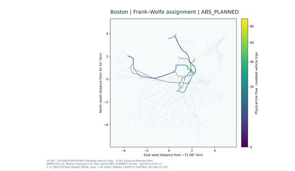</a></div><small><a href="docs/assets/boston/assignment_methods_r1/boston_abs_planned_fw_flow.png">Original figure</a> · <a href="docs/cases/boston-assignment.md#same-instance-saved-result">Specific evidence</a></small></td><td><span class="home-city-label">Sioux Falls</span><span class="evidence-status">saved path representation</span><br>Frozen 2,218-path static representation; numerical profile is not city demand.<div class="evidence-thumbs"><a href="docs/cases/sioux-falls.md#static-assignment"></a></div><small><a href="docs/assets/algorithm_b_r21/presentation/sioux_fw_flow_compact.png">Original figure</a> · <a href="docs/cases/sioux-falls.md#static-assignment">Specific evidence</a></small></td><td><span class="home-city-label">Hong Kong</span><span class="evidence-status">not demonstrated</span><br>No accepted finite-path static reference in this case. <a href="docs/cases/hong-kong-static-assignment.md">Scope and evidence</a></td></tr>
<tr><th scope="row">Native Diagnostic L3 / compression</th><td><span class="home-city-label">Boston</span><span class="evidence-status">saved control</span><br>Rank-26/52 native controls on the same 26-OD ABS_PLANNED instance.<div class="evidence-thumbs"><a href="docs/cases/boston-assignment.md#controlled-comparison-board">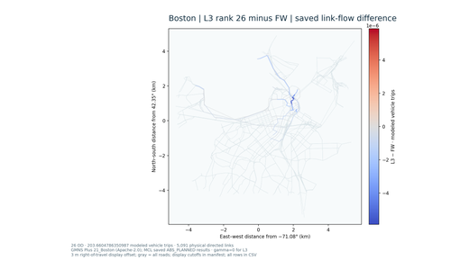</a></div><small><a href="docs/assets/boston/assignment_methods_r1/boston_abs_planned_l3_rank26_minus_fw.png">Original figure</a> · <a href="docs/cases/boston-assignment.md#controlled-comparison-board">Specific evidence</a></small></td><td><span class="home-city-label">Sioux Falls</span><span class="evidence-status">saved numerical candidates</span><br>Rank-50 classic static benchmark candidates, not an empirical speedup.<div class="evidence-thumbs"><a href="docs/cases/sioux-falls.md#static-assignment"></a></div><small><a href="docs/assets/algorithm_b_r21/presentation/sioux_fw_flow_compact.png">Original figure</a> · <a href="docs/cases/sioux-falls.md#static-assignment">Specific evidence</a></small></td><td><span class="home-city-label">Hong Kong</span><span class="evidence-status">not demonstrated</span><br>No accepted native L3 result in this case. <a href="docs/cases/hong-kong-static-assignment.md">Scope and evidence</a></td></tr>
</tbody></table>

### D2 / Finite time-expanded · fixed cost, hard capacity

<table class="home-coverage"><thead><tr><th>Component / output</th><th>Boston</th><th>Sioux Falls</th><th>Hong Kong</th></tr></thead><tbody>
<tr><th scope="row">Network construction and generated columns</th><td><span class="home-city-label">Boston</span><span class="evidence-status">saved</span><br>90-node/125-link/10-OD finite graph; saved time-indexed column.<div class="evidence-thumbs"><a href="docs/cases/boston-space-time.md#from-the-physical-network-to-the-finite-time-expanded-graph">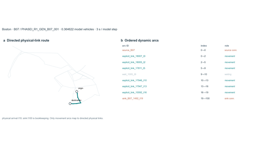</a></div><small><a href="docs/assets/three_city_r2/boston_generated_column_time_indexed_path.png">Original figure</a> · <a href="docs/cases/boston-space-time.md#from-the-physical-network-to-the-finite-time-expanded-graph">Specific evidence</a></small></td><td><span class="home-city-label">Sioux Falls</span><span class="evidence-status">saved</span><br>Selected 200/250-OD finite graphs; saved time-indexed columns.<div class="evidence-thumbs"><a href="docs/cases/sioux-space-time.md#from-the-physical-network-to-the-finite-time-expanded-graph">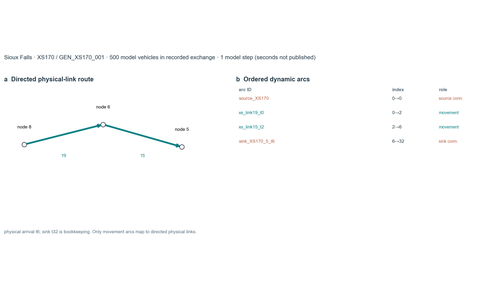</a></div><small><a href="docs/assets/three_city_r2/sioux_generated_column_time_indexed_path.png">Original figure</a> · <a href="docs/cases/sioux-space-time.md#from-the-physical-network-to-the-finite-time-expanded-graph">Specific evidence</a></small></td><td><span class="home-city-label">Hong Kong</span><span class="evidence-status">saved HK10</span><br>Approved model-generated HK10 excerpt in the 100-node/111-link/10-OD graph.<div class="evidence-thumbs"><a href="docs/cases/hong-kong-space-time.md#a-generated-column-as-a-time-indexed-path">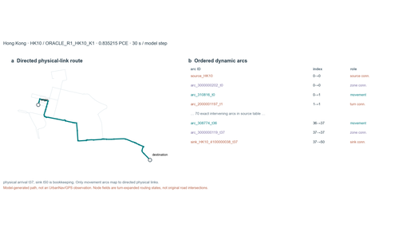</a></div><small><a href="docs/assets/three_city_r2/hong_kong_generated_column_time_indexed_path.png">Original figure</a> · <a href="docs/cases/hong-kong-space-time.md#a-generated-column-as-a-time-indexed-path">Specific evidence</a></small></td></tr>
<tr><th scope="row">Arc-flow LP reference</th><td><span class="home-city-label">Boston</span><span class="evidence-status">saved</span><br>Own-graph LP reference for the bounded ten-OD fixed-cost instance.<div class="evidence-thumbs"><a href="docs/cases/boston-space-time.md#reference-objective-agreement">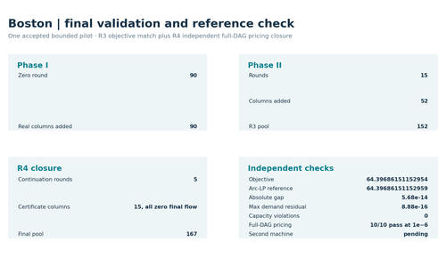</a></div><small><a href="docs/assets/boston/space_time_cg_r4/boston_cg_validation.png">Original figure</a> · <a href="docs/cases/boston-space-time.md#reference-objective-agreement">Specific evidence</a></small></td><td><span class="home-city-label">Sioux Falls</span><span class="evidence-status">saved</span><br>Own selected-graph LP references for historical 200/250 ODs.<div class="evidence-thumbs"><a href="docs/cases/sioux-space-time.md#reference-objective-agreement">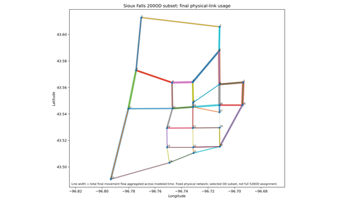</a></div><small><a href="docs/assets/benchmarks/sioux_200od_final_physical_link_flow.png">Original figure</a> · <a href="docs/cases/sioux-space-time.md#reference-objective-agreement">Specific evidence</a></small></td><td><span class="home-city-label">Hong Kong</span><span class="evidence-status">saved</span><br>Own-graph LP reference for R5 ten-OD finite case.<div class="evidence-thumbs"><a href="docs/cases/hong-kong-space-time.md#reference-objective-agreement">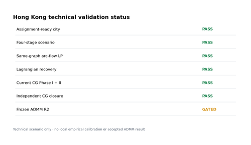</a></div><small><a href="docs/assets/hong_kong/full_stack_r5/figures/hk_validation_panel.png">Original figure</a> · <a href="docs/cases/hong-kong-space-time.md#reference-objective-agreement">Specific evidence</a></small></td></tr>
<tr><th scope="row">Two-phase column generation</th><td><span class="home-city-label">Boston</span><span class="evidence-status">accepted</span><br>Phase I/II and independent 10/10 pricing closure.<div class="evidence-thumbs"><a href="docs/cases/boston-space-time.md#phase-i-restores-feasibility">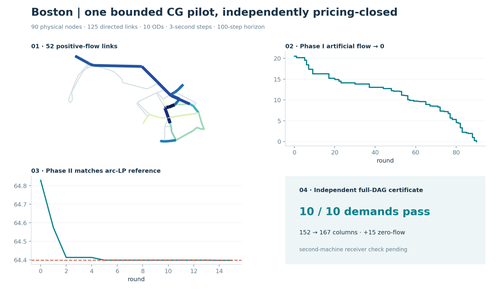</a></div><small><a href="docs/assets/boston/space_time_cg_r4/boston_cg_summary_panel.png">Original figure</a> · <a href="docs/cases/boston-space-time.md#phase-i-restores-feasibility">Specific evidence</a></small></td><td><span class="home-city-label">Sioux Falls</span><span class="evidence-status">accepted historical</span><br>200/250-OD own-LP agreement; independent full-DAG closure not established.<div class="evidence-thumbs"><a href="docs/cases/sioux-space-time.md#phase-i-restores-feasibility">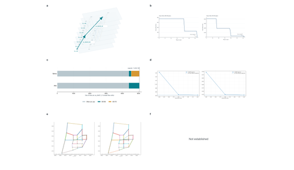</a></div><small><a href="docs/assets/presentation_r5/sioux_cg_case_sequence.png">Original figure</a> · <a href="docs/cases/sioux-space-time.md#phase-i-restores-feasibility">Specific evidence</a></small></td><td><span class="home-city-label">Hong Kong</span><span class="evidence-status">accepted R5</span><br>Phase I/II, same-graph LP agreement and independent 10/10 closure.<div class="evidence-thumbs"><a href="docs/cases/hong-kong-space-time.md#phase-i-restores-feasibility">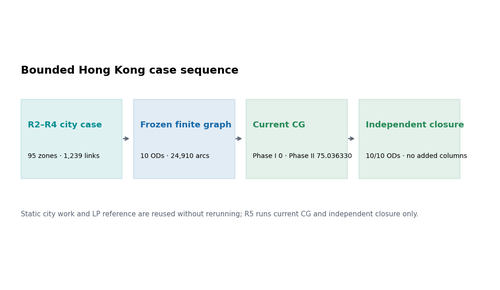</a></div><small><a href="docs/assets/hong_kong/full_stack_r5/figures/hk_cg_case_sequence.png">Original figure</a> · <a href="docs/cases/hong-kong-space-time.md#phase-i-restores-feasibility">Specific evidence</a></small></td></tr>
<tr><th scope="row">Lagrangian</th><td><span class="home-city-label">Boston</span><span class="evidence-status">gated</span><br>Feasible primal, but frozen 1% gap gate missed (1.1002%). <a href="docs/cases/boston.md#finite-time-expanded-algorithms">Scope and evidence</a></td><td><span class="home-city-label">Sioux Falls</span><span class="evidence-status">accepted R2</span><br>Selected 200/250-OD feasible recovery and certified bounded gaps.<div class="evidence-thumbs"><a href="docs/methods/distributed-assignment.md">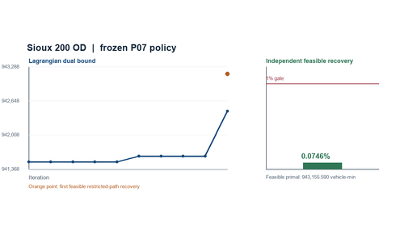</a></div><small><a href="docs/assets/sioux/distributed_r1/Sioux_200OD_P07.png">Original figure</a> · <a href="docs/methods/distributed-assignment.md">Specific evidence</a></small></td><td><span class="home-city-label">Hong Kong</span><span class="evidence-status">accepted bounded</span><br>Ten-OD feasible recovery with 0.7444% certified gap.<div class="evidence-thumbs"><a href="docs/cases/hong-kong-space-time.md">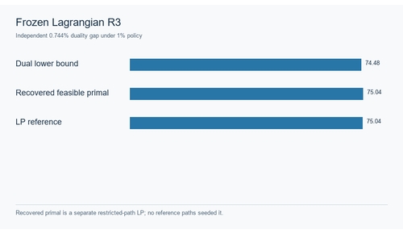</a></div><small><a href="docs/assets/hong_kong/full_stack_r5/r2r4_baseline/figures/hk_lagrangian_dual_primal_gap.png">Original figure</a> · <a href="docs/cases/hong-kong-space-time.md">Specific evidence</a></small></td></tr>
<tr><th scope="row">ADMM</th><td><span class="home-city-label">Boston</span><span class="evidence-status">accepted R2_S</span><br>Ten-OD original-space checks; own-LP gap 6.68e-6.<div class="evidence-thumbs"><a href="docs/cases/boston-admm.md">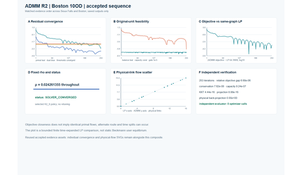</a></div><small><a href="docs/assets/admm_r2/figures/admm_boston_10od_case_sequence.png">Original figure</a> · <a href="docs/cases/boston-admm.md">Specific evidence</a></small></td><td><span class="home-city-label">Sioux Falls</span><span class="evidence-status">accepted R2_S</span><br>Selected 200/250-OD original-space checks; not the full static 528 ODs.<div class="evidence-thumbs"><a href="docs/cases/sioux-admm.md">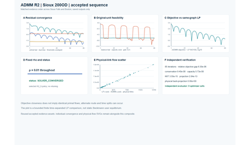</a></div><small><a href="docs/assets/admm_r2/figures/admm_sioux_200_case_sequence.png">Original figure</a> · <a href="docs/cases/sioux-admm.md">Specific evidence</a></small></td><td><span class="home-city-label">Hong Kong</span><span class="evidence-status">gated</span><br>Frozen transfer diagnostic; no accepted Hong Kong ADMM objective. <a href="docs/cases/hong-kong-space-time.md">Scope and evidence</a></td></tr>
</tbody></table>

### E / Reusable outputs and tools

<table class="home-coverage"><thead><tr><th>Component / output</th><th>Boston</th><th>Sioux Falls</th><th>Hong Kong</th></tr></thead><tbody>
<tr><th scope="row">Query, tracing, exports and saved checks</th><td><span class="home-city-label">Boston</span><span class="evidence-status">saved outputs</span><br>GMNS record lookup and saved-example SQLite query/export workflow.<div class="evidence-thumbs"><a href="examples/boston/SAVED_EXAMPLE.md">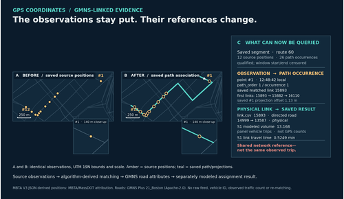</a></div><small><a href="docs/assets/boston/gmns_in_action_r1/gps_to_gmns_evidence.png">Original figure</a> · <a href="examples/boston/SAVED_EXAMPLE.md">Specific evidence</a></small></td><td><span class="home-city-label">Sioux Falls</span><span class="evidence-status">saved checks</span><br>Frozen link/OD identity, native profiles and finite-case verification records.<div class="evidence-thumbs"><a href="examples/sioux-falls/native_l3_r1/README.md">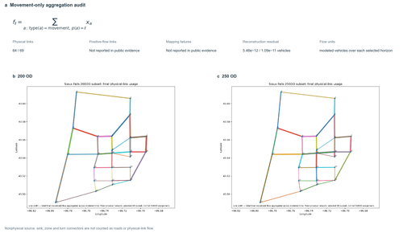</a></div><small><a href="docs/assets/three_city_r2/sioux_time_expanded_to_physical_link_flow.png">Original figure</a> · <a href="examples/sioux-falls/native_l3_r1/README.md">Specific evidence</a></small></td><td><span class="home-city-label">Hong Kong</span><span class="evidence-status">saved outputs</span><br>Source/turn ledgers, staged CSV exports and independently checked finite results.<div class="evidence-thumbs"><a href="docs/cases/hong-kong.md#reproduction"></a></div><small><a href="docs/assets/hong_kong/full_stack_r5/figures/hk_validation_panel.png">Original figure</a> · <a href="docs/cases/hong-kong.md#reproduction">Specific evidence</a></small></td></tr>
</tbody></table>

<a id="cg-experiments"></a><a id="admm-r2"></a><a id="algorithm-b"></a><a id="distributed-assignment"></a>
The [cross-case CG evidence](docs/methods/space-time-cg.md#cg-experiments), [ADMM](docs/methods/admm-space-time.md), [official tap-b Algorithm B method](docs/methods/origin-based-algorithm-b.md) and [adapter distinction](docs/integrations/taplab-tapb.md), and [Lagrangian records](docs/methods/distributed-assignment.md) retain their full figure families. Boston and Hong Kong have independent 10/10 pricing closure on **different** ten-demand graphs; this is not imputed to the historical Sioux runs.

## 04 / Explore the three cases

The same four positions organize each entrance; source scope and units remain city-specific. Covers are presentation assets, not scientific validation.

<div class="case-parity-grid">
<article class="case-parity-card"><h3>Boston</h3><p>Real-city GMNS/demand/observation workflow; scalable static assignment and a distinct bounded finite holdout. <a href="docs/cases/boston.md">Open case</a></p>
<div class="case-slot"><h4>0 / Case cover</h4><a href="docs/cases/boston.md">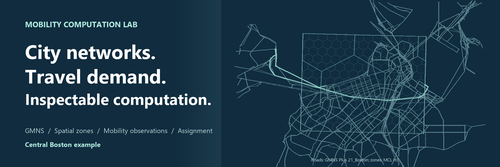</a><p>Boston case cover; see case for the model and evidence scope. <a href="docs/assets/boston/visual_release_r1/mcl_boston_hero.png">Original image</a> · <a href="docs/cases/boston.md">Evidence</a></p></div>
<div class="case-slot"><h4>1 / GMNS and model representation</h4><a href="docs/cases/boston.md#gmns-zones-and-source-evidence"></a><p>Boston network and model representation; source geometry or schematic scope is documented in the case. <a href="docs/assets/boston/visual_release_r1/boston_network_zones.png">Original image</a> · <a href="docs/cases/boston.md#gmns-zones-and-source-evidence">Evidence</a></p></div>
<div class="case-slot"><h4>2 / Core outputs</h4><a href="docs/cases/boston.md#demand-transit-and-observations">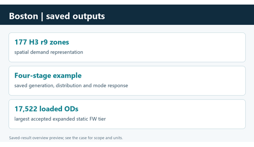</a><p>Boston saved core-output overview; not interchangeable with the assignment-flow figure. <a href="docs/assets/homepage_evidence_r1/boston_core_outputs_preview.png">Original image</a> · <a href="docs/cases/boston.md#demand-transit-and-observations">Evidence</a></p></div>
<div class="case-slot"><h4>3 / Traffic assignment results</h4><a href="docs/cases/boston-assignment.md#primary-scale-result-versus-controlled-method-comparison">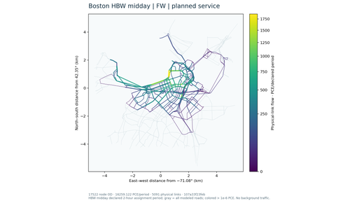</a><p>Expanded static FW all tier: 17,522 loaded node ODs; modeled PCE trips. <a href="docs/assets/boston/scalable_tool_r1/fw_all_flow.png">Original image</a> · <a href="docs/cases/boston-assignment.md#primary-scale-result-versus-controlled-method-comparison">Evidence</a></p></div>
</article>
<article class="case-parity-card"><h3>Sioux Falls</h3><p>Supplied 528-OD static benchmark and separate historical 200/250-OD finite cases; not a four-stage city compiler. <a href="docs/cases/sioux-falls.md">Open case</a></p>
<div class="case-slot"><h4>0 / Case cover</h4><a href="docs/cases/sioux-falls.md">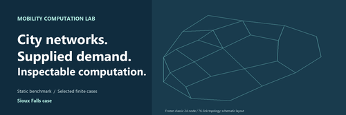</a><p>Sioux Falls case cover; see case for the model and evidence scope. <a href="docs/assets/homepage_evidence_r1/sioux_falls_case_cover.png">Original image</a> · <a href="docs/cases/sioux-falls.md">Evidence</a></p></div>
<div class="case-slot"><h4>1 / GMNS and model representation</h4><a href="docs/cases/sioux-falls.md#gmns-zones-and-source-evidence"></a><p>Sioux Falls network and model representation; source geometry or schematic scope is documented in the case. <a href="docs/assets/homepage_evidence_r1/sioux_falls_classic_topology.png">Original image</a> · <a href="docs/cases/sioux-falls.md#gmns-zones-and-source-evidence">Evidence</a></p></div>
<div class="case-slot"><h4>2 / Core outputs</h4><a href="docs/cases/sioux-falls.md#scope-and-statistics">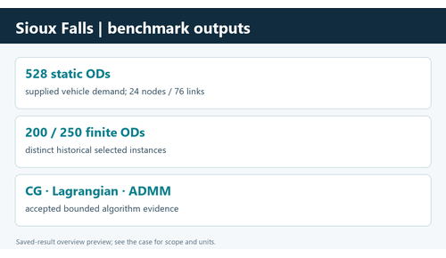</a><p>Sioux Falls saved core-output overview; not interchangeable with the assignment-flow figure. <a href="docs/assets/homepage_evidence_r1/sioux_falls_core_outputs_preview.png">Original image</a> · <a href="docs/cases/sioux-falls.md#scope-and-statistics">Evidence</a></p></div>
<div class="case-slot"><h4>3 / Traffic assignment results</h4><a href="docs/cases/sioux-algorithm-b.md">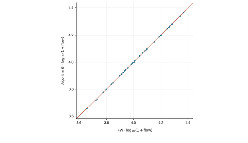</a><p>Classic static FW versus official tap-b Algorithm B: ID-matched 76-link flow parity, log10(1 + flow); supplied OD. <a href="docs/assets/algorithm_b_r21/presentation/sioux_fw_flow_compact.png">Original image</a> · <a href="docs/cases/sioux-algorithm-b.md">Evidence</a></p></div>
</article>
<article class="case-parity-card"><h3>Hong Kong</h3><p>Bounded turn-aware GMNS/four-stage engineering scenario and separate accepted ten-OD finite CG case. <a href="docs/cases/hong-kong.md">Open case</a></p>
<div class="case-slot"><h4>0 / Case cover</h4><a href="docs/cases/hong-kong.md">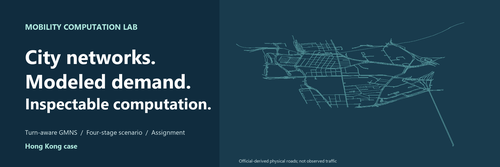</a><p>Hong Kong case cover; see case for the model and evidence scope. <a href="docs/assets/homepage_evidence_r1/hong_kong_case_cover.png">Original image</a> · <a href="docs/cases/hong-kong.md">Evidence</a></p></div>
<div class="case-slot"><h4>1 / GMNS and model representation</h4><a href="docs/cases/hong-kong.md#gmns-zones-and-source-evidence">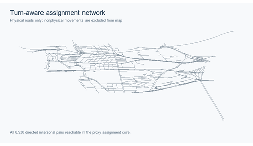</a><p>Hong Kong network and model representation; source geometry or schematic scope is documented in the case. <a href="docs/assets/hong_kong/full_stack_r5/r2r4_baseline/figures/hk_assignment_ready_network.png">Original image</a> · <a href="docs/cases/hong-kong.md#gmns-zones-and-source-evidence">Evidence</a></p></div>
<div class="case-slot"><h4>2 / Core outputs</h4><a href="docs/cases/hong-kong.md#scope-and-statistics">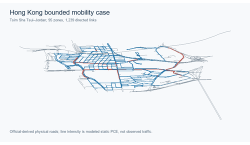</a><p>Hong Kong saved core-output overview; not interchangeable with the assignment-flow figure. <a href="docs/assets/hong_kong/full_stack_r5/r2r4_baseline/figures/hk_full_stack_overview.png">Original image</a> · <a href="docs/cases/hong-kong.md#scope-and-statistics">Evidence</a></p></div>
<div class="case-slot"><h4>3 / Traffic assignment results</h4><a href="docs/cases/hong-kong-static-assignment.md"></a><p>Turn-aware one-hour static FW, 723.191 modeled PCE; not observed traffic. <a href="docs/assets/hong_kong/full_stack_r5/r2r4_baseline/figures/hk_static_fw_flow.png">Original image</a> · <a href="docs/cases/hong-kong-static-assignment.md">Evidence</a></p></div>
</article>
</div>

<p><strong>Retained city-specific evidence.</strong> These original figures remain directly visible in addition to the common four-slot entrances; their scientific scope is not interchangeable.</p>
<div class="case-specific-strip">
<a href="docs/cases/boston.md#gmns-zones-and-source-evidence"></a>
<a href="docs/cases/sioux-space-time.md#from-time-expanded-flows-back-to-final-physical-link-movement-flow"></a>
<a href="docs/cases/hong-kong-space-time.md#from-the-physical-network-to-the-finite-time-expanded-graph"></a>
</div>

<a id="boston"></a><a id="sioux-falls"></a><a id="hong-kong"></a><a id="hong-kong-cg-r5"></a>
[All retained scientific figure families](docs/visualizations.md) · [Full technical walkthrough](docs/full-walkthrough.md).

<a id="run-your-input"></a>
## 05 / Run and inspect

**Inspect saved evidence:** [result queries and source records](docs/visualizations.md). **Run a documented example:** in a compatible Python environment at the repository root, use:

```bash
python -B examples/boston/run_saved_example.py --data-dir "examples/boston/behavior_feedback_r1_semantic_fix_r1" --output "results/boston_saved_example"
```

This rebuilds a local SQLite query database from released CSV tables and exports five saved-result queries; it does **not** run demand estimation, FW, CG or matching. Use a new output directory. [Installation and dependencies](docs/getting-started.md) · [Saved-result guide](examples/boston/SAVED_EXAMPLE.md).

**Use your own inputs:** [vehicle-OD preparation and static FW](docs/RUN_YOUR_OWN_GMNS.md), or the separately documented [generic space–time network command](docs/getting-started.md#run-from-raw-input). **Version scope:** `tools/mnl.py` retains the 0.3.0-rc5 generic engine; later Boston and Hong Kong CG cases use separately versioned implementations and saved-result checks, so that command does not reproduce those case runs unchanged.

<a id="mobility-data-support"></a>
## 06 / Attribution, scope and further reading

GMNS, `tap-b`/TAPLab and source datasets retain their upstream attribution; this project documents its own adapters, computations and bounded results separately. [Contribution/source attribution](docs/contributions.md) · [Third-party notices](THIRD_PARTY_NOTICES.md) · [Data licenses](DATA_LICENSES.md) · [Citation](docs/citation.md). Results distinguish source-derived city inputs, engineering scenarios, supplied benchmarks and observed evidence; no shown case is a calibrated citywide forecast.

The [open-data explorer](docs/open-data-explorer.md) and data tools, including `mcl_data.py catalog-city-match` for named-entity matching of user-supplied catalogs, support source inspection rather than automatic OD creation. **These evidence layers are not additive.** [Data-tools instructions](docs/data-tools.md) · [Source and access scope](docs/open-data.md). Future directions such as Policy Bush remain outside the current demonstrated modules.

[Full technical walkthrough — every retained experiment, table and figure in reading order](docs/full-walkthrough.md) · [Architecture and project-map sources](docs/architecture.md) · [Complete case/method coverage](docs/capabilities.md) · [Roadmap](docs/roadmap.md).
