# Mobility Computation Lab

**Mobility Computation Lab connects city networks, travel demand, and reproducible network computation.**

This open-source research and learning project is developed by [Hao Zheng](https://scholarhaozheng.github.io/), a recent M.S. graduate from Tsinghua University, under the guidance of **[Professor Xuesong Zhou](https://search.asu.edu/profile/2182101)**. It brings together documented examples in Boston, Sioux Falls, and Hong Kong to study how city data, demand models, and network algorithms work together.

The repository uses the [General Modeling Network Specification (GMNS)](https://github.com/zephyr-data-specs/GMNS) as its portable network and data contract. Selected static traffic-assignment experiments build on [TAPLab: An Open Laboratory for Reproducible Traffic Assignment Experiments](https://github.com/asu-trans-ai-lab/TAPLab) and the official [tap-b Algorithm B](https://github.com/spartalab/tap-b), with upstream software, methods, and datasets attributed explicitly.

Project-specific work includes assembling and adapting the Boston, Sioux Falls, and Hong Kong cases; connecting city data and four-stage demand models to documented network computations; implementing and evaluating project-specific adapters, workflows, and experiments; and making each result traceable to its actual instance, units, assumptions, and evidence.

[My contributions and upstream foundations](docs/contributions.md) · [Full technical walkthrough](docs/full-walkthrough.md) · [Start with a saved example](docs/getting-started.md) · [Source and citation](docs/citation.md)

<a id="what-this-project-adds"></a>
## 01 / What this project adds

### City-to-model representations

The project links roads, hierarchical zones, population and activity inputs, transit services, and supported observations to explicit demand and network models. Its adapters preserve identifiers, units, access semantics, and physical-link mappings across the documented city cases. [Implementation and source map](docs/contributions.md#city-to-model-representations).

### Computational implementations and diagnostics

The repository brings together path-based and compressed static-assignment experiments with finite time-expanded CG, Lagrangian, and ADMM implementations. Project-specific work includes feasibility restoration, pricing and degeneracy handling, local-subproblem scaling, and reconstruction in the original flow space. [Methods and evidence](docs/contributions.md#computational-implementations-and-diagnostics).

### Reusable cross-city computational tools

The project packages shared data interfaces, case configurations, and analysis tools into an open-source environment for Boston, Sioux Falls, and Hong Kong. Documented examples connect zonal demand, generated paths, and physical-link results, allowing researchers to reuse the supported workflows and compare demand scales, network representations, and solution methods. [Tools, attribution and demonstrated scope](docs/contributions.md#reusable-cross-city-computational-tools).

<a id="framework"></a>
## 02 / Complete project structure

[](https://scholarhaozheng.github.io/mobility-network-lab/assets/project_structure_r3/project_structure.svg)

Open the [clickable SVG](https://scholarhaozheng.github.io/mobility-network-lab/assets/project_structure_r3/project_structure.svg) to follow each card to its documentation. [PNG](docs/assets/project_structure_r3/project_structure.png) · [Accessible module and source table](docs/architecture.md).

<a id="gmns-in-action"></a><a id="four-step-workflow"></a>
GMNS keeps directed physical roads, hierarchical zones, centroids, nonphysical access and source IDs distinct. Population, household and activity preparation precedes **01 trip generation → 02 trip distribution → 03 mode choice → 04 traffic assignment** where those stages are supported; declared vehicle OD can instead enter assignment directly. GPS traces and map matching, service records and detector context require explicit quality and network-association rules. [GMNS exchange](docs/datasets/boston-gmns-exchange.md) · [Four-stage city workflow](docs/city-workflow.md) · [Observation example](docs/datasets/boston-behavior-feedback.md).

Static **BPR/Beckmann** assignment and finite **fixed-cost, hard-capacity time-expanded** optimization are separate mathematical branches. The latter is not an automatically calibrated dynamic version of the former. [Architecture](docs/architecture.md) · [Data contract](docs/data-contract.md).

<a id="two-axes"></a><a id="02a-two-axes-of-mobility-computation-lab"></a>
### Two axes of Mobility Computation Lab

**Horizontal axis — documented city cases:**  
Boston · Sioux Falls · Hong Kong

**Vertical axis — computational depth within network assignment:**

- **A · Native assignment** — Frank–Wolfe, official tap-b Algorithm B, finite-path controls, and native L3 reconstruction.
- **B · Decomposition and distributed computation** — column generation, Lagrangian decomposition, and ADMM local or coupled computations.
- **C · Spatial hierarchy and representation** — fine and parent zones, access relationships, turn/time states, and projection back to physical network objects.
- **D · Coordination and verification** — shared capacities, residuals, pricing closure, independent evaluators, and declared result contracts.

**How to read the two axes.**  
The horizontal axis compares how the documented framework is instantiated in Boston, Sioux Falls, and Hong Kong. The vertical axis organizes increasing computational depth inside the network-assignment branch. A–D are not four mandatory execution steps. Source data, GMNS, population and activity preparation, transit and observations, and the four-stage demand workflow remain the common city-model foundation outside A–D.

<a id="coverage"></a>
## 03 / Case coverage and selected evidence

Most shared row previews use one evidence graphic type and one 600 × 360 source canvas across the three cities. The GPS row pairs accepted city-specific figures; the static finite-path/L3 rows pair saved-result distributions with physical-network (Sioux: schematic topology) views. The Arc-flow LP reference row reuses accepted full figures. Local scales, instance scope and missing stages remain explicit; static BPR/Beckmann and fixed-cost hard-capacity computations are separate branches. [Complete statistics](docs/capabilities.md#comparable-statistics).

<a id="a--city-data-and-model-foundations"></a><a id="section03-i"></a>
### I / City data and model foundations

<table class="home-coverage" data-component="01" width="100%"><colgroup><col width="33%"><col width="33%"><col width="33%"></colgroup>
<thead><tr><th colspan="3" scope="colgroup" width="800">Source data and preparation</th></tr>
<tr><th scope="col" width="266">Boston</th><th scope="col" width="266">Sioux Falls</th><th scope="col" width="266">Hong Kong</th></tr></thead><tbody>
<tr class="coverage-scope"><td width="266" valign="top">GMNS Plus, ACS/GTFS and registered source preparation.</td><td width="266" valign="top">Frozen classic 24-node/76-link source graph and supplied vehicle OD.</td><td width="266" valign="top">Official-derived bounded network and source layers.</td></tr>
<tr class="coverage-preview"><td width="266" align="center"><a href="docs/cases/boston.md#gmns-zones-and-source-evidence"></a></td><td width="266" align="center"><a href="docs/cases/sioux-falls.md#gmns-zones-and-source-evidence"></a></td><td width="266" align="center"><a href="docs/cases/hong-kong.md#gmns-zones-and-source-evidence"></a></td></tr>
<tr class="coverage-caption"><td colspan="3" align="center"><sub>minimal base-network source map</sub></td></tr>
<tr class="coverage-links">
<td width="266"><sub><a href="docs/cases/boston.md#gmns-zones-and-source-evidence">Evidence</a> · <a href="docs/assets/homepage_evidence_r2/row_01_boston.png">Full preview</a> · <a href="examples/boston/gmns_exchange_r1/data/link.csv">Source record</a></sub></td>
<td width="266"><sub><a href="docs/cases/sioux-falls.md#gmns-zones-and-source-evidence">Evidence</a> · <a href="docs/assets/homepage_evidence_r2/row_01_sioux_falls.png">Full preview</a> · <a href="examples/sioux-falls/native_l3_r1/inputs_snapshot/SiouxFalls/link.csv">Source record</a></sub></td>
<td width="266"><sub><a href="docs/cases/hong-kong.md#gmns-zones-and-source-evidence">Evidence</a> · <a href="docs/assets/homepage_evidence_r2/row_01_hong_kong.png">Full preview</a> · <a href="examples/hong-kong/gmns_pilot_r1/instance/link.csv">Source record</a></sub></td>
</tr></tbody></table>

<table class="home-coverage" data-component="02" width="100%"><colgroup><col width="33%"><col width="33%"><col width="33%"></colgroup>
<thead><tr><th colspan="3" scope="colgroup" width="800">GMNS network, zones and access</th></tr>
<tr><th scope="col" width="266">Boston</th><th scope="col" width="266">Sioux Falls</th><th scope="col" width="266">Hong Kong</th></tr></thead><tbody>
<tr class="coverage-scope"><td width="266" valign="top">5,091 physical links; 177 H3 fine zones, nine parents; connectors separate.</td><td width="266" valign="top">24-node, 76-link supplied directed benchmark.</td><td width="266" valign="top">780 physical nodes, 1,239 links; 95 fine zones, ten parents and turn-aware access.</td></tr>
<tr class="coverage-preview"><td width="266" align="center"><a href="docs/cases/boston.md#gmns-zones-and-source-evidence"></a></td><td width="266" align="center"><a href="docs/cases/sioux-falls.md#gmns-zones-and-source-evidence"></a></td><td width="266" align="center"><a href="docs/datasets/hong-kong-gmns.md"></a></td></tr>
<tr class="coverage-caption"><td colspan="3" align="center"><sub>GMNS object-relation map</sub></td></tr>
<tr class="coverage-links">
<td width="266"><sub><a href="docs/cases/boston.md#gmns-zones-and-source-evidence">Evidence</a> · <a href="docs/assets/homepage_evidence_r2/row_02_boston.png">Full preview</a> · <a href="examples/boston/gmns_exchange_r1/data/link.csv">Source record</a></sub></td>
<td width="266"><sub><a href="docs/cases/sioux-falls.md#gmns-zones-and-source-evidence">Evidence</a> · <a href="docs/assets/homepage_alignment_r3/sioux_gmns_directed_objects.png">Full preview</a> · <a href="examples/sioux-falls/native_l3_r1/inputs_snapshot/SiouxFalls/link.csv">Source record</a></sub></td>
<td width="266"><sub><a href="docs/datasets/hong-kong-gmns.md">Evidence</a> · <a href="docs/assets/homepage_evidence_r2/row_02_hong_kong.png">Full preview</a> · <a href="examples/hong-kong/gmns_pilot_r1/instance/link.csv">Source record</a></sub></td>
</tr></tbody></table>

<table class="home-coverage" data-component="03" width="100%"><colgroup><col width="33%"><col width="33%"><col width="33%"></colgroup>
<thead><tr><th colspan="3" scope="colgroup" width="800">Population, households and activity</th></tr>
<tr><th scope="col" width="266">Boston</th><th scope="col" width="266">Sioux Falls</th><th scope="col" width="266">Hong Kong</th></tr></thead><tbody>
<tr class="coverage-scope"><td width="266" valign="top">ACS 2024 five-year block groups allocated to 177 clipped H3 zones.</td><td width="266" valign="top">Supplied OD; no demographic city compiler.</td><td width="266" valign="top">2021 census households/population and explicitly modeled building activity proxies.</td></tr>
<tr class="coverage-preview"><td width="266" align="center"><a href="docs/datasets/boston-population-households.md"></a></td><td width="266" align="center"><a href="docs/cases/sioux-falls.md#demand-transit-and-observations"></a></td><td width="266" align="center"><a href="docs/cases/hong-kong-four-stage.md"></a></td></tr>
<tr class="coverage-caption"><td colspan="3" align="center"><sub>three-panel zone small multiple</sub></td></tr>
<tr class="coverage-links">
<td width="266"><sub><a href="docs/datasets/boston-population-households.md">Evidence</a> · <a href="docs/assets/homepage_evidence_r2/row_03_boston.png">Full preview</a> · <a href="examples/boston/population_r1/data/population_or_household_by_zone.csv">Source record</a></sub></td>
<td width="266"><sub><a href="docs/cases/sioux-falls.md#demand-transit-and-observations">Evidence</a> · <a href="docs/assets/homepage_evidence_r2/row_03_sioux_falls.png">Full preview</a></sub></td>
<td width="266"><sub><a href="docs/cases/hong-kong-four-stage.md">Evidence</a> · <a href="docs/assets/homepage_evidence_r2/row_03_hong_kong.png">Full preview</a> · <a href="docs/assets/hong_kong/full_stack_r5/r2r4_baseline/phase_b/zone_activity_r2.csv">Source record</a></sub></td>
</tr></tbody></table>

<a id="b--transit-and-observation-evidence"></a><a id="section03-ii"></a>
### II / Transit and observation evidence

<table class="home-coverage" data-component="04" width="100%"><colgroup><col width="33%"><col width="33%"><col width="33%"></colgroup>
<thead><tr><th colspan="3" scope="colgroup" width="800">Transit and pedestrian inputs</th></tr>
<tr><th scope="col" width="266">Boston</th><th scope="col" width="266">Sioux Falls</th><th scope="col" width="266">Hong Kong</th></tr></thead><tbody>
<tr class="coverage-scope"><td width="266" valign="top">MBTA service and pedestrian access support the bounded demand/feedback example.</td><td width="266" valign="top">No GTFS or pedestrian city-input lane.</td><td width="266" valign="top">GTFS same-trip rides, fares, headways and pedestrian access enter generalized costs.</td></tr>
<tr class="coverage-preview"><td width="266" align="center"><a href="docs/cases/boston.md#demand-transit-and-observations"></a></td><td width="266" align="center"><a href="docs/cases/sioux-falls.md#demand-transit-and-observations"></a></td><td width="266" align="center"><a href="docs/cases/hong-kong-four-stage.md"></a></td></tr>
<tr class="coverage-caption"><td colspan="3" align="center"><sub>transit/access overlay map</sub></td></tr>
<tr class="coverage-links">
<td width="266"><sub><a href="docs/cases/boston.md#demand-transit-and-observations">Evidence</a> · <a href="docs/assets/homepage_evidence_r2/row_04_boston.png">Full preview</a> · <a href="examples/boston/gmns_exchange_r1/data/transit_stop_route_relation.csv">Source record</a></sub></td>
<td width="266"><sub><a href="docs/cases/sioux-falls.md#demand-transit-and-observations">Evidence</a> · <a href="docs/assets/homepage_evidence_r2/row_04_sioux_falls.png">Full preview</a></sub></td>
<td width="266"><sub><a href="docs/cases/hong-kong-four-stage.md">Evidence</a> · <a href="docs/assets/homepage_evidence_r2/row_04_hong_kong.png">Full preview</a> · <a href="examples/hong-kong/gmns_pilot_r1/instance/transit_stops.csv">Source record</a></sub></td>
</tr></tbody></table>

<table class="home-coverage" data-component="05" width="100%"><colgroup><col width="33%"><col width="33%"><col width="33%"></colgroup>
<thead><tr><th colspan="3" scope="colgroup" width="800">GPS, trajectory and detector evidence</th></tr>
<tr><th scope="col" width="266">Boston</th><th scope="col" width="266">Sioux Falls</th><th scope="col" width="266">Hong Kong</th></tr></thead><tbody>
<tr class="coverage-scope"><td width="266" valign="top">Exploratory map matching and service feedback; not held-out calibration.</td><td width="266" valign="top">No modern GPS or detector observations.</td><td width="266" valign="top">Detector and private trajectory association; no held-out validation claim.</td></tr>
<tr class="coverage-preview"><td width="266" class="gps-evidence-pair" align="center"><a href="docs/datasets/boston-behavior-feedback.md"></a> <a href="docs/datasets/boston-central.md#one-saved-transit-position-projection">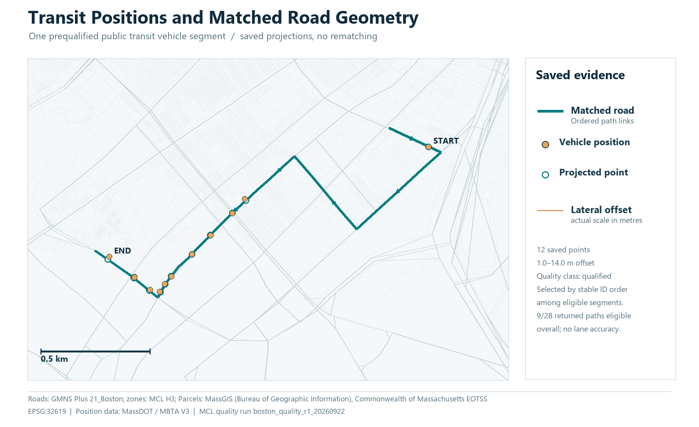</a></td><td width="266" align="center"><a href="docs/cases/sioux-falls.md#demand-transit-and-observations"></a></td><td width="266" class="gps-evidence-pair" align="center"><a href="docs/cases/hong-kong-four-stage.md"></a> <a href="docs/cases/hong-kong.md#demand-transit-and-observations">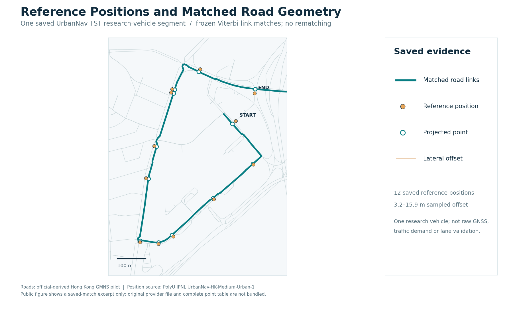</a></td></tr>
<tr class="coverage-caption"><td width="266" align="center"><sub>Network association · saved point projection</sub></td><td width="266" align="center"><sub>Outside the supplied observation benchmark</sub></td><td width="266" align="center"><sub>Detector-link view · saved point projection</sub></td></tr>
<tr class="coverage-links">
<td width="266"><sub><a href="docs/datasets/boston-behavior-feedback.md">Evidence</a> · <a href="docs/assets/homepage_evidence_r2/row_05_boston.png">Full preview</a> · <a href="docs/assets/boston/visual_release_r1/boston_gps_projection.png">Projection figure</a> · <a href="examples/boston/gmns_exchange_r1/figure_sample/gps_point_progress.csv">Source record</a></sub></td>
<td width="266"><sub><a href="docs/cases/sioux-falls.md#demand-transit-and-observations">Evidence</a> · <a href="docs/assets/homepage_evidence_r2/row_05_sioux_falls.png">Full preview</a></sub></td>
<td width="266"><sub><a href="docs/cases/hong-kong-four-stage.md">Evidence</a> · <a href="docs/assets/homepage_evidence_r2/row_05_hong_kong.png">Full preview</a> · <a href="docs/assets/hong_kong/visual_release_r1/hong_kong_reference_projection.png">Projection figure</a> · <a href="examples/hong-kong/gmns_pilot_r1/instance/detector_to_link.csv">Source record</a></sub></td>
</tr></tbody></table>

<a id="c--four-stage-travel-demand-workflow"></a><a id="section03-iii"></a>
### III / Four-stage travel-demand workflow

<table class="home-coverage" data-component="06" width="100%"><colgroup><col width="33%"><col width="33%"><col width="33%"></colgroup>
<thead><tr><th colspan="3" scope="colgroup" width="800">01 / Trip generation — productions / attractions</th></tr>
<tr><th scope="col" width="266">Boston</th><th scope="col" width="266">Sioux Falls</th><th scope="col" width="266">Hong Kong</th></tr></thead><tbody>
<tr class="coverage-scope"><td width="266" valign="top">Purpose-level productions and attractions in the bounded Boston example.</td><td width="266" valign="top">Vehicle OD supplied; no trip-generation run.</td><td width="266" valign="top">Transferred rate and declared capture sensitivity.</td></tr>
<tr class="coverage-preview"><td width="266" align="center"><a href="docs/cases/boston.md#demand-transit-and-observations"></a></td><td width="266" align="center"><a href="docs/cases/sioux-falls.md#demand-transit-and-observations"></a></td><td width="266" align="center"><a href="docs/cases/hong-kong-four-stage.md"></a></td></tr>
<tr class="coverage-caption"><td colspan="3" align="center"><sub>two-panel zone map</sub></td></tr>
<tr class="coverage-links">
<td width="266"><sub><a href="docs/cases/boston.md#demand-transit-and-observations">Evidence</a> · <a href="docs/assets/homepage_evidence_r2/row_06_boston.png">Full preview</a> · <a href="docs/assets/boston/four_step_results_r1/data/hbw_midday_matrix.csv">Source record</a></sub></td>
<td width="266"><sub><a href="docs/cases/sioux-falls.md#demand-transit-and-observations">Evidence</a> · <a href="docs/assets/homepage_evidence_r2/row_06_sioux_falls.png">Full preview</a></sub></td>
<td width="266"><sub><a href="docs/cases/hong-kong-four-stage.md">Evidence</a> · <a href="docs/assets/homepage_evidence_r2/row_06_hong_kong.png">Full preview</a> · <a href="docs/assets/hong_kong/full_stack_r5/r2r4_baseline/phase_b/production_attraction_r2.csv">Source record</a></sub></td>
</tr></tbody></table>

<table class="home-coverage" data-component="07" width="100%"><colgroup><col width="33%"><col width="33%"><col width="33%"></colgroup>
<thead><tr><th colspan="3" scope="colgroup" width="800">02 / Trip distribution — zonal OD demand</th></tr>
<tr><th scope="col" width="266">Boston</th><th scope="col" width="266">Sioux Falls</th><th scope="col" width="266">Hong Kong</th></tr></thead><tbody>
<tr class="coverage-scope"><td width="266" valign="top">Zonal OD construction for the bounded semantic scenario.</td><td width="266" valign="top">Supplied OD is input.</td><td width="266" valign="top">Turn-aware gravity/IPF balances 8,930 reachable directed OD pairs.</td></tr>
<tr class="coverage-preview"><td width="266" align="center"><a href="docs/cases/boston.md#demand-transit-and-observations"></a></td><td width="266" align="center"><a href="docs/cases/sioux-falls.md#demand-transit-and-observations"></a></td><td width="266" align="center"><a href="docs/cases/hong-kong-four-stage.md"></a></td></tr>
<tr class="coverage-caption"><td colspan="3" align="center"><sub>OD-matrix heatmap</sub></td></tr>
<tr class="coverage-links">
<td width="266"><sub><a href="docs/cases/boston.md#demand-transit-and-observations">Evidence</a> · <a href="docs/assets/homepage_evidence_r2/row_07_boston.png">Full preview</a> · <a href="docs/assets/boston/four_step_results_r1/data/hbw_midday_matrix.csv">Source record</a></sub></td>
<td width="266"><sub><a href="docs/cases/sioux-falls.md#demand-transit-and-observations">Evidence</a> · <a href="docs/assets/homepage_evidence_r2/row_07_sioux_falls.png">Full preview</a></sub></td>
<td width="266"><sub><a href="docs/cases/hong-kong-four-stage.md">Evidence</a> · <a href="docs/assets/homepage_evidence_r2/row_07_hong_kong.png">Full preview</a> · <a href="docs/assets/hong_kong/full_stack_r5/r2r4_baseline/phase_b/od_person_distribution_r2.csv">Source record</a></sub></td>
</tr></tbody></table>

<table class="home-coverage" data-component="08" width="100%"><colgroup><col width="33%"><col width="33%"><col width="33%"></colgroup>
<thead><tr><th colspan="3" scope="colgroup" width="800">03 / Mode choice — mode-specific demand</th></tr>
<tr><th scope="col" width="266">Boston</th><th scope="col" width="266">Sioux Falls</th><th scope="col" width="266">Hong Kong</th></tr></thead><tbody>
<tr class="coverage-scope"><td width="266" valign="top">S1/S2 service response and conditional absolute choice remain separate.</td><td width="266" valign="top">Vehicle OD supplied; no mode-choice run.</td><td width="266" valign="top">GTFS/pedestrian generalized cost and declared sensitivity logit.</td></tr>
<tr class="coverage-preview"><td width="266" align="center"><a href="docs/cases/boston.md#demand-transit-and-observations"></a></td><td width="266" align="center"><a href="docs/cases/sioux-falls.md#demand-transit-and-observations"></a></td><td width="266" align="center"><a href="docs/cases/hong-kong-four-stage.md"></a></td></tr>
<tr class="coverage-caption"><td colspan="3" align="center"><sub>mode-share bar chart</sub></td></tr>
<tr class="coverage-links">
<td width="266"><sub><a href="docs/cases/boston.md#demand-transit-and-observations">Evidence</a> · <a href="docs/assets/homepage_evidence_r2/row_08_boston.png">Full preview</a> · <a href="docs/assets/boston/four_step_results_r1/data/selected_mode_response.csv">Source record</a></sub></td>
<td width="266"><sub><a href="docs/cases/sioux-falls.md#demand-transit-and-observations">Evidence</a> · <a href="docs/assets/homepage_evidence_r2/row_08_sioux_falls.png">Full preview</a></sub></td>
<td width="266"><sub><a href="docs/cases/hong-kong-four-stage.md">Evidence</a> · <a href="docs/assets/homepage_evidence_r2/row_08_hong_kong.png">Full preview</a> · <a href="docs/assets/hong_kong/full_stack_r5/r2r4_baseline/phase_b/mode_demand_by_od.csv">Source record</a></sub></td>
</tr></tbody></table>

<table class="home-coverage" data-component="09" width="100%"><colgroup><col width="33%"><col width="33%"><col width="33%"></colgroup>
<thead><tr><th colspan="3" scope="colgroup" width="800">04 / Traffic assignment — assigned network flows</th></tr>
<tr><th scope="col" width="266">Boston</th><th scope="col" width="266">Sioux Falls</th><th scope="col" width="266">Hong Kong</th></tr></thead><tbody>
<tr class="coverage-scope"><td width="266" valign="top">Static road flow from the bounded demand scenario; methods below.</td><td width="266" valign="top">Static network flow from supplied vehicle OD; no upstream four-stage compiler.</td><td width="266" valign="top">Modeled one-hour static PCE road flow.</td></tr>
<tr class="coverage-preview"><td width="266" align="center"><a href="docs/cases/boston.md#static-assignment"></a></td><td width="266" align="center"><a href="docs/cases/sioux-falls.md#static-assignment"></a></td><td width="266" align="center"><a href="docs/cases/hong-kong-static-assignment.md"></a></td></tr>
<tr class="coverage-caption"><td colspan="3" align="center"><sub>primary static physical-link flow map</sub></td></tr>
<tr class="coverage-links">
<td width="266"><sub><a href="docs/cases/boston.md#static-assignment">Evidence</a> · <a href="docs/assets/homepage_evidence_r2/row_09_boston.png">Full preview</a> · <a href="examples/boston/scalable_tool_r1/runs/all/physical_link_flow.csv">Source record</a></sub></td>
<td width="266"><sub><a href="docs/cases/sioux-falls.md#static-assignment">Evidence</a> · <a href="docs/assets/homepage_evidence_r2/row_09_sioux_falls.png">Full preview</a> · <a href="algorithms/origin_based_algorithm_b/accepted_results/sioux_physical_link_flow.csv">Source record</a></sub></td>
<td width="266"><sub><a href="docs/cases/hong-kong-static-assignment.md">Evidence</a> · <a href="docs/assets/homepage_evidence_r2/row_09_hong_kong.png">Full preview</a> · <a href="docs/assets/hong_kong/full_stack_r5/r2r4_baseline/phase_b/static_runs/full_algorithm_b/link_flow.csv">Source record</a></sub></td>
</tr></tbody></table>

<a id="d1--static-assignment--bprbeckmann"></a><a id="section03-iv"></a>
### IV / Static assignment · BPR/Beckmann

<table class="home-coverage" data-component="10" width="100%"><colgroup><col width="33%"><col width="33%"><col width="33%"></colgroup>
<thead><tr><th colspan="3" scope="colgroup" width="800">Frank–Wolfe</th></tr>
<tr><th scope="col" width="266">Boston</th><th scope="col" width="266">Sioux Falls</th><th scope="col" width="266">Hong Kong</th></tr></thead><tbody>
<tr class="coverage-scope"><td width="266" valign="top">Expanded Boston FW, up to 17,522 loaded node ODs; separate from 26-OD controls.</td><td width="266" valign="top">Classic 528-OD static FW; preview compares ID-matched link flows against Algorithm B.</td><td width="266" valign="top">Turn-aware one-hour 723.191 PCE static engineering scenario.</td></tr>
<tr class="coverage-preview"><td width="266" align="center"><a href="docs/cases/boston-assignment.md#primary-scale-result-versus-controlled-method-comparison"></a></td><td width="266" align="center"><a href="docs/datasets/sioux-static-fw.md"></a></td><td width="266" align="center"><a href="docs/cases/hong-kong-static-assignment.md"></a></td></tr>
<tr class="coverage-caption"><td colspan="3" align="center"><sub>FW physical-link flow map</sub></td></tr>
<tr class="coverage-links">
<td width="266"><sub><a href="docs/cases/boston-assignment.md#primary-scale-result-versus-controlled-method-comparison">Evidence</a> · <a href="docs/assets/homepage_evidence_r2/row_10_boston.png">Full preview</a> · <a href="examples/boston/scalable_tool_r1/runs/all/physical_link_flow.csv">Source record</a></sub></td>
<td width="266"><sub><a href="docs/datasets/sioux-static-fw.md">Evidence</a> · <a href="docs/assets/homepage_evidence_r2/row_10_sioux_falls.png">Full preview</a> · <a href="docs/assets/algorithm_b_r21/source_panels/sioux_fw_flow.svg">Source record</a></sub></td>
<td width="266"><sub><a href="docs/cases/hong-kong-static-assignment.md">Evidence</a> · <a href="docs/assets/homepage_evidence_r2/row_10_hong_kong.png">Full preview</a> · <a href="docs/assets/hong_kong/full_stack_r5/r2r4_baseline/figures/hk_static_fw_flow.png">Source record</a></sub></td>
</tr></tbody></table>

<table class="home-coverage" data-component="11" width="100%"><colgroup><col width="33%"><col width="33%"><col width="33%"></colgroup>
<thead><tr><th colspan="3" scope="colgroup" width="800">Official tap-b Algorithm B</th></tr>
<tr><th scope="col" width="266">Boston</th><th scope="col" width="266">Sioux Falls</th><th scope="col" width="266">Hong Kong</th></tr></thead><tbody>
<tr class="coverage-scope"><td width="266" valign="top">B0/B1 numerical transfer via task-local lossless TAPLab-compatible adapter.</td><td width="266" valign="top">Official TAPLab registered-adapter parity passes on Sioux Falls.</td><td width="266" valign="top">Accepted task-local lossless adapter; not official-adapter parity.</td></tr>
<tr class="coverage-preview"><td width="266" align="center"><a href="docs/cases/boston-algorithm-b.md"></a></td><td width="266" align="center"><a href="docs/cases/sioux-algorithm-b.md"></a></td><td width="266" align="center"><a href="docs/cases/hong-kong-static-assignment.md"></a></td></tr>
<tr class="coverage-caption"><td colspan="3" align="center"><sub>Algorithm B physical-link flow map</sub></td></tr>
<tr class="coverage-links">
<td width="266"><sub><a href="docs/cases/boston-algorithm-b.md">Evidence</a> · <a href="docs/assets/homepage_evidence_r2/row_11_boston.png">Full preview</a> · <a href="algorithms/origin_based_algorithm_b/accepted_results/boston_b1_physical_link_flow.csv">Source record</a></sub></td>
<td width="266"><sub><a href="docs/cases/sioux-algorithm-b.md">Evidence</a> · <a href="docs/assets/homepage_evidence_r2/row_11_sioux_falls.png">Full preview</a> · <a href="algorithms/origin_based_algorithm_b/accepted_results/sioux_physical_link_flow.csv">Source record</a></sub></td>
<td width="266"><sub><a href="docs/cases/hong-kong-static-assignment.md">Evidence</a> · <a href="docs/assets/homepage_evidence_r2/row_11_hong_kong.png">Full preview</a> · <a href="docs/assets/hong_kong/full_stack_r5/r2r4_baseline/phase_b/static_runs/full_algorithm_b/link_flow.csv">Source record</a></sub></td>
</tr></tbody></table>

<table class="home-coverage" data-component="12" width="100%"><colgroup><col width="33%"><col width="33%"><col width="33%"></colgroup>
<thead><tr><th colspan="3" scope="colgroup" width="800">Finite-path reference</th></tr>
<tr><th scope="col" width="266">Boston</th><th scope="col" width="266">Sioux Falls</th><th scope="col" width="266">Hong Kong</th></tr></thead><tbody>
<tr class="coverage-scope"><td width="266" valign="top">26 OD, 130-path uncompressed SLSQP reference on ABS_PLANNED.</td><td width="266" valign="top">Frozen 2,218-path representation; B_BECKMANN native candidate, not full-network UE.</td><td width="266" valign="top">ACCEPTED_BOUNDED_LOW_CONGESTION_TRANSFER — frozen H1 26 OD / 126 legal paths; matches H1 FW with full-graph relative gap ≈ 0; not full 8,930 OD.</td></tr>
<tr class="coverage-preview static-path-distribution"><td width="266" height="160" valign="middle" align="center"><a href="docs/cases/boston-assignment.md#same-instance-saved-result"></a></td><td width="266" height="160" valign="middle" align="center"><a href="docs/cases/sioux-falls.md#static-assignment"></a></td><td width="266" height="160" valign="middle" align="center"><a href="docs/cases/hong-kong-static-assignment.md#bounded-h1-finite-path-and-native-diagnostic-l3">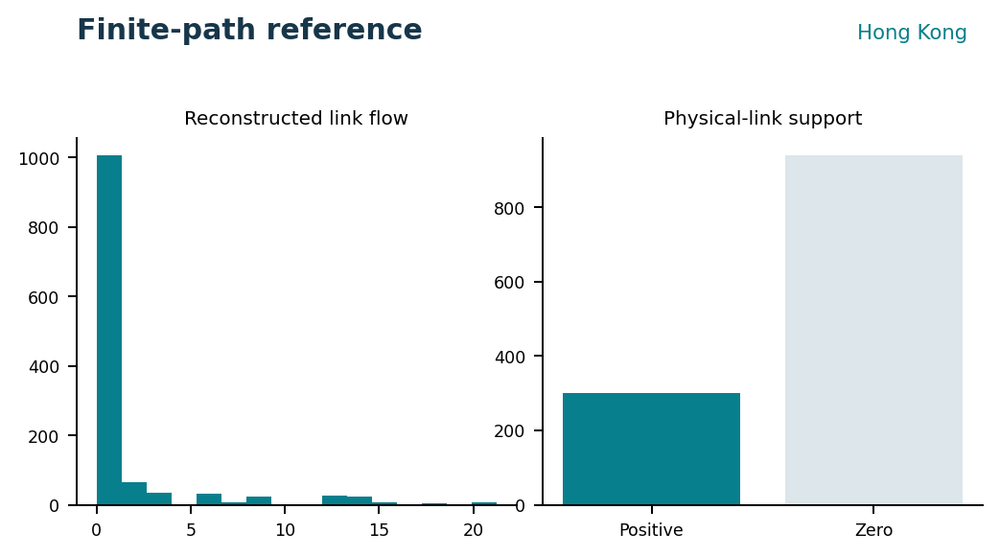</a></td></tr>
<tr class="coverage-preview static-path-network"><td width="266" height="130" valign="middle" align="center"><a href="docs/cases/boston-assignment.md#same-instance-saved-result">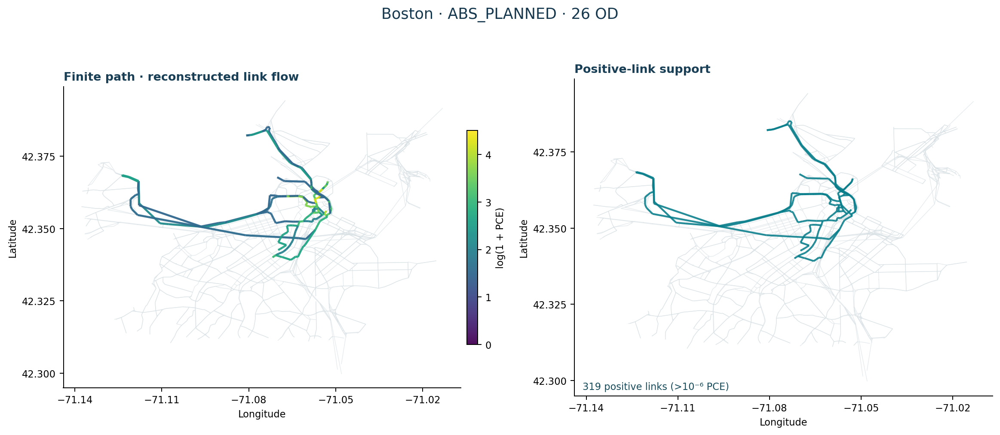</a></td><td width="266" height="130" valign="middle" align="center"><a href="docs/cases/sioux-falls.md#static-assignment">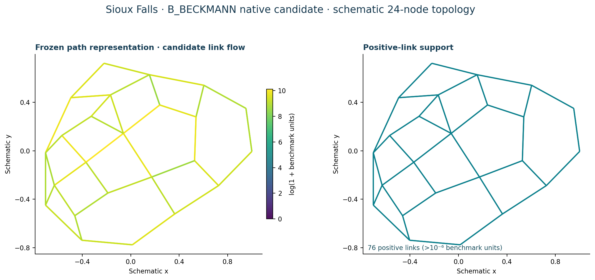</a></td><td width="266" height="130" valign="middle" align="center"><a href="docs/cases/hong-kong-static-assignment.md#bounded-h1-finite-path-and-native-diagnostic-l3">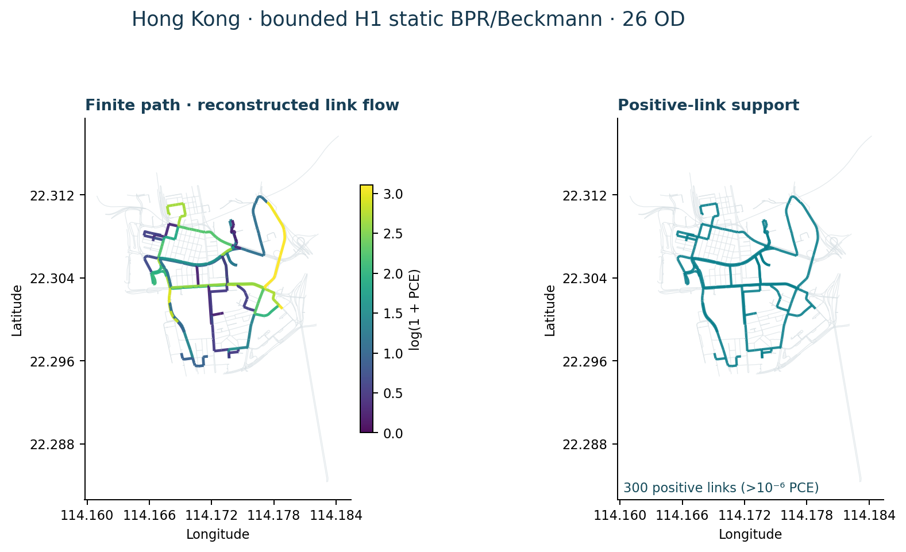</a></td></tr>
<tr class="coverage-caption"><td colspan="3" align="center"><sub>finite-path reconstruction panel</sub></td></tr>
<tr class="coverage-links">
<td width="266"><sub><a href="docs/cases/boston-assignment.md#same-instance-saved-result">Evidence</a> · <a href="docs/assets/homepage_evidence_r2/row_12_boston.png">Distribution</a> · <a href="docs/assets/static_path_parity_r1/boston_finite_network.png">Network</a> · <a href="docs/assets/static_path_parity_r1/boston_finite_network.source.json">Source</a></sub></td>
<td width="266"><sub><a href="docs/cases/sioux-falls.md#static-assignment">Evidence</a> · <a href="docs/assets/homepage_evidence_r2/row_12_sioux_falls.png">Distribution</a> · <a href="docs/assets/static_path_parity_r1/sioux_falls_finite_network.png">Network</a> · <a href="docs/assets/static_path_parity_r1/sioux_falls_finite_network.source.json">Source</a></sub></td>
<td width="266"><sub><a href="docs/cases/hong-kong-static-assignment.md#bounded-h1-finite-path-and-native-diagnostic-l3">Evidence</a> · <a href="docs/assets/static_path_parity_r1/hong_kong_finite_distribution.png">Distribution</a> · <a href="docs/assets/static_path_parity_r1/hong_kong_finite_network.png">Network</a> · <a href="docs/assets/static_path_parity_r1/hong_kong_finite_network.source.json">Source</a></sub></td>
</tr></tbody></table>

<table class="home-coverage" data-component="13" width="100%"><colgroup><col width="33%"><col width="33%"><col width="33%"></colgroup>
<thead><tr><th colspan="3" scope="colgroup" width="800">Native Diagnostic L3 / compression</th></tr>
<tr><th scope="col" width="266">Boston</th><th scope="col" width="266">Sioux Falls</th><th scope="col" width="266">Hong Kong</th></tr></thead><tbody>
<tr class="coverage-scope"><td width="266" valign="top">Rank-26/52 native controls on the same 26-OD ABS_PLANNED instance.</td><td width="266" valign="top">Rank-50 classic static benchmark candidates.</td><td width="266" valign="top">ACCEPTED_BOUNDED_LOW_CONGESTION_TRANSFER — frozen H1 ranks 26 and 52; full-graph relative gap ≈ 2.31×10⁻¹¹; not a compression stress test.</td></tr>
<tr class="coverage-preview static-path-distribution"><td width="266" height="160" valign="middle" align="center"><a href="docs/cases/boston-assignment.md#controlled-comparison-board"></a></td><td width="266" height="160" valign="middle" align="center"><a href="docs/cases/sioux-falls.md#static-assignment"></a></td><td width="266" height="160" valign="middle" align="center"><a href="docs/cases/hong-kong-static-assignment.md#bounded-h1-finite-path-and-native-diagnostic-l3">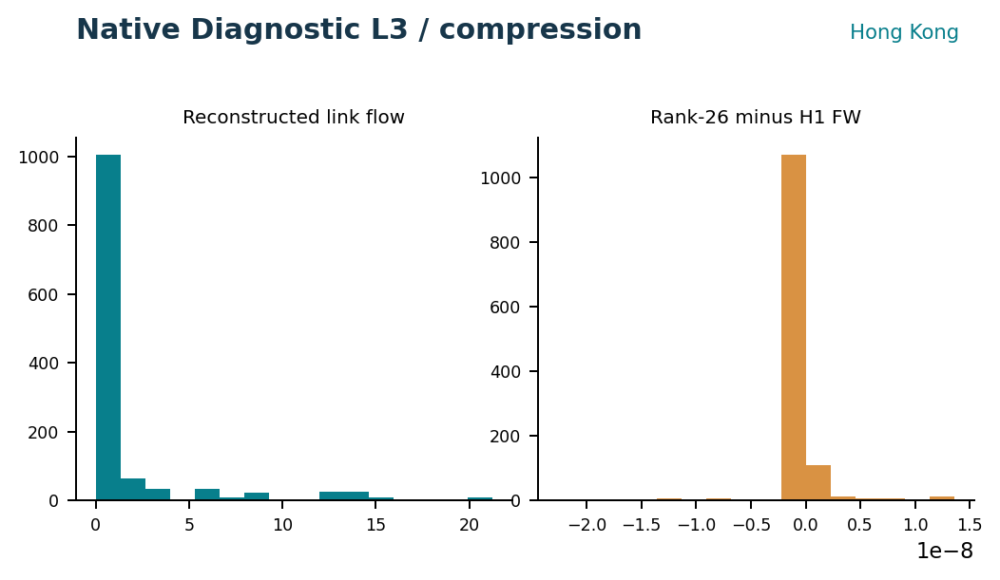</a></td></tr>
<tr class="coverage-preview static-path-network"><td width="266" height="130" valign="middle" align="center"><a href="docs/cases/boston-assignment.md#controlled-comparison-board">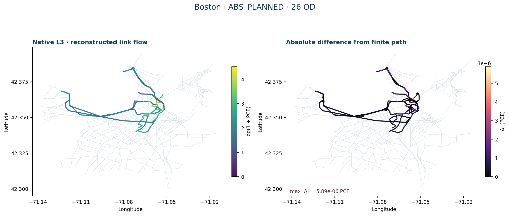</a></td><td width="266" height="130" valign="middle" align="center"><a href="docs/cases/sioux-falls.md#static-assignment">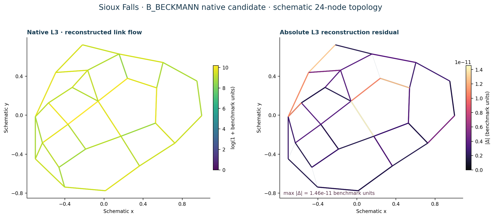</a></td><td width="266" height="130" valign="middle" align="center"><a href="docs/cases/hong-kong-static-assignment.md#bounded-h1-finite-path-and-native-diagnostic-l3">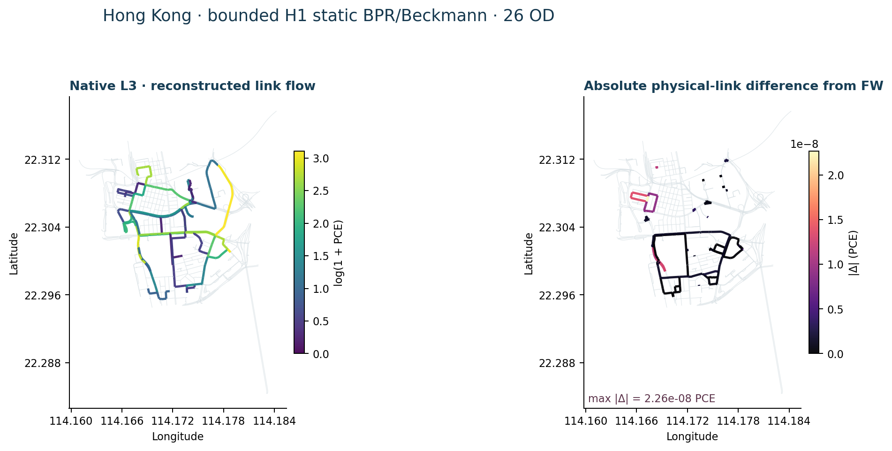</a></td></tr>
<tr class="coverage-caption"><td colspan="3" align="center"><sub>L3 reconstruction/difference panel</sub></td></tr>
<tr class="coverage-links">
<td width="266"><sub><a href="docs/cases/boston-assignment.md#controlled-comparison-board">Evidence</a> · <a href="docs/assets/homepage_evidence_r2/row_13_boston.png">Distribution</a> · <a href="docs/assets/static_path_parity_r1/boston_l3_network.png">Network</a> · <a href="docs/assets/static_path_parity_r1/boston_l3_network.source.json">Source</a></sub></td>
<td width="266"><sub><a href="docs/cases/sioux-falls.md#static-assignment">Evidence</a> · <a href="docs/assets/homepage_evidence_r2/row_13_sioux_falls.png">Distribution</a> · <a href="docs/assets/static_path_parity_r1/sioux_falls_l3_network.png">Network</a> · <a href="docs/assets/static_path_parity_r1/sioux_falls_l3_network.source.json">Source</a></sub></td>
<td width="266"><sub><a href="docs/cases/hong-kong-static-assignment.md#bounded-h1-finite-path-and-native-diagnostic-l3">Evidence</a> · <a href="docs/assets/static_path_parity_r1/hong_kong_l3_distribution.png">Distribution</a> · <a href="docs/assets/static_path_parity_r1/hong_kong_l3_network.png">Network</a> · <a href="docs/assets/static_path_parity_r1/hong_kong_l3_network.source.json">Source</a></sub></td>
</tr></tbody></table>

<a id="d2--finite-time-expanded--fixed-cost-hard-capacity"></a><a id="section03-v"></a>
### V / Finite time-expanded · fixed cost, hard capacity

<table class="home-coverage" data-component="14" width="100%"><colgroup><col width="33%"><col width="33%"><col width="33%"></colgroup>
<thead><tr><th colspan="3" scope="colgroup" width="800">Network construction and generated columns</th></tr>
<tr><th scope="col" width="266">Boston</th><th scope="col" width="266">Sioux Falls</th><th scope="col" width="266">Hong Kong</th></tr></thead><tbody>
<tr class="coverage-scope"><td width="266" valign="top">90-node/125-link/10-OD finite graph; saved time-indexed column.</td><td width="266" valign="top">Selected 200/250-OD finite graphs; saved time-indexed columns.</td><td width="266" valign="top">Approved model-generated HK10 excerpt in the 100-node/111-link/10-OD graph.</td></tr>
<tr class="coverage-preview"><td width="266" align="center"><a href="docs/cases/boston-space-time.md#from-the-physical-network-to-the-finite-time-expanded-graph"></a></td><td width="266" align="center"><a href="docs/cases/sioux-space-time.md#from-the-physical-network-to-the-finite-time-expanded-graph"></a></td><td width="266" align="center"><a href="docs/cases/hong-kong-space-time.md#a-generated-column-as-a-time-indexed-path"></a></td></tr>
<tr class="coverage-caption"><td colspan="3" align="center"><sub>layered physical-to-time graph preview</sub></td></tr>
<tr class="coverage-links">
<td width="266"><sub><a href="docs/cases/boston-space-time.md#from-the-physical-network-to-the-finite-time-expanded-graph">Evidence</a> · <a href="docs/assets/homepage_evidence_r2/row_14_boston.png">Full preview</a> · <a href="docs/assets/three_city_r2/data/boston_construction_edges.csv">Source record</a></sub></td>
<td width="266"><sub><a href="docs/cases/sioux-space-time.md#from-the-physical-network-to-the-finite-time-expanded-graph">Evidence</a> · <a href="docs/assets/homepage_evidence_r2/row_14_sioux_falls.png">Full preview</a> · <a href="docs/assets/three_city_r2/data/sioux_construction_edges.csv">Source record</a></sub></td>
<td width="266"><sub><a href="docs/cases/hong-kong-space-time.md#a-generated-column-as-a-time-indexed-path">Evidence</a> · <a href="docs/assets/homepage_evidence_r2/row_14_hong_kong.png">Full preview</a> · <a href="docs/assets/three_city_r2/data/hong_kong_construction_edges.csv">Source record</a></sub></td>
</tr></tbody></table>

<table class="home-coverage" data-component="15" width="100%"><colgroup><col width="33%"><col width="33%"><col width="33%"></colgroup>
<thead><tr><th colspan="3" scope="colgroup" width="800">Arc-flow LP reference</th></tr>
<tr><th scope="col" width="266">Boston</th><th scope="col" width="266">Sioux Falls</th><th scope="col" width="266">Hong Kong</th></tr></thead><tbody>
<tr class="coverage-scope"><td width="266" valign="top">Own-graph LP reference for the bounded ten-OD fixed-cost instance.</td><td width="266" valign="top">Own selected-graph LP references for historical 200/250 ODs.</td><td width="266" valign="top">Own-graph LP reference for R5 ten-OD finite case.</td></tr>
<tr class="coverage-preview"><td width="266" height="160" valign="middle" align="center"><a href="docs/cases/boston-space-time.md#reference-objective-agreement">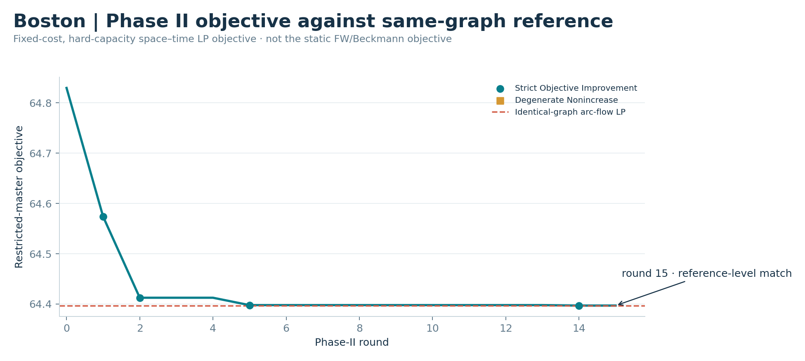</a></td><td width="266" height="160" valign="middle" align="center"><a href="docs/cases/sioux-space-time.md#reference-objective-agreement">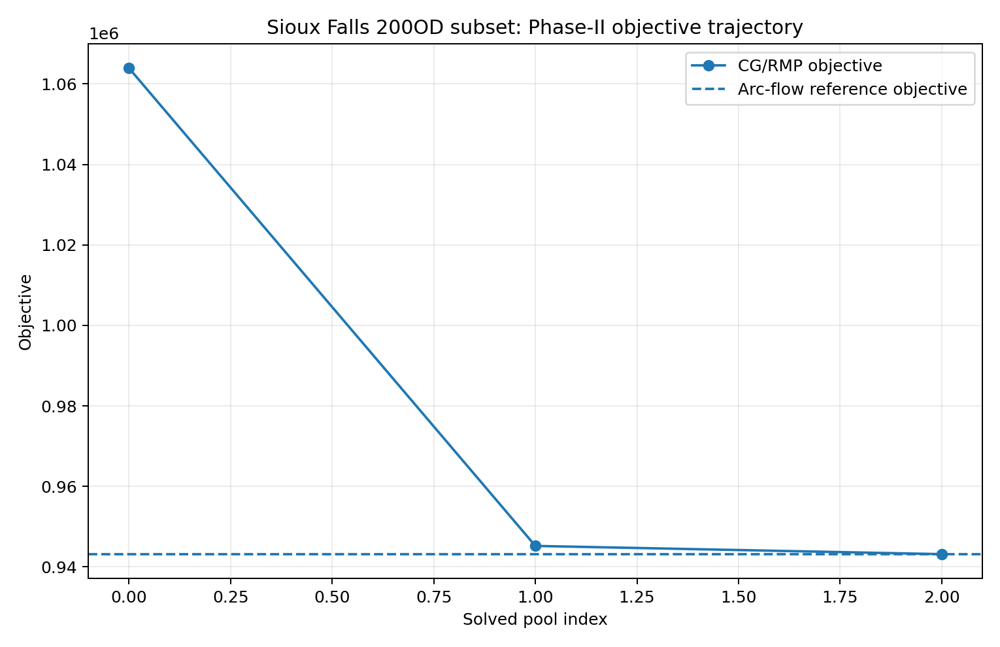</a></td><td width="266" height="160" valign="middle" align="center"><a href="docs/cases/hong-kong-space-time.md#reference-objective-agreement">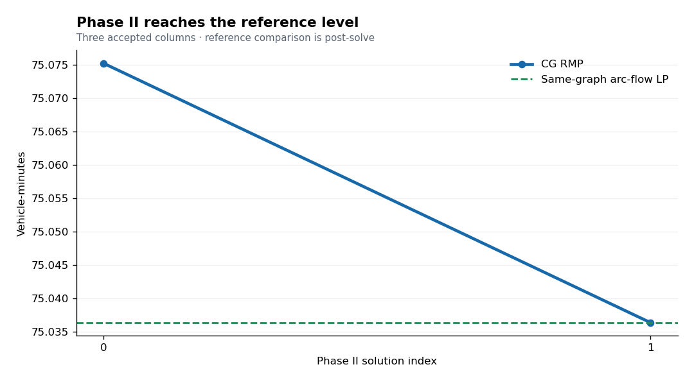</a></td></tr>
<tr class="coverage-caption"><td width="266" align="center"><sub>Phase II reaches the same-graph arc-flow LP reference in the bounded ten-OD case.</sub></td><td width="266" align="center"><sub>The retained 200-OD Phase-II trace approaches its selected-graph arc-flow LP reference; the 250-OD trace remains available in the detailed case page.</sub></td><td width="266" align="center"><sub>R5 Phase II reaches the same-graph arc-flow LP reference in the bounded ten-OD case.</sub></td></tr>
<tr class="coverage-links">
<td width="266"><sub><a href="docs/cases/boston-space-time.md#reference-objective-agreement">Evidence</a> · <a href="docs/assets/boston/space_time_cg_r4/boston_phase_ii_objective.png">Full figure</a> · <a href="docs/assets/boston/space_time_cg_r4/data/validation_summary.json">Source record</a></sub></td>
<td width="266"><sub><a href="docs/cases/sioux-space-time.md#reference-objective-agreement">Evidence</a> · <a href="docs/assets/benchmarks/sioux_200od_phase2_objective_trace.png">Full figure</a> · <a href="docs/assets/sioux/phase_i_r1/data/200_phase_ii_trace.csv">Source record</a></sub></td>
<td width="266"><sub><a href="docs/cases/hong-kong-space-time.md#reference-objective-agreement">Evidence</a> · <a href="docs/assets/hong_kong/full_stack_r5/figures/hk_cg_phase_ii_objective.png">Full figure</a> · <a href="docs/assets/hong_kong/full_stack_r5/cg_run/full_cg_v1_phase_ii_objective_trace.csv">Source record</a></sub></td>
</tr></tbody></table>

<table class="home-coverage" data-component="16" width="100%"><colgroup><col width="33%"><col width="33%"><col width="33%"></colgroup>
<thead><tr><th colspan="3" scope="colgroup" width="800">Two-phase column generation</th></tr>
<tr><th scope="col" width="266">Boston</th><th scope="col" width="266">Sioux Falls</th><th scope="col" width="266">Hong Kong</th></tr></thead><tbody>
<tr class="coverage-scope"><td width="266" valign="top">Phase I/II and independent 10/10 pricing closure.</td><td width="266" valign="top">200/250-OD own-LP agreement; independent full-DAG closure not established.</td><td width="266" valign="top">Phase I/II, same-graph LP agreement and independent 10/10 closure.</td></tr>
<tr class="coverage-preview"><td width="266" align="center"><a href="docs/cases/boston-space-time.md#phase-i-restores-feasibility"></a></td><td width="266" align="center"><a href="docs/cases/sioux-space-time.md#phase-i-restores-feasibility"></a></td><td width="266" align="center"><a href="docs/cases/hong-kong-space-time.md#phase-i-restores-feasibility"></a></td></tr>
<tr class="coverage-caption"><td colspan="3" align="center"><sub>Phase I / Phase II / final-check triptych</sub></td></tr>
<tr class="coverage-links">
<td width="266"><sub><a href="docs/cases/boston-space-time.md#phase-i-restores-feasibility">Evidence</a> · <a href="docs/assets/homepage_evidence_r2/row_16_boston.png">Full preview</a> · <a href="docs/assets/boston/space_time_cg_r4/data/phase_i_total.csv">Source record</a></sub></td>
<td width="266"><sub><a href="docs/cases/sioux-space-time.md#phase-i-restores-feasibility">Evidence</a> · <a href="docs/assets/homepage_evidence_r2/row_16_sioux_falls.png">Full preview</a> · <a href="docs/assets/sioux/phase_i_r1/data/200_phase_i_trace.csv">Source record</a></sub></td>
<td width="266"><sub><a href="docs/cases/hong-kong-space-time.md#phase-i-restores-feasibility">Evidence</a> · <a href="docs/assets/homepage_evidence_r2/row_16_hong_kong.png">Full preview</a> · <a href="docs/assets/hong_kong/full_stack_r5/cg_run/full_cg_v1_phase_i_artificial_flow_trace.csv">Source record</a></sub></td>
</tr></tbody></table>

<table class="home-coverage" data-component="17" width="100%"><colgroup><col width="33%"><col width="33%"><col width="33%"></colgroup>
<thead><tr><th colspan="3" scope="colgroup" width="800">Lagrangian</th></tr>
<tr><th scope="col" width="266">Boston</th><th scope="col" width="266">Sioux Falls</th><th scope="col" width="266">Hong Kong</th></tr></thead><tbody>
<tr class="coverage-scope"><td width="266" valign="top">Feasible primal, but frozen 1% gap gate missed (1.1002%).</td><td width="266" valign="top">Selected 200/250-OD feasible recovery and certified bounded gaps.</td><td width="266" valign="top">Ten-OD feasible recovery with 0.7444% certified gap.</td></tr>
<tr class="coverage-preview"><td width="266" align="center"><a href="docs/cases/boston.md#finite-time-expanded-algorithms"></a></td><td width="266" align="center"><a href="docs/methods/distributed-assignment.md"></a></td><td width="266" align="center"><a href="docs/cases/hong-kong-space-time.md"></a></td></tr>
<tr class="coverage-caption"><td colspan="3" align="center"><sub>dual/primal/gap summary</sub></td></tr>
<tr class="coverage-links">
<td width="266"><sub><a href="docs/cases/boston.md#finite-time-expanded-algorithms">Evidence</a> · <a href="docs/assets/homepage_evidence_r2/row_17_boston.png">Full preview</a> · <a href="docs/cases/boston.md">Source record</a></sub></td>
<td width="266"><sub><a href="docs/methods/distributed-assignment.md">Evidence</a> · <a href="docs/assets/homepage_evidence_r2/row_17_sioux_falls.png">Full preview</a> · <a href="docs/methods/distributed-assignment.md">Source record</a></sub></td>
<td width="266"><sub><a href="docs/cases/hong-kong-space-time.md">Evidence</a> · <a href="docs/assets/homepage_evidence_r2/row_17_hong_kong.png">Full preview</a> · <a href="docs/assets/hong_kong/full_stack_r5/r2r4_baseline/phase_c/lagrangian_run/history.csv">Source record</a></sub></td>
</tr></tbody></table>

<table class="home-coverage" data-component="18" width="100%"><colgroup><col width="33%"><col width="33%"><col width="33%"></colgroup>
<thead><tr><th colspan="3" scope="colgroup" width="800">ADMM</th></tr>
<tr><th scope="col" width="266">Boston</th><th scope="col" width="266">Sioux Falls</th><th scope="col" width="266">Hong Kong</th></tr></thead><tbody>
<tr class="coverage-scope"><td width="266" valign="top">Ten-OD original-space checks; own-LP gap 6.68e-6.</td><td width="266" valign="top">Selected 200/250-OD original-space checks; not the full static 528 ODs.</td><td width="266" valign="top">Frozen transfer diagnostic; no accepted Hong Kong ADMM objective.</td></tr>
<tr class="coverage-preview"><td width="266" align="center"><a href="docs/cases/boston-admm.md"></a></td><td width="266" align="center"><a href="docs/cases/sioux-admm.md"></a></td><td width="266" align="center"><a href="docs/cases/hong-kong-space-time.md"></a></td></tr>
<tr class="coverage-caption"><td colspan="3" align="center"><sub>residual/objective/flow summary</sub></td></tr>
<tr class="coverage-links">
<td width="266"><sub><a href="docs/cases/boston-admm.md">Evidence</a> · <a href="docs/assets/homepage_evidence_r2/row_18_boston.png">Full preview</a> · <a href="docs/assets/admm_r2/figures/admm_boston_10od_case_sequence.png">Source record</a></sub></td>
<td width="266"><sub><a href="docs/cases/sioux-admm.md">Evidence</a> · <a href="docs/assets/homepage_evidence_r2/row_18_sioux_falls.png">Full preview</a> · <a href="docs/assets/admm_r2/figures/admm_sioux_200_case_sequence.png">Source record</a></sub></td>
<td width="266"><sub><a href="docs/cases/hong-kong-space-time.md">Evidence</a> · <a href="docs/assets/homepage_evidence_r2/row_18_hong_kong.png">Full preview</a> · <a href="docs/assets/hong_kong/full_stack_r5/r2r4_baseline/phase_c/admm_run/result.json">Source record</a></sub></td>
</tr></tbody></table>

<a id="e--reusable-outputs-and-tools"></a><a id="section03-vi"></a>
### VI / Reusable outputs and tools

Reusable queries, exports, saved examples, and checks remain linked from the [Boston](docs/cases/boston.md#reproduction), [Sioux Falls](docs/cases/sioux-falls.md#reproduction), and [Hong Kong](docs/cases/hong-kong.md#reproduction) case entries and the [getting-started guide](docs/getting-started.md).

<a id="cg-experiments"></a><a id="admm-r2"></a><a id="algorithm-b"></a><a id="distributed-assignment"></a>
The [cross-case CG evidence](docs/methods/space-time-cg.md#cg-experiments), [ADMM](docs/methods/admm-space-time.md), [official tap-b Algorithm B method](docs/methods/origin-based-algorithm-b.md) and [adapter distinction](docs/integrations/taplab-tapb.md), and [Lagrangian records](docs/methods/distributed-assignment.md) retain their full figure families. Boston and Hong Kong have independent 10/10 pricing closure on **different** ten-demand graphs; this is not imputed to the historical Sioux runs.
## 04 / Explore the three cases

Each city has a complete stage atlas. The same stage order is used throughout; different data, static and finite instance scales are never combined into a single case size.

<a id="computational-depth-legend"></a>
**A — Native assignment**  
**B — Decomposition and distributed computation**  
**C — Spatial hierarchy and representation**  
**D — Coordination and verification**

A–D are reading labels for computational depth. City-data and four-stage-demand evidence remain outside A–D. The current repository demonstrates coordination and verification components.

<a id="boston"></a>
<article class="case-atlas" data-city="boston">
<h3>Boston</h3>
<p>City GMNS, population/demand, MBTA/GPS linkage and separate bounded static and finite computations. <a href="docs/cases/boston.md">Open complete case →</a></p>
<a href="docs/cases/boston.md"></a>
<table class="atlas-quick-facts" width="100%"><colgroup><col width="25%"><col width="25%"><col width="25%"><col width="25%"></colgroup><thead><tr><th width="200">City/model foundation</th><th width="200">Static assignment</th><th width="200">Finite time-expanded</th><th width="200">Observation/data scope</th></tr></thead>
<tbody><tr><td width="200">2,852 physical nodes; 5,091 directed links; 177 H3 fine zones</td><td width="200">B1: 453 ODs / 1,936.238475 PCE in 2 h; expanded FW and 26-OD controls are distinct</td><td width="200">90 nodes; 125 links; 10 ODs</td><td width="200">MBTA inputs and exploratory GPS matching; no held-out citywide calibration</td></tr></tbody></table>
<a id="boston-tools"></a>
<p class="atlas-nav"><a href="#boston-sources">Sources and GMNS</a> · <a href="#boston-population">Population, households and activity</a> · <a href="#boston-transit">Transit and observations</a> · <a href="#boston-generation">Trip generation</a> · <a href="#boston-distribution">Trip distribution</a> · <a href="#boston-mode">Mode choice</a> · <a href="#boston-static">Static assignment methods</a> · <a href="#boston-finite">Finite time-expanded computation</a> · <a href="docs/cases/boston.md#reproduction">Tools and reproducibility</a></p>
<table class="atlas-city-table" data-city="boston" data-stage="boston-sources" width="100%"><colgroup><col width="33.333%"><col width="33.333%"><col width="33.333%"></colgroup><thead>
<tr class="atlas-stage-heading" data-stage="boston-sources" data-columns="3" data-items="3"><th colspan="3" scope="colgroup" width="800"><a id="boston-sources"></a>Sources and GMNS</th></tr></thead><tbody>
<tr class="atlas-card-title-row" data-stage="boston-sources">
<th width="266" class="atlas-title-cell" scope="col"><strong>Source data and preparation</strong></th>
<th width="266" class="atlas-title-cell" scope="col"><strong>GMNS network, zones and access</strong> <a class="atlas-depth-badge" href="#computational-depth-legend" title="C — Spatial hierarchy and representation" aria-label="C — Spatial hierarchy and representation"></a></th>
<th width="266" class="atlas-title-cell" scope="col"><strong>Special zones and access</strong> <a class="atlas-depth-badge" href="#computational-depth-legend" title="C — Spatial hierarchy and representation" aria-label="C — Spatial hierarchy and representation"></a></th>
</tr>
<tr class="atlas-card-preview-row" data-stage="boston-sources">
<td width="266" class="atlas-card-cell"><a href="docs/cases/boston.md#gmns-zones-and-source-evidence"></a></td>
<td width="266" class="atlas-card-cell"><a href="docs/cases/boston.md#gmns-zones-and-source-evidence"></a></td>
<td width="266" class="atlas-card-cell"><a href="docs/cases/boston.md#gmns-zones-and-source-evidence"></a></td>
</tr>
<tr class="atlas-card-meta-row" data-stage="boston-sources">
<td width="266" class="atlas-meta-cell"><small class="atlas-meta">GMNS Plus, ACS/GTFS and registered source preparation.</small></td>
<td width="266" class="atlas-meta-cell"><small class="atlas-meta">5,091 physical links; 177 H3 fine zones, nine parents; connectors separate.</small></td>
<td width="266" class="atlas-meta-cell"><small class="atlas-meta">GMNS · Central Boston</small></td>
</tr>
<tr class="atlas-card-links-row" data-stage="boston-sources">
<td width="266" class="atlas-links-cell"><small class="atlas-links"><a href="docs/cases/boston.md#gmns-zones-and-source-evidence">Evidence</a> · <a href="docs/assets/homepage_evidence_r2/row_01_boston.png">Figure</a></small></td>
<td width="266" class="atlas-links-cell"><small class="atlas-links"><a href="docs/cases/boston.md#gmns-zones-and-source-evidence">Evidence</a> · <a href="docs/assets/homepage_evidence_r2/row_02_boston.png">Figure</a></small></td>
<td width="266" class="atlas-links-cell"><small class="atlas-links"><a href="docs/cases/boston.md#gmns-zones-and-source-evidence">Evidence</a> · <a href="docs/assets/boston/visual_release_r1/boston_network_zones.png">Figure</a></small></td>
</tr>
</tbody></table>
<table class="atlas-city-table" data-city="boston" data-stage="boston-population" width="100%"><colgroup><col width="50%"><col width="50%"></colgroup><thead>
<tr class="atlas-stage-heading" data-stage="boston-population" data-columns="2" data-items="2"><th colspan="2" scope="colgroup" width="800"><a id="boston-population"></a>Population, households and activity</th></tr></thead><tbody>
<tr class="atlas-card-title-row" data-stage="boston-population">
<th width="400" class="atlas-title-cell" scope="col"><strong>Population, households and activity</strong></th>
<th width="400" class="atlas-title-cell" scope="col"><strong>ACS/H3 allocation</strong></th>
</tr>
<tr class="atlas-card-preview-row" data-stage="boston-population">
<td width="400" class="atlas-card-cell"><a href="docs/datasets/boston-population-households.md"></a></td>
<td width="400" class="atlas-card-cell"><a href="docs/datasets/boston-population-households.md"></a></td>
</tr>
<tr class="atlas-card-meta-row" data-stage="boston-population">
<td width="400" class="atlas-meta-cell"><small class="atlas-meta">ACS 2024 five-year block groups allocated to 177 clipped H3 zones.</small></td>
<td width="400" class="atlas-meta-cell"><small class="atlas-meta">Population · ACS 2024 five-year</small></td>
</tr>
<tr class="atlas-card-links-row" data-stage="boston-population">
<td width="400" class="atlas-links-cell"><small class="atlas-links"><a href="docs/datasets/boston-population-households.md">Evidence</a> · <a href="docs/assets/homepage_evidence_r2/row_03_boston.png">Figure</a></small></td>
<td width="400" class="atlas-links-cell"><small class="atlas-links"><a href="docs/datasets/boston-population-households.md">Evidence</a> · <a href="docs/assets/boston/population_r1/population_allocation.png">Figure</a></small></td>
</tr>
</tbody></table>
<table class="atlas-city-table" data-city="boston" data-stage="boston-transit" width="100%"><colgroup><col width="33.333%"><col width="33.333%"><col width="33.333%"></colgroup><thead>
<tr class="atlas-stage-heading" data-stage="boston-transit" data-columns="3" data-items="3"><th colspan="3" scope="colgroup" width="800"><a id="boston-transit"></a>Transit and observations</th></tr></thead><tbody>
<tr class="atlas-card-title-row" data-stage="boston-transit">
<th width="266" class="atlas-title-cell" scope="col"><strong>Transit and pedestrian inputs</strong></th>
<th width="266" class="atlas-title-cell" scope="col"><strong>GPS, trajectory and detector evidence</strong></th>
<th width="266" class="atlas-title-cell" scope="col"><strong>GPS point-to-road projection</strong></th>
</tr>
<tr class="atlas-card-preview-row" data-stage="boston-transit">
<td width="266" class="atlas-card-cell"><a href="docs/cases/boston.md#demand-transit-and-observations"></a></td>
<td width="266" class="atlas-card-cell"><a href="docs/datasets/boston-behavior-feedback.md"></a></td>
<td width="266" class="atlas-card-cell"><a href="docs/datasets/boston-central.md#one-saved-transit-position-projection"></a></td>
</tr>
<tr class="atlas-card-meta-row" data-stage="boston-transit">
<td width="266" class="atlas-meta-cell"><small class="atlas-meta">MBTA service and pedestrian access support the bounded demand/feedback example.</small></td>
<td width="266" class="atlas-meta-cell"><small class="atlas-meta">Exploratory map matching and service feedback; not held-out calibration.</small></td>
<td width="266" class="atlas-meta-cell"><small class="atlas-meta">GPS map matching · 12 saved MBTA positions</small></td>
</tr>
<tr class="atlas-card-links-row" data-stage="boston-transit">
<td width="266" class="atlas-links-cell"><small class="atlas-links"><a href="docs/cases/boston.md#demand-transit-and-observations">Evidence</a> · <a href="docs/assets/homepage_evidence_r2/row_04_boston.png">Figure</a></small></td>
<td width="266" class="atlas-links-cell"><small class="atlas-links"><a href="docs/datasets/boston-behavior-feedback.md">Evidence</a> · <a href="docs/assets/homepage_evidence_r2/row_05_boston.png">Figure</a></small></td>
<td width="266" class="atlas-links-cell"><small class="atlas-links"><a href="docs/datasets/boston-central.md#one-saved-transit-position-projection">Evidence</a> · <a href="docs/assets/boston/visual_release_r1/boston_gps_projection.png">Figure</a></small></td>
</tr>
</tbody></table>
<table class="atlas-city-table" data-city="boston" data-stage="boston-generation" width="100%"><colgroup><col width="50%"><col width="50%"></colgroup><thead>
<tr class="atlas-stage-heading" data-stage="boston-generation" data-columns="2" data-items="2"><th colspan="2" scope="colgroup" width="800"><a id="boston-generation"></a>Trip generation</th></tr></thead><tbody>
<tr class="atlas-card-title-row" data-stage="boston-generation">
<th width="400" class="atlas-title-cell" scope="col"><strong>Trip generation — productions / attractions</strong></th>
<th width="400" class="atlas-title-cell" scope="col"><strong>Generation by purpose</strong></th>
</tr>
<tr class="atlas-card-preview-row" data-stage="boston-generation">
<td width="400" class="atlas-card-cell"><a href="docs/cases/boston.md#demand-transit-and-observations"></a></td>
<td width="400" class="atlas-card-cell"><a href="docs/cases/boston.md#stage-01-trip-generation"></a></td>
</tr>
<tr class="atlas-card-meta-row" data-stage="boston-generation">
<td width="400" class="atlas-meta-cell"><small class="atlas-meta">Purpose-level productions and attractions in the bounded Boston example.</small></td>
<td width="400" class="atlas-meta-cell"><small class="atlas-meta">Trip generation · bounded example</small></td>
</tr>
<tr class="atlas-card-links-row" data-stage="boston-generation">
<td width="400" class="atlas-links-cell"><small class="atlas-links"><a href="docs/cases/boston.md#demand-transit-and-observations">Evidence</a> · <a href="docs/assets/homepage_evidence_r2/row_06_boston.png">Figure</a></small></td>
<td width="400" class="atlas-links-cell"><small class="atlas-links"><a href="docs/cases/boston.md#stage-01-trip-generation">Evidence</a> · <a href="docs/assets/boston/four_step_results_r1/step1_generation.png">Figure</a></small></td>
</tr>
</tbody></table>
<table class="atlas-city-table" data-city="boston" data-stage="boston-distribution" width="100%"><colgroup><col width="50%"><col width="50%"></colgroup><thead>
<tr class="atlas-stage-heading" data-stage="boston-distribution" data-columns="2" data-items="2"><th colspan="2" scope="colgroup" width="800"><a id="boston-distribution"></a>Trip distribution</th></tr></thead><tbody>
<tr class="atlas-card-title-row" data-stage="boston-distribution">
<th width="400" class="atlas-title-cell" scope="col"><strong>Trip distribution — zonal OD demand</strong></th>
<th width="400" class="atlas-title-cell" scope="col"><strong>HBW OD distribution</strong></th>
</tr>
<tr class="atlas-card-preview-row" data-stage="boston-distribution">
<td width="400" class="atlas-card-cell"><a href="docs/cases/boston.md#demand-transit-and-observations"></a></td>
<td width="400" class="atlas-card-cell"><a href="docs/cases/boston.md#stage-02-trip-distribution"></a></td>
</tr>
<tr class="atlas-card-meta-row" data-stage="boston-distribution">
<td width="400" class="atlas-meta-cell"><small class="atlas-meta">Zonal OD construction for the bounded semantic scenario.</small></td>
<td width="400" class="atlas-meta-cell"><small class="atlas-meta">Trip distribution · bounded example</small></td>
</tr>
<tr class="atlas-card-links-row" data-stage="boston-distribution">
<td width="400" class="atlas-links-cell"><small class="atlas-links"><a href="docs/cases/boston.md#demand-transit-and-observations">Evidence</a> · <a href="docs/assets/homepage_evidence_r2/row_07_boston.png">Figure</a></small></td>
<td width="400" class="atlas-links-cell"><small class="atlas-links"><a href="docs/cases/boston.md#stage-02-trip-distribution">Evidence</a> · <a href="docs/assets/boston/four_step_results_r1/step2_distribution.png">Figure</a></small></td>
</tr>
</tbody></table>
<table class="atlas-city-table" data-city="boston" data-stage="boston-mode" width="100%"><colgroup><col width="50%"><col width="50%"></colgroup><thead>
<tr class="atlas-stage-heading" data-stage="boston-mode" data-columns="2" data-items="2"><th colspan="2" scope="colgroup" width="800"><a id="boston-mode"></a>Mode choice</th></tr></thead><tbody>
<tr class="atlas-card-title-row" data-stage="boston-mode">
<th width="400" class="atlas-title-cell" scope="col"><strong>Mode choice — mode-specific demand</strong></th>
<th width="400" class="atlas-title-cell" scope="col"><strong>Service-response mode choice</strong></th>
</tr>
<tr class="atlas-card-preview-row" data-stage="boston-mode">
<td width="400" class="atlas-card-cell"><a href="docs/cases/boston.md#demand-transit-and-observations"></a></td>
<td width="400" class="atlas-card-cell"><a href="docs/cases/boston.md#stage-03-mode-choice"></a></td>
</tr>
<tr class="atlas-card-meta-row" data-stage="boston-mode">
<td width="400" class="atlas-meta-cell"><small class="atlas-meta">S1/S2 service response and conditional absolute choice remain separate.</small></td>
<td width="400" class="atlas-meta-cell"><small class="atlas-meta">Mode choice · S1/S2 sensitivity</small></td>
</tr>
<tr class="atlas-card-links-row" data-stage="boston-mode">
<td width="400" class="atlas-links-cell"><small class="atlas-links"><a href="docs/cases/boston.md#demand-transit-and-observations">Evidence</a> · <a href="docs/assets/homepage_evidence_r2/row_08_boston.png">Figure</a></small></td>
<td width="400" class="atlas-links-cell"><small class="atlas-links"><a href="docs/cases/boston.md#stage-03-mode-choice">Evidence</a> · <a href="docs/assets/boston/four_step_results_r1/step3_mode_response.png">Figure</a></small></td>
</tr>
</tbody></table>
<table class="atlas-city-table" data-city="boston" data-stage="boston-static" width="100%"><colgroup><col width="25%"><col width="25%"><col width="25%"><col width="25%"></colgroup><thead>
<tr class="atlas-stage-heading" data-stage="boston-static" data-columns="4" data-items="4"><th colspan="4" scope="colgroup" width="800"><a id="boston-static"></a>Static assignment methods</th></tr></thead><tbody>
<tr class="atlas-card-title-row" data-stage="boston-static">
<th width="200" class="atlas-title-cell" scope="col"><strong>Frank–Wolfe</strong> <a class="atlas-depth-badge" href="#computational-depth-legend" title="A — Native assignment" aria-label="A — Native assignment"></a></th>
<th width="200" class="atlas-title-cell" scope="col"><strong>Official tap-b Algorithm B</strong> <a class="atlas-depth-badge" href="#computational-depth-legend" title="A — Native assignment" aria-label="A — Native assignment"></a></th>
<th width="200" class="atlas-title-cell" scope="col"><strong>Finite-path reference</strong> <a class="atlas-depth-badge" href="#computational-depth-legend" title="A — Native assignment" aria-label="A — Native assignment"></a></th>
<th width="200" class="atlas-title-cell" scope="col"><strong>Native Diagnostic L3 / compression</strong> <a class="atlas-depth-badge" href="#computational-depth-legend" title="A — Native assignment" aria-label="A — Native assignment"></a></th>
</tr>
<tr class="atlas-card-preview-row" data-stage="boston-static">
<td width="200" class="atlas-card-cell"><a href="docs/cases/boston-assignment.md#primary-scale-result-versus-controlled-method-comparison"></a></td>
<td width="200" class="atlas-card-cell"><a href="docs/cases/boston-algorithm-b.md"></a></td>
<td width="200" class="atlas-card-cell"><a href="docs/cases/boston-assignment.md#same-instance-saved-result"></a></td>
<td width="200" class="atlas-card-cell"><a href="docs/cases/boston-assignment.md#controlled-comparison-board"></a></td>
</tr>
<tr class="atlas-card-meta-row" data-stage="boston-static">
<td width="200" class="atlas-meta-cell"><small class="atlas-meta">Expanded Boston FW, up to 17,522 loaded node ODs; separate from 26-OD controls.</small></td>
<td width="200" class="atlas-meta-cell"><small class="atlas-meta">B0/B1 numerical transfer via task-local lossless TAPLab-compatible adapter.</small></td>
<td width="200" class="atlas-meta-cell"><small class="atlas-meta">26 OD, 130-path uncompressed SLSQP reference on ABS_PLANNED.</small></td>
<td width="200" class="atlas-meta-cell"><small class="atlas-meta">ABS_PLANNED 26-OD; rank-26 diagnostic</small></td>
</tr>
<tr class="atlas-card-links-row" data-stage="boston-static">
<td width="200" class="atlas-links-cell"><small class="atlas-links"><a href="docs/cases/boston-assignment.md#primary-scale-result-versus-controlled-method-comparison">Evidence</a> · <a href="docs/assets/homepage_evidence_r2/row_10_boston.png">Figure</a></small></td>
<td width="200" class="atlas-links-cell"><small class="atlas-links"><a href="docs/cases/boston-algorithm-b.md">Evidence</a> · <a href="docs/assets/homepage_evidence_r2/row_11_boston.png">Figure</a></small></td>
<td width="200" class="atlas-links-cell"><small class="atlas-links"><a href="docs/cases/boston-assignment.md#same-instance-saved-result">Evidence</a> · <a href="docs/assets/homepage_evidence_r2/row_12_boston.png">Figure</a></small></td>
<td width="200" class="atlas-links-cell"><small class="atlas-links"><a href="docs/cases/boston-assignment.md#controlled-comparison-board">Evidence</a> · <a href="docs/assets/boston/assignment_methods_r1/boston_abs_planned_l3_rank26_flow.png">Figure</a></small></td>
</tr>
</tbody></table>
<table class="atlas-city-table" data-city="boston" data-stage="boston-finite" width="100%"><colgroup><col width="25%"><col width="25%"><col width="25%"><col width="25%"></colgroup><thead>
<tr class="atlas-stage-heading" data-stage="boston-finite" data-columns="4" data-items="15"><th colspan="4" scope="colgroup" width="800"><a id="boston-finite"></a>Finite time-expanded computation</th></tr></thead><tbody>
<tr class="atlas-card-title-row" data-stage="boston-finite">
<th width="200" class="atlas-title-cell" scope="col"><strong>Network construction and generated columns</strong> <a class="atlas-depth-badge" href="#computational-depth-legend" title="B — Decomposition and distributed computation; C — Spatial hierarchy and representation" aria-label="B — Decomposition and distributed computation; C — Spatial hierarchy and representation"></a></th>
<th width="200" class="atlas-title-cell" scope="col"><strong>Arc-flow LP reference</strong> <a class="atlas-depth-badge" href="#computational-depth-legend" title="D — Coordination and verification" aria-label="D — Coordination and verification"></a></th>
<th width="200" class="atlas-title-cell" scope="col"><strong>Two-phase column generation</strong> <a class="atlas-depth-badge" href="#computational-depth-legend" title="B — Decomposition and distributed computation" aria-label="B — Decomposition and distributed computation"></a></th>
<th width="200" class="atlas-title-cell" scope="col"><strong>Lagrangian</strong> <a class="atlas-depth-badge" href="#computational-depth-legend" title="B — Decomposition and distributed computation; D — Coordination and verification" aria-label="B — Decomposition and distributed computation; D — Coordination and verification"></a></th>
</tr>
<tr class="atlas-card-preview-row" data-stage="boston-finite">
<td width="200" class="atlas-card-cell"><a href="docs/cases/boston-space-time.md#from-the-physical-network-to-the-finite-time-expanded-graph"></a></td>
<td width="200" class="atlas-card-cell"><a href="docs/cases/boston-space-time.md#reference-objective-agreement"></a></td>
<td width="200" class="atlas-card-cell"><a href="docs/cases/boston-space-time.md#phase-i-restores-feasibility"></a></td>
<td width="200" class="atlas-card-cell"><a href="docs/cases/boston.md#finite-time-expanded-algorithms"></a></td>
</tr>
<tr class="atlas-card-meta-row" data-stage="boston-finite">
<td width="200" class="atlas-meta-cell"><small class="atlas-meta">90-node/125-link/10-OD finite graph; saved time-indexed column.</small></td>
<td width="200" class="atlas-meta-cell"><small class="atlas-meta">Own-graph LP reference for the bounded ten-OD fixed-cost instance.</small></td>
<td width="200" class="atlas-meta-cell"><small class="atlas-meta">Phase I/II and independent 10/10 pricing closure.</small></td>
<td width="200" class="atlas-meta-cell"><small class="atlas-meta">Feasible primal, but frozen 1% gap gate missed (1.1002%).</small></td>
</tr>
<tr class="atlas-card-links-row" data-stage="boston-finite">
<td width="200" class="atlas-links-cell"><small class="atlas-links"><a href="docs/cases/boston-space-time.md#from-the-physical-network-to-the-finite-time-expanded-graph">Evidence</a> · <a href="docs/assets/homepage_evidence_r2/row_14_boston.png">Figure</a></small></td>
<td width="200" class="atlas-links-cell"><small class="atlas-links"><a href="docs/cases/boston-space-time.md#reference-objective-agreement">Evidence</a> · <a href="docs/assets/boston/space_time_cg_r4/boston_phase_ii_objective.png">Figure</a></small></td>
<td width="200" class="atlas-links-cell"><small class="atlas-links"><a href="docs/cases/boston-space-time.md#phase-i-restores-feasibility">Evidence</a> · <a href="docs/assets/homepage_evidence_r2/row_16_boston.png">Figure</a></small></td>
<td width="200" class="atlas-links-cell"><small class="atlas-links"><a href="docs/cases/boston.md#finite-time-expanded-algorithms">Evidence</a> · <a href="docs/assets/homepage_evidence_r2/row_17_boston.png">Figure</a></small></td>
</tr>
<tr class="atlas-card-title-row" data-stage="boston-finite">
<th width="200" class="atlas-title-cell" scope="col"><strong>ADMM</strong> <a class="atlas-depth-badge" href="#computational-depth-legend" title="B — Decomposition and distributed computation; D — Coordination and verification" aria-label="B — Decomposition and distributed computation; D — Coordination and verification"></a></th>
<th width="200" class="atlas-title-cell" scope="col"><strong>Case-sequence overview</strong></th>
<th width="200" class="atlas-title-cell" scope="col"><strong>Physical to time-expanded graph</strong> <a class="atlas-depth-badge" href="#computational-depth-legend" title="C — Spatial hierarchy and representation" aria-label="C — Spatial hierarchy and representation"></a></th>
<th width="200" class="atlas-title-cell" scope="col"><strong>Generated time-indexed column</strong> <a class="atlas-depth-badge" href="#computational-depth-legend" title="B — Decomposition and distributed computation; C — Spatial hierarchy and representation" aria-label="B — Decomposition and distributed computation; C — Spatial hierarchy and representation"></a></th>
</tr>
<tr class="atlas-card-preview-row" data-stage="boston-finite">
<td width="200" class="atlas-card-cell"><a href="docs/cases/boston-admm.md"></a></td>
<td width="200" class="atlas-card-cell"><a href="docs/cases/boston-space-time.md#case-role-scope-and-model-statistics"></a></td>
<td width="200" class="atlas-card-cell"><a href="docs/cases/boston-space-time.md#from-the-physical-network-to-the-finite-time-expanded-graph"></a></td>
<td width="200" class="atlas-card-cell"><a href="docs/cases/boston-space-time.md#a-generated-column-as-a-time-indexed-path"></a></td>
</tr>
<tr class="atlas-card-meta-row" data-stage="boston-finite">
<td width="200" class="atlas-meta-cell"><small class="atlas-meta">Ten-OD original-space checks; own-LP gap 6.68e-6.</small></td>
<td width="200" class="atlas-meta-cell"><small class="atlas-meta">CG · 10-OD</small></td>
<td width="200" class="atlas-meta-cell"><small class="atlas-meta">CG construction · 10-OD</small></td>
<td width="200" class="atlas-meta-cell"><small class="atlas-meta">CG column · 10-OD</small></td>
</tr>
<tr class="atlas-card-links-row" data-stage="boston-finite">
<td width="200" class="atlas-links-cell"><small class="atlas-links"><a href="docs/cases/boston-admm.md">Evidence</a> · <a href="docs/assets/homepage_evidence_r2/row_18_boston.png">Figure</a></small></td>
<td width="200" class="atlas-links-cell"><small class="atlas-links"><a href="docs/cases/boston-space-time.md#case-role-scope-and-model-statistics">Evidence</a> · <a href="docs/assets/presentation_r5/boston_cg_case_sequence.png">Figure</a></small></td>
<td width="200" class="atlas-links-cell"><small class="atlas-links"><a href="docs/cases/boston-space-time.md#from-the-physical-network-to-the-finite-time-expanded-graph">Evidence</a> · <a href="docs/assets/cg_layered_companions_r1/boston_layered_space_time_construction.png">Figure</a></small></td>
<td width="200" class="atlas-links-cell"><small class="atlas-links"><a href="docs/cases/boston-space-time.md#a-generated-column-as-a-time-indexed-path">Evidence</a> · <a href="docs/assets/three_city_r2/boston_generated_column_time_indexed_path.png">Figure</a></small></td>
</tr>
<tr class="atlas-card-title-row" data-stage="boston-finite">
<th width="200" class="atlas-title-cell" scope="col"><strong>Phase I artificial-flow clearance</strong> <a class="atlas-depth-badge" href="#computational-depth-legend" title="B — Decomposition and distributed computation" aria-label="B — Decomposition and distributed computation"></a></th>
<th width="200" class="atlas-title-cell" scope="col"><strong>Shared-capacity event</strong> <a class="atlas-depth-badge" href="#computational-depth-legend" title="D — Coordination and verification" aria-label="D — Coordination and verification"></a></th>
<th width="200" class="atlas-title-cell" scope="col"><strong>Phase II objective</strong> <a class="atlas-depth-badge" href="#computational-depth-legend" title="B — Decomposition and distributed computation" aria-label="B — Decomposition and distributed computation"></a></th>
<th width="200" class="atlas-title-cell" scope="col"><strong>Final physical-link movement flow</strong> <a class="atlas-depth-badge" href="#computational-depth-legend" title="C — Spatial hierarchy and representation; D — Coordination and verification" aria-label="C — Spatial hierarchy and representation; D — Coordination and verification"></a></th>
</tr>
<tr class="atlas-card-preview-row" data-stage="boston-finite">
<td width="200" class="atlas-card-cell"><a href="docs/cases/boston-space-time.md#phase-i-restores-feasibility"></a></td>
<td width="200" class="atlas-card-cell"><a href="docs/cases/boston-space-time.md#shared-capacity-couples-different-od-demands"></a></td>
<td width="200" class="atlas-card-cell"><a href="docs/cases/boston-space-time.md#phase-ii-improves-the-real-path-objective"></a></td>
<td width="200" class="atlas-card-cell"><a href="docs/cases/boston-space-time.md#from-time-expanded-flows-back-to-final-physical-link-movement-flow"></a></td>
</tr>
<tr class="atlas-card-meta-row" data-stage="boston-finite">
<td width="200" class="atlas-meta-cell"><small class="atlas-meta">CG Phase I · 10-OD</small></td>
<td width="200" class="atlas-meta-cell"><small class="atlas-meta">CG capacity · 10-OD</small></td>
<td width="200" class="atlas-meta-cell"><small class="atlas-meta">CG Phase II · 10-OD</small></td>
<td width="200" class="atlas-meta-cell"><small class="atlas-meta">CG flow · 10-OD</small></td>
</tr>
<tr class="atlas-card-links-row" data-stage="boston-finite">
<td width="200" class="atlas-links-cell"><small class="atlas-links"><a href="docs/cases/boston-space-time.md#phase-i-restores-feasibility">Evidence</a> · <a href="docs/assets/boston/space_time_cg_r4/boston_phase_i_artificial_flow.png">Figure</a></small></td>
<td width="200" class="atlas-links-cell"><small class="atlas-links"><a href="docs/cases/boston-space-time.md#shared-capacity-couples-different-od-demands">Evidence</a> · <a href="docs/assets/boston/space_time_cg_r4/boston_shared_capacity_event.png">Figure</a></small></td>
<td width="200" class="atlas-links-cell"><small class="atlas-links"><a href="docs/cases/boston-space-time.md#phase-ii-improves-the-real-path-objective">Evidence</a> · <a href="docs/assets/boston/space_time_cg_r4/boston_phase_ii_objective.png">Figure</a></small></td>
<td width="200" class="atlas-links-cell"><small class="atlas-links"><a href="docs/cases/boston-space-time.md#from-time-expanded-flows-back-to-final-physical-link-movement-flow">Evidence</a> · <a href="docs/assets/boston/space_time_cg_r4/boston_cg_final_physical_link_flow.png">Figure</a></small></td>
</tr>
<tr class="atlas-card-title-row" data-stage="boston-finite">
<th width="200" class="atlas-title-cell" scope="col"><strong>Independent pricing closure</strong> <a class="atlas-depth-badge" href="#computational-depth-legend" title="B — Decomposition and distributed computation; D — Coordination and verification" aria-label="B — Decomposition and distributed computation; D — Coordination and verification"></a></th>
<th width="200" class="atlas-title-cell" scope="col"><strong>ADMM convergence</strong> <a class="atlas-depth-badge" href="#computational-depth-legend" title="B — Decomposition and distributed computation; D — Coordination and verification" aria-label="B — Decomposition and distributed computation; D — Coordination and verification"></a></th>
<th width="200" class="atlas-title-cell" scope="col"><strong>ADMM physical flow and LP difference</strong> <a class="atlas-depth-badge" href="#computational-depth-legend" title="B — Decomposition and distributed computation; D — Coordination and verification" aria-label="B — Decomposition and distributed computation; D — Coordination and verification"></a></th>
<th width="200" class="atlas-empty" aria-hidden="true"></th>
</tr>
<tr class="atlas-card-preview-row" data-stage="boston-finite">
<td width="200" class="atlas-card-cell"><a href="docs/cases/boston-space-time.md#independent-pricing-closure"></a></td>
<td width="200" class="atlas-card-cell"><a href="docs/cases/boston-admm.md#original-saved-convergence-view"></a></td>
<td width="200" class="atlas-card-cell"><a href="docs/cases/boston-admm.md#physical-link-movement-flow-and-lp-comparison"></a></td>
<td width="200" class="atlas-empty" aria-hidden="true"></td>
</tr>
<tr class="atlas-card-meta-row" data-stage="boston-finite">
<td width="200" class="atlas-meta-cell"><small class="atlas-meta">CG pricing · 10/10</small></td>
<td width="200" class="atlas-meta-cell"><small class="atlas-meta">R2_S 10-OD accepted</small></td>
<td width="200" class="atlas-meta-cell"><small class="atlas-meta">R2_S 10-OD accepted</small></td>
<td width="200" class="atlas-empty" aria-hidden="true"></td>
</tr>
<tr class="atlas-card-links-row" data-stage="boston-finite">
<td width="200" class="atlas-links-cell"><small class="atlas-links"><a href="docs/cases/boston-space-time.md#independent-pricing-closure">Evidence</a> · <a href="docs/assets/boston/space_time_cg_r4/boston_pricing_closure_by_demand.png">Figure</a></small></td>
<td width="200" class="atlas-links-cell"><small class="atlas-links"><a href="docs/cases/boston-admm.md#original-saved-convergence-view">Evidence</a> · <a href="docs/assets/admm_r2/figures/convergence_Boston_10OD.png">Figure</a></small></td>
<td width="200" class="atlas-links-cell"><small class="atlas-links"><a href="docs/cases/boston-admm.md#physical-link-movement-flow-and-lp-comparison">Evidence</a> · <a href="docs/assets/admm_r2/figures/admm_boston_10od_minus_lp.png">Figure</a></small></td>
<td width="200" class="atlas-empty" aria-hidden="true"></td>
</tr>
</tbody></table>
</article>

<a id="sioux-falls"></a>
<article class="case-atlas" data-city="sioux-falls">
<h3>Sioux Falls</h3>
<p>Supplied-OD controlled static benchmark and separate historical selected-OD finite cases; not a four-stage city compiler. <a href="docs/cases/sioux-falls.md">Open complete case →</a></p>
<a href="docs/cases/sioux-falls.md"></a>
<table class="atlas-quick-facts" width="100%"><colgroup><col width="25%"><col width="25%"><col width="25%"><col width="25%"></colgroup><thead><tr><th width="200">City/model foundation</th><th width="200">Static assignment</th><th width="200">Finite time-expanded</th><th width="200">Observation/data scope</th></tr></thead>
<tbody><tr><td width="200">24 nodes; 76 directed links; supplied benchmark OD</td><td width="200">528 positive OD records; official Algorithm B, historical FW and native controls</td><td width="200">24 nodes; 64/69 selected links; 200/250 ODs</td><td width="200">No modern city population, GTFS, GPS or detector stage</td></tr></tbody></table>
<a id="sioux-falls-tools"></a>
<p class="atlas-nav"><a href="#sioux-falls-sources">Sources and GMNS</a> · <a href="#sioux-falls-population">Population, households and activity</a> · <a href="#sioux-falls-transit">Transit and observations</a> · <a href="#sioux-falls-generation">Trip generation</a> · <a href="#sioux-falls-distribution">Trip distribution</a> · <a href="#sioux-falls-mode">Mode choice</a> · <a href="#sioux-falls-static">Static assignment methods</a> · <a href="#sioux-falls-finite">Finite time-expanded computation</a> · <a href="docs/cases/sioux-falls.md#reproduction">Tools and reproducibility</a></p>
<table class="atlas-city-table atlas-benchmark-table" data-city="sioux-falls" width="100%"><colgroup><col width="33.333%"><col width="33.333%"><col width="33.333%"></colgroup><thead>
<tr class="atlas-benchmark-heading"><th colspan="3" scope="colgroup" width="800">City-data and four-stage scope</th></tr>
<tr class="atlas-benchmark-header"><th width="266">Stage</th><th width="266">Scope in Sioux Falls benchmark</th><th width="266">Relevant next entry</th></tr></thead><tbody>
<tr class="atlas-benchmark-row"><td width="266"><a id="sioux-falls-population"></a>Population, households and activity</td><td width="266">Not part of the supplied benchmark</td><td width="266"><a href="#sioux-falls-static">Static assignment</a></td></tr>
<tr class="atlas-benchmark-row"><td width="266"><a id="sioux-falls-transit"></a>Transit and observations</td><td width="266">Not part of the supplied benchmark</td><td width="266"><a href="#sioux-falls-static">Static assignment</a></td></tr>
<tr class="atlas-benchmark-row"><td width="266"><a id="sioux-falls-generation"></a>Trip generation</td><td width="266">Supplied OD enters downstream methods directly</td><td width="266"><a href="#sioux-falls-static">Static assignment</a></td></tr>
<tr class="atlas-benchmark-row"><td width="266"><a id="sioux-falls-distribution"></a>Trip distribution</td><td width="266">Supplied OD enters downstream methods directly</td><td width="266"><a href="#sioux-falls-static">Static assignment</a></td></tr>
<tr class="atlas-benchmark-row"><td width="266"><a id="sioux-falls-mode"></a>Mode choice</td><td width="266">Vehicle OD is supplied; no mode-choice run</td><td width="266"><a href="#sioux-falls-static">Static assignment</a></td></tr>
</tbody></table>
<table class="atlas-city-table" data-city="sioux-falls" data-stage="sioux-falls-sources" width="100%"><colgroup><col width="33.333%"><col width="33.333%"><col width="33.333%"></colgroup><thead>
<tr class="atlas-stage-heading" data-stage="sioux-falls-sources" data-columns="3" data-items="3"><th colspan="3" scope="colgroup" width="800"><a id="sioux-falls-sources"></a>Sources and GMNS</th></tr></thead><tbody>
<tr class="atlas-card-title-row" data-stage="sioux-falls-sources">
<th width="266" class="atlas-title-cell" scope="col"><strong>Source data and preparation</strong></th>
<th width="266" class="atlas-title-cell" scope="col"><strong>GMNS network, zones and access</strong> <a class="atlas-depth-badge" href="#computational-depth-legend" title="C — Spatial hierarchy and representation" aria-label="C — Spatial hierarchy and representation"></a></th>
<th width="266" class="atlas-title-cell" scope="col"><strong>Classic network topology</strong> <a class="atlas-depth-badge" href="#computational-depth-legend" title="C — Spatial hierarchy and representation" aria-label="C — Spatial hierarchy and representation"></a></th>
</tr>
<tr class="atlas-card-preview-row" data-stage="sioux-falls-sources">
<td width="266" class="atlas-card-cell"><a href="docs/cases/sioux-falls.md#gmns-zones-and-source-evidence"></a></td>
<td width="266" class="atlas-card-cell"><a href="docs/cases/sioux-falls.md#gmns-zones-and-source-evidence"></a></td>
<td width="266" class="atlas-card-cell"><a href="docs/cases/sioux-falls.md#gmns-zones-and-source-evidence"></a></td>
</tr>
<tr class="atlas-card-meta-row" data-stage="sioux-falls-sources">
<td width="266" class="atlas-meta-cell"><small class="atlas-meta">Frozen classic 24-node/76-link source graph and supplied vehicle OD.</small></td>
<td width="266" class="atlas-meta-cell"><small class="atlas-meta">24-node, 76-link supplied directed benchmark.</small></td>
<td width="266" class="atlas-meta-cell"><small class="atlas-meta">Network · 24-node / 76-link</small></td>
</tr>
<tr class="atlas-card-links-row" data-stage="sioux-falls-sources">
<td width="266" class="atlas-links-cell"><small class="atlas-links"><a href="docs/cases/sioux-falls.md#gmns-zones-and-source-evidence">Evidence</a> · <a href="docs/assets/homepage_evidence_r2/row_01_sioux_falls.png">Figure</a></small></td>
<td width="266" class="atlas-links-cell"><small class="atlas-links"><a href="docs/cases/sioux-falls.md#gmns-zones-and-source-evidence">Evidence</a> · <a href="docs/assets/homepage_alignment_r3/sioux_gmns_directed_objects.png">Figure</a></small></td>
<td width="266" class="atlas-links-cell"><small class="atlas-links"><a href="docs/cases/sioux-falls.md#gmns-zones-and-source-evidence">Evidence</a> · <a href="docs/assets/homepage_evidence_r1/sioux_falls_classic_topology.png">Figure</a></small></td>
</tr>
</tbody></table>
<table class="atlas-city-table" data-city="sioux-falls" data-stage="sioux-falls-static" width="100%"><colgroup><col width="25%"><col width="25%"><col width="25%"><col width="25%"></colgroup><thead>
<tr class="atlas-stage-heading" data-stage="sioux-falls-static" data-columns="4" data-items="4"><th colspan="4" scope="colgroup" width="800"><a id="sioux-falls-static"></a>Static assignment methods</th></tr></thead><tbody>
<tr class="atlas-card-title-row" data-stage="sioux-falls-static">
<th width="200" class="atlas-title-cell" scope="col"><strong>Frank–Wolfe</strong> <a class="atlas-depth-badge" href="#computational-depth-legend" title="A — Native assignment" aria-label="A — Native assignment"></a></th>
<th width="200" class="atlas-title-cell" scope="col"><strong>Official tap-b Algorithm B</strong> <a class="atlas-depth-badge" href="#computational-depth-legend" title="A — Native assignment" aria-label="A — Native assignment"></a></th>
<th width="200" class="atlas-title-cell" scope="col"><strong>Finite-path reference</strong> <a class="atlas-depth-badge" href="#computational-depth-legend" title="A — Native assignment" aria-label="A — Native assignment"></a></th>
<th width="200" class="atlas-title-cell" scope="col"><strong>Native Diagnostic L3 / compression</strong> <a class="atlas-depth-badge" href="#computational-depth-legend" title="A — Native assignment" aria-label="A — Native assignment"></a></th>
</tr>
<tr class="atlas-card-preview-row" data-stage="sioux-falls-static">
<td width="200" class="atlas-card-cell"><a href="docs/datasets/sioux-static-fw.md"></a></td>
<td width="200" class="atlas-card-cell"><a href="docs/cases/sioux-algorithm-b.md"></a></td>
<td width="200" class="atlas-card-cell"><a href="docs/cases/sioux-falls.md#static-assignment"></a></td>
<td width="200" class="atlas-card-cell"><a href="docs/cases/sioux-falls.md#static-assignment"></a></td>
</tr>
<tr class="atlas-card-meta-row" data-stage="sioux-falls-static">
<td width="200" class="atlas-meta-cell"><small class="atlas-meta">528-OD historical approximate result; saved objective and gap</small></td>
<td width="200" class="atlas-meta-cell"><small class="atlas-meta">Official TAPLab registered-adapter parity passes on Sioux Falls.</small></td>
<td width="200" class="atlas-meta-cell"><small class="atlas-meta">Frozen 2,218-path representation; B_BECKMANN native candidate, not full-network UE.</small></td>
<td width="200" class="atlas-meta-cell"><small class="atlas-meta">rank-50 diagnostic; not UE</small></td>
</tr>
<tr class="atlas-card-links-row" data-stage="sioux-falls-static">
<td width="200" class="atlas-links-cell"><small class="atlas-links"><a href="docs/datasets/sioux-static-fw.md">Evidence</a> · <a href="docs/assets/homepage_alignment_r3/sioux_historical_fw_summary.png">Figure</a></small></td>
<td width="200" class="atlas-links-cell"><small class="atlas-links"><a href="docs/cases/sioux-algorithm-b.md">Evidence</a> · <a href="docs/assets/homepage_evidence_r2/row_11_sioux_falls.png">Figure</a></small></td>
<td width="200" class="atlas-links-cell"><small class="atlas-links"><a href="docs/cases/sioux-falls.md#static-assignment">Evidence</a> · <a href="docs/assets/homepage_evidence_r2/row_12_sioux_falls.png">Figure</a></small></td>
<td width="200" class="atlas-links-cell"><small class="atlas-links"><a href="docs/cases/sioux-falls.md#static-assignment">Evidence</a> · <a href="docs/assets/homepage_alignment_r3/sioux_native_l3_rank50_link_flows.png">Figure</a></small></td>
</tr>
</tbody></table>
<table class="atlas-city-table" data-city="sioux-falls" data-stage="sioux-falls-finite" width="100%"><colgroup><col width="25%"><col width="25%"><col width="25%"><col width="25%"></colgroup><thead>
<tr class="atlas-stage-heading" data-stage="sioux-falls-finite" data-columns="4" data-items="17"><th colspan="4" scope="colgroup" width="800"><a id="sioux-falls-finite"></a>Finite time-expanded computation</th></tr></thead><tbody>
<tr class="atlas-card-title-row" data-stage="sioux-falls-finite">
<th width="200" class="atlas-title-cell" scope="col"><strong>Network construction and generated columns</strong> <a class="atlas-depth-badge" href="#computational-depth-legend" title="B — Decomposition and distributed computation; C — Spatial hierarchy and representation" aria-label="B — Decomposition and distributed computation; C — Spatial hierarchy and representation"></a></th>
<th width="200" class="atlas-title-cell" scope="col"><strong>Arc-flow LP reference</strong> <a class="atlas-depth-badge" href="#computational-depth-legend" title="D — Coordination and verification" aria-label="D — Coordination and verification"></a></th>
<th width="200" class="atlas-title-cell" scope="col"><strong>Two-phase column generation</strong> <a class="atlas-depth-badge" href="#computational-depth-legend" title="B — Decomposition and distributed computation" aria-label="B — Decomposition and distributed computation"></a></th>
<th width="200" class="atlas-title-cell" scope="col"><strong>Lagrangian</strong> <a class="atlas-depth-badge" href="#computational-depth-legend" title="B — Decomposition and distributed computation; D — Coordination and verification" aria-label="B — Decomposition and distributed computation; D — Coordination and verification"></a></th>
</tr>
<tr class="atlas-card-preview-row" data-stage="sioux-falls-finite">
<td width="200" class="atlas-card-cell"><a href="docs/cases/sioux-space-time.md#from-the-physical-network-to-the-finite-time-expanded-graph"></a></td>
<td width="200" class="atlas-card-cell"><a href="docs/cases/sioux-space-time.md#reference-objective-agreement"></a></td>
<td width="200" class="atlas-card-cell"><a href="docs/cases/sioux-space-time.md#phase-i-restores-feasibility"></a></td>
<td width="200" class="atlas-card-cell"><a href="docs/methods/distributed-assignment.md"></a></td>
</tr>
<tr class="atlas-card-meta-row" data-stage="sioux-falls-finite">
<td width="200" class="atlas-meta-cell"><small class="atlas-meta">Selected 200/250-OD finite graphs; saved time-indexed columns.</small></td>
<td width="200" class="atlas-meta-cell"><small class="atlas-meta">Own selected-graph LP references for historical 200/250 ODs.</small></td>
<td width="200" class="atlas-meta-cell"><small class="atlas-meta">200/250-OD own-LP agreement; independent full-DAG closure not established.</small></td>
<td width="200" class="atlas-meta-cell"><small class="atlas-meta">Selected 200/250-OD feasible recovery and certified bounded gaps.</small></td>
</tr>
<tr class="atlas-card-links-row" data-stage="sioux-falls-finite">
<td width="200" class="atlas-links-cell"><small class="atlas-links"><a href="docs/cases/sioux-space-time.md#from-the-physical-network-to-the-finite-time-expanded-graph">Evidence</a> · <a href="docs/assets/homepage_evidence_r2/row_14_sioux_falls.png">Figure</a></small></td>
<td width="200" class="atlas-links-cell"><small class="atlas-links"><a href="docs/cases/sioux-space-time.md#reference-objective-agreement">Evidence</a> · <a href="docs/assets/benchmarks/sioux_200od_phase2_objective_trace.png">Figure</a></small></td>
<td width="200" class="atlas-links-cell"><small class="atlas-links"><a href="docs/cases/sioux-space-time.md#phase-i-restores-feasibility">Evidence</a> · <a href="docs/assets/homepage_evidence_r2/row_16_sioux_falls.png">Figure</a></small></td>
<td width="200" class="atlas-links-cell"><small class="atlas-links"><a href="docs/methods/distributed-assignment.md">Evidence</a> · <a href="docs/assets/homepage_evidence_r2/row_17_sioux_falls.png">Figure</a></small></td>
</tr>
<tr class="atlas-card-title-row" data-stage="sioux-falls-finite">
<th width="200" class="atlas-title-cell" scope="col"><strong>ADMM</strong> <a class="atlas-depth-badge" href="#computational-depth-legend" title="B — Decomposition and distributed computation; D — Coordination and verification" aria-label="B — Decomposition and distributed computation; D — Coordination and verification"></a></th>
<th width="200" class="atlas-title-cell" scope="col"><strong>200/250-OD case overview</strong></th>
<th width="200" class="atlas-title-cell" scope="col"><strong>Physical to time-expanded graph</strong> <a class="atlas-depth-badge" href="#computational-depth-legend" title="C — Spatial hierarchy and representation" aria-label="C — Spatial hierarchy and representation"></a></th>
<th width="200" class="atlas-title-cell" scope="col"><strong>Generated time-indexed column</strong> <a class="atlas-depth-badge" href="#computational-depth-legend" title="B — Decomposition and distributed computation; C — Spatial hierarchy and representation" aria-label="B — Decomposition and distributed computation; C — Spatial hierarchy and representation"></a></th>
</tr>
<tr class="atlas-card-preview-row" data-stage="sioux-falls-finite">
<td width="200" class="atlas-card-cell"><a href="docs/cases/sioux-admm.md"></a></td>
<td width="200" class="atlas-card-cell"><a href="docs/cases/sioux-space-time.md#case-role-scope-and-model-statistics"></a></td>
<td width="200" class="atlas-card-cell"><a href="docs/cases/sioux-space-time.md#from-the-physical-network-to-the-finite-time-expanded-graph"></a></td>
<td width="200" class="atlas-card-cell"><a href="docs/cases/sioux-space-time.md#a-generated-column-as-a-time-indexed-path"></a></td>
</tr>
<tr class="atlas-card-meta-row" data-stage="sioux-falls-finite">
<td width="200" class="atlas-meta-cell"><small class="atlas-meta">Selected 200/250-OD original-space checks; not the full static 528 ODs.</small></td>
<td width="200" class="atlas-meta-cell"><small class="atlas-meta">CG · historical selected ODs</small></td>
<td width="200" class="atlas-meta-cell"><small class="atlas-meta">CG construction · selected graph</small></td>
<td width="200" class="atlas-meta-cell"><small class="atlas-meta">CG column · selected graph</small></td>
</tr>
<tr class="atlas-card-links-row" data-stage="sioux-falls-finite">
<td width="200" class="atlas-links-cell"><small class="atlas-links"><a href="docs/cases/sioux-admm.md">Evidence</a> · <a href="docs/assets/homepage_evidence_r2/row_18_sioux_falls.png">Figure</a></small></td>
<td width="200" class="atlas-links-cell"><small class="atlas-links"><a href="docs/cases/sioux-space-time.md#case-role-scope-and-model-statistics">Evidence</a> · <a href="docs/assets/presentation_r5/sioux_cg_case_sequence.png">Figure</a></small></td>
<td width="200" class="atlas-links-cell"><small class="atlas-links"><a href="docs/cases/sioux-space-time.md#from-the-physical-network-to-the-finite-time-expanded-graph">Evidence</a> · <a href="docs/assets/three_city_r2/sioux_physical_to_time_expanded_graph.png">Figure</a></small></td>
<td width="200" class="atlas-links-cell"><small class="atlas-links"><a href="docs/cases/sioux-space-time.md#a-generated-column-as-a-time-indexed-path">Evidence</a> · <a href="docs/assets/three_city_r2/sioux_generated_column_time_indexed_path.png">Figure</a></small></td>
</tr>
<tr class="atlas-card-title-row" data-stage="sioux-falls-finite">
<th width="200" class="atlas-title-cell" scope="col"><strong>Phase I 200 OD</strong> <a class="atlas-depth-badge" href="#computational-depth-legend" title="B — Decomposition and distributed computation" aria-label="B — Decomposition and distributed computation"></a></th>
<th width="200" class="atlas-title-cell" scope="col"><strong>Phase I 250 OD</strong> <a class="atlas-depth-badge" href="#computational-depth-legend" title="B — Decomposition and distributed computation" aria-label="B — Decomposition and distributed computation"></a></th>
<th width="200" class="atlas-title-cell" scope="col"><strong>Shared-capacity reallocation</strong> <a class="atlas-depth-badge" href="#computational-depth-legend" title="D — Coordination and verification" aria-label="D — Coordination and verification"></a></th>
<th width="200" class="atlas-title-cell" scope="col"><strong>Phase II / own-LP objective</strong> <a class="atlas-depth-badge" href="#computational-depth-legend" title="B — Decomposition and distributed computation" aria-label="B — Decomposition and distributed computation"></a></th>
</tr>
<tr class="atlas-card-preview-row" data-stage="sioux-falls-finite">
<td width="200" class="atlas-card-cell"><a href="docs/cases/sioux-space-time.md#200-od-pairs"></a></td>
<td width="200" class="atlas-card-cell"><a href="docs/cases/sioux-space-time.md#250-od-pairs"></a></td>
<td width="200" class="atlas-card-cell"><a href="docs/cases/sioux-space-time.md#recorded-shared-capacity-reallocation-event"></a></td>
<td width="200" class="atlas-card-cell"><a href="docs/cases/sioux-space-time.md#phase-ii-improves-the-real-path-objective"></a></td>
</tr>
<tr class="atlas-card-meta-row" data-stage="sioux-falls-finite">
<td width="200" class="atlas-meta-cell"><small class="atlas-meta">CG Phase I · 200-OD</small></td>
<td width="200" class="atlas-meta-cell"><small class="atlas-meta">CG Phase I · 250-OD</small></td>
<td width="200" class="atlas-meta-cell"><small class="atlas-meta">CG capacity · 200-OD example</small></td>
<td width="200" class="atlas-meta-cell"><small class="atlas-meta">CG Phase II · selected 200-OD trace; 250-OD linked</small></td>
</tr>
<tr class="atlas-card-links-row" data-stage="sioux-falls-finite">
<td width="200" class="atlas-links-cell"><small class="atlas-links"><a href="docs/cases/sioux-space-time.md#200-od-pairs">Evidence</a> · <a href="docs/assets/sioux/phase_i_r1/sioux_falls_200od_phase_i_academic.png">Figure</a></small></td>
<td width="200" class="atlas-links-cell"><small class="atlas-links"><a href="docs/cases/sioux-space-time.md#250-od-pairs">Evidence</a> · <a href="docs/assets/sioux/phase_i_r1/sioux_falls_250od_phase_i_academic.png">Figure</a></small></td>
<td width="200" class="atlas-links-cell"><small class="atlas-links"><a href="docs/cases/sioux-space-time.md#recorded-shared-capacity-reallocation-event">Evidence</a> · <a href="docs/assets/presentation_r5/sioux_shared_capacity_canonical.png">Figure</a></small></td>
<td width="200" class="atlas-links-cell"><small class="atlas-links"><a href="docs/cases/sioux-space-time.md#phase-ii-improves-the-real-path-objective">Evidence</a> · <a href="docs/assets/benchmarks/sioux_200od_phase2_objective_trace.png">Figure</a></small></td>
</tr>
<tr class="atlas-card-title-row" data-stage="sioux-falls-finite">
<th width="200" class="atlas-title-cell" scope="col"><strong>Final movement flow 200 OD</strong> <a class="atlas-depth-badge" href="#computational-depth-legend" title="C — Spatial hierarchy and representation; D — Coordination and verification" aria-label="C — Spatial hierarchy and representation; D — Coordination and verification"></a></th>
<th width="200" class="atlas-title-cell" scope="col"><strong>Final movement flow 250 OD</strong> <a class="atlas-depth-badge" href="#computational-depth-legend" title="C — Spatial hierarchy and representation; D — Coordination and verification" aria-label="C — Spatial hierarchy and representation; D — Coordination and verification"></a></th>
<th width="200" class="atlas-title-cell" scope="col"><strong>Lagrangian accepted recovery</strong> <a class="atlas-depth-badge" href="#computational-depth-legend" title="B — Decomposition and distributed computation; D — Coordination and verification" aria-label="B — Decomposition and distributed computation; D — Coordination and verification"></a></th>
<th width="200" class="atlas-title-cell" scope="col"><strong>ADMM 200-OD convergence</strong> <a class="atlas-depth-badge" href="#computational-depth-legend" title="B — Decomposition and distributed computation; D — Coordination and verification" aria-label="B — Decomposition and distributed computation; D — Coordination and verification"></a></th>
</tr>
<tr class="atlas-card-preview-row" data-stage="sioux-falls-finite">
<td width="200" class="atlas-card-cell"><a href="docs/cases/sioux-space-time.md#from-time-expanded-flows-back-to-final-physical-link-movement-flow"></a></td>
<td width="200" class="atlas-card-cell"><a href="docs/cases/sioux-space-time.md#from-time-expanded-flows-back-to-final-physical-link-movement-flow"></a></td>
<td width="200" class="atlas-card-cell"><a href="docs/methods/distributed-assignment.md#lagrangian-capacity-pricing-with-separate-primal-recovery"></a></td>
<td width="200" class="atlas-card-cell"><a href="docs/cases/sioux-admm.md#original-saved-convergence-views"></a></td>
</tr>
<tr class="atlas-card-meta-row" data-stage="sioux-falls-finite">
<td width="200" class="atlas-meta-cell"><small class="atlas-meta">CG flow · 200-OD</small></td>
<td width="200" class="atlas-meta-cell"><small class="atlas-meta">CG flow · 250-OD</small></td>
<td width="200" class="atlas-meta-cell"><small class="atlas-meta">selected 200/250-OD</small></td>
<td width="200" class="atlas-meta-cell"><small class="atlas-meta">R2_S 200-OD</small></td>
</tr>
<tr class="atlas-card-links-row" data-stage="sioux-falls-finite">
<td width="200" class="atlas-links-cell"><small class="atlas-links"><a href="docs/cases/sioux-space-time.md#from-time-expanded-flows-back-to-final-physical-link-movement-flow">Evidence</a> · <a href="docs/assets/benchmarks/sioux_200od_final_physical_link_flow.png">Figure</a></small></td>
<td width="200" class="atlas-links-cell"><small class="atlas-links"><a href="docs/cases/sioux-space-time.md#from-time-expanded-flows-back-to-final-physical-link-movement-flow">Evidence</a> · <a href="docs/assets/benchmarks/sioux_250od_final_physical_link_flow.png">Figure</a></small></td>
<td width="200" class="atlas-links-cell"><small class="atlas-links"><a href="docs/methods/distributed-assignment.md#lagrangian-capacity-pricing-with-separate-primal-recovery">Evidence</a> · <a href="docs/assets/sioux/distributed_r1/Sioux_200OD_P07.png">Figure</a></small></td>
<td width="200" class="atlas-links-cell"><small class="atlas-links"><a href="docs/cases/sioux-admm.md#original-saved-convergence-views">Evidence</a> · <a href="docs/assets/admm_r2/figures/convergence_Sioux_200OD.png">Figure</a></small></td>
</tr>
<tr class="atlas-card-title-row" data-stage="sioux-falls-finite">
<th width="200" class="atlas-title-cell" scope="col"><strong>ADMM 250-OD physical flow</strong> <a class="atlas-depth-badge" href="#computational-depth-legend" title="B — Decomposition and distributed computation; D — Coordination and verification" aria-label="B — Decomposition and distributed computation; D — Coordination and verification"></a></th>
<th width="200" class="atlas-empty" aria-hidden="true"></th>
<th width="200" class="atlas-empty" aria-hidden="true"></th>
<th width="200" class="atlas-empty" aria-hidden="true"></th>
</tr>
<tr class="atlas-card-preview-row" data-stage="sioux-falls-finite">
<td width="200" class="atlas-card-cell"><a href="docs/cases/sioux-admm.md#physical-link-movement-flow"></a></td>
<td width="200" class="atlas-empty" aria-hidden="true"></td>
<td width="200" class="atlas-empty" aria-hidden="true"></td>
<td width="200" class="atlas-empty" aria-hidden="true"></td>
</tr>
<tr class="atlas-card-meta-row" data-stage="sioux-falls-finite">
<td width="200" class="atlas-meta-cell"><small class="atlas-meta">R2_S 250-OD</small></td>
<td width="200" class="atlas-empty" aria-hidden="true"></td>
<td width="200" class="atlas-empty" aria-hidden="true"></td>
<td width="200" class="atlas-empty" aria-hidden="true"></td>
</tr>
<tr class="atlas-card-links-row" data-stage="sioux-falls-finite">
<td width="200" class="atlas-links-cell"><small class="atlas-links"><a href="docs/cases/sioux-admm.md#physical-link-movement-flow">Evidence</a> · <a href="docs/assets/admm_r2/figures/admm_sioux_250_final_physical_link_flow.png">Figure</a></small></td>
<td width="200" class="atlas-empty" aria-hidden="true"></td>
<td width="200" class="atlas-empty" aria-hidden="true"></td>
<td width="200" class="atlas-empty" aria-hidden="true"></td>
</tr>
</tbody></table>
</article>

<a id="hong-kong"></a>
<article class="case-atlas" data-city="hong-kong">
<h3>Hong Kong</h3>
<p>Bounded turn-aware GMNS and four-stage engineering scenario with separate ten-OD finite CG evidence. <a href="docs/cases/hong-kong.md">Open complete case →</a></p>
<a href="docs/cases/hong-kong.md"></a>
<table class="atlas-quick-facts" width="100%"><colgroup><col width="25%"><col width="25%"><col width="25%"><col width="25%"></colgroup><thead><tr><th width="200">City/model foundation</th><th width="200">Static assignment</th><th width="200">Finite time-expanded</th><th width="200">Observation/data scope</th></tr></thead>
<tbody><tr><td width="200">780 physical nodes; 1,239 directed links; 95 fine zones</td><td width="200">8,930 OD pairs; 723.191 modeled PCE in 1 h</td><td width="200">100 selected nodes; 111 links; 10 ODs; approved HK10 generated column</td><td width="200">Detector/trajectory association is contextual; modeled flow is not observed traffic</td></tr></tbody></table>
<a id="hong-kong-tools"></a>
<p class="atlas-nav"><a href="#hong-kong-sources">Sources and GMNS</a> · <a href="#hong-kong-population">Population, households and activity</a> · <a href="#hong-kong-transit">Transit and observations</a> · <a href="#hong-kong-generation">Trip generation</a> · <a href="#hong-kong-distribution">Trip distribution</a> · <a href="#hong-kong-mode">Mode choice</a> · <a href="#hong-kong-static">Static assignment methods</a> · <a href="#hong-kong-finite">Finite time-expanded computation</a> · <a href="docs/cases/hong-kong.md#reproduction">Tools and reproducibility</a></p>
<table class="atlas-city-table" data-city="hong-kong" data-stage="hong-kong-sources" width="100%"><colgroup><col width="33.333%"><col width="33.333%"><col width="33.333%"></colgroup><thead>
<tr class="atlas-stage-heading" data-stage="hong-kong-sources" data-columns="3" data-items="3"><th colspan="3" scope="colgroup" width="800"><a id="hong-kong-sources"></a>Sources and GMNS</th></tr></thead><tbody>
<tr class="atlas-card-title-row" data-stage="hong-kong-sources">
<th width="266" class="atlas-title-cell" scope="col"><strong>Source data and preparation</strong></th>
<th width="266" class="atlas-title-cell" scope="col"><strong>GMNS network, zones and access</strong> <a class="atlas-depth-badge" href="#computational-depth-legend" title="C — Spatial hierarchy and representation" aria-label="C — Spatial hierarchy and representation"></a></th>
<th width="266" class="atlas-title-cell" scope="col"><strong>Roads, zones and turns</strong> <a class="atlas-depth-badge" href="#computational-depth-legend" title="C — Spatial hierarchy and representation" aria-label="C — Spatial hierarchy and representation"></a></th>
</tr>
<tr class="atlas-card-preview-row" data-stage="hong-kong-sources">
<td width="266" class="atlas-card-cell"><a href="docs/cases/hong-kong.md#gmns-zones-and-source-evidence"></a></td>
<td width="266" class="atlas-card-cell"><a href="docs/datasets/hong-kong-gmns.md"></a></td>
<td width="266" class="atlas-card-cell"><a href="docs/cases/hong-kong.md#gmns-zones-and-source-evidence"></a></td>
</tr>
<tr class="atlas-card-meta-row" data-stage="hong-kong-sources">
<td width="266" class="atlas-meta-cell"><small class="atlas-meta">Official-derived bounded network and source layers.</small></td>
<td width="266" class="atlas-meta-cell"><small class="atlas-meta">780 physical nodes, 1,239 links; 95 fine zones, ten parents and turn-aware access.</small></td>
<td width="266" class="atlas-meta-cell"><small class="atlas-meta">GMNS · 780 nodes / 1,239 links</small></td>
</tr>
<tr class="atlas-card-links-row" data-stage="hong-kong-sources">
<td width="266" class="atlas-links-cell"><small class="atlas-links"><a href="docs/cases/hong-kong.md#gmns-zones-and-source-evidence">Evidence</a> · <a href="docs/assets/homepage_evidence_r2/row_01_hong_kong.png">Figure</a></small></td>
<td width="266" class="atlas-links-cell"><small class="atlas-links"><a href="docs/datasets/hong-kong-gmns.md">Evidence</a> · <a href="docs/assets/homepage_evidence_r2/row_02_hong_kong.png">Figure</a></small></td>
<td width="266" class="atlas-links-cell"><small class="atlas-links"><a href="docs/cases/hong-kong.md#gmns-zones-and-source-evidence">Evidence</a> · <a href="docs/assets/hong_kong/full_stack_r5/r2r4_baseline/figures/hk_assignment_ready_network.png">Figure</a></small></td>
</tr>
</tbody></table>
<table class="atlas-city-table" data-city="hong-kong" data-stage="hong-kong-population" width="100%"><colgroup><col width="50%"><col width="50%"></colgroup><thead>
<tr class="atlas-stage-heading" data-stage="hong-kong-population" data-columns="2" data-items="2"><th colspan="2" scope="colgroup" width="800"><a id="hong-kong-population"></a>Population, households and activity</th></tr></thead><tbody>
<tr class="atlas-card-title-row" data-stage="hong-kong-population">
<th width="400" class="atlas-title-cell" scope="col"><strong>Population, households and activity</strong></th>
<th width="400" class="atlas-title-cell" scope="col"><strong>2021 census allocation and activity proxy</strong></th>
</tr>
<tr class="atlas-card-preview-row" data-stage="hong-kong-population">
<td width="400" class="atlas-card-cell"><a href="docs/cases/hong-kong-four-stage.md"></a></td>
<td width="400" class="atlas-card-cell"><a href="docs/cases/hong-kong-four-stage.md"></a></td>
</tr>
<tr class="atlas-card-meta-row" data-stage="hong-kong-population">
<td width="400" class="atlas-meta-cell"><small class="atlas-meta">2021 census households/population and explicitly modeled building activity proxies.</small></td>
<td width="400" class="atlas-meta-cell"><small class="atlas-meta">Population/proxy · not observed employment</small></td>
</tr>
<tr class="atlas-card-links-row" data-stage="hong-kong-population">
<td width="400" class="atlas-links-cell"><small class="atlas-links"><a href="docs/cases/hong-kong-four-stage.md">Evidence</a> · <a href="docs/assets/homepage_evidence_r2/row_03_hong_kong.png">Figure</a></small></td>
<td width="400" class="atlas-links-cell"><small class="atlas-links"><a href="docs/cases/hong-kong-four-stage.md">Evidence</a> · <a href="docs/assets/hong_kong/full_stack_r5/r2r4_baseline/figures/hk_population_households_activity.png">Figure</a></small></td>
</tr>
</tbody></table>
<table class="atlas-city-table" data-city="hong-kong" data-stage="hong-kong-transit" width="100%"><colgroup><col width="33.333%"><col width="33.333%"><col width="33.333%"></colgroup><thead>
<tr class="atlas-stage-heading" data-stage="hong-kong-transit" data-columns="3" data-items="3"><th colspan="3" scope="colgroup" width="800"><a id="hong-kong-transit"></a>Transit and observations</th></tr></thead><tbody>
<tr class="atlas-card-title-row" data-stage="hong-kong-transit">
<th width="266" class="atlas-title-cell" scope="col"><strong>Transit and pedestrian inputs</strong></th>
<th width="266" class="atlas-title-cell" scope="col"><strong>GPS, trajectory and detector evidence</strong></th>
<th width="266" class="atlas-title-cell" scope="col"><strong>Detector/trajectory association</strong></th>
</tr>
<tr class="atlas-card-preview-row" data-stage="hong-kong-transit">
<td width="266" class="atlas-card-cell"><a href="docs/cases/hong-kong-four-stage.md"></a></td>
<td width="266" class="atlas-card-cell"><a href="docs/cases/hong-kong-four-stage.md"></a></td>
<td width="266" class="atlas-card-cell"><a href="docs/cases/hong-kong.md#demand-transit-and-observations"></a></td>
</tr>
<tr class="atlas-card-meta-row" data-stage="hong-kong-transit">
<td width="266" class="atlas-meta-cell"><small class="atlas-meta">GTFS same-trip rides, fares, headways and pedestrian access enter generalized costs.</small></td>
<td width="266" class="atlas-meta-cell"><small class="atlas-meta">Detector and private trajectory association; no held-out validation claim.</small></td>
<td width="266" class="atlas-meta-cell"><small class="atlas-meta">Observation linkage · not held-out validation</small></td>
</tr>
<tr class="atlas-card-links-row" data-stage="hong-kong-transit">
<td width="266" class="atlas-links-cell"><small class="atlas-links"><a href="docs/cases/hong-kong-four-stage.md">Evidence</a> · <a href="docs/assets/homepage_evidence_r2/row_04_hong_kong.png">Figure</a></small></td>
<td width="266" class="atlas-links-cell"><small class="atlas-links"><a href="docs/cases/hong-kong-four-stage.md">Evidence</a> · <a href="docs/assets/homepage_evidence_r2/row_05_hong_kong.png">Figure</a></small></td>
<td width="266" class="atlas-links-cell"><small class="atlas-links"><a href="docs/cases/hong-kong.md#demand-transit-and-observations">Evidence</a> · <a href="docs/assets/hong_kong/full_stack_r5/r2r4_baseline/figures/hk_detector_and_trajectory_evidence.png">Figure</a></small></td>
</tr>
</tbody></table>
<table class="atlas-city-table" data-city="hong-kong" data-stage="hong-kong-generation" width="100%"><colgroup><col width="50%"><col width="50%"></colgroup><thead>
<tr class="atlas-stage-heading" data-stage="hong-kong-generation" data-columns="2" data-items="2"><th colspan="2" scope="colgroup" width="800"><a id="hong-kong-generation"></a>Trip generation</th></tr></thead><tbody>
<tr class="atlas-card-title-row" data-stage="hong-kong-generation">
<th width="400" class="atlas-title-cell" scope="col"><strong>Trip generation — productions / attractions</strong></th>
<th width="400" class="atlas-title-cell" scope="col"><strong>Production/attraction scenario</strong></th>
</tr>
<tr class="atlas-card-preview-row" data-stage="hong-kong-generation">
<td width="400" class="atlas-card-cell"><a href="docs/cases/hong-kong-four-stage.md"></a></td>
<td width="400" class="atlas-card-cell"><a href="docs/cases/hong-kong-four-stage.md"></a></td>
</tr>
<tr class="atlas-card-meta-row" data-stage="hong-kong-generation">
<td width="400" class="atlas-meta-cell"><small class="atlas-meta">Transferred rate and declared capture sensitivity.</small></td>
<td width="400" class="atlas-meta-cell"><small class="atlas-meta">Trip generation · engineering scenario</small></td>
</tr>
<tr class="atlas-card-links-row" data-stage="hong-kong-generation">
<td width="400" class="atlas-links-cell"><small class="atlas-links"><a href="docs/cases/hong-kong-four-stage.md">Evidence</a> · <a href="docs/assets/homepage_evidence_r2/row_06_hong_kong.png">Figure</a></small></td>
<td width="400" class="atlas-links-cell"><small class="atlas-links"><a href="docs/cases/hong-kong-four-stage.md">Evidence</a> · <a href="docs/assets/hong_kong/full_stack_r5/r2r4_baseline/figures/hk_trip_generation_distribution.png">Figure</a></small></td>
</tr>
</tbody></table>
<table class="atlas-city-table" data-city="hong-kong" data-stage="hong-kong-distribution" width="100%"><colgroup><col width="100%"></colgroup><thead>
<tr class="atlas-stage-heading" data-stage="hong-kong-distribution" data-columns="1" data-items="1"><th colspan="1" scope="colgroup" width="800"><a id="hong-kong-distribution"></a>Trip distribution</th></tr></thead><tbody>
<tr class="atlas-card-title-row" data-stage="hong-kong-distribution">
<th width="800" class="atlas-title-cell" scope="col"><strong>Trip distribution — zonal OD demand</strong></th>
</tr>
<tr class="atlas-card-preview-row" data-stage="hong-kong-distribution">
<td width="800" class="atlas-card-cell"><a href="docs/cases/hong-kong-four-stage.md"></a></td>
</tr>
<tr class="atlas-card-meta-row" data-stage="hong-kong-distribution">
<td width="800" class="atlas-meta-cell"><small class="atlas-meta">Turn-aware gravity/IPF balances 8,930 reachable directed OD pairs.</small></td>
</tr>
<tr class="atlas-card-links-row" data-stage="hong-kong-distribution">
<td width="800" class="atlas-links-cell"><small class="atlas-links"><a href="docs/cases/hong-kong-four-stage.md">Evidence</a> · <a href="docs/assets/homepage_evidence_r2/row_07_hong_kong.png">Figure</a></small></td>
</tr>
</tbody></table>
<table class="atlas-city-table" data-city="hong-kong" data-stage="hong-kong-mode" width="100%"><colgroup><col width="50%"><col width="50%"></colgroup><thead>
<tr class="atlas-stage-heading" data-stage="hong-kong-mode" data-columns="2" data-items="2"><th colspan="2" scope="colgroup" width="800"><a id="hong-kong-mode"></a>Mode choice</th></tr></thead><tbody>
<tr class="atlas-card-title-row" data-stage="hong-kong-mode">
<th width="400" class="atlas-title-cell" scope="col"><strong>Mode choice — mode-specific demand</strong></th>
<th width="400" class="atlas-title-cell" scope="col"><strong>Mode costs and shares</strong></th>
</tr>
<tr class="atlas-card-preview-row" data-stage="hong-kong-mode">
<td width="400" class="atlas-card-cell"><a href="docs/cases/hong-kong-four-stage.md"></a></td>
<td width="400" class="atlas-card-cell"><a href="docs/cases/hong-kong-four-stage.md"></a></td>
</tr>
<tr class="atlas-card-meta-row" data-stage="hong-kong-mode">
<td width="400" class="atlas-meta-cell"><small class="atlas-meta">GTFS/pedestrian generalized cost and declared sensitivity logit.</small></td>
<td width="400" class="atlas-meta-cell"><small class="atlas-meta">Mode choice · one-hour AM</small></td>
</tr>
<tr class="atlas-card-links-row" data-stage="hong-kong-mode">
<td width="400" class="atlas-links-cell"><small class="atlas-links"><a href="docs/cases/hong-kong-four-stage.md">Evidence</a> · <a href="docs/assets/homepage_evidence_r2/row_08_hong_kong.png">Figure</a></small></td>
<td width="400" class="atlas-links-cell"><small class="atlas-links"><a href="docs/cases/hong-kong-four-stage.md">Evidence</a> · <a href="docs/assets/hong_kong/full_stack_r5/r2r4_baseline/figures/hk_mode_choice_costs_and_shares.png">Figure</a></small></td>
</tr>
</tbody></table>
<table class="atlas-city-table" data-city="hong-kong" data-stage="hong-kong-static" width="100%"><colgroup><col width="50%"><col width="50%"></colgroup><thead>
<tr class="atlas-stage-heading" data-stage="hong-kong-static" data-columns="2" data-items="2"><th colspan="2" scope="colgroup" width="800"><a id="hong-kong-static"></a>Static assignment methods</th></tr></thead><tbody>
<tr class="atlas-card-title-row" data-stage="hong-kong-static">
<th width="400" class="atlas-title-cell" scope="col"><strong>Frank–Wolfe</strong> <a class="atlas-depth-badge" href="#computational-depth-legend" title="A — Native assignment" aria-label="A — Native assignment"></a></th>
<th width="400" class="atlas-title-cell" scope="col"><strong>Official tap-b Algorithm B</strong> <a class="atlas-depth-badge" href="#computational-depth-legend" title="A — Native assignment" aria-label="A — Native assignment"></a></th>
</tr>
<tr class="atlas-card-preview-row" data-stage="hong-kong-static">
<td width="400" class="atlas-card-cell"><a href="docs/cases/hong-kong-static-assignment.md"></a></td>
<td width="400" class="atlas-card-cell"><a href="docs/cases/hong-kong-static-assignment.md"></a></td>
</tr>
<tr class="atlas-card-meta-row" data-stage="hong-kong-static">
<td width="400" class="atlas-meta-cell"><small class="atlas-meta">Turn-aware one-hour 723.191 PCE static engineering scenario.</small></td>
<td width="400" class="atlas-meta-cell"><small class="atlas-meta">Accepted task-local lossless adapter; not official-adapter parity.</small></td>
</tr>
<tr class="atlas-card-links-row" data-stage="hong-kong-static">
<td width="400" class="atlas-links-cell"><small class="atlas-links"><a href="docs/cases/hong-kong-static-assignment.md">Evidence</a> · <a href="docs/assets/homepage_evidence_r2/row_10_hong_kong.png">Figure</a></small></td>
<td width="400" class="atlas-links-cell"><small class="atlas-links"><a href="docs/cases/hong-kong-static-assignment.md">Evidence</a> · <a href="docs/assets/homepage_evidence_r2/row_11_hong_kong.png">Figure</a></small></td>
</tr>
</tbody></table>
<table class="atlas-city-table" data-city="hong-kong" data-stage="hong-kong-finite" width="100%"><colgroup><col width="25%"><col width="25%"><col width="25%"><col width="25%"></colgroup><thead>
<tr class="atlas-stage-heading" data-stage="hong-kong-finite" data-columns="4" data-items="14"><th colspan="4" scope="colgroup" width="800"><a id="hong-kong-finite"></a><a id="hong-kong-cg-r5"></a>Finite time-expanded computation</th></tr></thead><tbody>
<tr class="atlas-card-title-row" data-stage="hong-kong-finite">
<th width="200" class="atlas-title-cell" scope="col"><strong>Network construction and generated columns</strong> <a class="atlas-depth-badge" href="#computational-depth-legend" title="B — Decomposition and distributed computation; C — Spatial hierarchy and representation" aria-label="B — Decomposition and distributed computation; C — Spatial hierarchy and representation"></a></th>
<th width="200" class="atlas-title-cell" scope="col"><strong>Arc-flow LP reference</strong> <a class="atlas-depth-badge" href="#computational-depth-legend" title="D — Coordination and verification" aria-label="D — Coordination and verification"></a></th>
<th width="200" class="atlas-title-cell" scope="col"><strong>Two-phase column generation</strong> <a class="atlas-depth-badge" href="#computational-depth-legend" title="B — Decomposition and distributed computation" aria-label="B — Decomposition and distributed computation"></a></th>
<th width="200" class="atlas-title-cell" scope="col"><strong>Lagrangian</strong> <a class="atlas-depth-badge" href="#computational-depth-legend" title="B — Decomposition and distributed computation; D — Coordination and verification" aria-label="B — Decomposition and distributed computation; D — Coordination and verification"></a></th>
</tr>
<tr class="atlas-card-preview-row" data-stage="hong-kong-finite">
<td width="200" class="atlas-card-cell"><a href="docs/cases/hong-kong-space-time.md#a-generated-column-as-a-time-indexed-path"></a></td>
<td width="200" class="atlas-card-cell"><a href="docs/cases/hong-kong-space-time.md#reference-objective-agreement"></a></td>
<td width="200" class="atlas-card-cell"><a href="docs/cases/hong-kong-space-time.md#phase-i-restores-feasibility"></a></td>
<td width="200" class="atlas-card-cell"><a href="docs/cases/hong-kong-space-time.md"></a></td>
</tr>
<tr class="atlas-card-meta-row" data-stage="hong-kong-finite">
<td width="200" class="atlas-meta-cell"><small class="atlas-meta">Approved model-generated HK10 excerpt in the 100-node/111-link/10-OD graph.</small></td>
<td width="200" class="atlas-meta-cell"><small class="atlas-meta">Own-graph LP reference for R5 ten-OD finite case.</small></td>
<td width="200" class="atlas-meta-cell"><small class="atlas-meta">Phase I/II, same-graph LP agreement and independent 10/10 closure.</small></td>
<td width="200" class="atlas-meta-cell"><small class="atlas-meta">Ten-OD feasible recovery with 0.7444% certified gap.</small></td>
</tr>
<tr class="atlas-card-links-row" data-stage="hong-kong-finite">
<td width="200" class="atlas-links-cell"><small class="atlas-links"><a href="docs/cases/hong-kong-space-time.md#a-generated-column-as-a-time-indexed-path">Evidence</a> · <a href="docs/assets/homepage_evidence_r2/row_14_hong_kong.png">Figure</a></small></td>
<td width="200" class="atlas-links-cell"><small class="atlas-links"><a href="docs/cases/hong-kong-space-time.md#reference-objective-agreement">Evidence</a> · <a href="docs/assets/hong_kong/full_stack_r5/figures/hk_cg_phase_ii_objective.png">Figure</a></small></td>
<td width="200" class="atlas-links-cell"><small class="atlas-links"><a href="docs/cases/hong-kong-space-time.md#phase-i-restores-feasibility">Evidence</a> · <a href="docs/assets/homepage_evidence_r2/row_16_hong_kong.png">Figure</a></small></td>
<td width="200" class="atlas-links-cell"><small class="atlas-links"><a href="docs/cases/hong-kong-space-time.md">Evidence</a> · <a href="docs/assets/homepage_evidence_r2/row_17_hong_kong.png">Figure</a></small></td>
</tr>
<tr class="atlas-card-title-row" data-stage="hong-kong-finite">
<th width="200" class="atlas-title-cell" scope="col"><strong>ADMM</strong> <a class="atlas-depth-badge" href="#computational-depth-legend" title="B — Decomposition and distributed computation; D — Coordination and verification" aria-label="B — Decomposition and distributed computation; D — Coordination and verification"></a></th>
<th width="200" class="atlas-title-cell" scope="col"><strong>Bounded case overview</strong></th>
<th width="200" class="atlas-title-cell" scope="col"><strong>Physical to time-indexed movement</strong> <a class="atlas-depth-badge" href="#computational-depth-legend" title="C — Spatial hierarchy and representation" aria-label="C — Spatial hierarchy and representation"></a></th>
<th width="200" class="atlas-title-cell" scope="col"><strong>Approved HK10 77-arc column</strong> <a class="atlas-depth-badge" href="#computational-depth-legend" title="B — Decomposition and distributed computation; C — Spatial hierarchy and representation" aria-label="B — Decomposition and distributed computation; C — Spatial hierarchy and representation"></a></th>
</tr>
<tr class="atlas-card-preview-row" data-stage="hong-kong-finite">
<td width="200" class="atlas-card-cell"><a href="docs/cases/hong-kong-space-time.md"></a></td>
<td width="200" class="atlas-card-cell"><a href="docs/cases/hong-kong-space-time.md#case-role-scope-and-model-statistics"></a></td>
<td width="200" class="atlas-card-cell"><a href="docs/cases/hong-kong-space-time.md#from-the-physical-network-to-the-finite-time-expanded-graph"></a></td>
<td width="200" class="atlas-card-cell"><a href="docs/cases/hong-kong-space-time.md#a-generated-column-as-a-time-indexed-path"></a></td>
</tr>
<tr class="atlas-card-meta-row" data-stage="hong-kong-finite">
<td width="200" class="atlas-meta-cell"><small class="atlas-meta">Frozen transfer diagnostic; no accepted Hong Kong ADMM objective.</small></td>
<td width="200" class="atlas-meta-cell"><small class="atlas-meta">CG · R5 10-OD</small></td>
<td width="200" class="atlas-meta-cell"><small class="atlas-meta">CG construction · R5 10-OD</small></td>
<td width="200" class="atlas-meta-cell"><small class="atlas-meta">CG column · model-generated; approved exact excerpt</small></td>
</tr>
<tr class="atlas-card-links-row" data-stage="hong-kong-finite">
<td width="200" class="atlas-links-cell"><small class="atlas-links"><a href="docs/cases/hong-kong-space-time.md">Evidence</a> · <a href="docs/assets/homepage_evidence_r2/row_18_hong_kong.png">Figure</a></small></td>
<td width="200" class="atlas-links-cell"><small class="atlas-links"><a href="docs/cases/hong-kong-space-time.md#case-role-scope-and-model-statistics">Evidence</a> · <a href="docs/assets/hong_kong/full_stack_r5/figures/hk_cg_case_sequence.png">Figure</a></small></td>
<td width="200" class="atlas-links-cell"><small class="atlas-links"><a href="docs/cases/hong-kong-space-time.md#from-the-physical-network-to-the-finite-time-expanded-graph">Evidence</a> · <a href="docs/assets/cg_layered_companions_r1/hong_kong_layered_space_time_construction.png">Figure</a></small></td>
<td width="200" class="atlas-links-cell"><small class="atlas-links"><a href="docs/cases/hong-kong-space-time.md#a-generated-column-as-a-time-indexed-path">Evidence</a> · <a href="docs/assets/three_city_r2/hong_kong_generated_column_time_indexed_path.png">Figure</a></small></td>
</tr>
<tr class="atlas-card-title-row" data-stage="hong-kong-finite">
<th width="200" class="atlas-title-cell" scope="col"><strong>Phase I artificial flow</strong> <a class="atlas-depth-badge" href="#computational-depth-legend" title="B — Decomposition and distributed computation" aria-label="B — Decomposition and distributed computation"></a></th>
<th width="200" class="atlas-title-cell" scope="col"><strong>Phase II objective</strong> <a class="atlas-depth-badge" href="#computational-depth-legend" title="B — Decomposition and distributed computation" aria-label="B — Decomposition and distributed computation"></a></th>
<th width="200" class="atlas-title-cell" scope="col"><strong>Final physical-link movement flow</strong> <a class="atlas-depth-badge" href="#computational-depth-legend" title="C — Spatial hierarchy and representation; D — Coordination and verification" aria-label="C — Spatial hierarchy and representation; D — Coordination and verification"></a></th>
<th width="200" class="atlas-title-cell" scope="col"><strong>Independent 10/10 pricing closure</strong> <a class="atlas-depth-badge" href="#computational-depth-legend" title="B — Decomposition and distributed computation; D — Coordination and verification" aria-label="B — Decomposition and distributed computation; D — Coordination and verification"></a></th>
</tr>
<tr class="atlas-card-preview-row" data-stage="hong-kong-finite">
<td width="200" class="atlas-card-cell"><a href="docs/cases/hong-kong-space-time.md#phase-i-restores-feasibility"></a></td>
<td width="200" class="atlas-card-cell"><a href="docs/cases/hong-kong-space-time.md#phase-ii-improves-the-real-path-objective"></a></td>
<td width="200" class="atlas-card-cell"><a href="docs/cases/hong-kong-space-time.md#from-time-expanded-flows-back-to-final-physical-link-movement-flow"></a></td>
<td width="200" class="atlas-card-cell"><a href="docs/cases/hong-kong-space-time.md#independent-pricing-closure"></a></td>
</tr>
<tr class="atlas-card-meta-row" data-stage="hong-kong-finite">
<td width="200" class="atlas-meta-cell"><small class="atlas-meta">CG Phase I · R5 10-OD</small></td>
<td width="200" class="atlas-meta-cell"><small class="atlas-meta">CG Phase II · R5 10-OD</small></td>
<td width="200" class="atlas-meta-cell"><small class="atlas-meta">CG flow · R5 10-OD</small></td>
<td width="200" class="atlas-meta-cell"><small class="atlas-meta">CG pricing · R5 10-OD</small></td>
</tr>
<tr class="atlas-card-links-row" data-stage="hong-kong-finite">
<td width="200" class="atlas-links-cell"><small class="atlas-links"><a href="docs/cases/hong-kong-space-time.md#phase-i-restores-feasibility">Evidence</a> · <a href="docs/assets/hong_kong/full_stack_r5/figures/hk_cg_phase_i_artificial_flow.png">Figure</a></small></td>
<td width="200" class="atlas-links-cell"><small class="atlas-links"><a href="docs/cases/hong-kong-space-time.md#phase-ii-improves-the-real-path-objective">Evidence</a> · <a href="docs/assets/hong_kong/full_stack_r5/figures/hk_cg_phase_ii_objective.png">Figure</a></small></td>
<td width="200" class="atlas-links-cell"><small class="atlas-links"><a href="docs/cases/hong-kong-space-time.md#from-time-expanded-flows-back-to-final-physical-link-movement-flow">Evidence</a> · <a href="docs/assets/hong_kong/full_stack_r5/figures/hk_cg_final_physical_link_movement_flow.png">Figure</a></small></td>
<td width="200" class="atlas-links-cell"><small class="atlas-links"><a href="docs/cases/hong-kong-space-time.md#independent-pricing-closure">Evidence</a> · <a href="docs/assets/hong_kong/full_stack_r5/figures/hk_cg_pricing_closure.png">Figure</a></small></td>
</tr>
<tr class="atlas-card-title-row" data-stage="hong-kong-finite">
<th width="200" class="atlas-title-cell" scope="col"><strong>Lagrangian certified gap</strong> <a class="atlas-depth-badge" href="#computational-depth-legend" title="B — Decomposition and distributed computation; D — Coordination and verification" aria-label="B — Decomposition and distributed computation; D — Coordination and verification"></a></th>
<th width="200" class="atlas-title-cell" scope="col"><strong>ADMM gated diagnostic</strong> <a class="atlas-depth-badge" href="#computational-depth-legend" title="B — Decomposition and distributed computation; D — Coordination and verification" aria-label="B — Decomposition and distributed computation; D — Coordination and verification"></a></th>
<th width="200" class="atlas-empty" aria-hidden="true"></th>
<th width="200" class="atlas-empty" aria-hidden="true"></th>
</tr>
<tr class="atlas-card-preview-row" data-stage="hong-kong-finite">
<td width="200" class="atlas-card-cell"><a href="docs/cases/hong-kong-space-time.md#reference-objective-agreement"></a></td>
<td width="200" class="atlas-card-cell"><a href="docs/cases/hong-kong-space-time.md#reference-objective-agreement"></a></td>
<td width="200" class="atlas-empty" aria-hidden="true"></td>
<td width="200" class="atlas-empty" aria-hidden="true"></td>
</tr>
<tr class="atlas-card-meta-row" data-stage="hong-kong-finite">
<td width="200" class="atlas-meta-cell"><small class="atlas-meta">bounded accepted 0.7444%</small></td>
<td width="200" class="atlas-meta-cell"><small class="atlas-meta">gated; no accepted objective</small></td>
<td width="200" class="atlas-empty" aria-hidden="true"></td>
<td width="200" class="atlas-empty" aria-hidden="true"></td>
</tr>
<tr class="atlas-card-links-row" data-stage="hong-kong-finite">
<td width="200" class="atlas-links-cell"><small class="atlas-links"><a href="docs/cases/hong-kong-space-time.md#reference-objective-agreement">Evidence</a> · <a href="docs/assets/hong_kong/full_stack_r5/r2r4_baseline/figures/hk_lagrangian_dual_primal_gap.png">Figure</a></small></td>
<td width="200" class="atlas-links-cell"><small class="atlas-links"><a href="docs/cases/hong-kong-space-time.md#reference-objective-agreement">Evidence</a> · <a href="docs/assets/hong_kong/full_stack_r5/r2r4_baseline/figures/hk_admm_residuals_and_feasibility.png">Figure</a></small></td>
<td width="200" class="atlas-empty" aria-hidden="true"></td>
<td width="200" class="atlas-empty" aria-hidden="true"></td>
</tr>
</tbody></table>
</article>

[All retained scientific figure families](docs/visualizations.md) · [Full technical walkthrough](docs/full-walkthrough.md).

<a id="run-your-input"></a>
## 05 / Run and inspect

**Inspect saved evidence:** [result queries and source records](docs/visualizations.md). **Run a documented example:** in a compatible Python environment at the repository root, use:

```bash
python -B examples/boston/run_saved_example.py --data-dir "examples/boston/behavior_feedback_r1_semantic_fix_r1" --output "results/boston_saved_example"
```

This rebuilds a local SQLite query database from released CSV tables and exports five saved-result queries; it does **not** run demand estimation, FW, CG or matching. Use a new output directory. [Installation and dependencies](docs/getting-started.md) · [Saved-result guide](examples/boston/SAVED_EXAMPLE.md).

**Use your own inputs:** [vehicle-OD preparation and static FW](docs/RUN_YOUR_OWN_GMNS.md), or the separately documented [generic space–time network command](docs/getting-started.md#run-from-raw-input). **Version scope:** `tools/mnl.py` retains the 0.3.0-rc5 generic engine; later Boston and Hong Kong CG cases use separately versioned implementations and saved-result checks, so that command does not reproduce those case runs unchanged.

<a id="mobility-data-support"></a>
## 06 / Attribution, scope and further reading

GMNS, `tap-b`/TAPLab and source datasets retain their upstream attribution; this project documents its own adapters, computations and bounded results separately. [Contribution/source attribution](docs/contributions.md) · [Third-party notices](THIRD_PARTY_NOTICES.md) · [Data licenses](DATA_LICENSES.md) · [Citation](docs/citation.md). Results distinguish source-derived city inputs, engineering scenarios, supplied benchmarks and observed evidence; no shown case is a calibrated citywide forecast.

The [open-data explorer](docs/open-data-explorer.md) and data tools, including `mcl_data.py catalog-city-match` for named-entity matching of user-supplied catalogs, support source inspection rather than automatic OD creation. **These evidence layers are not additive.** [Data-tools instructions](docs/data-tools.md) · [Source and access scope](docs/open-data.md). Future directions such as Policy Bush remain outside the current demonstrated modules.

[Full technical walkthrough — every retained experiment, table and figure in reading order](docs/full-walkthrough.md) · [Architecture and project-map sources](docs/architecture.md) · [Complete case/method coverage](docs/capabilities.md) · [Roadmap](docs/roadmap.md).
