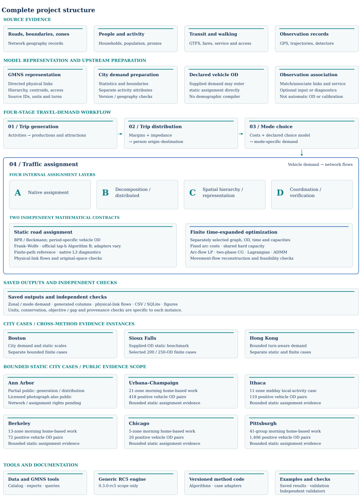

# Mobility Computation Lab

**Project website: [https://scholarhaozheng.github.io/mobility-network-lab/](https://scholarhaozheng.github.io/mobility-network-lab/)**

[Overview](https://scholarhaozheng.github.io/mobility-network-lab/volumes/overview.html) · [Boston](https://scholarhaozheng.github.io/mobility-network-lab/volumes/boston.html) · [Sioux Falls](https://scholarhaozheng.github.io/mobility-network-lab/volumes/sioux-falls.html) · [Hong Kong](https://scholarhaozheng.github.io/mobility-network-lab/volumes/hong-kong.html) · [Reproduction guide](https://scholarhaozheng.github.io/mobility-network-lab/reproduction.html) · [Experiment catalog](https://scholarhaozheng.github.io/mobility-network-lab/reproduce.html)

[01 Contributions](#01-what-this-project-adds) · [02 Project structure](#02-complete-project-structure) · [03 Coverage](#03-case-coverage-and-selected-evidence) · [04 City atlas](#04-explore-the-three-cases) · [05 Run and inspect](#05-run-and-inspect) · [06 Attribution](#06-attribution-scope-and-further-reading)

**Mobility Computation Lab connects city networks, travel demand, and reproducible network computation.**

This open-source research and learning project is developed by [Hao Zheng](https://scholarhaozheng.github.io/), a recent M.S. graduate from Tsinghua University, under the guidance of **[Professor Xuesong Zhou](https://search.asu.edu/profile/2182101)**. It brings together documented examples in Boston, Sioux Falls, and Hong Kong to study how city data, demand models, and network algorithms work together.

The repository uses the [General Modeling Network Specification (GMNS)](https://github.com/zephyr-data-specs/GMNS) as its portable network and data contract. Selected static traffic-assignment experiments build on [TAPLab: An Open Laboratory for Reproducible Traffic Assignment Experiments](https://github.com/asu-trans-ai-lab/TAPLab) and the official [tap-b Algorithm B](https://github.com/spartalab/tap-b), with upstream software, methods, and datasets attributed explicitly.

Project-specific work includes assembling and adapting the Boston, Sioux Falls, and Hong Kong cases; connecting city data and four-stage demand models to documented network computations; implementing and evaluating project-specific adapters, workflows, and experiments; and making each result traceable to its actual instance, units, assumptions, and evidence.

**Learning companion.** To make these computational ideas easier to explore, the site includes the [Traffic Assignment Lab](https://scholarhaozheng.github.io/mobility-network-lab/traffic-assignment-lab.html), an interactive demo of assignment, decomposition, spatial hierarchy, and coordinated computation on one teaching network. The demo was developed collaboratively by **[Professor Xuesong Zhou](https://search.asu.edu/profile/2182101)** and Hao Zheng, with Hao Zheng working under Professor Zhou's guidance and maintaining the web version.

[My contributions and upstream foundations](https://scholarhaozheng.github.io/mobility-network-lab/volumes/overview.html#src-docs-contributions-document) · [Full technical walkthrough](https://scholarhaozheng.github.io/mobility-network-lab/volumes/overview.html) · [Start with a saved example](https://scholarhaozheng.github.io/mobility-network-lab/volumes/overview.html#src-docs-getting-started-document) · [Source and citation](https://scholarhaozheng.github.io/mobility-network-lab/volumes/overview.html#src-docs-citation-document)

<table width="100%">
<tr><th colspan="3" align="left">FROM CITY INPUTS TO COMPUTATION</th></tr>
<tr><td colspan="3"><strong><a href="#four-step-workflow">City-model foundations</a></strong> GMNS · population &amp; activity · services · observations</td></tr>
<tr><td colspan="3"><strong>FOUR-STAGE DEMAND WORKFLOW</strong></td></tr>
<tr><td width="33%" valign="top"><strong><a href="https://scholarhaozheng.github.io/mobility-network-lab/volumes/overview.html#coverage-stage-06">01 / Trip generation</a></strong> Productions &amp; attractions</td><td width="33%" valign="top"><strong><a href="https://scholarhaozheng.github.io/mobility-network-lab/volumes/overview.html#coverage-stage-07">02 / Trip distribution</a></strong> Origin–destination demand</td><td width="33%" valign="top"><strong><a href="https://scholarhaozheng.github.io/mobility-network-lab/volumes/overview.html#coverage-stage-08">03 / Mode choice</a></strong> Demand by travel mode</td></tr>
<tr><th colspan="3" align="left"><a href="https://scholarhaozheng.github.io/mobility-network-lab/volumes/overview.html#coverage-stage-09">04 / Traffic assignment</a></th></tr>
<tr><td colspan="3"><table width="100%"><tr><td width="50%" valign="top">STATIC ROAD NETWORK <strong><a href="https://scholarhaozheng.github.io/mobility-network-lab/volumes/overview.html#src-docs-methods-document-static-frankwolfe-reference-implementation">BPR / Beckmann</a></strong></td><td width="50%" valign="top">FINITE TIME-EXPANDED NETWORK <strong><a href="https://scholarhaozheng.github.io/mobility-network-lab/volumes/overview.html#src-docs-methods-space-time-cg-document">Fixed costs · hard capacities</a></strong></td></tr></table></td></tr>
<tr><td colspan="3"><table width="100%"><tr><td width="50%" valign="top"><strong><a href="#assignment-layer-a">A / Native assignment</a></strong> Reference solvers &amp; reconstruction</td><td width="50%" valign="top"><strong><a href="#assignment-layer-b">B / Decomposition</a></strong> CG · Lagrangian · ADMM</td></tr><tr><td width="50%" valign="top"><strong><a href="#assignment-layer-c">C / Spatial representation</a></strong> Hierarchy · access · turn/time states</td><td width="50%" valign="top"><strong><a href="#assignment-layer-d">D / Coordination &amp; checks</a></strong> Capacities · residuals · closure</td></tr></table></td></tr>
<tr><td colspan="3"><a href="#02-complete-project-structure">Explore the complete project structure ↗</a></td></tr>
</table>

## 01 / What this project adds

### City-to-model representations

The project links roads, hierarchical zones, population and activity inputs, transit services, and supported observations to explicit demand and network models. Its adapters preserve identifiers, units, access semantics, and physical-link mappings across the documented city cases. [Implementation and source map](https://scholarhaozheng.github.io/mobility-network-lab/volumes/overview.html#src-docs-contributions-document-city-to-model-representations).

### Computational implementations and diagnostics

The repository brings together path-based and compressed static-assignment experiments with finite time-expanded CG, Lagrangian, and ADMM implementations. Project-specific work includes feasibility restoration, pricing and degeneracy handling, local-subproblem scaling, and reconstruction in the original flow space. [Methods and evidence](https://scholarhaozheng.github.io/mobility-network-lab/volumes/overview.html#src-docs-contributions-document-computational-implementations-and-diagnostics).

### Reusable cross-city computational tools

The project packages shared data interfaces, case configurations, and analysis tools into an open-source environment for Boston, Sioux Falls, and Hong Kong. Documented examples connect zonal demand, generated paths, and physical-link results, allowing researchers to reuse the supported workflows and compare demand scales, network representations, and solution methods. [Tools, attribution and demonstrated scope](https://scholarhaozheng.github.io/mobility-network-lab/volumes/overview.html#src-docs-contributions-document-reusable-cross-city-computational-tools).

## 02 / Complete project structure

Open the [clickable project map](https://scholarhaozheng.github.io/mobility-network-lab/assets/atlas/project-map.svg), or use the same module links below.

<table width="100%">
<tr><th colspan="4" align="left">Project modules and reading destinations</th></tr>
<tr><td width="25%" valign="top"><a href="https://scholarhaozheng.github.io/mobility-network-lab/volumes/overview.html#coverage-stage-01">Roads, boundaries, zones</a></td><td width="25%" valign="top"><a href="https://scholarhaozheng.github.io/mobility-network-lab/volumes/overview.html#coverage-stage-03">People and activity</a></td><td width="25%" valign="top"><a href="https://scholarhaozheng.github.io/mobility-network-lab/volumes/overview.html#coverage-stage-04">Transit and walking</a></td><td width="25%" valign="top"><a href="https://scholarhaozheng.github.io/mobility-network-lab/volumes/overview.html#coverage-stage-05">Observation records</a></td></tr>
<tr><td width="25%" valign="top"><a href="https://scholarhaozheng.github.io/mobility-network-lab/volumes/overview.html#src-docs-data-contract-document">GMNS representation</a></td><td width="25%" valign="top"><a href="https://scholarhaozheng.github.io/mobility-network-lab/volumes/overview.html#coverage-stage-06">City demand preparation</a></td><td width="25%" valign="top"><a href="https://scholarhaozheng.github.io/mobility-network-lab/volumes/sioux-falls.html#coverage-row-01">Declared vehicle OD</a></td><td width="25%" valign="top"><a href="https://scholarhaozheng.github.io/mobility-network-lab/volumes/overview.html#coverage-stage-05">Observation association</a></td></tr>
<tr><td width="25%" valign="top"><a href="https://scholarhaozheng.github.io/mobility-network-lab/volumes/overview.html#coverage-stage-06">01 / Trip generation</a></td><td width="25%" valign="top"><a href="https://scholarhaozheng.github.io/mobility-network-lab/volumes/overview.html#coverage-stage-07">02 / Trip distribution</a></td><td width="25%" valign="top"><a href="https://scholarhaozheng.github.io/mobility-network-lab/volumes/overview.html#coverage-stage-08">03 / Mode choice</a></td><td width="25%" valign="top"><a href="https://scholarhaozheng.github.io/mobility-network-lab/volumes/overview.html#coverage-stage-09">04 / Traffic assignment</a></td></tr>
<tr><td width="25%" valign="top"><a href="#assignment-layer-a">A / Native assignment</a></td><td width="25%" valign="top"><a href="#assignment-layer-b">B / Decomposition and distributed computation</a></td><td width="25%" valign="top"><a href="#assignment-layer-c">C / Spatial hierarchy and representation</a></td><td width="25%" valign="top"><a href="#assignment-layer-d">D / Coordination and verification</a></td></tr>
<tr><td width="25%" valign="top"><a href="https://scholarhaozheng.github.io/mobility-network-lab/volumes/overview.html#src-docs-methods-document-static-frankwolfe-reference-implementation">Static road assignment</a></td><td width="25%" valign="top"><a href="https://scholarhaozheng.github.io/mobility-network-lab/volumes/overview.html#src-docs-methods-space-time-cg-document">Finite time-expanded optimization</a></td><td width="25%" valign="top"><a href="https://scholarhaozheng.github.io/mobility-network-lab/volumes/overview.html#src-docs-outputs-document">Saved outputs and independent checks</a></td><td width="25%" valign="top"><a href="https://scholarhaozheng.github.io/mobility-network-lab/volumes/boston.html">Boston</a></td></tr>
<tr><td width="25%" valign="top"><a href="https://scholarhaozheng.github.io/mobility-network-lab/volumes/sioux-falls.html">Sioux Falls</a></td><td width="25%" valign="top"><a href="https://scholarhaozheng.github.io/mobility-network-lab/volumes/hong-kong.html">Hong Kong</a></td><td width="25%" valign="top"><a href="https://scholarhaozheng.github.io/mobility-network-lab/volumes/overview.html#src-docs-data-tools-document">Data and GMNS tools</a></td><td width="25%" valign="top"><a href="https://scholarhaozheng.github.io/mobility-network-lab/volumes/overview.html#src-docs-getting-started-document-run-from-raw-input">Generic RC5 engine</a></td></tr>
<tr><td width="25%" valign="top"><a href="https://scholarhaozheng.github.io/mobility-network-lab/reproduce.html">Versioned method code</a></td><td width="25%" valign="top"><a href="https://scholarhaozheng.github.io/mobility-network-lab/reproduce.html">Examples and checks</a></td><td colspan="2"></td></tr>
</table>

[Full-size SVG](https://scholarhaozheng.github.io/mobility-network-lab/assets/atlas/project-map.svg) · [PNG](docs/assets/atlas/figures/g-f001.png) · [Accessible module and source table](https://scholarhaozheng.github.io/mobility-network-lab/volumes/overview.html#src-docs-architecture-document).

GMNS keeps directed physical roads, hierarchical zones, centroids, nonphysical access and source IDs distinct. Population, household and activity preparation precedes **01 trip generation → 02 trip distribution → 03 mode choice → 04 traffic assignment** where those stages are supported; declared vehicle OD can instead enter assignment directly. GPS traces and map matching, service records and detector context require explicit quality and network-association rules. [GMNS exchange](https://scholarhaozheng.github.io/mobility-network-lab/volumes/boston.html#src-docs-datasets-boston-gmns-exchange-document) · [Four-stage city workflow](https://scholarhaozheng.github.io/mobility-network-lab/volumes/overview.html#src-docs-city-workflow-document) · [Observation example](https://scholarhaozheng.github.io/mobility-network-lab/volumes/boston.html#src-docs-datasets-boston-behavior-feedback-document).

Static **BPR/Beckmann** assignment and finite **fixed-cost, hard-capacity time-expanded** optimization use separate mathematical models. [Architecture](https://scholarhaozheng.github.io/mobility-network-lab/volumes/overview.html#src-docs-architecture-document) · [Data contract](https://scholarhaozheng.github.io/mobility-network-lab/volumes/overview.html#src-docs-data-contract-document).

### Two axes of Mobility Computation Lab

**Horizontal axis — documented city cases:**  

Boston · Sioux Falls · Hong Kong

**Vertical axis — computational depth within network assignment:**

- **A · Native assignment** — Frank–Wolfe, official tap-b Algorithm B, finite-path controls, and native L3 reconstruction.
- **B · Decomposition and distributed computation** — column generation, Lagrangian decomposition, and ADMM local or coupled computations.
- **C · Spatial hierarchy and representation** — fine and parent zones, access relationships, turn/time states, and projection back to physical network objects.
- **D · Coordination and verification** — shared capacities, residuals, pricing closure, independent evaluators, and declared result contracts.

**How to read the two axes.**  

The horizontal axis compares how the documented framework is instantiated in Boston, Sioux Falls, and Hong Kong. The vertical axis organizes increasing computational depth inside the network-assignment branch. Source data, GMNS, population and activity preparation, transit and observations, and the four-stage demand workflow remain the common city-model foundation outside A–D.

## 03 / Case coverage and selected evidence

Rows record each stage; columns compare Boston, Sioux Falls and Hong Kong. Figures and source records are collected in Section 04. Model instances, units and limits remain explicit.

<table width="100%"><thead><tr><th valign="top" width="25%">Stage / evidence</th><th valign="top" width="25%">Boston</th><th valign="top" width="25%">Sioux Falls</th><th valign="top" width="25%">Hong Kong</th></tr></thead><tbody><tr><th colspan="4" valign="top" width="100%">I · City data and model foundations</th></tr><tr><th valign="top" width="25%">01 · Source data and preparation</th><td valign="top" width="25%">GMNS Plus, ACS/GTFS and registered source preparation. <a href="https://scholarhaozheng.github.io/mobility-network-lab/volumes/boston.html#coverage-row-01">Read evidence ↗</a></td><td valign="top" width="25%">Frozen classic 24-node/76-link source graph and supplied vehicle OD. <a href="https://scholarhaozheng.github.io/mobility-network-lab/volumes/sioux-falls.html#coverage-row-01">Read evidence ↗</a></td><td valign="top" width="25%">Official-derived bounded network and source layers. <a href="https://scholarhaozheng.github.io/mobility-network-lab/volumes/hong-kong.html#coverage-row-01">Read evidence ↗</a></td></tr><tr><th valign="top" width="25%">02 · GMNS network, zones and access</th><td valign="top" width="25%">5,091 physical links; 177 H3 fine zones, nine parents; connectors separate. <a href="https://scholarhaozheng.github.io/mobility-network-lab/volumes/boston.html#coverage-row-02">Read evidence ↗</a></td><td valign="top" width="25%">24-node, 76-link supplied directed benchmark. <a href="https://scholarhaozheng.github.io/mobility-network-lab/volumes/sioux-falls.html#coverage-row-02">Read evidence ↗</a></td><td valign="top" width="25%">780 physical nodes, 1,239 links; 95 fine zones, ten parents and turn-aware access. <a href="https://scholarhaozheng.github.io/mobility-network-lab/volumes/hong-kong.html#coverage-row-02">Read evidence ↗</a></td></tr><tr><th valign="top" width="25%">03 · Population, households and activity</th><td valign="top" width="25%">ACS 2024 five-year block groups allocated to 177 clipped H3 zones. <a href="https://scholarhaozheng.github.io/mobility-network-lab/volumes/boston.html#coverage-row-03">Read evidence ↗</a></td><td valign="top" width="25%">Supplied OD; no demographic city compiler. <a href="https://scholarhaozheng.github.io/mobility-network-lab/volumes/sioux-falls.html#coverage-row-03">Read evidence ↗</a></td><td valign="top" width="25%">2021 census households/population and explicitly modeled building activity proxies. <a href="https://scholarhaozheng.github.io/mobility-network-lab/volumes/hong-kong.html#coverage-row-03">Read evidence ↗</a></td></tr><tr><th colspan="4" valign="top" width="100%">II · Transit and observation evidence</th></tr><tr><th valign="top" width="25%">04 · Transit and pedestrian inputs</th><td valign="top" width="25%">MBTA service and pedestrian access support the bounded demand/feedback example. <a href="https://scholarhaozheng.github.io/mobility-network-lab/volumes/boston.html#coverage-row-04">Read evidence ↗</a></td><td valign="top" width="25%">No GTFS or pedestrian city-input lane. <a href="https://scholarhaozheng.github.io/mobility-network-lab/volumes/sioux-falls.html#coverage-row-04">Read evidence ↗</a></td><td valign="top" width="25%">GTFS same-trip rides, fares, headways and pedestrian access enter generalized costs. <a href="https://scholarhaozheng.github.io/mobility-network-lab/volumes/hong-kong.html#coverage-row-04">Read evidence ↗</a></td></tr><tr><th valign="top" width="25%">05 · GPS, trajectory and detector evidence</th><td valign="top" width="25%">Exploratory map matching and service feedback. <a href="https://scholarhaozheng.github.io/mobility-network-lab/volumes/boston.html#coverage-row-05">Read evidence ↗</a></td><td valign="top" width="25%">No modern GPS or detector observations. <a href="https://scholarhaozheng.github.io/mobility-network-lab/volumes/sioux-falls.html#coverage-row-05">Read evidence ↗</a></td><td valign="top" width="25%">Detector and private trajectory association; no held-out validation claim. <a href="https://scholarhaozheng.github.io/mobility-network-lab/volumes/hong-kong.html#coverage-row-05">Read evidence ↗</a></td></tr><tr><th colspan="4" valign="top" width="100%">III · Four-stage travel-demand workflow</th></tr><tr><th valign="top" width="25%">06 · 01 / Trip generation — productions / attractions</th><td valign="top" width="25%">Purpose-level productions and attractions in the bounded Boston example. <a href="https://scholarhaozheng.github.io/mobility-network-lab/volumes/boston.html#coverage-row-06">Read evidence ↗</a></td><td valign="top" width="25%">Vehicle OD supplied; no trip-generation run. <a href="https://scholarhaozheng.github.io/mobility-network-lab/volumes/sioux-falls.html#coverage-row-06">Read evidence ↗</a></td><td valign="top" width="25%">Transferred rate and declared capture sensitivity. <a href="https://scholarhaozheng.github.io/mobility-network-lab/volumes/hong-kong.html#coverage-row-06">Read evidence ↗</a></td></tr><tr><th valign="top" width="25%">07 · 02 / Trip distribution — zonal OD demand</th><td valign="top" width="25%">Zonal OD construction for the bounded semantic scenario. <a href="https://scholarhaozheng.github.io/mobility-network-lab/volumes/boston.html#coverage-row-07">Read evidence ↗</a></td><td valign="top" width="25%">Supplied OD is input. <a href="https://scholarhaozheng.github.io/mobility-network-lab/volumes/sioux-falls.html#coverage-row-07">Read evidence ↗</a></td><td valign="top" width="25%">Turn-aware gravity/IPF balances 8,930 reachable directed OD pairs. <a href="https://scholarhaozheng.github.io/mobility-network-lab/volumes/hong-kong.html#coverage-row-07">Read evidence ↗</a></td></tr><tr><th valign="top" width="25%">08 · 03 / Mode choice — mode-specific demand</th><td valign="top" width="25%">S1/S2 service response and conditional absolute choice remain separate. <a href="https://scholarhaozheng.github.io/mobility-network-lab/volumes/boston.html#coverage-row-08">Read evidence ↗</a></td><td valign="top" width="25%">Vehicle OD supplied; no mode-choice run. <a href="https://scholarhaozheng.github.io/mobility-network-lab/volumes/sioux-falls.html#coverage-row-08">Read evidence ↗</a></td><td valign="top" width="25%">GTFS/pedestrian generalized cost and declared sensitivity logit. <a href="https://scholarhaozheng.github.io/mobility-network-lab/volumes/hong-kong.html#coverage-row-08">Read evidence ↗</a></td></tr><tr><th valign="top" width="25%">09 · 04 / Traffic assignment — assigned network flows</th><td valign="top" width="25%">Static road flow from the bounded demand scenario; methods below. <a href="https://scholarhaozheng.github.io/mobility-network-lab/volumes/boston.html#coverage-row-09">Read evidence ↗</a></td><td valign="top" width="25%">Static network flow from supplied vehicle OD; no upstream four-stage compiler. <a href="https://scholarhaozheng.github.io/mobility-network-lab/volumes/sioux-falls.html#coverage-row-09">Read evidence ↗</a></td><td valign="top" width="25%">Modeled one-hour static PCE road flow. <a href="https://scholarhaozheng.github.io/mobility-network-lab/volumes/hong-kong.html#coverage-row-09">Read evidence ↗</a></td></tr><tr><th colspan="4" valign="top" width="100%">IV · Static assignment · BPR / Beckmann</th></tr><tr><th valign="top" width="25%">10 · Frank–Wolfe</th><td valign="top" width="25%">Expanded Boston FW, up to 17,522 loaded node ODs; separate from 26-OD controls. <a href="https://scholarhaozheng.github.io/mobility-network-lab/volumes/boston.html#coverage-row-10">Read evidence ↗</a></td><td valign="top" width="25%">Classic 528-OD static FW, with ID-matched link-flow comparison against Algorithm B. <a href="https://scholarhaozheng.github.io/mobility-network-lab/volumes/sioux-falls.html#coverage-row-10">Read evidence ↗</a></td><td valign="top" width="25%">Turn-aware one-hour 723.191 PCE static engineering scenario. <a href="https://scholarhaozheng.github.io/mobility-network-lab/volumes/hong-kong.html#coverage-row-10">Read evidence ↗</a></td></tr><tr><th valign="top" width="25%">11 · Official tap-b Algorithm B</th><td valign="top" width="25%">B0/B1 numerical transfer via task-local lossless TAPLab-compatible adapter. <a href="https://scholarhaozheng.github.io/mobility-network-lab/volumes/boston.html#coverage-row-11">Read evidence ↗</a></td><td valign="top" width="25%">Official TAPLab registered-adapter parity passes on Sioux Falls. <a href="https://scholarhaozheng.github.io/mobility-network-lab/volumes/sioux-falls.html#coverage-row-11">Read evidence ↗</a></td><td valign="top" width="25%">Accepted task-local lossless adapter; official-adapter parity remains unverified. <a href="https://scholarhaozheng.github.io/mobility-network-lab/volumes/hong-kong.html#coverage-row-11">Read evidence ↗</a></td></tr><tr><th valign="top" width="25%">12 · Finite-path reference</th><td valign="top" width="25%">26 OD, 130-path uncompressed SLSQP reference on ABS_PLANNED. <a href="https://scholarhaozheng.github.io/mobility-network-lab/volumes/boston.html#coverage-row-12">Read evidence ↗</a></td><td valign="top" width="25%">Frozen 2,218-path B_BECKMANN native candidate; full-network UE remains uncertified. <a href="https://scholarhaozheng.github.io/mobility-network-lab/volumes/sioux-falls.html#coverage-row-12">Read evidence ↗</a></td><td valign="top" width="25%">Accepted bounded H1: 26 ODs / 126 legal paths; matches H1 FW with full-graph relative gap approximately zero. <a href="https://scholarhaozheng.github.io/mobility-network-lab/volumes/hong-kong.html#coverage-row-12">Read evidence ↗</a></td></tr><tr><th valign="top" width="25%">13 · Native Diagnostic L3 / compression</th><td valign="top" width="25%">Rank-26/52 native controls on the same 26-OD ABS_PLANNED instance. <a href="https://scholarhaozheng.github.io/mobility-network-lab/volumes/boston.html#coverage-row-13">Read evidence ↗</a></td><td valign="top" width="25%">Rank-50 classic static benchmark candidates. <a href="https://scholarhaozheng.github.io/mobility-network-lab/volumes/sioux-falls.html#coverage-row-13">Read evidence ↗</a></td><td valign="top" width="25%">Accepted H1 ranks 26 and 52; full-graph relative gap approximately 2.31×10⁻¹¹; evaluated under low congestion. <a href="https://scholarhaozheng.github.io/mobility-network-lab/volumes/hong-kong.html#coverage-row-13">Read evidence ↗</a></td></tr><tr><th colspan="4" valign="top" width="100%">V · Finite time-expanded computation</th></tr><tr><th valign="top" width="25%">14 · Network construction and generated columns</th><td valign="top" width="25%">90-node/125-link/10-OD finite graph; saved time-indexed column. <a href="https://scholarhaozheng.github.io/mobility-network-lab/volumes/boston.html#coverage-row-14">Read evidence ↗</a></td><td valign="top" width="25%">Selected 200/250-OD finite graphs; saved time-indexed columns. <a href="https://scholarhaozheng.github.io/mobility-network-lab/volumes/sioux-falls.html#coverage-row-14">Read evidence ↗</a></td><td valign="top" width="25%">100-node / 111-link / ten-OD finite graph, with saved time-layer construction and generated-column evidence. <a href="https://scholarhaozheng.github.io/mobility-network-lab/volumes/hong-kong.html#coverage-row-14">Read evidence ↗</a></td></tr><tr><th valign="top" width="25%">15 · Arc-flow LP reference</th><td valign="top" width="25%">Own-graph LP reference for the bounded ten-OD fixed-cost instance. <a href="https://scholarhaozheng.github.io/mobility-network-lab/volumes/boston.html#coverage-row-15">Read evidence ↗</a></td><td valign="top" width="25%">Own selected-graph LP references for historical 200/250 ODs. <a href="https://scholarhaozheng.github.io/mobility-network-lab/volumes/sioux-falls.html#coverage-row-15">Read evidence ↗</a></td><td valign="top" width="25%">Own-graph LP reference for R5 ten-OD finite case. <a href="https://scholarhaozheng.github.io/mobility-network-lab/volumes/hong-kong.html#coverage-row-15">Read evidence ↗</a></td></tr><tr><th valign="top" width="25%">16 · Two-phase column generation</th><td valign="top" width="25%">Phase I/II and independent 10/10 pricing closure. <a href="https://scholarhaozheng.github.io/mobility-network-lab/volumes/boston.html#coverage-row-16">Read evidence ↗</a></td><td valign="top" width="25%">Separate historical 200 / 250-OD CG results; independent full-DAG pricing closure is not established. <a href="https://scholarhaozheng.github.io/mobility-network-lab/volumes/sioux-falls.html#coverage-row-16">Read evidence ↗</a></td><td valign="top" width="25%">Phase I/II, same-graph LP agreement and independent 10/10 closure. <a href="https://scholarhaozheng.github.io/mobility-network-lab/volumes/hong-kong.html#coverage-row-16">Read evidence ↗</a></td></tr><tr><th valign="top" width="25%">17 · Lagrangian</th><td valign="top" width="25%">Saved Boston R2 10-OD best-bound iteration trace; feasible primal, 1.1002% gap misses the frozen 1% gate. <a href="https://scholarhaozheng.github.io/mobility-network-lab/volumes/boston.html#coverage-row-17">Read evidence ↗</a></td><td valign="top" width="25%">Saved P07 best-dual and recovered feasible-primal traces for separate 200-OD and 250-OD instances; final certified gaps are 0.0746% and 0.3177%. <a href="https://scholarhaozheng.github.io/mobility-network-lab/volumes/sioux-falls.html#coverage-row-17">Read evidence ↗</a></td><td valign="top" width="25%">Ten-OD feasible recovery with 0.7444% certified gap. <a href="https://scholarhaozheng.github.io/mobility-network-lab/volumes/hong-kong.html#coverage-row-17">Read evidence ↗</a></td></tr><tr><th valign="top" width="25%">18 · ADMM</th><td valign="top" width="25%">Ten-OD original-space checks; own-LP gap 6.68e-6. <a href="https://scholarhaozheng.github.io/mobility-network-lab/volumes/boston.html#coverage-row-18">Read evidence ↗</a></td><td valign="top" width="25%">Selected 200/250-OD original-space checks on finite graphs; the static 528-OD benchmark is a separate case. <a href="https://scholarhaozheng.github.io/mobility-network-lab/volumes/sioux-falls.html#coverage-row-18">Read evidence ↗</a></td><td valign="top" width="25%">Accepted bounded ADMM R3 transfer Fresh preregistered 4-OD holdout · 165 iterations · LP-relative difference 6.83×10⁻⁶ Finite 30-s × 50-step shared-capacity case with modeled OD demand in a bounded study area; empirical traffic validation remains open. <a href="https://scholarhaozheng.github.io/mobility-network-lab/volumes/hong-kong.html#coverage-row-18">Read evidence ↗</a></td></tr><tr><th colspan="4" valign="top" width="100%">VI · Reusable outputs and tools</th></tr><tr><th valign="top" width="25%">19 · Reusable outputs, queries and checks</th><td valign="top" width="25%">Released source tables, GMNS and saved-result queries; separate static and finite runners. A saved-result check is distinct from a fresh solve. <a href="https://scholarhaozheng.github.io/mobility-network-lab/volumes/boston.html#coverage-row-19">Read evidence ↗</a></td><td valign="top" width="25%">Given-input benchmark exports, static implementations and selected-OD finite checks. Historical CG pricing closure remains a separate limitation. <a href="https://scholarhaozheng.github.io/mobility-network-lab/volumes/sioux-falls.html#coverage-row-19">Read evidence ↗</a></td><td valign="top" width="25%">GMNS and demand tables, static/H1 and finite case packages; accepted four-OD ADMM R3 is separate from ten-OD R2. Source-to-result reproduction has distinct requirements. <a href="https://scholarhaozheng.github.io/mobility-network-lab/volumes/hong-kong.html#coverage-row-19">Read evidence ↗</a></td></tr></tbody></table>

## 04 / Explore the three cases

This README shows the complete static atlas in the same city, stage and method groups as the website. The [website atlas](https://scholarhaozheng.github.io/mobility-network-lab/#04-explore-the-three-cases) also offers city and stage views. Both Sioux Falls OD scales are expanded here.

Complete reading: [Overview](https://scholarhaozheng.github.io/mobility-network-lab/volumes/overview.html) · [Boston](https://scholarhaozheng.github.io/mobility-network-lab/volumes/boston.html) · [Sioux Falls](https://scholarhaozheng.github.io/mobility-network-lab/volumes/sioux-falls.html) · [Hong Kong](https://scholarhaozheng.github.io/mobility-network-lab/volumes/hong-kong.html)

Each city has a complete stage atlas. The same stage order is used throughout; different data, static and finite instance scales are never combined into a single case size.

**A — Native assignment**  

**B — Decomposition and distributed computation**  

**C — Spatial hierarchy and representation**  

**D — Coordination and verification**

A–D are reading labels for computational depth. City-data and four-stage-demand evidence remain outside A–D. The current repository demonstrates coordination and verification components.

### Boston

City GMNS, population/demand, MBTA/GPS linkage and separate bounded static and finite computations. [Open complete case →](https://scholarhaozheng.github.io/mobility-network-lab/volumes/boston.html)

<table width="100%"><thead><tr><th valign="top" width="25%">City/model foundation</th><th valign="top" width="25%">Static assignment</th><th valign="top" width="25%">Finite time-expanded</th><th valign="top" width="25%">Observation/data scope</th></tr></thead>
<tbody><tr><td valign="top" width="25%">2,852 physical nodes; 5,091 directed links; 177 H3 fine zones</td><td valign="top" width="25%">B1: 453 ODs / 1,936.238475 PCE in 2 h; expanded FW and 26-OD controls are distinct</td><td valign="top" width="25%">90 nodes; 125 links; 10 ODs</td><td valign="top" width="25%">MBTA inputs and exploratory GPS matching; no held-out citywide calibration</td></tr></tbody></table>

[Sources and GMNS](#boston-sources) · [Population, households and activity](#boston-population) · [Transit and observations](#boston-transit) · [Trip generation](#boston-generation) · [Trip distribution](#boston-distribution) · [Mode choice](#boston-mode) · [Static assignment methods](#boston-static) · [Time-expanded network and path examples](#boston-representation) · [Optimization on the time-expanded network](#boston-finite) · [Tools and reproducibility](https://scholarhaozheng.github.io/mobility-network-lab/volumes/boston.html#src-docs-cases-boston-document-reproduction)

#### Sources and GMNS

<strong>Source data and preparation</strong>

GMNS Plus, ACS/GTFS and registered source preparation.

<a href="https://scholarhaozheng.github.io/mobility-network-lab/volumes/boston.html#src-docs-cases-boston-document-gmns-zones-and-source-evidence">Evidence</a> · <a href="https://scholarhaozheng.github.io/mobility-network-lab/volumes/boston.html#coverage-row-01">Evidence table</a>

<table width="100%">
<tr><th width="50%" valign="top" align="left"><strong>Fine zones, parent zones and physical access</strong></th><th width="50%" valign="top" align="left"><strong>Zone, access and road objects</strong></th></tr>
<tr><td width="50%" valign="top" align="left"></td><td width="50%" valign="top" align="left"></td></tr>
<tr><td width="50%" valign="top" align="left">
Fine H3 r9 zones and coarser parent H3 r7 structure use their saved geometry. Panel a also retains the model core boundary from the study-area map. Small centroid symbols are nonphysical model objects; access links join them to physical roads. The 177 fine zones map to 139 distinct physical access nodes. Connectors encode model access; GPS matching uses physical road links.

Study-area context is consolidated here: the core boundary, physical roads and clipped fine zones are shown together with parent zones and physical access.

<strong>GMNS network, zones and access</strong> 

5,091 physical links; 177 H3 fine zones, nine parents; connectors separate.

<a href="https://scholarhaozheng.github.io/mobility-network-lab/volumes/boston.html#src-docs-cases-boston-document-gmns-zones-and-source-evidence">Evidence</a> · <a href="https://scholarhaozheng.github.io/mobility-network-lab/assets/atlas/figures/g-f037.svg">Full figure</a>

<strong>Special zones and access</strong> 

GMNS · Central Boston

<a href="https://scholarhaozheng.github.io/mobility-network-lab/volumes/boston.html#src-docs-cases-boston-document-gmns-zones-and-source-evidence">Evidence</a> · <a href="https://scholarhaozheng.github.io/mobility-network-lab/assets/atlas/figures/g-f037.svg">Full figure</a>

</td><td width="50%" valign="top" align="left">
Real Boston GMNS zone 35→71 demand and the centroid/access/physical-road object chain. The demand relation is 10.349852758647414 modeled trips. Centroid connectors are nonphysical; physical road links can carry saved results and GPS associations. The route-60 GPS sample illustrates a separate observed journey.
</td></tr>
<tr><td width="50%" valign="top" align="left">
<a href="https://scholarhaozheng.github.io/mobility-network-lab/volumes/boston.html#stage-02-gmns-network-and-access--g-f037">Complete evidence</a> · <a href="https://scholarhaozheng.github.io/mobility-network-lab/assets/atlas/figures/g-f037.svg">Full figure</a>

Source records
<ul><li><a href="https://github.com/scholarhaozheng/mobility-network-lab/blob/6ce18b8bea5bf3b9b7caa6ee4c0ff4e701a34a8b/examples/boston/gmns_exchange_r1/data/link.csv" title="examples/boston/gmns_exchange_r1/data/link.csv">link.csv</a></li><li><a href="https://github.com/scholarhaozheng/mobility-network-lab/blob/6ce18b8bea5bf3b9b7caa6ee4c0ff4e701a34a8b/examples/boston/gmns_exchange_r1/data/zone.csv" title="examples/boston/gmns_exchange_r1/data/zone.csv">zone.csv</a></li><li><a href="https://github.com/scholarhaozheng/mobility-network-lab/blob/6ce18b8bea5bf3b9b7caa6ee4c0ff4e701a34a8b/examples/boston/gmns_exchange_r1/data/node.csv" title="examples/boston/gmns_exchange_r1/data/node.csv">node.csv</a></li><li><a href="https://github.com/scholarhaozheng/mobility-network-lab/blob/6ce18b8bea5bf3b9b7caa6ee4c0ff4e701a34a8b/examples/boston/gmns_exchange_r1/data/id_crosswalk.csv" title="examples/boston/gmns_exchange_r1/data/id_crosswalk.csv">id_crosswalk.csv</a></li></ul>

<a href="https://scholarhaozheng.github.io/mobility-network-lab/reproduce.html?figure=G-F037">Data &amp; preparation</a>
</td><td width="50%" valign="top" align="left">
<a href="https://scholarhaozheng.github.io/mobility-network-lab/volumes/boston.html#stage-02-gmns-network-and-access--g-f022">Complete evidence</a> · <a href="https://scholarhaozheng.github.io/mobility-network-lab/assets/atlas/figures/g-f022.svg">Full figure</a>

Source records
<ul><li><a href="https://github.com/scholarhaozheng/mobility-network-lab/blob/6ce18b8bea5bf3b9b7caa6ee4c0ff4e701a34a8b/examples/boston/gmns_exchange_r1/data/zone.csv" title="examples/boston/gmns_exchange_r1/data/zone.csv">zone.csv</a></li><li><a href="https://github.com/scholarhaozheng/mobility-network-lab/blob/6ce18b8bea5bf3b9b7caa6ee4c0ff4e701a34a8b/examples/boston/gmns_exchange_r1/data/id_crosswalk.csv" title="examples/boston/gmns_exchange_r1/data/id_crosswalk.csv">id_crosswalk.csv</a></li><li><a href="https://github.com/scholarhaozheng/mobility-network-lab/blob/6ce18b8bea5bf3b9b7caa6ee4c0ff4e701a34a8b/examples/boston/gmns_exchange_r1/data/node.csv" title="examples/boston/gmns_exchange_r1/data/node.csv">node.csv</a></li><li><a href="https://github.com/scholarhaozheng/mobility-network-lab/blob/6ce18b8bea5bf3b9b7caa6ee4c0ff4e701a34a8b/examples/boston/gmns_exchange_r1/data/link.csv" title="examples/boston/gmns_exchange_r1/data/link.csv">link.csv</a></li><li><a href="https://github.com/scholarhaozheng/mobility-network-lab/blob/6ce18b8bea5bf3b9b7caa6ee4c0ff4e701a34a8b/examples/boston/gmns_exchange_r1/data/demand_S1.csv" title="examples/boston/gmns_exchange_r1/data/demand_S1.csv">demand_S1.csv</a></li></ul>

<a href="https://scholarhaozheng.github.io/mobility-network-lab/reproduce.html?figure=G-F022">Data &amp; preparation</a>
</td></tr>
</table>

#### Population, households and activity

<table width="100%">
<tr><th width="50%" valign="top" align="left"><strong>Population, households and activity</strong></th><th width="50%" valign="top" align="left"><strong>One source geography allocated to H3</strong></th></tr>
<tr><td width="50%" valign="top" align="left"></td><td width="50%" valign="top" align="left"></td></tr>
<tr><td width="50%" valign="top" align="left">
Panels a–b use ACS 2024 five-year population and household estimates allocated by area to 177 clipped H3 resolution-9 zones. Panel c shows the HBW midday attraction margin from the demand model. Panel d retains the earlier MassGIS property-tax-parcel residential assessment-area prior, measured in square feet and used with the earlier 50,000-person-trip normalization. That earlier prior is distinct from the later ACS preparation. Gray zones indicate missing source coverage. All four panels use the same clipped-zone geometry with separate, explicitly labeled color scales.

<strong>Population, households and activity</strong>

ACS 2024 five-year block groups allocated to 177 clipped H3 zones.

<a href="https://scholarhaozheng.github.io/mobility-network-lab/volumes/boston.html#src-docs-datasets-boston-population-households-document">Evidence</a> · <a href="https://scholarhaozheng.github.io/mobility-network-lab/assets/atlas/figures/g-f133.svg">Full figure</a>

</td><td width="50%" valign="top" align="left">
One selected ACS source block group, 15000US250250101031, allocated to clipped H3 zones. Source estimates are 957 persons and 232 households. The selected source-to-target weight is 0.30570178, yielding one contribution of 292.5566 persons and 70.9228 households. Weight uses the full source area. 

<strong>ACS/H3 allocation</strong>

Population · ACS 2024 five-year

<a href="https://scholarhaozheng.github.io/mobility-network-lab/volumes/boston.html#src-docs-datasets-boston-population-households-document">Evidence</a> · <a href="https://scholarhaozheng.github.io/mobility-network-lab/assets/atlas/card-layout/g-f005.svg">Full figure</a>

</td></tr>
<tr><td width="50%" valign="top" align="left">
<a href="https://scholarhaozheng.github.io/mobility-network-lab/volumes/boston.html#stage-03-population-households-and-activity--g-f133">Complete evidence</a> · <a href="https://scholarhaozheng.github.io/mobility-network-lab/assets/atlas/figures/g-f133.svg">Full figure</a>

Source records
<ul><li><a href="https://github.com/scholarhaozheng/mobility-network-lab/blob/6ce18b8bea5bf3b9b7caa6ee4c0ff4e701a34a8b/examples/boston/population_r1/data/population_or_household_by_zone.csv" title="examples/boston/population_r1/data/population_or_household_by_zone.csv">population_or_household_by_zone.csv</a></li><li><a href="https://github.com/scholarhaozheng/mobility-network-lab/blob/6ce18b8bea5bf3b9b7caa6ee4c0ff4e701a34a8b/docs/assets/boston/four_step_results_r1/data/hbw_midday_matrix.csv" title="docs/assets/boston/four_step_results_r1/data/hbw_midday_matrix.csv">hbw_midday_matrix.csv</a></li><li><a href="https://github.com/scholarhaozheng/mobility-network-lab/blob/6ce18b8bea5bf3b9b7caa6ee4c0ff4e701a34a8b/examples/boston/gmns_exchange_r1/data/zone.csv" title="examples/boston/gmns_exchange_r1/data/zone.csv">zone.csv</a></li><li><a href="https://github.com/scholarhaozheng/mobility-network-lab/blob/6ce18b8bea5bf3b9b7caa6ee4c0ff4e701a34a8b/docs/assets/boston/four_step_results_r1/data/zone_order.csv" title="docs/assets/boston/four_step_results_r1/data/zone_order.csv">zone_order.csv</a></li><li><a href="https://github.com/scholarhaozheng/mobility-network-lab/blob/6ce18b8bea5bf3b9b7caa6ee4c0ff4e701a34a8b/examples/boston/gmns_exchange_r1/data/link.csv" title="examples/boston/gmns_exchange_r1/data/link.csv">link.csv</a></li></ul>

<a href="https://scholarhaozheng.github.io/mobility-network-lab/reproduce.html?figure=G-F133">Data &amp; preparation</a>
</td><td width="50%" valign="top" align="left">
<a href="https://scholarhaozheng.github.io/mobility-network-lab/volumes/boston.html#stage-03-population-households-and-activity--g-f005">Complete evidence</a> · <a href="https://scholarhaozheng.github.io/mobility-network-lab/assets/atlas/card-layout/g-f005.svg">Full figure</a>

Source records
<ul><li><a href="https://github.com/scholarhaozheng/mobility-network-lab/blob/6ce18b8bea5bf3b9b7caa6ee4c0ff4e701a34a8b/docs/assets/boston/population_r1/source_h3_cutout.geojson" title="docs/assets/boston/population_r1/source_h3_cutout.geojson">source_h3_cutout.geojson</a></li><li><a href="https://github.com/scholarhaozheng/mobility-network-lab/blob/6ce18b8bea5bf3b9b7caa6ee4c0ff4e701a34a8b/examples/boston/population_r1/data/acs_block_group_h3_crosswalk.csv" title="examples/boston/population_r1/data/acs_block_group_h3_crosswalk.csv">acs_block_group_h3_crosswalk.csv</a></li><li><a href="https://github.com/scholarhaozheng/mobility-network-lab/blob/6ce18b8bea5bf3b9b7caa6ee4c0ff4e701a34a8b/examples/boston/population_r1/data/acs_block_group_stats.csv" title="examples/boston/population_r1/data/acs_block_group_stats.csv">acs_block_group_stats.csv</a></li></ul>

<a href="https://scholarhaozheng.github.io/mobility-network-lab/reproduce.html?figure=G-F005">Data &amp; preparation</a>
</td></tr>
</table>

#### Transit and observations

<table width="100%">
<tr><th width="33%" valign="top" align="left"><strong>Transit and modeled walking access</strong></th><th width="33%" valign="top" align="left"><strong>Returned GPS path coverage</strong></th><th width="33%" valign="top" align="left"><strong>One GPS segment and its GMNS association</strong></th></tr>
<tr><td width="33%" valign="top" align="left"></td><td width="33%" valign="top" align="left"></td><td width="33%" valign="top" align="left"></td></tr>
<tr><td width="33%" valign="top" align="left">
Planned GTFS services and modeled stop access for the saved MBTA feed/service date. Stops are deduplicated by stop ID. Fine straight connectors show the saved nearest-physical-node walking access candidates. Transit shape conflation represents planned service. The viewport follows the central GMNS analysis extent; feed stops outside that window are not drawn.

<strong>Transit and pedestrian inputs</strong>

MBTA service and pedestrian access support the bounded demand/feedback example.

<a href="https://scholarhaozheng.github.io/mobility-network-lab/volumes/boston.html#src-docs-cases-boston-document-demand-transit-and-observations">Evidence</a> · <a href="https://scholarhaozheng.github.io/mobility-network-lab/assets/atlas/figures/g-f134.svg">Full figure</a>

</td><td width="33%" valign="top" align="left">
Coverage of all 28 returned path segments: 581 path records and 431 distinct physical road links. No single-segment 12-point sample is overlaid here. Returned paths provide exploratory association evidence; the point-projection sample is shown separately.

<strong>GPS, trajectory and detector evidence</strong>

Exploratory map matching and service feedback.

<a href="https://scholarhaozheng.github.io/mobility-network-lab/volumes/boston.html#src-docs-datasets-boston-behavior-feedback-document">Evidence</a> · <a href="https://scholarhaozheng.github.io/mobility-network-lab/assets/atlas/figures/g-f135.svg">Full figure</a>

</td><td width="33%" valign="top" align="left">
One fixed segment mbtav:4624d3319dcfdec1:s01 on route 60: 12 reported points and 26 path occurrences. Panel a shows the geographic association above panels b–c. Hollow points denote source locations; solid points are derived projections. Panel b reports lateral projection distances by point; panel c queries saved S1 modeled link-volume values. Association identity is supported by saved sample rows; no independent asset manifest is invented.

<strong>GPS point-to-road projection</strong>

GPS map matching · 12 saved MBTA positions

<a href="https://scholarhaozheng.github.io/mobility-network-lab/volumes/boston.html#src-docs-datasets-boston-central-document-one-saved-transit-position-projection">Evidence</a> · <a href="https://scholarhaozheng.github.io/mobility-network-lab/assets/atlas/figures/c-boston-gps-sample.svg">Full figure</a>

</td></tr>
<tr><td width="33%" valign="top" align="left">
<a href="https://scholarhaozheng.github.io/mobility-network-lab/volumes/boston.html#stage-04-transit-and-walk--g-f134">Complete evidence</a> · <a href="https://scholarhaozheng.github.io/mobility-network-lab/assets/atlas/figures/g-f134.svg">Full figure</a>

Source records
<ul><li><a href="https://github.com/scholarhaozheng/mobility-network-lab/blob/6ce18b8bea5bf3b9b7caa6ee4c0ff4e701a34a8b/examples/boston/gmns_exchange_r1/data/link.csv" title="examples/boston/gmns_exchange_r1/data/link.csv">link.csv</a></li><li><a href="https://github.com/scholarhaozheng/mobility-network-lab/blob/6ce18b8bea5bf3b9b7caa6ee4c0ff4e701a34a8b/examples/boston/gmns_exchange_r1/data/node.csv" title="examples/boston/gmns_exchange_r1/data/node.csv">node.csv</a></li><li><a href="https://github.com/scholarhaozheng/mobility-network-lab/blob/6ce18b8bea5bf3b9b7caa6ee4c0ff4e701a34a8b/examples/boston/gmns_exchange_r1/data/transit_stop_route_relation.csv" title="examples/boston/gmns_exchange_r1/data/transit_stop_route_relation.csv">transit_stop_route_relation.csv</a></li><li><a href="https://github.com/scholarhaozheng/mobility-network-lab/blob/6ce18b8bea5bf3b9b7caa6ee4c0ff4e701a34a8b/examples/boston/gmns_exchange_r1/data/transit_shape_conflation.csv" title="examples/boston/gmns_exchange_r1/data/transit_shape_conflation.csv">transit_shape_conflation.csv</a></li></ul>

<a href="https://scholarhaozheng.github.io/mobility-network-lab/reproduce.html?figure=G-F134">Data &amp; preparation</a>
</td><td width="33%" valign="top" align="left">
<a href="https://scholarhaozheng.github.io/mobility-network-lab/volumes/boston.html#stage-05-gps-and-detectors--g-f135">Complete evidence</a> · <a href="https://scholarhaozheng.github.io/mobility-network-lab/assets/atlas/figures/g-f135.svg">Full figure</a>

Source records
<ul><li><a href="https://github.com/scholarhaozheng/mobility-network-lab/blob/6ce18b8bea5bf3b9b7caa6ee4c0ff4e701a34a8b/examples/boston/gmns_exchange_r1/data/gps_path_links.csv" title="examples/boston/gmns_exchange_r1/data/gps_path_links.csv">gps_path_links.csv</a></li><li><a href="https://github.com/scholarhaozheng/mobility-network-lab/blob/6ce18b8bea5bf3b9b7caa6ee4c0ff4e701a34a8b/examples/boston/gmns_exchange_r1/data/link.csv" title="examples/boston/gmns_exchange_r1/data/link.csv">link.csv</a></li></ul>

<a href="https://scholarhaozheng.github.io/mobility-network-lab/reproduce.html?figure=G-F135">Data &amp; preparation</a>
</td><td width="33%" valign="top" align="left">
<a href="https://scholarhaozheng.github.io/mobility-network-lab/volumes/boston.html#stage-05-gps-and-detectors--c-boston-gps-sample">Complete evidence</a> · <a href="https://scholarhaozheng.github.io/mobility-network-lab/assets/atlas/figures/c-boston-gps-sample.svg">Full figure</a>

Source records
<ul><li><a href="https://github.com/scholarhaozheng/mobility-network-lab/blob/6ce18b8bea5bf3b9b7caa6ee4c0ff4e701a34a8b/examples/boston/gmns_exchange_r1/figure_sample/gps_point_progress.csv" title="examples/boston/gmns_exchange_r1/figure_sample/gps_point_progress.csv">gps_point_progress.csv</a></li><li><a href="https://github.com/scholarhaozheng/mobility-network-lab/blob/6ce18b8bea5bf3b9b7caa6ee4c0ff4e701a34a8b/examples/boston/gmns_exchange_r1/figure_sample/gps_path_links.csv" title="examples/boston/gmns_exchange_r1/figure_sample/gps_path_links.csv">gps_path_links.csv</a></li><li><a href="https://github.com/scholarhaozheng/mobility-network-lab/blob/6ce18b8bea5bf3b9b7caa6ee4c0ff4e701a34a8b/examples/boston/gmns_exchange_r1/figure_sample/gps_segment_quality.csv" title="examples/boston/gmns_exchange_r1/figure_sample/gps_segment_quality.csv">gps_segment_quality.csv</a></li><li><a href="https://github.com/scholarhaozheng/mobility-network-lab/blob/6ce18b8bea5bf3b9b7caa6ee4c0ff4e701a34a8b/examples/boston/gmns_exchange_r1/data/link.csv" title="examples/boston/gmns_exchange_r1/data/link.csv">link.csv</a></li><li><a href="https://github.com/scholarhaozheng/mobility-network-lab/blob/6ce18b8bea5bf3b9b7caa6ee4c0ff4e701a34a8b/examples/boston/gmns_exchange_r1/data/assignment_result_by_scenario.csv" title="examples/boston/gmns_exchange_r1/data/assignment_result_by_scenario.csv">assignment_result_by_scenario.csv</a></li></ul>

<a href="https://scholarhaozheng.github.io/mobility-network-lab/reproduce.html?figure=C-BOSTON-GPS-SAMPLE">Data &amp; preparation</a>
</td></tr>
</table>

#### Trip generation

<table width="100%">
<tr><th width="50%" valign="top" align="left"><strong>Midday home–work demand margins</strong></th><th width="50%" valign="top" align="left"><strong>Workday trip generation</strong></th></tr>
<tr><td width="50%" valign="top" align="left"></td><td width="50%" valign="top" align="left"></td></tr>
<tr><td width="50%" valign="top" align="left">
Productions and attractions are the row and column margins of the saved HBW midday OD matrix, with a shared color scale. They show the HBW midday subset of the six-purpose daily total. Geometry: clipped H3 resolution 9 model zones.

<strong>Trip generation — productions / attractions</strong>

Purpose-level productions and attractions in the bounded Boston example.

<a href="https://scholarhaozheng.github.io/mobility-network-lab/volumes/boston.html#src-docs-cases-boston-document-demand-transit-and-observations">Evidence</a> · <a href="https://scholarhaozheng.github.io/mobility-network-lab/assets/atlas/figures/g-f136.svg">Full figure</a>

</td><td width="50%" valign="top" align="left">
Saved modeled workday productions across six purpose codes, from ACS households and transferred regional rates. These modeled person trips cover six daily purposes and precede the HBW midday subset and vehicle assignment. CTPS TDM23.2.0 purpose definitions: HBW is home-based work; HBSC is home-based school; HBSR is home-based social/recreation; HBPB is home-based personal business; NHBW is non-home-based work; NHBNW is non-home-based non-work. Category definitions were verified against the official CTPS user guide; no new rates are inferred.

<strong>Generation by purpose</strong>

Trip generation · bounded example

<a href="https://scholarhaozheng.github.io/mobility-network-lab/volumes/boston.html">Evidence</a> · <a href="https://scholarhaozheng.github.io/mobility-network-lab/assets/atlas/figures/g-f032.svg">Full figure</a>

</td></tr>
<tr><td width="50%" valign="top" align="left">
<a href="https://scholarhaozheng.github.io/mobility-network-lab/volumes/boston.html#stage-06-trip-generation--g-f136">Complete evidence</a> · <a href="https://scholarhaozheng.github.io/mobility-network-lab/assets/atlas/figures/g-f136.svg">Full figure</a>

Source records
<ul><li><a href="https://github.com/scholarhaozheng/mobility-network-lab/blob/6ce18b8bea5bf3b9b7caa6ee4c0ff4e701a34a8b/docs/assets/boston/four_step_results_r1/data/hbw_midday_matrix.csv" title="docs/assets/boston/four_step_results_r1/data/hbw_midday_matrix.csv">hbw_midday_matrix.csv</a></li><li><a href="https://github.com/scholarhaozheng/mobility-network-lab/blob/6ce18b8bea5bf3b9b7caa6ee4c0ff4e701a34a8b/examples/boston/gmns_exchange_r1/data/zone.csv" title="examples/boston/gmns_exchange_r1/data/zone.csv">zone.csv</a></li><li><a href="https://github.com/scholarhaozheng/mobility-network-lab/blob/6ce18b8bea5bf3b9b7caa6ee4c0ff4e701a34a8b/docs/assets/boston/four_step_results_r1/data/zone_order.csv" title="docs/assets/boston/four_step_results_r1/data/zone_order.csv">zone_order.csv</a></li><li><a href="https://github.com/scholarhaozheng/mobility-network-lab/blob/6ce18b8bea5bf3b9b7caa6ee4c0ff4e701a34a8b/examples/boston/gmns_exchange_r1/data/link.csv" title="examples/boston/gmns_exchange_r1/data/link.csv">link.csv</a></li></ul>

<a href="https://scholarhaozheng.github.io/mobility-network-lab/reproduce.html?figure=G-F136">Data &amp; reproduction</a>
</td><td width="50%" valign="top" align="left">
<a href="https://scholarhaozheng.github.io/mobility-network-lab/volumes/boston.html#stage-06-trip-generation--g-f032">Complete evidence</a> · <a href="https://scholarhaozheng.github.io/mobility-network-lab/assets/atlas/figures/g-f032.svg">Full figure</a>

Source records
<ul><li><a href="https://github.com/scholarhaozheng/mobility-network-lab/blob/6ce18b8bea5bf3b9b7caa6ee4c0ff4e701a34a8b/docs/assets/boston/four_step_results_r1/data/generation_by_purpose.csv" title="docs/assets/boston/four_step_results_r1/data/generation_by_purpose.csv">generation_by_purpose.csv</a></li><li><a href="https://github.com/scholarhaozheng/mobility-network-lab/blob/6ce18b8bea5bf3b9b7caa6ee4c0ff4e701a34a8b/docs/assets/boston/four_step_results_r1/data/PROVENANCE.json" title="docs/assets/boston/four_step_results_r1/data/PROVENANCE.json">PROVENANCE.json</a></li></ul>

<a href="https://scholarhaozheng.github.io/mobility-network-lab/reproduce.html?figure=G-F032">Data &amp; reproduction</a>
</td></tr>
</table>

#### Trip distribution

<table width="100%">
<tr><th width="100%" valign="top" align="left"><strong>Home–work OD distribution</strong></th></tr>
<tr><td width="100%" valign="top" align="left"></td></tr>
<tr><td width="100%" valign="top" align="left">
Full saved 177 × 177 home-based-work (HBW) midday matrix. Color shows log(1+x); gray marks cells without an exported record. Stable H3 order is supplied. These modeled person trips are neither GPS estimates nor the selected downstream assignment panel.

<strong>Trip distribution — zonal OD demand</strong>

Zonal OD construction for the bounded semantic scenario.

<a href="https://scholarhaozheng.github.io/mobility-network-lab/volumes/boston.html#src-docs-cases-boston-document-demand-transit-and-observations">Evidence</a> · <a href="https://scholarhaozheng.github.io/mobility-network-lab/assets/atlas/figures/g-f033.svg">Full figure</a>

<strong>HBW OD distribution</strong>

Trip distribution · bounded example

<a href="https://scholarhaozheng.github.io/mobility-network-lab/volumes/boston.html">Evidence</a> · <a href="https://scholarhaozheng.github.io/mobility-network-lab/assets/atlas/figures/g-f033.svg">Full figure</a>

</td></tr>
<tr><td width="100%" valign="top" align="left">
<a href="https://scholarhaozheng.github.io/mobility-network-lab/volumes/boston.html#stage-07-trip-distribution--g-f033">Complete evidence</a> · <a href="https://scholarhaozheng.github.io/mobility-network-lab/assets/atlas/figures/g-f033.svg">Full figure</a>

Source records
<ul><li><a href="https://github.com/scholarhaozheng/mobility-network-lab/blob/6ce18b8bea5bf3b9b7caa6ee4c0ff4e701a34a8b/docs/assets/boston/four_step_results_r1/data/hbw_midday_matrix.csv" title="docs/assets/boston/four_step_results_r1/data/hbw_midday_matrix.csv">hbw_midday_matrix.csv</a></li><li><a href="https://github.com/scholarhaozheng/mobility-network-lab/blob/6ce18b8bea5bf3b9b7caa6ee4c0ff4e701a34a8b/docs/assets/boston/four_step_results_r1/data/zone_order.csv" title="docs/assets/boston/four_step_results_r1/data/zone_order.csv">zone_order.csv</a></li></ul>

<a href="https://scholarhaozheng.github.io/mobility-network-lab/reproduce.html?figure=G-F033">Data &amp; reproduction</a>
</td></tr>
</table>

#### Mode choice

<table width="100%">
<tr><th width="100%" valign="top" align="left"><strong>Service response in mode choice</strong></th></tr>
<tr><td width="100%" valign="top" align="left"></td></tr>
<tr><td width="100%" valign="top" align="left">
One fixed panel OD at 12:30. Left: S1 nine leaves aggregated into four probability classes. Right: all nine S2−S1 probability changes in percentage points. DA: drive alone; S2/S3: two/three-plus person auto; WK: walk; BK: bike; TW/TA: walk/auto-access transit; SB: school bus; RS: occupied ride service. The scenario S2 label is distinct from the S2 auto leaf. Regional base shares and nested pivot response come from the mode-choice model.

<strong>Mode choice — mode-specific demand</strong>

S1/S2 service response and conditional absolute choice remain separate.

<a href="https://scholarhaozheng.github.io/mobility-network-lab/volumes/boston.html#src-docs-cases-boston-document-demand-transit-and-observations">Evidence</a> · <a href="https://scholarhaozheng.github.io/mobility-network-lab/assets/atlas/figures/c-boston-mode-response.svg">Full figure</a>

<strong>Service-response mode choice</strong>

Mode choice · S1/S2 sensitivity

<a href="https://scholarhaozheng.github.io/mobility-network-lab/volumes/boston.html">Evidence</a> · <a href="https://scholarhaozheng.github.io/mobility-network-lab/assets/atlas/figures/c-boston-mode-response.svg">Full figure</a>

</td></tr>
<tr><td width="100%" valign="top" align="left">
<a href="https://scholarhaozheng.github.io/mobility-network-lab/volumes/boston.html#stage-08-mode-choice--c-boston-mode-response">Complete evidence</a> · <a href="https://scholarhaozheng.github.io/mobility-network-lab/assets/atlas/figures/c-boston-mode-response.svg">Full figure</a>

Source records
<ul><li><a href="https://github.com/scholarhaozheng/mobility-network-lab/blob/6ce18b8bea5bf3b9b7caa6ee4c0ff4e701a34a8b/docs/assets/boston/four_step_results_r1/data/selected_mode_response.csv" title="docs/assets/boston/four_step_results_r1/data/selected_mode_response.csv">selected_mode_response.csv</a></li><li><a href="https://github.com/scholarhaozheng/mobility-network-lab/blob/6ce18b8bea5bf3b9b7caa6ee4c0ff4e701a34a8b/docs/assets/boston/four_step_results_r1/data/PROVENANCE.json" title="docs/assets/boston/four_step_results_r1/data/PROVENANCE.json">PROVENANCE.json</a></li></ul>

<a href="https://scholarhaozheng.github.io/mobility-network-lab/reproduce.html?figure=C-BOSTON-MODE-RESPONSE">Data &amp; reproduction</a>
</td></tr>
</table>

#### Static assignment methods

##### Static assignment inputs — selected-demand scales

Source-zone demand and its physical endpoints for the 500-OD selection and all 30,790 source ODs. The 500 selection supports the same-instance FW/Algorithm B comparison; the all-demand scale supports expanded FW. The separate 26-OD ABS_PLANNED control uses a different demand set.

<table width="100%">
<tr><th width="50%" valign="top" align="left"><strong>Static assignment demand margins</strong></th><th width="50%" valign="top" align="left"><strong>Physical demand endpoints</strong></th></tr>
<tr><td width="50%" valign="top" align="left"></td><td width="50%" valign="top" align="left"></td></tr>
<tr><td width="50%" valign="top" align="left">
Fixed 500-selected versus all 30,790 source-zone OD demand margins. Totals are 2,643.766735 and 22,633.469729 person trips respectively. The same 176 source-zone endpoints carry different masses; these are selected demand margins. Each map explicitly labels its quantity and scale.
</td><td width="50%" valign="top" align="left">
The selected 500-source-zone-OD and all-source-zone-OD cases share one fixed physical-access framework, shown once. All-input endpoints are 133 physical origins and 133 destinations. The 500 subset has 130 origins and 131 destinations, and both sets are verified subsets of the all-input sets at identical coordinates. Outlined squares identify nodes not covered by the 500 subset: 339 lacks origin coverage (O), while 3589 and 3900 lack both origin and destination coverage (O, D). The count table preserves the distinct source-zone tiers (500 and 30,790 pairs) and the loaded node-OD counts (453 and 17,522). Small endpoint symbols leave the same 5,091-link physical road context visible. The map records input endpoint coverage.
</td></tr>
<tr><td width="50%" valign="top" align="left">
<a href="https://scholarhaozheng.github.io/mobility-network-lab/volumes/boston.html#stage-10-frank-wolfe--c-boston-source-margins">Complete evidence</a> · <a href="https://scholarhaozheng.github.io/mobility-network-lab/assets/atlas/figures/c-boston-source-margins.svg">Full figure</a>

Source records
<ul><li><a href="https://github.com/scholarhaozheng/mobility-network-lab/blob/6ce18b8bea5bf3b9b7caa6ee4c0ff4e701a34a8b/docs/assets/boston/scalable_tool_r1/source_zone_coverage_500.csv" title="docs/assets/boston/scalable_tool_r1/source_zone_coverage_500.csv">source_zone_coverage_500.csv</a></li><li><a href="https://github.com/scholarhaozheng/mobility-network-lab/blob/6ce18b8bea5bf3b9b7caa6ee4c0ff4e701a34a8b/docs/assets/boston/scalable_tool_r1/source_zone_coverage_all.csv" title="docs/assets/boston/scalable_tool_r1/source_zone_coverage_all.csv">source_zone_coverage_all.csv</a></li><li><a href="https://github.com/scholarhaozheng/mobility-network-lab/blob/6ce18b8bea5bf3b9b7caa6ee4c0ff4e701a34a8b/examples/boston/gmns_exchange_r1/data/zone.csv" title="examples/boston/gmns_exchange_r1/data/zone.csv">zone.csv</a></li><li><a href="https://github.com/scholarhaozheng/mobility-network-lab/blob/6ce18b8bea5bf3b9b7caa6ee4c0ff4e701a34a8b/examples/boston/gmns_exchange_r1/data/link.csv" title="examples/boston/gmns_exchange_r1/data/link.csv">link.csv</a></li></ul>

<a href="https://scholarhaozheng.github.io/mobility-network-lab/reproduce.html?figure=C-BOSTON-SOURCE-MARGINS">Data &amp; preparation</a>
</td><td width="50%" valign="top" align="left">
<a href="https://scholarhaozheng.github.io/mobility-network-lab/volumes/boston.html#stage-10-frank-wolfe--c-boston-endpoints">Complete evidence</a> · <a href="https://scholarhaozheng.github.io/mobility-network-lab/assets/atlas/card-layout/c-boston-endpoints.svg">Full figure</a>

Source records
<ul><li><a href="https://github.com/scholarhaozheng/mobility-network-lab/blob/6ce18b8bea5bf3b9b7caa6ee4c0ff4e701a34a8b/docs/assets/boston/scalable_tool_r1/endpoint_coverage_500.csv" title="docs/assets/boston/scalable_tool_r1/endpoint_coverage_500.csv">endpoint_coverage_500.csv</a></li><li><a href="https://github.com/scholarhaozheng/mobility-network-lab/blob/6ce18b8bea5bf3b9b7caa6ee4c0ff4e701a34a8b/docs/assets/boston/scalable_tool_r1/endpoint_coverage_all.csv" title="docs/assets/boston/scalable_tool_r1/endpoint_coverage_all.csv">endpoint_coverage_all.csv</a></li><li><a href="https://github.com/scholarhaozheng/mobility-network-lab/blob/6ce18b8bea5bf3b9b7caa6ee4c0ff4e701a34a8b/examples/boston/gmns_exchange_r1/data/link.csv" title="examples/boston/gmns_exchange_r1/data/link.csv">link.csv</a></li><li><a href="https://github.com/scholarhaozheng/mobility-network-lab/blob/6ce18b8bea5bf3b9b7caa6ee4c0ff4e701a34a8b/examples/boston/scalable_tool_r1/SCALE_RESULTS_PUBLIC.csv" title="examples/boston/scalable_tool_r1/SCALE_RESULTS_PUBLIC.csv">SCALE_RESULTS_PUBLIC.csv</a></li></ul>

<a href="https://scholarhaozheng.github.io/mobility-network-lab/reproduce.html?figure=C-BOSTON-ENDPOINTS">Data &amp; preparation</a>
</td></tr>
</table>

##### Static assignment results — one card per method

FW shows three demand scales; official tap-b Algorithm B shows Boston B1 (453 loaded node ODs). Finite-path SLSQP uses the separate ABS_PLANNED control (26 node ODs, 130 paths). Compare results within the named instance.

<table width="100%">
<tr><th width="33%" valign="top" align="left"><strong>Frank–Wolfe across selected-demand scales</strong></th><th width="33%" valign="top" align="left"><strong>Algorithm B physical-link flow</strong></th><th width="33%" valign="top" align="left"><strong>Finite-path reference flow and feasibility</strong></th></tr>
<tr><td width="33%" valign="top" align="left"></td><td width="33%" valign="top" align="left"></td><td width="33%" valign="top" align="left"></td></tr>
<tr><td width="33%" valign="top" align="left">
Three independent selected-demand scales: 500, 2,000 and all 30,790 source-zone OD pairs become 453, 1,684 and 17,522 loaded node ODs. Source pair count refers to directed OD pairs. The three maps share one physical-flow scale in passenger-car equivalents (PCE) per modeled period. Panel d shows separate distributions of all 5,091 directed-link values in each run, including zeros, with shared bins and a logarithmic count axis. Each run retains its own vector. These selected-demand runs are separate from the 26-OD ABS_PLANNED vehicle-trip instance.

<strong>Frank–Wolfe</strong> 

Expanded Boston FW, up to 17,522 loaded node ODs; separate from 26-OD controls.

<a href="https://scholarhaozheng.github.io/mobility-network-lab/volumes/boston.html#src-docs-cases-boston-assignment-document-primary-scale-result-versus-controlled-method-comparison">Evidence</a> · <a href="https://scholarhaozheng.github.io/mobility-network-lab/assets/atlas/card-layout/c-boston-fw-scales.svg">Full figure</a>

</td><td width="33%" valign="top" align="left">
Boston B1 Algorithm B from the saved task-specific lossless adapter: 453 node ODs and 1,936.238475 PCE in the modeled period. The map and distribution use the same complete 5,091-link saved volume vector, including zero-flow links; background roads remain visible. This preserved method result uses a separate instance from the 26-OD ABS_PLANNED vehicle-trip case; stock-official adapter parity remains unverified.

<strong>Official tap-b Algorithm B</strong> 

B0/B1 numerical transfer via task-local lossless TAPLab-compatible adapter.

<a href="https://scholarhaozheng.github.io/mobility-network-lab/volumes/boston.html#src-docs-cases-boston-algorithm-b-document">Evidence</a> · <a href="https://scholarhaozheng.github.io/mobility-network-lab/assets/atlas/card-layout/g-f141.svg">Full figure</a>

</td><td width="33%" valign="top" align="left">
Static finite-path reference on the ABS_PLANNED 26-OD, 130-path instance. The physical-flow map and distribution use all 5,091 link values, including zeros. All 26 per-OD equality residuals are retained and recomputed as saved path-flow sum minus saved demand; no optimizer is rerun. This static, finite-path result uses modeled vehicle-trip units distinct from B1/scalable-tool PCE units. Full-path-space optimality remains unverified.

<strong>Finite-path reference</strong> 

26 OD, 130-path uncompressed SLSQP reference on ABS_PLANNED.

<a href="https://scholarhaozheng.github.io/mobility-network-lab/volumes/boston.html#src-docs-cases-boston-assignment-document-same-instance-saved-result">Evidence</a> · <a href="https://scholarhaozheng.github.io/mobility-network-lab/assets/atlas/card-layout/c-boston-finite-static.svg">Full figure</a>

</td></tr>
<tr><td width="33%" valign="top" align="left">
<a href="https://scholarhaozheng.github.io/mobility-network-lab/volumes/boston.html#stage-10-frank-wolfe--c-boston-fw-scales">Complete evidence</a> · <a href="https://scholarhaozheng.github.io/mobility-network-lab/assets/atlas/card-layout/c-boston-fw-scales.svg">Full figure</a>

Source records
<ul><li><a href="https://github.com/scholarhaozheng/mobility-network-lab/blob/6ce18b8bea5bf3b9b7caa6ee4c0ff4e701a34a8b/docs/assets/boston/scalable_tool_r1/plot_link_table_500.csv" title="docs/assets/boston/scalable_tool_r1/plot_link_table_500.csv">plot_link_table_500.csv</a></li><li><a href="https://github.com/scholarhaozheng/mobility-network-lab/blob/6ce18b8bea5bf3b9b7caa6ee4c0ff4e701a34a8b/docs/assets/boston/scalable_tool_r1/plot_link_table_2000.csv" title="docs/assets/boston/scalable_tool_r1/plot_link_table_2000.csv">plot_link_table_2000.csv</a></li><li><a href="https://github.com/scholarhaozheng/mobility-network-lab/blob/6ce18b8bea5bf3b9b7caa6ee4c0ff4e701a34a8b/docs/assets/boston/scalable_tool_r1/plot_link_table_all.csv" title="docs/assets/boston/scalable_tool_r1/plot_link_table_all.csv">plot_link_table_all.csv</a></li></ul>

<a href="https://scholarhaozheng.github.io/mobility-network-lab/reproduce.html?figure=C-BOSTON-FW-SCALES">Data &amp; reproduction</a>
</td><td width="33%" valign="top" align="left">
<a href="https://scholarhaozheng.github.io/mobility-network-lab/volumes/boston.html#stage-11-algorithm-b--g-f141">Complete evidence</a> · <a href="https://scholarhaozheng.github.io/mobility-network-lab/assets/atlas/card-layout/g-f141.svg">Full figure</a>

Source records
<ul><li><a href="https://github.com/scholarhaozheng/mobility-network-lab/blob/6ce18b8bea5bf3b9b7caa6ee4c0ff4e701a34a8b/algorithms/origin_based_algorithm_b/accepted_results/boston_b1_physical_link_flow.csv" title="algorithms/origin_based_algorithm_b/accepted_results/boston_b1_physical_link_flow.csv">boston_b1_physical_link_flow.csv</a></li><li><a href="https://github.com/scholarhaozheng/mobility-network-lab/blob/6ce18b8bea5bf3b9b7caa6ee4c0ff4e701a34a8b/docs/assets/boston/scalable_tool_r1/plot_link_table_500.csv" title="docs/assets/boston/scalable_tool_r1/plot_link_table_500.csv">plot_link_table_500.csv</a></li><li><a href="https://github.com/scholarhaozheng/mobility-network-lab/blob/6ce18b8bea5bf3b9b7caa6ee4c0ff4e701a34a8b/algorithms/origin_based_algorithm_b/accepted_results/boston_b1_evaluation.json" title="algorithms/origin_based_algorithm_b/accepted_results/boston_b1_evaluation.json">boston_b1_evaluation.json</a></li></ul>

<a href="https://scholarhaozheng.github.io/mobility-network-lab/reproduce.html?figure=G-F141">Data &amp; reproduction</a>
</td><td width="33%" valign="top" align="left">
<a href="https://scholarhaozheng.github.io/mobility-network-lab/volumes/boston.html#stage-12-finite-path-reference--c-boston-finite-static">Complete evidence</a> · <a href="https://scholarhaozheng.github.io/mobility-network-lab/assets/atlas/card-layout/c-boston-finite-static.svg">Full figure</a>

Source records
<ul><li><a href="https://github.com/scholarhaozheng/mobility-network-lab/blob/6ce18b8bea5bf3b9b7caa6ee4c0ff4e701a34a8b/examples/boston/assignment_methods_r1/reference/link_flow.csv" title="examples/boston/assignment_methods_r1/reference/link_flow.csv">link_flow.csv</a></li><li><a href="https://github.com/scholarhaozheng/mobility-network-lab/blob/6ce18b8bea5bf3b9b7caa6ee4c0ff4e701a34a8b/examples/boston/assignment_methods_r1/reference/full_path_flow.csv" title="examples/boston/assignment_methods_r1/reference/full_path_flow.csv">full_path_flow.csv</a></li><li><a href="https://github.com/scholarhaozheng/mobility-network-lab/blob/6ce18b8bea5bf3b9b7caa6ee4c0ff4e701a34a8b/examples/boston/assignment_methods_r1/inputs_snapshot/path_pool/od_index.csv" title="examples/boston/assignment_methods_r1/inputs_snapshot/path_pool/od_index.csv">od_index.csv</a></li><li><a href="https://github.com/scholarhaozheng/mobility-network-lab/blob/6ce18b8bea5bf3b9b7caa6ee4c0ff4e701a34a8b/examples/boston/assignment_methods_r1/inputs_snapshot/link.csv" title="examples/boston/assignment_methods_r1/inputs_snapshot/link.csv">link.csv</a></li><li><a href="https://github.com/scholarhaozheng/mobility-network-lab/blob/6ce18b8bea5bf3b9b7caa6ee4c0ff4e701a34a8b/docs/assets/boston/assignment_methods_r1/boston_abs_planned_assignment_links.csv" title="docs/assets/boston/assignment_methods_r1/boston_abs_planned_assignment_links.csv">boston_abs_planned_assignment_links.csv</a></li></ul>

<a href="https://scholarhaozheng.github.io/mobility-network-lab/reproduce.html?figure=C-BOSTON-FINITE-STATIC">Data &amp; reproduction</a>
</td></tr>
</table>

[Native L3 reconstruction diagnostics](https://scholarhaozheng.github.io/mobility-network-lab/volumes/boston.html#stage-13-native-l3--c-boston-abs-l3) are documented in the Boston long document, including the same-instance reference and reconstruction error.

Additional static-method evidence in the Boston chapter

<a href="https://scholarhaozheng.github.io/mobility-network-lab/volumes/boston.html#stage-11-algorithm-b--g-f046">Algorithm B and same-problem FW</a>

<a href="https://scholarhaozheng.github.io/mobility-network-lab/volumes/boston.html#stage-11-algorithm-b--g-f048">Selected-origin flow reconstructed from paths</a>

<a href="https://scholarhaozheng.github.io/mobility-network-lab/volumes/boston.html#stage-13-native-l3--g-f145">Native L3 residual against finite-path reference</a>

Static BPR/Beckmann assignment and the fixed-cost, hard-capacity time-expanded optimization below are independent mathematical branches. The next table shows the latter's graph representation, which also supports its arc-flow LP and applicable decomposition methods; example paths and generated columns appear as recorded outputs.

#### Time-expanded network and path examples

<table width="100%">
<tr><th width="50%" valign="top" align="left"><strong>Time-expanded network in layers</strong></th><th width="50%" valign="top" align="left"><strong>Local construction details</strong></th></tr>
<tr><td width="50%" valign="top" align="left"></td><td width="50%" valign="top" align="left"></td></tr>
<tr><td width="50%" valign="top" align="left">
Selected layers show the saved B07 path through movement arcs and one waiting arc. Each step is 3 seconds. The full path arrives at t19; t100 is a terminal bookkeeping state outside this excerpt.

<strong>Selected time layers</strong> 

B07 excerpt across selected time layers.

<a href="https://scholarhaozheng.github.io/mobility-network-lab/volumes/boston.html#src-docs-cases-boston-space-time-document-from-the-physical-network-to-the-finite-time-expanded-graph">Evidence</a> · <a href="https://scholarhaozheng.github.io/mobility-network-lab/assets/atlas/construction/r07-boston-layered-construction.svg">Full figure</a>

</td><td width="50%" valign="top" align="left">
Source-matched local construction cutaway of the bounded Boston time-expanded directed acyclic graph (DAG): 90 physical nodes, 125 physical links, 10 origin–destination (OD) demands, 9,110 states and 22,217 arcs. Panel a uses real physical-link geometry and labels physical origin 2032 and destination 1492; panel b uses schematic node-row positions and equally spaced displayed layer columns, although the saved time indices are nonuniform. One time step is 3 seconds. A physical node i becomes state (i,t); a directed road link becomes a movement arc (i,t) → (j,t + travel steps); waiting joins (i,t) to (i,t+1). All displayed dynamic arcs retain their saved endpoint states and time indices, including the actual B07 wait at node 1005 from t9 to t10 and the local alternatives at nodes 2032 and 1002. Source connector t0 and sink connector t19 → t100 are retained in the linked edge table; physical arrival is t19; t100 marks the terminal bookkeeping state.

<strong>Physical network to finite graph</strong> 

Bounded 10-OD graph cutaway.

<a href="https://scholarhaozheng.github.io/mobility-network-lab/volumes/boston.html#src-docs-cases-boston-space-time-document-from-the-physical-network-to-the-finite-time-expanded-graph">Evidence</a> · <a href="https://scholarhaozheng.github.io/mobility-network-lab/assets/atlas/figures/g-f072.svg">Full figure</a>

</td></tr>
<tr><td width="50%" valign="top" align="left">
<a href="https://scholarhaozheng.github.io/mobility-network-lab/volumes/boston.html#stage-14-layered-construction--r07-boston-layered-construction">Complete evidence</a> · <a href="https://scholarhaozheng.github.io/mobility-network-lab/assets/atlas/construction/r07-boston-layered-construction.svg">Full figure</a>

Source records
<ul><li><a href="https://github.com/scholarhaozheng/mobility-network-lab/blob/6ce18b8bea5bf3b9b7caa6ee4c0ff4e701a34a8b/docs/assets/cg_layered_companions_r1/DISPLAY_INPUTS.json" title="docs/assets/cg_layered_companions_r1/DISPLAY_INPUTS.json">DISPLAY_INPUTS.json</a></li><li><a href="https://github.com/scholarhaozheng/mobility-network-lab/blob/6ce18b8bea5bf3b9b7caa6ee4c0ff4e701a34a8b/docs/assets/cg_layered_companions_r1/boston_display_edges.csv" title="docs/assets/cg_layered_companions_r1/boston_display_edges.csv">boston_display_edges.csv</a></li><li><a href="https://github.com/scholarhaozheng/mobility-network-lab/blob/6ce18b8bea5bf3b9b7caa6ee4c0ff4e701a34a8b/docs/assets/cg_layered_companions_r1/boston_display_states.csv" title="docs/assets/cg_layered_companions_r1/boston_display_states.csv">boston_display_states.csv</a></li><li><a href="https://github.com/scholarhaozheng/mobility-network-lab/blob/6ce18b8bea5bf3b9b7caa6ee4c0ff4e701a34a8b/docs/assets/cg_layered_companions_r1/boston_layered_space_time_construction.source.json" title="docs/assets/cg_layered_companions_r1/boston_layered_space_time_construction.source.json">boston_layered_space_time_construction.source.json</a></li></ul>
</td><td width="50%" valign="top" align="left">
<a href="https://scholarhaozheng.github.io/mobility-network-lab/volumes/boston.html#stage-14-space-time-network-and-columns--g-f072">Complete evidence</a> · <a href="https://scholarhaozheng.github.io/mobility-network-lab/assets/atlas/figures/g-f072.svg">Full figure</a>

Source records
<ul><li><a href="https://github.com/scholarhaozheng/mobility-network-lab/blob/6ce18b8bea5bf3b9b7caa6ee4c0ff4e701a34a8b/docs/assets/three_city_r2/data/boston_construction_edges.csv" title="docs/assets/three_city_r2/data/boston_construction_edges.csv">boston_construction_edges.csv</a></li><li><a href="https://github.com/scholarhaozheng/mobility-network-lab/blob/6ce18b8bea5bf3b9b7caa6ee4c0ff4e701a34a8b/docs/assets/boston/space_time_cg_r4/data/physical_link_flow_geometry.csv" title="docs/assets/boston/space_time_cg_r4/data/physical_link_flow_geometry.csv">physical_link_flow_geometry.csv</a></li><li><a href="https://github.com/scholarhaozheng/mobility-network-lab/blob/6ce18b8bea5bf3b9b7caa6ee4c0ff4e701a34a8b/docs/assets/cg_layered_companions_r1/boston_display_edges.csv" title="docs/assets/cg_layered_companions_r1/boston_display_edges.csv">boston_display_edges.csv</a></li><li><a href="https://github.com/scholarhaozheng/mobility-network-lab/blob/6ce18b8bea5bf3b9b7caa6ee4c0ff4e701a34a8b/docs/assets/boston/space_time_cg_r4/data/construction_path.json" title="docs/assets/boston/space_time_cg_r4/data/construction_path.json">construction_path.json</a></li><li><a href="https://github.com/scholarhaozheng/mobility-network-lab/blob/6ce18b8bea5bf3b9b7caa6ee4c0ff4e701a34a8b/docs/assets/boston/space_time_cg_r4/data/phase_i_round1_od_change.csv" title="docs/assets/boston/space_time_cg_r4/data/phase_i_round1_od_change.csv">phase_i_round1_od_change.csv</a></li><li><a href="https://github.com/scholarhaozheng/mobility-network-lab/blob/6ce18b8bea5bf3b9b7caa6ee4c0ff4e701a34a8b/docs/assets/boston/space_time_cg_r4/data/phase_i_round1_capacity_exchange.csv" title="docs/assets/boston/space_time_cg_r4/data/phase_i_round1_capacity_exchange.csv">phase_i_round1_capacity_exchange.csv</a></li></ul>

<a href="https://scholarhaozheng.github.io/mobility-network-lab/reproduce.html?figure=G-F072">Data &amp; preparation</a>
</td></tr>
</table>

<strong>Local path / cutaway</strong> 

Saved B07 time-indexed column; <a href="https://scholarhaozheng.github.io/mobility-network-lab/assets/atlas/figures/g-f075.svg">another retained column view</a>.

<a href="https://scholarhaozheng.github.io/mobility-network-lab/volumes/boston.html#src-docs-cases-boston-space-time-document-a-generated-column-as-a-time-indexed-path">Evidence</a> · <a href="https://scholarhaozheng.github.io/mobility-network-lab/assets/atlas/figures/g-f075.svg">Full figure</a>

#### Optimization on the time-expanded network

<strong>Case-sequence overview</strong>

CG · 10-OD

<a href="https://scholarhaozheng.github.io/mobility-network-lab/volumes/boston.html#src-docs-cases-boston-space-time-document-case-role-scope-and-model-statistics">Evidence</a> · <a href="https://scholarhaozheng.github.io/mobility-network-lab/volumes/boston.html#coverage-row-16">Evidence table</a>

##### Two-phase column generation

Boston bounded pilot · 10 ODs

Three views: Phase I feasibility restoration, Phase II objective against the same-graph arc-flow LP, and independent pricing closure.

<table width="100%">
<tr><th width="33%" valign="top" align="left"><strong>Phase I: artificial-flow clearance</strong></th><th width="33%" valign="top" align="left"><strong>Phase II objective</strong></th><th width="33%" valign="top" align="left"><strong>Continuation and independent pricing closure</strong></th></tr>
<tr><td width="33%" valign="top" align="left"></td><td width="33%" valign="top" align="left"></td><td width="33%" valign="top" align="left"></td></tr>
<tr><td width="33%" valign="top" align="left">
Accepted bounded Boston CG pilot with ten ODs. The total declines from 20.5536128974 to zero at round 90. Each heatmap cell is the saved per-demand artificial flow; individual ODs can temporarily rise because shared-capacity feasibility restoration couples them. Curves are unsmoothed step traces.

<strong>Two-phase column generation</strong> 

Phase I/II and independent 10/10 pricing closure.

<a href="https://scholarhaozheng.github.io/mobility-network-lab/volumes/boston.html#src-docs-cases-boston-space-time-document-phase-i-restores-feasibility">Evidence</a> · <a href="https://scholarhaozheng.github.io/mobility-network-lab/assets/atlas/figures/c-boston-cg-phase1.svg">Full figure</a>

<strong>Phase I artificial-flow clearance</strong> 

CG Phase I · 10-OD

<a href="https://scholarhaozheng.github.io/mobility-network-lab/volumes/boston.html#src-docs-cases-boston-space-time-document-phase-i-restores-feasibility">Evidence</a> · <a href="https://scholarhaozheng.github.io/mobility-network-lab/assets/atlas/figures/c-boston-cg-phase1.svg">Full figure</a>

</td><td width="33%" valign="top" align="left">
Sixteen saved states cover rounds 0–15, meaning 15 updates. The objective falls from 64.8296764834 to 64.3968615115 vehicle-minutes and matches the arc-flow LP on the same finite graph. Filled circles denote strict improvement and open squares degenerate nonincrease. The separate R4 continuation establishes pricing closure beyond objective agreement.

<strong>Arc-flow LP reference</strong> 

Own-graph LP reference for the bounded ten-OD fixed-cost instance.

<a href="https://scholarhaozheng.github.io/mobility-network-lab/volumes/boston.html#src-docs-cases-boston-space-time-document-reference-objective-agreement">Evidence</a> · <a href="https://scholarhaozheng.github.io/mobility-network-lab/assets/atlas/figures/g-f079.svg">Full figure</a>

<strong>Phase II objective</strong> 

CG Phase II · 10-OD

<a href="https://scholarhaozheng.github.io/mobility-network-lab/volumes/boston.html#src-docs-cases-boston-space-time-document-phase-ii-improves-the-real-path-objective">Evidence</a> · <a href="https://scholarhaozheng.github.io/mobility-network-lab/assets/atlas/figures/g-f079.svg">Full figure</a>

</td><td width="33%" valign="top" align="left">
Five continuation rounds expand the pool from 152 to 167 columns without changing the final objective. All 15 added certificate columns have zero final flow. Independent full-DAG pricing passes all ten demands at tolerance 10⁻⁶. B02/B06 have positive margins; near-machine-zero B09 has no improving reduced cost. Existing-path KKT checks and independent ungenerated-path pricing are distinct.

<strong>Independent pricing closure</strong> 

CG pricing · 10/10

<a href="https://scholarhaozheng.github.io/mobility-network-lab/volumes/boston.html#src-docs-cases-boston-space-time-document-independent-pricing-closure">Evidence</a> · <a href="https://scholarhaozheng.github.io/mobility-network-lab/assets/atlas/figures/c-boston-cg-closure.svg">Full figure</a>

</td></tr>
<tr><td width="33%" valign="top" align="left">
<a href="https://scholarhaozheng.github.io/mobility-network-lab/volumes/boston.html#stage-16-two-phase-column-generation--c-boston-cg-phase1">Complete evidence</a> · <a href="https://scholarhaozheng.github.io/mobility-network-lab/assets/atlas/figures/c-boston-cg-phase1.svg">Full figure</a>

Source records
<ul><li><a href="https://github.com/scholarhaozheng/mobility-network-lab/blob/6ce18b8bea5bf3b9b7caa6ee4c0ff4e701a34a8b/docs/assets/boston/space_time_cg_r4/data/phase_i_total.csv" title="docs/assets/boston/space_time_cg_r4/data/phase_i_total.csv">phase_i_total.csv</a></li><li><a href="https://github.com/scholarhaozheng/mobility-network-lab/blob/6ce18b8bea5bf3b9b7caa6ee4c0ff4e701a34a8b/docs/assets/boston/space_time_cg_r4/data/phase_i_by_demand.csv" title="docs/assets/boston/space_time_cg_r4/data/phase_i_by_demand.csv">phase_i_by_demand.csv</a></li></ul>

<a href="https://scholarhaozheng.github.io/mobility-network-lab/reproduce.html?figure=C-BOSTON-CG-PHASE1">Data &amp; reproduction</a>
</td><td width="33%" valign="top" align="left">
<a href="https://scholarhaozheng.github.io/mobility-network-lab/volumes/boston.html#stage-16-two-phase-column-generation--g-f079">Complete evidence</a> · <a href="https://scholarhaozheng.github.io/mobility-network-lab/assets/atlas/figures/g-f079.svg">Full figure</a>

Source records
<ul><li><a href="https://github.com/scholarhaozheng/mobility-network-lab/blob/6ce18b8bea5bf3b9b7caa6ee4c0ff4e701a34a8b/docs/assets/boston/space_time_cg_r4/data/phase_ii_objective.csv" title="docs/assets/boston/space_time_cg_r4/data/phase_ii_objective.csv">phase_ii_objective.csv</a></li><li><a href="https://github.com/scholarhaozheng/mobility-network-lab/blob/6ce18b8bea5bf3b9b7caa6ee4c0ff4e701a34a8b/docs/assets/boston/space_time_cg_r4/data/validation_summary.json" title="docs/assets/boston/space_time_cg_r4/data/validation_summary.json">validation_summary.json</a></li></ul>

<a href="https://scholarhaozheng.github.io/mobility-network-lab/reproduce.html?figure=G-F079">Data &amp; reproduction</a>
</td><td width="33%" valign="top" align="left">
<a href="https://scholarhaozheng.github.io/mobility-network-lab/volumes/boston.html#stage-16-two-phase-column-generation--c-boston-cg-closure">Complete evidence</a> · <a href="https://scholarhaozheng.github.io/mobility-network-lab/assets/atlas/figures/c-boston-cg-closure.svg">Full figure</a>

Source records
<ul><li><a href="https://github.com/scholarhaozheng/mobility-network-lab/blob/6ce18b8bea5bf3b9b7caa6ee4c0ff4e701a34a8b/docs/assets/boston/space_time_cg_r4/data/closure_continuation.csv" title="docs/assets/boston/space_time_cg_r4/data/closure_continuation.csv">closure_continuation.csv</a></li><li><a href="https://github.com/scholarhaozheng/mobility-network-lab/blob/6ce18b8bea5bf3b9b7caa6ee4c0ff4e701a34a8b/docs/assets/boston/space_time_cg_r4/data/closure_by_demand.csv" title="docs/assets/boston/space_time_cg_r4/data/closure_by_demand.csv">closure_by_demand.csv</a></li><li><a href="https://github.com/scholarhaozheng/mobility-network-lab/blob/6ce18b8bea5bf3b9b7caa6ee4c0ff4e701a34a8b/docs/assets/boston/space_time_cg_r4/data/validation_summary.json" title="docs/assets/boston/space_time_cg_r4/data/validation_summary.json">validation_summary.json</a></li></ul>

<a href="https://scholarhaozheng.github.io/mobility-network-lab/reproduce.html?figure=C-BOSTON-CG-CLOSURE">Data &amp; reproduction</a>
</td></tr>
</table>

##### Lagrangian

Boston R2 / P07 · 10-OD transfer

Three views of the saved 300-iteration run: lower and feasible upper bounds, capacity-price structure, and separate restricted-path LP recovery. The final certified gap is 1.1002%, above the frozen 1% gate.

<table width="100%">
<tr><th width="33%" valign="top" align="left"><strong>Lagrangian bounds and certified gap</strong></th><th width="33%" valign="top" align="left"><strong>Capacity prices at the best dual bound</strong></th><th width="33%" valign="top" align="left"><strong>Path-pool growth and primal recovery</strong></th></tr>
<tr><td width="33%" valign="top" align="left"></td><td width="33%" valign="top" align="left"></td><td width="33%" valign="top" align="left"></td></tr>
<tr><td width="33%" valign="top" align="left">
Saved Boston R2 10-OD Lagrangian history, iterations 1–300. Empty best-primal/gap values remain unplotted. The final feasible-primal certified gap is 1.1002%, which does not pass the frozen 1% gate; the result is not labeled accepted. This local derivative uses the approved history; raw history remains restricted.

<strong>Lagrangian</strong> 

Saved Boston R2 10-OD best-bound iteration trace; feasible primal, 1.1002% gap misses the frozen 1% gate.

<a href="https://scholarhaozheng.github.io/mobility-network-lab/volumes/boston.html#src-docs-cases-boston-document-finite-time-expanded-algorithms">Evidence</a> · <a href="https://scholarhaozheng.github.io/mobility-network-lab/assets/atlas/figures/g-f147.svg">Full figure</a>

</td><td width="33%" valign="top" align="left">
Saved Boston P07 best-bound multipliers on the finite 10-OD graph: 255 of 22,217 arcs have strictly positive capacity price, spanning 61 physical links. Panel a shows the ten largest saved movement-arc prices, identified by physical link and departure index; ties use link/time order. Panel b counts every positive-price arc by departure index (one step = 3 seconds), including the unshown smaller prices. Capacity prices have units of minutes per additional unit of vehicle capacity. They represent dual penalties; an LP-optimal multiplier certificate remains unavailable. Boston still misses its 1% certified-gap gate; these prices do not establish an accepted solution.
</td><td width="33%" valign="top" align="left">
Saved Boston P07 restricted-path LP recovery calls: 31 calls grow the available pool from 10 to 138 paths. The first recorded feasible call is at iteration 20 with 107 paths; the 2 earlier infeasible call(s) have no objective value and are shown as open markers, never as zero-cost solutions. The best feasible objective is 64.39686151153 vehicle-minutes, compared with the saved same-graph arc-flow LP reference 64.39686151153. Lines connect saved call checkpoints; no unsaved recovery states are inferred. Feasible recovery does not pass Boston's separate 1% duality-gap gate: the saved gap remains 1.1002%.
</td></tr>
<tr><td width="33%" valign="top" align="left">
<a href="https://scholarhaozheng.github.io/mobility-network-lab/volumes/boston.html#stage-17-lagrangian--g-f147">Complete evidence</a> · <a href="https://scholarhaozheng.github.io/mobility-network-lab/assets/atlas/figures/g-f147.svg">Full figure</a>

Source records
<ul><li><a href="https://github.com/scholarhaozheng/mobility-network-lab/blob/6ce18b8bea5bf3b9b7caa6ee4c0ff4e701a34a8b/docs/assets/homepage_evidence_r2/BOSTON_ROW17_DERIVED_FIGURE_APPROVAL.json" title="docs/assets/homepage_evidence_r2/BOSTON_ROW17_DERIVED_FIGURE_APPROVAL.json">BOSTON_ROW17_DERIVED_FIGURE_APPROVAL.json</a></li></ul>

<a href="https://scholarhaozheng.github.io/mobility-network-lab/reproduce.html?figure=G-F147">Data &amp; reproduction</a>
</td><td width="33%" valign="top" align="left">
<a href="https://scholarhaozheng.github.io/mobility-network-lab/volumes/boston.html#stage-17-lagrangian--c-boston-lagrangian-prices">Complete evidence</a> · <a href="https://scholarhaozheng.github.io/mobility-network-lab/assets/atlas/figures/c-boston-lagrangian-prices.svg">Full figure</a>

<a href="https://scholarhaozheng.github.io/mobility-network-lab/reproduce.html?figure=C-BOSTON-LAGRANGIAN-PRICES">Data &amp; reproduction</a>
</td><td width="33%" valign="top" align="left">
<a href="https://scholarhaozheng.github.io/mobility-network-lab/volumes/boston.html#stage-17-lagrangian--c-boston-lagrangian-recovery">Complete evidence</a> · <a href="https://scholarhaozheng.github.io/mobility-network-lab/assets/atlas/figures/c-boston-lagrangian-recovery.svg">Full figure</a>

<a href="https://scholarhaozheng.github.io/mobility-network-lab/reproduce.html?figure=C-BOSTON-LAGRANGIAN-RECOVERY">Data &amp; reproduction</a>
</td></tr>
</table>

##### ADMM

R2_S · 10-OD holdout

Convergence and feasibility, per-OD conservation, and physical movement flow compared with this instance’s arc-flow LP reference.

<table width="100%">
<tr><th width="33%" valign="top" align="left"><strong>ADMM convergence and feasibility</strong></th><th width="33%" valign="top" align="left"><strong>Commodity conservation across ADMM iterations</strong></th><th width="33%" valign="top" align="left"><strong>ADMM and arc-flow LP: physical-link flow</strong></th></tr>
<tr><td width="33%" valign="top" align="left"></td><td width="33%" valign="top" align="left"></td><td width="33%" valign="top" align="left"></td></tr>
<tr><td width="33%" valign="top" align="left">
Saved R2 Boston 10-OD alternating direction method of multipliers (ADMM) history. Frozen-policy primal residual ||x-z|| is in vehicles; dual residual rho||z-z_previous|| is in cost per vehicle, so they have separate panels and their own stopping thresholds. Original-unit capacity/conservation feasibility is in vehicles; objective is in vehicle-minutes. Values below 10⁻¹⁴ are displayed at the floor on log axes, without changing source records. The rho-history panel is absent. The reference linear program (LP) uses the same finite graph. Objective agreement does not imply identical route/time splits.

<strong>ADMM</strong> 

Ten-OD original-space checks; own-LP gap 6.68e-6.

<a href="https://scholarhaozheng.github.io/mobility-network-lab/volumes/boston.html#src-docs-cases-boston-admm-document">Evidence</a> · <a href="https://scholarhaozheng.github.io/mobility-network-lab/assets/atlas/figures/g-f065.svg">Full figure</a>

<strong>ADMM convergence</strong> 

R2_S 10-OD accepted

<a href="https://scholarhaozheng.github.io/mobility-network-lab/volumes/boston.html#src-docs-cases-boston-admm-document-original-saved-convergence-view">Evidence</a> · <a href="https://scholarhaozheng.github.io/mobility-network-lab/assets/atlas/figures/g-f065.svg">Full figure</a>

</td><td width="33%" valign="top" align="left">
Ten saved OD commodity rows show local-conservation residual in vehicles by iteration. Color uses log10(max(residual,10⁻¹²)); the floor handles zeros without changing the numerical source. The feasibility gate is 10⁻⁵. The panel shows the local balance residual.
</td><td width="33%" valign="top" align="left">
ADMM and same-graph LP absolute physical movement flows share a color scale, followed by the signed ADMM−LP difference on a symmetric zero-centered scale. These preserve distinct feasible primal projections even when objectives agree; the CG solution is not substituted. Movement flow is in vehicles, summed over movement arcs associated with each physical link in the frozen 10-OD pilot. Difference colorbar units are 10⁻⁴ vehicles. Panel d plots every one of the 125 matched physical-link rows against the identity line, including zero-flow rows. Its linear x/y axes use the same range, and the maximum absolute saved difference is 0.000423660785206 vehicles; no difference is rounded to zero.

<strong>ADMM physical flow and LP difference</strong> 

R2_S 10-OD accepted

<a href="https://scholarhaozheng.github.io/mobility-network-lab/volumes/boston.html#src-docs-cases-boston-admm-document-physical-link-movement-flow-and-lp-comparison">Evidence</a> · <a href="https://scholarhaozheng.github.io/mobility-network-lab/assets/atlas/card-layout/c-boston-admm-flows.svg">Full figure</a>

</td></tr>
<tr><td width="33%" valign="top" align="left">
<a href="https://scholarhaozheng.github.io/mobility-network-lab/volumes/boston.html#stage-18-admm--g-f065">Complete evidence</a> · <a href="https://scholarhaozheng.github.io/mobility-network-lab/assets/atlas/figures/g-f065.svg">Full figure</a>

Source records
<ul><li><a href="https://github.com/scholarhaozheng/mobility-network-lab/blob/6ce18b8bea5bf3b9b7caa6ee4c0ff4e701a34a8b/docs/assets/boston/space_time_cg_r4/data/validation_summary.json" title="docs/assets/boston/space_time_cg_r4/data/validation_summary.json">validation_summary.json</a></li></ul>

<a href="https://scholarhaozheng.github.io/mobility-network-lab/reproduce.html?figure=G-F065">Data &amp; reproduction</a>
</td><td width="33%" valign="top" align="left">
<a href="https://scholarhaozheng.github.io/mobility-network-lab/volumes/boston.html#stage-18-admm--g-f069">Complete evidence</a> · <a href="https://scholarhaozheng.github.io/mobility-network-lab/assets/atlas/figures/g-f069.svg">Full figure</a>

<a href="https://scholarhaozheng.github.io/mobility-network-lab/reproduce.html?figure=G-F069">Data &amp; reproduction</a>
</td><td width="33%" valign="top" align="left">
<a href="https://scholarhaozheng.github.io/mobility-network-lab/volumes/boston.html#stage-18-admm--c-boston-admm-flows">Complete evidence</a> · <a href="https://scholarhaozheng.github.io/mobility-network-lab/assets/atlas/card-layout/c-boston-admm-flows.svg">Full figure</a>

Source records
<ul><li><a href="https://github.com/scholarhaozheng/mobility-network-lab/blob/6ce18b8bea5bf3b9b7caa6ee4c0ff4e701a34a8b/docs/assets/admm_r2/data/boston_10od_physical_link_admm_lp_comparison.csv" title="docs/assets/admm_r2/data/boston_10od_physical_link_admm_lp_comparison.csv">boston_10od_physical_link_admm_lp_comparison.csv</a></li><li><a href="https://github.com/scholarhaozheng/mobility-network-lab/blob/6ce18b8bea5bf3b9b7caa6ee4c0ff4e701a34a8b/docs/assets/boston/space_time_cg_r4/data/physical_link_flow_geometry.csv" title="docs/assets/boston/space_time_cg_r4/data/physical_link_flow_geometry.csv">physical_link_flow_geometry.csv</a></li></ul>

<a href="https://scholarhaozheng.github.io/mobility-network-lab/reproduce.html?figure=C-BOSTON-ADMM-FLOWS">Data &amp; reproduction</a>
</td></tr>
</table>

Additional CG evidence in the Boston chapter

<a href="https://scholarhaozheng.github.io/mobility-network-lab/volumes/boston.html#stage-16-two-phase-column-generation--g-f078">Shared capacity couples feasibility restoration</a>

<strong>Shared-capacity event</strong> 

CG capacity · 10-OD

<a href="https://scholarhaozheng.github.io/mobility-network-lab/volumes/boston.html#src-docs-cases-boston-space-time-document-shared-capacity-couples-different-od-demands">Evidence</a> · <a href="https://scholarhaozheng.github.io/mobility-network-lab/assets/atlas/figures/g-f078.svg">Full figure</a>

<a href="https://scholarhaozheng.github.io/mobility-network-lab/volumes/boston.html#stage-16-two-phase-column-generation--g-f073">Final physical-link movement flow</a>

<strong>Final physical-link movement flow</strong> 

CG flow · 10-OD

<a href="https://scholarhaozheng.github.io/mobility-network-lab/volumes/boston.html#src-docs-cases-boston-space-time-document-from-time-expanded-flows-back-to-final-physical-link-movement-flow">Evidence</a> · <a href="https://scholarhaozheng.github.io/mobility-network-lab/assets/atlas/figures/g-f073.svg">Full figure</a>

### Sioux Falls

Supplied-OD controlled static benchmark and separate historical selected-OD finite cases. Four-stage city inputs are outside this benchmark. [Open complete case →](https://scholarhaozheng.github.io/mobility-network-lab/volumes/sioux-falls.html)

<table width="100%"><thead><tr><th valign="top" width="25%">City/model foundation</th><th valign="top" width="25%">Static assignment</th><th valign="top" width="25%">Finite time-expanded</th><th valign="top" width="25%">Observation/data scope</th></tr></thead>
<tbody><tr><td valign="top" width="25%">24 nodes; 76 directed links; supplied benchmark OD</td><td valign="top" width="25%">528 positive OD records; official Algorithm B, historical FW and native controls</td><td valign="top" width="25%">24 nodes; 64/69 selected links; 200/250 ODs</td><td valign="top" width="25%">No modern city population, GTFS, GPS or detector stage</td></tr></tbody></table>

[Sources and GMNS](#sioux-falls-sources) · [Population, households and activity](#sioux-falls-population) · [Transit and observations](#sioux-falls-transit) · [Trip generation](#sioux-falls-generation) · [Trip distribution](#sioux-falls-distribution) · [Mode choice](#sioux-falls-mode) · [Static assignment methods](#sioux-falls-static) · [Time-expanded network and path examples](#sioux-falls-representation) · [Optimization on the time-expanded network](#sioux-falls-finite) · [Tools and reproducibility](https://scholarhaozheng.github.io/mobility-network-lab/volumes/sioux-falls.html#src-docs-cases-sioux-falls-document-reproduction)

<table width="100%"><thead>
<tr><th colspan="3" valign="top" width="100%">City-data and four-stage scope</th></tr>
<tr><th valign="top" width="33%">Stage</th><th valign="top" width="33%">Scope in Sioux Falls benchmark</th><th valign="top" width="33%">Relevant next entry</th></tr></thead><tbody>
<tr><td valign="top" width="33%">Population, households and activity</td><td valign="top" width="33%">Not part of the supplied benchmark</td><td valign="top" width="33%"><a href="#sioux-falls-static">Static assignment</a></td></tr>
<tr><td valign="top" width="33%">Transit and observations</td><td valign="top" width="33%">Not part of the supplied benchmark</td><td valign="top" width="33%"><a href="#sioux-falls-static">Static assignment</a></td></tr>
<tr><td valign="top" width="33%">Trip generation</td><td valign="top" width="33%">Supplied OD enters downstream methods directly</td><td valign="top" width="33%"><a href="#sioux-falls-static">Static assignment</a></td></tr>
<tr><td valign="top" width="33%">Trip distribution</td><td valign="top" width="33%">Supplied OD enters downstream methods directly</td><td valign="top" width="33%"><a href="#sioux-falls-static">Static assignment</a></td></tr>
<tr><td valign="top" width="33%">Mode choice</td><td valign="top" width="33%">Vehicle OD is supplied; no mode-choice run</td><td valign="top" width="33%"><a href="#sioux-falls-static">Static assignment</a></td></tr>
</tbody></table>

#### Sources and GMNS

<table width="100%">
<tr><th width="100%" valign="top" align="left"><strong>Network objects and directed link identities</strong></th></tr>
<tr><td width="100%" valign="top" align="left"></td></tr>
<tr><td width="100%" valign="top" align="left">
All supplied node and directed-link identities are retained. Arrows show direction; the adjacent node-10 extract demonstrates link IDs and endpoints without placing 76 labels over the network. The deterministic layout uses schematic coordinates.

This schematic contains the complete 24-node, 76-directed-link network; node positions use schematic coordinates. Static BPR/Beckmann assignment and finite time-expanded computation use distinct contracts.

<strong>Source data and preparation</strong>

Frozen classic 24-node/76-link source graph and supplied vehicle OD.

<a href="https://scholarhaozheng.github.io/mobility-network-lab/volumes/sioux-falls.html#src-docs-cases-sioux-falls-document-gmns-zones-and-source-evidence">Evidence</a> · <a href="https://scholarhaozheng.github.io/mobility-network-lab/assets/atlas/figures/g-f151.svg">Full figure</a>

<strong>GMNS network, zones and access</strong> 

24-node, 76-link supplied directed benchmark.

<a href="https://scholarhaozheng.github.io/mobility-network-lab/volumes/sioux-falls.html#src-docs-cases-sioux-falls-document-gmns-zones-and-source-evidence">Evidence</a> · <a href="https://scholarhaozheng.github.io/mobility-network-lab/assets/atlas/figures/g-f151.svg">Full figure</a>

<strong>Classic network topology</strong> 

Network · 24-node / 76-link

<a href="https://scholarhaozheng.github.io/mobility-network-lab/volumes/sioux-falls.html#src-docs-cases-sioux-falls-document-gmns-zones-and-source-evidence">Evidence</a> · <a href="https://scholarhaozheng.github.io/mobility-network-lab/assets/atlas/figures/g-f151.svg">Full figure</a>

</td></tr>
<tr><td width="100%" valign="top" align="left">
<a href="https://scholarhaozheng.github.io/mobility-network-lab/volumes/sioux-falls.html#stage-02-gmns-network-and-access--g-f151">Complete evidence</a> · <a href="https://scholarhaozheng.github.io/mobility-network-lab/assets/atlas/figures/g-f151.svg">Full figure</a>

Source records
<ul><li><a href="https://github.com/scholarhaozheng/mobility-network-lab/blob/6ce18b8bea5bf3b9b7caa6ee4c0ff4e701a34a8b/examples/sioux-falls/native_l3_r1/inputs_snapshot/SiouxFalls/link.csv" title="examples/sioux-falls/native_l3_r1/inputs_snapshot/SiouxFalls/link.csv">link.csv</a></li></ul>

<a href="https://scholarhaozheng.github.io/mobility-network-lab/reproduce.html?figure=G-F151">Data &amp; preparation</a>
</td></tr>
</table>

#### Static assignment methods

<strong>Frank–Wolfe</strong> 

528-OD historical approximate result; saved objective and gap

<a href="https://scholarhaozheng.github.io/mobility-network-lab/volumes/sioux-falls.html#src-docs-datasets-sioux-static-fw-document">Evidence</a> · <a href="https://scholarhaozheng.github.io/mobility-network-lab/volumes/sioux-falls.html#coverage-row-10">Evidence table</a>

##### Static assignment results — one card per method

Historical approximate Frank–Wolfe, official tap-b Algorithm B, the B_BECKMANN finite-path candidate, and the A_REG001 native L3 candidate are separate saved computations. The latter uses gamma = 0.01; its residual is path-to-link reconstruction consistency. The historical FW vector is retained, but its original run-time demand identity has not been independently re-established.

<table width="100%">
<tr><th width="33%" valign="top" align="left"><strong>Historical Frank–Wolfe physical-link flow</strong></th><th width="33%" valign="top" align="left"><strong>Algorithm B physical-link flow</strong></th><th width="33%" valign="top" align="left"><strong>Finite-path candidate: flow and distribution</strong></th></tr>
<tr><td width="33%" valign="top" align="left"></td><td width="33%" valign="top" align="left"></td><td width="33%" valign="top" align="left"></td></tr>
<tr><td width="33%" valign="top" align="left">
Historical approximate Sioux Falls static Frank–Wolfe result, with 100 saved iterations. The map and distribution use the same 76 saved physical-link volumes; node positions are schematic. The source table SHA-256 and all 76 directed link IDs/endpoints were verified against the saved audit/topology. The Beckmann objective recomputed from this table is 4,236,715.140437842. The public result record describes 528 OD records and total provided demand 360,600, but runtime OD-file hashes and complete OD/path disaggregation were not preserved. Runtime demand-byte identity remains unverified. This approximate historical result lacks preserved demand-byte identity and high-precision UE certification.
</td><td width="33%" valign="top" align="left">
Official tap-b Algorithm B on the supplied 528-OD Sioux benchmark. The map and distribution use the same 76 physical-link volumes from the independently evaluated accepted output. Node positions use schematic coordinates. The 200/250-OD finite experiments use separate instances; demand-byte identity with historical FW remains unverified.

<strong>Official tap-b Algorithm B</strong> 

Official TAPLab registered-adapter parity passes on Sioux Falls.

<a href="https://scholarhaozheng.github.io/mobility-network-lab/volumes/sioux-falls.html#src-docs-cases-sioux-algorithm-b-document">Evidence</a> · <a href="https://scholarhaozheng.github.io/mobility-network-lab/assets/atlas/card-layout/g-f160.svg">Full figure</a>

</td><td width="33%" valign="top" align="left">
B_BECKMANN outer-04 candidate on the frozen 2,218-path representation. The map and distribution use saved explicit_v on all 76 directed links. Node coordinates are schematic. Its full-network relative cost gap is 4.381867%; this is a finite-path candidate.

<strong>Finite-path reference</strong> 

Frozen 2,218-path B_BECKMANN native candidate; full-network UE remains uncertified.

<a href="https://scholarhaozheng.github.io/mobility-network-lab/volumes/sioux-falls.html#src-docs-cases-sioux-falls-document-static-assignment">Evidence</a> · <a href="https://scholarhaozheng.github.io/mobility-network-lab/assets/atlas/figures/c-sioux-finite-static.svg">Full figure</a>

</td></tr>
<tr><td width="33%" valign="top" align="left">
<a href="https://scholarhaozheng.github.io/mobility-network-lab/volumes/sioux-falls.html#stage-10-frank-wolfe--c-sioux-fw-static">Complete evidence</a> · <a href="https://scholarhaozheng.github.io/mobility-network-lab/assets/atlas/card-layout/c-sioux-fw-static.svg">Full figure</a>

Source records
<ul><li><a href="https://github.com/scholarhaozheng/mobility-network-lab/blob/6ce18b8bea5bf3b9b7caa6ee4c0ff4e701a34a8b/examples/sioux-falls/native_l3_r1/inputs_snapshot/SiouxFalls/link.csv" title="examples/sioux-falls/native_l3_r1/inputs_snapshot/SiouxFalls/link.csv">link.csv</a></li><li><a href="https://github.com/scholarhaozheng/mobility-network-lab/blob/6ce18b8bea5bf3b9b7caa6ee4c0ff4e701a34a8b/docs/datasets/sioux-static-fw.md" title="docs/datasets/sioux-static-fw.md">sioux-static-fw.md</a></li></ul>

<a href="https://scholarhaozheng.github.io/mobility-network-lab/reproduce.html?figure=C-SIOUX-FW-STATIC">Data &amp; reproduction</a>
</td><td width="33%" valign="top" align="left">
<a href="https://scholarhaozheng.github.io/mobility-network-lab/volumes/sioux-falls.html#stage-11-algorithm-b--g-f160">Complete evidence</a> · <a href="https://scholarhaozheng.github.io/mobility-network-lab/assets/atlas/card-layout/g-f160.svg">Full figure</a>

Source records
<ul><li><a href="https://github.com/scholarhaozheng/mobility-network-lab/blob/6ce18b8bea5bf3b9b7caa6ee4c0ff4e701a34a8b/examples/sioux-falls/native_l3_r1/inputs_snapshot/SiouxFalls/link.csv" title="examples/sioux-falls/native_l3_r1/inputs_snapshot/SiouxFalls/link.csv">link.csv</a></li><li><a href="https://github.com/scholarhaozheng/mobility-network-lab/blob/6ce18b8bea5bf3b9b7caa6ee4c0ff4e701a34a8b/algorithms/origin_based_algorithm_b/accepted_results/sioux_physical_link_flow.csv" title="algorithms/origin_based_algorithm_b/accepted_results/sioux_physical_link_flow.csv">sioux_physical_link_flow.csv</a></li><li><a href="https://github.com/scholarhaozheng/mobility-network-lab/blob/6ce18b8bea5bf3b9b7caa6ee4c0ff4e701a34a8b/algorithms/origin_based_algorithm_b/accepted_results/sioux_evaluation.json" title="algorithms/origin_based_algorithm_b/accepted_results/sioux_evaluation.json">sioux_evaluation.json</a></li></ul>

<a href="https://scholarhaozheng.github.io/mobility-network-lab/reproduce.html?figure=G-F160">Data &amp; reproduction</a>
</td><td width="33%" valign="top" align="left">
<a href="https://scholarhaozheng.github.io/mobility-network-lab/volumes/sioux-falls.html#stage-12-finite-path-reference--c-sioux-finite-static">Complete evidence</a> · <a href="https://scholarhaozheng.github.io/mobility-network-lab/assets/atlas/figures/c-sioux-finite-static.svg">Full figure</a>

Source records
<ul><li><a href="https://github.com/scholarhaozheng/mobility-network-lab/blob/6ce18b8bea5bf3b9b7caa6ee4c0ff4e701a34a8b/examples/sioux-falls/native_l3_r1/inputs_snapshot/SiouxFalls/link.csv" title="examples/sioux-falls/native_l3_r1/inputs_snapshot/SiouxFalls/link.csv">link.csv</a></li><li><a href="https://github.com/scholarhaozheng/mobility-network-lab/blob/6ce18b8bea5bf3b9b7caa6ee4c0ff4e701a34a8b/examples/sioux-falls/native_l3_r1/runs/SiouxFalls/B_BECKMANN/outer_04_link_flows.csv" title="examples/sioux-falls/native_l3_r1/runs/SiouxFalls/B_BECKMANN/outer_04_link_flows.csv">outer_04_link_flows.csv</a></li><li><a href="https://github.com/scholarhaozheng/mobility-network-lab/blob/6ce18b8bea5bf3b9b7caa6ee4c0ff4e701a34a8b/examples/sioux-falls/native_l3_r1/runs/SiouxFalls/B_BECKMANN/outer_04_check.json" title="examples/sioux-falls/native_l3_r1/runs/SiouxFalls/B_BECKMANN/outer_04_check.json">outer_04_check.json</a></li></ul>

<a href="https://scholarhaozheng.github.io/mobility-network-lab/reproduce.html?figure=C-SIOUX-FINITE-STATIC">Data &amp; reproduction</a>
</td></tr>
<tr><th width="33%" valign="top" align="left"><strong>Native L3 reconstruction and consistency residual</strong></th><td colspan="2" width="67%"></td></tr>
<tr><td width="33%" valign="top" align="left"></td><td colspan="2" width="67%"></td></tr>
<tr><td width="33%" valign="top" align="left">
A_REG001 outer-04 saved path aggregation and its absolute difference from the explicit link variable. The residual measures reconstruction consistency against the explicit link variable. The rank-50 regularized candidate has gamma = 0.01 and full-network relative cost gap 8.167461%. All 76 links are included. The nonnegative residual map and distribution use an explicit 10⁻¹² scaling, preserving the maximum absolute residual 1.4551915228366852e-11 benchmark units.
</td><td colspan="2" width="67%"></td></tr>
<tr><td width="33%" valign="top" align="left">
<a href="https://scholarhaozheng.github.io/mobility-network-lab/volumes/sioux-falls.html#stage-13-native-l3--g-f164">Complete evidence</a> · <a href="https://scholarhaozheng.github.io/mobility-network-lab/assets/atlas/card-layout/g-f164.svg">Full figure</a>

Source records
<ul><li><a href="https://github.com/scholarhaozheng/mobility-network-lab/blob/6ce18b8bea5bf3b9b7caa6ee4c0ff4e701a34a8b/examples/sioux-falls/native_l3_r1/inputs_snapshot/SiouxFalls/link.csv" title="examples/sioux-falls/native_l3_r1/inputs_snapshot/SiouxFalls/link.csv">link.csv</a></li><li><a href="https://github.com/scholarhaozheng/mobility-network-lab/blob/6ce18b8bea5bf3b9b7caa6ee4c0ff4e701a34a8b/examples/sioux-falls/native_l3_r1/runs/SiouxFalls/A_REG001/outer_04_link_flows.csv" title="examples/sioux-falls/native_l3_r1/runs/SiouxFalls/A_REG001/outer_04_link_flows.csv">outer_04_link_flows.csv</a></li><li><a href="https://github.com/scholarhaozheng/mobility-network-lab/blob/6ce18b8bea5bf3b9b7caa6ee4c0ff4e701a34a8b/examples/sioux-falls/native_l3_r1/runs/SiouxFalls/A_REG001/outer_04_check.json" title="examples/sioux-falls/native_l3_r1/runs/SiouxFalls/A_REG001/outer_04_check.json">outer_04_check.json</a></li></ul>

<a href="https://scholarhaozheng.github.io/mobility-network-lab/reproduce.html?figure=G-F164">Data &amp; reproduction</a>
</td><td colspan="2" width="67%"></td></tr>
</table>

##### Algorithm B

528 ODs · convergence and reconstruction diagnostics

These three cards inspect the same Algorithm B evidence family: the saved convergence trace, its historical FW comparison, and an origin-specific reconstruction from OD paths. These three panels diagnose Algorithm B.

<table width="100%">
<tr><th width="33%" valign="top" align="left"><strong>Algorithm B convergence</strong></th><th width="33%" valign="top" align="left"><strong>Algorithm B versus the saved FW reference</strong></th><th width="33%" valign="top" align="left"><strong>Selected-origin flow reconstructed from OD paths</strong></th></tr>
<tr><td width="33%" valign="top" align="left"></td><td width="33%" valign="top" align="left"></td><td width="33%" valign="top" align="left"></td></tr>
<tr><td width="33%" valign="top" align="left">
Native tap-b trace preserved from the accepted vector panel. The two polylines retain all 18 stored points and are redrawn at source SVG coordinate/tick precision; they are not newly recomputed solver histories. Log10 relative gap and Beckmann objective retain separate axes and units. The separately evaluated final relative gap is approximately 4.5 × 10⁻9.
</td><td width="33%" valign="top" align="left">
The 76 accepted SVG scatter points are reframed at their saved display precision. Both axes show log10(1 + benchmark flow); the diagonal denotes equality. The FW comparator is the historical saved reference; this redraw neither reconstructs a missing FW link table nor establishes additional input-identity guarantees.
</td><td width="33%" valign="top" align="left">
Origin 10: the top 18 directed physical links by flow reconstructed from exported tap-b OD paths. Values are the labels preserved in the accepted source SVG, at that figure’s displayed precision. This panel reconstructs flow from OD paths.
</td></tr>
<tr><td width="33%" valign="top" align="left">
<a href="https://scholarhaozheng.github.io/mobility-network-lab/volumes/sioux-falls.html#stage-11-algorithm-b--g-f060">Complete evidence</a> · <a href="https://scholarhaozheng.github.io/mobility-network-lab/assets/atlas/card-layout/g-f060.svg">Full figure</a>

Source records
<ul><li><a href="https://github.com/scholarhaozheng/mobility-network-lab/blob/6ce18b8bea5bf3b9b7caa6ee4c0ff4e701a34a8b/algorithms/origin_based_algorithm_b/figures/sioux_convergence.svg" title="algorithms/origin_based_algorithm_b/figures/sioux_convergence.svg">sioux_convergence.svg</a></li><li><a href="https://github.com/scholarhaozheng/mobility-network-lab/blob/6ce18b8bea5bf3b9b7caa6ee4c0ff4e701a34a8b/algorithms/origin_based_algorithm_b/accepted_results/sioux_evaluation.json" title="algorithms/origin_based_algorithm_b/accepted_results/sioux_evaluation.json">sioux_evaluation.json</a></li></ul>

<a href="https://scholarhaozheng.github.io/mobility-network-lab/reproduce.html?figure=G-F060">Data &amp; reproduction</a>
</td><td width="33%" valign="top" align="left">
<a href="https://scholarhaozheng.github.io/mobility-network-lab/volumes/sioux-falls.html#stage-11-algorithm-b--g-f061">Complete evidence</a> · <a href="https://scholarhaozheng.github.io/mobility-network-lab/assets/atlas/figures/g-f061.svg">Full figure</a>

Source records
<ul><li><a href="https://github.com/scholarhaozheng/mobility-network-lab/blob/6ce18b8bea5bf3b9b7caa6ee4c0ff4e701a34a8b/algorithms/origin_based_algorithm_b/accepted_results/sioux_physical_link_flow.csv" title="algorithms/origin_based_algorithm_b/accepted_results/sioux_physical_link_flow.csv">sioux_physical_link_flow.csv</a></li><li><a href="https://github.com/scholarhaozheng/mobility-network-lab/blob/6ce18b8bea5bf3b9b7caa6ee4c0ff4e701a34a8b/algorithms/origin_based_algorithm_b/figures/sioux_fw_flow.svg" title="algorithms/origin_based_algorithm_b/figures/sioux_fw_flow.svg">sioux_fw_flow.svg</a></li><li><a href="https://github.com/scholarhaozheng/mobility-network-lab/blob/6ce18b8bea5bf3b9b7caa6ee4c0ff4e701a34a8b/tools/visuals/render_algorithm_b_fw_compact.py" title="tools/visuals/render_algorithm_b_fw_compact.py">render_algorithm_b_fw_compact.py</a></li></ul>

<a href="https://scholarhaozheng.github.io/mobility-network-lab/reproduce.html?figure=G-F061">Data &amp; reproduction</a>
</td><td width="33%" valign="top" align="left">
<a href="https://scholarhaozheng.github.io/mobility-network-lab/volumes/sioux-falls.html#stage-11-algorithm-b--g-f063">Complete evidence</a> · <a href="https://scholarhaozheng.github.io/mobility-network-lab/assets/atlas/figures/g-f063.svg">Full figure</a>

Source records
<ul><li><a href="https://github.com/scholarhaozheng/mobility-network-lab/blob/6ce18b8bea5bf3b9b7caa6ee4c0ff4e701a34a8b/algorithms/origin_based_algorithm_b/figures/sioux_origin_flow.svg" title="algorithms/origin_based_algorithm_b/figures/sioux_origin_flow.svg">sioux_origin_flow.svg</a></li></ul>

<a href="https://scholarhaozheng.github.io/mobility-network-lab/reproduce.html?figure=G-F063">Data &amp; reproduction</a>
</td></tr>
</table>

<strong>Native Diagnostic L3 / compression</strong> 

rank-50 diagnostic; full-network gap 8.167461%

<a href="https://scholarhaozheng.github.io/mobility-network-lab/volumes/sioux-falls.html#src-docs-cases-sioux-falls-document-static-assignment">Evidence</a> · <a href="https://scholarhaozheng.github.io/mobility-network-lab/volumes/sioux-falls.html#coverage-row-13">Evidence table</a>

Static BPR/Beckmann assignment and the fixed-cost, hard-capacity time-expanded optimization below are independent mathematical branches. The next table shows the latter's graph representation, which also supports its arc-flow LP and applicable decomposition methods; example paths and generated columns appear as recorded outputs.

#### Time-expanded network and path examples

<table width="100%">
<tr><th width="50%" valign="top" align="left"><strong>Time-expanded network in layers</strong></th><th width="50%" valign="top" align="left"><strong>Local construction details</strong></th></tr>
<tr><td width="50%" valign="top" align="left"></td><td width="50%" valign="top" align="left"></td></tr>
<tr><td width="50%" valign="top" align="left">
The shared XS170 example follows nodes 8 → 6 → 5 at t0 → t2 → t6. Faint arcs show allowed movement and waiting connections; the selected path contains no wait. This local example is shared by the separate 200-OD and 250-OD instances.

<strong>Selected time layers</strong> 

XS170 selected-layer example.

<a href="https://scholarhaozheng.github.io/mobility-network-lab/volumes/sioux-falls.html#src-docs-cases-sioux-space-time-document-from-the-physical-network-to-the-finite-time-expanded-graph">Evidence</a> · <a href="https://scholarhaozheng.github.io/mobility-network-lab/assets/atlas/construction/r07-sioux-layered-construction.svg">Full figure</a>

</td><td width="50%" valign="top" align="left">
Source-matched XS170 local construction example with physical links 19 and 15, movement arcs, alternative waiting arcs, and terminal connectors. Time positions are deliberately nonuniform for legibility; sink time 32 is a bookkeeping state. This local cutaway is shared by the recorded 200/250-OD experiments.

<strong>Physical network to finite graph</strong> 

Selected finite graph for the historical cases.

<a href="https://scholarhaozheng.github.io/mobility-network-lab/volumes/sioux-falls.html#src-docs-cases-sioux-space-time-document-from-the-physical-network-to-the-finite-time-expanded-graph">Evidence</a> · <a href="https://scholarhaozheng.github.io/mobility-network-lab/assets/atlas/figures/g-f114.svg">Full figure</a>

</td></tr>
<tr><td width="50%" valign="top" align="left">
<a href="https://scholarhaozheng.github.io/mobility-network-lab/volumes/sioux-falls.html#stage-14-layered-construction--r07-sioux-layered-construction">Complete evidence</a> · <a href="https://scholarhaozheng.github.io/mobility-network-lab/assets/atlas/construction/r07-sioux-layered-construction.svg">Full figure</a>

Source records
<ul><li><a href="https://github.com/scholarhaozheng/mobility-network-lab/blob/6ce18b8bea5bf3b9b7caa6ee4c0ff4e701a34a8b/docs/assets/presentation_r3/DISPLAY_MODEL.json" title="docs/assets/presentation_r3/DISPLAY_MODEL.json">DISPLAY_MODEL.json</a></li><li><a href="https://github.com/scholarhaozheng/mobility-network-lab/blob/6ce18b8bea5bf3b9b7caa6ee4c0ff4e701a34a8b/docs/assets/presentation_r3/FIGURE_PROVENANCE.json" title="docs/assets/presentation_r3/FIGURE_PROVENANCE.json">FIGURE_PROVENANCE.json</a></li><li><a href="https://github.com/scholarhaozheng/mobility-network-lab/blob/6ce18b8bea5bf3b9b7caa6ee4c0ff4e701a34a8b/docs/assets/three_city_r2/data/sioux_construction_edges.csv" title="docs/assets/three_city_r2/data/sioux_construction_edges.csv">sioux_construction_edges.csv</a></li></ul>
</td><td width="50%" valign="top" align="left">
<a href="https://scholarhaozheng.github.io/mobility-network-lab/volumes/sioux-falls.html#stage-14-space-time-network-and-columns--g-f114">Complete evidence</a> · <a href="https://scholarhaozheng.github.io/mobility-network-lab/assets/atlas/figures/g-f114.svg">Full figure</a>

Source records
<ul><li><a href="https://github.com/scholarhaozheng/mobility-network-lab/blob/6ce18b8bea5bf3b9b7caa6ee4c0ff4e701a34a8b/docs/assets/three_city_r2/data/sioux_construction_edges.csv" title="docs/assets/three_city_r2/data/sioux_construction_edges.csv">sioux_construction_edges.csv</a></li></ul>

<a href="https://scholarhaozheng.github.io/mobility-network-lab/reproduce.html?figure=G-F114">Data &amp; preparation</a>
</td></tr>
</table>

#### Optimization on the time-expanded network

Both selected instances are shown below: each method has a separate **200-OD row** and **250-OD row**. Their inputs, results and reference LPs remain separate.

##### Two-phase column generation

Historical selected graph · 200 ODs

The three views show Phase I clearance, a recorded shared-capacity exchange and final physical-link movement flows. The reference is the arc-flow LP on this instance’s own selected graph. Independent full-DAG pricing closure has not been established.

<table width="100%">
<tr><th colspan="3" align="left">200 ODs</th></tr>
<tr><th width="33%" valign="top" align="left"><strong>Phase I: artificial-flow clearance</strong></th><th width="33%" valign="top" align="left"><strong>Shared-capacity exchange</strong></th><th width="33%" valign="top" align="left"><strong>Final physical-link movement flow</strong></th></tr>
<tr><td width="33%" valign="top" align="left"></td><td width="33%" valign="top" align="left"></td><td width="33%" valign="top" align="left"></td></tr>
<tr><td width="33%" valign="top" align="left">
The 200-OD saved restricted-master history reaches zero total artificial flow at round 51. Every saved commodity and round is included; commodity order follows numeric XS IDs. The heatmap uses log10(1 + flow), preserving zero. These feasibility traces do not establish independent full-DAG pricing closure.
</td><td width="33%" valign="top" align="left">
At saved Phase I round 34 of the 200-OD run, XS170 releases 500 units on xs_link21_t1 and XS169 takes the same capacity. XS169 artificial flow decreases by 500 while total arc use remains 5,050.193. These before/after restricted-master optima document an exchange; they do not prove that the new XS170 column was uniquely necessary.
</td><td width="33%" valign="top" align="left">
The 200-OD saved final-capacity audit is summed over time by physical_link_id, yielding 64 selected directed physical-link totals. The map and ranked distribution show those same totals, including zero-flow selected links. Grey links show context outside the selected graph. Both scale views use one common absolute-flow range. No new pricing-closure certificate is implied.
</td></tr>
<tr><td width="33%" valign="top" align="left">
<a href="https://scholarhaozheng.github.io/mobility-network-lab/assets/atlas/sioux-scale/r05-sioux200-cg-phase1.svg">Full figure</a> · <a href="https://scholarhaozheng.github.io/mobility-network-lab/volumes/sioux-falls.html#figure-r05-sioux200-cg-phase1">Complete evidence</a> · <a href="https://scholarhaozheng.github.io/mobility-network-lab/reproduce.html#sioux-cg-200">Data &amp; reproduction</a>

Published source records
<ul><li><a href="https://github.com/scholarhaozheng/mobility-network-lab/blob/6ce18b8bea5bf3b9b7caa6ee4c0ff4e701a34a8b/docs/assets/sioux/phase_i_r1/data/200_phase_i_trace.csv" title="docs/assets/sioux/phase_i_r1/data/200_phase_i_trace.csv">200_phase_i_trace.csv</a></li></ul>
</td><td width="33%" valign="top" align="left">
<a href="https://scholarhaozheng.github.io/mobility-network-lab/assets/atlas/sioux-scale/r05-sioux200-cg-exchange.svg">Full figure</a> · <a href="https://scholarhaozheng.github.io/mobility-network-lab/volumes/sioux-falls.html#figure-r05-sioux200-cg-exchange">Complete evidence</a> · <a href="https://scholarhaozheng.github.io/mobility-network-lab/reproduce.html#sioux-cg-200">Data &amp; reproduction</a>

Published source records
<ul><li><a href="https://github.com/scholarhaozheng/mobility-network-lab/blob/6ce18b8bea5bf3b9b7caa6ee4c0ff4e701a34a8b/docs/assets/presentation_r5/data/sioux_shared_capacity_saved.csv" title="docs/assets/presentation_r5/data/sioux_shared_capacity_saved.csv">sioux_shared_capacity_saved.csv</a></li><li><a href="https://github.com/scholarhaozheng/mobility-network-lab/blob/6ce18b8bea5bf3b9b7caa6ee4c0ff4e701a34a8b/docs/assets/presentation_r5/SIOUX_CAPACITY_CANONICAL_SOURCES.json" title="docs/assets/presentation_r5/SIOUX_CAPACITY_CANONICAL_SOURCES.json">SIOUX_CAPACITY_CANONICAL_SOURCES.json</a></li></ul>
</td><td width="33%" valign="top" align="left">
<a href="https://scholarhaozheng.github.io/mobility-network-lab/assets/atlas/sioux-scale/r05-sioux200-cg-flows.svg">Full figure</a> · <a href="https://scholarhaozheng.github.io/mobility-network-lab/volumes/sioux-falls.html#figure-r05-sioux200-cg-flows">Complete evidence</a> · <a href="https://scholarhaozheng.github.io/mobility-network-lab/reproduce.html#sioux-cg-200">Data &amp; reproduction</a>

Published source records
<ul><li><a href="https://github.com/scholarhaozheng/mobility-network-lab/blob/6ce18b8bea5bf3b9b7caa6ee4c0ff4e701a34a8b/examples/sioux-falls/native_l3_r1/inputs_snapshot/SiouxFalls/link.csv" title="examples/sioux-falls/native_l3_r1/inputs_snapshot/SiouxFalls/link.csv">link.csv</a></li></ul>
</td></tr>
</table>

[Arc-flow LP reference](https://scholarhaozheng.github.io/mobility-network-lab/volumes/sioux-falls.html#src-docs-cases-sioux-space-time-document-reference-objective-agreement) · [Phase II objective records](https://scholarhaozheng.github.io/mobility-network-lab/volumes/sioux-falls.html#src-docs-cases-sioux-space-time-document-phase-ii-improves-the-real-path-objective) · [Complete city evidence](https://scholarhaozheng.github.io/mobility-network-lab/volumes/sioux-falls.html#coverage-row-16)

Historical selected graph · 250 ODs

The three views show Phase I clearance, a recorded shared-capacity exchange and final physical-link movement flows. The reference is the arc-flow LP on this instance’s own selected graph. Independent full-DAG pricing closure has not been established.

<table width="100%">
<tr><th colspan="3" align="left">250 ODs</th></tr>
<tr><th width="33%" valign="top" align="left"><strong>Phase I: artificial-flow clearance</strong></th><th width="33%" valign="top" align="left"><strong>Shared-capacity exchange</strong></th><th width="33%" valign="top" align="left"><strong>Final physical-link movement flow</strong></th></tr>
<tr><td width="33%" valign="top" align="left"></td><td width="33%" valign="top" align="left"></td><td width="33%" valign="top" align="left"></td></tr>
<tr><td width="33%" valign="top" align="left">
The 250-OD saved restricted-master history reaches zero total artificial flow at round 62. Every saved commodity and round is included; commodity order follows numeric XS IDs. The heatmap uses log10(1 + flow), preserving zero. These feasibility traces do not establish independent full-DAG pricing closure.
</td><td width="33%" valign="top" align="left">
At saved Phase I round 39 of the 250-OD run, XS170 releases 500 units on xs_link21_t1 and XS169 takes the same capacity. XS169 artificial flow decreases by 500 while total arc use remains 5,050.193. These before/after restricted-master optima document an exchange; they do not prove that the new XS170 column was uniquely necessary.
</td><td width="33%" valign="top" align="left">
The 250-OD saved final-capacity audit is summed over time by physical_link_id, yielding 69 selected directed physical-link totals. The map and ranked distribution show those same totals, including zero-flow selected links. Grey links show context outside the selected graph. Both scale views use one common absolute-flow range. No new pricing-closure certificate is implied.
</td></tr>
<tr><td width="33%" valign="top" align="left">
<a href="https://scholarhaozheng.github.io/mobility-network-lab/assets/atlas/sioux-scale/r05-sioux250-cg-phase1.svg">Full figure</a> · <a href="https://scholarhaozheng.github.io/mobility-network-lab/volumes/sioux-falls.html#figure-r05-sioux250-cg-phase1">Complete evidence</a> · <a href="https://scholarhaozheng.github.io/mobility-network-lab/reproduce.html#sioux-cg-250">Data &amp; reproduction</a>

Published source records
<ul><li><a href="https://github.com/scholarhaozheng/mobility-network-lab/blob/6ce18b8bea5bf3b9b7caa6ee4c0ff4e701a34a8b/docs/assets/sioux/phase_i_r1/data/250_phase_i_trace.csv" title="docs/assets/sioux/phase_i_r1/data/250_phase_i_trace.csv">250_phase_i_trace.csv</a></li></ul>
</td><td width="33%" valign="top" align="left">
<a href="https://scholarhaozheng.github.io/mobility-network-lab/assets/atlas/sioux-scale/r05-sioux250-cg-exchange.svg">Full figure</a> · <a href="https://scholarhaozheng.github.io/mobility-network-lab/volumes/sioux-falls.html#figure-r05-sioux250-cg-exchange">Complete evidence</a> · <a href="https://scholarhaozheng.github.io/mobility-network-lab/reproduce.html#sioux-cg-250">Data &amp; reproduction</a>

Published source records
<ul><li><a href="https://github.com/scholarhaozheng/mobility-network-lab/blob/6ce18b8bea5bf3b9b7caa6ee4c0ff4e701a34a8b/docs/assets/presentation_r5/data/sioux_shared_capacity_saved.csv" title="docs/assets/presentation_r5/data/sioux_shared_capacity_saved.csv">sioux_shared_capacity_saved.csv</a></li><li><a href="https://github.com/scholarhaozheng/mobility-network-lab/blob/6ce18b8bea5bf3b9b7caa6ee4c0ff4e701a34a8b/docs/assets/presentation_r5/SIOUX_CAPACITY_CANONICAL_SOURCES.json" title="docs/assets/presentation_r5/SIOUX_CAPACITY_CANONICAL_SOURCES.json">SIOUX_CAPACITY_CANONICAL_SOURCES.json</a></li></ul>
</td><td width="33%" valign="top" align="left">
<a href="https://scholarhaozheng.github.io/mobility-network-lab/assets/atlas/sioux-scale/r05-sioux250-cg-flows.svg">Full figure</a> · <a href="https://scholarhaozheng.github.io/mobility-network-lab/volumes/sioux-falls.html#figure-r05-sioux250-cg-flows">Complete evidence</a> · <a href="https://scholarhaozheng.github.io/mobility-network-lab/reproduce.html#sioux-cg-250">Data &amp; reproduction</a>

Published source records
<ul><li><a href="https://github.com/scholarhaozheng/mobility-network-lab/blob/6ce18b8bea5bf3b9b7caa6ee4c0ff4e701a34a8b/examples/sioux-falls/native_l3_r1/inputs_snapshot/SiouxFalls/link.csv" title="examples/sioux-falls/native_l3_r1/inputs_snapshot/SiouxFalls/link.csv">link.csv</a></li></ul>
</td></tr>
</table>

[Arc-flow LP reference](https://scholarhaozheng.github.io/mobility-network-lab/volumes/sioux-falls.html#src-docs-cases-sioux-space-time-document-reference-objective-agreement) · [Phase II objective records](https://scholarhaozheng.github.io/mobility-network-lab/volumes/sioux-falls.html#src-docs-cases-sioux-space-time-document-phase-ii-improves-the-real-path-objective) · [Complete city evidence](https://scholarhaozheng.github.io/mobility-network-lab/volumes/sioux-falls.html#coverage-row-16)

##### Lagrangian

P07 · 200 ODs

The three views show bounds, capacity prices at the best dual bound, and path-pool growth with separate primal-recovery LP calls. Each instance retains its own LP reference.

<table width="100%">
<tr><th colspan="3" align="left">200 ODs</th></tr>
<tr><th width="33%" valign="top" align="left"><strong>Lagrangian bounds and certified gap</strong></th><th width="33%" valign="top" align="left"><strong>Capacity prices at the best dual bound</strong></th><th width="33%" valign="top" align="left"><strong>Path-pool growth and primal recovery</strong></th></tr>
<tr><td width="33%" valign="top" align="left"></td><td width="33%" valign="top" align="left"></td><td width="33%" valign="top" align="left"></td></tr>
<tr><td width="33%" valign="top" align="left">
Saved P07 best-dual bounds for the 200-OD instance and feasible primal recovery when actually available. Early primal bounds appear only where saved. The final independently checked certified gap is 0.0746%. Recovery LP and dual iteration remain distinct operations.
</td><td width="33%" valign="top" align="left">
All 3 positive saved multipliers from the best-dual P07 iterate 10 of the 200-OD instance; the other 9,403 time arcs have zero saved price. Labels identify physical link and departure time index. The two scale views use a shared zero-based price axis. The curves show dual capacity penalties.
</td><td width="33%" valign="top" align="left">
The 200-OD P07 candidate pool grows from 200 to 220 paths. All ten saved pool records are shown. Only iterations 1 and 10 have recorded independent recovery-LP calls: the first is infeasible, and the last feasible. Intermediate recovery feasibility was not tested. Final independently checked capacity and balance violations are zero.
</td></tr>
<tr><td width="33%" valign="top" align="left">
<a href="https://scholarhaozheng.github.io/mobility-network-lab/assets/atlas/sioux-scale/r05-sioux200-lagrangian-bounds.svg">Full figure</a> · <a href="https://scholarhaozheng.github.io/mobility-network-lab/volumes/sioux-falls.html#figure-r05-sioux200-lagrangian-bounds">Complete evidence</a> · <a href="https://scholarhaozheng.github.io/mobility-network-lab/reproduce.html#sioux-lagrangian-p07-200">Data &amp; reproduction</a>

Published source records
<ul><li><a href="https://github.com/scholarhaozheng/mobility-network-lab/blob/6ce18b8bea5bf3b9b7caa6ee4c0ff4e701a34a8b/algorithms/distributed_assignment/lagrangian_r2/figure_data/Sioux_200OD_P07_history.csv" title="algorithms/distributed_assignment/lagrangian_r2/figure_data/Sioux_200OD_P07_history.csv">Sioux_200OD_P07_history.csv</a></li><li><a href="https://github.com/scholarhaozheng/mobility-network-lab/blob/6ce18b8bea5bf3b9b7caa6ee4c0ff4e701a34a8b/algorithms/distributed_assignment/lagrangian_r2/SIOUX_ACCEPTED_RESULT_SUMMARY.csv" title="algorithms/distributed_assignment/lagrangian_r2/SIOUX_ACCEPTED_RESULT_SUMMARY.csv">SIOUX_ACCEPTED_RESULT_SUMMARY.csv</a></li></ul>
</td><td width="33%" valign="top" align="left">
<a href="https://scholarhaozheng.github.io/mobility-network-lab/assets/atlas/sioux-scale/r05-sioux200-lagrangian-prices.svg">Full figure</a> · <a href="https://scholarhaozheng.github.io/mobility-network-lab/volumes/sioux-falls.html#figure-r05-sioux200-lagrangian-prices">Complete evidence</a> · <a href="https://scholarhaozheng.github.io/mobility-network-lab/reproduce.html#sioux-lagrangian-p07-200">Data &amp; reproduction</a>

Published source records
<ul><li><a href="https://github.com/scholarhaozheng/mobility-network-lab/blob/6ce18b8bea5bf3b9b7caa6ee4c0ff4e701a34a8b/algorithms/distributed_assignment/lagrangian_r2/figure_data/Sioux_200OD_P07_history.csv" title="algorithms/distributed_assignment/lagrangian_r2/figure_data/Sioux_200OD_P07_history.csv">Sioux_200OD_P07_history.csv</a></li><li><a href="https://github.com/scholarhaozheng/mobility-network-lab/blob/6ce18b8bea5bf3b9b7caa6ee4c0ff4e701a34a8b/algorithms/distributed_assignment/lagrangian_r2/SIOUX_ACCEPTED_RESULT_SUMMARY.csv" title="algorithms/distributed_assignment/lagrangian_r2/SIOUX_ACCEPTED_RESULT_SUMMARY.csv">SIOUX_ACCEPTED_RESULT_SUMMARY.csv</a></li></ul>
</td><td width="33%" valign="top" align="left">
<a href="https://scholarhaozheng.github.io/mobility-network-lab/assets/atlas/sioux-scale/r05-sioux200-lagrangian-recovery.svg">Full figure</a> · <a href="https://scholarhaozheng.github.io/mobility-network-lab/volumes/sioux-falls.html#figure-r05-sioux200-lagrangian-recovery">Complete evidence</a> · <a href="https://scholarhaozheng.github.io/mobility-network-lab/reproduce.html#sioux-lagrangian-p07-200">Data &amp; reproduction</a>

Published source records
<ul><li><a href="https://github.com/scholarhaozheng/mobility-network-lab/blob/6ce18b8bea5bf3b9b7caa6ee4c0ff4e701a34a8b/algorithms/distributed_assignment/lagrangian_r2/figure_data/Sioux_200OD_P07_history.csv" title="algorithms/distributed_assignment/lagrangian_r2/figure_data/Sioux_200OD_P07_history.csv">Sioux_200OD_P07_history.csv</a></li><li><a href="https://github.com/scholarhaozheng/mobility-network-lab/blob/6ce18b8bea5bf3b9b7caa6ee4c0ff4e701a34a8b/algorithms/distributed_assignment/lagrangian_r2/SIOUX_ACCEPTED_RESULT_SUMMARY.csv" title="algorithms/distributed_assignment/lagrangian_r2/SIOUX_ACCEPTED_RESULT_SUMMARY.csv">SIOUX_ACCEPTED_RESULT_SUMMARY.csv</a></li></ul>
</td></tr>
</table>

P07 · 250 ODs

The three views show bounds, capacity prices at the best dual bound, and path-pool growth with separate primal-recovery LP calls. Each instance retains its own LP reference.

<table width="100%">
<tr><th colspan="3" align="left">250 ODs</th></tr>
<tr><th width="33%" valign="top" align="left"><strong>Lagrangian bounds and certified gap</strong></th><th width="33%" valign="top" align="left"><strong>Capacity prices at the best dual bound</strong></th><th width="33%" valign="top" align="left"><strong>Path-pool growth and primal recovery</strong></th></tr>
<tr><td width="33%" valign="top" align="left"></td><td width="33%" valign="top" align="left"></td><td width="33%" valign="top" align="left"></td></tr>
<tr><td width="33%" valign="top" align="left">
Saved P07 best-dual bounds for the 250-OD instance and feasible primal recovery when actually available. Early primal bounds appear only where saved. The final independently checked certified gap is 0.3177%. Recovery LP and dual iteration remain distinct operations.
</td><td width="33%" valign="top" align="left">
All 7 positive saved multipliers from the best-dual P07 iterate 9 of the 250-OD instance; the other 11,247 time arcs have zero saved price. Labels identify physical link and departure time index. The two scale views use a shared zero-based price axis. The curves show dual capacity penalties.
</td><td width="33%" valign="top" align="left">
The 250-OD P07 candidate pool grows from 250 to 279 paths. All ten saved pool records are shown. Only iterations 1 and 10 have recorded independent recovery-LP calls: the first is infeasible, and the last feasible. Intermediate recovery feasibility was not tested. Final independently checked capacity and balance violations are zero.
</td></tr>
<tr><td width="33%" valign="top" align="left">
<a href="https://scholarhaozheng.github.io/mobility-network-lab/assets/atlas/sioux-scale/r05-sioux250-lagrangian-bounds.svg">Full figure</a> · <a href="https://scholarhaozheng.github.io/mobility-network-lab/volumes/sioux-falls.html#figure-r05-sioux250-lagrangian-bounds">Complete evidence</a> · <a href="https://scholarhaozheng.github.io/mobility-network-lab/reproduce.html#sioux-lagrangian-p07-250">Data &amp; reproduction</a>

Published source records
<ul><li><a href="https://github.com/scholarhaozheng/mobility-network-lab/blob/6ce18b8bea5bf3b9b7caa6ee4c0ff4e701a34a8b/algorithms/distributed_assignment/lagrangian_r2/figure_data/Sioux_250OD_P07_history.csv" title="algorithms/distributed_assignment/lagrangian_r2/figure_data/Sioux_250OD_P07_history.csv">Sioux_250OD_P07_history.csv</a></li><li><a href="https://github.com/scholarhaozheng/mobility-network-lab/blob/6ce18b8bea5bf3b9b7caa6ee4c0ff4e701a34a8b/algorithms/distributed_assignment/lagrangian_r2/SIOUX_ACCEPTED_RESULT_SUMMARY.csv" title="algorithms/distributed_assignment/lagrangian_r2/SIOUX_ACCEPTED_RESULT_SUMMARY.csv">SIOUX_ACCEPTED_RESULT_SUMMARY.csv</a></li></ul>
</td><td width="33%" valign="top" align="left">
<a href="https://scholarhaozheng.github.io/mobility-network-lab/assets/atlas/sioux-scale/r05-sioux250-lagrangian-prices.svg">Full figure</a> · <a href="https://scholarhaozheng.github.io/mobility-network-lab/volumes/sioux-falls.html#figure-r05-sioux250-lagrangian-prices">Complete evidence</a> · <a href="https://scholarhaozheng.github.io/mobility-network-lab/reproduce.html#sioux-lagrangian-p07-250">Data &amp; reproduction</a>

Published source records
<ul><li><a href="https://github.com/scholarhaozheng/mobility-network-lab/blob/6ce18b8bea5bf3b9b7caa6ee4c0ff4e701a34a8b/algorithms/distributed_assignment/lagrangian_r2/figure_data/Sioux_250OD_P07_history.csv" title="algorithms/distributed_assignment/lagrangian_r2/figure_data/Sioux_250OD_P07_history.csv">Sioux_250OD_P07_history.csv</a></li><li><a href="https://github.com/scholarhaozheng/mobility-network-lab/blob/6ce18b8bea5bf3b9b7caa6ee4c0ff4e701a34a8b/algorithms/distributed_assignment/lagrangian_r2/SIOUX_ACCEPTED_RESULT_SUMMARY.csv" title="algorithms/distributed_assignment/lagrangian_r2/SIOUX_ACCEPTED_RESULT_SUMMARY.csv">SIOUX_ACCEPTED_RESULT_SUMMARY.csv</a></li></ul>
</td><td width="33%" valign="top" align="left">
<a href="https://scholarhaozheng.github.io/mobility-network-lab/assets/atlas/sioux-scale/r05-sioux250-lagrangian-recovery.svg">Full figure</a> · <a href="https://scholarhaozheng.github.io/mobility-network-lab/volumes/sioux-falls.html#figure-r05-sioux250-lagrangian-recovery">Complete evidence</a> · <a href="https://scholarhaozheng.github.io/mobility-network-lab/reproduce.html#sioux-lagrangian-p07-250">Data &amp; reproduction</a>

Published source records
<ul><li><a href="https://github.com/scholarhaozheng/mobility-network-lab/blob/6ce18b8bea5bf3b9b7caa6ee4c0ff4e701a34a8b/algorithms/distributed_assignment/lagrangian_r2/figure_data/Sioux_250OD_P07_history.csv" title="algorithms/distributed_assignment/lagrangian_r2/figure_data/Sioux_250OD_P07_history.csv">Sioux_250OD_P07_history.csv</a></li><li><a href="https://github.com/scholarhaozheng/mobility-network-lab/blob/6ce18b8bea5bf3b9b7caa6ee4c0ff4e701a34a8b/algorithms/distributed_assignment/lagrangian_r2/SIOUX_ACCEPTED_RESULT_SUMMARY.csv" title="algorithms/distributed_assignment/lagrangian_r2/SIOUX_ACCEPTED_RESULT_SUMMARY.csv">SIOUX_ACCEPTED_RESULT_SUMMARY.csv</a></li></ul>
</td></tr>
</table>

##### ADMM

R2_S · 200 ODs

The three views show convergence, commodity conservation over every saved iteration, and final physical-link flows against this instance’s arc-flow LP. Convergence thresholds retain their original units.

<table width="100%">
<tr><th colspan="3" align="left">200 ODs</th></tr>
<tr><th width="33%" valign="top" align="left"><strong>ADMM convergence and feasibility</strong></th><th width="33%" valign="top" align="left"><strong>Commodity conservation across ADMM iterations</strong></th><th width="33%" valign="top" align="left"><strong>ADMM and arc-flow LP: physical-link flow</strong></th></tr>
<tr><td width="33%" valign="top" align="left"></td><td width="33%" valign="top" align="left"></td><td width="33%" valign="top" align="left"></td></tr>
<tr><td width="33%" valign="top" align="left">
R2_S 200-OD result: 85 saved iterations. Primal and dual residuals are shown in their respective units against their recorded thresholds. Capacity and commodity conservation use original flow units and the 1e−5 gate. Only the feasibility log display is floored at 1e−12; the rho panel is omitted. This figure reads the accepted 200-OD history directly.
</td><td width="33%" valign="top" align="left">
All 200 commodities over all 85 accepted R2_S iterations. Colours encode original-unit local conservation residuals on the same log scale in both instance views. Values at or below 1e−12 share the floor colour; the upper colour limit is the 1e−5 acceptance gate. The saved maximum is 9.92e-08 model flow units.
</td><td width="33%" valign="top" align="left">
The 200-OD accepted R2_S flow and same-graph arc-flow LP baseline on 64 selected physical links. The maps use shared absolute and signed-difference colour limits across both 200/250-OD views; the scatter includes every matched link with equal x/y scaling. Maximum absolute difference: 600.000 model flow units. Grey links show context outside this selected graph. Coordinates are schematic; objective agreement does not imply identical route or time splits.
</td></tr>
<tr><td width="33%" valign="top" align="left">
<a href="https://scholarhaozheng.github.io/mobility-network-lab/assets/atlas/sioux-scale/r05-sioux200-admm-convergence.svg">Full figure</a> · <a href="https://scholarhaozheng.github.io/mobility-network-lab/volumes/sioux-falls.html#figure-r05-sioux200-admm-convergence">Complete evidence</a> · <a href="https://scholarhaozheng.github.io/mobility-network-lab/reproduce.html#sioux-admm-r2s-200">Data &amp; reproduction</a>
</td><td width="33%" valign="top" align="left">
<a href="https://scholarhaozheng.github.io/mobility-network-lab/assets/atlas/sioux-scale/r05-sioux200-admm-conservation.svg">Full figure</a> · <a href="https://scholarhaozheng.github.io/mobility-network-lab/volumes/sioux-falls.html#figure-r05-sioux200-admm-conservation">Complete evidence</a> · <a href="https://scholarhaozheng.github.io/mobility-network-lab/reproduce.html#sioux-admm-r2s-200">Data &amp; reproduction</a>
</td><td width="33%" valign="top" align="left">
<a href="https://scholarhaozheng.github.io/mobility-network-lab/assets/atlas/sioux-scale/r05-sioux200-admm-flows.svg">Full figure</a> · <a href="https://scholarhaozheng.github.io/mobility-network-lab/volumes/sioux-falls.html#figure-r05-sioux200-admm-flows">Complete evidence</a> · <a href="https://scholarhaozheng.github.io/mobility-network-lab/reproduce.html#sioux-admm-r2s-200">Data &amp; reproduction</a>

Published source records
<ul><li><a href="https://github.com/scholarhaozheng/mobility-network-lab/blob/6ce18b8bea5bf3b9b7caa6ee4c0ff4e701a34a8b/examples/sioux-falls/native_l3_r1/inputs_snapshot/SiouxFalls/link.csv" title="examples/sioux-falls/native_l3_r1/inputs_snapshot/SiouxFalls/link.csv">link.csv</a></li></ul>
</td></tr>
</table>

R2_S · 250 ODs

The three views show convergence, commodity conservation over every saved iteration, and final physical-link flows against this instance’s arc-flow LP. Convergence thresholds retain their original units.

<table width="100%">
<tr><th colspan="3" align="left">250 ODs</th></tr>
<tr><th width="33%" valign="top" align="left"><strong>ADMM convergence and feasibility</strong></th><th width="33%" valign="top" align="left"><strong>Commodity conservation across ADMM iterations</strong></th><th width="33%" valign="top" align="left"><strong>ADMM and arc-flow LP: physical-link flow</strong></th></tr>
<tr><td width="33%" valign="top" align="left"></td><td width="33%" valign="top" align="left"></td><td width="33%" valign="top" align="left"></td></tr>
<tr><td width="33%" valign="top" align="left">
R2_S 250-OD result: 101 saved iterations. Primal and dual residuals are shown in their respective units against their recorded thresholds. Capacity and commodity conservation use original flow units and the 1e−5 gate. Only the feasibility log display is floored at 1e−12; the rho panel is omitted. This figure reads the accepted 250-OD history directly.
</td><td width="33%" valign="top" align="left">
All 250 commodities over all 101 accepted R2_S iterations. Colours encode original-unit local conservation residuals on the same log scale in both instance views. Values at or below 1e−12 share the floor colour; the upper colour limit is the 1e−5 acceptance gate. The saved maximum is 9.96e-08 model flow units.
</td><td width="33%" valign="top" align="left">
The 250-OD accepted R2_S flow and same-graph arc-flow LP baseline on 69 selected physical links. The maps use shared absolute and signed-difference colour limits across both 200/250-OD views; the scatter includes every matched link with equal x/y scaling. Maximum absolute difference: 3,031.780 model flow units. Grey links show context outside this selected graph. Coordinates are schematic; objective agreement does not imply identical route or time splits.
</td></tr>
<tr><td width="33%" valign="top" align="left">
<a href="https://scholarhaozheng.github.io/mobility-network-lab/assets/atlas/sioux-scale/r05-sioux250-admm-convergence.svg">Full figure</a> · <a href="https://scholarhaozheng.github.io/mobility-network-lab/volumes/sioux-falls.html#figure-r05-sioux250-admm-convergence">Complete evidence</a> · <a href="https://scholarhaozheng.github.io/mobility-network-lab/reproduce.html#sioux-admm-r2s-250">Data &amp; reproduction</a>
</td><td width="33%" valign="top" align="left">
<a href="https://scholarhaozheng.github.io/mobility-network-lab/assets/atlas/sioux-scale/r05-sioux250-admm-conservation.svg">Full figure</a> · <a href="https://scholarhaozheng.github.io/mobility-network-lab/volumes/sioux-falls.html#figure-r05-sioux250-admm-conservation">Complete evidence</a> · <a href="https://scholarhaozheng.github.io/mobility-network-lab/reproduce.html#sioux-admm-r2s-250">Data &amp; reproduction</a>
</td><td width="33%" valign="top" align="left">
<a href="https://scholarhaozheng.github.io/mobility-network-lab/assets/atlas/sioux-scale/r05-sioux250-admm-flows.svg">Full figure</a> · <a href="https://scholarhaozheng.github.io/mobility-network-lab/volumes/sioux-falls.html#figure-r05-sioux250-admm-flows">Complete evidence</a> · <a href="https://scholarhaozheng.github.io/mobility-network-lab/reproduce.html#sioux-admm-r2s-250">Data &amp; reproduction</a>

Published source records
<ul><li><a href="https://github.com/scholarhaozheng/mobility-network-lab/blob/6ce18b8bea5bf3b9b7caa6ee4c0ff4e701a34a8b/examples/sioux-falls/native_l3_r1/inputs_snapshot/SiouxFalls/link.csv" title="examples/sioux-falls/native_l3_r1/inputs_snapshot/SiouxFalls/link.csv">link.csv</a></li></ul>
</td></tr>
</table>

### Hong Kong

Bounded turn-aware GMNS and four-stage engineering scenario with separate ten-OD finite CG evidence. [Open complete case →](https://scholarhaozheng.github.io/mobility-network-lab/volumes/hong-kong.html)

<table width="100%"><thead><tr><th valign="top" width="25%">City/model foundation</th><th valign="top" width="25%">Static assignment</th><th valign="top" width="25%">Finite time-expanded</th><th valign="top" width="25%">Observation/data scope</th></tr></thead>
<tbody><tr><td valign="top" width="25%">780 physical nodes; 1,239 directed links; 95 fine zones</td><td valign="top" width="25%">8,930 OD pairs; 723.191 modeled PCE in 1 h</td><td valign="top" width="25%">100 selected nodes; 111 links; 10 ODs; approved HK10 generated column</td><td valign="top" width="25%">Detector/trajectory association provides context; flow maps show model output</td></tr></tbody></table>

[Sources and GMNS](#hong-kong-sources) · [Population, households and activity](#hong-kong-population) · [Transit and observations](#hong-kong-transit) · [Trip generation](#hong-kong-generation) · [Trip distribution](#hong-kong-distribution) · [Mode choice](#hong-kong-mode) · [Static assignment methods](#hong-kong-static) · [Time-expanded network and path examples](#hong-kong-representation) · [Optimization on the time-expanded network](#hong-kong-finite) · [Tools and reproducibility](https://scholarhaozheng.github.io/mobility-network-lab/volumes/hong-kong.html#src-docs-cases-hong-kong-document-reproduction)

#### Sources and GMNS

<strong>Source data and preparation</strong>

Official-derived bounded network and source layers.

<a href="https://scholarhaozheng.github.io/mobility-network-lab/volumes/hong-kong.html#src-docs-cases-hong-kong-document-gmns-zones-and-source-evidence">Evidence</a> · <a href="https://scholarhaozheng.github.io/mobility-network-lab/volumes/hong-kong.html#coverage-row-01">Evidence table</a>

<table width="100%">
<tr><th width="100%" valign="top" align="left"><strong>Physical network and R2 access nodes</strong></th></tr>
<tr><td width="100%" valign="top" align="left"><table><tr><td valign="top" width="50%"></td><td valign="top" width="50%"></td></tr></table></td></tr>
<tr><td width="100%" valign="top" align="left">
Physical roads and R2 zone-access nodes in the bounded Tsim Sha Tsui–Jordan model.

A directed transition joins one road link to the next. The same network preparation records 1,896 allowed and 271 prohibited transitions. Three quarantined source features are counted separately; they are not accepted transitions. These checks document routing rules. <a href="https://scholarhaozheng.github.io/mobility-network-lab/assets/atlas/figures/g-f024.svg">Full audit figure</a>

The Tsim Sha Tsui–Jordan mobility case uses a bounded internal-demand study area. Its official-derived street network and 95 retained SSG zones define the top-down study-area overview. The R2 assignment preparation uses the same physical geometry as R1: 780 physical nodes, 1,239 directed physical links derived from 1,047 source features, and 95 SSG zones within 10 small tertiary planning unit groups (STPUGs). The 95 zone-access records map to 84 distinct physical nodes. Capacity, speed, BPR and turn/access preparation differ from R1. The 1,896 allowed movement arcs are routing objects and are not drawn as additional physical roads.

<strong>GMNS network, zones and access</strong> 

780 physical nodes, 1,239 links; 95 fine zones, ten parents and turn-aware access.

<a href="https://scholarhaozheng.github.io/mobility-network-lab/volumes/hong-kong.html#src-docs-datasets-hong-kong-gmns-document">Evidence</a> · <a href="https://scholarhaozheng.github.io/mobility-network-lab/assets/atlas/figures/g-f051.svg">Full figure</a>

<strong>Roads, zones and turns</strong> 

GMNS · 780 nodes / 1,239 links

<a href="https://scholarhaozheng.github.io/mobility-network-lab/volumes/hong-kong.html#src-docs-cases-hong-kong-document-gmns-zones-and-source-evidence">Evidence</a> · <a href="https://scholarhaozheng.github.io/mobility-network-lab/assets/atlas/figures/g-f051.svg">Full figure</a>

</td></tr>
<tr><td width="100%" valign="top" align="left">
<a href="https://scholarhaozheng.github.io/mobility-network-lab/volumes/hong-kong.html#stage-02-gmns-network-and-access--g-f051">Complete evidence</a> · <a href="https://scholarhaozheng.github.io/mobility-network-lab/assets/atlas/figures/g-f051.svg">Full figure</a>

Source records
<ul><li><a href="https://github.com/scholarhaozheng/mobility-network-lab/blob/6ce18b8bea5bf3b9b7caa6ee4c0ff4e701a34a8b/examples/hong-kong/gmns_pilot_r1/instance/link.csv" title="examples/hong-kong/gmns_pilot_r1/instance/link.csv">link.csv</a></li><li><a href="https://github.com/scholarhaozheng/mobility-network-lab/blob/6ce18b8bea5bf3b9b7caa6ee4c0ff4e701a34a8b/examples/hong-kong/gmns_pilot_r1/instance/zone.csv" title="examples/hong-kong/gmns_pilot_r1/instance/zone.csv">zone.csv</a></li><li><a href="https://github.com/scholarhaozheng/mobility-network-lab/blob/6ce18b8bea5bf3b9b7caa6ee4c0ff4e701a34a8b/docs/assets/hong_kong/full_stack_r5/r2r4_baseline/phase_a/zone_access_r2.csv" title="docs/assets/hong_kong/full_stack_r5/r2r4_baseline/phase_a/zone_access_r2.csv">zone_access_r2.csv</a></li><li><a href="https://github.com/scholarhaozheng/mobility-network-lab/blob/6ce18b8bea5bf3b9b7caa6ee4c0ff4e701a34a8b/docs/assets/hong_kong/full_stack_r5/r2r4_baseline/phase_a/instance/node.csv" title="docs/assets/hong_kong/full_stack_r5/r2r4_baseline/phase_a/instance/node.csv">node.csv</a></li><li><a href="https://github.com/scholarhaozheng/mobility-network-lab/blob/6ce18b8bea5bf3b9b7caa6ee4c0ff4e701a34a8b/docs/assets/hong_kong/full_stack_r5/r2r4_baseline/phase_a/turn_aware_movement_edges.csv" title="docs/assets/hong_kong/full_stack_r5/r2r4_baseline/phase_a/turn_aware_movement_edges.csv">turn_aware_movement_edges.csv</a></li><li><a href="https://github.com/scholarhaozheng/mobility-network-lab/blob/6ce18b8bea5bf3b9b7caa6ee4c0ff4e701a34a8b/docs/assets/hong_kong/full_stack_r5/r2r4_baseline/phase_a/movement_resolved.csv" title="docs/assets/hong_kong/full_stack_r5/r2r4_baseline/phase_a/movement_resolved.csv">movement_resolved.csv</a></li><li><a href="https://github.com/scholarhaozheng/mobility-network-lab/blob/6ce18b8bea5bf3b9b7caa6ee4c0ff4e701a34a8b/docs/assets/hong_kong/full_stack_r5/r2r4_baseline/phase_a/movement_quarantine.csv" title="docs/assets/hong_kong/full_stack_r5/r2r4_baseline/phase_a/movement_quarantine.csv">movement_quarantine.csv</a></li><li><a href="https://github.com/scholarhaozheng/mobility-network-lab/blob/6ce18b8bea5bf3b9b7caa6ee4c0ff4e701a34a8b/docs/assets/hong_kong/full_stack_r5/r2r4_baseline/phase_a/GRADE_SEPARATION_AUDIT.csv" title="docs/assets/hong_kong/full_stack_r5/r2r4_baseline/phase_a/GRADE_SEPARATION_AUDIT.csv">GRADE_SEPARATION_AUDIT.csv</a></li></ul>

<a href="https://scholarhaozheng.github.io/mobility-network-lab/reproduce.html?figure=G-F051">Data &amp; preparation</a>
</td></tr>
</table>

#### Population, households and activity

<table width="100%">
<tr><th width="100%" valign="top" align="left"><strong>Population, households and activity</strong></th></tr>
<tr><td width="100%" valign="top" align="left"></td></tr>
<tr><td width="100%" valign="top" align="left">
The first two maps allocate 2021 census population and households to 95 retained SSG zones. The third is an engineering attraction proxy built from official building footprints, reported storeys and name-based use weights. Hong Kong and Boston use different zone definitions.

<strong>Population, households and activity</strong>

2021 census households/population and explicitly modeled building activity proxies.

<a href="https://scholarhaozheng.github.io/mobility-network-lab/volumes/hong-kong.html#src-docs-cases-hong-kong-four-stage-document">Evidence</a> · <a href="https://scholarhaozheng.github.io/mobility-network-lab/assets/atlas/figures/g-f174.svg">Full figure</a>

<strong>2021 census allocation and activity proxy</strong>

Population and modeled activity proxy

<a href="https://scholarhaozheng.github.io/mobility-network-lab/volumes/hong-kong.html#src-docs-cases-hong-kong-four-stage-document">Evidence</a> · <a href="https://scholarhaozheng.github.io/mobility-network-lab/volumes/hong-kong.html#coverage-row-03">Evidence table</a>

</td></tr>
<tr><td width="100%" valign="top" align="left">
<a href="https://scholarhaozheng.github.io/mobility-network-lab/volumes/hong-kong.html#stage-03-population-households-and-activity--g-f174">Complete evidence</a> · <a href="https://scholarhaozheng.github.io/mobility-network-lab/assets/atlas/figures/g-f174.svg">Full figure</a>

Source records
<ul><li><a href="https://github.com/scholarhaozheng/mobility-network-lab/blob/6ce18b8bea5bf3b9b7caa6ee4c0ff4e701a34a8b/examples/hong-kong/gmns_pilot_r1/instance/zone.csv" title="examples/hong-kong/gmns_pilot_r1/instance/zone.csv">zone.csv</a></li><li><a href="https://github.com/scholarhaozheng/mobility-network-lab/blob/6ce18b8bea5bf3b9b7caa6ee4c0ff4e701a34a8b/examples/hong-kong/gmns_pilot_r1/instance/link.csv" title="examples/hong-kong/gmns_pilot_r1/instance/link.csv">link.csv</a></li><li><a href="https://github.com/scholarhaozheng/mobility-network-lab/blob/6ce18b8bea5bf3b9b7caa6ee4c0ff4e701a34a8b/docs/assets/hong_kong/full_stack_r5/r2r4_baseline/phase_b/zone_activity_r2.csv" title="docs/assets/hong_kong/full_stack_r5/r2r4_baseline/phase_b/zone_activity_r2.csv">zone_activity_r2.csv</a></li></ul>

<a href="https://scholarhaozheng.github.io/mobility-network-lab/reproduce.html?figure=G-F174">Data &amp; preparation</a>
</td></tr>
</table>

#### Transit and observations

<table width="100%">
<tr><th width="25%" valign="top" align="left"><strong>Roads and scheduled transit stops</strong></th><th width="25%" valign="top" align="left"><strong>Detector-to-road association</strong></th><th width="25%" valign="top" align="left"><strong>Observation evidence and association</strong></th><th width="25%" valign="top" align="left"><strong>Reference positions and road projections</strong></th></tr>
<tr><td width="25%" valign="top" align="left"></td><td width="25%" valign="top" align="left"></td><td width="25%" valign="top" align="left"></td><td width="25%" valign="top" align="left"></td></tr>
<tr><td width="25%" valign="top" align="left">
Official-derived road geometry with GTFS scheduled-stop locations. This panel shows roads and scheduled stops; walk-path verification is outside its scope. Small markers preserve the road context.

<strong>Transit and pedestrian inputs</strong>

GTFS same-trip rides, fares, headways and pedestrian access enter generalized costs.

<a href="https://scholarhaozheng.github.io/mobility-network-lab/volumes/hong-kong.html#src-docs-cases-hong-kong-four-stage-document">Evidence</a> · <a href="https://scholarhaozheng.github.io/mobility-network-lab/assets/atlas/figures/g-f175.svg">Full figure</a>

</td><td width="25%" valign="top" align="left">
Eleven detector sites from the 26 September 2026, 10:24:00–10:24:30 local-source snapshot; ten have direction-screened link associations. Grade separation remains unverified. This panel shows detector coverage.

<strong>GPS, trajectory and detector evidence</strong>

Detector and private trajectory association; no held-out validation claim.

<a href="https://scholarhaozheng.github.io/mobility-network-lab/volumes/hong-kong.html#src-docs-cases-hong-kong-four-stage-document">Evidence</a> · <a href="https://scholarhaozheng.github.io/mobility-network-lab/assets/atlas/figures/g-f176.svg">Full figure</a>

</td><td width="25%" valign="top" align="left">
The three count units differ: 81 ATC stations carrying annual 2023/24 AADT context, 50 lane rows across eleven sites in one 2026 detector snapshot, and 787 matched reference positions from one 2021 UrbanNav research-vehicle trace. Neither annual station totals nor this private reference trace validates one-hour directed-link traffic. Only aggregate evidence is reproduced here.

<strong>Detector/trajectory association</strong>

Exploratory observation linkage

<a href="https://scholarhaozheng.github.io/mobility-network-lab/volumes/hong-kong.html#src-docs-cases-hong-kong-document-demand-transit-and-observations">Evidence</a> · <a href="https://scholarhaozheng.github.io/mobility-network-lab/assets/atlas/figures/g-f186.svg">Full figure</a>

</td><td width="25%" valign="top" align="left">
The same twelve saved UrbanNav TST SPAN-CPT+IE reference positions, projected points and matched road geometry, re-rendered from the published editable vector coordinates. The sample contains one 2021 research-vehicle segment; representative traffic demand and private-trajectory coverage remain outside its scope. No matching was rerun and no additional position records were exported.

GPS / map-matching example: twelve saved reference positions from one 2021 UrbanNav research-vehicle segment are shown alongside their projections onto physical roads. Read this local example with the observation counts above.
</td></tr>
<tr><td width="25%" valign="top" align="left">
<a href="https://scholarhaozheng.github.io/mobility-network-lab/volumes/hong-kong.html#stage-04-transit-and-walk--g-f175">Complete evidence</a> · <a href="https://scholarhaozheng.github.io/mobility-network-lab/assets/atlas/figures/g-f175.svg">Full figure</a>

Source records
<ul><li><a href="https://github.com/scholarhaozheng/mobility-network-lab/blob/6ce18b8bea5bf3b9b7caa6ee4c0ff4e701a34a8b/examples/hong-kong/gmns_pilot_r1/instance/link.csv" title="examples/hong-kong/gmns_pilot_r1/instance/link.csv">link.csv</a></li><li><a href="https://github.com/scholarhaozheng/mobility-network-lab/blob/6ce18b8bea5bf3b9b7caa6ee4c0ff4e701a34a8b/examples/hong-kong/gmns_pilot_r1/instance/transit_stops.csv" title="examples/hong-kong/gmns_pilot_r1/instance/transit_stops.csv">transit_stops.csv</a></li></ul>

<a href="https://scholarhaozheng.github.io/mobility-network-lab/reproduce.html?figure=G-F175">Data &amp; preparation</a>
</td><td width="25%" valign="top" align="left">
<a href="https://scholarhaozheng.github.io/mobility-network-lab/volumes/hong-kong.html#stage-05-gps-and-detectors--g-f176">Complete evidence</a> · <a href="https://scholarhaozheng.github.io/mobility-network-lab/assets/atlas/figures/g-f176.svg">Full figure</a>

Source records
<ul><li><a href="https://github.com/scholarhaozheng/mobility-network-lab/blob/6ce18b8bea5bf3b9b7caa6ee4c0ff4e701a34a8b/examples/hong-kong/gmns_pilot_r1/instance/link.csv" title="examples/hong-kong/gmns_pilot_r1/instance/link.csv">link.csv</a></li><li><a href="https://github.com/scholarhaozheng/mobility-network-lab/blob/6ce18b8bea5bf3b9b7caa6ee4c0ff4e701a34a8b/examples/hong-kong/gmns_pilot_r1/instance/detector_to_link.csv" title="examples/hong-kong/gmns_pilot_r1/instance/detector_to_link.csv">detector_to_link.csv</a></li><li><a href="https://github.com/scholarhaozheng/mobility-network-lab/blob/6ce18b8bea5bf3b9b7caa6ee4c0ff4e701a34a8b/docs/assets/hong_kong/full_stack_r5/r2r4_baseline/phase_b/OBSERVATION_EVIDENCE_LEDGER.json" title="docs/assets/hong_kong/full_stack_r5/r2r4_baseline/phase_b/OBSERVATION_EVIDENCE_LEDGER.json">OBSERVATION_EVIDENCE_LEDGER.json</a></li></ul>

<a href="https://scholarhaozheng.github.io/mobility-network-lab/reproduce.html?figure=G-F176">Data &amp; preparation</a>
</td><td width="25%" valign="top" align="left">
<a href="https://scholarhaozheng.github.io/mobility-network-lab/volumes/hong-kong.html#stage-05-gps-and-detectors--g-f186">Complete evidence</a> · <a href="https://scholarhaozheng.github.io/mobility-network-lab/assets/atlas/figures/g-f186.svg">Full figure</a>

Source records
<ul><li><a href="https://github.com/scholarhaozheng/mobility-network-lab/blob/6ce18b8bea5bf3b9b7caa6ee4c0ff4e701a34a8b/docs/assets/hong_kong/full_stack_r5/r2r4_baseline/phase_b/OBSERVATION_EVIDENCE_LEDGER.json" title="docs/assets/hong_kong/full_stack_r5/r2r4_baseline/phase_b/OBSERVATION_EVIDENCE_LEDGER.json">OBSERVATION_EVIDENCE_LEDGER.json</a></li><li><a href="https://github.com/scholarhaozheng/mobility-network-lab/blob/6ce18b8bea5bf3b9b7caa6ee4c0ff4e701a34a8b/docs/assets/hong_kong/full_stack_r5/r2r4_baseline/phase_b/TRAJECTORY_MAP_MATCH_SUMMARY.json" title="docs/assets/hong_kong/full_stack_r5/r2r4_baseline/phase_b/TRAJECTORY_MAP_MATCH_SUMMARY.json">TRAJECTORY_MAP_MATCH_SUMMARY.json</a></li></ul>

<a href="https://scholarhaozheng.github.io/mobility-network-lab/reproduce.html?figure=G-F186">Data &amp; preparation</a>
</td><td width="25%" valign="top" align="left">
<a href="https://scholarhaozheng.github.io/mobility-network-lab/volumes/hong-kong.html#stage-05-gps-and-detectors--g-f015">Complete evidence</a> · <a href="https://scholarhaozheng.github.io/mobility-network-lab/assets/atlas/figures/g-f015.svg">Full figure</a>

Source records
<ul><li><a href="https://github.com/scholarhaozheng/mobility-network-lab/blob/6ce18b8bea5bf3b9b7caa6ee4c0ff4e701a34a8b/docs/assets/hong_kong/visual_release_r1/hong_kong_reference_projection.svg" title="docs/assets/hong_kong/visual_release_r1/hong_kong_reference_projection.svg">hong_kong_reference_projection.svg</a></li><li><a href="https://github.com/scholarhaozheng/mobility-network-lab/blob/6ce18b8bea5bf3b9b7caa6ee4c0ff4e701a34a8b/docs/assets/hong_kong/visual_release_r1/hong_kong_reference_projection.source.json" title="docs/assets/hong_kong/visual_release_r1/hong_kong_reference_projection.source.json">hong_kong_reference_projection.source.json</a></li></ul>

<a href="https://scholarhaozheng.github.io/mobility-network-lab/reproduce.html?figure=G-F015">Data &amp; preparation</a>
</td></tr>
</table>

#### Trip generation

<table width="100%">
<tr><th width="100%" valign="top" align="left"><strong>Trip productions and attractions</strong></th></tr>
<tr><td width="100%" valign="top" align="left"></td></tr>
<tr><td width="100%" valign="top" align="left">
Purpose-summed interzonal productions and attractions in the one-hour AM engineering scenario, using the same color scale. Rates are transferred from territory-wide TCS with a 0.30 local capture fraction; 5% intrazonal opportunities are excluded. Attractions use modeled building/activity proxies. IPF balances 95 zone margins.

<strong>Trip generation — productions / attractions</strong>

Transferred rate and declared capture sensitivity.

<a href="https://scholarhaozheng.github.io/mobility-network-lab/volumes/hong-kong.html#src-docs-cases-hong-kong-four-stage-document">Evidence</a> · <a href="https://scholarhaozheng.github.io/mobility-network-lab/assets/atlas/figures/g-f177.svg">Full figure</a>

<strong>Production/attraction scenario</strong>

Trip generation · engineering scenario

<a href="https://scholarhaozheng.github.io/mobility-network-lab/volumes/hong-kong.html#src-docs-cases-hong-kong-four-stage-document">Evidence</a> · <a href="https://scholarhaozheng.github.io/mobility-network-lab/volumes/hong-kong.html#coverage-row-06">Evidence table</a>

</td></tr>
<tr><td width="100%" valign="top" align="left">
<a href="https://scholarhaozheng.github.io/mobility-network-lab/volumes/hong-kong.html#stage-06-trip-generation--g-f177">Complete evidence</a> · <a href="https://scholarhaozheng.github.io/mobility-network-lab/assets/atlas/figures/g-f177.svg">Full figure</a>

Source records
<ul><li><a href="https://github.com/scholarhaozheng/mobility-network-lab/blob/6ce18b8bea5bf3b9b7caa6ee4c0ff4e701a34a8b/examples/hong-kong/gmns_pilot_r1/instance/zone.csv" title="examples/hong-kong/gmns_pilot_r1/instance/zone.csv">zone.csv</a></li><li><a href="https://github.com/scholarhaozheng/mobility-network-lab/blob/6ce18b8bea5bf3b9b7caa6ee4c0ff4e701a34a8b/examples/hong-kong/gmns_pilot_r1/instance/link.csv" title="examples/hong-kong/gmns_pilot_r1/instance/link.csv">link.csv</a></li><li><a href="https://github.com/scholarhaozheng/mobility-network-lab/blob/6ce18b8bea5bf3b9b7caa6ee4c0ff4e701a34a8b/docs/assets/hong_kong/full_stack_r5/r2r4_baseline/phase_b/production_attraction_r2.csv" title="docs/assets/hong_kong/full_stack_r5/r2r4_baseline/phase_b/production_attraction_r2.csv">production_attraction_r2.csv</a></li><li><a href="https://github.com/scholarhaozheng/mobility-network-lab/blob/6ce18b8bea5bf3b9b7caa6ee4c0ff4e701a34a8b/docs/assets/hong_kong/full_stack_r5/r2r4_baseline/phase_b/DISTRIBUTION_BALANCE_REPORT.json" title="docs/assets/hong_kong/full_stack_r5/r2r4_baseline/phase_b/DISTRIBUTION_BALANCE_REPORT.json">DISTRIBUTION_BALANCE_REPORT.json</a></li></ul>

<a href="https://scholarhaozheng.github.io/mobility-network-lab/reproduce.html?figure=G-F177">Data &amp; reproduction</a>
</td></tr>
</table>

#### Trip distribution

<table width="100%">
<tr><th width="100%" valign="top" align="left"><strong>Interzonal OD demand</strong></th></tr>
<tr><td width="100%" valign="top" align="left"></td></tr>
<tr><td width="100%" valign="top" align="left">
All-purpose 95-by-95 zonal OD demand for 08:00–09:00, with 8,930 positive directed interzonal pairs. The white diagonal marks excluded intrazonal demand. Color uses square-root normalization; tick labels remain in modeled person trips per hour. This OD matrix is a modeled scenario.

<strong>Trip distribution — zonal OD demand</strong>

Turn-aware gravity/IPF balances 8,930 reachable directed OD pairs.

<a href="https://scholarhaozheng.github.io/mobility-network-lab/volumes/hong-kong.html#src-docs-cases-hong-kong-four-stage-document">Evidence</a> · <a href="https://scholarhaozheng.github.io/mobility-network-lab/assets/atlas/figures/g-f178.svg">Full figure</a>

</td></tr>
<tr><td width="100%" valign="top" align="left">
<a href="https://scholarhaozheng.github.io/mobility-network-lab/volumes/hong-kong.html#stage-07-trip-distribution--g-f178">Complete evidence</a> · <a href="https://scholarhaozheng.github.io/mobility-network-lab/assets/atlas/figures/g-f178.svg">Full figure</a>

Source records
<ul><li><a href="https://github.com/scholarhaozheng/mobility-network-lab/blob/6ce18b8bea5bf3b9b7caa6ee4c0ff4e701a34a8b/docs/assets/hong_kong/full_stack_r5/r2r4_baseline/phase_b/od_person_distribution_r2.csv" title="docs/assets/hong_kong/full_stack_r5/r2r4_baseline/phase_b/od_person_distribution_r2.csv">od_person_distribution_r2.csv</a></li></ul>

<a href="https://scholarhaozheng.github.io/mobility-network-lab/reproduce.html?figure=G-F178">Data &amp; reproduction</a>
</td></tr>
</table>

#### Mode choice

<table width="100%">
<tr><th width="100%" valign="top" align="left"><strong>AM mode demand and normalized shares</strong></th></tr>
<tr><td width="100%" valign="top" align="left"></td></tr>
<tr><td width="100%" valign="top" align="left">
Drive, transit and walk bars show absolute modeled person trips, with shares normalized by their sum.  The all-mode scenario is a sensitivity transfer from territory-wide mechanised travel rates; walk demand is counterfactual and no local mode-share calibration is claimed.

<strong>Mode choice — mode-specific demand</strong>

GTFS/pedestrian generalized cost and declared sensitivity logit.

<a href="https://scholarhaozheng.github.io/mobility-network-lab/volumes/hong-kong.html#src-docs-cases-hong-kong-four-stage-document">Evidence</a> · <a href="https://scholarhaozheng.github.io/mobility-network-lab/assets/atlas/figures/g-f031.svg">Full figure</a>

<strong>Mode costs and shares</strong>

Mode choice · one-hour AM

<a href="https://scholarhaozheng.github.io/mobility-network-lab/volumes/hong-kong.html#src-docs-cases-hong-kong-four-stage-document">Evidence</a> · <a href="https://scholarhaozheng.github.io/mobility-network-lab/assets/atlas/figures/g-f031.svg">Full figure</a>

</td></tr>
<tr><td width="100%" valign="top" align="left">
<a href="https://scholarhaozheng.github.io/mobility-network-lab/volumes/hong-kong.html#stage-08-mode-choice--g-f031">Complete evidence</a> · <a href="https://scholarhaozheng.github.io/mobility-network-lab/assets/atlas/figures/g-f031.svg">Full figure</a>

Source records
<ul><li><a href="https://github.com/scholarhaozheng/mobility-network-lab/blob/6ce18b8bea5bf3b9b7caa6ee4c0ff4e701a34a8b/docs/assets/hong_kong/full_stack_r5/r2r4_baseline/phase_b/mode_demand_by_od.csv" title="docs/assets/hong_kong/full_stack_r5/r2r4_baseline/phase_b/mode_demand_by_od.csv">mode_demand_by_od.csv</a></li><li><a href="https://github.com/scholarhaozheng/mobility-network-lab/blob/6ce18b8bea5bf3b9b7caa6ee4c0ff4e701a34a8b/docs/assets/hong_kong/full_stack_r5/r2r4_baseline/phase_b/DISTRIBUTION_BALANCE_REPORT.json" title="docs/assets/hong_kong/full_stack_r5/r2r4_baseline/phase_b/DISTRIBUTION_BALANCE_REPORT.json">DISTRIBUTION_BALANCE_REPORT.json</a></li></ul>

<a href="https://scholarhaozheng.github.io/mobility-network-lab/reproduce.html?figure=G-F031">Data &amp; reproduction</a>
</td></tr>
</table>

#### Static assignment methods

##### Static assignment inputs — full demand and H1 subset

Vehicle-demand margins and physical access for the full 8,930 interzonal OD pairs and the frozen H1 subset of 26 OD pairs. H1 retains the corresponding full-demand PCE values; distinct zone states remain distinct even when their physical access node is shared.

<table width="100%">
<tr><th width="50%" valign="top" align="left"><strong>Static assignment demand margins</strong></th><th width="50%" valign="top" align="left"><strong>Physical demand endpoints</strong></th></tr>
<tr><td width="50%" valign="top" align="left"></td><td width="50%" valign="top" align="left"></td></tr>
<tr><td width="50%" valign="top" align="left">
Source-zone origin and destination margins of the loaded static drive demand, in PCE for 08:00–09:00. The full 8,930 directed interzonal OD pairs carry 723.191227885 PCE over all 95 SSG zones; the frozen H1 subset carries 52.178450646 PCE over 26 pairs, with 13 origin zones and 10 destination zones. Every H1 pair retains exactly its original full-table PCE value. H1 was selected by a frozen descending-demand rule with at most two pairs per origin and three per destination. All four maps share one square-root color normalization with ticks in original PCE units; zero selected demand remains zero. Full input supports the displayed FW and Algorithm B results; H1 supports its own FW reference, finite-path and native L3 comparison. These are assignment-input margins after mode/occupancy conversion, distinct from the earlier all-mode person-trip production/attraction maps.
</td><td width="50%" valign="top" align="left">
The full static input has 95 origin/destination zones associated with 84 distinct R2 physical access nodes, shown as light open circles. The H1 26-OD subset uses 13 origin zones mapped to 12 physical origins, and 10 destination zones mapped to 10 physical destinations; their union contains 16 nodes. Filled markers show H1 endpoint PCE aggregated only for this display, with a common color scale across origin and destination maps. The highest-loaded physical node in each panel is labelled by its saved ID. Each side sums to 52.178450646 PCE. This display join does not alter solver demand: the full model retains all 8,930 zone-state pairs, including 22 distinct-zone pairs sharing one physical access node, while H1 retains its original 26 pairs. The panel displays assignment-input endpoints and their PCE loads.
</td></tr>
<tr><td width="50%" valign="top" align="left">
<a href="https://scholarhaozheng.github.io/mobility-network-lab/volumes/hong-kong.html#stage-09-traffic-assignment--c-hk-source-margins">Complete evidence</a> · <a href="https://scholarhaozheng.github.io/mobility-network-lab/assets/atlas/figures/c-hk-source-margins.svg">Full figure</a>

Source records
<ul><li><a href="https://github.com/scholarhaozheng/mobility-network-lab/blob/6ce18b8bea5bf3b9b7caa6ee4c0ff4e701a34a8b/docs/assets/hong_kong/full_stack_r5/r2r4_baseline/phase_b/mode_demand_by_od.csv" title="docs/assets/hong_kong/full_stack_r5/r2r4_baseline/phase_b/mode_demand_by_od.csv">mode_demand_by_od.csv</a></li><li><a href="https://github.com/scholarhaozheng/mobility-network-lab/blob/6ce18b8bea5bf3b9b7caa6ee4c0ff4e701a34a8b/docs/assets/hong_kong/full_stack_r5/r2r4_baseline/phase_a/instance/zone.csv" title="docs/assets/hong_kong/full_stack_r5/r2r4_baseline/phase_a/instance/zone.csv">zone.csv</a></li><li><a href="https://github.com/scholarhaozheng/mobility-network-lab/blob/6ce18b8bea5bf3b9b7caa6ee4c0ff4e701a34a8b/docs/assets/hong_kong/full_stack_r5/r2r4_baseline/phase_a/instance/link.csv" title="docs/assets/hong_kong/full_stack_r5/r2r4_baseline/phase_a/instance/link.csv">link.csv</a></li></ul>

<a href="https://scholarhaozheng.github.io/mobility-network-lab/reproduce.html?figure=C-HK-SOURCE-MARGINS">Data &amp; preparation</a>
</td><td width="50%" valign="top" align="left">
<a href="https://scholarhaozheng.github.io/mobility-network-lab/volumes/hong-kong.html#stage-09-traffic-assignment--c-hk-endpoints">Complete evidence</a> · <a href="https://scholarhaozheng.github.io/mobility-network-lab/assets/atlas/card-layout/c-hk-endpoints.svg">Full figure</a>

Source records
<ul><li><a href="https://github.com/scholarhaozheng/mobility-network-lab/blob/6ce18b8bea5bf3b9b7caa6ee4c0ff4e701a34a8b/docs/assets/hong_kong/full_stack_r5/r2r4_baseline/phase_b/mode_demand_by_od.csv" title="docs/assets/hong_kong/full_stack_r5/r2r4_baseline/phase_b/mode_demand_by_od.csv">mode_demand_by_od.csv</a></li><li><a href="https://github.com/scholarhaozheng/mobility-network-lab/blob/6ce18b8bea5bf3b9b7caa6ee4c0ff4e701a34a8b/docs/assets/hong_kong/full_stack_r5/r2r4_baseline/phase_a/zone_access_r2.csv" title="docs/assets/hong_kong/full_stack_r5/r2r4_baseline/phase_a/zone_access_r2.csv">zone_access_r2.csv</a></li><li><a href="https://github.com/scholarhaozheng/mobility-network-lab/blob/6ce18b8bea5bf3b9b7caa6ee4c0ff4e701a34a8b/docs/assets/hong_kong/full_stack_r5/r2r4_baseline/phase_a/instance/node.csv" title="docs/assets/hong_kong/full_stack_r5/r2r4_baseline/phase_a/instance/node.csv">node.csv</a></li><li><a href="https://github.com/scholarhaozheng/mobility-network-lab/blob/6ce18b8bea5bf3b9b7caa6ee4c0ff4e701a34a8b/docs/assets/hong_kong/full_stack_r5/r2r4_baseline/phase_a/instance/link.csv" title="docs/assets/hong_kong/full_stack_r5/r2r4_baseline/phase_a/instance/link.csv">link.csv</a></li><li><a href="https://github.com/scholarhaozheng/mobility-network-lab/blob/6ce18b8bea5bf3b9b7caa6ee4c0ff4e701a34a8b/docs/assets/hong_kong/full_stack_r5/r2r4_baseline/phase_a/static_input/expanded_network_crosswalk.csv" title="docs/assets/hong_kong/full_stack_r5/r2r4_baseline/phase_a/static_input/expanded_network_crosswalk.csv">expanded_network_crosswalk.csv</a></li></ul>

<a href="https://scholarhaozheng.github.io/mobility-network-lab/reproduce.html?figure=C-HK-ENDPOINTS">Data &amp; preparation</a>
</td></tr>
</table>

##### Static assignment results — one card per method

FW and official tap-b Algorithm B use the full 8,930-OD scenario. Finite-path SLSQP uses H1 (26 ODs, 126 legal paths), a separate bounded instance.

<table width="100%">
<tr><th width="33%" valign="top" align="left"><strong>Frank–Wolfe physical-link flow</strong></th><th width="33%" valign="top" align="left"><strong>Algorithm B physical-link flow</strong></th><th width="33%" valign="top" align="left"><strong>Finite-path reference and physical support</strong></th></tr>
<tr><td width="33%" valign="top" align="left"></td><td width="33%" valign="top" align="left"></td><td width="33%" valign="top" align="left"></td></tr>
<tr><td width="33%" valign="top" align="left">
Frank–Wolfe physical-link flow on the same 1,239 physical directed links, with proxy BPR parameters in the one-hour engineering scenario. Square-root color normalization retains PCE tick units. The saved FW and Algorithm B vectors agree to within 8.53e-14 PCE, but each map reads its own method vector. The right histogram includes all 1,239 physical links; 659 exceed 1e-6 PCE and 580 are zero or near-zero under that threshold. No empirical traffic-validation claim.

<strong>Frank–Wolfe</strong> 

Turn-aware one-hour 723.191 PCE static engineering scenario.

<a href="https://scholarhaozheng.github.io/mobility-network-lab/volumes/hong-kong.html#src-docs-cases-hong-kong-static-assignment-document">Evidence</a> · <a href="https://scholarhaozheng.github.io/mobility-network-lab/assets/atlas/figures/g-f052.svg">Full figure</a>

</td><td width="33%" valign="top" align="left">
Algorithm B physical-link flow on the same 1,239 physical directed links, with proxy BPR parameters in the one-hour engineering scenario. Square-root color normalization retains PCE tick units. The saved FW and Algorithm B vectors agree to within 8.53e-14 PCE, but each map reads its own method vector. The right histogram includes all 1,239 physical links; 659 exceed 1e-6 PCE and 580 are zero or near-zero under that threshold. No empirical traffic-validation claim.

<strong>Official tap-b Algorithm B</strong> 

Accepted task-local lossless adapter; official-adapter parity remains unverified.

<a href="https://scholarhaozheng.github.io/mobility-network-lab/volumes/hong-kong.html#src-docs-cases-hong-kong-static-assignment-document">Evidence</a> · <a href="https://scholarhaozheng.github.io/mobility-network-lab/assets/atlas/figures/g-f182.svg">Full figure</a>

</td><td width="33%" valign="top" align="left">
Finite-path reference on the frozen H1 turn-aware BPR/Beckmann problem: 26 ODs, 126 legal paths, 52.17845065 PCE in the one-hour period and 1,239 physical directed links. Exactly 300 physical links exceed 1e-6 PCE. This is a bounded low-congestion transfer; finite-path/L3 has not been demonstrated for all 8,930 Hong Kong ODs.
</td></tr>
<tr><td width="33%" valign="top" align="left">
<a href="https://scholarhaozheng.github.io/mobility-network-lab/volumes/hong-kong.html#stage-10-frank-wolfe--g-f052">Complete evidence</a> · <a href="https://scholarhaozheng.github.io/mobility-network-lab/assets/atlas/figures/g-f052.svg">Full figure</a>

Source records
<ul><li><a href="https://github.com/scholarhaozheng/mobility-network-lab/blob/6ce18b8bea5bf3b9b7caa6ee4c0ff4e701a34a8b/examples/hong-kong/gmns_pilot_r1/instance/link.csv" title="examples/hong-kong/gmns_pilot_r1/instance/link.csv">link.csv</a></li><li><a href="https://github.com/scholarhaozheng/mobility-network-lab/blob/6ce18b8bea5bf3b9b7caa6ee4c0ff4e701a34a8b/docs/assets/hong_kong/full_stack_r5/r2r4_baseline/phase_b/STATIC_ASSIGNMENT_COMPARISON.json" title="docs/assets/hong_kong/full_stack_r5/r2r4_baseline/phase_b/STATIC_ASSIGNMENT_COMPARISON.json">STATIC_ASSIGNMENT_COMPARISON.json</a></li></ul>

<a href="https://scholarhaozheng.github.io/mobility-network-lab/reproduce.html?figure=G-F052">Data &amp; reproduction</a>
</td><td width="33%" valign="top" align="left">
<a href="https://scholarhaozheng.github.io/mobility-network-lab/volumes/hong-kong.html#stage-11-algorithm-b--g-f182">Complete evidence</a> · <a href="https://scholarhaozheng.github.io/mobility-network-lab/assets/atlas/figures/g-f182.svg">Full figure</a>

Source records
<ul><li><a href="https://github.com/scholarhaozheng/mobility-network-lab/blob/6ce18b8bea5bf3b9b7caa6ee4c0ff4e701a34a8b/examples/hong-kong/gmns_pilot_r1/instance/link.csv" title="examples/hong-kong/gmns_pilot_r1/instance/link.csv">link.csv</a></li><li><a href="https://github.com/scholarhaozheng/mobility-network-lab/blob/6ce18b8bea5bf3b9b7caa6ee4c0ff4e701a34a8b/docs/assets/hong_kong/full_stack_r5/r2r4_baseline/phase_b/static_runs/full_algorithm_b/link_flow.csv" title="docs/assets/hong_kong/full_stack_r5/r2r4_baseline/phase_b/static_runs/full_algorithm_b/link_flow.csv">link_flow.csv</a></li><li><a href="https://github.com/scholarhaozheng/mobility-network-lab/blob/6ce18b8bea5bf3b9b7caa6ee4c0ff4e701a34a8b/docs/assets/hong_kong/full_stack_r5/r2r4_baseline/phase_b/STATIC_ASSIGNMENT_COMPARISON.json" title="docs/assets/hong_kong/full_stack_r5/r2r4_baseline/phase_b/STATIC_ASSIGNMENT_COMPARISON.json">STATIC_ASSIGNMENT_COMPARISON.json</a></li></ul>

<a href="https://scholarhaozheng.github.io/mobility-network-lab/reproduce.html?figure=G-F182">Data &amp; reproduction</a>
</td><td width="33%" valign="top" align="left">
<a href="https://scholarhaozheng.github.io/mobility-network-lab/volumes/hong-kong.html#stage-12-finite-path-reference--c-hk-finite-static">Complete evidence</a> · <a href="https://scholarhaozheng.github.io/mobility-network-lab/assets/atlas/figures/c-hk-finite-static.svg">Full figure</a>

<a href="https://scholarhaozheng.github.io/mobility-network-lab/reproduce.html?figure=C-HK-FINITE-STATIC">Data &amp; reproduction</a>
</td></tr>
</table>

[Native L3 reconstruction diagnostics](https://scholarhaozheng.github.io/mobility-network-lab/volumes/hong-kong.html#stage-13-native-l3--c-hk-l3-static) are documented in the Hong Kong long document, including the same-instance reference and reconstruction error.

Static BPR/Beckmann assignment and the fixed-cost, hard-capacity time-expanded optimization below are independent mathematical branches. The next table shows the latter's graph representation, which also supports its arc-flow LP and applicable decomposition methods; example paths and generated columns appear as recorded outputs.

#### Time-expanded network and path examples

<table width="100%">
<tr><th width="50%" valign="top" align="left"><strong>Time-expanded network in layers</strong></th><th width="50%" valign="top" align="left"><strong>Local construction details</strong></th></tr>
<tr><td width="50%" valign="top" align="left"></td><td width="50%" valign="top" align="left"></td></tr>
<tr><td width="50%" valign="top" align="left">
Selected HK10 layers show road-entry and road-exit states joined by movement arcs and a zero-time turn. Each time step is 30 seconds. The full saved column contains no waiting arc; this figure shows only its local excerpt.

<strong>Selected time layers</strong> 

Approved HK10 excerpt across selected layers.

<a href="https://scholarhaozheng.github.io/mobility-network-lab/volumes/hong-kong.html#src-docs-cases-hong-kong-space-time-document-from-the-physical-network-to-the-finite-time-expanded-graph">Evidence</a> · <a href="https://scholarhaozheng.github.io/mobility-network-lab/assets/atlas/construction/r07-hong-kong-layered-construction.svg">Full figure</a>

</td><td width="50%" valign="top" align="left">
A saved local chain illustrates how original physical links 308368 and 667532 become entry/exit routing states and then finite time-indexed arcs. Every drawn arrow comes from the published construction-edge table; axes in the cutaway are schematic, with selected nonuniform time layers. The accepted HK10 graph has fixed costs and hard capacities; terminal sink time is bookkeeping. The full model-generated 77-arc column appears separately in G-F087.

<strong>Physical network to finite graph</strong> 

Turn-aware bounded 10-OD graph cutaway.

<a href="https://scholarhaozheng.github.io/mobility-network-lab/volumes/hong-kong.html#src-docs-cases-hong-kong-space-time-document-from-the-physical-network-to-the-finite-time-expanded-graph">Evidence</a> · <a href="https://scholarhaozheng.github.io/mobility-network-lab/assets/atlas/figures/g-f085.svg">Full figure</a>

<strong>Local path / cutaway</strong> 

Local HK10 display cutaway; see the full exported CG column in the <a href="https://scholarhaozheng.github.io/mobility-network-lab/assets/atlas/figures/g-f087.svg">approved 77-arc column figure</a>.

<a href="https://scholarhaozheng.github.io/mobility-network-lab/volumes/hong-kong.html#src-docs-cases-hong-kong-space-time-document-a-generated-column-as-a-time-indexed-path">Evidence</a> · <a href="https://scholarhaozheng.github.io/mobility-network-lab/volumes/hong-kong.html#coverage-row-14">Evidence table</a>

</td></tr>
<tr><td width="50%" valign="top" align="left">
<a href="https://scholarhaozheng.github.io/mobility-network-lab/volumes/hong-kong.html#stage-14-layered-construction--r07-hong-kong-layered-construction">Complete evidence</a> · <a href="https://scholarhaozheng.github.io/mobility-network-lab/assets/atlas/construction/r07-hong-kong-layered-construction.svg">Full figure</a>

Source records
<ul><li><a href="https://github.com/scholarhaozheng/mobility-network-lab/blob/6ce18b8bea5bf3b9b7caa6ee4c0ff4e701a34a8b/docs/assets/cg_layered_companions_r1/DISPLAY_INPUTS.json" title="docs/assets/cg_layered_companions_r1/DISPLAY_INPUTS.json">DISPLAY_INPUTS.json</a></li><li><a href="https://github.com/scholarhaozheng/mobility-network-lab/blob/6ce18b8bea5bf3b9b7caa6ee4c0ff4e701a34a8b/docs/assets/cg_layered_companions_r1/hong_kong_display_edges.csv" title="docs/assets/cg_layered_companions_r1/hong_kong_display_edges.csv">hong_kong_display_edges.csv</a></li><li><a href="https://github.com/scholarhaozheng/mobility-network-lab/blob/6ce18b8bea5bf3b9b7caa6ee4c0ff4e701a34a8b/docs/assets/cg_layered_companions_r1/hong_kong_display_states.csv" title="docs/assets/cg_layered_companions_r1/hong_kong_display_states.csv">hong_kong_display_states.csv</a></li><li><a href="https://github.com/scholarhaozheng/mobility-network-lab/blob/6ce18b8bea5bf3b9b7caa6ee4c0ff4e701a34a8b/docs/assets/cg_layered_companions_r1/hong_kong_layered_space_time_construction.source.json" title="docs/assets/cg_layered_companions_r1/hong_kong_layered_space_time_construction.source.json">hong_kong_layered_space_time_construction.source.json</a></li></ul>
</td><td width="50%" valign="top" align="left">
<a href="https://scholarhaozheng.github.io/mobility-network-lab/volumes/hong-kong.html#stage-14-space-time-network-and-columns--g-f085">Complete evidence</a> · <a href="https://scholarhaozheng.github.io/mobility-network-lab/assets/atlas/figures/g-f085.svg">Full figure</a>

Source records
<ul><li><a href="https://github.com/scholarhaozheng/mobility-network-lab/blob/6ce18b8bea5bf3b9b7caa6ee4c0ff4e701a34a8b/docs/assets/three_city_r2/data/hong_kong_construction_edges.csv" title="docs/assets/three_city_r2/data/hong_kong_construction_edges.csv">hong_kong_construction_edges.csv</a></li><li><a href="https://github.com/scholarhaozheng/mobility-network-lab/blob/6ce18b8bea5bf3b9b7caa6ee4c0ff4e701a34a8b/docs/assets/three_city_r2/data/hong_kong_physical_to_routing_crosswalk.csv" title="docs/assets/three_city_r2/data/hong_kong_physical_to_routing_crosswalk.csv">hong_kong_physical_to_routing_crosswalk.csv</a></li><li><a href="https://github.com/scholarhaozheng/mobility-network-lab/blob/6ce18b8bea5bf3b9b7caa6ee4c0ff4e701a34a8b/docs/assets/three_city_r1/data/hong_kong_selected_generated_column.csv" title="docs/assets/three_city_r1/data/hong_kong_selected_generated_column.csv">hong_kong_selected_generated_column.csv</a></li></ul>

<a href="https://scholarhaozheng.github.io/mobility-network-lab/reproduce.html?figure=G-F085">Data &amp; preparation</a>
</td></tr>
</table>

#### Optimization on the time-expanded network

<strong>Bounded case overview</strong>

CG · R5 10-OD

<a href="https://scholarhaozheng.github.io/mobility-network-lab/volumes/hong-kong.html#src-docs-cases-hong-kong-space-time-document-case-role-scope-and-model-statistics">Evidence</a> · <a href="https://scholarhaozheng.github.io/mobility-network-lab/volumes/hong-kong.html#coverage-row-16">Evidence table</a>

##### Two-phase column generation

R5 · 10 ODs

Phase I feasibility, final physical-link flow and independent complete-path pricing closure on the frozen ten-OD graph. Phase II and the same-graph arc-flow LP benchmark are documented below.

<strong>Arc-flow LP reference</strong> 

Own-graph LP reference for R5 ten-OD finite case.

<a href="https://scholarhaozheng.github.io/mobility-network-lab/volumes/hong-kong.html#src-docs-cases-hong-kong-space-time-document-reference-objective-agreement">Evidence</a> · <a href="https://scholarhaozheng.github.io/mobility-network-lab/volumes/hong-kong.html#coverage-row-16">Evidence table</a>

<strong>Phase II objective</strong> 

CG Phase II · R5 10-OD

<a href="https://scholarhaozheng.github.io/mobility-network-lab/volumes/hong-kong.html#src-docs-cases-hong-kong-space-time-document-phase-ii-improves-the-real-path-objective">Evidence</a> · <a href="https://scholarhaozheng.github.io/mobility-network-lab/volumes/hong-kong.html#coverage-row-16">Evidence table</a>

<table width="100%">
<tr><th width="33%" valign="top" align="left"><strong>Phase I: artificial-flow clearance</strong></th><th width="33%" valign="top" align="left"><strong>Final physical-link movement flow</strong></th><th width="33%" valign="top" align="left"><strong>Independent pricing closure</strong></th></tr>
<tr><td width="33%" valign="top" align="left"></td><td width="33%" valign="top" align="left"></td><td width="33%" valign="top" align="left"></td></tr>
<tr><td width="33%" valign="top" align="left">
Hong Kong R5 Phase I on the fixed ten-OD finite graph. The left curve sums all ten commodity artificial flows; the right heatmap preserves every saved round and the HK01–HK10 identities. Zero artificial flow certifies feasibility of the restricted master at this stage, separately from Phase II objective and independent pricing closure. Curves are unsmoothed saved records.

<strong>Two-phase column generation</strong> 

Phase I/II, same-graph LP agreement and independent 10/10 closure.

<a href="https://scholarhaozheng.github.io/mobility-network-lab/volumes/hong-kong.html#src-docs-cases-hong-kong-space-time-document-phase-i-restores-feasibility">Evidence</a> · <a href="https://scholarhaozheng.github.io/mobility-network-lab/assets/atlas/figures/c-hk-cg-phase1.svg">Full figure</a>

<strong>Phase I artificial flow</strong> 

CG Phase I · R5 10-OD

<a href="https://scholarhaozheng.github.io/mobility-network-lab/volumes/hong-kong.html#src-docs-cases-hong-kong-space-time-document-phase-i-restores-feasibility">Evidence</a> · <a href="https://scholarhaozheng.github.io/mobility-network-lab/assets/atlas/figures/c-hk-cg-phase1.svg">Full figure</a>

</td><td width="33%" valign="top" align="left">
Final R5 ten-OD CG movement-arc flow aggregated by persistent physical-link ID. There are 69 positive-flow links among 111 selected physical links; nonphysical turn, zone, source and sink connectors are excluded. PCE is accumulated over the finite 30-second × 50-step horizon. This HK10 result is distinct from the four-OD ADMM R3 cohort with 58 positive-support links.

<strong>Final physical-link movement flow</strong> 

CG flow · R5 10-OD

<a href="https://scholarhaozheng.github.io/mobility-network-lab/volumes/hong-kong.html#src-docs-cases-hong-kong-space-time-document-from-time-expanded-flows-back-to-final-physical-link-movement-flow">Evidence</a> · <a href="https://scholarhaozheng.github.io/mobility-network-lab/assets/atlas/figures/g-f092.svg">Full figure</a>

</td><td width="33%" valign="top" align="left">
Independent complete-path pricing closure passes all ten commodities on the frozen R5 finite graph, at the recorded 1e-6 reduced-cost tolerance. Bars show the minimum reduced cost of an ungenerated path; exhausted path sets, if present, are labeled. The certificate applies to the bounded HK10 finite graph.

<strong>Independent 10/10 pricing closure</strong> 

CG pricing · R5 10-OD

<a href="https://scholarhaozheng.github.io/mobility-network-lab/volumes/hong-kong.html#src-docs-cases-hong-kong-space-time-document-independent-pricing-closure">Evidence</a> · <a href="https://scholarhaozheng.github.io/mobility-network-lab/assets/atlas/figures/g-f093.svg">Full figure</a>

</td></tr>
<tr><td width="33%" valign="top" align="left">
<a href="https://scholarhaozheng.github.io/mobility-network-lab/volumes/hong-kong.html#stage-16-two-phase-column-generation--c-hk-cg-phase1">Complete evidence</a> · <a href="https://scholarhaozheng.github.io/mobility-network-lab/assets/atlas/figures/c-hk-cg-phase1.svg">Full figure</a>

Source records
<ul><li><a href="https://github.com/scholarhaozheng/mobility-network-lab/blob/6ce18b8bea5bf3b9b7caa6ee4c0ff4e701a34a8b/docs/assets/hong_kong/full_stack_r5/cg_run/full_cg_v1_phase_i_artificial_flow_trace.csv" title="docs/assets/hong_kong/full_stack_r5/cg_run/full_cg_v1_phase_i_artificial_flow_trace.csv">full_cg_v1_phase_i_artificial_flow_trace.csv</a></li></ul>

<a href="https://scholarhaozheng.github.io/mobility-network-lab/reproduce.html?figure=C-HK-CG-PHASE1">Data &amp; reproduction</a>
</td><td width="33%" valign="top" align="left">
<a href="https://scholarhaozheng.github.io/mobility-network-lab/volumes/hong-kong.html#stage-16-two-phase-column-generation--g-f092">Complete evidence</a> · <a href="https://scholarhaozheng.github.io/mobility-network-lab/assets/atlas/figures/g-f092.svg">Full figure</a>

Source records
<ul><li><a href="https://github.com/scholarhaozheng/mobility-network-lab/blob/6ce18b8bea5bf3b9b7caa6ee4c0ff4e701a34a8b/docs/assets/hong_kong/full_stack_r5/cg_run/solver_free_physical_link_flows.csv" title="docs/assets/hong_kong/full_stack_r5/cg_run/solver_free_physical_link_flows.csv">solver_free_physical_link_flows.csv</a></li><li><a href="https://github.com/scholarhaozheng/mobility-network-lab/blob/6ce18b8bea5bf3b9b7caa6ee4c0ff4e701a34a8b/docs/assets/hong_kong/full_stack_r5/case/selected_physical_links.csv" title="docs/assets/hong_kong/full_stack_r5/case/selected_physical_links.csv">selected_physical_links.csv</a></li></ul>

<a href="https://scholarhaozheng.github.io/mobility-network-lab/reproduce.html?figure=G-F092">Data &amp; reproduction</a>
</td><td width="33%" valign="top" align="left">
<a href="https://scholarhaozheng.github.io/mobility-network-lab/volumes/hong-kong.html#stage-16-two-phase-column-generation--g-f093">Complete evidence</a> · <a href="https://scholarhaozheng.github.io/mobility-network-lab/assets/atlas/figures/g-f093.svg">Full figure</a>

Source records
<ul><li><a href="https://github.com/scholarhaozheng/mobility-network-lab/blob/6ce18b8bea5bf3b9b7caa6ee4c0ff4e701a34a8b/docs/assets/hong_kong/full_stack_r5/closure/INDEPENDENT_PRICING_CLOSURE_BY_DEMAND.csv" title="docs/assets/hong_kong/full_stack_r5/closure/INDEPENDENT_PRICING_CLOSURE_BY_DEMAND.csv">INDEPENDENT_PRICING_CLOSURE_BY_DEMAND.csv</a></li><li><a href="https://github.com/scholarhaozheng/mobility-network-lab/blob/6ce18b8bea5bf3b9b7caa6ee4c0ff4e701a34a8b/docs/assets/hong_kong/full_stack_r5/closure/INDEPENDENT_PRICING_CLOSURE_CERTIFICATE.json" title="docs/assets/hong_kong/full_stack_r5/closure/INDEPENDENT_PRICING_CLOSURE_CERTIFICATE.json">INDEPENDENT_PRICING_CLOSURE_CERTIFICATE.json</a></li></ul>

<a href="https://scholarhaozheng.github.io/mobility-network-lab/reproduce.html?figure=G-F093">Data &amp; reproduction</a>
</td></tr>
</table>

##### Lagrangian

R3 continuation · 10 ODs

Saved bounds, capacity-price structure and separate feasible-primal LP recovery. The final independently checked gap is 0.7444%; the arc-flow LP is the same-graph benchmark.

<strong>Lagrangian</strong> 

Ten-OD feasible recovery with 0.7444% certified gap.

<a href="https://scholarhaozheng.github.io/mobility-network-lab/volumes/hong-kong.html#src-docs-cases-hong-kong-space-time-document">Evidence</a> · <a href="https://scholarhaozheng.github.io/mobility-network-lab/volumes/hong-kong.html#coverage-row-17">Evidence table</a>

<strong>Lagrangian certified gap</strong> 

bounded accepted 0.7444%

<a href="https://scholarhaozheng.github.io/mobility-network-lab/volumes/hong-kong.html#src-docs-cases-hong-kong-space-time-document-reference-objective-agreement">Evidence</a> · <a href="https://scholarhaozheng.github.io/mobility-network-lab/volumes/hong-kong.html#coverage-row-17">Evidence table</a>

<table width="100%">
<tr><th width="33%" valign="top" align="left"><strong>Lagrangian bounds and certified gap</strong></th><th width="33%" valign="top" align="left"><strong>Capacity prices at the best dual bound</strong></th><th width="33%" valign="top" align="left"><strong>Path-pool growth and primal recovery</strong></th></tr>
<tr><td width="33%" valign="top" align="left"></td><td width="33%" valign="top" align="left"></td><td width="33%" valign="top" align="left"></td></tr>
<tr><td width="33%" valign="top" align="left">
Saved Hong Kong R3_CONTINUATION Lagrangian run on the R2–R4 ten-OD finite graph (30-second steps, 50-step horizon). The best dual bound increases from 73.45803626621 to 74.47774508486 vehicle-minutes; separate restricted-path recovery first supplies the feasible 75.03632985795 upper bound at iteration 10. The final certified gap is 0.744419%, passing the frozen 1% gate at iteration 25. Missing pre-recovery primal/gap entries remain unplotted. These saved best-bound traces belong to the ten-OD R3 continuation. The four-OD ADMM R3 case is separate. The independent evaluator made zero optimizer calls.
</td><td width="33%" valign="top" align="left">
Saved Hong Kong R3_CONTINUATION best-bound multipliers on the finite 10-OD graph: 191 of 24,910 arcs have strictly positive capacity price, spanning 43 physical links. Panel a shows the ten largest saved movement-arc prices, identified by physical link and departure index; ties use link/time order. Panel b counts every positive-price arc by departure index (one step = 30 seconds), including the unshown smaller prices. Capacity prices have units of minutes per additional unit of vehicle capacity. They represent dual penalties; an LP-optimal multiplier certificate remains unavailable. The final certified gap passes the 1% gate.
</td><td width="33%" valign="top" align="left">
Saved Hong Kong R3_CONTINUATION restricted-path LP recovery calls: 4 calls grow the available pool from 10 to 43 paths. The first recorded feasible call is at iteration 10 with 35 paths; the 1 earlier infeasible call(s) have no objective value and are shown as open markers, never as zero-cost solutions. The best feasible objective is 75.03632985795 vehicle-minutes, compared with the saved same-graph arc-flow LP reference 75.03632985795. Lines connect saved call checkpoints; no unsaved recovery states are inferred. The final 0.7444% duality gap passes its 1% gate.
</td></tr>
<tr><td width="33%" valign="top" align="left">
<a href="https://scholarhaozheng.github.io/mobility-network-lab/volumes/hong-kong.html#stage-17-lagrangian--c-hk-lagrangian-bounds">Complete evidence</a> · <a href="https://scholarhaozheng.github.io/mobility-network-lab/assets/atlas/figures/c-hk-lagrangian-bounds.svg">Full figure</a>

<a href="https://scholarhaozheng.github.io/mobility-network-lab/reproduce.html?figure=C-HK-LAGRANGIAN-BOUNDS">Data &amp; reproduction</a>
</td><td width="33%" valign="top" align="left">
<a href="https://scholarhaozheng.github.io/mobility-network-lab/volumes/hong-kong.html#stage-17-lagrangian--c-hk-lagrangian-prices">Complete evidence</a> · <a href="https://scholarhaozheng.github.io/mobility-network-lab/assets/atlas/figures/c-hk-lagrangian-prices.svg">Full figure</a>

<a href="https://scholarhaozheng.github.io/mobility-network-lab/reproduce.html?figure=C-HK-LAGRANGIAN-PRICES">Data &amp; reproduction</a>
</td><td width="33%" valign="top" align="left">
<a href="https://scholarhaozheng.github.io/mobility-network-lab/volumes/hong-kong.html#stage-17-lagrangian--c-hk-lagrangian-recovery">Complete evidence</a> · <a href="https://scholarhaozheng.github.io/mobility-network-lab/assets/atlas/figures/c-hk-lagrangian-recovery.svg">Full figure</a>

<a href="https://scholarhaozheng.github.io/mobility-network-lab/reproduce.html?figure=C-HK-LAGRANGIAN-RECOVERY">Data &amp; reproduction</a>
</td></tr>
</table>

##### ADMM

R3 · 4 ODs

Convergence with objective error against the same-graph LP, commodity conservation, and physical-link flow compared with LP. This accepted four-OD experiment is separate from the historical gated ten-OD ADMM trial.

<table width="100%">
<tr><th width="33%" valign="top" align="left"><strong>ADMM convergence and feasibility</strong></th><th width="33%" valign="top" align="left"><strong>Commodity conservation at the final state</strong></th><th width="33%" valign="top" align="left"><strong>ADMM and arc-flow LP: physical-link flow</strong></th></tr>
<tr><td width="33%" valign="top" align="left"></td><td width="33%" valign="top" align="left"></td><td width="33%" valign="top" align="left"></td></tr>
<tr><td width="33%" valign="top" align="left">
Accepted fresh four-OD ADMM R3 history through iteration 165. Panels a–c separate original-unit balance/capacity, primal consensus and dual update residuals. Balance, capacity and primal residuals are in PCE; the frozen dual residual is rho times the norm of the consensus update and has cost-per-vehicle units. Balance and capacity use the 1e-5 PCE gates; primal and dual show their saved absolute/relative stopping thresholds. Residuals use an explicit 1e-13 plotting floor in the respective units. Panel d retains every saved objective-error point against the independent arc-flow LP on the exact same graph: the ordinate is log10 of absolute objective difference relative to one vehicle-minute, with a 1e-15 vehicle-minute display floor. No smoothing or rho-history plot is used. Objective agreement does not imply identical physical-link flow. This accepted HK4 R3 cohort is distinct from the failed historical HK10 R2 gate test.

<strong>ADMM</strong> 

Fresh preregistered 4-OD holdout · 165 iterations · LP-relative difference 6.83×10⁻⁶

<a href="https://scholarhaozheng.github.io/mobility-network-lab/volumes/hong-kong.html#src-docs-cases-hong-kong-space-time-document-admm-r3-bounded-four-od-transfer">Evidence</a> · <a href="https://scholarhaozheng.github.io/mobility-network-lab/volumes/hong-kong.html#coverage-row-18">Evidence table</a>

<strong>ADMM R3 convergence</strong> 

accepted fresh 4-OD · 165 iterations; separate from gated 10-OD R2

<a href="https://scholarhaozheng.github.io/mobility-network-lab/volumes/hong-kong.html#src-docs-cases-hong-kong-space-time-document-admm-r3-bounded-four-od-transfer">Evidence</a> · <a href="https://scholarhaozheng.github.io/mobility-network-lab/assets/atlas/figures/g-f097.svg">Full figure</a>

</td><td width="33%" valign="top" align="left">
Final saved commodity-by-node absolute conservation residual, computed as outgoing minus incoming flow minus supply. The 35 columns have the largest residual over any of the four commodities. Log color limits run from 1e-15 to the inherited 1e-5 PCE gate; exact zeros use the lower plotting floor. Maximum residual is 2.5008e-08 PCE. Diagnostics replay a saved state with no optimizer call.
</td><td width="33%" valign="top" align="left">
Movement-only physical-link flow over the same 30-second × 50-step four-OD horizon. The first two maps share an absolute PCE color scale; the third uses a zero-centered symmetric signed ADMM-minus-LP scale. Both have the same 58-link positive support; flow values need not be identical. This figure uses the four-OD ADMM R3 result. Square-root normalization applies only to absolute maps. Panel d plots every one of the 111 matched physical-link rows against the identity line, including zero-flow rows. Its linear x/y axes use the same range, and the maximum absolute saved difference is 6.37118593438e-08 PCE / horizon; no difference is rounded to zero.

<strong>ADMM R3 physical flow vs LP</strong> 

accepted fresh 4-OD · 58 positive physical links

<a href="https://scholarhaozheng.github.io/mobility-network-lab/volumes/hong-kong.html#src-docs-cases-hong-kong-space-time-document-admm-r3-bounded-four-od-transfer">Evidence</a> · <a href="https://scholarhaozheng.github.io/mobility-network-lab/assets/atlas/card-layout/c-hk-admm-flows.svg">Full figure</a>

</td></tr>
<tr><td width="33%" valign="top" align="left">
<a href="https://scholarhaozheng.github.io/mobility-network-lab/volumes/hong-kong.html#stage-18-admm--g-f097">Complete evidence</a> · <a href="https://scholarhaozheng.github.io/mobility-network-lab/assets/atlas/figures/g-f097.svg">Full figure</a>

<a href="https://scholarhaozheng.github.io/mobility-network-lab/reproduce.html?figure=G-F097">Data &amp; reproduction</a>
</td><td width="33%" valign="top" align="left">
<a href="https://scholarhaozheng.github.io/mobility-network-lab/volumes/hong-kong.html#stage-18-admm--g-f101">Complete evidence</a> · <a href="https://scholarhaozheng.github.io/mobility-network-lab/assets/atlas/figures/g-f101.svg">Full figure</a>

<a href="https://scholarhaozheng.github.io/mobility-network-lab/reproduce.html?figure=G-F101">Data &amp; reproduction</a>
</td><td width="33%" valign="top" align="left">
<a href="https://scholarhaozheng.github.io/mobility-network-lab/volumes/hong-kong.html#stage-18-admm--c-hk-admm-flows">Complete evidence</a> · <a href="https://scholarhaozheng.github.io/mobility-network-lab/assets/atlas/card-layout/c-hk-admm-flows.svg">Full figure</a>

<a href="https://scholarhaozheng.github.io/mobility-network-lab/reproduce.html?figure=C-HK-ADMM-FLOWS">Data &amp; reproduction</a>
</td></tr>
</table>

[All retained scientific figure families](https://scholarhaozheng.github.io/mobility-network-lab/volumes/overview.html#src-docs-visualizations-document) · [Full technical walkthrough](https://scholarhaozheng.github.io/mobility-network-lab/volumes/overview.html).

## 05 / Run and inspect

[Computational quickstart](REPRODUCTION_QUICKSTART.md) · [Experiment registry](experiments/README.md) · [Download the computational checkout](https://scholarhaozheng.github.io/mobility-network-lab/downloads/computational-checkout.zip)

Boston S1/S2 recipes rerun the assignment stage only. Saved-output checks verify released files; prepared-input reruns cover their declared stages. Independent full-DAG pricing closure remains open for the historical Sioux CG result.

Choose an exact instance in the [Experiment catalog](https://scholarhaozheng.github.io/mobility-network-lab/reproduce.html), then follow its Download, Environment, Run and Verify steps. The page supplies the matching command and required environment. The [static catalog](https://scholarhaozheng.github.io/mobility-network-lab/reproduction/experiment-catalog.html) remains available without JavaScript. Historical inspection and fresh computation have separate status labels and receipts.

Advanced: command-line registry reference

The experiment page selects the matching command for you. To inspect the two preserved registries directly:

~~~bash
python -B tools/mcl_reproduce.py list
python -B tools/mcl_recovered.py list
~~~

[Download code and execution guide](https://scholarhaozheng.github.io/mobility-network-lab/reproduction.html) · [Run a verified computation](https://scholarhaozheng.github.io/mobility-network-lab/reproduce.html?ready=1) · [All experiments and current limits](https://scholarhaozheng.github.io/mobility-network-lab/reproduce.html)

**Inspect saved evidence:** [result queries and source records](https://scholarhaozheng.github.io/mobility-network-lab/volumes/overview.html#src-docs-visualizations-document). **Run a documented example:** in a compatible Python environment at the repository root, use:

~~~bash
python -B examples/boston/run_saved_example.py --data-dir "examples/boston/behavior_feedback_r1_semantic_fix_r1" --output "results/boston_saved_example"
~~~

This rebuilds a local SQLite query database from released CSV tables and exports five saved-result queries; demand estimation, FW, CG and matching have separate commands. Use a new output directory. [Installation and dependencies](https://scholarhaozheng.github.io/mobility-network-lab/volumes/overview.html#src-docs-getting-started-document) · [Saved-result guide](https://github.com/scholarhaozheng/mobility-network-lab/blob/main/examples/boston/SAVED_EXAMPLE.md).

**Use your own inputs:** [vehicle-OD preparation and static FW](https://scholarhaozheng.github.io/mobility-network-lab/volumes/overview.html#src-docs-run_your_own_gmns-document), or the separately documented [generic space–time network command](https://scholarhaozheng.github.io/mobility-network-lab/volumes/overview.html#src-docs-getting-started-document-run-from-raw-input). **Version scope:** `tools/mnl.py` retains the 0.3.0-rc5 generic engine; later Boston and Hong Kong CG cases use separately versioned implementations and saved-result checks, so those cases require their own commands.

## 06 / Attribution, scope and further reading

GMNS, `tap-b`/TAPLab and source datasets retain their upstream attribution; this project documents its own adapters, computations and bounded results separately. [Contribution/source attribution](https://scholarhaozheng.github.io/mobility-network-lab/volumes/overview.html#src-docs-contributions-document) · [Third-party notices](https://github.com/scholarhaozheng/mobility-network-lab/blob/main/THIRD_PARTY_NOTICES.md) · [Data licenses](https://github.com/scholarhaozheng/mobility-network-lab/blob/main/DATA_LICENSES.md) · [Citation](https://scholarhaozheng.github.io/mobility-network-lab/volumes/overview.html#src-docs-citation-document). Results distinguish source-derived city inputs, engineering scenarios, supplied benchmarks and observed evidence; no shown case is a calibrated citywide forecast.

The [open-data explorer](https://scholarhaozheng.github.io/mobility-network-lab/volumes/overview.html#src-docs-open-data-explorer-document) and data tools, including `mcl_data.py catalog-city-match` for named-entity matching of user-supplied catalogs, support source inspection. **These evidence layers are not additive.** [Data-tools instructions](https://scholarhaozheng.github.io/mobility-network-lab/volumes/overview.html#src-docs-data-tools-document) · [Source and access scope](https://scholarhaozheng.github.io/mobility-network-lab/volumes/overview.html#src-docs-open-data-document). Future directions such as Policy Bush remain outside the current demonstrated modules.

[Complete overview and three city volumes](https://scholarhaozheng.github.io/mobility-network-lab/volumes/overview.html) · [Architecture and project-map sources](https://scholarhaozheng.github.io/mobility-network-lab/volumes/overview.html#src-docs-architecture-document) · [Complete case/method coverage](https://scholarhaozheng.github.io/mobility-network-lab/volumes/overview.html#reading-section-3) · [Roadmap](https://scholarhaozheng.github.io/mobility-network-lab/volumes/overview.html#src-docs-roadmap-document).

