

**Full reviewed edition.** Source-specific reuse conditions and scientific intake are documented in the figure source records. [Presentation publication record](https://scholarhaozheng.github.io/mobility-network-lab/assets/presentation-publication-20261008/PRESENTATION_PUBLICATION.json).

# Mobility Computation Lab

**Project website: [https://scholarhaozheng.github.io/mobility-network-lab/](https://scholarhaozheng.github.io/mobility-network-lab/)**

[Overview](https://scholarhaozheng.github.io/mobility-network-lab/volumes/overview.html) · [Boston](https://scholarhaozheng.github.io/mobility-network-lab/volumes/boston.html) · [Hong Kong](https://scholarhaozheng.github.io/mobility-network-lab/volumes/hong-kong.html) · [Ann Arbor](https://scholarhaozheng.github.io/mobility-network-lab/volumes/ann-arbor.html) · [Urbana–Champaign](https://scholarhaozheng.github.io/mobility-network-lab/volumes/urbana-champaign.html) · [Ithaca](https://scholarhaozheng.github.io/mobility-network-lab/volumes/ithaca.html) · [Berkeley](https://scholarhaozheng.github.io/mobility-network-lab/volumes/berkeley.html) · [Chicago](https://scholarhaozheng.github.io/mobility-network-lab/volumes/chicago.html) · [Pittsburgh](https://scholarhaozheng.github.io/mobility-network-lab/volumes/pittsburgh.html) · [Sioux Falls demonstration](https://scholarhaozheng.github.io/mobility-network-lab/volumes/sioux-falls.html) · [Reproduction guide](https://scholarhaozheng.github.io/mobility-network-lab/reproduction.html) · [Experiment catalog](https://scholarhaozheng.github.io/mobility-network-lab/reproduce.html)

[01 Contributions](#01-what-this-project-adds) · [02 Project structure](#02-complete-project-structure) · [03 Coverage](#03-case-coverage-and-selected-evidence) · [04 City atlas](#04-explore-the-three-cases) · [05 Run and inspect](#05-run-and-inspect) · [06 Attribution](#06-attribution-scope-and-further-reading)

**Mobility Computation Lab connects city networks, travel demand, and reproducible network computation.**

This open-source research and learning project is developed by [Hao Zheng](https://scholarhaozheng.github.io/), a recent M.S. graduate from Tsinghua University, under the guidance of **[Professor Xuesong Zhou](https://search.asu.edu/profile/2182101)**. It brings together documented real-city cases in Boston, Hong Kong, Ann Arbor, Urbana–Champaign, Ithaca, Berkeley, Chicago, and Pittsburgh, with Sioux Falls as a separate demonstration benchmark, to study how city data, demand models, and network algorithms work together.

The repository uses the [General Modeling Network Specification (GMNS)](https://github.com/zephyr-data-specs/GMNS) as its portable network and data contract. Selected static traffic-assignment experiments build on [TAPLab: An Open Laboratory for Reproducible Traffic Assignment Experiments](https://github.com/asu-trans-ai-lab/TAPLab) and the official [tap-b Algorithm B](https://github.com/spartalab/tap-b), with upstream software, methods, and datasets attributed explicitly.

Project-specific work includes assembling and adapting the eight real-city cases in Boston, Hong Kong, Ann Arbor, Urbana–Champaign, Ithaca, Berkeley, Chicago, and Pittsburgh; maintaining Sioux Falls as a supplied-OD demonstration benchmark; connecting available city data and four-stage demand models to documented network computations; implementing and evaluating project-specific adapters, workflows, and experiments; and making each result traceable to its actual instance, units, assumptions, and evidence. Coverage and acceptance are reported per method and frozen instance, rather than inferred from a city label.

This site includes the [Traffic Assignment Lab](https://scholarhaozheng.github.io/mobility-network-lab/traffic-assignment-lab.html), an interactive demo of assignment, decomposition, spatial hierarchy, and coordinated computation on one teaching network. The demo was developed collaboratively by **[Professor Xuesong Zhou](https://search.asu.edu/profile/2182101)** and Hao Zheng, with Hao Zheng working under Professor Zhou's guidance and maintaining the web version.

[My contributions and upstream foundations](https://scholarhaozheng.github.io/mobility-network-lab/volumes/overview.html#src-docs-contributions-document) · [Full technical walkthrough](https://scholarhaozheng.github.io/mobility-network-lab/volumes/overview.html) · [Start with a saved example](https://scholarhaozheng.github.io/mobility-network-lab/volumes/overview.html#src-docs-getting-started-document) · [Source and citation](https://scholarhaozheng.github.io/mobility-network-lab/volumes/overview.html#src-docs-citation-document)

<table width="100%">
<tr><td colspan="3"><strong><a href="#four-step-workflow">City data and model foundations</a></strong> GMNS · population &amp; activity · services · observations</td></tr>
<tr><td colspan="3"><strong>FOUR-STAGE DEMAND WORKFLOW</strong></td></tr>
<tr><td width="33%" valign="top"><strong><a href="https://scholarhaozheng.github.io/mobility-network-lab/volumes/overview.html#coverage-stage-06">01 / Trip generation</a></strong> Productions &amp; attractions</td><td width="33%" valign="top"><strong><a href="https://scholarhaozheng.github.io/mobility-network-lab/volumes/overview.html#coverage-stage-07">02 / Trip distribution</a></strong> Origin–destination demand</td><td width="33%" valign="top"><strong><a href="https://scholarhaozheng.github.io/mobility-network-lab/volumes/overview.html#coverage-stage-08">03 / Mode choice</a></strong> Demand by travel mode</td></tr>
<tr><th colspan="3" align="left"><a href="https://scholarhaozheng.github.io/mobility-network-lab/volumes/overview.html#coverage-stage-09">04 / Traffic assignment</a></th></tr>
<tr><td colspan="3"><table width="100%"><tr><td width="50%" valign="top">STATIC ROAD NETWORK <strong><a href="https://scholarhaozheng.github.io/mobility-network-lab/volumes/overview.html#src-docs-methods-document-static-frankwolfe-reference-implementation">BPR / Beckmann</a></strong></td><td width="50%" valign="top">FINITE TIME-EXPANDED NETWORK <strong><a href="https://scholarhaozheng.github.io/mobility-network-lab/volumes/overview.html#src-docs-methods-space-time-cg-document">Fixed costs · hard capacities</a></strong></td></tr></table></td></tr>
<tr><td colspan="3"><table width="100%"><tr><td width="50%" valign="top"><strong><a href="#assignment-layer-a">A / Native assignment</a></strong> Reference solvers &amp; reconstruction</td><td width="50%" valign="top"><strong><a href="#assignment-layer-b">B / Decomposition</a></strong> CG · Lagrangian · ADMM</td></tr><tr><td width="50%" valign="top"><strong><a href="#assignment-layer-c">C / Spatial representation</a></strong> Hierarchy · access · turn/time states</td><td width="50%" valign="top"><strong><a href="#assignment-layer-d">D / Coordination &amp; checks</a></strong> Capacities · residuals · closure</td></tr></table></td></tr>
<tr><td colspan="3"><a href="#02-complete-project-structure">Explore the complete project structure ↗</a></td></tr>
</table>

## 01 / What this project adds

### City-to-model representations

The project links roads, hierarchical zones, population and activity inputs, transit services, and supported observations to explicit demand and network models. Its adapters preserve identifiers, units, access semantics, and physical-link mappings across the documented city cases. [Implementation and source map](https://scholarhaozheng.github.io/mobility-network-lab/volumes/overview.html#src-docs-contributions-document-city-to-model-representations).

### Computational implementations and diagnostics

The repository brings together path-based and compressed static-assignment experiments with finite time-expanded CG, Lagrangian, and ADMM implementations. Project-specific work includes feasibility restoration, pricing and degeneracy handling, local-subproblem scaling, and reconstruction in the original flow space. [Methods and evidence](https://scholarhaozheng.github.io/mobility-network-lab/volumes/overview.html#src-docs-contributions-document-computational-implementations-and-diagnostics).

### Reusable cross-city computational tools

The project packages shared data interfaces, case configurations, and analysis tools for the eight real-city cases and the separate Sioux Falls demonstration benchmark. Documented examples connect zonal demand, generated paths, and physical-link results, allowing researchers to reuse the supported workflows and compare demand scales, network representations, and solution methods. [Tools, attribution and demonstrated scope](https://scholarhaozheng.github.io/mobility-network-lab/volumes/overview.html#src-docs-contributions-document-reusable-cross-city-computational-tools).

## 02 / Complete project structure

[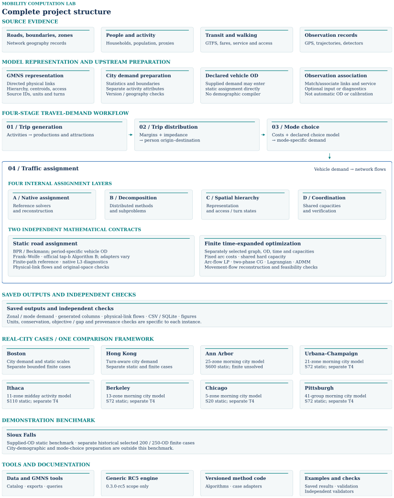](https://scholarhaozheng.github.io/mobility-network-lab/assets/atlas/project-map.svg)

Open the [clickable project map](https://scholarhaozheng.github.io/mobility-network-lab/assets/atlas/project-map.svg), or use the same module links below.

<table width="100%">
<tr><th colspan="4" align="left">Project modules and reading destinations</th></tr>
<tr><td width="25%" valign="top"><a href="https://scholarhaozheng.github.io/mobility-network-lab/volumes/overview.html#coverage-stage-01">Roads, boundaries, zones</a></td><td width="25%" valign="top"><a href="https://scholarhaozheng.github.io/mobility-network-lab/volumes/overview.html#coverage-stage-03">People and activity</a></td><td width="25%" valign="top"><a href="https://scholarhaozheng.github.io/mobility-network-lab/volumes/overview.html#coverage-stage-04">Transit and walking</a></td><td width="25%" valign="top"><a href="https://scholarhaozheng.github.io/mobility-network-lab/volumes/overview.html#coverage-stage-05">Observation records</a></td></tr>
<tr><td width="25%" valign="top"><a href="https://scholarhaozheng.github.io/mobility-network-lab/volumes/overview.html#src-docs-data-contract-document">GMNS representation</a></td><td width="25%" valign="top"><a href="https://scholarhaozheng.github.io/mobility-network-lab/volumes/overview.html#coverage-stage-06">City demand preparation</a></td><td width="25%" valign="top"><a href="https://scholarhaozheng.github.io/mobility-network-lab/volumes/sioux-falls.html#coverage-row-01">Declared vehicle OD</a></td><td width="25%" valign="top"><a href="https://scholarhaozheng.github.io/mobility-network-lab/volumes/overview.html#coverage-stage-05">Observation association</a></td></tr>
<tr><td width="25%" valign="top"><a href="https://scholarhaozheng.github.io/mobility-network-lab/volumes/overview.html#coverage-stage-06">01 / Trip generation</a></td><td width="25%" valign="top"><a href="https://scholarhaozheng.github.io/mobility-network-lab/volumes/overview.html#coverage-stage-07">02 / Trip distribution</a></td><td width="25%" valign="top"><a href="https://scholarhaozheng.github.io/mobility-network-lab/volumes/overview.html#coverage-stage-08">03 / Mode choice</a></td><td width="25%" valign="top"><a href="https://scholarhaozheng.github.io/mobility-network-lab/volumes/overview.html#coverage-stage-09">04 / Traffic assignment</a></td></tr>
<tr><td width="25%" valign="top"><a href="#assignment-layer-a">A / Native assignment</a></td><td width="25%" valign="top"><a href="#assignment-layer-b">B / Decomposition</a></td><td width="25%" valign="top"><a href="#assignment-layer-c">C / Spatial hierarchy</a></td><td width="25%" valign="top"><a href="#assignment-layer-d">D / Coordination</a></td></tr>
<tr><td width="25%" valign="top"><a href="https://scholarhaozheng.github.io/mobility-network-lab/volumes/overview.html#src-docs-methods-document-static-frankwolfe-reference-implementation">Static road assignment</a></td><td width="25%" valign="top"><a href="https://scholarhaozheng.github.io/mobility-network-lab/volumes/overview.html#src-docs-methods-space-time-cg-document">Finite time-expanded optimization</a></td><td width="25%" valign="top"><a href="https://scholarhaozheng.github.io/mobility-network-lab/volumes/overview.html#src-docs-outputs-document">Saved outputs and independent checks</a></td><td width="25%" valign="top"><a href="https://scholarhaozheng.github.io/mobility-network-lab/volumes/boston.html">Boston</a></td></tr>
<tr><td width="25%" valign="top"><a href="https://scholarhaozheng.github.io/mobility-network-lab/volumes/hong-kong.html">Hong Kong</a></td><td width="25%" valign="top"><a href="https://scholarhaozheng.github.io/mobility-network-lab/volumes/ann-arbor.html">Ann Arbor</a></td><td width="25%" valign="top"><a href="https://scholarhaozheng.github.io/mobility-network-lab/volumes/urbana-champaign.html">Urbana–Champaign</a></td><td width="25%" valign="top"><a href="https://scholarhaozheng.github.io/mobility-network-lab/volumes/ithaca.html">Ithaca</a></td></tr>
<tr><td width="25%" valign="top"><a href="https://scholarhaozheng.github.io/mobility-network-lab/volumes/berkeley.html">Berkeley</a></td><td width="25%" valign="top"><a href="https://scholarhaozheng.github.io/mobility-network-lab/volumes/chicago.html">Chicago</a></td><td width="25%" valign="top"><a href="https://scholarhaozheng.github.io/mobility-network-lab/volumes/pittsburgh.html">Pittsburgh</a></td><td width="25%" valign="top"><a href="https://scholarhaozheng.github.io/mobility-network-lab/volumes/sioux-falls.html">Sioux Falls</a></td></tr>
<tr><td width="25%" valign="top"><a href="https://scholarhaozheng.github.io/mobility-network-lab/volumes/overview.html#src-docs-data-tools-document">Data and GMNS tools</a></td><td width="25%" valign="top"><a href="https://scholarhaozheng.github.io/mobility-network-lab/volumes/overview.html#src-docs-getting-started-document-run-from-raw-input">Generic RC5 engine</a></td><td width="25%" valign="top"><a href="https://scholarhaozheng.github.io/mobility-network-lab/reproduce.html">Versioned method code</a></td><td width="25%" valign="top"><a href="https://scholarhaozheng.github.io/mobility-network-lab/reproduce.html">Examples and checks</a></td></tr>
</table>

Click any module or case card to open its documentation. Eight real-city cases use equal cards and the same reading order; Sioux Falls follows them as a separate supplied-OD demonstration benchmark. Method availability and acceptance remain specific to each case and frozen instance. Source evidence, four travel-demand stages, assignment layers, mathematical contracts and software entry points retain their distinct roles. [Full-size SVG](https://scholarhaozheng.github.io/mobility-network-lab/assets/figure-contract-r11/project-structure.svg) · [PNG](https://scholarhaozheng.github.io/mobility-network-lab/assets/figure-contract-r11/project-structure.png) · [PDF](https://scholarhaozheng.github.io/mobility-network-lab/assets/figure-contract-r11/project-structure.pdf) · [Source and link geometry](https://scholarhaozheng.github.io/mobility-network-lab/assets/figure-contract-r11/project-structure.source.json) · [Accessible structure and case links](#project-map-accessible).

Prior architecture image and source code

The earlier architecture drawing remains unchanged: <a href="https://scholarhaozheng.github.io/mobility-network-lab/assets/atlas/figures/g-f001.svg">original SVG</a> · <a href="https://scholarhaozheng.github.io/mobility-network-lab/assets/atlas/figures/g-f001.png">original PNG</a> · <a href="https://scholarhaozheng.github.io/mobility-network-lab/assets/atlas/figures/g-f001.pdf">original PDF</a> · <a href="https://scholarhaozheng.github.io/mobility-network-lab/assets/atlas/project-map.svg">original clickable map</a>. Current pure-render source: <a href="https://scholarhaozheng.github.io/mobility-network-lab/assets/figure-contract-r11/code/project_structure.py">project_structure.py</a>.

Text version of the complete project structure and all nine city cases

Source evidence and model preparation lead to supported travel-demand stages: trip generation, distribution, mode choice and traffic assignment. Declared vehicle OD can enter assignment directly. A–D are assignment reading layers; static BPR/Beckmann assignment and fixed-cost, hard-capacity finite optimization use separate contracts. Saved outputs and independent checks are instance-specific.

<ul>
<li><a href="https://scholarhaozheng.github.io/mobility-network-lab/volumes/overview.html#coverage-stage-01">Roads, boundaries, zones</a></li>
<li><a href="https://scholarhaozheng.github.io/mobility-network-lab/volumes/overview.html#coverage-stage-03">People and activity</a></li>
<li><a href="https://scholarhaozheng.github.io/mobility-network-lab/volumes/overview.html#coverage-stage-04">Transit and walking</a></li>
<li><a href="https://scholarhaozheng.github.io/mobility-network-lab/volumes/overview.html#coverage-stage-05">Observation records</a></li>
<li><a href="https://scholarhaozheng.github.io/mobility-network-lab/volumes/overview.html#src-docs-data-contract-document">GMNS representation</a></li>
<li><a href="https://scholarhaozheng.github.io/mobility-network-lab/volumes/overview.html#coverage-stage-06">City demand preparation</a></li>
<li><a href="https://scholarhaozheng.github.io/mobility-network-lab/volumes/sioux-falls.html#coverage-row-01">Declared vehicle OD</a></li>
<li><a href="https://scholarhaozheng.github.io/mobility-network-lab/volumes/overview.html#coverage-stage-05">Observation association</a></li>
<li><a href="https://scholarhaozheng.github.io/mobility-network-lab/volumes/overview.html#coverage-stage-06">01 / Trip generation</a></li>
<li><a href="https://scholarhaozheng.github.io/mobility-network-lab/volumes/overview.html#coverage-stage-07">02 / Trip distribution</a></li>
<li><a href="https://scholarhaozheng.github.io/mobility-network-lab/volumes/overview.html#coverage-stage-08">03 / Mode choice</a></li>
<li><a href="https://scholarhaozheng.github.io/mobility-network-lab/volumes/overview.html#coverage-stage-09">04 / Traffic assignment</a></li>
<li><a href="#assignment-layer-a">A / Native assignment</a></li>
<li><a href="#assignment-layer-b">B / Decomposition and distributed computation</a></li>
<li><a href="#assignment-layer-c">C / Spatial hierarchy and representation</a></li>
<li><a href="#assignment-layer-d">D / Coordination and verification</a></li>
<li><a href="https://scholarhaozheng.github.io/mobility-network-lab/volumes/overview.html#src-docs-methods-document-static-frankwolfe-reference-implementation">Static road assignment</a></li>
<li><a href="https://scholarhaozheng.github.io/mobility-network-lab/volumes/overview.html#src-docs-methods-space-time-cg-document">Finite time-expanded optimization</a></li>
<li><a href="https://scholarhaozheng.github.io/mobility-network-lab/volumes/overview.html#src-docs-outputs-document">Saved outputs and independent checks</a></li>
<li><a href="https://scholarhaozheng.github.io/mobility-network-lab/volumes/boston.html">Boston</a></li>
<li><a href="https://scholarhaozheng.github.io/mobility-network-lab/volumes/hong-kong.html">Hong Kong</a></li>
<li><a href="https://scholarhaozheng.github.io/mobility-network-lab/volumes/ann-arbor.html">Ann Arbor</a>: 25-zone four-stage city model; separate accepted S600 FW / sparse fixed-path / Algorithm B checks, with S72 Native initialization checks; T1/T4 remains unsolved.</li>
<li><a href="https://scholarhaozheng.github.io/mobility-network-lab/volumes/urbana-champaign.html">Urbana–Champaign</a>: 21-zone four-stage city model with the received CUMTD mode-choice revision and its 418-OD FW check; separate S72 methods and accepted T4 exact-DAG LP / CG / LR / ADMM results.</li>
<li><a href="https://scholarhaozheng.github.io/mobility-network-lab/volumes/ithaca.html">Ithaca</a>: 11-zone midday local-activity model; accepted S110 static and bounded T4 numerical endpoints, with observation diagnostics kept separate.</li>
<li><a href="https://scholarhaozheng.github.io/mobility-network-lab/volumes/berkeley.html">Berkeley</a>: 13-zone four-stage model; accepted S72 static comparisons and T4 LP / CG / LR / ADMM evidence.</li>
<li><a href="https://scholarhaozheng.github.io/mobility-network-lab/volumes/chicago.html">Chicago</a>: 5-zone Jane Byrne/West Loop city model; accepted S20 Algorithm B and Native80, independently certified T4 CG and the new LR hybrid; HiGHS, compressed Native and ADMM limits retained.</li>
<li><a href="https://scholarhaozheng.github.io/mobility-network-lab/volumes/pittsburgh.html">Pittsburgh</a>: 41-group East End city model; accepted S72 Native continuation at outer 14 and separate T4 exact-DAG LP / CG / LR / ADMM evidence; Pit30M route-link absence retained.</li>
<li><a href="https://scholarhaozheng.github.io/mobility-network-lab/volumes/sioux-falls.html">Sioux Falls</a>: demonstration benchmark with supplied vehicle OD; city-demographic and mode-choice preparation are outside its scope.</li>
<li><a href="https://scholarhaozheng.github.io/mobility-network-lab/volumes/overview.html#src-docs-data-tools-document">Data and GMNS tools</a></li>
<li><a href="https://scholarhaozheng.github.io/mobility-network-lab/volumes/overview.html#src-docs-getting-started-document-run-from-raw-input">Generic RC5 engine</a></li>
<li><a href="https://scholarhaozheng.github.io/mobility-network-lab/reproduce.html">Versioned method code</a></li>
<li><a href="https://scholarhaozheng.github.io/mobility-network-lab/reproduce.html">Examples and checks</a></li>
</ul>

GMNS keeps directed physical roads, hierarchical zones, centroids, nonphysical access and source IDs distinct. Population, household and activity preparation precedes **01 trip generation → 02 trip distribution → 03 mode choice → 04 traffic assignment** where those stages are supported; declared vehicle OD can instead enter assignment directly. GPS traces and map matching, service records and detector context require explicit quality and network-association rules. [GMNS exchange](https://scholarhaozheng.github.io/mobility-network-lab/volumes/boston.html#src-docs-datasets-boston-gmns-exchange-document) · [Four-stage city workflow](https://scholarhaozheng.github.io/mobility-network-lab/volumes/overview.html#src-docs-city-workflow-document) · [Observation example](https://scholarhaozheng.github.io/mobility-network-lab/volumes/boston.html#src-docs-datasets-boston-behavior-feedback-document).

Static **BPR/Beckmann** assignment and finite **fixed-cost, hard-capacity time-expanded** optimization use separate mathematical models. [Architecture](https://scholarhaozheng.github.io/mobility-network-lab/volumes/overview.html#src-docs-architecture-document) · [Data contract](https://scholarhaozheng.github.io/mobility-network-lab/volumes/overview.html#src-docs-data-contract-document).

### Two axes of Mobility Computation Lab

**Horizontal axis — documented city cases:**  

Boston · Hong Kong · Ann Arbor · Urbana–Champaign · Ithaca · Berkeley · Chicago · Pittsburgh  
Sioux Falls · demonstration benchmark

**Vertical axis — computational depth within network assignment:**

- **A · Native assignment** — Frank–Wolfe, official tap-b Algorithm B, finite-path controls, and native L3 reconstruction.
- **B · Decomposition and distributed computation** — column generation, Lagrangian decomposition, and ADMM local or coupled computations.
- **C · Spatial hierarchy and representation** — fine and parent zones, access relationships, turn/time states, and projection back to physical network objects.
- **D · Coordination and verification** — shared capacities, residuals, pricing closure, independent evaluators, and declared result contracts.

**How to read the two axes.**  

The horizontal axis compares eight real-city cases on equal terms: Boston, Hong Kong, Ann Arbor, Urbana–Champaign, Ithaca, Berkeley, Chicago, and Pittsburgh. Sioux Falls follows them as a supplied-OD demonstration benchmark. The vertical axis organizes increasing computational depth inside the network-assignment branch; finite-method coverage differs by city and is stated in the comparison table. Source data, GMNS, population and activity preparation, transit and observations, and the four-stage demand workflow remain the common city-model foundation outside A–D.

## 03 / Case coverage and selected evidence

Six-city figure update · [Current evidence, short optimization records and Boston/Hong Kong figure comparison](https://scholarhaozheng.github.io/mobility-network-lab/figure-update-status.html)

Compare the documented inputs, methods and results of eight real-city cases, followed by the Sioux Falls demonstration benchmark. Full descriptions and evidence links are shown directly in the table.

<table width="100%"><caption>Complete coverage details for eight real-city cases and one demonstration benchmark, with nineteen evidence and method rows.</caption><thead><tr><th valign="top" width="10%">Stage / evidence</th><th id="cmp-head-boston" valign="top" width="10%"><a href="https://scholarhaozheng.github.io/mobility-network-lab/volumes/boston.html">Boston</a></th><th id="cmp-head-hong-kong" valign="top" width="10%"><a href="https://scholarhaozheng.github.io/mobility-network-lab/volumes/hong-kong.html">Hong Kong</a></th><th id="cmp-head-ann-arbor" valign="top" width="10%"><a href="https://scholarhaozheng.github.io/mobility-network-lab/volumes/ann-arbor.html">Ann Arbor</a></th><th id="cmp-head-urbana-champaign" valign="top" width="10%"><a href="https://scholarhaozheng.github.io/mobility-network-lab/volumes/urbana-champaign.html">Urbana–Champaign</a></th><th id="cmp-head-ithaca" valign="top" width="10%"><a href="https://scholarhaozheng.github.io/mobility-network-lab/volumes/ithaca.html">Ithaca</a></th><th id="cmp-head-berkeley" valign="top" width="10%"><a href="https://scholarhaozheng.github.io/mobility-network-lab/volumes/berkeley.html">Berkeley</a></th><th id="cmp-head-chicago" valign="top" width="10%"><a href="https://scholarhaozheng.github.io/mobility-network-lab/volumes/chicago.html">Chicago</a></th><th id="cmp-head-pittsburgh" valign="top" width="10%"><a href="https://scholarhaozheng.github.io/mobility-network-lab/volumes/pittsburgh.html">Pittsburgh</a></th><th id="cmp-head-sioux-falls" valign="top" width="10%"><a href="https://scholarhaozheng.github.io/mobility-network-lab/volumes/sioux-falls.html">Sioux Falls</a> Demonstration benchmark</th></tr></thead><tbody><tr><th valign="top" width="10%">I · Foundations</th><td colspan="9" valign="top" width="90%">City data and model foundations</td></tr><tr id="cmp-data-01"><th id="cmp-row-01" valign="top" width="10%">01Source data and preparation</th><td valign="top" width="10%">
GMNS Plus, ACS/GTFS and registered source preparation.

<a href="https://scholarhaozheng.github.io/mobility-network-lab/volumes/boston.html#coverage-row-01">Read evidence ↗</a>
</td><td valign="top" width="10%">
Official-derived bounded network and source layers.

<a href="https://scholarhaozheng.github.io/mobility-network-lab/volumes/hong-kong.html#coverage-row-01">Read evidence ↗</a>
</td><td valign="top" width="10%">
Central Ann Arbor: 19.633 km² circle, 25 clipped grid zones and a 400 m routing halo. Saved inputs use 2020–2024 ACS, 2021 LODES, OSM and U-M GTFS for 5 October 2026. Full derived figures are available in this local reading edition.

<a href="https://scholarhaozheng.github.io/mobility-network-lab/volumes/ann-arbor.html#ann-r3-sources">Saved figure and evidence ↗</a>
</td><td valign="top" width="10%">
A fixed 19.303 km² rectangle uses four OSM tiles, selected 2020 Census blocks and 2023 Illinois LODES workplace jobs; UIUC is location context, not the demand boundary.

<a href="https://scholarhaozheng.github.io/mobility-network-lab/volumes/urbana-champaign.html#scope">Case boundary and period</a>
</td><td valign="top" width="10%">
11 populated tract groups cover the 7.501778 km² City demand area; 13.235585 km² of road support provides surrounding routes. This is midday HBO_LOCAL_ACTIVITY, not morning HBW.

<a href="https://scholarhaozheng.github.io/mobility-network-lab/volumes/ithaca.html#scope">Read evidence</a>
</td><td valign="top" width="10%">
Two research tiles form a 3.884 km² central Berkeley union; 13 clipped tracts define demand. A larger 10.803 km² acquisition envelope is not the model boundary.

<a href="https://scholarhaozheng.github.io/mobility-network-lab/volumes/berkeley.html#scope">Case boundary and period ↗</a>
</td><td valign="top" width="10%">
A 12.023 km² Jane Byrne/West Loop rectangle uses 4 October 2026 OSM roads and five clipped City community areas. It is separate from Chicago Sketch, Regional and teaching-network cases.

<a href="https://scholarhaozheng.github.io/mobility-network-lab/volumes/chicago.html#scope">Read evidence</a>
</td><td valign="top" width="10%">
The 19.77 km² East End rectangle covers Oakland, Shadyside and Squirrel Hill, with a larger routing halo. CMU is a landmark; the earlier 4.35 km² preflight is a separate source product.

<a href="https://scholarhaozheng.github.io/mobility-network-lab/volumes/pittsburgh.html#scope">Read evidence</a>
</td><td valign="top" width="10%">
Frozen classic 24-node/76-link source graph and supplied vehicle OD.

<a href="https://scholarhaozheng.github.io/mobility-network-lab/volumes/sioux-falls.html#coverage-row-01">Read evidence ↗</a>
</td></tr><tr id="cmp-data-02"><th id="cmp-row-02" valign="top" width="10%">02GMNS network, zones and access</th><td valign="top" width="10%">
5,091 physical links; 177 H3 fine zones, nine parents; connectors separate.

<a href="https://scholarhaozheng.github.io/mobility-network-lab/volumes/boston.html#coverage-row-02">Read evidence ↗</a>
</td><td valign="top" width="10%">
780 physical nodes, 1,239 links; 95 fine zones, ten parents and turn-aware access.

<a href="https://scholarhaozheng.github.io/mobility-network-lab/volumes/hong-kong.html#coverage-row-02">Read evidence ↗</a>
</td><td valign="top" width="10%">
Accepted four-stage graph: 5,138 physical road arcs within 14,203 total arcs, and 25 in-zone road access points. This differs from the earlier 4,059-link road-centerline preflight; source and accepted graphs are not mixed.

<a href="https://scholarhaozheng.github.io/mobility-network-lab/volumes/ann-arbor.html#ann-r3-sources">Saved figure and evidence ↗</a>
</td><td valign="top" width="10%">
21 zones; preflight GMNS has 24,775 nodes and 46,203 directed physical links. The assignment graph separately retains 11,365 traversal arcs and 15,237 turn arcs.

<a href="https://scholarhaozheng.github.io/mobility-network-lab/volumes/urbana-champaign.html#assignment">Assignment graph and access</a>
</td><td valign="top" width="10%">
The preflight graph has 20,928 nodes and 24,420 segments; the separate four-stage graph has 15,148 physical directed roads plus turn/access arcs. Zone access uses public-road nodes, not audited entrances.

<a href="https://scholarhaozheng.github.io/mobility-network-lab/volumes/ithaca.html#assignment">Assignment graph and access</a>
</td><td valign="top" width="10%">
The retained auto graph has 2,150 directed roads; 11 zones have auto access and all 13 have walk access. Conservative restriction screening removes 105 links; this is not complete turn-aware routing.

<a href="https://scholarhaozheng.github.io/mobility-network-lab/volumes/berkeley.html#inputs">Read evidence ↗</a>
</td><td valign="top" width="10%">
The final road graph has 15,133 nodes and 27,129 directed links, with five anchors in a strong component. OSM restriction relations were not fetched; real turn legality remains unverified.

<a href="https://scholarhaozheng.github.io/mobility-network-lab/volumes/chicago.html#assignment">Road assignment and restriction limits</a>
</td><td valign="top" width="10%">
41 distinct OUT-state zone access points load 17,534 physical traversal and 38,850 virtual movement arcs. OUT-state loading omits the first physical link; conservative via-way closures can remove legal alternatives.

<a href="https://scholarhaozheng.github.io/mobility-network-lab/volumes/pittsburgh.html#assignment">Read evidence</a>
</td><td valign="top" width="10%">
24-node, 76-link supplied directed benchmark.

<a href="https://scholarhaozheng.github.io/mobility-network-lab/volumes/sioux-falls.html#coverage-row-02">Read evidence ↗</a>
</td></tr><tr id="cmp-data-03"><th id="cmp-row-03" valign="top" width="10%">03Population, households and activity</th><td valign="top" width="10%">
ACS 2024 five-year block groups allocated to 177 clipped H3 zones.

<a href="https://scholarhaozheng.github.io/mobility-network-lab/volumes/boston.html#coverage-row-03">Read evidence ↗</a>
</td><td valign="top" width="10%">
2021 census households/population and explicitly modeled building activity proxies.

<a href="https://scholarhaozheng.github.io/mobility-network-lab/volumes/hong-kong.html#coverage-row-03">Read evidence ↗</a>
</td><td valign="top" width="10%">
Approximately 52,954 residents, 19,287 households and 69,183 workplace jobs are area allocated into all 25 model zones. ACS and LODES vintages differ; these are model inputs rather than a measured 2026 population.

<a href="https://scholarhaozheng.github.io/mobility-network-lab/volumes/ann-arbor.html#ann-r3-population">Saved figure and evidence ↗</a>
</td><td valign="top" width="10%">
725 selected blocks contain 52,040 residents, 19,696 occupied housing units and 43,602 workplace jobs. Earlier whole-tract population (84,805) is not the demand denominator.

<a href="https://scholarhaozheng.github.io/mobility-network-lab/volumes/urbana-champaign.html#inputs">Read evidence</a>
</td><td valign="top" width="10%">
Original 27,797.946 residents, 10,361.966 occupied units and 1,127 OSM activity objects remain. New 2020 LODES all-job supplement: 8,752.529038 area-allocated jobs; 7,493 fully-contained to 10,858 intersecting-block spatial bounds. Not unique persons or confidence intervals; original attractions unchanged.

<a href="https://scholarhaozheng.github.io/mobility-network-lab/volumes/ithaca.html#inputs">Read evidence</a> · <a href="https://scholarhaozheng.github.io/mobility-network-lab/volumes/ithaca.html#gap-20261008">Current gap addendum ↗</a>
</td><td valign="top" width="10%">
Selected 2020 Census blocks contain 31,821 residents; 2023 LODES supplies 16,583 primary workplace jobs. Housing units remain a separate field and are not relabelled households.

<a href="https://scholarhaozheng.github.io/mobility-network-lab/volumes/berkeley.html#inputs">Read evidence ↗</a>
</td><td valign="top" width="10%">
Original≈73,375 population and active-license attraction weights remain. New ACS 2019–2023 tract-area allocation adds 51,874.133727 households/occupied units across five zones. This estimate did not enter original generation and is not measured zone households.

<a href="https://scholarhaozheng.github.io/mobility-network-lab/volumes/chicago.html#inputs">Read evidence</a> · <a href="https://scholarhaozheng.github.io/mobility-network-lab/volumes/chicago.html#gap-20261008">Current gap addendum ↗</a>
</td><td valign="top" width="10%">
1,130 selected 2020 blocks aggregate into 41 tract-ID groups: 71,684 residents, 32,432 occupied units and 91,801 jobs from 2023 LODES. These are selected-block, not whole-tract totals.

<a href="https://scholarhaozheng.github.io/mobility-network-lab/volumes/pittsburgh.html#inputs">Read evidence</a>
</td><td valign="top" width="10%">
Supplied OD; no demographic city compiler.

<a href="https://scholarhaozheng.github.io/mobility-network-lab/volumes/sioux-falls.html#coverage-row-03">Read evidence ↗</a>
</td></tr></tbody><tbody><tr><th valign="top" width="10%">II · Observations</th><td colspan="9" valign="top" width="90%">Transit and observation evidence</td></tr><tr id="cmp-data-04"><th id="cmp-row-04" valign="top" width="10%">04Transit and pedestrian inputs</th><td valign="top" width="10%">
MBTA service and pedestrian access support the bounded demand/feedback example.

<a href="https://scholarhaozheng.github.io/mobility-network-lab/volumes/boston.html#coverage-row-04">Read evidence ↗</a>
</td><td valign="top" width="10%">
GTFS same-trip rides, fares, headways and pedestrian access enter generalized costs.

<a href="https://scholarhaozheng.github.io/mobility-network-lab/volumes/hong-kong.html#coverage-row-04">Read evidence ↗</a>
</td><td valign="top" width="10%">
Original U-M service-day chart stays bound to R2: bus 110/600 OD and walk 366/600. A separate timetable-choice revision has numeric-only reception; its new U-M-derived figures remain held and no new road assignment follows it.

<a href="https://scholarhaozheng.github.io/mobility-network-lab/volumes/ann-arbor.html#ann-r3-transit">Saved figure and evidence ↗</a> · <a href="https://scholarhaozheng.github.io/mobility-network-lab/volumes/ann-arbor.html#gap-20261008">Current gap addendum ↗</a>
</td><td valign="top" width="10%">
New dated CUMTD 2026-10-07 service: 1,937 active trips and 1,672 timetable queries (418 OD×four departures), each with a legal ride. Directed walk and transfer rules were checked. Queries are scheduled options, not observed boardings; old geometry-only inputs stay historical.

<a href="https://scholarhaozheng.github.io/mobility-network-lab/volumes/urbana-champaign.html#figure-f04-transit-reference">Transit source context</a> · <a href="https://scholarhaozheng.github.io/mobility-network-lab/volumes/urbana-champaign.html#gap-20261008">Current gap addendum ↗</a>
</td><td valign="top" width="10%">
Original TCAT feed 20260922 feed supplies 2026-10-05 service: 836 active trips, 627 active service-day stops. Earlier 168 union stops are a different bounded geometry scope. Direct transit 98/110 OD, walk 108/110; no transfers or observed boarding validation.

<a href="https://scholarhaozheng.github.io/mobility-network-lab/volumes/ithaca.html#mode">Transit and walking assumptions</a> · <a href="https://scholarhaozheng.github.io/mobility-network-lab/volumes/ithaca.html#gap-20261008">Current gap addendum ↗</a>
</td><td valign="top" width="10%">
Direct AC Transit for 5 October 2026 is available on 38 directed zone pairs, with stop snaps limited to 120 m. BART, Bear Transit and transfers are excluded from the selected-day model.

<a href="https://scholarhaozheng.github.io/mobility-network-lab/volumes/berkeley.html#mode">Read evidence ↗</a>
</td><td valign="top" width="10%">
Drive is available on all 20 OD pairs; walk on ten under a 35-minute limit. CTA service-day costs were not obtained under its license; transit is Not modelled, not predicted zero ridership.

<a href="https://scholarhaozheng.github.io/mobility-network-lab/volumes/chicago.html#mode">Read evidence</a>
</td><td valign="top" width="10%">
Driving covers every positive OD; walking is unavailable for 105 positive-demand pairs. No accepted timetable/path input supports transit, so transit is Not modelled.

<a href="https://scholarhaozheng.github.io/mobility-network-lab/volumes/pittsburgh.html#mode">Read evidence</a>
</td><td valign="top" width="10%">
No GTFS or pedestrian city-input lane.

<a href="https://scholarhaozheng.github.io/mobility-network-lab/volumes/sioux-falls.html#coverage-row-04">Read evidence ↗</a>
</td></tr><tr id="cmp-data-05"><th id="cmp-row-05" valign="top" width="10%">05GPS, trajectory and detector evidence</th><td valign="top" width="10%">
Exploratory map matching and service feedback.

<a href="https://scholarhaozheng.github.io/mobility-network-lab/volumes/boston.html#coverage-row-05">Read evidence ↗</a>
</td><td valign="top" width="10%">
Detector and private trajectory association; no held-out validation claim.

<a href="https://scholarhaozheng.github.io/mobility-network-lab/volumes/hong-kong.html#coverage-row-05">Read evidence ↗</a>
</td><td valign="top" width="10%">
Exact GPS remains withheld. The licensed State Street photograph is dated 17 August 2013 and supplies city context only, not modeled-demand or traffic evidence.

</td><td valign="top" width="10%">
Current observation bridge has 27 GPS points and 35 source links; 33/35 links and 32/34 turns map to frozen R2. Two unmatched flow cells remain empty. Unknown mode and mismatched dates prevent route ground truth or local calibration; exact traces stay private.

<a href="https://scholarhaozheng.github.io/mobility-network-lab/volumes/urbana-champaign.html#limitations">Observation limitations</a> · <a href="https://scholarhaozheng.github.io/mobility-network-lab/volumes/urbana-champaign.html#historic-facility-photos">Historic facility photographs</a> · <a href="https://scholarhaozheng.github.io/mobility-network-lab/volumes/urbana-champaign.html#gap-20261008">Current gap addendum ↗</a>
</td><td valign="top" width="10%">
Current bridge: 87 source links, 60 geometric R2 candidates, 27 unresolved; exact ordered route private. NYSDOT adds 294 legacy 2015–2019 records/76 sites and 51 source 2022 records/17 historical station IDs, only 3 with new coordinates. No aligned calibration or fresh holdout.

<a href="https://scholarhaozheng.github.io/mobility-network-lab/volumes/ithaca.html#limitations">Observation limitations</a> · <a href="https://scholarhaozheng.github.io/mobility-network-lab/volumes/ithaca.html#gap-20261008">Current gap addendum ↗</a>
</td><td valign="top" width="10%">
No observed OD, independent link counts or field-audited entrances calibrate the case. The public Shattuck/Center turn sidecar is an engineering candidate, not observed or surveyed turn truth.

<a href="https://scholarhaozheng.github.io/mobility-network-lab/volumes/berkeley.html#local-turn-candidate">Local turn candidate and limits ↗</a>
</td><td valign="top" width="10%">
Historical 2011 data supplied a 1,778-point matching sample: native matching passed 2/10 distance gates, HMM 10/10. These internal smoke metrics are not surveyed accuracy or 2026 route observations.

</td><td valign="top" width="10%">
— / Accepted evidence unavailable.
</td><td valign="top" width="10%">
No modern GPS or detector observations.

<a href="https://scholarhaozheng.github.io/mobility-network-lab/volumes/sioux-falls.html#coverage-row-05">Read evidence ↗</a>
</td></tr></tbody><tbody><tr><th valign="top" width="10%">III · Travel demand</th><td colspan="9" valign="top" width="90%">Four-stage travel-demand workflow</td></tr><tr id="cmp-data-06"><th id="cmp-row-06" valign="top" width="10%">0601 / Trip generation — productions / attractions</th><td valign="top" width="10%">
Purpose-level productions and attractions in the bounded Boston example.

<a href="https://scholarhaozheng.github.io/mobility-network-lab/volumes/boston.html#coverage-row-06">Read evidence ↗</a>
</td><td valign="top" width="10%">
Transferred rate and declared capture sensitivity.

<a href="https://scholarhaozheng.github.io/mobility-network-lab/volumes/hong-kong.html#coverage-row-06">Read evidence ↗</a>
</td><td valign="top" width="10%">
Household-based generation produces 6,596.065080 person-trip opportunities: 3,627.835794 external/uncaptured, 237.458343 intrazonal and 2,730.770943 internal interzonal. All 25 zones and the complete ledger are shown.

<a href="https://scholarhaozheng.github.io/mobility-network-lab/volumes/ann-arbor.html#ann-r3-generation">Saved figure and evidence ↗</a>
</td><td valign="top" width="10%">
Assumed 1.2 HBW trips per occupied unit/day and 25% hour share generate 5,908.8 person trips; 55% capture and 8% intrazonal share leave 2,989.8528 internal interzonal person trips.

<a href="https://scholarhaozheng.github.io/mobility-network-lab/volumes/urbana-champaign.html#figure-fs-g01">Generation figure</a>
</td><td valign="top" width="10%">
Assumed 0.8 daily local-activity trips per resident and 0.08 midday share generate 1,779.0685 person trips; boundary and intrazonal accounting leaves 1,017.6272 internal interzonal person trips.

<a href="https://scholarhaozheng.github.io/mobility-network-lab/volumes/ithaca.html#figure-fs-g01">Generation figure</a>
</td><td valign="top" width="10%">
Assumed 0.65 HBW trips per resident/day and 35% hour share generate 7,239.2775 person trips. After capture/intrazonal accounting, 2,381.7223 person trips enter interzonal distribution.

<a href="https://scholarhaozheng.github.io/mobility-network-lab/volumes/berkeley.html#figure-f10-generation">Generation figure ↗</a>
</td><td valign="top" width="10%">
Assumed 0.4 daily HBW trips per resident and 35% hour share generate 10,272.5339 person trips; external/intrazonal accounting leaves 2,835.2193 internal interzonal person trips.

<a href="https://scholarhaozheng.github.io/mobility-network-lab/volumes/chicago.html#figure-fs-g01">Generation figure</a>
</td><td valign="top" width="10%">
Transferred 1.90 HBW trips per occupied unit/day and assumed 25% hour share generate 15,405.2 person trips. LODES-derived scalar proxies leave 4,007.5466 internal interzonal person trips; they are not measured hourly rates.

<a href="https://scholarhaozheng.github.io/mobility-network-lab/volumes/pittsburgh.html#figure-fs-g01">Generation figure</a>
</td><td valign="top" width="10%">
Vehicle OD supplied; no trip-generation run.

<a href="https://scholarhaozheng.github.io/mobility-network-lab/volumes/sioux-falls.html#coverage-row-06">Read evidence ↗</a>
</td></tr><tr id="cmp-data-07"><th id="cmp-row-07" valign="top" width="10%">0702 / Trip distribution — zonal OD demand</th><td valign="top" width="10%">
Zonal OD construction for the bounded semantic scenario.

<a href="https://scholarhaozheng.github.io/mobility-network-lab/volumes/boston.html#coverage-row-07">Read evidence ↗</a>
</td><td valign="top" width="10%">
Turn-aware gravity/IPF balances 8,930 reachable directed OD pairs.

<a href="https://scholarhaozheng.github.io/mobility-network-lab/volumes/hong-kong.html#coverage-row-07">Read evidence ↗</a>
</td><td valign="top" width="10%">
Complete 25×25 matrix contains 600 positive directed interzonal OD pairs and 2,730.770943 person trips. Five IPF iterations leave maximum margin residual 1.1862e−7; the declared 90/10 period direction conversion is applied once.

<a href="https://scholarhaozheng.github.io/mobility-network-lab/volumes/ann-arbor.html#ann-r3-distribution">Saved figure and evidence ↗</a>
</td><td valign="top" width="10%">
Gravity/IPF produces 418 positive directed OD pairs and 2,989.8528 person trips using an 85% forward / 15% reverse conversion; five IPF iterations leave 7.6423×10⁻⁶-person-trip margin error.

<a href="https://scholarhaozheng.github.io/mobility-network-lab/volumes/urbana-champaign.html#figure-fs-d01">Distribution figure</a>
</td><td valign="top" width="10%">
Seven gravity/IPF iterations yield 110 positive directed OD pairs and 9.8700×10⁻⁸-person-trip margin error. A 60% forward / 40% reverse conversion conserves 1,017.6272 person trips.

<a href="https://scholarhaozheng.github.io/mobility-network-lab/volumes/ithaca.html#figure-fs-d01">Distribution figure</a>
</td><td valign="top" width="10%">
Walking-network gravity and seven IPF iterations produce 90 positive person OD pairs, with 2.1453×10⁻⁵-person-trip margin error. A 90% forward / 10% reverse conversion retains all 13-zone context.

<a href="https://scholarhaozheng.github.io/mobility-network-lab/volumes/berkeley.html#figure-f11-distribution">Distribution figure ↗</a>
</td><td valign="top" width="10%">
All 20 possible directed interzonal pairs are positive. Gravity/IPF takes 27 iterations with 2.4071×10⁻⁵-person-trip margin error; zone IDs are 8, 24, 28, 32 and 33.

<a href="https://scholarhaozheng.github.io/mobility-network-lab/volumes/chicago.html#figure-fs-d01">Distribution figure</a>
</td><td valign="top" width="10%">
Four IPF iterations produce 1,406 positive OD pairs with 1.6168×10⁻⁶-person-trip margin residual. A 100% forward convention conserves 4,007.5466 person trips; the updated heatmap retains all 41 model zones, including two zero-demand rows/columns.

<a href="https://scholarhaozheng.github.io/mobility-network-lab/volumes/pittsburgh.html#figure-fs-d01">Saved figure and evidence ↗</a>
</td><td valign="top" width="10%">
Supplied OD is input.

<a href="https://scholarhaozheng.github.io/mobility-network-lab/volumes/sioux-falls.html#coverage-row-07">Read evidence ↗</a>
</td></tr><tr id="cmp-data-08"><th id="cmp-row-08" valign="top" width="10%">0803 / Mode choice — mode-specific demand</th><td valign="top" width="10%">
S1/S2 service response and conditional absolute choice remain separate.

<a href="https://scholarhaozheng.github.io/mobility-network-lab/volumes/boston.html#coverage-row-08">Read evidence ↗</a>
</td><td valign="top" width="10%">
GTFS/pedestrian generalized cost and declared sensitivity logit.

<a href="https://scholarhaozheng.github.io/mobility-network-lab/volumes/hong-kong.html#coverage-row-08">Read evidence ↗</a>
</td><td valign="top" width="10%">
Retained R2 mode choice: 1,977.380 drive, 244.808 U-M bus and 508.583 walk persons; occupancy 1.2 gives 1,647.817 PCE/h. The separate new timetable-choice output has not been assigned; its held chart families are not displayed.

<a href="https://scholarhaozheng.github.io/mobility-network-lab/volumes/ann-arbor.html#ann-r3-mode">Saved figure and evidence ↗</a> · <a href="https://scholarhaozheng.github.io/mobility-network-lab/volumes/ann-arbor.html#gap-20261008">Current gap addendum ↗</a>
</td><td valign="top" width="10%">
New timetable revision conserves 2,989.8528 persons: 2,083.862 drive, 444.409 walk and 461.581 transit. Occupancy 1.25 yields 1,667.089946 PCE/h. Old drive/walk-only 1,963.6483 PCE/h is a distinct historical input, not a same-demand algorithm comparison.

<a href="https://scholarhaozheng.github.io/mobility-network-lab/volumes/urbana-champaign.html#figure-fs-m01">Mode-choice figure</a> · <a href="https://scholarhaozheng.github.io/mobility-network-lab/volumes/urbana-champaign.html#gap-20261008">Current gap addendum ↗</a>
</td><td valign="top" width="10%">
Approximately 547.640 drive, 172.911 direct-transit and 297.077 walk person trips; occupancy 1.3 yields 421.2613 PCE. Transit uses four departure ticks, without transfers or boarding validation.

<a href="https://scholarhaozheng.github.io/mobility-network-lab/volumes/ithaca.html#figure-fs-m01">Mode-choice figure</a>
</td><td valign="top" width="10%">
OD-specific choice yields 1,238.9648 drive, 169.6685 direct-transit and 973.0890 walk person trips. Occupancy 1.30 yields 953.0498 PCE across 72 positive vehicle OD pairs.

<a href="https://scholarhaozheng.github.io/mobility-network-lab/volumes/berkeley.html#figure-f12-mode-choice">Mode-choice figure ↗</a>
</td><td valign="top" width="10%">
OD-specific choice produces approximately 2,105.938 drive and 729.281 walk person trips. Occupancy 1.2 converts driving once to 1,754.9483 vehicle/PCE trips; transit is Not modelled.

<a href="https://scholarhaozheng.github.io/mobility-network-lab/volumes/chicago.html#figure-fs-m01">Mode-choice figure</a>
</td><td valign="top" width="10%">
Approximately 3,138.9 drive and 868.6 walk person trips result from OD-specific costs; occupancy 1.2 yields 2,615.7673 vehicles/PCE. Transit is Not modelled, and pedestrian capacity is not assigned.

<a href="https://scholarhaozheng.github.io/mobility-network-lab/volumes/pittsburgh.html#figure-fs-m01">Mode-choice figure</a>
</td><td valign="top" width="10%">
Vehicle OD supplied; no mode-choice run.

<a href="https://scholarhaozheng.github.io/mobility-network-lab/volumes/sioux-falls.html#coverage-row-08">Read evidence ↗</a>
</td></tr><tr id="cmp-data-09"><th id="cmp-row-09" valign="top" width="10%">0904 / Traffic assignment — assigned network flows</th><td valign="top" width="10%">
Static road flow from the bounded demand scenario; methods below.

<a href="https://scholarhaozheng.github.io/mobility-network-lab/volumes/boston.html#coverage-row-09">Read evidence ↗</a>
</td><td valign="top" width="10%">
Modeled one-hour static PCE road flow.

<a href="https://scholarhaozheng.github.io/mobility-network-lab/volumes/hong-kong.html#coverage-row-09">Read evidence ↗</a>
</td><td valign="top" width="10%">
Original R2 map: 600 OD, 5,138 physical arcs, 1,991 positive at old 1e-4 FW gate. New S600 FW assigns the same 1,647.816622 PCE/h under 1e-5 with one update. The R9 map remains the original endpoint; the new accepted aggregate is separately labelled. Original R2 and later S600 remain distinct. The new ChoiceR1 map now shows 1,569.500896674 PCE/h, 600 positive OD and all 5,138 roads (1,998 positive; 3,140 zero-flow).

<a href="https://scholarhaozheng.github.io/mobility-network-lab/volumes/ann-arbor.html#ann-r3-static-flow">Saved figure and evidence ↗</a> · <a href="https://scholarhaozheng.github.io/mobility-network-lab/volumes/ann-arbor.html#gap-20261008">Current gap addendum ↗</a> · <a href="https://scholarhaozheng.github.io/mobility-network-lab/volumes/ann-arbor.html#figure-ann-choice-fw-network-v002">Current result and same figure ↗</a>
</td><td valign="top" width="10%">
New 418-OD demand 1,667.089946 PCE/h was actually assigned on unchanged 26,602-arc graph; objective 6,898.584026 PCE·min/h and max physical v/c 1.012866. No new approved FW map was supplied; R9 map is explicitly old 1,963.6483 PCE/h baseline.

<a href="https://scholarhaozheng.github.io/mobility-network-lab/volumes/urbana-champaign.html#figure-fs-a04">Physical-road flow map</a> · <a href="https://scholarhaozheng.github.io/mobility-network-lab/volumes/urbana-champaign.html#figure-fs-a05">Physical v/c map</a> · <a href="https://scholarhaozheng.github.io/mobility-network-lab/volumes/urbana-champaign.html#gap-20261008">Current gap addendum ↗</a>
</td><td valign="top" width="10%">
All 110 positive vehicle OD pairs load 15,148 physical roads; the map joins saved PCE to frozen two-endpoint OSM segments, excluding virtual movements. Maximum physical v/c is 0.1126.

<a href="https://scholarhaozheng.github.io/mobility-network-lab/volumes/ithaca.html#figure-fs-a04">Physical-road flow map</a>
</td><td valign="top" width="10%">
All 72 positive vehicle OD pairs load the 2,150-link graph; 670 roads carry positive flow, maximum v/c ≈0.434. Restriction-based link removal can also remove lawful alternatives.

<a href="https://scholarhaozheng.github.io/mobility-network-lab/volumes/berkeley.html#figure-f13-assignment">Physical assignment and limits ↗</a>
</td><td valign="top" width="10%">
All 20 vehicle OD pairs load the saved 27,129-link graph; 1,891 links carry positive flow and maximum v/c is 0.97274. The geographic map retains each directed segment without summing serial flows.

<a href="https://scholarhaozheng.github.io/mobility-network-lab/volumes/chicago.html#figure-fs-a04">Physical-road flow map</a>
</td><td valign="top" width="10%">
All 1,406 positive vehicle OD pairs load the declared graph; 4,971 physical links carry flow and maximum v/c is 0.924094. The physical-road map excludes movement arcs and retains the OUT-state endpoint convention.

<a href="https://scholarhaozheng.github.io/mobility-network-lab/volumes/pittsburgh.html#figure-fs-a01">Physical-road flow map</a>
</td><td valign="top" width="10%">
Static network flow from supplied vehicle OD; no upstream four-stage compiler.

<a href="https://scholarhaozheng.github.io/mobility-network-lab/volumes/sioux-falls.html#coverage-row-09">Read evidence ↗</a>
</td></tr></tbody><tbody><tr><th valign="top" width="10%">IV · Static methods</th><td colspan="9" valign="top" width="90%">Static assignment · BPR / Beckmann</td></tr><tr id="cmp-data-10"><th id="cmp-row-10" valign="top" width="10%">10Frank–Wolfe</th><td valign="top" width="10%">
Expanded Boston FW, up to 17,522 loaded node ODs; separate from 26-OD controls.

<a href="https://scholarhaozheng.github.io/mobility-network-lab/volumes/boston.html#coverage-row-10">Read evidence ↗</a>
</td><td valign="top" width="10%">
Turn-aware one-hour 723.191 PCE static engineering scenario.

<a href="https://scholarhaozheng.github.io/mobility-network-lab/volumes/hong-kong.html#coverage-row-10">Read evidence ↗</a>
</td><td valign="top" width="10%">
Original R2: iteration 0 only, gap 5.10283e-5≤1e-4. New S600 FW: states 0/1 and one actual update under 1e-5; final gap is floating-point scale. Separate S72 FW has 0 updates. Short traces do not establish geographic-area causality. New timetable ChoiceR1 separately saves states 0/1 and one FW update; independent final gap 5.078039901982526e−15 under 1e−5. Initial and final max v/c are separately recorded.

<a href="https://scholarhaozheng.github.io/mobility-network-lab/volumes/ann-arbor.html#ann-r3-static-check">Saved figure and evidence ↗</a> · <a href="https://scholarhaozheng.github.io/mobility-network-lab/volumes/ann-arbor.html#gap-20261008">Current gap addendum ↗</a> · <a href="https://scholarhaozheng.github.io/mobility-network-lab/volumes/ann-arbor.html#figure-ann-choice-fw-convergence-v002">Current result and same figure ↗</a>
</td><td valign="top" width="10%">
New 418-OD FW saves iteration 0 only, 0 updates under frozen 1e-4; independent signed full-graph gap≈−4.60e-15. Maximum v/c≈1.0129 prevents interpreting initial stopping as uncongested roads. Old R2 and S72 remain distinct.

<a href="https://scholarhaozheng.github.io/mobility-network-lab/volumes/urbana-champaign.html#figure-fs-a02">Initial assignment check</a> · <a href="https://scholarhaozheng.github.io/mobility-network-lab/volumes/urbana-champaign.html#gap-20261008">Current gap addendum ↗</a>
</td><td valign="top" width="10%">
New S110 FW: 110 OD, 421.261326 PCE/h, one initial record, 0 updates under 1e-5, signed gap−1.38750e-16. Max physical v/c≈0.1126 supports light loading of this scenario, not geographic-area causality. Original R2 trace stays separate.

<a href="https://scholarhaozheng.github.io/mobility-network-lab/volumes/ithaca.html#figure-fs-a02">Initial assignment check</a> · <a href="https://scholarhaozheng.github.io/mobility-network-lab/volumes/ithaca.html#gap-20261008">Current gap addendum ↗</a>
</td><td valign="top" width="10%">
Initial gap 1.6551×10⁻¹⁵ is below 10⁻⁴, with objective 2,746.0944 PCE-min and zero FW updates. The accepted result uses the unchanged conservative network, not the local turn sidecar.

<a href="https://scholarhaozheng.github.io/mobility-network-lab/volumes/berkeley.html#figure-f13-assignment">Initial assignment check ↗</a>
</td><td valign="top" width="10%">
Three actual FW updates reach gap 2.0989×10⁻⁵ below 10⁻⁴ and objective 5,601.4625 PCE-min. The saved trace contains the initial assignment plus those three updates.

<a href="https://scholarhaozheng.github.io/mobility-network-lab/volumes/chicago.html#figure-fs-a02">Recorded FW trace</a>
</td><td valign="top" width="10%">
Initial gap 4.7740×10⁻⁷ is below 10⁻⁴, objective is 12,081.0666 PCE-min and no FW updates are needed. This internal-demand-only scenario does not measure total road congestion.

<a href="https://scholarhaozheng.github.io/mobility-network-lab/volumes/pittsburgh.html#figure-fs-a02">Initial assignment check</a>
</td><td valign="top" width="10%">
Classic 528-OD static FW, with ID-matched link-flow comparison against Algorithm B.

<a href="https://scholarhaozheng.github.io/mobility-network-lab/volumes/sioux-falls.html#coverage-row-10">Read evidence ↗</a>
</td></tr><tr id="cmp-data-11"><th id="cmp-row-11" valign="top" width="10%">11Official tap-b Algorithm B</th><td valign="top" width="10%">
B0/B1 numerical transfer via task-local lossless TAPLab-compatible adapter.

<a href="https://scholarhaozheng.github.io/mobility-network-lab/volumes/boston.html#coverage-row-11">Read evidence ↗</a>
</td><td valign="top" width="10%">
Accepted task-local lossless adapter; official-adapter parity remains unverified.

<a href="https://scholarhaozheng.github.io/mobility-network-lab/volumes/hong-kong.html#coverage-row-11">Read evidence ↗</a>
</td><td valign="top" width="10%">
S0 accepts same-S600 Algorithm B: 600 OD, 1,647.816622 PCE/h, one reported iteration containing 50 shifts. Original-space gap≈−8.19e-15 passes the 1e-5 evaluator gate; no initialization history is invented.

<a href="https://scholarhaozheng.github.io/mobility-network-lab/volumes/ann-arbor.html#gap-20261008">Current gap addendum ↗</a>
</td><td valign="top" width="10%">
S0 accepts B on unchanged old S72 only: 72 OD, 321.629660 PCE/h, one reported iteration with 42 shifts; full-graph gap 2.97e-14. This is not B on new 418-OD demand, and no new public B spatial figure was released.

<a href="https://scholarhaozheng.github.io/mobility-network-lab/volumes/urbana-champaign.html#gap-20261008">Current gap addendum ↗</a>
</td><td valign="top" width="10%">
Official tap-b Algorithm B is not included in this bounded static case.

</td><td valign="top" width="10%">
Official tap-b Algorithm B is not included in this bounded static case.

</td><td valign="top" width="10%">
Same-original-S20 B is S0 accepted through a lossless integer-ID adapter: 20 OD, 1,754.948251 PCE/h, six saved iterations; signed full gap 1.58075e-9, objective 5,601.4614682869 PCE·min/h. No official Chicago converter byte-parity claim.

<a href="https://scholarhaozheng.github.io/mobility-network-lab/volumes/chicago.html#gap-20261008">Current gap addendum ↗</a>
</td><td valign="top" width="10%">
Official tap-b Algorithm B is not included in this bounded static case.

</td><td valign="top" width="10%">
Official TAPLab registered-adapter parity passes on Sioux Falls.

<a href="https://scholarhaozheng.github.io/mobility-network-lab/volumes/sioux-falls.html#coverage-row-11">Read evidence ↗</a>
</td></tr><tr id="cmp-data-12"><th id="cmp-row-12" valign="top" width="10%">12Finite-path reference</th><td valign="top" width="10%">
26 OD, 130-path uncompressed SLSQP reference on ABS_PLANNED.

<a href="https://scholarhaozheng.github.io/mobility-network-lab/volumes/boston.html#coverage-row-12">Read evidence ↗</a>
</td><td valign="top" width="10%">
Accepted bounded H1: 26 ODs / 126 legal paths; matches H1 FW with full-graph relative gap approximately zero.

<a href="https://scholarhaozheng.github.io/mobility-network-lab/volumes/hong-kong.html#coverage-row-12">Read evidence ↗</a>
</td><td valign="top" width="10%">
Sparse fixed-path FW passes: S600 has 3,000 paths, two states and one update; pool-gap gate 1e-7 plus independent full-graph gate 1e-5. Separate S72 has 360 paths and 0 updates.

<a href="https://scholarhaozheng.github.io/mobility-network-lab/volumes/ann-arbor.html#gap-20261008">Current gap addendum ↗</a>
</td><td valign="top" width="10%">
Separate S72 finite reference: 72 selected OD, 321.6296599 PCE/hour, all 360 paths. Objective 1086.5535434763 PCE min matches same-S72 FW; original-coordinate checks pass. This is not the full 418-OD demand.

<a href="https://scholarhaozheng.github.io/mobility-network-lab/volumes/urbana-champaign.html#uc-r3-static-comparison">Saved figure and evidence ↗</a>
</td><td valign="top" width="10%">
S110 finite SLSQP accepted: 550 frozen paths, 421.261326 PCE/h, objective 1,638.7317576864 PCE·min/h, full gap≈−1.39e-16. Reports nit=1 but no separate iteration history. GC03 compares methods, not iteration states.

<a href="https://scholarhaozheng.github.io/mobility-network-lab/volumes/ithaca.html#gap-20261008">Current gap addendum ↗</a>
</td><td valign="top" width="10%">
Finite-path SLSQP solved all 72 vehicle OD on the frozen K=5, 360-path pool; objective 2746.0944149794555 PCE·min and independently checked complete-graph gap 4.96534e-16.

<a href="https://scholarhaozheng.github.io/mobility-network-lab/volumes/berkeley.html#berkeley-finite-reference">Read evidence ↗</a>
</td><td valign="top" width="10%">
Accepted S20 finite-path reference: 100 saved paths, objective 5601.461468286856 PCE·min/h and full-graph relative gap 8.005091514776758e−12. This one-hour static model is separate from T4 CG.

<a href="https://scholarhaozheng.github.io/mobility-network-lab/volumes/chicago.html#released-c06-s-flow">Current figure in city volume ↗</a>
</td><td valign="top" width="10%">
Separate selected S72 transfer: 72 OD, 149.9214239 PCE/hour, 360 finite paths. Independent check passes with objective 763.227941458126 PCE min, zero OD/reconstruction error and full-graph gap 1.49e−15. The original 1,406-OD instance is distinct.

<a href="https://scholarhaozheng.github.io/mobility-network-lab/volumes/pittsburgh.html#pit-r3-static-reference">Saved figure and evidence ↗</a>
</td><td valign="top" width="10%">
Frozen 2,218-path B_BECKMANN native candidate; full-network UE remains uncertified.

<a href="https://scholarhaozheng.github.io/mobility-network-lab/volumes/sioux-falls.html#coverage-row-12">Read evidence ↗</a>
</td></tr><tr id="cmp-data-13"><th id="cmp-row-13" valign="top" width="10%">13Native Diagnostic L3 / compression</th><td valign="top" width="10%">
Rank-26/52 native controls on the same 26-OD ABS_PLANNED instance.

<a href="https://scholarhaozheng.github.io/mobility-network-lab/volumes/boston.html#coverage-row-13">Read evidence ↗</a>
</td><td valign="top" width="10%">
Accepted H1 ranks 26 and 52; full-graph relative gap approximately 2.31×10⁻¹¹; evaluated under low congestion.

<a href="https://scholarhaozheng.github.io/mobility-network-lab/volumes/hong-kong.html#coverage-row-13">Read evidence ↗</a>
</td><td valign="top" width="10%">
Separate S72 Native26/52 initial states pass with zero optimizer updates at 243.071389 PCE/h. This is initial-state acceptance, not an iterative compression test. S600 Native26/52 are resource-gated and were not solved.

<a href="https://scholarhaozheng.github.io/mobility-network-lab/volumes/ann-arbor.html#gap-20261008">Current gap addendum ↗</a>
</td><td valign="top" width="10%">
Accepted S72 Native26/52 outer-9 endpoints, retaining all nine saved checks. Demand is 321.6296599 PCE/h. Maximum OD residuals are 1.8816028177388866e−8 and 1.8723606126256828e−8 PCE/h; signed full relative gaps are −7.700777592456942e−11 and 1.3408031038763639e−8. S72, the full 418-OD city case and T4 are separate instances.

<a href="https://scholarhaozheng.github.io/mobility-network-lab/volumes/urbana-champaign.html#uc-r3-native-check">Saved figure and evidence ↗</a>
</td><td valign="top" width="10%">
Accepted S110 Native26/52 endpoints at outer 4; each complete four-step history is retained. Final original-OD residuals are approximately 7.59e−11 and 1.25e−10 PCE/h. Exact link-variable elimination retains original-space checks.

<a href="https://scholarhaozheng.github.io/mobility-network-lab/volumes/ithaca.html#gap-20261008">Current gap addendum ↗</a>
</td><td valign="top" width="10%">
Native L3 ranks 26/52 passed original-coordinate and full-graph checks. Path coordinates are 98/124 plus 2,150 explicit link variables; no performance superiority is inferred.

<a href="https://scholarhaozheng.github.io/mobility-network-lab/volumes/berkeley.html#berkeley-native-l3">Read evidence ↗</a>
</td><td valign="top" width="10%">
Accepted Native80 at outer 3: 20 major plus 80 uncompressed minor coordinates, U=I80. Full-graph gap is 1.4899811815539771e−12, maximum original-OD residual 1.7885781744553242e−10 PCE/h, and link-reconstruction error 1.1368683772161603e−13 PCE/h. No compression advantage is claimed.

<a href="https://scholarhaozheng.github.io/mobility-network-lab/volumes/chicago.html#released-c06-s-convergence">Current figure in city volume ↗</a>
</td><td valign="top" width="10%">
Accepted same-S72 Native26/52 outer-14 endpoints. Original-OD maxima 8.07013475568935e−8 and 2.6256443221356536e−7 PCE/h satisfy the unchanged 1e−6 gate, together with full-gap, nonnegative and reconstruction checks. All 14 saved checks per rank remain plotted.

<a href="https://scholarhaozheng.github.io/mobility-network-lab/volumes/pittsburgh.html#released-pit-s02">Current figure in city volume ↗</a>
</td><td valign="top" width="10%">
Rank-50 classic static benchmark candidates.

<a href="https://scholarhaozheng.github.io/mobility-network-lab/volumes/sioux-falls.html#coverage-row-13">Read evidence ↗</a>
</td></tr></tbody><tbody><tr><th valign="top" width="10%">V · Finite methods</th><td colspan="9" valign="top" width="90%">Finite time-expanded computation</td></tr><tr id="cmp-data-14"><th id="cmp-row-14" valign="top" width="10%">14Network construction and generated columns</th><td valign="top" width="10%">
90-node/125-link/10-OD finite graph; saved time-indexed column.

<a href="https://scholarhaozheng.github.io/mobility-network-lab/volumes/boston.html#coverage-row-14">Read evidence ↗</a>
</td><td valign="top" width="10%">
100-node / 111-link / ten-OD finite graph, with saved time-layer construction and generated-column evidence.

<a href="https://scholarhaozheng.github.io/mobility-network-lab/volumes/hong-kong.html#coverage-row-14">Read evidence ↗</a>
</td><td valign="top" width="10%">
Network construction and generated columns is not included in this bounded static case.

</td><td valign="top" width="10%">
Separate T4 pulse: 4 selected OD, 0.0516231483 PCE, 30-second steps, H=160. The actual 1,429,496-arc graph distinguishes physical traversal, turn, wait and ledger connectors; four computed paths are retained. The old 418-OD hourly ledger is available. Its selected first-bin total is below minimum capacity 3.75 PCE; frozen-instance capacity is nonbinding. Geographic effects remain untested; the new candidate was not executed after LOCK_TIMEOUT.

<a href="https://scholarhaozheng.github.io/mobility-network-lab/volumes/urbana-champaign.html#uc-r3-time-layers">Saved figure and evidence ↗</a> · <a href="https://scholarhaozheng.github.io/mobility-network-lab/volumes/urbana-champaign.html#scope-vs-demand-20261008">Current result and same figure ↗</a>
</td><td valign="top" width="10%">
New separate fixed-cost T4: 4 shortest-input OD, 36,360 arc-times, 30-second steps, H 41, 0.656755360434 PCE pulse at 11:02:30. Full eligible arc-time coverage is checked; not DNL/DUE, and no new public route diagram.

<a href="https://scholarhaozheng.github.io/mobility-network-lab/volumes/ithaca.html#gap-20261008">Current gap addendum ↗</a>
</td><td valign="top" width="10%">
The separate T4 finite graph has 92,578 states and 250,886 arcs for four first-bin OD pulses (10.439304601026 PCE), 30-second step and H165 horizon.

<a href="https://scholarhaozheng.github.io/mobility-network-lab/volumes/berkeley.html#berkeley-time-semantics">Read evidence ↗</a>
</td><td valign="top" width="10%">
The frozen T4 has 490,223 states, 1,351,628 arcs and a 66.53295454563035 PCE pulse; its time step is 30 seconds and horizon H169. This finite-time instance is separate from the S20 one-hour static model. Construction and actual computed paths are shown.

<a href="https://scholarhaozheng.github.io/mobility-network-lab/volumes/chicago.html#chicago-r3-input-time-layer-excerpt">Saved input figures ↗</a>
</td><td valign="top" width="10%">
The frozen T4 has 1,811,888 arcs, four OD and a 0.04502754845355 PCE pulse at 08:02:30, with 30-second steps and H117. Computed paths retain their actual arc sequence. Minimum physical time-arc capacity is 2.5 PCE and is nonbinding in this instance.

<a href="https://scholarhaozheng.github.io/mobility-network-lab/volumes/pittsburgh.html#released-pit-at00">Current figure in city volume ↗</a>
</td><td valign="top" width="10%">
Selected 200/250-OD finite graphs; saved time-indexed columns.

<a href="https://scholarhaozheng.github.io/mobility-network-lab/volumes/sioux-falls.html#coverage-row-14">Read evidence ↗</a>
</td></tr><tr id="cmp-data-15"><th id="cmp-row-15" valign="top" width="10%">15Arc-flow LP reference</th><td valign="top" width="10%">
Own-graph LP reference for the bounded ten-OD fixed-cost instance.

<a href="https://scholarhaozheng.github.io/mobility-network-lab/volumes/boston.html#coverage-row-15">Read evidence ↗</a>
</td><td valign="top" width="10%">
Own-graph LP reference for R5 ten-OD finite case.

<a href="https://scholarhaozheng.github.io/mobility-network-lab/volumes/hong-kong.html#coverage-row-15">Read evidence ↗</a>
</td><td valign="top" width="10%">
Arc-flow LP reference is not included in this bounded static case.

</td><td valign="top" width="10%">
Accepted same-T4 exact-DAG LP primal/dual certificate after proving capacity redundancy; objective 0.37598366513352877 PCE·min.

<a href="https://scholarhaozheng.github.io/mobility-network-lab/volumes/urbana-champaign.html#r3-method-transfer">Saved figure and evidence ↗</a>
</td><td valign="top" width="10%">
Accepted same-T4 exact-DAG LP certificate: objective 0.9184282689393537 PCE·min. The 0.65675536 PCE pulse is below the 2.5 PCE minimum physical-arc capacity, proving capacity rows redundant for this instance.

<a href="https://scholarhaozheng.github.io/mobility-network-lab/volumes/ithaca.html#gap-20261008">Current gap addendum ↗</a>
</td><td valign="top" width="10%">
Full arc-flow HiGHS LP solved the unchanged T4 at 43.66742440800644 PCE·min; independent primal-dual and complete-arc checks passed.

<a href="https://scholarhaozheng.github.io/mobility-network-lab/volumes/berkeley.html#berkeley-t-lp">Read evidence ↗</a>
</td><td valign="top" width="10%">
— / Accepted evidence unavailable.
</td><td valign="top" width="10%">
Accepted same-T4 exact-DAG LP certificate: primal 0.24793241990274612 and dual 0.2479324199027458 PCE·min. The complete reachable variable domain, original conservation and pricing conditions are independently checked.

<a href="https://scholarhaozheng.github.io/mobility-network-lab/volumes/pittsburgh.html#released-pit-t08">Current figure in city volume ↗</a>
</td><td valign="top" width="10%">
Own selected-graph LP references for historical 200/250 ODs.

<a href="https://scholarhaozheng.github.io/mobility-network-lab/volumes/sioux-falls.html#coverage-row-15">Read evidence ↗</a>
</td></tr><tr id="cmp-data-16"><th id="cmp-row-16" valign="top" width="10%">16Two-phase column generation</th><td valign="top" width="10%">
Phase I/II and independent 10/10 pricing closure.

<a href="https://scholarhaozheng.github.io/mobility-network-lab/volumes/boston.html#coverage-row-16">Read evidence ↗</a>
</td><td valign="top" width="10%">
Phase I/II, same-graph LP agreement and independent 10/10 closure.

<a href="https://scholarhaozheng.github.io/mobility-network-lab/volumes/hong-kong.html#coverage-row-16">Read evidence ↗</a>
</td><td valign="top" width="10%">
Two-phase column generation is not included in this bounded static case.

</td><td valign="top" width="10%">
Accepted two-phase CG on T4: one saved round per phase, zero artificial flow, four self-generated paths and independent full-DAG pricing closure. Objective 0.37598366513352854 PCE min.

<a href="https://scholarhaozheng.github.io/mobility-network-lab/volumes/urbana-champaign.html#uc-r3-cg-phase1">Saved figure and evidence ↗</a>
</td><td valign="top" width="10%">
Accepted T4 CG saves one round per phase with 4 own seed paths, no added columns. Artificial 0 and full-DAG minimum reduced cost 0 close the nonbinding-capacity case. Two phases are not one objective trajectory.

<a href="https://scholarhaozheng.github.io/mobility-network-lab/volumes/ithaca.html#gap-20261008">Current gap addendum ↗</a>
</td><td valign="top" width="10%">
Two-phase CG closed the same T4 objective at 43.667424408006426 PCE·min with ten columns and full-DAG pricing.

<a href="https://scholarhaozheng.github.io/mobility-network-lab/volumes/berkeley.html#berkeley-t-cg">Read evidence ↗</a>
</td><td valign="top" width="10%">
Accepted CG on its own full graph: primal 241.2185242449435 and dual 241.2185242449434 PCE·min, 425 columns and 268 saved round records. Complete-graph pricing closure is independently checked.

<a href="https://scholarhaozheng.github.io/mobility-network-lab/volumes/chicago.html#released-c06-t-cg">Current figure in city volume ↗</a>
</td><td valign="top" width="10%">
Accepted T4 CG retains one actual round per phase, four own seed paths, zero artificial flow and complete-DAG minimum reduced cost. The 0.04502754845 PCE pulse is below the 2.5 PCE minimum arc capacity, proving capacity redundancy for this instance.

<a href="https://scholarhaozheng.github.io/mobility-network-lab/volumes/pittsburgh.html#released-pit-t03">Current figure in city volume ↗</a>
</td><td valign="top" width="10%">
Separate historical 200 / 250-OD CG results; independent full-DAG pricing closure is not established.

<a href="https://scholarhaozheng.github.io/mobility-network-lab/volumes/sioux-falls.html#coverage-row-16">Read evidence ↗</a>
</td></tr><tr id="cmp-data-17"><th id="cmp-row-17" valign="top" width="10%">17Lagrangian</th><td valign="top" width="10%">
Saved Boston R2 10-OD best-bound iteration trace; feasible primal, 1.1002% gap misses the frozen 1% gate.

<a href="https://scholarhaozheng.github.io/mobility-network-lab/volumes/boston.html#coverage-row-17">Read evidence ↗</a>
</td><td valign="top" width="10%">
Ten-OD feasible recovery with 0.7444% certified gap.

<a href="https://scholarhaozheng.github.io/mobility-network-lab/volumes/hong-kong.html#coverage-row-17">Read evidence ↗</a>
</td><td valign="top" width="10%">
Lagrangian is not included in this bounded static case.

</td><td valign="top" width="10%">
Accepted same-T4 LR: one actual iteration, zero capacity multipliers, separately recovered feasible upper bound and independently checked lower bound. Capacities do not bind at this pulse.

<a href="https://scholarhaozheng.github.io/mobility-network-lab/volumes/urbana-champaign.html#uc-r3-lr-bounds">Saved figure and evidence ↗</a>
</td><td valign="top" width="10%">
Accepted T4 LR: one iteration and own recovery, zero prices and projected subgradient, U/L≈0.918428268939353 PCE·min agree. Certified-gap stopping follows nonbinding capacity; not a fabricated multi-round flat line.

<a href="https://scholarhaozheng.github.io/mobility-network-lab/volumes/ithaca.html#gap-20261008">Current gap addendum ↗</a>
</td><td valign="top" width="10%">
The 300-iteration same-model cold-start LR record passed all 23 original formal-entry checks. The unchanged 1% certificate is first met at iteration 10; the first later bound improvement is at 19 and the best bound is reached at 256. The saved zero gap denotes floating-point closure. The original ten-iteration instance remains separately identified.

<a href="https://scholarhaozheng.github.io/mobility-network-lab/volumes/berkeley.html#berkeley-lr-current-status-20261007">Current formal status and retained figures ↗</a>
</td><td valign="top" width="10%">
Accepted own-pool LR recovery hybrid: 26 feasibility rounds plus 10 original-cost bound/price rounds, 182 own paths, upper 241.2268172335 and lower 239.1173646810 PCE·min. Its 0.8744685% certified gap satisfies the unchanged 1% gate.

<a href="https://scholarhaozheng.github.io/mobility-network-lab/volumes/chicago.html#released-c06-t-lr">Current figure in city volume ↗</a>
</td><td valign="top" width="10%">
Accepted T4 LR with own feasible upper 0.2479324199027461 and lower 0.24793241990274573 PCE·min. The max(1,|U|)-normalized contract gap is 3.608224830031759e−16; the true relative bound difference is approximately 1.45532594384e−15.

<a href="https://scholarhaozheng.github.io/mobility-network-lab/volumes/pittsburgh.html#released-pit-t04">Current figure in city volume ↗</a>
</td><td valign="top" width="10%">
Saved P07 best-dual and recovered feasible-primal traces for separate 200-OD and 250-OD instances; final certified gaps are 0.0746% and 0.3177%.

<a href="https://scholarhaozheng.github.io/mobility-network-lab/volumes/sioux-falls.html#coverage-row-17">Read evidence ↗</a>
</td></tr><tr id="cmp-data-18"><th id="cmp-row-18" valign="top" width="10%">18ADMM</th><td valign="top" width="10%">
Ten-OD original-space checks; own-LP gap 6.68e-6.

<a href="https://scholarhaozheng.github.io/mobility-network-lab/volumes/boston.html#coverage-row-18">Read evidence ↗</a>
</td><td valign="top" width="10%">
Accepted bounded ADMM R3 transfer Fresh preregistered 4-OD holdout · 165 iterations · LP-relative difference 6.83×10⁻⁶ Finite 30-s × 50-step shared-capacity case with modeled OD demand in a bounded study area; empirical traffic validation remains open.

<a href="https://scholarhaozheng.github.io/mobility-network-lab/volumes/hong-kong.html#coverage-row-18">Read evidence ↗</a>
</td><td valign="top" width="10%">
ADMM is not included in this bounded static case.

</td><td valign="top" width="10%">
Accepted same-T4 ADMM: one cold-start update and independent cold confirmation. Own-x objective 0.37598366514196835 PCE min; absolute LP difference 8.44e−12 PCE min, true relative difference 2.24e−11. All original-unit gates pass.

<a href="https://scholarhaozheng.github.io/mobility-network-lab/volumes/urbana-champaign.html#uc-r3-admm-objective">Saved figure and evidence ↗</a>
</td><td valign="top" width="10%">
Accepted exact saved T4 ADMM endpoint after two archive-bound read-only checks: one cold-start outer update and all original-unit gates satisfied. LP objective difference is 2.18492e−13 PCE·min. This is a capacity-nonbinding instance, not a congestion stress test.

<a href="https://scholarhaozheng.github.io/mobility-network-lab/volumes/ithaca.html#gap-20261008">Current gap addendum ↗</a>
</td><td valign="top" width="10%">
Post-diagnostic ADMM C2a stopped at cumulative outer 170; its own x objective differs from same-T4 LP by 5.31869009587e-5 (0.00531869%), within the unchanged 1e-4 gate. Physical-link flow is checked separately; maximum absolute ADMM–LP difference is 0.990967760238112 PCE. S0 batch v001 confirms the existing method identity and accepts the released original summary assets. Existing local presentation bytes retain their separate permission boundary; no new experiment is counted.

<a href="https://scholarhaozheng.github.io/mobility-network-lab/volumes/berkeley.html#berkeley-t-admm">Read evidence ↗</a><a href="https://scholarhaozheng.github.io/mobility-network-lab/volumes/berkeley.html#figure-admm-physical-flow-comparison">Physical-flow comparison ↗</a><a href="https://scholarhaozheng.github.io/mobility-network-lab/volumes/berkeley.html#berkeley-admm-accuracy-r3">Current S0 result and released figures</a>
</td><td valign="top" width="10%">
Unconverged diagnostic: 84 saved rows from outer33–116; 34–36 original coordination, 37–116 alpha1.6 candidate. At 116: original-x capacity excess 0.0421644796900 PCE; primal 0.121224522778 PCE; dual 0.0391348952092 min; stationarity 0.0250952425689 min. Original x is infeasible; CG objective difference is not evaluated.

<a href="https://scholarhaozheng.github.io/mobility-network-lab/volumes/chicago.html#figure-chicago-admm116-history">Current result and same figure ↗</a>
</td><td valign="top" width="10%">
Accepted T4 ADMM after one actual outer update and an independent same-configuration cold-start confirmation. Saved own-x objective is 0.2479324199052491 PCE·min; true relative LP difference is 1.0095484124259508e−11. The corrected stopping figure uses PCE for primal residual and threshold, and minutes for rho-scaled dual residual and threshold.

<a href="https://scholarhaozheng.github.io/mobility-network-lab/volumes/pittsburgh.html#released-pit-t05">Current figure in city volume ↗</a>
</td><td valign="top" width="10%">
Selected 200/250-OD original-space checks on finite graphs; the static 528-OD benchmark is a separate case.

<a href="https://scholarhaozheng.github.io/mobility-network-lab/volumes/sioux-falls.html#coverage-row-18">Read evidence ↗</a>
</td></tr></tbody><tbody><tr><th valign="top" width="10%">VI · Reusable outputs</th><td colspan="9" valign="top" width="90%">Reusable outputs and tools</td></tr><tr id="cmp-data-19"><th id="cmp-row-19" valign="top" width="10%">19Reusable outputs, queries and checks</th><td valign="top" width="10%">
Released source tables, GMNS and saved-result queries; separate static and finite runners. A saved-result check is distinct from a fresh solve.

<a href="https://scholarhaozheng.github.io/mobility-network-lab/volumes/boston.html#coverage-row-19">Read evidence ↗</a>
</td><td valign="top" width="10%">
GMNS and demand tables, static/H1 and finite case packages; accepted four-OD ADMM R3 is separate from ten-OD R2. Source-to-result reproduction has distinct requirements.

<a href="https://scholarhaozheng.github.io/mobility-network-lab/volumes/hong-kong.html#coverage-row-19">Read evidence ↗</a>
</td><td valign="top" width="10%">
Project-authored ChoiceFW summaries, two result figures, necessary plot data and the retained ODbL road database are available under the mainline publication decision. Earlier S0 receipts and R2/S600/S72 identities remain unchanged. Original GTFS and replacement timetables are not included. Native600 and T1/T4 remain incomplete.

<a href="https://scholarhaozheng.github.io/mobility-network-lab/volumes/ann-arbor.html#ann-r3-static-flow">Saved figure and evidence ↗</a> · <a href="https://scholarhaozheng.github.io/mobility-network-lab/volumes/ann-arbor.html#gap-20261008">Current gap addendum ↗</a> · <a href="https://scholarhaozheng.github.io/mobility-network-lab/volumes/ann-arbor.html#choicefw-current-status">Current result and same figure ↗</a>
</td><td valign="top" width="10%">
Current accepted evidence includes the dated service-day transit revision and its actual 418-OD FW assignment, same-S72 Algorithm B, Native26/52 outer 9, and the separately frozen T4 methods. Original and revised full-city vehicle demands remain distinguishable.

<a href="https://scholarhaozheng.github.io/mobility-network-lab/volumes/urbana-champaign.html#results">Saved and fresh checks</a>
</td><td valign="top" width="10%">
S0 release_v002 adds six approved aggregate figure families and corrected addendum, including current saved S110/T4 acceptance. Employment and observations do not recalibrate the frozen model. Exact route and 2022 source-row payloads remain private; no Algorithm B or DNL/DUE is implied.

<a href="https://scholarhaozheng.github.io/mobility-network-lab/volumes/ithaca.html#results">Saved and fresh checks</a> · <a href="https://scholarhaozheng.github.io/mobility-network-lab/volumes/ithaca.html#reproduction">Reproduction status</a> · <a href="https://scholarhaozheng.github.io/mobility-network-lab/volumes/ithaca.html#gap-20261008">Current gap addendum ↗</a>
</td><td valign="top" width="10%">
Four-stage R3 saved replay and six negative fixtures passed; its fresh-solve/full-graph acceptance remains supported by earlier unchanged-input receiver evidence. Separately, accepted ADMM accuracy R3 passed two receiver formal saved replays and 12/12 corrupted-copy entry tests. Observation R2 S2 mapping is a separate evidence layer, not full-area assignment calibration.

<a href="https://scholarhaozheng.github.io/mobility-network-lab/volumes/berkeley.html#results">Acceptance provenance ↗</a><a href="https://scholarhaozheng.github.io/mobility-network-lab/volumes/berkeley.html#reproduction">Reproduction status ↗</a>
</td><td valign="top" width="10%">
Current accepted evidence includes S20 FW/finite-path, Algorithm B, uncompressed Native80, full-graph T4 CG and the own-pool LR hybrid. New household allocation and the D input ledger did not recompute the original four-stage outputs or produce DNL/DUE results. ADMM116 history and original-unit diagnostic plots are now available as a failed stopping-gate result; they do not alter the successful methods or make rank26/52 a compression success.

<a href="https://scholarhaozheng.github.io/mobility-network-lab/volumes/chicago.html#results">Saved and fresh checks</a> · <a href="https://scholarhaozheng.github.io/mobility-network-lab/volumes/chicago.html#chicago-admm116">Current result and same figure ↗</a>
</td><td valign="top" width="10%">
Current accepted evidence includes S72 Native26/52 through outer 14 and the same-T4 LP, CG, LR and ADMM results. The corrected ADMM stopping-gate figure retains the original numerical values and proper primal/PCE and dual/min units.

<a href="https://scholarhaozheng.github.io/mobility-network-lab/volumes/pittsburgh.html#released-pit-t05">Corrected ADMM stopping-gate figure ↗</a>
</td><td valign="top" width="10%">
Given-input benchmark exports, static implementations and selected-OD finite checks. Historical CG pricing closure remains a separate limitation.

<a href="https://scholarhaozheng.github.io/mobility-network-lab/volumes/sioux-falls.html#coverage-row-19">Read evidence ↗</a>
</td></tr></tbody></table>

Model scope and public availability

Each column retains its own instance, units and model scope. Static BPR/Beckmann assignment and finite fixed-cost, hard-capacity computations use separate contracts. Bounded engineering scenarios are not locally calibrated citywide forecasts. Ann Arbor is partially public: generation and distribution figures and a licensed historical photograph are released; remaining materials have source-specific restrictions. A method outside a case is different from a result not yet publicly released. Evidence presence does not imply that an acceptance gate passed.

## 04 / Explore the city cases

This README shows the complete static atlas in the same city, stage and method groups as the website. The [website atlas](https://scholarhaozheng.github.io/mobility-network-lab/#04-explore-the-three-cases) also offers city and stage views. Both Sioux Falls OD scales are expanded here.

Complete reading: [Overview](https://scholarhaozheng.github.io/mobility-network-lab/volumes/overview.html) · [Boston](https://scholarhaozheng.github.io/mobility-network-lab/volumes/boston.html) · [Hong Kong](https://scholarhaozheng.github.io/mobility-network-lab/volumes/hong-kong.html) · [Ann Arbor](https://scholarhaozheng.github.io/mobility-network-lab/volumes/ann-arbor.html) · [Urbana–Champaign](https://scholarhaozheng.github.io/mobility-network-lab/volumes/urbana-champaign.html) · [Ithaca](https://scholarhaozheng.github.io/mobility-network-lab/volumes/ithaca.html) · [Berkeley](https://scholarhaozheng.github.io/mobility-network-lab/volumes/berkeley.html) · [Chicago](https://scholarhaozheng.github.io/mobility-network-lab/volumes/chicago.html) · [Pittsburgh](https://scholarhaozheng.github.io/mobility-network-lab/volumes/pittsburgh.html) · [Sioux Falls · demonstration benchmark](https://scholarhaozheng.github.io/mobility-network-lab/volumes/sioux-falls.html)

Eight real-city cases use the same stage order. Sioux Falls follows them as a supplied-OD demonstration benchmark. Different data, static and finite instance scales are never combined into a single case size.

**A — Native assignment**  

**B — Decomposition and distributed computation**  

**C — Spatial hierarchy and representation**  

**D — Coordination and verification**

A–D are reading labels for computational depth. City-data and four-stage-demand evidence remain outside A–D. The current repository demonstrates coordination and verification components.

### Boston

City GMNS, population/demand, MBTA/GPS linkage and separate bounded static and finite computations. [Open complete case →](https://scholarhaozheng.github.io/mobility-network-lab/volumes/boston.html)

<table width="100%"><thead><tr><th valign="top" width="25%">City/model foundation</th><th valign="top" width="25%">Static assignment</th><th valign="top" width="25%">Finite time-expanded</th><th valign="top" width="25%">Observation/data scope</th></tr></thead>
<tbody><tr><td valign="top" width="25%">2,852 physical nodes; 5,091 directed links; 177 H3 fine zones</td><td valign="top" width="25%">B1: 453 ODs / 1,936.238475 PCE in 2 h; expanded FW and 26-OD controls are distinct</td><td valign="top" width="25%">90 nodes; 125 links; 10 ODs</td><td valign="top" width="25%">MBTA inputs and exploratory GPS matching; no held-out citywide calibration</td></tr></tbody></table>

[Sources and GMNS](#boston-sources) · [Population, households and activity](#boston-population) · [Transit and observations](#boston-transit) · [Trip generation](#boston-generation) · [Trip distribution](#boston-distribution) · [Mode choice](#boston-mode) · [Static assignment methods](#boston-static) · [Time-expanded network and path examples](#boston-representation) · [Optimization on the time-expanded network](#boston-finite) · [Tools and reproducibility](https://scholarhaozheng.github.io/mobility-network-lab/volumes/boston.html#src-docs-cases-boston-document-reproduction)

#### Sources and GMNS

<strong>Source data and preparation</strong>

GMNS Plus, ACS/GTFS and registered source preparation.

<a href="https://scholarhaozheng.github.io/mobility-network-lab/volumes/boston.html#src-docs-cases-boston-document-gmns-zones-and-source-evidence">Evidence</a> · <a href="https://scholarhaozheng.github.io/mobility-network-lab/volumes/boston.html#coverage-row-01">Evidence table</a>

<table width="100%">
<tr><th width="50%" valign="top" align="left"><strong>Fine zones, parent zones and physical access</strong></th><th width="50%" valign="top" align="left"><strong>Zone, access and road objects</strong></th></tr>
<tr><td width="50%" valign="top" align="left"><a href="https://scholarhaozheng.github.io/mobility-network-lab/volumes/boston.html#stage-02-gmns-network-and-access--g-f037">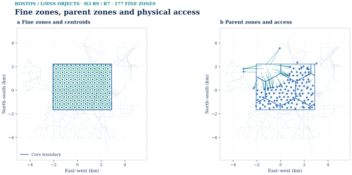</a></td><td width="50%" valign="top" align="left"><a href="https://scholarhaozheng.github.io/mobility-network-lab/volumes/boston.html#stage-02-gmns-network-and-access--g-f022">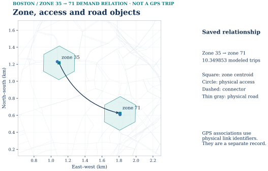</a></td></tr>
<tr><td width="50%" valign="top" align="left">
Fine H3 r9 zones and coarser parent H3 r7 structure use their saved geometry. Panel a also retains the model core boundary from the study-area map. Small centroid symbols are nonphysical model objects; access links join them to physical roads. The 177 fine zones map to 139 distinct physical access nodes. Connectors encode model access; GPS matching uses physical road links.

Study-area context is consolidated here: the core boundary, physical roads and clipped fine zones are shown together with parent zones and physical access.

<strong>GMNS network, zones and access</strong> 

5,091 physical links; 177 H3 fine zones, nine parents; connectors separate.

<a href="https://scholarhaozheng.github.io/mobility-network-lab/volumes/boston.html#src-docs-cases-boston-document-gmns-zones-and-source-evidence">Evidence</a> · <a href="https://scholarhaozheng.github.io/mobility-network-lab/assets/atlas/figures/g-f037.svg">Full figure</a>

<strong>Special zones and access</strong> 

GMNS · Central Boston

<a href="https://scholarhaozheng.github.io/mobility-network-lab/volumes/boston.html#src-docs-cases-boston-document-gmns-zones-and-source-evidence">Evidence</a> · <a href="https://scholarhaozheng.github.io/mobility-network-lab/assets/atlas/figures/g-f037.svg">Full figure</a>

</td><td width="50%" valign="top" align="left">
Real Boston GMNS zone 35→71 demand and the centroid/access/physical-road object chain. The demand relation is 10.349852758647414 modeled trips. Centroid connectors are nonphysical; physical road links can carry saved results and GPS associations. The route-60 GPS sample illustrates a separate observed journey.
</td></tr>
<tr><td width="50%" valign="top" align="left">
<a href="https://scholarhaozheng.github.io/mobility-network-lab/volumes/boston.html#stage-02-gmns-network-and-access--g-f037">Complete evidence</a> · <a href="https://scholarhaozheng.github.io/mobility-network-lab/assets/atlas/figures/g-f037.svg">Full figure</a>

Source records
<ul><li><a href="https://github.com/scholarhaozheng/mobility-network-lab/blob/6ce18b8bea5bf3b9b7caa6ee4c0ff4e701a34a8b/examples/boston/gmns_exchange_r1/data/link.csv" title="examples/boston/gmns_exchange_r1/data/link.csv">link.csv</a></li><li><a href="https://github.com/scholarhaozheng/mobility-network-lab/blob/6ce18b8bea5bf3b9b7caa6ee4c0ff4e701a34a8b/examples/boston/gmns_exchange_r1/data/zone.csv" title="examples/boston/gmns_exchange_r1/data/zone.csv">zone.csv</a></li><li><a href="https://github.com/scholarhaozheng/mobility-network-lab/blob/6ce18b8bea5bf3b9b7caa6ee4c0ff4e701a34a8b/examples/boston/gmns_exchange_r1/data/node.csv" title="examples/boston/gmns_exchange_r1/data/node.csv">node.csv</a></li><li><a href="https://github.com/scholarhaozheng/mobility-network-lab/blob/6ce18b8bea5bf3b9b7caa6ee4c0ff4e701a34a8b/examples/boston/gmns_exchange_r1/data/id_crosswalk.csv" title="examples/boston/gmns_exchange_r1/data/id_crosswalk.csv">id_crosswalk.csv</a></li></ul>

<a href="https://scholarhaozheng.github.io/mobility-network-lab/reproduce.html?figure=G-F037">Data &amp; preparation</a>
</td><td width="50%" valign="top" align="left">
<a href="https://scholarhaozheng.github.io/mobility-network-lab/volumes/boston.html#stage-02-gmns-network-and-access--g-f022">Complete evidence</a> · <a href="https://scholarhaozheng.github.io/mobility-network-lab/assets/atlas/figures/g-f022.svg">Full figure</a>

Source records
<ul><li><a href="https://github.com/scholarhaozheng/mobility-network-lab/blob/6ce18b8bea5bf3b9b7caa6ee4c0ff4e701a34a8b/examples/boston/gmns_exchange_r1/data/zone.csv" title="examples/boston/gmns_exchange_r1/data/zone.csv">zone.csv</a></li><li><a href="https://github.com/scholarhaozheng/mobility-network-lab/blob/6ce18b8bea5bf3b9b7caa6ee4c0ff4e701a34a8b/examples/boston/gmns_exchange_r1/data/id_crosswalk.csv" title="examples/boston/gmns_exchange_r1/data/id_crosswalk.csv">id_crosswalk.csv</a></li><li><a href="https://github.com/scholarhaozheng/mobility-network-lab/blob/6ce18b8bea5bf3b9b7caa6ee4c0ff4e701a34a8b/examples/boston/gmns_exchange_r1/data/node.csv" title="examples/boston/gmns_exchange_r1/data/node.csv">node.csv</a></li><li><a href="https://github.com/scholarhaozheng/mobility-network-lab/blob/6ce18b8bea5bf3b9b7caa6ee4c0ff4e701a34a8b/examples/boston/gmns_exchange_r1/data/link.csv" title="examples/boston/gmns_exchange_r1/data/link.csv">link.csv</a></li><li><a href="https://github.com/scholarhaozheng/mobility-network-lab/blob/6ce18b8bea5bf3b9b7caa6ee4c0ff4e701a34a8b/examples/boston/gmns_exchange_r1/data/demand_S1.csv" title="examples/boston/gmns_exchange_r1/data/demand_S1.csv">demand_S1.csv</a></li></ul>

<a href="https://scholarhaozheng.github.io/mobility-network-lab/reproduce.html?figure=G-F022">Data &amp; preparation</a>
</td></tr>
</table>

#### Population, households and activity

<table width="100%">
<tr><th width="50%" valign="top" align="left"><strong>Population, households and activity</strong></th><th width="50%" valign="top" align="left"><strong>One source geography allocated to H3</strong></th></tr>
<tr><td width="50%" valign="top" align="left"></td><td width="50%" valign="top" align="left"><a href="https://scholarhaozheng.github.io/mobility-network-lab/volumes/boston.html#stage-03-population-households-and-activity--g-f005">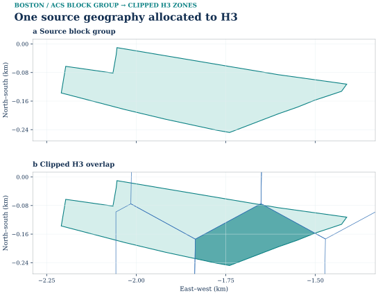</a></td></tr>
<tr><td width="50%" valign="top" align="left">
Panels a–b use ACS 2024 five-year population and household estimates allocated by area to 177 clipped H3 resolution-9 zones. Panel c shows the HBW midday attraction margin from the demand model. Panel d retains the earlier MassGIS property-tax-parcel residential assessment-area prior, measured in square feet and used with the earlier 50,000-person-trip normalization. That earlier prior is distinct from the later ACS preparation. Gray zones indicate missing source coverage. All four panels use the same clipped-zone geometry with separate, explicitly labeled color scales.

<strong>Population, households and activity</strong>

ACS 2024 five-year block groups allocated to 177 clipped H3 zones.

<a href="https://scholarhaozheng.github.io/mobility-network-lab/volumes/boston.html#src-docs-datasets-boston-population-households-document">Evidence</a> · <a href="https://scholarhaozheng.github.io/mobility-network-lab/assets/atlas/figures/g-f133.svg">Full figure</a>

</td><td width="50%" valign="top" align="left">
One selected ACS source block group, 15000US250250101031, allocated to clipped H3 zones. Source estimates are 957 persons and 232 households. The selected source-to-target weight is 0.30570178, yielding one contribution of 292.5566 persons and 70.9228 households. Weight uses the full source area. 

<strong>ACS/H3 allocation</strong>

Population · ACS 2024 five-year

<a href="https://scholarhaozheng.github.io/mobility-network-lab/volumes/boston.html#src-docs-datasets-boston-population-households-document">Evidence</a> · <a href="https://scholarhaozheng.github.io/mobility-network-lab/assets/atlas/card-layout/g-f005.svg">Full figure</a>

</td></tr>
<tr><td width="50%" valign="top" align="left">
<a href="https://scholarhaozheng.github.io/mobility-network-lab/volumes/boston.html#stage-03-population-households-and-activity--g-f133">Complete evidence</a> · <a href="https://scholarhaozheng.github.io/mobility-network-lab/assets/atlas/figures/g-f133.svg">Full figure</a>

Source records
<ul><li><a href="https://github.com/scholarhaozheng/mobility-network-lab/blob/6ce18b8bea5bf3b9b7caa6ee4c0ff4e701a34a8b/examples/boston/population_r1/data/population_or_household_by_zone.csv" title="examples/boston/population_r1/data/population_or_household_by_zone.csv">population_or_household_by_zone.csv</a></li><li><a href="https://github.com/scholarhaozheng/mobility-network-lab/blob/6ce18b8bea5bf3b9b7caa6ee4c0ff4e701a34a8b/docs/assets/boston/four_step_results_r1/data/hbw_midday_matrix.csv" title="docs/assets/boston/four_step_results_r1/data/hbw_midday_matrix.csv">hbw_midday_matrix.csv</a></li><li><a href="https://github.com/scholarhaozheng/mobility-network-lab/blob/6ce18b8bea5bf3b9b7caa6ee4c0ff4e701a34a8b/examples/boston/gmns_exchange_r1/data/zone.csv" title="examples/boston/gmns_exchange_r1/data/zone.csv">zone.csv</a></li><li><a href="https://github.com/scholarhaozheng/mobility-network-lab/blob/6ce18b8bea5bf3b9b7caa6ee4c0ff4e701a34a8b/docs/assets/boston/four_step_results_r1/data/zone_order.csv" title="docs/assets/boston/four_step_results_r1/data/zone_order.csv">zone_order.csv</a></li><li><a href="https://github.com/scholarhaozheng/mobility-network-lab/blob/6ce18b8bea5bf3b9b7caa6ee4c0ff4e701a34a8b/examples/boston/gmns_exchange_r1/data/link.csv" title="examples/boston/gmns_exchange_r1/data/link.csv">link.csv</a></li></ul>

<a href="https://scholarhaozheng.github.io/mobility-network-lab/reproduce.html?figure=G-F133">Data &amp; preparation</a>
</td><td width="50%" valign="top" align="left">
<a href="https://scholarhaozheng.github.io/mobility-network-lab/volumes/boston.html#stage-03-population-households-and-activity--g-f005">Complete evidence</a> · <a href="https://scholarhaozheng.github.io/mobility-network-lab/assets/atlas/card-layout/g-f005.svg">Full figure</a>

Source records
<ul><li><a href="https://github.com/scholarhaozheng/mobility-network-lab/blob/6ce18b8bea5bf3b9b7caa6ee4c0ff4e701a34a8b/docs/assets/boston/population_r1/source_h3_cutout.geojson" title="docs/assets/boston/population_r1/source_h3_cutout.geojson">source_h3_cutout.geojson</a></li><li><a href="https://github.com/scholarhaozheng/mobility-network-lab/blob/6ce18b8bea5bf3b9b7caa6ee4c0ff4e701a34a8b/examples/boston/population_r1/data/acs_block_group_h3_crosswalk.csv" title="examples/boston/population_r1/data/acs_block_group_h3_crosswalk.csv">acs_block_group_h3_crosswalk.csv</a></li><li><a href="https://github.com/scholarhaozheng/mobility-network-lab/blob/6ce18b8bea5bf3b9b7caa6ee4c0ff4e701a34a8b/examples/boston/population_r1/data/acs_block_group_stats.csv" title="examples/boston/population_r1/data/acs_block_group_stats.csv">acs_block_group_stats.csv</a></li></ul>

<a href="https://scholarhaozheng.github.io/mobility-network-lab/reproduce.html?figure=G-F005">Data &amp; preparation</a>
</td></tr>
</table>

#### Transit and observations

<table width="100%">
<tr><th width="33%" valign="top" align="left"><strong>Transit and modeled walking access</strong></th><th width="33%" valign="top" align="left"><strong>Returned GPS path coverage</strong></th><th width="33%" valign="top" align="left"><strong>One GPS segment and its GMNS association</strong></th></tr>
<tr><td width="33%" valign="top" align="left"><a href="https://scholarhaozheng.github.io/mobility-network-lab/volumes/boston.html#stage-04-transit-and-walk--g-f134">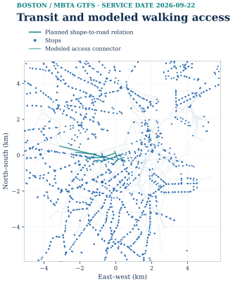</a></td><td width="33%" valign="top" align="left"><a href="https://scholarhaozheng.github.io/mobility-network-lab/volumes/boston.html#stage-05-gps-and-detectors--g-f135">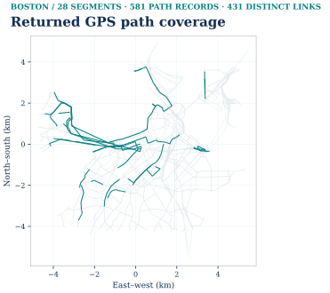</a></td><td width="33%" valign="top" align="left"><a href="https://scholarhaozheng.github.io/mobility-network-lab/volumes/boston.html#stage-05-gps-and-detectors--c-boston-gps-sample">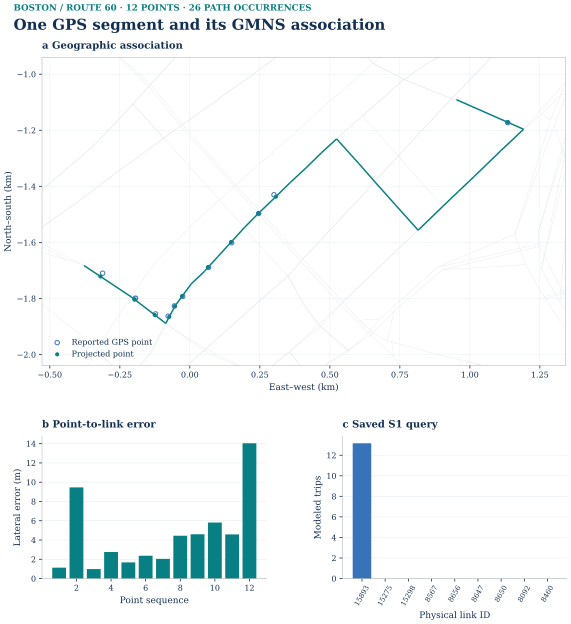</a></td></tr>
<tr><td width="33%" valign="top" align="left">
Planned GTFS services and modeled stop access for the saved MBTA feed/service date. Stops are deduplicated by stop ID. Fine straight connectors show the saved nearest-physical-node walking access candidates. Transit shape conflation represents planned service. The viewport follows the central GMNS analysis extent; feed stops outside that window are not drawn.

<strong>Transit and pedestrian inputs</strong>

MBTA service and pedestrian access support the bounded demand/feedback example.

<a href="https://scholarhaozheng.github.io/mobility-network-lab/volumes/boston.html#src-docs-cases-boston-document-demand-transit-and-observations">Evidence</a> · <a href="https://scholarhaozheng.github.io/mobility-network-lab/assets/atlas/figures/g-f134.svg">Full figure</a>

</td><td width="33%" valign="top" align="left">
Coverage of all 28 returned path segments: 581 path records and 431 distinct physical road links. No single-segment 12-point sample is overlaid here. Returned paths provide exploratory association evidence; the point-projection sample is shown separately.

<strong>GPS, trajectory and detector evidence</strong>

Exploratory map matching and service feedback.

<a href="https://scholarhaozheng.github.io/mobility-network-lab/volumes/boston.html#src-docs-datasets-boston-behavior-feedback-document">Evidence</a> · <a href="https://scholarhaozheng.github.io/mobility-network-lab/assets/atlas/figures/g-f135.svg">Full figure</a>

</td><td width="33%" valign="top" align="left">
One fixed segment mbtav:4624d3319dcfdec1:s01 on route 60: 12 reported points and 26 path occurrences. Panel a shows the geographic association above panels b–c. Hollow points denote source locations; solid points are derived projections. Panel b reports lateral projection distances by point; panel c queries saved S1 modeled link-volume values. Association identity is supported by saved sample rows; no independent asset manifest is invented.

<strong>GPS point-to-road projection</strong>

GPS map matching · 12 saved MBTA positions

<a href="https://scholarhaozheng.github.io/mobility-network-lab/volumes/boston.html#src-docs-datasets-boston-central-document-one-saved-transit-position-projection">Evidence</a> · <a href="https://scholarhaozheng.github.io/mobility-network-lab/assets/atlas/figures/c-boston-gps-sample.svg">Full figure</a>

</td></tr>
<tr><td width="33%" valign="top" align="left">
<a href="https://scholarhaozheng.github.io/mobility-network-lab/volumes/boston.html#stage-04-transit-and-walk--g-f134">Complete evidence</a> · <a href="https://scholarhaozheng.github.io/mobility-network-lab/assets/atlas/figures/g-f134.svg">Full figure</a>

Source records
<ul><li><a href="https://github.com/scholarhaozheng/mobility-network-lab/blob/6ce18b8bea5bf3b9b7caa6ee4c0ff4e701a34a8b/examples/boston/gmns_exchange_r1/data/link.csv" title="examples/boston/gmns_exchange_r1/data/link.csv">link.csv</a></li><li><a href="https://github.com/scholarhaozheng/mobility-network-lab/blob/6ce18b8bea5bf3b9b7caa6ee4c0ff4e701a34a8b/examples/boston/gmns_exchange_r1/data/node.csv" title="examples/boston/gmns_exchange_r1/data/node.csv">node.csv</a></li><li><a href="https://github.com/scholarhaozheng/mobility-network-lab/blob/6ce18b8bea5bf3b9b7caa6ee4c0ff4e701a34a8b/examples/boston/gmns_exchange_r1/data/transit_stop_route_relation.csv" title="examples/boston/gmns_exchange_r1/data/transit_stop_route_relation.csv">transit_stop_route_relation.csv</a></li><li><a href="https://github.com/scholarhaozheng/mobility-network-lab/blob/6ce18b8bea5bf3b9b7caa6ee4c0ff4e701a34a8b/examples/boston/gmns_exchange_r1/data/transit_shape_conflation.csv" title="examples/boston/gmns_exchange_r1/data/transit_shape_conflation.csv">transit_shape_conflation.csv</a></li></ul>

<a href="https://scholarhaozheng.github.io/mobility-network-lab/reproduce.html?figure=G-F134">Data &amp; preparation</a>
</td><td width="33%" valign="top" align="left">
<a href="https://scholarhaozheng.github.io/mobility-network-lab/volumes/boston.html#stage-05-gps-and-detectors--g-f135">Complete evidence</a> · <a href="https://scholarhaozheng.github.io/mobility-network-lab/assets/atlas/figures/g-f135.svg">Full figure</a>

Source records
<ul><li><a href="https://github.com/scholarhaozheng/mobility-network-lab/blob/6ce18b8bea5bf3b9b7caa6ee4c0ff4e701a34a8b/examples/boston/gmns_exchange_r1/data/gps_path_links.csv" title="examples/boston/gmns_exchange_r1/data/gps_path_links.csv">gps_path_links.csv</a></li><li><a href="https://github.com/scholarhaozheng/mobility-network-lab/blob/6ce18b8bea5bf3b9b7caa6ee4c0ff4e701a34a8b/examples/boston/gmns_exchange_r1/data/link.csv" title="examples/boston/gmns_exchange_r1/data/link.csv">link.csv</a></li></ul>

<a href="https://scholarhaozheng.github.io/mobility-network-lab/reproduce.html?figure=G-F135">Data &amp; preparation</a>
</td><td width="33%" valign="top" align="left">
<a href="https://scholarhaozheng.github.io/mobility-network-lab/volumes/boston.html#stage-05-gps-and-detectors--c-boston-gps-sample">Complete evidence</a> · <a href="https://scholarhaozheng.github.io/mobility-network-lab/assets/atlas/figures/c-boston-gps-sample.svg">Full figure</a>

Source records
<ul><li><a href="https://github.com/scholarhaozheng/mobility-network-lab/blob/6ce18b8bea5bf3b9b7caa6ee4c0ff4e701a34a8b/examples/boston/gmns_exchange_r1/figure_sample/gps_point_progress.csv" title="examples/boston/gmns_exchange_r1/figure_sample/gps_point_progress.csv">gps_point_progress.csv</a></li><li><a href="https://github.com/scholarhaozheng/mobility-network-lab/blob/6ce18b8bea5bf3b9b7caa6ee4c0ff4e701a34a8b/examples/boston/gmns_exchange_r1/figure_sample/gps_path_links.csv" title="examples/boston/gmns_exchange_r1/figure_sample/gps_path_links.csv">gps_path_links.csv</a></li><li><a href="https://github.com/scholarhaozheng/mobility-network-lab/blob/6ce18b8bea5bf3b9b7caa6ee4c0ff4e701a34a8b/examples/boston/gmns_exchange_r1/figure_sample/gps_segment_quality.csv" title="examples/boston/gmns_exchange_r1/figure_sample/gps_segment_quality.csv">gps_segment_quality.csv</a></li><li><a href="https://github.com/scholarhaozheng/mobility-network-lab/blob/6ce18b8bea5bf3b9b7caa6ee4c0ff4e701a34a8b/examples/boston/gmns_exchange_r1/data/link.csv" title="examples/boston/gmns_exchange_r1/data/link.csv">link.csv</a></li><li><a href="https://github.com/scholarhaozheng/mobility-network-lab/blob/6ce18b8bea5bf3b9b7caa6ee4c0ff4e701a34a8b/examples/boston/gmns_exchange_r1/data/assignment_result_by_scenario.csv" title="examples/boston/gmns_exchange_r1/data/assignment_result_by_scenario.csv">assignment_result_by_scenario.csv</a></li></ul>

<a href="https://scholarhaozheng.github.io/mobility-network-lab/reproduce.html?figure=C-BOSTON-GPS-SAMPLE">Data &amp; preparation</a>
</td></tr>
</table>

#### Trip generation

<table width="100%">
<tr><th width="50%" valign="top" align="left"><strong>Midday home–work demand margins</strong></th><th width="50%" valign="top" align="left"><strong>Workday trip generation</strong></th></tr>
<tr><td width="50%" valign="top" align="left"><a href="https://scholarhaozheng.github.io/mobility-network-lab/volumes/boston.html#stage-06-trip-generation--g-f136">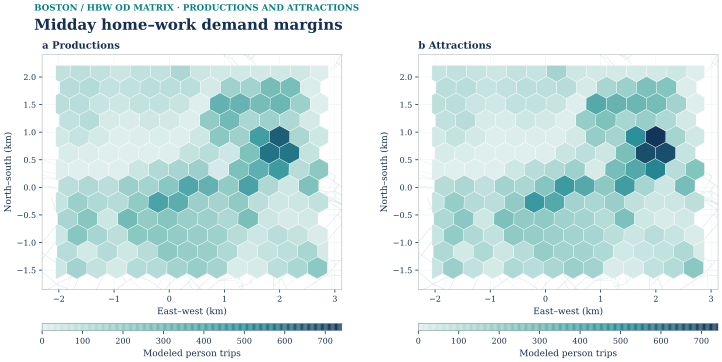</a></td><td width="50%" valign="top" align="left"><a href="https://scholarhaozheng.github.io/mobility-network-lab/volumes/boston.html#stage-06-trip-generation--g-f032">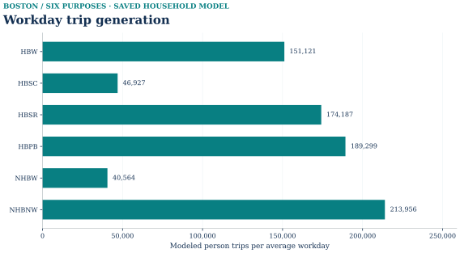</a></td></tr>
<tr><td width="50%" valign="top" align="left">
Productions and attractions are the row and column margins of the saved HBW midday OD matrix, with a shared color scale. They show the HBW midday subset of the six-purpose daily total. Geometry: clipped H3 resolution 9 model zones.

<strong>Trip generation — productions / attractions</strong>

Purpose-level productions and attractions in the bounded Boston example.

<a href="https://scholarhaozheng.github.io/mobility-network-lab/volumes/boston.html#src-docs-cases-boston-document-demand-transit-and-observations">Evidence</a> · <a href="https://scholarhaozheng.github.io/mobility-network-lab/assets/atlas/figures/g-f136.svg">Full figure</a>

</td><td width="50%" valign="top" align="left">
Saved modeled workday productions across six purpose codes, from ACS households and transferred regional rates. These modeled person trips cover six daily purposes and precede the HBW midday subset and vehicle assignment. CTPS TDM23.2.0 purpose definitions: HBW is home-based work; HBSC is home-based school; HBSR is home-based social/recreation; HBPB is home-based personal business; NHBW is non-home-based work; NHBNW is non-home-based non-work. Category definitions were verified against the official CTPS user guide; no new rates are inferred.

<strong>Generation by purpose</strong>

Trip generation · bounded example

<a href="https://scholarhaozheng.github.io/mobility-network-lab/volumes/boston.html">Evidence</a> · <a href="https://scholarhaozheng.github.io/mobility-network-lab/assets/atlas/figures/g-f032.svg">Full figure</a>

</td></tr>
<tr><td width="50%" valign="top" align="left">
<a href="https://scholarhaozheng.github.io/mobility-network-lab/volumes/boston.html#stage-06-trip-generation--g-f136">Complete evidence</a> · <a href="https://scholarhaozheng.github.io/mobility-network-lab/assets/atlas/figures/g-f136.svg">Full figure</a>

Source records
<ul><li><a href="https://github.com/scholarhaozheng/mobility-network-lab/blob/6ce18b8bea5bf3b9b7caa6ee4c0ff4e701a34a8b/docs/assets/boston/four_step_results_r1/data/hbw_midday_matrix.csv" title="docs/assets/boston/four_step_results_r1/data/hbw_midday_matrix.csv">hbw_midday_matrix.csv</a></li><li><a href="https://github.com/scholarhaozheng/mobility-network-lab/blob/6ce18b8bea5bf3b9b7caa6ee4c0ff4e701a34a8b/examples/boston/gmns_exchange_r1/data/zone.csv" title="examples/boston/gmns_exchange_r1/data/zone.csv">zone.csv</a></li><li><a href="https://github.com/scholarhaozheng/mobility-network-lab/blob/6ce18b8bea5bf3b9b7caa6ee4c0ff4e701a34a8b/docs/assets/boston/four_step_results_r1/data/zone_order.csv" title="docs/assets/boston/four_step_results_r1/data/zone_order.csv">zone_order.csv</a></li><li><a href="https://github.com/scholarhaozheng/mobility-network-lab/blob/6ce18b8bea5bf3b9b7caa6ee4c0ff4e701a34a8b/examples/boston/gmns_exchange_r1/data/link.csv" title="examples/boston/gmns_exchange_r1/data/link.csv">link.csv</a></li></ul>

<a href="https://scholarhaozheng.github.io/mobility-network-lab/reproduce.html?figure=G-F136">Data &amp; reproduction</a>
</td><td width="50%" valign="top" align="left">
<a href="https://scholarhaozheng.github.io/mobility-network-lab/volumes/boston.html#stage-06-trip-generation--g-f032">Complete evidence</a> · <a href="https://scholarhaozheng.github.io/mobility-network-lab/assets/atlas/figures/g-f032.svg">Full figure</a>

Source records
<ul><li><a href="https://github.com/scholarhaozheng/mobility-network-lab/blob/6ce18b8bea5bf3b9b7caa6ee4c0ff4e701a34a8b/docs/assets/boston/four_step_results_r1/data/generation_by_purpose.csv" title="docs/assets/boston/four_step_results_r1/data/generation_by_purpose.csv">generation_by_purpose.csv</a></li><li><a href="https://github.com/scholarhaozheng/mobility-network-lab/blob/6ce18b8bea5bf3b9b7caa6ee4c0ff4e701a34a8b/docs/assets/boston/four_step_results_r1/data/PROVENANCE.json" title="docs/assets/boston/four_step_results_r1/data/PROVENANCE.json">PROVENANCE.json</a></li></ul>

<a href="https://scholarhaozheng.github.io/mobility-network-lab/reproduce.html?figure=G-F032">Data &amp; reproduction</a>
</td></tr>
</table>

#### Trip distribution

<table width="100%">
<tr><th width="100%" valign="top" align="left"><strong>Home–work OD distribution</strong></th></tr>
<tr><td width="100%" valign="top" align="left"><a href="https://scholarhaozheng.github.io/mobility-network-lab/volumes/boston.html#stage-07-trip-distribution--g-f033">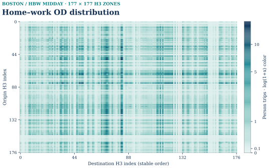</a></td></tr>
<tr><td width="100%" valign="top" align="left">
Full saved 177 × 177 home-based-work (HBW) midday matrix. Color shows log(1+x); gray marks cells without an exported record. Stable H3 order is supplied. These modeled person trips are neither GPS estimates nor the selected downstream assignment panel.

<strong>Trip distribution — zonal OD demand</strong>

Zonal OD construction for the bounded semantic scenario.

<a href="https://scholarhaozheng.github.io/mobility-network-lab/volumes/boston.html#src-docs-cases-boston-document-demand-transit-and-observations">Evidence</a> · <a href="https://scholarhaozheng.github.io/mobility-network-lab/assets/atlas/figures/g-f033.svg">Full figure</a>

<strong>HBW OD distribution</strong>

Trip distribution · bounded example

<a href="https://scholarhaozheng.github.io/mobility-network-lab/volumes/boston.html">Evidence</a> · <a href="https://scholarhaozheng.github.io/mobility-network-lab/assets/atlas/figures/g-f033.svg">Full figure</a>

</td></tr>
<tr><td width="100%" valign="top" align="left">
<a href="https://scholarhaozheng.github.io/mobility-network-lab/volumes/boston.html#stage-07-trip-distribution--g-f033">Complete evidence</a> · <a href="https://scholarhaozheng.github.io/mobility-network-lab/assets/atlas/figures/g-f033.svg">Full figure</a>

Source records
<ul><li><a href="https://github.com/scholarhaozheng/mobility-network-lab/blob/6ce18b8bea5bf3b9b7caa6ee4c0ff4e701a34a8b/docs/assets/boston/four_step_results_r1/data/hbw_midday_matrix.csv" title="docs/assets/boston/four_step_results_r1/data/hbw_midday_matrix.csv">hbw_midday_matrix.csv</a></li><li><a href="https://github.com/scholarhaozheng/mobility-network-lab/blob/6ce18b8bea5bf3b9b7caa6ee4c0ff4e701a34a8b/docs/assets/boston/four_step_results_r1/data/zone_order.csv" title="docs/assets/boston/four_step_results_r1/data/zone_order.csv">zone_order.csv</a></li></ul>

<a href="https://scholarhaozheng.github.io/mobility-network-lab/reproduce.html?figure=G-F033">Data &amp; reproduction</a>
</td></tr>
</table>

#### Mode choice

<table width="100%">
<tr><th width="100%" valign="top" align="left"><strong>Service response in mode choice</strong></th></tr>
<tr><td width="100%" valign="top" align="left"><a href="https://scholarhaozheng.github.io/mobility-network-lab/volumes/boston.html#stage-08-mode-choice--c-boston-mode-response">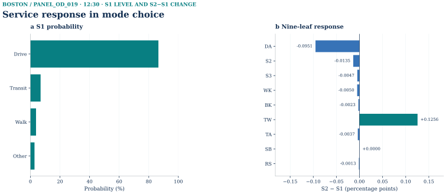</a></td></tr>
<tr><td width="100%" valign="top" align="left">
One fixed panel OD at 12:30. Left: S1 nine leaves aggregated into four probability classes. Right: all nine S2−S1 probability changes in percentage points. DA: drive alone; S2/S3: two/three-plus person auto; WK: walk; BK: bike; TW/TA: walk/auto-access transit; SB: school bus; RS: occupied ride service. The scenario S2 label is distinct from the S2 auto leaf. Regional base shares and nested pivot response come from the mode-choice model.

<strong>Mode choice — mode-specific demand</strong>

S1/S2 service response and conditional absolute choice remain separate.

<a href="https://scholarhaozheng.github.io/mobility-network-lab/volumes/boston.html#src-docs-cases-boston-document-demand-transit-and-observations">Evidence</a> · <a href="https://scholarhaozheng.github.io/mobility-network-lab/assets/atlas/figures/c-boston-mode-response.svg">Full figure</a>

<strong>Service-response mode choice</strong>

Mode choice · S1/S2 sensitivity

<a href="https://scholarhaozheng.github.io/mobility-network-lab/volumes/boston.html">Evidence</a> · <a href="https://scholarhaozheng.github.io/mobility-network-lab/assets/atlas/figures/c-boston-mode-response.svg">Full figure</a>

</td></tr>
<tr><td width="100%" valign="top" align="left">
<a href="https://scholarhaozheng.github.io/mobility-network-lab/volumes/boston.html#stage-08-mode-choice--c-boston-mode-response">Complete evidence</a> · <a href="https://scholarhaozheng.github.io/mobility-network-lab/assets/atlas/figures/c-boston-mode-response.svg">Full figure</a>

Source records
<ul><li><a href="https://github.com/scholarhaozheng/mobility-network-lab/blob/6ce18b8bea5bf3b9b7caa6ee4c0ff4e701a34a8b/docs/assets/boston/four_step_results_r1/data/selected_mode_response.csv" title="docs/assets/boston/four_step_results_r1/data/selected_mode_response.csv">selected_mode_response.csv</a></li><li><a href="https://github.com/scholarhaozheng/mobility-network-lab/blob/6ce18b8bea5bf3b9b7caa6ee4c0ff4e701a34a8b/docs/assets/boston/four_step_results_r1/data/PROVENANCE.json" title="docs/assets/boston/four_step_results_r1/data/PROVENANCE.json">PROVENANCE.json</a></li></ul>

<a href="https://scholarhaozheng.github.io/mobility-network-lab/reproduce.html?figure=C-BOSTON-MODE-RESPONSE">Data &amp; reproduction</a>
</td></tr>
</table>

#### Static assignment methods

##### Static assignment inputs — selected-demand scales

Source-zone demand and its physical endpoints for the 500-OD selection and all 30,790 source ODs. The 500 selection supports the same-instance FW/Algorithm B comparison; the all-demand scale supports expanded FW. The separate 26-OD ABS_PLANNED control uses a different demand set.

<table width="100%">
<tr><th width="50%" valign="top" align="left"><strong>Static assignment demand margins</strong></th><th width="50%" valign="top" align="left"><strong>Physical demand endpoints</strong></th></tr>
<tr><td width="50%" valign="top" align="left"></td><td width="50%" valign="top" align="left"><a href="https://scholarhaozheng.github.io/mobility-network-lab/volumes/boston.html#stage-10-frank-wolfe--c-boston-endpoints">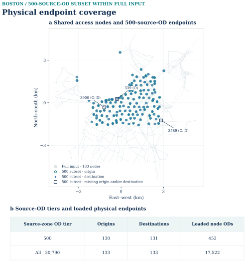</a></td></tr>
<tr><td width="50%" valign="top" align="left">
Fixed 500-selected versus all 30,790 source-zone OD demand margins. Totals are 2,643.766735 and 22,633.469729 person trips respectively. The same 176 source-zone endpoints carry different masses; these are selected demand margins. Each map explicitly labels its quantity and scale.
</td><td width="50%" valign="top" align="left">
The selected 500-source-zone-OD and all-source-zone-OD cases share one fixed physical-access framework, shown once. All-input endpoints are 133 physical origins and 133 destinations. The 500 subset has 130 origins and 131 destinations, and both sets are verified subsets of the all-input sets at identical coordinates. Outlined squares identify nodes not covered by the 500 subset: 339 lacks origin coverage (O), while 3589 and 3900 lack both origin and destination coverage (O, D). The count table preserves the distinct source-zone tiers (500 and 30,790 pairs) and the loaded node-OD counts (453 and 17,522). Small endpoint symbols leave the same 5,091-link physical road context visible. The map records input endpoint coverage.
</td></tr>
<tr><td width="50%" valign="top" align="left">
<a href="https://scholarhaozheng.github.io/mobility-network-lab/volumes/boston.html#stage-10-frank-wolfe--c-boston-source-margins">Complete evidence</a> · <a href="https://scholarhaozheng.github.io/mobility-network-lab/assets/atlas/figures/c-boston-source-margins.svg">Full figure</a>

Source records
<ul><li><a href="https://github.com/scholarhaozheng/mobility-network-lab/blob/6ce18b8bea5bf3b9b7caa6ee4c0ff4e701a34a8b/docs/assets/boston/scalable_tool_r1/source_zone_coverage_500.csv" title="docs/assets/boston/scalable_tool_r1/source_zone_coverage_500.csv">source_zone_coverage_500.csv</a></li><li><a href="https://github.com/scholarhaozheng/mobility-network-lab/blob/6ce18b8bea5bf3b9b7caa6ee4c0ff4e701a34a8b/docs/assets/boston/scalable_tool_r1/source_zone_coverage_all.csv" title="docs/assets/boston/scalable_tool_r1/source_zone_coverage_all.csv">source_zone_coverage_all.csv</a></li><li><a href="https://github.com/scholarhaozheng/mobility-network-lab/blob/6ce18b8bea5bf3b9b7caa6ee4c0ff4e701a34a8b/examples/boston/gmns_exchange_r1/data/zone.csv" title="examples/boston/gmns_exchange_r1/data/zone.csv">zone.csv</a></li><li><a href="https://github.com/scholarhaozheng/mobility-network-lab/blob/6ce18b8bea5bf3b9b7caa6ee4c0ff4e701a34a8b/examples/boston/gmns_exchange_r1/data/link.csv" title="examples/boston/gmns_exchange_r1/data/link.csv">link.csv</a></li></ul>

<a href="https://scholarhaozheng.github.io/mobility-network-lab/reproduce.html?figure=C-BOSTON-SOURCE-MARGINS">Data &amp; preparation</a>
</td><td width="50%" valign="top" align="left">
<a href="https://scholarhaozheng.github.io/mobility-network-lab/volumes/boston.html#stage-10-frank-wolfe--c-boston-endpoints">Complete evidence</a> · <a href="https://scholarhaozheng.github.io/mobility-network-lab/assets/atlas/card-layout/c-boston-endpoints.svg">Full figure</a>

Source records
<ul><li><a href="https://github.com/scholarhaozheng/mobility-network-lab/blob/6ce18b8bea5bf3b9b7caa6ee4c0ff4e701a34a8b/docs/assets/boston/scalable_tool_r1/endpoint_coverage_500.csv" title="docs/assets/boston/scalable_tool_r1/endpoint_coverage_500.csv">endpoint_coverage_500.csv</a></li><li><a href="https://github.com/scholarhaozheng/mobility-network-lab/blob/6ce18b8bea5bf3b9b7caa6ee4c0ff4e701a34a8b/docs/assets/boston/scalable_tool_r1/endpoint_coverage_all.csv" title="docs/assets/boston/scalable_tool_r1/endpoint_coverage_all.csv">endpoint_coverage_all.csv</a></li><li><a href="https://github.com/scholarhaozheng/mobility-network-lab/blob/6ce18b8bea5bf3b9b7caa6ee4c0ff4e701a34a8b/examples/boston/gmns_exchange_r1/data/link.csv" title="examples/boston/gmns_exchange_r1/data/link.csv">link.csv</a></li><li><a href="https://github.com/scholarhaozheng/mobility-network-lab/blob/6ce18b8bea5bf3b9b7caa6ee4c0ff4e701a34a8b/examples/boston/scalable_tool_r1/SCALE_RESULTS_PUBLIC.csv" title="examples/boston/scalable_tool_r1/SCALE_RESULTS_PUBLIC.csv">SCALE_RESULTS_PUBLIC.csv</a></li></ul>

<a href="https://scholarhaozheng.github.io/mobility-network-lab/reproduce.html?figure=C-BOSTON-ENDPOINTS">Data &amp; preparation</a>
</td></tr>
</table>

##### Static assignment results — one card per method

FW shows three demand scales; official tap-b Algorithm B shows Boston B1 (453 loaded node ODs). Finite-path SLSQP uses the separate ABS_PLANNED control (26 node ODs, 130 paths). Compare results within the named instance.

<table width="100%">
<tr><th width="33%" valign="top" align="left"><strong>Frank–Wolfe across selected-demand scales</strong></th><th width="33%" valign="top" align="left"><strong>Algorithm B physical-link flow</strong></th><th width="33%" valign="top" align="left"><strong>Finite-path reference flow and feasibility</strong></th></tr>
<tr><td width="33%" valign="top" align="left"></td><td width="33%" valign="top" align="left"><a href="https://scholarhaozheng.github.io/mobility-network-lab/volumes/boston.html#stage-11-algorithm-b--g-f141">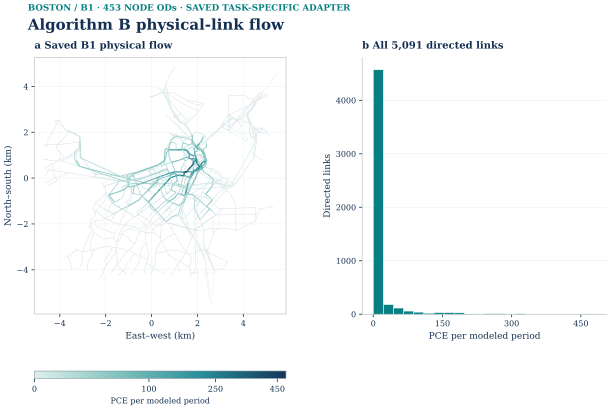</a></td><td width="33%" valign="top" align="left"><a href="https://scholarhaozheng.github.io/mobility-network-lab/volumes/boston.html#stage-12-finite-path-reference--c-boston-finite-static">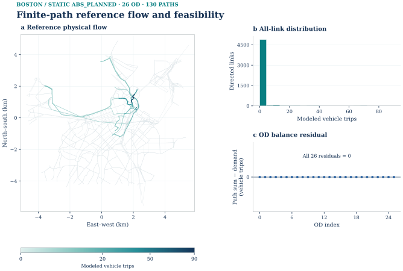</a></td></tr>
<tr><td width="33%" valign="top" align="left">
Three independent selected-demand scales: 500, 2,000 and all 30,790 source-zone OD pairs become 453, 1,684 and 17,522 loaded node ODs. Source pair count refers to directed OD pairs. The three maps share one physical-flow scale in passenger-car equivalents (PCE) per modeled period. Panel d shows separate distributions of all 5,091 directed-link values in each run, including zeros, with shared bins and a logarithmic count axis. Each run retains its own vector. These selected-demand runs are separate from the 26-OD ABS_PLANNED vehicle-trip instance.

<strong>Frank–Wolfe</strong> 

Expanded Boston FW, up to 17,522 loaded node ODs; separate from 26-OD controls.

<a href="https://scholarhaozheng.github.io/mobility-network-lab/volumes/boston.html#src-docs-cases-boston-assignment-document-primary-scale-result-versus-controlled-method-comparison">Evidence</a> · <a href="https://scholarhaozheng.github.io/mobility-network-lab/assets/atlas/card-layout/c-boston-fw-scales.svg">Full figure</a>

</td><td width="33%" valign="top" align="left">
Boston B1 Algorithm B from the saved task-specific lossless adapter: 453 node ODs and 1,936.238475 PCE in the modeled period. The map and distribution use the same complete 5,091-link saved volume vector, including zero-flow links; background roads remain visible. This preserved method result uses a separate instance from the 26-OD ABS_PLANNED vehicle-trip case; stock-official adapter parity remains unverified.

<strong>Official tap-b Algorithm B</strong> 

B0/B1 numerical transfer via task-local lossless TAPLab-compatible adapter.

<a href="https://scholarhaozheng.github.io/mobility-network-lab/volumes/boston.html#src-docs-cases-boston-algorithm-b-document">Evidence</a> · <a href="https://scholarhaozheng.github.io/mobility-network-lab/assets/atlas/card-layout/g-f141.svg">Full figure</a>

</td><td width="33%" valign="top" align="left">
Static finite-path reference on the ABS_PLANNED 26-OD, 130-path instance. The physical-flow map and distribution use all 5,091 link values, including zeros. All 26 per-OD equality residuals are retained and recomputed as saved path-flow sum minus saved demand; no optimizer is rerun. This static, finite-path result uses modeled vehicle-trip units distinct from B1/scalable-tool PCE units. Full-path-space optimality remains unverified.

<strong>Finite-path reference</strong> 

26 OD, 130-path uncompressed SLSQP reference on ABS_PLANNED.

<a href="https://scholarhaozheng.github.io/mobility-network-lab/volumes/boston.html#src-docs-cases-boston-assignment-document-same-instance-saved-result">Evidence</a> · <a href="https://scholarhaozheng.github.io/mobility-network-lab/assets/atlas/card-layout/c-boston-finite-static.svg">Full figure</a>

</td></tr>
<tr><td width="33%" valign="top" align="left">
<a href="https://scholarhaozheng.github.io/mobility-network-lab/volumes/boston.html#stage-10-frank-wolfe--c-boston-fw-scales">Complete evidence</a> · <a href="https://scholarhaozheng.github.io/mobility-network-lab/assets/atlas/card-layout/c-boston-fw-scales.svg">Full figure</a>

Source records
<ul><li><a href="https://github.com/scholarhaozheng/mobility-network-lab/blob/6ce18b8bea5bf3b9b7caa6ee4c0ff4e701a34a8b/docs/assets/boston/scalable_tool_r1/plot_link_table_500.csv" title="docs/assets/boston/scalable_tool_r1/plot_link_table_500.csv">plot_link_table_500.csv</a></li><li><a href="https://github.com/scholarhaozheng/mobility-network-lab/blob/6ce18b8bea5bf3b9b7caa6ee4c0ff4e701a34a8b/docs/assets/boston/scalable_tool_r1/plot_link_table_2000.csv" title="docs/assets/boston/scalable_tool_r1/plot_link_table_2000.csv">plot_link_table_2000.csv</a></li><li><a href="https://github.com/scholarhaozheng/mobility-network-lab/blob/6ce18b8bea5bf3b9b7caa6ee4c0ff4e701a34a8b/docs/assets/boston/scalable_tool_r1/plot_link_table_all.csv" title="docs/assets/boston/scalable_tool_r1/plot_link_table_all.csv">plot_link_table_all.csv</a></li></ul>

<a href="https://scholarhaozheng.github.io/mobility-network-lab/reproduce.html?figure=C-BOSTON-FW-SCALES">Data &amp; reproduction</a>
</td><td width="33%" valign="top" align="left">
<a href="https://scholarhaozheng.github.io/mobility-network-lab/volumes/boston.html#stage-11-algorithm-b--g-f141">Complete evidence</a> · <a href="https://scholarhaozheng.github.io/mobility-network-lab/assets/atlas/card-layout/g-f141.svg">Full figure</a>

Source records
<ul><li><a href="https://github.com/scholarhaozheng/mobility-network-lab/blob/6ce18b8bea5bf3b9b7caa6ee4c0ff4e701a34a8b/algorithms/origin_based_algorithm_b/accepted_results/boston_b1_physical_link_flow.csv" title="algorithms/origin_based_algorithm_b/accepted_results/boston_b1_physical_link_flow.csv">boston_b1_physical_link_flow.csv</a></li><li><a href="https://github.com/scholarhaozheng/mobility-network-lab/blob/6ce18b8bea5bf3b9b7caa6ee4c0ff4e701a34a8b/docs/assets/boston/scalable_tool_r1/plot_link_table_500.csv" title="docs/assets/boston/scalable_tool_r1/plot_link_table_500.csv">plot_link_table_500.csv</a></li><li><a href="https://github.com/scholarhaozheng/mobility-network-lab/blob/6ce18b8bea5bf3b9b7caa6ee4c0ff4e701a34a8b/algorithms/origin_based_algorithm_b/accepted_results/boston_b1_evaluation.json" title="algorithms/origin_based_algorithm_b/accepted_results/boston_b1_evaluation.json">boston_b1_evaluation.json</a></li></ul>

<a href="https://scholarhaozheng.github.io/mobility-network-lab/reproduce.html?figure=G-F141">Data &amp; reproduction</a>
</td><td width="33%" valign="top" align="left">
<a href="https://scholarhaozheng.github.io/mobility-network-lab/volumes/boston.html#stage-12-finite-path-reference--c-boston-finite-static">Complete evidence</a> · <a href="https://scholarhaozheng.github.io/mobility-network-lab/assets/atlas/card-layout/c-boston-finite-static.svg">Full figure</a>

Source records
<ul><li><a href="https://github.com/scholarhaozheng/mobility-network-lab/blob/6ce18b8bea5bf3b9b7caa6ee4c0ff4e701a34a8b/examples/boston/assignment_methods_r1/reference/link_flow.csv" title="examples/boston/assignment_methods_r1/reference/link_flow.csv">link_flow.csv</a></li><li><a href="https://github.com/scholarhaozheng/mobility-network-lab/blob/6ce18b8bea5bf3b9b7caa6ee4c0ff4e701a34a8b/examples/boston/assignment_methods_r1/reference/full_path_flow.csv" title="examples/boston/assignment_methods_r1/reference/full_path_flow.csv">full_path_flow.csv</a></li><li><a href="https://github.com/scholarhaozheng/mobility-network-lab/blob/6ce18b8bea5bf3b9b7caa6ee4c0ff4e701a34a8b/examples/boston/assignment_methods_r1/inputs_snapshot/path_pool/od_index.csv" title="examples/boston/assignment_methods_r1/inputs_snapshot/path_pool/od_index.csv">od_index.csv</a></li><li><a href="https://github.com/scholarhaozheng/mobility-network-lab/blob/6ce18b8bea5bf3b9b7caa6ee4c0ff4e701a34a8b/examples/boston/assignment_methods_r1/inputs_snapshot/link.csv" title="examples/boston/assignment_methods_r1/inputs_snapshot/link.csv">link.csv</a></li><li><a href="https://github.com/scholarhaozheng/mobility-network-lab/blob/6ce18b8bea5bf3b9b7caa6ee4c0ff4e701a34a8b/docs/assets/boston/assignment_methods_r1/boston_abs_planned_assignment_links.csv" title="docs/assets/boston/assignment_methods_r1/boston_abs_planned_assignment_links.csv">boston_abs_planned_assignment_links.csv</a></li></ul>

<a href="https://scholarhaozheng.github.io/mobility-network-lab/reproduce.html?figure=C-BOSTON-FINITE-STATIC">Data &amp; reproduction</a>
</td></tr>
</table>

[Native L3 reconstruction diagnostics](https://scholarhaozheng.github.io/mobility-network-lab/volumes/boston.html#stage-13-native-l3--c-boston-abs-l3) are documented in the Boston long document, including the same-instance reference and reconstruction error.

Additional static-method evidence in the Boston chapter

<a href="https://scholarhaozheng.github.io/mobility-network-lab/volumes/boston.html#stage-11-algorithm-b--g-f046">Algorithm B and same-problem FW</a>

<a href="https://scholarhaozheng.github.io/mobility-network-lab/volumes/boston.html#stage-11-algorithm-b--g-f048">Selected-origin flow reconstructed from paths</a>

<a href="https://scholarhaozheng.github.io/mobility-network-lab/volumes/boston.html#stage-13-native-l3--g-f145">Native L3 residual against finite-path reference</a>

Static BPR/Beckmann assignment and the fixed-cost, hard-capacity time-expanded optimization below are independent mathematical branches. The next table shows the latter's graph representation, which also supports its arc-flow LP and applicable decomposition methods; example paths and generated columns appear as recorded outputs.

#### Time-expanded network and path examples

<table width="100%">
<tr><th width="50%" valign="top" align="left"><strong>Time-expanded network in layers</strong></th><th width="50%" valign="top" align="left"><strong>Local construction details</strong></th></tr>
<tr><td width="50%" valign="top" align="left"><a href="https://scholarhaozheng.github.io/mobility-network-lab/volumes/boston.html#stage-14-layered-construction--r07-boston-layered-construction">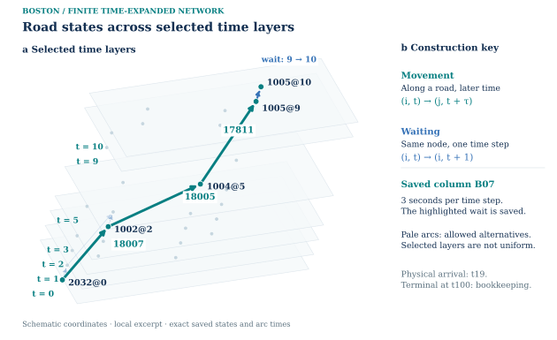</a></td><td width="50%" valign="top" align="left"><a href="https://scholarhaozheng.github.io/mobility-network-lab/volumes/boston.html#stage-14-space-time-network-and-columns--g-f072">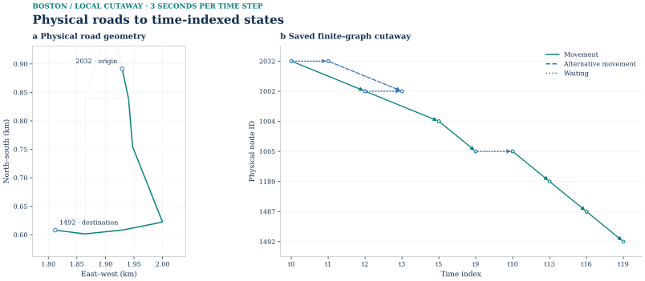</a></td></tr>
<tr><td width="50%" valign="top" align="left">
Selected layers show the saved B07 path through movement arcs and one waiting arc. Each step is 3 seconds. The full path arrives at t19; t100 is a terminal bookkeeping state outside this excerpt.

<strong>Selected time layers</strong> 

B07 excerpt across selected time layers.

<a href="https://scholarhaozheng.github.io/mobility-network-lab/volumes/boston.html#src-docs-cases-boston-space-time-document-from-the-physical-network-to-the-finite-time-expanded-graph">Evidence</a> · <a href="https://scholarhaozheng.github.io/mobility-network-lab/assets/atlas/construction/r07-boston-layered-construction.svg">Full figure</a>

</td><td width="50%" valign="top" align="left">
Source-matched local construction cutaway of the bounded Boston time-expanded directed acyclic graph (DAG): 90 physical nodes, 125 physical links, 10 origin–destination (OD) demands, 9,110 states and 22,217 arcs. Panel a uses real physical-link geometry and labels physical origin 2032 and destination 1492; panel b uses schematic node-row positions and equally spaced displayed layer columns, although the saved time indices are nonuniform. One time step is 3 seconds. A physical node i becomes state (i,t); a directed road link becomes a movement arc (i,t) → (j,t + travel steps); waiting joins (i,t) to (i,t+1). All displayed dynamic arcs retain their saved endpoint states and time indices, including the actual B07 wait at node 1005 from t9 to t10 and the local alternatives at nodes 2032 and 1002. Source connector t0 and sink connector t19 → t100 are retained in the linked edge table; physical arrival is t19; t100 marks the terminal bookkeeping state.

<strong>Physical network to finite graph</strong> 

Bounded 10-OD graph cutaway.

<a href="https://scholarhaozheng.github.io/mobility-network-lab/volumes/boston.html#src-docs-cases-boston-space-time-document-from-the-physical-network-to-the-finite-time-expanded-graph">Evidence</a> · <a href="https://scholarhaozheng.github.io/mobility-network-lab/assets/atlas/figures/g-f072.svg">Full figure</a>

</td></tr>
<tr><td width="50%" valign="top" align="left">
<a href="https://scholarhaozheng.github.io/mobility-network-lab/volumes/boston.html#stage-14-layered-construction--r07-boston-layered-construction">Complete evidence</a> · <a href="https://scholarhaozheng.github.io/mobility-network-lab/assets/atlas/construction/r07-boston-layered-construction.svg">Full figure</a>

Source records
<ul><li><a href="https://github.com/scholarhaozheng/mobility-network-lab/blob/6ce18b8bea5bf3b9b7caa6ee4c0ff4e701a34a8b/docs/assets/cg_layered_companions_r1/DISPLAY_INPUTS.json" title="docs/assets/cg_layered_companions_r1/DISPLAY_INPUTS.json">DISPLAY_INPUTS.json</a></li><li><a href="https://github.com/scholarhaozheng/mobility-network-lab/blob/6ce18b8bea5bf3b9b7caa6ee4c0ff4e701a34a8b/docs/assets/cg_layered_companions_r1/boston_display_edges.csv" title="docs/assets/cg_layered_companions_r1/boston_display_edges.csv">boston_display_edges.csv</a></li><li><a href="https://github.com/scholarhaozheng/mobility-network-lab/blob/6ce18b8bea5bf3b9b7caa6ee4c0ff4e701a34a8b/docs/assets/cg_layered_companions_r1/boston_display_states.csv" title="docs/assets/cg_layered_companions_r1/boston_display_states.csv">boston_display_states.csv</a></li><li><a href="https://github.com/scholarhaozheng/mobility-network-lab/blob/6ce18b8bea5bf3b9b7caa6ee4c0ff4e701a34a8b/docs/assets/cg_layered_companions_r1/boston_layered_space_time_construction.source.json" title="docs/assets/cg_layered_companions_r1/boston_layered_space_time_construction.source.json">boston_layered_space_time_construction.source.json</a></li></ul>
</td><td width="50%" valign="top" align="left">
<a href="https://scholarhaozheng.github.io/mobility-network-lab/volumes/boston.html#stage-14-space-time-network-and-columns--g-f072">Complete evidence</a> · <a href="https://scholarhaozheng.github.io/mobility-network-lab/assets/atlas/figures/g-f072.svg">Full figure</a>

Source records
<ul><li><a href="https://github.com/scholarhaozheng/mobility-network-lab/blob/6ce18b8bea5bf3b9b7caa6ee4c0ff4e701a34a8b/docs/assets/three_city_r2/data/boston_construction_edges.csv" title="docs/assets/three_city_r2/data/boston_construction_edges.csv">boston_construction_edges.csv</a></li><li><a href="https://github.com/scholarhaozheng/mobility-network-lab/blob/6ce18b8bea5bf3b9b7caa6ee4c0ff4e701a34a8b/docs/assets/boston/space_time_cg_r4/data/physical_link_flow_geometry.csv" title="docs/assets/boston/space_time_cg_r4/data/physical_link_flow_geometry.csv">physical_link_flow_geometry.csv</a></li><li><a href="https://github.com/scholarhaozheng/mobility-network-lab/blob/6ce18b8bea5bf3b9b7caa6ee4c0ff4e701a34a8b/docs/assets/cg_layered_companions_r1/boston_display_edges.csv" title="docs/assets/cg_layered_companions_r1/boston_display_edges.csv">boston_display_edges.csv</a></li><li><a href="https://github.com/scholarhaozheng/mobility-network-lab/blob/6ce18b8bea5bf3b9b7caa6ee4c0ff4e701a34a8b/docs/assets/boston/space_time_cg_r4/data/construction_path.json" title="docs/assets/boston/space_time_cg_r4/data/construction_path.json">construction_path.json</a></li><li><a href="https://github.com/scholarhaozheng/mobility-network-lab/blob/6ce18b8bea5bf3b9b7caa6ee4c0ff4e701a34a8b/docs/assets/boston/space_time_cg_r4/data/phase_i_round1_od_change.csv" title="docs/assets/boston/space_time_cg_r4/data/phase_i_round1_od_change.csv">phase_i_round1_od_change.csv</a></li><li><a href="https://github.com/scholarhaozheng/mobility-network-lab/blob/6ce18b8bea5bf3b9b7caa6ee4c0ff4e701a34a8b/docs/assets/boston/space_time_cg_r4/data/phase_i_round1_capacity_exchange.csv" title="docs/assets/boston/space_time_cg_r4/data/phase_i_round1_capacity_exchange.csv">phase_i_round1_capacity_exchange.csv</a></li></ul>

<a href="https://scholarhaozheng.github.io/mobility-network-lab/reproduce.html?figure=G-F072">Data &amp; preparation</a>
</td></tr>
</table>

<strong>Local path / cutaway</strong> 

Saved B07 time-indexed column; <a href="https://scholarhaozheng.github.io/mobility-network-lab/assets/atlas/figures/g-f075.svg">another retained column view</a>.

<a href="https://scholarhaozheng.github.io/mobility-network-lab/volumes/boston.html#src-docs-cases-boston-space-time-document-a-generated-column-as-a-time-indexed-path">Evidence</a> · <a href="https://scholarhaozheng.github.io/mobility-network-lab/assets/atlas/figures/g-f075.svg">Full figure</a>

#### Optimization on the time-expanded network

<strong>Case-sequence overview</strong>

CG · 10-OD

<a href="https://scholarhaozheng.github.io/mobility-network-lab/volumes/boston.html#src-docs-cases-boston-space-time-document-case-role-scope-and-model-statistics">Evidence</a> · <a href="https://scholarhaozheng.github.io/mobility-network-lab/volumes/boston.html#coverage-row-16">Evidence table</a>

##### Two-phase column generation

Boston bounded pilot · 10 ODs

Three views: Phase I feasibility restoration, Phase II objective against the same-graph arc-flow LP, and independent pricing closure.

<table width="100%">
<tr><th width="33%" valign="top" align="left"><strong>Phase I: artificial-flow clearance</strong></th><th width="33%" valign="top" align="left"><strong>Phase II objective</strong></th><th width="33%" valign="top" align="left"><strong>Continuation and independent pricing closure</strong></th></tr>
<tr><td width="33%" valign="top" align="left"><a href="https://scholarhaozheng.github.io/mobility-network-lab/volumes/boston.html#stage-16-two-phase-column-generation--c-boston-cg-phase1">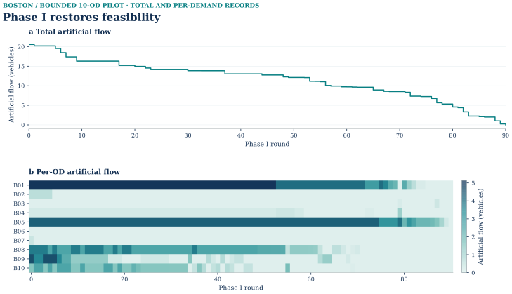</a></td><td width="33%" valign="top" align="left"><a href="https://scholarhaozheng.github.io/mobility-network-lab/volumes/boston.html#stage-16-two-phase-column-generation--g-f079">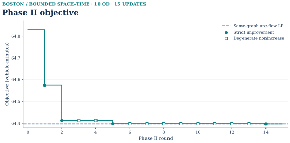</a></td><td width="33%" valign="top" align="left"><a href="https://scholarhaozheng.github.io/mobility-network-lab/volumes/boston.html#stage-16-two-phase-column-generation--c-boston-cg-closure">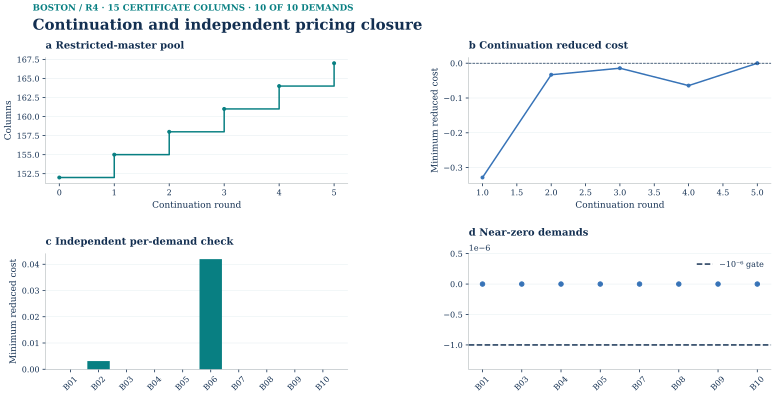</a></td></tr>
<tr><td width="33%" valign="top" align="left">
Accepted bounded Boston CG pilot with ten ODs. The total declines from 20.5536128974 to zero at round 90. Each heatmap cell is the saved per-demand artificial flow; individual ODs can temporarily rise because shared-capacity feasibility restoration couples them. Curves are unsmoothed step traces.

<strong>Two-phase column generation</strong> 

Phase I/II and independent 10/10 pricing closure.

<a href="https://scholarhaozheng.github.io/mobility-network-lab/volumes/boston.html#src-docs-cases-boston-space-time-document-phase-i-restores-feasibility">Evidence</a> · <a href="https://scholarhaozheng.github.io/mobility-network-lab/assets/atlas/figures/c-boston-cg-phase1.svg">Full figure</a>

<strong>Phase I artificial-flow clearance</strong> 

CG Phase I · 10-OD

<a href="https://scholarhaozheng.github.io/mobility-network-lab/volumes/boston.html#src-docs-cases-boston-space-time-document-phase-i-restores-feasibility">Evidence</a> · <a href="https://scholarhaozheng.github.io/mobility-network-lab/assets/atlas/figures/c-boston-cg-phase1.svg">Full figure</a>

</td><td width="33%" valign="top" align="left">
Sixteen saved states cover rounds 0–15, meaning 15 updates. The objective falls from 64.8296764834 to 64.3968615115 vehicle-minutes and matches the arc-flow LP on the same finite graph. Filled circles denote strict improvement and open squares degenerate nonincrease. The separate R4 continuation establishes pricing closure beyond objective agreement.

<strong>Arc-flow LP reference</strong> 

Own-graph LP reference for the bounded ten-OD fixed-cost instance.

<a href="https://scholarhaozheng.github.io/mobility-network-lab/volumes/boston.html#src-docs-cases-boston-space-time-document-reference-objective-agreement">Evidence</a> · <a href="https://scholarhaozheng.github.io/mobility-network-lab/assets/atlas/figures/g-f079.svg">Full figure</a>

<strong>Phase II objective</strong> 

CG Phase II · 10-OD

<a href="https://scholarhaozheng.github.io/mobility-network-lab/volumes/boston.html#src-docs-cases-boston-space-time-document-phase-ii-improves-the-real-path-objective">Evidence</a> · <a href="https://scholarhaozheng.github.io/mobility-network-lab/assets/atlas/figures/g-f079.svg">Full figure</a>

</td><td width="33%" valign="top" align="left">
Five continuation rounds expand the pool from 152 to 167 columns without changing the final objective. All 15 added certificate columns have zero final flow. Independent full-DAG pricing passes all ten demands at tolerance 10⁻⁶. B02/B06 have positive margins; near-machine-zero B09 has no improving reduced cost. Existing-path KKT checks and independent ungenerated-path pricing are distinct.

<strong>Independent pricing closure</strong> 

CG pricing · 10/10

<a href="https://scholarhaozheng.github.io/mobility-network-lab/volumes/boston.html#src-docs-cases-boston-space-time-document-independent-pricing-closure">Evidence</a> · <a href="https://scholarhaozheng.github.io/mobility-network-lab/assets/atlas/figures/c-boston-cg-closure.svg">Full figure</a>

</td></tr>
<tr><td width="33%" valign="top" align="left">
<a href="https://scholarhaozheng.github.io/mobility-network-lab/volumes/boston.html#stage-16-two-phase-column-generation--c-boston-cg-phase1">Complete evidence</a> · <a href="https://scholarhaozheng.github.io/mobility-network-lab/assets/atlas/figures/c-boston-cg-phase1.svg">Full figure</a>

Source records
<ul><li><a href="https://github.com/scholarhaozheng/mobility-network-lab/blob/6ce18b8bea5bf3b9b7caa6ee4c0ff4e701a34a8b/docs/assets/boston/space_time_cg_r4/data/phase_i_total.csv" title="docs/assets/boston/space_time_cg_r4/data/phase_i_total.csv">phase_i_total.csv</a></li><li><a href="https://github.com/scholarhaozheng/mobility-network-lab/blob/6ce18b8bea5bf3b9b7caa6ee4c0ff4e701a34a8b/docs/assets/boston/space_time_cg_r4/data/phase_i_by_demand.csv" title="docs/assets/boston/space_time_cg_r4/data/phase_i_by_demand.csv">phase_i_by_demand.csv</a></li></ul>

<a href="https://scholarhaozheng.github.io/mobility-network-lab/reproduce.html?figure=C-BOSTON-CG-PHASE1">Data &amp; reproduction</a>
</td><td width="33%" valign="top" align="left">
<a href="https://scholarhaozheng.github.io/mobility-network-lab/volumes/boston.html#stage-16-two-phase-column-generation--g-f079">Complete evidence</a> · <a href="https://scholarhaozheng.github.io/mobility-network-lab/assets/atlas/figures/g-f079.svg">Full figure</a>

Source records
<ul><li><a href="https://github.com/scholarhaozheng/mobility-network-lab/blob/6ce18b8bea5bf3b9b7caa6ee4c0ff4e701a34a8b/docs/assets/boston/space_time_cg_r4/data/phase_ii_objective.csv" title="docs/assets/boston/space_time_cg_r4/data/phase_ii_objective.csv">phase_ii_objective.csv</a></li><li><a href="https://github.com/scholarhaozheng/mobility-network-lab/blob/6ce18b8bea5bf3b9b7caa6ee4c0ff4e701a34a8b/docs/assets/boston/space_time_cg_r4/data/validation_summary.json" title="docs/assets/boston/space_time_cg_r4/data/validation_summary.json">validation_summary.json</a></li></ul>

<a href="https://scholarhaozheng.github.io/mobility-network-lab/reproduce.html?figure=G-F079">Data &amp; reproduction</a>
</td><td width="33%" valign="top" align="left">
<a href="https://scholarhaozheng.github.io/mobility-network-lab/volumes/boston.html#stage-16-two-phase-column-generation--c-boston-cg-closure">Complete evidence</a> · <a href="https://scholarhaozheng.github.io/mobility-network-lab/assets/atlas/figures/c-boston-cg-closure.svg">Full figure</a>

Source records
<ul><li><a href="https://github.com/scholarhaozheng/mobility-network-lab/blob/6ce18b8bea5bf3b9b7caa6ee4c0ff4e701a34a8b/docs/assets/boston/space_time_cg_r4/data/closure_continuation.csv" title="docs/assets/boston/space_time_cg_r4/data/closure_continuation.csv">closure_continuation.csv</a></li><li><a href="https://github.com/scholarhaozheng/mobility-network-lab/blob/6ce18b8bea5bf3b9b7caa6ee4c0ff4e701a34a8b/docs/assets/boston/space_time_cg_r4/data/closure_by_demand.csv" title="docs/assets/boston/space_time_cg_r4/data/closure_by_demand.csv">closure_by_demand.csv</a></li><li><a href="https://github.com/scholarhaozheng/mobility-network-lab/blob/6ce18b8bea5bf3b9b7caa6ee4c0ff4e701a34a8b/docs/assets/boston/space_time_cg_r4/data/validation_summary.json" title="docs/assets/boston/space_time_cg_r4/data/validation_summary.json">validation_summary.json</a></li></ul>

<a href="https://scholarhaozheng.github.io/mobility-network-lab/reproduce.html?figure=C-BOSTON-CG-CLOSURE">Data &amp; reproduction</a>
</td></tr>
</table>

##### Lagrangian

Boston R2 / P07 · 10-OD transfer

Three views of the saved 300-iteration run: lower and feasible upper bounds, capacity-price structure, and separate restricted-path LP recovery. The final certified gap is 1.1002%, above the frozen 1% gate.

<table width="100%">
<tr><th width="33%" valign="top" align="left"><strong>Lagrangian bounds and certified gap</strong></th><th width="33%" valign="top" align="left"><strong>Capacity prices at the best dual bound</strong></th><th width="33%" valign="top" align="left"><strong>Path-pool growth and primal recovery</strong></th></tr>
<tr><td width="33%" valign="top" align="left"><a href="https://scholarhaozheng.github.io/mobility-network-lab/volumes/boston.html#stage-17-lagrangian--g-f147">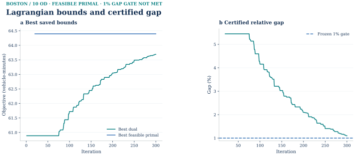</a></td><td width="33%" valign="top" align="left"><a href="https://scholarhaozheng.github.io/mobility-network-lab/volumes/boston.html#stage-17-lagrangian--c-boston-lagrangian-prices">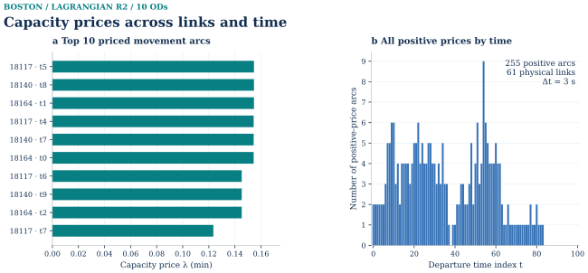</a></td><td width="33%" valign="top" align="left"><a href="https://scholarhaozheng.github.io/mobility-network-lab/volumes/boston.html#stage-17-lagrangian--c-boston-lagrangian-recovery">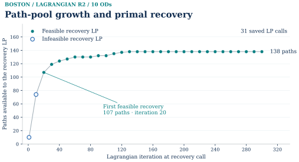</a></td></tr>
<tr><td width="33%" valign="top" align="left">
Saved Boston R2 10-OD Lagrangian history, iterations 1–300. Empty best-primal/gap values remain unplotted. The final feasible-primal certified gap is 1.1002%, which does not pass the frozen 1% gate; the result is not labeled accepted. This local derivative uses the approved history; raw history remains restricted.

<strong>Lagrangian</strong> 

Saved Boston R2 10-OD best-bound iteration trace; feasible primal, 1.1002% gap misses the frozen 1% gate.

<a href="https://scholarhaozheng.github.io/mobility-network-lab/volumes/boston.html#src-docs-cases-boston-document-finite-time-expanded-algorithms">Evidence</a> · <a href="https://scholarhaozheng.github.io/mobility-network-lab/assets/atlas/figures/g-f147.svg">Full figure</a>

</td><td width="33%" valign="top" align="left">
Saved Boston P07 best-bound multipliers on the finite 10-OD graph: 255 of 22,217 arcs have strictly positive capacity price, spanning 61 physical links. Panel a shows the ten largest saved movement-arc prices, identified by physical link and departure index; ties use link/time order. Panel b counts every positive-price arc by departure index (one step = 3 seconds), including the unshown smaller prices. Capacity prices have units of minutes per additional unit of vehicle capacity. They represent dual penalties; an LP-optimal multiplier certificate remains unavailable. Boston still misses its 1% certified-gap gate; these prices do not establish an accepted solution.
</td><td width="33%" valign="top" align="left">
Saved Boston P07 restricted-path LP recovery calls: 31 calls grow the available pool from 10 to 138 paths. The first recorded feasible call is at iteration 20 with 107 paths; the 2 earlier infeasible call(s) have no objective value and are shown as open markers, never as zero-cost solutions. The best feasible objective is 64.39686151153 vehicle-minutes, compared with the saved same-graph arc-flow LP reference 64.39686151153. Lines connect saved call checkpoints; no unsaved recovery states are inferred. Feasible recovery does not pass Boston's separate 1% duality-gap gate: the saved gap remains 1.1002%.
</td></tr>
<tr><td width="33%" valign="top" align="left">
<a href="https://scholarhaozheng.github.io/mobility-network-lab/volumes/boston.html#stage-17-lagrangian--g-f147">Complete evidence</a> · <a href="https://scholarhaozheng.github.io/mobility-network-lab/assets/atlas/figures/g-f147.svg">Full figure</a>

Source records
<ul><li><a href="https://github.com/scholarhaozheng/mobility-network-lab/blob/6ce18b8bea5bf3b9b7caa6ee4c0ff4e701a34a8b/docs/assets/homepage_evidence_r2/BOSTON_ROW17_DERIVED_FIGURE_APPROVAL.json" title="docs/assets/homepage_evidence_r2/BOSTON_ROW17_DERIVED_FIGURE_APPROVAL.json">BOSTON_ROW17_DERIVED_FIGURE_APPROVAL.json</a></li></ul>

<a href="https://scholarhaozheng.github.io/mobility-network-lab/reproduce.html?figure=G-F147">Data &amp; reproduction</a>
</td><td width="33%" valign="top" align="left">
<a href="https://scholarhaozheng.github.io/mobility-network-lab/volumes/boston.html#stage-17-lagrangian--c-boston-lagrangian-prices">Complete evidence</a> · <a href="https://scholarhaozheng.github.io/mobility-network-lab/assets/atlas/figures/c-boston-lagrangian-prices.svg">Full figure</a>

<a href="https://scholarhaozheng.github.io/mobility-network-lab/reproduce.html?figure=C-BOSTON-LAGRANGIAN-PRICES">Data &amp; reproduction</a>
</td><td width="33%" valign="top" align="left">
<a href="https://scholarhaozheng.github.io/mobility-network-lab/volumes/boston.html#stage-17-lagrangian--c-boston-lagrangian-recovery">Complete evidence</a> · <a href="https://scholarhaozheng.github.io/mobility-network-lab/assets/atlas/figures/c-boston-lagrangian-recovery.svg">Full figure</a>

<a href="https://scholarhaozheng.github.io/mobility-network-lab/reproduce.html?figure=C-BOSTON-LAGRANGIAN-RECOVERY">Data &amp; reproduction</a>
</td></tr>
</table>

##### ADMM

R2_S · 10-OD holdout

Convergence and feasibility, per-OD conservation, and physical movement flow compared with this instance’s arc-flow LP reference.

<table width="100%">
<tr><th width="33%" valign="top" align="left"><strong>ADMM convergence and feasibility</strong></th><th width="33%" valign="top" align="left"><strong>Commodity conservation across ADMM iterations</strong></th><th width="33%" valign="top" align="left"><strong>ADMM and arc-flow LP: physical-link flow</strong></th></tr>
<tr><td width="33%" valign="top" align="left"><a href="https://scholarhaozheng.github.io/mobility-network-lab/volumes/boston.html#stage-18-admm--g-f065">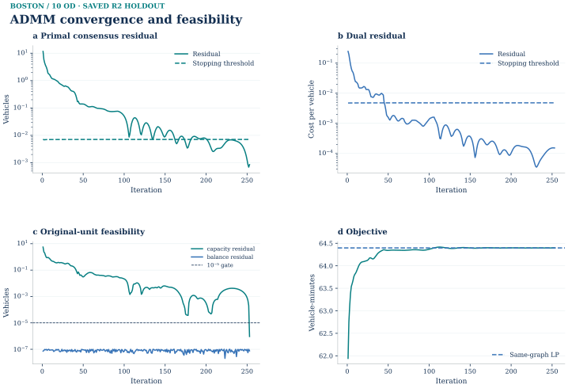</a></td><td width="33%" valign="top" align="left"><a href="https://scholarhaozheng.github.io/mobility-network-lab/volumes/boston.html#stage-18-admm--g-f069">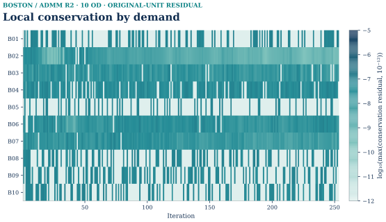</a></td><td width="33%" valign="top" align="left"><a href="https://scholarhaozheng.github.io/mobility-network-lab/volumes/boston.html#stage-18-admm--c-boston-admm-flows">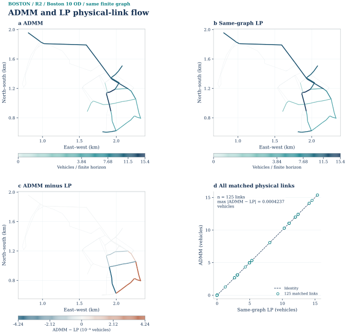</a></td></tr>
<tr><td width="33%" valign="top" align="left">
Saved R2 Boston 10-OD alternating direction method of multipliers (ADMM) history. Frozen-policy primal residual ||x-z|| is in vehicles; dual residual rho||z-z_previous|| is in cost per vehicle, so they have separate panels and their own stopping thresholds. Original-unit capacity/conservation feasibility is in vehicles; objective is in vehicle-minutes. Values below 10⁻¹⁴ are displayed at the floor on log axes, without changing source records. The rho-history panel is absent. The reference linear program (LP) uses the same finite graph. Objective agreement does not imply identical route/time splits.

<strong>ADMM</strong> 

Ten-OD original-space checks; own-LP gap 6.68e-6.

<a href="https://scholarhaozheng.github.io/mobility-network-lab/volumes/boston.html#src-docs-cases-boston-admm-document">Evidence</a> · <a href="https://scholarhaozheng.github.io/mobility-network-lab/assets/atlas/figures/g-f065.svg">Full figure</a>

<strong>ADMM convergence</strong> 

R2_S 10-OD accepted

<a href="https://scholarhaozheng.github.io/mobility-network-lab/volumes/boston.html#src-docs-cases-boston-admm-document-original-saved-convergence-view">Evidence</a> · <a href="https://scholarhaozheng.github.io/mobility-network-lab/assets/atlas/figures/g-f065.svg">Full figure</a>

</td><td width="33%" valign="top" align="left">
Ten saved OD commodity rows show local-conservation residual in vehicles by iteration. Color uses log10(max(residual,10⁻¹²)); the floor handles zeros without changing the numerical source. The feasibility gate is 10⁻⁵. The panel shows the local balance residual.
</td><td width="33%" valign="top" align="left">
ADMM and same-graph LP absolute physical movement flows share a color scale, followed by the signed ADMM−LP difference on a symmetric zero-centered scale. These preserve distinct feasible primal projections even when objectives agree; the CG solution is not substituted. Movement flow is in vehicles, summed over movement arcs associated with each physical link in the frozen 10-OD pilot. Difference colorbar units are 10⁻⁴ vehicles. Panel d plots every one of the 125 matched physical-link rows against the identity line, including zero-flow rows. Its linear x/y axes use the same range, and the maximum absolute saved difference is 0.000423660785206 vehicles; no difference is rounded to zero.

<strong>ADMM physical flow and LP difference</strong> 

R2_S 10-OD accepted

<a href="https://scholarhaozheng.github.io/mobility-network-lab/volumes/boston.html#src-docs-cases-boston-admm-document-physical-link-movement-flow-and-lp-comparison">Evidence</a> · <a href="https://scholarhaozheng.github.io/mobility-network-lab/assets/atlas/card-layout/c-boston-admm-flows.svg">Full figure</a>

</td></tr>
<tr><td width="33%" valign="top" align="left">
<a href="https://scholarhaozheng.github.io/mobility-network-lab/volumes/boston.html#stage-18-admm--g-f065">Complete evidence</a> · <a href="https://scholarhaozheng.github.io/mobility-network-lab/assets/atlas/figures/g-f065.svg">Full figure</a>

Source records
<ul><li><a href="https://github.com/scholarhaozheng/mobility-network-lab/blob/6ce18b8bea5bf3b9b7caa6ee4c0ff4e701a34a8b/docs/assets/boston/space_time_cg_r4/data/validation_summary.json" title="docs/assets/boston/space_time_cg_r4/data/validation_summary.json">validation_summary.json</a></li></ul>

<a href="https://scholarhaozheng.github.io/mobility-network-lab/reproduce.html?figure=G-F065">Data &amp; reproduction</a>
</td><td width="33%" valign="top" align="left">
<a href="https://scholarhaozheng.github.io/mobility-network-lab/volumes/boston.html#stage-18-admm--g-f069">Complete evidence</a> · <a href="https://scholarhaozheng.github.io/mobility-network-lab/assets/atlas/figures/g-f069.svg">Full figure</a>

<a href="https://scholarhaozheng.github.io/mobility-network-lab/reproduce.html?figure=G-F069">Data &amp; reproduction</a>
</td><td width="33%" valign="top" align="left">
<a href="https://scholarhaozheng.github.io/mobility-network-lab/volumes/boston.html#stage-18-admm--c-boston-admm-flows">Complete evidence</a> · <a href="https://scholarhaozheng.github.io/mobility-network-lab/assets/atlas/card-layout/c-boston-admm-flows.svg">Full figure</a>

Source records
<ul><li><a href="https://github.com/scholarhaozheng/mobility-network-lab/blob/6ce18b8bea5bf3b9b7caa6ee4c0ff4e701a34a8b/docs/assets/admm_r2/data/boston_10od_physical_link_admm_lp_comparison.csv" title="docs/assets/admm_r2/data/boston_10od_physical_link_admm_lp_comparison.csv">boston_10od_physical_link_admm_lp_comparison.csv</a></li><li><a href="https://github.com/scholarhaozheng/mobility-network-lab/blob/6ce18b8bea5bf3b9b7caa6ee4c0ff4e701a34a8b/docs/assets/boston/space_time_cg_r4/data/physical_link_flow_geometry.csv" title="docs/assets/boston/space_time_cg_r4/data/physical_link_flow_geometry.csv">physical_link_flow_geometry.csv</a></li></ul>

<a href="https://scholarhaozheng.github.io/mobility-network-lab/reproduce.html?figure=C-BOSTON-ADMM-FLOWS">Data &amp; reproduction</a>
</td></tr>
</table>

Additional CG evidence in the Boston chapter

<a href="https://scholarhaozheng.github.io/mobility-network-lab/volumes/boston.html#stage-16-two-phase-column-generation--g-f078">Shared capacity couples feasibility restoration</a>

<strong>Shared-capacity event</strong> 

CG capacity · 10-OD

<a href="https://scholarhaozheng.github.io/mobility-network-lab/volumes/boston.html#src-docs-cases-boston-space-time-document-shared-capacity-couples-different-od-demands">Evidence</a> · <a href="https://scholarhaozheng.github.io/mobility-network-lab/assets/atlas/figures/g-f078.svg">Full figure</a>

<a href="https://scholarhaozheng.github.io/mobility-network-lab/volumes/boston.html#stage-16-two-phase-column-generation--g-f073">Final physical-link movement flow</a>

<strong>Final physical-link movement flow</strong> 

CG flow · 10-OD

<a href="https://scholarhaozheng.github.io/mobility-network-lab/volumes/boston.html#src-docs-cases-boston-space-time-document-from-time-expanded-flows-back-to-final-physical-link-movement-flow">Evidence</a> · <a href="https://scholarhaozheng.github.io/mobility-network-lab/assets/atlas/figures/g-f073.svg">Full figure</a>

### Hong Kong

Bounded turn-aware GMNS and four-stage engineering scenario with separate ten-OD finite CG evidence. [Open complete case →](https://scholarhaozheng.github.io/mobility-network-lab/volumes/hong-kong.html)

<table width="100%"><thead><tr><th valign="top" width="25%">City/model foundation</th><th valign="top" width="25%">Static assignment</th><th valign="top" width="25%">Finite time-expanded</th><th valign="top" width="25%">Observation/data scope</th></tr></thead>
<tbody><tr><td valign="top" width="25%">780 physical nodes; 1,239 directed links; 95 fine zones</td><td valign="top" width="25%">8,930 OD pairs; 723.191 modeled PCE in 1 h</td><td valign="top" width="25%">100 selected nodes; 111 links; 10 ODs; approved HK10 generated column</td><td valign="top" width="25%">Detector/trajectory association provides context; flow maps show model output</td></tr></tbody></table>

[Sources and GMNS](#hong-kong-sources) · [Population, households and activity](#hong-kong-population) · [Transit and observations](#hong-kong-transit) · [Trip generation](#hong-kong-generation) · [Trip distribution](#hong-kong-distribution) · [Mode choice](#hong-kong-mode) · [Static assignment methods](#hong-kong-static) · [Time-expanded network and path examples](#hong-kong-representation) · [Optimization on the time-expanded network](#hong-kong-finite) · [Tools and reproducibility](https://scholarhaozheng.github.io/mobility-network-lab/volumes/hong-kong.html#src-docs-cases-hong-kong-document-reproduction)

#### Sources and GMNS

<strong>Source data and preparation</strong>

Official-derived bounded network and source layers.

<a href="https://scholarhaozheng.github.io/mobility-network-lab/volumes/hong-kong.html#src-docs-cases-hong-kong-document-gmns-zones-and-source-evidence">Evidence</a> · <a href="https://scholarhaozheng.github.io/mobility-network-lab/volumes/hong-kong.html#coverage-row-01">Evidence table</a>

<table width="100%">
<tr><th width="100%" valign="top" align="left"><strong>Physical network and R2 access nodes</strong></th></tr>
<tr><td width="100%" valign="top" align="left"><table><tr><td valign="top" width="50%"><a href="https://scholarhaozheng.github.io/mobility-network-lab/volumes/hong-kong.html#stage-02-gmns-network-and-access--g-f051">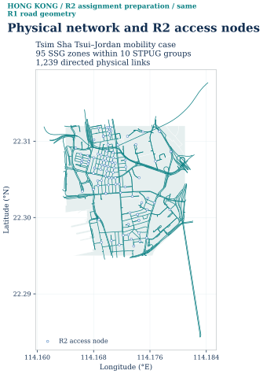</a></td><td valign="top" width="50%"><a href="https://scholarhaozheng.github.io/mobility-network-lab/volumes/hong-kong.html#stage-02-gmns-network-and-access--g-f024">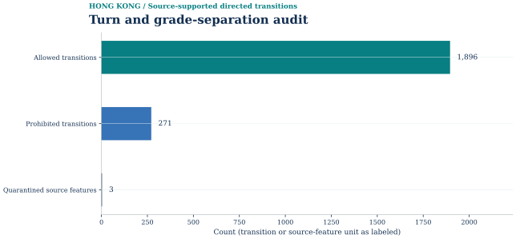</a></td></tr></table></td></tr>
<tr><td width="100%" valign="top" align="left">
Physical roads and R2 zone-access nodes in the bounded Tsim Sha Tsui–Jordan model.

A directed transition joins one road link to the next. The same network preparation records 1,896 allowed and 271 prohibited transitions. Three quarantined source features are counted separately; they are not accepted transitions. These checks document routing rules. <a href="https://scholarhaozheng.github.io/mobility-network-lab/assets/atlas/figures/g-f024.svg">Full audit figure</a>

The Tsim Sha Tsui–Jordan mobility case uses a bounded internal-demand study area. Its official-derived street network and 95 retained SSG zones define the top-down study-area overview. The R2 assignment preparation uses the same physical geometry as R1: 780 physical nodes, 1,239 directed physical links derived from 1,047 source features, and 95 SSG zones within 10 small tertiary planning unit groups (STPUGs). The 95 zone-access records map to 84 distinct physical nodes. Capacity, speed, BPR and turn/access preparation differ from R1. The 1,896 allowed movement arcs are routing objects and are not drawn as additional physical roads.

<strong>GMNS network, zones and access</strong> 

780 physical nodes, 1,239 links; 95 fine zones, ten parents and turn-aware access.

<a href="https://scholarhaozheng.github.io/mobility-network-lab/volumes/hong-kong.html#src-docs-datasets-hong-kong-gmns-document">Evidence</a> · <a href="https://scholarhaozheng.github.io/mobility-network-lab/assets/atlas/figures/g-f051.svg">Full figure</a>

<strong>Roads, zones and turns</strong> 

GMNS · 780 nodes / 1,239 links

<a href="https://scholarhaozheng.github.io/mobility-network-lab/volumes/hong-kong.html#src-docs-cases-hong-kong-document-gmns-zones-and-source-evidence">Evidence</a> · <a href="https://scholarhaozheng.github.io/mobility-network-lab/assets/atlas/figures/g-f051.svg">Full figure</a>

</td></tr>
<tr><td width="100%" valign="top" align="left">
<a href="https://scholarhaozheng.github.io/mobility-network-lab/volumes/hong-kong.html#stage-02-gmns-network-and-access--g-f051">Complete evidence</a> · <a href="https://scholarhaozheng.github.io/mobility-network-lab/assets/atlas/figures/g-f051.svg">Full figure</a>

Source records
<ul><li><a href="https://github.com/scholarhaozheng/mobility-network-lab/blob/6ce18b8bea5bf3b9b7caa6ee4c0ff4e701a34a8b/examples/hong-kong/gmns_pilot_r1/instance/link.csv" title="examples/hong-kong/gmns_pilot_r1/instance/link.csv">link.csv</a></li><li><a href="https://github.com/scholarhaozheng/mobility-network-lab/blob/6ce18b8bea5bf3b9b7caa6ee4c0ff4e701a34a8b/examples/hong-kong/gmns_pilot_r1/instance/zone.csv" title="examples/hong-kong/gmns_pilot_r1/instance/zone.csv">zone.csv</a></li><li><a href="https://github.com/scholarhaozheng/mobility-network-lab/blob/6ce18b8bea5bf3b9b7caa6ee4c0ff4e701a34a8b/docs/assets/hong_kong/full_stack_r5/r2r4_baseline/phase_a/zone_access_r2.csv" title="docs/assets/hong_kong/full_stack_r5/r2r4_baseline/phase_a/zone_access_r2.csv">zone_access_r2.csv</a></li><li><a href="https://github.com/scholarhaozheng/mobility-network-lab/blob/6ce18b8bea5bf3b9b7caa6ee4c0ff4e701a34a8b/docs/assets/hong_kong/full_stack_r5/r2r4_baseline/phase_a/instance/node.csv" title="docs/assets/hong_kong/full_stack_r5/r2r4_baseline/phase_a/instance/node.csv">node.csv</a></li><li><a href="https://github.com/scholarhaozheng/mobility-network-lab/blob/6ce18b8bea5bf3b9b7caa6ee4c0ff4e701a34a8b/docs/assets/hong_kong/full_stack_r5/r2r4_baseline/phase_a/turn_aware_movement_edges.csv" title="docs/assets/hong_kong/full_stack_r5/r2r4_baseline/phase_a/turn_aware_movement_edges.csv">turn_aware_movement_edges.csv</a></li><li><a href="https://github.com/scholarhaozheng/mobility-network-lab/blob/6ce18b8bea5bf3b9b7caa6ee4c0ff4e701a34a8b/docs/assets/hong_kong/full_stack_r5/r2r4_baseline/phase_a/movement_resolved.csv" title="docs/assets/hong_kong/full_stack_r5/r2r4_baseline/phase_a/movement_resolved.csv">movement_resolved.csv</a></li><li><a href="https://github.com/scholarhaozheng/mobility-network-lab/blob/6ce18b8bea5bf3b9b7caa6ee4c0ff4e701a34a8b/docs/assets/hong_kong/full_stack_r5/r2r4_baseline/phase_a/movement_quarantine.csv" title="docs/assets/hong_kong/full_stack_r5/r2r4_baseline/phase_a/movement_quarantine.csv">movement_quarantine.csv</a></li><li><a href="https://github.com/scholarhaozheng/mobility-network-lab/blob/6ce18b8bea5bf3b9b7caa6ee4c0ff4e701a34a8b/docs/assets/hong_kong/full_stack_r5/r2r4_baseline/phase_a/GRADE_SEPARATION_AUDIT.csv" title="docs/assets/hong_kong/full_stack_r5/r2r4_baseline/phase_a/GRADE_SEPARATION_AUDIT.csv">GRADE_SEPARATION_AUDIT.csv</a></li></ul>

<a href="https://scholarhaozheng.github.io/mobility-network-lab/reproduce.html?figure=G-F051">Data &amp; preparation</a>
</td></tr>
</table>

#### Population, households and activity

<table width="100%">
<tr><th width="100%" valign="top" align="left"><strong>Population, households and activity</strong></th></tr>
<tr><td width="100%" valign="top" align="left"><a href="https://scholarhaozheng.github.io/mobility-network-lab/volumes/hong-kong.html#stage-03-population-households-and-activity--g-f174">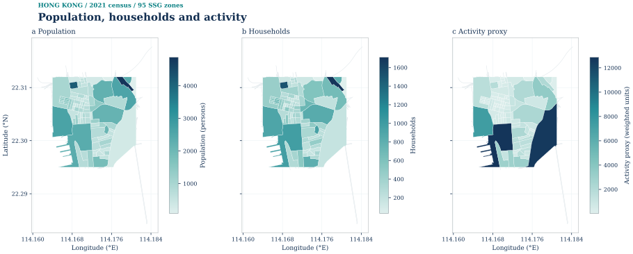</a></td></tr>
<tr><td width="100%" valign="top" align="left">
The first two maps allocate 2021 census population and households to 95 retained SSG zones. The third is an engineering attraction proxy built from official building footprints, reported storeys and name-based use weights. Hong Kong and Boston use different zone definitions.

<strong>Population, households and activity</strong>

2021 census households/population and explicitly modeled building activity proxies.

<a href="https://scholarhaozheng.github.io/mobility-network-lab/volumes/hong-kong.html#src-docs-cases-hong-kong-four-stage-document">Evidence</a> · <a href="https://scholarhaozheng.github.io/mobility-network-lab/assets/atlas/figures/g-f174.svg">Full figure</a>

<strong>2021 census allocation and activity proxy</strong>

Population and modeled activity proxy

<a href="https://scholarhaozheng.github.io/mobility-network-lab/volumes/hong-kong.html#src-docs-cases-hong-kong-four-stage-document">Evidence</a> · <a href="https://scholarhaozheng.github.io/mobility-network-lab/volumes/hong-kong.html#coverage-row-03">Evidence table</a>

</td></tr>
<tr><td width="100%" valign="top" align="left">
<a href="https://scholarhaozheng.github.io/mobility-network-lab/volumes/hong-kong.html#stage-03-population-households-and-activity--g-f174">Complete evidence</a> · <a href="https://scholarhaozheng.github.io/mobility-network-lab/assets/atlas/figures/g-f174.svg">Full figure</a>

Source records
<ul><li><a href="https://github.com/scholarhaozheng/mobility-network-lab/blob/6ce18b8bea5bf3b9b7caa6ee4c0ff4e701a34a8b/examples/hong-kong/gmns_pilot_r1/instance/zone.csv" title="examples/hong-kong/gmns_pilot_r1/instance/zone.csv">zone.csv</a></li><li><a href="https://github.com/scholarhaozheng/mobility-network-lab/blob/6ce18b8bea5bf3b9b7caa6ee4c0ff4e701a34a8b/examples/hong-kong/gmns_pilot_r1/instance/link.csv" title="examples/hong-kong/gmns_pilot_r1/instance/link.csv">link.csv</a></li><li><a href="https://github.com/scholarhaozheng/mobility-network-lab/blob/6ce18b8bea5bf3b9b7caa6ee4c0ff4e701a34a8b/docs/assets/hong_kong/full_stack_r5/r2r4_baseline/phase_b/zone_activity_r2.csv" title="docs/assets/hong_kong/full_stack_r5/r2r4_baseline/phase_b/zone_activity_r2.csv">zone_activity_r2.csv</a></li></ul>

<a href="https://scholarhaozheng.github.io/mobility-network-lab/reproduce.html?figure=G-F174">Data &amp; preparation</a>
</td></tr>
</table>

#### Transit and observations

<table width="100%">
<tr><th width="25%" valign="top" align="left"><strong>Roads and scheduled transit stops</strong></th><th width="25%" valign="top" align="left"><strong>Detector-to-road association</strong></th><th width="25%" valign="top" align="left"><strong>Observation evidence and association</strong></th><th width="25%" valign="top" align="left"><strong>Reference positions and road projections</strong></th></tr>
<tr><td width="25%" valign="top" align="left"><a href="https://scholarhaozheng.github.io/mobility-network-lab/volumes/hong-kong.html#stage-04-transit-and-walk--g-f175">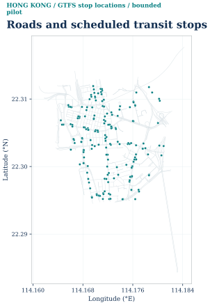</a></td><td width="25%" valign="top" align="left"><a href="https://scholarhaozheng.github.io/mobility-network-lab/volumes/hong-kong.html#stage-05-gps-and-detectors--g-f176">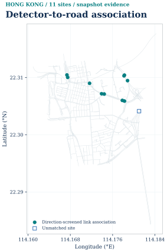</a></td><td width="25%" valign="top" align="left"><a href="https://scholarhaozheng.github.io/mobility-network-lab/volumes/hong-kong.html#stage-05-gps-and-detectors--g-f186">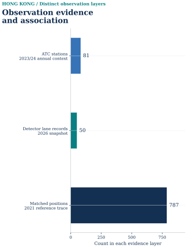</a></td><td width="25%" valign="top" align="left"><a href="https://scholarhaozheng.github.io/mobility-network-lab/volumes/hong-kong.html#stage-05-gps-and-detectors--g-f015">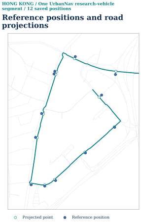</a></td></tr>
<tr><td width="25%" valign="top" align="left">
Official-derived road geometry with GTFS scheduled-stop locations. This panel shows roads and scheduled stops; walk-path verification is outside its scope. Small markers preserve the road context.

<strong>Transit and pedestrian inputs</strong>

GTFS same-trip rides, fares, headways and pedestrian access enter generalized costs.

<a href="https://scholarhaozheng.github.io/mobility-network-lab/volumes/hong-kong.html#src-docs-cases-hong-kong-four-stage-document">Evidence</a> · <a href="https://scholarhaozheng.github.io/mobility-network-lab/assets/atlas/figures/g-f175.svg">Full figure</a>

</td><td width="25%" valign="top" align="left">
Eleven detector sites from the 26 September 2026, 10:24:00–10:24:30 local-source snapshot; ten have direction-screened link associations. Grade separation remains unverified. This panel shows detector coverage.

<strong>GPS, trajectory and detector evidence</strong>

Detector and private trajectory association; no held-out validation claim.

<a href="https://scholarhaozheng.github.io/mobility-network-lab/volumes/hong-kong.html#src-docs-cases-hong-kong-four-stage-document">Evidence</a> · <a href="https://scholarhaozheng.github.io/mobility-network-lab/assets/atlas/figures/g-f176.svg">Full figure</a>

</td><td width="25%" valign="top" align="left">
The three count units differ: 81 ATC stations carrying annual 2023/24 AADT context, 50 lane rows across eleven sites in one 2026 detector snapshot, and 787 matched reference positions from one 2021 UrbanNav research-vehicle trace. Neither annual station totals nor this private reference trace validates one-hour directed-link traffic. Only aggregate evidence is reproduced here.

<strong>Detector/trajectory association</strong>

Exploratory observation linkage

<a href="https://scholarhaozheng.github.io/mobility-network-lab/volumes/hong-kong.html#src-docs-cases-hong-kong-document-demand-transit-and-observations">Evidence</a> · <a href="https://scholarhaozheng.github.io/mobility-network-lab/assets/atlas/figures/g-f186.svg">Full figure</a>

</td><td width="25%" valign="top" align="left">
The same twelve saved UrbanNav TST SPAN-CPT+IE reference positions, projected points and matched road geometry, re-rendered from the published editable vector coordinates. The sample contains one 2021 research-vehicle segment; representative traffic demand and private-trajectory coverage remain outside its scope. No matching was rerun and no additional position records were exported.

GPS / map-matching example: twelve saved reference positions from one 2021 UrbanNav research-vehicle segment are shown alongside their projections onto physical roads. Read this local example with the observation counts above.
</td></tr>
<tr><td width="25%" valign="top" align="left">
<a href="https://scholarhaozheng.github.io/mobility-network-lab/volumes/hong-kong.html#stage-04-transit-and-walk--g-f175">Complete evidence</a> · <a href="https://scholarhaozheng.github.io/mobility-network-lab/assets/atlas/figures/g-f175.svg">Full figure</a>

Source records
<ul><li><a href="https://github.com/scholarhaozheng/mobility-network-lab/blob/6ce18b8bea5bf3b9b7caa6ee4c0ff4e701a34a8b/examples/hong-kong/gmns_pilot_r1/instance/link.csv" title="examples/hong-kong/gmns_pilot_r1/instance/link.csv">link.csv</a></li><li><a href="https://github.com/scholarhaozheng/mobility-network-lab/blob/6ce18b8bea5bf3b9b7caa6ee4c0ff4e701a34a8b/examples/hong-kong/gmns_pilot_r1/instance/transit_stops.csv" title="examples/hong-kong/gmns_pilot_r1/instance/transit_stops.csv">transit_stops.csv</a></li></ul>

<a href="https://scholarhaozheng.github.io/mobility-network-lab/reproduce.html?figure=G-F175">Data &amp; preparation</a>
</td><td width="25%" valign="top" align="left">
<a href="https://scholarhaozheng.github.io/mobility-network-lab/volumes/hong-kong.html#stage-05-gps-and-detectors--g-f176">Complete evidence</a> · <a href="https://scholarhaozheng.github.io/mobility-network-lab/assets/atlas/figures/g-f176.svg">Full figure</a>

Source records
<ul><li><a href="https://github.com/scholarhaozheng/mobility-network-lab/blob/6ce18b8bea5bf3b9b7caa6ee4c0ff4e701a34a8b/examples/hong-kong/gmns_pilot_r1/instance/link.csv" title="examples/hong-kong/gmns_pilot_r1/instance/link.csv">link.csv</a></li><li><a href="https://github.com/scholarhaozheng/mobility-network-lab/blob/6ce18b8bea5bf3b9b7caa6ee4c0ff4e701a34a8b/examples/hong-kong/gmns_pilot_r1/instance/detector_to_link.csv" title="examples/hong-kong/gmns_pilot_r1/instance/detector_to_link.csv">detector_to_link.csv</a></li><li><a href="https://github.com/scholarhaozheng/mobility-network-lab/blob/6ce18b8bea5bf3b9b7caa6ee4c0ff4e701a34a8b/docs/assets/hong_kong/full_stack_r5/r2r4_baseline/phase_b/OBSERVATION_EVIDENCE_LEDGER.json" title="docs/assets/hong_kong/full_stack_r5/r2r4_baseline/phase_b/OBSERVATION_EVIDENCE_LEDGER.json">OBSERVATION_EVIDENCE_LEDGER.json</a></li></ul>

<a href="https://scholarhaozheng.github.io/mobility-network-lab/reproduce.html?figure=G-F176">Data &amp; preparation</a>
</td><td width="25%" valign="top" align="left">
<a href="https://scholarhaozheng.github.io/mobility-network-lab/volumes/hong-kong.html#stage-05-gps-and-detectors--g-f186">Complete evidence</a> · <a href="https://scholarhaozheng.github.io/mobility-network-lab/assets/atlas/figures/g-f186.svg">Full figure</a>

Source records
<ul><li><a href="https://github.com/scholarhaozheng/mobility-network-lab/blob/6ce18b8bea5bf3b9b7caa6ee4c0ff4e701a34a8b/docs/assets/hong_kong/full_stack_r5/r2r4_baseline/phase_b/OBSERVATION_EVIDENCE_LEDGER.json" title="docs/assets/hong_kong/full_stack_r5/r2r4_baseline/phase_b/OBSERVATION_EVIDENCE_LEDGER.json">OBSERVATION_EVIDENCE_LEDGER.json</a></li><li><a href="https://github.com/scholarhaozheng/mobility-network-lab/blob/6ce18b8bea5bf3b9b7caa6ee4c0ff4e701a34a8b/docs/assets/hong_kong/full_stack_r5/r2r4_baseline/phase_b/TRAJECTORY_MAP_MATCH_SUMMARY.json" title="docs/assets/hong_kong/full_stack_r5/r2r4_baseline/phase_b/TRAJECTORY_MAP_MATCH_SUMMARY.json">TRAJECTORY_MAP_MATCH_SUMMARY.json</a></li></ul>

<a href="https://scholarhaozheng.github.io/mobility-network-lab/reproduce.html?figure=G-F186">Data &amp; preparation</a>
</td><td width="25%" valign="top" align="left">
<a href="https://scholarhaozheng.github.io/mobility-network-lab/volumes/hong-kong.html#stage-05-gps-and-detectors--g-f015">Complete evidence</a> · <a href="https://scholarhaozheng.github.io/mobility-network-lab/assets/atlas/figures/g-f015.svg">Full figure</a>

Source records
<ul><li><a href="https://github.com/scholarhaozheng/mobility-network-lab/blob/6ce18b8bea5bf3b9b7caa6ee4c0ff4e701a34a8b/docs/assets/hong_kong/visual_release_r1/hong_kong_reference_projection.svg" title="docs/assets/hong_kong/visual_release_r1/hong_kong_reference_projection.svg">hong_kong_reference_projection.svg</a></li><li><a href="https://github.com/scholarhaozheng/mobility-network-lab/blob/6ce18b8bea5bf3b9b7caa6ee4c0ff4e701a34a8b/docs/assets/hong_kong/visual_release_r1/hong_kong_reference_projection.source.json" title="docs/assets/hong_kong/visual_release_r1/hong_kong_reference_projection.source.json">hong_kong_reference_projection.source.json</a></li></ul>

<a href="https://scholarhaozheng.github.io/mobility-network-lab/reproduce.html?figure=G-F015">Data &amp; preparation</a>
</td></tr>
</table>

#### Trip generation

<table width="100%">
<tr><th width="100%" valign="top" align="left"><strong>Trip productions and attractions</strong></th></tr>
<tr><td width="100%" valign="top" align="left"><a href="https://scholarhaozheng.github.io/mobility-network-lab/volumes/hong-kong.html#stage-06-trip-generation--g-f177">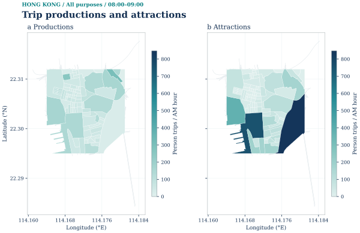</a></td></tr>
<tr><td width="100%" valign="top" align="left">
Purpose-summed interzonal productions and attractions in the one-hour AM engineering scenario, using the same color scale. Rates are transferred from territory-wide TCS with a 0.30 local capture fraction; 5% intrazonal opportunities are excluded. Attractions use modeled building/activity proxies. IPF balances 95 zone margins.

<strong>Trip generation — productions / attractions</strong>

Transferred rate and declared capture sensitivity.

<a href="https://scholarhaozheng.github.io/mobility-network-lab/volumes/hong-kong.html#src-docs-cases-hong-kong-four-stage-document">Evidence</a> · <a href="https://scholarhaozheng.github.io/mobility-network-lab/assets/atlas/figures/g-f177.svg">Full figure</a>

<strong>Production/attraction scenario</strong>

Trip generation · engineering scenario

<a href="https://scholarhaozheng.github.io/mobility-network-lab/volumes/hong-kong.html#src-docs-cases-hong-kong-four-stage-document">Evidence</a> · <a href="https://scholarhaozheng.github.io/mobility-network-lab/volumes/hong-kong.html#coverage-row-06">Evidence table</a>

</td></tr>
<tr><td width="100%" valign="top" align="left">
<a href="https://scholarhaozheng.github.io/mobility-network-lab/volumes/hong-kong.html#stage-06-trip-generation--g-f177">Complete evidence</a> · <a href="https://scholarhaozheng.github.io/mobility-network-lab/assets/atlas/figures/g-f177.svg">Full figure</a>

Source records
<ul><li><a href="https://github.com/scholarhaozheng/mobility-network-lab/blob/6ce18b8bea5bf3b9b7caa6ee4c0ff4e701a34a8b/examples/hong-kong/gmns_pilot_r1/instance/zone.csv" title="examples/hong-kong/gmns_pilot_r1/instance/zone.csv">zone.csv</a></li><li><a href="https://github.com/scholarhaozheng/mobility-network-lab/blob/6ce18b8bea5bf3b9b7caa6ee4c0ff4e701a34a8b/examples/hong-kong/gmns_pilot_r1/instance/link.csv" title="examples/hong-kong/gmns_pilot_r1/instance/link.csv">link.csv</a></li><li><a href="https://github.com/scholarhaozheng/mobility-network-lab/blob/6ce18b8bea5bf3b9b7caa6ee4c0ff4e701a34a8b/docs/assets/hong_kong/full_stack_r5/r2r4_baseline/phase_b/production_attraction_r2.csv" title="docs/assets/hong_kong/full_stack_r5/r2r4_baseline/phase_b/production_attraction_r2.csv">production_attraction_r2.csv</a></li><li><a href="https://github.com/scholarhaozheng/mobility-network-lab/blob/6ce18b8bea5bf3b9b7caa6ee4c0ff4e701a34a8b/docs/assets/hong_kong/full_stack_r5/r2r4_baseline/phase_b/DISTRIBUTION_BALANCE_REPORT.json" title="docs/assets/hong_kong/full_stack_r5/r2r4_baseline/phase_b/DISTRIBUTION_BALANCE_REPORT.json">DISTRIBUTION_BALANCE_REPORT.json</a></li></ul>

<a href="https://scholarhaozheng.github.io/mobility-network-lab/reproduce.html?figure=G-F177">Data &amp; reproduction</a>
</td></tr>
</table>

#### Trip distribution

<table width="100%">
<tr><th width="100%" valign="top" align="left"><strong>Interzonal OD demand</strong></th></tr>
<tr><td width="100%" valign="top" align="left"><a href="https://scholarhaozheng.github.io/mobility-network-lab/volumes/hong-kong.html#stage-07-trip-distribution--g-f178">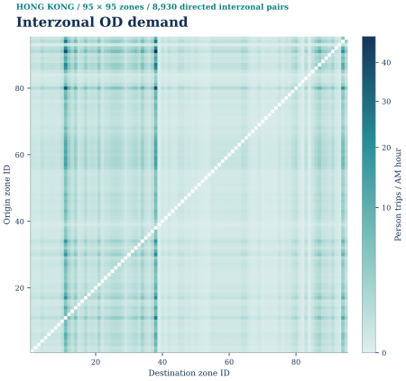</a></td></tr>
<tr><td width="100%" valign="top" align="left">
All-purpose 95-by-95 zonal OD demand for 08:00–09:00, with 8,930 positive directed interzonal pairs. The white diagonal marks excluded intrazonal demand. Color uses square-root normalization; tick labels remain in modeled person trips per hour. This OD matrix is a modeled scenario.

<strong>Trip distribution — zonal OD demand</strong>

Turn-aware gravity/IPF balances 8,930 reachable directed OD pairs.

<a href="https://scholarhaozheng.github.io/mobility-network-lab/volumes/hong-kong.html#src-docs-cases-hong-kong-four-stage-document">Evidence</a> · <a href="https://scholarhaozheng.github.io/mobility-network-lab/assets/atlas/figures/g-f178.svg">Full figure</a>

</td></tr>
<tr><td width="100%" valign="top" align="left">
<a href="https://scholarhaozheng.github.io/mobility-network-lab/volumes/hong-kong.html#stage-07-trip-distribution--g-f178">Complete evidence</a> · <a href="https://scholarhaozheng.github.io/mobility-network-lab/assets/atlas/figures/g-f178.svg">Full figure</a>

Source records
<ul><li><a href="https://github.com/scholarhaozheng/mobility-network-lab/blob/6ce18b8bea5bf3b9b7caa6ee4c0ff4e701a34a8b/docs/assets/hong_kong/full_stack_r5/r2r4_baseline/phase_b/od_person_distribution_r2.csv" title="docs/assets/hong_kong/full_stack_r5/r2r4_baseline/phase_b/od_person_distribution_r2.csv">od_person_distribution_r2.csv</a></li></ul>

<a href="https://scholarhaozheng.github.io/mobility-network-lab/reproduce.html?figure=G-F178">Data &amp; reproduction</a>
</td></tr>
</table>

#### Mode choice

<table width="100%">
<tr><th width="100%" valign="top" align="left"><strong>AM mode demand and normalized shares</strong></th></tr>
<tr><td width="100%" valign="top" align="left"><a href="https://scholarhaozheng.github.io/mobility-network-lab/volumes/hong-kong.html#stage-08-mode-choice--g-f031">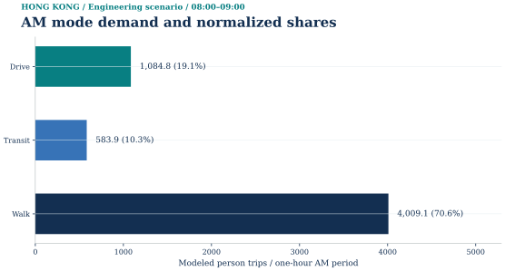</a></td></tr>
<tr><td width="100%" valign="top" align="left">
Drive, transit and walk bars show absolute modeled person trips, with shares normalized by their sum.  The all-mode scenario is a sensitivity transfer from territory-wide mechanised travel rates; walk demand is counterfactual and no local mode-share calibration is claimed.

<strong>Mode choice — mode-specific demand</strong>

GTFS/pedestrian generalized cost and declared sensitivity logit.

<a href="https://scholarhaozheng.github.io/mobility-network-lab/volumes/hong-kong.html#src-docs-cases-hong-kong-four-stage-document">Evidence</a> · <a href="https://scholarhaozheng.github.io/mobility-network-lab/assets/atlas/figures/g-f031.svg">Full figure</a>

<strong>Mode costs and shares</strong>

Mode choice · one-hour AM

<a href="https://scholarhaozheng.github.io/mobility-network-lab/volumes/hong-kong.html#src-docs-cases-hong-kong-four-stage-document">Evidence</a> · <a href="https://scholarhaozheng.github.io/mobility-network-lab/assets/atlas/figures/g-f031.svg">Full figure</a>

</td></tr>
<tr><td width="100%" valign="top" align="left">
<a href="https://scholarhaozheng.github.io/mobility-network-lab/volumes/hong-kong.html#stage-08-mode-choice--g-f031">Complete evidence</a> · <a href="https://scholarhaozheng.github.io/mobility-network-lab/assets/atlas/figures/g-f031.svg">Full figure</a>

Source records
<ul><li><a href="https://github.com/scholarhaozheng/mobility-network-lab/blob/6ce18b8bea5bf3b9b7caa6ee4c0ff4e701a34a8b/docs/assets/hong_kong/full_stack_r5/r2r4_baseline/phase_b/mode_demand_by_od.csv" title="docs/assets/hong_kong/full_stack_r5/r2r4_baseline/phase_b/mode_demand_by_od.csv">mode_demand_by_od.csv</a></li><li><a href="https://github.com/scholarhaozheng/mobility-network-lab/blob/6ce18b8bea5bf3b9b7caa6ee4c0ff4e701a34a8b/docs/assets/hong_kong/full_stack_r5/r2r4_baseline/phase_b/DISTRIBUTION_BALANCE_REPORT.json" title="docs/assets/hong_kong/full_stack_r5/r2r4_baseline/phase_b/DISTRIBUTION_BALANCE_REPORT.json">DISTRIBUTION_BALANCE_REPORT.json</a></li></ul>

<a href="https://scholarhaozheng.github.io/mobility-network-lab/reproduce.html?figure=G-F031">Data &amp; reproduction</a>
</td></tr>
</table>

#### Static assignment methods

##### Static assignment inputs — full demand and H1 subset

Vehicle-demand margins and physical access for the full 8,930 interzonal OD pairs and the frozen H1 subset of 26 OD pairs. H1 retains the corresponding full-demand PCE values; distinct zone states remain distinct even when their physical access node is shared.

<table width="100%">
<tr><th width="50%" valign="top" align="left"><strong>Static assignment demand margins</strong></th><th width="50%" valign="top" align="left"><strong>Physical demand endpoints</strong></th></tr>
<tr><td width="50%" valign="top" align="left"></td><td width="50%" valign="top" align="left"><a href="https://scholarhaozheng.github.io/mobility-network-lab/volumes/hong-kong.html#stage-09-traffic-assignment--c-hk-endpoints">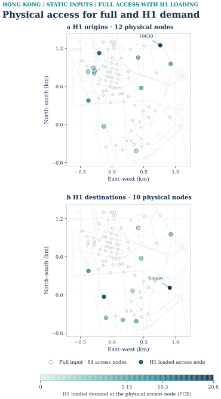</a></td></tr>
<tr><td width="50%" valign="top" align="left">
Source-zone origin and destination margins of the loaded static drive demand, in PCE for 08:00–09:00. The full 8,930 directed interzonal OD pairs carry 723.191227885 PCE over all 95 SSG zones; the frozen H1 subset carries 52.178450646 PCE over 26 pairs, with 13 origin zones and 10 destination zones. Every H1 pair retains exactly its original full-table PCE value. H1 was selected by a frozen descending-demand rule with at most two pairs per origin and three per destination. All four maps share one square-root color normalization with ticks in original PCE units; zero selected demand remains zero. Full input supports the displayed FW and Algorithm B results; H1 supports its own FW reference, finite-path and native L3 comparison. These are assignment-input margins after mode/occupancy conversion, distinct from the earlier all-mode person-trip production/attraction maps.
</td><td width="50%" valign="top" align="left">
The full static input has 95 origin/destination zones associated with 84 distinct R2 physical access nodes, shown as light open circles. The H1 26-OD subset uses 13 origin zones mapped to 12 physical origins, and 10 destination zones mapped to 10 physical destinations; their union contains 16 nodes. Filled markers show H1 endpoint PCE aggregated only for this display, with a common color scale across origin and destination maps. The highest-loaded physical node in each panel is labelled by its saved ID. Each side sums to 52.178450646 PCE. This display join does not alter solver demand: the full model retains all 8,930 zone-state pairs, including 22 distinct-zone pairs sharing one physical access node, while H1 retains its original 26 pairs. The panel displays assignment-input endpoints and their PCE loads.
</td></tr>
<tr><td width="50%" valign="top" align="left">
<a href="https://scholarhaozheng.github.io/mobility-network-lab/volumes/hong-kong.html#stage-09-traffic-assignment--c-hk-source-margins">Complete evidence</a> · <a href="https://scholarhaozheng.github.io/mobility-network-lab/assets/atlas/figures/c-hk-source-margins.svg">Full figure</a>

Source records
<ul><li><a href="https://github.com/scholarhaozheng/mobility-network-lab/blob/6ce18b8bea5bf3b9b7caa6ee4c0ff4e701a34a8b/docs/assets/hong_kong/full_stack_r5/r2r4_baseline/phase_b/mode_demand_by_od.csv" title="docs/assets/hong_kong/full_stack_r5/r2r4_baseline/phase_b/mode_demand_by_od.csv">mode_demand_by_od.csv</a></li><li><a href="https://github.com/scholarhaozheng/mobility-network-lab/blob/6ce18b8bea5bf3b9b7caa6ee4c0ff4e701a34a8b/docs/assets/hong_kong/full_stack_r5/r2r4_baseline/phase_a/instance/zone.csv" title="docs/assets/hong_kong/full_stack_r5/r2r4_baseline/phase_a/instance/zone.csv">zone.csv</a></li><li><a href="https://github.com/scholarhaozheng/mobility-network-lab/blob/6ce18b8bea5bf3b9b7caa6ee4c0ff4e701a34a8b/docs/assets/hong_kong/full_stack_r5/r2r4_baseline/phase_a/instance/link.csv" title="docs/assets/hong_kong/full_stack_r5/r2r4_baseline/phase_a/instance/link.csv">link.csv</a></li></ul>

<a href="https://scholarhaozheng.github.io/mobility-network-lab/reproduce.html?figure=C-HK-SOURCE-MARGINS">Data &amp; preparation</a>
</td><td width="50%" valign="top" align="left">
<a href="https://scholarhaozheng.github.io/mobility-network-lab/volumes/hong-kong.html#stage-09-traffic-assignment--c-hk-endpoints">Complete evidence</a> · <a href="https://scholarhaozheng.github.io/mobility-network-lab/assets/atlas/card-layout/c-hk-endpoints.svg">Full figure</a>

Source records
<ul><li><a href="https://github.com/scholarhaozheng/mobility-network-lab/blob/6ce18b8bea5bf3b9b7caa6ee4c0ff4e701a34a8b/docs/assets/hong_kong/full_stack_r5/r2r4_baseline/phase_b/mode_demand_by_od.csv" title="docs/assets/hong_kong/full_stack_r5/r2r4_baseline/phase_b/mode_demand_by_od.csv">mode_demand_by_od.csv</a></li><li><a href="https://github.com/scholarhaozheng/mobility-network-lab/blob/6ce18b8bea5bf3b9b7caa6ee4c0ff4e701a34a8b/docs/assets/hong_kong/full_stack_r5/r2r4_baseline/phase_a/zone_access_r2.csv" title="docs/assets/hong_kong/full_stack_r5/r2r4_baseline/phase_a/zone_access_r2.csv">zone_access_r2.csv</a></li><li><a href="https://github.com/scholarhaozheng/mobility-network-lab/blob/6ce18b8bea5bf3b9b7caa6ee4c0ff4e701a34a8b/docs/assets/hong_kong/full_stack_r5/r2r4_baseline/phase_a/instance/node.csv" title="docs/assets/hong_kong/full_stack_r5/r2r4_baseline/phase_a/instance/node.csv">node.csv</a></li><li><a href="https://github.com/scholarhaozheng/mobility-network-lab/blob/6ce18b8bea5bf3b9b7caa6ee4c0ff4e701a34a8b/docs/assets/hong_kong/full_stack_r5/r2r4_baseline/phase_a/instance/link.csv" title="docs/assets/hong_kong/full_stack_r5/r2r4_baseline/phase_a/instance/link.csv">link.csv</a></li><li><a href="https://github.com/scholarhaozheng/mobility-network-lab/blob/6ce18b8bea5bf3b9b7caa6ee4c0ff4e701a34a8b/docs/assets/hong_kong/full_stack_r5/r2r4_baseline/phase_a/static_input/expanded_network_crosswalk.csv" title="docs/assets/hong_kong/full_stack_r5/r2r4_baseline/phase_a/static_input/expanded_network_crosswalk.csv">expanded_network_crosswalk.csv</a></li></ul>

<a href="https://scholarhaozheng.github.io/mobility-network-lab/reproduce.html?figure=C-HK-ENDPOINTS">Data &amp; preparation</a>
</td></tr>
</table>

##### Static assignment results — one card per method

FW and official tap-b Algorithm B use the full 8,930-OD scenario. Finite-path SLSQP uses H1 (26 ODs, 126 legal paths), a separate bounded instance.

<table width="100%">
<tr><th width="33%" valign="top" align="left"><strong>Frank–Wolfe physical-link flow</strong></th><th width="33%" valign="top" align="left"><strong>Algorithm B physical-link flow</strong></th><th width="33%" valign="top" align="left"><strong>Finite-path reference and physical support</strong></th></tr>
<tr><td width="33%" valign="top" align="left"></td><td width="33%" valign="top" align="left"><a href="https://scholarhaozheng.github.io/mobility-network-lab/volumes/hong-kong.html#stage-11-algorithm-b--g-f182">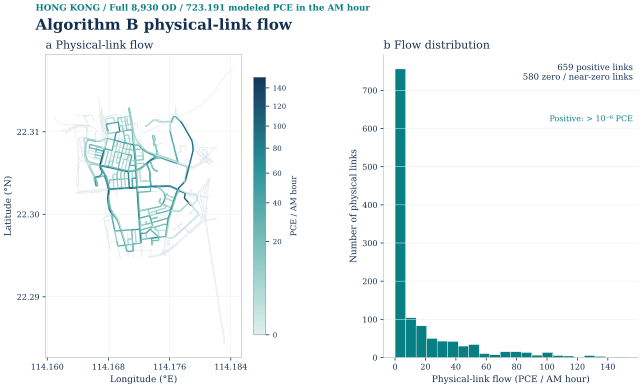</a></td><td width="33%" valign="top" align="left"><a href="https://scholarhaozheng.github.io/mobility-network-lab/volumes/hong-kong.html#stage-12-finite-path-reference--c-hk-finite-static">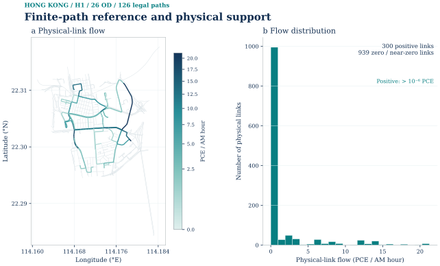</a></td></tr>
<tr><td width="33%" valign="top" align="left">
Frank–Wolfe physical-link flow on the same 1,239 physical directed links, with proxy BPR parameters in the one-hour engineering scenario. Square-root color normalization retains PCE tick units. The saved FW and Algorithm B vectors agree to within 8.53e-14 PCE, but each map reads its own method vector. The right histogram includes all 1,239 physical links; 659 exceed 1e-6 PCE and 580 are zero or near-zero under that threshold. No empirical traffic-validation claim.

<strong>Frank–Wolfe</strong> 

Turn-aware one-hour 723.191 PCE static engineering scenario.

<a href="https://scholarhaozheng.github.io/mobility-network-lab/volumes/hong-kong.html#src-docs-cases-hong-kong-static-assignment-document">Evidence</a> · <a href="https://scholarhaozheng.github.io/mobility-network-lab/assets/atlas/figures/g-f052.svg">Full figure</a>

</td><td width="33%" valign="top" align="left">
Algorithm B physical-link flow on the same 1,239 physical directed links, with proxy BPR parameters in the one-hour engineering scenario. Square-root color normalization retains PCE tick units. The saved FW and Algorithm B vectors agree to within 8.53e-14 PCE, but each map reads its own method vector. The right histogram includes all 1,239 physical links; 659 exceed 1e-6 PCE and 580 are zero or near-zero under that threshold. No empirical traffic-validation claim.

<strong>Official tap-b Algorithm B</strong> 

Accepted task-local lossless adapter; official-adapter parity remains unverified.

<a href="https://scholarhaozheng.github.io/mobility-network-lab/volumes/hong-kong.html#src-docs-cases-hong-kong-static-assignment-document">Evidence</a> · <a href="https://scholarhaozheng.github.io/mobility-network-lab/assets/atlas/figures/g-f182.svg">Full figure</a>

</td><td width="33%" valign="top" align="left">
Finite-path reference on the frozen H1 turn-aware BPR/Beckmann problem: 26 ODs, 126 legal paths, 52.17845065 PCE in the one-hour period and 1,239 physical directed links. Exactly 300 physical links exceed 1e-6 PCE. This is a bounded low-congestion transfer; finite-path/L3 has not been demonstrated for all 8,930 Hong Kong ODs.
</td></tr>
<tr><td width="33%" valign="top" align="left">
<a href="https://scholarhaozheng.github.io/mobility-network-lab/volumes/hong-kong.html#stage-10-frank-wolfe--g-f052">Complete evidence</a> · <a href="https://scholarhaozheng.github.io/mobility-network-lab/assets/atlas/figures/g-f052.svg">Full figure</a>

Source records
<ul><li><a href="https://github.com/scholarhaozheng/mobility-network-lab/blob/6ce18b8bea5bf3b9b7caa6ee4c0ff4e701a34a8b/examples/hong-kong/gmns_pilot_r1/instance/link.csv" title="examples/hong-kong/gmns_pilot_r1/instance/link.csv">link.csv</a></li><li><a href="https://github.com/scholarhaozheng/mobility-network-lab/blob/6ce18b8bea5bf3b9b7caa6ee4c0ff4e701a34a8b/docs/assets/hong_kong/full_stack_r5/r2r4_baseline/phase_b/STATIC_ASSIGNMENT_COMPARISON.json" title="docs/assets/hong_kong/full_stack_r5/r2r4_baseline/phase_b/STATIC_ASSIGNMENT_COMPARISON.json">STATIC_ASSIGNMENT_COMPARISON.json</a></li></ul>

<a href="https://scholarhaozheng.github.io/mobility-network-lab/reproduce.html?figure=G-F052">Data &amp; reproduction</a>
</td><td width="33%" valign="top" align="left">
<a href="https://scholarhaozheng.github.io/mobility-network-lab/volumes/hong-kong.html#stage-11-algorithm-b--g-f182">Complete evidence</a> · <a href="https://scholarhaozheng.github.io/mobility-network-lab/assets/atlas/figures/g-f182.svg">Full figure</a>

Source records
<ul><li><a href="https://github.com/scholarhaozheng/mobility-network-lab/blob/6ce18b8bea5bf3b9b7caa6ee4c0ff4e701a34a8b/examples/hong-kong/gmns_pilot_r1/instance/link.csv" title="examples/hong-kong/gmns_pilot_r1/instance/link.csv">link.csv</a></li><li><a href="https://github.com/scholarhaozheng/mobility-network-lab/blob/6ce18b8bea5bf3b9b7caa6ee4c0ff4e701a34a8b/docs/assets/hong_kong/full_stack_r5/r2r4_baseline/phase_b/static_runs/full_algorithm_b/link_flow.csv" title="docs/assets/hong_kong/full_stack_r5/r2r4_baseline/phase_b/static_runs/full_algorithm_b/link_flow.csv">link_flow.csv</a></li><li><a href="https://github.com/scholarhaozheng/mobility-network-lab/blob/6ce18b8bea5bf3b9b7caa6ee4c0ff4e701a34a8b/docs/assets/hong_kong/full_stack_r5/r2r4_baseline/phase_b/STATIC_ASSIGNMENT_COMPARISON.json" title="docs/assets/hong_kong/full_stack_r5/r2r4_baseline/phase_b/STATIC_ASSIGNMENT_COMPARISON.json">STATIC_ASSIGNMENT_COMPARISON.json</a></li></ul>

<a href="https://scholarhaozheng.github.io/mobility-network-lab/reproduce.html?figure=G-F182">Data &amp; reproduction</a>
</td><td width="33%" valign="top" align="left">
<a href="https://scholarhaozheng.github.io/mobility-network-lab/volumes/hong-kong.html#stage-12-finite-path-reference--c-hk-finite-static">Complete evidence</a> · <a href="https://scholarhaozheng.github.io/mobility-network-lab/assets/atlas/figures/c-hk-finite-static.svg">Full figure</a>

<a href="https://scholarhaozheng.github.io/mobility-network-lab/reproduce.html?figure=C-HK-FINITE-STATIC">Data &amp; reproduction</a>
</td></tr>
</table>

[Native L3 reconstruction diagnostics](https://scholarhaozheng.github.io/mobility-network-lab/volumes/hong-kong.html#stage-13-native-l3--c-hk-l3-static) are documented in the Hong Kong long document, including the same-instance reference and reconstruction error.

Static BPR/Beckmann assignment and the fixed-cost, hard-capacity time-expanded optimization below are independent mathematical branches. The next table shows the latter's graph representation, which also supports its arc-flow LP and applicable decomposition methods; example paths and generated columns appear as recorded outputs.

#### Time-expanded network and path examples

<table width="100%">
<tr><th width="50%" valign="top" align="left"><strong>Time-expanded network in layers</strong></th><th width="50%" valign="top" align="left"><strong>Local construction details</strong></th></tr>
<tr><td width="50%" valign="top" align="left"><a href="https://scholarhaozheng.github.io/mobility-network-lab/volumes/hong-kong.html#stage-14-layered-construction--r07-hong-kong-layered-construction">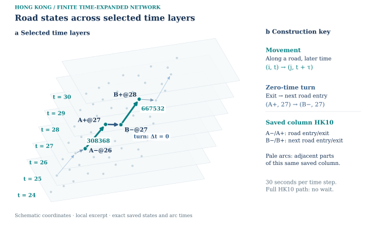</a></td><td width="50%" valign="top" align="left"><a href="https://scholarhaozheng.github.io/mobility-network-lab/volumes/hong-kong.html#stage-14-space-time-network-and-columns--g-f085">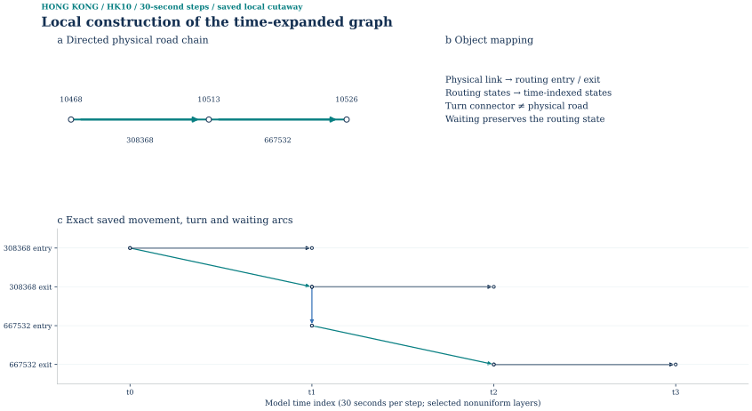</a></td></tr>
<tr><td width="50%" valign="top" align="left">
Selected HK10 layers show road-entry and road-exit states joined by movement arcs and a zero-time turn. Each time step is 30 seconds. The full saved column contains no waiting arc; this figure shows only its local excerpt.

<strong>Selected time layers</strong> 

Approved HK10 excerpt across selected layers.

<a href="https://scholarhaozheng.github.io/mobility-network-lab/volumes/hong-kong.html#src-docs-cases-hong-kong-space-time-document-from-the-physical-network-to-the-finite-time-expanded-graph">Evidence</a> · <a href="https://scholarhaozheng.github.io/mobility-network-lab/assets/atlas/construction/r07-hong-kong-layered-construction.svg">Full figure</a>

</td><td width="50%" valign="top" align="left">
A saved local chain illustrates how original physical links 308368 and 667532 become entry/exit routing states and then finite time-indexed arcs. Every drawn arrow comes from the published construction-edge table; axes in the cutaway are schematic, with selected nonuniform time layers. The accepted HK10 graph has fixed costs and hard capacities; terminal sink time is bookkeeping. The full model-generated 77-arc column appears separately in G-F087.

<strong>Physical network to finite graph</strong> 

Turn-aware bounded 10-OD graph cutaway.

<a href="https://scholarhaozheng.github.io/mobility-network-lab/volumes/hong-kong.html#src-docs-cases-hong-kong-space-time-document-from-the-physical-network-to-the-finite-time-expanded-graph">Evidence</a> · <a href="https://scholarhaozheng.github.io/mobility-network-lab/assets/atlas/figures/g-f085.svg">Full figure</a>

<strong>Local path / cutaway</strong> 

Local HK10 display cutaway; see the full exported CG column in the <a href="https://scholarhaozheng.github.io/mobility-network-lab/assets/atlas/figures/g-f087.svg">approved 77-arc column figure</a>.

<a href="https://scholarhaozheng.github.io/mobility-network-lab/volumes/hong-kong.html#src-docs-cases-hong-kong-space-time-document-a-generated-column-as-a-time-indexed-path">Evidence</a> · <a href="https://scholarhaozheng.github.io/mobility-network-lab/volumes/hong-kong.html#coverage-row-14">Evidence table</a>

</td></tr>
<tr><td width="50%" valign="top" align="left">
<a href="https://scholarhaozheng.github.io/mobility-network-lab/volumes/hong-kong.html#stage-14-layered-construction--r07-hong-kong-layered-construction">Complete evidence</a> · <a href="https://scholarhaozheng.github.io/mobility-network-lab/assets/atlas/construction/r07-hong-kong-layered-construction.svg">Full figure</a>

Source records
<ul><li><a href="https://github.com/scholarhaozheng/mobility-network-lab/blob/6ce18b8bea5bf3b9b7caa6ee4c0ff4e701a34a8b/docs/assets/cg_layered_companions_r1/DISPLAY_INPUTS.json" title="docs/assets/cg_layered_companions_r1/DISPLAY_INPUTS.json">DISPLAY_INPUTS.json</a></li><li><a href="https://github.com/scholarhaozheng/mobility-network-lab/blob/6ce18b8bea5bf3b9b7caa6ee4c0ff4e701a34a8b/docs/assets/cg_layered_companions_r1/hong_kong_display_edges.csv" title="docs/assets/cg_layered_companions_r1/hong_kong_display_edges.csv">hong_kong_display_edges.csv</a></li><li><a href="https://github.com/scholarhaozheng/mobility-network-lab/blob/6ce18b8bea5bf3b9b7caa6ee4c0ff4e701a34a8b/docs/assets/cg_layered_companions_r1/hong_kong_display_states.csv" title="docs/assets/cg_layered_companions_r1/hong_kong_display_states.csv">hong_kong_display_states.csv</a></li><li><a href="https://github.com/scholarhaozheng/mobility-network-lab/blob/6ce18b8bea5bf3b9b7caa6ee4c0ff4e701a34a8b/docs/assets/cg_layered_companions_r1/hong_kong_layered_space_time_construction.source.json" title="docs/assets/cg_layered_companions_r1/hong_kong_layered_space_time_construction.source.json">hong_kong_layered_space_time_construction.source.json</a></li></ul>
</td><td width="50%" valign="top" align="left">
<a href="https://scholarhaozheng.github.io/mobility-network-lab/volumes/hong-kong.html#stage-14-space-time-network-and-columns--g-f085">Complete evidence</a> · <a href="https://scholarhaozheng.github.io/mobility-network-lab/assets/atlas/figures/g-f085.svg">Full figure</a>

Source records
<ul><li><a href="https://github.com/scholarhaozheng/mobility-network-lab/blob/6ce18b8bea5bf3b9b7caa6ee4c0ff4e701a34a8b/docs/assets/three_city_r2/data/hong_kong_construction_edges.csv" title="docs/assets/three_city_r2/data/hong_kong_construction_edges.csv">hong_kong_construction_edges.csv</a></li><li><a href="https://github.com/scholarhaozheng/mobility-network-lab/blob/6ce18b8bea5bf3b9b7caa6ee4c0ff4e701a34a8b/docs/assets/three_city_r2/data/hong_kong_physical_to_routing_crosswalk.csv" title="docs/assets/three_city_r2/data/hong_kong_physical_to_routing_crosswalk.csv">hong_kong_physical_to_routing_crosswalk.csv</a></li><li><a href="https://github.com/scholarhaozheng/mobility-network-lab/blob/6ce18b8bea5bf3b9b7caa6ee4c0ff4e701a34a8b/docs/assets/three_city_r1/data/hong_kong_selected_generated_column.csv" title="docs/assets/three_city_r1/data/hong_kong_selected_generated_column.csv">hong_kong_selected_generated_column.csv</a></li></ul>

<a href="https://scholarhaozheng.github.io/mobility-network-lab/reproduce.html?figure=G-F085">Data &amp; preparation</a>
</td></tr>
</table>

#### Optimization on the time-expanded network

<strong>Bounded case overview</strong>

CG · R5 10-OD

<a href="https://scholarhaozheng.github.io/mobility-network-lab/volumes/hong-kong.html#src-docs-cases-hong-kong-space-time-document-case-role-scope-and-model-statistics">Evidence</a> · <a href="https://scholarhaozheng.github.io/mobility-network-lab/volumes/hong-kong.html#coverage-row-16">Evidence table</a>

##### Two-phase column generation

R5 · 10 ODs

Phase I feasibility, final physical-link flow and independent complete-path pricing closure on the frozen ten-OD graph. Phase II and the same-graph arc-flow LP benchmark are documented below.

<strong>Arc-flow LP reference</strong> 

Own-graph LP reference for R5 ten-OD finite case.

<a href="https://scholarhaozheng.github.io/mobility-network-lab/volumes/hong-kong.html#src-docs-cases-hong-kong-space-time-document-reference-objective-agreement">Evidence</a> · <a href="https://scholarhaozheng.github.io/mobility-network-lab/volumes/hong-kong.html#coverage-row-16">Evidence table</a>

<strong>Phase II objective</strong> 

CG Phase II · R5 10-OD

<a href="https://scholarhaozheng.github.io/mobility-network-lab/volumes/hong-kong.html#src-docs-cases-hong-kong-space-time-document-phase-ii-improves-the-real-path-objective">Evidence</a> · <a href="https://scholarhaozheng.github.io/mobility-network-lab/volumes/hong-kong.html#coverage-row-16">Evidence table</a>

<table width="100%">
<tr><th width="33%" valign="top" align="left"><strong>Phase I: artificial-flow clearance</strong></th><th width="33%" valign="top" align="left"><strong>Final physical-link movement flow</strong></th><th width="33%" valign="top" align="left"><strong>Independent pricing closure</strong></th></tr>
<tr><td width="33%" valign="top" align="left"><a href="https://scholarhaozheng.github.io/mobility-network-lab/volumes/hong-kong.html#stage-16-two-phase-column-generation--c-hk-cg-phase1">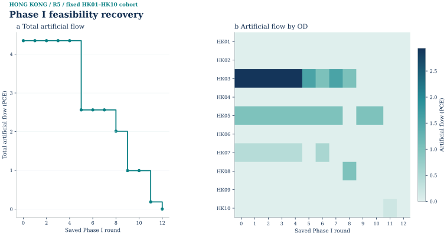</a></td><td width="33%" valign="top" align="left"><a href="https://scholarhaozheng.github.io/mobility-network-lab/volumes/hong-kong.html#stage-16-two-phase-column-generation--g-f092">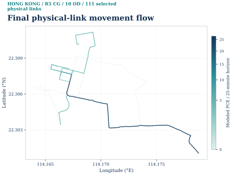</a></td><td width="33%" valign="top" align="left"><a href="https://scholarhaozheng.github.io/mobility-network-lab/volumes/hong-kong.html#stage-16-two-phase-column-generation--g-f093">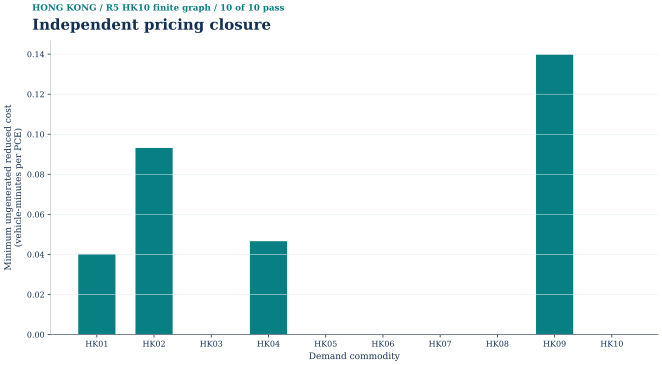</a></td></tr>
<tr><td width="33%" valign="top" align="left">
Hong Kong R5 Phase I on the fixed ten-OD finite graph. The left curve sums all ten commodity artificial flows; the right heatmap preserves every saved round and the HK01–HK10 identities. Zero artificial flow certifies feasibility of the restricted master at this stage, separately from Phase II objective and independent pricing closure. Curves are unsmoothed saved records.

<strong>Two-phase column generation</strong> 

Phase I/II, same-graph LP agreement and independent 10/10 closure.

<a href="https://scholarhaozheng.github.io/mobility-network-lab/volumes/hong-kong.html#src-docs-cases-hong-kong-space-time-document-phase-i-restores-feasibility">Evidence</a> · <a href="https://scholarhaozheng.github.io/mobility-network-lab/assets/atlas/figures/c-hk-cg-phase1.svg">Full figure</a>

<strong>Phase I artificial flow</strong> 

CG Phase I · R5 10-OD

<a href="https://scholarhaozheng.github.io/mobility-network-lab/volumes/hong-kong.html#src-docs-cases-hong-kong-space-time-document-phase-i-restores-feasibility">Evidence</a> · <a href="https://scholarhaozheng.github.io/mobility-network-lab/assets/atlas/figures/c-hk-cg-phase1.svg">Full figure</a>

</td><td width="33%" valign="top" align="left">
Final R5 ten-OD CG movement-arc flow aggregated by persistent physical-link ID. There are 69 positive-flow links among 111 selected physical links; nonphysical turn, zone, source and sink connectors are excluded. PCE is accumulated over the finite 30-second × 50-step horizon. This HK10 result is distinct from the four-OD ADMM R3 cohort with 58 positive-support links.

<strong>Final physical-link movement flow</strong> 

CG flow · R5 10-OD

<a href="https://scholarhaozheng.github.io/mobility-network-lab/volumes/hong-kong.html#src-docs-cases-hong-kong-space-time-document-from-time-expanded-flows-back-to-final-physical-link-movement-flow">Evidence</a> · <a href="https://scholarhaozheng.github.io/mobility-network-lab/assets/atlas/figures/g-f092.svg">Full figure</a>

</td><td width="33%" valign="top" align="left">
Independent complete-path pricing closure passes all ten commodities on the frozen R5 finite graph, at the recorded 1e-6 reduced-cost tolerance. Bars show the minimum reduced cost of an ungenerated path; exhausted path sets, if present, are labeled. The certificate applies to the bounded HK10 finite graph.

<strong>Independent 10/10 pricing closure</strong> 

CG pricing · R5 10-OD

<a href="https://scholarhaozheng.github.io/mobility-network-lab/volumes/hong-kong.html#src-docs-cases-hong-kong-space-time-document-independent-pricing-closure">Evidence</a> · <a href="https://scholarhaozheng.github.io/mobility-network-lab/assets/atlas/figures/g-f093.svg">Full figure</a>

</td></tr>
<tr><td width="33%" valign="top" align="left">
<a href="https://scholarhaozheng.github.io/mobility-network-lab/volumes/hong-kong.html#stage-16-two-phase-column-generation--c-hk-cg-phase1">Complete evidence</a> · <a href="https://scholarhaozheng.github.io/mobility-network-lab/assets/atlas/figures/c-hk-cg-phase1.svg">Full figure</a>

Source records
<ul><li><a href="https://github.com/scholarhaozheng/mobility-network-lab/blob/6ce18b8bea5bf3b9b7caa6ee4c0ff4e701a34a8b/docs/assets/hong_kong/full_stack_r5/cg_run/full_cg_v1_phase_i_artificial_flow_trace.csv" title="docs/assets/hong_kong/full_stack_r5/cg_run/full_cg_v1_phase_i_artificial_flow_trace.csv">full_cg_v1_phase_i_artificial_flow_trace.csv</a></li></ul>

<a href="https://scholarhaozheng.github.io/mobility-network-lab/reproduce.html?figure=C-HK-CG-PHASE1">Data &amp; reproduction</a>
</td><td width="33%" valign="top" align="left">
<a href="https://scholarhaozheng.github.io/mobility-network-lab/volumes/hong-kong.html#stage-16-two-phase-column-generation--g-f092">Complete evidence</a> · <a href="https://scholarhaozheng.github.io/mobility-network-lab/assets/atlas/figures/g-f092.svg">Full figure</a>

Source records
<ul><li><a href="https://github.com/scholarhaozheng/mobility-network-lab/blob/6ce18b8bea5bf3b9b7caa6ee4c0ff4e701a34a8b/docs/assets/hong_kong/full_stack_r5/cg_run/solver_free_physical_link_flows.csv" title="docs/assets/hong_kong/full_stack_r5/cg_run/solver_free_physical_link_flows.csv">solver_free_physical_link_flows.csv</a></li><li><a href="https://github.com/scholarhaozheng/mobility-network-lab/blob/6ce18b8bea5bf3b9b7caa6ee4c0ff4e701a34a8b/docs/assets/hong_kong/full_stack_r5/case/selected_physical_links.csv" title="docs/assets/hong_kong/full_stack_r5/case/selected_physical_links.csv">selected_physical_links.csv</a></li></ul>

<a href="https://scholarhaozheng.github.io/mobility-network-lab/reproduce.html?figure=G-F092">Data &amp; reproduction</a>
</td><td width="33%" valign="top" align="left">
<a href="https://scholarhaozheng.github.io/mobility-network-lab/volumes/hong-kong.html#stage-16-two-phase-column-generation--g-f093">Complete evidence</a> · <a href="https://scholarhaozheng.github.io/mobility-network-lab/assets/atlas/figures/g-f093.svg">Full figure</a>

Source records
<ul><li><a href="https://github.com/scholarhaozheng/mobility-network-lab/blob/6ce18b8bea5bf3b9b7caa6ee4c0ff4e701a34a8b/docs/assets/hong_kong/full_stack_r5/closure/INDEPENDENT_PRICING_CLOSURE_BY_DEMAND.csv" title="docs/assets/hong_kong/full_stack_r5/closure/INDEPENDENT_PRICING_CLOSURE_BY_DEMAND.csv">INDEPENDENT_PRICING_CLOSURE_BY_DEMAND.csv</a></li><li><a href="https://github.com/scholarhaozheng/mobility-network-lab/blob/6ce18b8bea5bf3b9b7caa6ee4c0ff4e701a34a8b/docs/assets/hong_kong/full_stack_r5/closure/INDEPENDENT_PRICING_CLOSURE_CERTIFICATE.json" title="docs/assets/hong_kong/full_stack_r5/closure/INDEPENDENT_PRICING_CLOSURE_CERTIFICATE.json">INDEPENDENT_PRICING_CLOSURE_CERTIFICATE.json</a></li></ul>

<a href="https://scholarhaozheng.github.io/mobility-network-lab/reproduce.html?figure=G-F093">Data &amp; reproduction</a>
</td></tr>
</table>

##### Lagrangian

R3 continuation · 10 ODs

Saved bounds, capacity-price structure and separate feasible-primal LP recovery. The final independently checked gap is 0.7444%; the arc-flow LP is the same-graph benchmark.

<strong>Lagrangian</strong> 

Ten-OD feasible recovery with 0.7444% certified gap.

<a href="https://scholarhaozheng.github.io/mobility-network-lab/volumes/hong-kong.html#src-docs-cases-hong-kong-space-time-document">Evidence</a> · <a href="https://scholarhaozheng.github.io/mobility-network-lab/volumes/hong-kong.html#coverage-row-17">Evidence table</a>

<strong>Lagrangian certified gap</strong> 

bounded accepted 0.7444%

<a href="https://scholarhaozheng.github.io/mobility-network-lab/volumes/hong-kong.html#src-docs-cases-hong-kong-space-time-document-reference-objective-agreement">Evidence</a> · <a href="https://scholarhaozheng.github.io/mobility-network-lab/volumes/hong-kong.html#coverage-row-17">Evidence table</a>

<table width="100%">
<tr><th width="33%" valign="top" align="left"><strong>Lagrangian bounds and certified gap</strong></th><th width="33%" valign="top" align="left"><strong>Capacity prices at the best dual bound</strong></th><th width="33%" valign="top" align="left"><strong>Path-pool growth and primal recovery</strong></th></tr>
<tr><td width="33%" valign="top" align="left"><a href="https://scholarhaozheng.github.io/mobility-network-lab/volumes/hong-kong.html#stage-17-lagrangian--c-hk-lagrangian-bounds">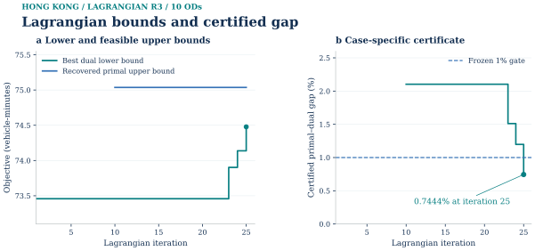</a></td><td width="33%" valign="top" align="left"><a href="https://scholarhaozheng.github.io/mobility-network-lab/volumes/hong-kong.html#stage-17-lagrangian--c-hk-lagrangian-prices">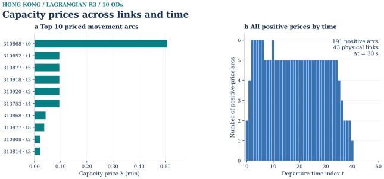</a></td><td width="33%" valign="top" align="left"><a href="https://scholarhaozheng.github.io/mobility-network-lab/volumes/hong-kong.html#stage-17-lagrangian--c-hk-lagrangian-recovery">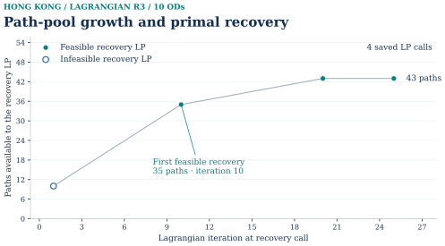</a></td></tr>
<tr><td width="33%" valign="top" align="left">
Saved Hong Kong R3_CONTINUATION Lagrangian run on the R2–R4 ten-OD finite graph (30-second steps, 50-step horizon). The best dual bound increases from 73.45803626621 to 74.47774508486 vehicle-minutes; separate restricted-path recovery first supplies the feasible 75.03632985795 upper bound at iteration 10. The final certified gap is 0.744419%, passing the frozen 1% gate at iteration 25. Missing pre-recovery primal/gap entries remain unplotted. These saved best-bound traces belong to the ten-OD R3 continuation. The four-OD ADMM R3 case is separate. The independent evaluator made zero optimizer calls.
</td><td width="33%" valign="top" align="left">
Saved Hong Kong R3_CONTINUATION best-bound multipliers on the finite 10-OD graph: 191 of 24,910 arcs have strictly positive capacity price, spanning 43 physical links. Panel a shows the ten largest saved movement-arc prices, identified by physical link and departure index; ties use link/time order. Panel b counts every positive-price arc by departure index (one step = 30 seconds), including the unshown smaller prices. Capacity prices have units of minutes per additional unit of vehicle capacity. They represent dual penalties; an LP-optimal multiplier certificate remains unavailable. The final certified gap passes the 1% gate.
</td><td width="33%" valign="top" align="left">
Saved Hong Kong R3_CONTINUATION restricted-path LP recovery calls: 4 calls grow the available pool from 10 to 43 paths. The first recorded feasible call is at iteration 10 with 35 paths; the 1 earlier infeasible call(s) have no objective value and are shown as open markers, never as zero-cost solutions. The best feasible objective is 75.03632985795 vehicle-minutes, compared with the saved same-graph arc-flow LP reference 75.03632985795. Lines connect saved call checkpoints; no unsaved recovery states are inferred. The final 0.7444% duality gap passes its 1% gate.
</td></tr>
<tr><td width="33%" valign="top" align="left">
<a href="https://scholarhaozheng.github.io/mobility-network-lab/volumes/hong-kong.html#stage-17-lagrangian--c-hk-lagrangian-bounds">Complete evidence</a> · <a href="https://scholarhaozheng.github.io/mobility-network-lab/assets/atlas/figures/c-hk-lagrangian-bounds.svg">Full figure</a>

<a href="https://scholarhaozheng.github.io/mobility-network-lab/reproduce.html?figure=C-HK-LAGRANGIAN-BOUNDS">Data &amp; reproduction</a>
</td><td width="33%" valign="top" align="left">
<a href="https://scholarhaozheng.github.io/mobility-network-lab/volumes/hong-kong.html#stage-17-lagrangian--c-hk-lagrangian-prices">Complete evidence</a> · <a href="https://scholarhaozheng.github.io/mobility-network-lab/assets/atlas/figures/c-hk-lagrangian-prices.svg">Full figure</a>

<a href="https://scholarhaozheng.github.io/mobility-network-lab/reproduce.html?figure=C-HK-LAGRANGIAN-PRICES">Data &amp; reproduction</a>
</td><td width="33%" valign="top" align="left">
<a href="https://scholarhaozheng.github.io/mobility-network-lab/volumes/hong-kong.html#stage-17-lagrangian--c-hk-lagrangian-recovery">Complete evidence</a> · <a href="https://scholarhaozheng.github.io/mobility-network-lab/assets/atlas/figures/c-hk-lagrangian-recovery.svg">Full figure</a>

<a href="https://scholarhaozheng.github.io/mobility-network-lab/reproduce.html?figure=C-HK-LAGRANGIAN-RECOVERY">Data &amp; reproduction</a>
</td></tr>
</table>

##### ADMM

R3 · 4 ODs

Convergence with objective error against the same-graph LP, commodity conservation, and physical-link flow compared with LP. This accepted four-OD experiment is separate from the historical gated ten-OD ADMM trial.

<table width="100%">
<tr><th width="33%" valign="top" align="left"><strong>ADMM convergence and feasibility</strong></th><th width="33%" valign="top" align="left"><strong>Commodity conservation at the final state</strong></th><th width="33%" valign="top" align="left"><strong>ADMM and arc-flow LP: physical-link flow</strong></th></tr>
<tr><td width="33%" valign="top" align="left"><a href="https://scholarhaozheng.github.io/mobility-network-lab/volumes/hong-kong.html#stage-18-admm--g-f097">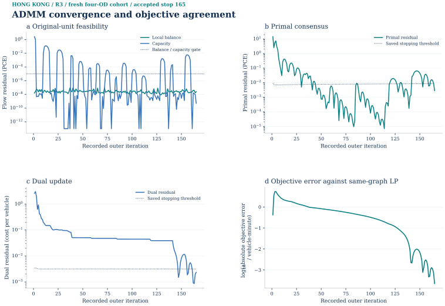</a></td><td width="33%" valign="top" align="left"><a href="https://scholarhaozheng.github.io/mobility-network-lab/volumes/hong-kong.html#stage-18-admm--g-f101">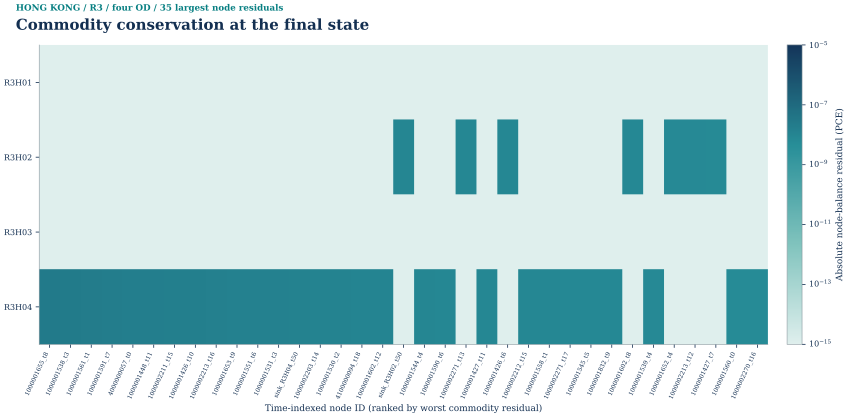</a></td><td width="33%" valign="top" align="left"><a href="https://scholarhaozheng.github.io/mobility-network-lab/volumes/hong-kong.html#stage-18-admm--c-hk-admm-flows">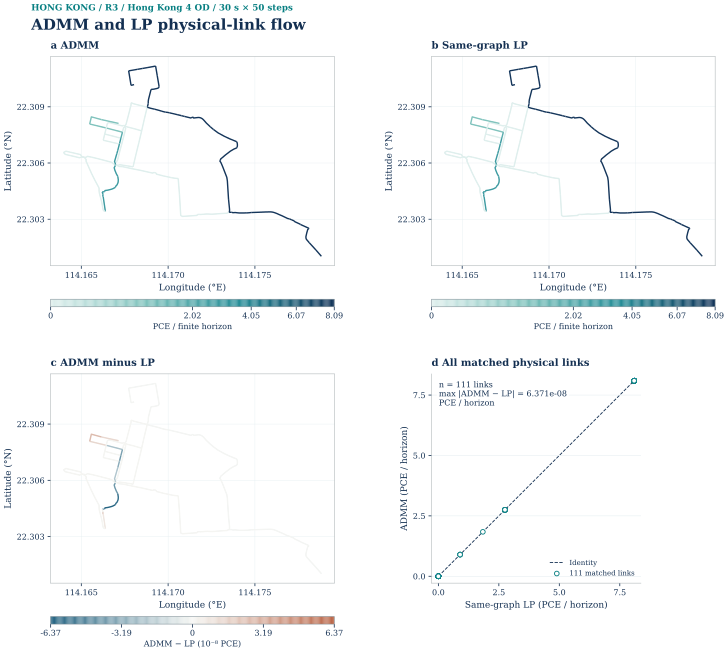</a></td></tr>
<tr><td width="33%" valign="top" align="left">
Accepted fresh four-OD ADMM R3 history through iteration 165. Panels a–c separate original-unit balance/capacity, primal consensus and dual update residuals. Balance, capacity and primal residuals are in PCE; the frozen dual residual is rho times the norm of the consensus update and has cost-per-vehicle units. Balance and capacity use the 1e-5 PCE gates; primal and dual show their saved absolute/relative stopping thresholds. Residuals use an explicit 1e-13 plotting floor in the respective units. Panel d retains every saved objective-error point against the independent arc-flow LP on the exact same graph: the ordinate is log10 of absolute objective difference relative to one vehicle-minute, with a 1e-15 vehicle-minute display floor. No smoothing or rho-history plot is used. Objective agreement does not imply identical physical-link flow. This accepted HK4 R3 cohort is distinct from the failed historical HK10 R2 gate test.

<strong>ADMM</strong> 

Fresh preregistered 4-OD holdout · 165 iterations · LP-relative difference 6.83×10⁻⁶

<a href="https://scholarhaozheng.github.io/mobility-network-lab/volumes/hong-kong.html#src-docs-cases-hong-kong-space-time-document-admm-r3-bounded-four-od-transfer">Evidence</a> · <a href="https://scholarhaozheng.github.io/mobility-network-lab/volumes/hong-kong.html#coverage-row-18">Evidence table</a>

<strong>ADMM R3 convergence</strong> 

accepted fresh 4-OD · 165 iterations; separate from gated 10-OD R2

<a href="https://scholarhaozheng.github.io/mobility-network-lab/volumes/hong-kong.html#src-docs-cases-hong-kong-space-time-document-admm-r3-bounded-four-od-transfer">Evidence</a> · <a href="https://scholarhaozheng.github.io/mobility-network-lab/assets/atlas/figures/g-f097.svg">Full figure</a>

</td><td width="33%" valign="top" align="left">
Final saved commodity-by-node absolute conservation residual, computed as outgoing minus incoming flow minus supply. The 35 columns have the largest residual over any of the four commodities. Log color limits run from 1e-15 to the inherited 1e-5 PCE gate; exact zeros use the lower plotting floor. Maximum residual is 2.5008e-08 PCE. Diagnostics replay a saved state with no optimizer call.
</td><td width="33%" valign="top" align="left">
Movement-only physical-link flow over the same 30-second × 50-step four-OD horizon. The first two maps share an absolute PCE color scale; the third uses a zero-centered symmetric signed ADMM-minus-LP scale. Both have the same 58-link positive support; flow values need not be identical. This figure uses the four-OD ADMM R3 result. Square-root normalization applies only to absolute maps. Panel d plots every one of the 111 matched physical-link rows against the identity line, including zero-flow rows. Its linear x/y axes use the same range, and the maximum absolute saved difference is 6.37118593438e-08 PCE / horizon; no difference is rounded to zero.

<strong>ADMM R3 physical flow vs LP</strong> 

accepted fresh 4-OD · 58 positive physical links

<a href="https://scholarhaozheng.github.io/mobility-network-lab/volumes/hong-kong.html#src-docs-cases-hong-kong-space-time-document-admm-r3-bounded-four-od-transfer">Evidence</a> · <a href="https://scholarhaozheng.github.io/mobility-network-lab/assets/atlas/card-layout/c-hk-admm-flows.svg">Full figure</a>

</td></tr>
<tr><td width="33%" valign="top" align="left">
<a href="https://scholarhaozheng.github.io/mobility-network-lab/volumes/hong-kong.html#stage-18-admm--g-f097">Complete evidence</a> · <a href="https://scholarhaozheng.github.io/mobility-network-lab/assets/atlas/figures/g-f097.svg">Full figure</a>

<a href="https://scholarhaozheng.github.io/mobility-network-lab/reproduce.html?figure=G-F097">Data &amp; reproduction</a>
</td><td width="33%" valign="top" align="left">
<a href="https://scholarhaozheng.github.io/mobility-network-lab/volumes/hong-kong.html#stage-18-admm--g-f101">Complete evidence</a> · <a href="https://scholarhaozheng.github.io/mobility-network-lab/assets/atlas/figures/g-f101.svg">Full figure</a>

<a href="https://scholarhaozheng.github.io/mobility-network-lab/reproduce.html?figure=G-F101">Data &amp; reproduction</a>
</td><td width="33%" valign="top" align="left">
<a href="https://scholarhaozheng.github.io/mobility-network-lab/volumes/hong-kong.html#stage-18-admm--c-hk-admm-flows">Complete evidence</a> · <a href="https://scholarhaozheng.github.io/mobility-network-lab/assets/atlas/card-layout/c-hk-admm-flows.svg">Full figure</a>

<a href="https://scholarhaozheng.github.io/mobility-network-lab/reproduce.html?figure=C-HK-ADMM-FLOWS">Data &amp; reproduction</a>
</td></tr>
</table>

### Ann Arbor

The timetable-sensitive transit-choice scenario produced 600 positive vehicle OD pairs (1,569.500896674 PCE/h) and one actual Frank–Wolfe update on the unchanged road graph. The independent final full-graph gap is 5.078039901982526e−15 against the 1e−5 gate. Existing S0 scientific intake applies to this saved result. Original R2, old S600 and independent S72 remain distinct; Native600 and T1/T4 remain incomplete. Historical engineering scenario, service date 2026-10-05, 08:00–09:00; not a current journey planner or observed policy effect. The field chain is person OD → timetable-sensitive mode choice → drive persons / 1.2 persons per vehicle → PCE demand → original-road assignment.

The earlier frozen S600 comparison contains one FW update, one sparse fixed-path FW update and one reported Algorithm B iteration (50 shifts). This is distinct from the original R2 initial check and the separate S72 initial-state acceptance. Native S600 was not solved; finite T1/T4 remain unsolved. [Latest accepted evidence →](https://scholarhaozheng.github.io/mobility-network-lab/volumes/ann-arbor.html#gap-20261008)

<table width="100%"><thead><tr><th valign="top" width="25%">City/model foundation</th><th valign="top" width="25%">Static assignment</th><th valign="top" width="25%">Finite time-expanded</th><th valign="top" width="25%">Observation/data scope</th></tr></thead>
<tbody><tr><td valign="top" width="25%">Accepted four-stage graph: 5,138 physical road arcs within 14,203 total arcs, and 25 in-zone road access points.</td><td valign="top" width="25%">Frozen S600: FW and sparse finite-path FW each use one update; Algorithm B uses one reported iteration. Separate S72 Native passes its initial gates; S600 Native was not run.</td><td valign="top" width="25%">T1/T4 remain unsolved. S72 static initial-state acceptance is not a finite time-expanded result.</td><td valign="top" width="25%">Exact GPS remains withheld. The licensed State Street photograph is dated 17 August 2013 and supplies city context only, not modeled-demand or traffic evidence.</td></tr></tbody></table>

Local reading edition · saved-result figures aligned with Boston and Hong Kong · [Figure guide and saved-state interpretation](https://scholarhaozheng.github.io/mobility-network-lab/figure-update-status.html#top)

[Sources and GMNS](#ann-arbor-sources) · [Population, households and activity](#ann-arbor-population) · [Transit and observations](#ann-arbor-transit) · [Trip generation](#ann-arbor-generation) · [Trip distribution](#ann-arbor-distribution) · [Mode choice](#ann-arbor-mode) · [Static assignment methods](#ann-arbor-static) · [Time-expanded network and path examples](#ann-arbor-representation) · [Optimization on the time-expanded network](#ann-arbor-finite)

#### Sources and GMNS

The accepted central Ann Arbor circle uses 25 final zones and a tagged OSM turn-expanded graph. The 5,138 physical traversal arcs must not be confused with 14,203 total graph arcs or the earlier centerline preflight.

<table width="100%">
<tr><th width="100%" valign="top" align="left"><strong>Model zones, physical roads and access</strong></th></tr>
<tr><td width="100%" valign="top" align="left"></td></tr>
<tr><td width="100%" valign="top" align="left">
The accepted 25-zone circle and 5,138 directed OSM physical traversal arcs, with 25 in-zone road-entry points. The full turn-expanded graph has 14,203 arcs; turn arcs are not additional roads. EPSG:26917 coordinates are displayed relative to the study-area center in km. This is the accepted four-stage graph, not the earlier 4,059-link centerline preflight. © OpenStreetMap contributors, ODbL 1.0. Local reading revision.
</td></tr>
<tr><td width="100%" valign="top" align="left">
<a href="https://scholarhaozheng.github.io/mobility-network-lab/volumes/ann-arbor.html#ann-r3-sources">Complete evidence</a> · <a href="https://scholarhaozheng.github.io/mobility-network-lab/assets/city-alignment-r3/ann-arbor/aa-s01.svg">Full figure</a>

Source records
<ul><li><a href="https://scholarhaozheng.github.io/mobility-network-lab/assets/city-alignment-r3/ann-arbor/aa-s01.png">PNG</a></li><li><a href="https://scholarhaozheng.github.io/mobility-network-lab/assets/city-alignment-r3/ann-arbor/aa-s01.pdf">PDF</a></li><li><a href="https://scholarhaozheng.github.io/mobility-network-lab/assets/city-alignment-r3/ann-arbor/aa-s01.source.json">Source</a></li><li><a href="https://scholarhaozheng.github.io/mobility-network-lab/assets/city-alignment-r3/ann-arbor/aa-s01.plot_data.json">Plot data</a></li></ul>
</td></tr>
</table>

#### Population, households and activity

ACS 2020–2024 residents and households and 2021 LODES jobs are area allocated to the same 25 zones. These are source estimates with different vintages, not a campus-only population or observed 2026 census.

<table width="100%">
<tr><th width="100%" valign="top" align="left"><strong>Population, households and workplace jobs</strong></th></tr>
<tr><td width="100%" valign="top" align="left"><a href="https://scholarhaozheng.github.io/mobility-network-lab/volumes/ann-arbor.html#ann-r3-population">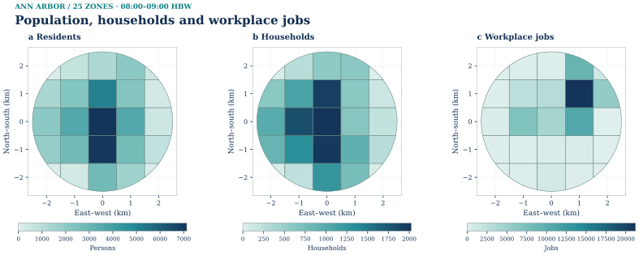</a></td></tr>
<tr><td width="100%" valign="top" align="left">
Area-allocated source estimates across all 25 final model zones: ACS 2020–2024 population and households, and 2021 Michigan LODES workplace jobs. Each panel has its own linear color scale and unit. Job weights are normalized to internal productions downstream; they are not independently counted trips. Source statistics are not a campus population or a 2026 census. U.S. Census Bureau, ACS and LEHD/LODES. Local reading revision.
</td></tr>
<tr><td width="100%" valign="top" align="left">
<a href="https://scholarhaozheng.github.io/mobility-network-lab/volumes/ann-arbor.html#ann-r3-population">Complete evidence</a> · <a href="https://scholarhaozheng.github.io/mobility-network-lab/assets/city-alignment-r3/ann-arbor/aa-p01.svg">Full figure</a>

Source records
<ul><li><a href="https://scholarhaozheng.github.io/mobility-network-lab/assets/city-alignment-r3/ann-arbor/aa-p01.png">PNG</a></li><li><a href="https://scholarhaozheng.github.io/mobility-network-lab/assets/city-alignment-r3/ann-arbor/aa-p01.pdf">PDF</a></li><li><a href="https://scholarhaozheng.github.io/mobility-network-lab/assets/city-alignment-r3/ann-arbor/aa-p01.source.json">Source</a></li><li><a href="https://scholarhaozheng.github.io/mobility-network-lab/assets/city-alignment-r3/ann-arbor/aa-p01.plot_data.json">Plot data</a></li></ul>
</td></tr>
</table>

#### Transit and observations

The accepted mode inputs use U-M scheduled service for 5 October 2026 and tagged walking costs. Planned stop locations and availability are distinct from GPS observations; TheRide is not included.

<table width="100%">
<tr><th width="100%" valign="top" align="left"><strong>Scheduled stops and modeled mode availability</strong></th></tr>
<tr><td width="100%" valign="top" align="left"><table width="100%"><tr><td valign="top" width="100%">
<a href="https://scholarhaozheng.github.io/mobility-network-lab/volumes/ann-arbor.html#ann-r3-transit">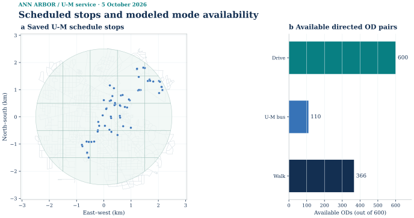</a>

Description, units and scope

Left: the 63 saved U-M GTFS stop locations used as input to the accepted mode-cost build, over the accepted 25-zone OSM physical network. Right: actual availability in 600 directed OD pairs—drive 600, U-M bus 110, walk 366. The modeled U-M service uses 109 scheduled route-stop legs and frequency-based waits; 11 zones are within the stop-access rule. Stop symbols are planned service locations, not observed GPS. No TheRide service, exact departure-time itinerary or verified pedestrian connector is implied. © OpenStreetMap contributors; University of Michigan GTFS. Local reading revision. R11 layout repair: both panels share the actual map top and bottom bounds; the stop count is stated here rather than overprinted on the map.

<a href="https://scholarhaozheng.github.io/mobility-network-lab/assets/figure-contract-r11/figures/ann-arbor/aa-t01.png">PNG</a> · <a href="https://scholarhaozheng.github.io/mobility-network-lab/assets/figure-contract-r11/figures/ann-arbor/aa-t01.svg">SVG</a> · <a href="https://scholarhaozheng.github.io/mobility-network-lab/assets/figure-contract-r11/figures/ann-arbor/aa-t01.pdf">PDF</a> · <a href="https://scholarhaozheng.github.io/mobility-network-lab/assets/figure-contract-r11/figures/ann-arbor/aa-t01.source.json">Source record</a>

</td></tr></table></td></tr>
<tr><td width="100%" valign="top" align="left"></td></tr>
<tr><td width="100%" valign="top" align="left">
<a href="https://scholarhaozheng.github.io/mobility-network-lab/volumes/ann-arbor.html#ann-r3-transit">Complete city record · same evidence</a>
</td></tr>
</table>

#### Trip generation

All 25 zones enter a documented HBW opportunity ledger. External and intrazonal components are reported separately; only 2,730.770943 internal interzonal persons advance.

<table width="100%">
<tr><th width="100%" valign="top" align="left"><strong>Internal demand margins and the generation ledger</strong></th></tr>
<tr><td width="100%" valign="top" align="left"><a href="https://scholarhaozheng.github.io/mobility-network-lab/volumes/ann-arbor.html#ann-r3-generation">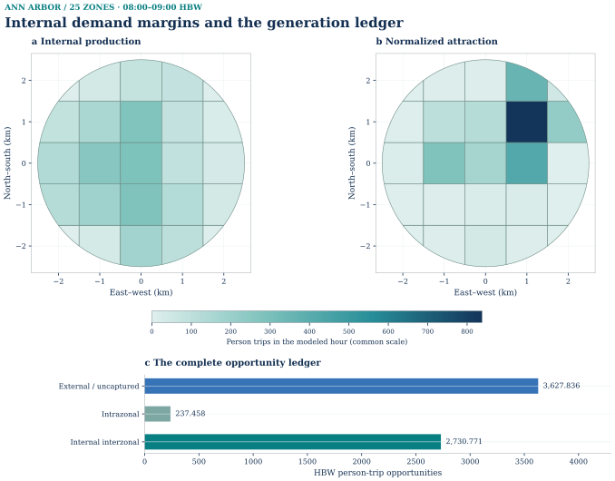</a></td></tr>
<tr><td width="100%" valign="top" align="left">
All 25 zones are shown. The two maps share a linear person-trip color scale and display the internal interzonal production and job-weighted attraction passed to distribution. The ledger partitions 6,596.065080 generated opportunities into 3,627.835794 external/uncaptured, 237.458343 intrazonal and 2,730.770943 internal interzonal persons. Only the final component proceeds to the OD model. The 1.90 HBW rate is transferred; hour/capture/intrazonal shares are engineering assumptions. ACS 2020–2024 and LODES 2021, U.S. Census Bureau. Local reading revision.
</td></tr>
<tr><td width="100%" valign="top" align="left">
<a href="https://scholarhaozheng.github.io/mobility-network-lab/volumes/ann-arbor.html#ann-r3-generation">Complete evidence</a> · <a href="https://scholarhaozheng.github.io/mobility-network-lab/assets/city-alignment-r3/ann-arbor/aa-g01.svg">Full figure</a>

Source records
<ul><li><a href="https://scholarhaozheng.github.io/mobility-network-lab/assets/city-alignment-r3/ann-arbor/aa-g01.png">PNG</a></li><li><a href="https://scholarhaozheng.github.io/mobility-network-lab/assets/city-alignment-r3/ann-arbor/aa-g01.pdf">PDF</a></li><li><a href="https://scholarhaozheng.github.io/mobility-network-lab/assets/city-alignment-r3/ann-arbor/aa-g01.source.json">Source</a></li><li><a href="https://scholarhaozheng.github.io/mobility-network-lab/assets/city-alignment-r3/ann-arbor/aa-g01.plot_data.json">Plot data</a></li></ul>
</td></tr>
</table>

#### Trip distribution

The full 600 directed interzonal OD pairs are retained, with a structural-zero diagonal. Gravity/IPF and the one-time 90% forward / 10% reverse convention define the modeled pattern.

<table width="100%">
<tr><th width="100%" valign="top" align="left"><strong>Complete directed OD demand and road impedance</strong></th></tr>
<tr><td width="100%" valign="top" align="left"><a href="https://scholarhaozheng.github.io/mobility-network-lab/volumes/ann-arbor.html#ann-r3-distribution">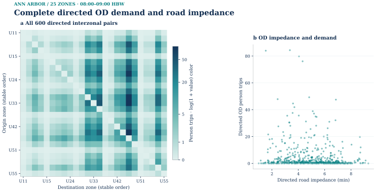</a></td></tr>
<tr><td width="100%" valign="top" align="left">
The complete 25 × 25 directed matrix contains 600 positive interzonal pairs and structural zeros on the intrazonal diagonal. Color is log(1 + person trips), with original-unit tick labels; no values are discarded. The scatter shows the same 600 saved OD demands against their actual directed road impedance, without a fitted trend. Doubly constrained gravity/IPF and the one-time 90% forward / 10% reverse convention determine these modeled demands. © OpenStreetMap contributors; U.S. Census Bureau ACS/LODES. Local reading revision, not an observed commuting matrix.
</td></tr>
<tr><td width="100%" valign="top" align="left">
<a href="https://scholarhaozheng.github.io/mobility-network-lab/volumes/ann-arbor.html#ann-r3-distribution">Complete evidence</a> · <a href="https://scholarhaozheng.github.io/mobility-network-lab/assets/city-alignment-r3/ann-arbor/aa-d01.svg">Full figure</a>

Source records
<ul><li><a href="https://scholarhaozheng.github.io/mobility-network-lab/assets/city-alignment-r3/ann-arbor/aa-d01.png">PNG</a></li><li><a href="https://scholarhaozheng.github.io/mobility-network-lab/assets/city-alignment-r3/ann-arbor/aa-d01.pdf">PDF</a></li><li><a href="https://scholarhaozheng.github.io/mobility-network-lab/assets/city-alignment-r3/ann-arbor/aa-d01.source.json">Source</a></li><li><a href="https://scholarhaozheng.github.io/mobility-network-lab/assets/city-alignment-r3/ann-arbor/aa-d01.plot_data.json">Plot data</a></li></ul>
</td></tr>
</table>

#### Mode choice

The original mode-choice figures below retain their R2 identity. The new timetable-based choice and road-assignment scenario has passed S0 scientific intake. Its new figures, detailed model data and long prose await confirmed public rights for University of Michigan timetable derivatives. [Figure guide and saved-state interpretation](https://scholarhaozheng.github.io/mobility-network-lab/figure-update-status.html#top) · [Current release details](https://scholarhaozheng.github.io/mobility-network-lab/volumes/ann-arbor.html#gap-20261008)

<strong>Earlier frozen record: </strong>
Three OD-specific modes retain all internal interzonal persons. Driving converts once using 1.2 persons per vehicle to 1,647.816622 PCE; bus and walk are not loaded as road vehicle demand.

<table width="100%">
<tr><th width="100%" valign="top" align="left"><strong>Mode choice over every directed OD pair</strong></th></tr>
<tr><td width="100%" valign="top" align="left"><a href="https://scholarhaozheng.github.io/mobility-network-lab/volumes/ann-arbor.html#ann-r3-mode">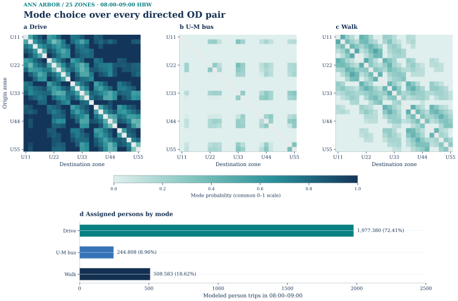</a></td></tr>
<tr><td width="100%" valign="top" align="left">
All 600 OD pairs enter OD-specific three-mode choice. The three heatmaps use a common 0–1 probability scale; gray intrazonal cells were not modeled, while zero probabilities include unavailable alternatives. The bar chart weights probabilities by each OD demand: drive 1,977.380 persons, U-M bus 244.808, walk 508.583. Only driving converts to road demand, once: persons ÷ 1.2 × 1.0 = 1,647.816622 PCE. These are saved engineering-scenario probabilities, not measured mode shares. U-M schedule-derived inputs; local reading revision, not a new public release.
</td></tr>
<tr><td width="100%" valign="top" align="left">
<a href="https://scholarhaozheng.github.io/mobility-network-lab/volumes/ann-arbor.html#ann-r3-mode">Complete evidence</a> · <a href="https://scholarhaozheng.github.io/mobility-network-lab/assets/city-alignment-r3/ann-arbor/aa-m01.svg">Full figure</a>

Source records
<ul><li><a href="https://scholarhaozheng.github.io/mobility-network-lab/assets/city-alignment-r3/ann-arbor/aa-m01.png">PNG</a></li><li><a href="https://scholarhaozheng.github.io/mobility-network-lab/assets/city-alignment-r3/ann-arbor/aa-m01.pdf">PDF</a></li><li><a href="https://scholarhaozheng.github.io/mobility-network-lab/assets/city-alignment-r3/ann-arbor/aa-m01.source.json">Source</a></li><li><a href="https://scholarhaozheng.github.io/mobility-network-lab/assets/city-alignment-r3/ann-arbor/aa-m01.plot_data.json">Plot data</a></li></ul>
</td></tr>
</table>

#### Static assignment methods

##### Static assignment inputs — vehicle-demand margins and physical access

<table width="100%">
<tr><th width="50%" valign="top" align="left"><strong>Static assignment demand margins</strong></th><th width="50%" valign="top" align="left"><strong>Physical demand endpoints</strong></th></tr>
<tr><td width="50%" valign="top" align="left"></td><td width="50%" valign="top" align="left"></td></tr>
<tr><td width="50%" valign="top" align="left">
New choice600: 600 positive source-zone OD pairs, 600 loaded solver-node OD pairs and 1569.500896674 PCE/hour. Origin and destination margins sum the selected assignment PCE by source zone, after the saved mode/occupancy conversion.

Description, units and scope

New choice600: 600 positive source-zone OD pairs, 600 loaded solver-node OD pairs and 1569.500896674 PCE/hour. Origin and destination margins sum the selected assignment PCE by source zone, after the saved mode/occupancy conversion. All source-zone polygons, including any zero selected demand, use a common square-root normalization with ticks in original PCE/hour. New choice600 is separate from old S600, S72 and the original R2 scenario. Drive-person demand has already been converted by saved occupancy and PCE factors; it is not converted again. Native600 and finite-time status are not changed. These are modeled assignment-input quantities, not population generation, observed traffic or assigned link flow. Both panels share one map extent; context roads outside this input footprint are clipped only for display.

</td><td width="50%" valign="top" align="left">
New choice600: 600 positive source-zone OD pairs, 600 loaded solver-node OD pairs and 1569.500896674 PCE/hour. Original access records locate 25 loaded physical origins and 25 loaded physical destinations.

Description, units and scope

New choice600: 600 positive source-zone OD pairs, 600 loaded solver-node OD pairs and 1569.500896674 PCE/hour. Original access records locate 25 loaded physical origins and 25 loaded physical destinations. Open circles show the frozen access system and filled colors show selected endpoint PCE/hour. The largest loaded endpoint in each panel is labelled by its physical source ID (or the saved M-state road-midpoint identifier). Each side sums to the same total; this aggregation is for display only. New choice600 is separate from old S600, S72 and the original R2 scenario. Drive-person demand has already been converted by saved occupancy and PCE factors; it is not converted again. Native600 and finite-time status are not changed. These are modeled assignment-input quantities, not population generation, observed traffic or assigned link flow. Both panels share one map extent; context roads outside this input footprint are clipped only for display.

</td></tr>
<tr><td width="50%" valign="top" align="left">
<a href="https://scholarhaozheng.github.io/mobility-network-lab/volumes/ann-arbor.html#figure-parity-ann-arbor-assignment-margins">Complete evidence · same figure</a> · <a href="https://scholarhaozheng.github.io/mobility-network-lab/assets/template-parity-20261008/static-inputs/ann-arbor/assignment-margins.svg">SVG</a> · <a href="https://scholarhaozheng.github.io/mobility-network-lab/assets/template-parity-20261008/static-inputs/ann-arbor/assignment-margins.png">PNG</a> · <a href="https://scholarhaozheng.github.io/mobility-network-lab/assets/template-parity-20261008/static-inputs/ann-arbor/assignment-margins.pdf">PDF</a> · <a href="https://scholarhaozheng.github.io/mobility-network-lab/assets/template-parity-20261008/static-inputs/ann-arbor/assignment-margins.plot.json">Plot data</a> · <a href="https://scholarhaozheng.github.io/mobility-network-lab/assets/template-parity-20261008/static-inputs/ann-arbor/assignment-margins.source.json">Source record</a> · <a href="https://scholarhaozheng.github.io/mobility-network-lab/assets/template-parity-20261008/static-inputs/ann-arbor/assignment-margins.caption.md">Caption</a>
</td><td width="50%" valign="top" align="left">
<a href="https://scholarhaozheng.github.io/mobility-network-lab/volumes/ann-arbor.html#figure-parity-ann-arbor-assignment-endpoints">Complete evidence · same figure</a> · <a href="https://scholarhaozheng.github.io/mobility-network-lab/assets/template-parity-20261008/static-inputs/ann-arbor/assignment-endpoints.svg">SVG</a> · <a href="https://scholarhaozheng.github.io/mobility-network-lab/assets/template-parity-20261008/static-inputs/ann-arbor/assignment-endpoints.png">PNG</a> · <a href="https://scholarhaozheng.github.io/mobility-network-lab/assets/template-parity-20261008/static-inputs/ann-arbor/assignment-endpoints.pdf">PDF</a> · <a href="https://scholarhaozheng.github.io/mobility-network-lab/assets/template-parity-20261008/static-inputs/ann-arbor/assignment-endpoints.plot.json">Plot data</a> · <a href="https://scholarhaozheng.github.io/mobility-network-lab/assets/template-parity-20261008/static-inputs/ann-arbor/assignment-endpoints.source.json">Source record</a> · <a href="https://scholarhaozheng.github.io/mobility-network-lab/assets/template-parity-20261008/static-inputs/ann-arbor/assignment-endpoints.caption.md">Caption</a>
</td></tr>
</table>

The new timetable-based choice produced 600 positive vehicle OD pairs totalling 1,569.500896674 PCE/h, and these values actually entered Frank–Wolfe on the unchanged original directed road graph. One actual update was saved. The provider checks passed, and S0 accepted the saved numerical result as S0_ACCEPTED_NEW_CHOICE_FW_SAVED_NUMERIC. The saved numerical figures and necessary model data are available with the current source notice.

##### New choice demand · one actual FW update

<table width="100%">
<tr><th width="50%" valign="top" align="left"><strong>New timetable demand and its physical road assignment</strong></th><th width="50%" valign="top" align="left"><strong>Frank–Wolfe: one actual update on the new choice demand</strong></th></tr>
<tr><td width="50%" valign="top" align="left"><a href="https://scholarhaozheng.github.io/mobility-network-lab/volumes/ann-arbor.html#figure-ann-choice-fw-network-v002">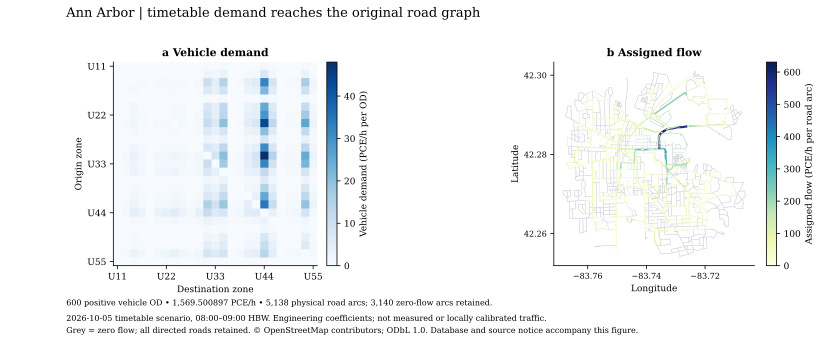</a></td><td width="50%" valign="top" align="left"><a href="https://scholarhaozheng.github.io/mobility-network-lab/volumes/ann-arbor.html#figure-ann-choice-fw-convergence-v002">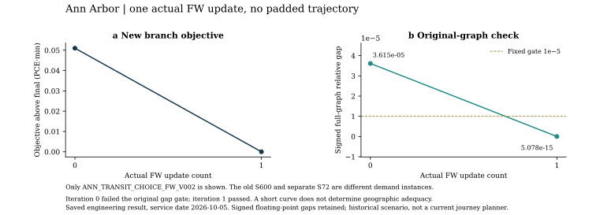</a></td></tr>
<tr><td width="50%" valign="top" align="left">
This new-choice instance alone uses 600 positive vehicle OD pairs and 1,569.500896674 PCE/h. The left panel is vehicle OD demand (PCE/h per OD); the right panel is the resulting assigned flow (PCE/h per directed physical road arc), with separate colour scales. All 5,138 physical roads are retained: 1,998 have positive flow and 3,140 have zero flow. Grey roads represent zero flow; overlapping directions remain separate data rows. The 9,065 turn arcs are not counted as physical roads. Summing road flows counts a trip on multiple roads and is not the total vehicle demand. Engineering timetable scenario, not observed or locally calibrated traffic.
</td><td width="50%" valign="top" align="left">
The two markers are the actual saved iteration 0 and iteration 1 of ANN_TRANSIT_CHOICE_FW_V002; they are not sampled from another experiment. Beckmann objective decreases from 7,511.797008491 to 7,511.745981436 PCE·min (0.051027055 PCE·min); the left panel displays excess above the final objective. Independent full-graph relative gap decreases from 3.6149991422457574e−5 to 5.078039901982526e−15 against the fixed 1e−5 gate. Solver-native final gap is separately retained as 3.627171358558947e−15 because the independent sum order differs. Initial max v/c is 0.6830239071239427; the separately checked final max v/c happens to have the same value. A short curve does not prove the region too small, and the initial state belongs to this accepted run rather than a separate failed trial.
</td></tr>
<tr><td width="50%" valign="top" align="left">
<a href="https://scholarhaozheng.github.io/mobility-network-lab/volumes/ann-arbor.html#figure-ann-choice-fw-network-v002">Complete city record · same figure</a> · <a href="https://scholarhaozheng.github.io/mobility-network-lab/assets/mainline-publication-20261009/ann-arbor/ANN_CHOICE_FW_NETWORK.svg">SVG</a> · <a href="https://scholarhaozheng.github.io/mobility-network-lab/assets/mainline-publication-20261009/ann-arbor/ANN_CHOICE_FW_NETWORK.png">PNG</a> · <a href="https://scholarhaozheng.github.io/mobility-network-lab/assets/mainline-publication-20261009/ann-arbor/ANN_CHOICE_FW_NETWORK.pdf">PDF</a> · <a href="https://scholarhaozheng.github.io/mobility-network-lab/assets/mainline-publication-20261009/ann-arbor/VEHICLE_DEMAND.csv">Model OD · 600 rows</a> · <a href="https://scholarhaozheng.github.io/mobility-network-lab/assets/mainline-publication-20261009/ann-arbor/PHYSICAL_ROAD_FLOW.csv">Physical flow · 5,138 roads</a> · <a href="https://scholarhaozheng.github.io/mobility-network-lab/assets/mainline-publication-20261009/ann-arbor/ANN_ROAD_DATABASE_ODBL.zip">ODbL road database</a> · <a href="https://scholarhaozheng.github.io/mobility-network-lab/assets/mainline-publication-20261009/ann-arbor/SCALE_COMPARISON.json">Model comparison</a> · <a href="https://scholarhaozheng.github.io/mobility-network-lab/assets/mainline-publication-20261009/NOTICE.md">Source and reuse notice</a> · <a href="https://scholarhaozheng.github.io/mobility-network-lab/assets/mainline-publication-20261009/MAINLINE_PUBLICATION_DECISION.json">Publication record</a>
</td><td width="50%" valign="top" align="left">
<a href="https://scholarhaozheng.github.io/mobility-network-lab/volumes/ann-arbor.html#figure-ann-choice-fw-convergence-v002">Complete city record · same figure</a> · <a href="https://scholarhaozheng.github.io/mobility-network-lab/assets/mainline-publication-20261009/ann-arbor/ANN_CHOICE_FW_CONVERGENCE.svg">SVG</a> · <a href="https://scholarhaozheng.github.io/mobility-network-lab/assets/mainline-publication-20261009/ann-arbor/ANN_CHOICE_FW_CONVERGENCE.png">PNG</a> · <a href="https://scholarhaozheng.github.io/mobility-network-lab/assets/mainline-publication-20261009/ann-arbor/ANN_CHOICE_FW_CONVERGENCE.pdf">PDF</a> · <a href="https://scholarhaozheng.github.io/mobility-network-lab/assets/mainline-publication-20261009/ann-arbor/CONVERGENCE.plot.json">Plot data · two saved states</a> · <a href="https://scholarhaozheng.github.io/mobility-network-lab/assets/mainline-publication-20261009/ann-arbor/FW_CHECK.json">Independent saved gap check</a> · <a href="https://scholarhaozheng.github.io/mobility-network-lab/assets/mainline-publication-20261009/ann-arbor/SCALE_COMPARISON.json">Model comparison</a> · <a href="https://scholarhaozheng.github.io/mobility-network-lab/assets/mainline-publication-20261009/NOTICE.md">Source and reuse notice</a> · <a href="https://scholarhaozheng.github.io/mobility-network-lab/assets/mainline-publication-20261009/MAINLINE_PUBLICATION_DECISION.json">Publication record</a>
</td></tr>
</table>

Frozen generation and distribution → unchanged person OD → OD-specific timetable-based mode choice → drive persons ÷ 1.2 persons/vehicle × 1 PCE/vehicle → 600 positive vehicle OD → ChoiceR1 demand.volume → actual FW update → original physical-road flow. Assignment reads the already converted PCE demand directly. Transit and walk remain person-mode results, not extra road vehicles. The one-hour period makes PCE/period numerically equal to PCE/h.

[Field chain, separate baselines and comparison limits](https://scholarhaozheng.github.io/mobility-network-lab/volumes/ann-arbor.html#choicefw-private-v002)

Earlier frozen S600 baseline: FW has two saved checks (0 and 1) and one update at a 1e−5 gate; sparse fixed-path FW also has one update. Algorithm B reports one iteration with 50 shifts. The old R2 1e−4 check below required zero updates. S72 is a separate initial-state result; Native S600 was resource-gated before solving. [Figure guide and saved-state interpretation](https://scholarhaozheng.github.io/mobility-network-lab/figure-update-status.html#top) · [Current release details](https://scholarhaozheng.github.io/mobility-network-lab/volumes/ann-arbor.html#gap-20261008)

##### Latest released evidence · 8 October 2026

<table width="100%">
<tr><th width="100%" valign="top" align="left"><strong>Static optimality on two separate demand instances</strong></th></tr>
<tr><td width="100%" valign="top" align="left"><table width="100%"><tr><td valign="top" width="100%">
<a href="https://scholarhaozheng.github.io/mobility-network-lab/volumes/ann-arbor.html#figure-gap-aa-gap-static">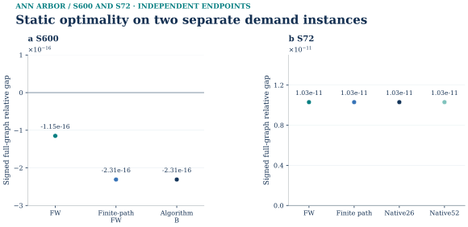</a>
Accepted static endpoints are grouped by their own frozen demand instance. S600 has separate FW, sparse fixed-path FW and Algorithm B results; S72 has FW, finite-path and Native26/52 endpoints. Method categories are not iterations and are not joined. Signed near-zero gaps retain the exact precision printed in the approved SVG, including negative floating-point roundoff. The later S600 FW and finite-path FW have two saved rows (iterations 0 and 1); no unsupplied numerical intermediate is constructed. S72 Native methods accepted initialization with zero updates. Existing method-specific physical maps remain the spatial evidence.

<a href="https://scholarhaozheng.github.io/mobility-network-lab/assets/figure-contract-r12/figures/ann-arbor/aa-static-signed-gaps.svg">SVG</a> · <a href="https://scholarhaozheng.github.io/mobility-network-lab/assets/figure-contract-r12/figures/ann-arbor/aa-static-signed-gaps.png">PNG</a> · <a href="https://scholarhaozheng.github.io/mobility-network-lab/assets/figure-contract-r12/figures/ann-arbor/aa-static-signed-gaps.pdf">PDF</a> · <a href="https://scholarhaozheng.github.io/mobility-network-lab/assets/figure-contract-r12/figures/ann-arbor/aa-static-signed-gaps.source.json">Source data</a>

</td></tr></table></td></tr>
<tr><td width="100%" valign="top" align="left"></td></tr>
<tr><td width="100%" valign="top" align="left"></td></tr>
</table>

<strong>Earlier frozen record: </strong>
Original R2 at the frozen 1e−4 gate: The same 600 vehicle ODs are loaded on the accepted static graph. The initialization already meets the frozen gap tolerance, so there are zero FW updates; the figures show the saved physical flow and one diagnostic check.

##### Frank–Wolfe: saved initialization and physical flow

<table width="100%">
<tr><th width="100%" valign="top" align="left"><strong>Frank–Wolfe: physical flow and distribution</strong></th></tr>
<tr><td width="100%" valign="top" align="left"><table width="100%"><tr><td valign="top" width="100%">
<a href="https://scholarhaozheng.github.io/mobility-network-lab/volumes/ann-arbor.html#figure-r9-fw-physical-flow">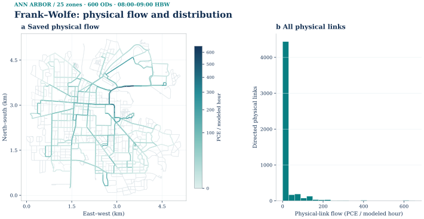</a>

Description, units and scope

Saved Ann Arbor static Frank–Wolfe endpoint for 08:00–09:00 HBW. The map and 22-bin histogram use the same complete 5,138-link physical-flow vector, including 3,147 exact-zero links; 1,991 links exceed 1e-6 PCE. Flow is PCE accumulated during the declared one-hour period, not persons or flow per simulation time step. The map uses a square-root sequential color scale with original-unit ticks and gray road context; histogram counts are linear and no links are omitted. Turn, access and other nonphysical solver arcs are excluded. Only the saved iteration-0 initialization exists; FW performed zero subsequent updates. Opposite directed geometries retain a 3 m display offset; values and IDs are unchanged. This is a modeled engineering scenario, not observed traffic. © OpenStreetMap contributors / ODbL 1.0. R11 layout repair: map and all-link histogram share measured top and bottom panel bounds. The original saved physical-link IDs, exact flow vector, geographic vertices, display offsets, histogram edges and counts remain unchanged.

<a href="https://scholarhaozheng.github.io/mobility-network-lab/assets/figure-contract-r11/figures/ann-arbor/fw-physical-flow.png">PNG</a> · <a href="https://scholarhaozheng.github.io/mobility-network-lab/assets/figure-contract-r11/figures/ann-arbor/fw-physical-flow.svg">SVG</a> · <a href="https://scholarhaozheng.github.io/mobility-network-lab/assets/figure-contract-r11/figures/ann-arbor/fw-physical-flow.pdf">PDF</a> · <a href="https://scholarhaozheng.github.io/mobility-network-lab/assets/figure-contract-r11/figures/ann-arbor/fw-physical-flow.source.json">Source record</a>

</td></tr></table></td></tr>
<tr><td width="100%" valign="top" align="left"></td></tr>
<tr><td width="100%" valign="top" align="left">
<a href="https://scholarhaozheng.github.io/mobility-network-lab/volumes/ann-arbor.html#figure-r9-fw-physical-flow">Complete city record · same evidence</a>
</td></tr>
</table>

Saved initial checks and original endpoint views

<table width="100%">
<tr><th width="50%" valign="top" align="left"><strong>Frank–Wolfe: the saved initial check</strong></th><td colspan="1" width="50%"></td></tr>
<tr><td width="50%" valign="top" align="left"><table width="100%"><tr><td valign="top" width="100%">
<a href="https://scholarhaozheng.github.io/mobility-network-lab/volumes/ann-arbor.html#ann-r3-static-check">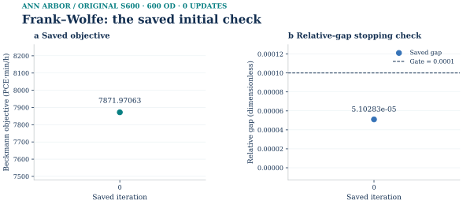</a>
Only the actual saved iteration 0 is shown: objective 7871.97062992656 PCE·min/h and relative gap 5.10282992009334e-05, against the unchanged 0.0001 stopping gate. There were zero updates. Each panel contains a single numerical point; no missing trajectory or second state is inferred. The companion physical-flow map reads this method’s own saved vector. This original 1e−4-gate instance is distinct from the later S600 1e−5-gate run, which saved iterations 0 and 1.

<a href="https://scholarhaozheng.github.io/mobility-network-lab/assets/figure-contract-r12/figures/ann-arbor/aa-original-initial-check.svg">SVG</a> · <a href="https://scholarhaozheng.github.io/mobility-network-lab/assets/figure-contract-r12/figures/ann-arbor/aa-original-initial-check.png">PNG</a> · <a href="https://scholarhaozheng.github.io/mobility-network-lab/assets/figure-contract-r12/figures/ann-arbor/aa-original-initial-check.pdf">PDF</a> · <a href="https://scholarhaozheng.github.io/mobility-network-lab/assets/figure-contract-r12/figures/ann-arbor/aa-original-initial-check.source.json">Source data</a>

</td></tr></table></td><td colspan="1" width="50%"></td></tr>
<tr><td width="50%" valign="top" align="left"></td><td colspan="1" width="50%"></td></tr>
<tr><td width="50%" valign="top" align="left"></td><td colspan="1" width="50%"></td></tr>
</table>

#### Time-expanded network and path examples

Frozen T4 construction rules illustrated on actual road inputs. The finite graph has not yet been built or solved; these are not saved optimization paths.

<table width="100%">
<tr><th width="50%" valign="top" align="left"><strong>Time-expanded network in layers</strong></th><th width="50%" valign="top" align="left"><strong>Local construction details</strong></th></tr>
<tr><td width="50%" valign="top" align="left"><a href="https://scholarhaozheng.github.io/mobility-network-lab/volumes/ann-arbor.html#figure-parity-ann-arbor-time-layers">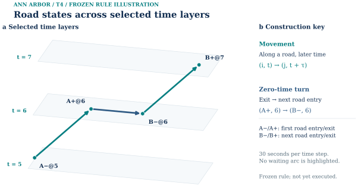</a></td><td width="50%" valign="top" align="left"><a href="https://scholarhaozheng.github.io/mobility-network-lab/volumes/ann-arbor.html#figure-parity-ann-arbor-local-construction">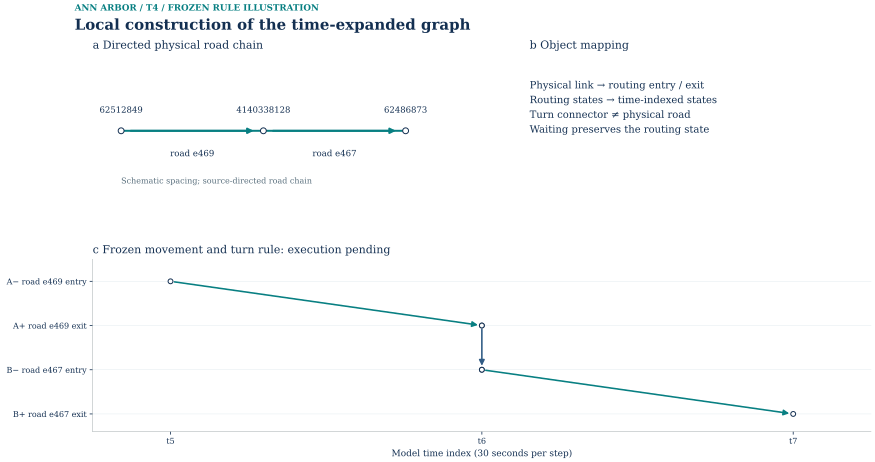</a></td></tr>
<tr><td width="50%" valign="top" align="left">
Ann Arbor: the frozen 30-second construction rule is illustrated on an actual allowed two-road chain. Frozen construction rule applied to an actual allowed two-road chain.

Description, units and scope

Ann Arbor: the frozen 30-second construction rule is illustrated on an actual allowed two-road chain. Frozen construction rule applied to an actual allowed two-road chain. The full graph has not been built and no time-expanded solver has run. The displayed turn is an actual allowed static-network turn chosen for illustration; this is not a saved assignment path. Displayed timing is the deterministic frozen 30-second rule applied to original free-flow minutes, not a measured or computed route time. This input-only illustration does not change Native600 or finite-time reception status. The slanted planes and horizontal positions are schematic display coordinates. A−/A+ and B−/B+ denote entry/exit routing states, not original intersections. Exact state IDs, physical-road IDs and time indices are retained in plot data.

</td><td width="50%" valign="top" align="left">
Ann Arbor: panels map two source-directed physical roads to four routing entry/exit states and their time-indexed movements. Frozen construction rule applied to an actual allowed two-road chain.

Description, units and scope

Ann Arbor: panels map two source-directed physical roads to four routing entry/exit states and their time-indexed movements. Frozen construction rule applied to an actual allowed two-road chain. The full graph has not been built and no time-expanded solver has run. The displayed turn is an actual allowed static-network turn chosen for illustration; this is not a saved assignment path. Displayed timing is the deterministic frozen 30-second rule applied to original free-flow minutes, not a measured or computed route time. This input-only illustration does not change Native600 or finite-time reception status. The turn has zero elapsed time; physical road durations are positive. No waiting arc is drawn and terminal bookkeeping states are outside this local excerpt. Plot data carry all exact source IDs, field values, and short-label aliases.

</td></tr>
<tr><td width="50%" valign="top" align="left">
<a href="https://scholarhaozheng.github.io/mobility-network-lab/volumes/ann-arbor.html#figure-parity-ann-arbor-time-layers">Complete evidence · same figure</a> · <a href="https://scholarhaozheng.github.io/mobility-network-lab/assets/template-parity-20261008/construction/ann-arbor/time-layers.svg">SVG</a> · <a href="https://scholarhaozheng.github.io/mobility-network-lab/assets/template-parity-20261008/construction/ann-arbor/time-layers.png">PNG</a> · <a href="https://scholarhaozheng.github.io/mobility-network-lab/assets/template-parity-20261008/construction/ann-arbor/time-layers.pdf">PDF</a> · <a href="https://scholarhaozheng.github.io/mobility-network-lab/assets/template-parity-20261008/construction/ann-arbor/time-layers.plot.json">Plot data</a> · <a href="https://scholarhaozheng.github.io/mobility-network-lab/assets/template-parity-20261008/construction/ann-arbor/time-layers.source.json">Source record</a> · <a href="https://scholarhaozheng.github.io/mobility-network-lab/assets/template-parity-20261008/construction/ann-arbor/time-layers.caption.md">Caption</a>
</td><td width="50%" valign="top" align="left">
<a href="https://scholarhaozheng.github.io/mobility-network-lab/volumes/ann-arbor.html#figure-parity-ann-arbor-local-construction">Complete evidence · same figure</a> · <a href="https://scholarhaozheng.github.io/mobility-network-lab/assets/template-parity-20261008/construction/ann-arbor/local-construction.svg">SVG</a> · <a href="https://scholarhaozheng.github.io/mobility-network-lab/assets/template-parity-20261008/construction/ann-arbor/local-construction.png">PNG</a> · <a href="https://scholarhaozheng.github.io/mobility-network-lab/assets/template-parity-20261008/construction/ann-arbor/local-construction.pdf">PDF</a> · <a href="https://scholarhaozheng.github.io/mobility-network-lab/assets/template-parity-20261008/construction/ann-arbor/local-construction.plot.json">Plot data</a> · <a href="https://scholarhaozheng.github.io/mobility-network-lab/assets/template-parity-20261008/construction/ann-arbor/local-construction.source.json">Source record</a> · <a href="https://scholarhaozheng.github.io/mobility-network-lab/assets/template-parity-20261008/construction/ann-arbor/local-construction.caption.md">Caption</a>
</td></tr>
</table>

#### Optimization on the time-expanded network

Current scope remains static. Neither T1 nor T4 has a solved Ann Arbor finite optimization endpoint; initial-state S72 Native acceptance does not supply these experiments. [Figure guide and saved-state interpretation](https://scholarhaozheng.github.io/mobility-network-lab/figure-update-status.html#top) · [Current release details](https://scholarhaozheng.github.io/mobility-network-lab/volumes/ann-arbor.html#gap-20261008)

8 October 2026 release · shared sources and notices

The following source and scope notices apply to the adjacent figures.

Separate frozen S600 and S72 static instances. S72 Native passed at initialization with zero updates; Native600 remains incomplete. The saved numerical figures and necessary model data are available with the current source notice. © OpenStreetMap contributors, ODbL: https://www.openstreetmap.org/copyright; U.S. Census/LEHD.

ChoiceFW sources and data access

Transit scheduling, geographic, and real-time data provided by permission of AAATA/TheRide. Service date 2026-10-05; historical engineering scenario, not a current journey planner. © OpenStreetMap contributors; road-derived database ODbL 1.0. ACS 2020–2024 and LODES 2021 are original statistical sources; model estimates are the authors’ analysis.

<a href="https://scholarhaozheng.github.io/mobility-network-lab/assets/mainline-publication-20261009/NOTICE.md">Source versions, reuse conditions and original input entry points</a> · <a href="https://scholarhaozheng.github.io/mobility-network-lab/assets/mainline-publication-20261009/ann-arbor/ANN_ROAD_DATABASE_ODBL.zip">Download retained ODbL road database</a>. Original GTFS and detailed stop-by-stop timetable itineraries are not included; the model summaries and plotting data above are available.

### Urbana–Champaign

The dated CUMTD timetable revision changes mode choice and actually assigns 1,667.089946 PCE/h across 418 OD pairs. Its FW stops at the initial check, although maximum physical v/c is about 1.013. The earlier 418-OD maps and the separate S72/T4 instances remain identified below; Algorithm B belongs to the old S72 demand. [Latest accepted evidence →](https://scholarhaozheng.github.io/mobility-network-lab/volumes/urbana-champaign.html#gap-20261008)

<table width="100%"><thead><tr><th valign="top" width="25%">City/model foundation</th><th valign="top" width="25%">Static assignment</th><th valign="top" width="25%">Finite time-expanded</th><th valign="top" width="25%">Observation/data scope</th></tr></thead>
<tbody><tr><td valign="top" width="25%">21 zones; preflight GMNS has 24,775 nodes and 46,203 directed physical links. The assignment graph separately retains 11,365 traversal arcs and 15,237 turn arcs.</td><td valign="top" width="25%">New timetable revision: 418 OD, 1,667.089946 PCE/h, FW accepted at initialization. Original flow maps retain earlier 1,963.648313 PCE/h. Algorithm B is on separate old S72.</td><td valign="top" width="25%">Separate T4 pulse: 4 selected OD, 0.0516231483 PCE, 30-second steps, H=160.</td><td valign="top" width="25%">1,672 CUMTD timetable queries are not riders. The bounded source-link/turn identity bridge is not GPS calibration; historical photos remain city context.</td></tr></tbody></table>

Local reading edition · saved-result figures aligned with Boston and Hong Kong · [Figure guide and saved-state interpretation](https://scholarhaozheng.github.io/mobility-network-lab/figure-update-status.html#top)

Sources and model scope · © OpenStreetMap contributors / ODbL 1.0

© OpenStreetMap contributors; road-derived data ODbL 1.0: https://www.openstreetmap.org/copyright; numerical results are engineering scenarios, not observed traffic. Central Champaign–Urbana 21-zone subarea; S72 and T4 are subsets, not UIUC campus or the whole city. Native26/52 outer-9 endpoints are accepted.

<a href="https://scholarhaozheng.github.io/mobility-network-lab/assets/algorithm-transfer-r8/NOTICE.md">Full attribution and release notice</a>

[Sources and GMNS](#urbana-champaign-sources) · [Population, households and activity](#urbana-champaign-population) · [Transit and observations](#urbana-champaign-transit) · [Trip generation](#urbana-champaign-generation) · [Trip distribution](#urbana-champaign-distribution) · [Mode choice](#urbana-champaign-mode) · [Static assignment methods](#urbana-champaign-static) · [Time-expanded network and path examples](#urbana-champaign-representation) · [Optimization on the time-expanded network](#urbana-champaign-finite)

#### Sources and GMNS

<table width="100%">
<tr><th width="100%" valign="top" align="left"><strong>Retained physical road graph</strong></th></tr>
<tr><td width="100%" valign="top" align="left"><table width="100%"><tr><td valign="top" width="100%">
<a href="https://scholarhaozheng.github.io/mobility-network-lab/volumes/urbana-champaign.html#figure-f01-network">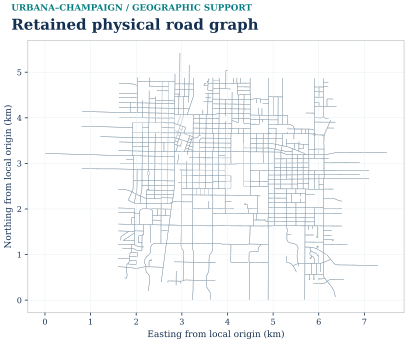</a>

Description, units and scope

11,365 retained physical directed traversals in the saved 08:00–09:00 HBW model, shown in EPSG:26916. This is the retained model graph, not a claim to draw every road in the source archive. Virtual movements are excluded; colour has no traffic meaning. © OpenStreetMap contributors / ODbL. Reciprocal directed arcs can share geometry; no assigned flow is encoded. This drawing uses the frozen run_v1 evidence. Later supplementary datasets are separate and are not implied to have entered this scenario.

<a href="https://scholarhaozheng.github.io/mobility-network-lab/assets/figure-contract-r11/figures/urbana-champaign/sources.png">PNG</a> · <a href="https://scholarhaozheng.github.io/mobility-network-lab/assets/figure-contract-r11/figures/urbana-champaign/sources.svg">SVG</a> · <a href="https://scholarhaozheng.github.io/mobility-network-lab/assets/figure-contract-r11/figures/urbana-champaign/sources.pdf">PDF</a> · <a href="https://scholarhaozheng.github.io/mobility-network-lab/assets/figure-contract-r11/figures/urbana-champaign/sources.source.json">Source record</a>

</td></tr></table></td></tr>
<tr><td width="100%" valign="top" align="left"></td></tr>
<tr><td width="100%" valign="top" align="left">
<a href="https://scholarhaozheng.github.io/mobility-network-lab/volumes/urbana-champaign.html#figure-f01-network">Complete city record · same evidence</a>
</td></tr>
</table>

#### Population, households and activity

<table width="100%">
<tr><th width="100%" valign="top" align="left"><strong>Population and household inputs</strong></th></tr>
<tr><td width="100%" valign="top" align="left"><table width="100%"><tr><td valign="top" width="100%">
<a href="https://scholarhaozheng.github.io/mobility-network-lab/volumes/urbana-champaign.html#figure-r3-population">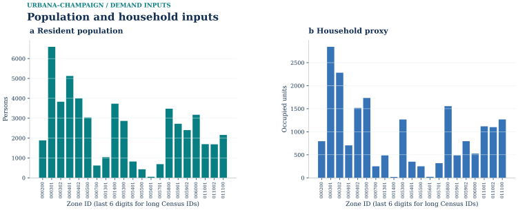</a>

Description, units and scope

2020 blocks selected by internal point; not earlier whole-tract totals. All 21 zones are retained; population total 52,040. Occupied units total 19,696. Missing household fields are unknown, not zero. Census/ACS allocation is an input, not a simulated traffic quantity. This drawing uses the frozen run_v1 evidence. Later supplementary datasets are separate and are not implied to have entered this scenario.

<a href="https://scholarhaozheng.github.io/mobility-network-lab/assets/figure-contract-r11/figures/urbana-champaign/population.png">PNG</a> · <a href="https://scholarhaozheng.github.io/mobility-network-lab/assets/figure-contract-r11/figures/urbana-champaign/population.svg">SVG</a> · <a href="https://scholarhaozheng.github.io/mobility-network-lab/assets/figure-contract-r11/figures/urbana-champaign/population.pdf">PDF</a> · <a href="https://scholarhaozheng.github.io/mobility-network-lab/assets/figure-contract-r11/figures/urbana-champaign/population.source.json">Source record</a>

</td></tr></table></td></tr>
<tr><td width="100%" valign="top" align="left"></td></tr>
<tr><td width="100%" valign="top" align="left">
<a href="https://scholarhaozheng.github.io/mobility-network-lab/volumes/urbana-champaign.html#figure-r3-population">Complete city record · same evidence</a>
</td></tr>
</table>

Earlier views and additional saved evidence

<table width="100%">
<tr><th width="100%" valign="top" align="left"><strong>Earlier tract population geography</strong></th></tr>
<tr><td width="100%" valign="top" align="left"><table width="100%"><tr><td valign="top" width="100%">
<a href="https://scholarhaozheng.github.io/mobility-network-lab/volumes/urbana-champaign.html#figure-f03-population">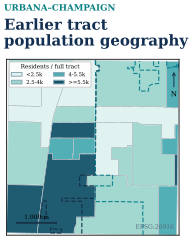</a>

Description, units and scope

Earlier tract and place geography; its whole-tract counts differ from the selected-block demand denominator. 2020 full-tract counts - clipped view

<a href="https://scholarhaozheng.github.io/mobility-network-lab/assets/figure-contract-r11/figures/urbana-champaign/urbana-champaign-f03_population.png">PNG</a> · <a href="https://scholarhaozheng.github.io/mobility-network-lab/assets/figure-contract-r11/figures/urbana-champaign/urbana-champaign-f03_population.svg">SVG</a> · <a href="https://scholarhaozheng.github.io/mobility-network-lab/assets/figure-contract-r11/figures/urbana-champaign/urbana-champaign-f03_population.pdf">PDF</a> · <a href="https://scholarhaozheng.github.io/mobility-network-lab/assets/figure-contract-r11/figures/urbana-champaign/urbana-champaign-f03_population.source.json">Source record</a>

</td></tr></table></td></tr>
<tr><td width="100%" valign="top" align="left"></td></tr>
<tr><td width="100%" valign="top" align="left">
<a href="https://scholarhaozheng.github.io/mobility-network-lab/volumes/urbana-champaign.html#figure-f03-population">Complete city record · same evidence</a>
</td></tr>
</table>

#### Transit and observations

<table width="100%">
<tr><th width="100%" valign="top" align="left"><strong>Transit source geography</strong></th></tr>
<tr><td width="100%" valign="top" align="left"><table width="100%"><tr><td valign="top" width="100%">

Description, units and scope

BTS/NTM archive / 2026-03-09; timetable unknown. 564 stop records; 607 route-shape records, not unique routes or scheduled trips. The gray retained road graph is geographic context, not a transit route model. Source stops and route shapes do not establish legal pedestrian access, operating service, or observed ridership. This drawing uses the frozen run_v1 evidence. Later supplementary datasets are separate and are not implied to have entered this scenario.

<a href="https://scholarhaozheng.github.io/mobility-network-lab/assets/figure-contract-r11/figures/urbana-champaign/transit.png">PNG</a> · <a href="https://scholarhaozheng.github.io/mobility-network-lab/assets/figure-contract-r11/figures/urbana-champaign/transit.svg">SVG</a> · <a href="https://scholarhaozheng.github.io/mobility-network-lab/assets/figure-contract-r11/figures/urbana-champaign/transit.pdf">PDF</a> · <a href="https://scholarhaozheng.github.io/mobility-network-lab/assets/figure-contract-r11/figures/urbana-champaign/transit.source.json">Source record</a>

</td></tr></table></td></tr>
<tr><td width="100%" valign="top" align="left"></td></tr>
<tr><td width="100%" valign="top" align="left">
<a href="https://scholarhaozheng.github.io/mobility-network-lab/volumes/urbana-champaign.html#figure-r3-transit">Complete city record · same evidence</a>
</td></tr>
</table>

#### Trip generation

<table width="100%">
<tr><th width="100%" valign="top" align="left"><strong>Trip generation and demand accounting</strong></th></tr>
<tr><td width="100%" valign="top" align="left"><table width="100%"><tr><td valign="top" width="100%">
<a href="https://scholarhaozheng.github.io/mobility-network-lab/volumes/urbana-champaign.html#figure-fs-g01">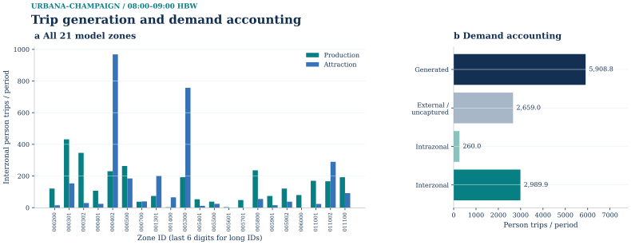</a>

Description, units and scope

All 21 zones; 08:00–09:00 HBW. The left panel shows saved interzonal productions/attractions. The right panel accounts for all generated persons, including excluded and intrazonal components. No top-12 truncation. Scenario assumptions, not measured trip counts. External and intrazonal components do not enter interzonal assignment; attractions are normalized to productions. This drawing uses the frozen run_v1 evidence. Later supplementary datasets are separate and are not implied to have entered this scenario.

<a href="https://scholarhaozheng.github.io/mobility-network-lab/assets/figure-contract-r11/figures/urbana-champaign/generation.png">PNG</a> · <a href="https://scholarhaozheng.github.io/mobility-network-lab/assets/figure-contract-r11/figures/urbana-champaign/generation.svg">SVG</a> · <a href="https://scholarhaozheng.github.io/mobility-network-lab/assets/figure-contract-r11/figures/urbana-champaign/generation.pdf">PDF</a> · <a href="https://scholarhaozheng.github.io/mobility-network-lab/assets/figure-contract-r11/figures/urbana-champaign/generation.source.json">Source record</a>

</td></tr></table></td></tr>
<tr><td width="100%" valign="top" align="left"></td></tr>
<tr><td width="100%" valign="top" align="left">
<a href="https://scholarhaozheng.github.io/mobility-network-lab/volumes/urbana-champaign.html#figure-fs-g01">Complete city record · same evidence</a>
</td></tr>
</table>

#### Trip distribution

<table width="100%">
<tr><th width="100%" valign="top" align="left"><strong>Trip distribution and directed OD margins</strong></th></tr>
<tr><td width="100%" valign="top" align="left"><table width="100%"><tr><td valign="top" width="100%">
<a href="https://scholarhaozheng.github.io/mobility-network-lab/volumes/urbana-champaign.html#figure-fs-d01">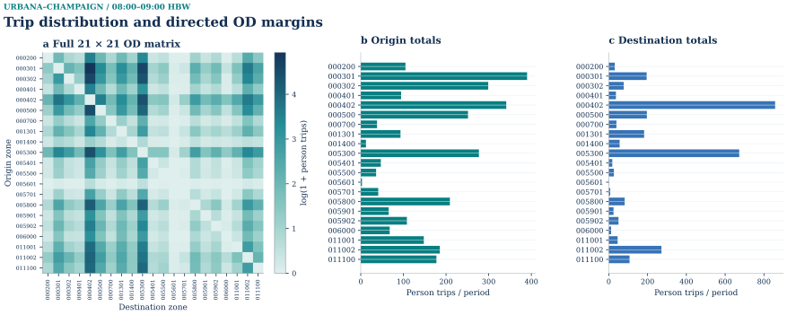</a>

Description, units and scope

Full 21×21 model-zone matrix including zero cells; 418 positive OD pairs and 2,989.852800000 persons in 08:00–09:00 HBW. Colours are log(1+persons); margins are untransformed directed OD totals after PA direction. Every model zone is retained. Zero rows and columns remain visible; intrazonal cells are structural zeros. Labels use the final six digits of long zone IDs. This drawing uses the frozen run_v1 evidence. Later supplementary datasets are separate and are not implied to have entered this scenario.

<a href="https://scholarhaozheng.github.io/mobility-network-lab/assets/figure-contract-r11/figures/urbana-champaign/distribution.png">PNG</a> · <a href="https://scholarhaozheng.github.io/mobility-network-lab/assets/figure-contract-r11/figures/urbana-champaign/distribution.svg">SVG</a> · <a href="https://scholarhaozheng.github.io/mobility-network-lab/assets/figure-contract-r11/figures/urbana-champaign/distribution.pdf">PDF</a> · <a href="https://scholarhaozheng.github.io/mobility-network-lab/assets/figure-contract-r11/figures/urbana-champaign/distribution.source.json">Source record</a>

</td></tr></table></td></tr>
<tr><td width="100%" valign="top" align="left"></td></tr>
<tr><td width="100%" valign="top" align="left">
<a href="https://scholarhaozheng.github.io/mobility-network-lab/volumes/urbana-champaign.html#figure-fs-d01">Complete city record · same evidence</a>
</td></tr>
</table>

#### Mode choice

New service-day input: 2026-10-07 CUMTD timetable queries add a scheduled transit alternative. The 2,989.8528-person OD total is fixed; 461.581416 transit person trips and 1,667.089946 PCE/h driving demand are engineering outputs. The 1,672 queries are not observed riders. Earlier drive/walk-only figures remain historical. [Figure guide and saved-state interpretation](https://scholarhaozheng.github.io/mobility-network-lab/figure-update-status.html#top) · [Current release details](https://scholarhaozheng.github.io/mobility-network-lab/volumes/urbana-champaign.html#gap-20261008)

##### Latest released evidence · 8 October 2026

<table width="100%">
<tr><th width="50%" valign="top" align="left"><strong>Mode demand under two transit inputs</strong></th><th width="50%" valign="top" align="left"><strong>Scheduled transit cost components</strong></th></tr>
<tr><td width="50%" valign="top" align="left"><table width="100%"><tr><td valign="top" width="100%">
<a href="https://scholarhaozheng.github.io/mobility-network-lab/volumes/urbana-champaign.html#figure-gap-uc-gap-c1">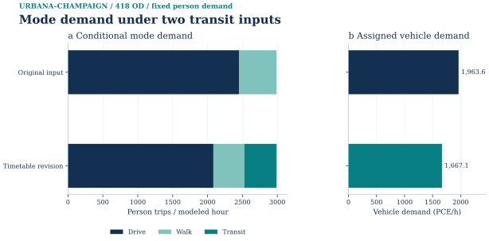</a>

Description, units and scope

The person total is 2,989.8528 across 418 OD. The timetable revision predicts 461.581416 transit person trips and 1,667.089946 PCE/h, versus 1,963.648313 PCE/h under the earlier mode inputs. Both totals are engineering predictions; their different demands do not compare solver quality. Engineering scenario, not observed ridership or local calibration. Data provided by Champaign-Urbana Mass Transit District; dated 2026-10-07 timetable, not live rider advice. © OpenStreetMap contributors, ODbL: https://www.openstreetmap.org/copyright. CUMTD terms: https://developer.mtd.org/terms-of-use/

<a href="https://scholarhaozheng.github.io/mobility-network-lab/assets/figure-contract-r11/figures/urbana-champaign/uc-mode-demand.png">PNG</a> · <a href="https://scholarhaozheng.github.io/mobility-network-lab/assets/figure-contract-r11/figures/urbana-champaign/uc-mode-demand.svg">SVG</a> · <a href="https://scholarhaozheng.github.io/mobility-network-lab/assets/figure-contract-r11/figures/urbana-champaign/uc-mode-demand.pdf">PDF</a> · <a href="https://scholarhaozheng.github.io/mobility-network-lab/assets/figure-contract-r11/figures/urbana-champaign/uc-mode-demand.source.json">Source record</a>

</td></tr></table></td><td width="50%" valign="top" align="left"><table width="100%"><tr><td valign="top" width="100%">
<a href="https://scholarhaozheng.github.io/mobility-network-lab/volumes/urbana-champaign.html#figure-gap-uc-gap-c2">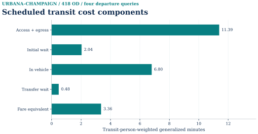</a>

Description, units and scope

Costs use the 2026-10-07 CUMTD schedule, directed walking access and a stated adult fare scenario. The 1,672 queries are 418 OD × four departure samples, not passenger observations. Engineering scenario, not observed ridership or local calibration. Data provided by Champaign-Urbana Mass Transit District; dated 2026-10-07 timetable, not live rider advice. © OpenStreetMap contributors, ODbL: https://www.openstreetmap.org/copyright. CUMTD terms: https://developer.mtd.org/terms-of-use/

<a href="https://scholarhaozheng.github.io/mobility-network-lab/assets/figure-contract-r11/figures/urbana-champaign/uc-transit-cost.png">PNG</a> · <a href="https://scholarhaozheng.github.io/mobility-network-lab/assets/figure-contract-r11/figures/urbana-champaign/uc-transit-cost.svg">SVG</a> · <a href="https://scholarhaozheng.github.io/mobility-network-lab/assets/figure-contract-r11/figures/urbana-champaign/uc-transit-cost.pdf">PDF</a> · <a href="https://scholarhaozheng.github.io/mobility-network-lab/assets/figure-contract-r11/figures/urbana-champaign/uc-transit-cost.source.json">Source record</a>

</td></tr></table></td></tr>
<tr><td width="50%" valign="top" align="left"></td><td width="50%" valign="top" align="left"></td></tr>
<tr><td width="50%" valign="top" align="left">
<a href="https://scholarhaozheng.github.io/mobility-network-lab/volumes/urbana-champaign.html#figure-gap-uc-gap-c1">Complete city record · same evidence</a>
</td><td width="50%" valign="top" align="left">
<a href="https://scholarhaozheng.github.io/mobility-network-lab/volumes/urbana-champaign.html#figure-gap-uc-gap-c2">Complete city record · same evidence</a>
</td></tr>
</table>

<table width="100%">
<tr><th width="100%" valign="top" align="left"><strong>Mode choice: demand, cost and availability</strong></th></tr>
<tr><td width="100%" valign="top" align="left"><table width="100%"><tr><td valign="top" width="100%">
<a href="https://scholarhaozheng.github.io/mobility-network-lab/volumes/urbana-champaign.html#figure-fs-m01">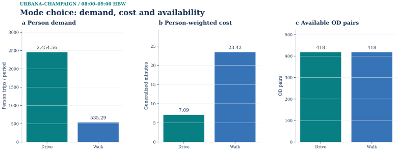</a>

Description, units and scope

Saved OD-specific choice in 08:00–09:00 HBW; sums over every positive-demand OD. Persons, person-weighted generalized minutes, and available OD counts have separate axes. Transit is not modeled; no zero bar is shown. Generalized cost includes model time and money terms. Person totals precede the separate occupancy-to-PCE conversion. This drawing uses the frozen run_v1 evidence. Later supplementary datasets are separate and are not implied to have entered this scenario.

<a href="https://scholarhaozheng.github.io/mobility-network-lab/assets/figure-contract-r11/figures/urbana-champaign/mode.png">PNG</a> · <a href="https://scholarhaozheng.github.io/mobility-network-lab/assets/figure-contract-r11/figures/urbana-champaign/mode.svg">SVG</a> · <a href="https://scholarhaozheng.github.io/mobility-network-lab/assets/figure-contract-r11/figures/urbana-champaign/mode.pdf">PDF</a> · <a href="https://scholarhaozheng.github.io/mobility-network-lab/assets/figure-contract-r11/figures/urbana-champaign/mode.source.json">Source record</a>

</td></tr></table></td></tr>
<tr><td width="100%" valign="top" align="left"></td></tr>
<tr><td width="100%" valign="top" align="left">
<a href="https://scholarhaozheng.github.io/mobility-network-lab/volumes/urbana-champaign.html#figure-fs-m01">Complete city record · same evidence</a>
</td></tr>
</table>

#### Static assignment methods

##### Static assignment inputs — vehicle-demand margins and physical access

<table width="100%">
<tr><th width="50%" valign="top" align="left"><strong>Static assignment demand margins</strong></th><th width="50%" valign="top" align="left"><strong>Physical demand endpoints</strong></th></tr>
<tr><td width="50%" valign="top" align="left"></td><td width="50%" valign="top" align="left"></td></tr>
<tr><td width="50%" valign="top" align="left">
S72: 72 positive source-zone OD pairs, 72 loaded solver-node OD pairs and 321.629659883 PCE/hour. Origin and destination margins sum the selected assignment PCE by source zone, after the saved mode/occupancy conversion.

Description, units and scope

S72: 72 positive source-zone OD pairs, 72 loaded solver-node OD pairs and 321.629659883 PCE/hour. Origin and destination margins sum the selected assignment PCE by source zone, after the saved mode/occupancy conversion. All source-zone polygons, including any zero selected demand, use a common square-root normalization with ticks in original PCE/hour. S72 has 72 frozen source-zone OD pairs, separate from the original 418-OD city case. M states are the saved public-road midpoint access proxies. Coordinates use the original builder rule: arithmetic mean of the directed source link endpoint coordinates, not a zone centroid. These are modeled assignment-input quantities, not population generation, observed traffic or assigned link flow. Both panels share one map extent; context roads outside this input footprint are clipped only for display.

</td><td width="50%" valign="top" align="left">
S72: 72 positive source-zone OD pairs, 72 loaded solver-node OD pairs and 321.629659883 PCE/hour. Original access records locate 19 loaded physical origins and 21 loaded physical destinations.

Description, units and scope

S72: 72 positive source-zone OD pairs, 72 loaded solver-node OD pairs and 321.629659883 PCE/hour. Original access records locate 19 loaded physical origins and 21 loaded physical destinations. Open circles show the frozen access system and filled colors show selected endpoint PCE/hour. The largest loaded endpoint in each panel is labelled by its physical source ID (or the saved M-state road-midpoint identifier). Each side sums to the same total; this aggregation is for display only. S72 has 72 frozen source-zone OD pairs, separate from the original 418-OD city case. M states are the saved public-road midpoint access proxies. Coordinates use the original builder rule: arithmetic mean of the directed source link endpoint coordinates, not a zone centroid. These are modeled assignment-input quantities, not population generation, observed traffic or assigned link flow. Both panels share one map extent; context roads outside this input footprint are clipped only for display.

</td></tr>
<tr><td width="50%" valign="top" align="left">
<a href="https://scholarhaozheng.github.io/mobility-network-lab/volumes/urbana-champaign.html#figure-parity-urbana-champaign-assignment-margins">Complete evidence · same figure</a> · <a href="https://scholarhaozheng.github.io/mobility-network-lab/assets/template-parity-20261008/static-inputs/urbana-champaign/assignment-margins.svg">SVG</a> · <a href="https://scholarhaozheng.github.io/mobility-network-lab/assets/template-parity-20261008/static-inputs/urbana-champaign/assignment-margins.png">PNG</a> · <a href="https://scholarhaozheng.github.io/mobility-network-lab/assets/template-parity-20261008/static-inputs/urbana-champaign/assignment-margins.pdf">PDF</a> · <a href="https://scholarhaozheng.github.io/mobility-network-lab/assets/template-parity-20261008/static-inputs/urbana-champaign/assignment-margins.plot.json">Plot data</a> · <a href="https://scholarhaozheng.github.io/mobility-network-lab/assets/template-parity-20261008/static-inputs/urbana-champaign/assignment-margins.source.json">Source record</a> · <a href="https://scholarhaozheng.github.io/mobility-network-lab/assets/template-parity-20261008/static-inputs/urbana-champaign/assignment-margins.caption.md">Caption</a>
</td><td width="50%" valign="top" align="left">
<a href="https://scholarhaozheng.github.io/mobility-network-lab/volumes/urbana-champaign.html#figure-parity-urbana-champaign-assignment-endpoints">Complete evidence · same figure</a> · <a href="https://scholarhaozheng.github.io/mobility-network-lab/assets/template-parity-20261008/static-inputs/urbana-champaign/assignment-endpoints.svg">SVG</a> · <a href="https://scholarhaozheng.github.io/mobility-network-lab/assets/template-parity-20261008/static-inputs/urbana-champaign/assignment-endpoints.png">PNG</a> · <a href="https://scholarhaozheng.github.io/mobility-network-lab/assets/template-parity-20261008/static-inputs/urbana-champaign/assignment-endpoints.pdf">PDF</a> · <a href="https://scholarhaozheng.github.io/mobility-network-lab/assets/template-parity-20261008/static-inputs/urbana-champaign/assignment-endpoints.plot.json">Plot data</a> · <a href="https://scholarhaozheng.github.io/mobility-network-lab/assets/template-parity-20261008/static-inputs/urbana-champaign/assignment-endpoints.source.json">Source record</a> · <a href="https://scholarhaozheng.github.io/mobility-network-lab/assets/template-parity-20261008/static-inputs/urbana-champaign/assignment-endpoints.caption.md">Caption</a>
</td></tr>
</table>

The new 418-OD demand is 1,667.089946 PCE/h. FW saves iteration 0 only, with an independent signed gap near −4.60e−15 (roundoff) at the current-cost UE check. Maximum physical v/c ≈1.0129 rules out a blanket “no congestion because demand is tiny” explanation. This release has no new approved flow map for that revision: the physical maps below retain the earlier 1,963.648313 PCE/h instance. Algorithm B is a separate S72 run: one reported iteration containing 42 shifts. [Figure guide and saved-state interpretation](https://scholarhaozheng.github.io/mobility-network-lab/figure-update-status.html#top) · [Current release details](https://scholarhaozheng.github.io/mobility-network-lab/volumes/urbana-champaign.html#gap-20261008)

##### Static network loading

<table width="100%">
<tr><th width="100%" valign="top" align="left"><strong>Frank–Wolfe: physical flow and distribution</strong></th></tr>
<tr><td width="100%" valign="top" align="left"><table width="100%"><tr><td valign="top" width="100%">

Description, units and scope

Saved Urbana–Champaign static Frank–Wolfe endpoint for 08:00–09:00 HBW. The map and 22-bin histogram use the same complete 11,365-link physical-flow vector, including 7,681 exact-zero links; 3,684 links exceed 1e-6 PCE. Flow is PCE accumulated during the declared one-hour period, not persons or flow per simulation time step. The map uses a square-root sequential color scale with original-unit ticks and gray road context; histogram counts are linear and no links are omitted. Turn, access and other nonphysical solver arcs are excluded. Only the saved iteration-0 initialization exists; FW performed zero subsequent updates. Reciprocal directed arcs may overlap geometrically; flows are not summed. Serial A/B road traversals retain their directed first/second geometry halves. These are 11,365 model physical traversals, not the 5,913-link preflight graph or the separate S72 transfer. This is a modeled engineering scenario, not observed traffic. © OpenStreetMap contributors / ODbL 1.0. R11 layout repair: map and all-link histogram share measured top and bottom panel bounds. The original saved physical-link IDs, exact flow vector, geographic vertices, display offsets, histogram edges and counts remain unchanged.

<a href="https://scholarhaozheng.github.io/mobility-network-lab/assets/figure-contract-r11/figures/urbana-champaign/fw-physical-flow.png">PNG</a> · <a href="https://scholarhaozheng.github.io/mobility-network-lab/assets/figure-contract-r11/figures/urbana-champaign/fw-physical-flow.svg">SVG</a> · <a href="https://scholarhaozheng.github.io/mobility-network-lab/assets/figure-contract-r11/figures/urbana-champaign/fw-physical-flow.pdf">PDF</a> · <a href="https://scholarhaozheng.github.io/mobility-network-lab/assets/figure-contract-r11/figures/urbana-champaign/fw-physical-flow.source.json">Source record</a>

</td></tr></table></td></tr>
<tr><td width="100%" valign="top" align="left"></td></tr>
<tr><td width="100%" valign="top" align="left">
<a href="https://scholarhaozheng.github.io/mobility-network-lab/volumes/urbana-champaign.html#figure-r9-fw-physical-flow">Complete city record · same evidence</a>
</td></tr>
</table>

Saved initial checks and original endpoint views

<table width="100%">
<tr><th width="50%" valign="top" align="left"><strong>Frank–Wolfe: the saved initial check</strong></th><td colspan="1" width="50%"></td></tr>
<tr><td width="50%" valign="top" align="left"><table width="100%"><tr><td valign="top" width="100%">
<a href="https://scholarhaozheng.github.io/mobility-network-lab/volumes/urbana-champaign.html#figure-fs-a02">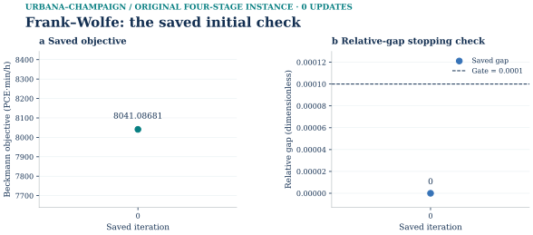</a>
Only the actual saved iteration 0 is shown: objective 8041.08681276163 PCE·min/h and relative gap 0, against the unchanged 0.0001 stopping gate. There were zero updates. Each panel contains a single numerical point; no missing trajectory or second state is inferred. The companion physical-flow map reads this method’s own saved vector. This frozen original demand instance is not relabelled as a later selected-demand or transit-revision run.

<a href="https://scholarhaozheng.github.io/mobility-network-lab/assets/figure-contract-r12/figures/urbana-champaign/urbana-champaign-initial-fw.svg">SVG</a> · <a href="https://scholarhaozheng.github.io/mobility-network-lab/assets/figure-contract-r12/figures/urbana-champaign/urbana-champaign-initial-fw.png">PNG</a> · <a href="https://scholarhaozheng.github.io/mobility-network-lab/assets/figure-contract-r12/figures/urbana-champaign/urbana-champaign-initial-fw.pdf">PDF</a> · <a href="https://scholarhaozheng.github.io/mobility-network-lab/assets/figure-contract-r12/figures/urbana-champaign/urbana-champaign-initial-fw.source.json">Source data</a>

</td></tr></table></td><td colspan="1" width="50%"></td></tr>
<tr><td width="50%" valign="top" align="left"></td><td colspan="1" width="50%"></td></tr>
<tr><td width="50%" valign="top" align="left"></td><td colspan="1" width="50%"></td></tr>
</table>

##### Static assignment results — one card per method

S72 transfer · separate from the full 418-OD city case

<table width="100%">
<tr><th width="33%" valign="top" align="left"><strong>S72 Frank–Wolfe physical loading and distribution</strong></th><th width="33%" valign="top" align="left"><strong>Finite paths: physical flow and distribution</strong></th><th width="33%" valign="top" align="left"><strong>Native L3 physical flows against S72 FW</strong></th></tr>
<tr><td width="33%" valign="top" align="left"></td><td width="33%" valign="top" align="left"><table width="100%"><tr><td valign="top" width="100%">

Description, units and scope

Saved S72 instance: 72 selected OD pairs, 321.6296598827645 PCE in one declared hour, and 360 frozen paths. Each method reads its own saved physical-link vector; none is substituted from another method. All 11,365 physical solver arcs are shown, including 42 separate A/B geometry halves for 21 split source links; turn movements are excluded. The all-link histogram includes exact zeros. Absolute maps share a square-root colour scale in PCE/hour and constant overlay width. Only coloured map overlays suppress absolute values at most 1e-12 PCE/h, while all values remain in plot data and histograms. This is distinct from the original 418-OD city case. © OpenStreetMap contributors, ODbL 1.0; engineering scenario, not observed traffic. All 72 OD mass residuals are calculated from the 360 saved path flows minus the frozen per-OD demands; all are exactly zero. The frozen independent endpoint check is SOLVED_WITHIN_DECLARED_TOLERANCE. No optimizer or path-generation code is run. R11 layout repair: the map and histogram share measured bounds. The 72 zero-valued OD residuals are retained in the linked endpoint table, with the frozen mass-balance gates (absolute 1e-6 PCE; relative 1e-8; total OD L1 relative 1e-8). Their absence from a third status-only plot does not remove any OD record or change the accepted status.

<a href="https://scholarhaozheng.github.io/mobility-network-lab/assets/figure-contract-r11/figures/urbana-champaign/s72-finite-map-distribution.png">PNG</a> · <a href="https://scholarhaozheng.github.io/mobility-network-lab/assets/figure-contract-r11/figures/urbana-champaign/s72-finite-map-distribution.svg">SVG</a> · <a href="https://scholarhaozheng.github.io/mobility-network-lab/assets/figure-contract-r11/figures/urbana-champaign/s72-finite-map-distribution.pdf">PDF</a> · <a href="https://scholarhaozheng.github.io/mobility-network-lab/assets/figure-contract-r11/figures/urbana-champaign/s72-finite-map-distribution.source.json">Source record</a> · <a href="https://scholarhaozheng.github.io/mobility-network-lab/assets/figure-contract-r11/figures/urbana-champaign/s72-finite-map-distribution.endpoint-table.md">Complete OD endpoint table</a>

</td></tr></table></td><td width="33%" valign="top" align="left"></td></tr>
<tr><td width="33%" valign="top" align="left">
Saved S72 instance: 72 selected OD pairs, 321.6296598827645 PCE in one declared hour, and 360 frozen paths. Each method reads its own saved physical-link vector; none is substituted from another method. All 11,365 physical solver arcs are shown, including 42 separate A/B geometry halves for 21 split source links; turn movements are excluded. The all-link histogram includes exact zeros. Absolute maps share a square-root colour scale in PCE/hour and constant overlay width. Only coloured map overlays suppress absolute values at most 1e-12 PCE/h, while all values remain in plot data and histograms. This is distinct from the original 418-OD city case. FW stopped at its initial check with zero updates. The figure represents the full saved endpoint loading, not a convergence trajectory.
</td><td width="33%" valign="top" align="left"></td><td width="33%" valign="top" align="left">
Urbana–Champaign Native L3 accepted outer 9, on the unchanged S72 instance: 72 selected OD pairs, 321.6296598827645 PCE in one declared hour and 360 frozen paths. The upper row shows rank 26 own saved explicit physical-link v, followed by signed rank 26−FW and rank 52−FW differences from the same-instance own saved FW vector. The lower 22-bin linear histogram contains all 11,365 rank 26 physical solver arcs, including zeros and near-zero values. All 42 A/B halves for 21 split source roads retain their own saved values and geometry; serial pieces are never added together. The 15,237 turn-movement rows are excluded from these physical-road maps and histogram. The absolute map uses a square-root colour scale; the difference maps share one symmetric zero-centred scale, all in PCE/hour. Maximum absolute rank 26−FW and rank 52−FW physical-link differences are 5.94165001644e-08 and 2.7191668373e-05 PCE/h. These endpoint discrepancies are not evidence of traffic improvement or comparative solver speed. Raw vectors are unmodified, with no clipping or replacement; both own explicit vectors have minimum exactly zero. Only colored overlays hide absolute values at most 1e-12 PCE/h, while the complete gray road geometry, histogram and plot data retain every link. Both endpoints have saved original-space acceptance and two replay receipts; the existing current conservation figure remains complementary evidence. This bounded S72 case is distinct from the full 418-OD city case and the four-OD time-expanded experiment.
</td></tr>
<tr><td width="33%" valign="top" align="left">
<a href="https://scholarhaozheng.github.io/mobility-network-lab/volumes/urbana-champaign.html#figure-r9-s72-fw-map-distribution">Complete evidence</a> · <a href="https://scholarhaozheng.github.io/mobility-network-lab/assets/plot-semantics-r9/urbana-champaign/s72-fw-map-distribution.svg">Full figure</a>

Source records
<ul><li><a href="https://scholarhaozheng.github.io/mobility-network-lab/assets/plot-semantics-r9/urbana-champaign/s72-fw-map-distribution.svg">SVG</a></li><li><a href="https://scholarhaozheng.github.io/mobility-network-lab/assets/plot-semantics-r9/urbana-champaign/s72-fw-map-distribution.png">PNG</a></li><li><a href="https://scholarhaozheng.github.io/mobility-network-lab/assets/plot-semantics-r9/urbana-champaign/s72-fw-map-distribution.pdf">PDF</a></li><li><a href="https://scholarhaozheng.github.io/mobility-network-lab/assets/plot-semantics-r9/urbana-champaign/s72-fw-map-distribution.plot_data.json">Plot data</a></li><li><a href="https://scholarhaozheng.github.io/mobility-network-lab/assets/plot-semantics-r9/urbana-champaign/s72-fw-map-distribution.caption.md">Caption</a></li><li><a href="https://scholarhaozheng.github.io/mobility-network-lab/assets/plot-semantics-r9/urbana-champaign/s72-fw-map-distribution.source.json">Source record</a></li></ul>
</td><td width="33%" valign="top" align="left">
<a href="https://scholarhaozheng.github.io/mobility-network-lab/volumes/urbana-champaign.html#figure-r9-s72-finite-map-distribution">Complete city record · same evidence</a>
</td><td width="33%" valign="top" align="left">
<a href="https://scholarhaozheng.github.io/mobility-network-lab/volumes/urbana-champaign.html#figure-r9-native-map-differences">Complete evidence</a> · <a href="https://scholarhaozheng.github.io/mobility-network-lab/assets/plot-semantics-r9/urbana-champaign/native-map-differences.svg">Full figure</a>

Source records
<ul><li><a href="https://scholarhaozheng.github.io/mobility-network-lab/assets/plot-semantics-r9/urbana-champaign/native-map-differences.svg">SVG</a></li><li><a href="https://scholarhaozheng.github.io/mobility-network-lab/assets/plot-semantics-r9/urbana-champaign/native-map-differences.png">PNG</a></li><li><a href="https://scholarhaozheng.github.io/mobility-network-lab/assets/plot-semantics-r9/urbana-champaign/native-map-differences.pdf">PDF</a></li><li><a href="https://scholarhaozheng.github.io/mobility-network-lab/assets/plot-semantics-r9/urbana-champaign/native-map-differences.plot_data.json">Plot data</a></li><li><a href="https://scholarhaozheng.github.io/mobility-network-lab/assets/plot-semantics-r9/urbana-champaign/native-map-differences.caption.md">Caption</a></li><li><a href="https://scholarhaozheng.github.io/mobility-network-lab/assets/plot-semantics-r9/urbana-champaign/native-map-differences.source.json">Source record</a></li></ul>
</td></tr>
</table>

##### Native: current accepted conservation check

<table width="100%">
<tr><th width="100%" valign="top" align="left"><strong>Native L3: original-OD conservation</strong></th></tr>
<tr><td width="100%" valign="top" align="left"><table width="100%"><tr><td valign="top" width="100%">
<a href="https://scholarhaozheng.github.io/mobility-network-lab/volumes/urbana-champaign.html#uc-r3-native-check">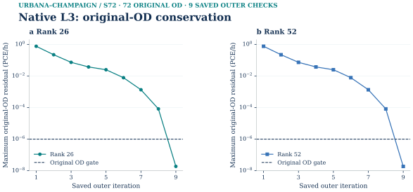</a>
All nine actual saved outer checks are retained for the accepted S72 Native26 and Native52 runs, using the original 72-OD conservation metric. The frozen gate is 1e−6 PCE/h; both runs first meet it at outer 9. Lines join actual saved iterations only, without smoothing or invented points. Earlier high residuals belong to these ultimately accepted trajectories. The two panels use identical ordinate limits. Rank 26 uses 98 path coordinates and rank 52 uses 124; each retains 26,602 explicit-link variables. These dimension counts are distinct from iteration counts.

<a href="https://scholarhaozheng.github.io/mobility-network-lab/assets/figure-contract-r12/figures/urbana-champaign/uc-native-od-conservation.svg">SVG</a> · <a href="https://scholarhaozheng.github.io/mobility-network-lab/assets/figure-contract-r12/figures/urbana-champaign/uc-native-od-conservation.png">PNG</a> · <a href="https://scholarhaozheng.github.io/mobility-network-lab/assets/figure-contract-r12/figures/urbana-champaign/uc-native-od-conservation.pdf">PDF</a> · <a href="https://scholarhaozheng.github.io/mobility-network-lab/assets/figure-contract-r12/figures/urbana-champaign/uc-native-od-conservation.source.json">Source data</a>

</td></tr></table></td></tr>
<tr><td width="100%" valign="top" align="left"></td></tr>
<tr><td width="100%" valign="top" align="left"></td></tr>
</table>

Original scalar comparison and selected static map

<table width="100%">
<tr><th width="50%" valign="top" align="left"><strong>Static objective and optimality checks</strong></th><td colspan="1" width="50%"></td></tr>
<tr><td width="50%" valign="top" align="left"><table width="100%"><tr><td valign="top" width="100%">
<a href="https://scholarhaozheng.github.io/mobility-network-lab/volumes/urbana-champaign.html#uc-r3-static-comparison">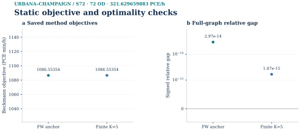</a>
FW and finite-path K=5 each retain their own independent saved S72 endpoint. The identical Beckmann values are shown as two distinct method-category points, with signed full-graph gaps on a separate axis. Method categories are not iterations. The existing FW and finite-path physical-flow maps and all-link histograms remain the primary spatial evidence; these scalar checks are supplementary. The 418-OD full-city and revised-transit demands are separate instances.

<a href="https://scholarhaozheng.github.io/mobility-network-lab/assets/figure-contract-r12/figures/urbana-champaign/uc-s72-method-endpoints.svg">SVG</a> · <a href="https://scholarhaozheng.github.io/mobility-network-lab/assets/figure-contract-r12/figures/urbana-champaign/uc-s72-method-endpoints.png">PNG</a> · <a href="https://scholarhaozheng.github.io/mobility-network-lab/assets/figure-contract-r12/figures/urbana-champaign/uc-s72-method-endpoints.pdf">PDF</a> · <a href="https://scholarhaozheng.github.io/mobility-network-lab/assets/figure-contract-r12/figures/urbana-champaign/uc-s72-method-endpoints.source.json">Source data</a>

</td></tr></table></td><td colspan="1" width="50%"></td></tr>
<tr><td width="50%" valign="top" align="left"></td><td colspan="1" width="50%"></td></tr>
<tr><td width="50%" valign="top" align="left"></td><td colspan="1" width="50%"></td></tr>
</table>

Earlier views and additional saved evidence

<table width="100%">
<tr><th width="33%" valign="top" align="left"><strong>Frank–Wolfe: physical-road loading</strong></th><th width="33%" valign="top" align="left"><strong>Frank–Wolfe: physical-road volume / capacity</strong></th><td colspan="1" width="33%"></td></tr>
<tr><td width="33%" valign="top" align="left"><table width="100%"><tr><td valign="top" width="100%">
<a href="https://scholarhaozheng.github.io/mobility-network-lab/volumes/urbana-champaign.html#figure-fs-a03">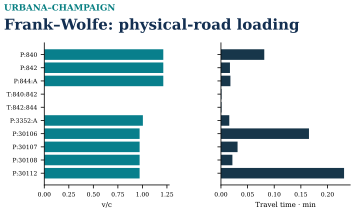</a>

Description, units and scope

v/c and BPR travel time for top 10 loaded links; v/c&gt;1 is allowed in static BPR. Single-pass engineering scenario; no local empirical calibration. These rankings use the saved solver-arc table and remain separate from the physical-road maps; virtual arcs are not road geometry. 19.303 km2 central urban subarea / weekday AM HBW

<a href="https://scholarhaozheng.github.io/mobility-network-lab/assets/figure-contract-r11/figures/urbana-champaign/urbana-champaign-fs_a03.png">PNG</a> · <a href="https://scholarhaozheng.github.io/mobility-network-lab/assets/figure-contract-r11/figures/urbana-champaign/urbana-champaign-fs_a03.svg">SVG</a> · <a href="https://scholarhaozheng.github.io/mobility-network-lab/assets/figure-contract-r11/figures/urbana-champaign/urbana-champaign-fs_a03.pdf">PDF</a> · <a href="https://scholarhaozheng.github.io/mobility-network-lab/assets/figure-contract-r11/figures/urbana-champaign/urbana-champaign-fs_a03.source.json">Source record</a>

</td></tr></table></td><td width="33%" valign="top" align="left"><table width="100%"><tr><td valign="top" width="100%">

Description, units and scope

Actual saved assignment backprojected only to physical traversal segments; model zone access and turn arcs excluded. Single-pass engineering scenario; no local empirical calibration. 19.303 km2 central urban subarea / weekday AM HBW

<a href="https://scholarhaozheng.github.io/mobility-network-lab/assets/figure-contract-r11/figures/urbana-champaign/urbana-champaign-fs_a05.png">PNG</a> · <a href="https://scholarhaozheng.github.io/mobility-network-lab/assets/figure-contract-r11/figures/urbana-champaign/urbana-champaign-fs_a05.svg">SVG</a> · <a href="https://scholarhaozheng.github.io/mobility-network-lab/assets/figure-contract-r11/figures/urbana-champaign/urbana-champaign-fs_a05.pdf">PDF</a> · <a href="https://scholarhaozheng.github.io/mobility-network-lab/assets/figure-contract-r11/figures/urbana-champaign/urbana-champaign-fs_a05.source.json">Source record</a>

</td></tr></table></td><td colspan="1" width="33%"></td></tr>
<tr><td width="33%" valign="top" align="left"></td><td width="33%" valign="top" align="left"></td><td colspan="1" width="33%"></td></tr>
<tr><td width="33%" valign="top" align="left">
<a href="https://scholarhaozheng.github.io/mobility-network-lab/volumes/urbana-champaign.html#figure-fs-a03">Complete city record · same evidence</a>
</td><td width="33%" valign="top" align="left">
<a href="https://scholarhaozheng.github.io/mobility-network-lab/volumes/urbana-champaign.html#figure-fs-a05">Complete city record · same evidence</a>
</td><td colspan="1" width="33%"></td></tr>
</table>

#### Time-expanded network and path examples

<table width="100%">
<tr><th width="50%" valign="top" align="left"><strong>Time-expanded network in layers</strong></th><th width="50%" valign="top" align="left"><strong>Local construction details</strong></th></tr>
<tr><td width="50%" valign="top" align="left"><a href="https://scholarhaozheng.github.io/mobility-network-lab/volumes/urbana-champaign.html#figure-parity-urbana-champaign-time-layers">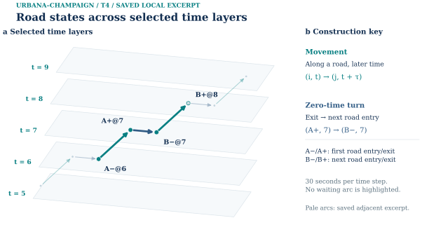</a></td><td width="50%" valign="top" align="left"><a href="https://scholarhaozheng.github.io/mobility-network-lab/volumes/urbana-champaign.html#figure-parity-urbana-champaign-local-construction">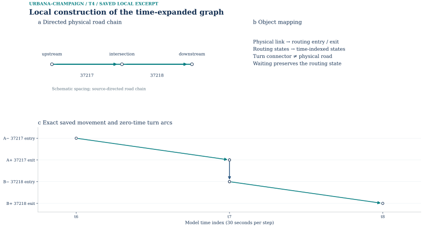</a></td></tr>
<tr><td width="50%" valign="top" align="left">
Urbana Champaign: the highlighted three saved arcs follow two physical road movements joined by a zero-time turn. The selected first fragment uses two full physical roads; the earlier split-road midpoint segment remains context only.

Description, units and scope

Urbana Champaign: the highlighted three saved arcs follow two physical road movements joined by a zero-time turn. The selected first fragment uses two full physical roads; the earlier split-road midpoint segment remains context only. Only the seven already public arcs are drawn; no additional graph arcs or alternative routes are asserted. Physical node labels are schematic roles, not invented node identifiers. A construction example is not an observed trajectory or capacity-active proof. The slanted planes and horizontal positions are schematic display coordinates. A−/A+ and B−/B+ denote entry/exit routing states, not original intersections. Exact state IDs, physical-road IDs and time indices are retained in plot data.

</td><td width="50%" valign="top" align="left">
Urbana Champaign: panels map two source-directed physical roads to four routing entry/exit states and their time-indexed movements. The selected first fragment uses two full physical roads; the earlier split-road midpoint segment remains context only.

Description, units and scope

Urbana Champaign: panels map two source-directed physical roads to four routing entry/exit states and their time-indexed movements. The selected first fragment uses two full physical roads; the earlier split-road midpoint segment remains context only. Only the seven already public arcs are drawn; no additional graph arcs or alternative routes are asserted. Physical node labels are schematic roles, not invented node identifiers. A construction example is not an observed trajectory or capacity-active proof. The turn has zero elapsed time; physical road durations are positive. No waiting arc is drawn and terminal bookkeeping states are outside this local excerpt. Plot data carry all exact source IDs, field values, and short-label aliases.

</td></tr>
<tr><td width="50%" valign="top" align="left">
<a href="https://scholarhaozheng.github.io/mobility-network-lab/volumes/urbana-champaign.html#figure-parity-urbana-champaign-time-layers">Complete evidence · same figure</a> · <a href="https://scholarhaozheng.github.io/mobility-network-lab/assets/template-parity-20261008/construction/urbana-champaign/time-layers.svg">SVG</a> · <a href="https://scholarhaozheng.github.io/mobility-network-lab/assets/template-parity-20261008/construction/urbana-champaign/time-layers.png">PNG</a> · <a href="https://scholarhaozheng.github.io/mobility-network-lab/assets/template-parity-20261008/construction/urbana-champaign/time-layers.pdf">PDF</a> · <a href="https://scholarhaozheng.github.io/mobility-network-lab/assets/template-parity-20261008/construction/urbana-champaign/time-layers.plot.json">Plot data</a> · <a href="https://scholarhaozheng.github.io/mobility-network-lab/assets/template-parity-20261008/construction/urbana-champaign/time-layers.source.json">Source record</a> · <a href="https://scholarhaozheng.github.io/mobility-network-lab/assets/template-parity-20261008/construction/urbana-champaign/time-layers.caption.md">Caption</a>
</td><td width="50%" valign="top" align="left">
<a href="https://scholarhaozheng.github.io/mobility-network-lab/volumes/urbana-champaign.html#figure-parity-urbana-champaign-local-construction">Complete evidence · same figure</a> · <a href="https://scholarhaozheng.github.io/mobility-network-lab/assets/template-parity-20261008/construction/urbana-champaign/local-construction.svg">SVG</a> · <a href="https://scholarhaozheng.github.io/mobility-network-lab/assets/template-parity-20261008/construction/urbana-champaign/local-construction.png">PNG</a> · <a href="https://scholarhaozheng.github.io/mobility-network-lab/assets/template-parity-20261008/construction/urbana-champaign/local-construction.pdf">PDF</a> · <a href="https://scholarhaozheng.github.io/mobility-network-lab/assets/template-parity-20261008/construction/urbana-champaign/local-construction.plot.json">Plot data</a> · <a href="https://scholarhaozheng.github.io/mobility-network-lab/assets/template-parity-20261008/construction/urbana-champaign/local-construction.source.json">Source record</a> · <a href="https://scholarhaozheng.github.io/mobility-network-lab/assets/template-parity-20261008/construction/urbana-champaign/local-construction.caption.md">Caption</a>
</td></tr>
</table>

Additional saved source figures
<ul><li><a href="https://scholarhaozheng.github.io/mobility-network-lab/assets/figure-contract-r11/figures/urbana-champaign/urbana-champaign-time-layers.svg">Column generation: saved time-layer route</a></li><li><a href="https://scholarhaozheng.github.io/mobility-network-lab/assets/figure-contract-r11/figures/urbana-champaign/urbana-champaign-computed-paths.svg">Column generation: computed paths</a></li></ul>

#### Optimization on the time-expanded network

<table width="100%">
<tr><th width="50%" valign="top" align="left"><strong>Original T4: selected demand and first five-minute bin</strong></th><th width="50%" valign="top" align="left"><strong>Original T4: timed physical arc utilization</strong></th></tr>
<tr><td width="50%" valign="top" align="left"><a href="https://scholarhaozheng.github.io/mobility-network-lab/volumes/urbana-champaign.html#uc-t4-demand-ledger">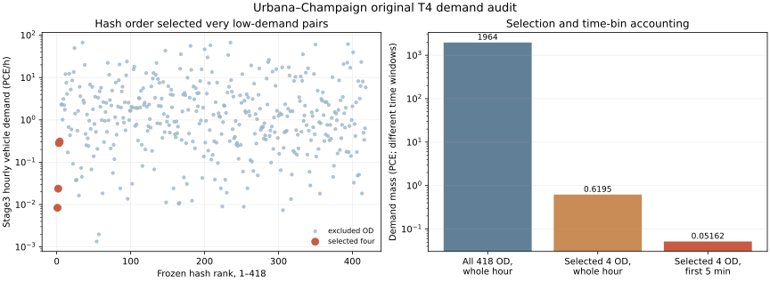</a></td><td width="50%" valign="top" align="left"><a href="https://scholarhaozheng.github.io/mobility-network-lab/volumes/urbana-champaign.html#uc-t4-capacity-use">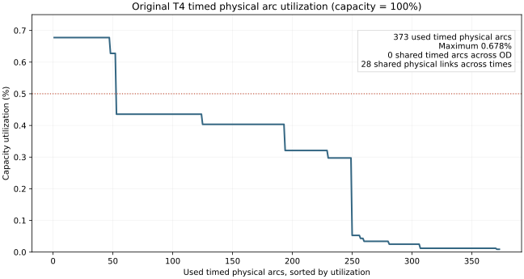</a></td></tr>
<tr><td width="50%" valign="top" align="left">
Original T4 demand accounting. The 418-OD hourly total, four selected hourly OD pairs, and selected first five-minute bin use different time windows. The four pairs follow frozen hash rank; the small first-bin mass is not a sampling rate. No new candidate is shown.
</td><td width="50%" valign="top" align="left">
Utilization on 373 used timed physical arcs of original T4, sorted by load/capacity. Maximum 0.6775913418476398%; dotted 0.5% is a visual guide, not a capacity threshold. No timed physical arc is shared across OD; 28 physical link IDs recur at different times. This does not certify a new candidate.
</td></tr>
<tr><td width="50%" valign="top" align="left">
<a href="https://scholarhaozheng.github.io/mobility-network-lab/volumes/urbana-champaign.html#uc-t4-demand-ledger">Complete city record · same figure</a> · <a href="https://scholarhaozheng.github.io/mobility-network-lab/assets/choicefw-scope-20261008/urbana-champaign/FIG01_DEMAND_LEDGER.svg">SVG</a> · <a href="https://scholarhaozheng.github.io/mobility-network-lab/assets/choicefw-scope-20261008/urbana-champaign/FIG01_DEMAND_LEDGER.png">PNG</a> · <a href="https://scholarhaozheng.github.io/mobility-network-lab/assets/mainline-publication-20261009/urbana-champaign/OD_LEDGER.csv">Saved model plot data</a> · <a href="https://scholarhaozheng.github.io/mobility-network-lab/assets/mainline-publication-20261009/urbana-champaign/DIAGNOSIS.json">Demand/capacity accounting</a> · <a href="https://scholarhaozheng.github.io/mobility-network-lab/assets/mainline-publication-20261009/NOTICE.md">Source and reuse notice</a> · <a href="https://scholarhaozheng.github.io/mobility-network-lab/assets/mainline-publication-20261009/MAINLINE_PUBLICATION_DECISION.json">Publication record</a>
</td><td width="50%" valign="top" align="left">
<a href="https://scholarhaozheng.github.io/mobility-network-lab/volumes/urbana-champaign.html#uc-t4-capacity-use">Complete city record · same figure</a> · <a href="https://scholarhaozheng.github.io/mobility-network-lab/assets/choicefw-scope-20261008/urbana-champaign/FIG02_T4_CAPACITY_USE.svg">SVG</a> · <a href="https://scholarhaozheng.github.io/mobility-network-lab/assets/choicefw-scope-20261008/urbana-champaign/FIG02_T4_CAPACITY_USE.png">PNG</a> · <a href="https://scholarhaozheng.github.io/mobility-network-lab/assets/mainline-publication-20261009/urbana-champaign/TIMED_MODEL_ARCS.csv">Saved model plot data</a> · <a href="https://scholarhaozheng.github.io/mobility-network-lab/assets/mainline-publication-20261009/urbana-champaign/DIAGNOSIS.json">Demand/capacity accounting</a> · <a href="https://scholarhaozheng.github.io/mobility-network-lab/assets/mainline-publication-20261009/NOTICE.md">Source and reuse notice</a> · <a href="https://scholarhaozheng.github.io/mobility-network-lab/assets/mainline-publication-20261009/MAINLINE_PUBLICATION_DECISION.json">Publication record</a>
</td></tr>
</table>

##### Two-phase column generation

<table width="100%">
<tr><th width="33%" valign="top" align="left"><strong>Phase I: artificial-flow clearance</strong></th><th width="33%" valign="top" align="left"><strong>Phase II objective</strong></th><th width="33%" valign="top" align="left"><strong>Independent pricing closure</strong></th></tr>
<tr><td width="33%" valign="top" align="left"><a href="https://scholarhaozheng.github.io/mobility-network-lab/volumes/urbana-champaign.html#figure-parity-urbana-champaign-cg-phase1">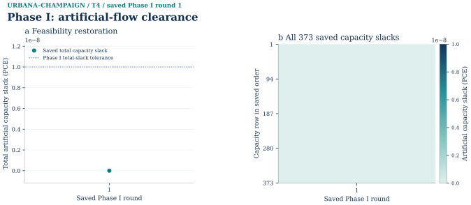</a></td><td width="33%" valign="top" align="left"><a href="https://scholarhaozheng.github.io/mobility-network-lab/volumes/urbana-champaign.html#figure-parity-urbana-champaign-cg-phase2">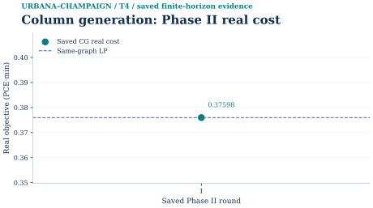</a></td><td width="33%" valign="top" align="left"><a href="https://scholarhaozheng.github.io/mobility-network-lab/volumes/urbana-champaign.html#figure-parity-urbana-champaign-cg-pricing">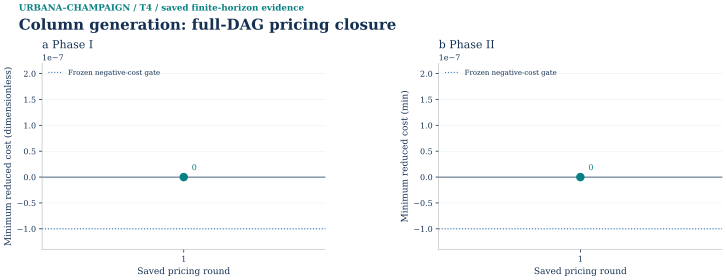</a></td></tr>
<tr><td width="33%" valign="top" align="left">

Description, units and scope

The sole saved Phase I restricted-master solution contains four path-flow variables followed by 373 nonnegative artificial capacity-slack variables. They relax shared physical-arc capacity rows; this model has no commodity-level artificial-flow variables. Both panels use the saved state directly: the total is exactly 0 PCE and every one of the 373 capacity slacks is exactly zero. Panel b preserves the complete saved capacity-row order; plot data link each row to its original dynamic-arc index and ID. The dotted line is the original 1e−8 PCE tolerance on total artificial slack; the heatmap uses 0 to that same value only as its color reference. Four input-cost seed paths already satisfy the bounded instance. A single recorded solve is shown without an invented multi-round trajectory. Phase I capacity feasibility remains separate from Phase II real cost and independent full-DAG pricing. Private local derivative of the saved numerical state; no new public asset release or optimizer run is claimed.

</td><td width="33%" valign="top" align="left">

Description, units and scope

One actual saved Phase II round. CG real cost is 0.3759836651335291 PCE·min; the separate same-graph LP reference is 0.37598366513352877 PCE·min. The marker and dashed reference can coincide at displayed precision. No Phase I artificial objective is connected to this real-cost objective. No new column after the four seed paths.

</td><td width="33%" valign="top" align="left">

Description, units and scope

The saved full-DAG pricing check is zero in both phases, against the frozen absolute tolerance 1e-7. Phase I reduced cost is dimensionless; Phase II reduced cost is minutes, so they have separate axes. Each phase has one actual round, four seed paths, and no new columns. Public data contain the global minimum per phase, not separate per-demand minima; no per-demand bars are fabricated.

</td></tr>
<tr><td width="33%" valign="top" align="left">
<a href="https://scholarhaozheng.github.io/mobility-network-lab/volumes/urbana-champaign.html#figure-parity-urbana-champaign-cg-phase1">Complete evidence · same figure</a> · <a href="https://scholarhaozheng.github.io/mobility-network-lab/assets/template-parity-20261008/optimization/urbana-champaign/cg-phase1.svg">SVG</a> · <a href="https://scholarhaozheng.github.io/mobility-network-lab/assets/template-parity-20261008/optimization/urbana-champaign/cg-phase1.png">PNG</a> · <a href="https://scholarhaozheng.github.io/mobility-network-lab/assets/template-parity-20261008/optimization/urbana-champaign/cg-phase1.pdf">PDF</a> · <a href="https://scholarhaozheng.github.io/mobility-network-lab/assets/template-parity-20261008/optimization/urbana-champaign/cg-phase1.plot.json">Plot data</a> · <a href="https://scholarhaozheng.github.io/mobility-network-lab/assets/template-parity-20261008/optimization/urbana-champaign/cg-phase1.source.json">Source record</a> · <a href="https://scholarhaozheng.github.io/mobility-network-lab/assets/template-parity-20261008/optimization/urbana-champaign/cg-phase1.caption.md">Caption</a>
</td><td width="33%" valign="top" align="left">
<a href="https://scholarhaozheng.github.io/mobility-network-lab/volumes/urbana-champaign.html#figure-parity-urbana-champaign-cg-phase2">Complete evidence · same figure</a> · <a href="https://scholarhaozheng.github.io/mobility-network-lab/assets/figure-contract-r12/figures/urbana-champaign/cg-phase2.svg">SVG</a> · <a href="https://scholarhaozheng.github.io/mobility-network-lab/assets/figure-contract-r12/figures/urbana-champaign/cg-phase2.png">PNG</a> · <a href="https://scholarhaozheng.github.io/mobility-network-lab/assets/figure-contract-r12/figures/urbana-champaign/cg-phase2.pdf">PDF</a> · <a href="https://scholarhaozheng.github.io/mobility-network-lab/assets/figure-contract-r12/figures/urbana-champaign/cg-phase2.plot.json">Plot data</a> · <a href="https://scholarhaozheng.github.io/mobility-network-lab/assets/figure-contract-r12/figures/urbana-champaign/cg-phase2.source.json">Source record</a>
</td><td width="33%" valign="top" align="left">
<a href="https://scholarhaozheng.github.io/mobility-network-lab/volumes/urbana-champaign.html#figure-parity-urbana-champaign-cg-pricing">Complete evidence · same figure</a> · <a href="https://scholarhaozheng.github.io/mobility-network-lab/assets/figure-contract-r12/figures/urbana-champaign/cg-pricing.svg">SVG</a> · <a href="https://scholarhaozheng.github.io/mobility-network-lab/assets/figure-contract-r12/figures/urbana-champaign/cg-pricing.png">PNG</a> · <a href="https://scholarhaozheng.github.io/mobility-network-lab/assets/figure-contract-r12/figures/urbana-champaign/cg-pricing.pdf">PDF</a> · <a href="https://scholarhaozheng.github.io/mobility-network-lab/assets/figure-contract-r12/figures/urbana-champaign/cg-pricing.plot.json">Plot data</a> · <a href="https://scholarhaozheng.github.io/mobility-network-lab/assets/figure-contract-r12/figures/urbana-champaign/cg-pricing.source.json">Source record</a>
</td></tr>
</table>

##### Lagrangian relaxation: bounds → prices → recovery

<table width="100%">
<tr><th width="33%" valign="top" align="left"><strong>Lagrangian bounds and certified gap</strong></th><th width="33%" valign="top" align="left"><strong>Capacity prices at the best dual bound</strong></th><th width="33%" valign="top" align="left"><strong>Path-pool growth and primal recovery</strong></th></tr>
<tr><td width="33%" valign="top" align="left"><a href="https://scholarhaozheng.github.io/mobility-network-lab/volumes/urbana-champaign.html#figure-parity-urbana-champaign-lr-bounds">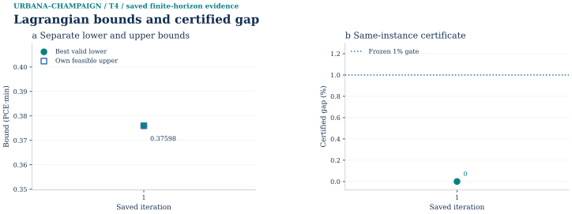</a></td><td width="33%" valign="top" align="left"><a href="https://scholarhaozheng.github.io/mobility-network-lab/volumes/urbana-champaign.html#figure-parity-urbana-champaign-lr-prices">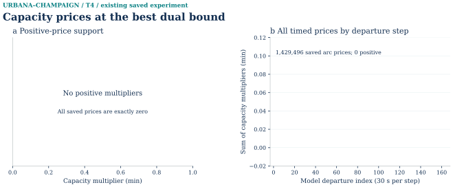</a></td><td width="33%" valign="top" align="left"><a href="https://scholarhaozheng.github.io/mobility-network-lab/volumes/urbana-champaign.html#figure-parity-urbana-champaign-lr-recovery">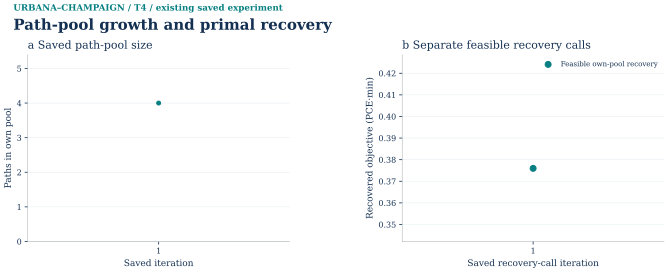</a></td></tr>
<tr><td width="33%" valign="top" align="left">

Description, units and scope

One actual LR iteration. Best valid lower is 0.3759836651335291 PCE·min; own recovered feasible upper is 0.37598366513352871 PCE·min. The certified gap is max(0,(U−L)/max(1,|U|)) = 0; the frozen gate is 1%. Lower and upper are separate markers at the same recorded iteration; they coincide to displayed precision. Tiny signed floating-point differences remain in the plot data. Capacities are nonbinding in this T4 pulse; this does not prove that city area caused the short trace.

</td><td width="33%" valign="top" align="left">

Description, units and scope

The saved best-bound multiplier vector contains 1,429,496 original dynamic-arc entries, all exactly zero. Consequently there is no nonempty top-price ranking. The second panel sums every timed multiplier by its real 30-second departure index, including the zero sums; source/sink entries without a time suffix are excluded only from the time aggregation. Empty positive support is shown explicitly, not replaced with another city or method. These numerical details remain a private local preview.

</td><td width="33%" valign="top" align="left">

Description, units and scope

One actual path-pool record and one actual feasible recovery call are shown in separate panels. The four paths belong to this method’s own pool; the objective is the saved recovered feasible upper bound. No intermediate call, pool growth or capacity-price effect is invented. A filled marker denotes a feasible call, as in Boston/Hong Kong.

</td></tr>
<tr><td width="33%" valign="top" align="left">
<a href="https://scholarhaozheng.github.io/mobility-network-lab/volumes/urbana-champaign.html#figure-parity-urbana-champaign-lr-bounds">Complete evidence · same figure</a> · <a href="https://scholarhaozheng.github.io/mobility-network-lab/assets/figure-contract-r12/figures/urbana-champaign/lr-bounds.svg">SVG</a> · <a href="https://scholarhaozheng.github.io/mobility-network-lab/assets/figure-contract-r12/figures/urbana-champaign/lr-bounds.png">PNG</a> · <a href="https://scholarhaozheng.github.io/mobility-network-lab/assets/figure-contract-r12/figures/urbana-champaign/lr-bounds.pdf">PDF</a> · <a href="https://scholarhaozheng.github.io/mobility-network-lab/assets/figure-contract-r12/figures/urbana-champaign/lr-bounds.plot.json">Plot data</a> · <a href="https://scholarhaozheng.github.io/mobility-network-lab/assets/figure-contract-r12/figures/urbana-champaign/lr-bounds.source.json">Source record</a>
</td><td width="33%" valign="top" align="left">
<a href="https://scholarhaozheng.github.io/mobility-network-lab/volumes/urbana-champaign.html#figure-parity-urbana-champaign-lr-prices">Complete evidence · same figure</a> · <a href="https://scholarhaozheng.github.io/mobility-network-lab/assets/template-parity-20261008/optimization/urbana-champaign/lr-prices.svg">SVG</a> · <a href="https://scholarhaozheng.github.io/mobility-network-lab/assets/template-parity-20261008/optimization/urbana-champaign/lr-prices.png">PNG</a> · <a href="https://scholarhaozheng.github.io/mobility-network-lab/assets/template-parity-20261008/optimization/urbana-champaign/lr-prices.pdf">PDF</a> · <a href="https://scholarhaozheng.github.io/mobility-network-lab/assets/template-parity-20261008/optimization/urbana-champaign/lr-prices.plot.json">Plot data</a> · <a href="https://scholarhaozheng.github.io/mobility-network-lab/assets/template-parity-20261008/optimization/urbana-champaign/lr-prices.source.json">Source record</a> · <a href="https://scholarhaozheng.github.io/mobility-network-lab/assets/template-parity-20261008/optimization/urbana-champaign/lr-prices.caption.md">Caption</a>
</td><td width="33%" valign="top" align="left">
<a href="https://scholarhaozheng.github.io/mobility-network-lab/volumes/urbana-champaign.html#figure-parity-urbana-champaign-lr-recovery">Complete evidence · same figure</a> · <a href="https://scholarhaozheng.github.io/mobility-network-lab/assets/template-parity-20261008/optimization/urbana-champaign/lr-recovery.svg">SVG</a> · <a href="https://scholarhaozheng.github.io/mobility-network-lab/assets/template-parity-20261008/optimization/urbana-champaign/lr-recovery.png">PNG</a> · <a href="https://scholarhaozheng.github.io/mobility-network-lab/assets/template-parity-20261008/optimization/urbana-champaign/lr-recovery.pdf">PDF</a> · <a href="https://scholarhaozheng.github.io/mobility-network-lab/assets/template-parity-20261008/optimization/urbana-champaign/lr-recovery.plot.json">Plot data</a> · <a href="https://scholarhaozheng.github.io/mobility-network-lab/assets/template-parity-20261008/optimization/urbana-champaign/lr-recovery.source.json">Source record</a> · <a href="https://scholarhaozheng.github.io/mobility-network-lab/assets/template-parity-20261008/optimization/urbana-champaign/lr-recovery.caption.md">Caption</a>
</td></tr>
</table>

##### ADMM: convergence → conservation → physical flow

<table width="100%">
<tr><th width="33%" valign="top" align="left"><strong>ADMM residuals and objective agreement</strong></th><th width="33%" valign="top" align="left"><strong>ADMM: final commodity conservation</strong></th><th width="33%" valign="top" align="left"><strong>ADMM: physical-road flow comparison</strong></th></tr>
<tr><td width="33%" valign="top" align="left"><table width="100%"><tr><td valign="top" width="100%">
<a href="https://scholarhaozheng.github.io/mobility-network-lab/volumes/urbana-champaign.html#figure-r9-urbana-champaign-admm-main">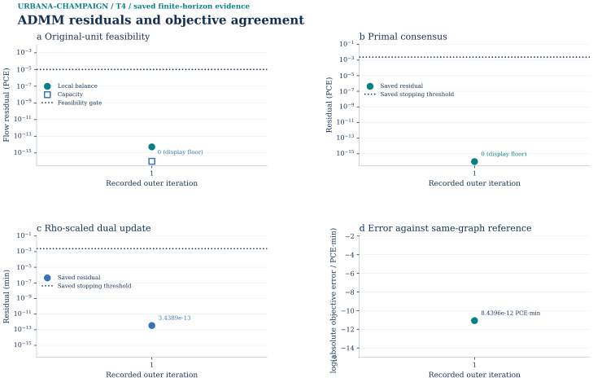</a>
Four diagnostic panels follow the Hong Kong ADMM figure: original-unit feasibility, primal consensus, rho-scaled dual update, and log10 absolute objective error against the independent same-graph reference. This instance saved exactly one completed outer update, shown as a point rather than an invented convergence curve. Balance, capacity, and primal use PCE; rho-scaled dual and its own threshold use minutes. Only exact-zero residuals use a labeled 1e-16 display floor; positive residuals are unchanged. Objective-error display floor is 1e-15 PCE·min. Saved internal thresholds and the 1e-5 PCE feasibility gate are retained. All displayed states meet the frozen independent gates; objective agreement is not a claim of identical link flows.

<a href="https://scholarhaozheng.github.io/mobility-network-lab/assets/figure-contract-r12/figures/urbana-champaign/admm-saved-state.svg">SVG</a> · <a href="https://scholarhaozheng.github.io/mobility-network-lab/assets/figure-contract-r12/figures/urbana-champaign/admm-saved-state.png">PNG</a> · <a href="https://scholarhaozheng.github.io/mobility-network-lab/assets/figure-contract-r12/figures/urbana-champaign/admm-saved-state.pdf">PDF</a> · <a href="https://scholarhaozheng.github.io/mobility-network-lab/assets/figure-contract-r12/figures/urbana-champaign/admm-saved-state.source.json">Source data</a>

</td></tr></table></td><td width="33%" valign="top" align="left"><table width="100%"><tr><td valign="top" width="100%">
<a href="https://scholarhaozheng.github.io/mobility-network-lab/volumes/urbana-champaign.html#figure-r9-admm-final-balance">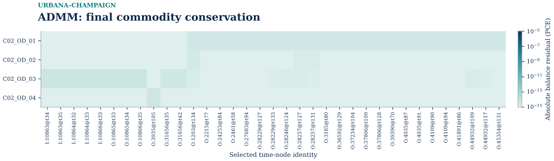</a>

Description, units and scope

Four-commodity finite T4 final state, one completed update The heatmap is the saved final spatial conservation state, not an iteration-history heatmap. The displayed color floor and unchanged gate are retained; all exact raw residual values remain in the linked public plot data.

<a href="https://scholarhaozheng.github.io/mobility-network-lab/assets/figure-contract-r11/figures/urbana-champaign/urbana-champaign-admm-final-balance.png">PNG</a> · <a href="https://scholarhaozheng.github.io/mobility-network-lab/assets/figure-contract-r11/figures/urbana-champaign/urbana-champaign-admm-final-balance.svg">SVG</a> · <a href="https://scholarhaozheng.github.io/mobility-network-lab/assets/figure-contract-r11/figures/urbana-champaign/urbana-champaign-admm-final-balance.pdf">PDF</a> · <a href="https://scholarhaozheng.github.io/mobility-network-lab/assets/figure-contract-r11/figures/urbana-champaign/urbana-champaign-admm-final-balance.source.json">Source record</a>

</td></tr></table></td><td width="33%" valign="top" align="left"><table width="100%"><tr><td valign="top" width="100%">

Description, units and scope

ADMM and exact LP on physical roads Own ADMM physical-road vector and exact LP on the frozen four-OD pulse. The signed map shows roundoff-sized differences; this is a final spatial state comparison.

<a href="https://scholarhaozheng.github.io/mobility-network-lab/assets/figure-contract-r11/figures/urbana-champaign/urbana-champaign-admm-physical.png">PNG</a> · <a href="https://scholarhaozheng.github.io/mobility-network-lab/assets/figure-contract-r11/figures/urbana-champaign/urbana-champaign-admm-physical.svg">SVG</a> · <a href="https://scholarhaozheng.github.io/mobility-network-lab/assets/figure-contract-r11/figures/urbana-champaign/urbana-champaign-admm-physical.pdf">PDF</a> · <a href="https://scholarhaozheng.github.io/mobility-network-lab/assets/figure-contract-r11/figures/urbana-champaign/urbana-champaign-admm-physical.source.json">Source record</a>

</td></tr></table></td></tr>
<tr><td width="33%" valign="top" align="left"></td><td width="33%" valign="top" align="left"></td><td width="33%" valign="top" align="left"></td></tr>
<tr><td width="33%" valign="top" align="left"></td><td width="33%" valign="top" align="left">
<a href="https://scholarhaozheng.github.io/mobility-network-lab/volumes/urbana-champaign.html#figure-r9-admm-final-balance">Complete city record · same evidence</a>
</td><td width="33%" valign="top" align="left">
<a href="https://scholarhaozheng.github.io/mobility-network-lab/volumes/urbana-champaign.html#uc-r3-admm-physical">Complete city record · same evidence</a>
</td></tr>
</table>

Additional accepted source evidence
<ul><li><a href="https://scholarhaozheng.github.io/mobility-network-lab/assets/figure-contract-r12/figures/urbana-champaign/cg-phase1.svg">Column generation: Phase I feasibility</a></li><li><a href="https://scholarhaozheng.github.io/mobility-network-lab/assets/figure-contract-r12/figures/urbana-champaign/cg-phase2.svg">Column generation: Phase II real cost</a></li><li><a href="https://scholarhaozheng.github.io/mobility-network-lab/assets/figure-contract-r12/figures/urbana-champaign/cg-pricing.svg">Column generation: full-DAG pricing closure</a></li><li><a href="https://scholarhaozheng.github.io/mobility-network-lab/assets/figure-contract-r12/figures/urbana-champaign/lr-bounds.svg">Lagrangian bounds and certified gap</a></li><li><a href="https://scholarhaozheng.github.io/mobility-network-lab/assets/figure-contract-r12/figures/urbana-champaign/lr-prices-recovery.svg">Lagrangian prices and recovery</a></li></ul>

Other reusable evidence

<table width="100%">
<tr><th width="100%" valign="top" align="left"><strong>Multiresolution geographic reference</strong></th></tr>
<tr><td width="100%" valign="top" align="left"><table width="100%"><tr><td valign="top" width="100%">
<a href="https://scholarhaozheng.github.io/mobility-network-lab/volumes/urbana-champaign.html#figure-f08-s2">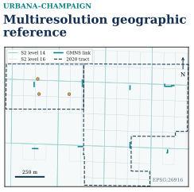</a>

Description, units and scope

The earlier 29-object S2 sample, separate from the four-stage demand and assignment. S2 14/16 shown - 12 parent IDs

<a href="https://scholarhaozheng.github.io/mobility-network-lab/assets/figure-contract-r11/figures/urbana-champaign/urbana-champaign-f08_s2.png">PNG</a> · <a href="https://scholarhaozheng.github.io/mobility-network-lab/assets/figure-contract-r11/figures/urbana-champaign/urbana-champaign-f08_s2.svg">SVG</a> · <a href="https://scholarhaozheng.github.io/mobility-network-lab/assets/figure-contract-r11/figures/urbana-champaign/urbana-champaign-f08_s2.pdf">PDF</a> · <a href="https://scholarhaozheng.github.io/mobility-network-lab/assets/figure-contract-r11/figures/urbana-champaign/urbana-champaign-f08_s2.source.json">Source record</a>

</td></tr></table></td></tr>
<tr><td width="100%" valign="top" align="left"></td></tr>
<tr><td width="100%" valign="top" align="left">
<a href="https://scholarhaozheng.github.io/mobility-network-lab/volumes/urbana-champaign.html#figure-f08-s2">Complete city record · same evidence</a>
</td></tr>
</table>

8 October 2026 release · shared sources and notices

The following source and scope notices apply to the adjacent figures.

Engineering scenario, not observed ridership or local calibration. Data provided by Champaign-Urbana Mass Transit District; dated 2026-10-07 timetable, not live rider advice. © OpenStreetMap contributors, ODbL: https://www.openstreetmap.org/copyright. CUMTD terms: https://developer.mtd.org/terms-of-use/

### Ithaca

Saved S110 static and T4 finite numerical endpoints are now accepted within their frozen scope. Native rank 26/52 each use four actual outer steps; the tiny T4 pulse makes all capacity rows redundant. The new observation figures remain diagnostics, and the employment allocation did not feed the old generation model. [Latest accepted evidence →](https://scholarhaozheng.github.io/mobility-network-lab/volumes/ithaca.html#gap-20261008)

<table width="100%"><thead><tr><th valign="top" width="25%">City/model foundation</th><th valign="top" width="25%">Static assignment</th><th valign="top" width="25%">Finite time-expanded</th><th valign="top" width="25%">Observation/data scope</th></tr></thead>
<tbody><tr><td valign="top" width="25%">The preflight graph has 20,928 nodes and 24,420 segments; the separate four-stage graph has 15,148 physical directed roads plus turn/access arcs.</td><td valign="top" width="25%">S110 FW: zero updates; finite path: endpoint only, nit=1; Native26/52: four actual outer steps. Four method categories are not four iterations.</td><td valign="top" width="25%">Accepted saved T4 LP/CG/LR/ADMM endpoints: 0.6567553604341558 PCE pulse versus 2.5 PCE minimum physical arc capacity; all capacity rows redundant.</td><td valign="top" width="25%">Aggregate link-bridge and 2015–2019/2022 count evidence remain diagnostic. No accepted route calibration or contemporaneous holdout; precise traces remain private.</td></tr></tbody></table>

Local reading edition · saved-result figures aligned with Boston and Hong Kong · [Figure guide and saved-state interpretation](https://scholarhaozheng.github.io/mobility-network-lab/figure-update-status.html#top)

[Sources and GMNS](#ithaca-sources) · [Population, households and activity](#ithaca-population) · [Transit and observations](#ithaca-transit) · [Trip generation](#ithaca-generation) · [Trip distribution](#ithaca-distribution) · [Mode choice](#ithaca-mode) · [Static assignment methods](#ithaca-static) · [Time-expanded network and path examples](#ithaca-representation) · [Optimization on the time-expanded network](#ithaca-finite)

#### Sources and GMNS

<table width="100%">
<tr><th width="100%" valign="top" align="left"><strong>Retained physical road graph</strong></th></tr>
<tr><td width="100%" valign="top" align="left"><table width="100%"><tr><td valign="top" width="100%">

Description, units and scope

15,148 retained physical directed traversals in the saved 11:00–12:00 local activity model, shown in EPSG:26918. This is the retained model graph, not a claim to draw every road in the source archive. Virtual movements are excluded; colour has no traffic meaning. © OpenStreetMap contributors / ODbL. Reciprocal directed arcs can share geometry; no assigned flow is encoded. This drawing uses the frozen run_20261005 evidence. Later supplementary datasets are separate and are not implied to have entered this scenario.

<a href="https://scholarhaozheng.github.io/mobility-network-lab/assets/figure-contract-r11/figures/ithaca/sources.png">PNG</a> · <a href="https://scholarhaozheng.github.io/mobility-network-lab/assets/figure-contract-r11/figures/ithaca/sources.svg">SVG</a> · <a href="https://scholarhaozheng.github.io/mobility-network-lab/assets/figure-contract-r11/figures/ithaca/sources.pdf">PDF</a> · <a href="https://scholarhaozheng.github.io/mobility-network-lab/assets/figure-contract-r11/figures/ithaca/sources.source.json">Source record</a>

</td></tr></table></td></tr>
<tr><td width="100%" valign="top" align="left"></td></tr>
<tr><td width="100%" valign="top" align="left">
<a href="https://scholarhaozheng.github.io/mobility-network-lab/volumes/ithaca.html#figure-r3-sources">Complete city record · same evidence</a>
</td></tr>
</table>

#### Population, households and activity

The released employment figure distinguishes fully contained, intersected and area-weighted jobs. These added fields were not consumed by the original HBO_LOCAL_ACTIVITY generation; they do not revise the old trip totals. [Figure guide and saved-state interpretation](https://scholarhaozheng.github.io/mobility-network-lab/figure-update-status.html#top) · [Current release details](https://scholarhaozheng.github.io/mobility-network-lab/volumes/ithaca.html#gap-20261008)

##### Latest released evidence · 8 October 2026

<table width="100%">
<tr><th width="100%" valign="top" align="left"><strong>Employment allocation and spatial accounting limits</strong></th></tr>
<tr><td width="100%" valign="top" align="left"><table width="100%"><tr><td valign="top" width="100%">
<a href="https://scholarhaozheng.github.io/mobility-network-lab/volumes/ithaca.html#figure-gap-ith-gc01-employment">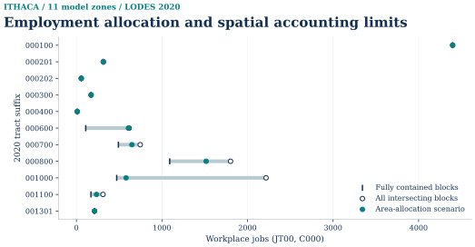</a>

Description, units and scope

Grey spans run from fully contained to all intersecting blocks; they are spatial accounting limits, not confidence intervals. Totals are 7,493 contained, 8,752.529 area-allocated and 10,858 intersecting-block jobs. This supplement did not replace the frozen HBO activity attraction. Frozen Ithaca S110 static and T4 finite fixed-cost endpoints, not DNL/DUE or local calibration. T4 capacity is nonbinding (0.65675536 PCE pulse versus 2.5 PCE minimum physical arc capacity). U.S. Census/LEHD, NYSDOT and © OpenStreetMap contributors, ODbL: https://www.openstreetmap.org/copyright.

<a href="https://scholarhaozheng.github.io/mobility-network-lab/assets/figure-contract-r11/figures/ithaca/ith-employment-allocation.png">PNG</a> · <a href="https://scholarhaozheng.github.io/mobility-network-lab/assets/figure-contract-r11/figures/ithaca/ith-employment-allocation.svg">SVG</a> · <a href="https://scholarhaozheng.github.io/mobility-network-lab/assets/figure-contract-r11/figures/ithaca/ith-employment-allocation.pdf">PDF</a> · <a href="https://scholarhaozheng.github.io/mobility-network-lab/assets/figure-contract-r11/figures/ithaca/ith-employment-allocation.source.json">Source record</a>

</td></tr></table></td></tr>
<tr><td width="100%" valign="top" align="left"></td></tr>
<tr><td width="100%" valign="top" align="left">
<a href="https://scholarhaozheng.github.io/mobility-network-lab/volumes/ithaca.html#figure-gap-ith-gc01-employment">Complete city record · same evidence</a>
</td></tr>
</table>

<table width="100%">
<tr><th width="100%" valign="top" align="left"><strong>Population and household inputs</strong></th></tr>
<tr><td width="100%" valign="top" align="left"><table width="100%"><tr><td valign="top" width="100%">
<a href="https://scholarhaozheng.github.io/mobility-network-lab/volumes/ithaca.html#figure-r3-population">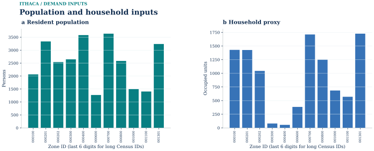</a>

Description, units and scope

Saved clipped-zone demographic allocation; not a campus census. All 11 zones are retained; population total 27,797.9. Occupied units total 10,362. Missing household fields are unknown, not zero. Census/ACS allocation is an input, not a simulated traffic quantity. This drawing uses the frozen run_20261005 evidence. Later supplementary datasets are separate and are not implied to have entered this scenario.

<a href="https://scholarhaozheng.github.io/mobility-network-lab/assets/figure-contract-r11/figures/ithaca/population.png">PNG</a> · <a href="https://scholarhaozheng.github.io/mobility-network-lab/assets/figure-contract-r11/figures/ithaca/population.svg">SVG</a> · <a href="https://scholarhaozheng.github.io/mobility-network-lab/assets/figure-contract-r11/figures/ithaca/population.pdf">PDF</a> · <a href="https://scholarhaozheng.github.io/mobility-network-lab/assets/figure-contract-r11/figures/ithaca/population.source.json">Source record</a>

</td></tr></table></td></tr>
<tr><td width="100%" valign="top" align="left"></td></tr>
<tr><td width="100%" valign="top" align="left">
<a href="https://scholarhaozheng.github.io/mobility-network-lab/volumes/ithaca.html#figure-r3-population">Complete city record · same evidence</a>
</td></tr>
</table>

#### Transit and observations

The new aggregate observation figures are diagnostic: source-link candidates are not accepted routes, 2015–2019 record counts are not summed traffic volumes, and 2022 station-ID matches do not establish a fresh calibrated holdout. [Figure guide and saved-state interpretation](https://scholarhaozheng.github.io/mobility-network-lab/figure-update-status.html#top) · [Current release details](https://scholarhaozheng.github.io/mobility-network-lab/volumes/ithaca.html#gap-20261008)

Latest diagnostic evidence · limits remain in force

<table width="100%">
<tr><th width="33%" valign="top" align="left"><strong>Observation source links and network coverage</strong></th><th width="33%" valign="top" align="left"><strong>Historical count-record coverage</strong></th><th width="33%" valign="top" align="left"><strong>2022 observed counts and location evidence</strong></th></tr>
<tr><td width="33%" valign="top" align="left"><table width="100%"><tr><td valign="top" width="100%">
<a href="https://scholarhaozheng.github.io/mobility-network-lab/volumes/ithaca.html#figure-gap-ith-gc02b-observation-counts">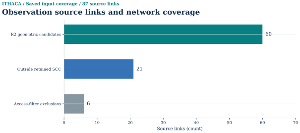</a>
Saved source-link coverage contains 87 records: 60 remain geometric R2 candidates, 21 have endpoints outside the retained strongly connected component, and 6 are excluded by access filtering. The latter 27 are unbridged. These are input coverage categories. Candidate geometry does not establish an exact matched route, legal-turn validation, observed link flow or local calibration. All category counts come directly from the released aggregate CSV.

<a href="https://scholarhaozheng.github.io/mobility-network-lab/assets/figure-contract-r12/figures/ithaca/observation-source-coverage.svg">SVG</a> · <a href="https://scholarhaozheng.github.io/mobility-network-lab/assets/figure-contract-r12/figures/ithaca/observation-source-coverage.png">PNG</a> · <a href="https://scholarhaozheng.github.io/mobility-network-lab/assets/figure-contract-r12/figures/ithaca/observation-source-coverage.pdf">PDF</a> · <a href="https://scholarhaozheng.github.io/mobility-network-lab/assets/figure-contract-r12/figures/ithaca/observation-source-coverage.source.json">Source data</a>

</td></tr></table></td><td width="33%" valign="top" align="left"><table width="100%"><tr><td valign="top" width="100%">
<a href="https://scholarhaozheng.github.io/mobility-network-lab/volumes/ithaca.html#figure-gap-ith-gc05-count-coverage">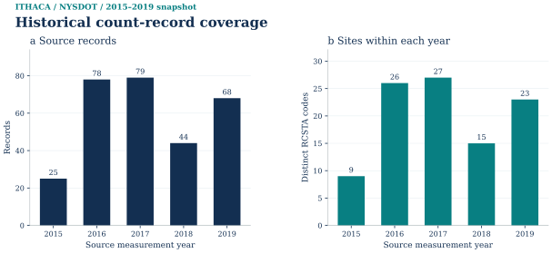</a>

Description, units and scope

The bounded acquisition contains 294 records and 76 unique RCSTA sites overall. Sites repeat across years; the annual site counts must not be added as distinct sites. Directional and combined count records are not summed vehicle volumes, and this is not a calibrated 2026 holdout. Frozen Ithaca S110 static and T4 finite fixed-cost endpoints, not DNL/DUE or local calibration. T4 capacity is nonbinding (0.65675536 PCE pulse versus 2.5 PCE minimum physical arc capacity). U.S. Census/LEHD, NYSDOT and © OpenStreetMap contributors, ODbL: https://www.openstreetmap.org/copyright.

<a href="https://scholarhaozheng.github.io/mobility-network-lab/assets/figure-contract-r11/figures/ithaca/ith-count-record-coverage.png">PNG</a> · <a href="https://scholarhaozheng.github.io/mobility-network-lab/assets/figure-contract-r11/figures/ithaca/ith-count-record-coverage.svg">SVG</a> · <a href="https://scholarhaozheng.github.io/mobility-network-lab/assets/figure-contract-r11/figures/ithaca/ith-count-record-coverage.pdf">PDF</a> · <a href="https://scholarhaozheng.github.io/mobility-network-lab/assets/figure-contract-r11/figures/ithaca/ith-count-record-coverage.source.json">Source record</a>

</td></tr></table></td><td width="33%" valign="top" align="left"><table width="100%"><tr><td valign="top" width="100%">
<a href="https://scholarhaozheng.github.io/mobility-network-lab/volumes/ithaca.html#figure-gap-ith-gc06-counts-2022">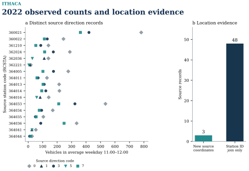</a>
GC06. Actual 2022 NYSDOT Region 03 source worksheet rows joined by 17 historical inside-model RCSTA codes: 51 records, three direction records per station. Panel a preserves source FEDERAL_DIRECTION codes rather than resolving recorder heading; combined and directional records must not be summed. Each plotted value is the unmodified AVG_WKDAY_INTERVAL_12 vehicle count, range 5–781, not PCE and not a model prediction. Panel b shows that only 3 source rows provide new coordinates, all inside the original extent; the remaining 48 are station-ID matches and do not establish updated recorder location. No local calibration, simultaneous observation, or fresh holdout is claimed. No precise GPS route coordinates are present. The scientific marks, source-direction symbols, axes and 51 plotted records are preserved exactly from the approved SVG. Only the outer typography and whitespace were adjusted. No underlying record CSV was reverse-engineered or published; these observed vehicle counts are not converted to PCE.

<a href="https://scholarhaozheng.github.io/mobility-network-lab/assets/figure-contract-r12/figures/ithaca/observed-counts-2022.svg">SVG</a> · <a href="https://scholarhaozheng.github.io/mobility-network-lab/assets/figure-contract-r12/figures/ithaca/observed-counts-2022.png">PNG</a> · <a href="https://scholarhaozheng.github.io/mobility-network-lab/assets/figure-contract-r12/figures/ithaca/observed-counts-2022.pdf">PDF</a> · <a href="https://scholarhaozheng.github.io/mobility-network-lab/assets/figure-contract-r12/figures/ithaca/observed-counts-2022.source.json">Source data</a>

</td></tr></table></td></tr>
<tr><td width="33%" valign="top" align="left"></td><td width="33%" valign="top" align="left"></td><td width="33%" valign="top" align="left"></td></tr>
<tr><td width="33%" valign="top" align="left"></td><td width="33%" valign="top" align="left">
<a href="https://scholarhaozheng.github.io/mobility-network-lab/volumes/ithaca.html#figure-gap-ith-gc05-count-coverage">Complete city record · same evidence</a>
</td><td width="33%" valign="top" align="left"></td></tr>
</table>

<table width="100%">
<tr><th width="100%" valign="top" align="left"><strong>Transit source geography</strong></th></tr>
<tr><td width="100%" valign="top" align="left"><table width="100%"><tr><td valign="top" width="100%">

Description, units and scope

TCAT stops / 2026-10-05 service-day flags. Service-day flags do not certify pedestrian access or observed ridership. The gray retained road graph is geographic context, not a transit route model. Source stops and route shapes do not establish legal pedestrian access, operating service, or observed ridership. This drawing uses the frozen run_20261005 evidence. Later supplementary datasets are separate and are not implied to have entered this scenario.

<a href="https://scholarhaozheng.github.io/mobility-network-lab/assets/figure-contract-r11/figures/ithaca/transit.png">PNG</a> · <a href="https://scholarhaozheng.github.io/mobility-network-lab/assets/figure-contract-r11/figures/ithaca/transit.svg">SVG</a> · <a href="https://scholarhaozheng.github.io/mobility-network-lab/assets/figure-contract-r11/figures/ithaca/transit.pdf">PDF</a> · <a href="https://scholarhaozheng.github.io/mobility-network-lab/assets/figure-contract-r11/figures/ithaca/transit.source.json">Source record</a>

</td></tr></table></td></tr>
<tr><td width="100%" valign="top" align="left"></td></tr>
<tr><td width="100%" valign="top" align="left">
<a href="https://scholarhaozheng.github.io/mobility-network-lab/volumes/ithaca.html#figure-r3-transit">Complete city record · same evidence</a>
</td></tr>
</table>

#### Trip generation

<table width="100%">
<tr><th width="100%" valign="top" align="left"><strong>Trip generation and demand accounting</strong></th></tr>
<tr><td width="100%" valign="top" align="left"><table width="100%"><tr><td valign="top" width="100%">
<a href="https://scholarhaozheng.github.io/mobility-network-lab/volumes/ithaca.html#figure-fs-g01">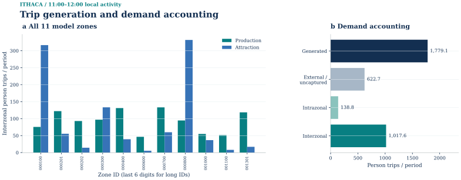</a>

Description, units and scope

All 11 zones; 11:00–12:00 local activity. The left panel shows saved interzonal productions/attractions. The right panel accounts for all generated persons, including excluded and intrazonal components. No top-12 truncation. Scenario assumptions, not measured trip counts. External and intrazonal components do not enter interzonal assignment; attractions are normalized to productions. This drawing uses the frozen run_20261005 evidence. Later supplementary datasets are separate and are not implied to have entered this scenario.

<a href="https://scholarhaozheng.github.io/mobility-network-lab/assets/figure-contract-r11/figures/ithaca/generation.png">PNG</a> · <a href="https://scholarhaozheng.github.io/mobility-network-lab/assets/figure-contract-r11/figures/ithaca/generation.svg">SVG</a> · <a href="https://scholarhaozheng.github.io/mobility-network-lab/assets/figure-contract-r11/figures/ithaca/generation.pdf">PDF</a> · <a href="https://scholarhaozheng.github.io/mobility-network-lab/assets/figure-contract-r11/figures/ithaca/generation.source.json">Source record</a>

</td></tr></table></td></tr>
<tr><td width="100%" valign="top" align="left"></td></tr>
<tr><td width="100%" valign="top" align="left">
<a href="https://scholarhaozheng.github.io/mobility-network-lab/volumes/ithaca.html#figure-fs-g01">Complete city record · same evidence</a>
</td></tr>
</table>

#### Trip distribution

<table width="100%">
<tr><th width="100%" valign="top" align="left"><strong>Trip distribution and directed OD margins</strong></th></tr>
<tr><td width="100%" valign="top" align="left"><table width="100%"><tr><td valign="top" width="100%">
<a href="https://scholarhaozheng.github.io/mobility-network-lab/volumes/ithaca.html#figure-fs-d01">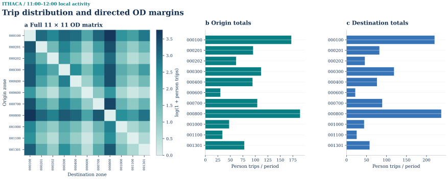</a>

Description, units and scope

Full 11×11 model-zone matrix including zero cells; 110 positive OD pairs and 1,017.627191536 persons in 11:00–12:00 local activity. Colours are log(1+persons); margins are untransformed directed OD totals after PA direction. Every model zone is retained. Zero rows and columns remain visible; intrazonal cells are structural zeros. Labels use the final six digits of long zone IDs. This drawing uses the frozen run_20261005 evidence. Later supplementary datasets are separate and are not implied to have entered this scenario.

<a href="https://scholarhaozheng.github.io/mobility-network-lab/assets/figure-contract-r11/figures/ithaca/distribution.png">PNG</a> · <a href="https://scholarhaozheng.github.io/mobility-network-lab/assets/figure-contract-r11/figures/ithaca/distribution.svg">SVG</a> · <a href="https://scholarhaozheng.github.io/mobility-network-lab/assets/figure-contract-r11/figures/ithaca/distribution.pdf">PDF</a> · <a href="https://scholarhaozheng.github.io/mobility-network-lab/assets/figure-contract-r11/figures/ithaca/distribution.source.json">Source record</a>

</td></tr></table></td></tr>
<tr><td width="100%" valign="top" align="left"></td></tr>
<tr><td width="100%" valign="top" align="left">
<a href="https://scholarhaozheng.github.io/mobility-network-lab/volumes/ithaca.html#figure-fs-d01">Complete city record · same evidence</a>
</td></tr>
</table>

#### Mode choice

<table width="100%">
<tr><th width="100%" valign="top" align="left"><strong>Mode choice: demand, cost and availability</strong></th></tr>
<tr><td width="100%" valign="top" align="left"><table width="100%"><tr><td valign="top" width="100%">
<a href="https://scholarhaozheng.github.io/mobility-network-lab/volumes/ithaca.html#figure-fs-m01">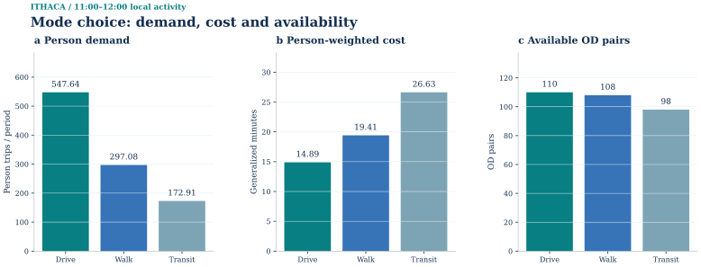</a>

Description, units and scope

Saved OD-specific choice in 11:00–12:00 local activity; sums over every positive-demand OD. Persons, person-weighted generalized minutes, and available OD counts have separate axes. Transit is included only where saved as available. Generalized cost includes model time and money terms. Person totals precede the separate occupancy-to-PCE conversion. This drawing uses the frozen run_20261005 evidence. Later supplementary datasets are separate and are not implied to have entered this scenario.

<a href="https://scholarhaozheng.github.io/mobility-network-lab/assets/figure-contract-r11/figures/ithaca/mode.png">PNG</a> · <a href="https://scholarhaozheng.github.io/mobility-network-lab/assets/figure-contract-r11/figures/ithaca/mode.svg">SVG</a> · <a href="https://scholarhaozheng.github.io/mobility-network-lab/assets/figure-contract-r11/figures/ithaca/mode.pdf">PDF</a> · <a href="https://scholarhaozheng.github.io/mobility-network-lab/assets/figure-contract-r11/figures/ithaca/mode.source.json">Source record</a>

</td></tr></table></td></tr>
<tr><td width="100%" valign="top" align="left"></td></tr>
<tr><td width="100%" valign="top" align="left">
<a href="https://scholarhaozheng.github.io/mobility-network-lab/volumes/ithaca.html#figure-fs-m01">Complete city record · same evidence</a>
</td></tr>
</table>

#### Static assignment methods

##### Static assignment inputs — vehicle-demand margins and physical access

<table width="100%">
<tr><th width="50%" valign="top" align="left"><strong>Static assignment demand margins</strong></th><th width="50%" valign="top" align="left"><strong>Physical demand endpoints</strong></th></tr>
<tr><td width="50%" valign="top" align="left"></td><td width="50%" valign="top" align="left"></td></tr>
<tr><td width="50%" valign="top" align="left">
S110: 110 positive source-zone OD pairs, 110 loaded solver-node OD pairs and 421.261325634 PCE/hour. Origin and destination margins sum the selected assignment PCE by source zone, after the saved mode/occupancy conversion.

Description, units and scope

S110: 110 positive source-zone OD pairs, 110 loaded solver-node OD pairs and 421.261325634 PCE/hour. Origin and destination margins sum the selected assignment PCE by source zone, after the saved mode/occupancy conversion. All source-zone polygons, including any zero selected demand, use a common square-root normalization with ticks in original PCE/hour. S110 contains 110 original zone-state ODs. The margin polygons are the original R2 City-block unions for the 11 populated zones, not the earlier preflight tract footprint. Virtual zone-state demand is joined through original connectors to saved physical OSM access nodes for display only; solver ODs are not aggregated. These are modeled assignment-input quantities, not population generation, observed traffic or assigned link flow. Both panels share one map extent; context roads outside this input footprint are clipped only for display.

</td><td width="50%" valign="top" align="left">
S110: 110 positive source-zone OD pairs, 110 loaded solver-node OD pairs and 421.261325634 PCE/hour. Original access records locate 11 loaded physical origins and 11 loaded physical destinations.

Description, units and scope

S110: 110 positive source-zone OD pairs, 110 loaded solver-node OD pairs and 421.261325634 PCE/hour. Original access records locate 11 loaded physical origins and 11 loaded physical destinations. Open circles show the frozen access system and filled colors show selected endpoint PCE/hour. The largest loaded endpoint in each panel is labelled by its physical source ID (or the saved M-state road-midpoint identifier). Each side sums to the same total; this aggregation is for display only. S110 contains 110 original zone-state ODs. The margin polygons are the original R2 City-block unions for the 11 populated zones, not the earlier preflight tract footprint. Virtual zone-state demand is joined through original connectors to saved physical OSM access nodes for display only; solver ODs are not aggregated. These are modeled assignment-input quantities, not population generation, observed traffic or assigned link flow. Both panels share one map extent; context roads outside this input footprint are clipped only for display.

</td></tr>
<tr><td width="50%" valign="top" align="left">
<a href="https://scholarhaozheng.github.io/mobility-network-lab/volumes/ithaca.html#figure-parity-ithaca-assignment-margins">Complete evidence · same figure</a> · <a href="https://scholarhaozheng.github.io/mobility-network-lab/assets/template-parity-20261008/static-inputs/ithaca/assignment-margins.svg">SVG</a> · <a href="https://scholarhaozheng.github.io/mobility-network-lab/assets/template-parity-20261008/static-inputs/ithaca/assignment-margins.png">PNG</a> · <a href="https://scholarhaozheng.github.io/mobility-network-lab/assets/template-parity-20261008/static-inputs/ithaca/assignment-margins.pdf">PDF</a> · <a href="https://scholarhaozheng.github.io/mobility-network-lab/assets/template-parity-20261008/static-inputs/ithaca/assignment-margins.plot.json">Plot data</a> · <a href="https://scholarhaozheng.github.io/mobility-network-lab/assets/template-parity-20261008/static-inputs/ithaca/assignment-margins.source.json">Source record</a> · <a href="https://scholarhaozheng.github.io/mobility-network-lab/assets/template-parity-20261008/static-inputs/ithaca/assignment-margins.caption.md">Caption</a>
</td><td width="50%" valign="top" align="left">
<a href="https://scholarhaozheng.github.io/mobility-network-lab/volumes/ithaca.html#figure-parity-ithaca-assignment-endpoints">Complete evidence · same figure</a> · <a href="https://scholarhaozheng.github.io/mobility-network-lab/assets/template-parity-20261008/static-inputs/ithaca/assignment-endpoints.svg">SVG</a> · <a href="https://scholarhaozheng.github.io/mobility-network-lab/assets/template-parity-20261008/static-inputs/ithaca/assignment-endpoints.png">PNG</a> · <a href="https://scholarhaozheng.github.io/mobility-network-lab/assets/template-parity-20261008/static-inputs/ithaca/assignment-endpoints.pdf">PDF</a> · <a href="https://scholarhaozheng.github.io/mobility-network-lab/assets/template-parity-20261008/static-inputs/ithaca/assignment-endpoints.plot.json">Plot data</a> · <a href="https://scholarhaozheng.github.io/mobility-network-lab/assets/template-parity-20261008/static-inputs/ithaca/assignment-endpoints.source.json">Source record</a> · <a href="https://scholarhaozheng.github.io/mobility-network-lab/assets/template-parity-20261008/static-inputs/ithaca/assignment-endpoints.caption.md">Caption</a>
</td></tr>
</table>

Accepted S110 FW has one initial record; finite-path saves its endpoint. Native26/52 each retain all four actual outer steps and satisfy their gates at outer 4. Method-category endpoint plots are separate from iteration histories.

##### Latest released evidence · 8 October 2026

<table width="100%">
<tr><th width="100%" valign="top" align="left"><strong>Native L3: all 4 saved outer iterations</strong></th></tr>
<tr><td width="100%" valign="top" align="left"><a href="https://scholarhaozheng.github.io/mobility-network-lab/volumes/ithaca.html#figure-private-ithaca-native-history">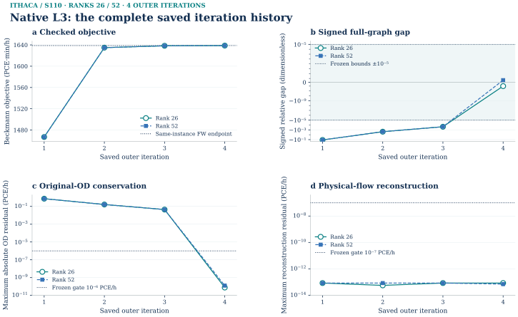</a></td></tr>
<tr><td width="100%" valign="top" align="left">
All 4 saved outer checks are plotted for each Native rank on the same frozen S110 instance (110 positive OD, 421.261325634 PCE/h). Each marker is an actual saved check at outer 1–4; the connecting segments do not add intermediate observations. Rank 26 uses open circles and rank 52 filled squares; near-coincident lines are both retained. Panels separate checked BPR/Beckmann objective, signed full-graph relative gap, maximum original-OD residual, and physical-flow reconstruction residual. The horizontal FW value is an independent same-instance endpoint, not an additional Native iteration. Early checked objectives lie below that endpoint while OD conservation has not yet reached its frozen gate; these are not feasible upper bounds or better traffic solutions. Signed negative gaps remain negative and are not interpreted as superior optimality. The gap axis is symmetric-log with a linear interval of ±10⁻¹²; OD/reconstruction axes are logarithmic in their original PCE/h units. The original gap bounds ±10⁻⁵, OD absolute gate 10⁻⁶ PCE/h, and reconstruction gate 10⁻⁷ PCE/h are unchanged. Both runs reach their original acceptance checks at outer 4; other relative-OD/nonnegativity gates remain in the source records. These early states belong to the ultimately accepted run; no separate failed trial is added. Endpoint comparison and method-specific physical-flow maps remain separate evidence. Private local preview of complete saved numerical history: public release currently covers endpoints, not these per-iteration values. Engineering scenario, not observed traffic or measured policy effect.
</td></tr>
<tr><td width="100%" valign="top" align="left">
<a href="https://scholarhaozheng.github.io/mobility-network-lab/assets/private-native-history-20261008/ithaca/native-complete-history.svg">SVG</a> · <a href="https://scholarhaozheng.github.io/mobility-network-lab/assets/private-native-history-20261008/ithaca/native-complete-history.png">PNG</a> · <a href="https://scholarhaozheng.github.io/mobility-network-lab/assets/private-native-history-20261008/ithaca/native-complete-history.pdf">PDF</a> · <a href="https://scholarhaozheng.github.io/mobility-network-lab/assets/private-native-history-20261008/ithaca/native-complete-history.plot.json">Plot data</a> · <a href="https://scholarhaozheng.github.io/mobility-network-lab/assets/private-native-history-20261008/ithaca/native-complete-history.source.json">Source and access</a> · <a href="https://scholarhaozheng.github.io/mobility-network-lab/assets/private-native-history-20261008/ithaca/native-complete-history.caption.md">Caption</a>
</td></tr>
</table>

<table width="100%">
<tr><th width="100%" valign="top" align="left"><strong>Accepted static endpoints and feasibility</strong></th></tr>
<tr><td width="100%" valign="top" align="left"><table width="100%"><tr><td valign="top" width="100%">
<a href="https://scholarhaozheng.github.io/mobility-network-lab/volumes/ithaca.html#figure-gap-ith-gc03-s-endpoints">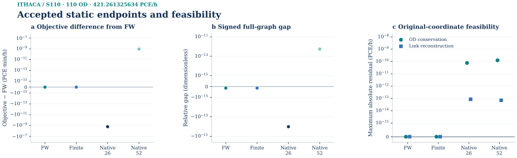</a>
Independent accepted endpoints on S110 · 110 OD · 421.261325634 PCE/h. Panels show signed objective difference from the same-instance FW endpoint (1638.7317576864 PCE·min/h), signed full-graph relative gap, and maximum original-OD and link-reconstruction residuals. Categories are method identities, not iteration numbers; no connecting trajectory is drawn. The signed symmetric-log axes retain exact zeros and negative roundoff, with a linear interval of ±1e−15 in each panel’s stated unit. The accompanying method-specific physical-flow figures remain the map evidence; scalar agreement does not imply identical flow.

<a href="https://scholarhaozheng.github.io/mobility-network-lab/assets/figure-contract-r12/figures/ithaca/ith-static-endpoints.svg">SVG</a> · <a href="https://scholarhaozheng.github.io/mobility-network-lab/assets/figure-contract-r12/figures/ithaca/ith-static-endpoints.png">PNG</a> · <a href="https://scholarhaozheng.github.io/mobility-network-lab/assets/figure-contract-r12/figures/ithaca/ith-static-endpoints.pdf">PDF</a> · <a href="https://scholarhaozheng.github.io/mobility-network-lab/assets/figure-contract-r12/figures/ithaca/ith-static-endpoints.source.json">Source data</a>

</td></tr></table></td></tr>
<tr><td width="100%" valign="top" align="left"></td></tr>
<tr><td width="100%" valign="top" align="left"></td></tr>
</table>

##### Static network loading

<table width="100%">
<tr><th width="33%" valign="top" align="left"><strong>Frank–Wolfe: physical flow and distribution</strong></th><th width="33%" valign="top" align="left"><strong>Finite-path reference and physical support</strong></th><th width="33%" valign="top" align="left"><strong>Native L3 physical flows against same-instance FW</strong></th></tr>
<tr><td width="33%" valign="top" align="left"><table width="100%"><tr><td valign="top" width="100%">

Description, units and scope

Saved Ithaca static Frank–Wolfe endpoint for 11:00–12:00 local activity. The map and 22-bin histogram use the same complete 15,148-link physical-flow vector, including 12,789 exact-zero links; 2,359 links exceed 1e-6 PCE. Flow is PCE accumulated during the declared one-hour period, not persons or flow per simulation time step. The map uses a square-root sequential color scale with original-unit ticks and gray road context; histogram counts are linear and no links are omitted. Turn, access and other nonphysical solver arcs are excluded. Only the saved iteration-0 initialization exists; FW performed zero subsequent updates. Reciprocal directed arcs may overlap geometrically; flows are not summed. This is a modeled engineering scenario, not observed traffic. © OpenStreetMap contributors / ODbL 1.0. R11 layout repair: map and all-link histogram share measured top and bottom panel bounds. The original saved physical-link IDs, exact flow vector, geographic vertices, display offsets, histogram edges and counts remain unchanged.

<a href="https://scholarhaozheng.github.io/mobility-network-lab/assets/figure-contract-r11/figures/ithaca/fw-physical-flow.png">PNG</a> · <a href="https://scholarhaozheng.github.io/mobility-network-lab/assets/figure-contract-r11/figures/ithaca/fw-physical-flow.svg">SVG</a> · <a href="https://scholarhaozheng.github.io/mobility-network-lab/assets/figure-contract-r11/figures/ithaca/fw-physical-flow.pdf">PDF</a> · <a href="https://scholarhaozheng.github.io/mobility-network-lab/assets/figure-contract-r11/figures/ithaca/fw-physical-flow.source.json">Source record</a>

</td></tr></table></td><td width="33%" valign="top" align="left"></td><td width="33%" valign="top" align="left"></td></tr>
<tr><td width="33%" valign="top" align="left"></td><td width="33%" valign="top" align="left">

Description, units and scope

Ithaca S110 finite-path own saved physical-link vector: 110 positive vehicle OD pairs, 421.2613256336401 PCE/hour, 550 frozen candidate paths and all 15,148 directed physical roads. The map uses original road vertices; the 22-bin histogram includes every physical road, including exact zeros. The absolute colour scale is the same square-root scale used in the companion Native card. The vector is read from finite/link_flow.csv and checked by multiplication of its own saved 550-path vector and incidence matrix; it is not copied from FW. The finite run records one solver iteration, so this endpoint loading is not an iteration-history figure. FW stopped at its initial check; finite and FW agree to floating-point precision for this instance. All raw values remain in plot data; only |flow|≤1e-12 PCE/hour is hidden from coloured map overlays. Modelled engineering demand, not observed traffic.

</td><td width="33%" valign="top" align="left">

Description, units and scope

Ithaca S110 Native rank 26 own saved physical-link flow (a), signed rank 26−FW (b) and rank 52−FW (c), and all 15,148 rank-26 physical roads in a 22-bin histogram (d). Both Native vectors are read directly from their own outer-04 saved v arrays; exact source link IDs select the physical rows. Saved basis/pool products verify these arrays to below 1e-10 PCE/hour without running a solver or evaluator. The absolute map shares the finite card’s square-root scale; both difference maps share one symmetric zero-centred linear scale, in original PCE/hour, with the scientific-notation multiplier printed at each colourbar. Maximum absolute differences are 2.23848246605e-08 and 5.08217254946e-08 PCE/hour. These tiny numerical differences are not a traffic improvement. Rank 26/52 actually have four saved outer states; this card shows their final geographic endpoint and does not replace the saved-history card. FW belongs to this same S110 instance and stops at its initial check. All raw zeros and near-zero values remain in the histogram and plot data; only |value|≤1e-12 is hidden from coloured overlays. Modelled one-hour engineering scenario, not observations.

</td></tr>
<tr><td width="33%" valign="top" align="left">
<a href="https://scholarhaozheng.github.io/mobility-network-lab/volumes/ithaca.html#figure-r9-fw-physical-flow">Complete city record · same evidence</a>
</td><td width="33%" valign="top" align="left">
<a href="https://scholarhaozheng.github.io/mobility-network-lab/volumes/ithaca.html#figure-parity-ithaca-finite-physical-flow">Complete evidence · same figure</a> · <a href="https://scholarhaozheng.github.io/mobility-network-lab/assets/template-parity-20261008/static-methods/ithaca/finite-physical-flow.svg">SVG</a> · <a href="https://scholarhaozheng.github.io/mobility-network-lab/assets/template-parity-20261008/static-methods/ithaca/finite-physical-flow.png">PNG</a> · <a href="https://scholarhaozheng.github.io/mobility-network-lab/assets/template-parity-20261008/static-methods/ithaca/finite-physical-flow.pdf">PDF</a> · <a href="https://scholarhaozheng.github.io/mobility-network-lab/assets/template-parity-20261008/static-methods/ithaca/finite-physical-flow.plot.json">Plot data</a> · <a href="https://scholarhaozheng.github.io/mobility-network-lab/assets/template-parity-20261008/static-methods/ithaca/finite-physical-flow.source.json">Source record</a> · <a href="https://scholarhaozheng.github.io/mobility-network-lab/assets/template-parity-20261008/static-methods/ithaca/finite-physical-flow.caption.md">Caption</a>
</td><td width="33%" valign="top" align="left">
<a href="https://scholarhaozheng.github.io/mobility-network-lab/volumes/ithaca.html#figure-parity-ithaca-native-physical-flow">Complete evidence · same figure</a> · <a href="https://scholarhaozheng.github.io/mobility-network-lab/assets/template-parity-20261008/static-methods/ithaca/native-physical-flow.svg">SVG</a> · <a href="https://scholarhaozheng.github.io/mobility-network-lab/assets/template-parity-20261008/static-methods/ithaca/native-physical-flow.png">PNG</a> · <a href="https://scholarhaozheng.github.io/mobility-network-lab/assets/template-parity-20261008/static-methods/ithaca/native-physical-flow.pdf">PDF</a> · <a href="https://scholarhaozheng.github.io/mobility-network-lab/assets/template-parity-20261008/static-methods/ithaca/native-physical-flow.plot.json">Plot data</a> · <a href="https://scholarhaozheng.github.io/mobility-network-lab/assets/template-parity-20261008/static-methods/ithaca/native-physical-flow.source.json">Source record</a> · <a href="https://scholarhaozheng.github.io/mobility-network-lab/assets/template-parity-20261008/static-methods/ithaca/native-physical-flow.caption.md">Caption</a>
</td></tr>
</table>

Saved initial checks and original endpoint views

<table width="100%">
<tr><th width="50%" valign="top" align="left"><strong>Frank–Wolfe: the saved initial check</strong></th><td colspan="1" width="50%"></td></tr>
<tr><td width="50%" valign="top" align="left"><table width="100%"><tr><td valign="top" width="100%">
<a href="https://scholarhaozheng.github.io/mobility-network-lab/volumes/ithaca.html#figure-fs-a02">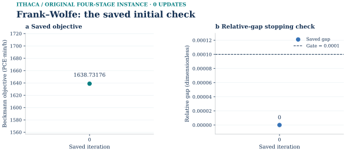</a>
Only the actual saved iteration 0 is shown: objective 1638.7317576864 PCE·min/h and relative gap 0, against the unchanged 0.0001 stopping gate. There were zero updates. Each panel contains a single numerical point; no missing trajectory or second state is inferred. The companion physical-flow map reads this method’s own saved vector. This frozen original demand instance is not relabelled as a later selected-demand or transit-revision run.

<a href="https://scholarhaozheng.github.io/mobility-network-lab/assets/figure-contract-r12/figures/ithaca/ithaca-initial-fw.svg">SVG</a> · <a href="https://scholarhaozheng.github.io/mobility-network-lab/assets/figure-contract-r12/figures/ithaca/ithaca-initial-fw.png">PNG</a> · <a href="https://scholarhaozheng.github.io/mobility-network-lab/assets/figure-contract-r12/figures/ithaca/ithaca-initial-fw.pdf">PDF</a> · <a href="https://scholarhaozheng.github.io/mobility-network-lab/assets/figure-contract-r12/figures/ithaca/ithaca-initial-fw.source.json">Source data</a>

</td></tr></table></td><td colspan="1" width="50%"></td></tr>
<tr><td width="50%" valign="top" align="left"></td><td colspan="1" width="50%"></td></tr>
<tr><td width="50%" valign="top" align="left"></td><td colspan="1" width="50%"></td></tr>
</table>

Earlier views and additional saved evidence

<table width="100%">
<tr><th width="33%" valign="top" align="left"><strong>Frank–Wolfe: physical-road loading</strong></th><td colspan="2" width="67%"></td></tr>
<tr><td width="33%" valign="top" align="left"><table width="100%"><tr><td valign="top" width="100%">
<a href="https://scholarhaozheng.github.io/mobility-network-lab/volumes/ithaca.html#figure-fs-a03">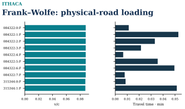</a>

Description, units and scope

v/c and BPR travel time for top 10 loaded physical road links; turn/access connectors excluded; v/c&gt;1 is allowed in static BPR. Single-pass engineering scenario; no local empirical calibration. City demand area 7.50 km2; 13.24 km2 road support

<a href="https://scholarhaozheng.github.io/mobility-network-lab/assets/figure-contract-r11/figures/ithaca/ithaca-fs_a03.png">PNG</a> · <a href="https://scholarhaozheng.github.io/mobility-network-lab/assets/figure-contract-r11/figures/ithaca/ithaca-fs_a03.svg">SVG</a> · <a href="https://scholarhaozheng.github.io/mobility-network-lab/assets/figure-contract-r11/figures/ithaca/ithaca-fs_a03.pdf">PDF</a> · <a href="https://scholarhaozheng.github.io/mobility-network-lab/assets/figure-contract-r11/figures/ithaca/ithaca-fs_a03.source.json">Source record</a>

</td></tr></table></td><td colspan="2" width="67%"></td></tr>
<tr><td width="33%" valign="top" align="left"></td><td colspan="2" width="67%"></td></tr>
<tr><td width="33%" valign="top" align="left">
<a href="https://scholarhaozheng.github.io/mobility-network-lab/volumes/ithaca.html#figure-fs-a03">Complete city record · same evidence</a>
</td><td colspan="2" width="67%"></td></tr>
</table>

#### Time-expanded network and path examples

<table width="100%">
<tr><th width="50%" valign="top" align="left"><strong>Time-expanded network in layers</strong></th><th width="50%" valign="top" align="left"><strong>Local construction details</strong></th></tr>
<tr><td width="50%" valign="top" align="left"><a href="https://scholarhaozheng.github.io/mobility-network-lab/volumes/ithaca.html#figure-parity-ithaca-time-layers">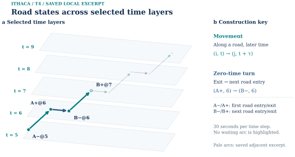</a></td><td width="50%" valign="top" align="left"></td></tr>
<tr><td width="50%" valign="top" align="left">
Ithaca: the highlighted three saved arcs follow two physical road movements joined by a zero-time turn. This is an excerpt of an existing CG path, not a new optimization.

Description, units and scope

Ithaca: the highlighted three saved arcs follow two physical road movements joined by a zero-time turn. This is an excerpt of an existing CG path, not a new optimization. Full graph and path records are from the accepted private package; the new presentation remains local/private. Physical node labels are schematic roles; exact routing state and link identifiers are retained in plot data. Early timing, road movement and zero-time turns come from saved arcs, not an interpolation. The slanted planes and horizontal positions are schematic display coordinates. A−/A+ and B−/B+ denote entry/exit routing states, not original intersections. Exact state IDs, physical-road IDs and time indices are retained in plot data.

</td><td width="50%" valign="top" align="left">
Ithaca: panels map two source-directed physical roads to four routing entry/exit states and their time-indexed movements. This is an excerpt of an existing CG path, not a new optimization.

Description, units and scope

Ithaca: panels map two source-directed physical roads to four routing entry/exit states and their time-indexed movements. This is an excerpt of an existing CG path, not a new optimization. Full graph and path records are from the accepted private package; the new presentation remains local/private. Physical node labels are schematic roles; exact routing state and link identifiers are retained in plot data. Early timing, road movement and zero-time turns come from saved arcs, not an interpolation. The turn has zero elapsed time; physical road durations are positive. No waiting arc is drawn and terminal bookkeeping states are outside this local excerpt. Plot data carry all exact source IDs, field values, and short-label aliases.

</td></tr>
<tr><td width="50%" valign="top" align="left">
<a href="https://scholarhaozheng.github.io/mobility-network-lab/volumes/ithaca.html#figure-parity-ithaca-time-layers">Complete evidence · same figure</a> · <a href="https://scholarhaozheng.github.io/mobility-network-lab/assets/template-parity-20261008/construction/ithaca/time-layers.svg">SVG</a> · <a href="https://scholarhaozheng.github.io/mobility-network-lab/assets/template-parity-20261008/construction/ithaca/time-layers.png">PNG</a> · <a href="https://scholarhaozheng.github.io/mobility-network-lab/assets/template-parity-20261008/construction/ithaca/time-layers.pdf">PDF</a> · <a href="https://scholarhaozheng.github.io/mobility-network-lab/assets/template-parity-20261008/construction/ithaca/time-layers.plot.json">Plot data</a> · <a href="https://scholarhaozheng.github.io/mobility-network-lab/assets/template-parity-20261008/construction/ithaca/time-layers.source.json">Source record</a> · <a href="https://scholarhaozheng.github.io/mobility-network-lab/assets/template-parity-20261008/construction/ithaca/time-layers.caption.md">Caption</a>
</td><td width="50%" valign="top" align="left">
<a href="https://scholarhaozheng.github.io/mobility-network-lab/volumes/ithaca.html#figure-parity-ithaca-local-construction">Complete evidence · same figure</a> · <a href="https://scholarhaozheng.github.io/mobility-network-lab/assets/template-parity-20261008/construction/ithaca/local-construction.svg">SVG</a> · <a href="https://scholarhaozheng.github.io/mobility-network-lab/assets/template-parity-20261008/construction/ithaca/local-construction.png">PNG</a> · <a href="https://scholarhaozheng.github.io/mobility-network-lab/assets/template-parity-20261008/construction/ithaca/local-construction.pdf">PDF</a> · <a href="https://scholarhaozheng.github.io/mobility-network-lab/assets/template-parity-20261008/construction/ithaca/local-construction.plot.json">Plot data</a> · <a href="https://scholarhaozheng.github.io/mobility-network-lab/assets/template-parity-20261008/construction/ithaca/local-construction.source.json">Source record</a> · <a href="https://scholarhaozheng.github.io/mobility-network-lab/assets/template-parity-20261008/construction/ithaca/local-construction.caption.md">Caption</a>
</td></tr>
</table>

#### Optimization on the time-expanded network

##### Two-phase column generation

<table width="100%">
<tr><th width="33%" valign="top" align="left"><strong>Phase I: artificial-flow clearance</strong></th><th width="33%" valign="top" align="left"><strong>Phase II objective</strong></th><th width="33%" valign="top" align="left"><strong>Independent pricing closure</strong></th></tr>
<tr><td width="33%" valign="top" align="left"><a href="https://scholarhaozheng.github.io/mobility-network-lab/volumes/ithaca.html#figure-parity-ithaca-cg-phase1">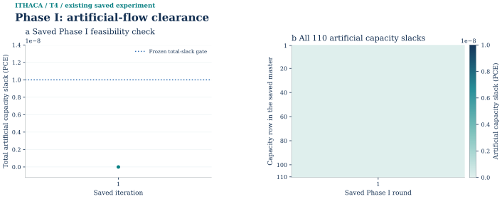</a></td><td width="33%" valign="top" align="left"><a href="https://scholarhaozheng.github.io/mobility-network-lab/volumes/ithaca.html#figure-parity-ithaca-cg-phase2">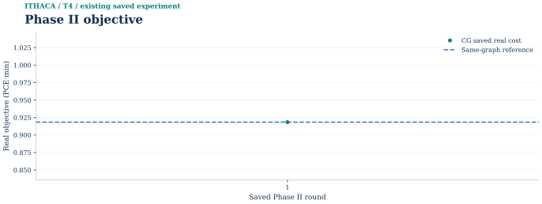</a></td><td width="33%" valign="top" align="left"><a href="https://scholarhaozheng.github.io/mobility-network-lab/volumes/ithaca.html#figure-parity-ithaca-cg-pricing">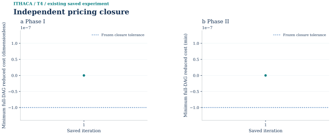</a></td></tr>
<tr><td width="33%" valign="top" align="left">

Description, units and scope

This implementation uses one nonnegative artificial variable per restricted-master capacity row, not per commodity. The saved Phase I state contains four path-flow variables followed by 110 actual artificial capacity slacks, all exactly zero. The left panel sums those saved slacks; the heatmap retains all 110 rows at their actual saved round. Row-to-dynamic-arc indices are preserved in plot data. The color range uses the frozen 1e-8 PCE total-slack tolerance only as a display reference, not as a separate per-row gate. Zero capacity slack is not a plot of OD unmet demand. Four seed paths suffice; no extra solve or intermediate state is inferred.

</td><td width="33%" valign="top" align="left">

Description, units and scope

One actual Phase II round has real objective 0.91842826893935303 PCE·min. The same-graph independent reference is 0.9184282689393537. The four seed paths suffice and no new column is added. The Phase I artificial objective is not joined to the Phase II cost.

</td><td width="33%" valign="top" align="left">

Description, units and scope

One full-DAG minimum reduced-cost check is saved in each phase. Phase I units are dimensionless; Phase II units are minutes, with the unchanged absolute closure tolerance 1e-7. These are the global minima, not invented per-commodity reduced costs. Two phases are separate checks, not two iterations of one common objective.

</td></tr>
<tr><td width="33%" valign="top" align="left">
<a href="https://scholarhaozheng.github.io/mobility-network-lab/volumes/ithaca.html#figure-parity-ithaca-cg-phase1">Complete evidence · same figure</a> · <a href="https://scholarhaozheng.github.io/mobility-network-lab/assets/template-parity-20261008/optimization/ithaca/cg-phase1.svg">SVG</a> · <a href="https://scholarhaozheng.github.io/mobility-network-lab/assets/template-parity-20261008/optimization/ithaca/cg-phase1.png">PNG</a> · <a href="https://scholarhaozheng.github.io/mobility-network-lab/assets/template-parity-20261008/optimization/ithaca/cg-phase1.pdf">PDF</a> · <a href="https://scholarhaozheng.github.io/mobility-network-lab/assets/template-parity-20261008/optimization/ithaca/cg-phase1.plot.json">Plot data</a> · <a href="https://scholarhaozheng.github.io/mobility-network-lab/assets/template-parity-20261008/optimization/ithaca/cg-phase1.source.json">Source record</a> · <a href="https://scholarhaozheng.github.io/mobility-network-lab/assets/template-parity-20261008/optimization/ithaca/cg-phase1.caption.md">Caption</a>
</td><td width="33%" valign="top" align="left">
<a href="https://scholarhaozheng.github.io/mobility-network-lab/volumes/ithaca.html#figure-parity-ithaca-cg-phase2">Complete evidence · same figure</a> · <a href="https://scholarhaozheng.github.io/mobility-network-lab/assets/template-parity-20261008/optimization/ithaca/cg-phase2.svg">SVG</a> · <a href="https://scholarhaozheng.github.io/mobility-network-lab/assets/template-parity-20261008/optimization/ithaca/cg-phase2.png">PNG</a> · <a href="https://scholarhaozheng.github.io/mobility-network-lab/assets/template-parity-20261008/optimization/ithaca/cg-phase2.pdf">PDF</a> · <a href="https://scholarhaozheng.github.io/mobility-network-lab/assets/template-parity-20261008/optimization/ithaca/cg-phase2.plot.json">Plot data</a> · <a href="https://scholarhaozheng.github.io/mobility-network-lab/assets/template-parity-20261008/optimization/ithaca/cg-phase2.source.json">Source record</a> · <a href="https://scholarhaozheng.github.io/mobility-network-lab/assets/template-parity-20261008/optimization/ithaca/cg-phase2.caption.md">Caption</a>
</td><td width="33%" valign="top" align="left">
<a href="https://scholarhaozheng.github.io/mobility-network-lab/volumes/ithaca.html#figure-parity-ithaca-cg-pricing">Complete evidence · same figure</a> · <a href="https://scholarhaozheng.github.io/mobility-network-lab/assets/template-parity-20261008/optimization/ithaca/cg-pricing.svg">SVG</a> · <a href="https://scholarhaozheng.github.io/mobility-network-lab/assets/template-parity-20261008/optimization/ithaca/cg-pricing.png">PNG</a> · <a href="https://scholarhaozheng.github.io/mobility-network-lab/assets/template-parity-20261008/optimization/ithaca/cg-pricing.pdf">PDF</a> · <a href="https://scholarhaozheng.github.io/mobility-network-lab/assets/template-parity-20261008/optimization/ithaca/cg-pricing.plot.json">Plot data</a> · <a href="https://scholarhaozheng.github.io/mobility-network-lab/assets/template-parity-20261008/optimization/ithaca/cg-pricing.source.json">Source record</a> · <a href="https://scholarhaozheng.github.io/mobility-network-lab/assets/template-parity-20261008/optimization/ithaca/cg-pricing.caption.md">Caption</a>
</td></tr>
</table>

##### Lagrangian relaxation: bounds → prices → recovery

<table width="100%">
<tr><th width="33%" valign="top" align="left"><strong>Lagrangian bounds and certified gap</strong></th><th width="33%" valign="top" align="left"><strong>Capacity prices at the best dual bound</strong></th><th width="33%" valign="top" align="left"><strong>Path-pool growth and primal recovery</strong></th></tr>
<tr><td width="33%" valign="top" align="left"><a href="https://scholarhaozheng.github.io/mobility-network-lab/volumes/ithaca.html#figure-parity-ithaca-lr-bounds">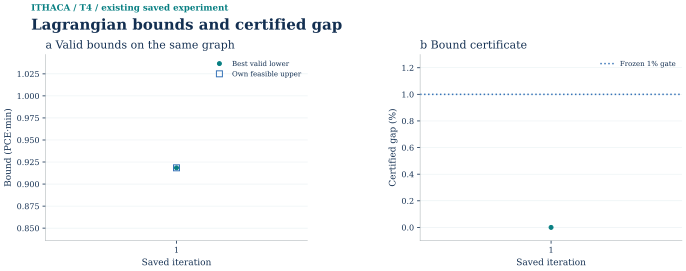</a></td><td width="33%" valign="top" align="left"><a href="https://scholarhaozheng.github.io/mobility-network-lab/volumes/ithaca.html#figure-parity-ithaca-lr-prices">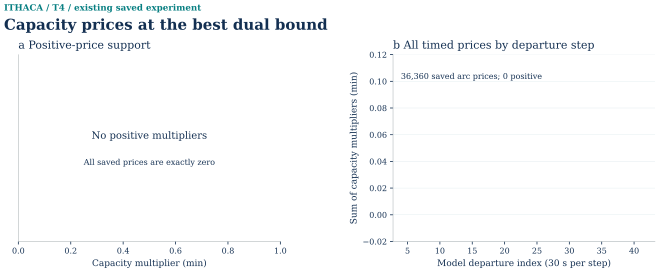</a></td><td width="33%" valign="top" align="left"><a href="https://scholarhaozheng.github.io/mobility-network-lab/volumes/ithaca.html#figure-parity-ithaca-lr-recovery">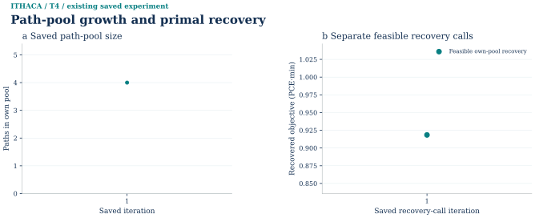</a></td></tr>
<tr><td width="33%" valign="top" align="left">

Description, units and scope

One actual evaluated LR state. Own lower and recovered feasible upper are both 0.918428268939353 PCE·min; they overlap at displayed precision. The original 1% certificate is retained. This is the frozen four-OD pulse; capacity redundancy does not establish a geographic-size cause.

</td><td width="33%" valign="top" align="left">

Description, units and scope

The saved best-bound multiplier vector contains 36,360 original dynamic-arc entries, all exactly zero. Consequently there is no nonempty top-price ranking. The second panel sums every timed multiplier by its real 30-second departure index, including the zero sums; source/sink entries without a time suffix are excluded only from the time aggregation. Empty positive support is shown explicitly, not replaced with another city or method. These numerical details remain a private local preview.

</td><td width="33%" valign="top" align="left">

Description, units and scope

One actual path-pool record and one actual feasible recovery call are shown in separate panels. The four paths belong to this method’s own pool; the objective is the saved recovered feasible upper bound. No intermediate call, pool growth or capacity-price effect is invented. A filled marker denotes a feasible call, as in Boston/Hong Kong.

</td></tr>
<tr><td width="33%" valign="top" align="left">
<a href="https://scholarhaozheng.github.io/mobility-network-lab/volumes/ithaca.html#figure-parity-ithaca-lr-bounds">Complete evidence · same figure</a> · <a href="https://scholarhaozheng.github.io/mobility-network-lab/assets/template-parity-20261008/optimization/ithaca/lr-bounds.svg">SVG</a> · <a href="https://scholarhaozheng.github.io/mobility-network-lab/assets/template-parity-20261008/optimization/ithaca/lr-bounds.png">PNG</a> · <a href="https://scholarhaozheng.github.io/mobility-network-lab/assets/template-parity-20261008/optimization/ithaca/lr-bounds.pdf">PDF</a> · <a href="https://scholarhaozheng.github.io/mobility-network-lab/assets/template-parity-20261008/optimization/ithaca/lr-bounds.plot.json">Plot data</a> · <a href="https://scholarhaozheng.github.io/mobility-network-lab/assets/template-parity-20261008/optimization/ithaca/lr-bounds.source.json">Source record</a> · <a href="https://scholarhaozheng.github.io/mobility-network-lab/assets/template-parity-20261008/optimization/ithaca/lr-bounds.caption.md">Caption</a>
</td><td width="33%" valign="top" align="left">
<a href="https://scholarhaozheng.github.io/mobility-network-lab/volumes/ithaca.html#figure-parity-ithaca-lr-prices">Complete evidence · same figure</a> · <a href="https://scholarhaozheng.github.io/mobility-network-lab/assets/template-parity-20261008/optimization/ithaca/lr-prices.svg">SVG</a> · <a href="https://scholarhaozheng.github.io/mobility-network-lab/assets/template-parity-20261008/optimization/ithaca/lr-prices.png">PNG</a> · <a href="https://scholarhaozheng.github.io/mobility-network-lab/assets/template-parity-20261008/optimization/ithaca/lr-prices.pdf">PDF</a> · <a href="https://scholarhaozheng.github.io/mobility-network-lab/assets/template-parity-20261008/optimization/ithaca/lr-prices.plot.json">Plot data</a> · <a href="https://scholarhaozheng.github.io/mobility-network-lab/assets/template-parity-20261008/optimization/ithaca/lr-prices.source.json">Source record</a> · <a href="https://scholarhaozheng.github.io/mobility-network-lab/assets/template-parity-20261008/optimization/ithaca/lr-prices.caption.md">Caption</a>
</td><td width="33%" valign="top" align="left">
<a href="https://scholarhaozheng.github.io/mobility-network-lab/volumes/ithaca.html#figure-parity-ithaca-lr-recovery">Complete evidence · same figure</a> · <a href="https://scholarhaozheng.github.io/mobility-network-lab/assets/template-parity-20261008/optimization/ithaca/lr-recovery.svg">SVG</a> · <a href="https://scholarhaozheng.github.io/mobility-network-lab/assets/template-parity-20261008/optimization/ithaca/lr-recovery.png">PNG</a> · <a href="https://scholarhaozheng.github.io/mobility-network-lab/assets/template-parity-20261008/optimization/ithaca/lr-recovery.pdf">PDF</a> · <a href="https://scholarhaozheng.github.io/mobility-network-lab/assets/template-parity-20261008/optimization/ithaca/lr-recovery.plot.json">Plot data</a> · <a href="https://scholarhaozheng.github.io/mobility-network-lab/assets/template-parity-20261008/optimization/ithaca/lr-recovery.source.json">Source record</a> · <a href="https://scholarhaozheng.github.io/mobility-network-lab/assets/template-parity-20261008/optimization/ithaca/lr-recovery.caption.md">Caption</a>
</td></tr>
</table>

##### ADMM: convergence → conservation → physical flow

<table width="100%">
<tr><th width="33%" valign="top" align="left"><strong>ADMM convergence and feasibility</strong></th><th width="33%" valign="top" align="left"><strong>Commodity conservation at the final state</strong></th><th width="33%" valign="top" align="left"><strong>ADMM and arc-flow LP: physical-link flow</strong></th></tr>
<tr><td width="33%" valign="top" align="left"><a href="https://scholarhaozheng.github.io/mobility-network-lab/volumes/ithaca.html#figure-parity-ithaca-admm-saved-state">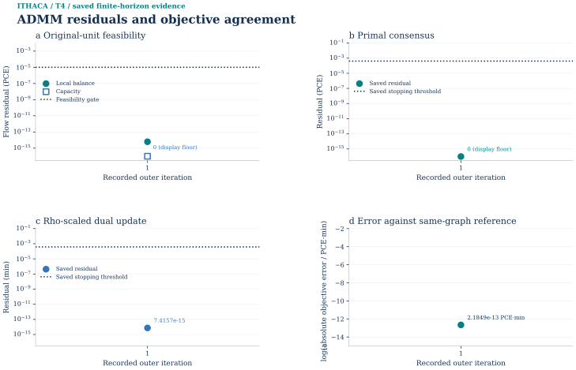</a></td><td width="33%" valign="top" align="left"><a href="https://scholarhaozheng.github.io/mobility-network-lab/volumes/ithaca.html#figure-parity-ithaca-admm-final-conservation">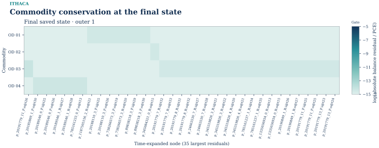</a></td><td width="33%" valign="top" align="left"></td></tr>
<tr><td width="33%" valign="top" align="left">

Description, units and scope

Four diagnostic panels follow the Hong Kong ADMM figure: original-unit feasibility, primal consensus, rho-scaled dual update, and log10 absolute objective error against the independent same-graph reference. This instance saved exactly one completed outer update, shown as a point rather than an invented convergence curve. Balance, capacity, and primal use PCE; rho-scaled dual and its own threshold use minutes. Only exact-zero residuals use a labeled 1e-16 display floor; positive residuals are unchanged. Objective-error display floor is 1e-15 PCE·min. Saved internal thresholds and the 1e-5 PCE feasibility gate are retained. All displayed states meet the frozen independent gates; objective agreement is not a claim of identical link flows.

</td><td width="33%" valign="top" align="left">

Description, units and scope

Final saved ADMM own-x state at completed outer 1. Reconstruct outflow minus inflow minus commodity supply in the original units and exact saved arc order, with the loader's lexical node order. The heatmap selects the 35 nodes with the largest maximum absolute residual across all four commodities; ties retain lexical node order. All 15,322 nodes were included in this selection. The complete per-commodity maximum residuals and worst-node IDs reproduce the saved independent check exactly; overall maximum is 6.19070599701655e-15 PCE against the unchanged 1e−5 PCE gate. Colors show log10(max(|residual|,1e−15 PCE)/(1 PCE)); sub-floor values and exact zeros share the floor color, with their raw signed and absolute values preserved in plot data. This is a final spatial conservation diagnostic, not an iteration-history heatmap. The run completed one actual update on the frozen capacity-nonbinding T4 pulse, not a multi-iteration stress test. Private local derivative of the accepted saved result; no new public asset release or optimizer run is claimed. Engineering scenario, not observed traffic.

</td><td width="33%" valign="top" align="left">

Description, units and scope

Own saved ADMM x at its one completed update and the independent same-graph LP are projected onto the 684 physical links instantiated in the exact frozen Ithaca T4 graph. Sum across commodities and time, retain only physical_road arcs, and join exact GMNS link IDs; each physical_fraction is 1, so no serial-segment double counting occurs. The remaining 14,464 of 15,148 original physical roads appear as grey context, not solved zero-flow roads. Panels a–b share a square-root absolute PCE scale; panel c uses a distinct symmetric signed ADMM-minus-LP scale. Panel d includes every instantiated link, including zeros, with the identity line and equal linear axes. The actual maximum absolute difference is 2.26215512725091e-14 PCE and is not rounded to zero. All geometry uses original OSM endpoint coordinates with a common local metric projection; no schematic node positions are invented. The original IN-state loading and first physical-road traversal are preserved. Fixed-cost four-OD departure pulse, 0.656755360434 PCE; physical capacity is nonbinding for this frozen instance. This is a final spatial comparison, not evidence of a multi-round trajectory, area-size causality or measured traffic. Private local derivative; no new public asset release or optimizer run is claimed. © OpenStreetMap contributors, ODbL 1.0.

</td></tr>
<tr><td width="33%" valign="top" align="left">
<a href="https://scholarhaozheng.github.io/mobility-network-lab/volumes/ithaca.html#figure-parity-ithaca-admm-saved-state">Complete evidence · same figure</a> · <a href="https://scholarhaozheng.github.io/mobility-network-lab/assets/figure-contract-r12/figures/ithaca/admm-saved-state.svg">SVG</a> · <a href="https://scholarhaozheng.github.io/mobility-network-lab/assets/figure-contract-r12/figures/ithaca/admm-saved-state.png">PNG</a> · <a href="https://scholarhaozheng.github.io/mobility-network-lab/assets/figure-contract-r12/figures/ithaca/admm-saved-state.pdf">PDF</a> · <a href="https://scholarhaozheng.github.io/mobility-network-lab/assets/figure-contract-r12/figures/ithaca/admm-saved-state.plot.json">Plot data</a> · <a href="https://scholarhaozheng.github.io/mobility-network-lab/assets/figure-contract-r12/figures/ithaca/admm-saved-state.source.json">Source record</a>
</td><td width="33%" valign="top" align="left">
<a href="https://scholarhaozheng.github.io/mobility-network-lab/volumes/ithaca.html#figure-parity-ithaca-admm-final-conservation">Complete evidence · same figure</a> · <a href="https://scholarhaozheng.github.io/mobility-network-lab/assets/template-parity-20261008/admm/ithaca/admm-final-conservation.svg">SVG</a> · <a href="https://scholarhaozheng.github.io/mobility-network-lab/assets/template-parity-20261008/admm/ithaca/admm-final-conservation.png">PNG</a> · <a href="https://scholarhaozheng.github.io/mobility-network-lab/assets/template-parity-20261008/admm/ithaca/admm-final-conservation.pdf">PDF</a> · <a href="https://scholarhaozheng.github.io/mobility-network-lab/assets/template-parity-20261008/admm/ithaca/admm-final-conservation.plot.json">Plot data</a> · <a href="https://scholarhaozheng.github.io/mobility-network-lab/assets/template-parity-20261008/admm/ithaca/admm-final-conservation.source.json">Source record</a> · <a href="https://scholarhaozheng.github.io/mobility-network-lab/assets/template-parity-20261008/admm/ithaca/admm-final-conservation.caption.md">Caption</a>
</td><td width="33%" valign="top" align="left">
<a href="https://scholarhaozheng.github.io/mobility-network-lab/volumes/ithaca.html#figure-parity-ithaca-admm-physical-flow">Complete evidence · same figure</a> · <a href="https://scholarhaozheng.github.io/mobility-network-lab/assets/template-parity-20261008/admm/ithaca/admm-physical-flow.svg">SVG</a> · <a href="https://scholarhaozheng.github.io/mobility-network-lab/assets/template-parity-20261008/admm/ithaca/admm-physical-flow.png">PNG</a> · <a href="https://scholarhaozheng.github.io/mobility-network-lab/assets/template-parity-20261008/admm/ithaca/admm-physical-flow.pdf">PDF</a> · <a href="https://scholarhaozheng.github.io/mobility-network-lab/assets/template-parity-20261008/admm/ithaca/admm-physical-flow.plot.json">Plot data</a> · <a href="https://scholarhaozheng.github.io/mobility-network-lab/assets/template-parity-20261008/admm/ithaca/admm-physical-flow.source.json">Source record</a> · <a href="https://scholarhaozheng.github.io/mobility-network-lab/assets/template-parity-20261008/admm/ithaca/admm-physical-flow.caption.md">Caption</a>
</td></tr>
</table>

Additional accepted source evidence
<ul><li><a href="https://scholarhaozheng.github.io/mobility-network-lab/assets/figure-contract-r12/figures/ithaca/admm-saved-state.svg">T4 finite-time endpoint comparison</a></li></ul>

8 October 2026 release · shared sources and notices

The following source and scope notices apply to the adjacent figures.

Frozen Ithaca S110 static and T4 finite fixed-cost endpoints, not DNL/DUE or local calibration. T4 capacity is nonbinding (0.65675536 PCE pulse versus 2.5 PCE minimum physical arc capacity). U.S. Census/LEHD, NYSDOT and © OpenStreetMap contributors, ODbL: https://www.openstreetmap.org/copyright.

### Berkeley

A 13-zone central Berkeley morning HBW model with 90 positive person OD pairs and 72 positive vehicle OD pairs on a conservatively restricted network. [Open complete case →](https://scholarhaozheng.github.io/mobility-network-lab/volumes/berkeley.html)

<table width="100%"><thead><tr><th valign="top" width="25%">City/model foundation</th><th valign="top" width="25%">Static assignment</th><th valign="top" width="25%">Finite time-expanded</th><th valign="top" width="25%">Observation/data scope</th></tr></thead>
<tbody><tr><td valign="top" width="25%">The retained auto graph has 2,150 directed roads; 11 zones have auto access and all 13 have walk access.</td><td valign="top" width="25%">All 72 positive vehicle OD pairs load the 2,150-link graph; 670 roads carry positive flow, maximum v/c ≈0.434.</td><td valign="top" width="25%">The separate T4 finite graph has 92,578 states and 250,886 arcs for four first-bin OD pulses (10.439304601026 PCE), 30-second step and H165 horizon.</td><td valign="top" width="25%">No observed OD, independent link counts or field-audited entrances calibrate the case. The public Shattuck/Center turn sidecar is an engineering candidate, not observed or surveyed turn truth.</td></tr></tbody></table>

**Current S0 reception · batch v001:** S0 batch v001 accepts the saved ADMM C2a outer170 endpoint, retains the original accepted LR10 result, and records LR300 as a separate post-certificate cold-start diagnostic. Existing local presentation figures are retained; newly released original figures, captions and plot data are linked separately by exact bytes. [Current city results and released evidence](https://scholarhaozheng.github.io/mobility-network-lab/volumes/berkeley.html#berkeley-admm-accuracy-r3) · [Current reception index](https://scholarhaozheng.github.io/mobility-network-lab/assets/algorithm-transfer-r8/CURRENT_STATUS.json) · [Scope and ODbL notice](https://scholarhaozheng.github.io/mobility-network-lab/assets/algorithm-transfer-r8/NOTICE.md).

Accepted S72 methods include FW, finite-path and Native26/52, with their own physical-link vectors. Separate T4 evidence includes LP, CG, LR and the accepted 170-iteration ADMM continuation. The 300-iteration same-rule cold-start LR record passed all 23 original formal-entry checks; the original 1% certificate was met at iteration 10. Numerical objective agreement does not establish identical link flow.

Local reading edition · saved-result figures aligned with Boston and Hong Kong · [Figure guide and saved-state interpretation](https://scholarhaozheng.github.io/mobility-network-lab/figure-update-status.html#top)

Sources and model scope · © OpenStreetMap contributors / ODbL 1.0

© OpenStreetMap contributors; road-derived data ODbL 1.0: https://www.openstreetmap.org/copyright; numerical results are engineering scenarios, not observed traffic. Berkeley T4 is a finite 30 s/H165 instance; ADMM170 is post-diagnostic C2a; LR300 is a separate post-certificate diagnostic and original LR10 stays accepted.

<a href="https://scholarhaozheng.github.io/mobility-network-lab/assets/algorithm-transfer-r8/NOTICE.md">Full attribution and release notice</a>

[Sources and GMNS](#berkeley-sources) · [Population, households and activity](#berkeley-population) · [Transit and observations](#berkeley-transit) · [Trip generation](#berkeley-generation) · [Trip distribution](#berkeley-distribution) · [Mode choice](#berkeley-mode) · [Static assignment methods](#berkeley-static) · [Time-expanded network and path examples](#berkeley-representation) · [Optimization on the time-expanded network](#berkeley-finite)

#### Sources and GMNS

The accepted 2,150-link model and the inherited preflight source map are separate views. The released local turn candidate remains additional engineering context.

<table width="100%">
<tr><th width="50%" valign="top" align="left"><strong>Source geography and accepted model support</strong></th><td colspan="1" width="50%"></td></tr>
<tr><td width="50%" valign="top" align="left"><a href="https://scholarhaozheng.github.io/mobility-network-lab/volumes/berkeley.html#figure-r3-source-geography">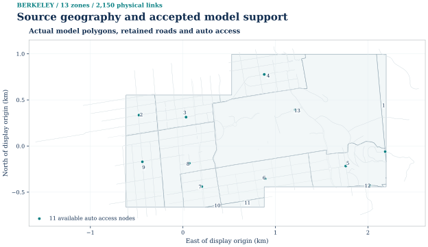</a></td><td colspan="1" width="50%"></td></tr>
<tr><td width="50%" valign="top" align="left">
All 13 actual model zones, 2,150 retained physical links and 11 auto access nodes. Contextual road geography; no flow encoding.
</td><td colspan="1" width="50%"></td></tr>
<tr><td width="50%" valign="top" align="left">
<a href="https://scholarhaozheng.github.io/mobility-network-lab/volumes/berkeley.html#figure-r3-source-geography">Complete evidence</a> · <a href="https://scholarhaozheng.github.io/mobility-network-lab/assets/city-alignment-r3/berkeley/source_geography.svg">Full figure</a>

Source records
<ul><li><a href="https://scholarhaozheng.github.io/mobility-network-lab/assets/city-alignment-r3/berkeley/source_geography.png">PNG</a></li><li><a href="https://scholarhaozheng.github.io/mobility-network-lab/assets/city-alignment-r3/berkeley/source_geography.pdf">PDF</a></li><li><a href="https://scholarhaozheng.github.io/mobility-network-lab/assets/city-alignment-r3/berkeley/source_geography.plot_data.json">Plot data</a></li><li><a href="https://scholarhaozheng.github.io/mobility-network-lab/assets/city-alignment-r3/berkeley/source_geography.source.json">Source record</a></li></ul>
</td><td colspan="1" width="50%"></td></tr>
</table>

Additional saved diagnostics and original views

##### Retained local turn candidate

<table width="100%">
<tr><th width="100%" valign="top" align="left"><strong>Local turn engineering candidate</strong></th></tr>
<tr><td width="100%" valign="top" align="left"><table width="100%"><tr><td valign="top" width="100%">
<a href="https://scholarhaozheng.github.io/mobility-network-lab/volumes/berkeley.html#r11-evidence-berkeley-turn-candidate">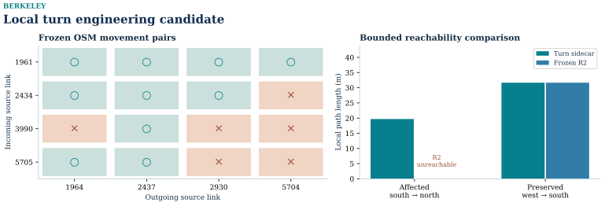</a>

Description, units and scope

Local turn engineering candidate Shattuck / Center. 6 prohibited of 16 directed pairs at one frozen via node. Engineering variant; no assignment or policy effect.

<a href="https://scholarhaozheng.github.io/mobility-network-lab/assets/figure-contract-r11/figures/berkeley/berkeley-turn_candidate.png">PNG</a> · <a href="https://scholarhaozheng.github.io/mobility-network-lab/assets/figure-contract-r11/figures/berkeley/berkeley-turn_candidate.svg">SVG</a> · <a href="https://scholarhaozheng.github.io/mobility-network-lab/assets/figure-contract-r11/figures/berkeley/berkeley-turn_candidate.pdf">PDF</a> · <a href="https://scholarhaozheng.github.io/mobility-network-lab/assets/figure-contract-r11/figures/berkeley/berkeley-turn_candidate.source.json">Source record</a>

</td></tr></table></td></tr>
<tr><td width="100%" valign="top" align="left"></td></tr>
<tr><td width="100%" valign="top" align="left">
<a href="https://scholarhaozheng.github.io/mobility-network-lab/volumes/berkeley.html#r11-evidence-berkeley-turn-candidate">Complete city record · same evidence</a>
</td></tr>
</table>

#### Population, households and activity

All 13 zones are retained. Population and jobs come from different source years, and each map has its own count scale.

<table width="100%">
<tr><th width="100%" valign="top" align="left"><strong>Population and jobs in the 13 model zones</strong></th></tr>
<tr><td width="100%" valign="top" align="left"><a href="https://scholarhaozheng.github.io/mobility-network-lab/volumes/berkeley.html#figure-r3-population-jobs">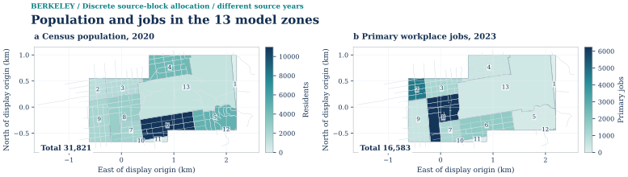</a></td></tr>
<tr><td width="100%" valign="top" align="left">
Separate maps of all 13 zones: 31,821 residents from the 2020 Census and 16,583 primary jobs from 2023 LODES. Counts, not density.
</td></tr>
<tr><td width="100%" valign="top" align="left">
<a href="https://scholarhaozheng.github.io/mobility-network-lab/volumes/berkeley.html#figure-r3-population-jobs">Complete evidence</a> · <a href="https://scholarhaozheng.github.io/mobility-network-lab/assets/city-alignment-r3/berkeley/population_jobs.svg">Full figure</a>

Source records
<ul><li><a href="https://scholarhaozheng.github.io/mobility-network-lab/assets/city-alignment-r3/berkeley/population_jobs.png">PNG</a></li><li><a href="https://scholarhaozheng.github.io/mobility-network-lab/assets/city-alignment-r3/berkeley/population_jobs.pdf">PDF</a></li><li><a href="https://scholarhaozheng.github.io/mobility-network-lab/assets/city-alignment-r3/berkeley/population_jobs.plot_data.json">Plot data</a></li><li><a href="https://scholarhaozheng.github.io/mobility-network-lab/assets/city-alignment-r3/berkeley/population_jobs.source.json">Source record</a></li></ul>
</td></tr>
</table>

#### Transit and observations

Source stops, selected-day service and direct OD availability are distinct from observed trajectories. The model uses 5 October 2026 AC Transit service.

<table width="100%">
<tr><th width="50%" valign="top" align="left"><strong>Scheduled transit geography and model availability</strong></th><th width="50%" valign="top" align="left"><strong>Scheduled service and direct-option time components</strong></th></tr>
<tr><td width="50%" valign="top" align="left"><a href="https://scholarhaozheng.github.io/mobility-network-lab/volumes/berkeley.html#figure-r3-transit-network">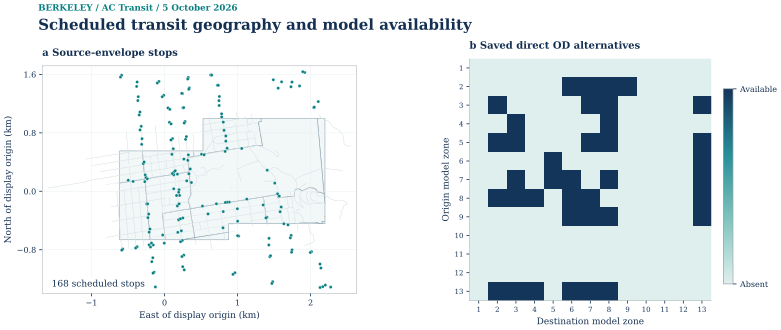</a></td><td width="50%" valign="top" align="left"><a href="https://scholarhaozheng.github.io/mobility-network-lab/volumes/berkeley.html#figure-r3-transit-service">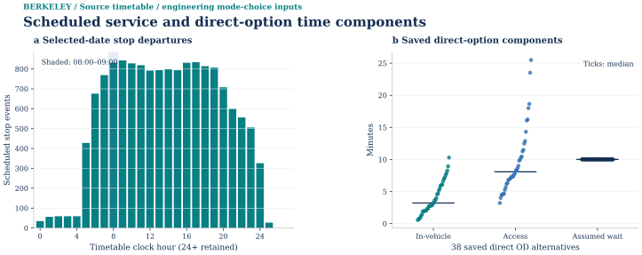</a></td></tr>
<tr><td width="50%" valign="top" align="left">
168 source-envelope AC Transit stops and all 13 × 13 model OD cells, including 38 saved direct-service alternatives.
</td><td width="50%" valign="top" align="left">
All 14,649 selected-date stop events by hour, with 38 direct-option time components. Ten-minute waiting is an assumption.
</td></tr>
<tr><td width="50%" valign="top" align="left">
<a href="https://scholarhaozheng.github.io/mobility-network-lab/volumes/berkeley.html#figure-r3-transit-network">Complete evidence</a> · <a href="https://scholarhaozheng.github.io/mobility-network-lab/assets/city-alignment-r3/berkeley/transit_network.svg">Full figure</a>

Source records
<ul><li><a href="https://scholarhaozheng.github.io/mobility-network-lab/assets/city-alignment-r3/berkeley/transit_network.png">PNG</a></li><li><a href="https://scholarhaozheng.github.io/mobility-network-lab/assets/city-alignment-r3/berkeley/transit_network.pdf">PDF</a></li><li><a href="https://scholarhaozheng.github.io/mobility-network-lab/assets/city-alignment-r3/berkeley/transit_network.plot_data.json">Plot data</a></li><li><a href="https://scholarhaozheng.github.io/mobility-network-lab/assets/city-alignment-r3/berkeley/transit_network.source.json">Source record</a></li></ul>
</td><td width="50%" valign="top" align="left">
<a href="https://scholarhaozheng.github.io/mobility-network-lab/volumes/berkeley.html#figure-r3-transit-service">Complete evidence</a> · <a href="https://scholarhaozheng.github.io/mobility-network-lab/assets/city-alignment-r3/berkeley/transit_service.svg">Full figure</a>

Source records
<ul><li><a href="https://scholarhaozheng.github.io/mobility-network-lab/assets/city-alignment-r3/berkeley/transit_service.png">PNG</a></li><li><a href="https://scholarhaozheng.github.io/mobility-network-lab/assets/city-alignment-r3/berkeley/transit_service.pdf">PDF</a></li><li><a href="https://scholarhaozheng.github.io/mobility-network-lab/assets/city-alignment-r3/berkeley/transit_service.plot_data.json">Plot data</a></li><li><a href="https://scholarhaozheng.github.io/mobility-network-lab/assets/city-alignment-r3/berkeley/transit_service.source.json">Source record</a></li></ul>
</td></tr>
</table>

#### Trip generation

The complete 13-zone production/attraction result and the external/intrazonal ledger remain explicit.

<table width="100%">
<tr><th width="100%" valign="top" align="left"><strong>Trip generation</strong></th></tr>
<tr><td width="100%" valign="top" align="left"><table width="100%"><tr><td valign="top" width="100%">
<a href="https://scholarhaozheng.github.io/mobility-network-lab/volumes/berkeley.html#figure-f10-generation">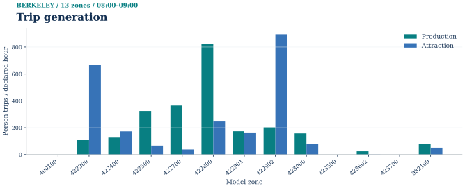</a>

Description, units and scope

Saved productions and job-weighted attractions for all 13 model zones. Population and jobs use different source years (2020 and 2023). The captured interzonal total is 2,381.7222975 person trips in 08:00–09:00; 4,705.530375 external/uncaptured and 152.0248275 intrazonal person trips remain separate. This bounded engineering scenario is not locally calibrated. Single-pass engineering scenario; no local empirical calibration.

<a href="https://scholarhaozheng.github.io/mobility-network-lab/assets/figure-contract-r11/figures/berkeley/f10_generation.png">PNG</a> · <a href="https://scholarhaozheng.github.io/mobility-network-lab/assets/figure-contract-r11/figures/berkeley/f10_generation.svg">SVG</a> · <a href="https://scholarhaozheng.github.io/mobility-network-lab/assets/figure-contract-r11/figures/berkeley/f10_generation.pdf">PDF</a> · <a href="https://scholarhaozheng.github.io/mobility-network-lab/assets/figure-contract-r11/figures/berkeley/f10_generation.source.json">Source record</a>

</td></tr></table></td></tr>
<tr><td width="100%" valign="top" align="left"></td></tr>
<tr><td width="100%" valign="top" align="left">
<a href="https://scholarhaozheng.github.io/mobility-network-lab/volumes/berkeley.html#figure-f10-generation">Complete city record · same evidence</a>
</td></tr>
</table>

#### Trip distribution

The full 13 × 13 one-hour person OD matrix and positive-OD histogram remain intact.

<table width="100%">
<tr><th width="100%" valign="top" align="left"><strong>Trip distribution</strong></th></tr>
<tr><td width="100%" valign="top" align="left"><table width="100%"><tr><td valign="top" width="100%">
<a href="https://scholarhaozheng.github.io/mobility-network-lab/volumes/berkeley.html#figure-f11-distribution">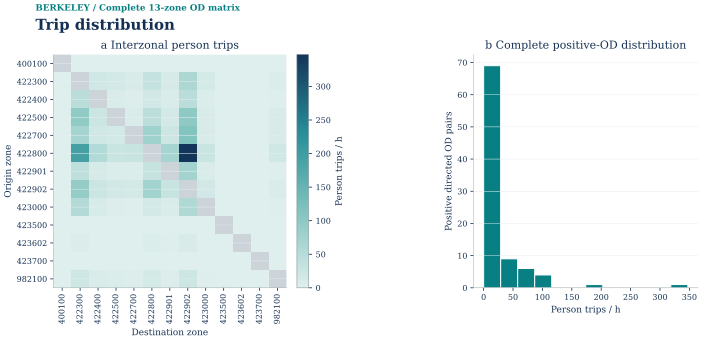</a>

Description, units and scope

The complete saved 13 × 13 one-hour HBW matrix has 90 positive directed OD pairs. Pale cells are structural zero interzonal demand; the gray diagonal excludes intrazonal demand. All 156 interzonal impedance records are available. The full positive-OD histogram retains 12 bins; saved PA and OD totals agree at 2,381.7222975 person trips/h, with seven IPF iterations and a maximum margin residual of 2.1453153408401704e-05. Single-pass engineering scenario; no local empirical calibration.

<a href="https://scholarhaozheng.github.io/mobility-network-lab/assets/figure-contract-r11/figures/berkeley/f11_distribution.png">PNG</a> · <a href="https://scholarhaozheng.github.io/mobility-network-lab/assets/figure-contract-r11/figures/berkeley/f11_distribution.svg">SVG</a> · <a href="https://scholarhaozheng.github.io/mobility-network-lab/assets/figure-contract-r11/figures/berkeley/f11_distribution.pdf">PDF</a> · <a href="https://scholarhaozheng.github.io/mobility-network-lab/assets/figure-contract-r11/figures/berkeley/f11_distribution.source.json">Source record</a>

</td></tr></table></td></tr>
<tr><td width="100%" valign="top" align="left"></td></tr>
<tr><td width="100%" valign="top" align="left">
<a href="https://scholarhaozheng.github.io/mobility-network-lab/volumes/berkeley.html#figure-f11-distribution">Complete city record · same evidence</a>
</td></tr>
</table>

#### Mode choice

One saved engineering scenario allocates persons among drive, direct transit and walking. No sensitivity sweep is claimed.

<table width="100%">
<tr><th width="100%" valign="top" align="left"><strong>Mode choice</strong></th></tr>
<tr><td width="100%" valign="top" align="left"><table width="100%"><tr><td valign="top" width="100%">
<a href="https://scholarhaozheng.github.io/mobility-network-lab/volumes/berkeley.html#figure-f12-mode-choice">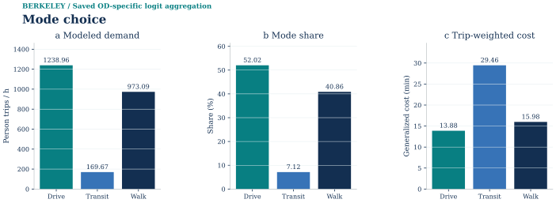</a>

Description, units and scope

Saved OD-specific logit probabilities apply only over available alternatives. Modeled one-hour demand is 1,238.9647955 drive, 169.6685413 direct-transit and 973.0889606 walk person trips; shares and trip-weighted generalized costs are copied from frozen plotdata. Direct AC Transit is available for a subset of zone pairs. All costs and behavior remain engineering assumptions, without a local behavioral fit. Single-pass engineering scenario; no local empirical calibration.

<a href="https://scholarhaozheng.github.io/mobility-network-lab/assets/figure-contract-r11/figures/berkeley/f12_mode_choice.png">PNG</a> · <a href="https://scholarhaozheng.github.io/mobility-network-lab/assets/figure-contract-r11/figures/berkeley/f12_mode_choice.svg">SVG</a> · <a href="https://scholarhaozheng.github.io/mobility-network-lab/assets/figure-contract-r11/figures/berkeley/f12_mode_choice.pdf">PDF</a> · <a href="https://scholarhaozheng.github.io/mobility-network-lab/assets/figure-contract-r11/figures/berkeley/f12_mode_choice.source.json">Source record</a>

</td></tr></table></td></tr>
<tr><td width="100%" valign="top" align="left"></td></tr>
<tr><td width="100%" valign="top" align="left">
<a href="https://scholarhaozheng.github.io/mobility-network-lab/volumes/berkeley.html#figure-f12-mode-choice">Complete city record · same evidence</a>
</td></tr>
</table>

#### Static assignment methods

S72 FW stopped at its iteration-0 check (relative gap 9.930680236469416e−16, gate 1e−5). The primary cards now show each method’s own physical flow and all-link distribution; objective, dimension and stopping checks remain supplementary. [Figure guide and saved-state interpretation](https://scholarhaozheng.github.io/mobility-network-lab/figure-update-status.html#top).

##### Demand sources and actual endpoints

<table width="100%">
<tr><th width="100%" valign="top" align="left"><strong>Native L3: all 3 saved outer iterations</strong></th></tr>
<tr><td width="100%" valign="top" align="left"><a href="https://scholarhaozheng.github.io/mobility-network-lab/volumes/berkeley.html#figure-private-berkeley-native-history">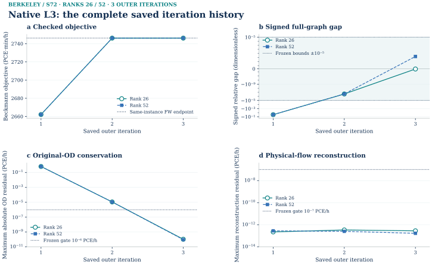</a></td></tr>
<tr><td width="100%" valign="top" align="left">
All 3 saved outer checks are plotted for each Native rank on the same frozen S72 instance (72 positive OD, 953.049842714 PCE/h). Each marker is an actual saved check at outer 1–3; the connecting segments do not add intermediate observations. Rank 26 uses open circles and rank 52 filled squares; near-coincident lines are both retained. Panels separate checked BPR/Beckmann objective, signed full-graph relative gap, maximum original-OD residual, and physical-flow reconstruction residual. The horizontal FW value is an independent same-instance endpoint, not an additional Native iteration. Early checked objectives lie below that endpoint while OD conservation has not yet reached its frozen gate; these are not feasible upper bounds or better traffic solutions. Signed negative gaps remain negative and are not interpreted as superior optimality. The gap axis is symmetric-log with a linear interval of ±10⁻¹²; OD/reconstruction axes are logarithmic in their original PCE/h units. The original gap bounds ±10⁻⁵, OD absolute gate 10⁻⁶ PCE/h, and reconstruction gate 10⁻⁷ PCE/h are unchanged. Both runs reach their original acceptance checks at outer 3; other relative-OD/nonnegativity gates remain in the source records. Berkeley objective values are taken from the per-outer checker; the independently evaluated public endpoint differs by at most 2.73×10⁻¹² PCE·min/h and is not substituted into this history. These early states belong to the ultimately accepted run; no separate failed trial is added. Endpoint comparison and method-specific physical-flow maps remain separate evidence. Private local preview of complete saved numerical history: public release currently covers endpoints, not these per-iteration values. Engineering scenario, not observed traffic or measured policy effect.
</td></tr>
<tr><td width="100%" valign="top" align="left">
<a href="https://scholarhaozheng.github.io/mobility-network-lab/assets/private-native-history-20261008/berkeley/native-complete-history.svg">SVG</a> · <a href="https://scholarhaozheng.github.io/mobility-network-lab/assets/private-native-history-20261008/berkeley/native-complete-history.png">PNG</a> · <a href="https://scholarhaozheng.github.io/mobility-network-lab/assets/private-native-history-20261008/berkeley/native-complete-history.pdf">PDF</a> · <a href="https://scholarhaozheng.github.io/mobility-network-lab/assets/private-native-history-20261008/berkeley/native-complete-history.plot.json">Plot data</a> · <a href="https://scholarhaozheng.github.io/mobility-network-lab/assets/private-native-history-20261008/berkeley/native-complete-history.source.json">Source and access</a> · <a href="https://scholarhaozheng.github.io/mobility-network-lab/assets/private-native-history-20261008/berkeley/native-complete-history.caption.md">Caption</a>
</td></tr>
</table>

<table width="100%">
<tr><th width="50%" valign="top" align="left"><strong>Demand ledger and vehicle assignment margins</strong></th><th width="50%" valign="top" align="left"><strong>Where the vehicle demand enters and leaves</strong></th></tr>
<tr><td width="50%" valign="top" align="left"><a href="https://scholarhaozheng.github.io/mobility-network-lab/volumes/berkeley.html#figure-r3-static-source-margins">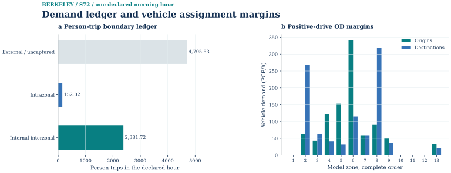</a></td><td width="50%" valign="top" align="left"><a href="https://scholarhaozheng.github.io/mobility-network-lab/volumes/berkeley.html#figure-r3-static-endpoints">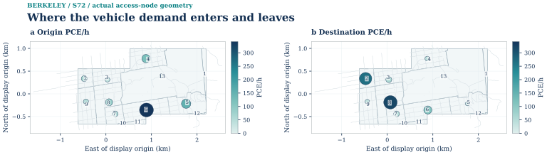</a></td></tr>
<tr><td width="50%" valign="top" align="left">
Complete person boundary ledger and all-zone vehicle origin/destination margins. The 72 positive OD pairs total 953.049842713612 PCE/h.
</td><td width="50%" valign="top" align="left">
Origin and destination demand at actual access nodes, with shared color and symbol-area scales; all model polygons remain visible.
</td></tr>
<tr><td width="50%" valign="top" align="left">
<a href="https://scholarhaozheng.github.io/mobility-network-lab/volumes/berkeley.html#figure-r3-static-source-margins">Complete evidence</a> · <a href="https://scholarhaozheng.github.io/mobility-network-lab/assets/city-alignment-r3/berkeley/static_source_margins.svg">Full figure</a>

Source records
<ul><li><a href="https://scholarhaozheng.github.io/mobility-network-lab/assets/city-alignment-r3/berkeley/static_source_margins.png">PNG</a></li><li><a href="https://scholarhaozheng.github.io/mobility-network-lab/assets/city-alignment-r3/berkeley/static_source_margins.pdf">PDF</a></li><li><a href="https://scholarhaozheng.github.io/mobility-network-lab/assets/city-alignment-r3/berkeley/static_source_margins.plot_data.json">Plot data</a></li><li><a href="https://scholarhaozheng.github.io/mobility-network-lab/assets/city-alignment-r3/berkeley/static_source_margins.source.json">Source record</a></li></ul>
</td><td width="50%" valign="top" align="left">
<a href="https://scholarhaozheng.github.io/mobility-network-lab/volumes/berkeley.html#figure-r3-static-endpoints">Complete evidence</a> · <a href="https://scholarhaozheng.github.io/mobility-network-lab/assets/city-alignment-r3/berkeley/static_endpoints.svg">Full figure</a>

Source records
<ul><li><a href="https://scholarhaozheng.github.io/mobility-network-lab/assets/city-alignment-r3/berkeley/static_endpoints.png">PNG</a></li><li><a href="https://scholarhaozheng.github.io/mobility-network-lab/assets/city-alignment-r3/berkeley/static_endpoints.pdf">PDF</a></li><li><a href="https://scholarhaozheng.github.io/mobility-network-lab/assets/city-alignment-r3/berkeley/static_endpoints.plot_data.json">Plot data</a></li><li><a href="https://scholarhaozheng.github.io/mobility-network-lab/assets/city-alignment-r3/berkeley/static_endpoints.source.json">Source record</a></li></ul>
</td></tr>
</table>

##### Static method comparison

<table width="100%">
<tr><th width="33%" valign="top" align="left"><strong>Frank–Wolfe physical loading and distribution</strong></th><th width="33%" valign="top" align="left"><strong>Finite-path reference and physical support</strong></th><th width="33%" valign="top" align="left"><strong>Native L3 physical flows against S72 FW</strong></th></tr>
<tr><td width="33%" valign="top" align="left"><a href="https://scholarhaozheng.github.io/mobility-network-lab/volumes/berkeley.html#figure-r9-fw-map-distribution">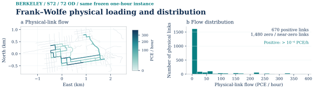</a></td><td width="33%" valign="top" align="left"><a href="https://scholarhaozheng.github.io/mobility-network-lab/volumes/berkeley.html#figure-r9-finite-map-distribution">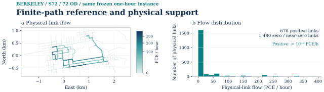</a></td><td width="33%" valign="top" align="left"><a href="https://scholarhaozheng.github.io/mobility-network-lab/volumes/berkeley.html#figure-r9-native-map-differences">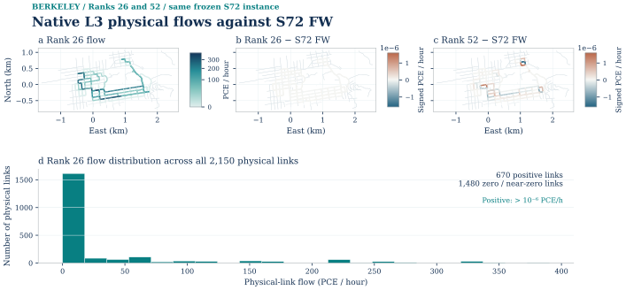</a></td></tr>
<tr><td width="33%" valign="top" align="left">
Frank–Wolfe own saved physical-link vector on the unchanged Berkeley S72 model: 72 positive vehicle OD pairs, 953.049842713612 PCE in one declared hour, 360 frozen candidate paths and all 2,150 directed physical road links. The left map retains every original road vertex and full gray graph; the right 22-bin histogram includes all 2,150 links, including 1,480 exact zeros. Both figures use the same square-root colour scale in PCE/hour and constant overlay width. FW and finite have exactly equal saved link vectors in this particular instance; each figure reads its own saved column. FW stopped at its initial check with zero updates; these maps are endpoint loading, not evidence of iterative progress. Values with absolute magnitude at most 1e-12 PCE/h are hidden only from coloured map overlays, not removed from the histogram or plot data.
</td><td width="33%" valign="top" align="left">
Finite-path own saved physical-link vector on the unchanged Berkeley S72 model: 72 positive vehicle OD pairs, 953.049842713612 PCE in one declared hour, 360 frozen candidate paths and all 2,150 directed physical road links. The left map retains every original road vertex and full gray graph; the right 22-bin histogram includes all 2,150 links, including 1,480 exact zeros. Both figures use the same square-root colour scale in PCE/hour and constant overlay width. FW and finite have exactly equal saved link vectors in this particular instance; each figure reads its own saved column. FW stopped at its initial check with zero updates; these maps are endpoint loading, not evidence of iterative progress. Values with absolute magnitude at most 1e-12 PCE/h are hidden only from coloured map overlays, not removed from the histogram or plot data.
</td><td width="33%" valign="top" align="left">
The upper row shows Berkeley S72 Native rank 26 own saved explicit physical-link flow, then signed rank 26−FW and rank 52−FW differences; the bottom 22-bin histogram contains all 2,150 rank 26 physical links, including zero/near-zero values. The absolute map uses the same square-root colour scale as the companion FW and finite cards. The signed maps use one shared symmetric zero-centred scale in PCE/hour; no micro-unit magnification changes the quantity. Maximum absolute differences are 2.645862196e-08 PCE/h and1.5853784987e-06 PCE/h. These tiny numerical differences are not traffic improvement. Raw saved numerical values, including rank 52 negatives down to −4.380487468063516e-47 PCE/h, remain in plot data; |flow|≤1e-12 only suppresses coloured map overlays, with the full geographic base retained. The Native vectors are actual saved explicit v, not substituted FW/finite vectors. This bounded low-congestion same-instance agreement establishes neither a difficult congestion test nor speedup. © OpenStreetMap contributors, ODbL 1.0; modelled one-hour engineering scenario, not observations.
</td></tr>
<tr><td width="33%" valign="top" align="left">
<a href="https://scholarhaozheng.github.io/mobility-network-lab/volumes/berkeley.html#figure-r9-fw-map-distribution">Complete evidence</a> · <a href="https://scholarhaozheng.github.io/mobility-network-lab/assets/plot-semantics-r9/berkeley/fw-map-distribution.svg">Full figure</a>

Source records
<ul><li><a href="https://scholarhaozheng.github.io/mobility-network-lab/assets/plot-semantics-r9/berkeley/fw-map-distribution.svg">SVG</a></li><li><a href="https://scholarhaozheng.github.io/mobility-network-lab/assets/plot-semantics-r9/berkeley/fw-map-distribution.png">PNG</a></li><li><a href="https://scholarhaozheng.github.io/mobility-network-lab/assets/plot-semantics-r9/berkeley/fw-map-distribution.pdf">PDF</a></li><li><a href="https://scholarhaozheng.github.io/mobility-network-lab/assets/plot-semantics-r9/berkeley/fw-map-distribution.plot_data.json">Plot data</a></li><li><a href="https://scholarhaozheng.github.io/mobility-network-lab/assets/plot-semantics-r9/berkeley/fw-map-distribution.caption.md">Caption</a></li><li><a href="https://scholarhaozheng.github.io/mobility-network-lab/assets/plot-semantics-r9/berkeley/fw-map-distribution.source.json">Source record</a></li></ul>
</td><td width="33%" valign="top" align="left">
<a href="https://scholarhaozheng.github.io/mobility-network-lab/volumes/berkeley.html#figure-r9-finite-map-distribution">Complete evidence</a> · <a href="https://scholarhaozheng.github.io/mobility-network-lab/assets/plot-semantics-r9/berkeley/finite-map-distribution.svg">Full figure</a>

Source records
<ul><li><a href="https://scholarhaozheng.github.io/mobility-network-lab/assets/plot-semantics-r9/berkeley/finite-map-distribution.svg">SVG</a></li><li><a href="https://scholarhaozheng.github.io/mobility-network-lab/assets/plot-semantics-r9/berkeley/finite-map-distribution.png">PNG</a></li><li><a href="https://scholarhaozheng.github.io/mobility-network-lab/assets/plot-semantics-r9/berkeley/finite-map-distribution.pdf">PDF</a></li><li><a href="https://scholarhaozheng.github.io/mobility-network-lab/assets/plot-semantics-r9/berkeley/finite-map-distribution.plot_data.json">Plot data</a></li><li><a href="https://scholarhaozheng.github.io/mobility-network-lab/assets/plot-semantics-r9/berkeley/finite-map-distribution.caption.md">Caption</a></li><li><a href="https://scholarhaozheng.github.io/mobility-network-lab/assets/plot-semantics-r9/berkeley/finite-map-distribution.source.json">Source record</a></li></ul>
</td><td width="33%" valign="top" align="left">
<a href="https://scholarhaozheng.github.io/mobility-network-lab/volumes/berkeley.html#figure-r9-native-map-differences">Complete evidence</a> · <a href="https://scholarhaozheng.github.io/mobility-network-lab/assets/plot-semantics-r9/berkeley/native-map-differences.svg">Full figure</a>

Source records
<ul><li><a href="https://scholarhaozheng.github.io/mobility-network-lab/assets/plot-semantics-r9/berkeley/native-map-differences.svg">SVG</a></li><li><a href="https://scholarhaozheng.github.io/mobility-network-lab/assets/plot-semantics-r9/berkeley/native-map-differences.png">PNG</a></li><li><a href="https://scholarhaozheng.github.io/mobility-network-lab/assets/plot-semantics-r9/berkeley/native-map-differences.pdf">PDF</a></li><li><a href="https://scholarhaozheng.github.io/mobility-network-lab/assets/plot-semantics-r9/berkeley/native-map-differences.plot_data.json">Plot data</a></li><li><a href="https://scholarhaozheng.github.io/mobility-network-lab/assets/plot-semantics-r9/berkeley/native-map-differences.caption.md">Caption</a></li><li><a href="https://scholarhaozheng.github.io/mobility-network-lab/assets/plot-semantics-r9/berkeley/native-map-differences.source.json">Source record</a></li></ul>
</td></tr>
</table>

Original stopping, scalar comparison and flow diagnostics

<table width="100%">
<tr><th width="33%" valign="top" align="left"><strong>Frank–Wolfe: the saved initial check</strong></th><th width="33%" valign="top" align="left"><strong>Accepted static endpoints and feasibility</strong></th><td colspan="1" width="33%"></td></tr>
<tr><td width="33%" valign="top" align="left"><table width="100%"><tr><td valign="top" width="100%">
<a href="https://scholarhaozheng.github.io/mobility-network-lab/volumes/berkeley.html#figure-r3-fw-saved-check">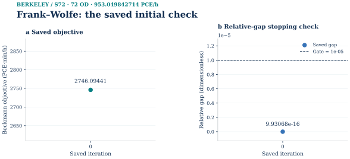</a>
Only the actual saved iteration 0 is shown: objective 2746.09441497946 PCE·min/h and relative gap 9.93068023646942e-16, against the unchanged 1e-05 stopping gate. There were zero updates. Each panel contains a single numerical point; no missing trajectory or second state is inferred. The companion physical-flow map reads this method’s own saved vector. The saved signed gap numerator is 2.7284841053187847e−12 PCE·min/h; the independent endpoint evaluator remains a separate numerical evaluation.

<a href="https://scholarhaozheng.github.io/mobility-network-lab/assets/figure-contract-r12/figures/berkeley/berkeley-fw-initial-check.svg">SVG</a> · <a href="https://scholarhaozheng.github.io/mobility-network-lab/assets/figure-contract-r12/figures/berkeley/berkeley-fw-initial-check.png">PNG</a> · <a href="https://scholarhaozheng.github.io/mobility-network-lab/assets/figure-contract-r12/figures/berkeley/berkeley-fw-initial-check.pdf">PDF</a> · <a href="https://scholarhaozheng.github.io/mobility-network-lab/assets/figure-contract-r12/figures/berkeley/berkeley-fw-initial-check.source.json">Source data</a>

</td></tr></table></td><td width="33%" valign="top" align="left"><table width="100%"><tr><td valign="top" width="100%">
<a href="https://scholarhaozheng.github.io/mobility-network-lab/volumes/berkeley.html#figure-s02-same-instance-methods">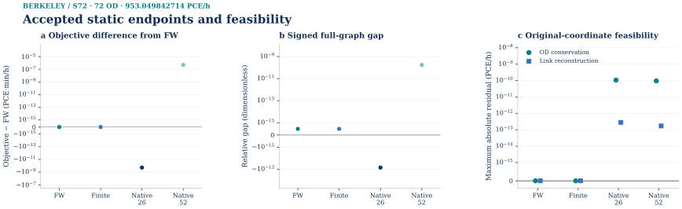</a>
Independent accepted endpoints on S72 · 72 OD · 953.049842714 PCE/h. Panels show signed objective difference from the same-instance FW endpoint (2746.09441497946 PCE·min/h), signed full-graph relative gap, and maximum original-OD and link-reconstruction residuals. Categories are method identities, not iteration numbers; no connecting trajectory is drawn. The signed symmetric-log axes retain exact zeros and negative roundoff, with a linear interval of ±1e−15 in each panel’s stated unit. The accompanying method-specific physical-flow figures remain the map evidence; scalar agreement does not imply identical flow.

<a href="https://scholarhaozheng.github.io/mobility-network-lab/assets/figure-contract-r12/figures/berkeley/berkeley-s72-endpoints.svg">SVG</a> · <a href="https://scholarhaozheng.github.io/mobility-network-lab/assets/figure-contract-r12/figures/berkeley/berkeley-s72-endpoints.png">PNG</a> · <a href="https://scholarhaozheng.github.io/mobility-network-lab/assets/figure-contract-r12/figures/berkeley/berkeley-s72-endpoints.pdf">PDF</a> · <a href="https://scholarhaozheng.github.io/mobility-network-lab/assets/figure-contract-r12/figures/berkeley/berkeley-s72-endpoints.source.json">Source data</a>

</td></tr></table></td><td colspan="1" width="33%"></td></tr>
<tr><td width="33%" valign="top" align="left"></td><td width="33%" valign="top" align="left"></td><td colspan="1" width="33%"></td></tr>
<tr><td width="33%" valign="top" align="left"></td><td width="33%" valign="top" align="left"></td><td colspan="1" width="33%"></td></tr>
</table>

Additional saved diagnostics and original views
<h5>Complete assignment and pool context</h5>

#### Time-expanded network and path examples

<table width="100%">
<tr><th width="50%" valign="top" align="left"><strong>Time-expanded network in layers</strong></th><th width="50%" valign="top" align="left"><strong>Local construction details</strong></th></tr>
<tr><td width="50%" valign="top" align="left"><a href="https://scholarhaozheng.github.io/mobility-network-lab/volumes/berkeley.html#figure-parity-berkeley-time-layers">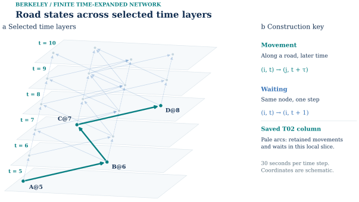</a></td><td width="50%" valign="top" align="left"><a href="https://scholarhaozheng.github.io/mobility-network-lab/volumes/berkeley.html#figure-parity-berkeley-local-details">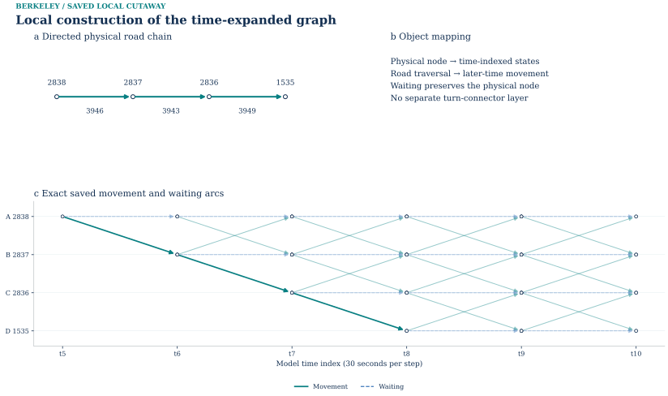</a></td></tr>
<tr><td width="50%" valign="top" align="left">
Berkeley: selected time layers 5–10 use 30 seconds per time step. Every arrow is an actual saved arc; only node-time states occurring as saved endpoints are drawn.

Description, units and scope

Berkeley: selected time layers 5–10 use 30 seconds per time step. Every arrow is an actual saved arc; only node-time states occurring as saved endpoints are drawn. The first three movements of the saved positive T02 column (7.5 PCE) are highlighted. The complete column has 89 movements; this local display is not its entire route. State aliases: A = 2838, B = 2837, C = 2836, D = 1535. Pale arrows show other saved arcs in this local slice. Time planes and horizontal placement are schematic; this is neither a full graph nor observed traffic. No independent turn connector exists in this T4 representation. Blue dashed waiting arcs are available local context; the selected three movements contain no wait. Elapsed rounded model time and fixed arc cost are different quantities.

</td><td width="50%" valign="top" align="left">
Berkeley: the physical road chain is mapped to physical-node states and then to exact time-indexed arcs in the saved construction slice. Panel c contains all 35 retained arcs, with exact endpoint times; strong teal/blue highlights the same continuous chain used in the companion layered figure.

Description, units and scope

Berkeley: the physical road chain is mapped to physical-node states and then to exact time-indexed arcs in the saved construction slice. Panel c contains all 35 retained arcs, with exact endpoint times; strong teal/blue highlights the same continuous chain used in the companion layered figure. The first three movements of the saved positive T02 column (7.5 PCE) are highlighted. The complete column has 89 movements; this local display is not its entire route. All layout coordinates are schematic. Source/sink terminal bookkeeping is outside this excerpt and must not be read as road travel or waiting. No independent turn connector exists in this T4 representation. Blue dashed waiting arcs are available local context; the selected three movements contain no wait. Elapsed rounded model time and fixed arc cost are different quantities.

</td></tr>
<tr><td width="50%" valign="top" align="left">
<a href="https://scholarhaozheng.github.io/mobility-network-lab/volumes/berkeley.html#figure-parity-berkeley-time-layers">Complete evidence · same figure</a> · <a href="https://scholarhaozheng.github.io/mobility-network-lab/assets/template-parity-20261008/construction/berkeley/time-layers.svg">SVG</a> · <a href="https://scholarhaozheng.github.io/mobility-network-lab/assets/template-parity-20261008/construction/berkeley/time-layers.png">PNG</a> · <a href="https://scholarhaozheng.github.io/mobility-network-lab/assets/template-parity-20261008/construction/berkeley/time-layers.pdf">PDF</a> · <a href="https://scholarhaozheng.github.io/mobility-network-lab/assets/template-parity-20261008/construction/berkeley/time-layers.plot.json">Plot data</a> · <a href="https://scholarhaozheng.github.io/mobility-network-lab/assets/template-parity-20261008/construction/berkeley/time-layers.source.json">Source record</a> · <a href="https://scholarhaozheng.github.io/mobility-network-lab/assets/template-parity-20261008/construction/berkeley/time-layers.caption.md">Caption</a>
</td><td width="50%" valign="top" align="left">
<a href="https://scholarhaozheng.github.io/mobility-network-lab/volumes/berkeley.html#figure-parity-berkeley-local-details">Complete evidence · same figure</a> · <a href="https://scholarhaozheng.github.io/mobility-network-lab/assets/template-parity-20261008/construction/berkeley/local-details.svg">SVG</a> · <a href="https://scholarhaozheng.github.io/mobility-network-lab/assets/template-parity-20261008/construction/berkeley/local-details.png">PNG</a> · <a href="https://scholarhaozheng.github.io/mobility-network-lab/assets/template-parity-20261008/construction/berkeley/local-details.pdf">PDF</a> · <a href="https://scholarhaozheng.github.io/mobility-network-lab/assets/template-parity-20261008/construction/berkeley/local-details.plot.json">Plot data</a> · <a href="https://scholarhaozheng.github.io/mobility-network-lab/assets/template-parity-20261008/construction/berkeley/local-details.source.json">Source record</a> · <a href="https://scholarhaozheng.github.io/mobility-network-lab/assets/template-parity-20261008/construction/berkeley/local-details.caption.md">Caption</a>
</td></tr>
</table>

Additional saved source figures
<ul><li><a href="https://scholarhaozheng.github.io/mobility-network-lab/volumes/berkeley.html#figure-r3-time-layers">Road states across selected time layers</a></li><li><a href="https://scholarhaozheng.github.io/mobility-network-lab/assets/figure-contract-r11/figures/berkeley/t01_computed_column.svg">Computed column: route, cost and model time</a></li></ul>

#### Optimization on the time-expanded network

##### Column generation: feasibility → objective → pricing

<table width="100%">
<tr><th width="33%" valign="top" align="left"><strong>Column generation: Phase I feasibility</strong></th><th width="33%" valign="top" align="left"><strong>Phase II objective</strong></th><th width="33%" valign="top" align="left"><strong>Complete-graph pricing closure</strong></th></tr>
<tr><td width="33%" valign="top" align="left"><a href="https://scholarhaozheng.github.io/mobility-network-lab/volumes/berkeley.html#figure-r3-cg-phase-one">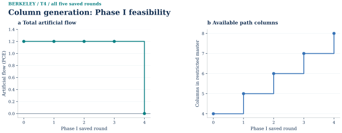</a></td><td width="33%" valign="top" align="left"><a href="https://scholarhaozheng.github.io/mobility-network-lab/volumes/berkeley.html#figure-r3-cg-phase-two">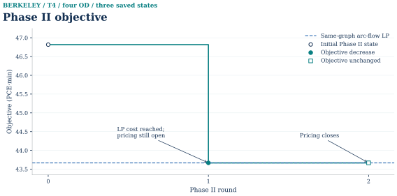</a></td><td width="33%" valign="top" align="left"><a href="https://scholarhaozheng.github.io/mobility-network-lab/volumes/berkeley.html#figure-r3-cg-pricing-closure">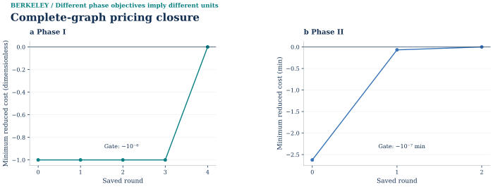</a></td></tr>
<tr><td width="33%" valign="top" align="left">
All five saved Phase-I artificial-flow totals and pool sizes. Artificial flow clears at round 4; no per-OD artificial trajectory is invented.
</td><td width="33%" valign="top" align="left">
Boston-style raw-objective steps distinguish the initial state, one decrease and one unchanged objective. LP cost is reached at round 1; full-graph pricing closes at round 2.
</td><td width="33%" valign="top" align="left">
Complete-graph minimum reduced costs use separate Phase-I dimensionless and Phase-II minute-valued axes, with their actual frozen gates.
</td></tr>
<tr><td width="33%" valign="top" align="left">
<a href="https://scholarhaozheng.github.io/mobility-network-lab/volumes/berkeley.html#figure-r3-cg-phase-one">Complete evidence</a> · <a href="https://scholarhaozheng.github.io/mobility-network-lab/assets/city-alignment-r3/berkeley/cg_phase_one.svg">Full figure</a>

Source records
<ul><li><a href="https://scholarhaozheng.github.io/mobility-network-lab/assets/city-alignment-r3/berkeley/cg_phase_one.png">PNG</a></li><li><a href="https://scholarhaozheng.github.io/mobility-network-lab/assets/city-alignment-r3/berkeley/cg_phase_one.pdf">PDF</a></li><li><a href="https://scholarhaozheng.github.io/mobility-network-lab/assets/city-alignment-r3/berkeley/cg_phase_one.plot_data.json">Plot data</a></li><li><a href="https://scholarhaozheng.github.io/mobility-network-lab/assets/city-alignment-r3/berkeley/cg_phase_one.source.json">Source record</a></li></ul>
</td><td width="33%" valign="top" align="left">
<a href="https://scholarhaozheng.github.io/mobility-network-lab/volumes/berkeley.html#figure-r3-cg-phase-two">Complete evidence</a> · <a href="https://scholarhaozheng.github.io/mobility-network-lab/assets/city-alignment-r3/berkeley/cg_phase_two.svg">Full figure</a>

Source records
<ul><li><a href="https://scholarhaozheng.github.io/mobility-network-lab/assets/city-alignment-r3/berkeley/cg_phase_two.png">PNG</a></li><li><a href="https://scholarhaozheng.github.io/mobility-network-lab/assets/city-alignment-r3/berkeley/cg_phase_two.pdf">PDF</a></li><li><a href="https://scholarhaozheng.github.io/mobility-network-lab/assets/city-alignment-r3/berkeley/cg_phase_two.plot_data.json">Plot data</a></li><li><a href="https://scholarhaozheng.github.io/mobility-network-lab/assets/city-alignment-r3/berkeley/cg_phase_two.source.json">Source record</a></li></ul>
</td><td width="33%" valign="top" align="left">
<a href="https://scholarhaozheng.github.io/mobility-network-lab/volumes/berkeley.html#figure-r3-cg-pricing-closure">Complete evidence</a> · <a href="https://scholarhaozheng.github.io/mobility-network-lab/assets/city-alignment-r3/berkeley/cg_pricing_closure.svg">Full figure</a>

Source records
<ul><li><a href="https://scholarhaozheng.github.io/mobility-network-lab/assets/city-alignment-r3/berkeley/cg_pricing_closure.png">PNG</a></li><li><a href="https://scholarhaozheng.github.io/mobility-network-lab/assets/city-alignment-r3/berkeley/cg_pricing_closure.pdf">PDF</a></li><li><a href="https://scholarhaozheng.github.io/mobility-network-lab/assets/city-alignment-r3/berkeley/cg_pricing_closure.plot_data.json">Plot data</a></li><li><a href="https://scholarhaozheng.github.io/mobility-network-lab/assets/city-alignment-r3/berkeley/cg_pricing_closure.source.json">Source record</a></li></ul>
</td></tr>
</table>

##### Lagrangian relaxation: bounds → prices → recovery

<table width="100%">
<tr><th width="33%" valign="top" align="left"><strong>Lagrangian bounds and certified gap</strong></th><th width="33%" valign="top" align="left"><strong>Lagrangian prices and relaxed capacity violations</strong></th><th width="33%" valign="top" align="left"><strong>Path-pool growth and separate primal recovery</strong></th></tr>
<tr><td width="33%" valign="top" align="left"><table width="100%"><tr><td valign="top" width="100%">
<a href="https://scholarhaozheng.github.io/mobility-network-lab/volumes/berkeley.html#figure-r3-lr-bounds">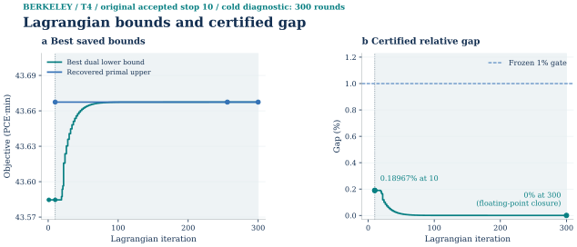</a>

Description, units and scope

The original accepted run remains separately preserved at iteration 10. This view uses 300 actual saved records from run BERKELEY_T4_LR_EXTENDED_DIAGNOSTIC_R1, through iteration 300. The extended trace is a diagnostic experiment and does not retroactively change the original stopping decision. Independent diagnostic audit passed. The 300-round saved record passed all 23 original formal-entry checks. The formal 1% certificate is first met at saved iteration 10; later rounds, when present, are shaded as post-gate diagnostics. Teal denotes the saved best dual lower bound and blue the separately recovered feasible upper. The right panel shows 100 times the saved dimensionless certificate on a linear percentage axis, against the unchanged gate. Missing upper/gap records remain unplotted. Final best lower is 43.66742440800643 PCE·min; best upper is 43.66742440800643 PCE·min and gap is 0%. The highest saved best bound first appears at iteration 256. The final current relaxed dual is separately 43.66228345703368 PCE·min; it is not substituted for the running best bound. The certificate is max(0, (U−L)/max(1,|U|)). The final signed U−L is -7.10543e-15 PCE·min. A saved zero gap here denotes numerical agreement at floating-point precision, not an algebraic proof of exact equality. The independent LP scalar remains in metadata and is not substituted for an LR upper bound. No smoothing, invented points, or optimizer calls are used by this renderer.

<a href="https://scholarhaozheng.github.io/mobility-network-lab/assets/figure-contract-r11/figures/berkeley/lr_bounds.png">PNG</a> · <a href="https://scholarhaozheng.github.io/mobility-network-lab/assets/figure-contract-r11/figures/berkeley/lr_bounds.svg">SVG</a> · <a href="https://scholarhaozheng.github.io/mobility-network-lab/assets/figure-contract-r11/figures/berkeley/lr_bounds.pdf">PDF</a> · <a href="https://scholarhaozheng.github.io/mobility-network-lab/assets/figure-contract-r11/figures/berkeley/lr_bounds.source.json">Source record</a>

</td></tr></table></td><td width="33%" valign="top" align="left"><table width="100%"><tr><td valign="top" width="100%">
<a href="https://scholarhaozheng.github.io/mobility-network-lab/volumes/berkeley.html#figure-r3-lr-prices">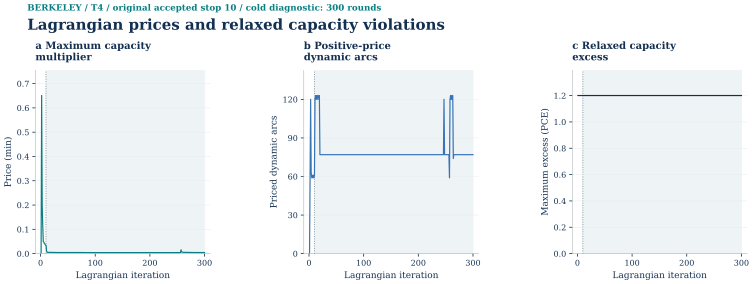</a>

Description, units and scope

The original accepted run remains separately preserved at iteration 10. This view uses 300 actual saved records from run BERKELEY_T4_LR_EXTENDED_DIAGNOSTIC_R1, through iteration 300. The extended trace is a diagnostic experiment and does not retroactively change the original stopping decision. Independent diagnostic audit passed. The 300-round saved record passed all 23 original formal-entry checks. The formal 1% certificate is first met at saved iteration 10; later rounds, when present, are shaded as post-gate diagnostics. Every saved current-iterate maximum capacity multiplier, strictly positive multiplier count and maximum relaxed capacity excess is shown. Multiplier units are minutes, from a PCE·min objective divided by a PCE capacity; relaxed excess is PCE. These current-iterate summaries are distinct from the saved best-dual multiplier state. Relaxed excess is not the feasibility residual of separately recovered primal flow. A closed best-bound certificate does not imply that subsequent current multipliers stop changing; the full diagnostic retains those changes. No smoothing or per-arc history is inferred.

<a href="https://scholarhaozheng.github.io/mobility-network-lab/assets/figure-contract-r11/figures/berkeley/lr_prices.png">PNG</a> · <a href="https://scholarhaozheng.github.io/mobility-network-lab/assets/figure-contract-r11/figures/berkeley/lr_prices.svg">SVG</a> · <a href="https://scholarhaozheng.github.io/mobility-network-lab/assets/figure-contract-r11/figures/berkeley/lr_prices.pdf">PDF</a> · <a href="https://scholarhaozheng.github.io/mobility-network-lab/assets/figure-contract-r11/figures/berkeley/lr_prices.source.json">Source record</a>

</td></tr></table></td><td width="33%" valign="top" align="left"><table width="100%"><tr><td valign="top" width="100%">
<a href="https://scholarhaozheng.github.io/mobility-network-lab/volumes/berkeley.html#figure-r3-lr-recovery">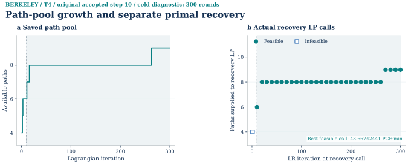</a>

Description, units and scope

The original accepted run remains separately preserved at iteration 10. This view uses 300 actual saved records from run BERKELEY_T4_LR_EXTENDED_DIAGNOSTIC_R1, through iteration 300. The extended trace is a diagnostic experiment and does not retroactively change the original stopping decision. Independent diagnostic audit passed. The 300-round saved record passed all 23 original formal-entry checks. The formal 1% certificate is first met at saved iteration 10; later rounds, when present, are shaded as post-gate diagnostics. Panel a retains all 300 saved path-pool sizes; panel b shows exactly 31 actual recovery calls (30 feasible, 1 infeasible). Filled circles are feasible calls and open squares are infeasible calls. Null objectives remain missing and are never zero-imputed. Pool growth is not a sequence of feasible upper bounds. The call records and own recovered physical flow retain their separate source identities.

<a href="https://scholarhaozheng.github.io/mobility-network-lab/assets/figure-contract-r11/figures/berkeley/lr_recovery.png">PNG</a> · <a href="https://scholarhaozheng.github.io/mobility-network-lab/assets/figure-contract-r11/figures/berkeley/lr_recovery.svg">SVG</a> · <a href="https://scholarhaozheng.github.io/mobility-network-lab/assets/figure-contract-r11/figures/berkeley/lr_recovery.pdf">PDF</a> · <a href="https://scholarhaozheng.github.io/mobility-network-lab/assets/figure-contract-r11/figures/berkeley/lr_recovery.source.json">Source record</a>

</td></tr></table></td></tr>
<tr><td width="33%" valign="top" align="left"></td><td width="33%" valign="top" align="left"></td><td width="33%" valign="top" align="left"></td></tr>
<tr><td width="33%" valign="top" align="left">
<a href="https://scholarhaozheng.github.io/mobility-network-lab/volumes/berkeley.html#figure-r3-lr-bounds">Complete city record · same evidence</a>
</td><td width="33%" valign="top" align="left">
<a href="https://scholarhaozheng.github.io/mobility-network-lab/volumes/berkeley.html#figure-r3-lr-prices">Complete city record · same evidence</a>
</td><td width="33%" valign="top" align="left">
<a href="https://scholarhaozheng.github.io/mobility-network-lab/volumes/berkeley.html#figure-r3-lr-recovery">Complete city record · same evidence</a>
</td></tr>
</table>

##### ADMM: convergence → conservation → physical flow

<table width="100%">
<tr><th width="33%" valign="top" align="left"><strong>ADMM convergence and objective agreement</strong></th><th width="33%" valign="top" align="left"><strong>Commodity conservation at the final state</strong></th><th width="33%" valign="top" align="left"><strong>ADMM and LP physical-link flow</strong></th></tr>
<tr><td width="33%" valign="top" align="left"><table width="100%"><tr><td valign="top" width="100%">
<a href="https://scholarhaozheng.github.io/mobility-network-lab/volumes/berkeley.html#figure-admm-convergence">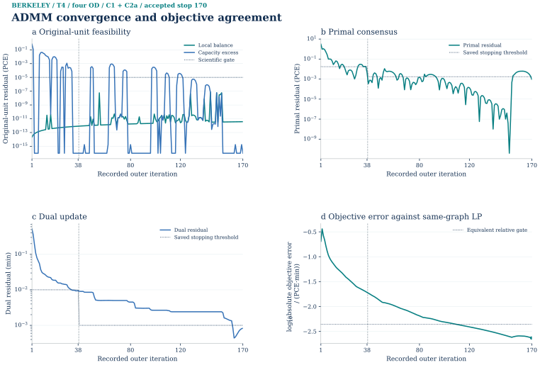</a>

Description, units and scope

Accepted Berkeley T4 ADMM saved history, all 170 recorded outer iterations. The four panels follow the current Boston/Hong Kong diagnostic objects: original-unit balance and capacity feasibility, primal consensus, dual update, and log10 absolute objective error against the independent LP on the same T4 graph. Balance/capacity and primal residuals are PCE. The dual residual is rho times the consensus change and is in minutes: rho has min/PCE units. The dotted scientific feasibility gate is 1e-5 PCE; the internal thresholds are the recorded values. The objective gate line is the unchanged 1e-4 relative criterion expressed on the absolute-error axis. Only exact-zero feasibility values use a display value of 1e-16 PCE; every positive value, including smaller positives, is retained unchanged. The vertical separator is after C1 outer 38; C2a contributes 132 further updates under its disclosed new wall budget. The actual trace ends at 170; the registered 300-outer ceiling is not an extrapolated trace. Final own-x objective is 43.66974694298355 PCE·min against LP 43.66742440800644 PCE·min, absolute difference 0.00232253497711 PCE·min and relative difference 0.00531869%. Objective agreement is separate from physical-link flow agreement. No smoothing, interpolation or solver call.

<a href="https://scholarhaozheng.github.io/mobility-network-lab/assets/figure-contract-r11/figures/berkeley/admm_convergence.png">PNG</a> · <a href="https://scholarhaozheng.github.io/mobility-network-lab/assets/figure-contract-r11/figures/berkeley/admm_convergence.svg">SVG</a> · <a href="https://scholarhaozheng.github.io/mobility-network-lab/assets/figure-contract-r11/figures/berkeley/admm_convergence.pdf">PDF</a> · <a href="https://scholarhaozheng.github.io/mobility-network-lab/assets/figure-contract-r11/figures/berkeley/admm_convergence.source.json">Source record</a>

</td></tr></table></td><td width="33%" valign="top" align="left"><a href="https://scholarhaozheng.github.io/mobility-network-lab/volumes/berkeley.html#figure-parity-berkeley-admm-final-conservation">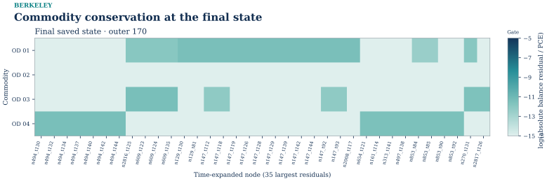</a></td><td width="33%" valign="top" align="left"><table width="100%"><tr><td valign="top" width="100%">

Description, units and scope

Saved Berkeley T4 physical-link projections for four assumed first-bin OD pulses (10.439304601 PCE), using the accepted ADMM own x at completed outer 170 and an independently solved same-graph LP. Panels a–b share a PowerNorm(0.5) absolute color scale. Panel c uses a separate symmetric ADMM-minus-LP scale; panel d contains all 2,150matched physical IDs and an identity line. The maximum physical-flow difference is 0.990967760238112 PCE, despite a relative objective difference of 0.00531869%. The objective gate does not establish link-flow equality. All 2,150 original road geometries are retained with longitude/latitude aspect correction. The 137 links without a movement arc in the bounded T4 graph remain zero and are shown dotted; missing sparse LP entries are zero-filled by physical ID. Flows are PCE over this bounded departure instance, not hourly counts or observed traffic. No optimizer was rerun. © OpenStreetMap contributors, ODbL 1.0.

<a href="https://scholarhaozheng.github.io/mobility-network-lab/assets/figure-contract-r11/figures/berkeley/admm_physical_flow_comparison.png">PNG</a> · <a href="https://scholarhaozheng.github.io/mobility-network-lab/assets/figure-contract-r11/figures/berkeley/admm_physical_flow_comparison.svg">SVG</a> · <a href="https://scholarhaozheng.github.io/mobility-network-lab/assets/figure-contract-r11/figures/berkeley/admm_physical_flow_comparison.pdf">PDF</a> · <a href="https://scholarhaozheng.github.io/mobility-network-lab/assets/figure-contract-r11/figures/berkeley/admm_physical_flow_comparison.source.json">Source record</a>

</td></tr></table></td></tr>
<tr><td width="33%" valign="top" align="left"></td><td width="33%" valign="top" align="left">

Description, units and scope

Final saved ADMM own-x state at completed outer 170. Reconstruct outflow minus inflow minus commodity supply in the original units and exact saved arc order, with the loader's lexical node order. The heatmap selects the 35 nodes with the largest maximum absolute residual across all four commodities; ties retain lexical node order. All 92,578 nodes were included in this selection. The complete per-commodity maximum residuals and worst-node IDs reproduce the saved independent check exactly; overall maximum is 3.74010259123591e-12 PCE against the unchanged 1e−5 PCE gate. Colors show log10(max(|residual|,1e−15 PCE)/(1 PCE)); sub-floor values and exact zeros share the floor color, with their raw signed and absolute values preserved in plot data. This is a final spatial conservation diagnostic, not an iteration-history heatmap. It complements the existing 170-record convergence and ADMM-versus-LP physical-flow figures; it does not replace the latter or imply link-flow equality. Private local derivative of the accepted saved result; no new public asset release or optimizer run is claimed. Engineering scenario, not observed traffic.

</td><td width="33%" valign="top" align="left"></td></tr>
<tr><td width="33%" valign="top" align="left">
<a href="https://scholarhaozheng.github.io/mobility-network-lab/volumes/berkeley.html#figure-admm-convergence">Complete city record · same evidence</a>
</td><td width="33%" valign="top" align="left">
<a href="https://scholarhaozheng.github.io/mobility-network-lab/volumes/berkeley.html#figure-parity-berkeley-admm-final-conservation">Complete evidence · same figure</a> · <a href="https://scholarhaozheng.github.io/mobility-network-lab/assets/template-parity-20261008/admm/berkeley/admm-final-conservation.svg">SVG</a> · <a href="https://scholarhaozheng.github.io/mobility-network-lab/assets/template-parity-20261008/admm/berkeley/admm-final-conservation.png">PNG</a> · <a href="https://scholarhaozheng.github.io/mobility-network-lab/assets/template-parity-20261008/admm/berkeley/admm-final-conservation.pdf">PDF</a> · <a href="https://scholarhaozheng.github.io/mobility-network-lab/assets/template-parity-20261008/admm/berkeley/admm-final-conservation.plot.json">Plot data</a> · <a href="https://scholarhaozheng.github.io/mobility-network-lab/assets/template-parity-20261008/admm/berkeley/admm-final-conservation.source.json">Source record</a> · <a href="https://scholarhaozheng.github.io/mobility-network-lab/assets/template-parity-20261008/admm/berkeley/admm-final-conservation.caption.md">Caption</a>
</td><td width="33%" valign="top" align="left">
<a href="https://scholarhaozheng.github.io/mobility-network-lab/volumes/berkeley.html#figure-admm-physical-flow-comparison">Complete city record · same evidence</a>
</td></tr>
</table>

Additional saved diagnostics and original views

##### Same-instance LP / CG / LR physical projection

<table width="100%">
<tr><th width="100%" valign="top" align="left"><strong>LP, CG and recovered LR physical flow</strong></th></tr>
<tr><td width="100%" valign="top" align="left"><table width="100%"><tr><td valign="top" width="100%">
<a href="https://scholarhaozheng.github.io/mobility-network-lab/volumes/berkeley.html#figure-lp-cg-lr-physical-flow">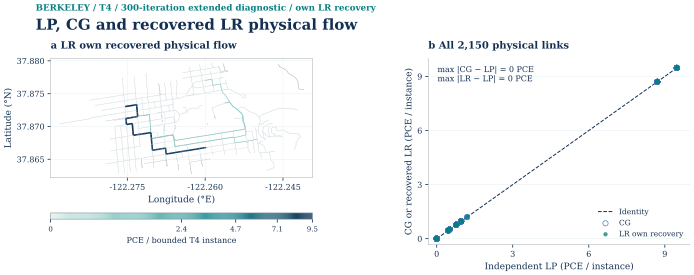</a>

Description, units and scope

The 300-iteration same-rule cold-start LR diagnostic retains the original T4 model and the official 1% gate, first met at iteration 10. The map uses LR’s own selected feasible recovery (saved recovery iteration 10), joined by physical-link ID to all 2,150 road geometries. The scatter includes every road ID and compares the unchanged independent LP and CG projections with the selected LR projection. Maximum absolute differences from LP are 0 PCE for CG and 0 PCE for LR. The stored aggregate physical projections coincide exactly in this instance. Colors and widths use PowerNorm(0.5), retaining the absolute scale used by the existing ADMM–LP map unless new values require a larger maximum. The 137 physical links with no admitted T4 movement arc remain distinct as dotted background links. Flows are PCE over the bounded departure instance, not PCE/hour. The original accepted 10-iteration evidence is retained separately. No LP flow was substituted for the LR recovery. © OpenStreetMap contributors, ODbL 1.0. Independent diagnostic audit passed. The extended saved record passed all 23 original formal-entry checks.

<a href="https://scholarhaozheng.github.io/mobility-network-lab/assets/figure-contract-r11/figures/berkeley/lp_cg_lr_physical_flow.png">PNG</a> · <a href="https://scholarhaozheng.github.io/mobility-network-lab/assets/figure-contract-r11/figures/berkeley/lp_cg_lr_physical_flow.svg">SVG</a> · <a href="https://scholarhaozheng.github.io/mobility-network-lab/assets/figure-contract-r11/figures/berkeley/lp_cg_lr_physical_flow.pdf">PDF</a> · <a href="https://scholarhaozheng.github.io/mobility-network-lab/assets/figure-contract-r11/figures/berkeley/lp_cg_lr_physical_flow.source.json">Source record</a>

</td></tr></table></td></tr>
<tr><td width="100%" valign="top" align="left"></td></tr>
<tr><td width="100%" valign="top" align="left">
<a href="https://scholarhaozheng.github.io/mobility-network-lab/volumes/berkeley.html#figure-lp-cg-lr-physical-flow">Complete city record · same evidence</a>
</td></tr>
</table>

Additional saved diagnostics and original views
<h5>Retained combined and detailed accuracy figures</h5>

### Chicago

Accepted S20 FW, finite-path, Algorithm B and uncompressed Native80 accompany the accepted T4 CG and own-pool LR hybrid. Household allocation adds source evidence without recomputing the original demand.

Local reading edition · saved-result figures aligned with Boston and Hong Kong · [Figure guide and saved-state interpretation](https://scholarhaozheng.github.io/mobility-network-lab/figure-update-status.html#top)

[Sources and GMNS](#chicago-sources) · [Population, households and activity](#chicago-population) · [Transit and observations](#chicago-transit) · [Trip generation](#chicago-generation) · [Trip distribution](#chicago-distribution) · [Mode choice](#chicago-mode) · [Static assignment methods](#chicago-static) · [Time-expanded network and path examples](#chicago-representation) · [Accepted time-expanded methods](#chicago-finite)

#### Sources and GMNS

<table width="100%">
<tr><th width="100%" valign="top" align="left"><strong>Retained physical road graph</strong></th></tr>
<tr><td width="100%" valign="top" align="left"><table width="100%"><tr><td valign="top" width="100%">

Description, units and scope

27,129 retained physical directed traversals in the saved 08:00–09:00 HBW model, shown in EPSG:26916. This is the retained model graph, not a claim to draw every road in the source archive. Virtual movements are excluded; colour has no traffic meaning. © OpenStreetMap contributors / ODbL. Reciprocal directed arcs can share geometry; no assigned flow is encoded. This drawing uses the frozen runs/chicago_core_hbw_am_v1 evidence. Later supplementary datasets are separate and are not implied to have entered this scenario.

<a href="https://scholarhaozheng.github.io/mobility-network-lab/assets/figure-contract-r11/figures/chicago/sources.png">PNG</a> · <a href="https://scholarhaozheng.github.io/mobility-network-lab/assets/figure-contract-r11/figures/chicago/sources.svg">SVG</a> · <a href="https://scholarhaozheng.github.io/mobility-network-lab/assets/figure-contract-r11/figures/chicago/sources.pdf">PDF</a> · <a href="https://scholarhaozheng.github.io/mobility-network-lab/assets/figure-contract-r11/figures/chicago/sources.source.json">Source record</a>

</td></tr></table></td></tr>
<tr><td width="100%" valign="top" align="left"></td></tr>
<tr><td width="100%" valign="top" align="left">
<a href="https://scholarhaozheng.github.io/mobility-network-lab/volumes/chicago.html#figure-chicago-f01-sources-gmns">Complete city record · same evidence</a>
</td></tr>
</table>

#### Population, households and activity

The new household figure allocates ACS/TIGER data to the original five zones. The old trip-generation inputs were not changed and no new S/T scenario was solved from this added field. [Figure guide and saved-state interpretation](https://scholarhaozheng.github.io/mobility-network-lab/figure-update-status.html#top) · [Current release details](https://scholarhaozheng.github.io/mobility-network-lab/volumes/chicago.html#gap-20261008)

##### Latest released evidence · 8 October 2026

<table width="100%">
<tr><th width="100%" valign="top" align="left"><strong>Household allocation to the five model zones</strong></th></tr>
<tr><td width="100%" valign="top" align="left"><table width="100%"><tr><td valign="top" width="100%">
<a href="https://scholarhaozheng.github.io/mobility-network-lab/volumes/chicago.html#figure-gap-c06-households-gap">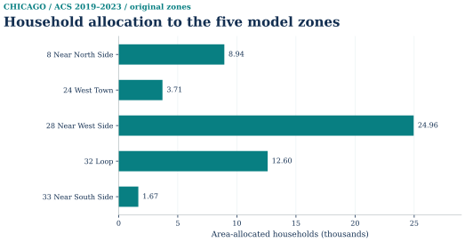</a>

Description, units and scope

The five estimates total 51,874.133727 households. ACS tract totals are allocated by area; these are not observed model-zone counts or confidence intervals. Original population, demand inputs and S/T results are unchanged. The approved original retains the zone-location map; this derivative uses only public aggregate values. Frozen Jane Byrne S20/T4 engineering scenarios. LR is a new self-priced recovery hybrid; Native80 is uncompressed. Household figure is ACS/TIGER area allocation not used by old generation. © OpenStreetMap contributors, ODbL: https://www.openstreetmap.org/copyright; U.S. Census ACS/TIGER.

<a href="https://scholarhaozheng.github.io/mobility-network-lab/assets/figure-contract-r11/figures/chicago/chi-household-allocation.png">PNG</a> · <a href="https://scholarhaozheng.github.io/mobility-network-lab/assets/figure-contract-r11/figures/chicago/chi-household-allocation.svg">SVG</a> · <a href="https://scholarhaozheng.github.io/mobility-network-lab/assets/figure-contract-r11/figures/chicago/chi-household-allocation.pdf">PDF</a> · <a href="https://scholarhaozheng.github.io/mobility-network-lab/assets/figure-contract-r11/figures/chicago/chi-household-allocation.source.json">Source record</a>

</td></tr></table></td></tr>
<tr><td width="100%" valign="top" align="left"></td></tr>
<tr><td width="100%" valign="top" align="left">
<a href="https://scholarhaozheng.github.io/mobility-network-lab/volumes/chicago.html#figure-gap-c06-households-gap">Complete city record · same evidence</a>
</td></tr>
</table>

<table width="100%">
<tr><th width="100%" valign="top" align="left"><strong>Resident population inputs</strong></th></tr>
<tr><td width="100%" valign="top" align="left"><table width="100%"><tr><td valign="top" width="100%">
<a href="https://scholarhaozheng.github.io/mobility-network-lab/volumes/chicago.html#figure-r3-population">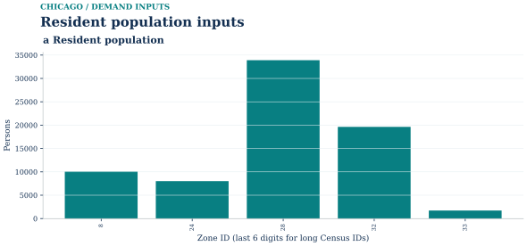</a>

Description, units and scope

Clipped community-area allocation of ACS population; uniform-area assumption. All 5 zones are retained; population total 73,375.2. Households are unknown. Missing household fields are unknown, not zero. Census/ACS allocation is an input, not a simulated traffic quantity. This drawing uses the frozen runs/chicago_core_hbw_am_v1 evidence. Later supplementary datasets are separate and are not implied to have entered this scenario.

<a href="https://scholarhaozheng.github.io/mobility-network-lab/assets/figure-contract-r11/figures/chicago/population.png">PNG</a> · <a href="https://scholarhaozheng.github.io/mobility-network-lab/assets/figure-contract-r11/figures/chicago/population.svg">SVG</a> · <a href="https://scholarhaozheng.github.io/mobility-network-lab/assets/figure-contract-r11/figures/chicago/population.pdf">PDF</a> · <a href="https://scholarhaozheng.github.io/mobility-network-lab/assets/figure-contract-r11/figures/chicago/population.source.json">Source record</a>

</td></tr></table></td></tr>
<tr><td width="100%" valign="top" align="left"></td></tr>
<tr><td width="100%" valign="top" align="left">
<a href="https://scholarhaozheng.github.io/mobility-network-lab/volumes/chicago.html#figure-r3-population">Complete city record · same evidence</a>
</td></tr>
</table>

#### Transit and observations

<table width="100%">
<tr><th width="100%" valign="top" align="left"><strong>Transit source geography</strong></th></tr>
<tr><td width="100%" valign="top" align="left"><table width="100%"><tr><td valign="top" width="100%">

Description, units and scope

OSM source-tagged stops; no service calendar. 953 saved stop records. Stop tags and road proximity do not prove legal walk access or operating service. The frozen scenario has no accepted service-day transit paths; no zero-demand transit bar is implied. The gray retained road graph is geographic context, not a transit route model. Source stops and route shapes do not establish legal pedestrian access, operating service, or observed ridership. This drawing uses the frozen runs/chicago_core_hbw_am_v1 evidence. Later supplementary datasets are separate and are not implied to have entered this scenario.

<a href="https://scholarhaozheng.github.io/mobility-network-lab/assets/figure-contract-r11/figures/chicago/transit.png">PNG</a> · <a href="https://scholarhaozheng.github.io/mobility-network-lab/assets/figure-contract-r11/figures/chicago/transit.svg">SVG</a> · <a href="https://scholarhaozheng.github.io/mobility-network-lab/assets/figure-contract-r11/figures/chicago/transit.pdf">PDF</a> · <a href="https://scholarhaozheng.github.io/mobility-network-lab/assets/figure-contract-r11/figures/chicago/transit.source.json">Source record</a>

</td></tr></table></td></tr>
<tr><td width="100%" valign="top" align="left"></td></tr>
<tr><td width="100%" valign="top" align="left">
<a href="https://scholarhaozheng.github.io/mobility-network-lab/volumes/chicago.html#figure-r3-transit">Complete city record · same evidence</a>
</td></tr>
</table>

#### Trip generation

<table width="100%">
<tr><th width="100%" valign="top" align="left"><strong>Trip generation and demand accounting</strong></th></tr>
<tr><td width="100%" valign="top" align="left"><table width="100%"><tr><td valign="top" width="100%">
<a href="https://scholarhaozheng.github.io/mobility-network-lab/volumes/chicago.html#figure-fs-g01">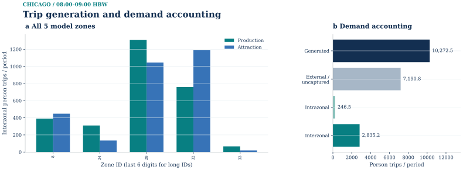</a>

Description, units and scope

All 5 zones; 08:00–09:00 HBW. The left panel shows saved interzonal productions/attractions. The right panel accounts for all generated persons, including excluded and intrazonal components. No top-12 truncation. Scenario assumptions, not measured trip counts. External and intrazonal components do not enter interzonal assignment; attractions are normalized to productions. This drawing uses the frozen runs/chicago_core_hbw_am_v1 evidence. Later supplementary datasets are separate and are not implied to have entered this scenario.

<a href="https://scholarhaozheng.github.io/mobility-network-lab/assets/figure-contract-r11/figures/chicago/generation.png">PNG</a> · <a href="https://scholarhaozheng.github.io/mobility-network-lab/assets/figure-contract-r11/figures/chicago/generation.svg">SVG</a> · <a href="https://scholarhaozheng.github.io/mobility-network-lab/assets/figure-contract-r11/figures/chicago/generation.pdf">PDF</a> · <a href="https://scholarhaozheng.github.io/mobility-network-lab/assets/figure-contract-r11/figures/chicago/generation.source.json">Source record</a>

</td></tr></table></td></tr>
<tr><td width="100%" valign="top" align="left"></td></tr>
<tr><td width="100%" valign="top" align="left">
<a href="https://scholarhaozheng.github.io/mobility-network-lab/volumes/chicago.html#figure-fs-g01">Complete city record · same evidence</a>
</td></tr>
</table>

#### Trip distribution

<table width="100%">
<tr><th width="100%" valign="top" align="left"><strong>Trip distribution and directed OD margins</strong></th></tr>
<tr><td width="100%" valign="top" align="left"><table width="100%"><tr><td valign="top" width="100%">
<a href="https://scholarhaozheng.github.io/mobility-network-lab/volumes/chicago.html#figure-fs-d01">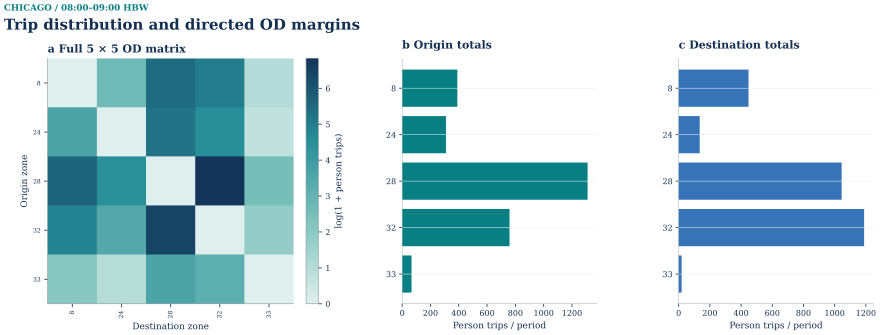</a>

Description, units and scope

Full 5×5 model-zone matrix including zero cells; 20 positive OD pairs and 2,835.219349139 persons in 08:00–09:00 HBW. Colours are log(1+persons); margins are untransformed directed OD totals after PA direction. Every model zone is retained. Zero rows and columns remain visible; intrazonal cells are structural zeros. Labels use the final six digits of long zone IDs. This drawing uses the frozen runs/chicago_core_hbw_am_v1 evidence. Later supplementary datasets are separate and are not implied to have entered this scenario.

<a href="https://scholarhaozheng.github.io/mobility-network-lab/assets/figure-contract-r11/figures/chicago/distribution.png">PNG</a> · <a href="https://scholarhaozheng.github.io/mobility-network-lab/assets/figure-contract-r11/figures/chicago/distribution.svg">SVG</a> · <a href="https://scholarhaozheng.github.io/mobility-network-lab/assets/figure-contract-r11/figures/chicago/distribution.pdf">PDF</a> · <a href="https://scholarhaozheng.github.io/mobility-network-lab/assets/figure-contract-r11/figures/chicago/distribution.source.json">Source record</a>

</td></tr></table></td></tr>
<tr><td width="100%" valign="top" align="left"></td></tr>
<tr><td width="100%" valign="top" align="left">
<a href="https://scholarhaozheng.github.io/mobility-network-lab/volumes/chicago.html#figure-fs-d01">Complete city record · same evidence</a>
</td></tr>
</table>

#### Mode choice

<table width="100%">
<tr><th width="100%" valign="top" align="left"><strong>Mode choice: demand, cost and availability</strong></th></tr>
<tr><td width="100%" valign="top" align="left"><table width="100%"><tr><td valign="top" width="100%">
<a href="https://scholarhaozheng.github.io/mobility-network-lab/volumes/chicago.html#figure-fs-m01">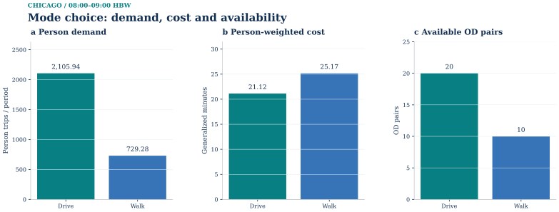</a>

Description, units and scope

Saved OD-specific choice in 08:00–09:00 HBW; sums over every positive-demand OD. Persons, person-weighted generalized minutes, and available OD counts have separate axes. Transit is not modeled; no zero bar is shown. Generalized cost includes model time and money terms. Person totals precede the separate occupancy-to-PCE conversion. This drawing uses the frozen runs/chicago_core_hbw_am_v1 evidence. Later supplementary datasets are separate and are not implied to have entered this scenario.

<a href="https://scholarhaozheng.github.io/mobility-network-lab/assets/figure-contract-r11/figures/chicago/mode.png">PNG</a> · <a href="https://scholarhaozheng.github.io/mobility-network-lab/assets/figure-contract-r11/figures/chicago/mode.svg">SVG</a> · <a href="https://scholarhaozheng.github.io/mobility-network-lab/assets/figure-contract-r11/figures/chicago/mode.pdf">PDF</a> · <a href="https://scholarhaozheng.github.io/mobility-network-lab/assets/figure-contract-r11/figures/chicago/mode.source.json">Source record</a>

</td></tr></table></td></tr>
<tr><td width="100%" valign="top" align="left"></td></tr>
<tr><td width="100%" valign="top" align="left">
<a href="https://scholarhaozheng.github.io/mobility-network-lab/volumes/chicago.html#figure-fs-m01">Complete city record · same evidence</a>
</td></tr>
</table>

#### Static assignment methods

##### Static assignment inputs — vehicle-demand margins and physical access

<table width="100%">
<tr><th width="50%" valign="top" align="left"><strong>Static assignment demand margins</strong></th><th width="50%" valign="top" align="left"><strong>Physical demand endpoints</strong></th></tr>
<tr><td width="50%" valign="top" align="left"></td><td width="50%" valign="top" align="left"></td></tr>
<tr><td width="50%" valign="top" align="left">
Chicago S20: origin and destination margins from the exact frozen 20-OD vehicle-demand table, after its existing person-to-vehicle conversion. Each map sums to 1754.94825123973 PCE/h; all 5 model zones remain, including zero selected margins.

Description, units and scope

Chicago S20: origin and destination margins from the exact frozen 20-OD vehicle-demand table, after its existing person-to-vehicle conversion. Each map sums to 1754.94825123973 PCE/h; all 5 model zones remain, including zero selected margins. Both panels use the same square-root colour normalization with original-unit ticks. The source-zone ledger is joined exactly to actual prepared node OD rows, rather than to person-trip generation or all-mode distribution. The 20 selected pairs retain the Jane Byrne / West Loop S20 identity and five clipped model zones. All saved road geometry is retained as pale context and clipped only at the common display viewport. These are model inputs, not observed travel or an optimization trajectory. Private local derivative; no new public release is claimed. © OpenStreetMap contributors, ODbL 1.0; source-zone geography as documented in the frozen case.

</td><td width="50%" valign="top" align="left">
Chicago S20: the exact prepared 20-OD demand is aggregated only for display at its real origin and destination loading nodes, with 5 positive origin nodes and 5 positive destination nodes. Each side sums to 1754.94825123973 PCE/h.

Description, units and scope

Chicago S20: the exact prepared 20-OD demand is aggregated only for display at its real origin and destination loading nodes, with 5 positive origin nodes and 5 positive destination nodes. Each side sums to 1754.94825123973 PCE/h. Light open circles retain all 5 saved model access nodes; filled markers share a square-root colour scale, while fixed marker area does not add another quantity. OSM node coordinates are derived from the matched physical-link geometry endpoints; all repeated occurrences agree. Both panels use identical geographic extent and road/zone context. The demand table, zone-access ledger and network instance hashes were checked together. These are engineering loading points, not observed trip ends or parcel entrances. Private local derivative; no new public release is claimed. © OpenStreetMap contributors, ODbL 1.0.

</td></tr>
<tr><td width="50%" valign="top" align="left">
<a href="https://scholarhaozheng.github.io/mobility-network-lab/volumes/chicago.html#figure-parity-chicago-assignment-margins">Complete evidence · same figure</a> · <a href="https://scholarhaozheng.github.io/mobility-network-lab/assets/template-parity-20261008/static-inputs/chicago/assignment-margins.svg">SVG</a> · <a href="https://scholarhaozheng.github.io/mobility-network-lab/assets/template-parity-20261008/static-inputs/chicago/assignment-margins.png">PNG</a> · <a href="https://scholarhaozheng.github.io/mobility-network-lab/assets/template-parity-20261008/static-inputs/chicago/assignment-margins.pdf">PDF</a> · <a href="https://scholarhaozheng.github.io/mobility-network-lab/assets/template-parity-20261008/static-inputs/chicago/assignment-margins.plot.json">Plot data</a> · <a href="https://scholarhaozheng.github.io/mobility-network-lab/assets/template-parity-20261008/static-inputs/chicago/assignment-margins.source.json">Source record</a> · <a href="https://scholarhaozheng.github.io/mobility-network-lab/assets/template-parity-20261008/static-inputs/chicago/assignment-margins.caption.md">Caption</a>
</td><td width="50%" valign="top" align="left">
<a href="https://scholarhaozheng.github.io/mobility-network-lab/volumes/chicago.html#figure-parity-chicago-assignment-endpoints">Complete evidence · same figure</a> · <a href="https://scholarhaozheng.github.io/mobility-network-lab/assets/template-parity-20261008/static-inputs/chicago/assignment-endpoints.svg">SVG</a> · <a href="https://scholarhaozheng.github.io/mobility-network-lab/assets/template-parity-20261008/static-inputs/chicago/assignment-endpoints.png">PNG</a> · <a href="https://scholarhaozheng.github.io/mobility-network-lab/assets/template-parity-20261008/static-inputs/chicago/assignment-endpoints.pdf">PDF</a> · <a href="https://scholarhaozheng.github.io/mobility-network-lab/assets/template-parity-20261008/static-inputs/chicago/assignment-endpoints.plot.json">Plot data</a> · <a href="https://scholarhaozheng.github.io/mobility-network-lab/assets/template-parity-20261008/static-inputs/chicago/assignment-endpoints.source.json">Source record</a> · <a href="https://scholarhaozheng.github.io/mobility-network-lab/assets/template-parity-20261008/static-inputs/chicago/assignment-endpoints.caption.md">Caption</a>
</td></tr>
</table>

Current S20 additions: Algorithm B has six reported iterations. Native80 has three actual outer iterations with 20 major plus 80 uncompressed minor coordinates. That accepted representation does not retroactively accept the old compressed rank 26/52 runs. Existing FW physical maps keep their original instances. [Figure guide and saved-state interpretation](https://scholarhaozheng.github.io/mobility-network-lab/figure-update-status.html#top) · [Current release details](https://scholarhaozheng.github.io/mobility-network-lab/volumes/chicago.html#gap-20261008)

##### Latest released evidence · 8 October 2026

<table width="100%">
<tr><th width="100%" valign="top" align="left"><strong>Native80: all three saved outer iterations</strong></th></tr>
<tr><td width="100%" valign="top" align="left"><a href="https://scholarhaozheng.github.io/mobility-network-lab/volumes/chicago.html#figure-private-chicago-native-history">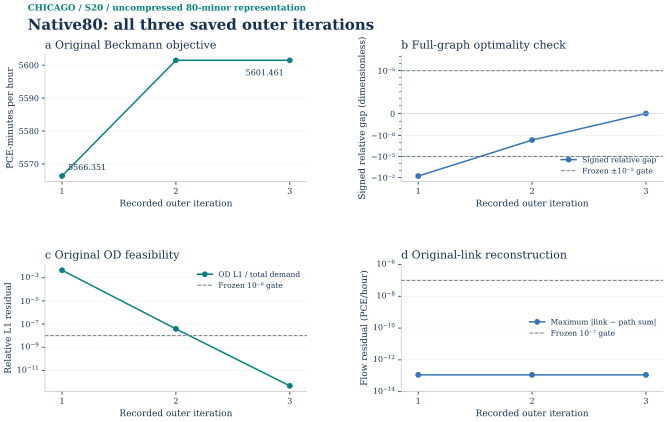</a></td></tr>
<tr><td width="100%" valign="top" align="left">
One accepted Chicago S20 run, not three separate experiments: 20 OD, 100 input paths and 80 uncompressed minor coordinates (U = I80). All three existing outer states are plotted at their actual indices 1–3. The original Beckmann objective increases as the early OD deficit is removed; the negative early signed gap is not a better feasible solution. The saved per-OD gate is |r_i| ≤ 10⁻⁶ + 10⁻⁸ max(1, q_i), alongside the displayed relative OD-L1 gate. Maximum per-OD residuals are 0.716124, 1.32514×10⁻⁵ and 1.78858×10⁻¹⁰ PCE/hour. The third state passes the complete frozen checks. These are the saved controller checks; the separately released independent final replay reports objective 5601.461468294976 and gap 1.4899811815539771×10⁻¹², agreeing at numerical precision. The first two states are part of this accepted run’s full history, not discarded failed trials. PRIVATE PREVIEW: the numerical history comes from the existing private Full run; the public released increment contains its endpoint only. No solver was run.
</td></tr>
<tr><td width="100%" valign="top" align="left">
<a href="https://scholarhaozheng.github.io/mobility-network-lab/assets/private-native-history-20261008/chicago/native-complete-history.svg">SVG</a> · <a href="https://scholarhaozheng.github.io/mobility-network-lab/assets/private-native-history-20261008/chicago/native-complete-history.png">PNG</a> · <a href="https://scholarhaozheng.github.io/mobility-network-lab/assets/private-native-history-20261008/chicago/native-complete-history.pdf">PDF</a> · <a href="https://scholarhaozheng.github.io/mobility-network-lab/assets/private-native-history-20261008/chicago/native-complete-history.plot.json">Plot data</a> · <a href="https://scholarhaozheng.github.io/mobility-network-lab/assets/private-native-history-20261008/chicago/native-complete-history.source.json">Source and access</a> · <a href="https://scholarhaozheng.github.io/mobility-network-lab/assets/private-native-history-20261008/chicago/native-complete-history.caption.md">Caption</a>
</td></tr>
</table>

<table width="100%">
<tr><th width="100%" valign="top" align="left"><strong>Algorithm B and Native80: separate accepted S20 methods</strong></th></tr>
<tr><td width="100%" valign="top" align="left"><table width="100%"><tr><td valign="top" width="50%">
<h6>Algorithm B: full-graph gap</h6><a href="https://scholarhaozheng.github.io/mobility-network-lab/volumes/chicago.html#figure-gap-c06-native-b-increment">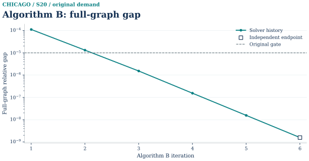</a>
The 6 recorded Algorithm B iterations end at an independently recomputed 1.5807459e−9 full-graph relative gap. The original 1e−5 gate is unchanged. Its approved source PNG retains a flow map; map coordinates are not included in the public plot data and are not reconstructed here. Frozen Jane Byrne S20/T4 engineering scenarios. LR is a new self-priced recovery hybrid; Native80 is uncompressed. Household figure is ACS/TIGER area allocation not used by old generation. © OpenStreetMap contributors, ODbL: https://www.openstreetmap.org/copyright; U.S. Census ACS/TIGER.

<a href="https://scholarhaozheng.github.io/mobility-network-lab/assets/figure-contract-r11/figures/chicago/chi-algorithm-b-gap.svg">SVG</a> · <a href="https://scholarhaozheng.github.io/mobility-network-lab/assets/figure-contract-r11/figures/chicago/chi-algorithm-b-gap.png">PNG</a> · <a href="https://scholarhaozheng.github.io/mobility-network-lab/assets/figure-contract-r11/figures/chicago/chi-algorithm-b-gap.pdf">PDF</a> · <a href="https://scholarhaozheng.github.io/mobility-network-lab/assets/figure-contract-r11/figures/chicago/chi-algorithm-b-gap.source.json">Source data</a>

</td><td valign="top" width="50%">
<h6>Native80: accepted original-coordinate endpoint</h6><a href="https://scholarhaozheng.github.io/mobility-network-lab/volumes/chicago.html#figure-gap-c06-native-b-increment">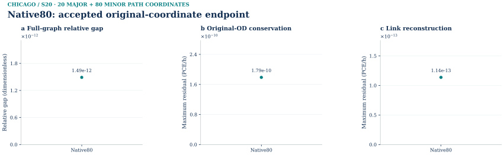</a>
The accepted Native80 endpoint uses the full uncompressed 80-dimensional minor representation (U=I80), with 20 major paths; no compression advantage is claimed. Its checked objective is 5601.461468294976 PCE·min/h. The three panels show the actual full-graph gap, original-OD residual and link-reconstruction residual with their own units. Each is a single method endpoint, not an iteration trajectory. Public accepted data do not include this method’s complete physical-flow vector, so no flow map is inferred from FW or another representation.

<a href="https://scholarhaozheng.github.io/mobility-network-lab/assets/figure-contract-r12/figures/chicago/chicago-native80-endpoint.svg">SVG</a> · <a href="https://scholarhaozheng.github.io/mobility-network-lab/assets/figure-contract-r12/figures/chicago/chicago-native80-endpoint.png">PNG</a> · <a href="https://scholarhaozheng.github.io/mobility-network-lab/assets/figure-contract-r12/figures/chicago/chicago-native80-endpoint.pdf">PDF</a> · <a href="https://scholarhaozheng.github.io/mobility-network-lab/assets/figure-contract-r12/figures/chicago/chicago-native80-endpoint.source.json">Source data</a>

</td></tr></table></td></tr>
<tr><td width="100%" valign="top" align="left"></td></tr>
<tr><td width="100%" valign="top" align="left"></td></tr>
</table>

##### Static network loading

<table width="100%">
<tr><th width="100%" valign="top" align="left"><strong>Frank–Wolfe: physical flow and distribution</strong></th></tr>
<tr><td width="100%" valign="top" align="left"><table width="100%"><tr><td valign="top" width="100%">

Description, units and scope

Saved Chicago static Frank–Wolfe endpoint for 08:00–09:00 HBW. The map and 22-bin histogram use the same complete 27,129-link physical-flow vector, including 25,238 exact-zero links; 1,891 links exceed 1e-6 PCE. Flow is PCE accumulated during the declared one-hour period, not persons or flow per simulation time step. The map uses a square-root sequential color scale with original-unit ticks and gray road context; histogram counts are linear and no links are omitted. Turn, access and other nonphysical solver arcs are excluded. The endpoint follows 3 actual FW updates; all 4 saved checks remain separate diagnostic evidence. Reciprocal directed arcs may overlap geometrically; flows are not summed. This full saved static case is distinct from the separate S20 and T4 method-transfer instances. This is a modeled engineering scenario, not observed traffic. © OpenStreetMap contributors / ODbL 1.0. R11 layout repair: map and all-link histogram share measured top and bottom panel bounds. The original saved physical-link IDs, exact flow vector, geographic vertices, display offsets, histogram edges and counts remain unchanged.

<a href="https://scholarhaozheng.github.io/mobility-network-lab/assets/figure-contract-r11/figures/chicago/fw-physical-flow.png">PNG</a> · <a href="https://scholarhaozheng.github.io/mobility-network-lab/assets/figure-contract-r11/figures/chicago/fw-physical-flow.svg">SVG</a> · <a href="https://scholarhaozheng.github.io/mobility-network-lab/assets/figure-contract-r11/figures/chicago/fw-physical-flow.pdf">PDF</a> · <a href="https://scholarhaozheng.github.io/mobility-network-lab/assets/figure-contract-r11/figures/chicago/fw-physical-flow.source.json">Source record</a>

</td></tr></table></td></tr>
<tr><td width="100%" valign="top" align="left"></td></tr>
<tr><td width="100%" valign="top" align="left">
<a href="https://scholarhaozheng.github.io/mobility-network-lab/volumes/chicago.html#figure-r9-fw-physical-flow">Complete city record · same evidence</a>
</td></tr>
</table>

Saved initial checks and original endpoint views

<table width="100%">
<tr><th width="50%" valign="top" align="left"><strong>Frank–Wolfe objective and relative gap</strong></th><td colspan="1" width="50%"></td></tr>
<tr><td width="50%" valign="top" align="left"><table width="100%"><tr><td valign="top" width="100%">
<a href="https://scholarhaozheng.github.io/mobility-network-lab/volumes/chicago.html#figure-fs-a02">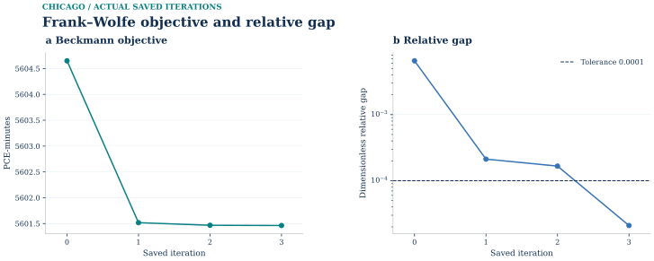</a>

Description, units and scope

4 saved record(s), 3 updates; final objective 5601.46245807 PCE-min, gap 2.09891131527e-05 against 0.0001. Original iteration samples and objective retained. An accepted numerical gap concerns this scenario and demand set; it does not certify real traffic conditions. This drawing uses the frozen runs/chicago_core_hbw_am_v1 evidence. Later supplementary datasets are separate and are not implied to have entered this scenario.

<a href="https://scholarhaozheng.github.io/mobility-network-lab/assets/figure-contract-r11/figures/chicago/trace.png">PNG</a> · <a href="https://scholarhaozheng.github.io/mobility-network-lab/assets/figure-contract-r11/figures/chicago/trace.svg">SVG</a> · <a href="https://scholarhaozheng.github.io/mobility-network-lab/assets/figure-contract-r11/figures/chicago/trace.pdf">PDF</a> · <a href="https://scholarhaozheng.github.io/mobility-network-lab/assets/figure-contract-r11/figures/chicago/trace.source.json">Source record</a>

</td></tr></table></td><td colspan="1" width="50%"></td></tr>
<tr><td width="50%" valign="top" align="left"></td><td colspan="1" width="50%"></td></tr>
<tr><td width="50%" valign="top" align="left">
<a href="https://scholarhaozheng.github.io/mobility-network-lab/volumes/chicago.html#figure-fs-a02">Complete city record · same evidence</a>
</td><td colspan="1" width="50%"></td></tr>
</table>

Earlier views and additional saved evidence

<table width="100%">
<tr><th width="33%" valign="top" align="left"><strong>Frank–Wolfe: physical-road loading</strong></th><td colspan="2" width="67%"></td></tr>
<tr><td width="33%" valign="top" align="left"><table width="100%"><tr><td valign="top" width="100%">
<a href="https://scholarhaozheng.github.io/mobility-network-lab/volumes/chicago.html#figure-fs-a03">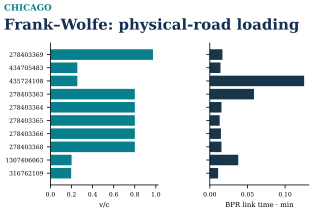</a>

Description, units and scope

v/c and one-hour BPR link time on ten representative loaded directed segments from distinct source ways; capacities are engineering proxies. Single-pass engineering scenario; no local empirical calibration. Jane Byrne / West Loop 12.023 km2

<a href="https://scholarhaozheng.github.io/mobility-network-lab/assets/figure-contract-r11/figures/chicago/chicago-fs_a03.png">PNG</a> · <a href="https://scholarhaozheng.github.io/mobility-network-lab/assets/figure-contract-r11/figures/chicago/chicago-fs_a03.svg">SVG</a> · <a href="https://scholarhaozheng.github.io/mobility-network-lab/assets/figure-contract-r11/figures/chicago/chicago-fs_a03.pdf">PDF</a> · <a href="https://scholarhaozheng.github.io/mobility-network-lab/assets/figure-contract-r11/figures/chicago/chicago-fs_a03.source.json">Source record</a>

</td></tr></table></td><td colspan="2" width="67%"></td></tr>
<tr><td width="33%" valign="top" align="left"></td><td colspan="2" width="67%"></td></tr>
<tr><td width="33%" valign="top" align="left">
<a href="https://scholarhaozheng.github.io/mobility-network-lab/volumes/chicago.html#figure-fs-a03">Complete city record · same evidence</a>
</td><td colspan="2" width="67%"></td></tr>
</table>

##### Finite-path reference · 1 released figure

<table width="100%">
<tr><th width="50%" valign="top" align="left"><strong>S20 Frank–Wolfe physical loading and distribution</strong></th><th width="50%" valign="top" align="left"><strong>S20 finite-path reference and physical support</strong></th></tr>
<tr><td width="50%" valign="top" align="left"></td><td width="50%" valign="top" align="left"></td></tr>
<tr><td width="50%" valign="top" align="left">
Frank–Wolfe own saved physical-link flow on the frozen Chicago Jane Byrne / West Loop R2 S20 instance: 20 selected OD pairs and 1,754.9482512397267 PCE in one declared hour. The full map and 22-bin histogram each retain all 27,129 directed physical links. 1,891 links exceed 1e−6 PCE/h; exact zeros remain in the histogram. The vector is joined one-to-one by persistent link ID to every original road geometry vertex. Both method cards share a square-root colour scale and constant overlay width in PCE/hour. Tiny values with absolute magnitude at most 1e−12 PCE/h are hidden only from coloured overlays; all raw values and geographic context remain. The finite card reads its own saved vector, not the FW vector or a difference map. Both S20 endpoints retain their own REUSED_PRIOR_ACCEPTED status; this does not accept Native, LR or ADMM diagnostics. This is a static one-hour instance, distinct from the separate four-OD T4 pulse.
</td><td width="50%" valign="top" align="left">
Finite-path own saved physical-link flow on the frozen Chicago Jane Byrne / West Loop R2 S20 instance: 20 selected OD pairs and 1,754.9482512397267 PCE in one declared hour. The full map and 22-bin histogram each retain all 27,129 directed physical links. 1,868 links exceed 1e−6 PCE/h; exact zeros remain in the histogram. The vector is joined one-to-one by persistent link ID to every original road geometry vertex. Both method cards share a square-root colour scale and constant overlay width in PCE/hour. Tiny values with absolute magnitude at most 1e−12 PCE/h are hidden only from coloured overlays; all raw values and geographic context remain. The finite card reads its own saved vector, not the FW vector or a difference map. Both S20 endpoints retain their own REUSED_PRIOR_ACCEPTED status; this does not accept Native, LR or ADMM diagnostics. This is a static one-hour instance, distinct from the separate four-OD T4 pulse.
</td></tr>
<tr><td width="50%" valign="top" align="left">
<a href="https://scholarhaozheng.github.io/mobility-network-lab/volumes/chicago.html#figure-r9-s20-fw-map-distribution">Complete evidence</a> · <a href="https://scholarhaozheng.github.io/mobility-network-lab/assets/plot-semantics-r9/chicago/s20-fw-map-distribution.svg">Full figure</a>

Source records
<ul><li><a href="https://scholarhaozheng.github.io/mobility-network-lab/assets/plot-semantics-r9/chicago/s20-fw-map-distribution.svg">SVG</a></li><li><a href="https://scholarhaozheng.github.io/mobility-network-lab/assets/plot-semantics-r9/chicago/s20-fw-map-distribution.png">PNG</a></li><li><a href="https://scholarhaozheng.github.io/mobility-network-lab/assets/plot-semantics-r9/chicago/s20-fw-map-distribution.pdf">PDF</a></li><li><a href="https://scholarhaozheng.github.io/mobility-network-lab/assets/plot-semantics-r9/chicago/s20-fw-map-distribution.plot_data.json">Plot data</a></li><li><a href="https://scholarhaozheng.github.io/mobility-network-lab/assets/plot-semantics-r9/chicago/s20-fw-map-distribution.caption.md">Caption</a></li><li><a href="https://scholarhaozheng.github.io/mobility-network-lab/assets/plot-semantics-r9/chicago/s20-fw-map-distribution.source.json">Source record</a></li></ul>
</td><td width="50%" valign="top" align="left">
<a href="https://scholarhaozheng.github.io/mobility-network-lab/volumes/chicago.html#figure-r9-s20-finite-map-distribution">Complete evidence</a> · <a href="https://scholarhaozheng.github.io/mobility-network-lab/assets/plot-semantics-r9/chicago/s20-finite-map-distribution.svg">Full figure</a>

Source records
<ul><li><a href="https://scholarhaozheng.github.io/mobility-network-lab/assets/plot-semantics-r9/chicago/s20-finite-map-distribution.svg">SVG</a></li><li><a href="https://scholarhaozheng.github.io/mobility-network-lab/assets/plot-semantics-r9/chicago/s20-finite-map-distribution.png">PNG</a></li><li><a href="https://scholarhaozheng.github.io/mobility-network-lab/assets/plot-semantics-r9/chicago/s20-finite-map-distribution.pdf">PDF</a></li><li><a href="https://scholarhaozheng.github.io/mobility-network-lab/assets/plot-semantics-r9/chicago/s20-finite-map-distribution.plot_data.json">Plot data</a></li><li><a href="https://scholarhaozheng.github.io/mobility-network-lab/assets/plot-semantics-r9/chicago/s20-finite-map-distribution.caption.md">Caption</a></li><li><a href="https://scholarhaozheng.github.io/mobility-network-lab/assets/plot-semantics-r9/chicago/s20-finite-map-distribution.source.json">Source record</a></li></ul>
</td></tr>
</table>

##### Frank–Wolfe: separate S20 record

<table width="100%">
<tr><th width="100%" valign="top" align="left"><strong>Frank–Wolfe: S20 objective and relative gap</strong></th></tr>
<tr><td width="100%" valign="top" align="left"><table width="100%"><tr><td valign="top" width="100%">
<a href="https://scholarhaozheng.github.io/mobility-network-lab/volumes/chicago.html#released-c06-s-convergence">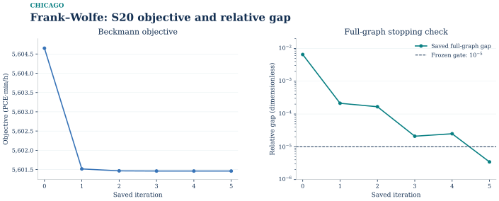</a>
Accepted Chicago Jane Byrne / West Loop R2 S20 Frank–Wolfe run. All six actual saved states, iterations 0–5, are plotted without smoothing or invented samples. The Beckmann objective is PCE·min/h on the frozen one-hour 1,754.9482512397267 PCE/h demand. The full-graph relative gap ends at 3.446136191653708e-6, below the unchanged 1e-5 gate. The small rise between saved gaps at iterations 3 and 4 is retained. This S20 method history is distinct from the separate four-state full-city presentation record. Numerical results are engineering scenarios, not observed traffic.

<a href="https://scholarhaozheng.github.io/mobility-network-lab/assets/figure-contract-r12/figures/chicago/chi-fw-history.svg">SVG</a> · <a href="https://scholarhaozheng.github.io/mobility-network-lab/assets/figure-contract-r12/figures/chicago/chi-fw-history.png">PNG</a> · <a href="https://scholarhaozheng.github.io/mobility-network-lab/assets/figure-contract-r12/figures/chicago/chi-fw-history.pdf">PDF</a> · <a href="https://scholarhaozheng.github.io/mobility-network-lab/assets/figure-contract-r12/figures/chicago/chi-fw-history.source.json">Source data</a>

</td></tr></table></td></tr>
<tr><td width="100%" valign="top" align="left"></td></tr>
<tr><td width="100%" valign="top" align="left"></td></tr>
</table>

#### Time-expanded network and path examples

<table width="100%">
<tr><th width="50%" valign="top" align="left"><strong>Time-expanded network in layers</strong></th><th width="50%" valign="top" align="left"><strong>Local construction details</strong></th></tr>
<tr><td width="50%" valign="top" align="left"><a href="https://scholarhaozheng.github.io/mobility-network-lab/volumes/chicago.html#figure-parity-chicago-time-layers">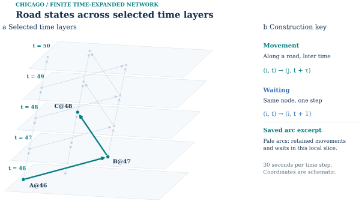</a></td><td width="50%" valign="top" align="left"><a href="https://scholarhaozheng.github.io/mobility-network-lab/volumes/chicago.html#figure-parity-chicago-local-details">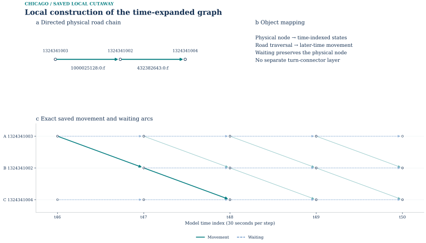</a></td></tr>
<tr><td width="50%" valign="top" align="left">
Chicago: selected time layers 46–50 use 30 seconds per time step. Every arrow is an actual saved arc; only node-time states occurring as saved endpoints are drawn.

Description, units and scope

Chicago: selected time layers 46–50 use 30 seconds per time step. Every arrow is an actual saved arc; only node-time states occurring as saved endpoints are drawn. The highlighted continuous chain is selected from saved construction records to explain incidence; it is not an optimized or observed trajectory. State aliases: A = osm:1324341003, B = osm:1324341002, C = osm:1324341004. Pale arrows show other saved arcs in this local slice. Time planes and horizontal placement are schematic; this is neither a full graph nor observed traffic. This T4 graph has no independent turn connectors; the later static turn sidecar is excluded. The highlighted structural chain carries no assigned-flow claim.

</td><td width="50%" valign="top" align="left">
Chicago: the physical road chain is mapped to physical-node states and then to exact time-indexed arcs in the saved construction slice. Panel c contains all 18 retained arcs, with exact endpoint times; strong teal/blue highlights the same continuous chain used in the companion layered figure.

Description, units and scope

Chicago: the physical road chain is mapped to physical-node states and then to exact time-indexed arcs in the saved construction slice. Panel c contains all 18 retained arcs, with exact endpoint times; strong teal/blue highlights the same continuous chain used in the companion layered figure. The highlighted continuous chain is selected from saved construction records to explain incidence; it is not an optimized or observed trajectory. All layout coordinates are schematic. Source/sink terminal bookkeeping is outside this excerpt and must not be read as road travel or waiting. This T4 graph has no independent turn connectors; the later static turn sidecar is excluded. The highlighted structural chain carries no assigned-flow claim.

</td></tr>
<tr><td width="50%" valign="top" align="left">
<a href="https://scholarhaozheng.github.io/mobility-network-lab/volumes/chicago.html#figure-parity-chicago-time-layers">Complete evidence · same figure</a> · <a href="https://scholarhaozheng.github.io/mobility-network-lab/assets/template-parity-20261008/construction/chicago/time-layers.svg">SVG</a> · <a href="https://scholarhaozheng.github.io/mobility-network-lab/assets/template-parity-20261008/construction/chicago/time-layers.png">PNG</a> · <a href="https://scholarhaozheng.github.io/mobility-network-lab/assets/template-parity-20261008/construction/chicago/time-layers.pdf">PDF</a> · <a href="https://scholarhaozheng.github.io/mobility-network-lab/assets/template-parity-20261008/construction/chicago/time-layers.plot.json">Plot data</a> · <a href="https://scholarhaozheng.github.io/mobility-network-lab/assets/template-parity-20261008/construction/chicago/time-layers.source.json">Source record</a> · <a href="https://scholarhaozheng.github.io/mobility-network-lab/assets/template-parity-20261008/construction/chicago/time-layers.caption.md">Caption</a>
</td><td width="50%" valign="top" align="left">
<a href="https://scholarhaozheng.github.io/mobility-network-lab/volumes/chicago.html#figure-parity-chicago-local-details">Complete evidence · same figure</a> · <a href="https://scholarhaozheng.github.io/mobility-network-lab/assets/template-parity-20261008/construction/chicago/local-details.svg">SVG</a> · <a href="https://scholarhaozheng.github.io/mobility-network-lab/assets/template-parity-20261008/construction/chicago/local-details.png">PNG</a> · <a href="https://scholarhaozheng.github.io/mobility-network-lab/assets/template-parity-20261008/construction/chicago/local-details.pdf">PDF</a> · <a href="https://scholarhaozheng.github.io/mobility-network-lab/assets/template-parity-20261008/construction/chicago/local-details.plot.json">Plot data</a> · <a href="https://scholarhaozheng.github.io/mobility-network-lab/assets/template-parity-20261008/construction/chicago/local-details.source.json">Source record</a> · <a href="https://scholarhaozheng.github.io/mobility-network-lab/assets/template-parity-20261008/construction/chicago/local-details.caption.md">Caption</a>
</td></tr>
</table>

Additional saved source figures
<ul><li><a href="https://scholarhaozheng.github.io/mobility-network-lab/assets/figure-contract-r11/figures/chicago/chicago-input-time-layer-excerpt.svg">Time-expanded network: saved input layers</a></li><li><a href="https://scholarhaozheng.github.io/mobility-network-lab/assets/figure-contract-r11/figures/chicago/chicago-c06_t_input_seed_paths.svg">Time-expanded network: seed-path support</a></li></ul>

#### Time-expanded methods and diagnostics

##### Two-phase column generation

<table width="100%">
<tr><th width="33%" valign="top" align="left"><strong>Column generation: Phase I feasibility</strong></th><th width="33%" valign="top" align="left"><strong>Column generation: Phase II real cost</strong></th><th width="33%" valign="top" align="left"><strong>Column generation: full-graph pricing closure</strong></th></tr>
<tr><td width="33%" valign="top" align="left"><a href="https://scholarhaozheng.github.io/mobility-network-lab/volumes/chicago.html#figure-r9-cg-phase-one">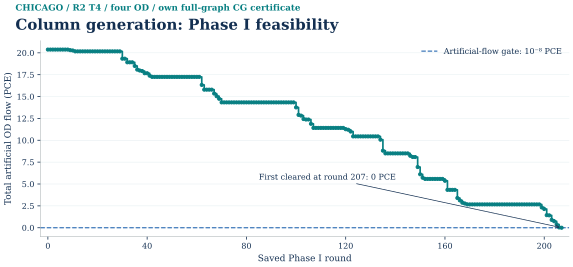</a></td><td width="33%" valign="top" align="left"><a href="https://scholarhaozheng.github.io/mobility-network-lab/volumes/chicago.html#figure-r9-cg-phase-two">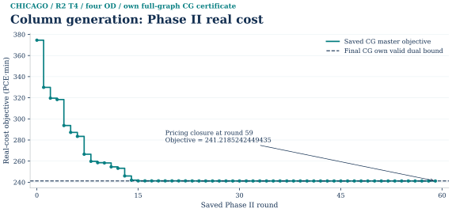</a></td><td width="33%" valign="top" align="left"><table width="100%"><tr><td valign="top" width="100%">
<a href="https://scholarhaozheng.github.io/mobility-network-lab/volumes/chicago.html#figure-r9-cg-pricing-closure">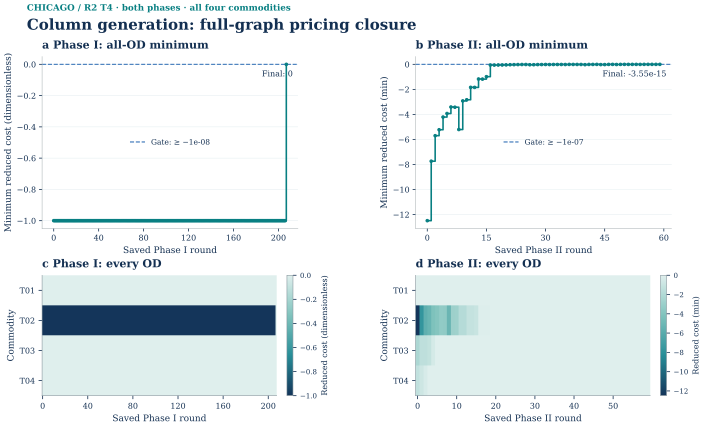</a>

Description, units and scope

Separate columns show Phase I dimensionless pricing and Phase II minute-valued pricing. Upper panels preserve every saved full-graph minimum with its phase-specific negative-reduced-cost gate (−1e−8 and −1e−7). Lower panels show the actual saved four-commodity reduced costs, T01–T04, across every round; their matrix minimum is checked against the plotted minimum for every state. Each heatmap has its own explicitly labelled scale and units. The final Phase I minimum is 0; final Phase II minimum is −3.552713678800501e−15 min, satisfying the frozen full-graph closure gate. Linear axes retain signed roundoff; no positive floor or smoothed pricing history is added. Chicago Jane Byrne / West Loop R2 T4 engineering pulse; modelled scenario, not observed traffic. CG is accepted on its own independently checked full-graph primal/dual pricing certificate. © OpenStreetMap contributors, ODbL 1.0. R11 layout repair: compact two-row spacing and shared serif bold panel headings; all 268 saved rounds and all four OD pricing values per round remain unchanged.

<a href="https://scholarhaozheng.github.io/mobility-network-lab/assets/figure-contract-r11/figures/chicago/cg-pricing-closure.png">PNG</a> · <a href="https://scholarhaozheng.github.io/mobility-network-lab/assets/figure-contract-r11/figures/chicago/cg-pricing-closure.svg">SVG</a> · <a href="https://scholarhaozheng.github.io/mobility-network-lab/assets/figure-contract-r11/figures/chicago/cg-pricing-closure.pdf">PDF</a> · <a href="https://scholarhaozheng.github.io/mobility-network-lab/assets/figure-contract-r11/figures/chicago/cg-pricing-closure.source.json">Source record</a>

</td></tr></table></td></tr>
<tr><td width="33%" valign="top" align="left">
All 208 saved Phase I master states, rounds 0–207, show total artificial OD demand flow in PCE. The frozen master has four artificial variables in OD conservation equalities; they are not capacity-row slacks. Total artificial flow decreases from 20.373394302610762 to 0 PCE, first clearing the 1e−8 PCE gate at round 207. Per-OD artificial trajectories are not available in the saved history, so no artificial-flow heatmap is invented. Step segments and markers use only actual saved states; the threshold may visually coincide with zero on this linear scale. Chicago Jane Byrne / West Loop R2 T4 engineering pulse; modelled scenario, not observed traffic. CG is accepted on its own independently checked full-graph primal/dual pricing certificate. © OpenStreetMap contributors, ODbL 1.0.
</td><td width="33%" valign="top" align="left">
All 60 saved Phase II master objectives, rounds 0–59, in PCE·minutes. They decrease from 374.533127798287 to 241.2185242449435. The dashed reference is the final same-run full-graph-valid CG dual bound, 241.2185242449434 PCE·minutes, independently checked at pricing closure; it is not a time series of per-round valid bounds and not a HiGHS LP result. The endpoint independent objective is 241.2185242449435 PCE·minutes. The frozen producer recomputes 241.21852424494347, differing only at floating-point precision. No objective transformation, interpolation, omitted rounds or smoothing is applied. Chicago Jane Byrne / West Loop R2 T4 engineering pulse; modelled scenario, not observed traffic. CG is accepted on its own independently checked full-graph primal/dual pricing certificate. © OpenStreetMap contributors, ODbL 1.0.
</td><td width="33%" valign="top" align="left"></td></tr>
<tr><td width="33%" valign="top" align="left">
<a href="https://scholarhaozheng.github.io/mobility-network-lab/volumes/chicago.html#figure-r9-cg-phase-one">Complete evidence</a> · <a href="https://scholarhaozheng.github.io/mobility-network-lab/assets/plot-semantics-r9/chicago/cg-phase-one.svg">Full figure</a>

Source records
<ul><li><a href="https://scholarhaozheng.github.io/mobility-network-lab/assets/plot-semantics-r9/chicago/cg-phase-one.svg">SVG</a></li><li><a href="https://scholarhaozheng.github.io/mobility-network-lab/assets/plot-semantics-r9/chicago/cg-phase-one.png">PNG</a></li><li><a href="https://scholarhaozheng.github.io/mobility-network-lab/assets/plot-semantics-r9/chicago/cg-phase-one.pdf">PDF</a></li><li><a href="https://scholarhaozheng.github.io/mobility-network-lab/assets/plot-semantics-r9/chicago/cg-phase-one.plot_data.json">Plot data</a></li><li><a href="https://scholarhaozheng.github.io/mobility-network-lab/assets/plot-semantics-r9/chicago/cg-phase-one.caption.md">Caption</a></li><li><a href="https://scholarhaozheng.github.io/mobility-network-lab/assets/plot-semantics-r9/chicago/cg-phase-one.source.json">Source record</a></li></ul>
</td><td width="33%" valign="top" align="left">
<a href="https://scholarhaozheng.github.io/mobility-network-lab/volumes/chicago.html#figure-r9-cg-phase-two">Complete evidence</a> · <a href="https://scholarhaozheng.github.io/mobility-network-lab/assets/plot-semantics-r9/chicago/cg-phase-two.svg">Full figure</a>

Source records
<ul><li><a href="https://scholarhaozheng.github.io/mobility-network-lab/assets/plot-semantics-r9/chicago/cg-phase-two.svg">SVG</a></li><li><a href="https://scholarhaozheng.github.io/mobility-network-lab/assets/plot-semantics-r9/chicago/cg-phase-two.png">PNG</a></li><li><a href="https://scholarhaozheng.github.io/mobility-network-lab/assets/plot-semantics-r9/chicago/cg-phase-two.pdf">PDF</a></li><li><a href="https://scholarhaozheng.github.io/mobility-network-lab/assets/plot-semantics-r9/chicago/cg-phase-two.plot_data.json">Plot data</a></li><li><a href="https://scholarhaozheng.github.io/mobility-network-lab/assets/plot-semantics-r9/chicago/cg-phase-two.caption.md">Caption</a></li><li><a href="https://scholarhaozheng.github.io/mobility-network-lab/assets/plot-semantics-r9/chicago/cg-phase-two.source.json">Source record</a></li></ul>
</td><td width="33%" valign="top" align="left">
<a href="https://scholarhaozheng.github.io/mobility-network-lab/volumes/chicago.html#figure-r9-cg-pricing-closure">Complete city record · same evidence</a>
</td></tr>
</table>

<table width="100%">
<tr><th width="50%" valign="top" align="left"><strong>Column generation: generated-path support</strong></th><th width="50%" valign="top" align="left"><strong>Column generation: physical flow and distribution</strong></th></tr>
<tr><td width="50%" valign="top" align="left"><table width="100%"><tr><td valign="top" width="100%">

Description, units and scope

CG-generated column support on original roads Color encodes the number of saved generated columns using each physical road.

<a href="https://scholarhaozheng.github.io/mobility-network-lab/assets/figure-contract-r11/figures/chicago/chicago-c06_t_cg_generated_paths.png">PNG</a> · <a href="https://scholarhaozheng.github.io/mobility-network-lab/assets/figure-contract-r11/figures/chicago/chicago-c06_t_cg_generated_paths.svg">SVG</a> · <a href="https://scholarhaozheng.github.io/mobility-network-lab/assets/figure-contract-r11/figures/chicago/chicago-c06_t_cg_generated_paths.pdf">PDF</a> · <a href="https://scholarhaozheng.github.io/mobility-network-lab/assets/figure-contract-r11/figures/chicago/chicago-c06_t_cg_generated_paths.source.json">Source record</a>

</td></tr></table></td><td width="50%" valign="top" align="left"><table width="100%"><tr><td valign="top" width="100%">

Accepted Chicago R2 T4 column-generation endpoint on the original 30-second/H169 finite graph. The map sums this method’s own saved movement-arc flow over commodities and time onto each original physical-link ID; the unit is PCE in the selected pulse, not an hourly rate. The complete 27,129-link vector includes 26,597 exact zeros and 532 positive values. All physical links remain gray context, and positive links use a square-root sequential scale with original-unit colorbar ticks. The 22-bin histogram counts every physical link, including zeros, on a linear count axis. Public saved geometry is joined by a unique exact ID set; no static FW flow is reused. Ledger connectors are excluded. © OpenStreetMap contributors; road-derived data ODbL 1.0: https://www.openstreetmap.org/copyright. Numerical results are engineering scenarios, not observed traffic.

<a href="https://scholarhaozheng.github.io/mobility-network-lab/assets/figure-contract-r12/figures/chicago/chi-cg-physical.svg">SVG</a> · <a href="https://scholarhaozheng.github.io/mobility-network-lab/assets/figure-contract-r12/figures/chicago/chi-cg-physical.png">PNG</a> · <a href="https://scholarhaozheng.github.io/mobility-network-lab/assets/figure-contract-r12/figures/chicago/chi-cg-physical.pdf">PDF</a> · <a href="https://scholarhaozheng.github.io/mobility-network-lab/assets/figure-contract-r12/figures/chicago/chi-cg-physical.source.json">Source data</a>

</td></tr></table></td></tr>
<tr><td width="50%" valign="top" align="left"></td><td width="50%" valign="top" align="left"></td></tr>
<tr><td width="50%" valign="top" align="left">
<a href="https://scholarhaozheng.github.io/mobility-network-lab/volumes/chicago.html#released-c06-t-cg-generated-paths">Complete city record · same evidence</a>
</td><td width="50%" valign="top" align="left">
<a href="https://scholarhaozheng.github.io/mobility-network-lab/volumes/chicago.html#released-c06-t-physical-flow">Complete city record · same evidence</a>
</td></tr>
</table>

##### Lagrangian relaxation: bounds → prices → recovery · accepted self-priced hybrid

<table width="100%">
<tr><th width="33%" valign="top" align="left"><strong>Lagrangian bounds and certified gap</strong></th><th width="33%" valign="top" align="left"><strong>Capacity prices at the best dual bound</strong></th><th width="33%" valign="top" align="left"><strong>Path-pool growth and primal recovery</strong></th></tr>
<tr><td width="33%" valign="top" align="left"><a href="https://scholarhaozheng.github.io/mobility-network-lab/volumes/chicago.html#figure-parity-chicago-lr-bounds">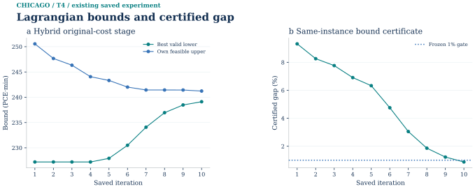</a></td><td width="33%" valign="top" align="left"><a href="https://scholarhaozheng.github.io/mobility-network-lab/volumes/chicago.html#figure-parity-chicago-lr-prices">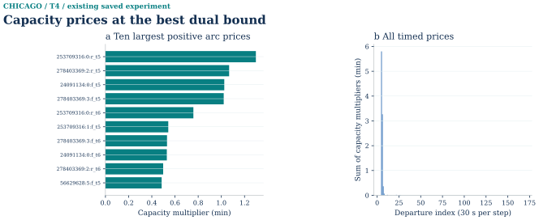</a></td><td width="33%" valign="top" align="left"><a href="https://scholarhaozheng.github.io/mobility-network-lab/volumes/chicago.html#figure-parity-chicago-lr-recovery">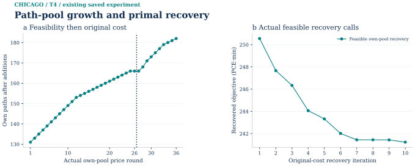</a></td></tr>
<tr><td width="33%" valign="top" align="left">

Description, units and scope

All ten original-cost states of the accepted self-priced feasibility/recovery dual-anchor hybrid are retained. They follow 26 distinct own-pool feasibility rounds. Bounds and certificate have separate panels; the final gap is 0.8744685%. This result does not relabel the earlier pure LR run or its unsuccessful endpoints.

</td><td width="33%" valign="top" align="left">

Description, units and scope

The best-bound multiplier state is the saved price vector that supports the accepted hybrid lower bound, kept separate from current and unevaluated post-update prices. Panel a ranks its ten largest positive dynamic-arc prices by exact identity; panel b sums all timed prices by departure index. There are 504 positive prices among 1,351,628 entries. This is the named hybrid, not the original pure LR experiment. The detailed vector is currently private.

</td><td width="33%" valign="top" align="left">

Description, units and scope

Panel a retains all 26 own-pool feasibility augmentation rounds and the ten separate original-cost rounds; the divider marks the phase boundary. Panel b shows the ten saved feasible original-cost recovery objectives. The 128 inherited own-LR paths grow to 182 through 54 new own-price events; no CG pool or reference witness was used. These are two stages of the named hybrid, not 36 identical subgradient steps.

</td></tr>
<tr><td width="33%" valign="top" align="left">
<a href="https://scholarhaozheng.github.io/mobility-network-lab/volumes/chicago.html#figure-parity-chicago-lr-bounds">Complete evidence · same figure</a> · <a href="https://scholarhaozheng.github.io/mobility-network-lab/assets/template-parity-20261008/optimization/chicago/lr-bounds.svg">SVG</a> · <a href="https://scholarhaozheng.github.io/mobility-network-lab/assets/template-parity-20261008/optimization/chicago/lr-bounds.png">PNG</a> · <a href="https://scholarhaozheng.github.io/mobility-network-lab/assets/template-parity-20261008/optimization/chicago/lr-bounds.pdf">PDF</a> · <a href="https://scholarhaozheng.github.io/mobility-network-lab/assets/template-parity-20261008/optimization/chicago/lr-bounds.plot.json">Plot data</a> · <a href="https://scholarhaozheng.github.io/mobility-network-lab/assets/template-parity-20261008/optimization/chicago/lr-bounds.source.json">Source record</a> · <a href="https://scholarhaozheng.github.io/mobility-network-lab/assets/template-parity-20261008/optimization/chicago/lr-bounds.caption.md">Caption</a>
</td><td width="33%" valign="top" align="left">
<a href="https://scholarhaozheng.github.io/mobility-network-lab/volumes/chicago.html#figure-parity-chicago-lr-prices">Complete evidence · same figure</a> · <a href="https://scholarhaozheng.github.io/mobility-network-lab/assets/template-parity-20261008/optimization/chicago/lr-prices.svg">SVG</a> · <a href="https://scholarhaozheng.github.io/mobility-network-lab/assets/template-parity-20261008/optimization/chicago/lr-prices.png">PNG</a> · <a href="https://scholarhaozheng.github.io/mobility-network-lab/assets/template-parity-20261008/optimization/chicago/lr-prices.pdf">PDF</a> · <a href="https://scholarhaozheng.github.io/mobility-network-lab/assets/template-parity-20261008/optimization/chicago/lr-prices.plot.json">Plot data</a> · <a href="https://scholarhaozheng.github.io/mobility-network-lab/assets/template-parity-20261008/optimization/chicago/lr-prices.source.json">Source record</a> · <a href="https://scholarhaozheng.github.io/mobility-network-lab/assets/template-parity-20261008/optimization/chicago/lr-prices.caption.md">Caption</a>
</td><td width="33%" valign="top" align="left">
<a href="https://scholarhaozheng.github.io/mobility-network-lab/volumes/chicago.html#figure-parity-chicago-lr-recovery">Complete evidence · same figure</a> · <a href="https://scholarhaozheng.github.io/mobility-network-lab/assets/template-parity-20261008/optimization/chicago/lr-recovery.svg">SVG</a> · <a href="https://scholarhaozheng.github.io/mobility-network-lab/assets/template-parity-20261008/optimization/chicago/lr-recovery.png">PNG</a> · <a href="https://scholarhaozheng.github.io/mobility-network-lab/assets/template-parity-20261008/optimization/chicago/lr-recovery.pdf">PDF</a> · <a href="https://scholarhaozheng.github.io/mobility-network-lab/assets/template-parity-20261008/optimization/chicago/lr-recovery.plot.json">Plot data</a> · <a href="https://scholarhaozheng.github.io/mobility-network-lab/assets/template-parity-20261008/optimization/chicago/lr-recovery.source.json">Source record</a> · <a href="https://scholarhaozheng.github.io/mobility-network-lab/assets/template-parity-20261008/optimization/chicago/lr-recovery.caption.md">Caption</a>
</td></tr>
</table>

##### ADMM: saved continuation and unmet stopping gates

The saved ADMM continuation reaches outer 116 but remains unconverged. Original x is infeasible: capacity excess 0.0421644796900 PCE, primal 0.121224522778 PCE, dual 0.0391348952092 min and endpoint stationarity 0.0250952425689 min. The CG objective difference is not evaluated. Outer 34–36 retains the original coordination; 37–116 uses the registered alpha=1.6 candidate.

<table width="100%">
<tr><th width="100%" valign="top" align="left"><strong>ADMM: actual history and original stopping gates</strong></th></tr>
<tr><td width="100%" valign="top" align="left"><a href="https://scholarhaozheng.github.io/mobility-network-lab/volumes/chicago.html#figure-chicago-admm116-history">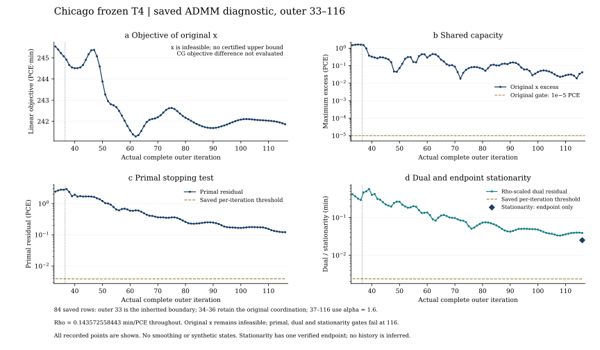</a></td></tr>
<tr><td width="100%" valign="top" align="left">
All 84 actual saved rows from outer 33–116 are plotted. Outer 33 is the inherited boundary; 34–36 retain the original coordination and 37–116 use alpha=1.6 (divider at 36.5). Panels show original-x objective in PCE·min, capacity excess in PCE, primal residual in PCE and rho-scaled dual residual in min, with saved original thresholds. Rho is fixed at 0.14357255844301195 min/PCE and has no separate panel. The stationarity diamond is the only verified endpoint shown, not an invented history. At outer116 the original x remains infeasible; its objective 241.864094592416 PCE·min is not a feasible upper bound. CG objective difference is not evaluated, not zero. Provider audits and two completed exact-archive read-only replays are reused; mainline checked the saved histories and signatures without running an optimizer.
</td></tr>
<tr><td width="100%" valign="top" align="left">
<a href="https://scholarhaozheng.github.io/mobility-network-lab/volumes/chicago.html#figure-chicago-admm116-history">Complete city record · same figure</a> · <a href="https://scholarhaozheng.github.io/mobility-network-lab/assets/mainline-publication-20261009/chicago/ADMM_HISTORY_33_116.svg">SVG</a> · <a href="https://scholarhaozheng.github.io/mobility-network-lab/assets/mainline-publication-20261009/chicago/ADMM_HISTORY_33_116.png">PNG</a> · <a href="https://scholarhaozheng.github.io/mobility-network-lab/assets/mainline-publication-20261009/chicago/ADMM_HISTORY_33_116.pdf">PDF</a> · <a href="https://scholarhaozheng.github.io/mobility-network-lab/assets/mainline-publication-20261009/chicago/ADMM_HISTORY_33_116.csv">Saved history · 84 rows</a> · <a href="https://scholarhaozheng.github.io/mobility-network-lab/assets/mainline-publication-20261009/chicago/ENDPOINT_AUDIT.json">Endpoint checks</a> · <a href="https://scholarhaozheng.github.io/mobility-network-lab/assets/mainline-publication-20261009/chicago/VERIFICATION_IDENTITY.json">Verification identity</a> · <a href="https://scholarhaozheng.github.io/mobility-network-lab/assets/mainline-publication-20261009/NOTICE.md">Source and reuse notice</a>
</td></tr>
<tr><th width="100%" valign="top" align="left"><strong>ADMM: original-x capacity excess at outer116</strong></th></tr>
<tr><td width="100%" valign="top" align="left"><a href="https://scholarhaozheng.github.io/mobility-network-lab/volumes/chicago.html#figure-chicago-admm116-capacity">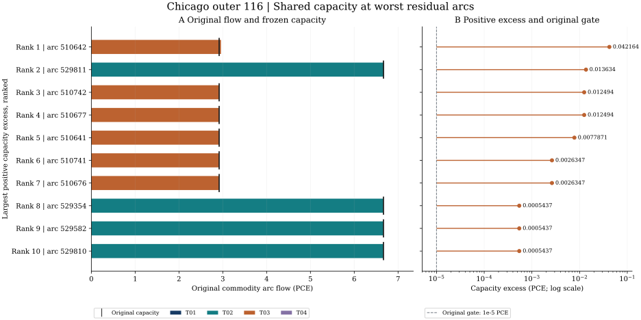</a></td></tr>
<tr><td width="100%" valign="top" align="left">
The ten largest positive original-x capacity excesses at outer116 are ranked. Commodity bars retain PCE flow, black marks are the frozen per-arc capacity, and the right panel shows positive excess against the original 1e−5 PCE gate. The maximum is 0.0421644796900 PCE. These are generated time-arc model values, not measured passenger records. Reused provider figure; no numerical or geometric change. This failing diagnostic does not relabel successful CG or LR hybrid results, the old pure-LR endpoints, or the failed rank26/52 reductions.
</td></tr>
<tr><td width="100%" valign="top" align="left">
<a href="https://scholarhaozheng.github.io/mobility-network-lab/volumes/chicago.html#figure-chicago-admm116-capacity">Complete city record · same figure</a> · <a href="https://scholarhaozheng.github.io/mobility-network-lab/assets/mainline-publication-20261009/chicago/ADMM_CAPACITY_DETAIL.svg">SVG</a> · <a href="https://scholarhaozheng.github.io/mobility-network-lab/assets/mainline-publication-20261009/chicago/ADMM_CAPACITY_DETAIL.png">PNG</a> · <a href="https://scholarhaozheng.github.io/mobility-network-lab/assets/mainline-publication-20261009/chicago/ADMM_CAPACITY_DETAIL.pdf">PDF</a> · <a href="https://scholarhaozheng.github.io/mobility-network-lab/assets/mainline-publication-20261009/chicago/CAPACITY_TOP_ARCS.csv">Saved capacity rows</a> · <a href="https://scholarhaozheng.github.io/mobility-network-lab/assets/mainline-publication-20261009/chicago/ENDPOINT_AUDIT.json">Endpoint checks</a> · <a href="https://scholarhaozheng.github.io/mobility-network-lab/assets/mainline-publication-20261009/chicago/VERIFICATION_IDENTITY.json">Verification identity</a> · <a href="https://scholarhaozheng.github.io/mobility-network-lab/assets/mainline-publication-20261009/NOTICE.md">Source and reuse notice</a>
</td></tr>
</table>

Additional accepted source evidence
<ul><li><a href="https://scholarhaozheng.github.io/mobility-network-lab/assets/figure-contract-r11/figures/chicago/chi-lr-feasibility.svg">New LR hybrid: own-pool feasibility and certified bounds</a></li></ul>

8 October 2026 release · shared sources and notices

The following source and scope notices apply to the adjacent figures.

Frozen Jane Byrne S20/T4 engineering scenarios. The LR method uses self-priced recovery; Native80 is uncompressed. Household allocation uses ACS/TIGER geography and was not used by the original generation model. © OpenStreetMap contributors; road-derived data ODbL 1.0: https://www.openstreetmap.org/copyright; U.S. Census ACS/TIGER.

### Pittsburgh

Accepted S72 Native26/52 retain their complete outer 1–14 histories and accepted endpoints. The separate T4 LP, CG, LR and ADMM results remain tied to their own fixed-cost instance.

<table width="100%"><thead><tr><th valign="top" width="25%">City/model foundation</th><th valign="top" width="25%">Static assignment</th><th valign="top" width="25%">Finite time-expanded</th><th valign="top" width="25%">Observation/data scope</th></tr></thead>
<tbody><tr><td valign="top" width="25%">41 distinct OUT-state zone access points load 17,534 physical traversal and 38,850 virtual movement arcs.</td><td valign="top" width="25%">Full-city FW passes its initial 1e−4 gate with gap 4.773992564434884e−7. Separate S72 Native26/52 now pass at outer14.</td><td valign="top" width="25%">The frozen T4 graph has 1,811,888 arcs, four OD and a 0.04502754845355 PCE pulse at 08:02:30, 30-second steps and H117.</td><td valign="top" width="25%">Accepted matched-route evidence is unavailable.</td></tr></tbody></table>

Local reading edition · saved-result figures aligned with Boston and Hong Kong · [Figure guide and saved-state interpretation](https://scholarhaozheng.github.io/mobility-network-lab/figure-update-status.html#top)

Sources and model scope · © OpenStreetMap contributors / ODbL 1.0

© OpenStreetMap contributors; road-derived data ODbL 1.0: https://www.openstreetmap.org/copyright; numerical results are engineering scenarios, not observed traffic. East End synthetic HBW; S72 and T4 selected subsets. T4 pulse capacity is nonbinding; accepted methods do not show measured congestion improvement. Census/LODES proxies retain their source identities.

<a href="https://scholarhaozheng.github.io/mobility-network-lab/assets/algorithm-transfer-r8/NOTICE.md">Full attribution and release notice</a>

[Sources and GMNS](#pittsburgh-sources) · [Population, households and activity](#pittsburgh-population) · [Transit and observations](#pittsburgh-transit) · [Trip generation](#pittsburgh-generation) · [Trip distribution](#pittsburgh-distribution) · [Mode choice](#pittsburgh-mode) · [Static assignment methods](#pittsburgh-static) · [Time-expanded network and path examples](#pittsburgh-representation) · [Optimization on the time-expanded network](#pittsburgh-finite)

#### Sources and GMNS

<table width="100%">
<tr><th width="100%" valign="top" align="left"><strong>Retained physical road graph</strong></th></tr>
<tr><td width="100%" valign="top" align="left"><table width="100%"><tr><td valign="top" width="100%">

Description, units and scope

17,534 retained physical directed traversals in the saved 08:00–09:00 HBW model, shown in EPSG:26917. This is the retained model graph, not a claim to draw every road in the source archive. Virtual movements are excluded; colour has no traffic meaning. © OpenStreetMap contributors / ODbL. Reciprocal directed arcs can share geometry; no assigned flow is encoded. This drawing uses the frozen run_001 evidence. Later supplementary datasets are separate and are not implied to have entered this scenario.

<a href="https://scholarhaozheng.github.io/mobility-network-lab/assets/figure-contract-r11/figures/pittsburgh/sources.png">PNG</a> · <a href="https://scholarhaozheng.github.io/mobility-network-lab/assets/figure-contract-r11/figures/pittsburgh/sources.svg">SVG</a> · <a href="https://scholarhaozheng.github.io/mobility-network-lab/assets/figure-contract-r11/figures/pittsburgh/sources.pdf">PDF</a> · <a href="https://scholarhaozheng.github.io/mobility-network-lab/assets/figure-contract-r11/figures/pittsburgh/sources.source.json">Source record</a>

</td></tr></table></td></tr>
<tr><td width="100%" valign="top" align="left"></td></tr>
<tr><td width="100%" valign="top" align="left">
<a href="https://scholarhaozheng.github.io/mobility-network-lab/volumes/pittsburgh.html#figure-r3-sources">Complete city record · same evidence</a>
</td></tr>
</table>

#### Population, households and activity

<table width="100%">
<tr><th width="100%" valign="top" align="left"><strong>Population and household inputs</strong></th></tr>
<tr><td width="100%" valign="top" align="left"><table width="100%"><tr><td valign="top" width="100%">
<a href="https://scholarhaozheng.github.io/mobility-network-lab/volumes/pittsburgh.html#figure-r3-population">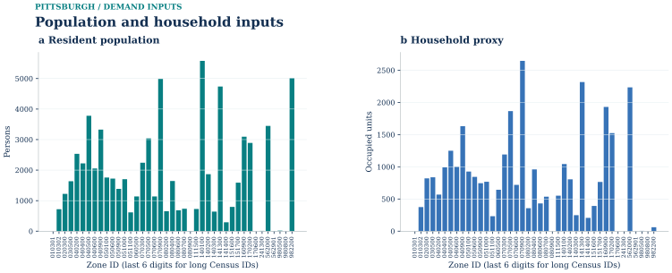</a>

Description, units and scope

Selected 2020 blocks grouped by tract ID; not whole-tract totals. All 41 zones are retained; population total 71,684. Occupied units total 32,432. Missing household fields are unknown, not zero. Census/ACS allocation is an input, not a simulated traffic quantity. This drawing uses the frozen run_001 evidence. Later supplementary datasets are separate and are not implied to have entered this scenario.

<a href="https://scholarhaozheng.github.io/mobility-network-lab/assets/figure-contract-r11/figures/pittsburgh/population.png">PNG</a> · <a href="https://scholarhaozheng.github.io/mobility-network-lab/assets/figure-contract-r11/figures/pittsburgh/population.svg">SVG</a> · <a href="https://scholarhaozheng.github.io/mobility-network-lab/assets/figure-contract-r11/figures/pittsburgh/population.pdf">PDF</a> · <a href="https://scholarhaozheng.github.io/mobility-network-lab/assets/figure-contract-r11/figures/pittsburgh/population.source.json">Source record</a>

</td></tr></table></td></tr>
<tr><td width="100%" valign="top" align="left"></td></tr>
<tr><td width="100%" valign="top" align="left">
<a href="https://scholarhaozheng.github.io/mobility-network-lab/volumes/pittsburgh.html#figure-r3-population">Complete city record · same evidence</a>
</td></tr>
</table>

#### Transit and observations

Accepted matched-route evidence is unavailable. [Figure guide and saved-state interpretation](https://scholarhaozheng.github.io/mobility-network-lab/figure-update-status.html#top) · [Current release details](https://scholarhaozheng.github.io/mobility-network-lab/volumes/pittsburgh.html#gap-20261008)

<table width="100%">
<tr><th width="100%" valign="top" align="left"><strong>Transit source geography</strong></th></tr>
<tr><td width="100%" valign="top" align="left"><table width="100%"><tr><td valign="top" width="100%">

Description, units and scope

Earlier bounded preflight stop tags; no timetable. 109 saved stop records. Stop tags and road proximity do not prove legal walk access or operating service. The frozen scenario has no accepted service-day transit paths; no zero-demand transit bar is implied. The gray retained road graph is geographic context, not a transit route model. Source stops and route shapes do not establish legal pedestrian access, operating service, or observed ridership. This drawing uses the frozen run_001 evidence. Later supplementary datasets are separate and are not implied to have entered this scenario.

<a href="https://scholarhaozheng.github.io/mobility-network-lab/assets/figure-contract-r11/figures/pittsburgh/transit.png">PNG</a> · <a href="https://scholarhaozheng.github.io/mobility-network-lab/assets/figure-contract-r11/figures/pittsburgh/transit.svg">SVG</a> · <a href="https://scholarhaozheng.github.io/mobility-network-lab/assets/figure-contract-r11/figures/pittsburgh/transit.pdf">PDF</a> · <a href="https://scholarhaozheng.github.io/mobility-network-lab/assets/figure-contract-r11/figures/pittsburgh/transit.source.json">Source record</a>

</td></tr></table></td></tr>
<tr><td width="100%" valign="top" align="left"></td></tr>
<tr><td width="100%" valign="top" align="left">
<a href="https://scholarhaozheng.github.io/mobility-network-lab/volumes/pittsburgh.html#figure-r3-transit">Complete city record · same evidence</a>
</td></tr>
</table>

#### Trip generation

<table width="100%">
<tr><th width="100%" valign="top" align="left"><strong>Trip generation and demand accounting</strong></th></tr>
<tr><td width="100%" valign="top" align="left"><table width="100%"><tr><td valign="top" width="100%">
<a href="https://scholarhaozheng.github.io/mobility-network-lab/volumes/pittsburgh.html#figure-fs-g01">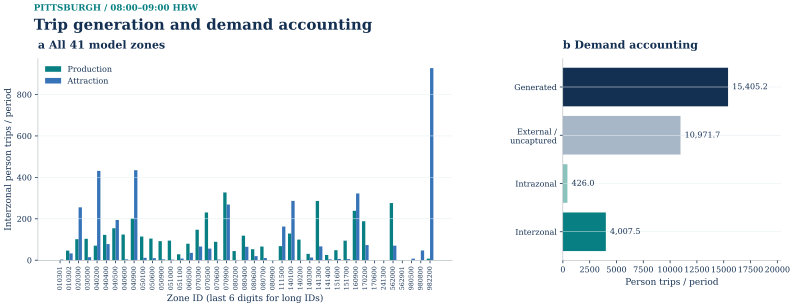</a>

Description, units and scope

All 41 zones; 08:00–09:00 HBW. The left panel shows saved interzonal productions/attractions. The right panel accounts for all generated persons, including excluded and intrazonal components. No top-12 truncation. Scenario assumptions, not measured trip counts. External and intrazonal components do not enter interzonal assignment; attractions are normalized to productions. This drawing uses the frozen run_001 evidence. Later supplementary datasets are separate and are not implied to have entered this scenario.

<a href="https://scholarhaozheng.github.io/mobility-network-lab/assets/figure-contract-r11/figures/pittsburgh/generation.png">PNG</a> · <a href="https://scholarhaozheng.github.io/mobility-network-lab/assets/figure-contract-r11/figures/pittsburgh/generation.svg">SVG</a> · <a href="https://scholarhaozheng.github.io/mobility-network-lab/assets/figure-contract-r11/figures/pittsburgh/generation.pdf">PDF</a> · <a href="https://scholarhaozheng.github.io/mobility-network-lab/assets/figure-contract-r11/figures/pittsburgh/generation.source.json">Source record</a>

</td></tr></table></td></tr>
<tr><td width="100%" valign="top" align="left"></td></tr>
<tr><td width="100%" valign="top" align="left">
<a href="https://scholarhaozheng.github.io/mobility-network-lab/volumes/pittsburgh.html#figure-fs-g01">Complete city record · same evidence</a>
</td></tr>
</table>

#### Trip distribution

<table width="100%">
<tr><th width="100%" valign="top" align="left"><strong>Trip distribution and directed OD margins</strong></th></tr>
<tr><td width="100%" valign="top" align="left"><table width="100%"><tr><td valign="top" width="100%">
<a href="https://scholarhaozheng.github.io/mobility-network-lab/volumes/pittsburgh.html#figure-fs-d01">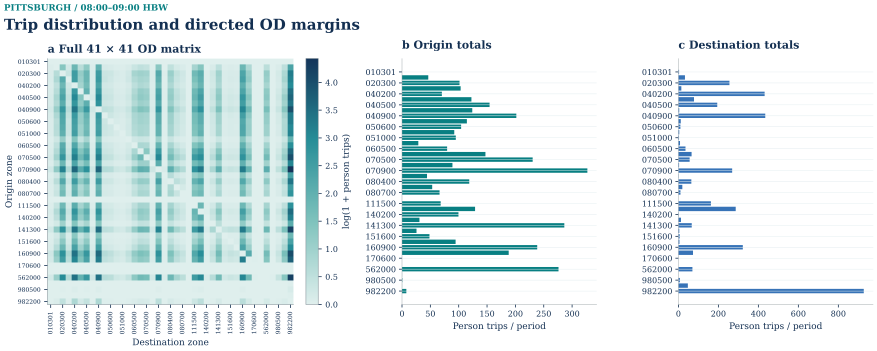</a>

Description, units and scope

Full 41×41 model-zone matrix including zero cells; 1406 positive OD pairs and 4,007.546608857 persons in 08:00–09:00 HBW. Colours are log(1+persons); margins are untransformed directed OD totals after PA direction. Every model zone is retained. Zero rows and columns remain visible; intrazonal cells are structural zeros. Labels use the final six digits of long zone IDs. This drawing uses the frozen run_001 evidence. Later supplementary datasets are separate and are not implied to have entered this scenario.

<a href="https://scholarhaozheng.github.io/mobility-network-lab/assets/figure-contract-r11/figures/pittsburgh/distribution.png">PNG</a> · <a href="https://scholarhaozheng.github.io/mobility-network-lab/assets/figure-contract-r11/figures/pittsburgh/distribution.svg">SVG</a> · <a href="https://scholarhaozheng.github.io/mobility-network-lab/assets/figure-contract-r11/figures/pittsburgh/distribution.pdf">PDF</a> · <a href="https://scholarhaozheng.github.io/mobility-network-lab/assets/figure-contract-r11/figures/pittsburgh/distribution.source.json">Source record</a>

</td></tr></table></td></tr>
<tr><td width="100%" valign="top" align="left"></td></tr>
<tr><td width="100%" valign="top" align="left">
<a href="https://scholarhaozheng.github.io/mobility-network-lab/volumes/pittsburgh.html#figure-fs-d01">Complete city record · same evidence</a>
</td></tr>
</table>

#### Mode choice

<table width="100%">
<tr><th width="100%" valign="top" align="left"><strong>Mode choice: demand, cost and availability</strong></th></tr>
<tr><td width="100%" valign="top" align="left"><table width="100%"><tr><td valign="top" width="100%">
<a href="https://scholarhaozheng.github.io/mobility-network-lab/volumes/pittsburgh.html#figure-fs-m01">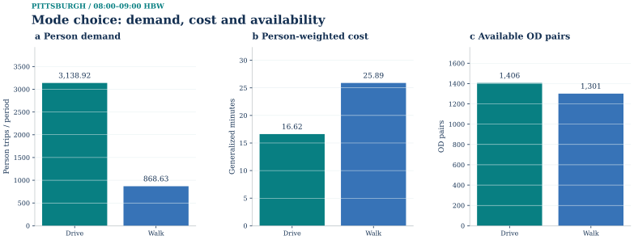</a>

Description, units and scope

Saved OD-specific choice in 08:00–09:00 HBW; sums over every positive-demand OD. Persons, person-weighted generalized minutes, and available OD counts have separate axes. Transit is not modeled; no zero bar is shown. Generalized cost includes model time and money terms. Person totals precede the separate occupancy-to-PCE conversion. This drawing uses the frozen run_001 evidence. Later supplementary datasets are separate and are not implied to have entered this scenario.

<a href="https://scholarhaozheng.github.io/mobility-network-lab/assets/figure-contract-r11/figures/pittsburgh/mode.png">PNG</a> · <a href="https://scholarhaozheng.github.io/mobility-network-lab/assets/figure-contract-r11/figures/pittsburgh/mode.svg">SVG</a> · <a href="https://scholarhaozheng.github.io/mobility-network-lab/assets/figure-contract-r11/figures/pittsburgh/mode.pdf">PDF</a> · <a href="https://scholarhaozheng.github.io/mobility-network-lab/assets/figure-contract-r11/figures/pittsburgh/mode.source.json">Source record</a>

</td></tr></table></td></tr>
<tr><td width="100%" valign="top" align="left"></td></tr>
<tr><td width="100%" valign="top" align="left">
<a href="https://scholarhaozheng.github.io/mobility-network-lab/volumes/pittsburgh.html#figure-fs-m01">Complete city record · same evidence</a>
</td></tr>
</table>

#### Static assignment methods

##### Static assignment inputs — vehicle-demand margins and physical access

<table width="100%">
<tr><th width="50%" valign="top" align="left"><strong>Static assignment demand margins</strong></th><th width="50%" valign="top" align="left"><strong>Physical demand endpoints</strong></th></tr>
<tr><td width="50%" valign="top" align="left"></td><td width="50%" valign="top" align="left"></td></tr>
<tr><td width="50%" valign="top" align="left">
Pittsburgh S72: origin and destination margins from the exact frozen 72-OD vehicle-demand table, after its existing person-to-vehicle conversion. Each map sums to 149.921423895065 PCE/h; all 41 model zones remain, including zero selected margins.

Description, units and scope

Pittsburgh S72: origin and destination margins from the exact frozen 72-OD vehicle-demand table, after its existing person-to-vehicle conversion. Each map sums to 149.921423895065 PCE/h; all 41 model zones remain, including zero selected margins. Both panels use the same square-root colour normalization with original-unit ticks. The source-zone ledger is joined exactly to actual prepared node OD rows, rather than to person-trip generation or all-mode distribution. This S72 selection is separate from the original 1,406-OD city assignment; unselected OD is not added. The source polygons are saved selected-block groups by tract ID, not full-tract population regions. All saved road geometry is retained as pale context and clipped only at the common display viewport. These are model inputs, not observed travel or an optimization trajectory. Private local derivative; no new public release is claimed. © OpenStreetMap contributors, ODbL 1.0; source-zone geography as documented in the frozen case.

</td><td width="50%" valign="top" align="left">
Pittsburgh S72: the exact prepared 72-OD demand is aggregated only for display at its real origin and destination loading nodes, with 34 positive origin nodes and 34 positive destination nodes. Each side sums to 149.921423895065 PCE/h.

Description, units and scope

Pittsburgh S72: the exact prepared 72-OD demand is aggregated only for display at its real origin and destination loading nodes, with 34 positive origin nodes and 34 positive destination nodes. Each side sums to 149.921423895065 PCE/h. Light open circles retain all 41 saved model access nodes; filled markers share a square-root colour scale, while fixed marker area does not add another quantity. Every solver OUT:link_id maps to the end coordinate of that directed physical road, not its midpoint or IN state. This preserves the frozen OUT-state loading convention, which omits the origin-link traversal; no repair or new interpretation is applied. Both panels use identical geographic extent and road/zone context. The demand table, zone-access ledger and network instance hashes were checked together. These are engineering loading points, not observed trip ends or parcel entrances. Private local derivative; no new public release is claimed. © OpenStreetMap contributors, ODbL 1.0.

</td></tr>
<tr><td width="50%" valign="top" align="left">
<a href="https://scholarhaozheng.github.io/mobility-network-lab/volumes/pittsburgh.html#figure-parity-pittsburgh-assignment-margins">Complete evidence · same figure</a> · <a href="https://scholarhaozheng.github.io/mobility-network-lab/assets/template-parity-20261008/static-inputs/pittsburgh/assignment-margins.svg">SVG</a> · <a href="https://scholarhaozheng.github.io/mobility-network-lab/assets/template-parity-20261008/static-inputs/pittsburgh/assignment-margins.png">PNG</a> · <a href="https://scholarhaozheng.github.io/mobility-network-lab/assets/template-parity-20261008/static-inputs/pittsburgh/assignment-margins.pdf">PDF</a> · <a href="https://scholarhaozheng.github.io/mobility-network-lab/assets/template-parity-20261008/static-inputs/pittsburgh/assignment-margins.plot.json">Plot data</a> · <a href="https://scholarhaozheng.github.io/mobility-network-lab/assets/template-parity-20261008/static-inputs/pittsburgh/assignment-margins.source.json">Source record</a> · <a href="https://scholarhaozheng.github.io/mobility-network-lab/assets/template-parity-20261008/static-inputs/pittsburgh/assignment-margins.caption.md">Caption</a>
</td><td width="50%" valign="top" align="left">
<a href="https://scholarhaozheng.github.io/mobility-network-lab/volumes/pittsburgh.html#figure-parity-pittsburgh-assignment-endpoints">Complete evidence · same figure</a> · <a href="https://scholarhaozheng.github.io/mobility-network-lab/assets/template-parity-20261008/static-inputs/pittsburgh/assignment-endpoints.svg">SVG</a> · <a href="https://scholarhaozheng.github.io/mobility-network-lab/assets/template-parity-20261008/static-inputs/pittsburgh/assignment-endpoints.png">PNG</a> · <a href="https://scholarhaozheng.github.io/mobility-network-lab/assets/template-parity-20261008/static-inputs/pittsburgh/assignment-endpoints.pdf">PDF</a> · <a href="https://scholarhaozheng.github.io/mobility-network-lab/assets/template-parity-20261008/static-inputs/pittsburgh/assignment-endpoints.plot.json">Plot data</a> · <a href="https://scholarhaozheng.github.io/mobility-network-lab/assets/template-parity-20261008/static-inputs/pittsburgh/assignment-endpoints.source.json">Source record</a> · <a href="https://scholarhaozheng.github.io/mobility-network-lab/assets/template-parity-20261008/static-inputs/pittsburgh/assignment-endpoints.caption.md">Caption</a>
</td></tr>
</table>

Current S72 Native rank 26/52 each retain outer 1–14. At outer 14 the original-coordinate OD residuals are 8.07013475568935e−8 and 2.6256443221356536e−7 PCE, below the original 1e−6 gate, with the other gates passed. The full-city FW initial gap is 4.773992564434884e−7, not exactly zero; it is below 1e−4 and needs zero updates. Updated iteration and plot audit · Current release details

##### Latest released evidence · 8 October 2026

<table width="100%">
<tr><th width="100%" valign="top" align="left"><strong>Native conservation through outer 14</strong></th></tr>
<tr><td width="100%" valign="top" align="left"><table width="100%"><tr><td valign="top" width="100%">
<a href="https://scholarhaozheng.github.io/mobility-network-lab/volumes/pittsburgh.html#figure-gap-pit-g05">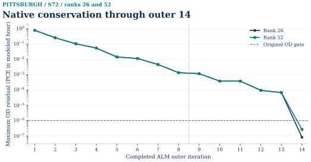</a>

Description, units and scope

Each rank has 14 saved outer states. The divider separates original outers 1–8 from continuation 9–14. At outer 14 the rank 26/52 residuals are 8.0701348e−8 and 2.6256443e−7 PCE; the original gate is 1e−6 PCE. Other original-space gates are checked separately. Frozen East End S72 post-diagnostic Native outer14, not GPS calibration. © OpenStreetMap contributors, ODbL: https://www.openstreetmap.org/copyright.

<a href="https://scholarhaozheng.github.io/mobility-network-lab/assets/figure-contract-r11/figures/pittsburgh/pit-native-conservation.png">PNG</a> · <a href="https://scholarhaozheng.github.io/mobility-network-lab/assets/figure-contract-r11/figures/pittsburgh/pit-native-conservation.svg">SVG</a> · <a href="https://scholarhaozheng.github.io/mobility-network-lab/assets/figure-contract-r11/figures/pittsburgh/pit-native-conservation.pdf">PDF</a> · <a href="https://scholarhaozheng.github.io/mobility-network-lab/assets/figure-contract-r11/figures/pittsburgh/pit-native-conservation.source.json">Source record</a>

</td></tr></table></td></tr>
<tr><td width="100%" valign="top" align="left"></td></tr>
<tr><td width="100%" valign="top" align="left">
<a href="https://scholarhaozheng.github.io/mobility-network-lab/volumes/pittsburgh.html#figure-gap-pit-g05">Complete city record · same evidence</a>
</td></tr>
</table>

##### Static network loading

<table width="100%">
<tr><th width="50%" valign="top" align="left"><strong>Frank–Wolfe: physical flow and distribution</strong></th><th width="50%" valign="top" align="left"><strong>Frank–Wolfe: physical-road flow and distribution</strong></th></tr>
<tr><td width="50%" valign="top" align="left"><table width="100%"><tr><td valign="top" width="100%">

Description, units and scope

Saved Pittsburgh static Frank–Wolfe endpoint for 08:00–09:00 HBW. The map and 22-bin histogram use the same complete 17,534-link physical-flow vector, including 12,563 exact-zero links; 4,971 links exceed 1e-6 PCE. Flow is PCE accumulated during the declared one-hour period, not persons or flow per simulation time step. The map uses a square-root sequential color scale with original-unit ticks and gray road context; histogram counts are linear and no links are omitted. Turn, access and other nonphysical solver arcs are excluded. Only the saved iteration-0 initialization exists; FW performed zero subsequent updates. Reciprocal directed arcs may overlap geometrically; flows are not summed. This full saved static case is distinct from the separate S72 and T4 method-transfer instances. This is a modeled engineering scenario, not observed traffic. © OpenStreetMap contributors / ODbL 1.0. R11 layout repair: map and all-link histogram share measured top and bottom panel bounds. The original saved physical-link IDs, exact flow vector, geographic vertices, display offsets, histogram edges and counts remain unchanged.

<a href="https://scholarhaozheng.github.io/mobility-network-lab/assets/figure-contract-r11/figures/pittsburgh/fw-physical-flow.png">PNG</a> · <a href="https://scholarhaozheng.github.io/mobility-network-lab/assets/figure-contract-r11/figures/pittsburgh/fw-physical-flow.svg">SVG</a> · <a href="https://scholarhaozheng.github.io/mobility-network-lab/assets/figure-contract-r11/figures/pittsburgh/fw-physical-flow.pdf">PDF</a> · <a href="https://scholarhaozheng.github.io/mobility-network-lab/assets/figure-contract-r11/figures/pittsburgh/fw-physical-flow.source.json">Source record</a>

</td></tr></table></td><td width="50%" valign="top" align="left"><table width="100%"><tr><td valign="top" width="100%">

Description, units and scope

Frank–Wolfe on the frozen Pittsburgh S72 static instance: 72 directed OD, 149.92142389506472 PCE in the modeled hour, independent checked Beckmann objective 763.227941458126 PCE min and full-graph relative gap 6.405076187649018e-15 against the unchanged 1e-5 gate. The map and linear-count 22-bin histogram use all 17,534 physical traversal arc values from this method’s own complete 56,384-solver-link vector, joined exactly by P:physical_link_id to original geometry. Every physical link is drawn as a grey base road, while the constant-width colored overlay includes only flow greater than 1e-12 PCE/hour. Exact and near-zero values remain unchanged in the all-link histogram and plot data; the 38,850 turn arcs are excluded from map and histogram. Both method views use identical absolute flow color limits and histogram bins. FW initial loading passed; zero FW updates. The finite endpoint is not synthesized from the FW vector. S72 excludes the original city case’s other 1,334 OD; it must not be merged with that 1,406-OD experiment. The original OUT-state loading omits the origin-link traversal and is preserved. A static endpoint map/distribution does not depict convergence speed. Modeled scenario, not observed traffic. Local saved-result derivative; no new S0 release claimed.

<a href="https://scholarhaozheng.github.io/mobility-network-lab/assets/figure-contract-r11/figures/pittsburgh/pittsburgh-pittsburgh-s72-fw-flow.png">PNG</a> · <a href="https://scholarhaozheng.github.io/mobility-network-lab/assets/figure-contract-r11/figures/pittsburgh/pittsburgh-pittsburgh-s72-fw-flow.svg">SVG</a> · <a href="https://scholarhaozheng.github.io/mobility-network-lab/assets/figure-contract-r11/figures/pittsburgh/pittsburgh-pittsburgh-s72-fw-flow.pdf">PDF</a> · <a href="https://scholarhaozheng.github.io/mobility-network-lab/assets/figure-contract-r11/figures/pittsburgh/pittsburgh-pittsburgh-s72-fw-flow.source.json">Source record</a>

</td></tr></table></td></tr>
<tr><td width="50%" valign="top" align="left"></td><td width="50%" valign="top" align="left"></td></tr>
<tr><td width="50%" valign="top" align="left">
<a href="https://scholarhaozheng.github.io/mobility-network-lab/volumes/pittsburgh.html#figure-r9-fw-physical-flow">Complete city record · same evidence</a>
</td><td width="50%" valign="top" align="left">
<a href="https://scholarhaozheng.github.io/mobility-network-lab/volumes/pittsburgh.html#figure-r9-pittsburgh-s72-fw-flow">Complete city record · same evidence</a>
</td></tr>
</table>

Saved initial checks and original endpoint views

<table width="100%">
<tr><th width="50%" valign="top" align="left"><strong>Frank–Wolfe: the saved initial check</strong></th><td colspan="1" width="50%"></td></tr>
<tr><td width="50%" valign="top" align="left"><table width="100%"><tr><td valign="top" width="100%">
<a href="https://scholarhaozheng.github.io/mobility-network-lab/volumes/pittsburgh.html#figure-fs-a02">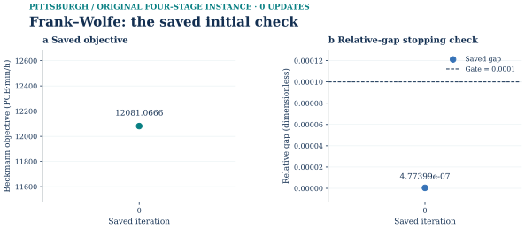</a>
Only the actual saved iteration 0 is shown: objective 12081.0666458954 PCE·min/h and relative gap 4.77399256443488e-07, against the unchanged 0.0001 stopping gate. There were zero updates. Each panel contains a single numerical point; no missing trajectory or second state is inferred. The companion physical-flow map reads this method’s own saved vector. This frozen original demand instance is not relabelled as a later selected-demand or transit-revision run.

<a href="https://scholarhaozheng.github.io/mobility-network-lab/assets/figure-contract-r12/figures/pittsburgh/pittsburgh-initial-fw.svg">SVG</a> · <a href="https://scholarhaozheng.github.io/mobility-network-lab/assets/figure-contract-r12/figures/pittsburgh/pittsburgh-initial-fw.png">PNG</a> · <a href="https://scholarhaozheng.github.io/mobility-network-lab/assets/figure-contract-r12/figures/pittsburgh/pittsburgh-initial-fw.pdf">PDF</a> · <a href="https://scholarhaozheng.github.io/mobility-network-lab/assets/figure-contract-r12/figures/pittsburgh/pittsburgh-initial-fw.source.json">Source data</a>

</td></tr></table></td><td colspan="1" width="50%"></td></tr>
<tr><td width="50%" valign="top" align="left"></td><td colspan="1" width="50%"></td></tr>
<tr><td width="50%" valign="top" align="left"></td><td colspan="1" width="50%"></td></tr>
</table>

Earlier views and additional saved evidence

<table width="100%">
<tr><th width="33%" valign="top" align="left"><strong>Frank–Wolfe: physical-road loading</strong></th><td colspan="2" width="67%"></td></tr>
<tr><td width="33%" valign="top" align="left"><table width="100%"><tr><td valign="top" width="100%">
<a href="https://scholarhaozheng.github.io/mobility-network-lab/volumes/pittsburgh.html#figure-fs-a03">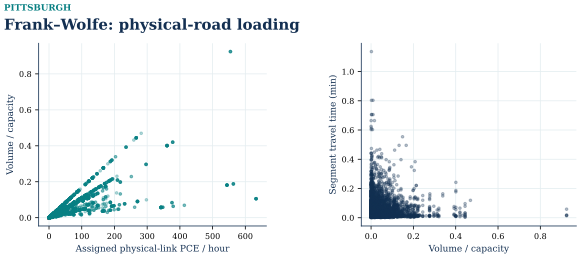</a>

Description, units and scope

All used physical links are shown, excluding virtual turn arcs. Points retain the saved PCE, v/c and BPR segment travel time. The OUT-state convention omits the first physical link when loading a path; the figure does not alter that endpoint convention. Single-pass engineering scenario; no local empirical calibration. 4,971 used physical links · maximum v/c = 0.924094

<a href="https://scholarhaozheng.github.io/mobility-network-lab/assets/figure-contract-r11/figures/pittsburgh/pittsburgh-fs_a03.png">PNG</a> · <a href="https://scholarhaozheng.github.io/mobility-network-lab/assets/figure-contract-r11/figures/pittsburgh/pittsburgh-fs_a03.svg">SVG</a> · <a href="https://scholarhaozheng.github.io/mobility-network-lab/assets/figure-contract-r11/figures/pittsburgh/pittsburgh-fs_a03.pdf">PDF</a> · <a href="https://scholarhaozheng.github.io/mobility-network-lab/assets/figure-contract-r11/figures/pittsburgh/pittsburgh-fs_a03.source.json">Source record</a>

</td></tr></table></td><td colspan="2" width="67%"></td></tr>
<tr><td width="33%" valign="top" align="left"></td><td colspan="2" width="67%"></td></tr>
<tr><td width="33%" valign="top" align="left">
<a href="https://scholarhaozheng.github.io/mobility-network-lab/volumes/pittsburgh.html#figure-fs-a03">Complete city record · same evidence</a>
</td><td colspan="2" width="67%"></td></tr>
</table>

Historical R8 figure; current v7 evidence follows

<table width="100%">
<tr><th width="100%" valign="top" align="left"><strong>Static objective and optimality checks</strong></th></tr>
<tr><td width="100%" valign="top" align="left"><table width="100%"><tr><td valign="top" width="100%">
<a href="https://scholarhaozheng.github.io/mobility-network-lab/volumes/pittsburgh.html#pit-r3-static-reference">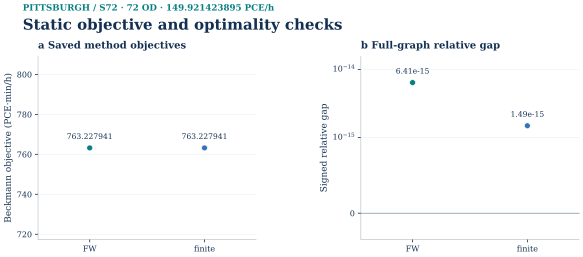</a>
Independent FW and finite-path endpoints on the same selected Pittsburgh S72 demand. Both checked objectives equal 763.227941458126 PCE·min/h and both saved OD and reconstruction residuals are zero. Categorical points are never connected as an iteration history. The companion method-specific maps and distributions retain all 17,534 physical traversal links from each method’s own 56,384-solver-arc vector, excluding 38,850 turn arcs.

<a href="https://scholarhaozheng.github.io/mobility-network-lab/assets/figure-contract-r12/figures/pittsburgh/pittsburgh-s72-endpoints.svg">SVG</a> · <a href="https://scholarhaozheng.github.io/mobility-network-lab/assets/figure-contract-r12/figures/pittsburgh/pittsburgh-s72-endpoints.png">PNG</a> · <a href="https://scholarhaozheng.github.io/mobility-network-lab/assets/figure-contract-r12/figures/pittsburgh/pittsburgh-s72-endpoints.pdf">PDF</a> · <a href="https://scholarhaozheng.github.io/mobility-network-lab/assets/figure-contract-r12/figures/pittsburgh/pittsburgh-s72-endpoints.source.json">Source data</a>

</td></tr></table></td></tr>
<tr><td width="100%" valign="top" align="left"></td></tr>
<tr><td width="100%" valign="top" align="left"></td></tr>
</table>

##### Finite-path reference: separate S72 instance

<table width="100%">
<tr><th width="100%" valign="top" align="left"><strong>Finite-path: physical-road flow and distribution</strong></th></tr>
<tr><td width="100%" valign="top" align="left"><table width="100%"><tr><td valign="top" width="100%">

Description, units and scope

Finite-path on the frozen Pittsburgh S72 static instance: 72 directed OD, 149.92142389506472 PCE in the modeled hour, independent checked Beckmann objective 763.227941458126 PCE min and full-graph relative gap 1.4895526017788486e-15 against the unchanged 1e-5 gate. The map and linear-count 22-bin histogram use all 17,534 physical traversal arc values from this method’s own complete 56,384-solver-link vector, joined exactly by P:physical_link_id to original geometry. Every physical link is drawn as a grey base road, while the constant-width colored overlay includes only flow greater than 1e-12 PCE/hour. Exact and near-zero values remain unchanged in the all-link histogram and plot data; the 38,850 turn arcs are excluded from map and histogram. Both method views use identical absolute flow color limits and histogram bins. Own 360-path finite solution; one recorded SLSQP iteration. The finite endpoint is not synthesized from the FW vector. S72 excludes the original city case’s other 1,334 OD; it must not be merged with that 1,406-OD experiment. The original OUT-state loading omits the origin-link traversal and is preserved. A static endpoint map/distribution does not depict convergence speed. Modeled scenario, not observed traffic. Local saved-result derivative; no new S0 release claimed.

<a href="https://scholarhaozheng.github.io/mobility-network-lab/assets/figure-contract-r11/figures/pittsburgh/pittsburgh-pittsburgh-s72-finite-flow.png">PNG</a> · <a href="https://scholarhaozheng.github.io/mobility-network-lab/assets/figure-contract-r11/figures/pittsburgh/pittsburgh-pittsburgh-s72-finite-flow.svg">SVG</a> · <a href="https://scholarhaozheng.github.io/mobility-network-lab/assets/figure-contract-r11/figures/pittsburgh/pittsburgh-pittsburgh-s72-finite-flow.pdf">PDF</a> · <a href="https://scholarhaozheng.github.io/mobility-network-lab/assets/figure-contract-r11/figures/pittsburgh/pittsburgh-pittsburgh-s72-finite-flow.source.json">Source record</a>

</td></tr></table></td></tr>
<tr><td width="100%" valign="top" align="left"></td></tr>
<tr><td width="100%" valign="top" align="left">
<a href="https://scholarhaozheng.github.io/mobility-network-lab/volumes/pittsburgh.html#figure-r9-pittsburgh-s72-finite-flow">Complete city record · same evidence</a>
</td></tr>
</table>

##### Native L3 diagnostics · 2 released figures

#### Time-expanded network and path examples

<table width="100%">
<tr><th width="50%" valign="top" align="left"><strong>Time-expanded network in layers</strong></th><th width="50%" valign="top" align="left"><strong>Local construction details</strong></th></tr>
<tr><td width="50%" valign="top" align="left"><a href="https://scholarhaozheng.github.io/mobility-network-lab/volumes/pittsburgh.html#figure-parity-pittsburgh-time-layers">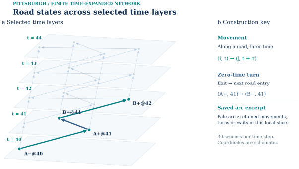</a></td><td width="50%" valign="top" align="left"><a href="https://scholarhaozheng.github.io/mobility-network-lab/volumes/pittsburgh.html#figure-parity-pittsburgh-local-details">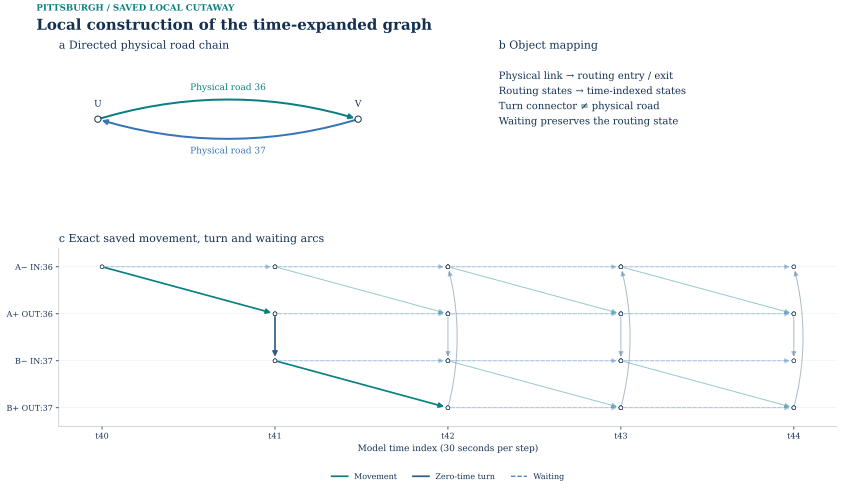</a></td></tr>
<tr><td width="50%" valign="top" align="left">
Pittsburgh: selected time layers 40–44 use 30 seconds per time step. Every arrow is an actual saved arc; only node-time states occurring as saved endpoints are drawn.

Description, units and scope

Pittsburgh: selected time layers 40–44 use 30 seconds per time step. Every arrow is an actual saved arc; only node-time states occurring as saved endpoints are drawn. The highlighted continuous chain is selected from saved construction records to explain incidence; it is not an optimized or observed trajectory. State aliases: A− = IN:36, A+ = OUT:36, B− = IN:37, B+ = OUT:37. Pale arrows show other saved arcs in this local slice. Time planes and horizontal placement are schematic; this is neither a full graph nor observed traffic. Roads 36 and 37 are opposite directions of the same physical segment; their routing entry/exit states remain distinct. The saved zero-time turn is a structural input arc, not a claim that an optimized route performs this turn. Origin loading elsewhere starts at OUT state; no change to that historical model convention.

</td><td width="50%" valign="top" align="left">
Pittsburgh: the physical road chain is mapped to routing entry/exit states and then to exact time-indexed arcs in the saved construction slice. Panel c contains all 26 retained arcs, with exact endpoint times; strong teal/blue highlights the same continuous chain used in the companion layered figure.

Description, units and scope

Pittsburgh: the physical road chain is mapped to routing entry/exit states and then to exact time-indexed arcs in the saved construction slice. Panel c contains all 26 retained arcs, with exact endpoint times; strong teal/blue highlights the same continuous chain used in the companion layered figure. The highlighted continuous chain is selected from saved construction records to explain incidence; it is not an optimized or observed trajectory. All layout coordinates are schematic. Source/sink terminal bookkeeping is outside this excerpt and must not be read as road travel or waiting. Roads 36 and 37 are opposite directions of the same physical segment; their routing entry/exit states remain distinct. The saved zero-time turn is a structural input arc, not a claim that an optimized route performs this turn. Origin loading elsewhere starts at OUT state; no change to that historical model convention.

</td></tr>
<tr><td width="50%" valign="top" align="left">
<a href="https://scholarhaozheng.github.io/mobility-network-lab/volumes/pittsburgh.html#figure-parity-pittsburgh-time-layers">Complete evidence · same figure</a> · <a href="https://scholarhaozheng.github.io/mobility-network-lab/assets/template-parity-20261008/construction/pittsburgh/time-layers.svg">SVG</a> · <a href="https://scholarhaozheng.github.io/mobility-network-lab/assets/template-parity-20261008/construction/pittsburgh/time-layers.png">PNG</a> · <a href="https://scholarhaozheng.github.io/mobility-network-lab/assets/template-parity-20261008/construction/pittsburgh/time-layers.pdf">PDF</a> · <a href="https://scholarhaozheng.github.io/mobility-network-lab/assets/template-parity-20261008/construction/pittsburgh/time-layers.plot.json">Plot data</a> · <a href="https://scholarhaozheng.github.io/mobility-network-lab/assets/template-parity-20261008/construction/pittsburgh/time-layers.source.json">Source record</a> · <a href="https://scholarhaozheng.github.io/mobility-network-lab/assets/template-parity-20261008/construction/pittsburgh/time-layers.caption.md">Caption</a>
</td><td width="50%" valign="top" align="left">
<a href="https://scholarhaozheng.github.io/mobility-network-lab/volumes/pittsburgh.html#figure-parity-pittsburgh-local-details">Complete evidence · same figure</a> · <a href="https://scholarhaozheng.github.io/mobility-network-lab/assets/template-parity-20261008/construction/pittsburgh/local-details.svg">SVG</a> · <a href="https://scholarhaozheng.github.io/mobility-network-lab/assets/template-parity-20261008/construction/pittsburgh/local-details.png">PNG</a> · <a href="https://scholarhaozheng.github.io/mobility-network-lab/assets/template-parity-20261008/construction/pittsburgh/local-details.pdf">PDF</a> · <a href="https://scholarhaozheng.github.io/mobility-network-lab/assets/template-parity-20261008/construction/pittsburgh/local-details.plot.json">Plot data</a> · <a href="https://scholarhaozheng.github.io/mobility-network-lab/assets/template-parity-20261008/construction/pittsburgh/local-details.source.json">Source record</a> · <a href="https://scholarhaozheng.github.io/mobility-network-lab/assets/template-parity-20261008/construction/pittsburgh/local-details.caption.md">Caption</a>
</td></tr>
</table>

Additional saved source figures
<ul><li><a href="https://scholarhaozheng.github.io/mobility-network-lab/assets/figure-contract-r12/figures/pittsburgh/t4-arc-roles.svg">Time-expanded network: saved arc roles</a></li><li><a href="https://scholarhaozheng.github.io/mobility-network-lab/assets/figure-contract-r11/figures/pittsburgh/pittsburgh-input-time-layer-excerpt.svg">Time-expanded network: saved input layers</a></li><li><a href="https://scholarhaozheng.github.io/mobility-network-lab/assets/figure-contract-r12/figures/pittsburgh/t4-input-demand.svg">Four selected departure demands</a></li></ul>

#### Optimization on the time-expanded network

##### Two-phase column generation

<table width="100%">
<tr><th width="33%" valign="top" align="left"><strong>Phase I: artificial-flow clearance</strong></th><th width="33%" valign="top" align="left"><strong>Phase II objective</strong></th><th width="33%" valign="top" align="left"><strong>Independent pricing closure</strong></th></tr>
<tr><td width="33%" valign="top" align="left"><a href="https://scholarhaozheng.github.io/mobility-network-lab/volumes/pittsburgh.html#figure-parity-pittsburgh-cg-phase1">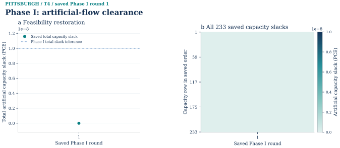</a></td><td width="33%" valign="top" align="left"><a href="https://scholarhaozheng.github.io/mobility-network-lab/volumes/pittsburgh.html#figure-parity-pittsburgh-cg-phase2">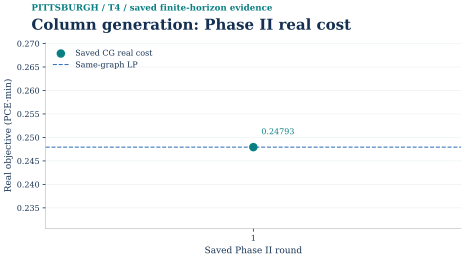</a></td><td width="33%" valign="top" align="left"><a href="https://scholarhaozheng.github.io/mobility-network-lab/volumes/pittsburgh.html#figure-parity-pittsburgh-cg-pricing">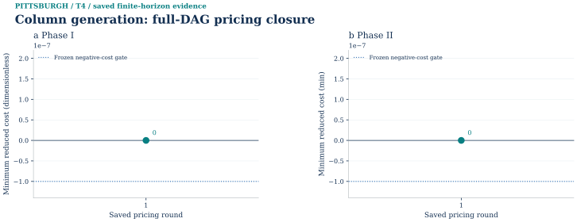</a></td></tr>
<tr><td width="33%" valign="top" align="left">

Description, units and scope

The sole saved Phase I restricted-master solution contains four path-flow variables followed by 233 nonnegative artificial capacity-slack variables. They relax shared physical-arc capacity rows; this model has no commodity-level artificial-flow variables. Both panels use the saved state directly: the total is exactly 0 PCE and every one of the 233 capacity slacks is exactly zero. Panel b preserves the complete saved capacity-row order; plot data link each row to its original dynamic-arc index and ID. The dotted line is the original 1e−8 PCE tolerance on total artificial slack; the heatmap uses 0 to that same value only as its color reference. Four input-cost seed paths already satisfy the bounded instance. A single recorded solve is shown without an invented multi-round trajectory. Phase I capacity feasibility remains separate from Phase II real cost and independent full-DAG pricing. Private local derivative of the saved numerical state; no new public asset release or optimizer run is claimed.

</td><td width="33%" valign="top" align="left">

Description, units and scope

One actual saved Phase II round. CG real cost is 0.24793241990274609 PCE·min; the separate same-graph LP reference is 0.24793241990274612 PCE·min. The marker and dashed reference can coincide at displayed precision. No Phase I artificial objective is connected to this real-cost objective. No new column after the four seed paths.

</td><td width="33%" valign="top" align="left">

Description, units and scope

The saved full-DAG pricing check is zero in both phases, against the frozen absolute tolerance 1e-7. Phase I reduced cost is dimensionless; Phase II reduced cost is minutes, so they have separate axes. Each phase has one actual round, four seed paths, and no new columns. Public data contain the global minimum per phase, not separate per-demand minima; no per-demand bars are fabricated.

</td></tr>
<tr><td width="33%" valign="top" align="left">
<a href="https://scholarhaozheng.github.io/mobility-network-lab/volumes/pittsburgh.html#figure-parity-pittsburgh-cg-phase1">Complete evidence · same figure</a> · <a href="https://scholarhaozheng.github.io/mobility-network-lab/assets/template-parity-20261008/optimization/pittsburgh/cg-phase1.svg">SVG</a> · <a href="https://scholarhaozheng.github.io/mobility-network-lab/assets/template-parity-20261008/optimization/pittsburgh/cg-phase1.png">PNG</a> · <a href="https://scholarhaozheng.github.io/mobility-network-lab/assets/template-parity-20261008/optimization/pittsburgh/cg-phase1.pdf">PDF</a> · <a href="https://scholarhaozheng.github.io/mobility-network-lab/assets/template-parity-20261008/optimization/pittsburgh/cg-phase1.plot.json">Plot data</a> · <a href="https://scholarhaozheng.github.io/mobility-network-lab/assets/template-parity-20261008/optimization/pittsburgh/cg-phase1.source.json">Source record</a> · <a href="https://scholarhaozheng.github.io/mobility-network-lab/assets/template-parity-20261008/optimization/pittsburgh/cg-phase1.caption.md">Caption</a>
</td><td width="33%" valign="top" align="left">
<a href="https://scholarhaozheng.github.io/mobility-network-lab/volumes/pittsburgh.html#figure-parity-pittsburgh-cg-phase2">Complete evidence · same figure</a> · <a href="https://scholarhaozheng.github.io/mobility-network-lab/assets/figure-contract-r12/figures/pittsburgh/cg-phase2.svg">SVG</a> · <a href="https://scholarhaozheng.github.io/mobility-network-lab/assets/figure-contract-r12/figures/pittsburgh/cg-phase2.png">PNG</a> · <a href="https://scholarhaozheng.github.io/mobility-network-lab/assets/figure-contract-r12/figures/pittsburgh/cg-phase2.pdf">PDF</a> · <a href="https://scholarhaozheng.github.io/mobility-network-lab/assets/figure-contract-r12/figures/pittsburgh/cg-phase2.plot.json">Plot data</a> · <a href="https://scholarhaozheng.github.io/mobility-network-lab/assets/figure-contract-r12/figures/pittsburgh/cg-phase2.source.json">Source record</a>
</td><td width="33%" valign="top" align="left">
<a href="https://scholarhaozheng.github.io/mobility-network-lab/volumes/pittsburgh.html#figure-parity-pittsburgh-cg-pricing">Complete evidence · same figure</a> · <a href="https://scholarhaozheng.github.io/mobility-network-lab/assets/figure-contract-r12/figures/pittsburgh/cg-pricing.svg">SVG</a> · <a href="https://scholarhaozheng.github.io/mobility-network-lab/assets/figure-contract-r12/figures/pittsburgh/cg-pricing.png">PNG</a> · <a href="https://scholarhaozheng.github.io/mobility-network-lab/assets/figure-contract-r12/figures/pittsburgh/cg-pricing.pdf">PDF</a> · <a href="https://scholarhaozheng.github.io/mobility-network-lab/assets/figure-contract-r12/figures/pittsburgh/cg-pricing.plot.json">Plot data</a> · <a href="https://scholarhaozheng.github.io/mobility-network-lab/assets/figure-contract-r12/figures/pittsburgh/cg-pricing.source.json">Source record</a>
</td></tr>
</table>

##### Lagrangian relaxation: bounds → prices → recovery

<table width="100%">
<tr><th width="33%" valign="top" align="left"><strong>Lagrangian bounds and certified gap</strong></th><th width="33%" valign="top" align="left"><strong>Capacity prices at the best dual bound</strong></th><th width="33%" valign="top" align="left"><strong>Path-pool growth and primal recovery</strong></th></tr>
<tr><td width="33%" valign="top" align="left"><a href="https://scholarhaozheng.github.io/mobility-network-lab/volumes/pittsburgh.html#figure-parity-pittsburgh-lr-bounds">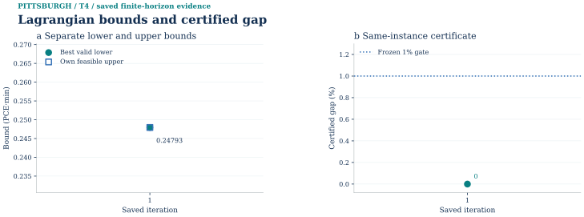</a></td><td width="33%" valign="top" align="left"><a href="https://scholarhaozheng.github.io/mobility-network-lab/volumes/pittsburgh.html#figure-parity-pittsburgh-lr-prices">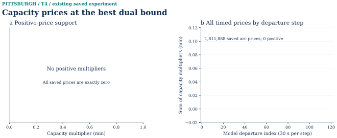</a></td><td width="33%" valign="top" align="left"><a href="https://scholarhaozheng.github.io/mobility-network-lab/volumes/pittsburgh.html#figure-parity-pittsburgh-lr-recovery">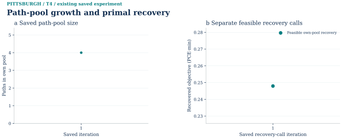</a></td></tr>
<tr><td width="33%" valign="top" align="left">

Description, units and scope

One actual LR iteration. Best valid lower is 0.2479324199027457 PCE·min; own recovered feasible upper is 0.2479324199027457 PCE·min. The certified gap is max(0,(U−L)/max(1,|U|)) = 0; the frozen gate is 1%. Lower and upper are separate markers at the same recorded iteration; they coincide to displayed precision. Tiny signed floating-point differences remain in the plot data. Capacities are nonbinding in this T4 pulse; this does not prove that city area caused the short trace.

</td><td width="33%" valign="top" align="left">

Description, units and scope

The saved best-bound multiplier vector contains 1,811,888 original dynamic-arc entries, all exactly zero. Consequently there is no nonempty top-price ranking. The second panel sums every timed multiplier by its real 30-second departure index, including the zero sums; source/sink entries without a time suffix are excluded only from the time aggregation. Empty positive support is shown explicitly, not replaced with another city or method. These numerical details remain a private local preview.

</td><td width="33%" valign="top" align="left">

Description, units and scope

One actual path-pool record and one actual feasible recovery call are shown in separate panels. The four paths belong to this method’s own pool; the objective is the saved recovered feasible upper bound. No intermediate call, pool growth or capacity-price effect is invented. A filled marker denotes a feasible call, as in Boston/Hong Kong.

</td></tr>
<tr><td width="33%" valign="top" align="left">
<a href="https://scholarhaozheng.github.io/mobility-network-lab/volumes/pittsburgh.html#figure-parity-pittsburgh-lr-bounds">Complete evidence · same figure</a> · <a href="https://scholarhaozheng.github.io/mobility-network-lab/assets/figure-contract-r12/figures/pittsburgh/lr-bounds.svg">SVG</a> · <a href="https://scholarhaozheng.github.io/mobility-network-lab/assets/figure-contract-r12/figures/pittsburgh/lr-bounds.png">PNG</a> · <a href="https://scholarhaozheng.github.io/mobility-network-lab/assets/figure-contract-r12/figures/pittsburgh/lr-bounds.pdf">PDF</a> · <a href="https://scholarhaozheng.github.io/mobility-network-lab/assets/figure-contract-r12/figures/pittsburgh/lr-bounds.plot.json">Plot data</a> · <a href="https://scholarhaozheng.github.io/mobility-network-lab/assets/figure-contract-r12/figures/pittsburgh/lr-bounds.source.json">Source record</a>
</td><td width="33%" valign="top" align="left">
<a href="https://scholarhaozheng.github.io/mobility-network-lab/volumes/pittsburgh.html#figure-parity-pittsburgh-lr-prices">Complete evidence · same figure</a> · <a href="https://scholarhaozheng.github.io/mobility-network-lab/assets/template-parity-20261008/optimization/pittsburgh/lr-prices.svg">SVG</a> · <a href="https://scholarhaozheng.github.io/mobility-network-lab/assets/template-parity-20261008/optimization/pittsburgh/lr-prices.png">PNG</a> · <a href="https://scholarhaozheng.github.io/mobility-network-lab/assets/template-parity-20261008/optimization/pittsburgh/lr-prices.pdf">PDF</a> · <a href="https://scholarhaozheng.github.io/mobility-network-lab/assets/template-parity-20261008/optimization/pittsburgh/lr-prices.plot.json">Plot data</a> · <a href="https://scholarhaozheng.github.io/mobility-network-lab/assets/template-parity-20261008/optimization/pittsburgh/lr-prices.source.json">Source record</a> · <a href="https://scholarhaozheng.github.io/mobility-network-lab/assets/template-parity-20261008/optimization/pittsburgh/lr-prices.caption.md">Caption</a>
</td><td width="33%" valign="top" align="left">
<a href="https://scholarhaozheng.github.io/mobility-network-lab/volumes/pittsburgh.html#figure-parity-pittsburgh-lr-recovery">Complete evidence · same figure</a> · <a href="https://scholarhaozheng.github.io/mobility-network-lab/assets/template-parity-20261008/optimization/pittsburgh/lr-recovery.svg">SVG</a> · <a href="https://scholarhaozheng.github.io/mobility-network-lab/assets/template-parity-20261008/optimization/pittsburgh/lr-recovery.png">PNG</a> · <a href="https://scholarhaozheng.github.io/mobility-network-lab/assets/template-parity-20261008/optimization/pittsburgh/lr-recovery.pdf">PDF</a> · <a href="https://scholarhaozheng.github.io/mobility-network-lab/assets/template-parity-20261008/optimization/pittsburgh/lr-recovery.plot.json">Plot data</a> · <a href="https://scholarhaozheng.github.io/mobility-network-lab/assets/template-parity-20261008/optimization/pittsburgh/lr-recovery.source.json">Source record</a> · <a href="https://scholarhaozheng.github.io/mobility-network-lab/assets/template-parity-20261008/optimization/pittsburgh/lr-recovery.caption.md">Caption</a>
</td></tr>
</table>

##### ADMM: convergence → conservation → physical flow

<table width="100%">
<tr><th width="33%" valign="top" align="left"><strong>ADMM residuals and objective agreement</strong></th><th width="33%" valign="top" align="left"><strong>ADMM: final commodity conservation</strong></th><th width="33%" valign="top" align="left"><strong>ADMM: physical-road flow comparison</strong></th></tr>
<tr><td width="33%" valign="top" align="left"><table width="100%"><tr><td valign="top" width="100%">
<a href="https://scholarhaozheng.github.io/mobility-network-lab/volumes/pittsburgh.html#figure-r9-pittsburgh-admm-main">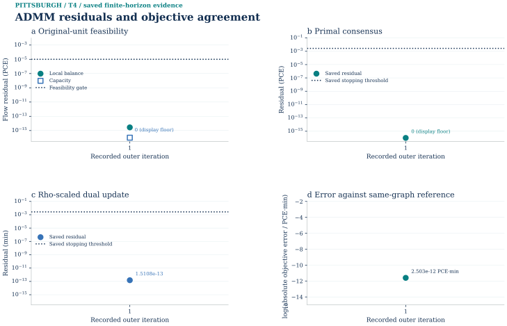</a>
Four diagnostic panels follow the Hong Kong ADMM figure: original-unit feasibility, primal consensus, rho-scaled dual update, and log10 absolute objective error against the independent same-graph reference. This instance saved exactly one completed outer update, shown as a point rather than an invented convergence curve. Balance, capacity, and primal use PCE; rho-scaled dual and its own threshold use minutes. Only exact-zero residuals use a labeled 1e-16 display floor; positive residuals are unchanged. Objective-error display floor is 1e-15 PCE·min. Saved internal thresholds and the 1e-5 PCE feasibility gate are retained. All displayed states meet the frozen independent gates; objective agreement is not a claim of identical link flows.

<a href="https://scholarhaozheng.github.io/mobility-network-lab/assets/figure-contract-r12/figures/pittsburgh/admm-saved-state.svg">SVG</a> · <a href="https://scholarhaozheng.github.io/mobility-network-lab/assets/figure-contract-r12/figures/pittsburgh/admm-saved-state.png">PNG</a> · <a href="https://scholarhaozheng.github.io/mobility-network-lab/assets/figure-contract-r12/figures/pittsburgh/admm-saved-state.pdf">PDF</a> · <a href="https://scholarhaozheng.github.io/mobility-network-lab/assets/figure-contract-r12/figures/pittsburgh/admm-saved-state.source.json">Source data</a>

</td></tr></table></td><td width="33%" valign="top" align="left"><table width="100%"><tr><td valign="top" width="100%">
<a href="https://scholarhaozheng.github.io/mobility-network-lab/volumes/pittsburgh.html#figure-r9-pittsburgh-admm-conservation">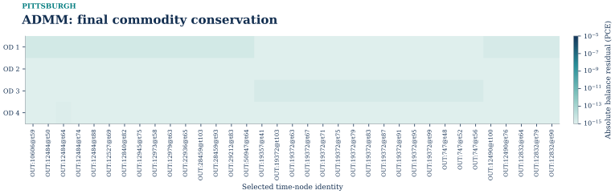</a>

Description, units and scope

At the single saved completed ADMM iteration 1, reconstruct original-unit outflow minus inflow minus commodity supply using the exact saved arc order and the original loader’s lexically sorted 700,226 time-node identities. All four commodity maximum residuals and their worst-node IDs match the previously saved independent check exactly; the overall maximum is 2.7850292342213303e−15 PCE against the unchanged 1e−5 PCE gate. The heatmap shows the 35 nodes with largest maximum residual over all four commodities, with lexical node-order tie breaking; all nodes were included in selection. Values ≤1e−15 use a display-floor color without changing data. The color ceiling is the gate, and the figure does not imply an iteration history. Original OUT-state loading is unchanged. Modeled scenario, not observed traffic. Local saved-result derivative; no new S0 asset release is claimed. The heatmap is the saved final spatial conservation state, not an iteration-history heatmap. The displayed color floor and unchanged gate are retained; all exact raw residual values remain in the linked public plot data.

<a href="https://scholarhaozheng.github.io/mobility-network-lab/assets/figure-contract-r11/figures/pittsburgh/pittsburgh-pittsburgh-admm-conservation.png">PNG</a> · <a href="https://scholarhaozheng.github.io/mobility-network-lab/assets/figure-contract-r11/figures/pittsburgh/pittsburgh-pittsburgh-admm-conservation.svg">SVG</a> · <a href="https://scholarhaozheng.github.io/mobility-network-lab/assets/figure-contract-r11/figures/pittsburgh/pittsburgh-pittsburgh-admm-conservation.pdf">PDF</a> · <a href="https://scholarhaozheng.github.io/mobility-network-lab/assets/figure-contract-r11/figures/pittsburgh/pittsburgh-pittsburgh-admm-conservation.source.json">Source record</a>

</td></tr></table></td><td width="33%" valign="top" align="left"><table width="100%"><tr><td valign="top" width="100%">

Description, units and scope

The 9,106 physical GMNS links instantiated in the frozen Pittsburgh T4 graph are mapped from their exact physical_road arc IDs and summed across commodities and time. All instantiated links, including zero-flow links, appear in the map and scatter. The other 8,428 of the 17,534 physical roads are grey context, not solved zeros. ADMM x and exact-DAG LP own saved vectors use a common square-root color scale; the signed difference map uses a separate symmetric scale and displays roundoff-sized differences, not a congestion effect. Each physical_fraction is exactly 1 and the P:link-to-GMNS mapping is one-to-one; turns/waits/connectors are excluded. The original OUT-state origin convention omits the first origin-link traversal and is preserved without repair. This is one saved ADMM update on a nonbinding-capacity four-OD pulse, not observed traffic or a convergence-rate comparison. Local saved-result derivative; no new S0 asset release is claimed.

<a href="https://scholarhaozheng.github.io/mobility-network-lab/assets/figure-contract-r11/figures/pittsburgh/pittsburgh-pittsburgh-admm-physical.png">PNG</a> · <a href="https://scholarhaozheng.github.io/mobility-network-lab/assets/figure-contract-r11/figures/pittsburgh/pittsburgh-pittsburgh-admm-physical.svg">SVG</a> · <a href="https://scholarhaozheng.github.io/mobility-network-lab/assets/figure-contract-r11/figures/pittsburgh/pittsburgh-pittsburgh-admm-physical.pdf">PDF</a> · <a href="https://scholarhaozheng.github.io/mobility-network-lab/assets/figure-contract-r11/figures/pittsburgh/pittsburgh-pittsburgh-admm-physical.source.json">Source record</a>

</td></tr></table></td></tr>
<tr><td width="33%" valign="top" align="left"></td><td width="33%" valign="top" align="left"></td><td width="33%" valign="top" align="left"></td></tr>
<tr><td width="33%" valign="top" align="left"></td><td width="33%" valign="top" align="left">
<a href="https://scholarhaozheng.github.io/mobility-network-lab/volumes/pittsburgh.html#figure-r9-pittsburgh-admm-conservation">Complete city record · same evidence</a>
</td><td width="33%" valign="top" align="left">
<a href="https://scholarhaozheng.github.io/mobility-network-lab/volumes/pittsburgh.html#figure-r9-pittsburgh-admm-physical">Complete city record · same evidence</a>
</td></tr>
</table>

Additional accepted source evidence
<ul><li><a href="https://scholarhaozheng.github.io/mobility-network-lab/assets/figure-contract-r12/figures/pittsburgh/cg-phase1.svg">Column generation: one certificate per phase</a></li><li><a href="https://scholarhaozheng.github.io/mobility-network-lab/assets/figure-contract-r12/figures/pittsburgh/generated-route-profile.svg">Generated routes: flow, cost and arc roles</a></li><li><a href="https://scholarhaozheng.github.io/mobility-network-lab/assets/figure-contract-r12/figures/pittsburgh/lr-bounds.svg">Lagrangian relaxation: one evaluated state</a></li><li><a href="https://scholarhaozheng.github.io/mobility-network-lab/assets/figure-contract-r12/figures/pittsburgh/time-method-objectives.svg">Accepted methods on the same finite graph</a></li></ul>

8 October 2026 release · shared sources and notices

The following source and scope notices apply to the adjacent figures.

Frozen East End S72 Native outer-14 results and separate fixed-cost T4 results are engineering scenarios, not GPS calibration. © OpenStreetMap contributors; ODbL 1.0: https://www.openstreetmap.org/copyright.

### Sioux Falls

Supplied-OD controlled static benchmark and separate historical selected-OD finite cases. Four-stage city inputs are outside this benchmark. [Open complete case →](https://scholarhaozheng.github.io/mobility-network-lab/volumes/sioux-falls.html)

<table width="100%"><thead><tr><th valign="top" width="25%">City/model foundation</th><th valign="top" width="25%">Static assignment</th><th valign="top" width="25%">Finite time-expanded</th><th valign="top" width="25%">Observation/data scope</th></tr></thead>
<tbody><tr><td valign="top" width="25%">24 nodes; 76 directed links; supplied benchmark OD</td><td valign="top" width="25%">528 positive OD records; official Algorithm B, historical FW and native controls</td><td valign="top" width="25%">24 nodes; 64/69 selected links; 200/250 ODs</td><td valign="top" width="25%">No modern city population, GTFS, GPS or detector stage</td></tr></tbody></table>

[Sources and GMNS](#sioux-falls-sources) · [Population, households and activity](#sioux-falls-population) · [Transit and observations](#sioux-falls-transit) · [Trip generation](#sioux-falls-generation) · [Trip distribution](#sioux-falls-distribution) · [Mode choice](#sioux-falls-mode) · [Static assignment methods](#sioux-falls-static) · [Time-expanded network and path examples](#sioux-falls-representation) · [Optimization on the time-expanded network](#sioux-falls-finite) · [Tools and reproducibility](https://scholarhaozheng.github.io/mobility-network-lab/volumes/sioux-falls.html#src-docs-cases-sioux-falls-document-reproduction)

<table width="100%"><thead>
<tr><th colspan="3" valign="top" width="100%">City-data and four-stage scope</th></tr>
<tr><th valign="top" width="33%">Stage</th><th valign="top" width="33%">Scope in Sioux Falls benchmark</th><th valign="top" width="33%">Relevant next entry</th></tr></thead><tbody>
<tr><td valign="top" width="33%">Population, households and activity</td><td valign="top" width="33%">Not part of the supplied benchmark</td><td valign="top" width="33%"><a href="#sioux-falls-static">Static assignment</a></td></tr>
<tr><td valign="top" width="33%">Transit and observations</td><td valign="top" width="33%">Not part of the supplied benchmark</td><td valign="top" width="33%"><a href="#sioux-falls-static">Static assignment</a></td></tr>
<tr><td valign="top" width="33%">Trip generation</td><td valign="top" width="33%">Supplied OD enters downstream methods directly</td><td valign="top" width="33%"><a href="#sioux-falls-static">Static assignment</a></td></tr>
<tr><td valign="top" width="33%">Trip distribution</td><td valign="top" width="33%">Supplied OD enters downstream methods directly</td><td valign="top" width="33%"><a href="#sioux-falls-static">Static assignment</a></td></tr>
<tr><td valign="top" width="33%">Mode choice</td><td valign="top" width="33%">Vehicle OD is supplied; no mode-choice run</td><td valign="top" width="33%"><a href="#sioux-falls-static">Static assignment</a></td></tr>
</tbody></table>

#### Sources and GMNS

<table width="100%">
<tr><th width="100%" valign="top" align="left"><strong>Network objects and directed link identities</strong></th></tr>
<tr><td width="100%" valign="top" align="left"><a href="https://scholarhaozheng.github.io/mobility-network-lab/volumes/sioux-falls.html#stage-02-gmns-network-and-access--g-f151">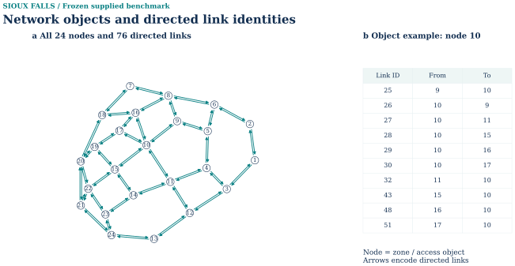</a></td></tr>
<tr><td width="100%" valign="top" align="left">
All supplied node and directed-link identities are retained. Arrows show direction; the adjacent node-10 extract demonstrates link IDs and endpoints without placing 76 labels over the network. The deterministic layout uses schematic coordinates.

This schematic contains the complete 24-node, 76-directed-link network; node positions use schematic coordinates. Static BPR/Beckmann assignment and finite time-expanded computation use distinct contracts.

<strong>Source data and preparation</strong>

Frozen classic 24-node/76-link source graph and supplied vehicle OD.

<a href="https://scholarhaozheng.github.io/mobility-network-lab/volumes/sioux-falls.html#src-docs-cases-sioux-falls-document-gmns-zones-and-source-evidence">Evidence</a> · <a href="https://scholarhaozheng.github.io/mobility-network-lab/assets/atlas/figures/g-f151.svg">Full figure</a>

<strong>GMNS network, zones and access</strong> 

24-node, 76-link supplied directed benchmark.

<a href="https://scholarhaozheng.github.io/mobility-network-lab/volumes/sioux-falls.html#src-docs-cases-sioux-falls-document-gmns-zones-and-source-evidence">Evidence</a> · <a href="https://scholarhaozheng.github.io/mobility-network-lab/assets/atlas/figures/g-f151.svg">Full figure</a>

<strong>Classic network topology</strong> 

Network · 24-node / 76-link

<a href="https://scholarhaozheng.github.io/mobility-network-lab/volumes/sioux-falls.html#src-docs-cases-sioux-falls-document-gmns-zones-and-source-evidence">Evidence</a> · <a href="https://scholarhaozheng.github.io/mobility-network-lab/assets/atlas/figures/g-f151.svg">Full figure</a>

</td></tr>
<tr><td width="100%" valign="top" align="left">
<a href="https://scholarhaozheng.github.io/mobility-network-lab/volumes/sioux-falls.html#stage-02-gmns-network-and-access--g-f151">Complete evidence</a> · <a href="https://scholarhaozheng.github.io/mobility-network-lab/assets/atlas/figures/g-f151.svg">Full figure</a>

Source records
<ul><li><a href="https://github.com/scholarhaozheng/mobility-network-lab/blob/6ce18b8bea5bf3b9b7caa6ee4c0ff4e701a34a8b/examples/sioux-falls/native_l3_r1/inputs_snapshot/SiouxFalls/link.csv" title="examples/sioux-falls/native_l3_r1/inputs_snapshot/SiouxFalls/link.csv">link.csv</a></li></ul>

<a href="https://scholarhaozheng.github.io/mobility-network-lab/reproduce.html?figure=G-F151">Data &amp; preparation</a>
</td></tr>
</table>

#### Static assignment methods

<strong>Frank–Wolfe</strong> 

528-OD historical approximate result; saved objective and gap

<a href="https://scholarhaozheng.github.io/mobility-network-lab/volumes/sioux-falls.html#src-docs-datasets-sioux-static-fw-document">Evidence</a> · <a href="https://scholarhaozheng.github.io/mobility-network-lab/volumes/sioux-falls.html#coverage-row-10">Evidence table</a>

##### Static assignment results — one card per method

Historical approximate Frank–Wolfe, official tap-b Algorithm B, the B_BECKMANN finite-path candidate, and the A_REG001 native L3 candidate are separate saved computations. The latter uses gamma = 0.01; its residual is path-to-link reconstruction consistency. The historical FW vector is retained, but its original run-time demand identity has not been independently re-established.

<table width="100%">
<tr><th width="33%" valign="top" align="left"><strong>Historical Frank–Wolfe physical-link flow</strong></th><th width="33%" valign="top" align="left"><strong>Algorithm B physical-link flow</strong></th><th width="33%" valign="top" align="left"><strong>Finite-path candidate: flow and distribution</strong></th></tr>
<tr><td width="33%" valign="top" align="left"><a href="https://scholarhaozheng.github.io/mobility-network-lab/volumes/sioux-falls.html#stage-10-frank-wolfe--c-sioux-fw-static">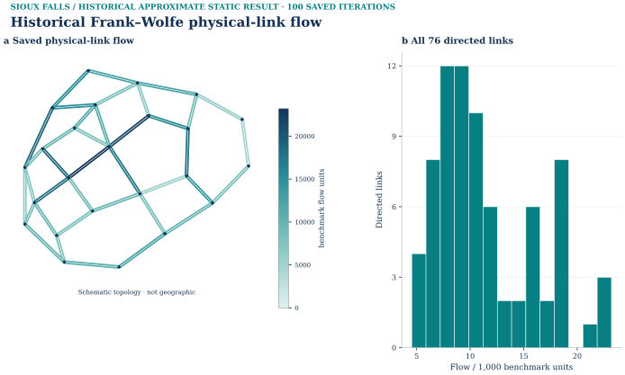</a></td><td width="33%" valign="top" align="left"><a href="https://scholarhaozheng.github.io/mobility-network-lab/volumes/sioux-falls.html#stage-11-algorithm-b--g-f160">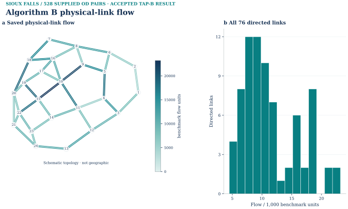</a></td><td width="33%" valign="top" align="left"><a href="https://scholarhaozheng.github.io/mobility-network-lab/volumes/sioux-falls.html#stage-12-finite-path-reference--c-sioux-finite-static">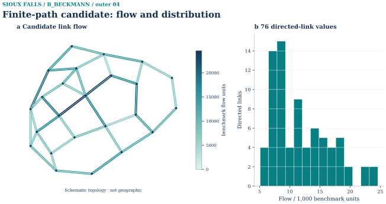</a></td></tr>
<tr><td width="33%" valign="top" align="left">
Historical approximate Sioux Falls static Frank–Wolfe result, with 100 saved iterations. The map and distribution use the same 76 saved physical-link volumes; node positions are schematic. The source table SHA-256 and all 76 directed link IDs/endpoints were verified against the saved audit/topology. The Beckmann objective recomputed from this table is 4,236,715.140437842. The public result record describes 528 OD records and total provided demand 360,600, but runtime OD-file hashes and complete OD/path disaggregation were not preserved. Runtime demand-byte identity remains unverified. This approximate historical result lacks preserved demand-byte identity and high-precision UE certification.
</td><td width="33%" valign="top" align="left">
Official tap-b Algorithm B on the supplied 528-OD Sioux benchmark. The map and distribution use the same 76 physical-link volumes from the independently evaluated accepted output. Node positions use schematic coordinates. The 200/250-OD finite experiments use separate instances; demand-byte identity with historical FW remains unverified.

<strong>Official tap-b Algorithm B</strong> 

Official TAPLab registered-adapter parity passes on Sioux Falls.

<a href="https://scholarhaozheng.github.io/mobility-network-lab/volumes/sioux-falls.html#src-docs-cases-sioux-algorithm-b-document">Evidence</a> · <a href="https://scholarhaozheng.github.io/mobility-network-lab/assets/atlas/card-layout/g-f160.svg">Full figure</a>

</td><td width="33%" valign="top" align="left">
B_BECKMANN outer-04 candidate on the frozen 2,218-path representation. The map and distribution use saved explicit_v on all 76 directed links. Node coordinates are schematic. Its full-network relative cost gap is 4.381867%; this is a finite-path candidate.

<strong>Finite-path reference</strong> 

Frozen 2,218-path B_BECKMANN native candidate; full-network UE remains uncertified.

<a href="https://scholarhaozheng.github.io/mobility-network-lab/volumes/sioux-falls.html#src-docs-cases-sioux-falls-document-static-assignment">Evidence</a> · <a href="https://scholarhaozheng.github.io/mobility-network-lab/assets/atlas/figures/c-sioux-finite-static.svg">Full figure</a>

</td></tr>
<tr><td width="33%" valign="top" align="left">
<a href="https://scholarhaozheng.github.io/mobility-network-lab/volumes/sioux-falls.html#stage-10-frank-wolfe--c-sioux-fw-static">Complete evidence</a> · <a href="https://scholarhaozheng.github.io/mobility-network-lab/assets/atlas/card-layout/c-sioux-fw-static.svg">Full figure</a>

Source records
<ul><li><a href="https://github.com/scholarhaozheng/mobility-network-lab/blob/6ce18b8bea5bf3b9b7caa6ee4c0ff4e701a34a8b/examples/sioux-falls/native_l3_r1/inputs_snapshot/SiouxFalls/link.csv" title="examples/sioux-falls/native_l3_r1/inputs_snapshot/SiouxFalls/link.csv">link.csv</a></li><li><a href="https://github.com/scholarhaozheng/mobility-network-lab/blob/6ce18b8bea5bf3b9b7caa6ee4c0ff4e701a34a8b/docs/datasets/sioux-static-fw.md" title="docs/datasets/sioux-static-fw.md">sioux-static-fw.md</a></li></ul>

<a href="https://scholarhaozheng.github.io/mobility-network-lab/reproduce.html?figure=C-SIOUX-FW-STATIC">Data &amp; reproduction</a>
</td><td width="33%" valign="top" align="left">
<a href="https://scholarhaozheng.github.io/mobility-network-lab/volumes/sioux-falls.html#stage-11-algorithm-b--g-f160">Complete evidence</a> · <a href="https://scholarhaozheng.github.io/mobility-network-lab/assets/atlas/card-layout/g-f160.svg">Full figure</a>

Source records
<ul><li><a href="https://github.com/scholarhaozheng/mobility-network-lab/blob/6ce18b8bea5bf3b9b7caa6ee4c0ff4e701a34a8b/examples/sioux-falls/native_l3_r1/inputs_snapshot/SiouxFalls/link.csv" title="examples/sioux-falls/native_l3_r1/inputs_snapshot/SiouxFalls/link.csv">link.csv</a></li><li><a href="https://github.com/scholarhaozheng/mobility-network-lab/blob/6ce18b8bea5bf3b9b7caa6ee4c0ff4e701a34a8b/algorithms/origin_based_algorithm_b/accepted_results/sioux_physical_link_flow.csv" title="algorithms/origin_based_algorithm_b/accepted_results/sioux_physical_link_flow.csv">sioux_physical_link_flow.csv</a></li><li><a href="https://github.com/scholarhaozheng/mobility-network-lab/blob/6ce18b8bea5bf3b9b7caa6ee4c0ff4e701a34a8b/algorithms/origin_based_algorithm_b/accepted_results/sioux_evaluation.json" title="algorithms/origin_based_algorithm_b/accepted_results/sioux_evaluation.json">sioux_evaluation.json</a></li></ul>

<a href="https://scholarhaozheng.github.io/mobility-network-lab/reproduce.html?figure=G-F160">Data &amp; reproduction</a>
</td><td width="33%" valign="top" align="left">
<a href="https://scholarhaozheng.github.io/mobility-network-lab/volumes/sioux-falls.html#stage-12-finite-path-reference--c-sioux-finite-static">Complete evidence</a> · <a href="https://scholarhaozheng.github.io/mobility-network-lab/assets/atlas/figures/c-sioux-finite-static.svg">Full figure</a>

Source records
<ul><li><a href="https://github.com/scholarhaozheng/mobility-network-lab/blob/6ce18b8bea5bf3b9b7caa6ee4c0ff4e701a34a8b/examples/sioux-falls/native_l3_r1/inputs_snapshot/SiouxFalls/link.csv" title="examples/sioux-falls/native_l3_r1/inputs_snapshot/SiouxFalls/link.csv">link.csv</a></li><li><a href="https://github.com/scholarhaozheng/mobility-network-lab/blob/6ce18b8bea5bf3b9b7caa6ee4c0ff4e701a34a8b/examples/sioux-falls/native_l3_r1/runs/SiouxFalls/B_BECKMANN/outer_04_link_flows.csv" title="examples/sioux-falls/native_l3_r1/runs/SiouxFalls/B_BECKMANN/outer_04_link_flows.csv">outer_04_link_flows.csv</a></li><li><a href="https://github.com/scholarhaozheng/mobility-network-lab/blob/6ce18b8bea5bf3b9b7caa6ee4c0ff4e701a34a8b/examples/sioux-falls/native_l3_r1/runs/SiouxFalls/B_BECKMANN/outer_04_check.json" title="examples/sioux-falls/native_l3_r1/runs/SiouxFalls/B_BECKMANN/outer_04_check.json">outer_04_check.json</a></li></ul>

<a href="https://scholarhaozheng.github.io/mobility-network-lab/reproduce.html?figure=C-SIOUX-FINITE-STATIC">Data &amp; reproduction</a>
</td></tr>
<tr><th width="33%" valign="top" align="left"><strong>Native L3 reconstruction and consistency residual</strong></th><td colspan="2" width="67%"></td></tr>
<tr><td width="33%" valign="top" align="left"><a href="https://scholarhaozheng.github.io/mobility-network-lab/volumes/sioux-falls.html#stage-13-native-l3--g-f164">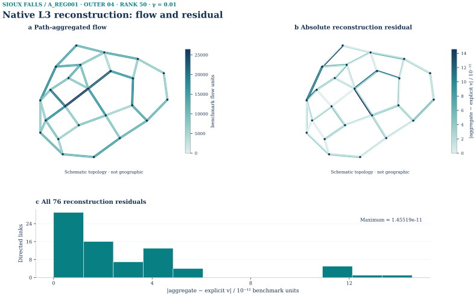</a></td><td colspan="2" width="67%"></td></tr>
<tr><td width="33%" valign="top" align="left">
A_REG001 outer-04 saved path aggregation and its absolute difference from the explicit link variable. The residual measures reconstruction consistency against the explicit link variable. The rank-50 regularized candidate has gamma = 0.01 and full-network relative cost gap 8.167461%. All 76 links are included. The nonnegative residual map and distribution use an explicit 10⁻¹² scaling, preserving the maximum absolute residual 1.4551915228366852e-11 benchmark units.
</td><td colspan="2" width="67%"></td></tr>
<tr><td width="33%" valign="top" align="left">
<a href="https://scholarhaozheng.github.io/mobility-network-lab/volumes/sioux-falls.html#stage-13-native-l3--g-f164">Complete evidence</a> · <a href="https://scholarhaozheng.github.io/mobility-network-lab/assets/atlas/card-layout/g-f164.svg">Full figure</a>

Source records
<ul><li><a href="https://github.com/scholarhaozheng/mobility-network-lab/blob/6ce18b8bea5bf3b9b7caa6ee4c0ff4e701a34a8b/examples/sioux-falls/native_l3_r1/inputs_snapshot/SiouxFalls/link.csv" title="examples/sioux-falls/native_l3_r1/inputs_snapshot/SiouxFalls/link.csv">link.csv</a></li><li><a href="https://github.com/scholarhaozheng/mobility-network-lab/blob/6ce18b8bea5bf3b9b7caa6ee4c0ff4e701a34a8b/examples/sioux-falls/native_l3_r1/runs/SiouxFalls/A_REG001/outer_04_link_flows.csv" title="examples/sioux-falls/native_l3_r1/runs/SiouxFalls/A_REG001/outer_04_link_flows.csv">outer_04_link_flows.csv</a></li><li><a href="https://github.com/scholarhaozheng/mobility-network-lab/blob/6ce18b8bea5bf3b9b7caa6ee4c0ff4e701a34a8b/examples/sioux-falls/native_l3_r1/runs/SiouxFalls/A_REG001/outer_04_check.json" title="examples/sioux-falls/native_l3_r1/runs/SiouxFalls/A_REG001/outer_04_check.json">outer_04_check.json</a></li></ul>

<a href="https://scholarhaozheng.github.io/mobility-network-lab/reproduce.html?figure=G-F164">Data &amp; reproduction</a>
</td><td colspan="2" width="67%"></td></tr>
</table>

##### Algorithm B

528 ODs · convergence and reconstruction diagnostics

These three cards inspect the same Algorithm B evidence family: the saved convergence trace, its historical FW comparison, and an origin-specific reconstruction from OD paths. These three panels diagnose Algorithm B.

<table width="100%">
<tr><th width="33%" valign="top" align="left"><strong>Algorithm B convergence</strong></th><th width="33%" valign="top" align="left"><strong>Algorithm B versus the saved FW reference</strong></th><th width="33%" valign="top" align="left"><strong>Selected-origin flow reconstructed from OD paths</strong></th></tr>
<tr><td width="33%" valign="top" align="left"><a href="https://scholarhaozheng.github.io/mobility-network-lab/volumes/sioux-falls.html#stage-11-algorithm-b--g-f060">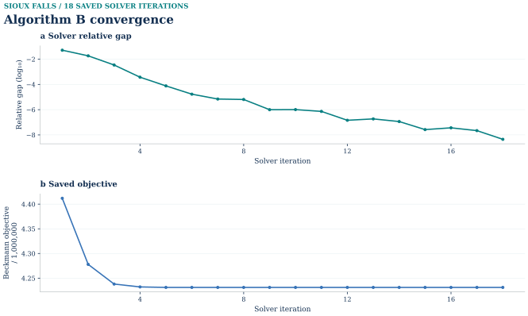</a></td><td width="33%" valign="top" align="left"><a href="https://scholarhaozheng.github.io/mobility-network-lab/volumes/sioux-falls.html#stage-11-algorithm-b--g-f061">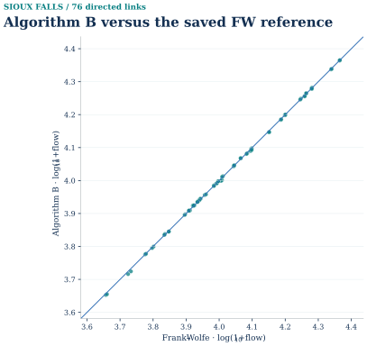</a></td><td width="33%" valign="top" align="left"><a href="https://scholarhaozheng.github.io/mobility-network-lab/volumes/sioux-falls.html#stage-11-algorithm-b--g-f063">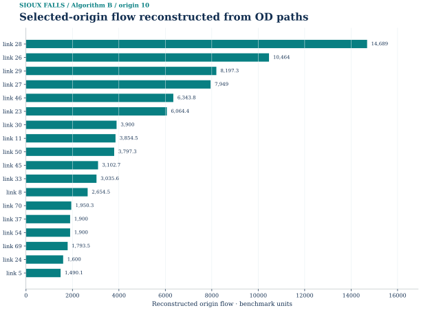</a></td></tr>
<tr><td width="33%" valign="top" align="left">
Native tap-b trace preserved from the accepted vector panel. The two polylines retain all 18 stored points and are redrawn at source SVG coordinate/tick precision; they are not newly recomputed solver histories. Log10 relative gap and Beckmann objective retain separate axes and units. The separately evaluated final relative gap is approximately 4.5 × 10⁻9.
</td><td width="33%" valign="top" align="left">
The 76 accepted SVG scatter points are reframed at their saved display precision. Both axes show log10(1 + benchmark flow); the diagonal denotes equality. The FW comparator is the historical saved reference; this redraw neither reconstructs a missing FW link table nor establishes additional input-identity guarantees.
</td><td width="33%" valign="top" align="left">
Origin 10: the top 18 directed physical links by flow reconstructed from exported tap-b OD paths. Values are the labels preserved in the accepted source SVG, at that figure’s displayed precision. This panel reconstructs flow from OD paths.
</td></tr>
<tr><td width="33%" valign="top" align="left">
<a href="https://scholarhaozheng.github.io/mobility-network-lab/volumes/sioux-falls.html#stage-11-algorithm-b--g-f060">Complete evidence</a> · <a href="https://scholarhaozheng.github.io/mobility-network-lab/assets/atlas/card-layout/g-f060.svg">Full figure</a>

Source records
<ul><li><a href="https://github.com/scholarhaozheng/mobility-network-lab/blob/6ce18b8bea5bf3b9b7caa6ee4c0ff4e701a34a8b/algorithms/origin_based_algorithm_b/figures/sioux_convergence.svg" title="algorithms/origin_based_algorithm_b/figures/sioux_convergence.svg">sioux_convergence.svg</a></li><li><a href="https://github.com/scholarhaozheng/mobility-network-lab/blob/6ce18b8bea5bf3b9b7caa6ee4c0ff4e701a34a8b/algorithms/origin_based_algorithm_b/accepted_results/sioux_evaluation.json" title="algorithms/origin_based_algorithm_b/accepted_results/sioux_evaluation.json">sioux_evaluation.json</a></li></ul>

<a href="https://scholarhaozheng.github.io/mobility-network-lab/reproduce.html?figure=G-F060">Data &amp; reproduction</a>
</td><td width="33%" valign="top" align="left">
<a href="https://scholarhaozheng.github.io/mobility-network-lab/volumes/sioux-falls.html#stage-11-algorithm-b--g-f061">Complete evidence</a> · <a href="https://scholarhaozheng.github.io/mobility-network-lab/assets/atlas/figures/g-f061.svg">Full figure</a>

Source records
<ul><li><a href="https://github.com/scholarhaozheng/mobility-network-lab/blob/6ce18b8bea5bf3b9b7caa6ee4c0ff4e701a34a8b/algorithms/origin_based_algorithm_b/accepted_results/sioux_physical_link_flow.csv" title="algorithms/origin_based_algorithm_b/accepted_results/sioux_physical_link_flow.csv">sioux_physical_link_flow.csv</a></li><li><a href="https://github.com/scholarhaozheng/mobility-network-lab/blob/6ce18b8bea5bf3b9b7caa6ee4c0ff4e701a34a8b/algorithms/origin_based_algorithm_b/figures/sioux_fw_flow.svg" title="algorithms/origin_based_algorithm_b/figures/sioux_fw_flow.svg">sioux_fw_flow.svg</a></li><li><a href="https://github.com/scholarhaozheng/mobility-network-lab/blob/6ce18b8bea5bf3b9b7caa6ee4c0ff4e701a34a8b/tools/visuals/render_algorithm_b_fw_compact.py" title="tools/visuals/render_algorithm_b_fw_compact.py">render_algorithm_b_fw_compact.py</a></li></ul>

<a href="https://scholarhaozheng.github.io/mobility-network-lab/reproduce.html?figure=G-F061">Data &amp; reproduction</a>
</td><td width="33%" valign="top" align="left">
<a href="https://scholarhaozheng.github.io/mobility-network-lab/volumes/sioux-falls.html#stage-11-algorithm-b--g-f063">Complete evidence</a> · <a href="https://scholarhaozheng.github.io/mobility-network-lab/assets/atlas/figures/g-f063.svg">Full figure</a>

Source records
<ul><li><a href="https://github.com/scholarhaozheng/mobility-network-lab/blob/6ce18b8bea5bf3b9b7caa6ee4c0ff4e701a34a8b/algorithms/origin_based_algorithm_b/figures/sioux_origin_flow.svg" title="algorithms/origin_based_algorithm_b/figures/sioux_origin_flow.svg">sioux_origin_flow.svg</a></li></ul>

<a href="https://scholarhaozheng.github.io/mobility-network-lab/reproduce.html?figure=G-F063">Data &amp; reproduction</a>
</td></tr>
</table>

<strong>Native Diagnostic L3 / compression</strong> 

rank-50 diagnostic; full-network gap 8.167461%

<a href="https://scholarhaozheng.github.io/mobility-network-lab/volumes/sioux-falls.html#src-docs-cases-sioux-falls-document-static-assignment">Evidence</a> · <a href="https://scholarhaozheng.github.io/mobility-network-lab/volumes/sioux-falls.html#coverage-row-13">Evidence table</a>

Static BPR/Beckmann assignment and the fixed-cost, hard-capacity time-expanded optimization below are independent mathematical branches. The next table shows the latter's graph representation, which also supports its arc-flow LP and applicable decomposition methods; example paths and generated columns appear as recorded outputs.

#### Time-expanded network and path examples

<table width="100%">
<tr><th width="50%" valign="top" align="left"><strong>Time-expanded network in layers</strong></th><th width="50%" valign="top" align="left"><strong>Local construction details</strong></th></tr>
<tr><td width="50%" valign="top" align="left"><a href="https://scholarhaozheng.github.io/mobility-network-lab/volumes/sioux-falls.html#stage-14-layered-construction--r07-sioux-layered-construction">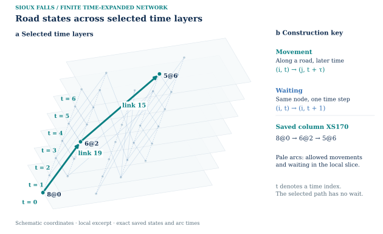</a></td><td width="50%" valign="top" align="left"><a href="https://scholarhaozheng.github.io/mobility-network-lab/volumes/sioux-falls.html#stage-14-space-time-network-and-columns--g-f114">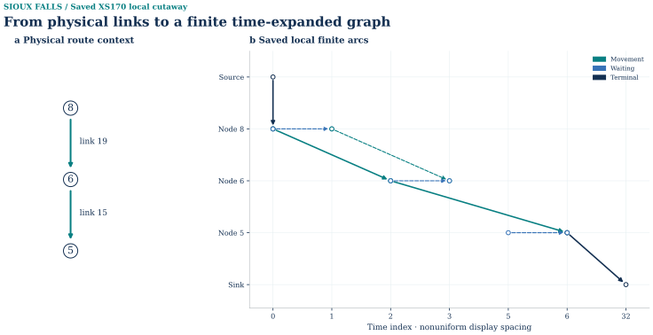</a></td></tr>
<tr><td width="50%" valign="top" align="left">
The shared XS170 example follows nodes 8 → 6 → 5 at t0 → t2 → t6. Faint arcs show allowed movement and waiting connections; the selected path contains no wait. This local example is shared by the separate 200-OD and 250-OD instances.

<strong>Selected time layers</strong> 

XS170 selected-layer example.

<a href="https://scholarhaozheng.github.io/mobility-network-lab/volumes/sioux-falls.html#src-docs-cases-sioux-space-time-document-from-the-physical-network-to-the-finite-time-expanded-graph">Evidence</a> · <a href="https://scholarhaozheng.github.io/mobility-network-lab/assets/atlas/construction/r07-sioux-layered-construction.svg">Full figure</a>

</td><td width="50%" valign="top" align="left">
Source-matched XS170 local construction example with physical links 19 and 15, movement arcs, alternative waiting arcs, and terminal connectors. Time positions are deliberately nonuniform for legibility; sink time 32 is a bookkeeping state. This local cutaway is shared by the recorded 200/250-OD experiments.

<strong>Physical network to finite graph</strong> 

Selected finite graph for the historical cases.

<a href="https://scholarhaozheng.github.io/mobility-network-lab/volumes/sioux-falls.html#src-docs-cases-sioux-space-time-document-from-the-physical-network-to-the-finite-time-expanded-graph">Evidence</a> · <a href="https://scholarhaozheng.github.io/mobility-network-lab/assets/atlas/figures/g-f114.svg">Full figure</a>

</td></tr>
<tr><td width="50%" valign="top" align="left">
<a href="https://scholarhaozheng.github.io/mobility-network-lab/volumes/sioux-falls.html#stage-14-layered-construction--r07-sioux-layered-construction">Complete evidence</a> · <a href="https://scholarhaozheng.github.io/mobility-network-lab/assets/atlas/construction/r07-sioux-layered-construction.svg">Full figure</a>

Source records
<ul><li><a href="https://github.com/scholarhaozheng/mobility-network-lab/blob/6ce18b8bea5bf3b9b7caa6ee4c0ff4e701a34a8b/docs/assets/presentation_r3/DISPLAY_MODEL.json" title="docs/assets/presentation_r3/DISPLAY_MODEL.json">DISPLAY_MODEL.json</a></li><li><a href="https://github.com/scholarhaozheng/mobility-network-lab/blob/6ce18b8bea5bf3b9b7caa6ee4c0ff4e701a34a8b/docs/assets/presentation_r3/FIGURE_PROVENANCE.json" title="docs/assets/presentation_r3/FIGURE_PROVENANCE.json">FIGURE_PROVENANCE.json</a></li><li><a href="https://github.com/scholarhaozheng/mobility-network-lab/blob/6ce18b8bea5bf3b9b7caa6ee4c0ff4e701a34a8b/docs/assets/three_city_r2/data/sioux_construction_edges.csv" title="docs/assets/three_city_r2/data/sioux_construction_edges.csv">sioux_construction_edges.csv</a></li></ul>
</td><td width="50%" valign="top" align="left">
<a href="https://scholarhaozheng.github.io/mobility-network-lab/volumes/sioux-falls.html#stage-14-space-time-network-and-columns--g-f114">Complete evidence</a> · <a href="https://scholarhaozheng.github.io/mobility-network-lab/assets/atlas/figures/g-f114.svg">Full figure</a>

Source records
<ul><li><a href="https://github.com/scholarhaozheng/mobility-network-lab/blob/6ce18b8bea5bf3b9b7caa6ee4c0ff4e701a34a8b/docs/assets/three_city_r2/data/sioux_construction_edges.csv" title="docs/assets/three_city_r2/data/sioux_construction_edges.csv">sioux_construction_edges.csv</a></li></ul>

<a href="https://scholarhaozheng.github.io/mobility-network-lab/reproduce.html?figure=G-F114">Data &amp; preparation</a>
</td></tr>
</table>

#### Optimization on the time-expanded network

Both selected instances are shown below: each method has a separate **200-OD row** and **250-OD row**. Their inputs, results and reference LPs remain separate.

##### Two-phase column generation

Historical selected graph · 200 ODs

The three views show Phase I clearance, a recorded shared-capacity exchange and final physical-link movement flows. The reference is the arc-flow LP on this instance’s own selected graph. Independent full-DAG pricing closure has not been established.

<table width="100%">
<tr><th colspan="3" align="left">200 ODs</th></tr>
<tr><th width="33%" valign="top" align="left"><strong>Phase I: artificial-flow clearance</strong></th><th width="33%" valign="top" align="left"><strong>Shared-capacity exchange</strong></th><th width="33%" valign="top" align="left"><strong>Final physical-link movement flow</strong></th></tr>
<tr><td width="33%" valign="top" align="left"><a href="https://scholarhaozheng.github.io/mobility-network-lab/volumes/sioux-falls.html#figure-r05-sioux200-cg-phase1">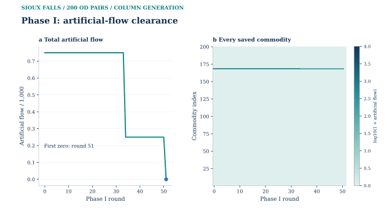</a></td><td width="33%" valign="top" align="left"></td><td width="33%" valign="top" align="left"><a href="https://scholarhaozheng.github.io/mobility-network-lab/volumes/sioux-falls.html#figure-r05-sioux200-cg-flows">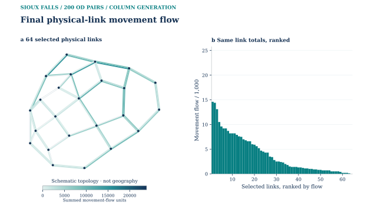</a></td></tr>
<tr><td width="33%" valign="top" align="left">
The 200-OD saved restricted-master history reaches zero total artificial flow at round 51. Every saved commodity and round is included; commodity order follows numeric XS IDs. The heatmap uses log10(1 + flow), preserving zero. These feasibility traces do not establish independent full-DAG pricing closure.
</td><td width="33%" valign="top" align="left">
At saved Phase I round 34 of the 200-OD run, XS170 releases 500 units on xs_link21_t1 and XS169 takes the same capacity. XS169 artificial flow decreases by 500 while total arc use remains 5,050.193. These before/after restricted-master optima document an exchange; they do not prove that the new XS170 column was uniquely necessary.
</td><td width="33%" valign="top" align="left">
The 200-OD saved final-capacity audit is summed over time by physical_link_id, yielding 64 selected directed physical-link totals. The map and ranked distribution show those same totals, including zero-flow selected links. Grey links show context outside the selected graph. Both scale views use one common absolute-flow range. No new pricing-closure certificate is implied.
</td></tr>
<tr><td width="33%" valign="top" align="left">
<a href="https://scholarhaozheng.github.io/mobility-network-lab/assets/atlas/sioux-scale/r05-sioux200-cg-phase1.svg">Full figure</a> · <a href="https://scholarhaozheng.github.io/mobility-network-lab/volumes/sioux-falls.html#figure-r05-sioux200-cg-phase1">Complete evidence</a> · <a href="https://scholarhaozheng.github.io/mobility-network-lab/reproduce.html#sioux-cg-200">Data &amp; reproduction</a>

Published source records
<ul><li><a href="https://github.com/scholarhaozheng/mobility-network-lab/blob/6ce18b8bea5bf3b9b7caa6ee4c0ff4e701a34a8b/docs/assets/sioux/phase_i_r1/data/200_phase_i_trace.csv" title="docs/assets/sioux/phase_i_r1/data/200_phase_i_trace.csv">200_phase_i_trace.csv</a></li></ul>
</td><td width="33%" valign="top" align="left">
<a href="https://scholarhaozheng.github.io/mobility-network-lab/assets/atlas/sioux-scale/r05-sioux200-cg-exchange.svg">Full figure</a> · <a href="https://scholarhaozheng.github.io/mobility-network-lab/volumes/sioux-falls.html#figure-r05-sioux200-cg-exchange">Complete evidence</a> · <a href="https://scholarhaozheng.github.io/mobility-network-lab/reproduce.html#sioux-cg-200">Data &amp; reproduction</a>

Published source records
<ul><li><a href="https://github.com/scholarhaozheng/mobility-network-lab/blob/6ce18b8bea5bf3b9b7caa6ee4c0ff4e701a34a8b/docs/assets/presentation_r5/data/sioux_shared_capacity_saved.csv" title="docs/assets/presentation_r5/data/sioux_shared_capacity_saved.csv">sioux_shared_capacity_saved.csv</a></li><li><a href="https://github.com/scholarhaozheng/mobility-network-lab/blob/6ce18b8bea5bf3b9b7caa6ee4c0ff4e701a34a8b/docs/assets/presentation_r5/SIOUX_CAPACITY_CANONICAL_SOURCES.json" title="docs/assets/presentation_r5/SIOUX_CAPACITY_CANONICAL_SOURCES.json">SIOUX_CAPACITY_CANONICAL_SOURCES.json</a></li></ul>
</td><td width="33%" valign="top" align="left">
<a href="https://scholarhaozheng.github.io/mobility-network-lab/assets/atlas/sioux-scale/r05-sioux200-cg-flows.svg">Full figure</a> · <a href="https://scholarhaozheng.github.io/mobility-network-lab/volumes/sioux-falls.html#figure-r05-sioux200-cg-flows">Complete evidence</a> · <a href="https://scholarhaozheng.github.io/mobility-network-lab/reproduce.html#sioux-cg-200">Data &amp; reproduction</a>

Published source records
<ul><li><a href="https://github.com/scholarhaozheng/mobility-network-lab/blob/6ce18b8bea5bf3b9b7caa6ee4c0ff4e701a34a8b/examples/sioux-falls/native_l3_r1/inputs_snapshot/SiouxFalls/link.csv" title="examples/sioux-falls/native_l3_r1/inputs_snapshot/SiouxFalls/link.csv">link.csv</a></li></ul>
</td></tr>
</table>

[Arc-flow LP reference](https://scholarhaozheng.github.io/mobility-network-lab/volumes/sioux-falls.html#src-docs-cases-sioux-space-time-document-reference-objective-agreement) · [Phase II objective records](https://scholarhaozheng.github.io/mobility-network-lab/volumes/sioux-falls.html#src-docs-cases-sioux-space-time-document-phase-ii-improves-the-real-path-objective) · [Complete city evidence](https://scholarhaozheng.github.io/mobility-network-lab/volumes/sioux-falls.html#coverage-row-16)

Historical selected graph · 250 ODs

The three views show Phase I clearance, a recorded shared-capacity exchange and final physical-link movement flows. The reference is the arc-flow LP on this instance’s own selected graph. Independent full-DAG pricing closure has not been established.

<table width="100%">
<tr><th colspan="3" align="left">250 ODs</th></tr>
<tr><th width="33%" valign="top" align="left"><strong>Phase I: artificial-flow clearance</strong></th><th width="33%" valign="top" align="left"><strong>Shared-capacity exchange</strong></th><th width="33%" valign="top" align="left"><strong>Final physical-link movement flow</strong></th></tr>
<tr><td width="33%" valign="top" align="left"><a href="https://scholarhaozheng.github.io/mobility-network-lab/volumes/sioux-falls.html#figure-r05-sioux250-cg-phase1">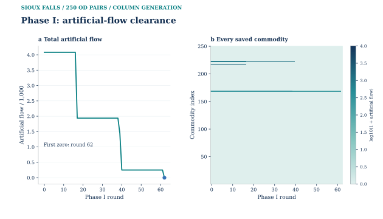</a></td><td width="33%" valign="top" align="left"><a href="https://scholarhaozheng.github.io/mobility-network-lab/volumes/sioux-falls.html#figure-r05-sioux250-cg-exchange">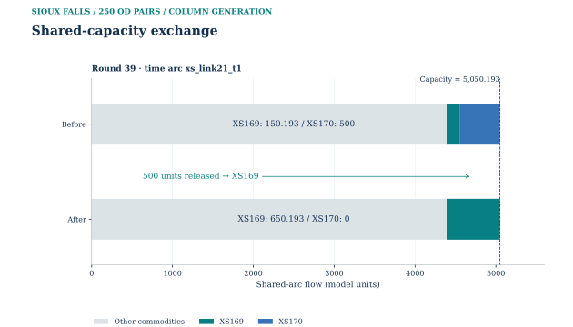</a></td><td width="33%" valign="top" align="left"><a href="https://scholarhaozheng.github.io/mobility-network-lab/volumes/sioux-falls.html#figure-r05-sioux250-cg-flows">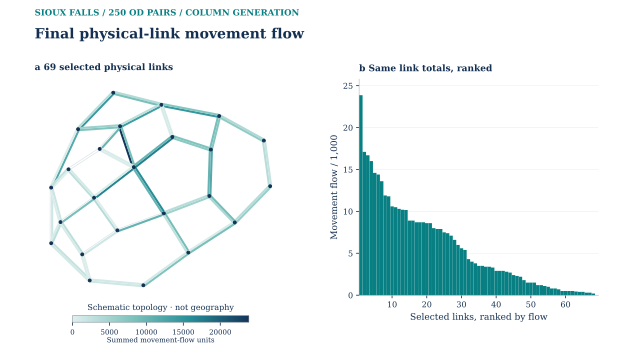</a></td></tr>
<tr><td width="33%" valign="top" align="left">
The 250-OD saved restricted-master history reaches zero total artificial flow at round 62. Every saved commodity and round is included; commodity order follows numeric XS IDs. The heatmap uses log10(1 + flow), preserving zero. These feasibility traces do not establish independent full-DAG pricing closure.
</td><td width="33%" valign="top" align="left">
At saved Phase I round 39 of the 250-OD run, XS170 releases 500 units on xs_link21_t1 and XS169 takes the same capacity. XS169 artificial flow decreases by 500 while total arc use remains 5,050.193. These before/after restricted-master optima document an exchange; they do not prove that the new XS170 column was uniquely necessary.
</td><td width="33%" valign="top" align="left">
The 250-OD saved final-capacity audit is summed over time by physical_link_id, yielding 69 selected directed physical-link totals. The map and ranked distribution show those same totals, including zero-flow selected links. Grey links show context outside the selected graph. Both scale views use one common absolute-flow range. No new pricing-closure certificate is implied.
</td></tr>
<tr><td width="33%" valign="top" align="left">
<a href="https://scholarhaozheng.github.io/mobility-network-lab/assets/atlas/sioux-scale/r05-sioux250-cg-phase1.svg">Full figure</a> · <a href="https://scholarhaozheng.github.io/mobility-network-lab/volumes/sioux-falls.html#figure-r05-sioux250-cg-phase1">Complete evidence</a> · <a href="https://scholarhaozheng.github.io/mobility-network-lab/reproduce.html#sioux-cg-250">Data &amp; reproduction</a>

Published source records
<ul><li><a href="https://github.com/scholarhaozheng/mobility-network-lab/blob/6ce18b8bea5bf3b9b7caa6ee4c0ff4e701a34a8b/docs/assets/sioux/phase_i_r1/data/250_phase_i_trace.csv" title="docs/assets/sioux/phase_i_r1/data/250_phase_i_trace.csv">250_phase_i_trace.csv</a></li></ul>
</td><td width="33%" valign="top" align="left">
<a href="https://scholarhaozheng.github.io/mobility-network-lab/assets/atlas/sioux-scale/r05-sioux250-cg-exchange.svg">Full figure</a> · <a href="https://scholarhaozheng.github.io/mobility-network-lab/volumes/sioux-falls.html#figure-r05-sioux250-cg-exchange">Complete evidence</a> · <a href="https://scholarhaozheng.github.io/mobility-network-lab/reproduce.html#sioux-cg-250">Data &amp; reproduction</a>

Published source records
<ul><li><a href="https://github.com/scholarhaozheng/mobility-network-lab/blob/6ce18b8bea5bf3b9b7caa6ee4c0ff4e701a34a8b/docs/assets/presentation_r5/data/sioux_shared_capacity_saved.csv" title="docs/assets/presentation_r5/data/sioux_shared_capacity_saved.csv">sioux_shared_capacity_saved.csv</a></li><li><a href="https://github.com/scholarhaozheng/mobility-network-lab/blob/6ce18b8bea5bf3b9b7caa6ee4c0ff4e701a34a8b/docs/assets/presentation_r5/SIOUX_CAPACITY_CANONICAL_SOURCES.json" title="docs/assets/presentation_r5/SIOUX_CAPACITY_CANONICAL_SOURCES.json">SIOUX_CAPACITY_CANONICAL_SOURCES.json</a></li></ul>
</td><td width="33%" valign="top" align="left">
<a href="https://scholarhaozheng.github.io/mobility-network-lab/assets/atlas/sioux-scale/r05-sioux250-cg-flows.svg">Full figure</a> · <a href="https://scholarhaozheng.github.io/mobility-network-lab/volumes/sioux-falls.html#figure-r05-sioux250-cg-flows">Complete evidence</a> · <a href="https://scholarhaozheng.github.io/mobility-network-lab/reproduce.html#sioux-cg-250">Data &amp; reproduction</a>

Published source records
<ul><li><a href="https://github.com/scholarhaozheng/mobility-network-lab/blob/6ce18b8bea5bf3b9b7caa6ee4c0ff4e701a34a8b/examples/sioux-falls/native_l3_r1/inputs_snapshot/SiouxFalls/link.csv" title="examples/sioux-falls/native_l3_r1/inputs_snapshot/SiouxFalls/link.csv">link.csv</a></li></ul>
</td></tr>
</table>

[Arc-flow LP reference](https://scholarhaozheng.github.io/mobility-network-lab/volumes/sioux-falls.html#src-docs-cases-sioux-space-time-document-reference-objective-agreement) · [Phase II objective records](https://scholarhaozheng.github.io/mobility-network-lab/volumes/sioux-falls.html#src-docs-cases-sioux-space-time-document-phase-ii-improves-the-real-path-objective) · [Complete city evidence](https://scholarhaozheng.github.io/mobility-network-lab/volumes/sioux-falls.html#coverage-row-16)

##### Lagrangian

P07 · 200 ODs

The three views show bounds, capacity prices at the best dual bound, and path-pool growth with separate primal-recovery LP calls. Each instance retains its own LP reference.

<table width="100%">
<tr><th colspan="3" align="left">200 ODs</th></tr>
<tr><th width="33%" valign="top" align="left"><strong>Lagrangian bounds and certified gap</strong></th><th width="33%" valign="top" align="left"><strong>Capacity prices at the best dual bound</strong></th><th width="33%" valign="top" align="left"><strong>Path-pool growth and primal recovery</strong></th></tr>
<tr><td width="33%" valign="top" align="left"><a href="https://scholarhaozheng.github.io/mobility-network-lab/volumes/sioux-falls.html#figure-r05-sioux200-lagrangian-bounds">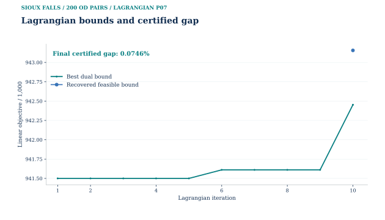</a></td><td width="33%" valign="top" align="left"><a href="https://scholarhaozheng.github.io/mobility-network-lab/volumes/sioux-falls.html#figure-r05-sioux200-lagrangian-prices">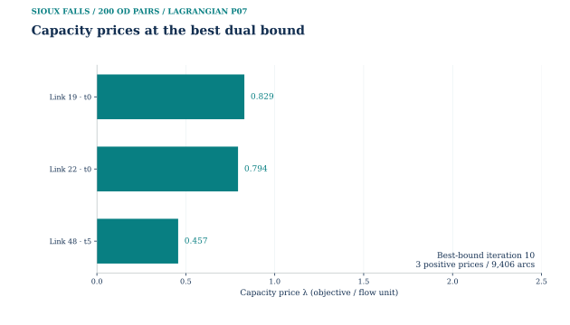</a></td><td width="33%" valign="top" align="left"><a href="https://scholarhaozheng.github.io/mobility-network-lab/volumes/sioux-falls.html#figure-r05-sioux200-lagrangian-recovery">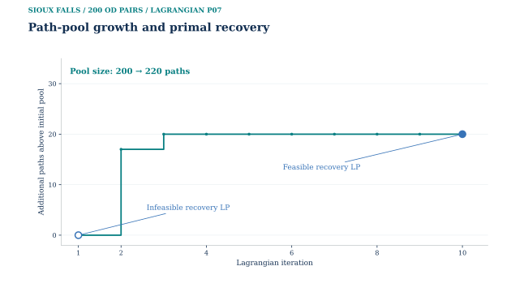</a></td></tr>
<tr><td width="33%" valign="top" align="left">
Saved P07 best-dual bounds for the 200-OD instance and feasible primal recovery when actually available. Early primal bounds appear only where saved. The final independently checked certified gap is 0.0746%. Recovery LP and dual iteration remain distinct operations.
</td><td width="33%" valign="top" align="left">
All 3 positive saved multipliers from the best-dual P07 iterate 10 of the 200-OD instance; the other 9,403 time arcs have zero saved price. Labels identify physical link and departure time index. The two scale views use a shared zero-based price axis. The curves show dual capacity penalties.
</td><td width="33%" valign="top" align="left">
The 200-OD P07 candidate pool grows from 200 to 220 paths. All ten saved pool records are shown. Only iterations 1 and 10 have recorded independent recovery-LP calls: the first is infeasible, and the last feasible. Intermediate recovery feasibility was not tested. Final independently checked capacity and balance violations are zero.
</td></tr>
<tr><td width="33%" valign="top" align="left">
<a href="https://scholarhaozheng.github.io/mobility-network-lab/assets/atlas/sioux-scale/r05-sioux200-lagrangian-bounds.svg">Full figure</a> · <a href="https://scholarhaozheng.github.io/mobility-network-lab/volumes/sioux-falls.html#figure-r05-sioux200-lagrangian-bounds">Complete evidence</a> · <a href="https://scholarhaozheng.github.io/mobility-network-lab/reproduce.html#sioux-lagrangian-p07-200">Data &amp; reproduction</a>

Published source records
<ul><li><a href="https://github.com/scholarhaozheng/mobility-network-lab/blob/6ce18b8bea5bf3b9b7caa6ee4c0ff4e701a34a8b/algorithms/distributed_assignment/lagrangian_r2/figure_data/Sioux_200OD_P07_history.csv" title="algorithms/distributed_assignment/lagrangian_r2/figure_data/Sioux_200OD_P07_history.csv">Sioux_200OD_P07_history.csv</a></li><li><a href="https://github.com/scholarhaozheng/mobility-network-lab/blob/6ce18b8bea5bf3b9b7caa6ee4c0ff4e701a34a8b/algorithms/distributed_assignment/lagrangian_r2/SIOUX_ACCEPTED_RESULT_SUMMARY.csv" title="algorithms/distributed_assignment/lagrangian_r2/SIOUX_ACCEPTED_RESULT_SUMMARY.csv">SIOUX_ACCEPTED_RESULT_SUMMARY.csv</a></li></ul>
</td><td width="33%" valign="top" align="left">
<a href="https://scholarhaozheng.github.io/mobility-network-lab/assets/atlas/sioux-scale/r05-sioux200-lagrangian-prices.svg">Full figure</a> · <a href="https://scholarhaozheng.github.io/mobility-network-lab/volumes/sioux-falls.html#figure-r05-sioux200-lagrangian-prices">Complete evidence</a> · <a href="https://scholarhaozheng.github.io/mobility-network-lab/reproduce.html#sioux-lagrangian-p07-200">Data &amp; reproduction</a>

Published source records
<ul><li><a href="https://github.com/scholarhaozheng/mobility-network-lab/blob/6ce18b8bea5bf3b9b7caa6ee4c0ff4e701a34a8b/algorithms/distributed_assignment/lagrangian_r2/figure_data/Sioux_200OD_P07_history.csv" title="algorithms/distributed_assignment/lagrangian_r2/figure_data/Sioux_200OD_P07_history.csv">Sioux_200OD_P07_history.csv</a></li><li><a href="https://github.com/scholarhaozheng/mobility-network-lab/blob/6ce18b8bea5bf3b9b7caa6ee4c0ff4e701a34a8b/algorithms/distributed_assignment/lagrangian_r2/SIOUX_ACCEPTED_RESULT_SUMMARY.csv" title="algorithms/distributed_assignment/lagrangian_r2/SIOUX_ACCEPTED_RESULT_SUMMARY.csv">SIOUX_ACCEPTED_RESULT_SUMMARY.csv</a></li></ul>
</td><td width="33%" valign="top" align="left">
<a href="https://scholarhaozheng.github.io/mobility-network-lab/assets/atlas/sioux-scale/r05-sioux200-lagrangian-recovery.svg">Full figure</a> · <a href="https://scholarhaozheng.github.io/mobility-network-lab/volumes/sioux-falls.html#figure-r05-sioux200-lagrangian-recovery">Complete evidence</a> · <a href="https://scholarhaozheng.github.io/mobility-network-lab/reproduce.html#sioux-lagrangian-p07-200">Data &amp; reproduction</a>

Published source records
<ul><li><a href="https://github.com/scholarhaozheng/mobility-network-lab/blob/6ce18b8bea5bf3b9b7caa6ee4c0ff4e701a34a8b/algorithms/distributed_assignment/lagrangian_r2/figure_data/Sioux_200OD_P07_history.csv" title="algorithms/distributed_assignment/lagrangian_r2/figure_data/Sioux_200OD_P07_history.csv">Sioux_200OD_P07_history.csv</a></li><li><a href="https://github.com/scholarhaozheng/mobility-network-lab/blob/6ce18b8bea5bf3b9b7caa6ee4c0ff4e701a34a8b/algorithms/distributed_assignment/lagrangian_r2/SIOUX_ACCEPTED_RESULT_SUMMARY.csv" title="algorithms/distributed_assignment/lagrangian_r2/SIOUX_ACCEPTED_RESULT_SUMMARY.csv">SIOUX_ACCEPTED_RESULT_SUMMARY.csv</a></li></ul>
</td></tr>
</table>

P07 · 250 ODs

The three views show bounds, capacity prices at the best dual bound, and path-pool growth with separate primal-recovery LP calls. Each instance retains its own LP reference.

<table width="100%">
<tr><th colspan="3" align="left">250 ODs</th></tr>
<tr><th width="33%" valign="top" align="left"><strong>Lagrangian bounds and certified gap</strong></th><th width="33%" valign="top" align="left"><strong>Capacity prices at the best dual bound</strong></th><th width="33%" valign="top" align="left"><strong>Path-pool growth and primal recovery</strong></th></tr>
<tr><td width="33%" valign="top" align="left"><a href="https://scholarhaozheng.github.io/mobility-network-lab/volumes/sioux-falls.html#figure-r05-sioux250-lagrangian-bounds">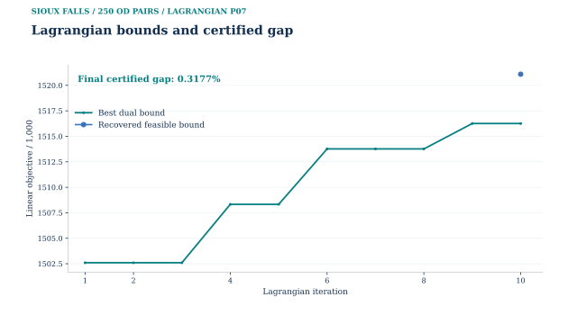</a></td><td width="33%" valign="top" align="left"><a href="https://scholarhaozheng.github.io/mobility-network-lab/volumes/sioux-falls.html#figure-r05-sioux250-lagrangian-prices">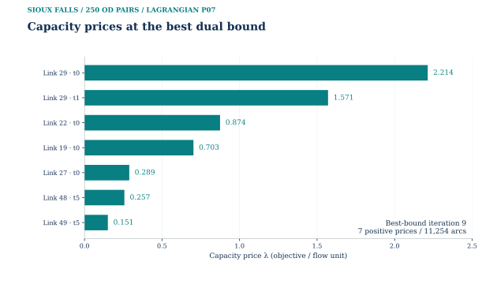</a></td><td width="33%" valign="top" align="left"><a href="https://scholarhaozheng.github.io/mobility-network-lab/volumes/sioux-falls.html#figure-r05-sioux250-lagrangian-recovery">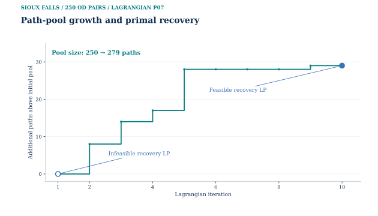</a></td></tr>
<tr><td width="33%" valign="top" align="left">
Saved P07 best-dual bounds for the 250-OD instance and feasible primal recovery when actually available. Early primal bounds appear only where saved. The final independently checked certified gap is 0.3177%. Recovery LP and dual iteration remain distinct operations.
</td><td width="33%" valign="top" align="left">
All 7 positive saved multipliers from the best-dual P07 iterate 9 of the 250-OD instance; the other 11,247 time arcs have zero saved price. Labels identify physical link and departure time index. The two scale views use a shared zero-based price axis. The curves show dual capacity penalties.
</td><td width="33%" valign="top" align="left">
The 250-OD P07 candidate pool grows from 250 to 279 paths. All ten saved pool records are shown. Only iterations 1 and 10 have recorded independent recovery-LP calls: the first is infeasible, and the last feasible. Intermediate recovery feasibility was not tested. Final independently checked capacity and balance violations are zero.
</td></tr>
<tr><td width="33%" valign="top" align="left">
<a href="https://scholarhaozheng.github.io/mobility-network-lab/assets/atlas/sioux-scale/r05-sioux250-lagrangian-bounds.svg">Full figure</a> · <a href="https://scholarhaozheng.github.io/mobility-network-lab/volumes/sioux-falls.html#figure-r05-sioux250-lagrangian-bounds">Complete evidence</a> · <a href="https://scholarhaozheng.github.io/mobility-network-lab/reproduce.html#sioux-lagrangian-p07-250">Data &amp; reproduction</a>

Published source records
<ul><li><a href="https://github.com/scholarhaozheng/mobility-network-lab/blob/6ce18b8bea5bf3b9b7caa6ee4c0ff4e701a34a8b/algorithms/distributed_assignment/lagrangian_r2/figure_data/Sioux_250OD_P07_history.csv" title="algorithms/distributed_assignment/lagrangian_r2/figure_data/Sioux_250OD_P07_history.csv">Sioux_250OD_P07_history.csv</a></li><li><a href="https://github.com/scholarhaozheng/mobility-network-lab/blob/6ce18b8bea5bf3b9b7caa6ee4c0ff4e701a34a8b/algorithms/distributed_assignment/lagrangian_r2/SIOUX_ACCEPTED_RESULT_SUMMARY.csv" title="algorithms/distributed_assignment/lagrangian_r2/SIOUX_ACCEPTED_RESULT_SUMMARY.csv">SIOUX_ACCEPTED_RESULT_SUMMARY.csv</a></li></ul>
</td><td width="33%" valign="top" align="left">
<a href="https://scholarhaozheng.github.io/mobility-network-lab/assets/atlas/sioux-scale/r05-sioux250-lagrangian-prices.svg">Full figure</a> · <a href="https://scholarhaozheng.github.io/mobility-network-lab/volumes/sioux-falls.html#figure-r05-sioux250-lagrangian-prices">Complete evidence</a> · <a href="https://scholarhaozheng.github.io/mobility-network-lab/reproduce.html#sioux-lagrangian-p07-250">Data &amp; reproduction</a>

Published source records
<ul><li><a href="https://github.com/scholarhaozheng/mobility-network-lab/blob/6ce18b8bea5bf3b9b7caa6ee4c0ff4e701a34a8b/algorithms/distributed_assignment/lagrangian_r2/figure_data/Sioux_250OD_P07_history.csv" title="algorithms/distributed_assignment/lagrangian_r2/figure_data/Sioux_250OD_P07_history.csv">Sioux_250OD_P07_history.csv</a></li><li><a href="https://github.com/scholarhaozheng/mobility-network-lab/blob/6ce18b8bea5bf3b9b7caa6ee4c0ff4e701a34a8b/algorithms/distributed_assignment/lagrangian_r2/SIOUX_ACCEPTED_RESULT_SUMMARY.csv" title="algorithms/distributed_assignment/lagrangian_r2/SIOUX_ACCEPTED_RESULT_SUMMARY.csv">SIOUX_ACCEPTED_RESULT_SUMMARY.csv</a></li></ul>
</td><td width="33%" valign="top" align="left">
<a href="https://scholarhaozheng.github.io/mobility-network-lab/assets/atlas/sioux-scale/r05-sioux250-lagrangian-recovery.svg">Full figure</a> · <a href="https://scholarhaozheng.github.io/mobility-network-lab/volumes/sioux-falls.html#figure-r05-sioux250-lagrangian-recovery">Complete evidence</a> · <a href="https://scholarhaozheng.github.io/mobility-network-lab/reproduce.html#sioux-lagrangian-p07-250">Data &amp; reproduction</a>

Published source records
<ul><li><a href="https://github.com/scholarhaozheng/mobility-network-lab/blob/6ce18b8bea5bf3b9b7caa6ee4c0ff4e701a34a8b/algorithms/distributed_assignment/lagrangian_r2/figure_data/Sioux_250OD_P07_history.csv" title="algorithms/distributed_assignment/lagrangian_r2/figure_data/Sioux_250OD_P07_history.csv">Sioux_250OD_P07_history.csv</a></li><li><a href="https://github.com/scholarhaozheng/mobility-network-lab/blob/6ce18b8bea5bf3b9b7caa6ee4c0ff4e701a34a8b/algorithms/distributed_assignment/lagrangian_r2/SIOUX_ACCEPTED_RESULT_SUMMARY.csv" title="algorithms/distributed_assignment/lagrangian_r2/SIOUX_ACCEPTED_RESULT_SUMMARY.csv">SIOUX_ACCEPTED_RESULT_SUMMARY.csv</a></li></ul>
</td></tr>
</table>

##### ADMM

R2_S · 200 ODs

The three views show convergence, commodity conservation over every saved iteration, and final physical-link flows against this instance’s arc-flow LP. Convergence thresholds retain their original units.

<table width="100%">
<tr><th colspan="3" align="left">200 ODs</th></tr>
<tr><th width="33%" valign="top" align="left"><strong>ADMM convergence and feasibility</strong></th><th width="33%" valign="top" align="left"><strong>Commodity conservation across ADMM iterations</strong></th><th width="33%" valign="top" align="left"><strong>ADMM and arc-flow LP: physical-link flow</strong></th></tr>
<tr><td width="33%" valign="top" align="left"><a href="https://scholarhaozheng.github.io/mobility-network-lab/volumes/sioux-falls.html#figure-r05-sioux200-admm-convergence">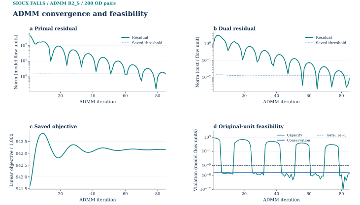</a></td><td width="33%" valign="top" align="left"><a href="https://scholarhaozheng.github.io/mobility-network-lab/volumes/sioux-falls.html#figure-r05-sioux200-admm-conservation">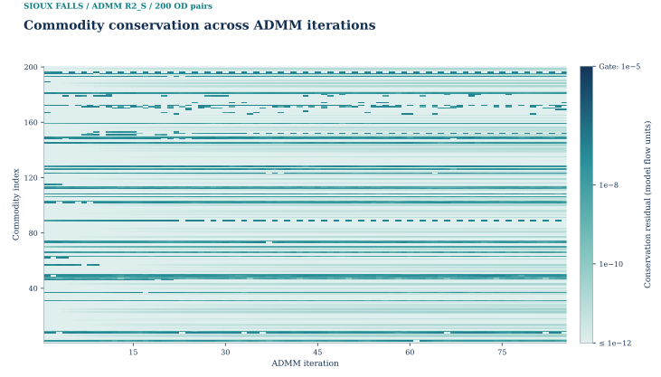</a></td><td width="33%" valign="top" align="left"><a href="https://scholarhaozheng.github.io/mobility-network-lab/volumes/sioux-falls.html#figure-r05-sioux200-admm-flows">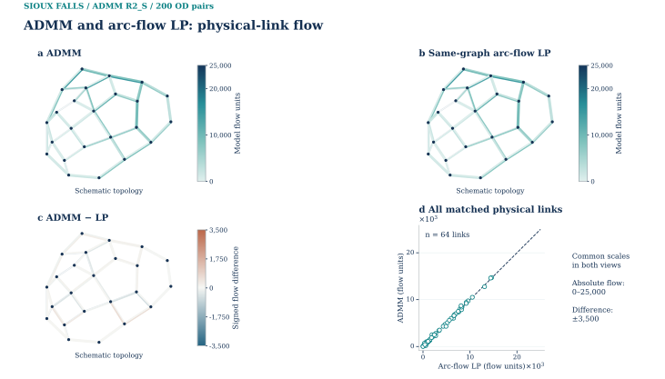</a></td></tr>
<tr><td width="33%" valign="top" align="left">
R2_S 200-OD result: 85 saved iterations. Primal and dual residuals are shown in their respective units against their recorded thresholds. Capacity and commodity conservation use original flow units and the 1e−5 gate. Only the feasibility log display is floored at 1e−12; the rho panel is omitted. This figure reads the accepted 200-OD history directly.
</td><td width="33%" valign="top" align="left">
All 200 commodities over all 85 accepted R2_S iterations. Colours encode original-unit local conservation residuals on the same log scale in both instance views. Values at or below 1e−12 share the floor colour; the upper colour limit is the 1e−5 acceptance gate. The saved maximum is 9.92e-08 model flow units.
</td><td width="33%" valign="top" align="left">
The 200-OD accepted R2_S flow and same-graph arc-flow LP baseline on 64 selected physical links. The maps use shared absolute and signed-difference colour limits across both 200/250-OD views; the scatter includes every matched link with equal x/y scaling. Maximum absolute difference: 600.000 model flow units. Grey links show context outside this selected graph. Coordinates are schematic; objective agreement does not imply identical route or time splits.
</td></tr>
<tr><td width="33%" valign="top" align="left">
<a href="https://scholarhaozheng.github.io/mobility-network-lab/assets/atlas/sioux-scale/r05-sioux200-admm-convergence.svg">Full figure</a> · <a href="https://scholarhaozheng.github.io/mobility-network-lab/volumes/sioux-falls.html#figure-r05-sioux200-admm-convergence">Complete evidence</a> · <a href="https://scholarhaozheng.github.io/mobility-network-lab/reproduce.html#sioux-admm-r2s-200">Data &amp; reproduction</a>
</td><td width="33%" valign="top" align="left">
<a href="https://scholarhaozheng.github.io/mobility-network-lab/assets/atlas/sioux-scale/r05-sioux200-admm-conservation.svg">Full figure</a> · <a href="https://scholarhaozheng.github.io/mobility-network-lab/volumes/sioux-falls.html#figure-r05-sioux200-admm-conservation">Complete evidence</a> · <a href="https://scholarhaozheng.github.io/mobility-network-lab/reproduce.html#sioux-admm-r2s-200">Data &amp; reproduction</a>
</td><td width="33%" valign="top" align="left">
<a href="https://scholarhaozheng.github.io/mobility-network-lab/assets/atlas/sioux-scale/r05-sioux200-admm-flows.svg">Full figure</a> · <a href="https://scholarhaozheng.github.io/mobility-network-lab/volumes/sioux-falls.html#figure-r05-sioux200-admm-flows">Complete evidence</a> · <a href="https://scholarhaozheng.github.io/mobility-network-lab/reproduce.html#sioux-admm-r2s-200">Data &amp; reproduction</a>

Published source records
<ul><li><a href="https://github.com/scholarhaozheng/mobility-network-lab/blob/6ce18b8bea5bf3b9b7caa6ee4c0ff4e701a34a8b/examples/sioux-falls/native_l3_r1/inputs_snapshot/SiouxFalls/link.csv" title="examples/sioux-falls/native_l3_r1/inputs_snapshot/SiouxFalls/link.csv">link.csv</a></li></ul>
</td></tr>
</table>

R2_S · 250 ODs

The three views show convergence, commodity conservation over every saved iteration, and final physical-link flows against this instance’s arc-flow LP. Convergence thresholds retain their original units.

<table width="100%">
<tr><th colspan="3" align="left">250 ODs</th></tr>
<tr><th width="33%" valign="top" align="left"><strong>ADMM convergence and feasibility</strong></th><th width="33%" valign="top" align="left"><strong>Commodity conservation across ADMM iterations</strong></th><th width="33%" valign="top" align="left"><strong>ADMM and arc-flow LP: physical-link flow</strong></th></tr>
<tr><td width="33%" valign="top" align="left"><a href="https://scholarhaozheng.github.io/mobility-network-lab/volumes/sioux-falls.html#figure-r05-sioux250-admm-convergence">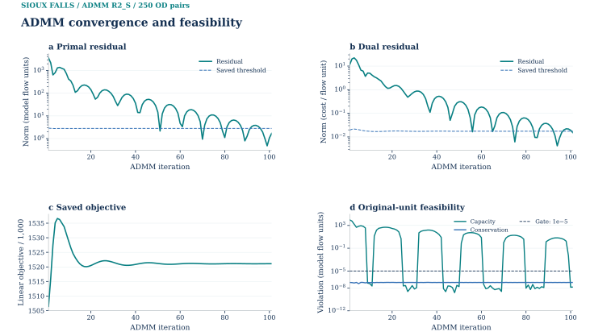</a></td><td width="33%" valign="top" align="left"><a href="https://scholarhaozheng.github.io/mobility-network-lab/volumes/sioux-falls.html#figure-r05-sioux250-admm-conservation">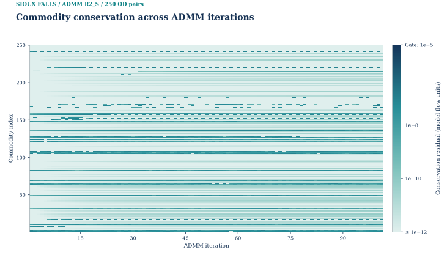</a></td><td width="33%" valign="top" align="left"><a href="https://scholarhaozheng.github.io/mobility-network-lab/volumes/sioux-falls.html#figure-r05-sioux250-admm-flows">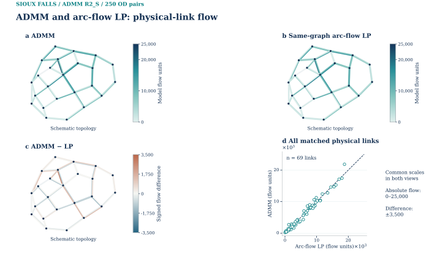</a></td></tr>
<tr><td width="33%" valign="top" align="left">
R2_S 250-OD result: 101 saved iterations. Primal and dual residuals are shown in their respective units against their recorded thresholds. Capacity and commodity conservation use original flow units and the 1e−5 gate. Only the feasibility log display is floored at 1e−12; the rho panel is omitted. This figure reads the accepted 250-OD history directly.
</td><td width="33%" valign="top" align="left">
All 250 commodities over all 101 accepted R2_S iterations. Colours encode original-unit local conservation residuals on the same log scale in both instance views. Values at or below 1e−12 share the floor colour; the upper colour limit is the 1e−5 acceptance gate. The saved maximum is 9.96e-08 model flow units.
</td><td width="33%" valign="top" align="left">
The 250-OD accepted R2_S flow and same-graph arc-flow LP baseline on 69 selected physical links. The maps use shared absolute and signed-difference colour limits across both 200/250-OD views; the scatter includes every matched link with equal x/y scaling. Maximum absolute difference: 3,031.780 model flow units. Grey links show context outside this selected graph. Coordinates are schematic; objective agreement does not imply identical route or time splits.
</td></tr>
<tr><td width="33%" valign="top" align="left">
<a href="https://scholarhaozheng.github.io/mobility-network-lab/assets/atlas/sioux-scale/r05-sioux250-admm-convergence.svg">Full figure</a> · <a href="https://scholarhaozheng.github.io/mobility-network-lab/volumes/sioux-falls.html#figure-r05-sioux250-admm-convergence">Complete evidence</a> · <a href="https://scholarhaozheng.github.io/mobility-network-lab/reproduce.html#sioux-admm-r2s-250">Data &amp; reproduction</a>
</td><td width="33%" valign="top" align="left">
<a href="https://scholarhaozheng.github.io/mobility-network-lab/assets/atlas/sioux-scale/r05-sioux250-admm-conservation.svg">Full figure</a> · <a href="https://scholarhaozheng.github.io/mobility-network-lab/volumes/sioux-falls.html#figure-r05-sioux250-admm-conservation">Complete evidence</a> · <a href="https://scholarhaozheng.github.io/mobility-network-lab/reproduce.html#sioux-admm-r2s-250">Data &amp; reproduction</a>
</td><td width="33%" valign="top" align="left">
<a href="https://scholarhaozheng.github.io/mobility-network-lab/assets/atlas/sioux-scale/r05-sioux250-admm-flows.svg">Full figure</a> · <a href="https://scholarhaozheng.github.io/mobility-network-lab/volumes/sioux-falls.html#figure-r05-sioux250-admm-flows">Complete evidence</a> · <a href="https://scholarhaozheng.github.io/mobility-network-lab/reproduce.html#sioux-admm-r2s-250">Data &amp; reproduction</a>

Published source records
<ul><li><a href="https://github.com/scholarhaozheng/mobility-network-lab/blob/6ce18b8bea5bf3b9b7caa6ee4c0ff4e701a34a8b/examples/sioux-falls/native_l3_r1/inputs_snapshot/SiouxFalls/link.csv" title="examples/sioux-falls/native_l3_r1/inputs_snapshot/SiouxFalls/link.csv">link.csv</a></li></ul>
</td></tr>
</table>

[All retained scientific figure families](https://scholarhaozheng.github.io/mobility-network-lab/volumes/overview.html#src-docs-visualizations-document) · [Full technical walkthrough](https://scholarhaozheng.github.io/mobility-network-lab/volumes/overview.html).

## 05 / Run and inspect

[Computational quickstart](REPRODUCTION_QUICKSTART.md) · [Experiment registry](experiments/README.md) · [Download the computational checkout](https://scholarhaozheng.github.io/mobility-network-lab/downloads/computational-checkout.zip)

Boston S1/S2 recipes rerun the assignment stage only. Saved-output checks verify released files; prepared-input reruns cover their declared stages. Independent full-DAG pricing closure remains open for the historical Sioux CG result.

Choose an exact instance in the [Experiment catalog](https://scholarhaozheng.github.io/mobility-network-lab/reproduce.html), then follow its Download, Environment, Run and Verify steps. The page supplies the matching command and required environment. The [static catalog](https://scholarhaozheng.github.io/mobility-network-lab/reproduction/experiment-catalog.html) remains available without JavaScript. Historical inspection and fresh computation have separate status labels and receipts.

Advanced: command-line registry reference

The experiment page selects the matching command for you. To inspect the two preserved registries directly:

~~~bash
python -B tools/mcl_reproduce.py list
python -B tools/mcl_recovered.py list
~~~

### City-specific reproduction records

Public compute packages for the new static cases are pending S0 publication.

**Ann Arbor** — PARTIAL_PUBLIC_S0_V001 — two saved figures and a licensed photograph are public; the compute package and remaining inputs are pending source-specific clearance. · [Publication status](https://scholarhaozheng.github.io/mobility-network-lab/volumes/ann-arbor.html#reproduction)

**Urbana–Champaign** · [Input identity and reproduction status](https://scholarhaozheng.github.io/mobility-network-lab/volumes/urbana-champaign.html#reproduction)

**Ithaca** · [Input identity and reproduction status](https://scholarhaozheng.github.io/mobility-network-lab/volumes/ithaca.html#reproduction)

**Berkeley** · [Input identity and reproduction status](https://scholarhaozheng.github.io/mobility-network-lab/volumes/berkeley.html#reproduction)

**Chicago** · [Input identity and reproduction status](https://scholarhaozheng.github.io/mobility-network-lab/volumes/chicago.html#reproduction)

**Pittsburgh** · [Input identity and reproduction status](https://scholarhaozheng.github.io/mobility-network-lab/volumes/pittsburgh.html#reproduction)

JavaScript is disabled; all city records remain listed. Any supplied command summary can be expanded without JavaScript.

[Download code and execution guide](https://scholarhaozheng.github.io/mobility-network-lab/reproduction.html) · [Run a verified computation](https://scholarhaozheng.github.io/mobility-network-lab/reproduce.html?ready=1) · [All experiments and current limits](https://scholarhaozheng.github.io/mobility-network-lab/reproduce.html)

**Inspect saved evidence:** [result queries and source records](https://scholarhaozheng.github.io/mobility-network-lab/volumes/overview.html#src-docs-visualizations-document). **Run a documented example:** in a compatible Python environment at the repository root, use:

~~~bash
python -B examples/boston/run_saved_example.py --data-dir "examples/boston/behavior_feedback_r1_semantic_fix_r1" --output "results/boston_saved_example"
~~~

This rebuilds a local SQLite query database from released CSV tables and exports five saved-result queries; demand estimation, FW, CG and matching have separate commands. Use a new output directory. [Installation and dependencies](https://scholarhaozheng.github.io/mobility-network-lab/volumes/overview.html#src-docs-getting-started-document) · [Saved-result guide](https://github.com/scholarhaozheng/mobility-network-lab/blob/main/examples/boston/SAVED_EXAMPLE.md).

**Use your own inputs:** [vehicle-OD preparation and static FW](https://scholarhaozheng.github.io/mobility-network-lab/volumes/overview.html#src-docs-run_your_own_gmns-document), or the separately documented [generic space–time network command](https://scholarhaozheng.github.io/mobility-network-lab/volumes/overview.html#src-docs-getting-started-document-run-from-raw-input). **Version scope:** `tools/mnl.py` retains the 0.3.0-rc5 generic engine; later Boston and Hong Kong CG cases use separately versioned implementations and saved-result checks, so those cases require their own commands.

## 06 / Attribution, scope and further reading

GMNS, `tap-b`/TAPLab and source datasets retain their upstream attribution; this project documents its own adapters, computations and bounded results separately. [Contribution/source attribution](https://scholarhaozheng.github.io/mobility-network-lab/volumes/overview.html#src-docs-contributions-document) · [Third-party notices](https://github.com/scholarhaozheng/mobility-network-lab/blob/main/THIRD_PARTY_NOTICES.md) · [Data licenses](https://github.com/scholarhaozheng/mobility-network-lab/blob/main/DATA_LICENSES.md) · [Citation](https://scholarhaozheng.github.io/mobility-network-lab/volumes/overview.html#src-docs-citation-document). Results distinguish source-derived city inputs, engineering scenarios, supplied benchmarks and observed evidence; no shown case is a calibrated citywide forecast.

The [open-data explorer](https://scholarhaozheng.github.io/mobility-network-lab/volumes/overview.html#src-docs-open-data-explorer-document) and data tools, including `mcl_data.py catalog-city-match` for named-entity matching of user-supplied catalogs, support source inspection. **These evidence layers are not additive.** [Data-tools instructions](https://scholarhaozheng.github.io/mobility-network-lab/volumes/overview.html#src-docs-data-tools-document) · [Source and access scope](https://scholarhaozheng.github.io/mobility-network-lab/volumes/overview.html#src-docs-open-data-document). Future directions such as Policy Bush remain outside the current demonstrated modules.

[Complete overview and nine case volumes](https://scholarhaozheng.github.io/mobility-network-lab/volumes/overview.html) · [Architecture and project-map sources](https://scholarhaozheng.github.io/mobility-network-lab/volumes/overview.html#src-docs-architecture-document) · [Complete case/method coverage](https://scholarhaozheng.github.io/mobility-network-lab/volumes/overview.html#reading-section-3) · [Roadmap](https://scholarhaozheng.github.io/mobility-network-lab/volumes/overview.html#src-docs-roadmap-document).

