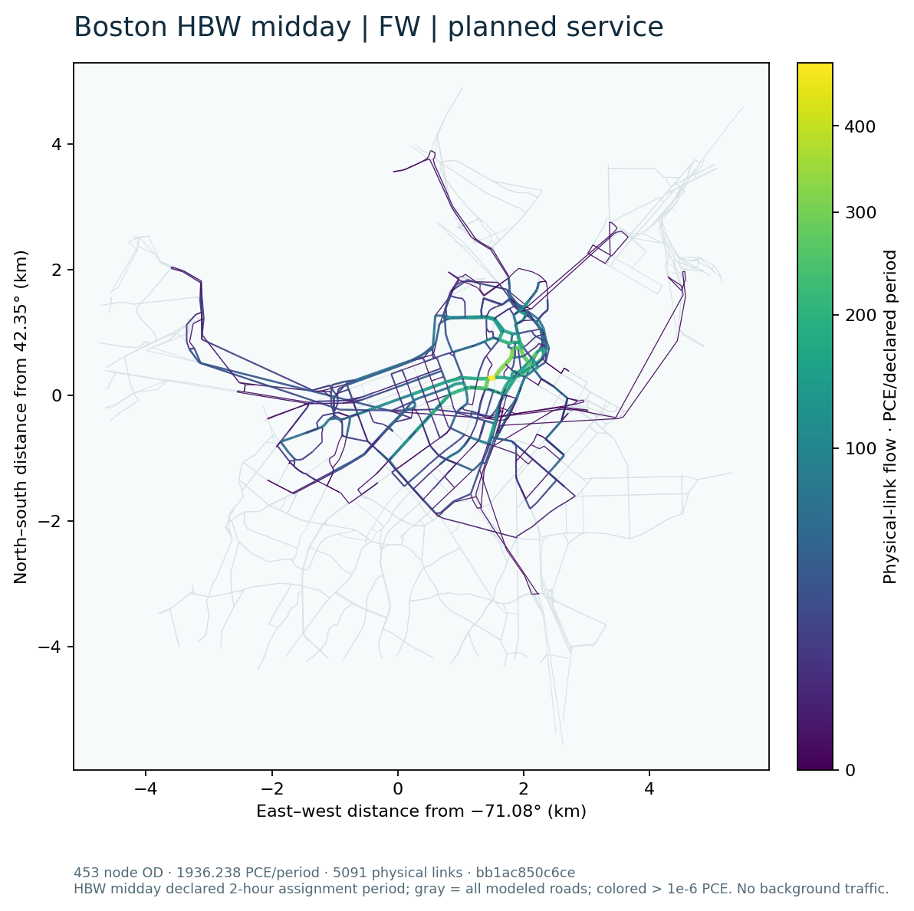
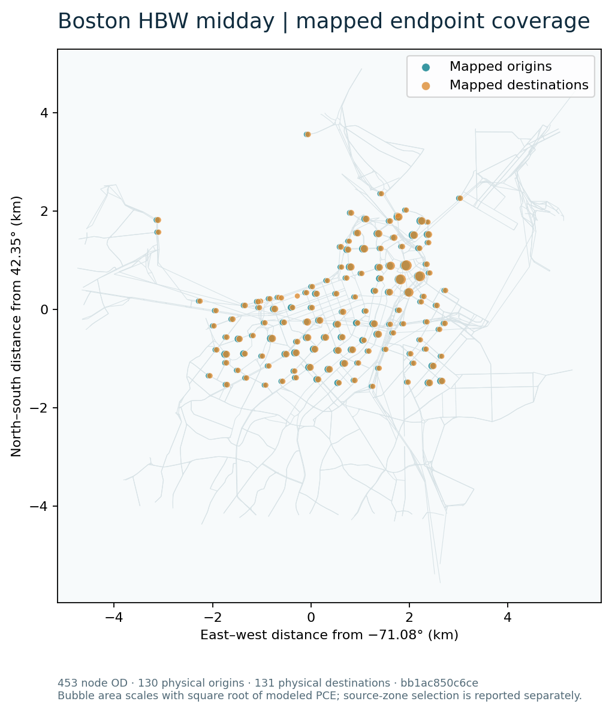
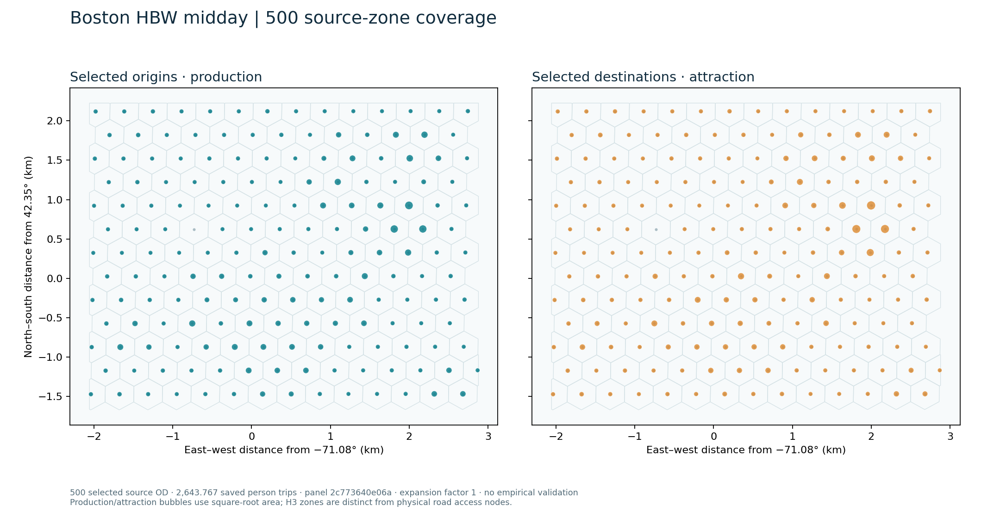
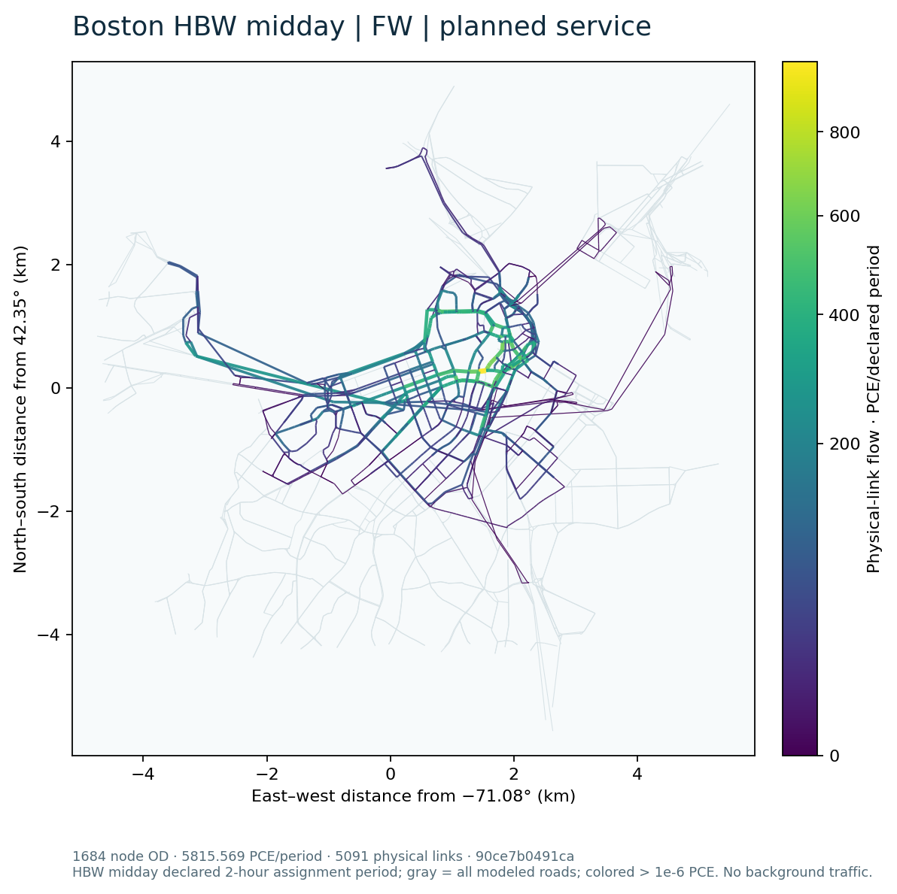

# Boston HBW-midday scalable-tool research result

This page reports calculations on the accepted Central Boston **5,091 physical directed links**. The existing 36-source-zone-pair / 26-physical-node-pair ABS_PLANNED case is retained as the **Fixed-panel algorithm check**: it had 203.6604786350987 modeled vehicle trips and 319 strictly positive physical links. The new scenario selects additional OD from saved HBW-midday **person** demand, computes new planned-service costs, applies a fixed conditional four-mode specification, and assigns the eligible resulting vehicles. It does not estimate citywide traffic or validate behavior with new observations.

## Input and selection scope

The locked regional source has 30,790 positive interzonal and 171 positive intrazonal HBW-midday H3 OD, totaling 22,807.21691394174 modeled person trips. The all-eligible selection is interzonal only, with 22,633.46972887332 person trips (99.2382% of source person mass); the remainder is intrazonal. Selection uses a deterministic coverage-first ordering with parent-pair and distance-stratum support followed by demand rank. Its expansion factor is 1. The labels 500 and 2000 count **selected source-zone OD**, not final road OD.

| Selection | Source-zone OD | Source person mass | Fraction of full HBW midday | Distinct source-zone endpoints | Parent pairs | Mapped node OD before choice |
|---|---:|---:|---:|---:|---:|---:|
| 500 | 500 | 2,643.766735 | 11.5918% | 176 | 80 | 493 |
| 2000 | 2,000 | 8,415.295048 | 36.8975% | 176 | 80 | 1,944 |
| All interzonal | 30,790 | 22,633.469729 | 99.2382% | 176 | 80 | 19,182 |

The source-zone access crosswalk has 139 distinct physical endpoint nodes. Some zone OD collapse to the same physical access node and are accounted as not road-loaded. Eligibility from complete DA/S2/S3/TW attributes is assessed after selection. No person's unknown alternative is assigned a guessed mode or vehicle count.

## Accepted expanded 500-source-zone run

New PLANNED, observation-overlay-off routing on 2026-09-21 at 12:30, 12:40 and 12:50 generated 3,000 OD-mode-time rows from the selected 500 source-zone OD. The three departure samples each represent one third of the saved midday person mass. This is an engineering sampling assumption; the assignment period is separately declared as two hours with effective-period PCE capacity. The routing stage took 1,924.046 s, including 24.150 s setup, across 176 origin chunks. The immutable skim output SHA-256 is `866e4c809d96b05b54c3cf6d89584fe2057bf02bd5e38dedf5c476fcb1b328a0`.

The candidate retains the accepted semantic transit adapter. Eight reused OSM/service graph and four pure choice function definitions were compared by Python AST to their locked public sources and were identical; their unused historical fixed-panel entries were removed from the candidate modules. The fixed-panel probability adapter was separately regressed on all 348 saved supported planned probability rows (maximum absolute difference 1.11e−16). Neither check substitutes for the actual new 500-pair routing and assignment above.

The fixed `REDUCED_TRANSFER_SENSITIVITY_HBW_AUTO_TW_SV_R1` choice model evaluated 2,413.603497 of the selected 2,643.766735 **person trips** and left 230.163238 person trips unknown because at least one required attribute or fare was unavailable. Of 1,500 OD-time objects, 1,353 had the four known alternatives. The selected source OD map through 139 physical access origins and 139 destinations before eligibility. Explicit DA/S2/S3 occupancy conversion produced 1,936.238475 **vehicle trips/PCE in the declared period**, aggregated into 453 physical-node OD over 130 physical origins, 131 physical destinations and 131 endpoint nodes in their union. Transit-walk person choices add no modeled road vehicle. The resulting vehicle quantity is a conditional engineering cohort sensitivity, not a population estimate.

The instance signature is `bb1ac850c6ce0f530c2127f4b3a9dabb12e68319517929fce1e2be0a0eb98829`. The same generic FW CLI used for the independent direct-vehicle fixture solved it in 31.060 s, with a cold minimum-free-flow path seed that already satisfied the declared gap gate (0 line-search iterations). The independent verifier found objective **7,922.083942188114 PCE-minutes**, maximum OD residual 0, link reconstruction error 0 and signed full-network relative gap **−4.590249237557149e−16**. The tiny negative signed gap is floating-point evaluation roundoff, not a better-than-equilibrium flow. There are 1,653 strictly positive links (32.47% of physical links), including 1,650 above the disclosed map cutoff of 1e−6 PCE. The other physical links remain in the flow table and map background.

The road-flow and mapped-endpoint figures use the complete physical-link table and explicit access mapping. The source-zone figure separately uses selected H3 person OD and the locked source zone centroids; source zones are not road nodes. Vector SVG versions and plotted source CSVs are beside the PNG files. Colors show modeled PCE or selected person mass on the clipped study network, not observed counts.

## Larger fixed-demand FW calculations

The 2,000 selection generated 12,000 planned-service cost rows. Its 500 overlapping OD were copied only after the preceding panel and skim hashes passed; the remaining OD were routed against the same source road, walk and service files. The original time-capped attempt completed 162 of 176 origin chunks, and the authorized continuation finished the remaining 14. The two routing-source wall times were 5,231.047 and 279.522 seconds. These are separate attempts, not a single uninterrupted wall measurement.

The all-interzonal selection generated 184,740 cost rows, reusing the verified 2,000 OD and calculating the other 28,790. A destination-independent scheduled-label scan was shared within each origin and departure; the original stop-state and terminal itinerary statements match by AST, and eight synthetic route cases returned identical full outputs. The all-tier skim took 776.937 source seconds. The faster calculation is not a speedup estimate because these stages have different OD and cache scopes.

| Fixed-demand tier | Selected person trips | Evaluated person trips | Unknown person trips | Loaded vehicle/PCE trips | Final node OD | Distinct physical endpoints | FW objective, PCE-min | Signed full gap | Positive links / 5,091 |
|---|---:|---:|---:|---:|---:|---:|---:|---:|---:|
| 500 | 2,643.767 | 2,413.603 | 230.163 | 1,936.238 | 453 | 131 | 7,922.083942 | −4.59e−16 | 1,653 |
| 2,000 | 8,415.295 | 7,248.674 | 1,166.621 | 5,815.569 | 1,684 | 132 | 24,238.470872 | 5.60e−6 | 1,784 |
| All 30,790 interzonal | 22,633.470 | 20,231.449 | 2,402.021 | 16,259.122 | 17,522 | 133 | 73,552.277556 | 6.81e−6 | 2,147 |

All three independent FW checks found zero per-OD demand residual and no negative raw flow. The 2,000 result has zero link reconstruction error; all-interzonal link error is 2.84e−14 PCE. The all-tier FW made one line-search step (step length 1) after its free-flow seed, then met the prospective 1e−5 full-gap gate. These results increase modeled OD and physical-link coverage on the same 5,091-link clipped network; they do not establish citywide traffic coverage. Source origins and destinations each number 176 at every tier, while eligible physical endpoints expand from 131 to 133 between the new tiers.

Each tier's road colorbar is scaled to that tier's maximum modeled link flow, so compare numeric legend values rather than equal colors across tiers. All 5,091 physical links remain in every plotted table, including exact zeros; the colored cutoff is greater than 1e−6 PCE.

## Method and resource status

| Instance | FW | Finite full path | Native Diagnostic L3, 25% | Native Diagnostic L3, 50% |
|---|---|---|---|---|
| New 500-source-zone selection | **Accepted**, 453 loaded node OD | `RESOURCE_LIMIT` before solve | `RESOURCE_LIMIT` before basis/solve | `RESOURCE_LIMIT` before basis/solve |
| New 2,000-source-zone selection | **Accepted**, 1,684 loaded node OD | `RESOURCE_LIMIT` after valid K=5 pool, before solve | `RESOURCE_LIMIT` before basis/solve | `RESOURCE_LIMIT` before basis/solve |
| All 30,790 interzonal pairs | **Accepted**, 17,522 loaded node OD | `RESOURCE_LIMIT` at path-pool preparation gate | `RESOURCE_LIMIT` at path-pool preparation gate | `RESOURCE_LIMIT` at path-pool preparation gate |
| New two-OD generic fixture | **Accepted** | **Accepted** | **Accepted** at actual rank 1 | Not requested |

An accepted generic fixture demonstrates tool execution and numerical checking on changed inputs. It does not upgrade the expanded Boston native cells to accepted status.

The 500 instance has a new loopless K=5 path pool of 2,261 paths (453 OD, 1,808 nonseed/minor paths, 62,400 nonzero link-path incidences). Pool construction took 34.148 s. This pool is input-signature checked and shared by the expanded finite-path and native L3 attempts. The finite full-path SLSQP estimate was 707,637,600 bytes; the measured half-free-memory ceiling at that invocation was 307,646,464 bytes. It stopped at `RESOURCE_LIMIT` before optimization. Both requested native rank fractions were attempted against the same pool; basis construction estimated 909,785,600 bytes and exceeded the measured ceilings of 427,237,376 and 214,028,288 bytes. No 500-level L3 optimum or accepted rank is claimed.

For the 2,000 tier a separate K=5 pool was actually built and independently checked: **8,412 paths**, 1,684 OD, 6,728 minor paths and 223,685 nonzero physical link-path incidences. Construction took 130.176 source seconds (135.557 monitored wall seconds) with an 80.237 MB sampled process-tree working-set peak. The prospective finite full-path workspace is 9,787,143,264 bytes and the weighted basis workspace is 3,650,343,680 bytes, both above the 286,369,792-byte measured half-free-memory ceiling at their gate. Those 2,000 methods were therefore not invoked. For all 30,790 source pairs, a conservative preparation projection from the observed 500 path-pool peak was 5,379,431,308 bytes, above the 1,344,948,224-byte half-free ceiling measured before that gate; no all-tier path pool or compression basis was allocated. These are resource-gated statuses, not failed numerical iterates or a claim that an adequately resourced machine could not solve them.

Separately, the **new-input generic person/vehicle fixture** generated four paths over two OD and five physical links. Finite full-path SLSQP and native Diagnostic L3 rank 1 were actually invoked. The native Pyomo/IPOPT implementation used the accepted isolated Diagnostic L3 source, heterogeneous BPR potential, gamma 0, legal zero link bounds, nonnegative reconstructed minor paths and the source ALM update convention. IPOPT reported optimal subproblems in three outer iterations; the independent original-space check accepted outer 3 with maximum OD residual 9.596e−11, maximum link reconstruction error 1.78e−15, objective 30.28438606667062 and full relative gap 2.257e−12. This demonstrates new-dimension execution, not expanded-Boston compression performance.

For that native fixture, two seed-major and two minor paths yielded rank 1, three path coordinates, five explicit link variables, **eight total NLP variables and seven constraints** (five link equalities and two minor-flow inequalities). The accepted state is essentially a one-path-per-OD example; it is a correctness check, not evidence of compression on a hard route-splitting instance. The expanded 500 FW output also has one positive seed path per loaded OD. A nominal 25%/50% expanded rank was never materialized after its memory gate, so no effective basis rank or expanded minor activity is claimed.

Detailed stage times, memory samples, the retained first 2,000-tier partial skim attempt and the method gates are recorded in the delivery `SCALE_RESULTS.csv`, `RESOURCE_REPORT.md` and private run ledger. The FW tier is solved even where a later finite-path method is resource-gated. Sampled process-tree memory can miss short peaks. No speedup statistic is inferred from these one-off runs.

## Numerical and interpretation limits

The prospective numerical gates were frozen before the expanded solves: per-OD absolute residual at most `1e-6 + 1e-8 max(1,q)`, relative total OD L1 at most `1e-8`, full-network relative gap magnitude at most `1e-5`, raw negative-flow tolerance `1e-8`, and link reconstruction tolerance `1e-7`. Solver termination alone is never an acceptance check. A finite path pool can have a small within-pool gap while failing the full-network gate. Accepted results are checked numerical approximations under fixed demand, not exact equilibria or empirically validated forecasts.

The assignment excludes regional background traffic, turn-state constraints, transit vehicles, endogenous mode/departure feedback and observations. The conditional choice parameters were transferred and fixed; unknown four-mode inputs were retained as unknown. GMNS Plus H3 zone, centroid and nonphysical connector objects are distinct from physical roads. Source-to-solver flow correspondence is by physical `link_id` and the declared access crosswalk, not by connector flow or GPS point count.
