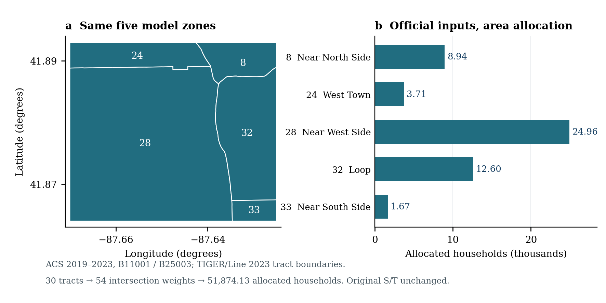
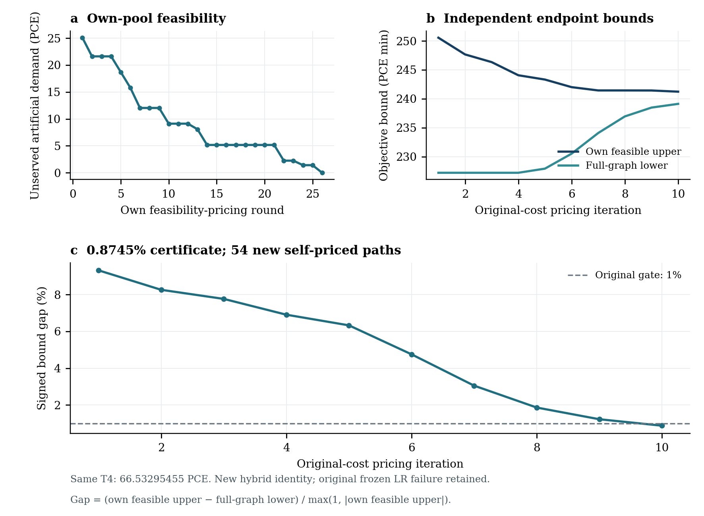
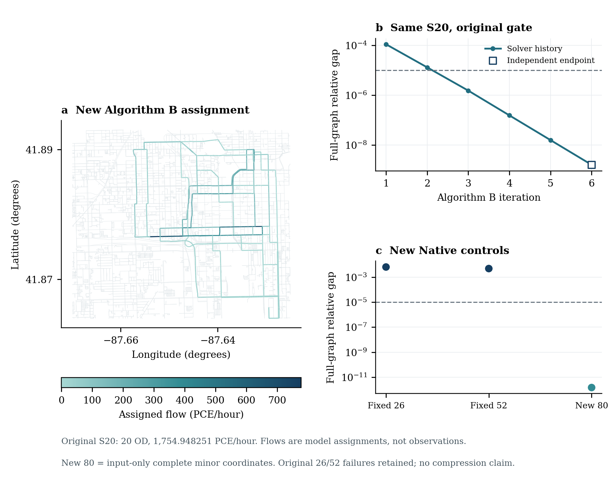
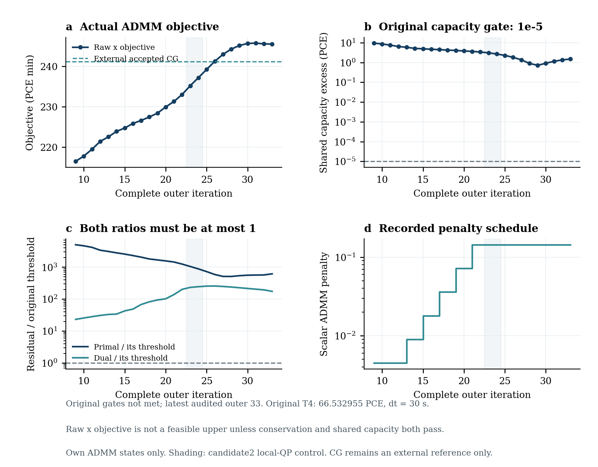

<!-- S0 receiver edition; original SHA-256 18790893d22a2d39c19f96a98b31b9bbe0b1b7e32b686d7f6aa9287dca22d148 -->
# Chicago Jane Byrne / West Loop：可行性证书与输入缺口补充章

交付章节：数值事实以本章所列独立回执为准。

本章供追加到 Chicago 现有大卷及 `VOLUME_ADDENDUM_R2.md`。本轮接续原工作目录、已接受四阶段和静态 R3 结果，只登记新的数据修订或求解器候选。研究地点是 Jane Byrne / West Loop 的原五分区；科学实例保持 S20 和 T4。Chicago Regional、Chicago Sketch、教学网络和校园定位不构成本轮算法输入的替换品。所有新的算法选择均发生在已查看该实例诊断之后，属于 **post-diagnostic** 实验。

## 1. 本轮新增了哪些可核验结果

| 项目 | 实际结果 | 结论范围 |
|---|---|---|
| 官方住户／已占住房 | 原五区约 51,874.13372714 户；官方表与几何独立重算通过 | 面积分摊的工程估计；原人口和四阶段依赖未改 |
| LR 自有路径池新混合候选 | 上界 241.2268172335、下界 239.1173646810 PCE·min；间隙 0.8744685% | 通过原 1% 证书门；不是原次梯度 LR 被追认成功 |
| Native 固定 26／52 表示数值控制 | full gap 约 0.00638167／0.00479636 | 原表示未通过全图门；加严数值控制后仍保留失败 |
| Native 输入路径完整 80 维新表示 | full gap 1.489981182e-12；最大 OD 误差 1.788578174e-10 PCE/h | 新表示通过原门；不声称压缩优势 |
| 公共 Algorithm B，同一 S20 | full gap 1.580745907e-09；Beckmann 目标 5601.4614682869 | 公共冻结实现、无损 ID 适配，原空间独立通过 |
| ADMM 最新已独立核验断点 | 第 33 轮；容量超量 1.491228076 PCE | EXPECTED_SOLVER_GATE_FAILURE；有效断点与算法门槛分开记录 |
| 新 D 输入账目 | 20 OD、12 个五分钟 bin、240 行，总量 1754.94825124 PCE | 只完成输入账目，公共 D 引擎尚待接入 |

新增 LR 混合候选、Native80 与 S20 Algorithm B 已由 S0 按精确 Full 和保存态接收；ADMM33 是有效失败诊断。此处图文由本批 S0 清单逐资产放行，网页由 A 接入；本轮没有修改 A、其他城市或旧交付。原有 61 项 `INCLUDE_WITH_NOTICE` 与 15 项 `PRIVATE_RESEARCH_ONLY` 决策保持，不因新一轮核验而重新撤销。

## 2. 三种不能混用的模型身份

S20 是静态、单类 BPR／Beckmann 分配，原图为 27,129 条有向道路边和 15,133 个节点。全部 20 个正车辆 OD 的一小时总量为 1754.948251239727 PCE。核心输入签名为 `626bf2dc8bfc27d9b82d3f48b1a8bbbcea1f977d81aad662139672f313dac614`。新 Native 与 Algorithm B 均使用此图和此需求。Stage 3 已经完成车辆占用率及 PCE 换算，求解前没有再次换算。按静态流率口径，S20 的 Beckmann 积分单位为（PCE/h）·min；它与下述 T4 脉冲费用的 PCE·min 口径分开记账。

T4 是固定费用、共享硬容量的有限时间图：4 个事前选择 OD、总脉冲 66.53295454563035 PCE、dt=30 s、H=169，共 1,351,628 条弧和 490,223 个节点。它保留原 q_hour/12 的首个五分钟脉冲和终端账本连接语义，签名为 `6e4fa0f4202317139e9ea6a159dd7bfddd7b15925a0cdbd6858cfa35ed6df706`。LR、CG 和 ADMM 的本章结果属于这个 T4，目标单位为 PCE·min。将其数值与 S20 的一小时 Beckmann 积分直接排序没有科学意义。

新的 D 账目覆盖全部 S20 一小时需求，把每个 OD 的小时量均分到 12 个时间段。每段放入 q_hour/12，12 段累计仍为 q_hour。候选服务率按原小时容量除以 3600，自由流延迟按分钟乘 60。均匀释放与这种供给换算是明确的工程假设；尚无动态加载、FIFO／队列检验或 DUE 结果。T4 的优化 PASS 不能替代 D 的计算。

## 3. 官方住户字段：增加输入证据，不重复计算旧四阶段

新增住户修订使用 Census ACS 2019–2023 五年期的 B11001 总住户和 B25003 已占住房字段，以及 2023 TIGER/Line 普查区边界。原 API 请求返回缺 key 的 HTML，该响应被保留为失败下载记录，未当作数据使用。随后取得官方全国表文件，再筛选 Cook County 的 1,332 个普查区；实际与模型范围相交的为 30 个普查区、54 条“普查区—模型区”权重。

官方 TIGER 的 `.prj` 声明 NAD83／EPSG:4269；模型区沿原 WGS84 经纬度口径保留。当前固定 pyproj 运行环境中，原脚本的经纬度投影入口与按官方 NAD83 声明建立的入口展开为同一条 PROJ pipeline，三点坐标控制也完全一致，证据保存在 `CRS_METADATA_CONTROL.json`。这不表示两种地理基准在所有地区或运行环境中恒等。对普查区 t 和模型区 z，权重为 EPSG:26916 下的交叠面积除以该完整普查区面积，估计户数为各普查区官方户数乘该权重后的和。没有把裁剪后的一小块重新归一化成整个普查区，也没有把缺失或 Census sentinel 改成零。源普查区 MOE 逐项保留；本轮未在缺乏误差协方差信息的情况下构造模型分区置信区间。

五区估计分别为：8 区 8,941.13228966 户，24 区 3,708.37570269 户，28 区 24,955.52722450 户，32 区 12,604.09095983 户，33 区 1,665.00755046 户。所选普查区的两项官方总量一致，输出同时保存 households 与 occupied_housing_units。独立检查重新解析全国原始表和官方边界 ZIP，核对几何、权重、覆盖、源 MOE 及最终分区汇总，没有只检查生产者已经筛好的 JSON。

这些户数依赖区内均匀分布假设，不能称为五个模型区实测户数。保留的小数用于复现面积分摊，不表示官方统计精度或估计误差因计算而改善。原人口分摊方法和统计支持域也与本次户数分摊不完全相同，因此不能直接把二者比值解释为当地实测家庭规模。原人口总量 73,375.24195493403 保持。读取原产生配置后，实际依赖是 population 和 active_license_weight，households 并未参与该模型，故 `affected_stages=[]`，未为增加这个字段重跑已接受的产生、分布、方式或分配。

来源：[ACS B11001 官方表](https://www2.census.gov/programs-surveys/acs/summary_file/2023/table-based-SF/data/5YRData/acsdt5y2023-b11001.dat)、[ACS B25003 官方表](https://www2.census.gov/programs-surveys/acs/summary_file/2023/table-based-SF/data/5YRData/acsdt5y2023-b25003.dat)、[TIGER/Line 2023 Illinois tract](https://www2.census.gov/geo/tiger/TIGER2023/TRACT/tl_2023_17_tract.zip)。实际源字节、下载记录、空间权重和独立回执均随 Private Full 保存。

## 4. 人口、活动、人员 OD 与车辆 OD 的查询链

本轮提供可运行的 `lineage_cli.py`，从原配置、人口分摊、产生表、分布矩阵、方式成本和车辆换算一直追踪到 S20 与 T4。全 20 OD 查询和 28→32 单 OD 查询均已实际通过，非法起点则返回 INVALID_INPUT。检查重新演算产生率、吸引权重、OD 边际、广义费用和方式概率，并保留原 IPF 的正确归一化分母；它不是仅把输入文件名串联起来的目录索引。

原配置产生量为 10272.533873690763 人次，进入区际分布的量为 2835.2193491386506 人次。原方式与 occupancy/PCE 换算得到 S20 的 1754.948251239727 PCE/h；T4 再依据原选择和 q_hour/12 规则得到 66.53295454563035 PCE。查询明确列出子实例未代表的量，保持“产生量、区际人员 OD、分方式人员量、车辆 PCE 和时间子实例”之间的差别。

GPS 或照片没有参与这些产生率、重力分布或方式参数的标定。新住户字段也尚未成为实际消费字段。E 的服务日 GTFS 成本到位后，才另立 `CH_MODE_TRANSIT_EXTENSION`；已列出 20 OD 成本请求和合法乘车、接驳、换乘、票价、服务日期等所需字段。当前空白请求字段不是可用公交成本，更不是零成本公交。计划中的受影响阶段为方式选择和随后的分配，原 S20/T4 算法比较仍冻结。

## 5. CG 已有证书的接收与参照边界

原 retry R2 CG 的 425 列、268 轮保存状态已由 S0 的同 Full 独立接收回执接受。其自身可行原始目标为 241.2185242449435 PCE·min，对偶目标与之在数值精度内一致，并有逐 commodity 的完整图定价闭合。本轮复用这份更晚的接收事实；没有按旧矩阵的资料日期把 CG 重新降为未接收，也没有重复优化已成功的方法。

该数值只作为独立端点评价参照。ADMM 或 LR 的初值、修复、路径池、价格和停止规则均未读取 CG 解或目标。原独立 HiGHS 运行仍保持 RESOURCE_LIMIT，不能把 CG 的证书填入其结果后声称完成了一次新 LP 求解。`CG_EXTERNAL_REFERENCE.json` 保存来源报告 SHA、允许用途以及旧公开决策的保留情况。

## 6. LR：先查自有池阻塞，再建立可行上下界

原 LR 在 759 轮后有 128 条自生路径和有效下界，但 77 次恢复均没有可行上界。本轮先对这 128 条路径执行实际受限恢复与人工未服务量诊断。受限池最小未服务量为 25.083372329966668 PCE，其中 T02、T03、T04 均存在缺口；完整图在这些自有可行性价格下仍能产生新的负约化费用方向。这证明需要扩充当前自有池，不构成原 T4 不可行的证明。

价格时刻也重新核实：最优下界价格来自第 753 轮，当前定价价格来自第 759 轮；原 WALL_BUDGET 分支在更新价格之前退出，因此不存在一个可冒充已经定价的第 759 轮 postupdate 状态。原 128 个生成事件中只有 13 个具有当时实际保存的价格快照，缺失的历史状态没有反推成观测记录。

新候选明确命名为“LR 自有可行性定价与受限恢复对偶锚点混合方法”。第一阶段用自身受限恢复的可行性价格生成路径；人工量清零后，再按原费用做完整图拉格朗日定价，并把当前价格向同一自有池恢复 LP 的容量对偶价格混合一半。它含有受限主问题对偶反馈，不能称为冻结投影次梯度 LR 原样通过。所有新增列均由该候选自己的定价产生，没有外部 CG 列或构造 witness 输入。

对非负容量价格 λ，下界按 L(λ)=Σ_k q_k·SP_k(c+λ)−Σ_a u_aλ_a 重算。可行上界必须来自满足原 OD 和共享容量的自有路径流，证书为 (U−L)/max(1,|U|)。人工可行性价格不作为原费用下界；current_priced、best_bound_price、recovery_dual_anchor 和 postupdate_unpriced 分开保存。有符号差值未被裁剪成零。

本候选实际完成 26 次可行性恢复与 10 次原费用迭代，总共 36 次受限 LP；由原 128 条扩充到 182 条，新增 54 条。独立检查从原 1,351,628 弧 CSV 图重新计算最优价格和当前价格的最短费用下界，展开所有正流路径并复核原图合法性、OD、非负和共享容量。得到 U=241.2268172335、L=239.1173646810 PCE·min，证书 0.8744685%，OD 与容量误差均为 0，满足原 1% 门。

历史生成核验覆盖每条新路径的合法性、实际价格快照和价格下的路径费用；独立完整图最短路证书针对端点 current/best 两套价格计算。本章不把这一范围扩大为独立重跑了所有历史定价调用。

## 7. Native：数值控制与表示扩展分开判定

本轮先检查原 26／52 基底的路径、道路和 OD 算子，并用复步方向导数核验原空间 Beckmann 梯度，最大归一化误差约 3.2e-15。随后在各自压缩可行域求解两个线性化诊断 LP，所得压缩驻点归一化间隙约为 2.04e-12 和 1.67e-12，而对应全图间隙仍为 0.00638167 和 0.00479636。这支持当前端点的主要障碍来自表示受限；它不是对该子空间所有点永远不可能满足全图门的证明，旧欧氏距离诊断也没有被提升为这样的证明。

检查原程序发现，Native 用 OD 增广拉格朗日项逼近守恒，原实现没有硬 OD 等式。本轮固定表示数值控制将 v=B1ᵀx1+Dθ 精确代入目标，保留非负 link 约束、minor Uθ≥0、原 OD ALM、γ=0 和相同 λ/rho 更新；没有悄悄添加硬 OD 约束。通用小例在非零 OD 残差下比较了原目标与代入目标及解析梯度，均通过。

候选 1 保留 rank26/52，并加严 Ipopt 容差。26 维实际新增两次内层求解；52 维在 270 秒内层 CPU 上限返回一次有效迭代。独立守恒与重构通过，但全图间隙基本不变。最大轮数或 CPU 终止与数学门槛判定分别保留，未把求解器有返回状态解释为 UE 通过。

有上述诊断后，候选 2 另立 `NATIVE_L3_INPUT_PATH_IDENTITY80`：保留原 K5 的 100 条输入成本路径和 20 major／80 minor 分割，令 U=I80，D=A_minor，M=C_minor，初值来自原输入成本 seed，λ0=0、rho0=10。该构造仅依赖输入路径，不读取 FW、finite、CG 的状态。80 维已是不压缩的完整 minor 坐标，本章不据此声称压缩优势。

候选 2 的三次实际外层求解依次消除 OD 残差。第一轮和第二轮的有符号 full gap 分别约 −0.0062460 和 −4.57e-8，但守恒尚未通过；这些负数保留原值，未据此提前认定成功。第三轮才同时满足全部原门。独立原图检查得到目标 5601.4614682950、全图间隙 1.489981182e-12、最大 OD 误差 1.788578174e-10 PCE/h，以及 link 重构误差 1.136868377e-13 PCE/h。新表示的成功不覆盖原 26／52 失败记录。

## 8. 公共 Algorithm B 的同实例对照

复用公共已接受的 tap-b Algorithm B 执行器及精度输出兼容差异，二进制 SHA 为 `c421c48200c033a8c37bf570ee7d1198bbb4689e2961dee61ae41f8d58f7ee1f`。原字符串节点 ID 经双射映射到整数后交给公共接口；独立检查逐边逐字段比较容量、自由流分钟、BPR α/β 和全部 OD 的双精度值，确认无新增、删除或合并道路，无需求改变。first_thru_node=1 保持全部节点的物理通行语义。

这个适配是本任务的无损转换，不是已经证明官方 TAPLab Chicago 转换器逐字节对齐。公共 B 的求解参数保持冻结，并额外要求 Chicago 原 full-gap 1e-5 门。执行器实际返回 23 条正路径和 6 条迭代记录。原空间重算目标为 5601.4614682869，有符号相对间隙为 1.580745907e-09；最大 OD 误差 1.136868377e-13，路径展开与 link 流差异 4.547473509e-13。公共检查的路径／弧费用松弛、原点支持无环和守恒等附加门也全部通过。

## 9. ADMM：有效局部解与共享可行解仍需区分

原第 9 轮具有 36 个局部可核验返回，但容量与共识尚未达标。本轮先用无损的两遍 CSV／CSR 存储适配降低载入开销，三个冻结小例中原连续计算、逐轮边界调用和序列化续算的状态完全一致；完整 Chicago 第 9 轮状态也在不调用优化器的情况下通过。存储适配没有改变边、commodity、顺序、费用、容量或局部 QP。

随后保持原数学继续到第 12 轮，完成 12 次新增局部 QP。独立容量超量由约 9.507 降到 6.419 PCE，primal 由约 20.979 降到 13.659。以相对于原停止阈值的残差不平衡为依据，登记自适应标量 rho 候选：每两个完整新外层检查一次，最多在最初 20 个新外层适应；按固定比率和上下界变化，并作 w←(rho_old/rho_new)w，以保持物理对偶 y=rho·w。局部 QP、投影和所有原验收门保持；后续固定 rho，不声称一定加速。

当前本章只引用已经独立核验的第 33 轮端点：primal=2.410678419，阈值=0.003899086855；dual=0.4157624491，阈值=0.002379377713；共享容量超量=1.491228076 PCE。状态为 **EXPECTED_SOLVER_GATE_FAILURE**。端点目标 245.5334509350 PCE·min 仅在原 x 同时满足守恒与容量后才可称为可行上界；容量可行的 z 本身也不能替代守恒解。程序没有拼接 x/z，也没有用 CG 修复后冒称 ADMM 自身成功。

独立检查读取完整状态、所有实际返回的局部 x/potential/q，以及跨 checkpoint 的 z 与物理对偶连续性，重算 KKT、投影、对偶更新、共享容量与目标。与 S0 CG 参照的有符号归一化目标差为 0.01788804033，分母为 max(1,|ref|)=241.2185242449；本例 ref>1 时与真正相对差数值相同。它只是外部评价，不是 ADMM 求解器输入。

第二个、也是本轮最后一个科学候选单独登记为 SELF_PRICED_LOCAL_QUADRATIC_FLOW_QP_V001。它只改变同一局部二次流问题的数值求解：在各 commodity 自己定价得到的路径上求限制二次规划，再以完整原图边际费用定价，并在原弧空间检查守恒、非负和 KKT。新路径池从空池开始，按原局部目标当前梯度 c−rho·q 定价首条路径，不读取全局 CG 或 LR 池；成功形成的自有局部缓存随完整断点保存。路径二次规划达到本地墙钟／路径数预算或精度不足时，明确回退到冻结 C1，不能把未达标的限制子问题直接送入共识更新。

该候选先完成36组局部原空间对照、真实外轮控制、序列化6与3+3等价检查及重新签署manifest的缓存/commodity损坏CLI负测，再进入本城。实际保存的8次已提交局部调用中有6次C1回退，并发生1015次限制二次规划minimizer调用。独立原空间端点为第24轮，状态EXPECTED_SOLVER_GATE_FAILURE，容量超量2.683671924 PCE。此结果没有支持所期待的局部求解吞吐改善；各行对应不同q与rho，不能把这组日志写成严格同问题的加速比。

随后接续第一候选原先尚未使用的努力额度，沿用完全相同的candidate1策略哈希、C1局部求解和rho规则，仅从第二候选自己的完整ADMM状态恢复。这是原候选继续，未增加第三种科学修正；实际candidate1数值阶段累计7484.219秒，监控累计7558.688秒，均在原登记8500／9000秒上限内。最终端点见本节首段和独立审计。

方法背景参见 [Boyd 等的 ADMM 综述](https://stanford.edu/~boyd/papers/admm_distr_stats.html)及 [Wohlberg 对残差平衡尺度问题的分析](https://arxiv.org/html/1704.06209)。本候选使用停止阈值归一化的工程变体，不声称与文献某一公式逐项相同。完整实际续算预算、终止原因和最后断点以最终运行账目为准。

## 10. 原空间核验、损坏状态与资源账目

求解入口先完成真实小例和 CLI 负测；对已经保存的城市输出，又实际运行了 8 项负测，涵盖少 commodity、非有限值、非法路径和损坏 local_q。测试副本均重新签署 manifest，因此拒绝不是简单依赖旧 hash 不匹配。有效但未达原门的 ADMM／Native 控制端点返回 EXPECTED_SOLVER_GATE_FAILURE；损坏副本返回 INVALID_STATE。这两者没有混为一类。

资源仍沿用原共享锁，同一时刻只有一条本任务重计算线。旧 4 GiB 门未恢复为本轮限制：载入与真实求解峰值被分别测量，再登记可用提交余量策略，继续保留系统余量和只针对本任务进程树的保护。阶段停止在完整迭代落盘边界处理，不强行中断安全写入。监测按时间间隔采样，快速方法的短峰值可能漏采；账目中的 sampled peak 不能当作绝对峰值，更不能据一次本机耗时作跨方法加速结论。

原 R2 的失败、缺失和资源停止记录全部保留。本轮修复过的验证脚本错误及其失败回执也单独记录，没有删除后只留下通过的一次。新结果的 member SHA 证明交付字节身份；数学通过来自原空间数值与证书检查，二者用途不同。绘图重放也不计作优化器重跑。

## 11. 尚待外部接口的边界与交付方式

已对已知 E 工作／交付目录检查服务日 GTFS 成本和 D 接口；本轮尚未取得可消费的 Chicago 服务日公交成本或公共动态加载核心。20 OD 请求、依赖范围和 D 输入账目已经实做并独立核对，保留等待接口的明确状态。历史 2011 轨迹和 2024 照片没有 same-ramp 记录，旧 GPS／照片／TemplateFit 工作保持暂停；受限新观测和映射仍由 E 提供。没有相机点反推物体坐标、异地照片替代或新日期 restriction 回写原 S/T。

本章、新图、plot_data、source、单位、源码、策略、输入、实际状态和独立回执随交付整理。Private Full 保存完整科学复现依赖；轻量 ChatGPT Upload 明确列出未携带的大状态；Volume Handoff 只提供向既有城市长文追加的材料。最终 Full 的只读回放在中文且含空格的路径执行，输出写到输入树之外，前后成员 SHA 必须一致。实际回放收据与归档 bytes/SHA 是交付是否完成的依据。最终 ZIP 冻结后产生的两次回放收据写在包外，并随轻量上传包和大卷交接包提供，均绑定所测 Full ZIP 的 SHA；两次 Full 只读回放最终均 PASS，精确归档身份见本批 S0 接收清单。
