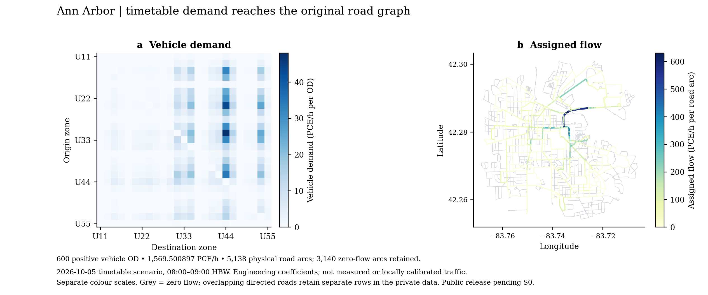
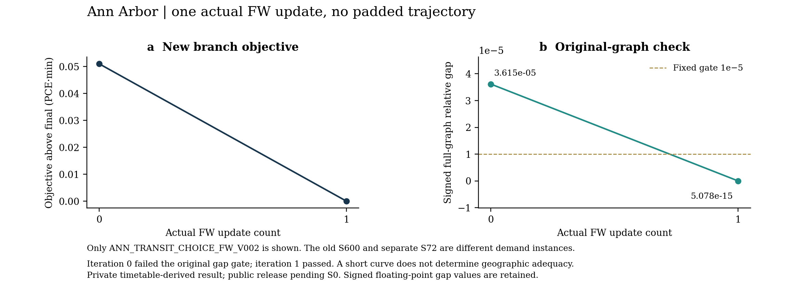

# Ann Arbor：新班表需求已进入原道路图的静态分配

**2026-10-08 / C01 / 城市卷私有增量**  
实验：ANN_TRANSIT_CHOICE_FW_V002  
规范模型：ANN_ARBOR_CHOICE_TIMETABLE_R1  
公开状态：新班表派生图、plotdata、需求细节和原输入均待S0逐项判断。

## 1. 新choice缺失的道路下游已完成

本轮把已有班表方式选择生成的全部600个正车辆OD实际传入静态Frank–Wolfe（FW）分配，补齐Ann Arbor现有四阶段链的道路下游。求解直接使用1569.500896674 PCE/h的新需求，保持原有向道路、转向、接入和BPR参数。初始完整图相对gap超过1e-5门；一次真实更新后，独立核验得到5.078039902e-15，达到既定门槛。原generation、distribution和person OD均按原哈希复用，旧S600与S72接受结果保持。[证据：FW_EXECUTION.json；verification/FW_CHECK.json；FIELD_CHAIN_HASHES.csv。]

这一增量使城市卷能够展示“新车辆需求→新物理道路赋流”的完整关系。此前R10文字准确记录了当时“新choice尚未运行assignment”的状态；本轮以独立记录补充新进展，保留历史叙述。此次完成的是固定需求、固定空间合同下的工程情景。输入假设与模型边界共同决定结果的解释范围。

## 2. 人员需求和班表证据沿已有链传递

人员需求继续采用原Central Ann Arbor城市子区域的冻结结果。原配置以2020–2024 ACS及2021 LODES活动数据构造分区，用迁移的HBW生成率和显式工程参数形成一小时出行机会。内部区际person OD合计2730.770943121人次，包含25个原分区之间的600个有向非对角OD。区外和区内机会继续留在原生成台账，本轮没有重新注入道路需求。[证据：frozen_r2/config.json、FOUR_STAGE_RUN_CONFIG.json及generation/distribution目录。]

新choice使用已冻结的TheRide与U-M班表。服务日为2026-10-05，出发样本为当地08:00、08:15、08:30、08:45。既有路由合同要求四个样本均存在班表行程才将公交标为可用，并对成本取算术平均。搜索采用最早班表到达、至多三次上车和90分钟窗口，步行接入和换乘保持原上限。这些规则属于工程表示，尚未经实测乘客偏好校准。[证据：transit/INPUT_REVISION.json；TRANSIT_RESULT.json。]

班表与步行核验复用相同SHA256的既有独立回执，覆盖1844个保存行程和1669条步行记录。回执确认活动GTFS片段、标签筛选步行路径和成本分量一致；地面合法通行与方式实测标定仍未完成。本轮没有重新采集GTFS或重跑行程搜索。原producer JSON保留产生时“pending independent check”的文字，本轮采用其后形成的同输入独立PASS回执。[证据：checks/integrated_01/transit/CHECK.json；INPUT_IDENTITY.json。]

方式概率按原参数独立重算。固定系数为广义分钟敏感度0.07/min、时间价值20 USD/h和各方式原ASC，均属显式工程参数。600个OD中公交可用460个、不可用140个。不可用公交的概率为零，该OD人员仍在其他可用方式中分配；600个车辆OD全部保留。最大概率和误差为2.22e-16，最大人员守恒误差为1.42e-14人次。[证据：checks/INPUT_CHECK.json；audit_inputs.py。]

这些证据支持已有新choice具备可继续道路分配的数值与身份条件。公交不可用不等于整个OD未服务，也不构成删除道路需求的理由；本轮总体未服务OD为零。

## 3. 人到车转换只执行一次

新choice的drive、transit、walk分别为1883.401076009、361.710869997、485.658997116人次。道路可分配方式只有drive，其车辆需求按1.2人/车除一次，再按1 PCE/车乘一次，得到1569.500896674 PCE/h。本合同下车辆和PCE数值相同，单位仍分别保留。公交乘客和步行者没有作为道路车辆装载，班表车辆也没有被额外注入背景流。

FW入口直接复用已经转换的demand.volume。逐OD字段链连接分区人员量、方式人数、车辆量、原接入节点、分配需求和路径端点，600条关系均通过检查。assignment没有再次除occupancy或重复乘PCE系数。人员表与车辆表求和末位的浮点差别保留原样，没有通过需求修整消除。[证据：FIELD_CHAIN.csv；FIELD_CHAIN_HASHES.csv；checks/INPUT_CHECK.json。]

## 4. 原FW实现按固定门完成一次更新

新实验独立放在choice_fw_v002目录，保留规范模型ID和完整输入签名。求解核心复用已接受的mcl_assignment.py，其SHA256为b66c412281da24a66deacc3b6d90bc44e040d6f4fc7975d9b5e315fa76de5bbe。包装器仅在真实历史记录追加后保存完整状态；去掉该观察调用后，函数AST与接受版一致。数值方向、步长和BPR计算保持原实现。[证据：FW_IMPLEMENTATION.json；run_fw.py。]

运行前锁定原S600标准：完整图相对gap绝对值不超过1e-5，并满足原需求守恒、非负和路径重建门。历史R2通用配置的1e-4门作为原件保留，本轮明确由FW_POLICY.json的S600门覆盖。停止规则为最多300次更新或1800秒求解预算，完成即终止；8小时任务边界另外预留交付时间。程序通过原heavy锁排队，待当前占用释放后进入重阶段。[证据：FW_POLICY.json；GUARD_RUN.json；logs。]

原网络包含14203条求解弧，其中5138条是有向物理道路弧，9065条是转向弧。初始完整图相对gap为3.614999142064405e-5，Beckmann目标为7511.797008491 PCE·min。一次FW更新后，目标为7511.745981436 PCE·min。求解器最终gap为3.627171359e-15，独立核验按另一累加顺序得到5.078039902e-15，两者均保存原始浮点值。真实轨迹仅有iteration0和iteration1，二者都有完整路段与路径状态。[证据：S/ChoiceR1/FW/history.csv；checkpoints；verification/CHECKPOINT_AUDIT.json。]

## 5. 独立检查从完整图重建解

独立核验检查新需求身份、概率、人车换算、路径端点、非负、OD守恒、求解弧重建、BPR费用和完整图最短路gap。核验器读取全部14203条原图求解弧，对所有正车辆OD计算最短路成本，不使用保存路径池代替完整图。623条最终路径覆盖600个OD，每条路径均按原图连接并回到对应目的接入节点。以下数值来自保存状态的独立回放：

|检查量|独立结果|
|---|---:|
|最大OD守恒残差|4.34e-19 PCE/h|
|最大节点平衡残差|1.71e-13 PCE/h|
|最大求解弧重建误差|4.55e-13 PCE/h|
|最大BPR费用误差|0 min|
|最小路径流量|0.001864965 PCE/h|
|最小求解弧流量|0 PCE/h|
|完整图gap分子|3.819877747e-11|
|gap分母／总系统广义旅行成本|7522.346852680 PCE·min|
|完整图相对gap|5.078039902e-15|

这些检查支持新需求实例已得到满足原验收门的静态解。数值一致性不能替代实测流量校准；BPR参数、容量、接入合法性和行为系数的假设仍限制交通运行解释。[证据：verification/FW_CHECK.json；verify_branch.py。]

正式CLI入口还通过三项负测。非有限路段流量和缺失OD路径分别返回INVALID_STATE、退出码3；真实保存的新需求iteration0返回EXPECTED_SOLVER_GATE_FAILURE、退出码2。第三项仍是原空间可行状态，因gap高于既定门而未获接收。前两项重新签署文件记录和清单，避免只因校验和不符而失败。三项都保持输入字节只读，优化器调用数为零。[证据：checks/NEGATIVE_PROBES.json。]

## 6. 新图连接车辆需求与物理赋流

图1左侧为600个新车辆OD组成的矩阵，Vehicle demand色标单位为每OD的PCE/h。右侧为新FW解回投到原物理道路后的Assigned flow，单位为每条有向道路弧的PCE/h。两侧各用自己的色标。全路段数据保存5138行，1998条正流道路与3140条零流道路均保留，灰线表示零流。重叠双向弧仍在数据中分行保存，图形覆盖不等于合并方向。[证据：figures/Vehicle_demand.private.csv、Assigned_physical_flow.private.csv和FIGURE_SOURCES.json。]

物理道路弧流量合计91619.893440677 PCE/h会重复计数同一行程经过的不同路段，不能作为车辆需求总量。物理弧加权距离为5447.592788111 PCE·km；PCE系数为1，因此在此合同下数值等于车辆公里。转向弧没有被误算成独立物理道路。新图据此呈现真实下游赋流。

图2只画新分支的实际0和1状态。目标图以最终值为参照展示0.051027055 PCE·min的实际下降，gap图保留独立重算值和原1e-5门线。少量更新是本问题本次运行的结果。独立S72的初始通过和旧S600的轨迹各自保留，没有拼接到新分支曲线，也没有通过放大需求延长曲线。

## 7. 规模对照保留三个独立实例

|实例|模型 ID|正车辆 OD|PCE/h（1小时）|初始 max(v/c)|初始全图 relative gap|门槛|真实 FW 更新|
|---|---|---:|---:|---:|---:|---:|---:|
|S600|ANN_ARBOR_R2_S600_20261008|600|1647.816622273|0.717965484|5.10282992012e-05|1e-5|1|
|ChoiceR1|ANN_ARBOR_CHOICE_TIMETABLE_R1|600|1569.500896674|0.683023907|3.61499914206e-05|1e-5|1|
|S72|ANN_ARBOR_R2_S72_20261008|72|243.071388651|0.139679497|1.03023091153e-11|1e-5|0|

三组均沿用约19.633 km²的Central Ann Arbor城市子区域、25个分区和原道路路由halo。S72只改变保留的原需求OD子集，其地理范围保持；S72 Native初始通过、0次NLP调用的原记录也保持。三组期间均为工程HBW一小时，PCE/h总量因需求实例不同而不同。[证据：verification/SCALE_COMPARISON.json；upstream/C01_READY.json。]

新choice比旧S600少4.752696662%的车辆/PCE需求，道路目标差为-360.149153578 PCE·min。二者共享道路和原person OD，因此可以描述固定网络上不同方式选择输入的结果变化。需求向量已不同，这些变化不能用来评价同问题算法胜负，也不能用来认定实测班表政策因果效果。

初始最大v/c约0.68与一次FW更新只说明当前配置下的负荷和收敛情况。区域面积是否满足政策问题，取决于边界跨区出行、其他目的、路由替代和观测证据。原模型排除了外部与区内装载，采用固定方式选择输入，也没有公交容量分配或反馈到方式选择的拥堵迭代。本轮保持这些边界，没有为解释短曲线扩大区域或重做人口、生成、分布。

## 8. 可复现计算与逐项发布分别交接

PrivateFull保留冻结输入、接受核心、两个真实checkpoint、最终路径与求解弧、物理全表、检查代码和本增量。正式只读入口为verify_branch.py；解压到新目录，把输出指向另一个新目录即可复核。它的优化器调用数为零，回放前后核对全部输入字节。封包后的两次新路径回放、ZIP大小和SHA256由外层DELIVERY_RECEIPT.json与PACKAGING_VERIFICATION.json记录，避免将ZIP自身哈希循环写入ZIP。

小型ChatGPTUpload用于用户手动提交审阅，包含本章、图件、规模、身份摘要、负测、回放回执，以及实际PrivateFull大小和SHA256。原始GTFS、原OSM、逐OD完整细节、精确路段全表和大数组保留在私有Full。上传包标为PRIVATE_REVIEW_ONLY，公开网页不得直接采用。

新增班表派生物仍交S0按文件和实际依赖逐项判断。旧AA获准静态图许可没有覆盖新图，计算成功也没有解除U-M派生材料的公开hold。S0_RELEASE_REQUEST.json列出精确哈希和待核事项。A后续按S0明确决定接入城市卷；本轮只生成本城增量，没有修改主线、远端或其他城市文件，也没有发送跨线程消息。
