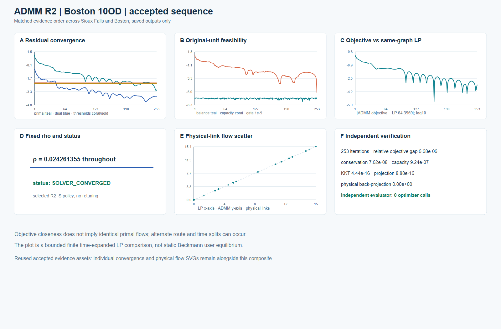

# Boston ADMM R2 · frozen-policy 10-OD holdout

The Boston ADMM R2 run used the already-selected, frozen **R2_S** source, input-derived fixed-rho rule and independent gates. It is one bounded finite time-expanded, fixed-cost, shared-capacity pilot: **10 ODs, 90 physical nodes, 125 directed physical links, 3-second steps and a 100-step horizon**. It is not a citywide Boston assignment or static Beckmann UE.

| Accepted saved result | Value |
|---|---:|
| ADMM iterations | 253 |
| ADMM objective | 64.39729165541078 |
| Same-graph arc-flow LP objective | 64.3968615115296 |
| Relative objective gap | 6.68e-6 |
| Max original-unit local conservation residual | 7.62e-8 |
| Max capacity excess | 9.24e-7 |
| Max physical back-projection error | 0 |

All declared independent gates passed. The independent evaluator made **zero optimizer calls**. The policy was frozen after Sioux development, and no Boston retuning or scientific rerun contributed to these figures.

[Editable six-panel SVG](../assets/admm_r2/figures/admm_boston_10od_case_sequence.svg) · [original accepted convergence SVG](../assets/admm_r2/figures/convergence_Boston_10OD.svg) · [original accepted physical scatter SVG](../assets/admm_r2/figures/physical_flow_Boston_10OD.svg)

## Physical-link movement flow and LP comparison

The 125 saved project-generated per-link ADMM/LP comparison rows are joined by `physical_link_id` to **previously public Boston GMNS Plus `21_Boston` physical-link geometry and identifiers**. The public repository already records source commit `116447ab641cca1ed34797d019c8e704063393c3` and Apache-2.0 terms. The geometry file's SHA-256 is `673405a563e325678f79cbbaa1379d23a0aff2691c0b7f4843715c38170a7a84`. No basemap or private dynamic arcs are embedded.

The absolute panels use **one shared ADMM/LP scale**. The signed map is centered at zero and labels its actual micro-scale maximum (`4.24e-4` vehicles); it does not magnify the scientific value. The full permitted [125-row derived ADMM/LP table](../assets/admm_r2/data/boston_10od_physical_link_admm_lp_comparison.csv) contains only physical-link ID, two derived flow totals and signed difference. Objective closeness does not imply identical primal route/time splits.

## Commodity-level local conservation

The heatmap plots all ten saved commodity-by-iteration balance residuals as `log10(max(residual, 1e-12))` and marks the frozen `1e-5` original-unit gate. It is a plot of saved derived evidence, not a state replay.

## Rights, provenance and limitations

**Rights basis:** “User-authorized project-generated derived output, joined only to previously public Boston GMNS geometry and identifiers.” The approved release covers the bounded numerical summary, figures, derived per-link table, captions, hashes and limitations. It does **not** include private `dynamic_arc.csv` or `dynamic_demand.csv`, `state.npz`, full dynamic-arc/commodity arrays, raw LP reference-flow files, private run logs or handoff archives. Public geometry remains credited to [GMNS Plus `21_Boston`](https://github.com/HanZhengIntelliTransport/GMNS_Plus_Dataset) under Apache-2.0; the project's [existing Boston source record](../../examples/boston/DATA_SOURCES.md) and [visual provenance record](../assets/boston/space_time_cg_r4/data/figure_source_provenance.json) provide the local publication trail.

Each new figure has editable SVG, caption/limitations and a source-hash sidecar. The plotting-only renderer uses accepted saved results and previously public physical geometry. This ADMM result is separate from the [bounded Boston CG pilot](boston-space-time.md); a CG full-DAG pricing certificate is not an ADMM certificate or an independent ADMM convergence theorem.
