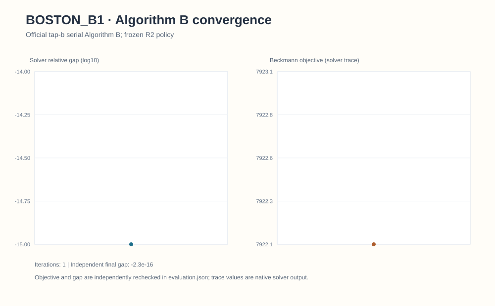
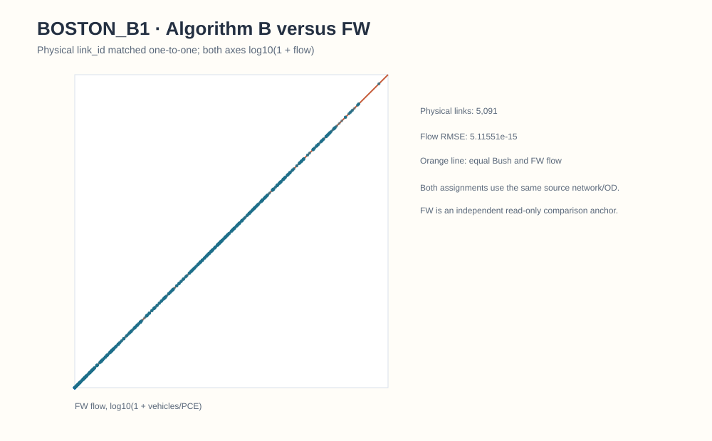
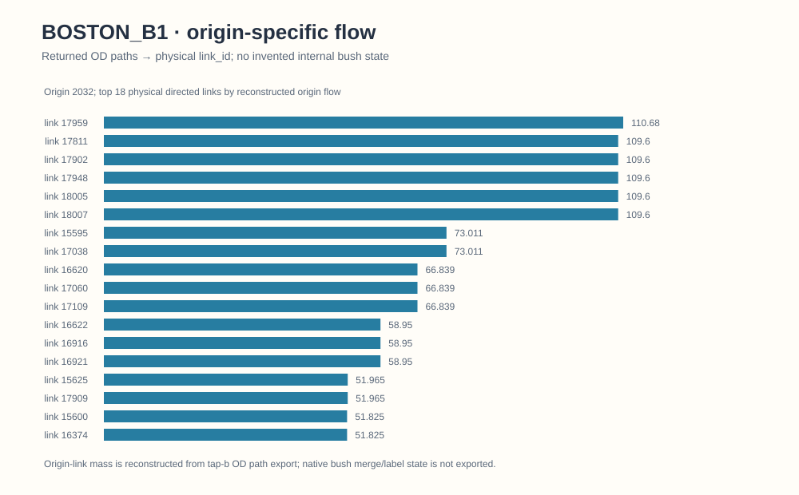
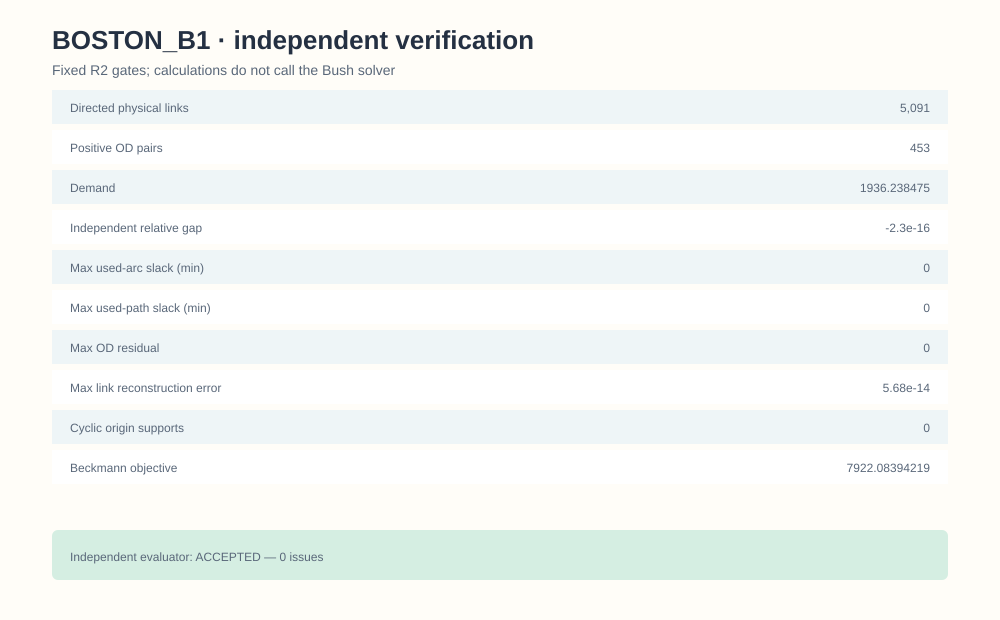

# Central Boston / task-local Algorithm B B0–B1

## 1. Problem contract and frozen policy

The bounded Central Boston static BPR problem uses **2,852 physical nodes and 5,091 directed physical links** from GMNS Plus `21_Boston` (Apache-2.0; source commit `116447ab641cca1ed34797d019c8e704063393c3`). Centroid connectors are not physical roads in this assignment. B0 is the 26-OD interface control with **203.660478635** modeled vehicle trips. B1 is a frozen holdout with **453 physical-node OD pairs and 1,936.23847491 PCE** over a two-hour conditional HBW-midday period. These are not observed all-day or citywide Boston traffic. `FIRST THRU NODE=1` and full OD precision are part of the frozen input contract. The numerical policy was fixed before either Boston run; no Boston-specific tuning was performed. [Shared method](../methods/origin-based-algorithm-b.md).

## 2. Solver and adapter path

Both accepted Boston controls used the same official `spartalab/tap-b` Algorithm B executable as Sioux, through the [task-local TAPLab-compatible lossless adapter](../../algorithms/origin_based_algorithm_b/code/taplab_bush_solver_adapter.py). They are **not official TAPLab registered-adapter runs**. The pinned stock TAPLab converter was audited before solving and changes B0/B1 first-thru-node values from 1 to 13/132, respectively, and rounds all OD values to four decimals; three positive B1 values become zero. Consequently no official TAPLab Boston solve was invoked. [Exact converter matrix](../../algorithms/origin_based_algorithm_b/parity/TAPLAB_ADAPTER_PARITY_MATRIX.csv) · [Integration status](../integrations/taplab-tapb.md).

## 3. Convergence

The accepted **B1** low-congestion holdout reached the frozen criterion in one reported iteration. This figure contains exactly that saved trace; it is not evidence of a general one-iteration convergence rate. The B0 interface control has no public candidate convergence figure.

## 4. Physical-link comparison with same-problem FW

B1's independently recomputed Beckmann objective is **7,922.083942188114 PCE-minutes**; same-problem FW is **7,922.08394219 PCE-minutes**, with physical-link flow RMSE approximately `5.1e-15` PCE. This is an agreement check on a light, conditional cohort, **not** a superiority or speedup claim. [Full aggregate B1 physical-link flow](../../algorithms/origin_based_algorithm_b/accepted_results/boston_b1_physical_link_flow.csv). B0's accepted objective is **707.057923071 vehicle-minutes**; detailed B0 flow is outside the public candidate set and is not plotted here.

## 5. Selected-origin reconstructed flow

This selected-origin view is reconstructed from exported OD paths. Native Bush merge state, approach proportions, restriction updates and backward labels were not exported. The plotted flow is modeled assignment output, not GPS counts or observed road traffic.

## 6. Independent verification

The [accepted B1 evaluation](../../algorithms/origin_based_algorithm_b/accepted_results/boston_b1_evaluation.json) records 453 exported paths, zero cyclic positive-flow origins, max OD residual `0`, aggregate link mismatch `5.68e-14`, max used-arc/path slack `0`, and an independent relative gap of `−2.295e-16` (floating-point zero). Its 452 used paths do not create a second citywide model scale. B0 passed the private interface gate but lacks public detailed evaluation/flow artifacts; no B0 figure is inferred.

## 7. Reproduction and limits

The [task-local reproduction route](../integrations/taplab-tapb.md#boston-task-local-lossless-route) needs separately obtained lawful original inputs and a locally built official tap-b executable; this release includes selected code, accepted B1 aggregate outputs and checks, **not** the raw demand, native binary, private paths or run logs. Do not substitute the stock TAPLab converter or round the OD to make it accept Boston. No model was rerun during this public integration. The Boston figures do not establish empirical/citywide validation or native internal Policy Bush state.
