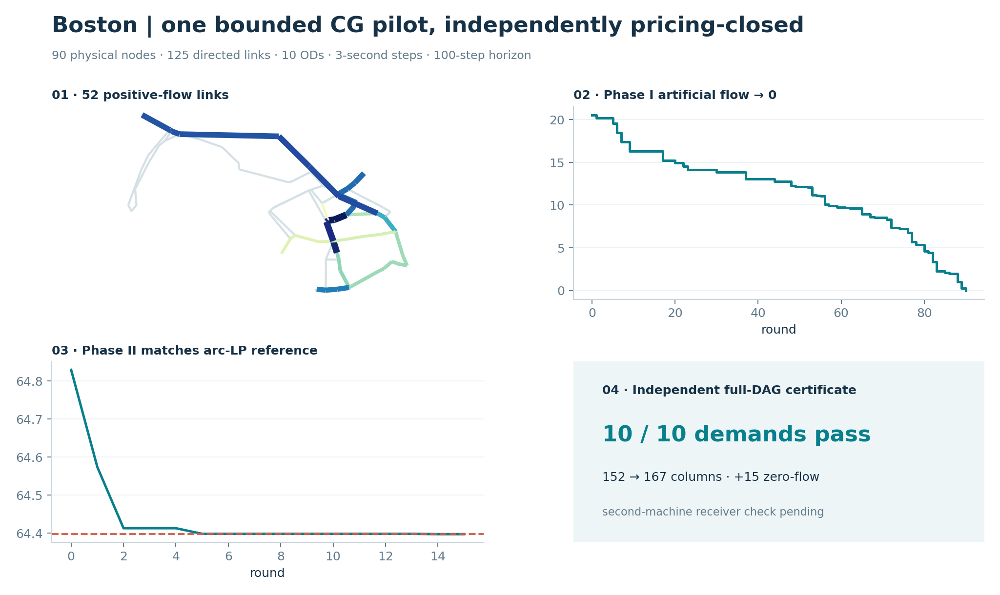
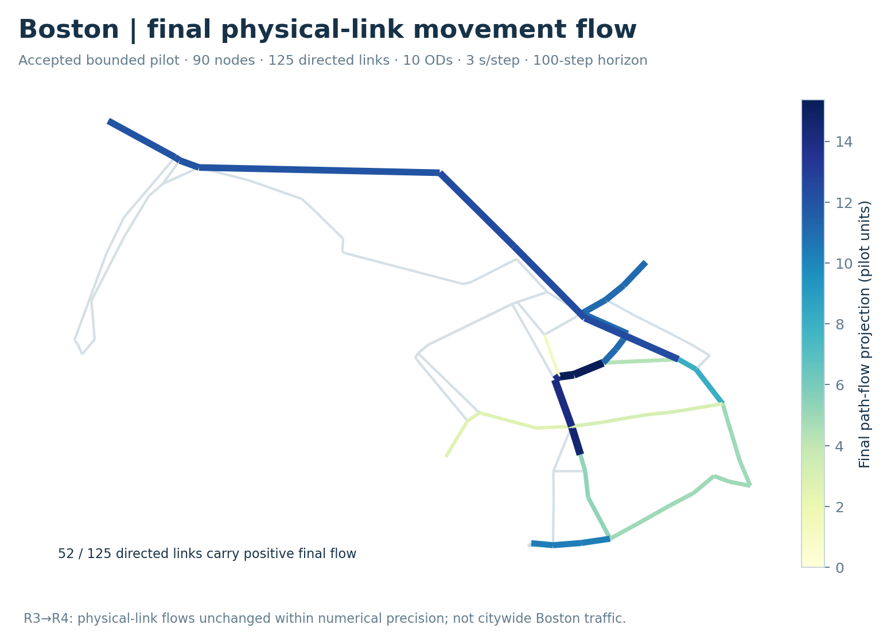
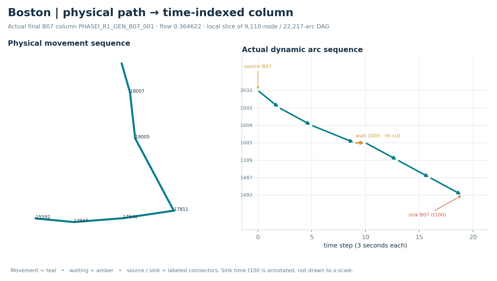
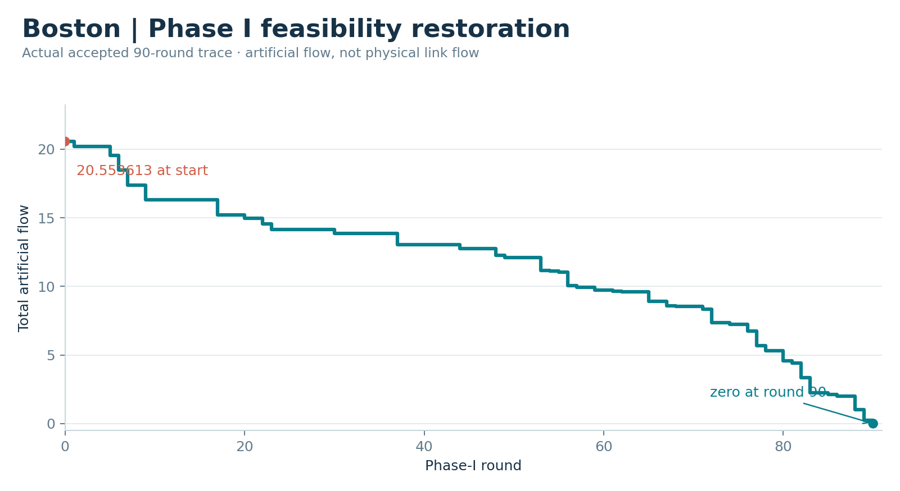
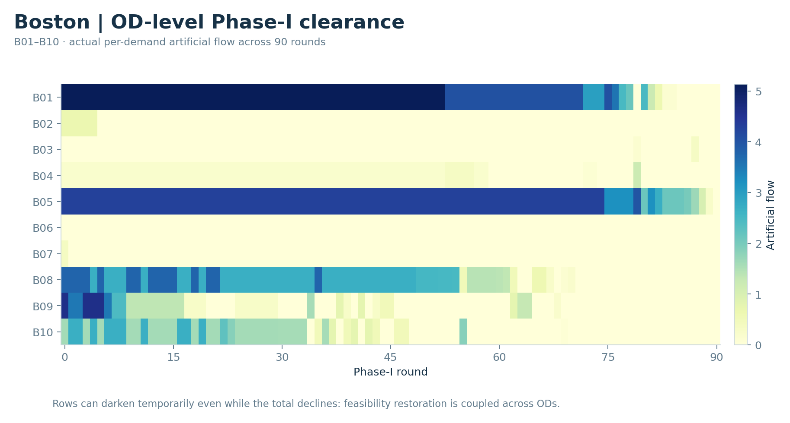
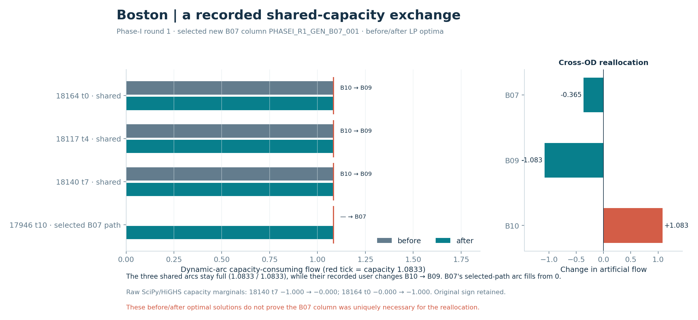
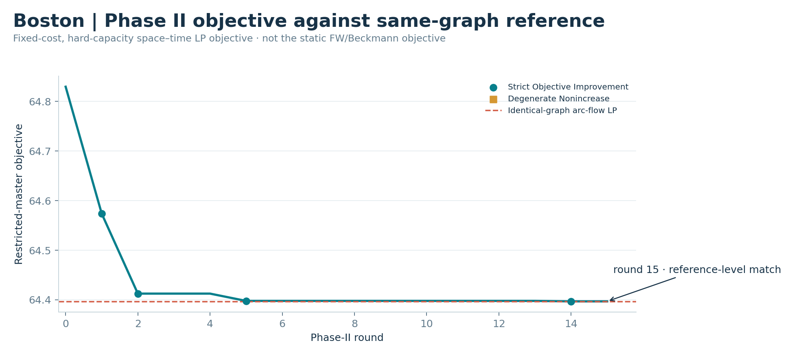
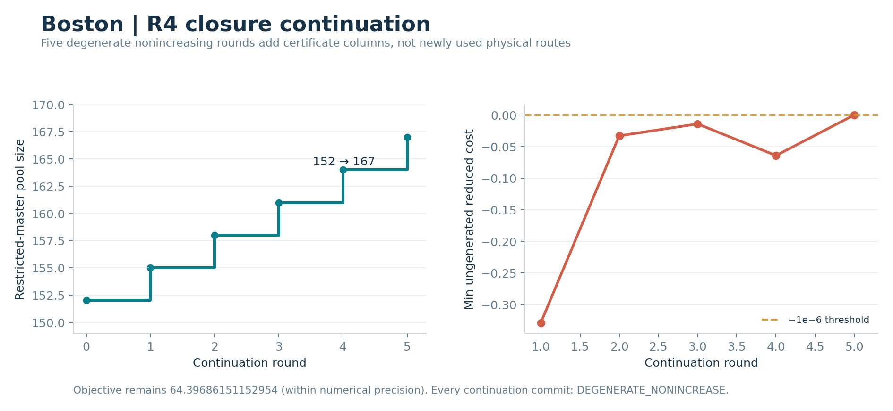
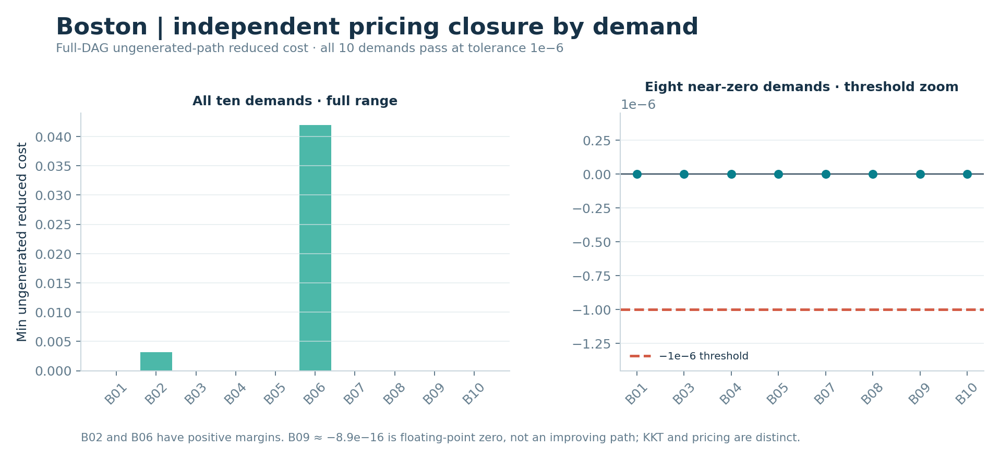
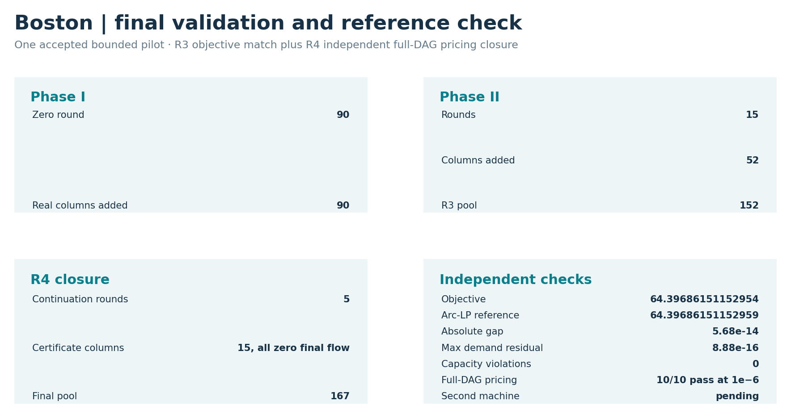

# Boston · bounded finite space–time column generation

This page reports **one accepted bounded Boston pilot**, not a citywide assignment or a second Boston scale: **90 physical nodes, 125 directed physical links, 10 OD demands, 3-second time steps and a 100-step horizon**. It solves a fixed-cost, hard-capacity, time-expanded LP. Its objective and flows must not be compared numerically with Boston's separate [static BPR/Beckmann FW and native-L3 instance](boston-assignment.md), the semantic GPS feedback panel, or the Sioux selected-OD instances.

*Figure 0 · Single-instance summary.* Of 125 directed physical links, **52** have positive final projected flow. Artificial flow reaches zero at Phase-I round **90**. The Phase-II objective meets the identical-graph arc-flow LP at numerical precision. R4 independently checks full-DAG pricing for **10/10 demands**; its 15 added columns have **zero final flow**. [Editable SVG](../assets/boston/space_time_cg_r4/boston_cg_summary_panel.svg) · [Plot inputs and figure hashes](../assets/boston/space_time_cg_r4/figure_manifest.json).

## Network and construction: physical geography versus time states

<table class="figure-grid"><tr><th>Final physical-link movement flow</th><th>Actual physical-to-space–time path cutaway</th></tr><tr><td width="50%"></td><td width="50%"></td></tr></table>

*Figure A · Final physical flow.* Accepted R3 final path flow is joined by `physical_link_id` to accepted [GMNS Plus 21_Boston](https://github.com/HanZhengIntelliTransport/GMNS_Plus_Dataset) geometry. The R4 closure leaves this projected flow unchanged within numerical precision. **This is the 90-node/125-link pilot subnetwork, not all Boston traffic.** [Exact 125-link geometry/flow join](../assets/boston/space_time_cg_r4/data/physical_link_flow_geometry.csv).

*Figure B · Construction cutaway.* Positive-flow final path `PHASEI_R1_GEN_B07_001` goes from physical node 2032 through links `18007 → 18005 → 17811`, waits at node 1005 from time 9 to 10, then uses `17946 → 17947 → 15592` to node 1492. Movement, waiting and demand-specific source/sink arcs have separate colors/labels. Physical IDs and time indices are from the [published selected path](../assets/boston/space_time_cg_r4/data/construction_path.json), [dynamic arcs](../assets/boston/space_time_cg_r4/data/construction_path_arcs.csv) and [dynamic nodes](../assets/boston/space_time_cg_r4/data/construction_path_nodes.csv); display coordinates are schematic. The sink at t100 is annotated rather than drawn to x-scale. This is a local cutaway, **not** the full 9,110-node/22,217-arc time graph.

## Phase I: total feasibility and OD-level coupling

<table class="figure-grid"><tr><th>Artificial flow, all 90 actual rounds</th><th>OD-level clearance, B01–B10</th></tr><tr><td width="50%"></td><td width="50%"></td></tr></table>

*Figures C–D · Phase-I traces.* The [total-flow input](../assets/boston/space_time_cg_r4/data/phase_i_total.csv) starts at **20.55361289739253** and reaches zero in round **90**. The chart is stepwise, with no smoothing. The [per-demand input](../assets/boston/space_time_cg_r4/data/phase_i_by_demand.csv) retains all B01–B10 values for rounds 0–90. A single demand's artificial flow can rise even while total artificial flow falls; this is shared-master feasibility reallocation, not a time series of observed queues.

<table class="figure-grid"><tr><th>Recorded binding-arc and cross-OD exchange</th><th>Phase-II objective against identical-graph reference</th></tr><tr><td width="50%"></td><td width="50%"></td></tr></table>

*Figure E · One recorded cross-OD event, not a uniqueness proof.* Phase-I round 1 selects new B07 column `PHASEI_R1_GEN_B07_001`. Its dynamic arc `explicit_link_17946_t10` goes from zero to its **1.083333** capacity. Three other saturated arcs, `explicit_link_18164_t0`, `18117_t4` and `18140_t7`, remain at **1.083333/1.083333** but change recorded user **B10 → B09**. B07 artificial flow changes **−0.364622**, B09 **−1.083333**, B10 **+1.083333**; total falls by **0.364622**. Raw SciPy/HiGHS capacity marginals retain their solver signs: 18140 t7 moves about **−1 → 0**, while 18164 t0 moves about **0 → −1**. [Before/after arc usage and duals](../assets/boston/space_time_cg_r4/data/phase_i_round1_capacity_exchange.csv) · [OD changes](../assets/boston/space_time_cg_r4/data/phase_i_round1_od_change.csv) · [Selected column](../assets/boston/space_time_cg_r4/data/phase_i_round1_selected_column.json). These saved before/after LP optima **do not prove the selected B07 path was uniquely necessary** for the exchange.

*Figure F · Phase II.* The [accepted R3 round log projection](../assets/boston/space_time_cg_r4/data/phase_ii_objective.csv) starts from feasible objective **64.82967648341466** and reaches **64.39686151152952** after **15** rounds, with **52** added columns and **152** in the R3 pool. Strict-improvement and degenerate-nonincreasing commits use different markers. The dashed line is the **identical-graph arc-flow LP reference**, not a static FW objective. Objective-level agreement at round 15 alone does not establish independent full-path-space pricing closure; that separate R4 result appears below.

## R4 independent pricing closure and final validation

<table class="figure-grid"><tr><th>Five continuation rounds</th><th>Independent by-demand certificate</th></tr><tr><td width="50%"></td><td width="50%"></td></tr></table>

*Figures I–J · Closure is a certificate, not additional traffic.* The [R4 continuation trace](../assets/boston/space_time_cg_r4/data/closure_continuation.csv) records five `DEGENERATE_NONINCREASE` commits and pool growth **152 → 167**. All 15 added columns have zero final flow, and the objective remains **64.39686151152954** within numerical precision. The [by-demand full-DAG check](../assets/boston/space_time_cg_r4/data/closure_by_demand.csv) finds no ungenerated path with reduced cost below **−1e−6** for B01–B10. Floating-point values near zero are not improving columns. Existing-path KKT/stationarity and ungenerated-path pricing closure are **different** checks.

*Figure G · Final validation.* [Editable SVG](../assets/boston/space_time_cg_r4/boston_cg_validation.svg) · [Exact plot-input summary](../assets/boston/space_time_cg_r4/data/validation_summary.json). The final R4 objective **64.39686151152954** and identical-graph arc-flow LP objective **64.3968615115296** differ by about **5.68×10⁻¹⁴**. Maximum demand residual and capacity violation are each **8.88×10⁻¹⁶**; the count of material capacity violations is zero. Independent pricing closure passes at **1e−6**. A second-machine receiver check is still **pending**.

## Source, reproduction and limits

The public release contains **projected, plot-ready** accepted R2/R3/R4 values, selected real dynamic records and accepted GMNS geometry, not the full private input archives. [Per-figure input names, captions and output hashes](../assets/boston/space_time_cg_r4/figure_manifest.json) and [accepted-source SHA-256 hashes](../assets/boston/space_time_cg_r4/data/figure_source_provenance.json) allow audit without private absolute paths. The geometry source is GMNS Plus `21_Boston`, commit `116447ab641cca1ed34797d019c8e704063393c3`, Apache-2.0. No basemap or external web asset is embedded.

To redraw the PNG/SVG figures from the released plot inputs, run `python -B tools/visuals/render_boston_cg_r4.py` from the repository root with Python, NumPy, Matplotlib and Shapely available. Run `python -B tools/visuals/check_boston_cg_r4.py` for standard-library-only checks of public plot-input consistency, numerical summaries and figure hashes. These operations **inspect/render saved results only**; they do not run Phase I, Phase II, pricing, the reference LP, demand, GPS, FW or Sioux models. The public plot inputs are the exact data used by the renderer. The 90-node pilot has no citywide calibration claim, no second Boston scale and no completed second-machine receiver check.

For the corresponding Sioux figure families, see [Sioux Falls space–time evidence](sioux-space-time.md). The Sioux 200/250-OD records are feasible and agree with their same-subset reference objectives, but **independent full-DAG pricing closure has not been established** there.
