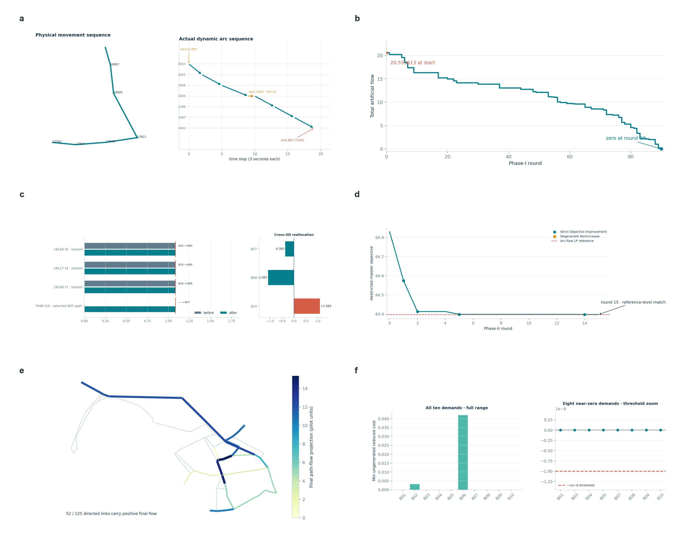
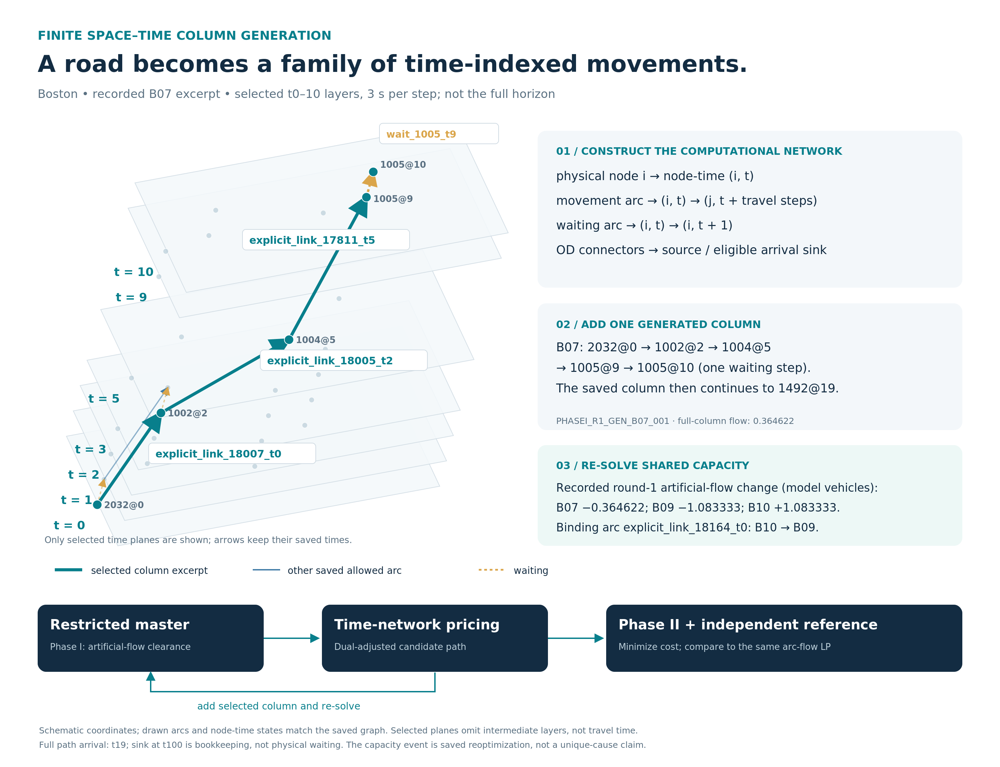
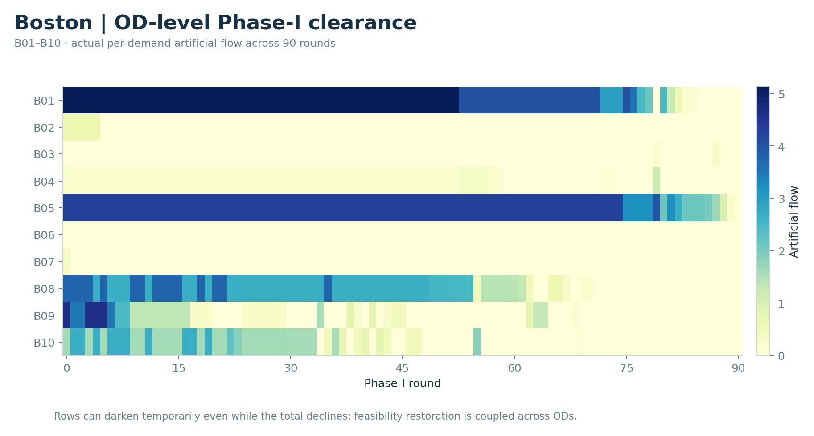
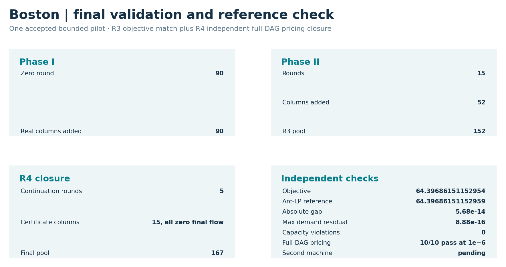
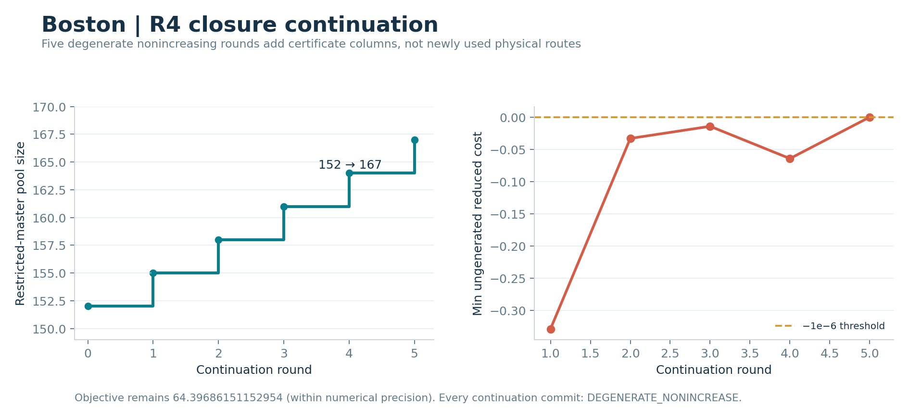

# Boston · bounded finite space–time CG pilot

These sections follow one common representation and evidence order. Original saved scientific paragraphs, tables and figures are retained directly in their matching sections.

## Case role, scope, and model statistics

One accepted 90-node/125-link, ten-demand, 3-second/100-step fixed-cost hard-capacity pilot; 9,110 time-indexed nodes and 22,217 arcs. Not citywide DTA. [Cross-city finite statistics](../data/three_city_r1/THREE_CITY_FINITE_TIME_EXPANDED_STATISTICS.md).

The current R2 six-panel view appears below. [Historical R1 layout](../assets/three_city_r1/boston_finite_space_time_case_sequence.png) · [R1 source record](../assets/three_city_r1/boston_finite_space_time_case_sequence.source.json).

This page reports **one accepted bounded Boston pilot**, not a citywide assignment or a second Boston scale: **90 physical nodes, 125 directed physical links, 10 OD demands, 3-second time steps and a 100-step horizon**. It solves a fixed-cost, hard-capacity flow problem on a finite time-expanded graph. Its objective and flows must not be compared numerically with Boston's separate [static BPR/Beckmann FW and native-L3 instance](boston-assignment.md), the semantic GPS feedback panel, or the Sioux Falls selected-OD benchmarks.

*Single-instance summary.* Of 125 directed physical links, **52** have positive final physical-link movement flow. Artificial flow reaches zero at Phase-I round **90**. Phase II reaches the objective of the arc-flow LP on the same finite time-expanded graph. R4 independently checks full-DAG pricing for **10/10 demands**; its 15 added certificate columns have **zero final flow**. The earlier [four-panel summary](../assets/boston/space_time_cg_r4/boston_cg_summary_panel.png) remains available as supplementary material ([SVG](../assets/boston/space_time_cg_r4/boston_cg_summary_panel.svg); [plot inputs and figure hashes](../assets/boston/space_time_cg_r4/figure_manifest.json)).

| Item | Boston bounded pilot |
|---|---:|
| Physical nodes | 90 |
| Directed physical links | 125 |
| OD demands | 10 |
| Time step | 3 seconds |
| Horizon | 100 steps |
| Phase-I zero round | 90 |
| Final column pool after closure | 167 |
| Reference-objective agreement | Yes |
| Independent pricing closure | 10/10 demands at `1e-6` |

*Figure — saved Boston CG evidence.* Panels (a–f) show construction, Phase-I feasibility, cross-OD capacity reallocation, Phase-II objective, final physical-link movement flow and the independent pricing check, respectively. Display crops retain plotted evidence and omit presentation prose; complete originals and the numerical validation appear below. No optimizer, pricing routine, demand model or map-matching routine was rerun. [SVG](../assets/presentation_r5/boston_cg_case_sequence.svg) · [Exact source hashes and display crops](../assets/presentation_r5/CG_CASE_SEQUENCE_SOURCES.json).

*Source-matched R2 reconstruction from saved records.* [SVG](../assets/three_city_r2/boston_finite_space_time_case_sequence.svg) · [Exact figure sources](../assets/three_city_r2/boston_finite_space_time_case_sequence.source.json) · [Full caption](../assets/three_city_r2/boston_finite_space_time_case_sequence.caption.md).

## From the physical network to the finite time-expanded graph

**The CG example solves a finite space–time linear flow model with fixed arc costs and explicit capacities.** This is distinct from static BPR/Beckmann assignment. The layered view combines saved node-time states, a recorded B07 column excerpt, and a separately recorded restricted-master capacity exchange.

*Source-grounded local excerpt; one time step is 3 seconds. The full B07 path arrives at t19; its sink at t100 is bookkeeping, not physical waiting.* [Editable SVG](../assets/cg_layered_companions_r1/boston_layered_space_time_construction.svg) · [Source record](../assets/cg_layered_companions_r1/boston_layered_space_time_construction.source.json) · [Displayed arcs](../assets/cg_layered_companions_r1/boston_display_edges.csv).

*Source-matched R2 reconstruction from saved records.* [SVG](../assets/three_city_r2/boston_physical_to_time_expanded_graph.svg) · [Exact figure sources](../assets/three_city_r2/boston_physical_to_time_expanded_graph.source.json) · [Full caption](../assets/three_city_r2/boston_physical_to_time_expanded_graph.caption.md).

<table class="figure-grid"><tr><th>Physical pilot network and final movement flow</th><th>Actual physical-to-time construction cutaway</th></tr><tr><td width="50%"></td><td width="50%"></td></tr></table>

*Physical network.* Accepted R3 final path flow is joined by `physical_link_id` to accepted [GMNS Plus 21_Boston](https://github.com/HanZhengIntelliTransport/GMNS_Plus_Dataset) geometry. The R4 closure continuation leaves the final physical-link movement flow unchanged within numerical precision. **This is the 90-node/125-link pilot subnetwork, not all Boston traffic.** [Exact 125-link geometry/flow join](../assets/boston/space_time_cg_r4/data/physical_link_flow_geometry.csv).

*Time-indexed column.* Positive-flow final column `PHASEI_R1_GEN_B07_001` goes from physical node 2032 through links `18007 → 18005 → 17811`, waits at node 1005 from time 9 to 10, then uses `17946 → 17947 → 15592` to node 1492. Movement, waiting and demand-specific source/sink arcs have separate colors and labels. Physical IDs and time indices come from the [published selected column](../assets/boston/space_time_cg_r4/data/construction_path.json), [dynamic arcs](../assets/boston/space_time_cg_r4/data/construction_path_arcs.csv) and [dynamic nodes](../assets/boston/space_time_cg_r4/data/construction_path_nodes.csv); display coordinates are schematic. The sink at t100 is annotated rather than drawn to x-scale. This is a local cutaway, **not** the full 9,110-node/22,217-arc time-expanded graph.

## A generated column as a time-indexed path

*Source-matched R2 reconstruction from saved records.* [SVG](../assets/three_city_r2/boston_generated_column_time_indexed_path.svg) · [Exact figure sources](../assets/three_city_r2/boston_generated_column_time_indexed_path.source.json) · [Full caption](../assets/three_city_r2/boston_generated_column_time_indexed_path.caption.md).

[Historical R1 generated-column layout](../assets/three_city_r1/boston_generated_column_time_indexed_path.png) · [R1 source record](../assets/three_city_r1/boston_generated_column_time_indexed_path.source.json). The R2 figure above is the current view of the same column.

Positive-flow final column `PHASEI_R1_GEN_B07_001` traverses physical links `18007 → 18005 → 17811`, waits at node 1005 from t9 to t10, and then uses `17946 → 17947 → 15592`. Its source/sink arcs and complete ordered IDs are in the [public construction record](../assets/boston/space_time_cg_r4/data/construction_path.json).

## Phase I restores feasibility

Artificial flow reaches zero at round 90. [Total trace](../assets/boston/space_time_cg_r4/boston_phase_i_artificial_flow.png) and [B01–B10 clearance](../assets/boston/space_time_cg_r4/boston_phase_i_od_clearance.png) remain below.

<table class="figure-grid"><tr><th>Total artificial flow, all 90 rounds</th><th>OD-level artificial-flow clearance, B01–B10</th></tr><tr><td width="50%"></td><td width="50%"></td></tr></table>

The [total-flow input](../assets/boston/space_time_cg_r4/data/phase_i_total.csv) starts at **20.55361289739253** and reaches zero in round **90**. The chart is stepwise, with no smoothing. The [per-demand input](../assets/boston/space_time_cg_r4/data/phase_i_by_demand.csv) retains all B01–B10 values for rounds 0–90. A single demand's artificial flow can rise even while total artificial flow falls; this is shared-master feasibility reallocation, not a time series of observed queues.

## Shared capacity couples different OD demands

Phase-I round 1 selects new B07 column `PHASEI_R1_GEN_B07_001`. Its dynamic arc `explicit_link_17946_t10` goes from zero to its **1.083333** capacity. Three other saturated arcs, `explicit_link_18164_t0`, `18117_t4` and `18140_t7`, remain at **1.083333/1.083333** but change recorded user **B10 → B09**. B07 artificial flow changes **−0.364622**, B09 **−1.083333**, B10 **+1.083333**; total artificial flow falls by **0.364622**. Raw SciPy/HiGHS capacity marginals retain their solver signs: 18140 t7 moves about **−1 → 0**, while 18164 t0 moves about **0 → −1**. [Before/after arc usage and duals](../assets/boston/space_time_cg_r4/data/phase_i_round1_capacity_exchange.csv) · [OD changes](../assets/boston/space_time_cg_r4/data/phase_i_round1_od_change.csv) · [Selected column](../assets/boston/space_time_cg_r4/data/phase_i_round1_selected_column.json).

These saved before/after restricted-master optima show a cross-OD capacity reallocation. They **do not prove the selected B07 path was uniquely necessary** for the exchange.

## Phase II improves the real-path objective

The real-only objective falls from 64.82967648341466 to 64.39686151152952 vehicle-minutes after 15 rounds. [Saved trace](../assets/boston/space_time_cg_r4/boston_phase_ii_objective.png).

The [accepted R3 round log projection](../assets/boston/space_time_cg_r4/data/phase_ii_objective.csv) starts from feasible objective **64.82967648341466** and reaches **64.39686151152952** after **15** rounds, with **52** added columns and **152** columns in the R3 pool. Strict-improvement and degenerate-nonincreasing commits use different markers. The dashed line is the objective of the **arc-flow LP on the same finite time-expanded graph**, not a static FW objective. Reference-objective agreement alone did not establish independent pricing closure; that separate R4 certificate appears below.

## From time-expanded flows back to final physical-link movement flow

*Source-matched R2 reconstruction from saved records.* [SVG](../assets/three_city_r2/boston_time_expanded_to_physical_link_flow.svg) · [Exact figure sources](../assets/three_city_r2/boston_time_expanded_to_physical_link_flow.source.json) · [Full caption](../assets/three_city_r2/boston_time_expanded_to_physical_link_flow.caption.md).

[Historical R1 physical-link aggregation layout](../assets/three_city_r1/boston_time_expanded_to_physical_link_flow.png) · [R1 source record](../assets/three_city_r1/boston_time_expanded_to_physical_link_flow.source.json). The R2 figure above is the current view of the same projection.

Accepted final movement-arc flow maps to 125 physical-link IDs; 52 have positive modeled flow. Nonphysical connectors are excluded. [Full map and joining record](../assets/boston/space_time_cg_r4/boston_cg_final_physical_link_flow.png).

[Editable SVG](../assets/boston/space_time_cg_r4/boston_cg_validation.svg) · [Exact plot-input summary](../assets/boston/space_time_cg_r4/data/validation_summary.json). The final R4 objective **64.39686151152954** and the arc-flow LP objective on the same finite time-expanded graph **64.3968615115296** differ by about **5.68×10⁻¹⁴**. Maximum demand residual and capacity violation are each **8.88×10⁻¹⁶**; the count of material capacity violations is zero. The accepted final physical-link movement flow is the 125-link view shown in Section 1. A second-machine receiver check is still **pending**.

## Reference-objective agreement

CG 64.39686151152954 and same-graph arc-flow LP 64.3968615115296 vehicle-minutes agree within about 5.68×10⁻¹⁴. This is not a static Beckmann comparison. [Validation](../assets/boston/space_time_cg_r4/boston_cg_validation.png).

## Independent pricing closure

Independent full-DAG pricing closure passes 10/10 demands at `1e-6`; the final pool has 167 columns. Fifteen R4 certificate columns have zero final flow. [By-demand panel](../assets/boston/space_time_cg_r4/boston_pricing_closure_by_demand.png).

<table class="figure-grid"><tr><th>Five closure-continuation rounds</th><th>Independent by-demand pricing certificate</th></tr><tr><td width="50%"></td><td width="50%"></td></tr></table>

The [R4 continuation trace](../assets/boston/space_time_cg_r4/data/closure_continuation.csv) records five `DEGENERATE_NONINCREASE` commits and final-column-pool growth **152 → 167**. All 15 added certificate columns have zero final flow, and the objective remains **64.39686151152954** within numerical precision. The [by-demand full-DAG check](../assets/boston/space_time_cg_r4/data/closure_by_demand.csv) finds no ungenerated path with reduced cost below **−1e−6** for B01–B10. Floating-point values near zero are not improving columns. Existing-column KKT/stationarity and ungenerated-path pricing closure are **different** checks.

## Reproduction, evidence boundary, and limits

No optimizer or pricing routine was rerun for this presentation. A second-machine receiver check remains pending; see the retained original commands and source records below.

The public release contains **projected, plot-ready** accepted R2/R3/R4 values, selected real dynamic records and accepted GMNS geometry, not the full private input archives. [Per-figure input names, captions and output hashes](../assets/boston/space_time_cg_r4/figure_manifest.json) and [accepted-source SHA-256 hashes](../assets/boston/space_time_cg_r4/data/figure_source_provenance.json) allow audit without private absolute paths. The geometry source is GMNS Plus `21_Boston`, commit `116447ab641cca1ed34797d019c8e704063393c3`, Apache-2.0. No basemap or external web asset is embedded.

To redraw the PNG/SVG figures from the released plot inputs, run `python -B tools/visuals/render_boston_cg_r4.py` from the repository root with Python, NumPy, Matplotlib and Shapely available. Run `python -B tools/visuals/check_boston_cg_r4.py` for standard-library-only checks of public plot-input consistency, numerical summaries and figure hashes. These operations **inspect or render saved results only**; they do not run Phase I, Phase II, pricing, the reference LP, demand, GPS, FW or Sioux Falls models. The public plot inputs are the exact data used by the renderer. The 90-node pilot has no citywide calibration claim, no second Boston scale and no completed second-machine receiver check.

For the corresponding Sioux Falls figure families, see [Sioux Falls finite space–time CG evidence](sioux-space-time.md). The Sioux Falls 200/250-OD records are feasible and have reference-objective agreement on their own selected-OD finite time-expanded graphs, but **independent pricing closure has not been established** there.
