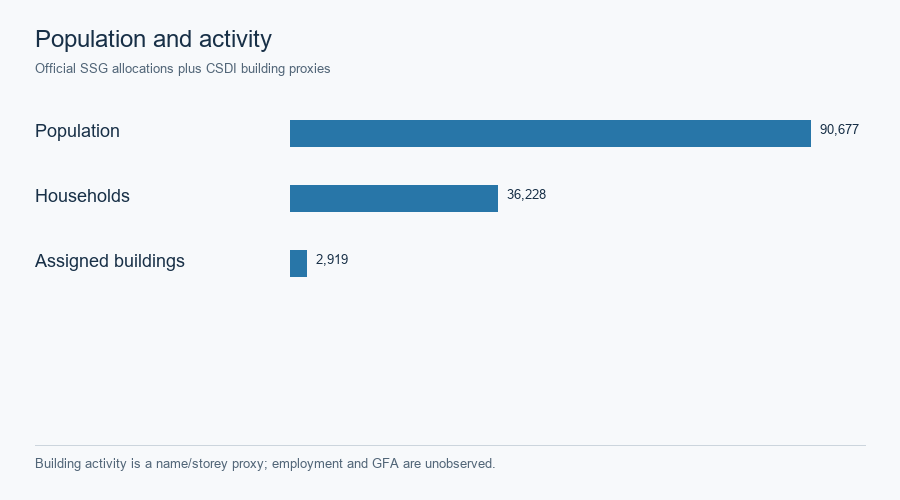
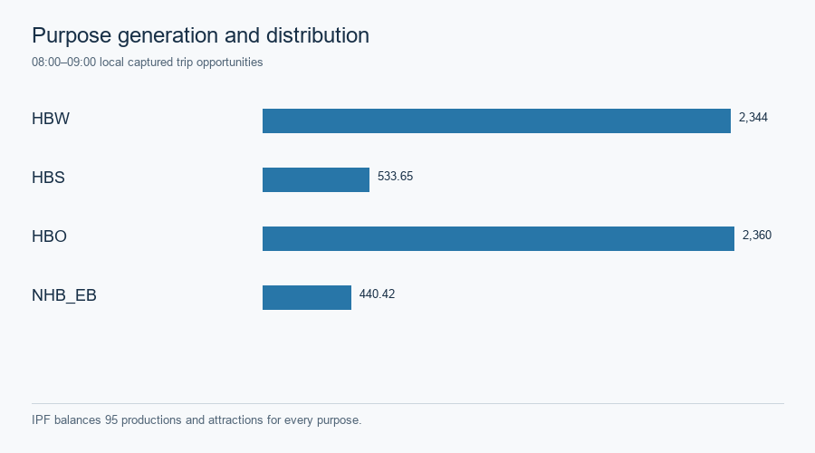
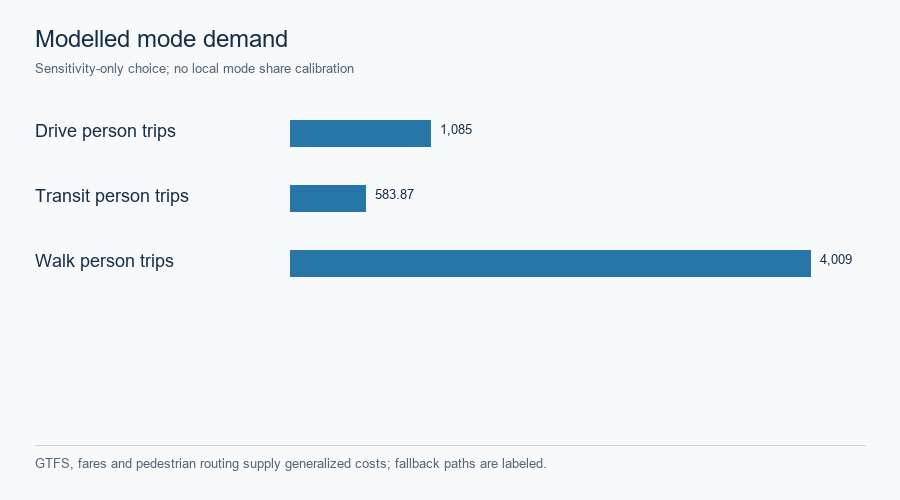

# Hong Kong · four-stage engineering scenario

This saved R2–R4 scenario is based on 95 fine SSG zones and 10 STPUG parents. The [2021 census geographies](../datasets/hong-kong-gmns.md) provide population and households, while official building footprints, storeys and name keywords supply **activity proxies**. Employment and official gross floor area were not observed. The source allocation, activity grades and exclusion ledger are in the [public Phase B records](../assets/hong_kong/full_stack_r5/r2r4_baseline/phase_b/ACTIVITY_ALLOCATION_AUDIT.json).

*These are separate prepared attributes; storey-weighted building activity is not a measured job count.* [SVG](../assets/hong_kong/full_stack_r5/r2r4_baseline/figures/hk_population_households_activity.svg) · [Source record](../assets/hong_kong/full_stack_r5/r2r4_baseline/figures/hk_population_households_activity.source.json).

| Stage | Saved construction | Boundary |
|---|---|---|
| Generation | Territory-wide 2022 Travel Characteristics Survey mechanised rate, purpose totals and approximately 13% 08:00–09:00 share transferred to this pilot; local capture 0.20/0.30/0.40 is a sensitivity | Not a locally estimated trip rate |
| Distribution | Turn-aware road-time gravity and IPF balance productions and attractions for every purpose over 8,930 reachable directed interzonal pairs | No observed OD matrix is asserted |
| Mode choice | GTFS same-trip rides, headway waiting, exact fares and pedestrian access form generalized costs; declared sensitivity logit and 1.5-person vehicle occupancy | Unroutable walking uses a labeled straight-line fallback; no local calibration |
| Road assignment | Modeled one-hour vehicle PCE enters turn-aware static FW and Algorithm B | Not measured traffic or the finite space–time CG demand |

*The margins and directed OD balance are saved in the [distribution report](../assets/hong_kong/full_stack_r5/r2r4_baseline/phase_b/DISTRIBUTION_BALANCE_REPORT.json).* [SVG](../assets/hong_kong/full_stack_r5/r2r4_baseline/figures/hk_trip_generation_distribution.svg) · [Source record](../assets/hong_kong/full_stack_r5/r2r4_baseline/figures/hk_trip_generation_distribution.source.json).

*GTFS, fares and pedestrian routing support generalized costs; fallback paths and unknowns remain identified.* [SVG](../assets/hong_kong/full_stack_r5/r2r4_baseline/figures/hk_mode_choice_costs_and_shares.svg) · [Mode-choice assumptions](../assets/hong_kong/full_stack_r5/r2r4_baseline/phase_b/MODE_CHOICE_SOURCE_AND_SENSITIVITY.md).

The 2023/2024 Annual Traffic Census records at 81 station points are descriptive AADT context. The detector layer is one 30-second snapshot, and the private UrbanNav reference trace is one research-vehicle route. None is a held-out calibration sample for this scenario. [Observation ledger](../assets/hong_kong/full_stack_r5/r2r4_baseline/phase_b/OBSERVATION_EVIDENCE_LEDGER.json) · [Source and rights register](../assets/hong_kong/full_stack_r5/r2r4_baseline/HONG_KONG_SOURCE_AND_RIGHTS_REGISTER.csv) · [Case landing](hong-kong.md).
