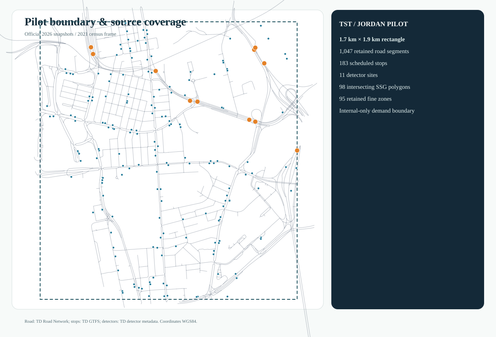
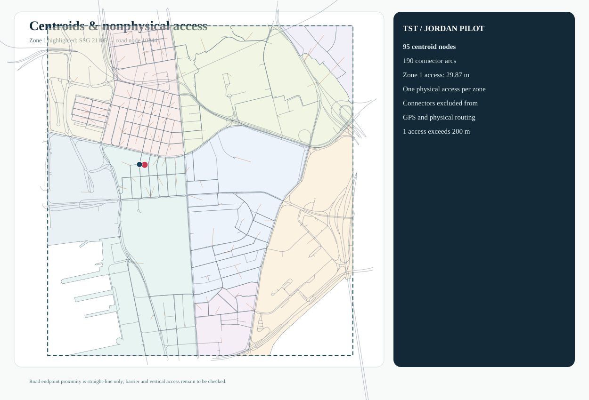
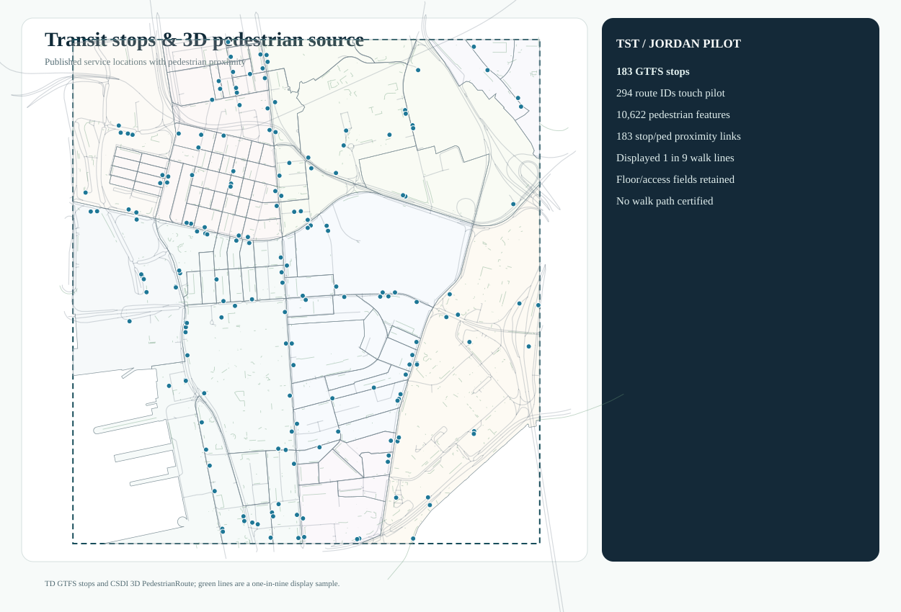
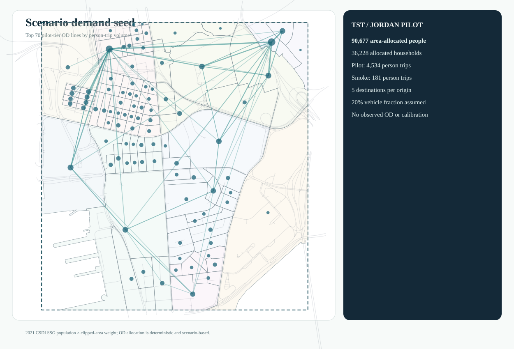

# Hong Kong / bounded GMNS and city-data pilot

This Tsim Sha Tsui–Jordan pilot tests whether official road, census, transit and detector sources can be represented as traceable GMNS-related objects. It is **not assignment-ready** and is not a completed four-stage model or calibrated forecast. The [public instance and offline tools](../../examples/hong-kong/gmns_pilot_r1/README.md) contain compact derivatives, not provider archives.

## Source and object scope

| Layer | Saved scope | Interpretation |
|---|---:|---|
| Physical network | 780 nodes, 1,239 directed links | Transport Department centerline-derived graph; direction and length retained |
| Zone hierarchy | 95 Census SSG fine zones, 10 STPUG parent zones | Source statistical polygons and model zones remain identifiable |
| Model access | 95 centroids, 190 nonphysical connector arcs | Centroid/access relationships; connectors are neither roads nor GPS-matchable |
| Transit | 183 GTFS stops, 294 route IDs | Stop-to-zone/network and route relationships, not a complete multimodal assignment |
| Detector evidence | 50 lane observations at 11 sites in one linked snapshot | Speed, 30-second volume and occupancy are measurements, not OD or calibrated link flows |
| Demography | 90,677.156 allocated persons; 36,228.315 households | 2021 census SSG estimates allocated by clipped-polygon area fraction |

The [source register](../../examples/hong-kong/gmns_pilot_r1/SOURCE_REGISTER.csv) lists resource links, retrieval times, fields and hashes. Road, turn, GTFS and detector derivatives credit the Hong Kong SAR Government and Transport Department through [DATA.GOV.HK](https://data.gov.hk/en/terms-and-conditions); census and pedestrian source derivatives credit the Government, Census and Statistics Department/Lands Department and [CSDI](https://portal.csdi.gov.hk/csdi-webpage/doc/TNC). See the [attribution](../../examples/hong-kong/gmns_pilot_r1/ATTRIBUTION.md) and [redistribution review](../../examples/hong-kong/gmns_pilot_r1/RIGHTS_AND_REDISTRIBUTION_REPORT.md). Third-party source data are not relicensed by the project's software license.

## Saved geographic and relational evidence



*Pilot boundary and source coverage. The bounded polygon is not a citywide road model.*


*Directed physical roads over the SSG/STPUG hierarchy. The source-to-model crosswalk is retained in the public instance.*



*Centroids and access arcs are modeling objects; they are deliberately distinct from physical links.*



*Saved GTFS and pedestrian-proximity relationships do not imply verified walk routes or door-to-door travel times.*



*The deterministic internal-only demand seed is an engineering scenario, not observed or calibrated OD.*

The source population and household attributes are allocated by `area(clipped SSG) / area(full SSG)`, assuming uniform distribution within each polygon. Three sub-1% slivers are excluded with recorded reasons. Activity fields preserve population, households and stop count separately; employment is unknown. Two hypothetical person-trip rates (0.002 and 0.05 per allocated resident in an abstract hour) and a stated illustrative vehicle conversion generate [seed tables](../../examples/hong-kong/gmns_pilot_r1/instance/demand_seed_person.csv), not observations. The [assumption ledger](../../examples/hong-kong/gmns_pilot_r1/DEMAND_ASSUMPTIONS.md) states totals and exclusions.

## Assignment gate and observation limits

The frozen [assignment gate](../../examples/hong-kong/gmns_pilot_r1/instance/ASSIGNMENT_GATE.json) says `assignment_ready=false`, `assignment_run=false`, and `solver_invoked=false`. Free speed, lane count, period capacity, turn enforcement and all-OD directed reachability are unresolved. A schema pass cannot close those modeling gaps. No FW, CG, Lagrangian or ADMM assignment is claimed for Hong Kong.

The detector snapshot is a roadside observation layer. An optional UrbanNav reference trajectory was checked only in a private research handoff: it is not general traffic demand, and its raw/point-level data are excluded pending exact-file rights confirmation. Public aggregate QC statements are not a downloadable matched trajectory.

## Reproduce the public checks

From `examples/hong-kong/gmns_pilot_r1` with Python 3.12+:

```bash
python -B validate_pilot.py --instance instance
python -B trace_pilot.py --instance instance --zone 1 --detector AID05111 --stop 193
```

These commands check saved object relationships and trace one zone, detector and stop. They do not rebuild the official extraction or solve assignment. [All five self-contained SVG views](../../examples/hong-kong/gmns_pilot_r1/visuals/index.html), [object dictionary](../../examples/hong-kong/gmns_pilot_r1/DATABASE_AND_OBJECT_DICTIONARY.csv), and [network limitations](../../examples/hong-kong/gmns_pilot_r1/NETWORK_LIMITATIONS.csv) remain available for audit.
