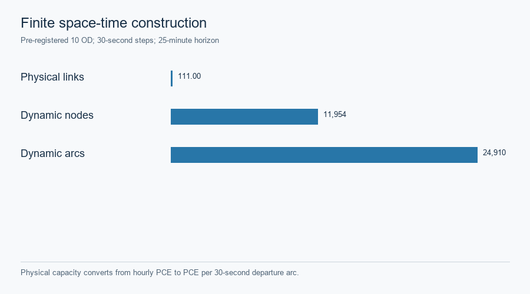

# Hong Kong · bounded finite space–time optimization

This page reports the **unchanged** `HK_TST_JORDAN_10OD_30S_50STEPS_R2_R4` finite case, not citywide dynamic assignment. The preregistered core has 111 selected physical links, **11,954 dynamic nodes**, **24,910 arcs**, ten demands, 30-second steps and a 50-step (25-minute) horizon. Physical hourly PCE capacity is scaled by `30/3600` for departure arcs; nonphysical turn/zone access and waiting arcs follow the saved [construction contract](../assets/hong_kong/full_stack_r5/r2r4_baseline/phase_c/case/case.json). The original K=1 pool, graph and demand were not rebuilt for R5.

| Independent method or check | Accepted result on this same finite graph |
|---|---|
| Arc-flow reference LP | 75.03632985794819 vehicle-minutes; demand/capacity and physical-ID mapping checks pass |
| Current two-phase CG R5 | Phase I artificial flow **4.350218719795723 → 0** in 12 rounds; Phase II adds three columns and reaches approximately **75.03632985794835** vehicle-minutes |
| Independent full-DAG pricing | Closure passes **10/10** demands at `1e-6`; minimum ungenerated reduced cost is numerical zero; no continuation column is required |
| Lagrangian R3 | Separate restricted-path recovery is feasible at the reference objective; independent duality gap **0.7444%** |
| ADMM R2 | **Gated:** first local commodity QP has 0.082467622 PCE original-unit conservation residual; zero accepted outer iterations and no accepted objective |

Reference-objective agreement and independent pricing closure are distinct statements. The early R5 Phase-II summary predates the separate closure stage and is **not** the final certificate. [Final result matrix](../assets/hong_kong/full_stack_r5/HK_CG_R5_FINAL_RESULT_MATRIX.csv) · [Independent closure certificate](../assets/hong_kong/full_stack_r5/closure/INDEPENDENT_PRICING_CLOSURE_CERTIFICATE.json) · [Closure-by-demand table](../assets/hong_kong/full_stack_r5/closure/INDEPENDENT_PRICING_CLOSURE_BY_DEMAND.csv).

## 1. From physical links to time-indexed movement

*Physical hourly capacity becomes departure-arc PCE per 30-second step. This construction is separate from the static BPR assignment.* [SVG](../assets/hong_kong/full_stack_r5/r2r4_baseline/figures/hk_physical_to_time_expanded.svg) · [Source record](../assets/hong_kong/full_stack_r5/r2r4_baseline/figures/hk_physical_to_time_expanded.source.json).

## 2. Phase I restores real-path feasibility

*Exact-DAG pricing clears 4.350218719795723 artificial PCE by round 12 on the original ten-demand case.* [SVG](../assets/hong_kong/full_stack_r5/figures/hk_cg_phase_i_artificial_flow.svg) · [Source record](../assets/hong_kong/full_stack_r5/figures/hk_cg_phase_i_artificial_flow.source.json).

*All ten demands have zero final Phase-I artificial flow; the initial deficit was concentrated in three demands.* [SVG](../assets/hong_kong/full_stack_r5/figures/hk_cg_phase_i_by_demand.svg) · [Saved trace](../assets/hong_kong/full_stack_r5/cg_run/full_cg_v1_phase_i_artificial_flow_trace.csv).

## 3. Phase II and the same-graph reference

*The real-only restricted master falls from 75.075236 to 75.036330 vehicle-minutes after three added columns. The horizontal reference is the unchanged arc-flow LP on this graph.* [SVG](../assets/hong_kong/full_stack_r5/figures/hk_cg_phase_ii_objective.svg) · [Source record](../assets/hong_kong/full_stack_r5/figures/hk_cg_phase_ii_objective.source.json).

## 4. Independent pricing closure and original-space checks

*All ten demands pass the minimum ungenerated reduced-cost gate. The independent complete-DAG evaluator makes no optimizer call.* [SVG](../assets/hong_kong/full_stack_r5/figures/hk_cg_pricing_closure.svg) · [Redacted certificate](../assets/hong_kong/full_stack_r5/closure/INDEPENDENT_PRICING_CLOSURE_CERTIFICATE.json) · [Solver-free public verifier](../assets/hong_kong/full_stack_r5/verify_receiver_r5.py).

The final public RMP has 25 columns. A solver-free audit reconstructs objective **75.03632985794826** vehicle-minutes and checks zero demand/capacity residual within `1e-6`, model/seed signatures, result lineage and original physical-link projection. Private route sequences, full generated pools and dual arrays are excluded from the public projection. [Public verifier](../assets/hong_kong/full_stack_r5/verify_receiver_r5.py) · [Model freeze](../assets/hong_kong/full_stack_r5/HK_CG_R5_CASE_FREEZE.json).

## 5. Final physical-link movement flow

*Time-indexed movement is aggregated onto the 111 original physical-link IDs; 69 carry positive **modeled** flow. This is not an observed count map.* [SVG](../assets/hong_kong/full_stack_r5/figures/hk_cg_final_physical_link_movement_flow.svg) · [Source record](../assets/hong_kong/full_stack_r5/figures/hk_cg_final_physical_link_movement_flow.source.json).

## 6. Other finite methods and the retained gate

*LP, current CG and the separately recovered Lagrangian feasible primal agree at the same reference objective. ADMM has no accepted objective and is not plotted as a numerical peer.* [SVG](../assets/hong_kong/full_stack_r5/figures/hk_same_graph_method_comparison.svg) · [Lagrangian evaluation](../assets/hong_kong/full_stack_r5/r2r4_baseline/phase_c/lagrangian_evaluation.json).

The frozen ADMM R2 transfer remains gated at its **first** original-unit local conservation check, before accepted outer iterations. Its [saved gate figure](../assets/hong_kong/full_stack_r5/r2r4_baseline/figures/hk_admm_residuals_and_feasibility.png) and [result record](../assets/hong_kong/full_stack_r5/r2r4_baseline/phase_c/admm_run/result.json) are historical and were not converted into an accepted run.

The earlier R2–R4 CG enumerator limit and its figures are preserved under `r2r4_baseline/` as **superseded history only**. They do not describe current R5 CG. Static Beckmann and finite fixed-cost vehicle-minute objectives cannot be compared numerically. [Case landing](hong-kong.md) · [Evidence contract and no-solver checks](../methods/hong-kong-evidence-contract.md).
