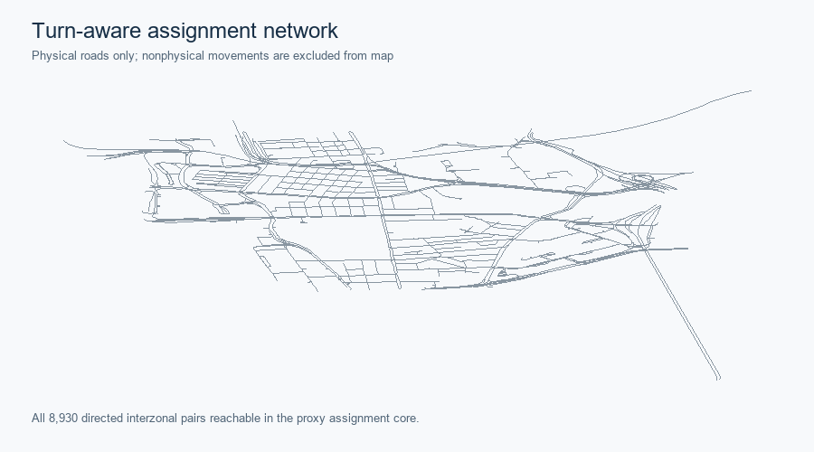
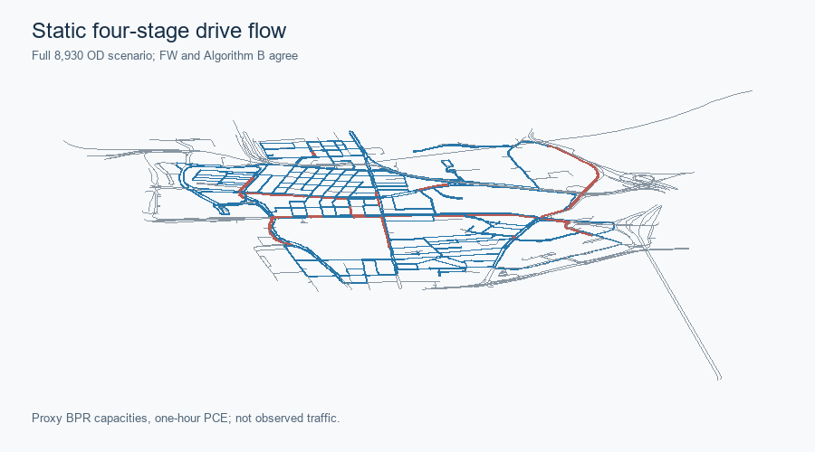
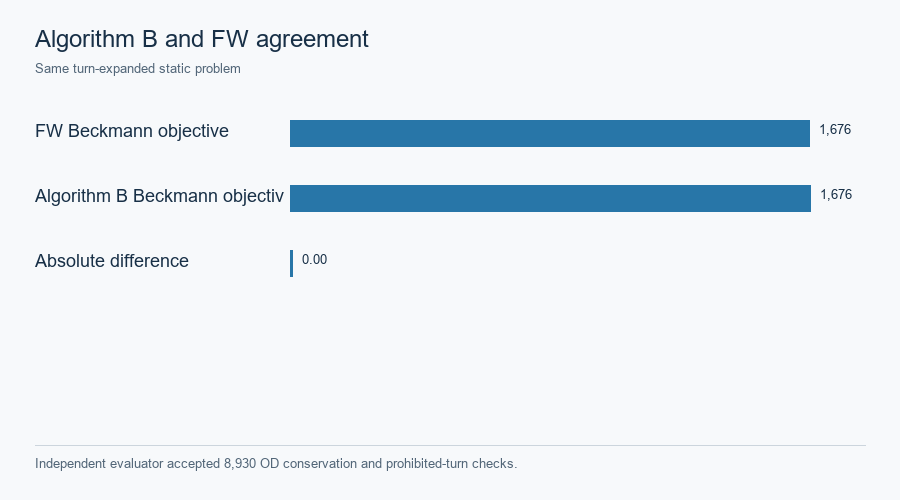

# Hong Kong · static Frank–Wolfe and Algorithm B

The accepted assignment-ready graph retains 1,239 directed physical links, source turn restrictions and grade-separation quarantine. All 95 zones reach the selected strongly connected core, but straight zone-access proxies remain unverified for barriers and water. Posted speed limits have an official source; conversion to free speed, lane count and BPR capacity are **engineering transfers**, not observed link attributes. [Phase A gate](../assets/hong_kong/full_stack_r5/r2r4_baseline/phase_a/ASSIGNMENT_READY_GATE_R2.json) · [Turn routing contract](../assets/hong_kong/full_stack_r5/r2r4_baseline/phase_a/TURN_AWARE_ROUTING_CONTRACT.md).

*All 8,930 directed interzonal pairs are reachable in the proxy core.* [SVG](../assets/hong_kong/full_stack_r5/r2r4_baseline/figures/hk_assignment_ready_network.svg) · [Source record](../assets/hong_kong/full_stack_r5/r2r4_baseline/figures/hk_assignment_ready_network.source.json).

Static FW and official `spartalab/tap-b` Algorithm B were evaluated on identical turn-expanded links and 8,930 positive OD pairs. Hong Kong uses an accepted **task-local lossless TAPLab-compatible adapter**, not official TAPLab registered-adapter parity. The independent evaluator reports Beckmann objective **1,676.01213133** for both methods, maximum physical-flow difference below **1e-12 PCE**, zero prohibited turns and zero OD imbalance. The modeled load is **723.191227885 PCE in one hour**. [Saved comparison](../assets/hong_kong/full_stack_r5/r2r4_baseline/phase_b/STATIC_ASSIGNMENT_COMPARISON.json) · [TAPLab/tap-b distinctions](../integrations/taplab-tapb.md).

*Modeled PCE under proxy BPR capacity, not a measured count map.* [SVG](../assets/hong_kong/full_stack_r5/r2r4_baseline/figures/hk_static_fw_flow.svg) · [Source record](../assets/hong_kong/full_stack_r5/r2r4_baseline/figures/hk_static_fw_flow.source.json).

*The saved independent check covers OD conservation and prohibited turns.* [SVG](../assets/hong_kong/full_stack_r5/r2r4_baseline/figures/hk_algorithm_b_vs_fw.svg) · [Source record](../assets/hong_kong/full_stack_r5/r2r4_baseline/figures/hk_algorithm_b_vs_fw.source.json).

This static BPR/Beckmann objective must not be numerically compared with the later [fixed-cost, hard-capacity finite space–time objective](hong-kong-space-time.md). Neither static result is a validated traffic forecast. [Case landing](hong-kong.md).
