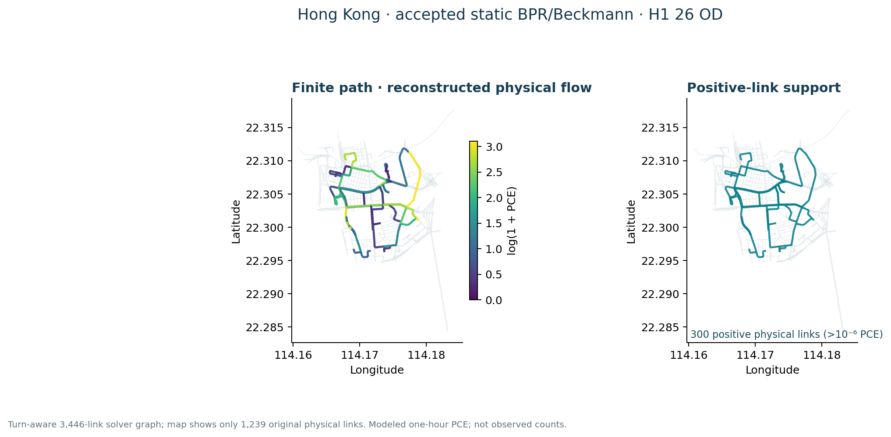
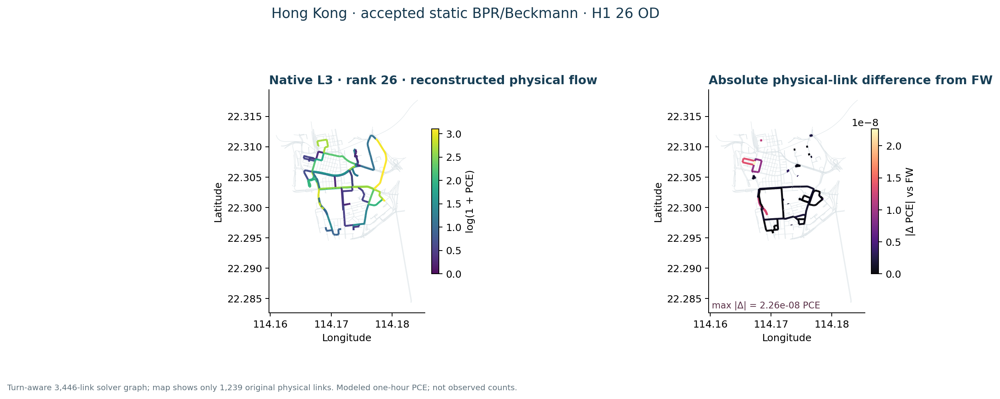
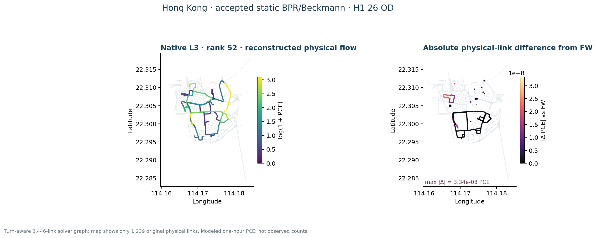
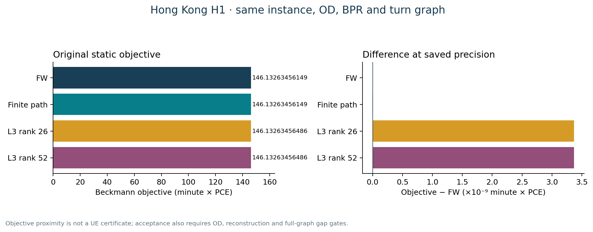

# Hong Kong · static Frank–Wolfe and Algorithm B

The accepted assignment-ready graph retains 1,239 directed physical links, source turn restrictions and grade-separation quarantine. All 95 zones reach the selected strongly connected core, but straight zone-access proxies remain unverified for barriers and water. Posted speed limits have an official source; conversion to free speed, lane count and BPR capacity are **engineering transfers**, not observed link attributes. [Phase A gate](../assets/hong_kong/full_stack_r5/r2r4_baseline/phase_a/ASSIGNMENT_READY_GATE_R2.json) · [Turn routing contract](../assets/hong_kong/full_stack_r5/r2r4_baseline/phase_a/TURN_AWARE_ROUTING_CONTRACT.md).

*All 8,930 directed interzonal pairs are reachable in the proxy core.* [SVG](../assets/hong_kong/full_stack_r5/r2r4_baseline/figures/hk_assignment_ready_network.svg) · [Source record](../assets/hong_kong/full_stack_r5/r2r4_baseline/figures/hk_assignment_ready_network.source.json).

Static FW and official `spartalab/tap-b` Algorithm B were evaluated on identical turn-expanded links and 8,930 positive OD pairs. Hong Kong uses an accepted **task-local lossless TAPLab-compatible adapter**, not official TAPLab registered-adapter parity. The independent evaluator reports Beckmann objective **1,676.01213133** for both methods, maximum physical-flow difference below **1e-12 PCE**, zero prohibited turns and zero OD imbalance. The modeled load is **723.191227885 PCE in one hour**. [Saved comparison](../assets/hong_kong/full_stack_r5/r2r4_baseline/phase_b/STATIC_ASSIGNMENT_COMPARISON.json) · [TAPLab/tap-b distinctions](../integrations/taplab-tapb.md).

*Modeled PCE under proxy BPR capacity, not a measured count map.* [SVG](../assets/hong_kong/full_stack_r5/r2r4_baseline/figures/hk_static_fw_flow.svg) · [Source record](../assets/hong_kong/full_stack_r5/r2r4_baseline/figures/hk_static_fw_flow.source.json).

*The saved independent check covers OD conservation and prohibited turns.* [SVG](../assets/hong_kong/full_stack_r5/r2r4_baseline/figures/hk_algorithm_b_vs_fw.svg) · [Source record](../assets/hong_kong/full_stack_r5/r2r4_baseline/figures/hk_algorithm_b_vs_fw.source.json).

## Bounded H1 finite-path and Native Diagnostic L3

**Public interpretation: `ACCEPTED_BOUNDED_LOW_CONGESTION_TRANSFER`.** This corrected R2 result is on a frozen **H1 static turn-aware BPR/Beckmann instance**, not on all 8,930 Hong Kong ODs. Its 26 selected positive ODs carry 52.17845064587021 modeled PCE/hour; K=5 generated 126 legal simple paths. The exact H1 FW anchor, finite-path solution, and Native Diagnostic L3 ranks 26 and 52 share the same 3,446-link turn-expanded solver graph and 1,239 original physical links. [Corrected R2 source and figure hashes](../assets/hong_kong/static_path_l3_r2/RESULT_SOURCE.json) · [Figure manifest](../assets/hong_kong/static_path_l3_r2/FIGURE_MANIFEST.csv).

| Tier | Static path/L3 scope | Result boundary |
|---|---|---|
| H0 | 10 OD / 50 paths | Interface smoke only; no optimization result |
| H1 | 26 OD / 126 legal paths | Accepted bounded low-congestion finite-path and rank-26/52 L3 transfer |
| H2 | 100 OD / 492 paths | Path/resource preflight only; not solved |
| Full Hong Kong | 8,930 positive ODs | Finite-path / L3 not demonstrated |

The corrected singleton OD is **zone 11 → 12**, with one 13-edge legal simple path. Edge-removal reachability was revalidated: removing any edge disconnects that path. Zone **80 → 38 has five legal paths**, not one. The saved basis metadata corresponds to minor-path incidence on the **full 3,446-link turn-expanded solver-link graph**, not physical-link-only incidence. Neither correction changes the saved numerical results.

| Same H1 static method | Recomputed Beckmann objective | Full-graph relative gap |
|---|---:|---:|
| Exact H1 FW anchor | 146.1326345614876 | −5.835×10⁻¹⁶ |
| Finite-path SLSQP | 146.13263456148755 | −5.835×10⁻¹⁶ |
| Native Diagnostic L3 rank 26 | 146.13263456485635 | 2.3052423×10⁻¹¹ |
| Native Diagnostic L3 rank 52 | 146.13263456485632 | 2.3052228×10⁻¹¹ |

The H1 instance is **low-congestion**: maximum physical v/c is 0.0425032874, and maximum BPR relative cost increase is about 4.8953×10⁻⁷. FW accepted its initial all-or-nothing flow at the declared tolerance with zero iterations; finite-path flow matches that H1 FW/f0 anchor at saved precision. Independent saved-result replay checked OD conservation, legal paths and turns, original-space reconstruction, physical-link projection, objective, and full-graph gaps. Thus the result validates bounded transfer and reconstruction, **not** a nontrivial route-splitting compression stress test, rank sensitivity, speedup, or full-city scalability. The accepted full Hong Kong FW/Algorithm B objective is a different 8,930-OD static instance and is not the H1 reference.

*H1 26-OD / 126-path reconstructed physical-link flow and support. The low-congestion finite solution equals its H1 FW/f0 anchor at saved precision; modeled PCE, not observed traffic or a full-city result.* [SVG](../assets/hong_kong/static_path_l3_r2/hong_kong_finite_flow_support.svg).

*Rank-26 original-space reconstruction and physical-link difference on H1. The declared checks pass; minor-path flow totals 8.43×10⁻⁸ PCE. This low-congestion result is not a route-splitting compression stress test.* [SVG](../assets/hong_kong/static_path_l3_r2/hong_kong_l3_rank26_reconstruction_difference.svg).

*Rank-52 original-space reconstruction and physical-link difference on the same H1 pool. The declared checks pass; minor-path flow totals 9.97×10⁻⁸ PCE. The rank comparison does not establish sensitivity or speedup.* [SVG](../assets/hong_kong/static_path_l3_r2/hong_kong_l3_rank52_reconstruction_difference.svg).

*Recomputed objectives for H1 FW, finite-path, rank 26 and rank 52 on one frozen static instance. Objective agreement is one part of the checks; the accepted interpretation remains bounded low-congestion transfer, supported also by independent full-graph gaps and reconstruction checks.* [SVG](../assets/hong_kong/static_path_l3_r2/hong_kong_h1_objective_comparison.svg) · [Corrected R2 source record](../assets/hong_kong/static_path_l3_r2/RESULT_SOURCE.json).

This static BPR/Beckmann objective must not be numerically compared with the later [fixed-cost, hard-capacity finite space–time objective](hong-kong-space-time.md). Neither static result is a validated traffic forecast. [Case landing](hong-kong.md).
