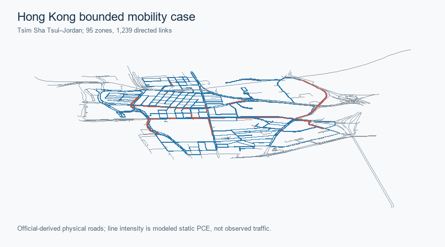

# Hong Kong · bounded Tsim Sha Tsui–Jordan case

The common nine-module order exposes the original case evidence directly. Model branches, instance sizes and evidence grades remain distinct.

<!-- CASE COVER R1 START -->

*Case-entry cover; saved results, scope and sources are detailed below.*
<!-- CASE COVER R1 END -->

## Role in the repository

Bounded turn-aware GMNS/four-stage engineering case and a separate frozen ten-demand finite case.

This is an **accepted bounded technical case**, not an empirically calibrated Hong Kong forecast. It extends the retained [R1 GMNS/data pilot](hong-kong-gmns-pilot.md) without rewriting that historical checkpoint. The R2–R4 public bundle adds an assignment-ready, turn-aware network, a four-stage engineering scenario, static Frank–Wolfe and Algorithm B, and a preregistered finite space–time reference LP. R5 completes current two-phase column generation (CG) and independent pricing closure on the **unchanged ten-demand finite case**. Hong Kong ADMM remains gated.

## Scope and statistics

780 physical nodes, 1,239 directed physical links in the city-data case; finite R5 selects 100 nodes and 111 links.

| Metric | Accepted bounded instance |
|---|---|
| City physical network | 780 nodes; 1,239 directed links |
| Static scenario | 8,930 OD pairs; 723.191 PCE in 1 h |
| Finite CG case | 100 selected nodes; 111 links; 10 ODs |

| Layer | Saved result | Scope |
|---|---|---|
| City graph and hierarchy | 780 physical nodes, 1,239 directed physical links, 95 fine SSG zones, 10 STPUG parents | Source IDs, nonphysical access, turn and grade-separation checks retained |
| Four-stage scenario | 8,930 reachable directed interzonal OD pairs; 723.191 PCE modeled one-hour road load | Transferred rates, proxy activity, sensitivity mode choice; not observed demand |
| Static assignment | Turn-aware FW and official `tap-b` Algorithm B agree under the accepted task-local lossless TAPLab-compatible adapter | Stock official-adapter parity is **not** claimed for Hong Kong |
| Finite space–time LP / CG | 10 ODs, 111 selected physical links, 11,954 dynamic nodes, 24,910 arcs; CG and LP agree at 75.036329857948 vehicle-minutes | Independent full-DAG pricing closure passes 10/10 demands at 1e-6 |
| Lagrangian / ADMM | Feasible Lagrangian primal with 0.7444% certified gap; ADMM R2 gated before accepted outer iterations | No accepted Hong Kong ADMM objective |

*Official-derived physical roads and **modeled** one-hour static PCE, not an observed traffic map.* [SVG](../assets/hong_kong/full_stack_r5/r2r4_baseline/figures/hk_full_stack_overview.svg) · [Source record](../assets/hong_kong/full_stack_r5/r2r4_baseline/figures/hk_full_stack_overview.source.json).

## GMNS, zones, and source evidence

[GMNS, zones, turns and grade checks](../datasets/hong-kong-gmns.md) retain physical and nonphysical identities.

[GMNS objects and source rights](../datasets/hong-kong-gmns.md) distinguish roads, turn states, centroids and nonphysical connectors.

## Demand, transit, and observations

[Four-stage scenario](hong-kong-four-stage.md) uses building/activity and transit/pedestrian evidence with explicit assumptions; detector/UrbanNav records are not held-out validation.

[The four-stage engineering scenario](hong-kong-four-stage.md) gives population/household/activity preparation, trip generation, distribution, mode-choice inputs and the evidence grade of 50 detector-lane snapshots. Private UrbanNav points are not distributed.

## Static assignment

[Turn-aware static FW/Algorithm B](hong-kong-static-assignment.md) have separate static objectives; official TAPLab adapter parity is not claimed.

[FW and task-local lossless Algorithm B evidence](hong-kong-static-assignment.md) use the declared turn-aware BPR/Beckmann problem; official registered-adapter parity is not claimed for Hong Kong.

## Finite time-expanded algorithms

[Accepted R5 CG](hong-kong-space-time.md) has same-graph LP agreement and independent full-DAG pricing closure. Lagrangian recovery is separate; ADMM remains **Gated**.

*Current source-matched R2 layout; panel b contains the specifically approved model-generated HK10 excerpt, not an observed trajectory.* [SVG](../assets/three_city_r2/hong_kong_finite_space_time_case_sequence.svg) · [Source and exact input hashes](../assets/three_city_r2/hong_kong_finite_space_time_case_sequence.source.json) · [Historical R1 layout](../assets/three_city_r1/hong_kong_finite_space_time_case_sequence.png) · [Exact disclosure scope](../assets/three_city_r2/HK10_DISCLOSURE_APPROVAL_CURRENT.json).

[Representation-level figures and full finite case](hong-kong-space-time.md).

[The R5 finite CG case](hong-kong-space-time.md) has same-graph LP agreement and independent 10/10 pricing closure. Lagrangian has a separate feasible-primal/dual-bound certificate; ADMM remains gated.

## Independent verification

Ten of ten CG demands pass independent pricing closure; no citywide DTA or empirical calibration is established.

## City-specific evidence and limits

Original provider archives, full column pool, raw point evidence and dual arrays remain excluded from the public projection.

The earlier R1 data checkpoint remains historical; R2–R4 legacy CG gate is superseded by R5, while Hong Kong ADMM remains gated.

## Reproduction

Use the [public evidence contract and verifier](../methods/hong-kong-evidence-contract.md).

1. [GMNS objects, source register and rights boundary](../datasets/hong-kong-gmns.md) distinguish physical links, turn states, centroids, connectors and the two zone levels.
2. [Four-stage scenario](hong-kong-four-stage.md) gives the population/household/activity preparation, transferred trip rates, distribution, mode costs and observation grades.
3. [Static assignment](hong-kong-static-assignment.md) gives FW, Algorithm B, independent conservation and turn checks under one BPR objective.
4. [Finite space–time CG, reference LP, Lagrangian and ADMM gate](hong-kong-space-time.md) separates each mathematical certificate.
5. [Evidence contract](../methods/hong-kong-evidence-contract.md) names the assumptions, source rights and supported reproduction.

The [exact-file R5 bundle manifest](../assets/hong_kong/full_stack_r5/HASH_MANIFEST.json) preserves the accepted R2–R4 public candidate under `r2r4_baseline/` and adds only approved aggregate CG evidence. Its old gated CG text is **historical R2–R4 evidence, superseded by R5**; it is not the current Hong Kong CG status. The original R1 pilot remains a separately dated data checkpoint, not the assignment gate for this later case.
