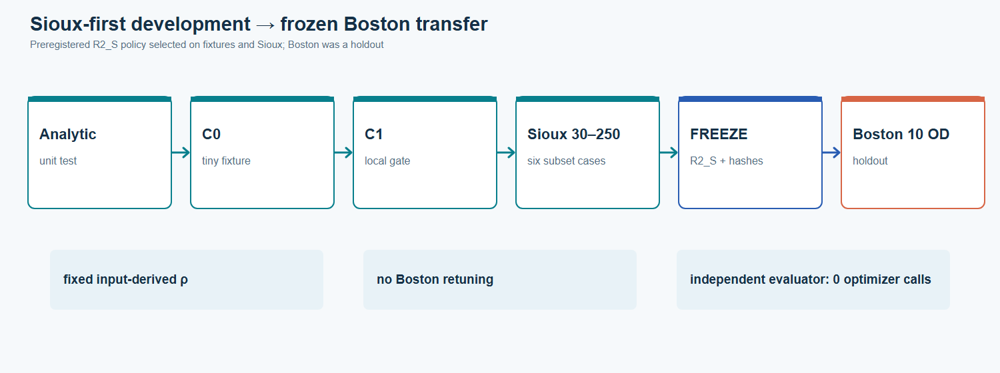
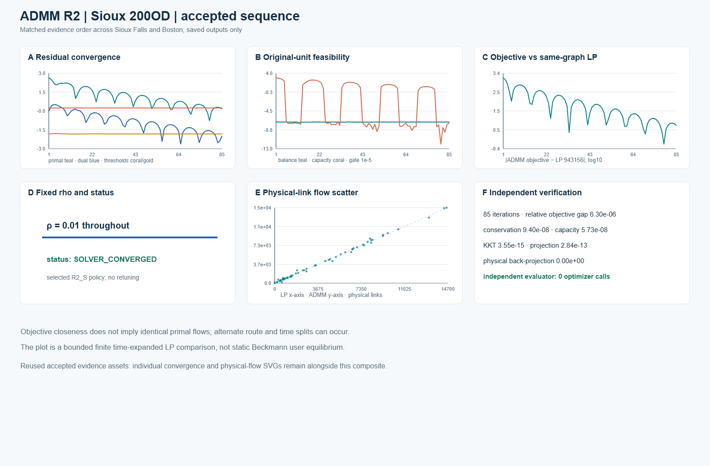
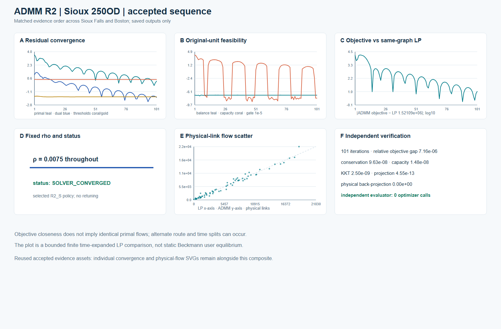

# Sioux Falls ADMM R2 · selected finite space–time cases

The accepted R2_S development ladder ran analytic, C0, C1, then Sioux Falls 30, 60, 100, 150, 200 and 250 OD subsets. All mandatory cases passed before the policy and source hashes were frozen for Boston. These are selected time-expanded shared-capacity instances, **not** the complete 528-positive-OD Sioux benchmark and not static Beckmann UE.

| Saved case | Iterations | ADMM objective | Same-graph LP objective | Relative objective gap | Max local balance | Max capacity excess |
|---|---:|---:|---:|---:|---:|---:|
| Sioux 200 OD | 85 | 943161.533307 | 943155.589771 | 6.30e-6 | 9.40e-8 | 5.73e-8 |
| Sioux 250 OD | 101 | 1521101.731718 | 1521090.836620 | 7.16e-6 | 9.63e-8 | 1.48e-8 |

The independent evaluator passed conservation, capacity, KKT, projection, objective recomputation and physical back-projection with **zero optimizer calls**. The ADMM solver itself made local QP optimizer calls during the original accepted runs; zero applies to independent evaluation and this saved-result figure build.

## Matched case sequences

The two composites use the same 2×3 order: residuals, original-unit local balance/capacity, objective distance to the same-graph LP, fixed rho/status, physical-link ADMM-versus-LP scatter and an independent-check card.

[200-OD SVG](../assets/admm_r2/figures/admm_sioux_200_case_sequence.svg) · [original accepted convergence SVG](../assets/admm_r2/figures/convergence_Sioux_200OD.svg) · [original accepted physical-flow scatter SVG](../assets/admm_r2/figures/physical_flow_Sioux_200OD.svg)

[250-OD SVG](../assets/admm_r2/figures/admm_sioux_250_case_sequence.svg) · [original accepted convergence SVG](../assets/admm_r2/figures/convergence_Sioux_250OD.svg) · [original accepted physical-flow scatter SVG](../assets/admm_r2/figures/physical_flow_Sioux_250OD.svg)

## Physical-link movement flow

The maps join the saved project-generated per-link ADMM/LP comparisons to the **already-public 76-link Sioux topology** by `physical_link_id`. The layout is deterministic and schematic; it is not a geographic coordinate map. Each absolute ADMM/LP pair has one shared scale for its own subset. Signed maps are centered at zero and preserve their actual range.

| 200 OD · absolute ADMM and LP | 200 OD · signed ADMM − LP |
|---|---|
|  |  |

| 250 OD · absolute ADMM and LP | 250 OD · signed ADMM − LP |
|---|---|
|  |  |

**Interpretation.** The largest saved physical-link ADMM/LP differences are about 600 vehicles (200 OD) and 3,032 vehicles (250 OD), even though objective gaps are small. The finite LP can have alternate route and time splits; objective agreement is not primal-flow identity. Movement flow sums over modeled time and is not observed traffic or static volume/capacity. The 200 and 250 cases have 64 and 69 selected physical links respectively.

## Commodity-level local conservation

The heatmap uses every saved commodity-by-iteration original-unit balance residual for the 200-OD case, transformed as `log10(max(residual, 1e-12))`. The color key marks the frozen `1e-5` gate. The image is saved-result evidence, not a reconstructed state file.

## Reproduction and rights boundary

Each image has an editable SVG, caption/limitations sidecar and SHA-256 source record. The plotting-only renderer accepts a frozen handoff path and an existing public-repository path; it makes no optimizer calls. This release does **not** include historical Sioux raw road/OD tables, full arc flows, raw LP reference flows, state files or run logs. Sioux per-link numerical comparison CSVs are not released; the project-authored derived figures are covered by the repository's existing derived-benchmark-figure permission. See [ADMM method](../methods/admm-space-time.md) and the separate [historical Sioux CG record](sioux-space-time.md).
