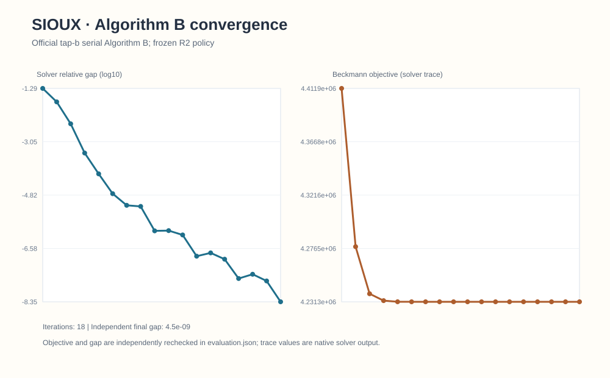
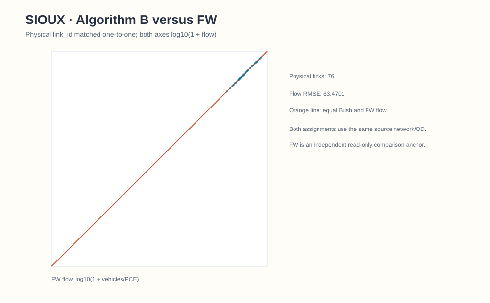
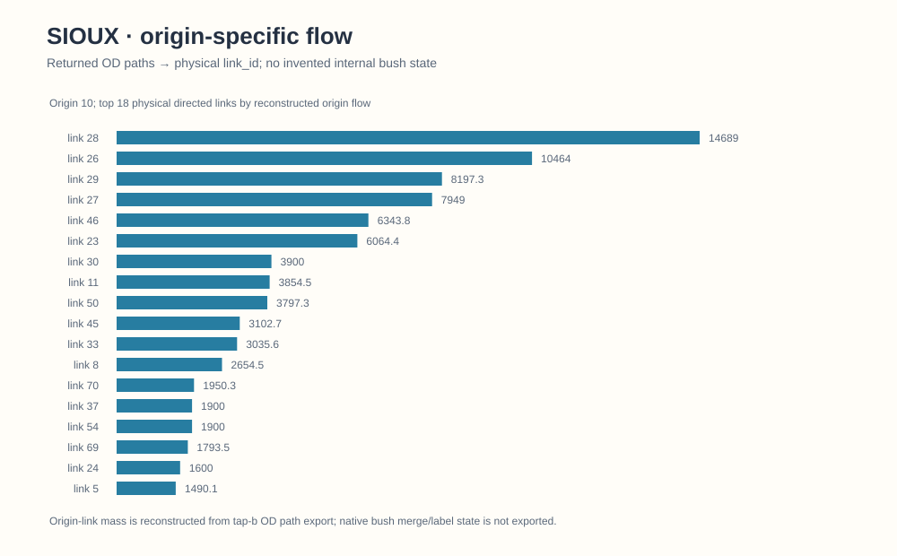
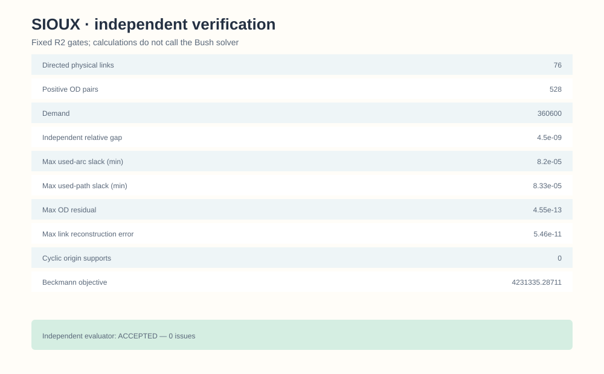

# Sioux Falls / official TAPLab–tap-b Algorithm B

## 1. Problem contract and frozen policy

This is the **classic static** Sioux Falls BPR user-equilibrium instance: 24 physical nodes, 76 directed links, 528 positive vehicle OD pairs, and 360,600 vehicles of fixed demand. It is not either of the 200/250-OD finite space–time CG selections. The R2 policy fixes a `1e-8` solver gap, `1e-4` independent gap gate, 0.05-minute used-arc/path slack gate, 1,800-second runtime cap, and BPR/Beckmann objective in vehicle-minutes. [Shared method and policy](../methods/origin-based-algorithm-b.md).

## 2. Solver and adapter path

The official `spartalab/tap-b` Algorithm B executable at commit `040135a20c771fbb84766df6a97cff981fa5df4b` produced the accepted R2 run. A separate R2.1 audit at TAPLab commit `081e44a0dd451c549d6903933516bccb4166bbd0` exercised TAPLab's **official registered `tapb` CLI adapter** and direct callable `taplab.adapters.tapb.solve`. Both reproduced the accepted R2 physical-link flows exactly; `taplab verify` certified the standard output. The official adapter does not export the OD paths needed for all R2 path-level checks; the accepted R2 independent evaluator record remains the authority for those checks. [Adapter routes and caveats](../integrations/taplab-tapb.md).

## 3. Convergence

*Saved R2 solver trace only.* The independent final relative gap is `4.49840770553e-9`. The R2.1 official-adapter parity run stopped at 18 iterations; its absent explicit 10,000-iteration override was nonbinding, not proof of byte-identical configurations.

## 4. Physical-link comparison with same-problem FW

The accepted R2 Algorithm B Beckmann objective is **4,231,335.287110682 vehicle-minutes**, compared with **4,236,715.14044 vehicle-minutes** for the retained historical FW result. The saved physical-link flow RMSE is **63.4701149406 vehicles**. This is a same-static-problem numerical comparison, not a runtime speedup or empirical validation. [Aggregate Algorithm B link flows](../../algorithms/origin_based_algorithm_b/accepted_results/sioux_physical_link_flow.csv).

## 5. Selected-origin reconstructed flow

Selected-origin flow is reconstructed from exported OD paths. The figure does not expose native Policy Bush merge, approach or backward-label state.

## 6. Independent verification

The [accepted evaluation](../../algorithms/origin_based_algorithm_b/accepted_results/sioux_evaluation.json) records 705 exported OD paths, zero cyclic positive-flow origins, max OD residual `4.55e-13`, aggregate link mismatch `5.46e-11`, max used-arc slack `8.20e-5` minutes, and no issues. The R2.1 official TAPLab parity matrix separately reports zero maximum physical-link-flow difference and a certified `taplab verify` result. These are distinct checks, not one combined certificate.

## 7. Reproduction and limits

[Official TAPLab CLI commands](../integrations/taplab-tapb.md#official-sioux-falls-route) require the pinned upstream source, its external solver executable and correctly licensed classic Sioux input; this repository does not bundle either upstream tree or executable. The [public candidate source](../../algorithms/origin_based_algorithm_b/README.md) and accepted aggregate output support offline inspection. No solver was rerun for this publication update. Neither the static objective nor its figures are comparable to the finite space–time hard-capacity CG objective.
