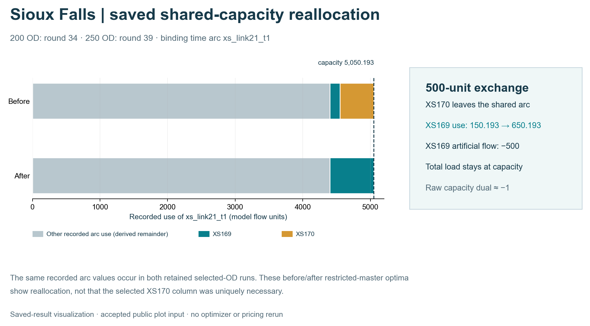

# Sioux Falls · historical selected-OD finite space–time CG benchmarks

This page retains two historical Sioux Falls selected-OD benchmarks: **200 OD pairs** and **250 OD pairs**. They solve fixed-cost, hard-capacity flow problems on finite time-expanded graphs. For the same scientific figure families on **one separate, bounded Boston pilot**, see [Boston finite space–time CG](boston-space-time.md). Boston's R4 independent pricing-closure certificate does **not** establish independent pricing closure for the Sioux Falls 200/250-OD runs.

**Case coverage:** physical-to-time representation, arc-flow LP references on the same selected-OD finite time-expanded graphs, Phase-I artificial-flow clearance, Phase-II real-path objective improvement, final physical-link movement flow, and saved record-level capacity evidence. These are historical benchmark experiments, not modern city demand/GPS inference.

## Case scope

| Item | 200 OD | 250 OD |
|---|---:|---:|
| Physical nodes | 24 | 24 |
| Selected directed links | 64 | 69 |
| OD pairs | 200 | 250 |
| Phase-I zero round | 51 | 62 |
| Phase-I added columns | 51 | 62 |
| Phase-II added columns | 195 | 255 |
| Final column pool | 446 | 567 |
| Reference-objective agreement | Yes | Yes |
| Independent pricing closure | Not established | Not established |

The 200-OD selection is contained in the 250-OD selection, with matching OD IDs, origins, destinations and demand volumes for the shared records. There is one retained run at each size, and the runtime/candidate caps differ. The observations below are descriptive, not a statistical scaling estimate.


*Saved-result visualization; no optimizer, pricing routine, demand model or map-matching routine was rerun for this public rendering.* [Editable-text SVG](../assets/presentation_r5/sioux_cg_case_sequence.svg) · [Exact accepted source-asset hashes and no-solve renderer](../assets/presentation_r5/CG_CASE_SEQUENCE_SOURCES.json).

<a id="construction-cutaway"></a>
## 1. From the physical network to time-indexed columns


The diagram uses **schematic display coordinates** but actual node and time identities. It shows nodes 8, 6, 5, 9 and 4 over time indices 0–6; the recorded network extends beyond this slice. The highlighted column is `source_XS170 → xs_link19_t0 → xs_link15_t2 → sink_XS170_5_t6`: physical nodes `8 → 6 → 5` at times `0 → 2 → 6`. Pale movement lines and waiting lines come from the saved local allowed-arc records. No new shortest path or optimizer was run. Source/sink connectors and most of the horizon are omitted from the cutaway.

[Generic construction and pricing explanation](../methods/space-time-cg.md) · [Figure provenance](../assets/presentation_r3/FIGURE_PROVENANCE.json).

<a id="paired-phase-i-figures"></a>
<a id="recorded-results-what-the-two-saved-runs-show"></a>
## 2. Phase I restores feasibility

<table class="figure-grid"><tr><th>200 OD · artificial flow clears in round 51</th><th>250 OD · artificial flow clears in round 62</th></tr><tr><td width="50%"></td><td width="50%"></td></tr></table>

| Saved observation | 200 OD | 250 OD |
|---|---:|---:|
| Initial artificial flow | 749.806844 | 4,082.887577 |
| Total demand | 86,100 | 154,000 |
| Initial artificial-flow share | 0.87% | 2.65% |
| Demands initially carrying artificial flow | 2 | 5 |
| Phase-I zero round | 51 | 62 |
| Phase-I added columns | 51 | 62 |

<a id="od-level-clearance"></a>
### OD-level artificial-flow clearance

#### 200 OD pairs

| OD ID | Initial artificial flow | First zero round |
|---|---:|---:|
| XS168 | 200.000 | 51 |
| XS169 | 549.807 | 51 |

#### 250 OD pairs

| OD ID | Initial artificial flow | First zero round |
|---|---:|---:|
| XS168 | 200.000 | 62 |
| XS169 | 549.807 | 62 |
| XS216 | 1,900.000 | 17 |
| XS222 | 1,187.998 | 40 |
| XS223 | 245.082 | 17 |

<a id="od-level-supplementary-view"></a>


Artificial flow is an algorithmic feasibility device. It is not an observed queue, discarded real demand or measured unserved passengers.

<a id="clearance-events-and-selected-columns"></a>
## 3. A new path can help a different OD

The generated candidate is the column added before re-solving that round. OD artificial-flow changes are observed after re-solving; the table does not prove that the selected column alone caused the changes.

| Case | Round | Total artificial-flow decrease | Selected column (OD) | OD-level artificial-flow changes |
|---|---:|---:|---|---|
| 200 OD | 34 | 500.000 | GEN_XS170_001 (XS170) | XS169: -500.000 |
| 200 OD | 51 | 249.807 | GEN_XS169_001 (XS169) | XS168: -200.000; XS169: -49.807 |
| 250 OD | 17 | 2,145.082 | GEN_XS223_001 (XS223) | XS216: -1,900.000; XS223: -245.082 |
| 250 OD | 39 | 500.000 | GEN_XS170_001 (XS170) | XS169: -500.000 |
| 250 OD | 40 | 1,187.998 | GEN_XS222_001 (XS222) | XS222: -1,187.998 |
| 250 OD | 62 | 249.807 | GEN_XS169_001 (XS169) | XS168: -200.000; XS169: -49.807 |

At round 34 in the 200-OD run and round 39 in the 250-OD run, pricing selects a new path for **XS170**, while **XS169** loses 500 units of artificial flow after restricted-master reoptimization.

<a id="xs170xs169-capacity-reallocation-audit"></a>
<a id="shared-capacity-event"></a>
### Recorded shared-capacity reallocation event



*Canonical saved-result rendering from the public before/after values.* [Editable-text SVG](../assets/presentation_r5/sioux_shared_capacity_canonical.svg) · [Plot input and source hashes](../assets/presentation_r5/SIOUX_CAPACITY_CANONICAL_SOURCES.json) · [Earlier accepted capacity diagram](../assets/presentation_r3/sioux_capacity_exchange.png), retained for provenance.

The added XS170 path is `source_XS170 → xs_link19_t0 → xs_link15_t2 → sink_XS170_5_t6`. Before the addition, XS170's 500 units use `EXTSIOUX_CUR_XS170_DELAYED`, which traverses `xs_link21_t1`. After the addition, all 500 units use the new path and the delayed XS170 column no longer appears on `xs_link21_t1`. XS169's existing delayed column also traverses that arc.

| Case | Round | XS170 real flow (before → after) | XS169 real flow (before → after) | XS169 artificial-flow decrease | `xs_link21_t1` flow / capacity (before → after) | Raw capacity dual (before → after) |
|---|---:|---:|---:|---:|---:|---:|
| 200 OD | 34 | 500.000 → 500.000 | 150.193 → 650.193 | 500.000 | 5,050.193 / 5,050.193 → 5,050.193 / 5,050.193 | -1 → -1 |
| 250 OD | 39 | 500.000 → 500.000 | 150.193 → 650.193 | 500.000 | 5,050.193 / 5,050.193 → 5,050.193 / 5,050.193 | -1 → -1 |

The recorded primal flows support a 500-unit exchange on a binding arc: XS170 leaves the shared delayed route and XS169 takes its place. The raw capacity dual stays approximately −1; its sign follows the solver's reported convention. This is a mechanism in these recorded restricted-master solutions, not evidence that one path is uniquely necessary.

## 4. Phase II improves the real-path objective

<table class="figure-grid"><tr><th>200 OD · Phase-II objective</th><th>250 OD · Phase-II objective</th></tr><tr><td width="50%"></td><td width="50%"></td></tr></table>

| Case | Phase-II added columns | Final column pool | CG objective | Arc-flow LP objective on the same selected-OD finite time-expanded graph | Absolute difference |
|---|---:|---:|---:|---:|---:|
| 200 OD | 195 | 446 | 943,155.589771 | 943,155.589771 | 2.33e-10 |
| 250 OD | 255 | 567 | 1,521,090.836620 | 1,521,090.836620 | 0 |

Each trace is compared with the arc-flow LP on its own selected-OD finite time-expanded graph. Different OD selections define different optimization instances; the difference between their objective values is not an algorithmic improvement measure.

<a id="final-validation"></a>
## 5. Final physical-link movement flow and validation

<table class="figure-grid"><tr><th>200 OD · final physical-link movement flow</th><th>250 OD · final physical-link movement flow</th></tr><tr><td width="50%"><a href="../datasets/sioux-200od.md"></a></td><td width="50%"><a href="../datasets/sioux-250od.md"></a></td></tr></table>

| Case | Reference-objective agreement | Max demand residual | Capacity violations | Runtime (s) |
|---|---|---:|---:|---:|
| 200 OD | Yes | 0 | 0 | 1,416.7 |
| 250 OD | Yes | 0 | 0 | 2,634.1 |

Line width encodes final movement flow aggregated over the modeled horizon. These are schematic physical-link views, not observed traffic, static V/C or a full 528-OD assignment. Opposite directions can overlap in the existing rendering.

Both runs report reference-objective agreement on their own selected-OD finite time-expanded graphs, zero final demand residual and zero capacity violations. Their original run summaries set `optimality_claimed` and `full_cg_global_convergence_claimed` to false. The defensible statement is objective-level reference agreement on the retained selected-OD benchmarks, not a global convergence or unique flow-pattern claim.

## 6. Independent pricing closure

**Status: not established for the retained 200-OD and 250-OD runs.** Their saved results are feasible and have reference-objective agreement, but the retained historical records do not supply a completed independent full-DAG pricing-closure certificate comparable to Boston R4. Boston's certificate must not be transferred to these cases.

A future closure continuation should begin from the existing final column pools rather than rerunning Phase I from scratch. Until that work is completed, the public status remains:

```text
reference_objective_agreement = true
independent_pricing_closure_established = false
```

<a id="limits-and-next-experiment"></a>
<a id="reproduction-and-source-boundaries"></a>
## 7. Reproduction and limits

- There is one retained run at each of 200 and 250 OD pairs; no sampling uncertainty or significance test can be estimated from these two traces alone.
- The Phase-I round caps differ (120 versus 160); Phase-II per-round candidate caps also differ (600 versus 750). Runtime differences therefore remain descriptive.
- For a scaling claim, run several independently selected, preferably nested OD subsets at each size with one fixed solver configuration; report median and range or a confidence interval for clearance rounds, candidate additions and wall time.
- The XS170/XS169 mechanism is documented for these recorded restricted-master solutions. A broader claim about necessity or uniqueness would require counterfactual runs or further sensitivity analysis.

The approved display traces are available as [200 Phase I](../assets/sioux/phase_i_r1/data/200_phase_i_trace.csv), [250 Phase I](../assets/sioux/phase_i_r1/data/250_phase_i_trace.csv), [200 Phase II](../assets/sioux/phase_i_r1/data/200_phase_ii_trace.csv), and [250 Phase II](../assets/sioux/phase_i_r1/data/250_phase_ii_trace.csv). Original source/figure hashes are recorded in the accompanying provenance. No final dual vector has been newly reconstructed by this presentation update.

Full private source paths and raw receiver archives are not published here. The supplied historical records and original run summaries, not a newly solved model, support these figures. Preserve source-data redistribution terms when rebuilding from upstream input.
