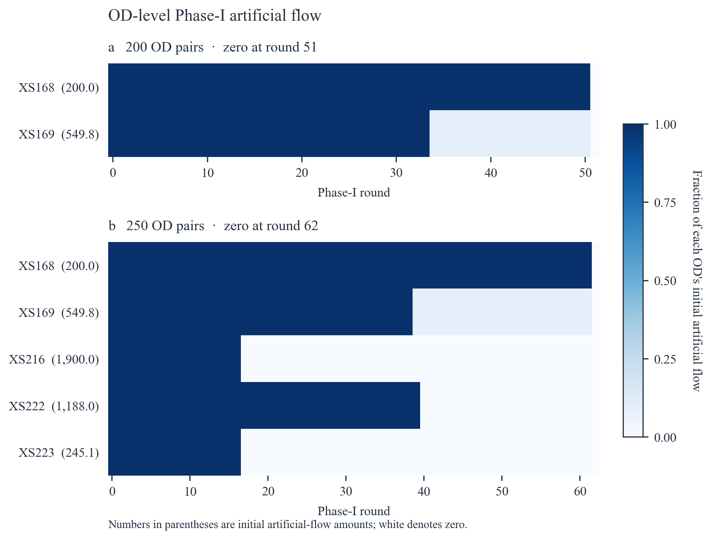

# Sioux Falls: constructing and using the space–time network

**Case coverage:** physical-to-time representation, same-instance arc-flow LP, Phase-I artificial-demand clearance, Phase-II cost improvement and saved record-level capacity evidence. This is a historical selected-OD experiment, not modern city demand/GPS inference.

## Construction cutaway

The diagram uses **schematic display coordinates** but actual node and time identities. It shows nodes 8, 6, 5, 9 and 4 over time indices 0–6; the recorded network extends beyond this slice. The highlighted path is `source_XS170 → xs_link19_t0 → xs_link15_t2 → sink_XS170_5_t6`: 8 at t0, 6 at t2 and 5 at t6. Pale movement lines and waiting lines come from the saved local allowed-arc records. No new shortest path or optimizer was run. Source/sink connectors and most of the horizon are omitted from the cutaway.

[Generic construction and pricing explanation](../methods/space-time-cg.md) · [Figure provenance](../assets/presentation_r3/FIGURE_PROVENANCE.json).

## Paired Phase-I figures

<table class="figure-grid"><tr><th>200 OD</th><th>250 OD</th></tr><tr><td width="50%"></td><td width="50%"></td></tr></table>

## Recorded results

## What the two recorded runs show

The 200-OD selection is contained in the 250-OD selection (matching OD IDs, origins, destinations, and demand volumes). Both recorded runs clear artificial flow, but these are single runs with different case sizes and runtime caps. The observations below are descriptive, not a statistical scaling estimate.

| Case | Initial artificial flow | Total demand | Initial artificial share | Initially active ODs | Phase-I zero round | Phase-I added columns | Phase-II added columns |
|---|---:|---:|---:|---:|---:|---:|---:|
| 200 OD | 749.807 | 86,100 | 0.87% | 2 | 51 | 51 | 195 |
| 250 OD | 4,082.888 | 154,000 | 2.65% | 5 | 62 | 62 | 255 |

## OD-level clearance

### 200 OD pairs

| OD ID | Initial artificial flow | First zero round |
|---|---:|---:|
| XS168 | 200.000 | 51 |
| XS169 | 549.807 | 51 |

### 250 OD pairs

| OD ID | Initial artificial flow | First zero round |
|---|---:|---:|
| XS168 | 200.000 | 62 |
| XS169 | 549.807 | 62 |
| XS216 | 1,900.000 | 17 |
| XS222 | 1,187.998 | 40 |
| XS223 | 245.082 | 17 |

## Clearance events and selected columns

The selected candidate is the column added before re-solving that round. The OD flow changes are observed after re-solving; this table does not prove that the selected column alone caused the changes.

| Case | Round | Total flow decrease | Selected column (OD) | OD-level flow changes |
|---|---:|---:|---|---|
| 200 OD | 34 | 500.000 | GEN_XS170_001 (XS170) | XS169: -500.000 |
| 200 OD | 51 | 249.807 | GEN_XS169_001 (XS169) | XS168: -200.000; XS169: -49.807 |
| 250 OD | 17 | 2,145.082 | GEN_XS223_001 (XS223) | XS216: -1,900.000; XS223: -245.082 |
| 250 OD | 39 | 500.000 | GEN_XS170_001 (XS170) | XS169: -500.000 |
| 250 OD | 40 | 1,187.998 | GEN_XS222_001 (XS222) | XS222: -1,187.998 |
| 250 OD | 62 | 249.807 | GEN_XS169_001 (XS169) | XS168: -200.000; XS169: -49.807 |

At round 34 in the 200-OD run and round 39 in the 250-OD run, the selected candidate is for XS170 while XS169's artificial flow decreases by 500. The capacity and path audit below checks how the RMP reallocates flow.

## XS170/XS169 capacity reallocation audit

The added XS170 path is `source_XS170 → xs_link19_t0 → xs_link15_t2 → sink_XS170_5_t6`. Before the addition, XS170's 500 units used `EXTSIOUX_CUR_XS170_DELAYED`, which traverses `xs_link21_t1`. After the addition, all 500 units use the new path and the delayed XS170 column no longer appears on `xs_link21_t1`. XS169's existing delayed column also traverses that arc.

| Case | Round | XS170 real flow (before → after) | XS169 real flow (before → after) | XS169 artificial decrease | `xs_link21_t1` flow / capacity (before → after) | Raw capacity dual (before → after) |
|---|---:|---:|---:|---:|---:|---:|
| 200 OD | 34 | 500.000 → 500.000 | 150.193 → 650.193 | 500.000 | 5,050.193 / 5,050.193 → 5,050.193 / 5,050.193 | -1 → -1 |
| 250 OD | 39 | 500.000 → 500.000 | 150.193 → 650.193 | 500.000 | 5,050.193 / 5,050.193 → 5,050.193 / 5,050.193 | -1 → -1 |

The recorded primal flows support a 500-unit exchange on a binding arc: XS170 leaves the shared delayed route and XS169 takes its place. The raw capacity dual stays approximately −1; its sign follows the solver's reported convention. This is a mechanism for these recorded RMP solutions, not evidence that a single path is uniquely necessary.

## Final validation

| Case | Phase-I zero round | CG objective | Arc-flow LP objective | Absolute gap | Max demand residual | Capacity violations | Runtime (s) |
|---|---:|---:|---:|---:|---:|---:|---:|
| 200 OD | 51 | 943,155.589771 | 943,155.589771 | 2.33e-10 | 0 | 0 | 1,416.7 |
| 250 OD | 62 | 1,521,090.836620 | 1,521,090.836620 | 0 | 0 | 0 | 2,634.1 |

Both runs report a match to their same-subset arc-flow LP objective, zero final demand residual, and zero capacity violations. Their own run summaries set `optimality_claimed` and `full_cg_global_convergence_claimed` to false. The defensible statement is objective-level reference agreement on these two subsets, not a global convergence or unique flow-pattern claim.

## Limits and next experiment

- There is one recorded run at each of 200 and 250 OD pairs; no sampling uncertainty or significance test can be estimated from these two traces alone.
- The Phase-I round caps differ (120 versus 160); Phase-II per-round candidate caps also differ (600 versus 750). Runtime differences therefore remain descriptive.
- For a scaling claim, run several independently selected, preferably nested OD subsets at each size with a fixed solver configuration; report median and range (or confidence interval) for clearance rounds, candidate additions, and wall time.
- The XS170/XS169 mechanism is documented for these recorded RMP solutions. A broader claim about necessity or uniqueness would require counterfactual runs or further sensitivity analysis.

## Shared-capacity event

The before/after values are observed saved RMP solutions, not a newly run counterfactual. The diagram does not assert the selected path is uniquely necessary.

## OD-level supplementary view

## Reproduction and source boundaries

The approved display traces are available as [200 Phase I](../assets/sioux/phase_i_r1/data/200_phase_i_trace.csv), [250 Phase I](../assets/sioux/phase_i_r1/data/250_phase_i_trace.csv), [200 Phase II](../assets/sioux/phase_i_r1/data/200_phase_ii_trace.csv), and [250 Phase II](../assets/sioux/phase_i_r1/data/250_phase_ii_trace.csv). Original source/figure hashes are recorded in the accompanying provenance. No final dual vector has been newly reconstructed by this presentation update.

Full private source paths and raw receiver archives are not published here. The supplied historical records and original run summaries, not a newly solved model, support these figures. Preserve source-data redistribution terms when rebuilding from upstream input.
