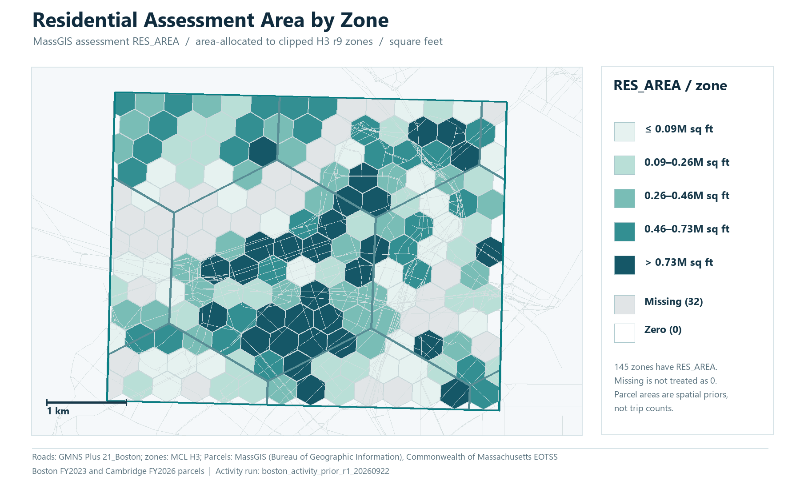

# Central Boston source-backed city instance

This is the first bounded real-city instance in the repository. It connects a common physical GMNS road network to model zones, a preserved network-proxy demand chain, an independent actual-assessment activity prior, real public-bus GPS road matching, scheduled transit relationships, static assignment, queries, and offline maps.

[Open the corrected network/GPS map](../../examples/boston/map/boston_central_layers.html) · [Open the activity-prior map](../../examples/boston/map/boston_activity_prior_layers.html) · [Five-map visual gallery](#boston-visual-gallery) · [Browse the component](../../examples/boston/README.md) · [Query the compact SQLite copy](../../examples/boston/query_boston.py)

## Boston visual gallery

These saved figures use the actual Central Boston network and a common EPSG:32619 display projection. The maps convey different source relations; the selected activity and GPS examples are not asserted to be the same observation or scenario as the fixed-panel feedback trace. [Source versions, units and image paths](boston-visual-sources.md) accompany the gallery.

### Physical network, zones and corridor

Central Boston contains 5,091 directed physical GMNS links, 177 clipped H3 r9 zones, nine r7 parent zones, the core boundary and a 2.5 km analysis buffer. Orange marks one continuous model corridor with 23 ordered member links. MassGIS parcel outlines supply context and are not building footprints; model access connectors are omitted. Roads: GMNS Plus 21_Boston (Apache-2.0), commit `116447ab641cca1ed34797d019c8e704063393c3`; parcels: MassGIS (Bureau of Geographic Information), Commonwealth of Massachusetts EOTSS; zones and boundaries: Mobility Computation Lab.

### Residential assessment-area activity prior

Official MassGIS residential assessment area (`RES_AREA`, square feet) is allocated by parcel intersection area in EPSG:32619 to the 177 clipped r9 zones. Boston records use FY2023 and Cambridge records FY2026. The selected field has values in 145 zones and is blank in 32; blank is not zero and does **not** mean those zones lack every source record. This is a spatial activity prior, not observed trips, population or the full generated demand result. Source: MassGIS (Bureau of Geographic Information), Commonwealth of Massachusetts EOTSS; roads: GMNS Plus 21_Boston (Apache-2.0); zones: Mobility Computation Lab.

### One saved transit-position projection

Twelve saved public MBTA vehicle positions and projections lie along one qualified 26-occurrence matched road path. The segment is the first eligible one by stable identifier among those with at least six published derived points; the rule does not select a large effect. Lateral offsets span 0.98–14.04 m. Overall, nine of 28 returned paths met the quality rules. This representative view is neither passenger travel nor an overall or lane-level accuracy certificate, and it is not necessarily the observation used in the feedback trace. Position source: MassDOT / MBTA V3; derived projection: Mobility Computation Lab; roads: GMNS Plus 21_Boston (Apache-2.0); parcel context: MassGIS (Bureau of Geographic Information), Commonwealth of Massachusetts EOTSS.

### S1 fixed-panel road flow

Saved S1 planned-service road flow appears on 319 nonzero directed links, with a maximum of 89.481820 modeled vehicle trips. Reciprocal directions are offset 2.7 screen pixels and indicated by arrows. This fixed home-based-work panel has no regional background traffic; values are modeled panel trips, not observed road counts. Roads: GMNS Plus 21_Boston (Apache-2.0), commit `116447ab641cca1ed34797d019c8e704063393c3`; saved assignment: Mobility Computation Lab.

### S2−S1 exploratory panel-flow difference

Saved S2 exploratory GPS-overlay flow minus saved S1 planned-service flow uses identical directed physical links and the same viewport. Seventy-eight links decrease and none increase beyond `1e-10`; the largest absolute difference is about `0.006602639857` modeled vehicle trips. The signed legend is symmetric about zero. This is a small fixed-panel sensitivity without regional background traffic, not congestion relief or a citywide causal effect. Roads: GMNS Plus 21_Boston (Apache-2.0), commit `116447ab641cca1ed34797d019c8e704063393c3`; saved assignments: Mobility Computation Lab. See the [current feedback data card](boston-behavior-feedback.md) for the precise panel and scenario scope.

## Study area and data identity

| Item | Value |
|---|---|
| Core | Central Boston, bbox `[-71.105, 42.335, -71.045, 42.370]`, about 19.22 km² |
| Analysis buffer | 2.5 km for road context and GPS matching |
| Road source | GMNS Plus `21_Boston`, commit `116447ab641cca1ed34797d019c8e704063393c3` (Apache-2.0) |
| Physical matcher network | 2,852 nodes; 5,091 directed links; source `link_type=0` connectors excluded |
| Project zones | 177 H3 r9 cells; 9 logical H3 r7 parents; 177 explicit access records |
| Activity source | Official MassGIS Property Tax Parcels slice: 54,411 assessment rows, 13,585 unique parcel geometries; Boston FY2023 and Cambridge FY2026 |
| Transit source | MBTA feed `mdb-437`, Fall 2026 version D; service date 2026-09-22 |
| GPS source | Twelve MBTA V3 bus-position snapshots captured during a short 2026-09-21 local window |

Catalog city IDs, GHSL IDs, feed IDs, source TAZ IDs and project H3 IDs remain separate. The component does not infer identity from similar labels.

## Demand and assignment

Two demand tracks now coexist. The original network-accessibility proxy remains byte-separated as the legacy engineering scenario. The activity run `boston_activity_prior_r1_20260922` executes the same four declared steps with new spatial margins:

1. Trip generation scales official residential assessment area to the production margin and official nonresidential/mixed building area to the attraction margin. These inputs are no longer network proxies. Parcel geometry and stacked assessment records are kept distinct, area overlay uses EPSG:32619, outside-core weights are retained, and r7 is summed from r9.
2. A doubly constrained gravity model reuses the unchanged free-flow network skim. The new matrix has 25,075 positive OD cells and balances to the assumed 50,000 total with relative maximum margin error below `7.2e-8`.
3. Fixed engineering shares split mode and the weekday AM period. This is not a calibrated discrete-choice model.
4. Drive demand is converted at 1.2 persons per vehicle. Of 2,750 AM vehicle trips, 2,723.944 are assignment-ready and 26.056 remain explicitly unassigned because endpoints share an access node or are intrazonal. No new FW assignment was run.

The 50,000 daily total, gravity beta, mode shares, AM share, and occupancy remain explicit assumptions. MassGIS assessment area is an activity prior, not observed trips, population, or employment. LODES8 WAC/RAC/OD was identified but the official host timed out after bounded retries, so the release contains no workplace/residence job association and makes no all-purpose-travel claim from LODES.

The existing `solve_fw_refined(...)` entry ran the baseline and a capacity-stress scenario without invoking the solver module's historical `__main__`. Both stopped at the implemented relative-gap criterion in one iteration; the light-load baseline maximum V/C is about 0.143. Link-volume sums are not reported as trip totals.

## GPS and calibration evidence

The build retained 2,091 cleaned bus-position points in 235 capture-window-censored segments. Thirty segments entered matching; 28 produced continuous directed physical paths. The external HMM succeeded on 19. After recorded HMM failures, the native connected-path engine succeeded on nine more. Two selected failures and all unselected segments remain visible in the private QC tables.

Ten quality-filtered matched segments support a one-parameter path-time scale diagnostic. Eight vehicle groups form the training set and two independent groups form the holdout. The fitted scale is approximately 2.033. Training RMSE improves, but holdout RMSE worsens from 4.372 to 12.101 minutes, so the parameter is **estimated but not validated**.

## Transit and query scope

For 2026-09-22, the local GTFS slice contains 12,901 trips on 112 routes, 3,553 referenced stops (1,391 in the analysis area), and 286,151 stop-time records. Foreign-key and time checks pass. Stop access is a modelled nearest-road-node relation. One planned shape was geometrically conflated to roads; a planned shape is not an observed vehicle path.

The corrected baseline keeps its acceptance-query families. Seven additional executed queries cover one source record's zone allocation, a zone activity/prior chain, one complete OD chain, municipality/fiscal-year coverage, allocation conservation, old/new scenario differences, and assignment-input accounting. Their compact result CSVs and SQL are included in `examples/boston/queries/`.

## Publication boundary

The public component includes the Apache-licensed physical road slice, project-derived relations and engineering results, the privacy-minimised MassGIS source slice and dictionary, H3 crosswalks, both demand tracks, assignment-ready new input, aggregated GPS link use, executed query examples, a rebuildable SQLite database, and two self-contained maps. It excludes the raw MBTA GTFS ZIP, raw real-time snapshots, complete private observation tables, and the run-named 301 MB private SQLite copy. Third-party terms remain distinct from the project license.
