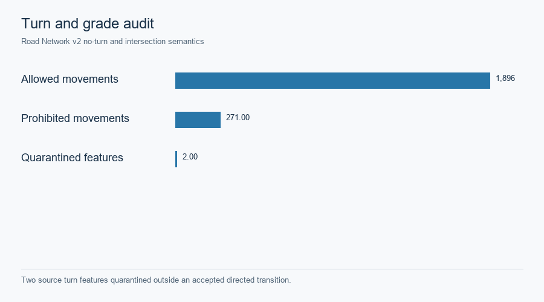

# Hong Kong · source-backed GMNS and evidence grades

The bounded Tsim Sha Tsui–Jordan graph is derived from [Transport Department Road Network v2](https://data.gov.hk/en-data/dataset/hk-td-tis_15-road-network-v2). Physical node/link IDs, directed movement, source turn rules and separate nonphysical centroid/access/turn classes are retained. The 95 fine SSG and 10 parent STPUG zones use [2021 census geographies](https://portal.csdi.gov.hk/). Assignment-ready compilation checks directed reachability, turns and grade separation; source intersection evidence is required for a mixed-elevation transition.

*Two source turn features were quarantined outside accepted directed transitions.* [SVG](../assets/hong_kong/full_stack_r5/r2r4_baseline/figures/hk_turn_and_grade_separation_audit.svg) · [Source record](../assets/hong_kong/full_stack_r5/r2r4_baseline/figures/hk_turn_and_grade_separation_audit.source.json).

| Evidence layer | Source and use | Limit |
|---|---|---|
| Roads, posted limits and turns | Transport Department Road Network v2; source-derived physical links and legal movements | Free speed, lanes and period capacity are engineering transfers |
| Population and households | 2021 census SSG/STPUG geography and attributes | Allocation assumes uniformity within source polygons; no fine-zone survey |
| Building activity | Official CSDI footprint, storeys and names | Proxy attraction, not measured employment or GFA |
| Transit and walk | [Transport Department GTFS](https://data.gov.hk/en-data/dataset/hk-td-tis_11-pt-headway-en), fares and official pedestrian links | Conservative routing with labeled fallback; no observed mode share |
| Road observations | [Annual Traffic Census](https://data.gov.hk/en-data/dataset/hk-td-tis_7-traffic-flow-census), detector snapshot and private UrbanNav reference | Descriptive/topology context, not held-out traffic validation |

The [historical source and rights register](../assets/hong_kong/full_stack_r5/r2r4_baseline/HONG_KONG_SOURCE_AND_RIGHTS_REGISTER.csv) records resource URLs, available SHA-256 hashes, evidence role and the earlier publication decision. Raw provider archives and complete point-level UrbanNav tables are excluded; one 12-point rendered projection has a separate [narrow publication record](../assets/hong_kong/visual_release_r1/PUBLICATION_SCOPE.txt). [Phase A checkpoint](../assets/hong_kong/full_stack_r5/r2r4_baseline/phase_a/PHASE_A_CHECKPOINT.json) · [R1 historical pilot](../cases/hong-kong-gmns-pilot.md) · [Current case](../cases/hong-kong.md).
