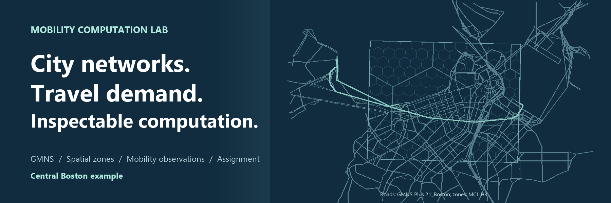
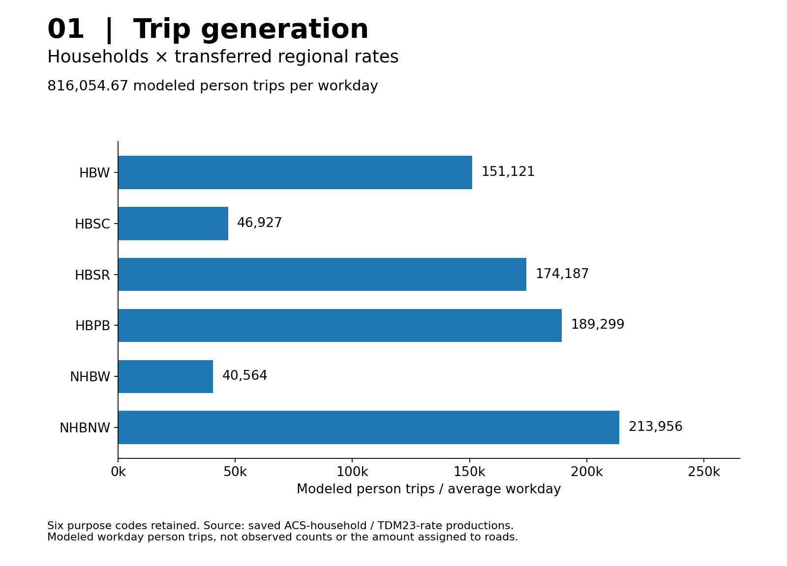
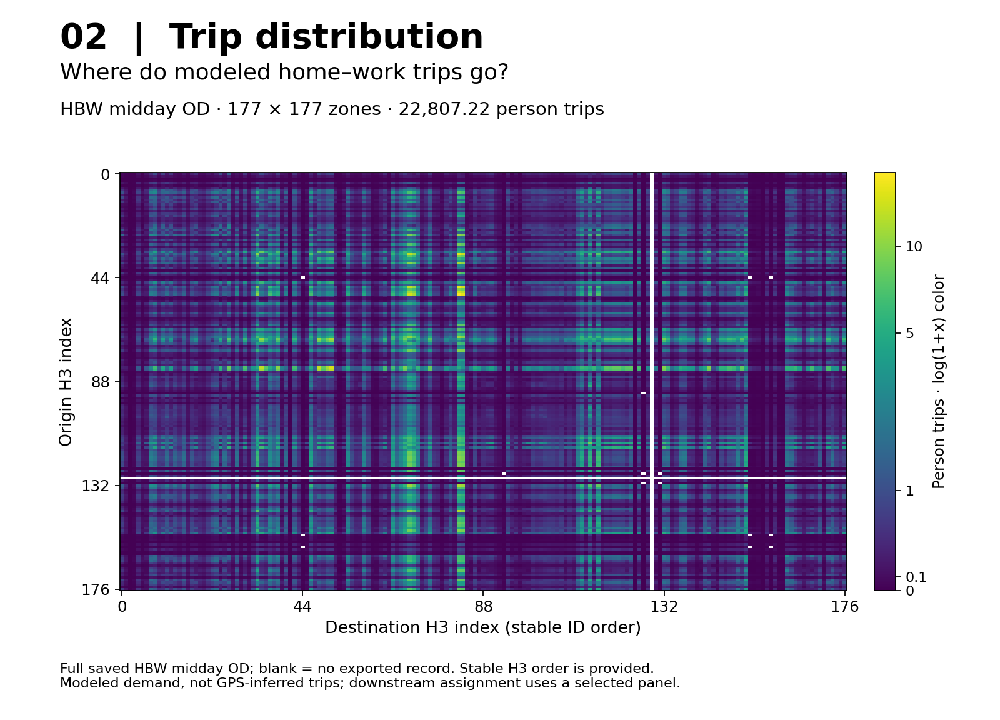
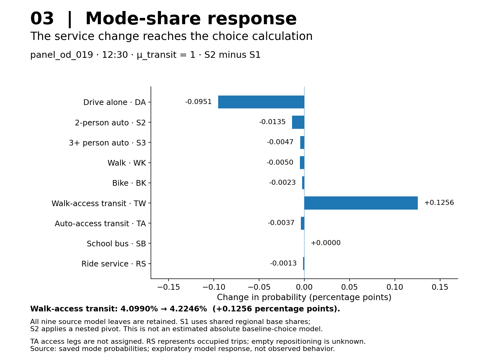
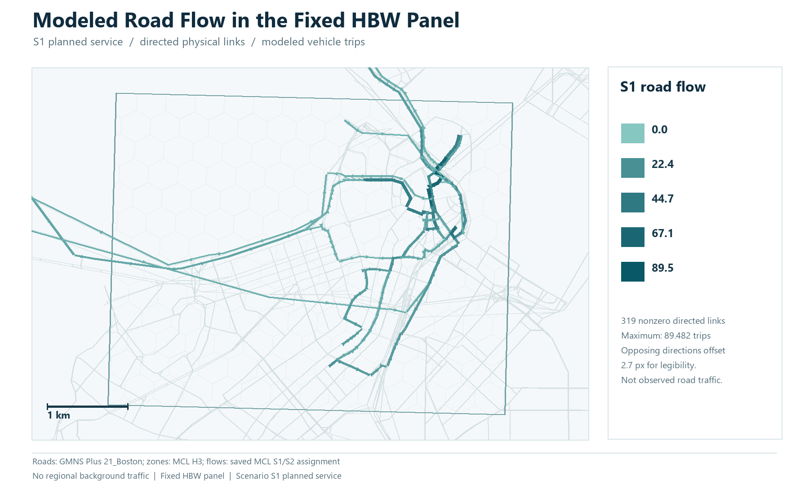
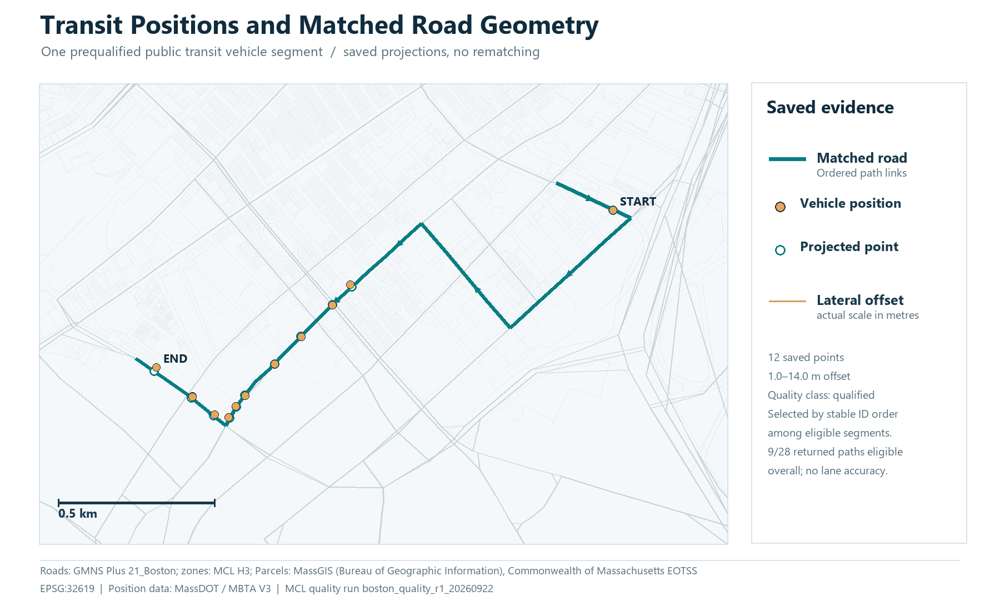
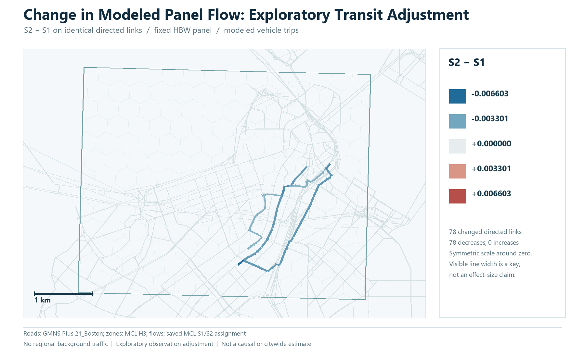
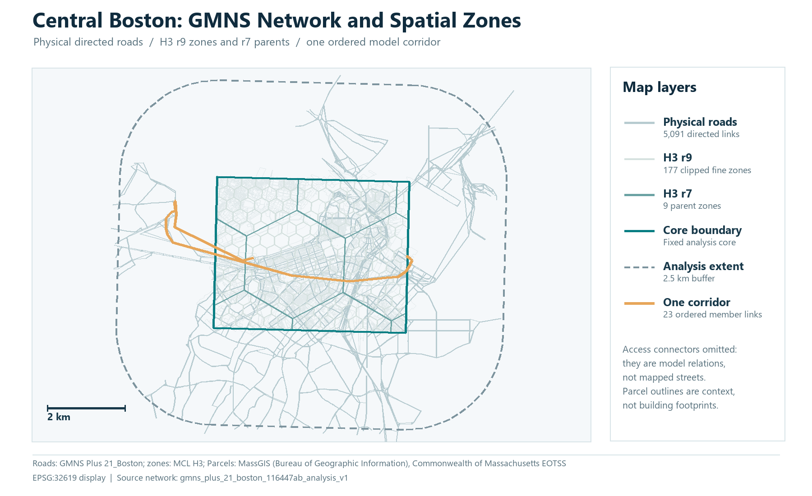
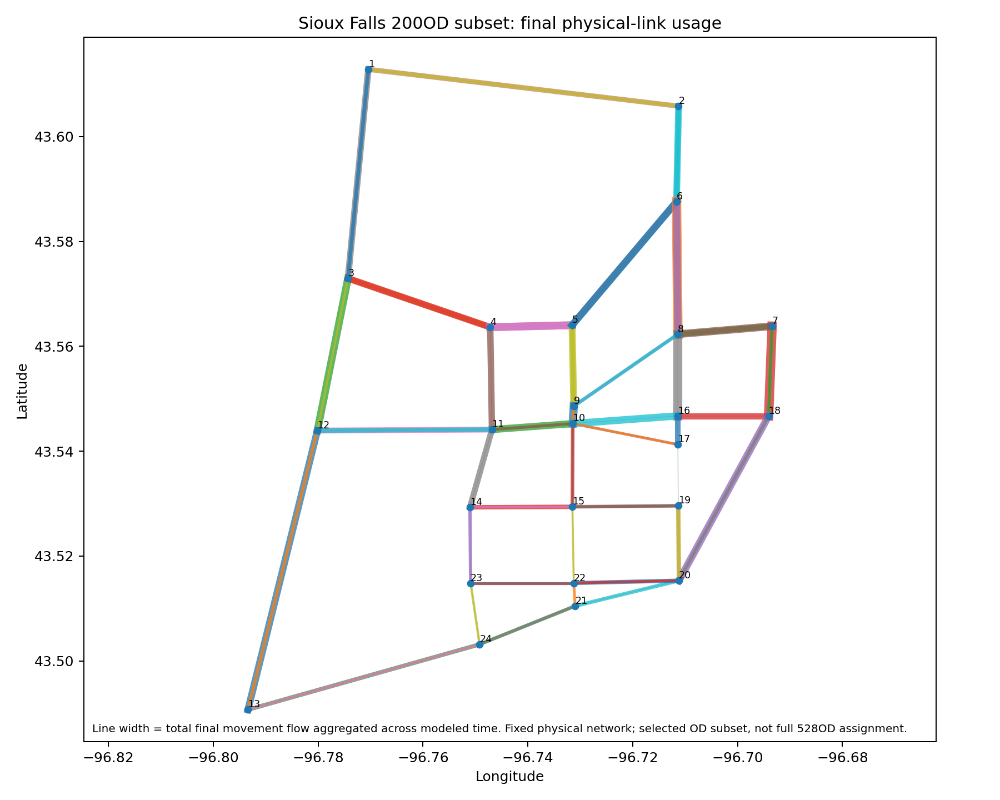
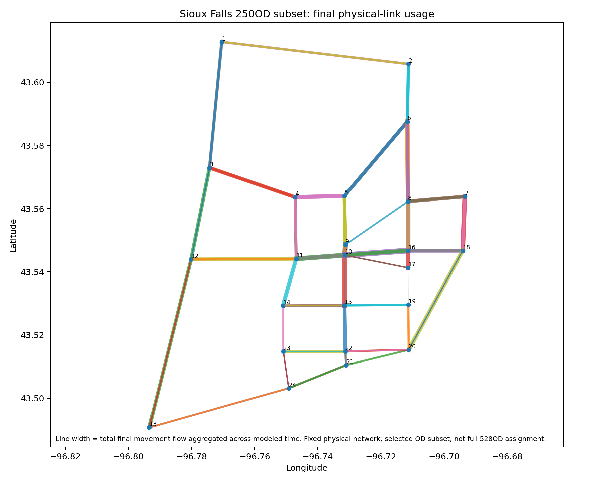

<!-- Editable homepage source. tools/build_site.py renders this file; do not edit generated index.html. -->
<main>

<figure class="site-cover"><figcaption>Central Boston geography · GMNS Plus 21_Boston and project H3 zones · geographic context, not traffic values.</figcaption></figure>
<section class="story-intro">

Real city data · four-step calculation · observable feedback

<h1>From city activity to <em>road flows.</em></h1>

See how trips are generated, distributed, split by mode and assigned to roads. Central Boston connects all four stages through a common GMNS network—and shows where transit observations change the calculation.

<a class="button primary" href="datasets/boston-behavior-feedback.md">Follow the four stages →</a><a class="button" href="#gps-feedback">See what GPS changes →</a><a class="button" href="../examples/boston/SAVED_EXAMPLE.md">Run the saved example →</a>

<a href="#stage-1">01<b>Trip generation</b><small>How many trips?</small></a>
<a href="#stage-2">02<b>Trip distribution</b><small>Where do they go?</small></a>
<a href="#stage-3">03<b>Mode choice</b><small>Which way to travel?</small></a>
<a href="#stage-4">04<b>Traffic assignment</b><small>Which roads carry them?</small></a>

</section>

<section id="four-step-workflow">

<h2>Four stages. Actual saved results.</h2>
The figures below show model outputs, not just map layers. Inputs, calculations and interpretation are linked at every step.

<article class="stage-card" id="stage-1">

01 · Trip Generation
<h3>Households become trip productions.</h3>
Area-allocated ACS households × transferred regional rates, with activity-based attraction weights.
<strong class="result-line">816,054.67 modeled workday person trips</strong>

Regional mean-rate transfer, not an observed local trip count.
<a href="datasets/boston-behavior-feedback.md#step-1-trip-generation">Inputs → calculation → productions</a>
</article>
<article class="stage-card" id="stage-2">

02 · Trip Distribution
<h3>Productions become OD demand.</h3>
Gravity/IPF and purpose/time-specific direction conversion distribute trips between H3 zones.
<strong class="result-line">177 × 177 HBW midday OD matrix</strong>

22,807.22 modeled midday person trips. Not GPS-derived passenger OD.
<a href="datasets/boston-behavior-feedback.md#step-2-trip-distribution">Margins → impedance → OD</a>
</article>
<article class="stage-card" id="stage-3">

03 · Mode Choice
<h3>Service costs change mode shares.</h3>
Scheduled and adjusted transit journeys drive a nested response around regional baseline shares.
<strong class="result-line">4.0990% → 4.2246% walk-access transit</strong>

One case, μ_transit = 1. S1 is not an OD-specific absolute-cost baseline.
<a href="datasets/boston-behavior-feedback.md#step-3-mode-choice">Itinerary costs → probability → person demand</a>
</article>
<article class="stage-card" id="stage-4">

04 · Traffic Assignment
<h3>Vehicle demand becomes road flow.</h3>
The same static FW solver loads the eligible private/occupied-vehicle panel onto the common network.
<strong class="result-line">202.078384 → 202.070733 vehicle trips</strong>

Fixed panel without regional background traffic—not citywide measured congestion.
<a href="datasets/boston-behavior-feedback.md#step-4-traffic-assignment">Vehicle OD → FW → directed-link flow</a>
</article>

<b>One linked workflow; deliberately different scopes.</b>
Regional generation → HBW demand → 36 selected OD pairs × 3 midday departures → 78 eligible OD–time cases → the vehicle-assignment panel. The full regional total is not loaded to roads. Thirty incomplete cases keep their demand and exclusion records.

<a class="button primary" href="datasets/boston-behavior-feedback.md">Read the complete four-step result →</a><a class="button" href="datasets/boston-four-step-sources.md">Download plot data and provenance →</a>

</section>

<section id="gps-feedback" class="gps-story">

Not just a map of points

<h2>What does GPS actually change?</h2>
It changes a transit service-time input. The dependent journey costs, mode demand and road-flow response are then recomputed—not the regional trip total.

<small>Observe</small><b>Vehicle position and service interval</b>
→
<small>Estimate an input</small><b>Interval-time adjustment</b>
→
<small>Stage 03</small><b>Transit cost and mode response</b>
→
<small>Stage 04</small><b>Vehicle demand and road flows</b>

One actual saved trace<h3>Route 749 · direction 1</h3>
Stop pair 1788 → 5093 has <strong>86 s sample-derived elapsed time versus 180 s planned</strong>. Its declared interval adjustment changes the saved result for <code>panel_od_019</code> at 12:30.

The adjustment is retrospective and exploratory. All 13 interval factors are off by default, each supported by one event. It is not an independently validated forecast.

<table><thead><tr><th>Same OD–departure</th><th>S1</th><th>S2</th></tr></thead><tbody><tr><td>Transit time</td><td>29.052 min</td><td>27.486 min</td></tr><tr><td>Fare</td><td>$1.70</td><td>$1.70</td></tr><tr><td>Walk-access transit</td><td>4.0990%</td><td>4.2246%</td></tr><tr><td>Vehicle trips</td><td>2.164631</td><td>2.161796</td></tr></tbody></table>

<figure class="figure-tile"><figcaption><b>First, establish the spatial link.</b>The original projection map uses a different recorded segment. It illustrates road matching, not the exact event in the numeric trace above.</figcaption></figure><figure class="figure-tile"><figcaption><b>Then, inspect the model response.</b>78 links differ; maximum |Δ| ≈ 0.006603 panel vehicle trips. Link totals combine multiple OD cases, not just the one illustrated trace.</figcaption></figure>

<strong>Switch it off and verify the connection.</strong> Srestore independently disables the overlay and recomputes service costs, probabilities and demand, returning the comparable results to S1. This verifies a computational dependency, not empirical accuracy. GPS does not estimate the regional total, gravity β or all passenger OD in this example.

<a class="button primary" href="../examples/boston/behavior_feedback_r1_semantic_fix_r1/FEEDBACK_TRACE.md">Inspect observation → road result →</a><a class="button" href="datasets/boston-behavior-feedback.md#gps-feedback">Read the GPS scope →</a>

</section>

<section class="split">

Start with a working result
<h2>Rebuild. Query. Follow the records.</h2>
The saved-result entry point reconstructs the public query database and exports five queries. It does not rerun demand estimation, GPS matching, routing or traffic assignment.
<a class="button primary" href="../examples/boston/SAVED_EXAMPLE.md">Saved-result instructions →</a>

<pre><code>python -B examples/boston/run_saved_example.py \
  --data-dir examples/boston/behavior_feedback_r1_semantic_fix_r1 \
  --output results/boston_saved_example</code></pre>
Use a new output directory. The compact component contains 26 data tables, one build-manifest table, two views and 38,800 records. The guide also covers the separate full English data asset.

<a href="datasets/boston-central.md">Network and source layers →</a> · <a href="datasets/boston-behavior-feedback.md">Stage results →</a>

</section>

<section id="network-foundation">
<h2>Networks and visual results</h2>
The four steps use a shared spatial foundation. The original Boston maps and historical Sioux benchmark results remain available.

<figure class="figure-tile boston-feature"><figcaption><b>Shared GMNS and H3 foundation</b>5,091 directed physical links, 177 r9 zones and a 23-link corridor. Parcel outlines are context, not buildings. <a href="datasets/boston-visual-sources.md">Original map sources →</a></figcaption></figure>
<figure class="figure-tile"><figcaption><b>Sioux Falls · 200 OD</b>24 nodes · 64 selected links · 446 final columns.</figcaption></figure><figure class="figure-tile"><figcaption><b>Sioux Falls · 250 OD</b>24 nodes · 69 selected links · 567 final columns.</figcaption></figure>

Historical selected-OD benchmarks, not a same-demand algorithm comparison. These horizon-total CG movement flows are distinct from Boston static FW panel trips.

<a class="button" href="visualizations.md">All retained visual results →</a><a class="button" href="datasets.md">Network catalog →</a>

<!-- DATASET_CARDS -->
</section>

<section id="gmns-foundation">
<h2>GMNS foundation and toolchain alignment</h2>
Open the same Boston roads, H3 zones, hierarchy and zonal vehicle demand as a versioned exchange, then trace their links to the saved four-stage and GPS results.

177 fine-zone centroids retain separate identities even when they share one of 139 physical access nodes. The pinned GMNS Plus structural reader opened both S1 and S2 exports; a reversible adapter recovered the original physical solver inputs. The connector arcs are nonphysical and have no invented routing costs. This is format and relationship evidence, not new model calibration or teacher approval.

<a class="button primary" href="datasets/boston-gmns-exchange.md">Open the GMNS data contract →</a><a class="button" href="../examples/boston/gmns_exchange_r1/README.md">Files and runnable commands →</a>
</section>

<section class="evidence-support">
<h2>Supporting mobility data</h2>
Open Mobility Data Visibility supplies city evidence, source relations and local processing tools. It supports city studies without replacing the four-step narrative.

<!-- EVIDENCE_OVERVIEW -->
These source-qualified research layers use different units and are not additive or live coverage. The public projection is not raw feeds, provider URLs or a complete collection of runnable cities.

<a class="button primary" href="open-data-explorer.md">Browse 11,422 city rows →</a><a class="button" href="open-data.md">Evidence definitions →</a><a class="button" href="data-tools.md">Use data tools →</a>

<h3>Find a source. Inspect your own data.</h3>
Query retained city evidence, normalize local catalogs and inspect a user-supplied GTFS ZIP. Named-entity matching is different from GPS-to-road matching.

<pre><code>python -B tools/mcl_data.py catalog-city-match \
  --catalog examples/data-tools/feeds_sample.csv \
  --cities examples/data-tools/external_city_universe_sample.csv \
  --output results/data-tools-demo</code></pre>
<a href="open-data-sources.md">Sources and reuse →</a> · <a href="omdv-provenance.md">Metric provenance →</a>

</section>

<section class="split">

The reusable computation core
<h2>Your network. Explicit inputs.</h2>
Use the existing space–time column-generation workflow or separate static Frank–Wolfe implementation with compatible inputs. They solve different model formulations.
<a class="button" href="getting-started.md">Installation and solver quick start →</a>

<pre><code>python tools/mnl.py run \
  --input app/cases/capacity_zone_probe/input \
  --config app/cases/capacity_zone_probe/case.json \
  --seed-mode auto --seed-k 1 \
  --output results/capacity-demo
python tools/mnl.py verify --run results/capacity-demo</code></pre>
This separate self-contained capacity example is a synthetic regression: route flows 3 and 7, objective 27. It is not the Boston city instance.

<a href="data-contract.md">Input contract →</a> · <a href="methods.md">Methods →</a> · <a href="city-workflow.md">City workflow →</a>

</section>

</main>
