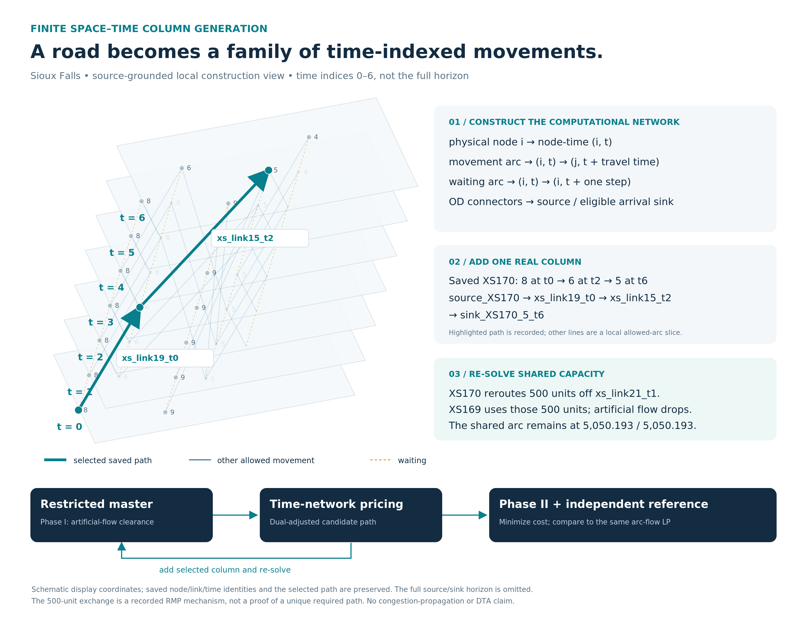
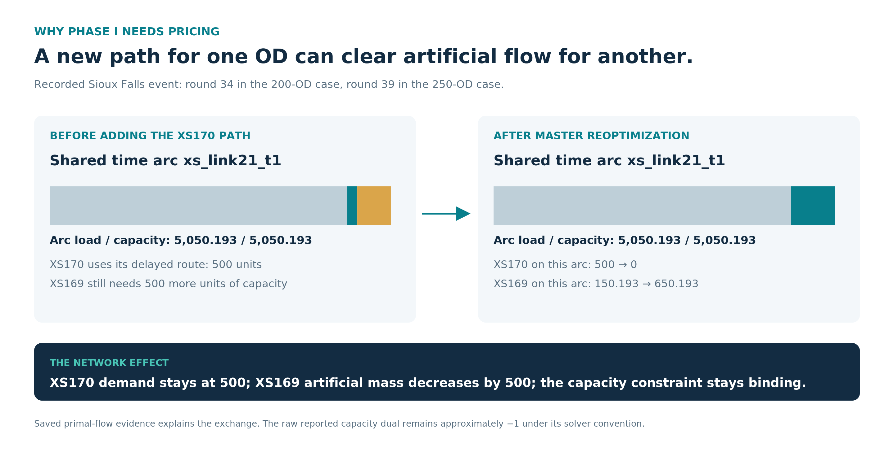

<!-- Homepage content derived from the root README by tools/build_case_presentation.py. -->

<h1 id="mobility-computation-lab">Mobility Computation Lab</h1>

<strong>An open-source computational framework for GMNS networks, demand, observation linkage and traffic assignment.</strong>

The reusable objects come first; cities are instances. Networks, zones and explicit units enter shared interfaces. Users can start with supplied vehicle OD, or prepare vehicle demand from a supported person-demand and choice specification. Static assignment and finite space–time column generation are <strong>different model branches</strong>, not interchangeable algorithms for one universal problem.

<a href="#framework">Framework</a> · <a href="#coverage">Case coverage</a> · <a href="#boston">Case 01 · Boston</a> · <a href="#sioux-falls">Case 02 · Sioux Falls</a> · <a href="#run-your-input">Run new inputs</a> · <a href="#mobility-data-support">Open data &amp; tools</a>

<h2 id="01-the-shared-framework">01 / The shared framework</h2>
<h3 id="gmns-is-the-common-object-contract">GMNS is the common object contract</h3>

<code>zone / super_zone → centroid / access → physical node / directed link</code> keeps the different objects distinct. Source-ID mappings connect supplied demand, matched observations and saved outputs without merging their identities. The exchange profile records directions, units, capacities and supported extensions. A nonphysical connector is not a road; a shared link reference does not make two datasets the same trip or observation.

The <strong>framework diagram above is conceptual</strong>. It contains no city geography or empirical values. Actual source-backed objects and record-level demonstrations appear inside each labeled case below. <a href="data-contract.html">Data contract</a> · <a href="city-workflow.html">City and hierarchy workflow</a>.

<h3 id="population-households-activity-preparation">Population, Households &amp; Activity Preparation</h3>

Before any optional demand estimation, source statistics and activity evidence need <strong>version, field, unit and geography checks</strong>. Statistical polygons and model zones are different objects: a declared spatial allocation can create zonal population and household attributes with source IDs, coverage and uncertainty limits retained. Activity evidence can supply a separate attraction attribute. A generation model must then declare which attribute it uses; households are one possible input, not a universal rate base. This preparation is <strong>upstream of stage 01</strong>, not a fifth numbered stage or an automatic adapter for every city.

Boston below demonstrates an actual aggregate ACS-to-H3 allocation and transferred household-rate example. Sioux Falls begins with supplied benchmark vehicle OD and has <strong>no estimated demographic stage</strong>. A user with valid vehicle OD may bypass population preparation and stages 01–03. <a href="datasets/boston-population-households.html">Boston's exact source fields, allocation and saved-table check</a>.

<h3 id="four-stages-with-explicit-inputs-and-outputs">Four stages, with explicit inputs and outputs</h3>

<table>
<thead>
<tr>
<th>Stage</th>
<th>Question</th>
<th>Computational object</th>
</tr>
</thead>
<tbody>
<tr>
<td><strong>01 · Trip generation</strong></td>
<td>How much travel is produced and attracted?</td>
<td>Activity/household evidence and a declared model → purpose-specific productions and attractions</td>
</tr>
<tr>
<td><strong>02 · Trip distribution</strong></td>
<td>Where does that travel go?</td>
<td>Margins, impedance and boundary treatment → directed person OD</td>
</tr>
<tr>
<td><strong>03 · Mode choice</strong></td>
<td>Which available alternatives are used?</td>
<td>Absolute costs or a declared pivot model → probabilities and mode demand; occupancy → vehicles</td>
</tr>
<tr>
<td><strong>04 · Traffic assignment</strong></td>
<td>Which paths and roads carry the demand?</td>
<td>A declared network, vehicle demand, period and objective → path/link flows and independent checks</td>
</tr>
</tbody>
</table>

A four-stage label is not a guarantee of a calibrated regional model. Input support, modeling assumptions and empirical status are recorded per case. <strong>Users who already have vehicle OD can enter directly at stage 04.</strong> No GPS, census or transit feed is required by the generic direct-vehicle entry.

<h3 id="gps-and-service-evidence-enter-through-explicit-relationships">GPS and service evidence enter through explicit relationships</h3>
<pre><code class="language-text">positions + timestamps → quality checks → road/service matching
                                            ↓
                          a supported interval/cost/parameter input
                                            ↓
                           mode demand and/or network calculation
</code></pre>

Map matching is a computation, not a property supplied automatically by the GMNS file format. A position sample is not a traffic count, and matched vehicle paths do not automatically reveal all passenger OD. Each application must define what an observation supports. Boston below separates spatial linkage from an exploratory transit-time feedback experiment.

<h3 id="methods-choose-the-mathematical-problem-before-the-solver">Methods: choose the mathematical problem before the solver</h3>

<table>
<thead>
<tr>
<th>Model family</th>
<th>Existing implementations</th>
<th>What the method returns</th>
</tr>
</thead>
<tbody>
<tr>
<td><strong>Static, fixed-demand user-equilibrium approximation</strong></td>
<td>Frank–Wolfe; solved finite-path reference; native Diagnostic L3 with declared reconstruction and constraints</td>
<td>BPR/Beckmann path and link flow under the declared period and units</td>
</tr>
<tr>
<td><strong>Finite space–time, fixed-cost capacitated flow</strong></td>
<td>Arc-flow reference LP; Phase-I feasibility restoration; Phase-II restricted master and pricing / column generation</td>
<td>Time-indexed path columns and capacity use; physical-link back-projection</td>
</tr>
</tbody>
</table>

Compression changes a representation and requires a checked reconstruction. It is <strong>not</strong> the same operation as time expansion. Diagnostic <strong>L3</strong> is an algorithm profile name, not GMNS Level 3 or stage 03 of the demand model. No unimplemented Bush/ADMM variant is listed as an available solver. <a href="methods.html">Actual method sources and supported scopes</a>.

<h3 id="why-a-spacetime-network-is-built-before-cg">Why a space–time network is built before CG</h3>

A physical node is replicated as <code>(node, time)</code>. A movement connects departure to a later arrival state; waiting stays at the same physical node while advancing time; demand-specific source/sink connections attach departure and arrival support. A path through that network becomes a column in the restricted master. Phase I reduces artificial demand; Phase II optimizes real path cost, with candidate paths supplied by pricing. The same-instance arc-flow LP is a reference, not another city or the static FW objective.

<a href="methods/space-time-cg.html">Construction and master/pricing guide</a>. Both cases now have source-grounded local time-network, clearance and capacity-exchange figures: <a href="cases/boston-space-time.html">Boston's single bounded 10-OD pilot</a> and the distinct <a href="cases/sioux-space-time.html">Sioux Falls 200/250-OD selected subsets</a>. Boston has independent full-DAG pricing closure; that certificate is <strong>not</strong> imputed to Sioux Falls.

<h2 id="02-what-each-case-demonstrates">02 / What each case demonstrates</h2>

The entries distinguish <strong>available code</strong>, <strong>executed case evidence</strong>, and <strong>the scale at which a method was actually accepted</strong>. A missing result is not a claim that the method can never run on that city. A tiny generic fixture does not certify a large Boston solve.

<table>
<thead>
<tr>
<th>Capability / evidence</th>
<th>Boston</th>
<th>Sioux Falls</th>
</tr>
</thead>
<tbody>
<tr>
<td>GMNS network, zones and access</td>
<td><strong>Demonstrated:</strong> H3 hierarchy, centroid/access and source-ID round-trip</td>
<td><strong>Benchmark network:</strong> supplied topology and demand; not a present-day H3 city dataset</td>
</tr>
<tr>
<td>Population, households and activity preparation</td>
<td><strong>Demonstrated, limited:</strong> source-backed ACS block-group → H3 aggregate allocation; separate MassGIS attraction proxy</td>
<td><strong>Not estimated:</strong> classic benchmark supplies vehicle OD without a demographic build</td>
</tr>
<tr>
<td>Trip generation</td>
<td><strong>Demonstrated, limited:</strong> ACS households + transferred purpose rates; activity attraction prior</td>
<td><strong>Not modeled:</strong> benchmark demand is supplied</td>
</tr>
<tr>
<td>Trip distribution</td>
<td><strong>Demonstrated, limited:</strong> saved gravity/IPF and PA-to-OD</td>
<td><strong>Not estimated:</strong> given OD and selected subsets</td>
</tr>
<tr>
<td>Mode choice</td>
<td><strong>Demonstrated, conditional:</strong> regional-share feedback and absolute DA/S2/S3/TW research branch</td>
<td><strong>Not modeled:</strong> fixed vehicle demand</td>
</tr>
<tr>
<td>GPS / service evidence</td>
<td><strong>Demonstrated, exploratory:</strong> network linkage and default-off interval feedback; no independent AM validation</td>
<td><strong>Not included</strong> in the classic benchmark</td>
</tr>
<tr>
<td>Static Frank–Wolfe</td>
<td><strong>Demonstrated:</strong> small controls and three expanded tiers, up to 17,522 loaded node ODs</td>
<td><strong>Demonstrated:</strong> historical static benchmark; input-identity caveat retained</td>
</tr>
<tr>
<td>Finite full-path reference</td>
<td><strong>Solved:</strong> 26-OD / 130-path control; <strong>resource-gated</strong> at expanded tiers</td>
<td>Used within the method/source framework; no equivalent solved full-path reference claimed by these supplied records</td>
</tr>
<tr>
<td>Native Diagnostic L3 / compression</td>
<td><strong>Accepted numerical controls:</strong> ranks 26/52; new-input fixture; <strong>not solved at expanded tiers</strong></td>
<td><strong>Executed numerical candidates:</strong> rank 50; full-network gaps remain 8.17% / 4.38%, not exact UE</td>
</tr>
<tr>
<td>Space–time network construction</td>
<td><strong>Demonstrated, bounded pilot:</strong> 90 nodes / 125 directed links / 10 ODs, 3-second steps and 100-step horizon</td>
<td><strong>Demonstrated:</strong> finite time-expanded 200 / 250-OD selected subsets</td>
</tr>
<tr>
<td>Phase I / Phase II / pricing</td>
<td><strong>Accepted bounded pilot:</strong> reference-optimal and independently full-DAG pricing-closed (10/10, tolerance 1e−6); second-machine check pending</td>
<td><strong>Historical 200 / 250 OD:</strong> feasible and same-subset arc-LP objective matched; independent pricing closure <strong>not established</strong></td>
</tr>
<tr>
<td>New-input preparation and solving</td>
<td><strong>Generic vehicle/person routes implemented</strong>, with declared profiles and optional dependencies</td>
<td>Existing benchmark and external-network interfaces; case-specific scope is explicit</td>
</tr>
<tr>
<td>Saved checks and visualization</td>
<td>Tables, GMNS tracing, static original-space checks, and full bounded CG figure family with R4 closure</td>
<td>Static checks, space–time traces, phase and capacity evidence</td>
</tr>
</tbody>
</table>

<a href="capabilities.html">Capability definitions and evidence pointers</a>. Both cases include assignment research; Boston is not only a data/GPS example and Sioux Falls is not the exclusive home of compression.

<h2 id="03-case-study-boston">03 / Case study — Boston</h2>

<strong>What this case demonstrates.</strong> Real-city GMNS object relationships; household/activity-based generation; modeled OD distribution; limited mode-choice branches; exploratory GPS/service linkage; new-input static computation; and FW at increasing demand coverage. It also retains a small <strong>FW / full-path / native L3</strong> control and a <strong>separate bounded, independently pricing-closed finite space–time CG pilot</strong>. <strong>Not demonstrated here:</strong> citywide CG, full-city empirically calibrated demand, or independent AM accuracy.

<table>
<thead>
<tr>
<th>Boston branch</th>
<th>Scope and purpose</th>
<th>Keep it distinct from</th>
</tr>
</thead>
<tbody>
<tr>
<td><strong>Semantic service-feedback baseline</strong></td>
<td>36 selected zone ODs × three departures; regional baseline shares; about 202.078 / 202.071 assigned vehicle trips</td>
<td>An absolute-cost baseline-choice model or the expanded all-OD run</td>
</tr>
<tr>
<td><strong>Conditional ABS_PLANNED control</strong></td>
<td>26 road-node ODs, 203.660479 vehicles, frozen 130-path comparison; FW and accepted native ranks 26/52</td>
<td>Expanded L3 performance</td>
</tr>
<tr>
<td><strong>Scalable conditional planned service</strong></td>
<td>500 / 2,000 / all 30,790 interzonal source ODs; new absolute attributes and eligible demand</td>
<td>All real Boston traffic or independent behavioral validation</td>
</tr>
</tbody>
</table>

<a href="cases/boston.html">Complete Boston case</a> · <a href="cases/boston-assignment.html">Static assignment branches</a> · <a href="cases/boston-space-time.html">Bounded space–time CG result</a>.

<h3 id="boston-finite-spacetime-cg-on-one-bounded-pilot">Boston / finite space–time CG on one bounded pilot</h3>

This is <strong>one</strong> accepted 90-physical-node, 125-directed-link, 10-OD time-expanded instance (3-second steps; 100-step horizon), not the 5,091-link static Boston assignment or a second Boston scale. The fixed-cost hard-capacity objective is distinct from FW/Beckmann. Saved Phase I removes <strong>20.5536128974</strong> artificial-flow units by round <strong>90</strong>; Phase II reaches <strong>64.39686151152952</strong> in <strong>15</strong> rounds, agreeing with the identical-graph arc-flow LP. R4 then adds <strong>15 zero-final-flow certificate columns</strong> across five degenerate continuation rounds (pool <strong>152 → 167</strong>) and independently checks the full DAG: <strong>B01–B10 all pass at 1e−6</strong>. Physical-link flows remain unchanged from R3 within numerical precision; the second-machine receiver check is pending.

The <a href="cases/boston-space-time.html">detailed Boston CG page</a> pairs the physical map with the actual B07 time-network cutaway, Phase-I total and OD-level traces, a recorded B10→B09 binding-arc exchange, Phase-II commits, final validation and R4 closure evidence. Each figure has PNG, editable SVG, plot input and hashed provenance. These are saved-result visualizations only; no model was rerun for this public update.

<small>Central Boston road geometry: GMNS Plus 21_Boston (Apache-2.0), commit 116447ab641cca1ed34797d019c8e704063393c3; H3 zones and cover composition: Mobility Computation Lab. Geography only—not measured or modeled traffic.</small>

<h3 id="boston-gmns-in-action">Boston / GMNS in Action</h3>

<strong>One network reference for zones, demand, observations, and results.</strong> The actual Boston exchange keeps H3 zone 35, its centroid, nonphysical access connector and physical road node distinct. A documented crosswalk maps zone identities to road access; zonal S1 demand remains modeled panel vehicle trips. A separate saved GPS path occurrence can reference a physical link and its saved S1 road result without claiming it is the same OD or observed journey.

<em>Separate objects, explicit relationships. Model access connectors are not physical roads. Shared link references do not imply a shared observed trip.</em> <a href="datasets/boston-gmns-exchange.html">Figure records, field mappings and provenance</a> · <a href="https://github.com/scholarhaozheng/mobility-network-lab/blob/main/examples/boston/gmns_exchange_r1/README.md">Versioned exchange and GMNS Plus profile</a> · <a href="../tools/gmns/trace_gmns_figure.py">Read-only relationship lookup</a>.

From the repository root, inspect the generic relationships with <code>python -B tools/gmns/boston_exchange.py trace --exchange examples/boston/gmns_exchange_r1/data</code>; the <a href="datasets/boston-gmns-exchange.html#reproduce-the-relationships">exact figure segment query</a> is separate. GMNS is the data/exchange contract, not the matching algorithm or evidence of improved prediction. The pinned GMNS Plus Level 2 reader accepted S1/S2 node/link/demand; a separate zone-schema check and the declared <code>mcl_solver_*</code> fields support the existing solver round-trip.

<h3 id="city-network-workflow">City network workflow</h3>

The common foundation is a real city network: <strong>2,852 physical nodes, 5,091 directed links, 177 H3 r9 zones and nine r7 parents</strong>. Zone-access mappings attach demand to roads; ordered link membership defines a corridor; transit and GPS records retain their own identities and connect to the same network. Model access lines are not automatically verified physical routes.

<a href="data-contract.html">GMNS-compatible input contract</a> · <a href="city-workflow.html">City and hierarchy guide</a> · <a href="datasets/boston-central.html">Boston network and data layers</a>

<h4 id="gmns-foundation-and-toolchain-alignment">GMNS Foundation and Toolchain Alignment</h4>

The <a href="https://github.com/scholarhaozheng/mobility-network-lab/blob/main/examples/boston/gmns_exchange_r1/README.md">versioned Boston exchange</a> now exposes the actual <a href="../examples/boston/gmns_exchange_r1/data/node.csv">GMNS nodes</a>, <a href="../examples/boston/gmns_exchange_r1/data/link.csv">directed links</a>, <a href="../examples/boston/gmns_exchange_r1/data/zone.csv">H3 zones and hierarchy</a>, and separate <a href="../examples/boston/gmns_exchange_r1/data/demand_S1.csv">S1</a>/<a href="../examples/boston/gmns_exchange_r1/data/demand_S2.csv">S2</a> zonal demand. A <a href="../examples/boston/gmns_exchange_r1/data/id_crosswalk.csv">reversible ID/access crosswalk</a> connects 177 distinct zones to 139 physical access nodes. The pinned GMNS Plus structural reader opened both exports; the adapter reconstructed the accepted physical solver inputs without rerunning the model. <a href="datasets/boston-gmns-exchange.html">Open/query/rebuild commands and precise scope</a> distinguish core GMNS fields, GMNS Plus conventions, and MCL GPS/service/result extensions. Source-hourly and solver-period capacities remain separate; nonphysical connectors have no invented routing costs. Grid2demand2/competition approval and empirical calibration are not claimed.

<em>This is the spatial foundation, not one of the four demand-model stages. Parcel outlines provide geographic context, not building footprints. <a href="datasets/boston-visual-sources.html">Sources, units and original map gallery</a>.</em>

<h3 id="boston-population-and-household-preparation">Boston / Population and Household Preparation</h3>

The <strong>U.S. Census Bureau's ACS 2024 five-year (2020–2024)</strong> block-group estimates were accessed through the <strong>Census Reporter <code>acs2024_5yr</code> mirror</strong> for Massachusetts Suffolk <code>025</code>, Middlesex <code>017</code> and Norfolk <code>021</code>; recorded source boundaries came from its <code>tiger2024</code> GeoJSON. The fixed core intersects <strong>174 source block groups</strong>. Those statistical polygons do not coincide with the <strong>177 clipped H3 r9 model zones</strong>. In EPSG:32619, each source estimate is assigned by <code>area(source ∩ clipped zone) / area(full source polygon)</code>; the outside-core share remains a spatial remainder, <strong>not</strong> an observed external-trip matrix. The allocation assumes uniform persons/households within each source polygon.

<table>
<thead>
<tr>
<th>Prepared quantity</th>
<th style="text-align:right">Saved core value</th>
<th>Role and source</th>
</tr>
</thead>
<tbody>
<tr>
<td>Population, ACS <a href="https://api.census.gov/data/2024/acs/acs5/groups/B01003.html"><code>B01003</code></a></td>
<td style="text-align:right"><strong>171,049.520 persons</strong></td>
<td>Retained H3 demographic attribute, not the household-rate multiplier; acquired via <a href="https://github.com/censusreporter/census-api/blob/master/API.md">Census Reporter <code>acs2024_5yr</code></a></td>
</tr>
<tr>
<td>Households, ACS <a href="https://api.census.gov/data/2024/acs/acs5/groups/B11001.html"><code>B11001</code></a></td>
<td style="text-align:right"><strong>79,537.493 households</strong></td>
<td><code>P_i,p = H_i × r_p</code> with six transferred <a href="https://ctps.org/pub/tdm23_sc/tdm23.2.0/TDM23.2.0_Structures%20and%20Performance.pdf#page=148">CTPS TDM23.2.0 Table 74 rates</a></td>
</tr>
<tr>
<td>Activity attraction</td>
<td style="text-align:right">Separate <a href="https://www.mass.gov/info-details/massgis-data-property-tax-parcels">MassGIS Property Tax Parcels</a> nonresidential/mixed building-area weights</td>
<td>Proxy attraction margins, <strong>not measured employment</strong> or ACS allocation weights</td>
</tr>
</tbody>
</table>

The <a href="../examples/boston/population_r1/data/acs_block_group_stats.csv">ACS source statistics</a>, <a href="../examples/boston/population_r1/data/acs_block_group_h3_crosswalk.csv">source-to-H3 contributions</a>, <a href="../examples/boston/population_r1/data/population_or_household_by_zone.csv">H3 attributes</a>, <a href="../examples/boston/behavior_feedback_r1_semantic_fix_r1/data/external_flow_ledger.csv">outside-core ledger</a> and <a href="../examples/boston/behavior_feedback_r1_semantic_fix_r1/data/trip_generation_by_purpose.csv">generation rows</a> are directly openable. <a href="datasets/boston-population-households.html">Source versions, provider/download links, exact fields, assumptions and no-solver reproduction command →</a>. Source margins of error were retained; the H3 estimates do not have a validated propagated MOE. All 177 saved zones have source coverage; in general, missing is not zero.

<h3 id="boston-the-retained-semantic-four-stage-chain">Boston / The retained semantic four-stage chain</h3>

<strong>This retained branch is a fixed-panel service-feedback example. The expanded computation follows in the next section.</strong> The numbered sections below describe the saved Boston implementation—not four generic software components.

<table>
<thead>
<tr>
<th>Stage</th>
<th>Question and actual calculation</th>
<th>What you can inspect</th>
</tr>
</thead>
<tbody>
<tr>
<td><strong>01 · Trip generation</strong></td>
<td>How many trips start and end in each zone? Area-allocated ACS household estimates are multiplied by transferred regional rates by purpose; MassGIS activity supplies attraction weights.</td>
<td><a href="datasets/boston-behavior-feedback.html#step-1-trip-generation">Zonal productions and six purpose totals</a>: <strong>816,054.67 modeled workday person trips</strong>, not observed trips.</td>
</tr>
<tr>
<td><strong>02 · Trip distribution</strong></td>
<td>Where do those trips go? Gravity/IPF and purpose/time-specific PA-to-OD conversion create directed demand.</td>
<td><a href="datasets/boston-behavior-feedback.html#step-2-trip-distribution">The saved 177 × 177 HBW midday matrix</a>, totaling <strong>22,807.22 modeled person trips</strong>.</td>
</tr>
<tr>
<td><strong>03 · Mode choice</strong></td>
<td>Which travel alternatives are selected? Scheduled and observation-adjusted journey costs drive a nested response around regional baseline shares.</td>
<td><a href="datasets/boston-behavior-feedback.html#step-3-mode-choice">Saved S1/S2 costs and probability changes</a>. S1 is still a shared regional baseline, not an OD-specific absolute-cost model.</td>
</tr>
<tr>
<td><strong>04 · Traffic assignment</strong></td>
<td>Which roads carry the resulting vehicles? The selected private/occupied-vehicle demand is loaded through the same static FW model.</td>
<td><a href="datasets/boston-behavior-feedback.html#step-4-traffic-assignment">S1 road flows and S2−S1 differences</a>, with input and result tables.</td>
</tr>
</tbody>
</table>

<strong>The scope narrows deliberately:</strong> regional generation → saved HBW demand → <strong>36 fixed OD pairs × three midday departures</strong> → <strong>78 eligible OD–time cases</strong> → about <strong>202 assigned vehicle trips</strong>. These are different populations and units, not one mass-conserving funnel. The remaining 30 cases retain their exclusion and person-demand records; the full regional demand is not assigned by this panel.

<table>
<tr><th>01 · Actual generation output</th><th>02 · Actual distribution output</th></tr>
<tr>
<td width="50%"></td>
<td width="50%"></td>
</tr>
<tr><td>Households and regional effective mean rates generate the modeled total. This is a result chart—not the residential-area input map.</td><td>Rows are origins and columns are destinations. These are modeled OD values, not GPS-inferred trips or mapped routes.</td></tr>
<tr><th>03 · Actual mode response</th><th>04 · Actual assignment output</th></tr>
<tr>
<td></td>
<td></td>
</tr>
<tr><td>The illustrated response depends on this OD's changed service costs. The common S1 shares are not newly estimated local baseline probabilities.</td><td>Static FW loads the selected vehicle panel. No regional background flow is included; this is not measured citywide congestion.</td></tr>
</table>

<a href="datasets/boston-behavior-feedback.html"><strong>Read the four stages with their inputs, operations and outputs →</strong></a> · <a href="datasets/boston-four-step-sources.html">Download the display data and check the source mapping</a>

<h3 id="boston-how-gps-changes-the-result">Boston / How GPS changes the result</h3>

<strong>GPS is not an unused map layer, and it is not a fifth stage.</strong> MBTA vehicle positions are matched to the network and related to transit service intervals. In this example, a saved interval observation changes the transit service input; stages 03 and 04 then recompute the dependent response. GPS does <strong>not</strong> determine the regional trip total or the gravity-model OD in this release.

<em>Source observations → algorithm-derived matching → physical road attributes → separately modeled assignment results.</em> This <strong>qualified route-60 segment</strong> is a spatial-reference illustration, not the route-749 service-feedback event below or a matching-accuracy test. Its 26 ordered path occurrences and projected positions are saved outputs, not newly matched here. <a href="datasets/boston-gmns-exchange.html#from-gps-coordinates-to-gmns-linked-evidence">Shared network reference—not the same observed trip; inspect exact records →</a>

<pre><code class="language-text">Vehicle positions → road/service linkage → interval-time adjustment
                                               ↓
                 transit itinerary and travel cost
                                               ↓
                03  mode-share response → vehicle demand
                                               ↓
                04  FW road assignment → link-flow response
</code></pre>

One saved trace uses route <strong>749</strong>, direction <strong>1</strong>, stop pair <strong>1788 → 5093</strong>: <strong>86 s sample-derived elapsed time versus 180 s planned</strong>. Applying the declared exploratory interval adjustment gives the following result for <strong>panel_od_019 at 12:30</strong>:

<table>
<thead>
<tr>
<th>Quantity in the same OD–departure case</th>
<th style="text-align:right">S1 · planned service</th>
<th style="text-align:right">S2 · exploratory adjustment</th>
</tr>
</thead>
<tbody>
<tr>
<td>Transit journey time</td>
<td style="text-align:right">29.052 min</td>
<td style="text-align:right">27.486 min</td>
</tr>
<tr>
<td>Selected-itinerary fare</td>
<td style="text-align:right">USD 1.70</td>
<td style="text-align:right">USD 1.70</td>
</tr>
<tr>
<td>Walk-access-transit probability, μ_transit = 1</td>
<td style="text-align:right">4.0990%</td>
<td style="text-align:right">4.2246%</td>
</tr>
<tr>
<td>Private/occupied ride-service demand</td>
<td style="text-align:right">2.164631 vehicle trips</td>
<td style="text-align:right">2.161796 vehicle trips</td>
</tr>
</tbody>
</table>

Across the <strong>whole eligible panel</strong>, S1/S2 vehicle inputs are <strong>202.078384 / 202.070733</strong>. Seventy-eight links differ by more than <code>1e-10</code>; the maximum absolute link difference is <strong>0.006603 modeled vehicle trips</strong>. A link difference aggregates contributing OD cases and is not attributable solely to the one trace above.

<strong>Srestore</strong> switches the service overlay off and independently recomputes the affected costs, probabilities and demand, returning them to S1. This demonstrates an executable dependency, not independent prediction accuracy. The 13 interval adjustments each have one supporting event and are disabled by default.

<a href="https://github.com/scholarhaozheng/mobility-network-lab/blob/main/examples/boston/behavior_feedback_r1_semantic_fix_r1/FEEDBACK_TRACE.md"><strong>Follow the exact observation → parameter → itinerary → probability → vehicle → road records →</strong></a> · <a href="datasets/boston-behavior-feedback.html#step-4-traffic-assignment">See the saved S2−S1 road map</a> · <a href="datasets/boston-central.html#one-saved-transit-position-projection">Inspect the separate GPS-to-road projection illustration</a>

<em>The projection map illustrates a different recorded segment; it is not presented as the same event as this feedback trace. The released calculation is a bounded technical example: no independently validated AM forecast, complete TDM23 reproduction or full-city multimodal assignment is claimed. <a href="datasets/boston-behavior-feedback.html#scope-and-assumptions">Scope and assumptions</a>.</em>

<h3 id="boston-scalable-assignment-is-now-the-primary-road-flow-result">Boston / Scalable assignment is now the primary road-flow result</h3>

The same 5,091-link clipped network is now evaluated on progressively larger source-zone demand sets using the <strong>new-input generic FW entry</strong>, not a renamed copy of the 26-OD solution. Planned-service costs were computed for new OD records, and the fixed conditional four-mode specification uses their absolute attributes. Unknown four-mode input remains unknown.

<table>
<thead>
<tr>
<th>Source-zone OD tier</th>
<th style="text-align:right">Selected person trips</th>
<th style="text-align:right">Evaluated person trips</th>
<th style="text-align:right">Loaded vehicle/PCE trips</th>
<th style="text-align:right">Loaded node ODs</th>
<th style="text-align:right">Positive physical links</th>
<th style="text-align:right">Accepted signed FW gap</th>
</tr>
</thead>
<tbody>
<tr>
<td><strong>500</strong></td>
<td style="text-align:right">2,643.767</td>
<td style="text-align:right">2,413.603</td>
<td style="text-align:right">1,936.238</td>
<td style="text-align:right">453</td>
<td style="text-align:right">1,653</td>
<td style="text-align:right">−4.59×10⁻¹⁶</td>
</tr>
<tr>
<td><strong>2,000</strong></td>
<td style="text-align:right">8,415.295</td>
<td style="text-align:right">7,248.674</td>
<td style="text-align:right">5,815.569</td>
<td style="text-align:right">1,684</td>
<td style="text-align:right">1,784</td>
<td style="text-align:right">5.60×10⁻⁶</td>
</tr>
<tr>
<td><strong>All 30,790 interzonal</strong></td>
<td style="text-align:right">22,633.470</td>
<td style="text-align:right">20,231.449</td>
<td style="text-align:right">16,259.122</td>
<td style="text-align:right"><strong>17,522</strong></td>
<td style="text-align:right"><strong>2,147</strong></td>
<td style="text-align:right"><strong>6.81×10⁻⁶</strong></td>
</tr>
</tbody>
</table>

The largest accepted FW result has <strong>133 physical endpoints</strong>, Beckmann objective <strong>73,552.277556 PCE-minutes</strong>, zero maximum OD residual and <code>2.84×10⁻¹⁴</code> link reconstruction error. These are checked numerical approximations for a <strong>conditional HBW-midday research cohort</strong>. They do not include all modes, all travelers, external/background traffic or empirical calibration.

<table class="figure-grid"><tr><th>Source zones: selected demand coverage</th><th>Physical roads: accepted all-tier FW</th></tr><tr><td width="50%"></td><td width="50%"></td></tr><tr><td>30,790 source pairs are not 30,790 loaded physical OD keys. Zone access, input support and same-node accounting remain explicit.</td><td>Model PCE flow, not observed counts. The three tier maps use tier-specific legend maxima; equal colors across tiers do not imply equal values.</td></tr></table>

<a href="assets/boston/scalable_tool_r1/fw_500_flow.png">500-tier map</a> · <a href="assets/boston/scalable_tool_r1/fw_2000_flow.png">2,000-tier map</a> · <a href="assets/boston/scalable_tool_r1/endpoint_all_coverage.png">All-tier endpoint coverage</a> · <a href="BOSTON_SCALE_RESULTS.html">Complete scale, runtime and resource records</a>.

<table>
<thead>
<tr>
<th>Expanded method status</th>
<th>500 tier</th>
<th>2,000 tier</th>
<th>All interzonal</th>
</tr>
</thead>
<tbody>
<tr>
<td><strong>FW</strong></td>
<td>Accepted</td>
<td>Accepted</td>
<td>Accepted</td>
</tr>
<tr>
<td><strong>Finite full-path</strong></td>
<td>Resource gate before solve; 2,261-path pool exists</td>
<td>Valid 8,412-path K5 pool; solve resource-gated</td>
<td>Path-pool preparation gate; not built</td>
</tr>
<tr>
<td><strong>Native L3, requested 25% / 50% fractions</strong></td>
<td>Basis/solve resource-gated</td>
<td>Basis/solve resource-gated</td>
<td>Pool/basis resource-gated</td>
</tr>
</tbody>
</table>

A separate <strong>new-input two-OD fixture</strong> actually ran finite full path and native L3 with IPOPT. That demonstrates changed-input method execution, not success at the large tiers. Accepted FW points have one positive saved path per loaded OD; larger coverage alone is not proof of a hard route-splitting or compression speedup experiment. No expanded L3 map is fabricated or substituted with FW.

<h3 id="boston-small-controlled-assignment-method-comparison">Boston / Small controlled assignment-method comparison</h3>

The real-city <a href="cases/boston.html">Boston case</a> includes <strong>both</strong> the GMNS/four-stage/GPS workflow above <strong>and</strong> executed static assignment methods. The earlier semantic S1/S2 service-feedback example used about <strong>202.078384 / 202.070733</strong> modeled vehicle trips. A separate conditional absolute-attribute choice sensitivity evaluates DA/S2/S3/TW for sufficient-vehicle households: 87 of 108 fixed OD-time objects had known four-mode inputs, 21 remained unknown, and only 78 common objects were road-loaded. Its <a href="https://github.com/scholarhaozheng/mobility-network-lab/blob/main/examples/boston/conditional_choice_r1/README.md">saved probabilities and specification</a> are a reduced transfer sensitivity, not calibrated all-mode TDM23 or an independent AM validation.

For the <strong>fixed ABS_PLANNED</strong> algorithm comparison, FW, the solved uncompressed path reference and two native Diagnostic L3 representations all use the same 5,091 physical links, 26 endpoint OD pairs, 203.6604786350987 modeled vehicle trips, heterogeneous BPR costs and frozen 130-path pool. ABS_OBS_EXPLORATORY FW is a separate service scenario, not another compression method or the old S1 export. <a href="cases/boston-assignment.html">Read full method/instance details and the full-size gallery</a>.

<table>
<thead>
<tr>
<th>Boston saved method / run</th>
<th style="text-align:right">Original Beckmann F (vehicle-minutes)</th>
<th>Original-space result and scope</th>
</tr>
</thead>
<tbody>
<tr>
<td><a href="../examples/boston/assignment_methods_r1/reference/fw_solution.csv">FW · ABS_PLANNED</a></td>
<td style="text-align:right">707.0579230712884</td>
<td>Same-network static FW; <a href="../algorithms/static_fw/tap_frank_wolfe.py">actual source</a></td>
</tr>
<tr>
<td><a href="../examples/boston/assignment_methods_r1/reference/full_path_flow.csv">Uncompressed 130-path SLSQP</a></td>
<td style="text-align:right">707.0579230712882</td>
<td>Exact saved OD equalities on this finite pool; <a href="https://github.com/scholarhaozheng/mobility-network-lab/blob/main/algorithms/finite_path_reference/README.md">solver/config</a></td>
</tr>
<tr>
<td><a href="../examples/boston/assignment_methods_r1/runs/rank26/outer_02_check.json">Native L3 · rank 26 · outer 02</a></td>
<td style="text-align:right">707.0578811137339</td>
<td>Max OD residual 8.255328278750085e-7; signed full-network relative gap <strong>−5.933966773022305e-8</strong>; 52 path coordinates + 5,091 links = 5,143 variables</td>
</tr>
<tr>
<td><a href="../examples/boston/assignment_methods_r1/runs/rank52/outer_02_check.json">Native L3 · rank 52 · outer 02</a></td>
<td style="text-align:right">707.0578811562873</td>
<td>Max OD residual 8.254705861077127e-7; signed full-network relative gap <strong>−5.927948547394401e-8</strong>; 78 path coordinates + 5,091 links = 5,169 variables</td>
</tr>
<tr>
<td><a href="../examples/boston/conditional_choice_r1/fw_abs_obs_exploratory_solution.csv">FW · ABS_OBS_EXPLORATORY</a></td>
<td style="text-align:right">707.043586277782</td>
<td><strong>Different demand:</strong> 203.6573680559407 vehicle trips; not a same-instance rank comparison</td>
</tr>
</tbody>
</table>

The two native points passed declared numerical checks, but their <strong>negative gaps reflect tolerated OD deficits</strong>, not exact feasible equilibria, improved traffic, or roundoff. Their initialization reused the full-path reference. No cold-start acceleration, peak IPOPT memory or independent performance validation is claimed.

<strong>Read across methods, then down to the signed difference.</strong> The first row compares three absolute-flow maps; the second row gives their differences and interpretation. This is the <strong>small 26-node-OD control</strong>, not the expanded 17,522-node-OD FW run.

Original full-resolution panels remain available: <a href="assets/boston/assignment_methods_r1/boston_abs_planned_fw_flow.png">FW</a> · <a href="assets/boston/assignment_methods_r1/boston_abs_planned_l3_rank26_flow.png">rank 26</a> · <a href="assets/boston/assignment_methods_r1/boston_abs_planned_l3_rank52_flow.png">rank 52</a> · <a href="assets/boston/assignment_methods_r1/boston_abs_planned_l3_rank26_minus_fw.png">rank 26 − FW</a> · <a href="assets/boston/assignment_methods_r1/boston_abs_planned_l3_rank52_minus_fw.png">rank 52 − FW</a>.

<em>All three absolute maps share one scale; the two signed maps share a zero-centred scale. They can look almost identical because the maximum native–FW link differences are only about <strong>5.89 × 10⁻⁶ modeled vehicle trips</strong>. These are saved model results, not GPS counts. <a href="assets/boston/assignment_methods_r1/boston_abs_planned_assignment_links.csv">Inspect all 5,091 full-precision physical-link rows</a> · <a href="assets/boston/assignment_methods_r1/BOSTON_ASSIGNMENT_FIGURE_SOURCES.json">Source/field/scale manifest</a> · <a href="../tools/visuals/render_boston_assignment.py">no-solve renderer</a>. GMNS physical link identities and the documented export crosswalk let method outputs attach to the same road network without changing the older S1 demand exchange.</em>

<pre><code class="language-bash">python -B tools/mcl_results.py list --case boston
python -B tools/mcl_results.py verify-saved --run boston-abs-planned-full-path
python -B tools/mcl_results.py verify-saved --run boston-abs-planned-l3-rank26-outer02
</code></pre>

These commands inspect saved points; they do not solve, build paths, refit demand or match new GPS data.

<h2 id="04-case-study-sioux-falls">04 / Case study — Sioux Falls</h2>

<strong>What this case demonstrates.</strong> A classic supplied-demand benchmark with static FW and native L3 research, plus distinct 200/250-OD finite space–time CG instances. <strong>Not modeled here:</strong> real-city trip generation, destination/mode estimation or GPS service feedback. The benchmark does not become a modern city dataset because it shares the framework.

<h3 id="sioux-falls-static-methods-and-retained-benchmarks">Sioux Falls / Static methods and retained benchmarks</h3>

The <a href="cases/sioux-falls.html">Sioux Falls case</a> also has actual static assignment work. Its historical <a href="datasets/sioux-static-fw.html">FW result</a> has Beckmann F <strong>4,236,715.140437842</strong>, but the retained runtime OD identity is insufficient to declare it a same-input reference for the native profile. The corrected <a href="https://github.com/scholarhaozheng/mobility-network-lab/blob/main/algorithms/path_compression/diagnostic_l3/README.md">native Diagnostic L3 implementation</a> has accepted <strong>outer-04</strong> points on the frozen 76-link, 528-positive-OD, 2,218-path static instance (rank 50; 585 reduced path coordinates; 661 total native variables):

<table>
<thead>
<tr>
<th>Sioux native configuration</th>
<th style="text-align:right">Original Beckmann component F</th>
<th style="text-align:right">Max OD residual</th>
<th style="text-align:right">Full-network relative cost gap</th>
</tr>
</thead>
<tbody>
<tr>
<td><a href="../examples/sioux-falls/native_l3_r1/runs/SiouxFalls/A_REG001/outer_04_check.json">A_REG001 · gamma=0.01</a></td>
<td style="text-align:right">4,325,864.946597109</td>
<td style="text-align:right">5.548833712509804e-7</td>
<td style="text-align:right"><strong>8.167461%</strong></td>
</tr>
<tr>
<td><a href="../examples/sioux-falls/native_l3_r1/runs/SiouxFalls/B_BECKMANN/outer_04_check.json">B_BECKMANN · gamma=0</a></td>
<td style="text-align:right">4,289,674.484214505</td>
<td style="text-align:right">6.957361051718181e-7</td>
<td style="text-align:right"><strong>4.381867%</strong></td>
</tr>
</tbody>
</table>

Both pass recorded numerical feasibility, but neither has a full-network UE certificate or new empirical validation. A is regularized and B is not. The separate 200OD/250OD figures below are <strong>historical finite time-expanded CG</strong>, not native-L3 runs or present-day city observations. Sioux demand is exogenous; no real-city GPS/GTFS or Boston-style four-stage estimation was added.

Explore the actual saved results before running an example. The two panels below are <strong>different selected-OD benchmark instances</strong>, not a comparison of algorithms on the same demand.

<table>
<tr>
<th>Sioux Falls · 200 OD</th><th>Sioux Falls · 250 OD</th>
</tr>
<tr>
<td width="50%"></td>
<td width="50%"></td>
</tr>
<tr>
<td>24 nodes · 64 selected links · 446 final columns <a href="datasets/sioux-200od.html">Open 200-OD results →</a></td>
<td>24 nodes · 69 selected links · 567 final columns <a href="datasets/sioux-250od.html">Open 250-OD results →</a></td>
</tr>
<tr>
<td></td>
<td></td>
</tr>
</table>

<em>Map line width represents final movement flow accumulated over the modelled time horizon. These are schematic physical-link views, not observed traffic, static V/C or a full 528-OD assignment. Opposite directions can overlap in the existing map rendering; use the data cards for numerical interpretation.</em>

<table>
<thead>
<tr>
<th>Road benchmark</th>
<th style="text-align:right">Physical nodes</th>
<th style="text-align:right">Selected links</th>
<th style="text-align:right">OD pairs</th>
<th style="text-align:right">Final columns</th>
<th style="text-align:right">Objective</th>
<th>Access</th>
</tr>
</thead>
<tbody>
<tr>
<td><a href="datasets/sioux-200od.html">Sioux Falls · 200 OD</a></td>
<td style="text-align:right">24</td>
<td style="text-align:right">64</td>
<td style="text-align:right">200</td>
<td style="text-align:right">446</td>
<td style="text-align:right">943,155.589771</td>
<td>Historical result record</td>
</tr>
<tr>
<td><a href="datasets/sioux-250od.html">Sioux Falls · 250 OD</a></td>
<td style="text-align:right">24</td>
<td style="text-align:right">69</td>
<td style="text-align:right">250</td>
<td style="text-align:right">567</td>
<td style="text-align:right">1,521,090.836620</td>
<td>Historical result record</td>
</tr>
<tr>
<td><a href="datasets/sioux-static-fw.html">Sioux Falls · static FW</a></td>
<td style="text-align:right">24</td>
<td style="text-align:right">76</td>
<td style="text-align:right">528</td>
<td style="text-align:right">—</td>
<td style="text-align:right">4,236,715.140438</td>
<td>Approximate static baseline</td>
</tr>
</tbody>
</table>

<a href="visualizations.html"><strong>All six benchmark figures</strong></a> · <a href="datasets.html">Network and example catalog</a> · <a href="outputs.html">Verification scope</a>

Historical road records include checked results and approved figures, <strong>not redistributed raw inputs</strong>. Self-contained <a href="examples.html">synthetic reference inputs</a> are bundled separately for installation and regression testing. Static FW and space–time CG solve different model formulations; their objective values are not directly comparable.

<h3 id="sioux-falls-from-the-physical-network-to-time-indexed-columns">Sioux Falls / From the physical network to time-indexed columns</h3>

<strong>The CG examples solve a finite space–time linear flow model with fixed arc costs and explicit capacities.</strong> They are not the same objective as static BPR/Beckmann FW or native L3. Source and sink connectors attach each demand to the time network, movement arcs advance to arrival times, and waiting arcs permit modeled delay.

<strong>This is an explanatory local cutaway—not a plot of every node and arc.</strong> Diagram positions are schematic; the selected IDs and times come from saved records. The highlighted column is <code>source_XS170 → xs_link19_t0 → xs_link15_t2 → sink_XS170_5_t6</code>, corresponding to physical nodes <code>8 → 6 → 5</code> at times <code>0 → 2 → 6</code>. The rest of the horizon and demand-specific connectors are not drawn. <a href="cases/sioux-space-time.html">Construction, exact fields and source mappings</a>.

<h3 id="sioux-falls-phase-i-restores-feasibility-phase-ii-improves-cost">Sioux Falls / Phase I restores feasibility, Phase II improves cost</h3>

<table class="figure-grid"><tr><th>200 OD · artificial mass clears in round 51</th><th>250 OD · artificial mass clears in round 62</th></tr><tr><td width="50%"></td><td width="50%"></td></tr></table>

<table>
<thead>
<tr>
<th>Saved observation</th>
<th style="text-align:right">200 OD</th>
<th style="text-align:right">250 OD</th>
</tr>
</thead>
<tbody>
<tr>
<td>Initial artificial mass</td>
<td style="text-align:right">749.806844</td>
<td style="text-align:right">4,082.887577</td>
</tr>
<tr>
<td>Demands initially carrying artificial mass</td>
<td style="text-align:right">2</td>
<td style="text-align:right">5</td>
</tr>
<tr>
<td>Round when artificial mass becomes zero</td>
<td style="text-align:right">51</td>
<td style="text-align:right">62</td>
</tr>
<tr>
<td>Added Phase-I / Phase-II columns</td>
<td style="text-align:right">51 / 195</td>
<td style="text-align:right">62 / 255</td>
</tr>
<tr>
<td>Final real-column pool</td>
<td style="text-align:right">446</td>
<td style="text-align:right">567</td>
</tr>
<tr>
<td>Final objective / same-instance arc-LP reference</td>
<td style="text-align:right">943,155.589771</td>
<td style="text-align:right">1,521,090.836620</td>
</tr>
<tr>
<td>Absolute objective difference</td>
<td style="text-align:right">2.33×10⁻¹⁰</td>
<td style="text-align:right">0</td>
</tr>
<tr>
<td>Maximum final demand residual / capacity violations</td>
<td style="text-align:right">0 / 0</td>
<td style="text-align:right">0 / 0</td>
</tr>
</tbody>
</table>

The 200-OD selection is contained in the 250-OD selection. There is one recorded run per size, with different iteration/candidate caps. These are <strong>descriptive historical runs</strong>, not repeated runtime trials, a scaling law or a global pricing-closure certificate. The original run summaries explicitly leave <code>optimality_claimed</code> and <code>full_cg_global_convergence_claimed</code> false.

<h3 id="sioux-falls-a-new-path-can-help-a-different-od">Sioux Falls / A new path can help a different OD</h3>

At round 34 (200 OD) and round 39 (250 OD), pricing selected a new path for <strong>XS170</strong>, but <strong>XS169</strong> lost 500 units of artificial mass after master reoptimization. XS170's 500 real units moved away from <code>xs_link21_t1</code>; XS169's real flow on that binding shared arc grew from 150.193 to 650.193. The total arc load stayed at its 5,050.193 capacity.

This is a recorded coupled-master mechanism, not a proof that this one path was uniquely necessary. The raw capacity dual stays approximately −1 under the saved solver convention. <a href="assets/sioux/phase_i_r1/od_level_phase_i_clearance.png">OD-level supplementary figure</a> · <a href="assets/sioux/phase_i_r1/data/200_phase_i_trace.csv">Saved trace CSVs</a> · <a href="cases/sioux-space-time.html">Full Sioux CG explanation</a>.

<h2 id="05-run-new-inputs-or-inspect-saved-results">05 / Run new inputs, or inspect saved results</h2>

<strong>These are two different operations.</strong> The new generic preparation/solve entry computes a fresh result from supplied inputs. The saved-result entries below inspect frozen experiments. A documentation build never silently invokes a solver.

<h3 id="new-vehicle-od-preparation-fw-verification-map">New vehicle OD → preparation → FW → verification → map</h3>
<pre><code class="language-bash">python -B tools/mcl_assignment.py prepare --input examples/scalable_vehicle_fixture/network --demand examples/scalable_vehicle_fixture/vehicle.csv --config examples/scalable_vehicle_fixture/config.json --output "my results/instance"
python -B tools/mcl_assignment.py solve --instance "my results/instance" --method fw --output "my results/fw"
python -B tools/mcl_assignment.py verify --run "my results/fw"
python -B tools/mcl_assignment.py plot --run "my results/fw" --output "my results/figures"
</code></pre>

The supported direct-vehicle profile is single-class, fixed-demand and static. It retains text IDs and parallel physical links; units, capacity basis, period and PCE factor are explicit. Unsupported turn-state or class/time inputs are rejected rather than ignored. <code>prepare</code>, FW and <code>verify</code> use the standard library; plotting and optional native methods have separate dependencies.

A second entry accepts person OD, supported absolute skims, the fixed conditional choice specification and occupancy configuration. It feeds the same vehicle-assignment interface; it is not an arbitrary calibrated choice-model library. <a href="RUN_YOUR_OWN_GMNS.html">Full new-input contract and commands</a> · <a href="https://github.com/scholarhaozheng/mobility-network-lab/blob/main/examples/boston/scalable_tool_r1/README.md">Boston scale profile</a> · <a href="SCALABLE_TOOL_DATA_NOTICE.html">Data and dependency terms</a>.

<h2 id="mobility-data-support">Mobility data support</h2>
<h3 id="open-mobility-evidence">Open mobility evidence</h3>

<strong>Explore the data behind a city model, then prepare the records you need.</strong> Selected Open Mobility Data Visibility (OMDV) results now include a downloadable, non-geometric 11,422-city evidence table and actual source-record → content-SHA → city relationships. The executable tools query those records, organize local catalogs and inspect a user-supplied GTFS ZIP.

<!-- open-evidence-overview:start -->

<table>
<tr>
<td data-evidence-layer="global_city_frame" width="50%"><b>11,422 urban centres</b> <a href="open-data.html#global-city-frame">City frame &amp; catalog visibility</a> A common GHSL study frame with explicitly defined catalog-matching scenarios.</td>
<td data-evidence-layer="gtfs_static" width="50%"><b>2,959 cities with GTFS stop evidence</b> <a href="open-data.html#gtfs-static">Scheduled-transit evidence</a> 4,425 unique parseable content hashes in the all-retained view; city evidence uses inside-polygon stops.</td>
</tr>
<tr>
<td data-evidence-layer="gtfs_realtime"><b>2,465 endpoint representatives</b> <a href="open-data.html#gtfs-realtime">GTFS-Realtime source context</a> Metadata accounting and bounded snapshot classifications, not a live health monitor.</td>
<td data-evidence-layer="osm_map_features"><b>29 regional extracts</b> <a href="open-data.html#osm">OSM map-feature evidence</a> 791 of 916 sampled urban-centre rows have bbox-joined point-feature evidence.</td>
</tr>
<tr>
<td data-evidence-layer="gbfs_shared_mobility"><b>1,516 shared-mobility registry rows</b> <a href="open-data.html#gbfs-and-shared-mobility">GBFS source context</a> 48 countries represented; location strings are not reviewed city matches.</td>
<td data-evidence-layer="model_interoperability"><b>13 standards and tools</b> <a href="interoperability.html">Model-interface crosswalk</a> GMNS, TNTP, GTFS and related formats: references and reuse pathways, not thirteen bundled converters.</td>
</tr>
</table>

<!-- open-evidence-overview:end -->

These evidence layers are not additive. Each value is tied to its own unit, source frame and retained research snapshot. They do not measure live service coverage or the number of runnable city models. The public release includes a <strong>selected result projection</strong>, provenance and executable tools—not raw feeds, provider URLs, geometry or live endpoint checks. <a href="open-data-explorer.html">Browse/download 11,422 city rows</a> · <a href="open-data-sources.html">Sources and reproduction scope</a> · <a href="omdv-provenance.html">Trace each metric</a>

<h3 id="query-evidence-and-prepare-your-own-records">Query evidence and prepare your own records</h3>

The authorized OMDV workflow normalizes a user-supplied feed catalog and city table, performs exact city/country <strong>named-entity matching</strong>, and writes standardized records, unmatched/ambiguous statuses and quality checks.

<pre><code class="language-bash">python -m pip install -r requirements-data-tools.txt
python -B tools/mcl_data.py catalog-city-match --catalog examples/data-tools/feeds_sample.csv --cities examples/data-tools/external_city_universe_sample.csv --output results/data-tools-demo
python -B tools/mcl_data.py query-city --name "Hong Kong" --country CHN --include-relations
python -B tools/mcl_data.py process-gtfs --zip path/to/feed.zip --output results/gtfs-content-report
</code></pre>

<code>query-city</code> prefers the stable city ID and explicitly rejects duplicate name/country keys unless <code>--all-matches</code> is requested. <code>process-gtfs</code> reuses the authorized OMDV content parser with a streamed stop-times pass; it makes no network request and does not extract or modify the ZIP. These are evidence/content tools, not GPS-to-road matching, traffic-zone creation, OD estimation or an automatic connection to the solver.

<a href="open-data-explorer.html"><strong>Browse city evidence</strong></a> · <a href="data-tools.html"><strong>Use the data tools</strong></a> · <a href="open-data.html"><strong>Explore all six evidence layers</strong></a> · <a href="city-workflow.html"><strong>Connect data to the city workflow</strong></a>

<h2 id="quick-start">Quick start</h2>

Use a compatible Python environment and install the network-workflow dependencies. The source has been exercised with Python 3.12 and 3.13; see the <a href="getting-started.html">tested profiles and installation guide</a>.

<pre><code class="language-bash">python -m pip install -r requirements.txt
python tools/mnl.py catalog
</code></pre>

Run the self-contained capacity regression from network and demand tables:

<pre><code class="language-bash">python tools/mnl.py run --input app/cases/capacity_zone_probe/input --config app/cases/capacity_zone_probe/case.json --seed-mode auto --seed-k 1 --output results/capacity-demo
python tools/mnl.py verify --run results/capacity-demo
</code></pre>

Open <code>results/capacity-demo/report.html</code>. The reference example allocates 3 units to one route and 7 to the alternative, with objective <strong>27</strong>. This is a labelled regression example, not a city dataset. Use a new output directory for each run.

To inspect the <strong>saved</strong> Central Boston feedback results without rerunning a model, use the included compact component and a new output directory:

<pre><code class="language-bash">python -B examples/boston/run_saved_example.py --data-dir "examples/boston/behavior_feedback_r1_semantic_fix_r1" --output "results/boston_saved_example"
</code></pre>

The command rebuilds a query database from the released CSVs and exports five saved-result queries; it does not acquire sources, fit parameters, run FW/CG or validate predictions. The <a href="https://github.com/scholarhaozheng/mobility-network-lab/blob/main/examples/boston/SAVED_EXAMPLE.md">saved-result guide</a> also explains how to point <code>--data-dir</code> at <code>public_component</code> after extracting the separate full data asset. The trusted code stays beside the wrapper in this checkout.

<h2 id="use-your-own-network">Use your own network</h2>

Declare node/link/demand fields, units and zone-access rules in <code>case.json</code>, then use the same numerical entry point:

<pre><code class="language-bash">python tools/mnl.py validate --input /path/to/network/input --config /path/to/network/case.json
python tools/mnl.py run --input /path/to/network/input --config /path/to/network/case.json --seed-mode auto --seed-k 5 --output results/network-run
python tools/mnl.py verify --run results/network-run
</code></pre>

The current CG profile uses one-minute steps, positive integer travel times, a common departure time, fixed costs, continuous path flows and shared hard arc capacities. <a href="data-contract.html">Read the exact contract</a> before adapting a dataset; this is not a general static user-equilibrium or unrestricted city-scale DTA interface.

<strong>Network + demand → route initialization → explicit space–time network → reference LP + Phase-I/II → final pool, flows and duals → independent checks.</strong>

The allowed network is independent of the initial route pool. Every column in the last successfully solved pool is exported, including zero-flow columns. Reference agreement and independently established pricing closure are distinct statements.

<h2 id="tools-methods-and-extensions">Tools, methods and extensions</h2>

<a href="https://github.com/zephyr-data-specs/GMNS">GMNS</a> supplies the common network vocabulary. <a href="https://github.com/HanZhengIntelliTransport/GMNS_Plus_Dataset">GMNS Plus Dataset</a>, <a href="https://github.com/asu-trans-ai-lab/OSM2GMNS">OSM2GMNS</a>, <a href="https://github.com/asu-trans-ai-lab/grid2demand">grid2demand</a> and <a href="https://github.com/asu-trans-ai-lab/TAPLab">TAPLab</a> are upstream data/tools with their own implementations and licenses. A reference link is not evidence of a bundled executable integration.

The computational release includes <strong>space–time CG</strong>, <strong>static Frank–Wolfe</strong>, the solved <strong>finite-path Boston reference</strong>, and the corrected <strong>native Diagnostic L3</strong> source/profiles with selected saved Boston and Sioux records. <a href="methods.html">The method table</a> states their distinct objectives, instances and accuracy scopes; <code>python -B tools/mcl_results.py list</code> and <code>verify-saved --run &lt;run-id&gt;</code> inspect the released points without solving. Generalized raw-city automation, broader GPS traces and map matching, and origin-based / Policy Bush methods remain research extensions. Coupled primal–dual, Lagrangian and ADMM methods are not newly shipped or validated by this integration. <a href="city-workflow.html">City workflow</a> · <a href="roadmap.html">Roadmap</a>

<h2 id="project-layout">Project layout</h2>
<pre><code class="language-text">app/src/gmns_dynamic/   Existing network input and space–time CG engine
app/cases/             Self-contained, labelled regression examples
algorithms/static_fw/  Separate static traffic-assignment baseline
algorithms/finite_path_reference/  Boston 130-path SLSQP source/config
algorithms/path_compression/diagnostic_l3/  Corrected native builder and profiles
algorithms/mode_choice_conditional/  Reduced absolute-attribute choice evaluator
examples/boston/assignment_methods_r1/  Saved FW/full-path/native results
examples/sioux-falls/native_l3_r1/  Selected Sioux native results
launcher/              Saved-output verification
src/mobilitylab/        Authorized metadata tools and supporting adapters
catalog/               Network records, evidence summaries and provenance
schemas/               Explicit input and output contracts
docs/                  City workflow, visual results and project website
tools/                 User commands, documentation build and checks
</code></pre>
<h2 id="contributing-citation-and-licenses">Contributing, citation and licenses</h2>

Contribute a traceable city/network instance, a focused adapter, a verification improvement or a documented method. Keep observed, estimated and synthetic inputs distinct. <a href="https://github.com/scholarhaozheng/mobility-network-lab/blob/main/CONTRIBUTING.md">Contribution guide</a> · <a href="add-a-network.html">Add a network</a> · <a href="citation.html">Citation</a>

Original code in the public tree is distributed under <a href="../LICENSE">MIT</a> within the stated authorization scope. Datasets and third-party tools retain their own terms. See <a href="https://github.com/scholarhaozheng/mobility-network-lab/blob/main/DATA_LICENSES.md">data licenses</a>, <a href="https://github.com/scholarhaozheng/mobility-network-lab/blob/main/THIRD_PARTY_NOTICES.md">third-party notices</a> and <a href="data-access.html">data access</a>.

