<!-- Homepage content derived from the root README by tools/build_case_presentation.py. -->

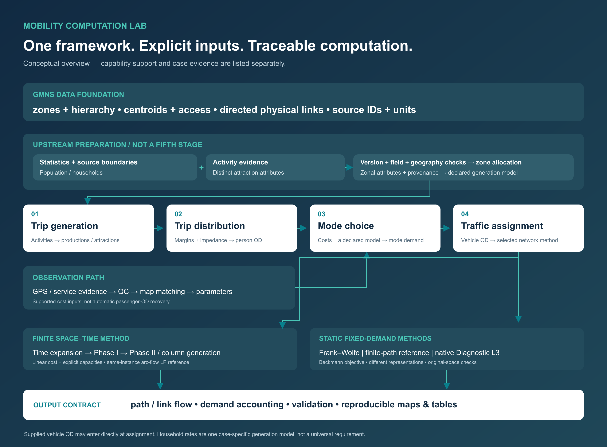

<h1 id="mobility-computation-lab">Mobility Computation Lab</h1>

<strong>An open-source computational framework for GMNS city models, four-stage demand, static assignment, and finite space–time optimization.</strong> City networks, travel demand and reproducible network computation.

The reusable objects come first; cities are instances. Networks, zones and explicit units enter shared interfaces. Users can start with supplied vehicle OD, or prepare vehicle demand from a supported person-demand and choice specification. Static assignment and finite space–time capacitated flow are <strong>different model branches</strong>, not interchangeable algorithms for one universal problem.

<blockquote>

<strong>Executed CG evidence is part of the public release—not only a roadmap.</strong> Boston and Hong Kong each have a distinct accepted bounded ten-demand pilot with same-graph arc-flow LP agreement and independent pricing closure for 10/10 demands. Sioux Falls retains separate 200-OD and 250-OD historical selected-OD runs with reference-objective agreement; independent pricing closure is not established for those retained runs. These are three different instances, not one interchangeable citywide result.

</blockquote>

<a href="#framework">Framework</a> · <a href="#cg-experiments">Executed CG experiments</a> · <a href="#admm-r2">ADMM R2</a> · <a href="#distributed-assignment">Distributed assignment</a> · <a href="#algorithm-b">Algorithm B</a> · <a href="#coverage">Case coverage</a> · <a href="#boston">Case 01 · Boston</a> · <a href="#sioux-falls">Case 02 · Sioux Falls</a> · <a href="#hong-kong">Case 03 · Hong Kong</a> · <a href="#run-your-input">Run new inputs</a> · <a href="#mobility-data-support">Open data &amp; tools</a>

<h2 id="01-shared-computational-architecture">01 / Shared computational architecture</h2>

<code>network + declared demand → [static BPR/Beckmann: FW / Algorithm B / finite-path / L3]</code>

<code>network + selected finite demand + time horizon → [fixed-cost hard-capacity arc-flow LP / CG / Lagrangian / ADMM]</code>

Population, household, activity, transit and observation preparation may inform a declared demand branch; a supplied vehicle OD can bypass preparation. The static result is <strong>not</strong> a prerequisite for time expansion, and their objectives are not compared numerically.

The <strong>physical network</strong> contains directed physical links. A <strong>finite time-expanded graph</strong> copies its states in time and adds movement, waiting, source and sink arcs. A <strong>generated column</strong> is one feasible source-to-sink time-indexed path. Final time-expanded movement-arc flow is aggregated back to <strong>final physical-link movement flow</strong>. Static BPR/Beckmann and finite fixed-cost hard-capacity problems have different objectives and units.

The same vocabulary and figure order are used below, while each city's scale, evidence and gates remain distinct. <a href="methods/space-time-cg.html">CG method</a> · <a href="data-contract.html">Data contract</a> · <a href="data/three_city_r1/THREE_CITY_FINITE_TIME_EXPANDED_STATISTICS.csv">Figure source table</a>.

<h3 id="gmns-is-the-common-object-contract">GMNS is the common object contract</h3>

<code>zone / super_zone → centroid / access → physical node / directed link</code> keeps the different objects distinct. Source-ID mappings connect supplied demand, matched observations and saved outputs without merging their identities. The exchange profile records directions, units, capacities and supported extensions. A nonphysical connector is not a road; a shared link reference does not make two datasets the same trip or observation.

The <strong>framework diagram above is conceptual</strong>. It contains no city geography or empirical values. Actual source-backed objects and record-level demonstrations appear inside each labeled case below. <a href="data-contract.html">Data contract</a> · <a href="city-workflow.html">City and hierarchy workflow</a>.

<h3 id="population-households-activity-preparation">Population, Households &amp; Activity Preparation</h3>

Before any optional demand estimation, source statistics and activity evidence need <strong>version, field, unit and geography checks</strong>. Statistical polygons and model zones are different objects: a declared spatial allocation can create zonal population and household attributes with source IDs, coverage and uncertainty limits retained. Activity evidence can supply a separate attraction attribute. A generation model must then declare which attribute it uses; households are one possible input, not a universal rate base. This preparation is <strong>upstream of stage 01</strong>, not a fifth numbered stage or an automatic adapter for every city.

Boston below demonstrates an actual aggregate ACS-to-H3 allocation and transferred household-rate example. Sioux Falls begins with supplied benchmark vehicle OD and has <strong>no estimated demographic stage</strong>. A user with valid vehicle OD may bypass population preparation and stages 01–03. <a href="datasets/boston-population-households.html">Boston's exact source fields, allocation and saved-table check</a>.

<h3 id="four-stages-with-explicit-inputs-and-outputs">Four stages, with explicit inputs and outputs</h3>

<table>
<thead>
<tr>
<th>Stage</th>
<th>Question</th>
<th>Computational object</th>
</tr>
</thead>
<tbody>
<tr>
<td><strong>01 · Trip generation</strong></td>
<td>How much travel is produced and attracted?</td>
<td>Activity/household evidence and a declared model → purpose-specific productions and attractions</td>
</tr>
<tr>
<td><strong>02 · Trip distribution</strong></td>
<td>Where does that travel go?</td>
<td>Margins, impedance and boundary treatment → directed person OD</td>
</tr>
<tr>
<td><strong>03 · Mode choice</strong></td>
<td>Which available alternatives are used?</td>
<td>Absolute costs or a declared pivot model → probabilities and mode demand; occupancy → vehicles</td>
</tr>
<tr>
<td><strong>04 · Traffic assignment</strong></td>
<td>Which paths and roads carry the demand?</td>
<td>A declared network, vehicle demand, period and objective → path/link flows and independent checks</td>
</tr>
</tbody>
</table>

A four-stage label is not a guarantee of a calibrated regional model. Input support, modeling assumptions and empirical status are recorded per case. <strong>Users who already have vehicle OD can enter directly at stage 04.</strong> No GPS, census or transit feed is required by the generic direct-vehicle entry.

<h3 id="gps-and-service-evidence-enter-through-explicit-relationships">GPS and service evidence enter through explicit relationships</h3>
<pre><code class="language-text">positions + timestamps → quality checks → road/service matching
                                            ↓
                          a supported interval/cost/parameter input
                                            ↓
                           mode demand and/or network calculation
</code></pre>

Map matching is a computation, not a property supplied automatically by the GMNS file format. A position sample is not a traffic count, and matched vehicle paths do not automatically reveal all passenger OD. Each application must define what an observation supports. Boston below separates spatial linkage from an exploratory transit-time feedback experiment.

<h3 id="methods-choose-the-mathematical-problem-before-the-solver">Methods: choose the mathematical problem before the solver</h3>

<table>
<thead>
<tr>
<th>Model family</th>
<th>Existing implementations</th>
<th>What the method returns</th>
</tr>
</thead>
<tbody>
<tr>
<td><strong>Static, fixed-demand user-equilibrium approximation</strong></td>
<td>Frank–Wolfe; solved finite-path reference; native Diagnostic L3; official <code>tap-b</code> Algorithm B with an explicitly named adapter route</td>
<td>BPR/Beckmann path and link flow under the declared period and units</td>
</tr>
<tr>
<td><strong>Finite space–time, fixed-cost capacitated flow</strong></td>
<td>Arc-flow reference LP; Phase-I/II column generation; bounded Sioux/Hong Kong Lagrangian; Sioux/Boston ADMM R2_S</td>
<td>Time-indexed flows and shared-capacity checks; algorithm-specific certificates and physical-link back-projection</td>
</tr>
</tbody>
</table>

Compression changes a representation and requires a checked reconstruction. It is <strong>not</strong> the same operation as time expansion. Diagnostic <strong>L3</strong> is an algorithm profile name, not GMNS Level 3 or stage 03 of the demand model. <a href="methods/origin-based-algorithm-b.html">Official <code>tap-b</code> Algorithm B results</a> are a separate static assignment branch. <a href="methods/admm-space-time.html">ADMM R2</a> has selected Sioux and bounded Boston evidence under the finite time-expanded LP contract. <a href="methods.html">Actual method sources and supported scopes</a>.

<h3 id="why-a-spacetime-network-is-built-before-cg">Why a space–time network is built before CG</h3>

A physical node is replicated as <code>(node, time)</code>. A movement connects departure to a later arrival state; waiting stays at the same physical node while advancing time; demand-specific source/sink connections attach departure and arrival support. A path through that network becomes a generated column in the restricted master. <strong>Phase I restores feasibility by clearing artificial flow. Phase II improves the real-path objective.</strong> The arc-flow LP on the same finite time-expanded graph is a reference, not another city or the static FW objective.

<a href="methods/space-time-cg.html">Construction and master/pricing guide</a>. The established Boston/Sioux parallel figures retain their shared vocabulary and reading order; <a href="cases/hong-kong-space-time.html">Hong Kong's separate bounded 10-OD R5 case</a> now adds its own accepted current-CG and closure evidence. Boston and Hong Kong each have independent pricing closure; neither certificate is imputed to Sioux Falls.

<h2 id="02-cross-city-coverage-matrix">02 / Cross-city coverage matrix</h2>

<table>
<thead>
<tr>
<th>Capability</th>
<th>Boston</th>
<th>Sioux Falls</th>
<th>Hong Kong</th>
</tr>
</thead>
<tbody>
<tr>
<td>GMNS physical network</td>
<td><a href="cases/boston.html">Verified</a></td>
<td><a href="cases/sioux-falls.html">Verified</a></td>
<td><a href="cases/hong-kong.html">Verified bounded case</a></td>
</tr>
<tr>
<td>hierarchical zones / parent zones</td>
<td><a href="cases/boston.html">Verified bounded case</a></td>
<td><a href="cases/sioux-falls.html">Not part of this benchmark</a></td>
<td><a href="cases/hong-kong.html">Verified bounded case</a></td>
</tr>
<tr>
<td>population / households / activity</td>
<td><a href="cases/boston.html">Verified bounded case</a></td>
<td><a href="cases/sioux-falls.html">Not part of this benchmark</a></td>
<td><a href="cases/hong-kong.html">Verified bounded case</a></td>
</tr>
<tr>
<td>transit / pedestrian layer</td>
<td><a href="cases/boston.html">Verified bounded case</a></td>
<td><a href="cases/sioux-falls.html">Not part of this benchmark</a></td>
<td><a href="cases/hong-kong.html">Verified bounded case</a></td>
</tr>
<tr>
<td>GPS / detector / trajectory evidence</td>
<td><a href="cases/boston.html">Verified bounded case</a></td>
<td><a href="cases/sioux-falls.html">Not part of this benchmark</a></td>
<td><a href="cases/hong-kong.html">Verified bounded case</a></td>
</tr>
<tr>
<td>four-stage demand</td>
<td><a href="cases/boston.html">Verified bounded case</a></td>
<td><a href="cases/sioux-falls.html">Not part of this benchmark</a></td>
<td><a href="cases/hong-kong.html">Verified bounded case</a></td>
</tr>
<tr>
<td>static Frank–Wolfe</td>
<td><a href="cases/boston-assignment.html">Verified bounded case</a></td>
<td><a href="datasets/sioux-static-fw.html">Verified</a></td>
<td><a href="cases/hong-kong-static-assignment.html">Verified bounded case</a></td>
</tr>
<tr>
<td>origin-based / Algorithm B</td>
<td><a href="cases/boston-algorithm-b.html">Verified bounded case</a></td>
<td><a href="cases/sioux-algorithm-b.html">Verified</a></td>
<td><a href="cases/hong-kong-static-assignment.html">Verified bounded case</a></td>
</tr>
<tr>
<td>full-path / Diagnostic L3 numerical evidence</td>
<td><a href="cases/boston.html">Verified bounded case</a></td>
<td><a href="cases/sioux-falls.html">Verified bounded case</a></td>
<td><a href="cases/hong-kong.html">Not demonstrated</a></td>
</tr>
<tr>
<td>finite arc-flow LP</td>
<td><a href="cases/boston-space-time.html">Verified bounded case</a></td>
<td><a href="cases/sioux-space-time.html">Verified bounded case</a></td>
<td><a href="cases/hong-kong-space-time.html">Verified bounded case</a></td>
</tr>
<tr>
<td>column generation</td>
<td><a href="cases/boston-space-time.html">Verified bounded case</a></td>
<td><a href="cases/sioux-space-time.html">Verified bounded case</a></td>
<td><a href="cases/hong-kong-space-time.html">Verified bounded case</a></td>
</tr>
<tr>
<td>Lagrangian decomposition</td>
<td><a href="methods/distributed-assignment.html">Gated</a></td>
<td><a href="methods/distributed-assignment.html">Verified bounded case</a></td>
<td><a href="cases/hong-kong-space-time.html">Verified bounded case</a></td>
</tr>
<tr>
<td>ADMM</td>
<td><a href="cases/boston-admm.html">Verified bounded case</a></td>
<td><a href="cases/sioux-admm.html">Verified bounded case</a></td>
<td><a href="cases/hong-kong-space-time.html">Gated</a></td>
</tr>
<tr>
<td>CG reference-objective agreement</td>
<td><a href="cases/boston-space-time.html">Reference-objective agreement</a></td>
<td><a href="cases/sioux-space-time.html">Reference-objective agreement</a></td>
<td><a href="cases/hong-kong-space-time.html">Reference-objective agreement</a></td>
</tr>
<tr>
<td>CG independent pricing closure</td>
<td><a href="cases/boston-space-time.html">Independent pricing closure established</a></td>
<td><a href="cases/sioux-space-time.html">Not established</a></td>
<td><a href="cases/hong-kong-space-time.html">Independent pricing closure established</a></td>
</tr>
<tr>
<td>clean-room / independent evaluator</td>
<td><a href="cases/boston.html">Verified bounded case</a></td>
<td><a href="cases/sioux-falls.html">Verified bounded case</a></td>
<td><a href="cases/hong-kong.html">Verified bounded case</a></td>
</tr>
</tbody>
</table>

<em>Status refers to each linked bounded or historical case, not a universal method guarantee. Sioux Falls has no demographic/transit/GPS city-data build; Hong Kong ADMM remains gated.</em> <a href="data/three_city_r1/THREE_CITY_CAPABILITY_MATRIX.source.json">Source record</a>.

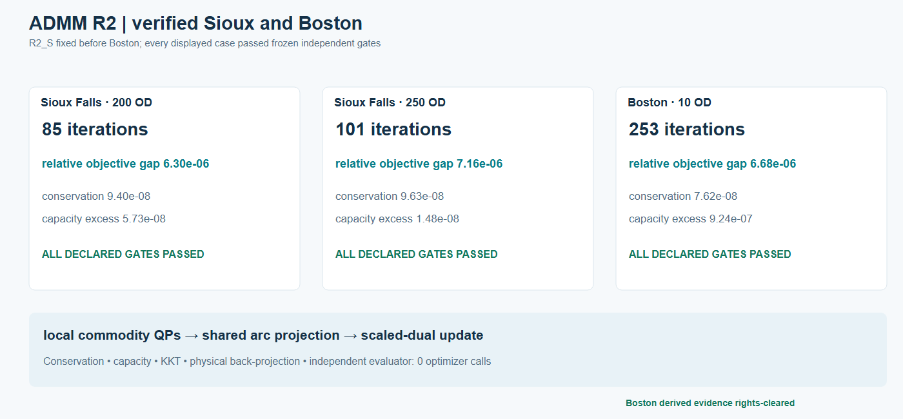

<em>Selected Sioux 200/250 OD and Boston ten-OD finite LP comparisons; Hong Kong ADMM is gated.</em> <a href="methods/admm-space-time.html">Method-specific figures and gates</a>.

<h3 id="capability-scope-and-method-specific-boundaries">Capability scope and method-specific boundaries</h3>

The entries distinguish <strong>available code</strong>, <strong>executed case evidence</strong>, and <strong>the scale at which a method was actually accepted</strong>. A missing result is not a claim that the method can never run on that city. A tiny generic fixture does not certify a large Boston solve.

<table>
<thead>
<tr>
<th>Capability / evidence</th>
<th>Boston</th>
<th>Sioux Falls</th>
<th>Hong Kong bounded case</th>
</tr>
</thead>
<tbody>
<tr>
<td>GMNS network, zones and access</td>
<td><strong>Demonstrated:</strong> H3 hierarchy, centroid/access and source-ID round-trip</td>
<td><strong>Benchmark network:</strong> supplied topology and demand; not a present-day H3 city dataset</td>
<td><strong>Demonstrated, bounded:</strong> 780 physical nodes, 1,239 links, 95 SSG/10 STPUG zones and 190 nonphysical connectors</td>
</tr>
<tr>
<td>Population, households and activity preparation</td>
<td><strong>Demonstrated, limited:</strong> source-backed ACS block-group → H3 aggregate allocation; separate MassGIS attraction proxy</td>
<td><strong>Not estimated:</strong> classic benchmark supplies vehicle OD without a demographic build</td>
<td><strong>Demonstrated, limited:</strong> 2021 census SSG area allocation; building activity proxy separate from households</td>
</tr>
<tr>
<td>Trip generation / distribution</td>
<td><strong>Demonstrated, limited:</strong> transferred household rates, activity prior, gravity/IPF and PA-to-OD</td>
<td><strong>Not estimated:</strong> given benchmark OD</td>
<td><strong>Engineering scenario:</strong> transferred TCS rates, local-capture sensitivity and gravity/IPF over 8,930 directed interzonal ODs</td>
</tr>
<tr>
<td>Mode choice</td>
<td><strong>Demonstrated, conditional:</strong> regional-share feedback and absolute DA/S2/S3/TW research branch</td>
<td><strong>Not modeled:</strong> fixed vehicle demand</td>
<td><strong>Engineering scenario:</strong> GTFS/fare/walk generalized costs and sensitivity logit, not locally calibrated</td>
</tr>
<tr>
<td>GPS / service evidence</td>
<td><strong>Demonstrated, exploratory:</strong> network linkage and default-off interval feedback; no independent AM validation</td>
<td><strong>Not included</strong> in the classic benchmark</td>
<td><strong>Linked layers:</strong> 183 GTFS stops, 294 routes and 50 detector lane observations; UrbanNav points private</td>
</tr>
<tr>
<td>Static Frank–Wolfe</td>
<td><strong>Demonstrated:</strong> small controls and three expanded tiers, up to 17,522 loaded node ODs</td>
<td><strong>Demonstrated:</strong> historical static benchmark; input-identity caveat retained</td>
<td><strong>Accepted turn-aware one-hour scenario:</strong> 723.191 PCE modeled load</td>
</tr>
<tr>
<td>Finite full-path reference</td>
<td><strong>Solved:</strong> 26-OD / 130-path control; <strong>resource-gated</strong> at expanded tiers</td>
<td>No equivalent solved full-path reference claimed by these supplied records</td>
<td><strong>Not demonstrated</strong> for static assignment</td>
</tr>
<tr>
<td>Native Diagnostic L3 / compression</td>
<td><strong>Accepted numerical controls:</strong> ranks 26/52; not solved at expanded tiers</td>
<td><strong>Executed numerical candidates:</strong> rank 50; full-network gaps 8.17% / 4.38%, not exact UE</td>
<td><strong>Not demonstrated</strong></td>
</tr>
<tr>
<td>Space–time CG</td>
<td><strong>Accepted bounded pilot:</strong> 90 nodes / 125 links / 10 ODs; same-graph LP match and independent 10/10 pricing closure</td>
<td><strong>Historical 200 / 250 OD:</strong> feasible and own-LP matched; independent pricing closure not established</td>
<td><strong>Accepted R5 bounded 10-OD case:</strong> same-graph LP match, Phase I zero in 12 rounds, independent 10/10 pricing closure</td>
</tr>
<tr>
<td>Lagrangian capacity pricing</td>
<td><strong>Gated transfer:</strong> feasible recovery but 1.1002% gap missed frozen 1% gate</td>
<td><strong>Accepted R2:</strong> 200/250 OD separately feasible; duality gaps 0.0746% / 0.3177%</td>
<td><strong>Accepted bounded transfer:</strong> separate feasible recovery and 0.7444% certified gap</td>
</tr>
<tr>
<td>ADMM shared-capacity decomposition</td>
<td><strong>Accepted R2_S bounded holdout:</strong> 10 ODs, 253 iterations, 6.68e-6 own-LP relative gap</td>
<td><strong>Accepted R2_S selected subsets:</strong> 200/250 OD, 85/101 iterations, 6.30e-6 / 7.16e-6 own-LP gaps</td>
<td><strong>Gated R2 transfer:</strong> first local conservation test failed; no accepted objective</td>
</tr>
<tr>
<td>Official <code>tap-b</code> Algorithm B static UE</td>
<td><strong>Accepted B0/B1 through task-local lossless adapter; official converter blocked before solve</strong></td>
<td><strong>Accepted classic benchmark; official TAPLab adapter parity and verification pass</strong></td>
<td><strong>Accepted static result through task-local lossless TAPLab-compatible adapter</strong></td>
</tr>
<tr>
<td>Saved checks and visualization</td>
<td>GMNS tracing, static original-space checks, full bounded CG figure family</td>
<td>Static/CG records plus accepted bounded Lagrangian/ADMM views</td>
<td>Source/rights register, full-stack static/four-stage figures and R5 CG traces, closure and physical-flow projection</td>
</tr>
</tbody>
</table>

<a href="capabilities.html">Capability definitions and evidence pointers</a>. The earlier <a href="cases/hong-kong-gmns-pilot.html">Hong Kong R1 data pilot</a> remains a historical checkpoint; the current <a href="cases/hong-kong.html">R2–R5 bounded technical case</a> has accepted static and CG evidence under its explicit engineering assumptions.

<h2 id="03-comparable-statistics">03 / Comparable statistics</h2>

These are <em>instance-level</em> descriptions, not a cross-city objective leaderboard. The stable machine-readable CSV retains schema fields; the tables here present metric rows for reading.

<h3 id="a-city-data-and-gmns-statistics">A. City-data and GMNS statistics</h3>

<table>
<thead>
<tr>
<th>Metric</th>
<th>Boston · city-data case</th>
<th>Sioux Falls · benchmark</th>
<th>Hong Kong · bounded city case</th>
</tr>
</thead>
<tbody>
<tr>
<td>Directed physical roads</td>
<td>2852 nodes / 5091 links</td>
<td>24 nodes / 76 links</td>
<td>780 nodes / 1239 links</td>
</tr>
<tr>
<td>Fine / parent zones</td>
<td>177 / 9</td>
<td>Not part of this benchmark / Not part of this benchmark</td>
<td>95 / 10</td>
</tr>
<tr>
<td>Centroids / nonphysical access</td>
<td>177 / 354</td>
<td>Not part of this benchmark / Not part of this benchmark</td>
<td>95 / 190</td>
</tr>
<tr>
<td>Transit service layer</td>
<td>3,553 referenced stops / 112 routes (dated GTFS slice)</td>
<td>Not part of this benchmark</td>
<td>183 stops / 294 routes (pilot service layer)</td>
</tr>
<tr>
<td>Observation evidence</td>
<td>581 GPS path-link associations; 56 planned-shape links</td>
<td>Not part of this benchmark</td>
<td>50 detector lane snapshot records; UrbanNav point data private</td>
</tr>
<tr>
<td>Evidence grade</td>
<td>Verified bounded case; not a calibrated citywide forecast</td>
<td>Verified static topology; historical selected-OD finite cases are separate</td>
<td>Verified bounded case; activity and demand use graded assumptions</td>
</tr>
</tbody>
</table>

Observation counts have different meanings and are not pooled. Sioux is a supplied-demand benchmark, not a demographic or GPS build.

<a href="data/three_city_r1/THREE_CITY_GMNS_STATISTICS.csv">Machine-readable CSV</a> · <a href="data/three_city_r2/GMNS_READABLE.source.json">Readable-table source record</a>.

<h3 id="b-static-assignment-statistics">B. Static-assignment statistics</h3>

<table>
<thead>
<tr>
<th>Metric</th>
<th>Boston B1 · conditional 2 h</th>
<th>Sioux Falls · classic 528 OD</th>
<th>Hong Kong · bounded 1 h</th>
</tr>
</thead>
<tbody>
<tr>
<td>Physical-node / positive OD pairs</td>
<td>453</td>
<td>528</td>
<td>8930</td>
</tr>
<tr>
<td>Assigned demand and period</td>
<td>1936.238475 PCE / 2 h</td>
<td>360600 vehicles</td>
<td>723.191228 PCE / 1 h</td>
</tr>
<tr>
<td>Mathematical problem</td>
<td>static BPR / Beckmann</td>
<td>static BPR / Beckmann</td>
<td>turn-aware static BPR / Beckmann</td>
</tr>
<tr>
<td>FW evidence</td>
<td>Verified bounded case</td>
<td>Verified historical run; input-identity caveat</td>
<td>Verified bounded case</td>
</tr>
<tr>
<td>Algorithm B route</td>
<td>Verified bounded case; task-local TAPLab-compatible lossless adapter</td>
<td>Verified; official TAPLab registered-adapter parity</td>
<td>Verified bounded case; task-local lossless adapter</td>
</tr>
<tr>
<td>Objective and independent gap</td>
<td>Beckmann 7922.083942188 PCE-min; independent relative gap -2.3e-16</td>
<td>Beckmann 4231335.287110682 vehicle-min; independent relative gap 4.5e-09</td>
<td>Beckmann 1676.012131329 PCE-min; independent relative gap 4.21e-15</td>
</tr>
<tr>
<td>Path-to-link reconstruction</td>
<td>Verified; max path/link mismatch 5.68e-14 PCE</td>
<td>Verified; max path/link mismatch 5.46e-11 vehicles</td>
<td>Verified; max path/link mismatch 1.42e-13 PCE</td>
</tr>
</tbody>
</table>

Boston B1 is a matched-method holdout, not Boston's largest accepted FW tier. Objectives and demands are not comparable across cities or with finite fixed-cost models.

<a href="data/three_city_r1/THREE_CITY_STATIC_ASSIGNMENT_STATISTICS.csv">Machine-readable CSV</a> · <a href="data/three_city_r2/STATIC_READABLE.source.json">Readable-table source record</a>.

<h3 id="c-finite-time-expanded-statistics">C. Finite time-expanded statistics</h3>

<table>
<thead>
<tr>
<th>Metric</th>
<th>Boston · 10 OD</th>
<th>Sioux · 200 OD</th>
<th>Sioux · 250 OD</th>
<th>Hong Kong · 10 OD</th>
</tr>
</thead>
<tbody>
<tr>
<td>Selected physical subnetwork</td>
<td>90 nodes / 125 links</td>
<td>24 nodes / 64 links</td>
<td>24 nodes / 69 links</td>
<td>100 nodes / 111 links</td>
</tr>
<tr>
<td>Selected OD demands</td>
<td>10</td>
<td>200</td>
<td>250</td>
<td>10</td>
</tr>
<tr>
<td>One model time step</td>
<td>3 s</td>
<td>seconds not reported</td>
<td>seconds not reported</td>
<td>30 s</td>
</tr>
<tr>
<td>Number of model steps</td>
<td>100</td>
<td>not reported in public summary</td>
<td>not reported in public summary</td>
<td>50</td>
</tr>
<tr>
<td>Elapsed model horizon</td>
<td>300 s</td>
<td>not derivable from released summary</td>
<td>not derivable from released summary</td>
<td>1,500 s</td>
</tr>
<tr>
<td>Dynamic graph</td>
<td>9,110 nodes / 22,217 arcs</td>
<td>1,192 nodes / 9,406 arcs</td>
<td>1,292 nodes / 11,254 arcs</td>
<td>11,954 nodes / 24,910 arcs</td>
</tr>
<tr>
<td>Same-graph reference LP objective</td>
<td>64.396861511530</td>
<td>943,155.589771</td>
<td>1,521,090.83662</td>
<td>75.036329857948</td>
</tr>
<tr>
<td>CG Phase-I zero round</td>
<td>90</td>
<td>51</td>
<td>62</td>
<td>12</td>
</tr>
<tr>
<td>Final CG column pool</td>
<td>167</td>
<td>446</td>
<td>567</td>
<td>25</td>
</tr>
<tr>
<td>CG independent full-DAG pricing</td>
<td>Independent pricing closure established; 10/10</td>
<td>Not established</td>
<td>Not established</td>
<td>Independent pricing closure established; 10/10</td>
</tr>
<tr>
<td>Lagrangian status / gap</td>
<td>Gated; 1.1002% exceeds frozen 1% gate</td>
<td>Accepted; 0.0746% duality gap</td>
<td>Accepted; 0.3177% duality gap</td>
<td>Verified bounded case; 0.7444% duality gap</td>
</tr>
<tr>
<td>ADMM status / own-LP difference</td>
<td>Verified bounded case; R2_S own-LP gap 6.68e−6</td>
<td>Accepted R2_S; 6.30e−6</td>
<td>Accepted R2_S; 7.16e−6</td>
<td>Gated; first local conservation residual 0.082467622 PCE</td>
</tr>
</tbody>
</table>

Fixed-cost, hard-capacity finite problems; each column is a separate graph. Objective values are vehicle-minutes, but no cross-city ranking is implied. CG pricing closure does not transfer to Lagrangian or ADMM.

<a href="data/three_city_r1/THREE_CITY_FINITE_TIME_EXPANDED_STATISTICS.csv">Machine-readable CSV</a> · <a href="data/three_city_r2/FINITE_READABLE.source.json">Readable-table source record</a>.

<h2 id="04-case-study-boston">04 / Case study — Boston</h2>
<h3 id="role-in-the-repository">Role in the repository</h3>

Real-city GMNS/four-stage/GPS and scalable static assignment case, with separate bounded finite algorithms.

<strong>What this case demonstrates.</strong> Real-city GMNS object relationships; household/activity-based generation; modeled OD distribution; limited mode-choice branches; exploratory GPS/service linkage; new-input static computation; and FW at increasing demand coverage. It also retains a small <strong>FW / full-path / native L3</strong> control, an accepted <strong>task-local-adapter Algorithm B B0/B1</strong> static branch, and separate bounded finite space–time <strong>CG and ADMM R2_S</strong> pilots. <strong>Not demonstrated here:</strong> citywide CG/ADMM, full-city empirically calibrated demand, or independent AM accuracy.

<table>
<thead>
<tr>
<th>Boston branch</th>
<th>Scope and purpose</th>
<th>Keep it distinct from</th>
</tr>
</thead>
<tbody>
<tr>
<td><strong>Semantic service-feedback baseline</strong></td>
<td>36 selected zone ODs × three departures; regional baseline shares; about 202.078 / 202.071 assigned vehicle trips</td>
<td>An absolute-cost baseline-choice model or the expanded all-OD run</td>
</tr>
<tr>
<td><strong>Conditional ABS_PLANNED control</strong></td>
<td>26 road-node ODs, 203.660479 vehicles, frozen 130-path comparison; FW and accepted native ranks 26/52</td>
<td>Expanded L3 performance</td>
</tr>
<tr>
<td><strong>Algorithm B B0/B1 static controls</strong></td>
<td>B0 26-OD interface; B1 453 physical-node ODs, 1,936.23847491 PCE in two hours; official tap-b through task-local lossless adapter</td>
<td>Official TAPLab Boston adapter parity or observed/citywide demand</td>
</tr>
<tr>
<td><strong>Scalable conditional planned service</strong></td>
<td>500 / 2,000 / all 30,790 interzonal source ODs; new absolute attributes and eligible demand</td>
<td>All real Boston traffic or independent behavioral validation</td>
</tr>
<tr>
<td><strong>Bounded finite space–time CG pilot</strong></td>
<td>90 nodes / 125 links / 10 ODs; Phase I + Phase II + independent full-DAG pricing closure</td>
<td>Citywide Boston CG, static BPR/Beckmann assignment, or a second Boston scale</td>
</tr>
<tr>
<td><strong>Bounded finite space–time ADMM R2_S holdout</strong></td>
<td>Same bounded 90-node / 125-link / 10-OD finite graph; 253 iterations, 6.68e-6 own-LP relative objective gap and independent gates</td>
<td>Citywide Boston ADMM, static UE, or observed traffic</td>
</tr>
</tbody>
</table>

<a href="cases/boston.html">Complete Boston case</a> · <a href="cases/boston-assignment.html">Static assignment branches</a> · <a href="cases/boston-algorithm-b.html">Algorithm B B0/B1</a> · <a href="cases/boston-space-time.html">Bounded space–time CG result</a>.
<a href="cases/boston-admm.html">Bounded space–time ADMM R2 holdout</a>.

<small>Central Boston road geometry: GMNS Plus 21_Boston (Apache-2.0), commit 116447ab641cca1ed34797d019c8e704063393c3; H3 zones and cover composition: Mobility Computation Lab. Geography only—not measured or modeled traffic.</small>

<h3 id="scope-and-statistics">Scope and statistics</h3>

2,852 physical nodes, 5,091 directed physical links; 177 H3 r9 zones and nine r7 parents. Its finite CG/ADMM holdout is a different 90-node/125-link, 10-OD instance.

<table>
<thead>
<tr>
<th>Metric</th>
<th>Accepted scope</th>
</tr>
</thead>
<tbody>
<tr>
<td>City physical network</td>
<td>2,852 nodes; 5,091 directed links</td>
</tr>
<tr>
<td>Static B1 comparison</td>
<td>453 physical-node ODs; 1,936.238475 PCE / 2 h</td>
</tr>
<tr>
<td>Finite CG/ADMM holdout</td>
<td>90 nodes; 125 links; 10 ODs</td>
</tr>
</tbody>
</table>

<h3 id="gmns-zones-and-source-evidence">GMNS, zones, and source evidence</h3>

<a href="datasets/boston-gmns-exchange.html">GMNS exchange and source-ID tracing</a> preserve centroids, 354 nonphysical access arcs and physical link identity.

<h4 id="boston-gmns-in-action">Boston / GMNS in Action</h4>

<strong>One network reference for zones, demand, observations, and results.</strong> The actual Boston exchange keeps H3 zone 35, its centroid, nonphysical access connector and physical road node distinct. A documented crosswalk maps zone identities to road access; zonal S1 demand remains modeled panel vehicle trips. A separate saved GPS path occurrence can reference a physical link and its saved S1 road result without claiming it is the same OD or observed journey.

<a href="datasets/boston-gmns-exchange.html#one-network-multiple-connected-data-layers">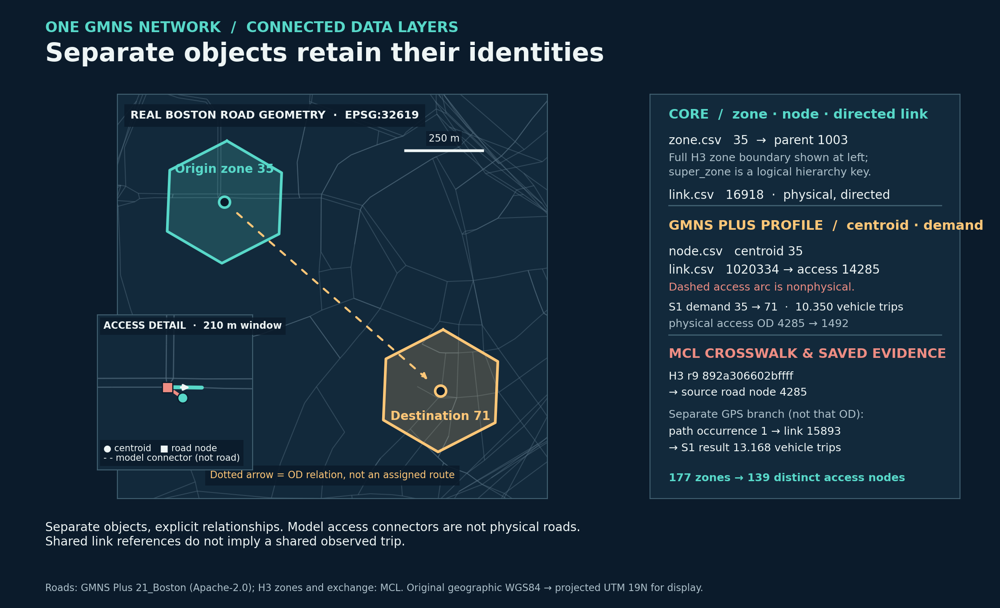</a>

<em>Separate objects, explicit relationships. Model access connectors are not physical roads. Shared link references do not imply a shared observed trip.</em> <a href="datasets/boston-gmns-exchange.html">Figure records, field mappings and provenance</a> · <a href="https://github.com/scholarhaozheng/mobility-network-lab/blob/main/examples/boston/gmns_exchange_r1/README.md">Versioned exchange and GMNS Plus profile</a> · <a href="../tools/gmns/trace_gmns_figure.py">Read-only relationship lookup</a>.

From the repository root, inspect the generic relationships with <code>python -B tools/gmns/boston_exchange.py trace --exchange examples/boston/gmns_exchange_r1/data</code>; the <a href="datasets/boston-gmns-exchange.html#reproduce-the-relationships">exact figure segment query</a> is separate. GMNS is the data/exchange contract, not the matching algorithm or evidence of improved prediction. The pinned GMNS Plus Level 2 reader accepted S1/S2 node/link/demand; a separate zone-schema check and the declared <code>mcl_solver_*</code> fields support the existing solver round-trip.

<h4 id="city-network-workflow">City network workflow</h4>

The common foundation is a real city network: <strong>2,852 physical nodes, 5,091 directed links, 177 H3 r9 zones and nine r7 parents</strong>. Zone-access mappings attach demand to roads; ordered link membership defines a corridor; transit and GPS records retain their own identities and connect to the same network. Model access lines are not automatically verified physical routes.

<a href="data-contract.html">GMNS-compatible input contract</a> · <a href="city-workflow.html">City and hierarchy guide</a> · <a href="datasets/boston-central.html">Boston network and data layers</a>

<h4 id="gmns-foundation-and-toolchain-alignment">GMNS Foundation and Toolchain Alignment</h4>

The <a href="https://github.com/scholarhaozheng/mobility-network-lab/blob/main/examples/boston/gmns_exchange_r1/README.md">versioned Boston exchange</a> now exposes the actual <a href="../examples/boston/gmns_exchange_r1/data/node.csv">GMNS nodes</a>, <a href="../examples/boston/gmns_exchange_r1/data/link.csv">directed links</a>, <a href="../examples/boston/gmns_exchange_r1/data/zone.csv">H3 zones and hierarchy</a>, and separate <a href="../examples/boston/gmns_exchange_r1/data/demand_S1.csv">S1</a>/<a href="../examples/boston/gmns_exchange_r1/data/demand_S2.csv">S2</a> zonal demand. A <a href="../examples/boston/gmns_exchange_r1/data/id_crosswalk.csv">reversible ID/access crosswalk</a> connects 177 distinct zones to 139 physical access nodes. The pinned GMNS Plus structural reader opened both exports; the adapter reconstructed the accepted physical solver inputs without rerunning the model. <a href="datasets/boston-gmns-exchange.html">Open/query/rebuild commands and precise scope</a> distinguish core GMNS fields, GMNS Plus conventions, and MCL GPS/service/result extensions. Source-hourly and solver-period capacities remain separate; nonphysical connectors have no invented routing costs. Grid2demand2/competition approval and empirical calibration are not claimed.

<a href="datasets/boston-central.html#boston-visual-gallery">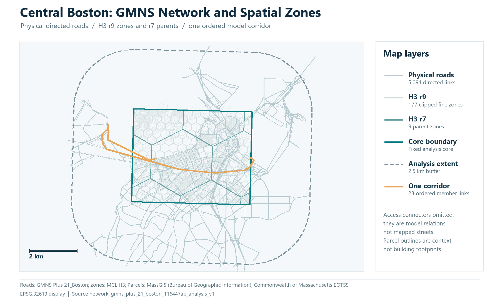</a>

<em>This is the spatial foundation, not one of the four demand-model stages. Parcel outlines provide geographic context, not building footprints. <a href="datasets/boston-visual-sources.html">Sources, units and original map gallery</a>.</em>

<h3 id="demand-transit-and-observations">Demand, transit, and observations</h3>

<a href="datasets/boston-population-households.html">ACS household/population allocation</a>, MassGIS activity priors, MBTA service and exploratory GPS linkage have separate evidence grades.

<h4 id="boston-population-and-household-preparation">Boston / Population and Household Preparation</h4>

The <strong>U.S. Census Bureau's ACS 2024 five-year (2020–2024)</strong> block-group estimates were accessed through the <strong>Census Reporter <code>acs2024_5yr</code> mirror</strong> for Massachusetts Suffolk <code>025</code>, Middlesex <code>017</code> and Norfolk <code>021</code>; recorded source boundaries came from its <code>tiger2024</code> GeoJSON. The fixed core intersects <strong>174 source block groups</strong>. Those statistical polygons do not coincide with the <strong>177 clipped H3 r9 model zones</strong>. In EPSG:32619, each source estimate is assigned by <code>area(source ∩ clipped zone) / area(full source polygon)</code>; the outside-core share remains a spatial remainder, <strong>not</strong> an observed external-trip matrix. The allocation assumes uniform persons/households within each source polygon.

<table>
<thead>
<tr>
<th>Prepared quantity</th>
<th style="text-align:right">Saved core value</th>
<th>Role and source</th>
</tr>
</thead>
<tbody>
<tr>
<td>Population, ACS <a href="https://api.census.gov/data/2024/acs/acs5/groups/B01003.html"><code>B01003</code></a></td>
<td style="text-align:right"><strong>171,049.520 persons</strong></td>
<td>Retained H3 demographic attribute, not the household-rate multiplier; acquired via <a href="https://github.com/censusreporter/census-api/blob/master/API.md">Census Reporter <code>acs2024_5yr</code></a></td>
</tr>
<tr>
<td>Households, ACS <a href="https://api.census.gov/data/2024/acs/acs5/groups/B11001.html"><code>B11001</code></a></td>
<td style="text-align:right"><strong>79,537.493 households</strong></td>
<td><code>P_i,p = H_i × r_p</code> with six transferred <a href="https://ctps.org/pub/tdm23_sc/tdm23.2.0/TDM23.2.0_Structures%20and%20Performance.pdf#page=148">CTPS TDM23.2.0 Table 74 rates</a></td>
</tr>
<tr>
<td>Activity attraction</td>
<td style="text-align:right">Separate <a href="https://www.mass.gov/info-details/massgis-data-property-tax-parcels">MassGIS Property Tax Parcels</a> nonresidential/mixed building-area weights</td>
<td>Proxy attraction margins, <strong>not measured employment</strong> or ACS allocation weights</td>
</tr>
</tbody>
</table>

<a href="datasets/boston-population-households.html">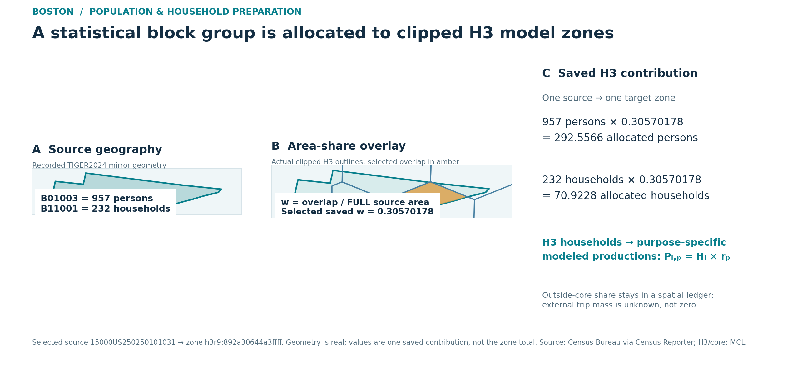</a>

The <a href="../examples/boston/population_r1/data/acs_block_group_stats.csv">ACS source statistics</a>, <a href="../examples/boston/population_r1/data/acs_block_group_h3_crosswalk.csv">source-to-H3 contributions</a>, <a href="../examples/boston/population_r1/data/population_or_household_by_zone.csv">H3 attributes</a>, <a href="../examples/boston/behavior_feedback_r1_semantic_fix_r1/data/external_flow_ledger.csv">outside-core ledger</a> and <a href="../examples/boston/behavior_feedback_r1_semantic_fix_r1/data/trip_generation_by_purpose.csv">generation rows</a> are directly openable. <a href="datasets/boston-population-households.html">Source versions, provider/download links, exact fields, assumptions and no-solver reproduction command →</a>. Source margins of error were retained; the H3 estimates do not have a validated propagated MOE. All 177 saved zones have source coverage; in general, missing is not zero.

<h4 id="boston-the-retained-semantic-four-stage-chain">Boston / The retained semantic four-stage chain</h4>

<strong>This retained branch is a fixed-panel service-feedback example. The expanded computation follows in the next section.</strong> The numbered sections below describe the saved Boston implementation—not four generic software components.

<table>
<thead>
<tr>
<th>Stage</th>
<th>Question and actual calculation</th>
<th>What you can inspect</th>
</tr>
</thead>
<tbody>
<tr>
<td><strong>01 · Trip generation</strong></td>
<td>How many trips start and end in each zone? Area-allocated ACS household estimates are multiplied by transferred regional rates by purpose; MassGIS activity supplies attraction weights.</td>
<td><a href="datasets/boston-behavior-feedback.html#step-1-trip-generation">Zonal productions and six purpose totals</a>: <strong>816,054.67 modeled workday person trips</strong>, not observed trips.</td>
</tr>
<tr>
<td><strong>02 · Trip distribution</strong></td>
<td>Where do those trips go? Gravity/IPF and purpose/time-specific PA-to-OD conversion create directed demand.</td>
<td><a href="datasets/boston-behavior-feedback.html#step-2-trip-distribution">The saved 177 × 177 HBW midday matrix</a>, totaling <strong>22,807.22 modeled person trips</strong>.</td>
</tr>
<tr>
<td><strong>03 · Mode choice</strong></td>
<td>Which travel alternatives are selected? Scheduled and observation-adjusted journey costs drive a nested response around regional baseline shares.</td>
<td><a href="datasets/boston-behavior-feedback.html#step-3-mode-choice">Saved S1/S2 costs and probability changes</a>. S1 is still a shared regional baseline, not an OD-specific absolute-cost model.</td>
</tr>
<tr>
<td><strong>04 · Traffic assignment</strong></td>
<td>Which roads carry the resulting vehicles? The selected private/occupied-vehicle demand is loaded through the same static FW model.</td>
<td><a href="datasets/boston-behavior-feedback.html#step-4-traffic-assignment">S1 road flows and S2−S1 differences</a>, with input and result tables.</td>
</tr>
</tbody>
</table>

<strong>The scope narrows deliberately:</strong> regional generation → saved HBW demand → <strong>36 fixed OD pairs × three midday departures</strong> → <strong>78 eligible OD–time cases</strong> → about <strong>202 assigned vehicle trips</strong>. These are different populations and units, not one mass-conserving funnel. The remaining 30 cases retain their exclusion and person-demand records; the full regional demand is not assigned by this panel.

<table>
<tr><th>01 · Actual generation output</th><th>02 · Actual distribution output</th></tr>
<tr>
<td width="50%"><a href="datasets/boston-behavior-feedback.html#step-1-trip-generation">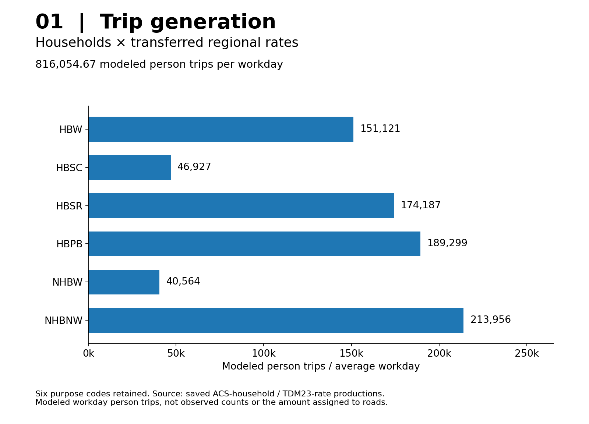</a></td>
<td width="50%"><a href="datasets/boston-behavior-feedback.html#step-2-trip-distribution">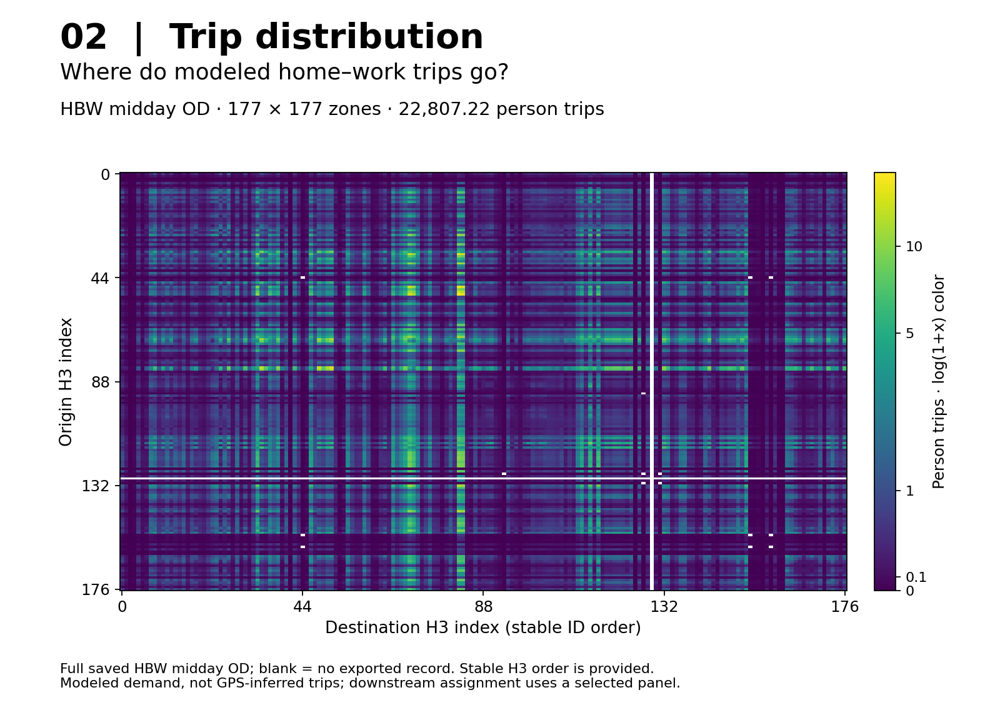</a></td>
</tr>
<tr><td>Households and regional effective mean rates generate the modeled total. This is a result chart—not the residential-area input map.</td><td>Rows are origins and columns are destinations. These are modeled OD values, not GPS-inferred trips or mapped routes.</td></tr>
<tr><th>03 · Actual mode response</th><th>04 · Actual assignment output</th></tr>
<tr>
<td><a href="datasets/boston-behavior-feedback.html#step-3-mode-choice">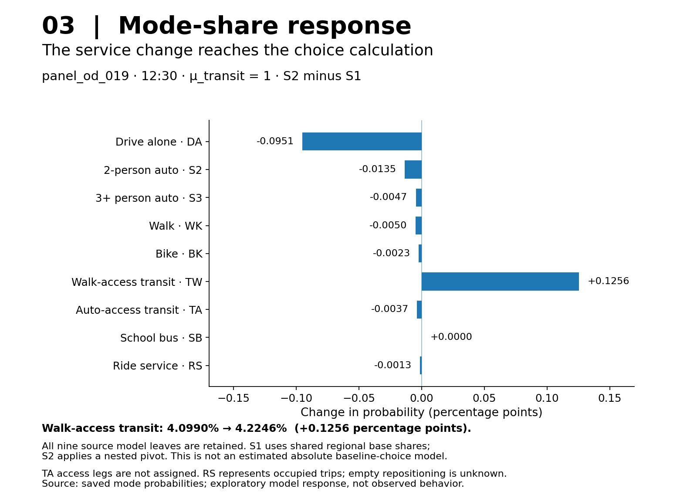</a></td>
<td><a href="datasets/boston-behavior-feedback.html#step-4-traffic-assignment">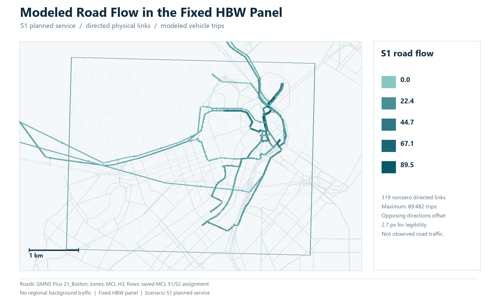</a></td>
</tr>
<tr><td>The illustrated response depends on this OD's changed service costs. The common S1 shares are not newly estimated local baseline probabilities.</td><td>Static FW loads the selected vehicle panel. No regional background flow is included; this is not measured citywide congestion.</td></tr>
</table>

<a href="datasets/boston-behavior-feedback.html"><strong>Read the four stages with their inputs, operations and outputs →</strong></a> · <a href="datasets/boston-four-step-sources.html">Download the display data and check the source mapping</a>

<h4 id="boston-how-gps-changes-the-result">Boston / How GPS changes the result</h4>

<strong>GPS is not an unused map layer, and it is not a fifth stage.</strong> MBTA vehicle positions are matched to the network and related to transit service intervals. In this example, a saved interval observation changes the transit service input; stages 03 and 04 then recompute the dependent response. GPS does <strong>not</strong> determine the regional trip total or the gravity-model OD in this release.

<a href="datasets/boston-gmns-exchange.html#from-gps-coordinates-to-gmns-linked-evidence">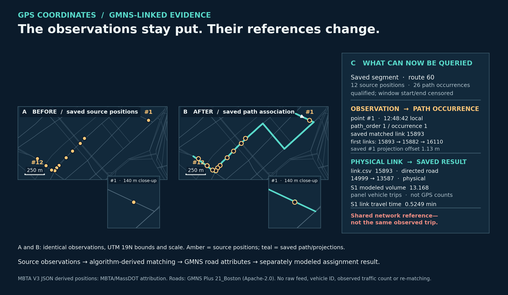</a>

<em>Source observations → algorithm-derived matching → physical road attributes → separately modeled assignment results.</em> This <strong>qualified route-60 segment</strong> is a spatial-reference illustration, not the route-749 service-feedback event below or a matching-accuracy test. Its 26 ordered path occurrences and projected positions are saved outputs, not newly matched here. <a href="datasets/boston-gmns-exchange.html#from-gps-coordinates-to-gmns-linked-evidence">Shared network reference—not the same observed trip; inspect exact records →</a>

<pre><code class="language-text">Vehicle positions → road/service linkage → interval-time adjustment
                                               ↓
                 transit itinerary and travel cost
                                               ↓
                03  mode-share response → vehicle demand
                                               ↓
                04  FW road assignment → link-flow response
</code></pre>

One saved trace uses route <strong>749</strong>, direction <strong>1</strong>, stop pair <strong>1788 → 5093</strong>: <strong>86 s sample-derived elapsed time versus 180 s planned</strong>. Applying the declared exploratory interval adjustment gives the following result for <strong>panel_od_019 at 12:30</strong>:

<table>
<thead>
<tr>
<th>Quantity in the same OD–departure case</th>
<th style="text-align:right">S1 · planned service</th>
<th style="text-align:right">S2 · exploratory adjustment</th>
</tr>
</thead>
<tbody>
<tr>
<td>Transit journey time</td>
<td style="text-align:right">29.052 min</td>
<td style="text-align:right">27.486 min</td>
</tr>
<tr>
<td>Selected-itinerary fare</td>
<td style="text-align:right">USD 1.70</td>
<td style="text-align:right">USD 1.70</td>
</tr>
<tr>
<td>Walk-access-transit probability, μ_transit = 1</td>
<td style="text-align:right">4.0990%</td>
<td style="text-align:right">4.2246%</td>
</tr>
<tr>
<td>Private/occupied ride-service demand</td>
<td style="text-align:right">2.164631 vehicle trips</td>
<td style="text-align:right">2.161796 vehicle trips</td>
</tr>
</tbody>
</table>

Across the <strong>whole eligible panel</strong>, S1/S2 vehicle inputs are <strong>202.078384 / 202.070733</strong>. Seventy-eight links differ by more than <code>1e-10</code>; the maximum absolute link difference is <strong>0.006603 modeled vehicle trips</strong>. A link difference aggregates contributing OD cases and is not attributable solely to the one trace above.

<strong>Srestore</strong> switches the service overlay off and independently recomputes the affected costs, probabilities and demand, returning them to S1. This demonstrates an executable dependency, not independent prediction accuracy. The 13 interval adjustments each have one supporting event and are disabled by default.

<a href="https://github.com/scholarhaozheng/mobility-network-lab/blob/main/examples/boston/behavior_feedback_r1_semantic_fix_r1/FEEDBACK_TRACE.md"><strong>Follow the exact observation → parameter → itinerary → probability → vehicle → road records →</strong></a> · <a href="datasets/boston-behavior-feedback.html#step-4-traffic-assignment">See the saved S2−S1 road map</a> · <a href="datasets/boston-central.html#one-saved-transit-position-projection">Inspect the separate GPS-to-road projection illustration</a>

<em>The projection map illustrates a different recorded segment; it is not presented as the same event as this feedback trace. The released calculation is a bounded technical example: no independently validated AM forecast, complete TDM23 reproduction or full-city multimodal assignment is claimed. <a href="datasets/boston-behavior-feedback.html#scope-and-assumptions">Scope and assumptions</a>.</em>

<h3 id="static-assignment">Static assignment</h3>

<a href="BOSTON_SCALE_RESULTS.html">FW scale tiers</a>, the <a href="cases/boston-assignment.html">controlled FW/full-path/L3 comparison</a>, and <a href="cases/boston-algorithm-b.html">task-local Algorithm B B0/B1</a> solve declared static instances.

<h4 id="accepted-boston-fw-scale-ladder-source-od-physical-node-od">Accepted Boston FW scale ladder — source OD ≠ physical-node OD</h4>

<table>
<thead>
<tr>
<th style="text-align:right">Selected source-zone OD</th>
<th style="text-align:right">Loaded physical-node OD after choice</th>
<th style="text-align:right">Modeled road PCE</th>
<th style="text-align:right">FW Beckmann objective (PCE-min)</th>
<th>Execution status</th>
</tr>
</thead>
<tbody>
<tr>
<td style="text-align:right">500</td>
<td style="text-align:right">453</td>
<td style="text-align:right">1,936.238</td>
<td style="text-align:right">7,922.083942</td>
<td>Accepted; same B1 static comparison instance</td>
</tr>
<tr>
<td style="text-align:right">2,000</td>
<td style="text-align:right">1,684</td>
<td style="text-align:right">5,815.569</td>
<td style="text-align:right">24,238.470872</td>
<td>Accepted FW; full-path/L3 resource-gated</td>
</tr>
<tr>
<td style="text-align:right">All 30,790 interzonal source OD</td>
<td style="text-align:right">17,522</td>
<td style="text-align:right">16,259.122</td>
<td style="text-align:right">73,552.277556</td>
<td>Accepted FW; full-path/L3 resource-gated</td>
</tr>
</tbody>
</table>

The numbers count different objects: selected H3 source-zone OD before choice, then eligible physical-node vehicle OD after choice. The 30,790 label is <strong>not</strong> 30,790 loaded physical-node OD or citywide observed traffic. <a href="BOSTON_SCALE_RESULTS.html">Exact selection, units, checks and resource gates</a>.

<h4 id="boston-scalable-assignment-is-now-the-primary-road-flow-result">Boston / Scalable assignment is now the primary road-flow result</h4>

The same 5,091-link clipped network is now evaluated on progressively larger source-zone demand sets using the <strong>new-input generic FW entry</strong>, not a renamed copy of the 26-OD solution. Planned-service costs were computed for new OD records, and the fixed conditional four-mode specification uses their absolute attributes. Unknown four-mode input remains unknown.

<table>
<thead>
<tr>
<th>Source-zone OD tier</th>
<th style="text-align:right">Selected person trips</th>
<th style="text-align:right">Evaluated person trips</th>
<th style="text-align:right">Loaded vehicle/PCE trips</th>
<th style="text-align:right">Loaded node ODs</th>
<th style="text-align:right">Positive physical links</th>
<th style="text-align:right">Accepted signed FW gap</th>
</tr>
</thead>
<tbody>
<tr>
<td><strong>500</strong></td>
<td style="text-align:right">2,643.767</td>
<td style="text-align:right">2,413.603</td>
<td style="text-align:right">1,936.238</td>
<td style="text-align:right">453</td>
<td style="text-align:right">1,653</td>
<td style="text-align:right">−4.59×10⁻¹⁶</td>
</tr>
<tr>
<td><strong>2,000</strong></td>
<td style="text-align:right">8,415.295</td>
<td style="text-align:right">7,248.674</td>
<td style="text-align:right">5,815.569</td>
<td style="text-align:right">1,684</td>
<td style="text-align:right">1,784</td>
<td style="text-align:right">5.60×10⁻⁶</td>
</tr>
<tr>
<td><strong>All 30,790 interzonal</strong></td>
<td style="text-align:right">22,633.470</td>
<td style="text-align:right">20,231.449</td>
<td style="text-align:right">16,259.122</td>
<td style="text-align:right"><strong>17,522</strong></td>
<td style="text-align:right"><strong>2,147</strong></td>
<td style="text-align:right"><strong>6.81×10⁻⁶</strong></td>
</tr>
</tbody>
</table>

The largest accepted FW result has <strong>133 physical endpoints</strong>, Beckmann objective <strong>73,552.277556 PCE-minutes</strong>, zero maximum OD residual and <code>2.84×10⁻¹⁴</code> link reconstruction error. These are checked numerical approximations for a <strong>conditional HBW-midday research cohort</strong>. They do not include all modes, all travelers, external/background traffic or empirical calibration.

<table class="figure-grid"><tr><th>Source zones: selected demand coverage</th><th>Physical roads: accepted all-tier FW</th></tr><tr><td width="50%"><a href="BOSTON_SCALE_RESULTS.html">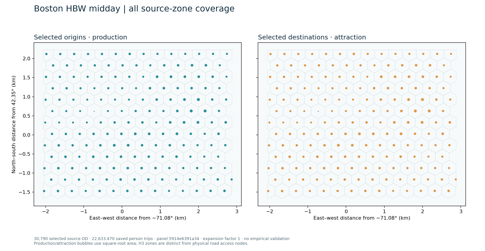</a></td><td width="50%"><a href="BOSTON_SCALE_RESULTS.html">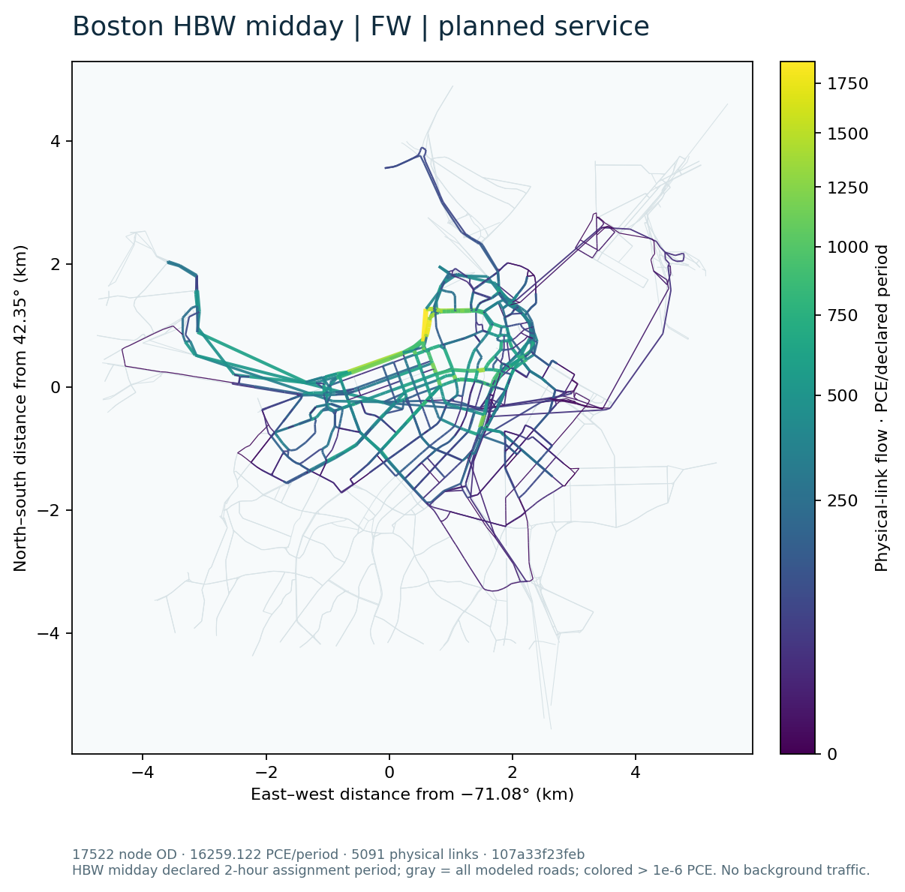</a></td></tr><tr><td>30,790 source pairs are not 30,790 loaded physical OD keys. Zone access, input support and same-node accounting remain explicit.</td><td>Model PCE flow, not observed counts. The three tier maps use tier-specific legend maxima; equal colors across tiers do not imply equal values.</td></tr></table>

<a href="assets/boston/scalable_tool_r1/fw_500_flow.png">500-tier map</a> · <a href="assets/boston/scalable_tool_r1/fw_2000_flow.png">2,000-tier map</a> · <a href="assets/boston/scalable_tool_r1/endpoint_all_coverage.png">All-tier endpoint coverage</a> · <a href="BOSTON_SCALE_RESULTS.html">Complete scale, runtime and resource records</a>.

<table>
<thead>
<tr>
<th>Expanded method status</th>
<th>500 tier</th>
<th>2,000 tier</th>
<th>All interzonal</th>
</tr>
</thead>
<tbody>
<tr>
<td><strong>FW</strong></td>
<td>Accepted</td>
<td>Accepted</td>
<td>Accepted</td>
</tr>
<tr>
<td><strong>Finite full-path</strong></td>
<td>Resource gate before solve; 2,261-path pool exists</td>
<td>Valid 8,412-path K5 pool; solve resource-gated</td>
<td>Path-pool preparation gate; not built</td>
</tr>
<tr>
<td><strong>Native L3, requested 25% / 50% fractions</strong></td>
<td>Basis/solve resource-gated</td>
<td>Basis/solve resource-gated</td>
<td>Pool/basis resource-gated</td>
</tr>
</tbody>
</table>

A separate <strong>new-input two-OD fixture</strong> actually ran finite full path and native L3 with IPOPT. That demonstrates changed-input method execution, not success at the large tiers. Accepted FW points have one positive saved path per loaded OD; larger coverage alone is not proof of a hard route-splitting or compression speedup experiment. No expanded L3 map is fabricated or substituted with FW.

<h4 id="boston-small-controlled-assignment-method-comparison">Boston / Small controlled assignment-method comparison</h4>

The real-city <a href="cases/boston.html">Boston case</a> includes <strong>both</strong> the GMNS/four-stage/GPS workflow above <strong>and</strong> executed static assignment methods. The earlier semantic S1/S2 service-feedback example used about <strong>202.078384 / 202.070733</strong> modeled vehicle trips. A separate conditional absolute-attribute choice sensitivity evaluates DA/S2/S3/TW for sufficient-vehicle households: 87 of 108 fixed OD-time objects had known four-mode inputs, 21 remained unknown, and only 78 common objects were road-loaded. Its <a href="https://github.com/scholarhaozheng/mobility-network-lab/blob/main/examples/boston/conditional_choice_r1/README.md">saved probabilities and specification</a> are a reduced transfer sensitivity, not calibrated all-mode TDM23 or an independent AM validation.

For the <strong>fixed ABS_PLANNED</strong> algorithm comparison, FW, the solved uncompressed path reference and two native Diagnostic L3 representations all use the same 5,091 physical links, 26 endpoint OD pairs, 203.6604786350987 modeled vehicle trips, heterogeneous BPR costs and frozen 130-path pool. ABS_OBS_EXPLORATORY FW is a separate service scenario, not another compression method or the old S1 export. <a href="cases/boston-assignment.html">Read full method/instance details and the full-size gallery</a>.

<table>
<thead>
<tr>
<th>Boston saved method / run</th>
<th style="text-align:right">Original Beckmann F (vehicle-minutes)</th>
<th>Original-space result and scope</th>
</tr>
</thead>
<tbody>
<tr>
<td><a href="../examples/boston/assignment_methods_r1/reference/fw_solution.csv">FW · ABS_PLANNED</a></td>
<td style="text-align:right">707.0579230712884</td>
<td>Same-network static FW; <a href="../algorithms/static_fw/tap_frank_wolfe.py">actual source</a></td>
</tr>
<tr>
<td><a href="../examples/boston/assignment_methods_r1/reference/full_path_flow.csv">Uncompressed 130-path SLSQP</a></td>
<td style="text-align:right">707.0579230712882</td>
<td>Exact saved OD equalities on this finite pool; <a href="https://github.com/scholarhaozheng/mobility-network-lab/blob/main/algorithms/finite_path_reference/README.md">solver/config</a></td>
</tr>
<tr>
<td><a href="../examples/boston/assignment_methods_r1/runs/rank26/outer_02_check.json">Native L3 · rank 26 · outer 02</a></td>
<td style="text-align:right">707.0578811137339</td>
<td>Max OD residual 8.255328278750085e-7; signed full-network relative gap <strong>−5.933966773022305e-8</strong>; 52 path coordinates + 5,091 links = 5,143 variables</td>
</tr>
<tr>
<td><a href="../examples/boston/assignment_methods_r1/runs/rank52/outer_02_check.json">Native L3 · rank 52 · outer 02</a></td>
<td style="text-align:right">707.0578811562873</td>
<td>Max OD residual 8.254705861077127e-7; signed full-network relative gap <strong>−5.927948547394401e-8</strong>; 78 path coordinates + 5,091 links = 5,169 variables</td>
</tr>
<tr>
<td><a href="../examples/boston/conditional_choice_r1/fw_abs_obs_exploratory_solution.csv">FW · ABS_OBS_EXPLORATORY</a></td>
<td style="text-align:right">707.043586277782</td>
<td><strong>Different demand:</strong> 203.6573680559407 vehicle trips; not a same-instance rank comparison</td>
</tr>
</tbody>
</table>

The two native points passed declared numerical checks, but their <strong>negative gaps reflect tolerated OD deficits</strong>, not exact feasible equilibria, improved traffic, or roundoff. Their initialization reused the full-path reference. No cold-start acceleration, peak IPOPT memory or independent performance validation is claimed.

<a href="cases/boston-assignment.html#comparison-board">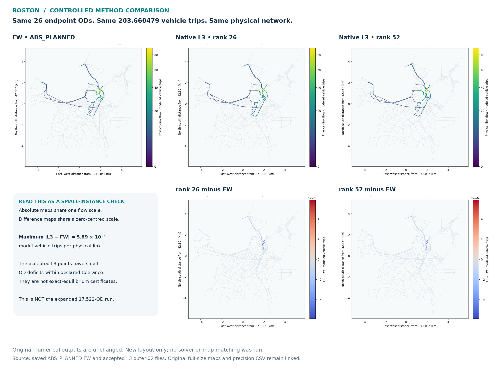</a>

<strong>Read across methods, then down to the signed difference.</strong> The first row compares three absolute-flow maps; the second row gives their differences and interpretation. This is the <strong>small 26-node-OD control</strong>, not the expanded 17,522-node-OD FW run.

Original full-resolution panels remain available: <a href="assets/boston/assignment_methods_r1/boston_abs_planned_fw_flow.png">FW</a> · <a href="assets/boston/assignment_methods_r1/boston_abs_planned_l3_rank26_flow.png">rank 26</a> · <a href="assets/boston/assignment_methods_r1/boston_abs_planned_l3_rank52_flow.png">rank 52</a> · <a href="assets/boston/assignment_methods_r1/boston_abs_planned_l3_rank26_minus_fw.png">rank 26 − FW</a> · <a href="assets/boston/assignment_methods_r1/boston_abs_planned_l3_rank52_minus_fw.png">rank 52 − FW</a>.

<em>All three absolute maps share one scale; the two signed maps share a zero-centred scale. They can look almost identical because the maximum native–FW link differences are only about <strong>5.89 × 10⁻⁶ modeled vehicle trips</strong>. These are saved model results, not GPS counts. <a href="assets/boston/assignment_methods_r1/boston_abs_planned_assignment_links.csv">Inspect all 5,091 full-precision physical-link rows</a> · <a href="assets/boston/assignment_methods_r1/BOSTON_ASSIGNMENT_FIGURE_SOURCES.json">Source/field/scale manifest</a> · <a href="../tools/visuals/render_boston_assignment.py">no-solve renderer</a>. GMNS physical link identities and the documented export crosswalk let method outputs attach to the same road network without changing the older S1 demand exchange.</em>

<pre><code class="language-bash">python -B tools/mcl_results.py list --case boston
python -B tools/mcl_results.py verify-saved --run boston-abs-planned-full-path
python -B tools/mcl_results.py verify-saved --run boston-abs-planned-l3-rank26-outer02
</code></pre>

These commands inspect saved points; they do not solve, build paths, refit demand or match new GPS data.

<h4 id="boston-b1-official-tap-b-executable-via-task-local-lossless-adapter">Boston B1 · official tap-b executable via task-local lossless adapter</h4>

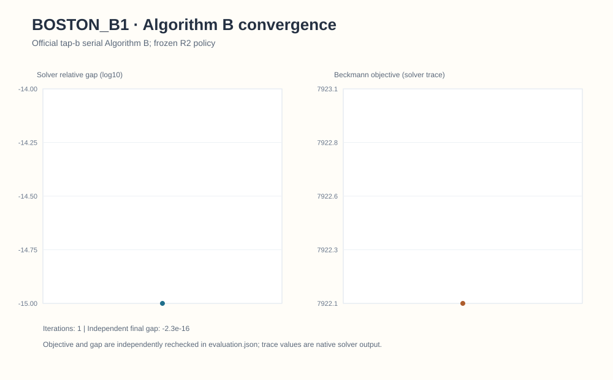

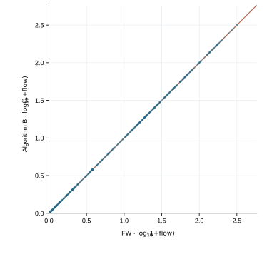

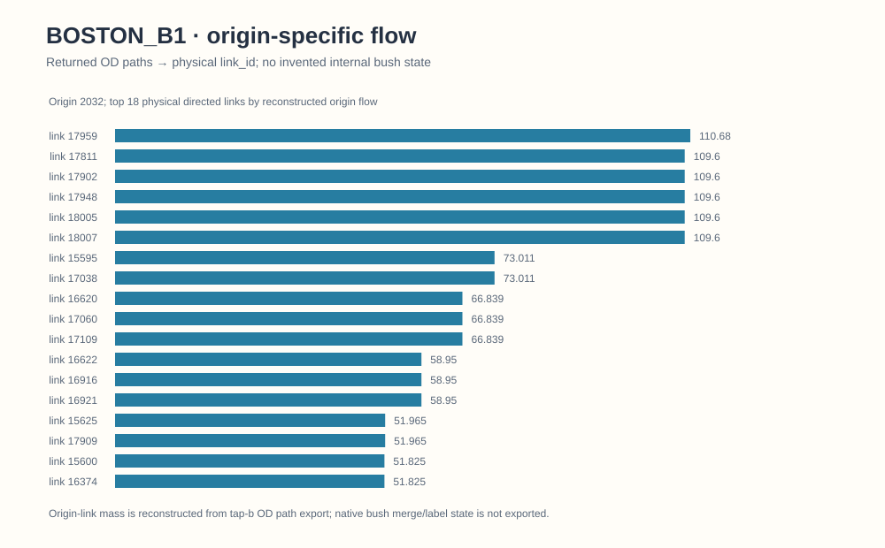

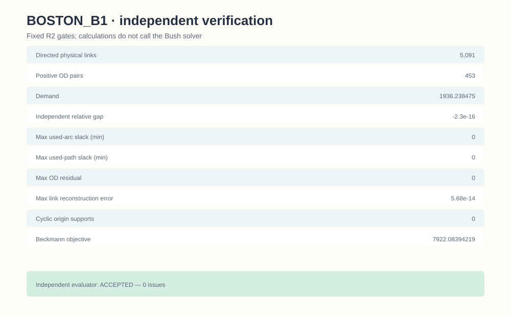

The stock TAPLab Boston converter was blocked before solving; this is <strong>task-local TAPLab-compatible lossless adapter</strong> evidence, not official registered-adapter parity. <a href="cases/boston-algorithm-b.html">Exact result and limitations</a>.

<h3 id="finite-time-expanded-algorithms">Finite time-expanded algorithms</h3>

<a href="cases/boston-space-time.html">Accepted bounded CG</a> reaches its same-graph LP objective; <a href="cases/boston-admm.html">ADMM R2_S</a> passes its separate 10-OD holdout. Lagrangian remains gated at the frozen gap criterion. <a href="cases/boston-space-time.html">Full representation-level figures and ordered evidence</a>.

<a href="cases/boston-space-time.html">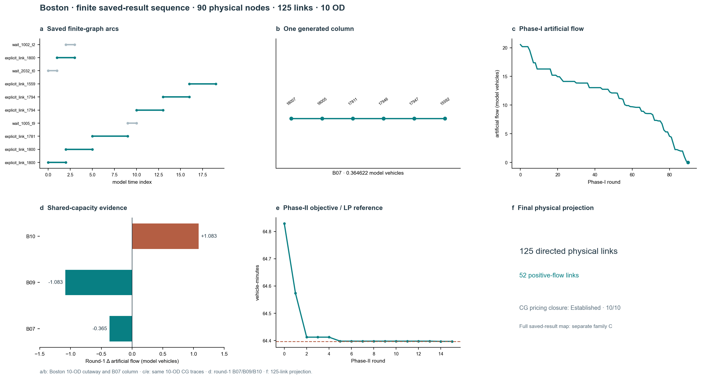</a>

<a href="assets/three_city_r1/boston_finite_space_time_case_sequence.png">Historical R1 six-panel layout</a> remains available; the R2 image above is the current view.

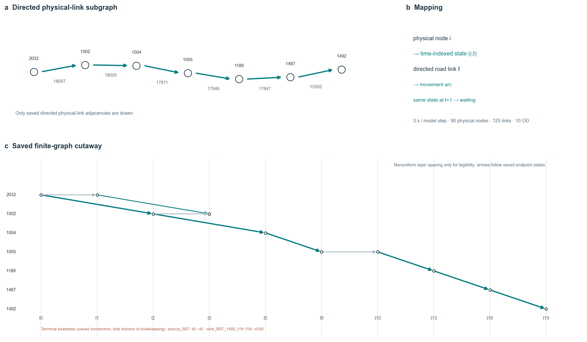

<em>Saved-record R2 view.</em> <a href="assets/three_city_r2/boston_physical_to_time_expanded_graph.svg">SVG</a> · <a href="assets/three_city_r2/boston_physical_to_time_expanded_graph.source.json">Source</a>.

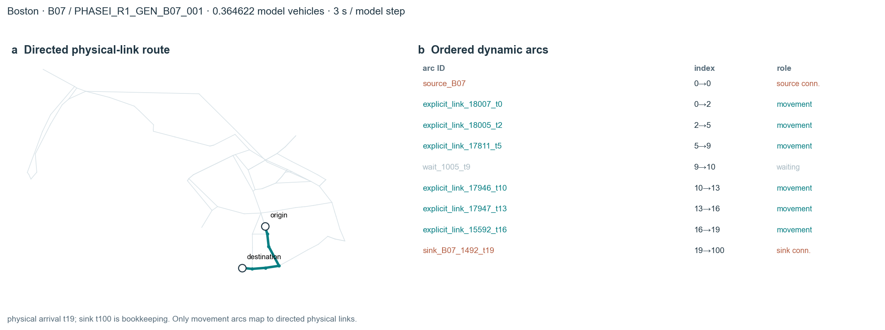

<em>One positive-flow time-indexed path; the terminal t19→H100 connector is bookkeeping, not physical waiting.</em> <a href="assets/three_city_r2/boston_generated_column_time_indexed_path.svg">SVG</a> · <a href="assets/three_city_r2/boston_generated_column_time_indexed_path.source.json">Source</a>.

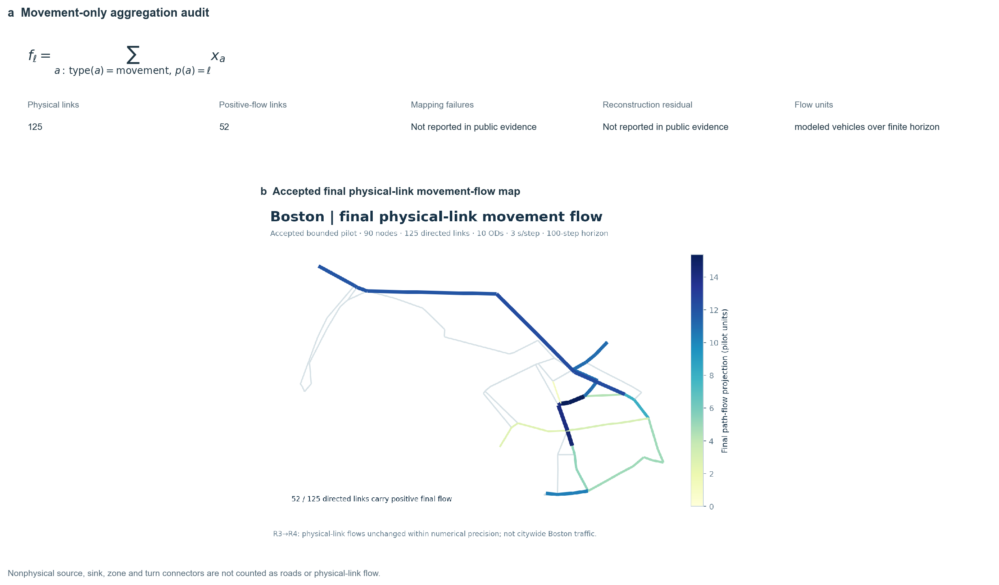

<em>Saved-record R2 view.</em> <a href="assets/three_city_r2/boston_time_expanded_to_physical_link_flow.svg">SVG</a> · <a href="assets/three_city_r2/boston_time_expanded_to_physical_link_flow.source.json">Source</a>.

<h4 id="boston-bounded-finite-spacetime-cg-pilot">Boston / Bounded finite space–time CG pilot</h4>

This is <strong>one</strong> accepted 90-physical-node, 125-directed-link, 10-OD finite time-expanded instance (3-second steps; 100-step horizon), not the 5,091-link static Boston assignment or a second Boston scale. The fixed-cost hard-capacity objective is distinct from FW/Beckmann.

The six accepted evidence stages are displayed below. Final physical-link flow and independent pricing closure share one row; the preceding stages remain full width. The former <a href="assets/presentation_r5/boston_cg_case_sequence.png">six-panel PNG</a>, <a href="assets/presentation_r5/boston_cg_case_sequence.svg">editable SVG</a>, and <a href="assets/presentation_r5/CG_CASE_SEQUENCE_SOURCES.json">source hashes/display crops</a> remain available; no scientific model was rerun.

<h4 id="boston-a-generated-column-as-a-time-indexed-path">Boston / A generated column as a time-indexed path</h4>

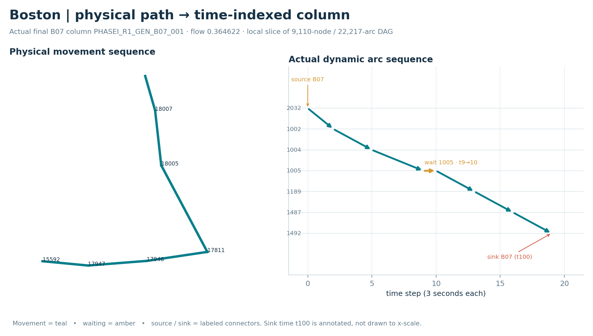

<em>The recorded B07 column maps physical movements into actual node-time arcs; this is a local view of the bounded finite graph.</em>

<h4 id="phase-i-restores-feasibility">Phase I restores feasibility</h4>

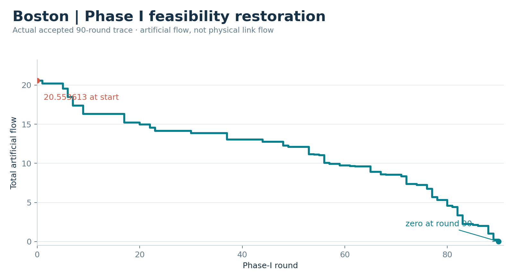

<em>Artificial flow reaches zero in round 90.</em>

<h4 id="a-new-path-can-help-a-different-od">A new path can help a different OD</h4>

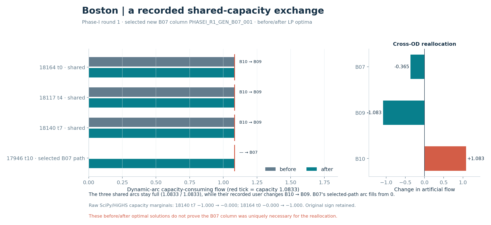

<em>The saved B07/B09/B10 event demonstrates reallocation after restricted-master reoptimization.</em>

<h4 id="phase-ii-improves-the-real-path-objective-1">Phase II improves the real-path objective</h4>

<em>The real-path objective reaches the reference level on this finite graph.</em>

<h4 id="final-physical-link-movement-flow-and-independent-pricing-closure">Final physical-link movement flow and independent pricing closure</h4>

<table class="figure-grid"><tr><td width="50%"><strong>Final physical-link movement flow and validation</strong>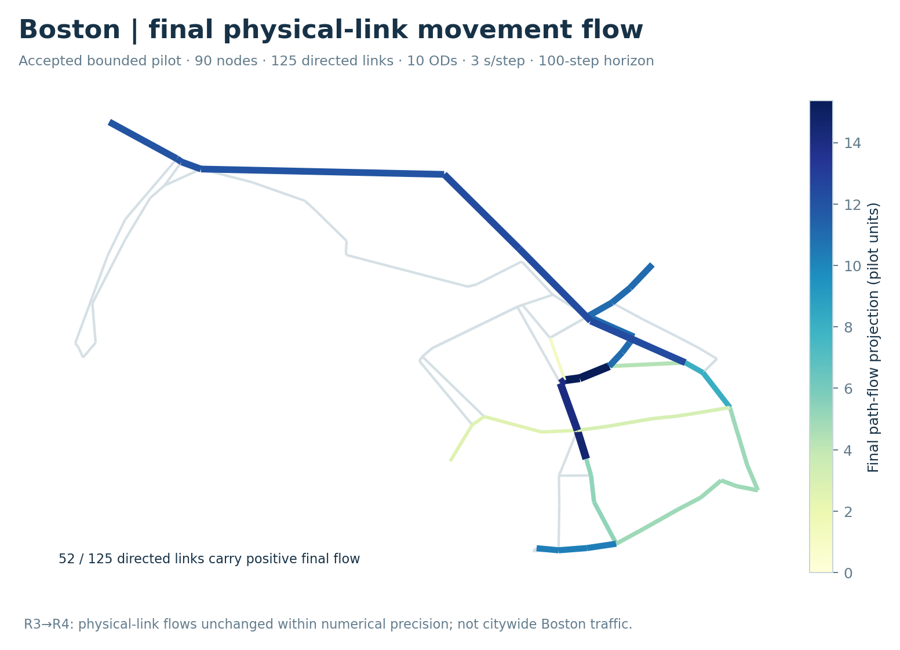<small>52 of 125 directed physical links carry positive modeled movement flow; not observed traffic.</small></td><td width="50%"><strong>Independent pricing closure</strong>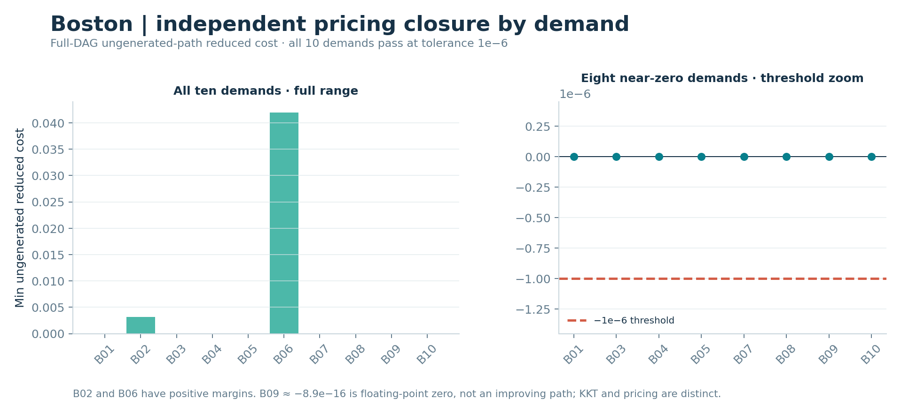<small>Full-DAG pricing closure passes all 10 demands at <code>1e-6</code>.</small></td></tr></table>

<a href="cases/boston-space-time.html">Full uncropped figures, numeric checks and limitations</a> · <a href="#sioux-falls">Matching Sioux Falls case below</a> · <a href="assets/boston/space_time_cg_r4/boston_cg_summary_panel.png">Earlier four-panel summary</a>.

<table>
<thead>
<tr>
<th>Shared CG stage</th>
<th>Boston result</th>
</tr>
</thead>
<tbody>
<tr>
<td><strong>A generated column as a time-indexed path</strong></td>
<td>Actual B07 column on the accepted 90-node/125-link pilot</td>
</tr>
<tr>
<td><strong>Phase I restores feasibility</strong></td>
<td>Artificial flow <strong>20.5536128974 → 0</strong> in round <strong>90</strong></td>
</tr>
<tr>
<td><strong>A new path can help a different OD</strong></td>
<td>Recorded B07/B09/B10 shared-capacity reallocation</td>
</tr>
<tr>
<td><strong>Phase II improves the real-path objective</strong></td>
<td><strong>64.39686151152952</strong> after 15 rounds; reference-objective agreement on the same finite time-expanded graph</td>
</tr>
<tr>
<td><strong>Final physical-link movement flow and validation</strong></td>
<td>52 positive-flow physical links; demand, capacity, path and back-projection checks pass</td>
</tr>
<tr>
<td><strong>Independent pricing closure</strong></td>
<td>Five continuation rounds, final column pool <strong>152 → 167</strong>; B01–B10 pass at <code>1e-6</code></td>
</tr>
</tbody>
</table>

The <a href="cases/boston-space-time.html">detailed Boston CG page</a> retains the full figure family, exact plot inputs, editable SVGs and hashed provenance. The 15 R4 certificate columns have zero final flow; they complete the dual/pricing certificate rather than create additional physical traffic. Final physical-link movement flows remain unchanged from R3 within numerical precision. The second-machine receiver check remains pending. These are saved-result visualizations only; no model was rerun for this public update.

<h4 id="boston-bounded-finite-spacetime-admm-r2_s">Boston / Bounded finite space–time ADMM R2_S</h4>

This is the accepted <strong>10-OD holdout on the 90-node/125-link finite graph</strong>, evaluated with the R2_S policy frozen before Boston. It is not the static Boston assignment, measured traffic, or a citywide ADMM run. The same four evidence stages appear in the Sioux Falls section below; each ADMM run is compared only with its <strong>own same-graph arc-flow LP</strong>. <a href="cases/boston-admm.html">Full Boston ADMM case and independent checks</a>.

<h4 id="convergence-and-original-unit-feasibility">Convergence and original-unit feasibility</h4>

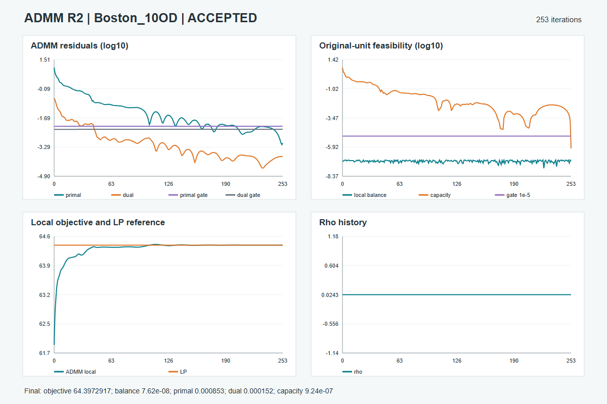

<h4 id="commodity-conservation">Commodity conservation</h4>

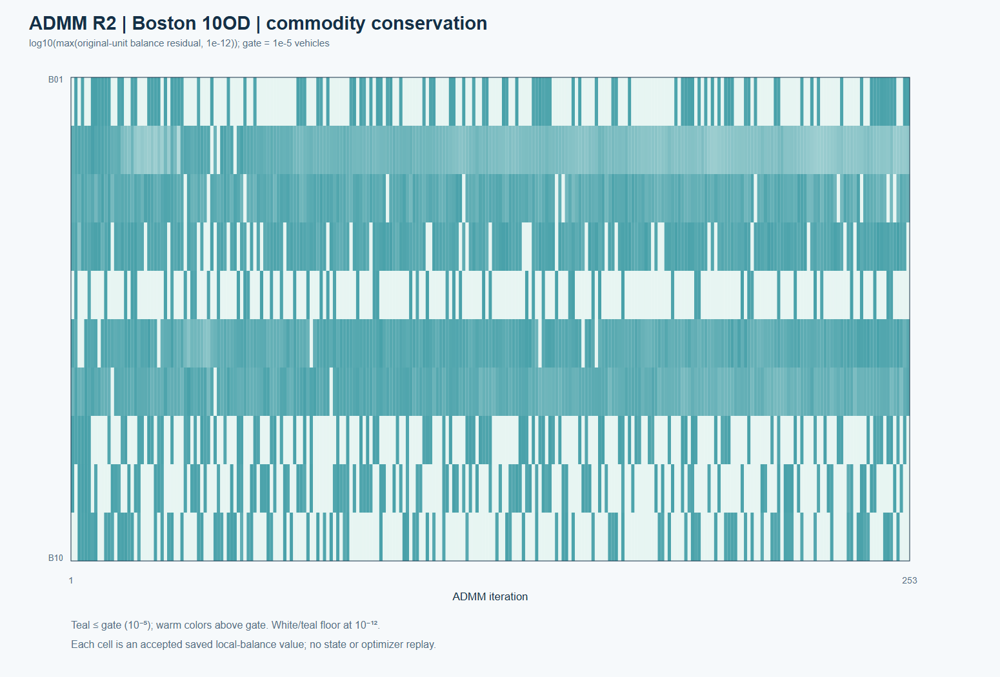

<h4 id="final-physical-link-movement-flow">Final physical-link movement flow</h4>

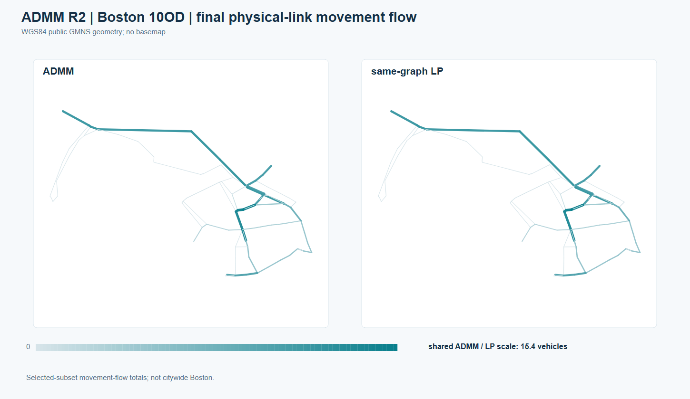

<h4 id="signed-admmlp-physical-link-difference">Signed ADMM−LP physical-link difference</h4>

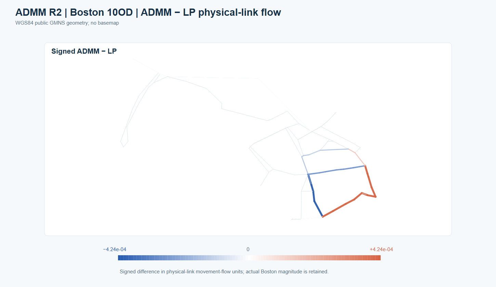

<em>These are accepted saved-result figures, not newly solved flows. The signed map retains its actual ±<code>4.24e-4</code>-vehicle maximum. <a href="cases/boston-admm.html">Editable figures, source records and the 125-link derived table</a> document the bounded scope and GMNS Plus attribution.</em>

<h3 id="independent-verification">Independent verification</h3>

CG independent full-DAG pricing closure passes 10/10 demands; static and finite original-space checks remain separate.

<h3 id="city-specific-evidence-and-limits">City-specific evidence and limits</h3>

No citywide calibrated CG/ADMM or independent AM validation is claimed. All earlier maps, GMNS records, GPS evidence and figures are retained below.

<h3 id="reproduction">Reproduction</h3>

<a href="cases/boston.html#experiments--reproduction">Use saved result checks and case entry points</a>.

<h2 id="05-case-study-sioux-falls">05 / Case study — Sioux Falls</h2>
<h3 id="role-in-the-repository-1">Role in the repository</h3>

Classical supplied-vehicle-OD road benchmark and historical selected-OD finite algorithm case, not a new demographic or GPS city-data model.

<strong>What this case demonstrates.</strong> A classic supplied-demand benchmark with static FW, accepted official TAPLab/<code>tap-b</code> Algorithm B parity and native L3 research, plus distinct 200/250-OD finite space–time <strong>CG and ADMM R2_S</strong> results. <strong>Not modeled here:</strong> real-city trip generation, destination/mode estimation or GPS service feedback. The benchmark does not become a modern city dataset because it shares the framework.

<h3 id="scope-and-statistics-1">Scope and statistics</h3>

24-node/76-link static topology with 528 positive OD records; distinct finite selected subgraphs have 64/69 links and 200/250 OD demands.

<table>
<thead>
<tr>
<th>Metric</th>
<th>Accepted scope</th>
</tr>
</thead>
<tbody>
<tr>
<td>Static benchmark</td>
<td>24 nodes; 76 links; 528 supplied OD records</td>
</tr>
<tr>
<td>Historical finite 200-OD case</td>
<td>24 nodes; 64 selected links; 200 ODs</td>
</tr>
<tr>
<td>Historical finite 250-OD case</td>
<td>24 nodes; 69 selected links; 250 ODs</td>
</tr>
</tbody>
</table>

<h3 id="gmns-zones-and-source-evidence-1">GMNS, zones, and source evidence</h3>

<a href="https://github.com/scholarhaozheng/mobility-network-lab/blob/main/examples/sioux-falls/native_l3_r1/README.md">Frozen static topology and source identity</a> remain separate from the selected finite subgraphs.

<h3 id="demand-transit-and-observations-1">Demand, transit, and observations</h3>

Population, household, transit and GPS preparation are <strong>Not part of this benchmark</strong>; vehicle OD is supplied.

No population, household, activity, transit or GPS preparation was executed for this supplied-demand benchmark.

<h3 id="static-assignment-1">Static assignment</h3>

Historical FW, numerical native L3 candidates and <a href="cases/sioux-algorithm-b.html">official TAPLab registered-adapter Algorithm B parity</a> are distinct static results.

<h4 id="sioux-falls-static-methods-and-retained-numerical-candidates">Sioux Falls / Static methods and retained numerical candidates</h4>

The <a href="cases/sioux-falls.html">Sioux Falls case</a> also has actual static assignment work. Its historical <a href="datasets/sioux-static-fw.html">FW result</a> has Beckmann F <strong>4,236,715.140437842</strong>, but the retained runtime OD identity is insufficient to declare it a same-input reference for the native profile. The corrected <a href="https://github.com/scholarhaozheng/mobility-network-lab/blob/main/algorithms/path_compression/diagnostic_l3/README.md">native Diagnostic L3 implementation</a> has accepted <strong>outer-04</strong> points on the frozen 76-link, 528-positive-OD, 2,218-path static instance (rank 50; 585 reduced path coordinates; 661 total native variables):

<table>
<thead>
<tr>
<th>Sioux native configuration</th>
<th style="text-align:right">Original Beckmann component F</th>
<th style="text-align:right">Max OD residual</th>
<th style="text-align:right">Full-network relative cost gap</th>
</tr>
</thead>
<tbody>
<tr>
<td><a href="../examples/sioux-falls/native_l3_r1/runs/SiouxFalls/A_REG001/outer_04_check.json">A_REG001 · gamma=0.01</a></td>
<td style="text-align:right">4,325,864.946597109</td>
<td style="text-align:right">5.548833712509804e-7</td>
<td style="text-align:right"><strong>8.167461%</strong></td>
</tr>
<tr>
<td><a href="../examples/sioux-falls/native_l3_r1/runs/SiouxFalls/B_BECKMANN/outer_04_check.json">B_BECKMANN · gamma=0</a></td>
<td style="text-align:right">4,289,674.484214505</td>
<td style="text-align:right">6.957361051718181e-7</td>
<td style="text-align:right"><strong>4.381867%</strong></td>
</tr>
</tbody>
</table>

Both pass recorded numerical feasibility, but neither has a full-network UE certificate or new empirical validation. A is regularized and B is not. Sioux demand is exogenous; no real-city GPS/GTFS or Boston-style four-stage estimation was added.

The separate <a href="cases/sioux-algorithm-b.html">official TAPLab-adapter Algorithm B classic result</a> has Beckmann <strong>4,231,335.287110682 vehicle-min</strong>, independent relative gap <strong>4.4984e-9</strong>, exact physical-link-flow parity through the registered CLI/direct callable, and a certified <code>taplab verify</code> output. It is the static 528-OD case, not either selected-OD space–time CG experiment.

<h4 id="sioux-falls-official-taplab-registered-adapter-parity-for-tap-b-algorithm-b">Sioux Falls · official TAPLab registered-adapter parity for tap-b Algorithm B</h4>

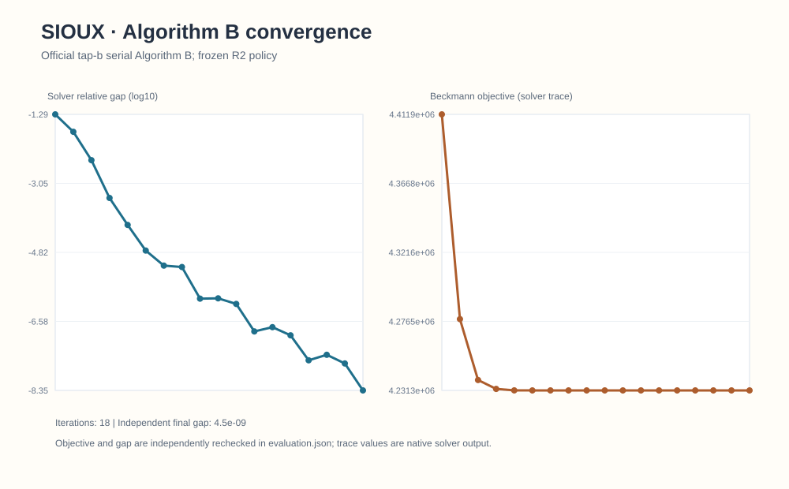

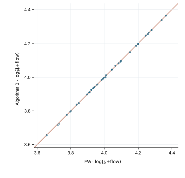

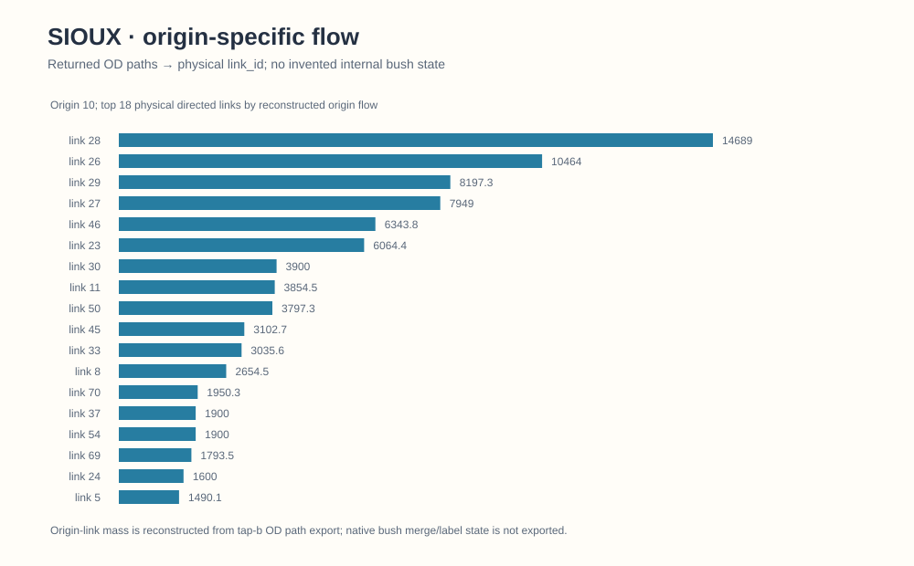

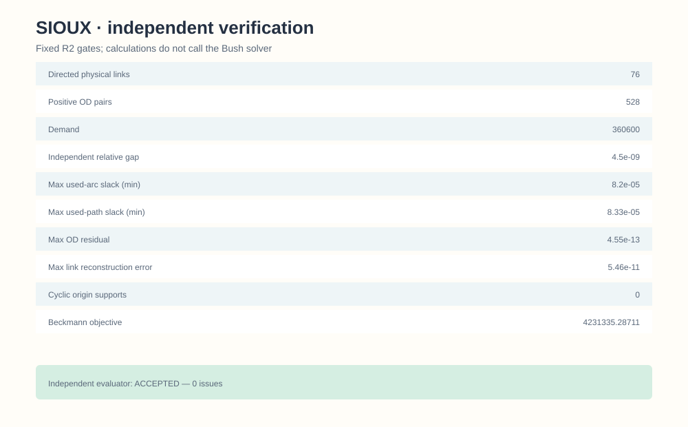

Saved Beckmann objective 4,231,335.287110682 vehicle-min; independent relative gap 4.4984e-9. The registered CLI and direct callable have exact accepted physical-link-flow parity. <a href="cases/sioux-algorithm-b.html">Exact static case</a>.

<h3 id="finite-time-expanded-algorithms-1">Finite time-expanded algorithms</h3>

Historical <a href="cases/sioux-space-time.html">200/250-OD CG</a>, accepted <a href="methods/distributed-assignment.html">Lagrangian R2</a> and <a href="cases/sioux-admm.html">ADMM R2_S</a> use selected finite graphs. <a href="cases/sioux-space-time.html">Full representation-level figures and ordered evidence</a>.

<a href="cases/sioux-space-time.html">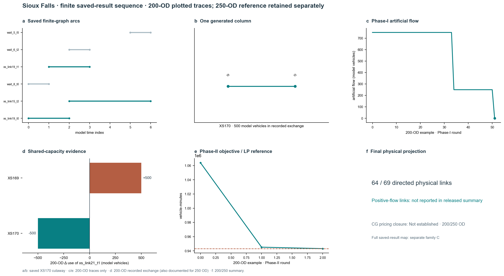</a>

<a href="assets/three_city_r1/sioux_finite_space_time_case_sequence.png">Historical R1 six-panel layout</a> remains available; the R2 image above is the current view.

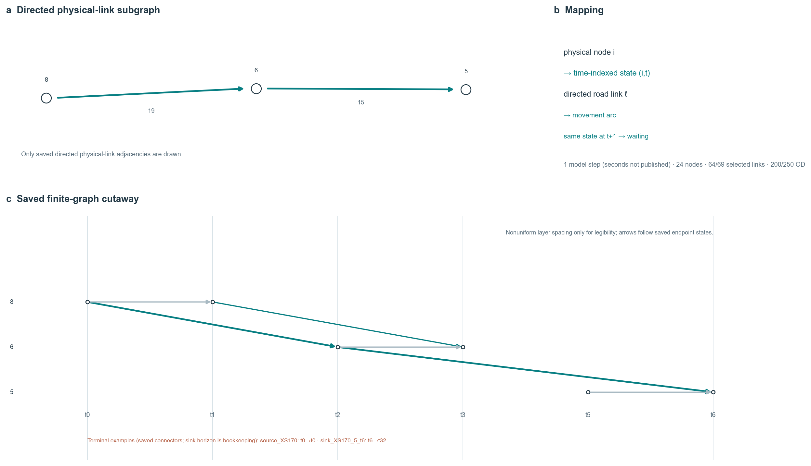

<em>Saved-record R2 view.</em> <a href="assets/three_city_r2/sioux_physical_to_time_expanded_graph.svg">SVG</a> · <a href="assets/three_city_r2/sioux_physical_to_time_expanded_graph.source.json">Source</a>.

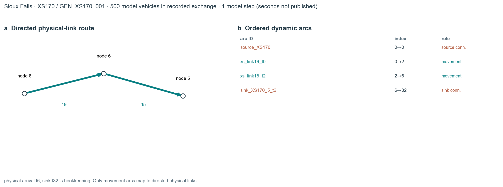

<em>One saved selected-OD path; the model-step duration in seconds is not published.</em> <a href="assets/three_city_r2/sioux_generated_column_time_indexed_path.svg">SVG</a> · <a href="assets/three_city_r2/sioux_generated_column_time_indexed_path.source.json">Source</a>.

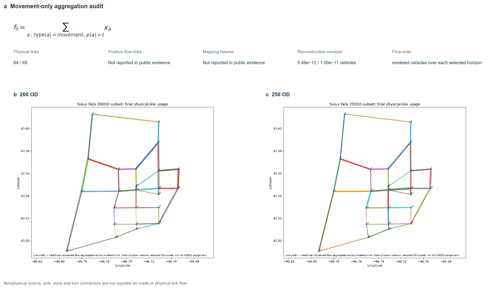

<em>Saved-record R2 view.</em> <a href="assets/three_city_r2/sioux_time_expanded_to_physical_link_flow.svg">SVG</a> · <a href="assets/three_city_r2/sioux_time_expanded_to_physical_link_flow.source.json">Source</a>.

<h4 id="sioux-falls-historical-200250-od-finite-spacetime-cg">Sioux Falls / Historical 200/250-OD finite space–time CG</h4>

The figures below are <strong>historical finite time-expanded CG</strong>, not native-L3 runs or present-day city observations. Explore the actual saved results before running an example. The 200- and 250-OD views represent <strong>different selected-OD benchmark instances</strong>, not a comparison of algorithms on the same demand.

The accepted construction, Phase-I, capacity, Phase-II and final-flow figures appear at their matching subsections below. The paired 200/250-OD Phase-I, Phase-II and final-flow views are side by side; other figures remain one per row. The former <a href="assets/presentation_r5/sioux_cg_case_sequence.png">six-panel PNG</a>, <a href="assets/presentation_r5/sioux_cg_case_sequence.svg">editable SVG</a>, and <a href="assets/presentation_r5/CG_CASE_SEQUENCE_SOURCES.json">source hashes/display crops</a> remain available. The former last panel was a status label, not an established Sioux pricing certificate. The two OD selections are distinct benchmark instances, not repeated trials. <a href="cases/sioux-space-time.html">Full numeric checks and limitations</a> · <a href="#boston">Matching Boston case above</a>. No scientific model was rerun.

<table>
<thead>
<tr>
<th>Road benchmark</th>
<th style="text-align:right">Physical nodes</th>
<th style="text-align:right">Selected links</th>
<th style="text-align:right">OD pairs</th>
<th style="text-align:right">Final columns</th>
<th style="text-align:right">Objective</th>
<th>Access</th>
</tr>
</thead>
<tbody>
<tr>
<td><a href="datasets/sioux-200od.html">Sioux Falls · 200 OD</a></td>
<td style="text-align:right">24</td>
<td style="text-align:right">64</td>
<td style="text-align:right">200</td>
<td style="text-align:right">446</td>
<td style="text-align:right">943,155.589771</td>
<td>Historical result record</td>
</tr>
<tr>
<td><a href="datasets/sioux-250od.html">Sioux Falls · 250 OD</a></td>
<td style="text-align:right">24</td>
<td style="text-align:right">69</td>
<td style="text-align:right">250</td>
<td style="text-align:right">567</td>
<td style="text-align:right">1,521,090.836620</td>
<td>Historical result record</td>
</tr>
<tr>
<td><a href="datasets/sioux-static-fw.html">Sioux Falls · static FW</a></td>
<td style="text-align:right">24</td>
<td style="text-align:right">76</td>
<td style="text-align:right">528</td>
<td style="text-align:right">—</td>
<td style="text-align:right">4,236,715.140438</td>
<td>Approximate static baseline</td>
</tr>
</tbody>
</table>

<a href="visualizations.html"><strong>All six benchmark figures</strong></a> · <a href="datasets.html">Network and example catalog</a> · <a href="outputs.html">Verification scope</a>

Historical road records include checked results and approved figures, <strong>not redistributed raw inputs</strong>. Self-contained <a href="examples.html">synthetic reference inputs</a> are bundled separately for installation and regression testing. Static FW and space–time CG solve different model formulations; their objective values are not directly comparable.

<h4 id="sioux-falls-from-the-physical-network-to-the-finite-time-expanded-graph">Sioux Falls / From the physical network to the finite time-expanded graph</h4>

<strong>The CG examples solve a finite space–time linear flow model with fixed arc costs and explicit capacities.</strong> They are not the same objective as static BPR/Beckmann FW or native L3. Source and sink connectors attach each demand to the time network, movement arcs advance to arrival times, and waiting arcs permit modeled delay.

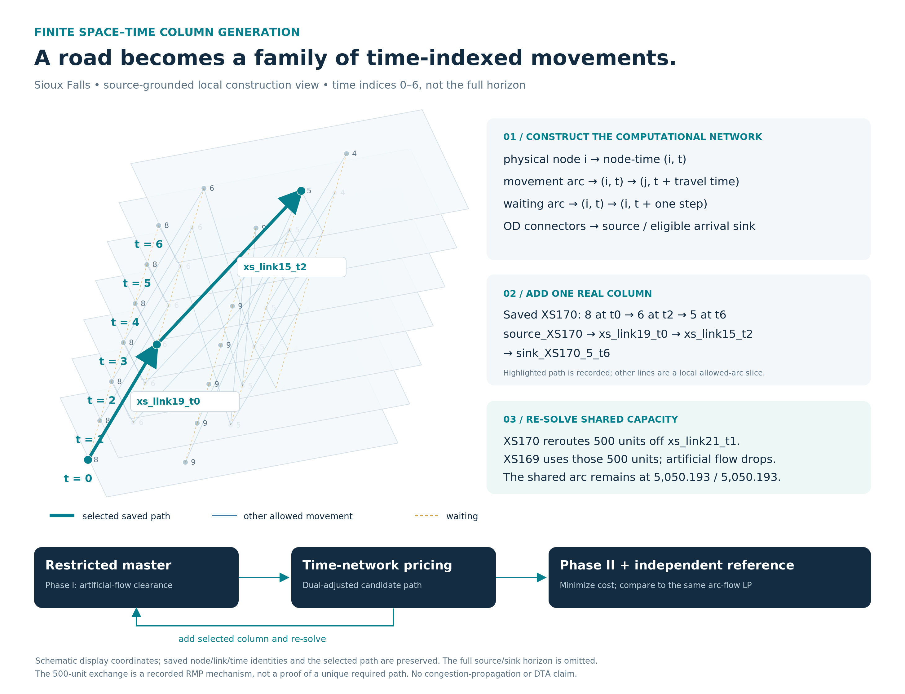

<strong>This is an explanatory local cutaway—not a plot of every node and arc.</strong> Positions are schematic; selected IDs and times come from saved records. The highlighted column is <code>source_XS170 → xs_link19_t0 → xs_link15_t2 → sink_XS170_5_t6</code>, corresponding to physical nodes <code>8 → 6 → 5</code> at times <code>0 → 2 → 6</code>. The rest of the horizon and demand-specific connectors are not drawn. <a href="cases/sioux-space-time.html">Construction fields and mappings</a>.

<h4 id="sioux-falls-phase-i-restores-feasibility">Sioux Falls / Phase I restores feasibility</h4>

<table class="figure-grid"><tr><td width="50%">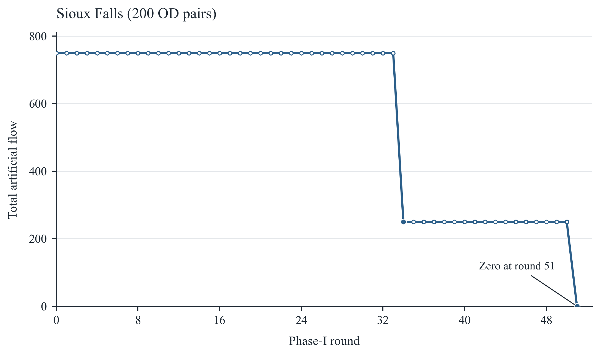<small>200 OD · artificial flow clears in round 51.</small></td><td width="50%">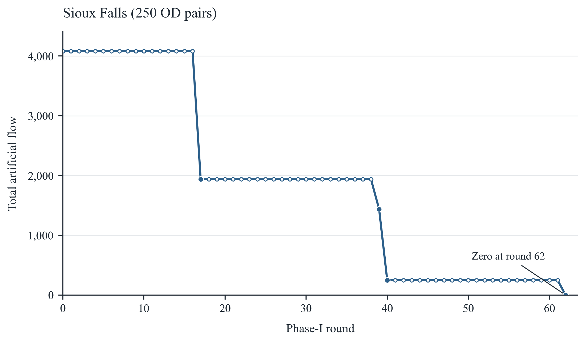<small>250 OD · artificial flow clears in round 62.</small></td></tr></table>

<table>
<thead>
<tr>
<th>Saved observation</th>
<th style="text-align:right">200 OD</th>
<th style="text-align:right">250 OD</th>
</tr>
</thead>
<tbody>
<tr>
<td>Initial artificial flow</td>
<td style="text-align:right">749.806844</td>
<td style="text-align:right">4,082.887577</td>
</tr>
<tr>
<td>Demands initially carrying artificial flow</td>
<td style="text-align:right">2</td>
<td style="text-align:right">5</td>
</tr>
<tr>
<td>Phase-I zero round</td>
<td style="text-align:right">51</td>
<td style="text-align:right">62</td>
</tr>
<tr>
<td>Added Phase-I / Phase-II columns</td>
<td style="text-align:right">51 / 195</td>
<td style="text-align:right">62 / 255</td>
</tr>
<tr>
<td>Final column pool</td>
<td style="text-align:right">446</td>
<td style="text-align:right">567</td>
</tr>
<tr>
<td>Objective / arc-flow LP reference on the same selected-OD finite time-expanded graph</td>
<td style="text-align:right">943,155.589771</td>
<td style="text-align:right">1,521,090.836620</td>
</tr>
<tr>
<td>Absolute objective difference</td>
<td style="text-align:right">2.33×10⁻¹⁰</td>
<td style="text-align:right">0</td>
</tr>
<tr>
<td>Maximum final demand residual / capacity violations</td>
<td style="text-align:right">0 / 0</td>
<td style="text-align:right">0 / 0</td>
</tr>
</tbody>
</table>

The 200-OD selection is contained in the 250-OD selection. There is one recorded run per size, with different iteration/candidate caps. These are <strong>descriptive historical runs</strong>, not repeated runtime trials, a scaling law or a global pricing-closure certificate. The original run summaries explicitly leave <code>optimality_claimed</code> and <code>full_cg_global_convergence_claimed</code> false.

<h4 id="sioux-falls-a-new-path-can-help-a-different-od">Sioux Falls / A new path can help a different OD</h4>

At round 34 (200 OD) and round 39 (250 OD), pricing selected a new path for <strong>XS170</strong>, but <strong>XS169</strong> lost 500 units of artificial flow after restricted-master reoptimization. XS170's 500 real units moved away from <code>xs_link21_t1</code>; XS169's real flow on that binding shared arc grew from 150.193 to 650.193. The total arc load stayed at its 5,050.193 capacity.

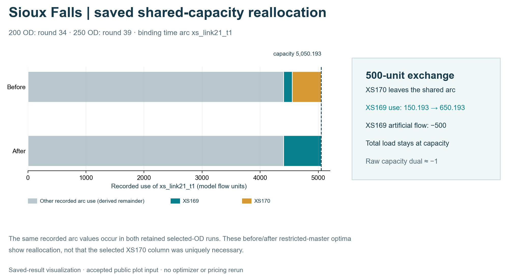

<em>This recorded coupled-master mechanism does not prove that one path was uniquely necessary.</em> The raw capacity dual stays approximately −1 under the saved solver convention. <a href="assets/presentation_r5/sioux_shared_capacity_canonical.svg">Editable SVG</a> · <a href="assets/sioux/phase_i_r1/od_level_phase_i_clearance.png">OD-level supplementary figure</a> · <a href="assets/presentation_r3/sioux_capacity_exchange.png">Earlier accepted capacity diagram</a> · <a href="assets/presentation_r5/SIOUX_CAPACITY_CANONICAL_SOURCES.json">Saved plot input and hashes</a> · <a href="assets/sioux/phase_i_r1/data/200_phase_i_trace.csv">Saved trace CSVs</a> · <a href="cases/sioux-space-time.html">Full Sioux CG explanation</a>.

<h4 id="sioux-falls-phase-ii-improves-the-real-path-objective">Sioux Falls / Phase II improves the real-path objective</h4>

<table class="figure-grid"><tr><td width="50%"><small>200 OD · objective on its own selected-OD finite graph.</small></td><td width="50%">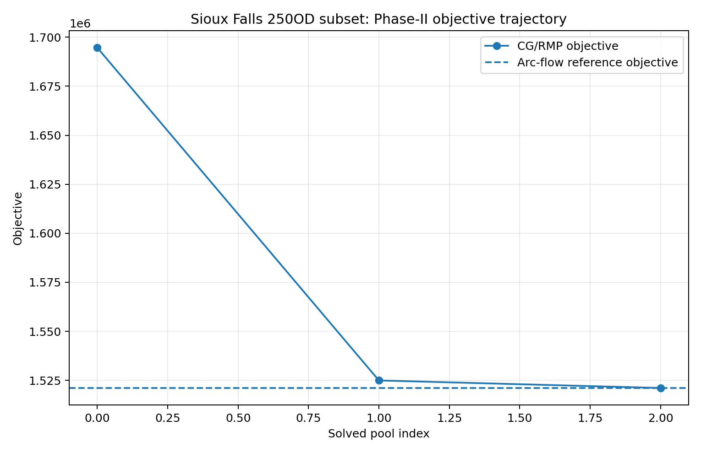<small>250 OD · objective on its own selected-OD finite graph.</small></td></tr></table>

Each objective is compared with the arc-flow LP on the <strong>same selected-OD finite time-expanded graph</strong>. The two benchmark objective values must not be compared as if they were alternative algorithms on one demand set.

<h4 id="sioux-falls-final-physical-link-movement-flow-and-validation">Sioux Falls / Final physical-link movement flow and validation</h4>

<table class="figure-grid"><tr><td width="50%">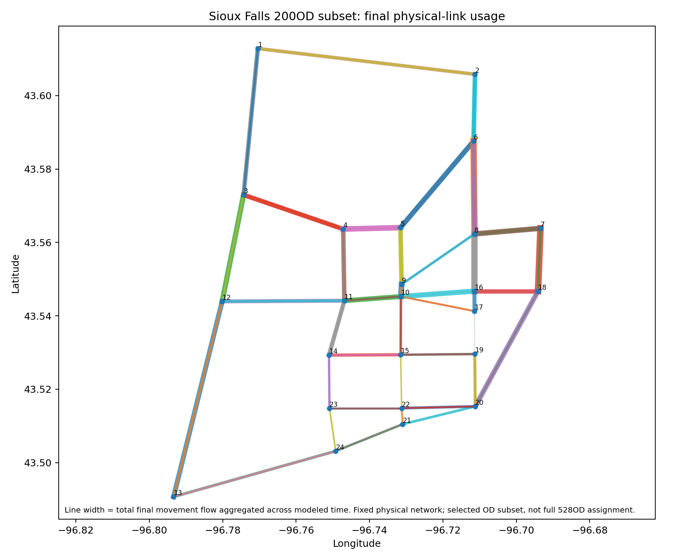<small>200 OD · 24 nodes, 64 selected links and 446 final columns. <a href="datasets/sioux-200od.html">Open results</a>.</small></td><td width="50%">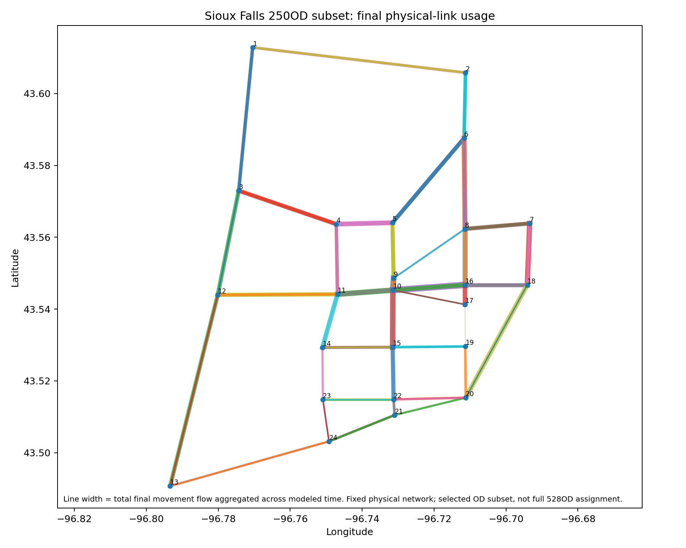<small>250 OD · 24 nodes, 69 selected links and 567 final columns. <a href="datasets/sioux-250od.html">Open results</a>.</small></td></tr></table>

The two saved views aggregate final time-indexed movement flow back to physical links. Both retained runs have zero final demand residual and zero capacity violations, and both have reference-objective agreement. Map line width represents final movement flow accumulated over the modeled time horizon. These are schematic benchmark views, not observed traffic, static V/C or a full 528-OD assignment. Opposite directions can overlap in the rendering; use the data cards for numerical interpretation.

<h4 id="sioux-falls-independent-pricing-closure">Sioux Falls / Independent pricing closure</h4>

<strong>Not established for the retained 200-OD and 250-OD runs.</strong> Reference-objective agreement remains valid, but Boston's independent pricing-closure certificate is not transferred to Sioux Falls. <a href="cases/sioux-space-time.html#6-independent-pricing-closure">Exact status and reproduction limits</a>.

<h4 id="sioux-falls-selected-od-finite-spacetime-admm-r2_s">Sioux Falls / Selected-OD finite space–time ADMM R2_S</h4>

The accepted <strong>200-OD and 250-OD selected subsets are different finite graphs and demand sets</strong>. The Sioux-selected R2_S policy passed independent conservation, capacity, KKT and physical-flow projection checks in 85 and 101 iterations, with own-LP relative objective gaps of 6.30e-6 and 7.16e-6. The four evidence stages below match the Boston ADMM section above; the two Sioux results are not one same-demand algorithm race. <a href="cases/sioux-admm.html">Full Sioux ADMM case and independent checks</a>.

<h4 id="convergence-and-original-unit-feasibility-1">Convergence and original-unit feasibility</h4>

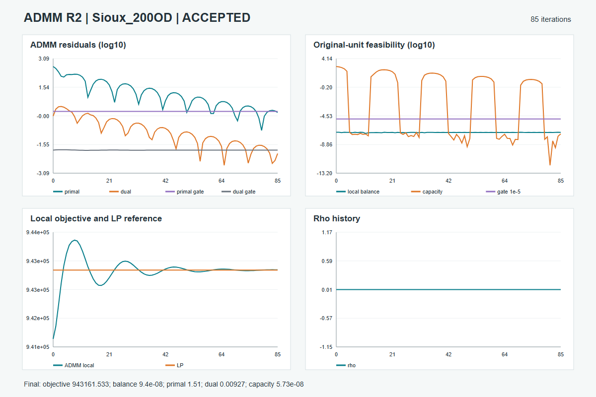

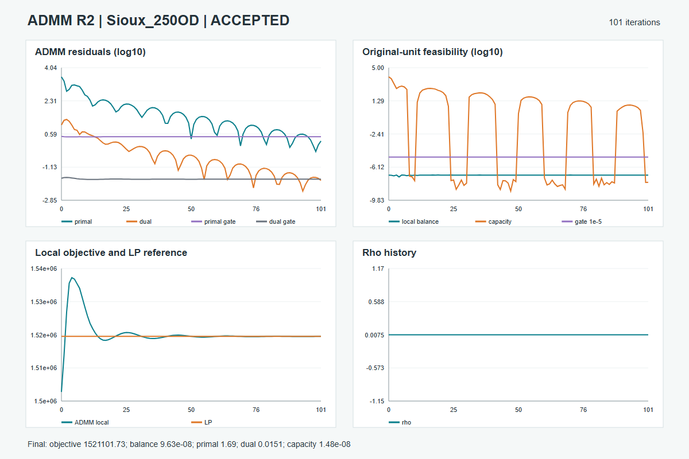

<h4 id="commodity-conservation-1">Commodity conservation</h4>

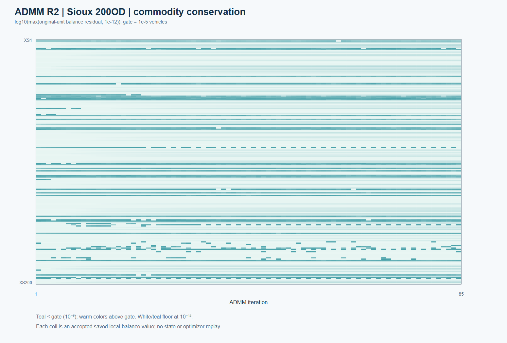

<em>The 250-OD accepted convergence figure above contains its original-unit local-balance and capacity traces; no separate 250-OD commodity heatmap was released.</em>

<h4 id="final-physical-link-movement-flow-1">Final physical-link movement flow</h4>

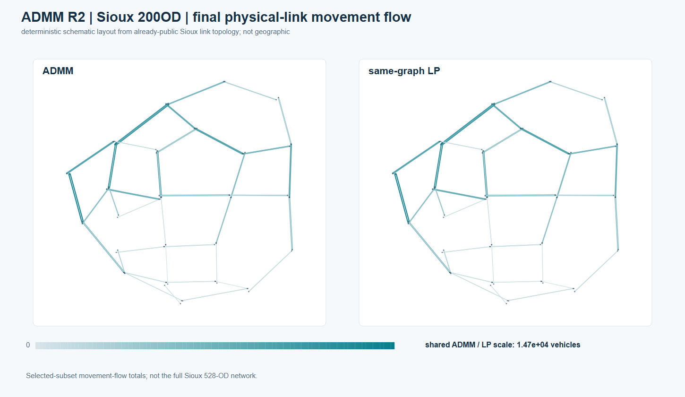

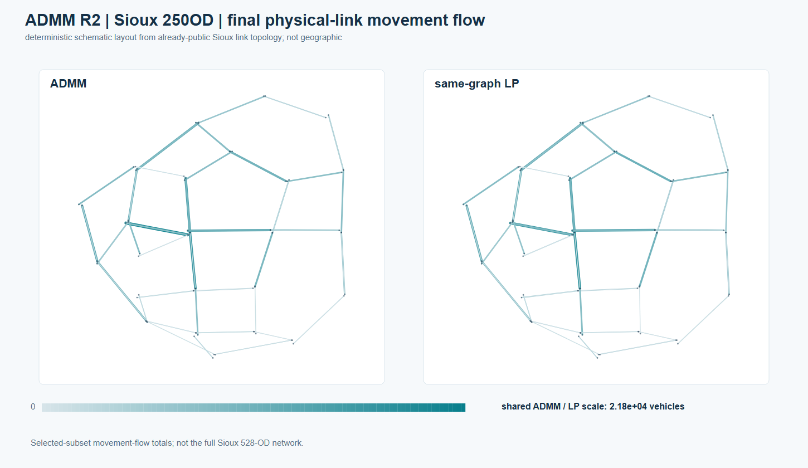

<h4 id="signed-admmlp-physical-link-difference-1">Signed ADMM−LP physical-link difference</h4>

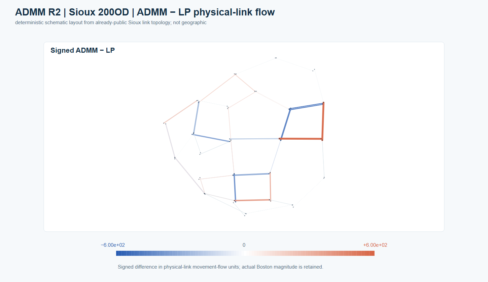

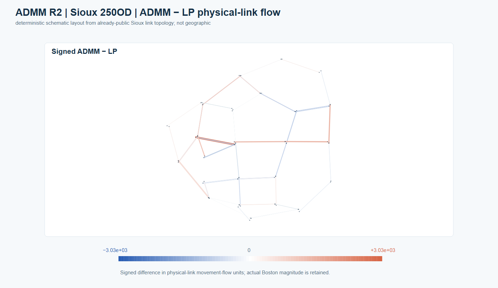

<em>These are accepted saved-result figures. Physical-link views use a deterministic schematic layout, not geographic coordinates or observed traffic. <a href="cases/sioux-admm.html">Editable figures and source records</a> retain the distinct 200/250-OD scopes.</em>

<h3 id="distributed-assignment-algorithms-bounded-accepted-results">Distributed assignment algorithms / bounded accepted results</h3>

The Sioux 200/250-OD <strong>finite time-expanded shared-capacity</strong> instances also have accepted, method-specific saved results. These are not static user equilibrium or full 528-OD network solutions. Their mathematical contract is separate from static FW; no cross-contract objective comparison is implied.

<table>
<thead>
<tr>
<th>Method</th>
<th>Accepted Sioux 200 OD</th>
<th>Accepted Sioux 250 OD</th>
<th>Necessary distinction</th>
</tr>
</thead>
<tbody>
<tr>
<td><strong>Lagrangian R2</strong></td>
<td>Dual lower bound <strong>942,452.403471</strong>; separately recovered feasible primal <strong>943,155.589771</strong> vehicle-min; <strong>0.0746%</strong> certified gap</td>
<td>Dual <strong>1,516,258.347432</strong>; feasible primal <strong>1,521,090.836620</strong> vehicle-min; <strong>0.3177%</strong> gap, below frozen 1% gate</td>
<td>Capacity-price dual generates paths; a separate restricted-path LP recovers the primal. Both primals match their own same-graph arc-flow LP objectives.</td>
</tr>
<tr>
<td><strong>ADMM R2_S</strong></td>
<td>Objective <strong>943,161.533307</strong> vehicle-min; <strong>6.30e-6</strong> relative gap to own LP</td>
<td>Objective <strong>1,521,101.731718</strong> vehicle-min; <strong>7.16e-6</strong> relative gap to own LP</td>
<td>Frozen Sioux-selected policy also passes a separate bounded Boston 10-OD holdout; independent conservation/capacity/KKT/projection checks pass. <a href="methods/admm-space-time.html">Full cross-city ADMM evidence</a>.</td>
</tr>
</tbody>
</table>

<table><tr><td width="50%"><a href="methods/distributed-assignment.html#lagrangian-capacity-pricing-with-separate-primal-recovery">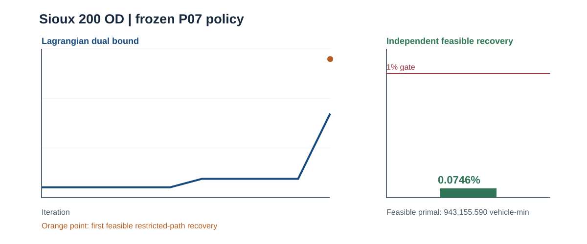</a></td><td width="50%"><a href="methods/distributed-assignment.html#lagrangian-capacity-pricing-with-separate-primal-recovery">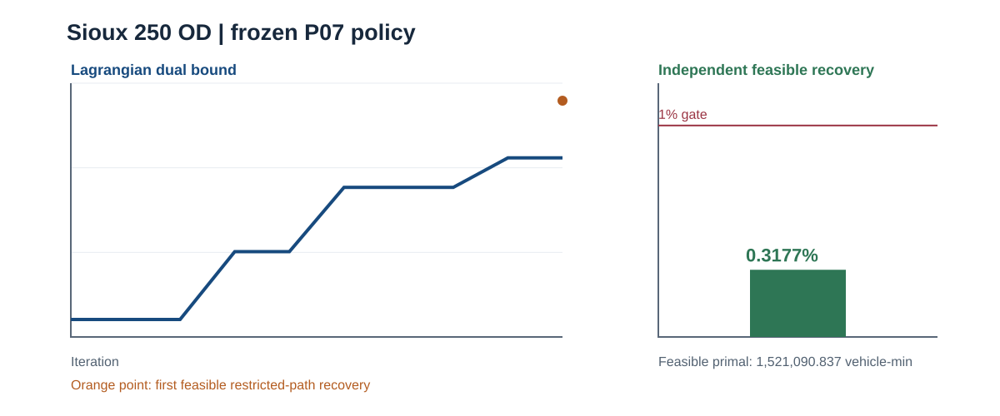</a></td></tr></table>

<em>Saved Lagrangian R2 histories, in matching 200/250-OD layouts. The lower and upper bounds are different mathematical outputs; a dual lower bound alone is not a feasible assignment.</em>

<table><tr><td width="50%"><a href="methods/distributed-assignment.html#admm-localconsensus-shared-capacity-decomposition">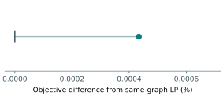</a></td><td width="50%"><a href="methods/distributed-assignment.html#admm-localconsensus-shared-capacity-decomposition">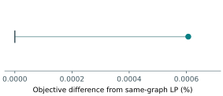</a></td></tr></table>

<em>Earlier R1 paired scalar figures are retained as historical evidence; they are not the new R2_S histories. The R1 250-OD iteration history was not supplied, so none was created.</em> <a href="methods/distributed-assignment.html">R1 source and limits</a> · <a href="cases/sioux-admm.html">R2 matched figures</a>.

The table describes accepted Sioux selected-OD results; <a href="cases/hong-kong-space-time.html">Hong Kong has a separate accepted bounded Lagrangian recovery and 0.7444% certificate</a>. Boston's Lagrangian transfer remains gated by the frozen 1% duality-gap criterion. ADMM R2_S passes a separate bounded Boston 10-OD holdout, while Hong Kong's frozen ADMM R2 transfer remains gated. None changes previously accepted Boston FW or CG results.

<h3 id="independent-verification-1">Independent verification</h3>

Both CG runs agree with their own arc-flow LP objectives; independent full-DAG pricing closure is <strong>Not established</strong> for either retained run.

<h3 id="city-specific-evidence-and-limits-1">City-specific evidence and limits</h3>

The XS170/XS169 capacity mechanism and both scales remain visible; no full 528-OD finite assignment or current traffic validation is claimed.

<h3 id="reproduction-1">Reproduction</h3>

<a href="cases/sioux-falls.html#experiments--reproduction">Inspect saved benchmark inputs and checks</a>.

<h2 id="06-case-study-hong-kong">06 / Case study — Hong Kong</h2>
<h3 id="role-in-the-repository-2">Role in the repository</h3>

Bounded turn-aware real-city engineering case with source-qualified four-stage/static and a frozen 10-OD finite case.

<h3 id="scope-and-statistics-2">Scope and statistics</h3>

780 physical nodes, 1,239 directed physical links, 95 SSG fine zones and ten STPUG parents. The finite case selects 100 physical nodes and 111 links.

<table>
<thead>
<tr>
<th>Metric</th>
<th>Accepted bounded instance</th>
</tr>
</thead>
<tbody>
<tr>
<td>City network</td>
<td>780 physical nodes; 1,239 directed links</td>
</tr>
<tr>
<td>Static scenario</td>
<td>8,930 OD pairs; 723.191 PCE / 1 h</td>
</tr>
<tr>
<td>Finite R5 case</td>
<td>100 selected nodes; 111 links; 10 ODs</td>
</tr>
</tbody>
</table>

<h3 id="gmns-zones-and-source-evidence-2">GMNS, zones, and source evidence</h3>

<a href="datasets/hong-kong-gmns.html">GMNS network, zone hierarchy, turn and grade checks</a> preserve physical and nonphysical identities.

<h3 id="demand-transit-and-observations-2">Demand, transit, and observations</h3>

<a href="cases/hong-kong-four-stage.html">Building/activity proxies and four-stage scenario</a> use graded assumptions; detector and private UrbanNav evidence are not held-out validation.

<h3 id="static-assignment-2">Static assignment</h3>

<a href="cases/hong-kong-static-assignment.html">Turn-aware FW and task-local Algorithm B</a> agree on the same static scenario; official TAPLab adapter parity is not claimed.

<h3 id="finite-time-expanded-algorithms-2">Finite time-expanded algorithms</h3>

The specifically approved HK10 / <code>ORACLE_R1_HK10_K1</code> example is a <strong>model-generated path</strong>, verified against the frozen R5 final pool and positive-flow solution. Approval covers its 77-arc excerpt and matching figures/captions/provenance only; it does not cover the full pool, dual/state arrays or raw observations. <a href="assets/three_city_r2/HK10_DISCLOSURE_APPROVAL_CURRENT.json">Exact disclosure scope and file hashes</a>.

<a href="cases/hong-kong-space-time.html">Accepted R5 CG</a> matches its same-graph arc-flow LP, with separately recovered Lagrangian feasibility. Frozen ADMM R2 remains <strong>Gated</strong>. <a href="cases/hong-kong-space-time.html">Full representation-level figures and ordered evidence</a>.

<a href="cases/hong-kong-space-time.html">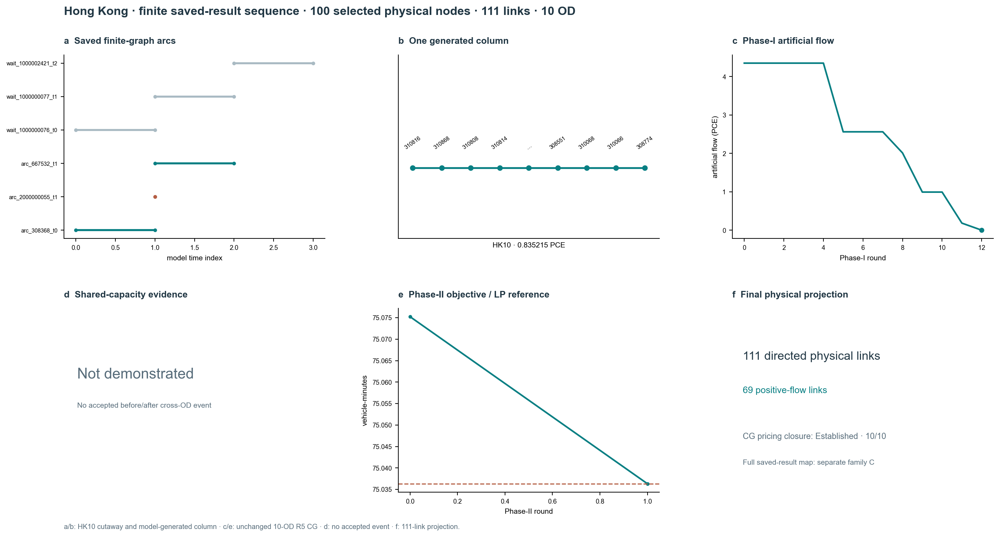</a>

<a href="assets/three_city_r1/hong_kong_finite_space_time_case_sequence.png">Historical R1 six-panel layout</a> remains available alongside the current R2 image above.

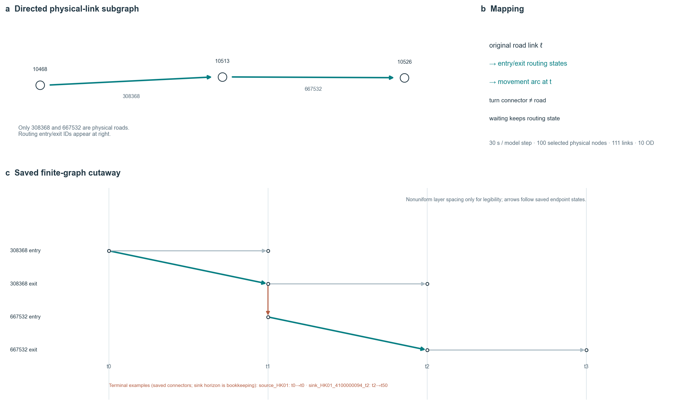

<em>Saved-record R2 view.</em> <a href="assets/three_city_r2/hong_kong_physical_to_time_expanded_graph.svg">SVG</a> · <a href="assets/three_city_r2/hong_kong_physical_to_time_expanded_graph.source.json">Source</a>.

The following approved, model-generated HK10 excerpt was verified against the frozen R5 final pool and <strong>0.8352150831808043 PCE</strong> positive flow. It is not an UrbanNav/GPS observation or approval for any other path data.

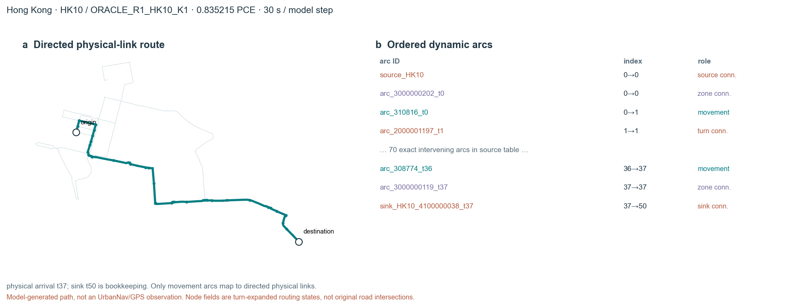

<em>One model-generated path, not UrbanNav/GPS observation; original physical roads and turn-expanded routing states are distinct.</em> <a href="assets/three_city_r2/hong_kong_generated_column_time_indexed_path.svg">SVG</a> · <a href="assets/three_city_r2/hong_kong_generated_column_time_indexed_path.source.json">Source</a>.

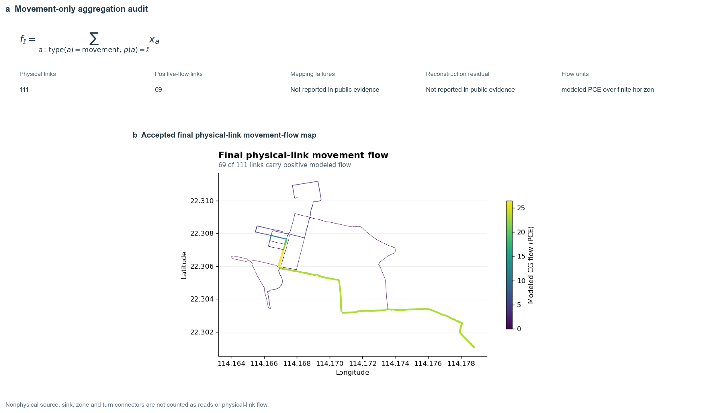

<em>Saved-record R2 view.</em> <a href="assets/three_city_r2/hong_kong_time_expanded_to_physical_link_flow.svg">SVG</a> · <a href="assets/three_city_r2/hong_kong_time_expanded_to_physical_link_flow.source.json">Source</a>.

The frozen 10-OD finite case has <strong>11,954 dynamic nodes and 24,910 arcs</strong>. Current CG R5 clears Phase I artificial flow <strong>4.3502187198 → 0 in 12 rounds</strong>, then reaches <strong>75.03632985794835 vehicle-minutes</strong>, agreeing with its same-graph arc-flow LP. An independent full-DAG check establishes <strong>pricing closure for 10/10 demands at 1e-6</strong>. Separate Lagrangian feasible-primal recovery has a <strong>0.7444%</strong> certified gap. Hong Kong ADMM R2 remains <strong>gated before accepted outer iterations</strong> and has no accepted objective. <a href="cases/hong-kong-space-time.html">Full finite case, individual scientific figures and redacted closure evidence</a>.

<h4 id="hong-kong-bounded-finite-spacetime-cg-r5">Hong Kong / Bounded finite space–time CG R5</h4>

These are the accepted saved results for the <strong>same unchanged 10-OD finite graph</strong>. Phase-I total/by-demand evidence and Phase-II/independent-closure evidence form two paired rows; the construction, final flow and separate LP/Lagrangian comparison remain full width. The comparison is supporting context, not an additional CG run. The case page retains the full records, editable SVGs and reproduction limits.

<h4 id="hong-kong-from-the-physical-network-to-the-finite-time-expanded-graph">Hong Kong / From the physical network to the finite time-expanded graph</h4>

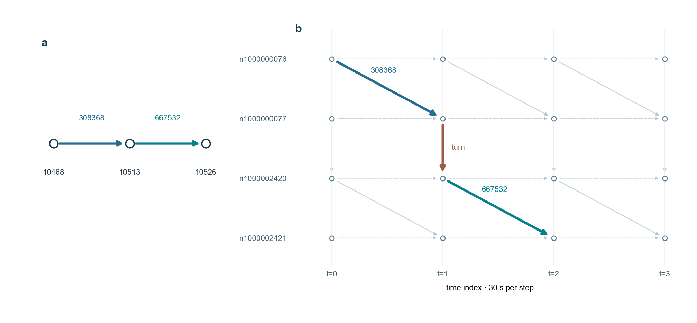

<em>A source-grounded local cutaway: two connected Austin Road physical links become actual movement arcs joined by a zero-time turn connector; pale arcs include saved waiting and other allowed movements. Positions are schematic, and the highlighted chain is permitted by the frozen graph—not an exported CG column or observed trajectory. The full graph has 111 selected physical links, 30-second steps and a 50-step horizon.</em> <a href="assets/hong_kong/presentation_r6/hk_physical_to_time_cutaway.svg">Editable SVG</a> · <a href="assets/hong_kong/presentation_r6/hk_physical_to_time_cutaway.source.json">Source record and exact IDs</a> · <a href="assets/hong_kong/full_stack_r5/r2r4_baseline/figures/hk_physical_to_time_expanded.png">Earlier aggregate construction graphic</a>.

<h4 id="phase-i-restores-real-path-feasibility-and-clears-demand-level-deficits">Phase I restores real-path feasibility and clears demand-level deficits</h4>

<table class="figure-grid"><tr><td width="50%"><strong>Phase I restores real-path feasibility</strong>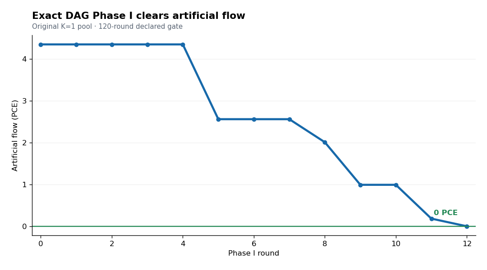<small>4.3502187198 artificial PCE clears by round 12; modeled feasibility, not observation.</small></td><td width="50%"><strong>Phase I clearance by demand</strong>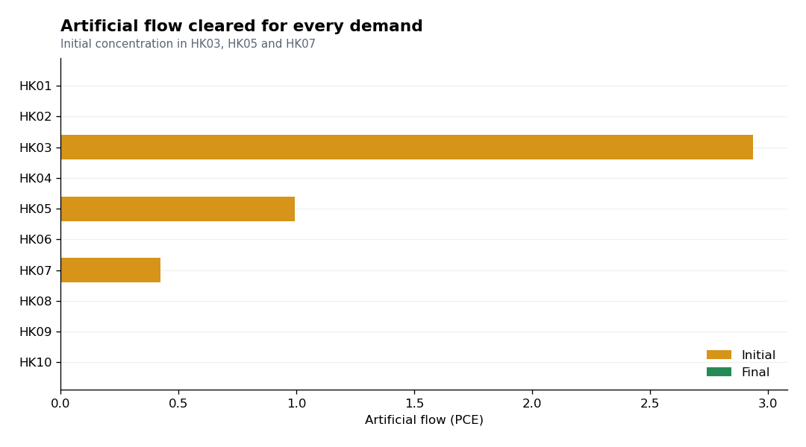<small>Initial deficit in HK03, HK05 and HK07; all ten have zero final artificial flow.</small></td></tr></table>

<a href="assets/hong_kong/full_stack_r5/figures/hk_cg_phase_i_artificial_flow.svg">Total-flow SVG</a> · <a href="assets/hong_kong/full_stack_r5/figures/hk_cg_phase_i_artificial_flow.source.json">Total-flow source record</a> · <a href="assets/hong_kong/full_stack_r5/figures/hk_cg_phase_i_by_demand.svg">By-demand SVG</a> · <a href="assets/hong_kong/full_stack_r5/cg_run/full_cg_v1_phase_i_artificial_flow_trace.csv">Saved Phase-I trace</a>.

<h4 id="phase-ii-objective-and-independent-pricing-closure">Phase II objective and independent pricing closure</h4>

<table class="figure-grid"><tr><td width="50%"><strong>Phase II improves the real-path objective</strong><small>The real-only master falls from 75.075236 to 75.036330 vehicle-minutes after three added columns; reference LP is on the same graph.</small></td><td width="50%"><strong>Independent pricing closure and original-space checks</strong>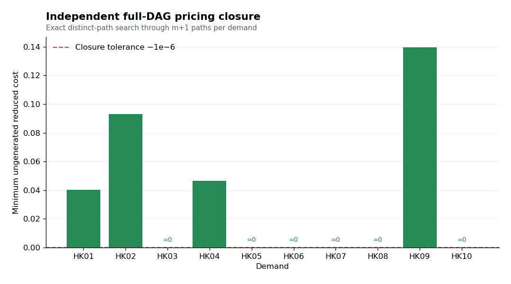<small>10/10 full-DAG closure is separate from objective agreement; solver-free checks cover demand, capacity and link projection.</small></td></tr></table>

<a href="assets/hong_kong/full_stack_r5/figures/hk_cg_phase_ii_objective.svg">Objective SVG</a> · <a href="assets/hong_kong/full_stack_r5/figures/hk_cg_phase_ii_objective.source.json">Objective source record</a> · <a href="assets/hong_kong/full_stack_r5/figures/hk_cg_pricing_closure.svg">Closure SVG</a> · <a href="assets/hong_kong/full_stack_r5/closure/INDEPENDENT_PRICING_CLOSURE_CERTIFICATE.json">Redacted closure certificate</a> · <a href="assets/hong_kong/full_stack_r5/verify_receiver_r5.py">Solver-free public verifier</a>.

<h4 id="final-physical-link-movement-flow-2">Final physical-link movement flow</h4>

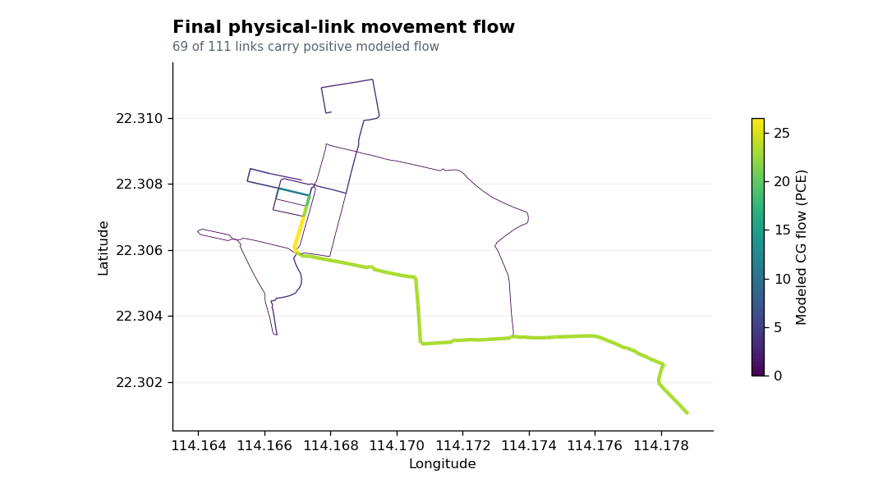

<em>Time-indexed movement is aggregated onto the original 111 physical-link IDs; 69 carry positive modeled flow. This is not a traffic count map.</em> <a href="assets/hong_kong/full_stack_r5/figures/hk_cg_final_physical_link_movement_flow.svg">SVG</a> · <a href="assets/hong_kong/full_stack_r5/figures/hk_cg_final_physical_link_movement_flow.source.json">Source record</a>.

<h4 id="same-graph-reference-and-feasible-primal-comparison">Same-graph reference and feasible-primal comparison</h4>

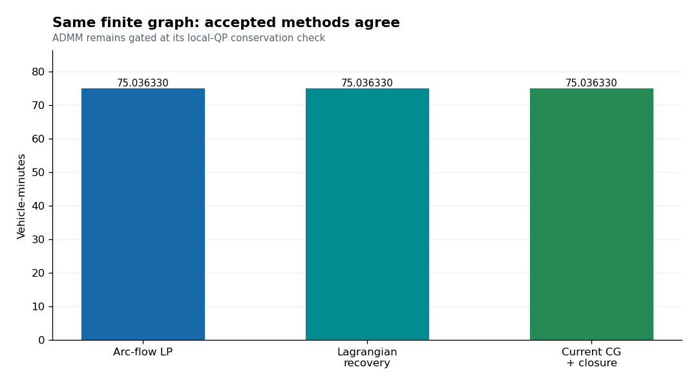

<em>The LP, current CG and separately recovered Lagrangian feasible primal agree at the reference objective. This does not establish identical link, path or time flows; ADMM has no accepted objective in this comparison.</em> <a href="assets/hong_kong/full_stack_r5/figures/hk_same_graph_method_comparison.svg">SVG</a> · <a href="assets/hong_kong/full_stack_r5/r2r4_baseline/phase_c/lagrangian_evaluation.json">Lagrangian evaluation</a>.

<h3 id="independent-verification-2">Independent verification</h3>

CG Phase I reaches zero in 12 rounds, and independent full-DAG pricing closure passes 10/10 demands. The single newly displayed generated column is a bounded derived disclosure, not a full pool release.

<h3 id="city-specific-evidence-and-limits-2">City-specific evidence and limits</h3>

Neither citywide DTA nor empirical calibration is established; original provider archives, raw point-level observations, full pool and duals stay excluded.

<h4 id="retained-r1-data-checkpoint">Retained R1 data checkpoint</h4>

<a href="cases/hong-kong-gmns-pilot.html">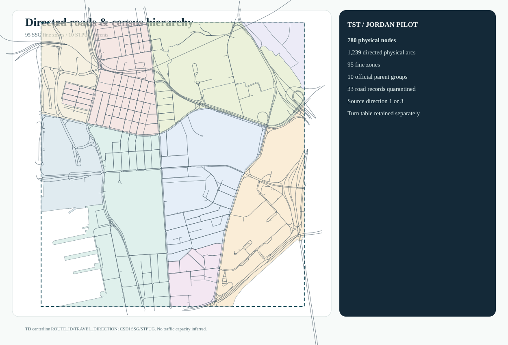</a>

<em>This earlier source-backed road/zone view is not assignment flow.</em> Its saved <code>assignment_ready=false</code> gate describes <strong>R1 only</strong>, not the later accepted R2–R5 case. Centroid access remains nonphysical. Its deterministic demand seed was not observed OD, and private UrbanNav point-level derivatives were not published. <a href="cases/hong-kong-gmns-pilot.html">R1 case and five original views</a> · <a href="https://github.com/scholarhaozheng/mobility-network-lab/blob/main/examples/hong-kong/gmns_pilot_r1/README.md">R1 instance</a> · <a href="methods/hong-kong-evidence-contract.html">Current evidence/rights contract</a>.

<h3 id="reproduction-2">Reproduction</h3>

<a href="methods/hong-kong-evidence-contract.html">Run public saved-result checks</a>.

<h2 id="07-methods-reproduction-evidence-and-limits">07 / Methods, reproduction, evidence, and limits</h2>

<a href="methods.html">Methods</a> · <a href="visualizations.html">Visual evidence</a> · <a href="RUN_YOUR_OWN_GMNS.html">Run your own GMNS</a> · <a href="integrations.html">Licenses and source policies</a>.

<h3 id="executed-finite-spacetime-cg-experiments">Executed finite space–time CG experiments</h3>

The repository contains <strong>three distinct executed CG case families</strong>. Boston is one bounded real-city pilot on an accepted GMNS subnetwork; Sioux Falls contains two historical selected-OD benchmark instances; Hong Kong R5 is a separately frozen ten-demand Tsim Sha Tsui–Jordan finite case. They share a method family, not a graph, demand, objective value or universal certificate.

<a href="methods/space-time-cg.html">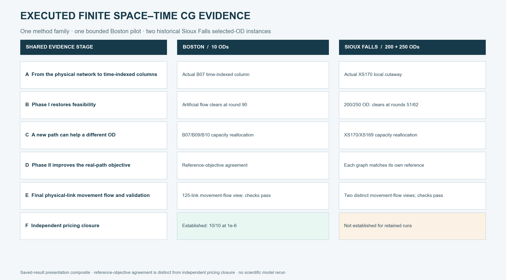</a>

<table>
<thead>
<tr>
<th>Executed evidence</th>
<th>Boston</th>
<th>Sioux Falls</th>
<th>Hong Kong</th>
</tr>
</thead>
<tbody>
<tr>
<td><strong>Instance</strong></td>
<td>90 physical nodes, 125 links, 10 ODs, 3-second steps, 100-step horizon</td>
<td>Historical 200/250-OD selected subsets</td>
<td>111 selected physical links, 10 ODs, 30-second steps, 50-step horizon; 24,910 dynamic arcs</td>
</tr>
<tr>
<td><strong>Phase I</strong></td>
<td>Artificial flow <strong>20.5536128974 → 0</strong> in round <strong>90</strong></td>
<td>Artificial flow reaches zero in rounds <strong>51 / 62</strong></td>
<td>Artificial flow <strong>4.3502187198 → 0</strong> in <strong>12</strong> rounds</td>
</tr>
<tr>
<td><strong>Phase II</strong></td>
<td><strong>64.39686151152954</strong> vehicle-min; own-LP agreement</td>
<td><strong>943,155.589771 / 1,521,090.836620</strong>; each own-LP agreement</td>
<td><strong>75.03632985794835</strong> vehicle-min; own-LP agreement after three added columns</td>
</tr>
<tr>
<td><strong>Pricing certificate</strong></td>
<td>Independent full-DAG closure <strong>10/10</strong> at <code>1e-6</code></td>
<td><strong>Not established</strong> for retained historical runs</td>
<td>Independent full-DAG closure <strong>10/10</strong> at <code>1e-6</code></td>
</tr>
<tr>
<td><strong>Open the evidence</strong></td>
<td><a href="cases/boston-space-time.html">Boston case</a></td>
<td><a href="cases/sioux-space-time.html">Sioux case</a></td>
<td><a href="cases/hong-kong-space-time.html">Hong Kong R5 case</a></td>
</tr>
</tbody>
</table>

<em>The Boston/Sioux image is an earlier two-city saved overview, retained without being relabeled as a three-city figure. Hong Kong's separate R5 figures appear <a href="#hong-kong-cg-r5">above on this homepage</a> and in its case page. None is a citywide CG or a calibrated forecast. Fixed-cost hard-capacity CG objectives are not numerically comparable with static BPR/Beckmann FW.</em> <a href="assets/presentation_r5/boston_sioux_cg_parallel_overview.svg">Boston/Sioux overview SVG</a> · <a href="assets/presentation_r5/CG_CASE_SEQUENCE_SOURCES.json">Source hashes</a> · <a href="assets/presentation_r4/cg_experiments_overview.png">Earlier saved overview</a>.

<h3 id="run-new-inputs-or-inspect-saved-results">Run new inputs, or inspect saved results</h3>

<strong>These are two different operations.</strong> The new generic preparation/solve entry computes a fresh result from supplied inputs. The saved-result entries below inspect frozen experiments. A documentation build never silently invokes a solver.

For repeatable presentation-only builds and source-hash boundaries, see the <a href="assets/three_city_r2/BUILD_AND_SOURCE_CONTRACT.html">three-city saved-data build contract</a>. The older one-off R1 composition helpers are not required.

<h4 id="new-vehicle-od-preparation-fw-verification-map">New vehicle OD → preparation → FW → verification → map</h4>
<pre><code class="language-bash">python -B tools/mcl_assignment.py prepare --input examples/scalable_vehicle_fixture/network --demand examples/scalable_vehicle_fixture/vehicle.csv --config examples/scalable_vehicle_fixture/config.json --output "my results/instance"
python -B tools/mcl_assignment.py solve --instance "my results/instance" --method fw --output "my results/fw"
python -B tools/mcl_assignment.py verify --run "my results/fw"
python -B tools/mcl_assignment.py plot --run "my results/fw" --output "my results/figures"
</code></pre>

The supported direct-vehicle profile is single-class, fixed-demand and static. It retains text IDs and parallel physical links; units, capacity basis, period and PCE factor are explicit. Unsupported turn-state or class/time inputs are rejected rather than ignored. <code>prepare</code>, FW and <code>verify</code> use the standard library; plotting and optional native methods have separate dependencies.

A second entry accepts person OD, supported absolute skims, the fixed conditional choice specification and occupancy configuration. It feeds the same vehicle-assignment interface; it is not an arbitrary calibrated choice-model library. <a href="RUN_YOUR_OWN_GMNS.html">Full new-input contract and commands</a> · <a href="https://github.com/scholarhaozheng/mobility-network-lab/blob/main/examples/boston/scalable_tool_r1/README.md">Boston scale profile</a> · <a href="SCALABLE_TOOL_DATA_NOTICE.html">Data and dependency terms</a>.

<h3 id="mobility-data-support-1">Mobility data support</h3>

Supporting mobility data remain distinct from runnable city models and from both the historical Hong Kong R1 data pilot and the later bounded R2–R5 technical case.

<h4 id="open-mobility-evidence">Open mobility evidence</h4>

<strong>Explore the data behind a city model, then prepare the records you need.</strong> Selected Open Mobility Data Visibility (OMDV) results now include a downloadable, non-geometric 11,422-city evidence table and actual source-record → content-SHA → city relationships. The executable tools query those records, organize local catalogs and inspect a user-supplied GTFS ZIP.

<!-- open-evidence-overview:start -->

<table>
<tr>
<td data-evidence-layer="global_city_frame" width="50%"><b>11,422 urban centres</b> <a href="open-data.html#global-city-frame">City frame &amp; catalog visibility</a> A common GHSL study frame with explicitly defined catalog-matching scenarios.</td>
<td data-evidence-layer="gtfs_static" width="50%"><b>2,959 cities with GTFS stop evidence</b> <a href="open-data.html#gtfs-static">Scheduled-transit evidence</a> 4,425 unique parseable content hashes in the all-retained view; city evidence uses inside-polygon stops.</td>
</tr>
<tr>
<td data-evidence-layer="gtfs_realtime"><b>2,465 endpoint representatives</b> <a href="open-data.html#gtfs-realtime">GTFS-Realtime source context</a> Metadata accounting and bounded snapshot classifications, not a live health monitor.</td>
<td data-evidence-layer="osm_map_features"><b>29 regional extracts</b> <a href="open-data.html#osm">OSM map-feature evidence</a> 791 of 916 sampled urban-centre rows have bbox-joined point-feature evidence.</td>
</tr>
<tr>
<td data-evidence-layer="gbfs_shared_mobility"><b>1,516 shared-mobility registry rows</b> <a href="open-data.html#gbfs-and-shared-mobility">GBFS source context</a> 48 countries represented; location strings are not reviewed city matches.</td>
<td data-evidence-layer="model_interoperability"><b>13 standards and tools</b> <a href="interoperability.html">Model-interface crosswalk</a> GMNS, TNTP, GTFS and related formats: references and reuse pathways, not thirteen bundled converters.</td>
</tr>
</table>

<!-- open-evidence-overview:end -->

These evidence layers are not additive. Each value is tied to its own unit, source frame and retained research snapshot. They do not measure live service coverage or the number of runnable city models. The public release includes a <strong>selected result projection</strong>, provenance and executable tools—not raw feeds, provider URLs, geometry or live endpoint checks. <a href="open-data-explorer.html">Browse/download 11,422 city rows</a> · <a href="open-data-sources.html">Sources and reproduction scope</a> · <a href="omdv-provenance.html">Trace each metric</a>

<h4 id="executable-data-tools-query-evidence-and-prepare-your-own-records">Executable data tools: query evidence and prepare your own records</h4>

The authorized OMDV workflow normalizes a user-supplied feed catalog and city table, performs exact city/country <strong>named-entity matching</strong>, and writes standardized records, unmatched/ambiguous statuses and quality checks.

<pre><code class="language-bash">python -m pip install -r requirements-data-tools.txt
python -B tools/mcl_data.py catalog-city-match --catalog examples/data-tools/feeds_sample.csv --cities examples/data-tools/external_city_universe_sample.csv --output results/data-tools-demo
python -B tools/mcl_data.py query-city --name "Hong Kong" --country CHN --include-relations
python -B tools/mcl_data.py process-gtfs --zip path/to/feed.zip --output results/gtfs-content-report
</code></pre>

<code>query-city</code> prefers the stable city ID and explicitly rejects duplicate name/country keys unless <code>--all-matches</code> is requested. <code>process-gtfs</code> reuses the authorized OMDV content parser with a streamed stop-times pass; it makes no network request and does not extract or modify the ZIP. These are evidence/content tools, not GPS-to-road matching, traffic-zone creation, OD estimation or an automatic connection to the solver.

<a href="open-data-explorer.html"><strong>Browse city evidence</strong></a> · <a href="data-tools.html"><strong>Use the data tools</strong></a> · <a href="open-data.html"><strong>Explore all six evidence layers</strong></a> · <a href="city-workflow.html"><strong>Connect data to the city workflow</strong></a>

<h4 id="quick-start">Quick start</h4>

Use a compatible Python environment and install the network-workflow dependencies. The source has been exercised with Python 3.12 and 3.13; see the <a href="getting-started.html">tested profiles and installation guide</a>.

<pre><code class="language-bash">python -m pip install -r requirements.txt
python tools/mnl.py catalog
</code></pre>

Run the self-contained capacity regression from network and demand tables:

<pre><code class="language-bash">python tools/mnl.py run --input app/cases/capacity_zone_probe/input --config app/cases/capacity_zone_probe/case.json --seed-mode auto --seed-k 1 --output results/capacity-demo
python tools/mnl.py verify --run results/capacity-demo
</code></pre>

Open <code>results/capacity-demo/report.html</code>. The reference example allocates 3 units to one route and 7 to the alternative, with objective <strong>27</strong>. This is a labelled regression example, not a city dataset. Use a new output directory for each run.

To inspect the <strong>saved</strong> Central Boston feedback results without rerunning a model, use the included compact component and a new output directory:

<pre><code class="language-bash">python -B examples/boston/run_saved_example.py --data-dir "examples/boston/behavior_feedback_r1_semantic_fix_r1" --output "results/boston_saved_example"
</code></pre>

The command rebuilds a query database from the released CSVs and exports five saved-result queries; it does not acquire sources, fit parameters, run FW/CG or validate predictions. The <a href="https://github.com/scholarhaozheng/mobility-network-lab/blob/main/examples/boston/SAVED_EXAMPLE.md">saved-result guide</a> also explains how to point <code>--data-dir</code> at <code>public_component</code> after extracting the separate full data asset. The trusted code stays beside the wrapper in this checkout.

<h4 id="use-your-own-network">Use your own network</h4>

Declare node/link/demand fields, units and zone-access rules in <code>case.json</code>, then use the same numerical entry point:

<pre><code class="language-bash">python tools/mnl.py validate --input /path/to/network/input --config /path/to/network/case.json
python tools/mnl.py run --input /path/to/network/input --config /path/to/network/case.json --seed-mode auto --seed-k 5 --output results/network-run
python tools/mnl.py verify --run results/network-run
</code></pre>

The current CG profile uses one-minute steps, positive integer travel times, a common departure time, fixed costs, continuous path flows and shared hard arc capacities. <a href="data-contract.html">Read the exact contract</a> before adapting a dataset; this is not a general static user-equilibrium or unrestricted city-scale DTA interface.

<strong>Network + demand → route initialization → explicit space–time network → reference LP + Phase-I/II → final pool, flows and duals → independent checks.</strong>

The allowed network is independent of the initial route pool. Every column in the last successfully solved pool is exported, including zero-flow columns. Reference agreement and independently established pricing closure are distinct statements.

<h4 id="tools-methods-and-extensions">Tools, methods and extensions</h4>

<a href="https://github.com/zephyr-data-specs/GMNS">GMNS</a> supplies the common network vocabulary. <a href="https://github.com/HanZhengIntelliTransport/GMNS_Plus_Dataset">GMNS Plus Dataset</a>, <a href="https://github.com/asu-trans-ai-lab/OSM2GMNS">OSM2GMNS</a>, <a href="https://github.com/asu-trans-ai-lab/grid2demand">grid2demand</a> and <a href="https://github.com/asu-trans-ai-lab/TAPLab">TAPLab</a> are upstream data/tools with their own implementations and licenses. A reference link is not evidence of a bundled executable integration.

The computational release includes <strong>space–time CG</strong>, <strong>static Frank–Wolfe</strong>, the solved <strong>finite-path Boston reference</strong>, corrected <strong>native Diagnostic L3</strong>, accepted <strong>official <code>tap-b</code> Algorithm B</strong> case evidence, bounded <strong>Sioux Lagrangian R2</strong>, and cross-city bounded <strong>ADMM R2_S</strong> source/evidence. <a href="methods.html">The method table</a> states their distinct objectives, instances and accuracy scopes; <code>python -B tools/mcl_results.py list</code> and <code>verify-saved --run &lt;run-id&gt;</code> inspect previously released points without solving. Generalized raw-city automation, broader GPS traces and map matching, coupled primal–dual work and native internal Policy Bush state inspection remain research extensions. <a href="city-workflow.html">City workflow</a> · <a href="methods/origin-based-algorithm-b.html">Algorithm B method</a> · <a href="methods/admm-space-time.html">ADMM R2</a> · <a href="roadmap.html">Roadmap</a>

<h4 id="project-layout">Project layout</h4>
<pre><code class="language-text">app/src/gmns_dynamic/   Existing network input and space–time CG engine
app/cases/             Self-contained, labelled regression examples
algorithms/static_fw/  Separate static traffic-assignment baseline
algorithms/origin_based_algorithm_b/  Selected Algorithm B adapter, evaluator and saved evidence
algorithms/finite_path_reference/  Boston 130-path SLSQP source/config
algorithms/path_compression/diagnostic_l3/  Corrected native builder and profiles
algorithms/distributed_assignment/  Earlier bounded Lagrangian R2 and ADMM R1 source/evidence
algorithms/admm_r2/                  Frozen cross-city bounded R2_S source
algorithms/mode_choice_conditional/  Reduced absolute-attribute choice evaluator
examples/boston/assignment_methods_r1/  Saved FW/full-path/native results
examples/sioux-falls/native_l3_r1/  Selected Sioux native results
examples/hong-kong/gmns_pilot_r1/  Bounded public GMNS/data instance and offline checks
docs/assets/hong_kong/full_stack_r5/  Public R2–R4 full-stack and R5 CG saved-result bundle with solver-free checks
launcher/              Saved-output verification
src/mobilitylab/        Authorized metadata tools and supporting adapters
catalog/               Network records, evidence summaries and provenance
schemas/               Explicit input and output contracts
docs/                  City workflow, visual results and project website
tools/                 User commands, documentation build and checks
</code></pre>
<h4 id="contributing-citation-and-licenses">Contributing, citation and licenses</h4>

Contribute a traceable city/network instance, a focused adapter, a verification improvement or a documented method. Keep observed, estimated and synthetic inputs distinct. <a href="https://github.com/scholarhaozheng/mobility-network-lab/blob/main/CONTRIBUTING.md">Contribution guide</a> · <a href="add-a-network.html">Add a network</a> · <a href="citation.html">Citation</a>

Original code in the public tree is distributed under <a href="../LICENSE">MIT</a> within the stated authorization scope. Datasets and third-party tools retain their own terms. See <a href="https://github.com/scholarhaozheng/mobility-network-lab/blob/main/DATA_LICENSES.md">data licenses</a>, <a href="https://github.com/scholarhaozheng/mobility-network-lab/blob/main/THIRD_PARTY_NOTICES.md">third-party notices</a> and <a href="data-access.html">data access</a>.

