<!-- Homepage content derived from the root README by tools/build_case_presentation.py. -->
<h1 id="mobility-computation-lab">Mobility Computation Lab</h1>

<strong>City networks, travel demand and reproducible network computation.</strong> Project author: <a href="https://scholarhaozheng.github.io/">Hao Zheng</a>. This open-source research environment connects explicit city representations to documented demand and network calculations while keeping each result tied to its own instance, units and evidence. <a href="full-walkthrough.html">Full technical walkthrough</a> · <a href="getting-started.html">Start with a saved example</a> · <a href="citation.html">Source and citation</a>.

<h2 id="01-what-this-project-adds">01 / What this project adds</h2>
<h3 id="city-to-model-representations">City-to-model representations</h3>

The project links roads, hierarchical zones, population and activity inputs, transit services, and supported observations to explicit demand and network models. Its adapters preserve identifiers, units, access semantics, and physical-link mappings across the documented city cases. <a href="contributions.html#city-to-model-representations">Implementation and source map</a>.

<h3 id="computational-implementations-and-diagnostics">Computational implementations and diagnostics</h3>

The repository brings together path-based and compressed static-assignment experiments with finite time-expanded CG, Lagrangian, and ADMM implementations. Project-specific work includes feasibility restoration, pricing and degeneracy handling, local-subproblem scaling, and reconstruction in the original flow space. <a href="contributions.html#computational-implementations-and-diagnostics">Methods and evidence</a>.

<h3 id="reusable-cross-city-computational-tools">Reusable cross-city computational tools</h3>

The project packages shared data interfaces, case configurations, and analysis tools into an open-source environment for Boston, Sioux Falls, and Hong Kong. Documented examples connect zonal demand, generated paths, and physical-link results, allowing researchers to reuse the supported workflows and compare demand scales, network representations, and solution methods. <a href="contributions.html#reusable-cross-city-computational-tools">Tools, attribution and demonstrated scope</a>.

<h2 id="02-complete-project-structure">02 / Complete project structure</h2>

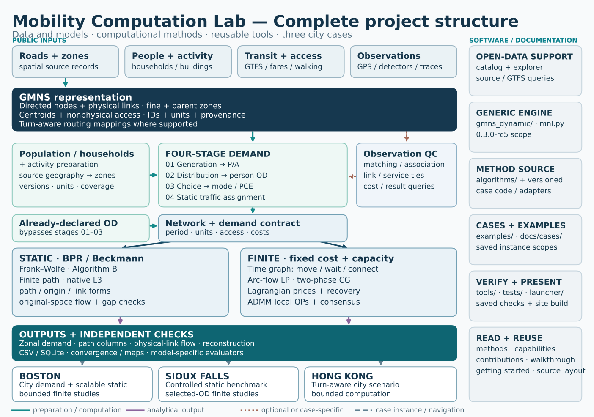

<em>A conceptual map of supported modules and case-specific connections, not a single command that runs every lane.</em> <a href="assets/project_structure_r2/project_structure.svg">Full-size editable SVG</a> · <a href="assets/project_structure_r2/project_structure.png">PNG</a> · <a href="architecture.html">Accessible module and source table</a>.

GMNS keeps directed physical roads, hierarchical zones, centroids, nonphysical access and source IDs distinct. Population, household and activity preparation precedes <strong>01 trip generation → 02 trip distribution → 03 mode choice → 04 traffic assignment</strong> where those stages are supported; declared vehicle OD can instead enter assignment directly. GPS traces and map matching, service records and detector context require explicit quality and network-association rules, not an automatic observed-OD or calibrated-demand pipeline. <a href="datasets/boston-gmns-exchange.html">GMNS exchange</a> · <a href="city-workflow.html">Four-stage city workflow</a> · <a href="datasets/boston-behavior-feedback.html">Observation example</a>.

Static <strong>BPR/Beckmann</strong> assignment and finite <strong>fixed-cost, hard-capacity time-expanded</strong> optimization are separate mathematical branches. The latter is not an automatically calibrated dynamic version of the former. <a href="architecture.html">Architecture</a> · <a href="data-contract.html">Data contract</a>.

<h2 id="03-case-coverage-and-selected-evidence">03 / Case coverage and selected evidence</h2>

Each row uses one evidence graphic type and one 600 × 360 source canvas across the three cities. Local scales, instance scope and missing stages remain explicit; static BPR/Beckmann and fixed-cost hard-capacity computations are separate branches. <a href="capabilities.html#comparable-statistics">Complete statistics</a>.

<h3 id="a-city-data-and-model-foundations">A / City data and model foundations</h3>

<table class="home-coverage"><thead><tr><th>Component / output</th><th>Boston</th><th>Sioux Falls</th><th>Hong Kong</th></tr></thead><tbody>
<tr><th scope="row">Source data and preparation</th><td>Bostonsaved GMNS Plus, ACS/GTFS and registered source preparation.

<small>minimal base-network source map · <a href="assets/homepage_evidence_r2/row_01_boston.png">Full preview</a> · <a href="https://github.com/scholarhaozheng/mobility-network-lab/blob/main/examples/boston/gmns_exchange_r1/data/link.csv">Source record</a> · <a href="cases/boston.html#gmns-zones-and-source-evidence">Detailed evidence</a></small></td><td>Sioux Fallssaved Frozen classic 24-node/76-link source graph and supplied vehicle OD.

<small>minimal base-network source map · <a href="assets/homepage_evidence_r2/row_01_sioux_falls.png">Full preview</a> · <a href="https://github.com/scholarhaozheng/mobility-network-lab/blob/main/examples/sioux-falls/native_l3_r1/inputs_snapshot/SiouxFalls/link.csv">Source record</a> · <a href="cases/sioux-falls.html#gmns-zones-and-source-evidence">Detailed evidence</a></small></td><td>Hong Kongsaved Official-derived bounded network and source layers.

<small>minimal base-network source map · <a href="assets/homepage_evidence_r2/row_01_hong_kong.png">Full preview</a> · <a href="https://github.com/scholarhaozheng/mobility-network-lab/blob/main/examples/hong-kong/gmns_pilot_r1/instance/link.csv">Source record</a> · <a href="cases/hong-kong.html#gmns-zones-and-source-evidence">Detailed evidence</a></small></td></tr>
<tr><th scope="row">GMNS network, zones and access</th><td>Bostonsaved 5,091 physical links; 177 H3 fine zones, nine parents; connectors separate.

<small>GMNS object-relation map · <a href="assets/homepage_evidence_r2/row_02_boston.png">Full preview</a> · <a href="https://github.com/scholarhaozheng/mobility-network-lab/blob/main/examples/boston/gmns_exchange_r1/data/link.csv">Source record</a> · <a href="cases/boston.html#gmns-zones-and-source-evidence">Detailed evidence</a></small></td><td>Sioux Fallssaved 24-node, 76-link supplied directed benchmark; schematic topology, no city zone hierarchy.
<a href="cases/sioux-falls.html#gmns-zones-and-source-evidence">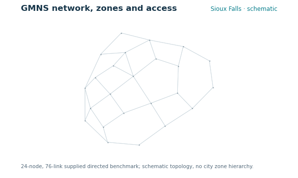</a>
<small>GMNS object-relation map · <a href="assets/homepage_evidence_r2/row_02_sioux_falls.png">Full preview</a> · <a href="https://github.com/scholarhaozheng/mobility-network-lab/blob/main/examples/sioux-falls/native_l3_r1/inputs_snapshot/SiouxFalls/link.csv">Source record</a> · <a href="cases/sioux-falls.html#gmns-zones-and-source-evidence">Detailed evidence</a></small></td><td>Hong Kongsaved 780 physical nodes, 1,239 links; 95 fine zones, ten parents and turn-aware access.

<small>GMNS object-relation map · <a href="assets/homepage_evidence_r2/row_02_hong_kong.png">Full preview</a> · <a href="https://github.com/scholarhaozheng/mobility-network-lab/blob/main/examples/hong-kong/gmns_pilot_r1/instance/link.csv">Source record</a> · <a href="datasets/hong-kong-gmns.html">Detailed evidence</a></small></td></tr>
<tr><th scope="row">Population, households and activity</th><td>Bostonsaved ACS 2024 five-year block groups allocated to 177 clipped H3 zones.

<small>three-panel zone small multiple · <a href="assets/homepage_evidence_r2/row_03_boston.png">Full preview</a> · <a href="https://github.com/scholarhaozheng/mobility-network-lab/blob/main/examples/boston/population_r1/data/population_or_household_by_zone.csv">Source record</a> · <a href="datasets/boston-population-households.html">Detailed evidence</a></small></td><td>Sioux Fallsoutside benchmark Supplied OD; no demographic city compiler.

<small>three-panel zone small multiple · <a href="assets/homepage_evidence_r2/row_03_sioux_falls.png">Full preview</a> · <a href="cases/sioux-falls.html#demand-transit-and-observations">Detailed evidence</a></small></td><td>Hong Kongsaved proxy 2021 census households/population and explicitly modeled building activity proxies.

<small>three-panel zone small multiple · <a href="assets/homepage_evidence_r2/row_03_hong_kong.png">Full preview</a> · <a href="assets/hong_kong/full_stack_r5/r2r4_baseline/phase_b/zone_activity_r2.csv">Source record</a> · <a href="cases/hong-kong-four-stage.html">Detailed evidence</a></small></td></tr>
</tbody></table>

<h3 id="b-transit-and-observation-evidence">B / Transit and observation evidence</h3>

<table class="home-coverage"><thead><tr><th>Component / output</th><th>Boston</th><th>Sioux Falls</th><th>Hong Kong</th></tr></thead><tbody>
<tr><th scope="row">Transit and pedestrian inputs</th><td>Bostonsaved input MBTA service and pedestrian access support the bounded demand/feedback example.

<small>transit/access overlay map · <a href="assets/homepage_evidence_r2/row_04_boston.png">Full preview</a> · <a href="https://github.com/scholarhaozheng/mobility-network-lab/blob/main/examples/boston/gmns_exchange_r1/data/transit_stop_route_relation.csv">Source record</a> · <a href="cases/boston.html#demand-transit-and-observations">Detailed evidence</a></small></td><td>Sioux Fallsoutside benchmark No GTFS or pedestrian city-input lane.

<small>transit/access overlay map · <a href="assets/homepage_evidence_r2/row_04_sioux_falls.png">Full preview</a> · <a href="cases/sioux-falls.html#demand-transit-and-observations">Detailed evidence</a></small></td><td>Hong Kongsaved input GTFS same-trip rides, fares, headways and pedestrian access enter generalized costs.

<small>transit/access overlay map · <a href="assets/homepage_evidence_r2/row_04_hong_kong.png">Full preview</a> · <a href="https://github.com/scholarhaozheng/mobility-network-lab/blob/main/examples/hong-kong/gmns_pilot_r1/instance/transit_stops.csv">Source record</a> · <a href="cases/hong-kong-four-stage.html">Detailed evidence</a></small></td></tr>
<tr><th scope="row">GPS, trajectory and detector evidence</th><td>Bostonexploratory linkage Exploratory map matching and service feedback; not held-out calibration.

<small>observation-to-network relation map · <a href="assets/homepage_evidence_r2/row_05_boston.png">Full preview</a> · <a href="https://github.com/scholarhaozheng/mobility-network-lab/blob/main/examples/boston/gmns_exchange_r1/figure_sample/gps_point_progress.csv">Source record</a> · <a href="datasets/boston-behavior-feedback.html">Detailed evidence</a></small></td><td>Sioux Fallsoutside benchmark No modern GPS or detector observations.

<small>observation-to-network relation map · <a href="assets/homepage_evidence_r2/row_05_sioux_falls.png">Full preview</a> · <a href="cases/sioux-falls.html#demand-transit-and-observations">Detailed evidence</a></small></td><td>Hong Kongcontext only Detector and private trajectory association; no held-out validation claim.

<small>observation-to-network relation map · <a href="assets/homepage_evidence_r2/row_05_hong_kong.png">Full preview</a> · <a href="https://github.com/scholarhaozheng/mobility-network-lab/blob/main/examples/hong-kong/gmns_pilot_r1/instance/detector_to_link.csv">Source record</a> · <a href="cases/hong-kong-four-stage.html">Detailed evidence</a></small></td></tr>
</tbody></table>

<h3 id="c-four-stage-travel-demand-workflow">C / Four-stage travel-demand workflow</h3>

<table class="home-coverage"><thead><tr><th>Component / output</th><th>Boston</th><th>Sioux Falls</th><th>Hong Kong</th></tr></thead><tbody>
<tr><th scope="row">01 / Trip generation — productions / attractions</th><td>Bostonsaved example Purpose-level productions and attractions in the bounded Boston example.

<small>two-panel zone map · <a href="assets/homepage_evidence_r2/row_06_boston.png">Full preview</a> · <a href="assets/boston/four_step_results_r1/data/hbw_midday_matrix.csv">Source record</a> · <a href="cases/boston.html#demand-transit-and-observations">Detailed evidence</a></small></td><td>Sioux Fallsoutside benchmark Vehicle OD supplied; no trip-generation run.

<small>two-panel zone map · <a href="assets/homepage_evidence_r2/row_06_sioux_falls.png">Full preview</a> · <a href="cases/sioux-falls.html#demand-transit-and-observations">Detailed evidence</a></small></td><td>Hong Kongengineering scenario Transferred rate and declared capture sensitivity, not local calibration.

<small>two-panel zone map · <a href="assets/homepage_evidence_r2/row_06_hong_kong.png">Full preview</a> · <a href="assets/hong_kong/full_stack_r5/r2r4_baseline/phase_b/production_attraction_r2.csv">Source record</a> · <a href="cases/hong-kong-four-stage.html">Detailed evidence</a></small></td></tr>
<tr><th scope="row">02 / Trip distribution — zonal OD demand</th><td>Bostonsaved example Zonal OD construction for the bounded semantic scenario.

<small>OD-matrix heatmap · <a href="assets/homepage_evidence_r2/row_07_boston.png">Full preview</a> · <a href="assets/boston/four_step_results_r1/data/hbw_midday_matrix.csv">Source record</a> · <a href="cases/boston.html#demand-transit-and-observations">Detailed evidence</a></small></td><td>Sioux Fallsoutside benchmark Supplied OD is input, not a modeled distribution stage.

<small>OD-matrix heatmap · <a href="assets/homepage_evidence_r2/row_07_sioux_falls.png">Full preview</a> · <a href="cases/sioux-falls.html#demand-transit-and-observations">Detailed evidence</a></small></td><td>Hong Kongengineering scenario Turn-aware gravity/IPF balances 8,930 reachable directed OD pairs.

<small>OD-matrix heatmap · <a href="assets/homepage_evidence_r2/row_07_hong_kong.png">Full preview</a> · <a href="assets/hong_kong/full_stack_r5/r2r4_baseline/phase_b/od_person_distribution_r2.csv">Source record</a> · <a href="cases/hong-kong-four-stage.html">Detailed evidence</a></small></td></tr>
<tr><th scope="row">03 / Mode choice — mode-specific demand</th><td>Bostonsaved sensitivity S1/S2 service response and conditional absolute choice remain separate.

<small>mode-share bar chart · <a href="assets/homepage_evidence_r2/row_08_boston.png">Full preview</a> · <a href="assets/boston/four_step_results_r1/data/selected_mode_response.csv">Source record</a> · <a href="cases/boston.html#demand-transit-and-observations">Detailed evidence</a></small></td><td>Sioux Fallsoutside benchmark Vehicle OD supplied; no mode-choice run.

<small>mode-share bar chart · <a href="assets/homepage_evidence_r2/row_08_sioux_falls.png">Full preview</a> · <a href="cases/sioux-falls.html#demand-transit-and-observations">Detailed evidence</a></small></td><td>Hong Kongengineering sensitivity GTFS/pedestrian generalized cost and declared sensitivity logit.

<small>mode-share bar chart · <a href="assets/homepage_evidence_r2/row_08_hong_kong.png">Full preview</a> · <a href="assets/hong_kong/full_stack_r5/r2r4_baseline/phase_b/mode_demand_by_od.csv">Source record</a> · <a href="cases/hong-kong-four-stage.html">Detailed evidence</a></small></td></tr>
<tr><th scope="row">04 / Traffic assignment — assigned network flows</th><td>Bostonsaved Static road flow from the bounded demand scenario; methods below.

<small>primary static physical-link flow map · <a href="assets/homepage_evidence_r2/row_09_boston.png">Full preview</a> · <a href="https://github.com/scholarhaozheng/mobility-network-lab/blob/main/examples/boston/scalable_tool_r1/runs/all/physical_link_flow.csv">Source record</a> · <a href="cases/boston.html#static-assignment">Detailed evidence</a></small></td><td>Sioux Fallsbenchmark Static network flow from supplied vehicle OD; no upstream four-stage compiler.

<small>primary static physical-link flow map · <a href="assets/homepage_evidence_r2/row_09_sioux_falls.png">Full preview</a> · <a href="https://github.com/scholarhaozheng/mobility-network-lab/blob/main/algorithms/origin_based_algorithm_b/accepted_results/sioux_physical_link_flow.csv">Source record</a> · <a href="cases/sioux-falls.html#static-assignment">Detailed evidence</a></small></td><td>Hong Kongengineering scenario Modeled one-hour static PCE road flow, not measured traffic.

<small>primary static physical-link flow map · <a href="assets/homepage_evidence_r2/row_09_hong_kong.png">Full preview</a> · <a href="assets/hong_kong/full_stack_r5/r2r4_baseline/phase_b/static_runs/full_algorithm_b/link_flow.csv">Source record</a> · <a href="cases/hong-kong-static-assignment.html">Detailed evidence</a></small></td></tr>
</tbody></table>

<h3 id="d1-static-assignment-bprbeckmann">D1 / Static assignment · BPR/Beckmann</h3>

<table class="home-coverage"><thead><tr><th>Component / output</th><th>Boston</th><th>Sioux Falls</th><th>Hong Kong</th></tr></thead><tbody>
<tr><th scope="row">Frank–Wolfe</th><td>Bostonsaved Expanded Boston FW, up to 17,522 loaded node ODs; separate from 26-OD controls.

<small>FW physical-link flow map · <a href="assets/homepage_evidence_r2/row_10_boston.png">Full preview</a> · <a href="https://github.com/scholarhaozheng/mobility-network-lab/blob/main/examples/boston/scalable_tool_r1/runs/all/physical_link_flow.csv">Source record</a> · <a href="cases/boston-assignment.html#primary-scale-result-versus-controlled-method-comparison">Detailed evidence</a></small></td><td>Sioux Fallssaved Classic 528-OD static FW; preview compares ID-matched link flows against Algorithm B.

<small>FW physical-link flow map · <a href="assets/homepage_evidence_r2/row_10_sioux_falls.png">Full preview</a> · <a href="assets/algorithm_b_r21/source_panels/sioux_fw_flow.svg">Source record</a> · <a href="datasets/sioux-static-fw.html">Detailed evidence</a></small></td><td>Hong Kongsaved Turn-aware one-hour 723.191 PCE static engineering scenario.

<small>FW physical-link flow map · <a href="assets/homepage_evidence_r2/row_10_hong_kong.png">Full preview</a> · <a href="assets/hong_kong/full_stack_r5/r2r4_baseline/figures/hk_static_fw_flow.png">Source record</a> · <a href="cases/hong-kong-static-assignment.html">Detailed evidence</a></small></td></tr>
<tr><th scope="row">Official tap-b Algorithm B</th><td>Bostontask-local adapter B0/B1 numerical transfer via task-local lossless TAPLab-compatible adapter.

<small>Algorithm B physical-link flow map · <a href="assets/homepage_evidence_r2/row_11_boston.png">Full preview</a> · <a href="https://github.com/scholarhaozheng/mobility-network-lab/blob/main/algorithms/origin_based_algorithm_b/accepted_results/boston_b1_physical_link_flow.csv">Source record</a> · <a href="cases/boston-algorithm-b.html">Detailed evidence</a></small></td><td>Sioux Fallsofficial adapter Official TAPLab registered-adapter parity passes on Sioux Falls.

<small>Algorithm B physical-link flow map · <a href="assets/homepage_evidence_r2/row_11_sioux_falls.png">Full preview</a> · <a href="https://github.com/scholarhaozheng/mobility-network-lab/blob/main/algorithms/origin_based_algorithm_b/accepted_results/sioux_physical_link_flow.csv">Source record</a> · <a href="cases/sioux-algorithm-b.html">Detailed evidence</a></small></td><td>Hong Kongtask-local adapter Accepted task-local lossless adapter; not official-adapter parity.

<small>Algorithm B physical-link flow map · <a href="assets/homepage_evidence_r2/row_11_hong_kong.png">Full preview</a> · <a href="assets/hong_kong/full_stack_r5/r2r4_baseline/phase_b/static_runs/full_algorithm_b/link_flow.csv">Source record</a> · <a href="cases/hong-kong-static-assignment.html">Detailed evidence</a></small></td></tr>
<tr><th scope="row">Finite-path reference</th><td>Bostonsaved control 26 OD, 130-path uncompressed SLSQP reference on ABS_PLANNED.

<small>finite-path reconstruction panel · <a href="assets/homepage_evidence_r2/row_12_boston.png">Full preview</a> · <a href="https://github.com/scholarhaozheng/mobility-network-lab/blob/main/examples/boston/assignment_methods_r1/reference/link_flow.csv">Source record</a> · <a href="cases/boston-assignment.html#same-instance-saved-result">Detailed evidence</a></small></td><td>Sioux Fallssaved path representation Frozen 2,218-path static representation; numerical profile is not city demand.

<small>finite-path reconstruction panel · <a href="assets/homepage_evidence_r2/row_12_sioux_falls.png">Full preview</a> · <a href="https://github.com/scholarhaozheng/mobility-network-lab/blob/main/examples/sioux-falls/native_l3_r1/runs/SiouxFalls/B_BECKMANN/outer_04_link_flows.csv">Source record</a> · <a href="cases/sioux-falls.html#static-assignment">Detailed evidence</a></small></td><td>Hong Kongnot demonstrated No accepted finite-path static reference in this case.

<small>finite-path reconstruction panel · <a href="assets/homepage_evidence_r2/row_12_hong_kong.png">Full preview</a> · <a href="cases/hong-kong-static-assignment.html">Detailed evidence</a></small></td></tr>
<tr><th scope="row">Native Diagnostic L3 / compression</th><td>Bostonsaved control Rank-26/52 native controls on the same 26-OD ABS_PLANNED instance.

<small>L3 reconstruction/difference panel · <a href="assets/homepage_evidence_r2/row_13_boston.png">Full preview</a> · <a href="https://github.com/scholarhaozheng/mobility-network-lab/blob/main/examples/boston/assignment_methods_r1/runs/rank26/outer_02_link_flows.csv">Source record</a> · <a href="cases/boston-assignment.html#controlled-comparison-board">Detailed evidence</a></small></td><td>Sioux Fallssaved numerical candidates Rank-50 classic static benchmark candidates, not an empirical speedup.

<small>L3 reconstruction/difference panel · <a href="assets/homepage_evidence_r2/row_13_sioux_falls.png">Full preview</a> · <a href="https://github.com/scholarhaozheng/mobility-network-lab/blob/main/examples/sioux-falls/native_l3_r1/runs/SiouxFalls/A_REG001/outer_04_link_flows.csv">Source record</a> · <a href="cases/sioux-falls.html#static-assignment">Detailed evidence</a></small></td><td>Hong Kongnot demonstrated No accepted native L3 result in this case.

<small>L3 reconstruction/difference panel · <a href="assets/homepage_evidence_r2/row_13_hong_kong.png">Full preview</a> · <a href="cases/hong-kong-static-assignment.html">Detailed evidence</a></small></td></tr>
</tbody></table>

<h3 id="d2-finite-time-expanded-fixed-cost-hard-capacity">D2 / Finite time-expanded · fixed cost, hard capacity</h3>

<table class="home-coverage"><thead><tr><th>Component / output</th><th>Boston</th><th>Sioux Falls</th><th>Hong Kong</th></tr></thead><tbody>
<tr><th scope="row">Network construction and generated columns</th><td>Bostonsaved 90-node/125-link/10-OD finite graph; saved time-indexed column.

<small>layered physical-to-time graph preview · <a href="assets/homepage_evidence_r2/row_14_boston.png">Full preview</a> · <a href="assets/three_city_r2/data/boston_construction_edges.csv">Source record</a> · <a href="cases/boston-space-time.html#from-the-physical-network-to-the-finite-time-expanded-graph">Detailed evidence</a></small></td><td>Sioux Fallssaved Selected 200/250-OD finite graphs; saved time-indexed columns.

<small>layered physical-to-time graph preview · <a href="assets/homepage_evidence_r2/row_14_sioux_falls.png">Full preview</a> · <a href="assets/three_city_r2/data/sioux_construction_edges.csv">Source record</a> · <a href="cases/sioux-space-time.html#from-the-physical-network-to-the-finite-time-expanded-graph">Detailed evidence</a></small></td><td>Hong Kongsaved HK10 Approved model-generated HK10 excerpt in the 100-node/111-link/10-OD graph.

<small>layered physical-to-time graph preview · <a href="assets/homepage_evidence_r2/row_14_hong_kong.png">Full preview</a> · <a href="assets/three_city_r2/data/hong_kong_construction_edges.csv">Source record</a> · <a href="cases/hong-kong-space-time.html#a-generated-column-as-a-time-indexed-path">Detailed evidence</a></small></td></tr>
<tr><th scope="row">Arc-flow LP reference</th><td>Bostonsaved Own-graph LP reference for the bounded ten-OD fixed-cost instance.

<small>same-graph LP reference result panel · <a href="assets/homepage_evidence_r2/row_15_boston.png">Full preview</a> · <a href="assets/boston/space_time_cg_r4/data/validation_summary.json">Source record</a> · <a href="cases/boston-space-time.html#reference-objective-agreement">Detailed evidence</a></small></td><td>Sioux Fallssaved Own selected-graph LP references for historical 200/250 ODs.

<small>same-graph LP reference result panel · <a href="assets/homepage_evidence_r2/row_15_sioux_falls.png">Full preview</a> · <a href="assets/sioux/phase_i_r1/data/200_phase_ii_trace.csv">Source record</a> · <a href="cases/sioux-space-time.html#reference-objective-agreement">Detailed evidence</a></small></td><td>Hong Kongsaved Own-graph LP reference for R5 ten-OD finite case.

<small>same-graph LP reference result panel · <a href="assets/homepage_evidence_r2/row_15_hong_kong.png">Full preview</a> · <a href="assets/hong_kong/full_stack_r5/cg_run/full_cg_v1_phase_ii_objective_trace.csv">Source record</a> · <a href="cases/hong-kong-space-time.html#reference-objective-agreement">Detailed evidence</a></small></td></tr>
<tr><th scope="row">Two-phase column generation</th><td>Bostonaccepted Phase I/II and independent 10/10 pricing closure.

<small>Phase I / Phase II / final-check triptych · <a href="assets/homepage_evidence_r2/row_16_boston.png">Full preview</a> · <a href="assets/boston/space_time_cg_r4/data/phase_i_total.csv">Source record</a> · <a href="cases/boston-space-time.html#phase-i-restores-feasibility">Detailed evidence</a></small></td><td>Sioux Fallsaccepted historical 200/250-OD own-LP agreement; independent full-DAG closure not established.

<small>Phase I / Phase II / final-check triptych · <a href="assets/homepage_evidence_r2/row_16_sioux_falls.png">Full preview</a> · <a href="assets/sioux/phase_i_r1/data/200_phase_i_trace.csv">Source record</a> · <a href="cases/sioux-space-time.html#phase-i-restores-feasibility">Detailed evidence</a></small></td><td>Hong Kongaccepted R5 Phase I/II, same-graph LP agreement and independent 10/10 closure.

<small>Phase I / Phase II / final-check triptych · <a href="assets/homepage_evidence_r2/row_16_hong_kong.png">Full preview</a> · <a href="assets/hong_kong/full_stack_r5/cg_run/full_cg_v1_phase_i_artificial_flow_trace.csv">Source record</a> · <a href="cases/hong-kong-space-time.html#phase-i-restores-feasibility">Detailed evidence</a></small></td></tr>
<tr><th scope="row">Lagrangian</th><td>Bostongated Feasible primal, but frozen 1% gap gate missed (1.1002%).

<small>dual/primal/gap summary · <a href="assets/homepage_evidence_r2/row_17_boston.png">Full preview</a> · <a href="cases/boston.html">Source record</a> · <a href="cases/boston.html#finite-time-expanded-algorithms">Detailed evidence</a></small></td><td>Sioux Fallsaccepted R2 Selected 200/250-OD feasible recovery and certified bounded gaps.

<small>dual/primal/gap summary · <a href="assets/homepage_evidence_r2/row_17_sioux_falls.png">Full preview</a> · <a href="methods/distributed-assignment.html">Source record</a> · <a href="methods/distributed-assignment.html">Detailed evidence</a></small></td><td>Hong Kongaccepted bounded Ten-OD feasible recovery with 0.7444% certified gap.

<small>dual/primal/gap summary · <a href="assets/homepage_evidence_r2/row_17_hong_kong.png">Full preview</a> · <a href="assets/hong_kong/full_stack_r5/r2r4_baseline/phase_c/lagrangian_run/history.csv">Source record</a> · <a href="cases/hong-kong-space-time.html">Detailed evidence</a></small></td></tr>
<tr><th scope="row">ADMM</th><td>Bostonaccepted R2_S Ten-OD original-space checks; own-LP gap 6.68e-6.

<small>residual/objective/flow summary · <a href="assets/homepage_evidence_r2/row_18_boston.png">Full preview</a> · <a href="assets/admm_r2/figures/admm_boston_10od_case_sequence.png">Source record</a> · <a href="cases/boston-admm.html">Detailed evidence</a></small></td><td>Sioux Fallsaccepted R2_S Selected 200/250-OD original-space checks; not the full static 528 ODs.

<small>residual/objective/flow summary · <a href="assets/homepage_evidence_r2/row_18_sioux_falls.png">Full preview</a> · <a href="assets/admm_r2/figures/admm_sioux_200_case_sequence.png">Source record</a> · <a href="cases/sioux-admm.html">Detailed evidence</a></small></td><td>Hong Konggated Frozen transfer diagnostic; no accepted Hong Kong ADMM objective.

<small>residual/objective/flow summary · <a href="assets/homepage_evidence_r2/row_18_hong_kong.png">Full preview</a> · <a href="assets/hong_kong/full_stack_r5/r2r4_baseline/phase_c/admm_run/result.json">Source record</a> · <a href="cases/hong-kong-space-time.html">Detailed evidence</a></small></td></tr>
</tbody></table>

<h3 id="e-reusable-outputs-and-tools">E / Reusable outputs and tools</h3>

<table class="home-coverage"><thead><tr><th>Component / output</th><th>Boston</th><th>Sioux Falls</th><th>Hong Kong</th></tr></thead><tbody>
<tr><th scope="row">Query, tracing, exports and saved checks</th><td>Bostonsaved outputs GMNS record lookup and saved-example SQLite query/export workflow.
<a href="https://github.com/scholarhaozheng/mobility-network-lab/blob/main/examples/boston/SAVED_EXAMPLE.md">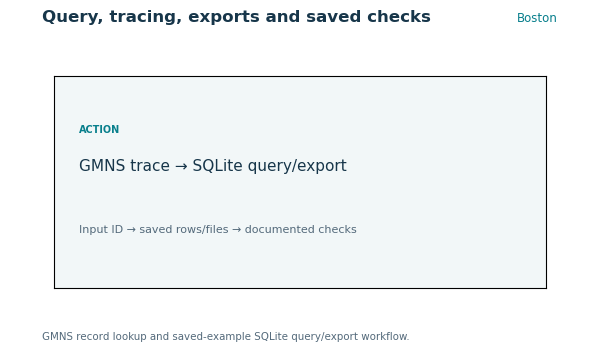</a>
<small>standard query/export result card · <a href="assets/homepage_evidence_r2/row_19_boston.png">Full preview</a> · <a href="https://github.com/scholarhaozheng/mobility-network-lab/blob/main/examples/boston/SAVED_EXAMPLE.md">Source record</a> · <a href="https://github.com/scholarhaozheng/mobility-network-lab/blob/main/examples/boston/SAVED_EXAMPLE.md">Detailed evidence</a></small></td><td>Sioux Fallssaved checks Frozen link/OD identity, native profiles and finite-case verification records.
<a href="https://github.com/scholarhaozheng/mobility-network-lab/blob/main/examples/sioux-falls/native_l3_r1/README.md">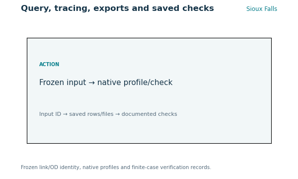</a>
<small>standard query/export result card · <a href="assets/homepage_evidence_r2/row_19_sioux_falls.png">Full preview</a> · <a href="https://github.com/scholarhaozheng/mobility-network-lab/blob/main/examples/sioux-falls/native_l3_r1/README.md">Source record</a> · <a href="https://github.com/scholarhaozheng/mobility-network-lab/blob/main/examples/sioux-falls/native_l3_r1/README.md">Detailed evidence</a></small></td><td>Hong Kongsaved outputs Source/turn ledgers, staged CSV exports and independently checked finite results.
<a href="cases/hong-kong.html#reproduction">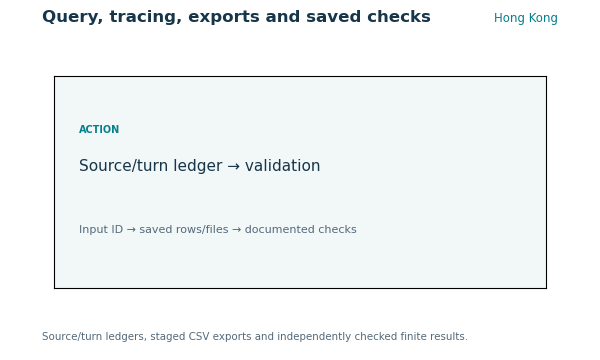</a>
<small>standard query/export result card · <a href="assets/homepage_evidence_r2/row_19_hong_kong.png">Full preview</a> · <a href="cases/hong-kong.html">Source record</a> · <a href="cases/hong-kong.html#reproduction">Detailed evidence</a></small></td></tr>
</tbody></table>

The <a href="methods/space-time-cg.html#cg-experiments">cross-case CG evidence</a>, <a href="methods/admm-space-time.html">ADMM</a>, <a href="methods/origin-based-algorithm-b.html">official tap-b Algorithm B method</a> and <a href="integrations/taplab-tapb.html">adapter distinction</a>, and <a href="methods/distributed-assignment.html">Lagrangian records</a> retain their full figure families. Boston and Hong Kong have independent 10/10 pricing closure on <strong>different</strong> ten-demand graphs; this is not imputed to the historical Sioux runs.

<h2 id="04-explore-the-three-cases">04 / Explore the three cases</h2>

Each city has a complete stage atlas. The same stage order is used throughout; different data, static and finite instance scales are never combined into a single case size. Covers are navigation assets, not scientific validation.

<article class="case-atlas" data-city="boston">
<h3 id="boston-1">Boston</h3>

City GMNS, population/demand, MBTA/GPS linkage and separate bounded static and finite computations. <a href="cases/boston.html">Open complete case →</a>

<dl class="atlas-facts">

<dt>City/model foundation</dt><dd>2,852 physical nodes; 5,091 directed links; 177 H3 fine zones</dd>

<dt>Static assignment</dt><dd>B1: 453 ODs / 1,936.238475 PCE in 2 h; expanded FW and 26-OD controls are distinct</dd>

<dt>Finite time-expanded</dt><dd>90 nodes; 125 links; 10 ODs</dd>

<dt>Observation/data scope</dt><dd>MBTA inputs and exploratory GPS matching; no held-out citywide calibration</dd>

</dl>
<nav aria-label="Boston stages" class="atlas-nav"><a href="#boston-sources">Sources and GMNS</a> <a href="#boston-population">Population, households and activity</a> <a href="#boston-transit">Transit and observations</a> <a href="#boston-generation">Trip generation</a> <a href="#boston-distribution">Trip distribution</a> <a href="#boston-mode">Mode choice</a> <a href="#boston-static">Static assignment methods</a> <a href="#boston-finite">Finite time-expanded computation</a> <a href="#boston-tools">Tools and reproducibility</a></nav>
<section class="atlas-stage" id="boston-sources"><h4 id="sources-and-gmns">Sources and GMNS</h4>

<figure class="atlas-card"><figcaption><strong>Source data and preparation</strong> Source data and preparation · saved <a href="cases/boston.html#gmns-zones-and-source-evidence">Evidence</a> · <a href="assets/homepage_evidence_r2/row_01_boston.png">Full figure</a></figcaption></figure>
<figure class="atlas-card"><figcaption><strong>GMNS network, zones and access</strong> GMNS network, zones and access · saved <a href="cases/boston.html#gmns-zones-and-source-evidence">Evidence</a> · <a href="assets/homepage_evidence_r2/row_02_boston.png">Full figure</a></figcaption></figure>
<figure class="atlas-card"><figcaption><strong>Special zones and access</strong> GMNS · Central Boston <a href="cases/boston.html#gmns-zones-and-source-evidence">Evidence</a> · <a href="assets/boston/visual_release_r1/boston_network_zones.png">Full figure</a></figcaption></figure>

</section>
<section class="atlas-stage" id="boston-population"><h4 id="population-households-and-activity">Population, households and activity</h4>

<figure class="atlas-card"><figcaption><strong>Population, households and activity</strong> Population, households and activity · saved <a href="datasets/boston-population-households.html">Evidence</a> · <a href="assets/homepage_evidence_r2/row_03_boston.png">Full figure</a></figcaption></figure>
<figure class="atlas-card"><figcaption><strong>ACS/H3 allocation</strong> Population · ACS 2024 five-year <a href="datasets/boston-population-households.html">Evidence</a> · <a href="assets/boston/population_r1/population_allocation.png">Full figure</a></figcaption></figure>

</section>
<section class="atlas-stage" id="boston-transit"><h4 id="transit-and-observations">Transit and observations</h4>

<figure class="atlas-card"><figcaption><strong>Transit and pedestrian inputs</strong> Transit and pedestrian inputs · saved input <a href="cases/boston.html#demand-transit-and-observations">Evidence</a> · <a href="assets/homepage_evidence_r2/row_04_boston.png">Full figure</a></figcaption></figure>
<figure class="atlas-card"><figcaption><strong>GPS, trajectory and detector evidence</strong> GPS, trajectory and detector evidence · exploratory linkage <a href="datasets/boston-behavior-feedback.html">Evidence</a> · <a href="assets/homepage_evidence_r2/row_05_boston.png">Full figure</a></figcaption></figure>
<figure class="atlas-card"><figcaption><strong>GPS-to-GMNS association</strong> GPS linkage · exploratory <a href="datasets/boston-behavior-feedback.html">Evidence</a> · <a href="assets/boston/visual_release_r1/boston_gps_projection.png">Full figure</a></figcaption></figure>

</section>
<section class="atlas-stage" id="boston-generation"><h4 id="trip-generation">Trip generation</h4>

<figure class="atlas-card"><figcaption><strong>Trip generation — productions / attractions</strong> Trip generation — productions / attractions · saved example <a href="cases/boston.html#demand-transit-and-observations">Evidence</a> · <a href="assets/homepage_evidence_r2/row_06_boston.png">Full figure</a></figcaption></figure>
<figure class="atlas-card"><figcaption><strong>Generation by purpose</strong> Trip generation · bounded example <a href="cases/boston.html#stage-01-trip-generation">Evidence</a> · <a href="assets/boston/four_step_results_r1/step1_generation.png">Full figure</a></figcaption></figure>

</section>
<section class="atlas-stage" id="boston-distribution"><h4 id="trip-distribution">Trip distribution</h4>

<figure class="atlas-card"><figcaption><strong>Trip distribution — zonal OD demand</strong> Trip distribution — zonal OD demand · saved example <a href="cases/boston.html#demand-transit-and-observations">Evidence</a> · <a href="assets/homepage_evidence_r2/row_07_boston.png">Full figure</a></figcaption></figure>
<figure class="atlas-card"><figcaption><strong>HBW OD distribution</strong> Trip distribution · bounded example <a href="cases/boston.html#stage-02-trip-distribution">Evidence</a> · <a href="assets/boston/four_step_results_r1/step2_distribution.png">Full figure</a></figcaption></figure>

</section>
<section class="atlas-stage" id="boston-mode"><h4 id="mode-choice">Mode choice</h4>

<figure class="atlas-card"><figcaption><strong>Mode choice — mode-specific demand</strong> Mode choice — mode-specific demand · saved sensitivity <a href="cases/boston.html#demand-transit-and-observations">Evidence</a> · <a href="assets/homepage_evidence_r2/row_08_boston.png">Full figure</a></figcaption></figure>
<figure class="atlas-card"><figcaption><strong>Service-response mode choice</strong> Mode choice · S1/S2 sensitivity <a href="cases/boston.html#stage-03-mode-choice">Evidence</a> · <a href="assets/boston/four_step_results_r1/step3_mode_response.png">Full figure</a></figcaption></figure>

</section>
<section class="atlas-stage" id="boston-static"><h4 id="static-assignment-methods">Static assignment methods</h4>

<figure class="atlas-card"><figcaption><strong>Frank–Wolfe</strong> Frank–Wolfe · saved <a href="cases/boston-assignment.html#primary-scale-result-versus-controlled-method-comparison">Evidence</a> · <a href="assets/homepage_evidence_r2/row_10_boston.png">Full figure</a></figcaption></figure>
<figure class="atlas-card"><figcaption><strong>Official tap-b Algorithm B</strong> Official tap-b Algorithm B · task-local adapter <a href="cases/boston-algorithm-b.html">Evidence</a> · <a href="assets/homepage_evidence_r2/row_11_boston.png">Full figure</a></figcaption></figure>
<figure class="atlas-card"><figcaption><strong>Finite-path reference</strong> Finite-path reference · saved control <a href="cases/boston-assignment.html#same-instance-saved-result">Evidence</a> · <a href="assets/homepage_evidence_r2/row_12_boston.png">Full figure</a></figcaption></figure>
<figure class="atlas-card"><figcaption><strong>Native Diagnostic L3 / compression</strong> Native Diagnostic L3 / compression · saved control <a href="cases/boston-assignment.html#controlled-comparison-board">Evidence</a> · <a href="assets/homepage_evidence_r2/row_13_boston.png">Full figure</a></figcaption></figure>
<figure class="atlas-card"><a href="cases/boston-assignment.html#primary-scale-result-versus-controlled-method-comparison">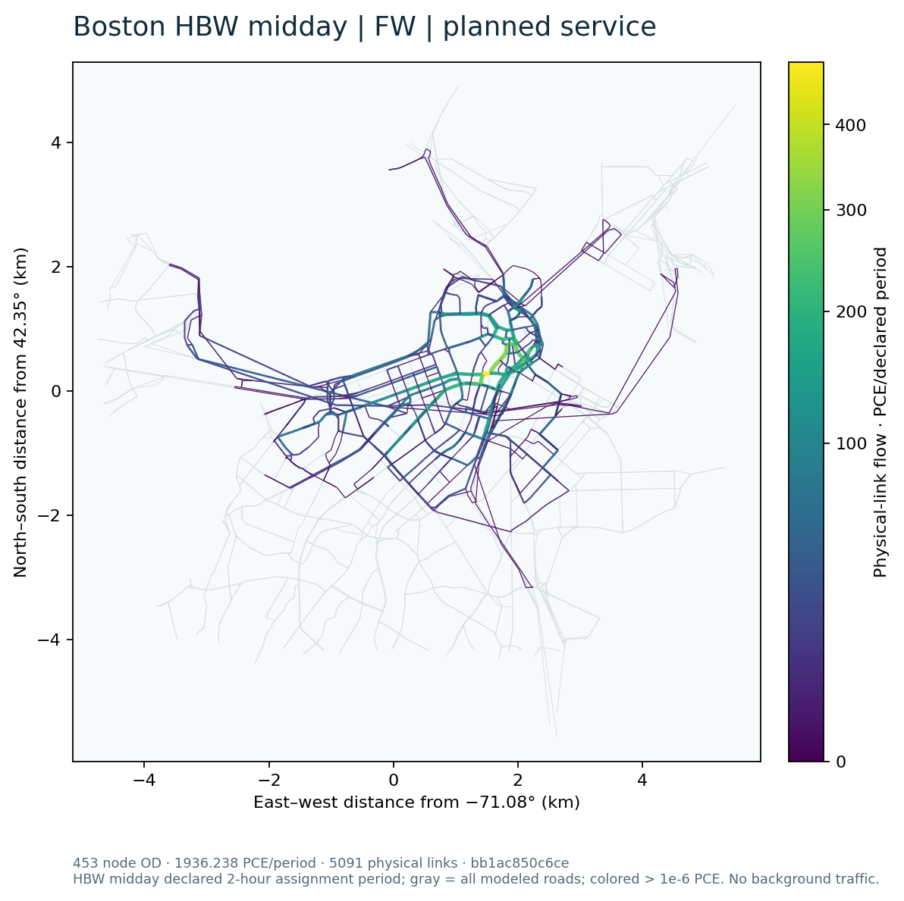</a><figcaption><strong>FW 500-OD tier</strong> FW · 500-OD tier <a href="cases/boston-assignment.html#primary-scale-result-versus-controlled-method-comparison">Evidence</a> · <a href="assets/boston/scalable_tool_r1/fw_500_flow.png">Full figure</a></figcaption></figure>
<figure class="atlas-card"><a href="cases/boston-assignment.html#primary-scale-result-versus-controlled-method-comparison">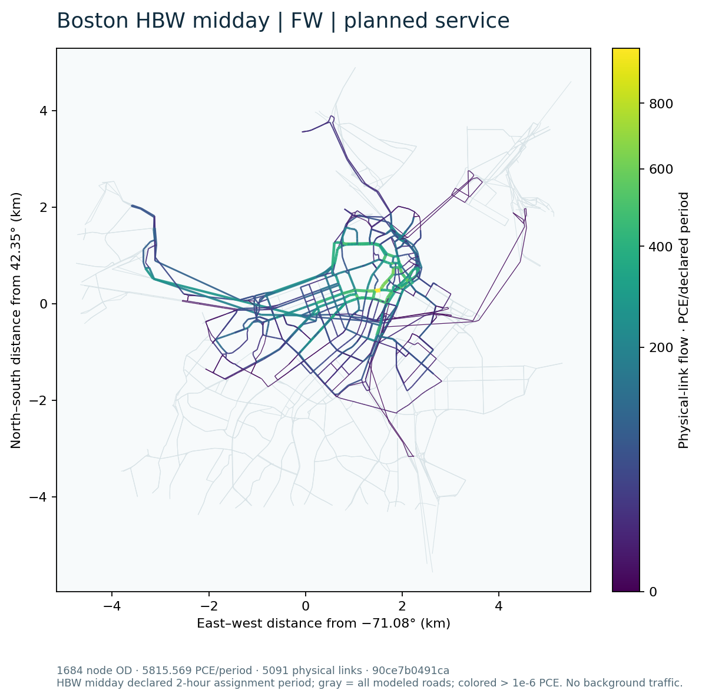</a><figcaption><strong>FW 2,000-OD tier</strong> FW · 2,000-OD tier <a href="cases/boston-assignment.html#primary-scale-result-versus-controlled-method-comparison">Evidence</a> · <a href="assets/boston/scalable_tool_r1/fw_2000_flow.png">Full figure</a></figcaption></figure>
<figure class="atlas-card"><figcaption><strong>FW expanded tier</strong> FW · 17,522 loaded ODs <a href="cases/boston-assignment.html#primary-scale-result-versus-controlled-method-comparison">Evidence</a> · <a href="assets/boston/scalable_tool_r1/fw_all_flow.png">Full figure</a></figcaption></figure>
<figure class="atlas-card"><a href="cases/boston-algorithm-b.html#4-physical-link-comparison-with-same-problem-fw">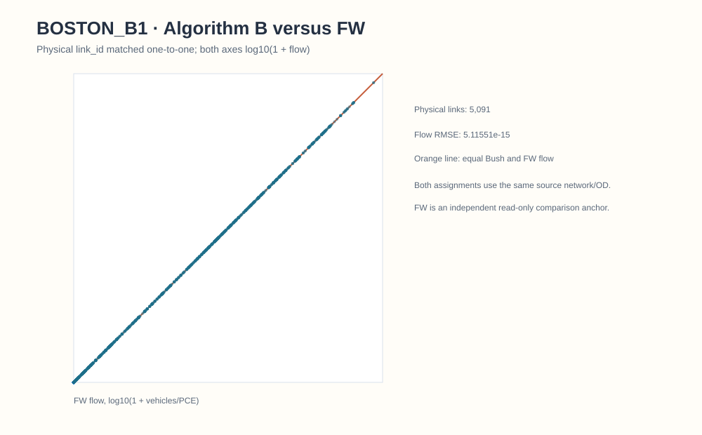</a><figcaption><strong>Task-local Algorithm B B1</strong> Algorithm B · B1 453-OD; accepted <a href="cases/boston-algorithm-b.html#4-physical-link-comparison-with-same-problem-fw">Evidence</a> · <a href="assets/algorithm_b_r21/source_panels/boston_b1_fw_flow.svg">Full figure</a></figcaption></figure>
<figure class="atlas-card"><a href="cases/boston-assignment.html#same-instance-saved-result">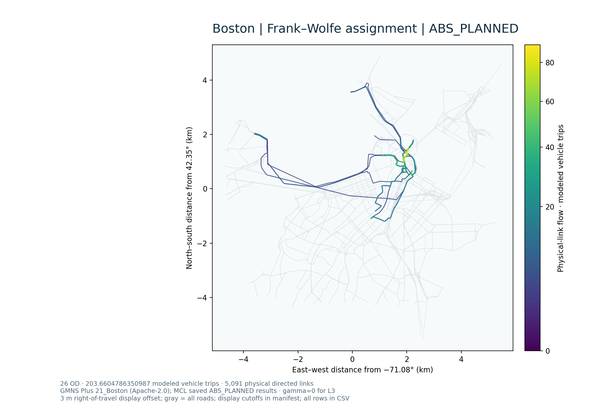</a><figcaption><strong>Finite-path 130-path control</strong> Finite-path · ABS_PLANNED 26-OD <a href="cases/boston-assignment.html#same-instance-saved-result">Evidence</a> · <a href="assets/boston/assignment_methods_r1/boston_abs_planned_fw_flow.png">Full figure</a></figcaption></figure>
<figure class="atlas-card"><figcaption><strong>Native L3 rank 26 difference</strong> L3 · rank 26; numerical candidate <a href="cases/boston-assignment.html#signed-native-minus-fw-differences">Evidence</a> · <a href="assets/boston/assignment_methods_r1/boston_abs_planned_l3_rank26_minus_fw.png">Full figure</a></figcaption></figure>
<figure class="atlas-card"><a href="cases/boston-assignment.html#signed-native-minus-fw-differences">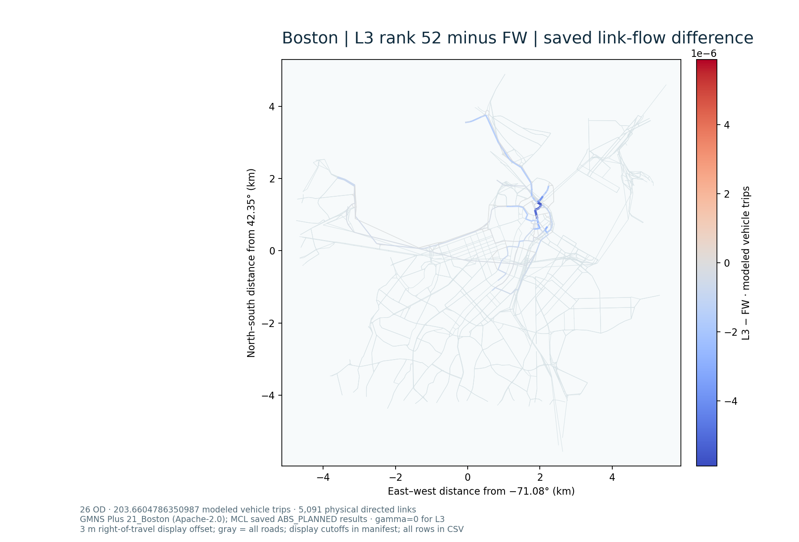</a><figcaption><strong>Native L3 rank 52 difference</strong> L3 · rank 52; numerical candidate <a href="cases/boston-assignment.html#signed-native-minus-fw-differences">Evidence</a> · <a href="assets/boston/assignment_methods_r1/boston_abs_planned_l3_rank52_minus_fw.png">Full figure</a></figcaption></figure>

</section>
<section class="atlas-stage" id="boston-finite"><h4 id="finite-time-expanded-computation">Finite time-expanded computation</h4>

<figure class="atlas-card"><figcaption><strong>Network construction and generated columns</strong> Network construction and generated columns · saved <a href="cases/boston-space-time.html#from-the-physical-network-to-the-finite-time-expanded-graph">Evidence</a> · <a href="assets/homepage_evidence_r2/row_14_boston.png">Full figure</a></figcaption></figure>
<figure class="atlas-card"><figcaption><strong>Arc-flow LP reference</strong> Arc-flow LP reference · saved <a href="cases/boston-space-time.html#reference-objective-agreement">Evidence</a> · <a href="assets/homepage_evidence_r2/row_15_boston.png">Full figure</a></figcaption></figure>
<figure class="atlas-card"><figcaption><strong>Two-phase column generation</strong> Two-phase column generation · accepted <a href="cases/boston-space-time.html#phase-i-restores-feasibility">Evidence</a> · <a href="assets/homepage_evidence_r2/row_16_boston.png">Full figure</a></figcaption></figure>
<figure class="atlas-card"><figcaption><strong>Lagrangian</strong> Lagrangian · gated <a href="cases/boston.html#finite-time-expanded-algorithms">Evidence</a> · <a href="assets/homepage_evidence_r2/row_17_boston.png">Full figure</a></figcaption></figure>
<figure class="atlas-card"><figcaption><strong>ADMM</strong> ADMM · accepted R2_S <a href="cases/boston-admm.html">Evidence</a> · <a href="assets/homepage_evidence_r2/row_18_boston.png">Full figure</a></figcaption></figure>
<figure class="atlas-card"><figcaption><strong>Case-sequence overview</strong> CG · 10-OD <a href="cases/boston-space-time.html#case-role-scope-and-model-statistics">Evidence</a> · <a href="assets/presentation_r5/boston_cg_case_sequence.png">Full figure</a></figcaption></figure>
<figure class="atlas-card"><figcaption><strong>Physical to time-expanded graph</strong> CG construction · 10-OD <a href="cases/boston-space-time.html#from-the-physical-network-to-the-finite-time-expanded-graph">Evidence</a> · <a href="assets/cg_layered_companions_r1/boston_layered_space_time_construction.png">Full figure</a></figcaption></figure>
<figure class="atlas-card"><figcaption><strong>Generated time-indexed column</strong> CG column · 10-OD <a href="cases/boston-space-time.html#a-generated-column-as-a-time-indexed-path">Evidence</a> · <a href="assets/three_city_r2/boston_generated_column_time_indexed_path.png">Full figure</a></figcaption></figure>
<figure class="atlas-card"><figcaption><strong>Phase I artificial-flow clearance</strong> CG Phase I · 10-OD <a href="cases/boston-space-time.html#phase-i-restores-feasibility">Evidence</a> · <a href="assets/boston/space_time_cg_r4/boston_phase_i_artificial_flow.png">Full figure</a></figcaption></figure>
<figure class="atlas-card"><figcaption><strong>Shared-capacity event</strong> CG capacity · 10-OD <a href="cases/boston-space-time.html#shared-capacity-couples-different-od-demands">Evidence</a> · <a href="assets/boston/space_time_cg_r4/boston_shared_capacity_event.png">Full figure</a></figcaption></figure>
<figure class="atlas-card"><figcaption><strong>Phase II objective</strong> CG Phase II · 10-OD <a href="cases/boston-space-time.html#phase-ii-improves-the-real-path-objective">Evidence</a> · <a href="assets/boston/space_time_cg_r4/boston_phase_ii_objective.png">Full figure</a></figcaption></figure>
<figure class="atlas-card"><figcaption><strong>Final physical-link movement flow</strong> CG flow · 10-OD <a href="cases/boston-space-time.html#from-time-expanded-flows-back-to-final-physical-link-movement-flow">Evidence</a> · <a href="assets/boston/space_time_cg_r4/boston_cg_final_physical_link_flow.png">Full figure</a></figcaption></figure>
<figure class="atlas-card"><figcaption><strong>Independent pricing closure</strong> CG pricing · 10/10 <a href="cases/boston-space-time.html#independent-pricing-closure">Evidence</a> · <a href="assets/boston/space_time_cg_r4/boston_pricing_closure_by_demand.png">Full figure</a></figcaption></figure>
<figure class="atlas-card"><figcaption><strong>ADMM convergence</strong> ADMM · R2_S 10-OD accepted <a href="cases/boston-admm.html#original-saved-convergence-view">Evidence</a> · <a href="assets/admm_r2/figures/convergence_Boston_10OD.png">Full figure</a></figcaption></figure>
<figure class="atlas-card"><figcaption><strong>ADMM physical flow and LP difference</strong> ADMM · R2_S 10-OD accepted <a href="cases/boston-admm.html#physical-link-movement-flow-and-lp-comparison">Evidence</a> · <a href="assets/admm_r2/figures/admm_boston_10od_minus_lp.png">Full figure</a></figcaption></figure>

</section>
<section class="atlas-stage" id="boston-tools"><h4 id="tools-and-reproducibility">Tools and reproducibility</h4>

<figure class="atlas-card"><figcaption><strong>Query, tracing, exports and saved checks</strong> Query, tracing, exports and saved checks · saved outputs <a href="https://github.com/scholarhaozheng/mobility-network-lab/blob/main/examples/boston/SAVED_EXAMPLE.md">Evidence</a> · <a href="assets/homepage_evidence_r2/row_19_boston.png">Full figure</a></figcaption></figure>

</section>
</article>

<article class="case-atlas" data-city="sioux-falls">
<h3 id="sioux-falls-1">Sioux Falls</h3>

Supplied-OD controlled static benchmark and separate historical selected-OD finite cases; not a four-stage city compiler. <a href="cases/sioux-falls.html">Open complete case →</a>

<dl class="atlas-facts">

<dt>City/model foundation</dt><dd>24 nodes; 76 directed links; supplied benchmark OD</dd>

<dt>Static assignment</dt><dd>528 positive OD records; official Algorithm B, historical FW and native controls</dd>

<dt>Finite time-expanded</dt><dd>24 nodes; 64/69 selected links; 200/250 ODs</dd>

<dt>Observation/data scope</dt><dd>No modern city population, GTFS, GPS or detector stage</dd>

</dl>
<nav aria-label="Sioux Falls stages" class="atlas-nav"><a href="#sioux-falls-sources">Sources and GMNS</a> <a href="#sioux-falls-population">Population, households and activity</a> <a href="#sioux-falls-transit">Transit and observations</a> <a href="#sioux-falls-generation">Trip generation</a> <a href="#sioux-falls-distribution">Trip distribution</a> <a href="#sioux-falls-mode">Mode choice</a> <a href="#sioux-falls-static">Static assignment methods</a> <a href="#sioux-falls-finite">Finite time-expanded computation</a> <a href="#sioux-falls-tools">Tools and reproducibility</a></nav>
<section class="atlas-stage" id="sioux-falls-sources"><h4 id="sources-and-gmns-1">Sources and GMNS</h4>

<figure class="atlas-card"><figcaption><strong>Source data and preparation</strong> Source data and preparation · saved <a href="cases/sioux-falls.html#gmns-zones-and-source-evidence">Evidence</a> · <a href="assets/homepage_evidence_r2/row_01_sioux_falls.png">Full figure</a></figcaption></figure>
<figure class="atlas-card"><figcaption><strong>GMNS network, zones and access</strong> GMNS network, zones and access · saved <a href="cases/sioux-falls.html#gmns-zones-and-source-evidence">Evidence</a> · <a href="assets/homepage_evidence_r2/row_02_sioux_falls.png">Full figure</a></figcaption></figure>
<figure class="atlas-card"><figcaption><strong>Classic network topology</strong> Network · 24-node / 76-link <a href="cases/sioux-falls.html#gmns-zones-and-source-evidence">Evidence</a> · <a href="assets/homepage_evidence_r1/sioux_falls_classic_topology.png">Full figure</a></figcaption></figure>

</section>
<section class="atlas-stage" id="sioux-falls-population"><h4 id="population-households-and-activity-1">Population, households and activity</h4>

Outside the supplied Sioux Falls benchmark; no city-data stage was executed.

</section>
<section class="atlas-stage" id="sioux-falls-transit"><h4 id="transit-and-observations-1">Transit and observations</h4>

Outside the supplied Sioux Falls benchmark; no city-data stage was executed.

</section>
<section class="atlas-stage" id="sioux-falls-generation"><h4 id="trip-generation-1">Trip generation</h4>

Outside the supplied Sioux Falls benchmark; no city-data stage was executed.

</section>
<section class="atlas-stage" id="sioux-falls-distribution"><h4 id="trip-distribution-1">Trip distribution</h4>

Outside the supplied Sioux Falls benchmark; no city-data stage was executed.

</section>
<section class="atlas-stage" id="sioux-falls-mode"><h4 id="mode-choice-1">Mode choice</h4>

Outside the supplied Sioux Falls benchmark; no city-data stage was executed.

</section>
<section class="atlas-stage" id="sioux-falls-static"><h4 id="static-assignment-methods-1">Static assignment methods</h4>

<figure class="atlas-card"><figcaption><strong>Frank–Wolfe</strong> Frank–Wolfe · saved <a href="datasets/sioux-static-fw.html">Evidence</a> · <a href="assets/homepage_evidence_r2/row_10_sioux_falls.png">Full figure</a></figcaption></figure>
<figure class="atlas-card"><figcaption><strong>Official tap-b Algorithm B</strong> Official tap-b Algorithm B · official adapter <a href="cases/sioux-algorithm-b.html">Evidence</a> · <a href="assets/homepage_evidence_r2/row_11_sioux_falls.png">Full figure</a></figcaption></figure>
<figure class="atlas-card"><figcaption><strong>Finite-path reference</strong> Finite-path reference · saved path representation <a href="cases/sioux-falls.html#static-assignment">Evidence</a> · <a href="assets/homepage_evidence_r2/row_12_sioux_falls.png">Full figure</a></figcaption></figure>
<figure class="atlas-card"><figcaption><strong>Native Diagnostic L3 / compression</strong> Native Diagnostic L3 / compression · saved numerical candidates <a href="cases/sioux-falls.html#static-assignment">Evidence</a> · <a href="assets/homepage_evidence_r2/row_13_sioux_falls.png">Full figure</a></figcaption></figure>
<figure class="atlas-card"><a href="cases/sioux-algorithm-b.html#4-physical-link-comparison-with-same-problem-fw">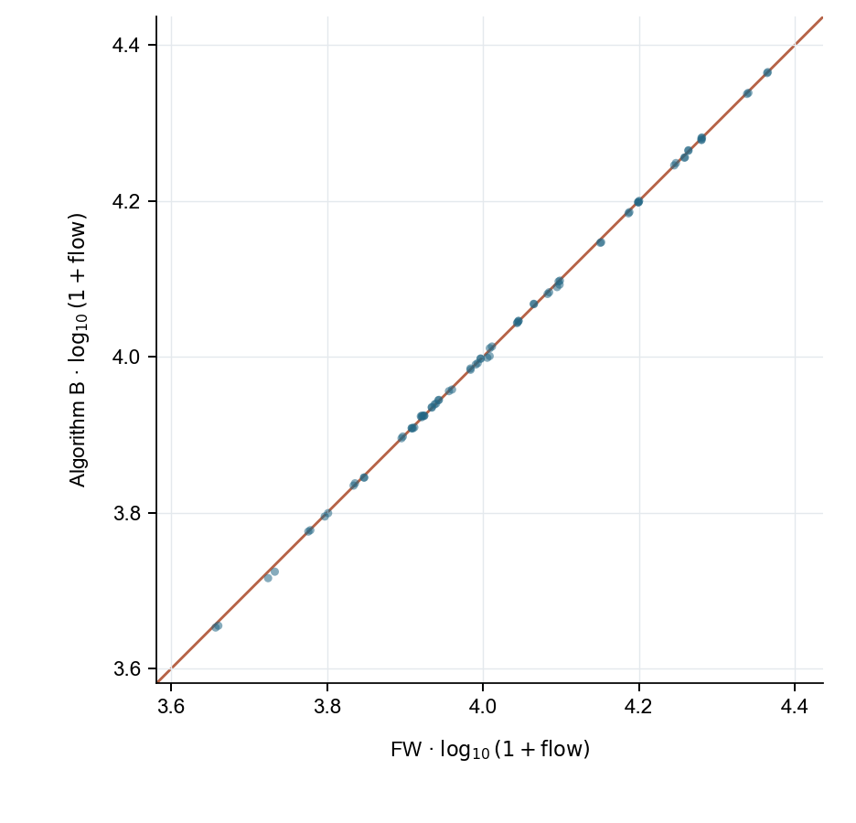</a><figcaption><strong>Historical FW vs Algorithm B</strong> FW / Algorithm B · 528-OD; separate objectives <a href="cases/sioux-algorithm-b.html#4-physical-link-comparison-with-same-problem-fw">Evidence</a> · <a href="assets/algorithm_b_r21/presentation/sioux_fw_flow_compact.png">Full figure</a></figcaption></figure>
<figure class="atlas-card"><figcaption><strong>Official Algorithm B accepted flow</strong> Algorithm B · official adapter <a href="cases/sioux-algorithm-b.html#5-selected-origin-reconstructed-flow">Evidence</a> · <a href="assets/algorithm_b_r21/source_panels/sioux_origin_flow.svg">Full figure</a></figcaption></figure>
<figure class="atlas-card"><figcaption><strong>Native L3 rank-50 control</strong> L3 · rank 50; not UE <a href="cases/sioux-falls.html#static-assignment">Evidence</a> · <a href="assets/homepage_evidence_r2/row_13_sioux_falls.png">Full figure</a></figcaption></figure>

</section>
<section class="atlas-stage" id="sioux-falls-finite"><h4 id="finite-time-expanded-computation-1">Finite time-expanded computation</h4>

<figure class="atlas-card"><figcaption><strong>Network construction and generated columns</strong> Network construction and generated columns · saved <a href="cases/sioux-space-time.html#from-the-physical-network-to-the-finite-time-expanded-graph">Evidence</a> · <a href="assets/homepage_evidence_r2/row_14_sioux_falls.png">Full figure</a></figcaption></figure>
<figure class="atlas-card"><figcaption><strong>Arc-flow LP reference</strong> Arc-flow LP reference · saved <a href="cases/sioux-space-time.html#reference-objective-agreement">Evidence</a> · <a href="assets/homepage_evidence_r2/row_15_sioux_falls.png">Full figure</a></figcaption></figure>
<figure class="atlas-card"><figcaption><strong>Two-phase column generation</strong> Two-phase column generation · accepted historical <a href="cases/sioux-space-time.html#phase-i-restores-feasibility">Evidence</a> · <a href="assets/homepage_evidence_r2/row_16_sioux_falls.png">Full figure</a></figcaption></figure>
<figure class="atlas-card"><figcaption><strong>Lagrangian</strong> Lagrangian · accepted R2 <a href="methods/distributed-assignment.html">Evidence</a> · <a href="assets/homepage_evidence_r2/row_17_sioux_falls.png">Full figure</a></figcaption></figure>
<figure class="atlas-card"><figcaption><strong>ADMM</strong> ADMM · accepted R2_S <a href="cases/sioux-admm.html">Evidence</a> · <a href="assets/homepage_evidence_r2/row_18_sioux_falls.png">Full figure</a></figcaption></figure>
<figure class="atlas-card"><a href="cases/sioux-space-time.html#case-role-scope-and-model-statistics">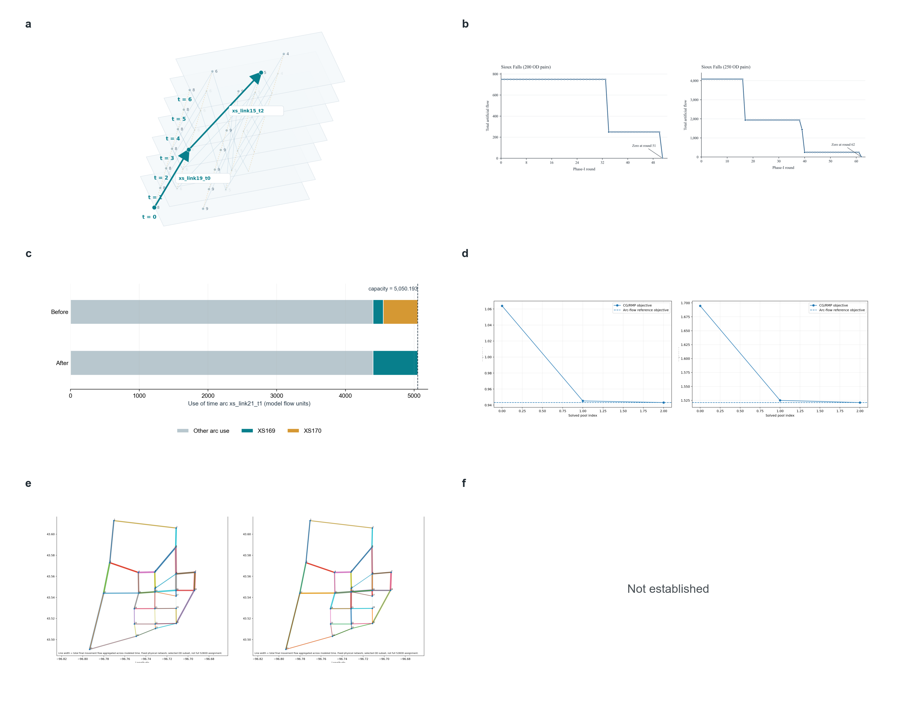</a><figcaption><strong>200/250-OD case overview</strong> CG · historical selected ODs <a href="cases/sioux-space-time.html#case-role-scope-and-model-statistics">Evidence</a> · <a href="assets/presentation_r5/sioux_cg_case_sequence.png">Full figure</a></figcaption></figure>
<figure class="atlas-card"><figcaption><strong>Physical to time-expanded graph</strong> CG construction · selected graph <a href="cases/sioux-space-time.html#from-the-physical-network-to-the-finite-time-expanded-graph">Evidence</a> · <a href="assets/three_city_r2/sioux_physical_to_time_expanded_graph.png">Full figure</a></figcaption></figure>
<figure class="atlas-card"><figcaption><strong>Generated time-indexed column</strong> CG column · selected graph <a href="cases/sioux-space-time.html#a-generated-column-as-a-time-indexed-path">Evidence</a> · <a href="assets/three_city_r2/sioux_generated_column_time_indexed_path.png">Full figure</a></figcaption></figure>
<figure class="atlas-card"><figcaption><strong>Phase I 200 OD</strong> CG Phase I · 200-OD <a href="cases/sioux-space-time.html#200-od-pairs">Evidence</a> · <a href="assets/sioux/phase_i_r1/sioux_falls_200od_phase_i_academic.png">Full figure</a></figcaption></figure>
<figure class="atlas-card"><figcaption><strong>Phase I 250 OD</strong> CG Phase I · 250-OD <a href="cases/sioux-space-time.html#250-od-pairs">Evidence</a> · <a href="assets/sioux/phase_i_r1/sioux_falls_250od_phase_i_academic.png">Full figure</a></figcaption></figure>
<figure class="atlas-card"><figcaption><strong>Shared-capacity reallocation</strong> CG capacity · 200-OD example <a href="cases/sioux-space-time.html#recorded-shared-capacity-reallocation-event">Evidence</a> · <a href="assets/presentation_r5/sioux_shared_capacity_canonical.png">Full figure</a></figcaption></figure>
<figure class="atlas-card"><figcaption><strong>Phase II / own-LP objective</strong> CG Phase II · 200-OD preview; 250 linked <a href="cases/sioux-space-time.html#phase-ii-improves-the-real-path-objective">Evidence</a> · <a href="assets/homepage_evidence_r2/row_16_sioux_falls.png">Full figure</a></figcaption></figure>
<figure class="atlas-card"><figcaption><strong>Final movement flow 200 OD</strong> CG flow · 200-OD <a href="cases/sioux-space-time.html#from-time-expanded-flows-back-to-final-physical-link-movement-flow">Evidence</a> · <a href="assets/benchmarks/sioux_200od_final_physical_link_flow.png">Full figure</a></figcaption></figure>
<figure class="atlas-card"><figcaption><strong>Final movement flow 250 OD</strong> CG flow · 250-OD <a href="cases/sioux-space-time.html#from-time-expanded-flows-back-to-final-physical-link-movement-flow">Evidence</a> · <a href="assets/benchmarks/sioux_250od_final_physical_link_flow.png">Full figure</a></figcaption></figure>
<figure class="atlas-card"><a href="methods/distributed-assignment.html#lagrangian-capacity-pricing-with-separate-primal-recovery">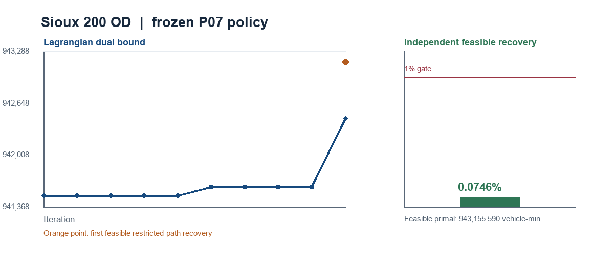</a><figcaption><strong>Lagrangian accepted recovery</strong> Lagrangian · selected 200/250-OD <a href="methods/distributed-assignment.html#lagrangian-capacity-pricing-with-separate-primal-recovery">Evidence</a> · <a href="assets/sioux/distributed_r1/Sioux_200OD_P07.png">Full figure</a></figcaption></figure>
<figure class="atlas-card"><figcaption><strong>ADMM 200-OD convergence</strong> ADMM · R2_S 200-OD <a href="cases/sioux-admm.html#original-saved-convergence-views">Evidence</a> · <a href="assets/admm_r2/figures/convergence_Sioux_200OD.png">Full figure</a></figcaption></figure>
<figure class="atlas-card"><figcaption><strong>ADMM 250-OD physical flow</strong> ADMM · R2_S 250-OD <a href="cases/sioux-admm.html#physical-link-movement-flow">Evidence</a> · <a href="assets/admm_r2/figures/admm_sioux_250_final_physical_link_flow.png">Full figure</a></figcaption></figure>

</section>
<section class="atlas-stage" id="sioux-falls-tools"><h4 id="tools-and-reproducibility-1">Tools and reproducibility</h4>

<figure class="atlas-card"><figcaption><strong>Query, tracing, exports and saved checks</strong> Query, tracing, exports and saved checks · saved checks <a href="https://github.com/scholarhaozheng/mobility-network-lab/blob/main/examples/sioux-falls/native_l3_r1/README.md">Evidence</a> · <a href="assets/homepage_evidence_r2/row_19_sioux_falls.png">Full figure</a></figcaption></figure>

</section>
</article>

<article class="case-atlas" data-city="hong-kong">
<h3 id="hong-kong-1">Hong Kong</h3>

Bounded turn-aware GMNS and four-stage engineering scenario with separate ten-OD finite CG evidence. <a href="cases/hong-kong.html">Open complete case →</a>

<dl class="atlas-facts">

<dt>City/model foundation</dt><dd>780 physical nodes; 1,239 directed links; 95 fine zones</dd>

<dt>Static assignment</dt><dd>8,930 OD pairs; 723.191 modeled PCE in 1 h</dd>

<dt>Finite time-expanded</dt><dd>100 selected nodes; 111 links; 10 ODs; approved HK10 generated column</dd>

<dt>Observation/data scope</dt><dd>Detector/trajectory association is contextual; modeled flow is not observed traffic</dd>

</dl>
<nav aria-label="Hong Kong stages" class="atlas-nav"><a href="#hong-kong-sources">Sources and GMNS</a> <a href="#hong-kong-population">Population, households and activity</a> <a href="#hong-kong-transit">Transit and observations</a> <a href="#hong-kong-generation">Trip generation</a> <a href="#hong-kong-distribution">Trip distribution</a> <a href="#hong-kong-mode">Mode choice</a> <a href="#hong-kong-static">Static assignment methods</a> <a href="#hong-kong-finite">Finite time-expanded computation</a> <a href="#hong-kong-tools">Tools and reproducibility</a></nav>
<section class="atlas-stage" id="hong-kong-sources"><h4 id="sources-and-gmns-2">Sources and GMNS</h4>

<figure class="atlas-card"><figcaption><strong>Source data and preparation</strong> Source data and preparation · saved <a href="cases/hong-kong.html#gmns-zones-and-source-evidence">Evidence</a> · <a href="assets/homepage_evidence_r2/row_01_hong_kong.png">Full figure</a></figcaption></figure>
<figure class="atlas-card"><figcaption><strong>GMNS network, zones and access</strong> GMNS network, zones and access · saved <a href="datasets/hong-kong-gmns.html">Evidence</a> · <a href="assets/homepage_evidence_r2/row_02_hong_kong.png">Full figure</a></figcaption></figure>
<figure class="atlas-card"><figcaption><strong>Roads, zones and turns</strong> GMNS · 780 nodes / 1,239 links <a href="cases/hong-kong.html#gmns-zones-and-source-evidence">Evidence</a> · <a href="assets/hong_kong/full_stack_r5/r2r4_baseline/figures/hk_assignment_ready_network.png">Full figure</a></figcaption></figure>

</section>
<section class="atlas-stage" id="hong-kong-population"><h4 id="population-households-and-activity-2">Population, households and activity</h4>

<figure class="atlas-card"><figcaption><strong>Population, households and activity</strong> Population, households and activity · saved proxy <a href="cases/hong-kong-four-stage.html">Evidence</a> · <a href="assets/homepage_evidence_r2/row_03_hong_kong.png">Full figure</a></figcaption></figure>
<figure class="atlas-card"><figcaption><strong>2021 census allocation and activity proxy</strong> Population/proxy · not observed employment <a href="cases/hong-kong-four-stage.html">Evidence</a> · <a href="assets/hong_kong/full_stack_r5/r2r4_baseline/figures/hk_population_households_activity.png">Full figure</a></figcaption></figure>

</section>
<section class="atlas-stage" id="hong-kong-transit"><h4 id="transit-and-observations-2">Transit and observations</h4>

<figure class="atlas-card"><figcaption><strong>Transit and pedestrian inputs</strong> Transit and pedestrian inputs · saved input <a href="cases/hong-kong-four-stage.html">Evidence</a> · <a href="assets/homepage_evidence_r2/row_04_hong_kong.png">Full figure</a></figcaption></figure>
<figure class="atlas-card"><figcaption><strong>GPS, trajectory and detector evidence</strong> GPS, trajectory and detector evidence · context only <a href="cases/hong-kong-four-stage.html">Evidence</a> · <a href="assets/homepage_evidence_r2/row_05_hong_kong.png">Full figure</a></figcaption></figure>
<figure class="atlas-card"><a href="cases/hong-kong.html#demand-transit-and-observations">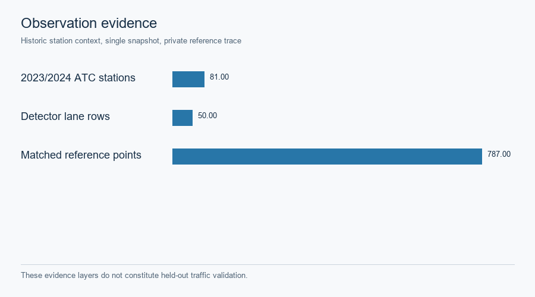</a><figcaption><strong>Detector/trajectory association</strong> Observation linkage · not held-out validation <a href="cases/hong-kong.html#demand-transit-and-observations">Evidence</a> · <a href="assets/hong_kong/full_stack_r5/r2r4_baseline/figures/hk_detector_and_trajectory_evidence.png">Full figure</a></figcaption></figure>

</section>
<section class="atlas-stage" id="hong-kong-generation"><h4 id="trip-generation-2">Trip generation</h4>

<figure class="atlas-card"><figcaption><strong>Trip generation — productions / attractions</strong> Trip generation — productions / attractions · engineering scenario <a href="cases/hong-kong-four-stage.html">Evidence</a> · <a href="assets/homepage_evidence_r2/row_06_hong_kong.png">Full figure</a></figcaption></figure>
<figure class="atlas-card"><figcaption><strong>Production/attraction scenario</strong> Trip generation · engineering scenario <a href="cases/hong-kong-four-stage.html">Evidence</a> · <a href="assets/hong_kong/full_stack_r5/r2r4_baseline/figures/hk_trip_generation_distribution.png">Full figure</a></figcaption></figure>

</section>
<section class="atlas-stage" id="hong-kong-distribution"><h4 id="trip-distribution-2">Trip distribution</h4>

<figure class="atlas-card"><figcaption><strong>Trip distribution — zonal OD demand</strong> Trip distribution — zonal OD demand · engineering scenario <a href="cases/hong-kong-four-stage.html">Evidence</a> · <a href="assets/homepage_evidence_r2/row_07_hong_kong.png">Full figure</a></figcaption></figure>

</section>
<section class="atlas-stage" id="hong-kong-mode"><h4 id="mode-choice-2">Mode choice</h4>

<figure class="atlas-card"><figcaption><strong>Mode choice — mode-specific demand</strong> Mode choice — mode-specific demand · engineering sensitivity <a href="cases/hong-kong-four-stage.html">Evidence</a> · <a href="assets/homepage_evidence_r2/row_08_hong_kong.png">Full figure</a></figcaption></figure>
<figure class="atlas-card"><figcaption><strong>Mode costs and shares</strong> Mode choice · one-hour AM <a href="cases/hong-kong-four-stage.html">Evidence</a> · <a href="assets/hong_kong/full_stack_r5/r2r4_baseline/figures/hk_mode_choice_costs_and_shares.png">Full figure</a></figcaption></figure>

</section>
<section class="atlas-stage" id="hong-kong-static"><h4 id="static-assignment-methods-2">Static assignment methods</h4>

<figure class="atlas-card"><figcaption><strong>Frank–Wolfe</strong> Frank–Wolfe · saved <a href="cases/hong-kong-static-assignment.html">Evidence</a> · <a href="assets/homepage_evidence_r2/row_10_hong_kong.png">Full figure</a></figcaption></figure>
<figure class="atlas-card"><figcaption><strong>Official tap-b Algorithm B</strong> Official tap-b Algorithm B · task-local adapter <a href="cases/hong-kong-static-assignment.html">Evidence</a> · <a href="assets/homepage_evidence_r2/row_11_hong_kong.png">Full figure</a></figcaption></figure>
<figure class="atlas-card"><figcaption><strong>FW static PCE map</strong> FW · 8,930 OD / 723.191 modeled PCE <a href="cases/hong-kong-static-assignment.html">Evidence</a> · <a href="assets/hong_kong/full_stack_r5/r2r4_baseline/figures/hk_static_fw_flow.png">Full figure</a></figcaption></figure>
<figure class="atlas-card"><figcaption><strong>Task-local Algorithm B vs FW</strong> Algorithm B · accepted; not official-adapter parity <a href="cases/hong-kong-static-assignment.html">Evidence</a> · <a href="assets/hong_kong/full_stack_r5/r2r4_baseline/figures/hk_algorithm_b_vs_fw.png">Full figure</a></figcaption></figure>

</section>

<section class="atlas-stage" id="hong-kong-finite"><h4 id="finite-time-expanded-computation-2">Finite time-expanded computation</h4>

<figure class="atlas-card"><figcaption><strong>Network construction and generated columns</strong> Network construction and generated columns · saved HK10 <a href="cases/hong-kong-space-time.html#a-generated-column-as-a-time-indexed-path">Evidence</a> · <a href="assets/homepage_evidence_r2/row_14_hong_kong.png">Full figure</a></figcaption></figure>
<figure class="atlas-card"><figcaption><strong>Arc-flow LP reference</strong> Arc-flow LP reference · saved <a href="cases/hong-kong-space-time.html#reference-objective-agreement">Evidence</a> · <a href="assets/homepage_evidence_r2/row_15_hong_kong.png">Full figure</a></figcaption></figure>
<figure class="atlas-card"><figcaption><strong>Two-phase column generation</strong> Two-phase column generation · accepted R5 <a href="cases/hong-kong-space-time.html#phase-i-restores-feasibility">Evidence</a> · <a href="assets/homepage_evidence_r2/row_16_hong_kong.png">Full figure</a></figcaption></figure>
<figure class="atlas-card"><figcaption><strong>Lagrangian</strong> Lagrangian · accepted bounded <a href="cases/hong-kong-space-time.html">Evidence</a> · <a href="assets/homepage_evidence_r2/row_17_hong_kong.png">Full figure</a></figcaption></figure>
<figure class="atlas-card"><figcaption><strong>ADMM</strong> ADMM · gated <a href="cases/hong-kong-space-time.html">Evidence</a> · <a href="assets/homepage_evidence_r2/row_18_hong_kong.png">Full figure</a></figcaption></figure>
<figure class="atlas-card"><a href="cases/hong-kong-space-time.html#case-role-scope-and-model-statistics">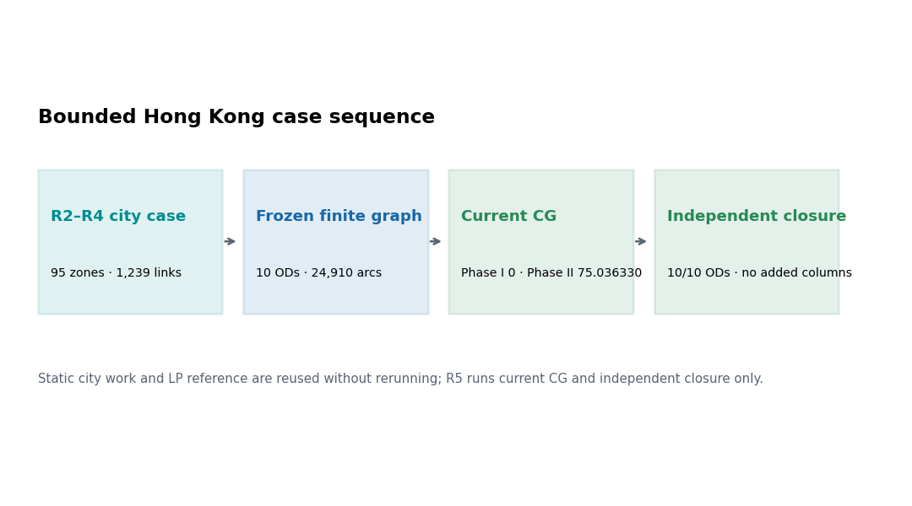</a><figcaption><strong>Bounded case overview</strong> CG · R5 10-OD <a href="cases/hong-kong-space-time.html#case-role-scope-and-model-statistics">Evidence</a> · <a href="assets/hong_kong/full_stack_r5/figures/hk_cg_case_sequence.png">Full figure</a></figcaption></figure>
<figure class="atlas-card"><a href="cases/hong-kong-space-time.html#from-the-physical-network-to-the-finite-time-expanded-graph">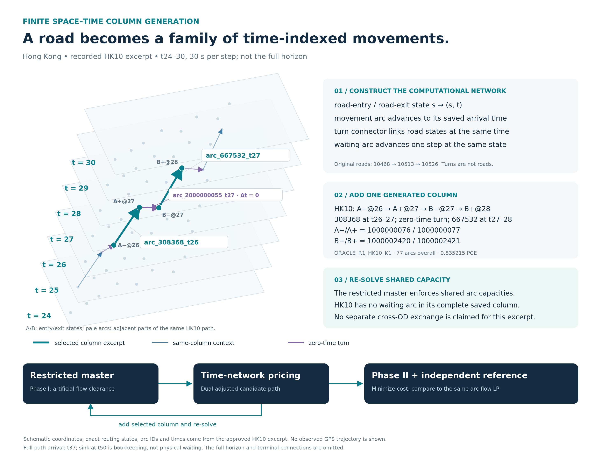</a><figcaption><strong>Physical to time-indexed movement</strong> CG construction · R5 10-OD <a href="cases/hong-kong-space-time.html#from-the-physical-network-to-the-finite-time-expanded-graph">Evidence</a> · <a href="assets/cg_layered_companions_r1/hong_kong_layered_space_time_construction.png">Full figure</a></figcaption></figure>
<figure class="atlas-card"><figcaption><strong>Approved HK10 77-arc column</strong> CG column · model-generated; approved exact excerpt <a href="cases/hong-kong-space-time.html#a-generated-column-as-a-time-indexed-path">Evidence</a> · <a href="assets/three_city_r2/hong_kong_generated_column_time_indexed_path.png">Full figure</a></figcaption></figure>
<figure class="atlas-card"><figcaption><strong>Phase I artificial flow</strong> CG Phase I · R5 10-OD <a href="cases/hong-kong-space-time.html#phase-i-restores-feasibility">Evidence</a> · <a href="assets/hong_kong/full_stack_r5/figures/hk_cg_phase_i_artificial_flow.png">Full figure</a></figcaption></figure>
<figure class="atlas-card"><figcaption><strong>Phase II objective</strong> CG Phase II · R5 10-OD <a href="cases/hong-kong-space-time.html#phase-ii-improves-the-real-path-objective">Evidence</a> · <a href="assets/hong_kong/full_stack_r5/figures/hk_cg_phase_ii_objective.png">Full figure</a></figcaption></figure>
<figure class="atlas-card"><figcaption><strong>Final physical-link movement flow</strong> CG flow · R5 10-OD <a href="cases/hong-kong-space-time.html#from-time-expanded-flows-back-to-final-physical-link-movement-flow">Evidence</a> · <a href="assets/hong_kong/full_stack_r5/figures/hk_cg_final_physical_link_movement_flow.png">Full figure</a></figcaption></figure>
<figure class="atlas-card"><figcaption><strong>Independent 10/10 pricing closure</strong> CG pricing · R5 10-OD <a href="cases/hong-kong-space-time.html#independent-pricing-closure">Evidence</a> · <a href="assets/hong_kong/full_stack_r5/figures/hk_cg_pricing_closure.png">Full figure</a></figcaption></figure>
<figure class="atlas-card"><a href="cases/hong-kong-space-time.html#reference-objective-agreement">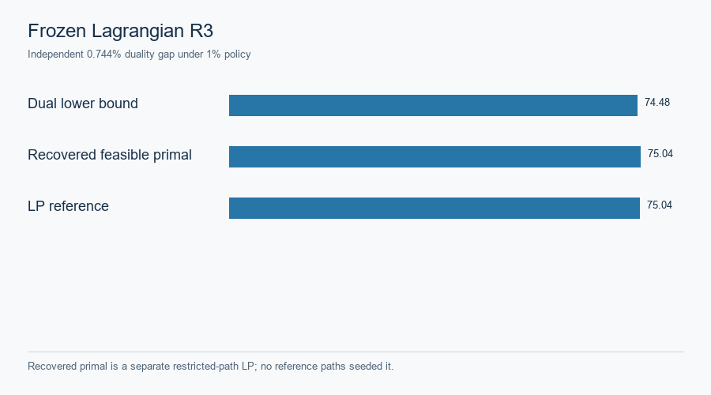</a><figcaption><strong>Lagrangian certified gap</strong> Lagrangian · bounded accepted 0.7444% <a href="cases/hong-kong-space-time.html#reference-objective-agreement">Evidence</a> · <a href="assets/hong_kong/full_stack_r5/r2r4_baseline/figures/hk_lagrangian_dual_primal_gap.png">Full figure</a></figcaption></figure>
<figure class="atlas-card"><a href="cases/hong-kong-space-time.html#reference-objective-agreement">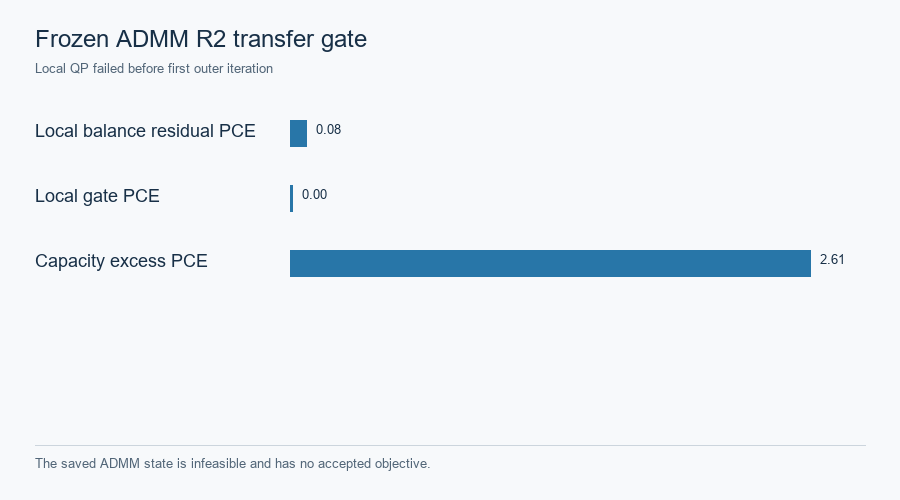</a><figcaption><strong>ADMM gated diagnostic</strong> ADMM · gated; no accepted objective <a href="cases/hong-kong-space-time.html#reference-objective-agreement">Evidence</a> · <a href="assets/hong_kong/full_stack_r5/r2r4_baseline/figures/hk_admm_residuals_and_feasibility.png">Full figure</a></figcaption></figure>

</section>
<section class="atlas-stage" id="hong-kong-tools"><h4 id="tools-and-reproducibility-2">Tools and reproducibility</h4>

<figure class="atlas-card"><figcaption><strong>Query, tracing, exports and saved checks</strong> Query, tracing, exports and saved checks · saved outputs <a href="cases/hong-kong.html#reproduction">Evidence</a> · <a href="assets/homepage_evidence_r2/row_19_hong_kong.png">Full figure</a></figcaption></figure>

</section>
</article>

<a href="visualizations.html">All retained scientific figure families</a> · <a href="full-walkthrough.html">Full technical walkthrough</a>.

<h2 id="05-run-and-inspect">05 / Run and inspect</h2>

<strong>Inspect saved evidence:</strong> <a href="visualizations.html">result queries and source records</a>. <strong>Run a documented example:</strong> in a compatible Python environment at the repository root, use:

<pre><code class="language-bash">python -B examples/boston/run_saved_example.py --data-dir "examples/boston/behavior_feedback_r1_semantic_fix_r1" --output "results/boston_saved_example"
</code></pre>

This rebuilds a local SQLite query database from released CSV tables and exports five saved-result queries; it does <strong>not</strong> run demand estimation, FW, CG or matching. Use a new output directory. <a href="getting-started.html">Installation and dependencies</a> · <a href="https://github.com/scholarhaozheng/mobility-network-lab/blob/main/examples/boston/SAVED_EXAMPLE.md">Saved-result guide</a>.

<strong>Use your own inputs:</strong> <a href="RUN_YOUR_OWN_GMNS.html">vehicle-OD preparation and static FW</a>, or the separately documented <a href="getting-started.html#run-from-raw-input">generic space–time network command</a>. <strong>Version scope:</strong> <code>tools/mnl.py</code> retains the 0.3.0-rc5 generic engine; later Boston and Hong Kong CG cases use separately versioned implementations and saved-result checks, so that command does not reproduce those case runs unchanged.

<h2 id="06-attribution-scope-and-further-reading">06 / Attribution, scope and further reading</h2>

GMNS, <code>tap-b</code>/TAPLab and source datasets retain their upstream attribution; this project documents its own adapters, computations and bounded results separately. <a href="contributions.html">Contribution/source attribution</a> · <a href="https://github.com/scholarhaozheng/mobility-network-lab/blob/main/THIRD_PARTY_NOTICES.md">Third-party notices</a> · <a href="https://github.com/scholarhaozheng/mobility-network-lab/blob/main/DATA_LICENSES.md">Data licenses</a> · <a href="citation.html">Citation</a>. Results distinguish source-derived city inputs, engineering scenarios, supplied benchmarks and observed evidence; no shown case is a calibrated citywide forecast.

The <a href="open-data-explorer.html">open-data explorer</a> and data tools, including <code>mcl_data.py catalog-city-match</code> for named-entity matching of user-supplied catalogs, support source inspection rather than automatic OD creation. <strong>These evidence layers are not additive.</strong> <a href="data-tools.html">Data-tools instructions</a> · <a href="open-data.html">Source and access scope</a>. Future directions such as Policy Bush remain outside the current demonstrated modules.

<a href="full-walkthrough.html">Full technical walkthrough — every retained experiment, table and figure in reading order</a> · <a href="architecture.html">Architecture and project-map sources</a> · <a href="capabilities.html">Complete case/method coverage</a> · <a href="roadmap.html">Roadmap</a>.

