<!-- Homepage content derived from the root README by tools/build_case_presentation.py. -->
<h1 id="mobility-computation-lab">Mobility Computation Lab</h1>

<strong>An open research and learning environment for city networks, travel demand, and reproducible network computation.</strong>

I am <a href="https://scholarhaozheng.github.io/">Hao Zheng</a>, a recent M.S. graduate from Tsinghua University working on transportation network modeling and optimization. I developed Mobility Computation Lab through research collaboration with Professor Xuesong Zhou.

The repository uses the <a href="https://github.com/zephyr-data-specs/GMNS">General Modeling Network Specification (GMNS)</a> as its portable network and data contract. Selected static traffic-assignment experiments build on <a href="https://github.com/asu-trans-ai-lab/TAPLab">TAPLab: An Open Laboratory for Reproducible Traffic Assignment Experiments</a> and the official <a href="https://github.com/spartalab/tap-b">tap-b Algorithm B</a>, with upstream software, methods, and datasets attributed explicitly.

My work in this repository is to assemble and adapt the Boston, Sioux Falls, and Hong Kong cases; connect city data and four-stage demand models to documented network computations; implement and evaluate project-specific adapters, workflows, and experiments; and make each result traceable to its actual instance, units, assumptions, and evidence.

<a href="contributions.html">My contributions and upstream foundations</a> · <a href="full-walkthrough.html">Full technical walkthrough</a> · <a href="getting-started.html">Start with a saved example</a> · <a href="citation.html">Source and citation</a>

<h2 id="01-what-this-project-adds">01 / What this project adds</h2>
<h3 id="city-to-model-representations">City-to-model representations</h3>

The project links roads, hierarchical zones, population and activity inputs, transit services, and supported observations to explicit demand and network models. Its adapters preserve identifiers, units, access semantics, and physical-link mappings across the documented city cases. <a href="contributions.html#city-to-model-representations">Implementation and source map</a>.

<h3 id="computational-implementations-and-diagnostics">Computational implementations and diagnostics</h3>

The repository brings together path-based and compressed static-assignment experiments with finite time-expanded CG, Lagrangian, and ADMM implementations. Project-specific work includes feasibility restoration, pricing and degeneracy handling, local-subproblem scaling, and reconstruction in the original flow space. <a href="contributions.html#computational-implementations-and-diagnostics">Methods and evidence</a>.

<h3 id="reusable-cross-city-computational-tools">Reusable cross-city computational tools</h3>

The project packages shared data interfaces, case configurations, and analysis tools into an open-source environment for Boston, Sioux Falls, and Hong Kong. Documented examples connect zonal demand, generated paths, and physical-link results, allowing researchers to reuse the supported workflows and compare demand scales, network representations, and solution methods. <a href="contributions.html#reusable-cross-city-computational-tools">Tools, attribution and demonstrated scope</a>.

<h2 id="02-complete-project-structure">02 / Complete project structure</h2>

<a href="https://scholarhaozheng.github.io/mobility-network-lab/assets/project_structure_r3/project_structure.svg">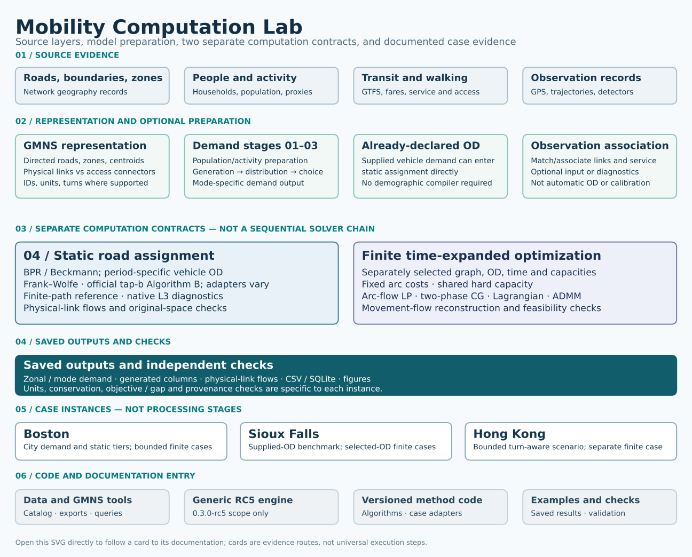</a>

Open the <a href="https://scholarhaozheng.github.io/mobility-network-lab/assets/project_structure_r3/project_structure.svg">clickable SVG</a> to follow each card to its documentation. <a href="assets/project_structure_r3/project_structure.png">PNG</a> · <a href="architecture.html">Accessible module and source table</a>.

GMNS keeps directed physical roads, hierarchical zones, centroids, nonphysical access and source IDs distinct. Population, household and activity preparation precedes <strong>01 trip generation → 02 trip distribution → 03 mode choice → 04 traffic assignment</strong> where those stages are supported; declared vehicle OD can instead enter assignment directly. GPS traces and map matching, service records and detector context require explicit quality and network-association rules, not an automatic observed-OD or calibrated-demand pipeline. <a href="datasets/boston-gmns-exchange.html">GMNS exchange</a> · <a href="city-workflow.html">Four-stage city workflow</a> · <a href="datasets/boston-behavior-feedback.html">Observation example</a>.

Static <strong>BPR/Beckmann</strong> assignment and finite <strong>fixed-cost, hard-capacity time-expanded</strong> optimization are separate mathematical branches. The latter is not an automatically calibrated dynamic version of the former. <a href="architecture.html">Architecture</a> · <a href="data-contract.html">Data contract</a>.

<h2 id="02a-two-axes-of-mobility-computation-lab">02A / Two axes of Mobility Computation Lab</h2>

<strong>Horizontal axis — documented city cases:</strong> 
Boston · Sioux Falls · Hong Kong

<strong>Vertical axis — computational depth within network assignment:</strong>

<ul>
<li><strong>A · Native assignment</strong> — Frank–Wolfe, official tap-b Algorithm B, finite-path controls, and native L3 reconstruction.</li>
<li><strong>B · Decomposition and distributed computation</strong> — column generation, Lagrangian decomposition, and ADMM local or coupled computations.</li>
<li><strong>C · Spatial hierarchy and representation</strong> — fine and parent zones, access relationships, turn/time states, and projection back to physical network objects.</li>
<li><strong>D · Coordination and verification</strong> — shared capacities, residuals, pricing closure, independent evaluators, and declared result contracts.</li>
</ul>

<strong>How to read the two axes.</strong> 
The horizontal axis compares how the documented framework is instantiated in Boston, Sioux Falls, and Hong Kong. The vertical axis organizes increasing computational depth inside the network-assignment branch. A–D are not four mandatory execution steps. Source data, GMNS, population and activity preparation, transit and observations, and the four-stage demand workflow remain the common city-model foundation outside A–D.

<h2 id="03-case-coverage-and-selected-evidence">03 / Case coverage and selected evidence</h2>

Each row uses one evidence graphic type and one 600 × 360 source canvas across the three cities. Local scales, instance scope and missing stages remain explicit; static BPR/Beckmann and fixed-cost hard-capacity computations are separate branches. <a href="capabilities.html#comparable-statistics">Complete statistics</a>.

<h3 id="i-city-data-and-model-foundations">I / City data and model foundations</h3>

<table class="home-coverage" data-component="01" width="100%"><colgroup><col width="33%"/><col width="33%"/><col width="33%"/></colgroup>
<thead><tr><th colspan="3" scope="colgroup">Source data and preparation</th></tr>
<tr><th scope="col" width="33%">Boston</th><th scope="col" width="33%">Sioux Falls</th><th scope="col" width="33%">Hong Kong</th></tr></thead><tbody>
<tr class="coverage-scope"><td valign="top">GMNS Plus, ACS/GTFS and registered source preparation.</td><td valign="top">Frozen classic 24-node/76-link source graph and supplied vehicle OD.</td><td valign="top">Official-derived bounded network and source layers.</td></tr>
<tr class="coverage-preview"><td align="center"><a href="cases/boston.html#gmns-zones-and-source-evidence">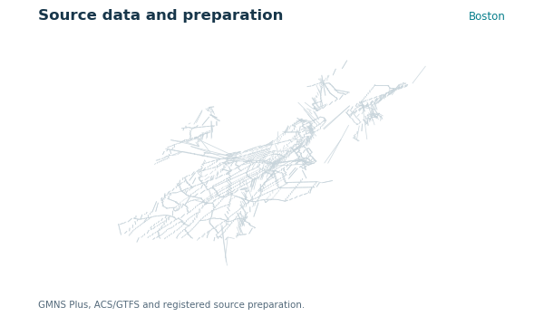</a></td><td align="center"><a href="cases/sioux-falls.html#gmns-zones-and-source-evidence">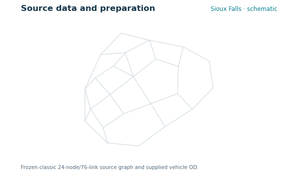</a></td><td align="center"><a href="cases/hong-kong.html#gmns-zones-and-source-evidence">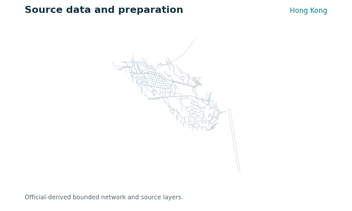</a></td></tr>
<tr class="coverage-caption"><td colspan="3">minimal base-network source map</td></tr>
<tr class="coverage-links">
<td width="33%"><a href="cases/boston.html#gmns-zones-and-source-evidence">Evidence</a> · <a href="assets/homepage_evidence_r2/row_01_boston.png">Full preview</a> · <a href="https://github.com/scholarhaozheng/mobility-network-lab/blob/main/examples/boston/gmns_exchange_r1/data/link.csv">Source record</a></td>
<td width="33%"><a href="cases/sioux-falls.html#gmns-zones-and-source-evidence">Evidence</a> · <a href="assets/homepage_evidence_r2/row_01_sioux_falls.png">Full preview</a> · <a href="https://github.com/scholarhaozheng/mobility-network-lab/blob/main/examples/sioux-falls/native_l3_r1/inputs_snapshot/SiouxFalls/link.csv">Source record</a></td>
<td width="33%"><a href="cases/hong-kong.html#gmns-zones-and-source-evidence">Evidence</a> · <a href="assets/homepage_evidence_r2/row_01_hong_kong.png">Full preview</a> · <a href="https://github.com/scholarhaozheng/mobility-network-lab/blob/main/examples/hong-kong/gmns_pilot_r1/instance/link.csv">Source record</a></td>
</tr></tbody></table>

<table class="home-coverage" data-component="02" width="100%"><colgroup><col width="33%"/><col width="33%"/><col width="33%"/></colgroup>
<thead><tr><th colspan="3" scope="colgroup">GMNS network, zones and access</th></tr>
<tr><th scope="col" width="33%">Boston</th><th scope="col" width="33%">Sioux Falls</th><th scope="col" width="33%">Hong Kong</th></tr></thead><tbody>
<tr class="coverage-scope"><td valign="top">5,091 physical links; 177 H3 fine zones, nine parents; connectors separate.</td><td valign="top">24-node, 76-link supplied directed benchmark; schematic topology, no city zone hierarchy.</td><td valign="top">780 physical nodes, 1,239 links; 95 fine zones, ten parents and turn-aware access.</td></tr>
<tr class="coverage-preview"><td align="center"><a href="cases/boston.html#gmns-zones-and-source-evidence">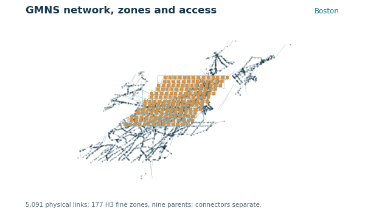</a></td><td align="center"><a href="cases/sioux-falls.html#gmns-zones-and-source-evidence">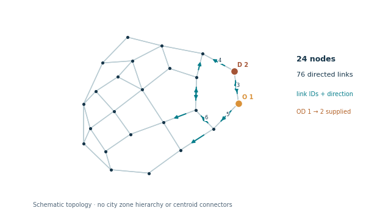</a></td><td align="center"><a href="datasets/hong-kong-gmns.html">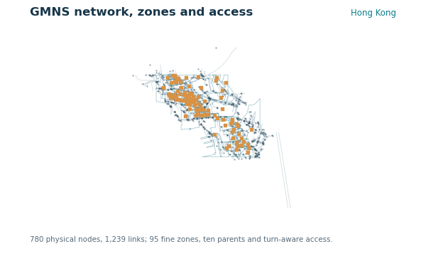</a></td></tr>
<tr class="coverage-caption"><td colspan="3">GMNS object-relation map</td></tr>
<tr class="coverage-links">
<td width="33%"><a href="cases/boston.html#gmns-zones-and-source-evidence">Evidence</a> · <a href="assets/homepage_evidence_r2/row_02_boston.png">Full preview</a> · <a href="https://github.com/scholarhaozheng/mobility-network-lab/blob/main/examples/boston/gmns_exchange_r1/data/link.csv">Source record</a></td>
<td width="33%"><a href="cases/sioux-falls.html#gmns-zones-and-source-evidence">Evidence</a> · <a href="assets/homepage_alignment_r3/sioux_gmns_directed_objects.png">Full preview</a> · <a href="https://github.com/scholarhaozheng/mobility-network-lab/blob/main/examples/sioux-falls/native_l3_r1/inputs_snapshot/SiouxFalls/link.csv">Source record</a></td>
<td width="33%"><a href="datasets/hong-kong-gmns.html">Evidence</a> · <a href="assets/homepage_evidence_r2/row_02_hong_kong.png">Full preview</a> · <a href="https://github.com/scholarhaozheng/mobility-network-lab/blob/main/examples/hong-kong/gmns_pilot_r1/instance/link.csv">Source record</a></td>
</tr></tbody></table>

<table class="home-coverage" data-component="03" width="100%"><colgroup><col width="33%"/><col width="33%"/><col width="33%"/></colgroup>
<thead><tr><th colspan="3" scope="colgroup">Population, households and activity</th></tr>
<tr><th scope="col" width="33%">Boston</th><th scope="col" width="33%">Sioux Falls</th><th scope="col" width="33%">Hong Kong</th></tr></thead><tbody>
<tr class="coverage-scope"><td valign="top">ACS 2024 five-year block groups allocated to 177 clipped H3 zones.</td><td valign="top">Supplied OD; no demographic city compiler.</td><td valign="top">2021 census households/population and explicitly modeled building activity proxies.</td></tr>
<tr class="coverage-preview"><td align="center"><a href="datasets/boston-population-households.html">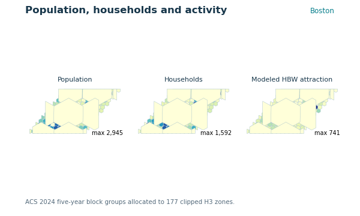</a></td><td align="center"></td><td align="center"><a href="cases/hong-kong-four-stage.html">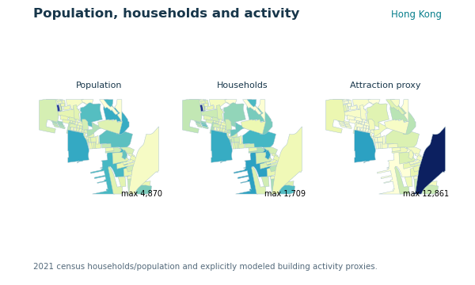</a></td></tr>
<tr class="coverage-caption"><td colspan="3">three-panel zone small multiple</td></tr>
<tr class="coverage-links">
<td width="33%"><a href="datasets/boston-population-households.html">Evidence</a> · <a href="assets/homepage_evidence_r2/row_03_boston.png">Full preview</a> · <a href="https://github.com/scholarhaozheng/mobility-network-lab/blob/main/examples/boston/population_r1/data/population_or_household_by_zone.csv">Source record</a></td>
<td width="33%"><a href="cases/sioux-falls.html#demand-transit-and-observations">Evidence</a> · <a href="assets/homepage_evidence_r2/row_03_sioux_falls.png">Full preview</a></td>
<td width="33%"><a href="cases/hong-kong-four-stage.html">Evidence</a> · <a href="assets/homepage_evidence_r2/row_03_hong_kong.png">Full preview</a> · <a href="assets/hong_kong/full_stack_r5/r2r4_baseline/phase_b/zone_activity_r2.csv">Source record</a></td>
</tr></tbody></table>

<h3 id="ii-transit-and-observation-evidence">II / Transit and observation evidence</h3>

<table class="home-coverage" data-component="04" width="100%"><colgroup><col width="33%"/><col width="33%"/><col width="33%"/></colgroup>
<thead><tr><th colspan="3" scope="colgroup">Transit and pedestrian inputs</th></tr>
<tr><th scope="col" width="33%">Boston</th><th scope="col" width="33%">Sioux Falls</th><th scope="col" width="33%">Hong Kong</th></tr></thead><tbody>
<tr class="coverage-scope"><td valign="top">MBTA service and pedestrian access support the bounded demand/feedback example.</td><td valign="top">No GTFS or pedestrian city-input lane.</td><td valign="top">GTFS same-trip rides, fares, headways and pedestrian access enter generalized costs.</td></tr>
<tr class="coverage-preview"><td align="center"><a href="cases/boston.html#demand-transit-and-observations">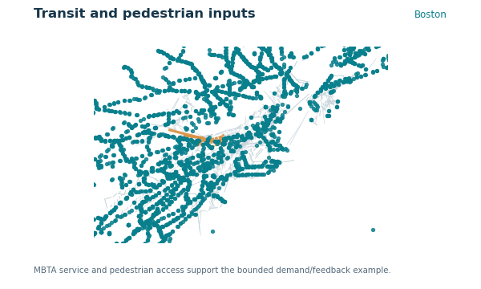</a></td><td align="center"><a href="cases/sioux-falls.html#demand-transit-and-observations">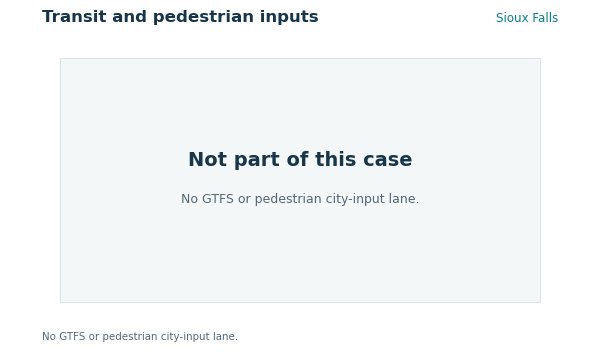</a></td><td align="center"><a href="cases/hong-kong-four-stage.html">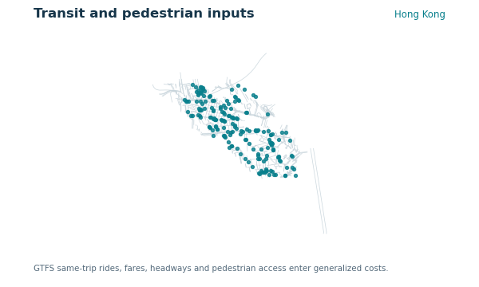</a></td></tr>
<tr class="coverage-caption"><td colspan="3">transit/access overlay map</td></tr>
<tr class="coverage-links">
<td width="33%"><a href="cases/boston.html#demand-transit-and-observations">Evidence</a> · <a href="assets/homepage_evidence_r2/row_04_boston.png">Full preview</a> · <a href="https://github.com/scholarhaozheng/mobility-network-lab/blob/main/examples/boston/gmns_exchange_r1/data/transit_stop_route_relation.csv">Source record</a></td>
<td width="33%"><a href="cases/sioux-falls.html#demand-transit-and-observations">Evidence</a> · <a href="assets/homepage_evidence_r2/row_04_sioux_falls.png">Full preview</a></td>
<td width="33%"><a href="cases/hong-kong-four-stage.html">Evidence</a> · <a href="assets/homepage_evidence_r2/row_04_hong_kong.png">Full preview</a> · <a href="https://github.com/scholarhaozheng/mobility-network-lab/blob/main/examples/hong-kong/gmns_pilot_r1/instance/transit_stops.csv">Source record</a></td>
</tr></tbody></table>

<table class="home-coverage" data-component="05" width="100%"><colgroup><col width="33%"/><col width="33%"/><col width="33%"/></colgroup>
<thead><tr><th colspan="3" scope="colgroup">GPS, trajectory and detector evidence</th></tr>
<tr><th scope="col" width="33%">Boston</th><th scope="col" width="33%">Sioux Falls</th><th scope="col" width="33%">Hong Kong</th></tr></thead><tbody>
<tr class="coverage-scope"><td valign="top">Exploratory map matching and service feedback; not held-out calibration.</td><td valign="top">No modern GPS or detector observations.</td><td valign="top">Detector and private trajectory association; no held-out validation claim.</td></tr>
<tr class="coverage-preview"><td align="center"><a href="datasets/boston-behavior-feedback.html">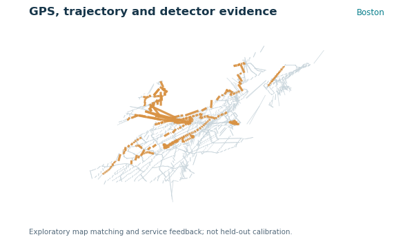</a></td><td align="center"><a href="cases/sioux-falls.html#demand-transit-and-observations">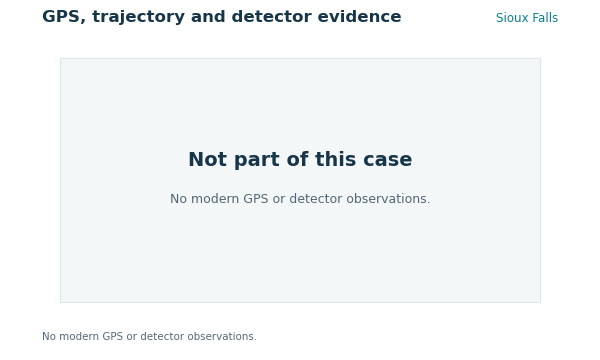</a></td><td align="center"><a href="cases/hong-kong-four-stage.html">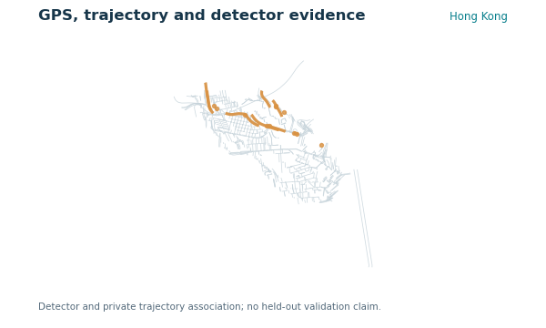</a></td></tr>
<tr class="coverage-caption"><td colspan="3">observation-to-network relation map</td></tr>
<tr class="coverage-links">
<td width="33%"><a href="datasets/boston-behavior-feedback.html">Evidence</a> · <a href="assets/homepage_evidence_r2/row_05_boston.png">Full preview</a> · <a href="https://github.com/scholarhaozheng/mobility-network-lab/blob/main/examples/boston/gmns_exchange_r1/figure_sample/gps_point_progress.csv">Source record</a></td>
<td width="33%"><a href="cases/sioux-falls.html#demand-transit-and-observations">Evidence</a> · <a href="assets/homepage_evidence_r2/row_05_sioux_falls.png">Full preview</a></td>
<td width="33%"><a href="cases/hong-kong-four-stage.html">Evidence</a> · <a href="assets/homepage_evidence_r2/row_05_hong_kong.png">Full preview</a> · <a href="https://github.com/scholarhaozheng/mobility-network-lab/blob/main/examples/hong-kong/gmns_pilot_r1/instance/detector_to_link.csv">Source record</a></td>
</tr></tbody></table>

<h3 id="iii-four-stage-travel-demand-workflow">III / Four-stage travel-demand workflow</h3>

<table class="home-coverage" data-component="06" width="100%"><colgroup><col width="33%"/><col width="33%"/><col width="33%"/></colgroup>
<thead><tr><th colspan="3" scope="colgroup">01 / Trip generation — productions / attractions</th></tr>
<tr><th scope="col" width="33%">Boston</th><th scope="col" width="33%">Sioux Falls</th><th scope="col" width="33%">Hong Kong</th></tr></thead><tbody>
<tr class="coverage-scope"><td valign="top">Purpose-level productions and attractions in the bounded Boston example.</td><td valign="top">Vehicle OD supplied; no trip-generation run.</td><td valign="top">Transferred rate and declared capture sensitivity, not local calibration.</td></tr>
<tr class="coverage-preview"><td align="center"><a href="cases/boston.html#demand-transit-and-observations">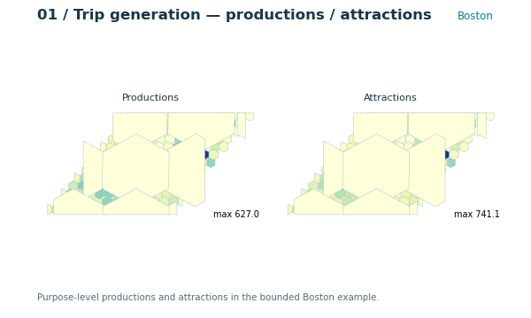</a></td><td align="center"><a href="cases/sioux-falls.html#demand-transit-and-observations">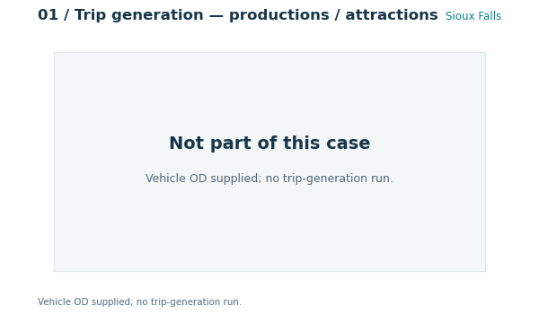</a></td><td align="center"><a href="cases/hong-kong-four-stage.html">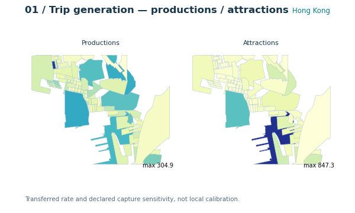</a></td></tr>
<tr class="coverage-caption"><td colspan="3">two-panel zone map</td></tr>
<tr class="coverage-links">
<td width="33%"><a href="cases/boston.html#demand-transit-and-observations">Evidence</a> · <a href="assets/homepage_evidence_r2/row_06_boston.png">Full preview</a> · <a href="assets/boston/four_step_results_r1/data/hbw_midday_matrix.csv">Source record</a></td>
<td width="33%"><a href="cases/sioux-falls.html#demand-transit-and-observations">Evidence</a> · <a href="assets/homepage_evidence_r2/row_06_sioux_falls.png">Full preview</a></td>
<td width="33%"><a href="cases/hong-kong-four-stage.html">Evidence</a> · <a href="assets/homepage_evidence_r2/row_06_hong_kong.png">Full preview</a> · <a href="assets/hong_kong/full_stack_r5/r2r4_baseline/phase_b/production_attraction_r2.csv">Source record</a></td>
</tr></tbody></table>

<table class="home-coverage" data-component="07" width="100%"><colgroup><col width="33%"/><col width="33%"/><col width="33%"/></colgroup>
<thead><tr><th colspan="3" scope="colgroup">02 / Trip distribution — zonal OD demand</th></tr>
<tr><th scope="col" width="33%">Boston</th><th scope="col" width="33%">Sioux Falls</th><th scope="col" width="33%">Hong Kong</th></tr></thead><tbody>
<tr class="coverage-scope"><td valign="top">Zonal OD construction for the bounded semantic scenario.</td><td valign="top">Supplied OD is input, not a modeled distribution stage.</td><td valign="top">Turn-aware gravity/IPF balances 8,930 reachable directed OD pairs.</td></tr>
<tr class="coverage-preview"><td align="center"><a href="cases/boston.html#demand-transit-and-observations">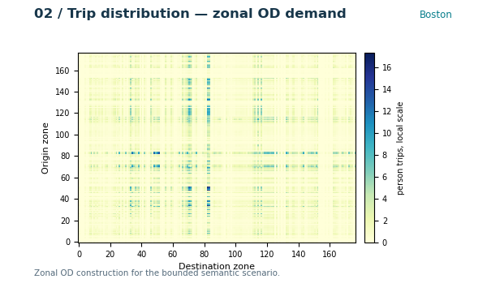</a></td><td align="center"><a href="cases/sioux-falls.html#demand-transit-and-observations">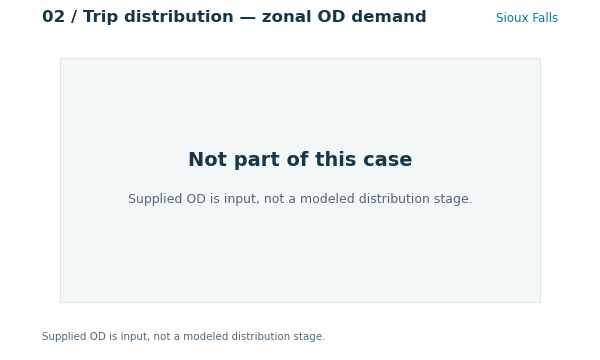</a></td><td align="center"><a href="cases/hong-kong-four-stage.html">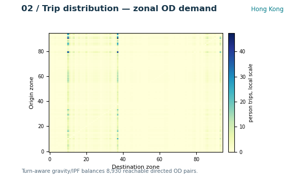</a></td></tr>
<tr class="coverage-caption"><td colspan="3">OD-matrix heatmap</td></tr>
<tr class="coverage-links">
<td width="33%"><a href="cases/boston.html#demand-transit-and-observations">Evidence</a> · <a href="assets/homepage_evidence_r2/row_07_boston.png">Full preview</a> · <a href="assets/boston/four_step_results_r1/data/hbw_midday_matrix.csv">Source record</a></td>
<td width="33%"><a href="cases/sioux-falls.html#demand-transit-and-observations">Evidence</a> · <a href="assets/homepage_evidence_r2/row_07_sioux_falls.png">Full preview</a></td>
<td width="33%"><a href="cases/hong-kong-four-stage.html">Evidence</a> · <a href="assets/homepage_evidence_r2/row_07_hong_kong.png">Full preview</a> · <a href="assets/hong_kong/full_stack_r5/r2r4_baseline/phase_b/od_person_distribution_r2.csv">Source record</a></td>
</tr></tbody></table>

<table class="home-coverage" data-component="08" width="100%"><colgroup><col width="33%"/><col width="33%"/><col width="33%"/></colgroup>
<thead><tr><th colspan="3" scope="colgroup">03 / Mode choice — mode-specific demand</th></tr>
<tr><th scope="col" width="33%">Boston</th><th scope="col" width="33%">Sioux Falls</th><th scope="col" width="33%">Hong Kong</th></tr></thead><tbody>
<tr class="coverage-scope"><td valign="top">S1/S2 service response and conditional absolute choice remain separate.</td><td valign="top">Vehicle OD supplied; no mode-choice run.</td><td valign="top">GTFS/pedestrian generalized cost and declared sensitivity logit.</td></tr>
<tr class="coverage-preview"><td align="center"><a href="cases/boston.html#demand-transit-and-observations">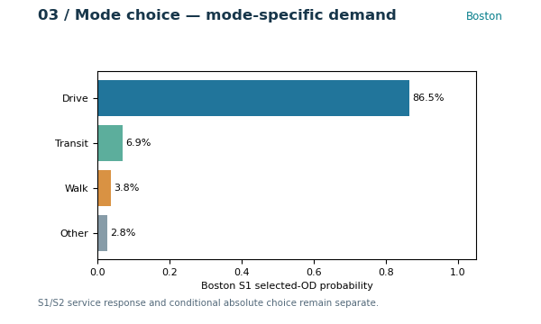</a></td><td align="center"><a href="cases/sioux-falls.html#demand-transit-and-observations">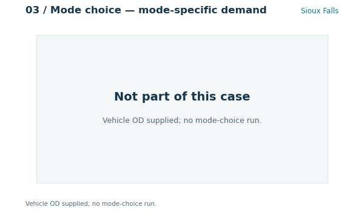</a></td><td align="center"><a href="cases/hong-kong-four-stage.html">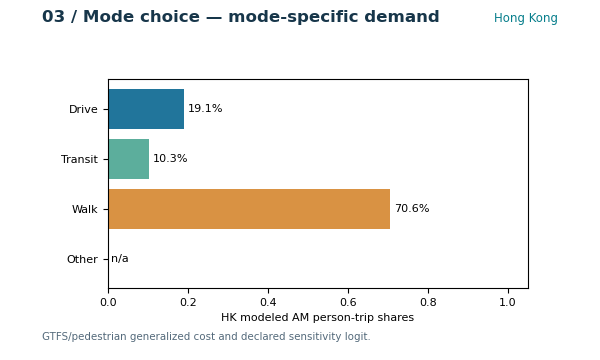</a></td></tr>
<tr class="coverage-caption"><td colspan="3">mode-share bar chart</td></tr>
<tr class="coverage-links">
<td width="33%"><a href="cases/boston.html#demand-transit-and-observations">Evidence</a> · <a href="assets/homepage_evidence_r2/row_08_boston.png">Full preview</a> · <a href="assets/boston/four_step_results_r1/data/selected_mode_response.csv">Source record</a></td>
<td width="33%"><a href="cases/sioux-falls.html#demand-transit-and-observations">Evidence</a> · <a href="assets/homepage_evidence_r2/row_08_sioux_falls.png">Full preview</a></td>
<td width="33%"><a href="cases/hong-kong-four-stage.html">Evidence</a> · <a href="assets/homepage_evidence_r2/row_08_hong_kong.png">Full preview</a> · <a href="assets/hong_kong/full_stack_r5/r2r4_baseline/phase_b/mode_demand_by_od.csv">Source record</a></td>
</tr></tbody></table>

<table class="home-coverage" data-component="09" width="100%"><colgroup><col width="33%"/><col width="33%"/><col width="33%"/></colgroup>
<thead><tr><th colspan="3" scope="colgroup">04 / Traffic assignment — assigned network flows</th></tr>
<tr><th scope="col" width="33%">Boston</th><th scope="col" width="33%">Sioux Falls</th><th scope="col" width="33%">Hong Kong</th></tr></thead><tbody>
<tr class="coverage-scope"><td valign="top">Static road flow from the bounded demand scenario; methods below.</td><td valign="top">Static network flow from supplied vehicle OD; no upstream four-stage compiler.</td><td valign="top">Modeled one-hour static PCE road flow, not measured traffic.</td></tr>
<tr class="coverage-preview"><td align="center"><a href="cases/boston.html#static-assignment">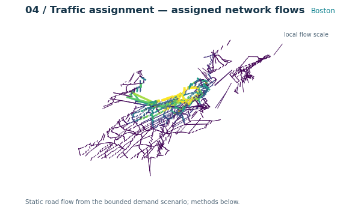</a></td><td align="center"><a href="cases/sioux-falls.html#static-assignment">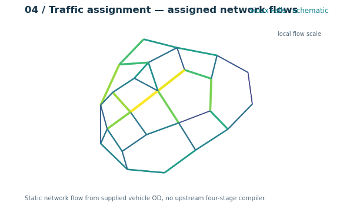</a></td><td align="center"><a href="cases/hong-kong-static-assignment.html">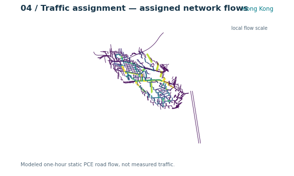</a></td></tr>
<tr class="coverage-caption"><td colspan="3">primary static physical-link flow map</td></tr>
<tr class="coverage-links">
<td width="33%"><a href="cases/boston.html#static-assignment">Evidence</a> · <a href="assets/homepage_evidence_r2/row_09_boston.png">Full preview</a> · <a href="https://github.com/scholarhaozheng/mobility-network-lab/blob/main/examples/boston/scalable_tool_r1/runs/all/physical_link_flow.csv">Source record</a></td>
<td width="33%"><a href="cases/sioux-falls.html#static-assignment">Evidence</a> · <a href="assets/homepage_evidence_r2/row_09_sioux_falls.png">Full preview</a> · <a href="https://github.com/scholarhaozheng/mobility-network-lab/blob/main/algorithms/origin_based_algorithm_b/accepted_results/sioux_physical_link_flow.csv">Source record</a></td>
<td width="33%"><a href="cases/hong-kong-static-assignment.html">Evidence</a> · <a href="assets/homepage_evidence_r2/row_09_hong_kong.png">Full preview</a> · <a href="assets/hong_kong/full_stack_r5/r2r4_baseline/phase_b/static_runs/full_algorithm_b/link_flow.csv">Source record</a></td>
</tr></tbody></table>

<h3 id="iv-static-assignment-bprbeckmann">IV / Static assignment · BPR/Beckmann</h3>

<table class="home-coverage" data-component="10" width="100%"><colgroup><col width="33%"/><col width="33%"/><col width="33%"/></colgroup>
<thead><tr><th colspan="3" scope="colgroup">Frank–Wolfe</th></tr>
<tr><th scope="col" width="33%">Boston</th><th scope="col" width="33%">Sioux Falls</th><th scope="col" width="33%">Hong Kong</th></tr></thead><tbody>
<tr class="coverage-scope"><td valign="top">Expanded Boston FW, up to 17,522 loaded node ODs; separate from 26-OD controls.</td><td valign="top">Classic 528-OD static FW; preview compares ID-matched link flows against Algorithm B.</td><td valign="top">Turn-aware one-hour 723.191 PCE static engineering scenario.</td></tr>
<tr class="coverage-preview"><td align="center"><a href="cases/boston-assignment.html#primary-scale-result-versus-controlled-method-comparison">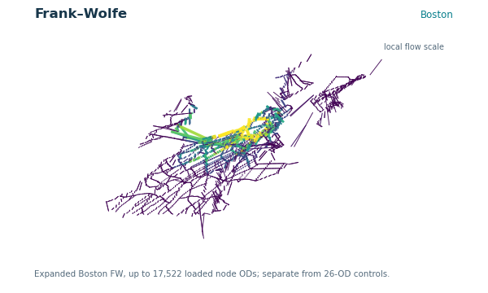</a></td><td align="center"><a href="datasets/sioux-static-fw.html">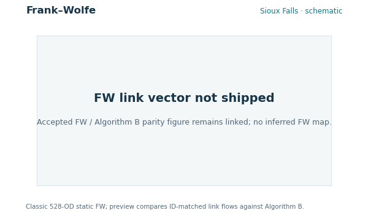</a></td><td align="center"><a href="cases/hong-kong-static-assignment.html">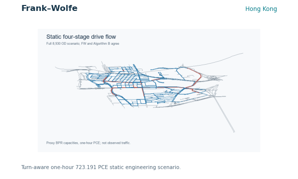</a></td></tr>
<tr class="coverage-caption"><td colspan="3">FW physical-link flow map</td></tr>
<tr class="coverage-links">
<td width="33%"><a href="cases/boston-assignment.html#primary-scale-result-versus-controlled-method-comparison">Evidence</a> · <a href="assets/homepage_evidence_r2/row_10_boston.png">Full preview</a> · <a href="https://github.com/scholarhaozheng/mobility-network-lab/blob/main/examples/boston/scalable_tool_r1/runs/all/physical_link_flow.csv">Source record</a></td>
<td width="33%"><a href="datasets/sioux-static-fw.html">Evidence</a> · <a href="assets/homepage_evidence_r2/row_10_sioux_falls.png">Full preview</a> · <a href="assets/algorithm_b_r21/source_panels/sioux_fw_flow.svg">Source record</a></td>
<td width="33%"><a href="cases/hong-kong-static-assignment.html">Evidence</a> · <a href="assets/homepage_evidence_r2/row_10_hong_kong.png">Full preview</a> · <a href="assets/hong_kong/full_stack_r5/r2r4_baseline/figures/hk_static_fw_flow.png">Source record</a></td>
</tr></tbody></table>

<table class="home-coverage" data-component="11" width="100%"><colgroup><col width="33%"/><col width="33%"/><col width="33%"/></colgroup>
<thead><tr><th colspan="3" scope="colgroup">Official tap-b Algorithm B</th></tr>
<tr><th scope="col" width="33%">Boston</th><th scope="col" width="33%">Sioux Falls</th><th scope="col" width="33%">Hong Kong</th></tr></thead><tbody>
<tr class="coverage-scope"><td valign="top">B0/B1 numerical transfer via task-local lossless TAPLab-compatible adapter.</td><td valign="top">Official TAPLab registered-adapter parity passes on Sioux Falls.</td><td valign="top">Accepted task-local lossless adapter; not official-adapter parity.</td></tr>
<tr class="coverage-preview"><td align="center"><a href="cases/boston-algorithm-b.html">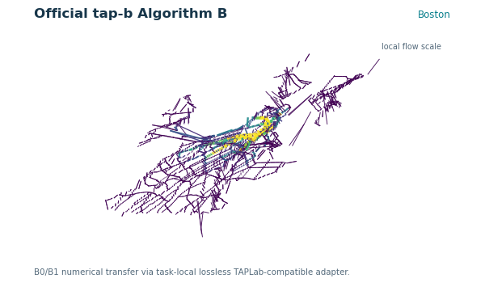</a></td><td align="center"><a href="cases/sioux-algorithm-b.html">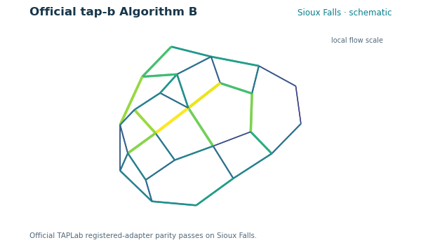</a></td><td align="center"><a href="cases/hong-kong-static-assignment.html">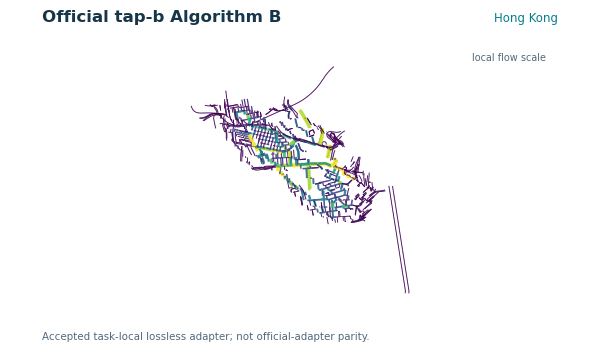</a></td></tr>
<tr class="coverage-caption"><td colspan="3">Algorithm B physical-link flow map</td></tr>
<tr class="coverage-links">
<td width="33%"><a href="cases/boston-algorithm-b.html">Evidence</a> · <a href="assets/homepage_evidence_r2/row_11_boston.png">Full preview</a> · <a href="https://github.com/scholarhaozheng/mobility-network-lab/blob/main/algorithms/origin_based_algorithm_b/accepted_results/boston_b1_physical_link_flow.csv">Source record</a></td>
<td width="33%"><a href="cases/sioux-algorithm-b.html">Evidence</a> · <a href="assets/homepage_evidence_r2/row_11_sioux_falls.png">Full preview</a> · <a href="https://github.com/scholarhaozheng/mobility-network-lab/blob/main/algorithms/origin_based_algorithm_b/accepted_results/sioux_physical_link_flow.csv">Source record</a></td>
<td width="33%"><a href="cases/hong-kong-static-assignment.html">Evidence</a> · <a href="assets/homepage_evidence_r2/row_11_hong_kong.png">Full preview</a> · <a href="assets/hong_kong/full_stack_r5/r2r4_baseline/phase_b/static_runs/full_algorithm_b/link_flow.csv">Source record</a></td>
</tr></tbody></table>

<table class="home-coverage" data-component="12" width="100%"><colgroup><col width="33%"/><col width="33%"/><col width="33%"/></colgroup>
<thead><tr><th colspan="3" scope="colgroup">Finite-path reference</th></tr>
<tr><th scope="col" width="33%">Boston</th><th scope="col" width="33%">Sioux Falls</th><th scope="col" width="33%">Hong Kong</th></tr></thead><tbody>
<tr class="coverage-scope"><td valign="top">26 OD, 130-path uncompressed SLSQP reference on ABS_PLANNED.</td><td valign="top">Frozen 2,218-path static representation; numerical profile is not city demand.</td><td valign="top">No accepted finite-path static reference in this case.</td></tr>
<tr class="coverage-preview"><td align="center"><a href="cases/boston-assignment.html#same-instance-saved-result">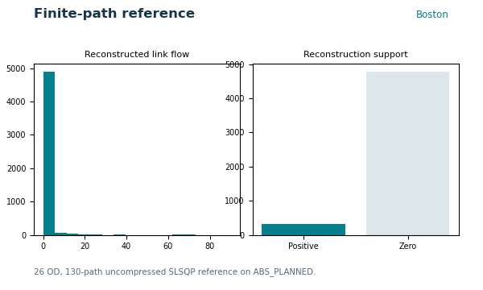</a></td><td align="center"><a href="cases/sioux-falls.html#static-assignment">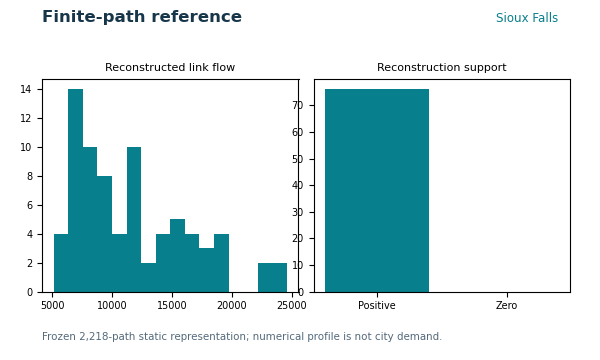</a></td><td align="center"><a href="cases/hong-kong-static-assignment.html">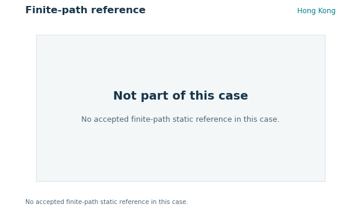</a></td></tr>
<tr class="coverage-caption"><td colspan="3">finite-path reconstruction panel</td></tr>
<tr class="coverage-links">
<td width="33%"><a href="cases/boston-assignment.html#same-instance-saved-result">Evidence</a> · <a href="assets/homepage_evidence_r2/row_12_boston.png">Full preview</a> · <a href="https://github.com/scholarhaozheng/mobility-network-lab/blob/main/examples/boston/assignment_methods_r1/reference/link_flow.csv">Source record</a></td>
<td width="33%"><a href="cases/sioux-falls.html#static-assignment">Evidence</a> · <a href="assets/homepage_evidence_r2/row_12_sioux_falls.png">Full preview</a> · <a href="https://github.com/scholarhaozheng/mobility-network-lab/blob/main/examples/sioux-falls/native_l3_r1/runs/SiouxFalls/B_BECKMANN/outer_04_link_flows.csv">Source record</a></td>
<td width="33%"><a href="cases/hong-kong-static-assignment.html">Evidence</a> · <a href="assets/homepage_evidence_r2/row_12_hong_kong.png">Full preview</a></td>
</tr></tbody></table>

<table class="home-coverage" data-component="13" width="100%"><colgroup><col width="33%"/><col width="33%"/><col width="33%"/></colgroup>
<thead><tr><th colspan="3" scope="colgroup">Native Diagnostic L3 / compression</th></tr>
<tr><th scope="col" width="33%">Boston</th><th scope="col" width="33%">Sioux Falls</th><th scope="col" width="33%">Hong Kong</th></tr></thead><tbody>
<tr class="coverage-scope"><td valign="top">Rank-26/52 native controls on the same 26-OD ABS_PLANNED instance.</td><td valign="top">Rank-50 classic static benchmark candidates, not an empirical speedup.</td><td valign="top">No accepted native L3 result in this case.</td></tr>
<tr class="coverage-preview"><td align="center"><a href="cases/boston-assignment.html#controlled-comparison-board">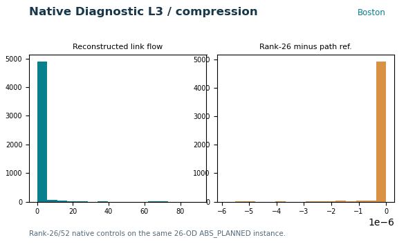</a></td><td align="center"><a href="cases/sioux-falls.html#static-assignment">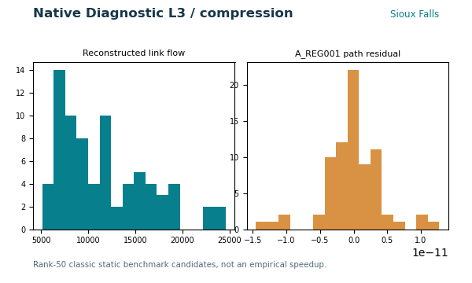</a></td><td align="center"><a href="cases/hong-kong-static-assignment.html">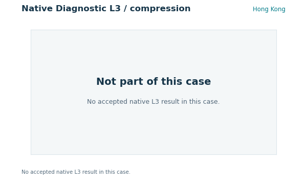</a></td></tr>
<tr class="coverage-caption"><td colspan="3">L3 reconstruction/difference panel</td></tr>
<tr class="coverage-links">
<td width="33%"><a href="cases/boston-assignment.html#controlled-comparison-board">Evidence</a> · <a href="assets/homepage_evidence_r2/row_13_boston.png">Full preview</a> · <a href="https://github.com/scholarhaozheng/mobility-network-lab/blob/main/examples/boston/assignment_methods_r1/runs/rank26/outer_02_link_flows.csv">Source record</a></td>
<td width="33%"><a href="cases/sioux-falls.html#static-assignment">Evidence</a> · <a href="assets/homepage_evidence_r2/row_13_sioux_falls.png">Full preview</a> · <a href="https://github.com/scholarhaozheng/mobility-network-lab/blob/main/examples/sioux-falls/native_l3_r1/runs/SiouxFalls/A_REG001/outer_04_link_flows.csv">Source record</a></td>
<td width="33%"><a href="cases/hong-kong-static-assignment.html">Evidence</a> · <a href="assets/homepage_evidence_r2/row_13_hong_kong.png">Full preview</a></td>
</tr></tbody></table>

<h3 id="v-finite-time-expanded-fixed-cost-hard-capacity">V / Finite time-expanded · fixed cost, hard capacity</h3>

<table class="home-coverage" data-component="14" width="100%"><colgroup><col width="33%"/><col width="33%"/><col width="33%"/></colgroup>
<thead><tr><th colspan="3" scope="colgroup">Network construction and generated columns</th></tr>
<tr><th scope="col" width="33%">Boston</th><th scope="col" width="33%">Sioux Falls</th><th scope="col" width="33%">Hong Kong</th></tr></thead><tbody>
<tr class="coverage-scope"><td valign="top">90-node/125-link/10-OD finite graph; saved time-indexed column.</td><td valign="top">Selected 200/250-OD finite graphs; saved time-indexed columns.</td><td valign="top">Approved model-generated HK10 excerpt in the 100-node/111-link/10-OD graph.</td></tr>
<tr class="coverage-preview"><td align="center"><a href="cases/boston-space-time.html#from-the-physical-network-to-the-finite-time-expanded-graph">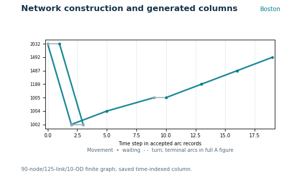</a></td><td align="center"><a href="cases/sioux-space-time.html#from-the-physical-network-to-the-finite-time-expanded-graph">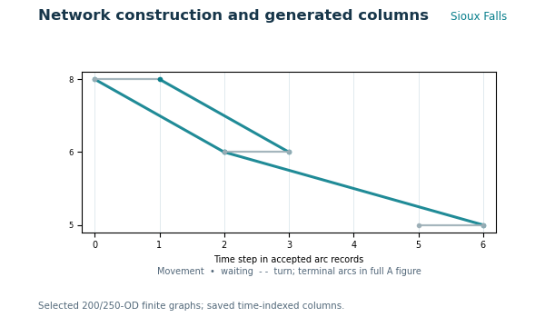</a></td><td align="center"><a href="cases/hong-kong-space-time.html#a-generated-column-as-a-time-indexed-path">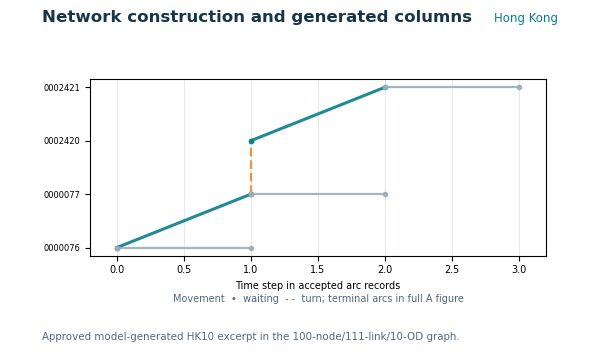</a></td></tr>
<tr class="coverage-caption"><td colspan="3">layered physical-to-time graph preview</td></tr>
<tr class="coverage-links">
<td width="33%"><a href="cases/boston-space-time.html#from-the-physical-network-to-the-finite-time-expanded-graph">Evidence</a> · <a href="assets/homepage_evidence_r2/row_14_boston.png">Full preview</a> · <a href="assets/three_city_r2/data/boston_construction_edges.csv">Source record</a></td>
<td width="33%"><a href="cases/sioux-space-time.html#from-the-physical-network-to-the-finite-time-expanded-graph">Evidence</a> · <a href="assets/homepage_evidence_r2/row_14_sioux_falls.png">Full preview</a> · <a href="assets/three_city_r2/data/sioux_construction_edges.csv">Source record</a></td>
<td width="33%"><a href="cases/hong-kong-space-time.html#a-generated-column-as-a-time-indexed-path">Evidence</a> · <a href="assets/homepage_evidence_r2/row_14_hong_kong.png">Full preview</a> · <a href="assets/three_city_r2/data/hong_kong_construction_edges.csv">Source record</a></td>
</tr></tbody></table>

<table class="home-coverage" data-component="15" width="100%"><colgroup><col width="33%"/><col width="33%"/><col width="33%"/></colgroup>
<thead><tr><th colspan="3" scope="colgroup">Arc-flow LP reference</th></tr>
<tr><th scope="col" width="33%">Boston</th><th scope="col" width="33%">Sioux Falls</th><th scope="col" width="33%">Hong Kong</th></tr></thead><tbody>
<tr class="coverage-scope"><td valign="top">Own-graph LP reference for the bounded ten-OD fixed-cost instance.</td><td valign="top">Own selected-graph LP references for historical 200/250 ODs.</td><td valign="top">Own-graph LP reference for R5 ten-OD finite case.</td></tr>
<tr class="coverage-preview"><td align="center"><a href="cases/boston-space-time.html#reference-objective-agreement">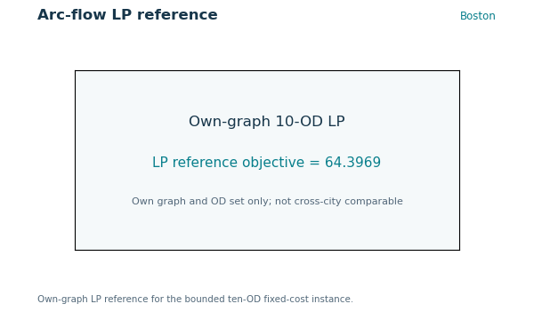</a></td><td align="center"><a href="cases/sioux-space-time.html#reference-objective-agreement">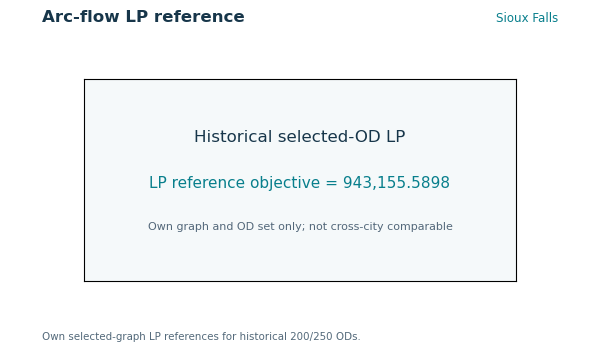</a></td><td align="center"><a href="cases/hong-kong-space-time.html#reference-objective-agreement">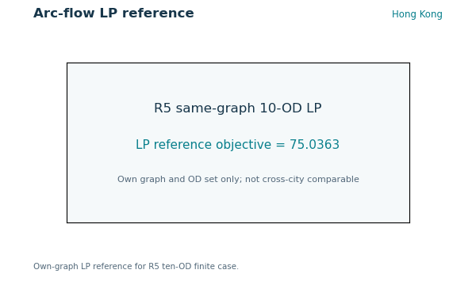</a></td></tr>
<tr class="coverage-caption"><td colspan="3">same-graph LP reference result panel</td></tr>
<tr class="coverage-links">
<td width="33%"><a href="cases/boston-space-time.html#reference-objective-agreement">Evidence</a> · <a href="assets/homepage_evidence_r2/row_15_boston.png">Full preview</a> · <a href="assets/boston/space_time_cg_r4/data/validation_summary.json">Source record</a></td>
<td width="33%"><a href="cases/sioux-space-time.html#reference-objective-agreement">Evidence</a> · <a href="assets/homepage_evidence_r2/row_15_sioux_falls.png">Full preview</a> · <a href="assets/sioux/phase_i_r1/data/200_phase_ii_trace.csv">Source record</a></td>
<td width="33%"><a href="cases/hong-kong-space-time.html#reference-objective-agreement">Evidence</a> · <a href="assets/homepage_evidence_r2/row_15_hong_kong.png">Full preview</a> · <a href="assets/hong_kong/full_stack_r5/cg_run/full_cg_v1_phase_ii_objective_trace.csv">Source record</a></td>
</tr></tbody></table>

<table class="home-coverage" data-component="16" width="100%"><colgroup><col width="33%"/><col width="33%"/><col width="33%"/></colgroup>
<thead><tr><th colspan="3" scope="colgroup">Two-phase column generation</th></tr>
<tr><th scope="col" width="33%">Boston</th><th scope="col" width="33%">Sioux Falls</th><th scope="col" width="33%">Hong Kong</th></tr></thead><tbody>
<tr class="coverage-scope"><td valign="top">Phase I/II and independent 10/10 pricing closure.</td><td valign="top">200/250-OD own-LP agreement; independent full-DAG closure not established.</td><td valign="top">Phase I/II, same-graph LP agreement and independent 10/10 closure.</td></tr>
<tr class="coverage-preview"><td align="center"><a href="cases/boston-space-time.html#phase-i-restores-feasibility">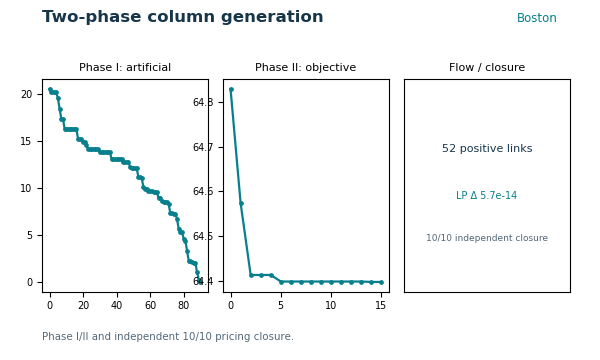</a></td><td align="center"><a href="cases/sioux-space-time.html#phase-i-restores-feasibility">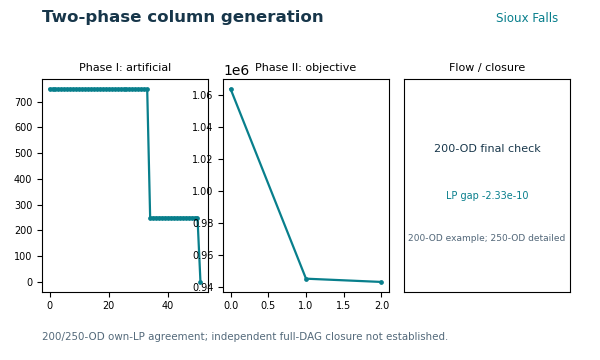</a></td><td align="center"><a href="cases/hong-kong-space-time.html#phase-i-restores-feasibility">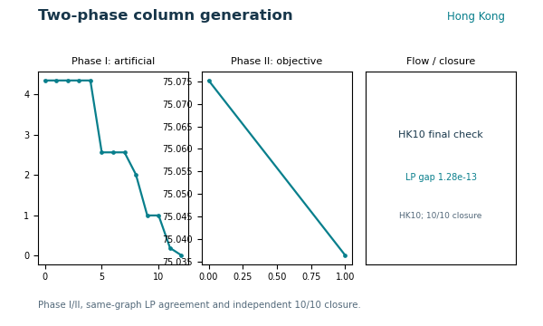</a></td></tr>
<tr class="coverage-caption"><td colspan="3">Phase I / Phase II / final-check triptych</td></tr>
<tr class="coverage-links">
<td width="33%"><a href="cases/boston-space-time.html#phase-i-restores-feasibility">Evidence</a> · <a href="assets/homepage_evidence_r2/row_16_boston.png">Full preview</a> · <a href="assets/boston/space_time_cg_r4/data/phase_i_total.csv">Source record</a></td>
<td width="33%"><a href="cases/sioux-space-time.html#phase-i-restores-feasibility">Evidence</a> · <a href="assets/homepage_evidence_r2/row_16_sioux_falls.png">Full preview</a> · <a href="assets/sioux/phase_i_r1/data/200_phase_i_trace.csv">Source record</a></td>
<td width="33%"><a href="cases/hong-kong-space-time.html#phase-i-restores-feasibility">Evidence</a> · <a href="assets/homepage_evidence_r2/row_16_hong_kong.png">Full preview</a> · <a href="assets/hong_kong/full_stack_r5/cg_run/full_cg_v1_phase_i_artificial_flow_trace.csv">Source record</a></td>
</tr></tbody></table>

<table class="home-coverage" data-component="17" width="100%"><colgroup><col width="33%"/><col width="33%"/><col width="33%"/></colgroup>
<thead><tr><th colspan="3" scope="colgroup">Lagrangian</th></tr>
<tr><th scope="col" width="33%">Boston</th><th scope="col" width="33%">Sioux Falls</th><th scope="col" width="33%">Hong Kong</th></tr></thead><tbody>
<tr class="coverage-scope"><td valign="top">Feasible primal, but frozen 1% gap gate missed (1.1002%).</td><td valign="top">Selected 200/250-OD feasible recovery and certified bounded gaps.</td><td valign="top">Ten-OD feasible recovery with 0.7444% certified gap.</td></tr>
<tr class="coverage-preview"><td align="center"><a href="cases/boston.html#finite-time-expanded-algorithms">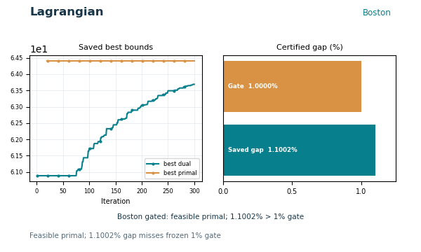</a></td><td align="center"><a href="methods/distributed-assignment.html">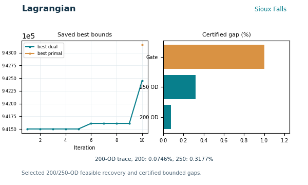</a></td><td align="center"><a href="cases/hong-kong-space-time.html">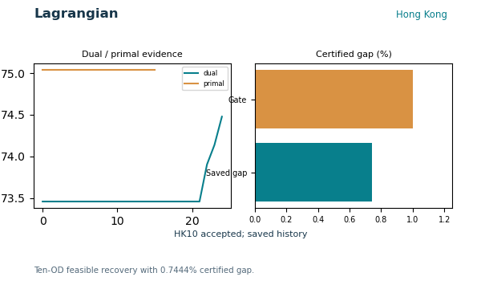</a></td></tr>
<tr class="coverage-caption"><td colspan="3">dual/primal/gap summary</td></tr>
<tr class="coverage-links">
<td width="33%"><a href="cases/boston.html#finite-time-expanded-algorithms">Evidence</a> · <a href="assets/homepage_evidence_r2/row_17_boston.png">Full preview</a> · <a href="cases/boston.html">Source record</a></td>
<td width="33%"><a href="methods/distributed-assignment.html">Evidence</a> · <a href="assets/homepage_evidence_r2/row_17_sioux_falls.png">Full preview</a> · <a href="methods/distributed-assignment.html">Source record</a></td>
<td width="33%"><a href="cases/hong-kong-space-time.html">Evidence</a> · <a href="assets/homepage_evidence_r2/row_17_hong_kong.png">Full preview</a> · <a href="assets/hong_kong/full_stack_r5/r2r4_baseline/phase_c/lagrangian_run/history.csv">Source record</a></td>
</tr></tbody></table>

<table class="home-coverage" data-component="18" width="100%"><colgroup><col width="33%"/><col width="33%"/><col width="33%"/></colgroup>
<thead><tr><th colspan="3" scope="colgroup">ADMM</th></tr>
<tr><th scope="col" width="33%">Boston</th><th scope="col" width="33%">Sioux Falls</th><th scope="col" width="33%">Hong Kong</th></tr></thead><tbody>
<tr class="coverage-scope"><td valign="top">Ten-OD original-space checks; own-LP gap 6.68e-6.</td><td valign="top">Selected 200/250-OD original-space checks; not the full static 528 ODs.</td><td valign="top">Frozen transfer diagnostic; no accepted Hong Kong ADMM objective.</td></tr>
<tr class="coverage-preview"><td align="center"><a href="cases/boston-admm.html">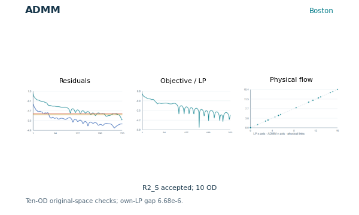</a></td><td align="center"><a href="cases/sioux-admm.html">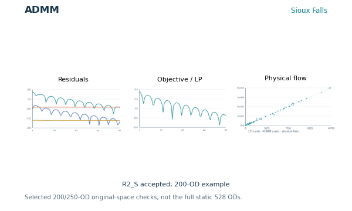</a></td><td align="center"><a href="cases/hong-kong-space-time.html">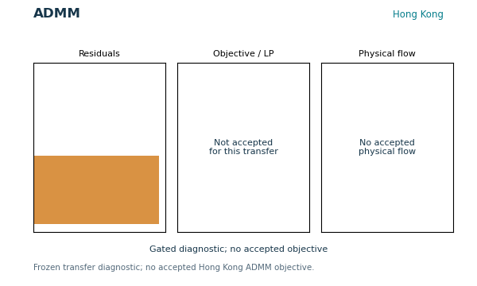</a></td></tr>
<tr class="coverage-caption"><td colspan="3">residual/objective/flow summary</td></tr>
<tr class="coverage-links">
<td width="33%"><a href="cases/boston-admm.html">Evidence</a> · <a href="assets/homepage_evidence_r2/row_18_boston.png">Full preview</a> · <a href="assets/admm_r2/figures/admm_boston_10od_case_sequence.png">Source record</a></td>
<td width="33%"><a href="cases/sioux-admm.html">Evidence</a> · <a href="assets/homepage_evidence_r2/row_18_sioux_falls.png">Full preview</a> · <a href="assets/admm_r2/figures/admm_sioux_200_case_sequence.png">Source record</a></td>
<td width="33%"><a href="cases/hong-kong-space-time.html">Evidence</a> · <a href="assets/homepage_evidence_r2/row_18_hong_kong.png">Full preview</a> · <a href="assets/hong_kong/full_stack_r5/r2r4_baseline/phase_c/admm_run/result.json">Source record</a></td>
</tr></tbody></table>

<h3 id="vi-reusable-outputs-and-tools">VI / Reusable outputs and tools</h3>

Reusable queries, exports, saved examples, and checks remain linked from the <a href="cases/boston.html#reproduction">Boston</a>, <a href="cases/sioux-falls.html#reproduction">Sioux Falls</a>, and <a href="cases/hong-kong.html#reproduction">Hong Kong</a> case entries and the <a href="getting-started.html">getting-started guide</a>.

The <a href="methods/space-time-cg.html#cg-experiments">cross-case CG evidence</a>, <a href="methods/admm-space-time.html">ADMM</a>, <a href="methods/origin-based-algorithm-b.html">official tap-b Algorithm B method</a> and <a href="integrations/taplab-tapb.html">adapter distinction</a>, and <a href="methods/distributed-assignment.html">Lagrangian records</a> retain their full figure families. Boston and Hong Kong have independent 10/10 pricing closure on <strong>different</strong> ten-demand graphs; this is not imputed to the historical Sioux runs.

<h2 id="04-explore-the-three-cases">04 / Explore the three cases</h2>

Each city has a complete stage atlas. The same stage order is used throughout; different data, static and finite instance scales are never combined into a single case size. Covers are navigation assets, not scientific validation.

<strong>A — Native assignment</strong> 
<strong>B — Decomposition and distributed computation</strong> 
<strong>C — Spatial hierarchy and representation</strong> 
<strong>D — Coordination and verification</strong>

A–D are reading labels for computational depth, not a mandatory solver sequence. City-data and four-stage-demand evidence remain outside A–D. The current repository demonstrates coordination and verification components. Agentic execution remains a learning and research direction, not a completed autonomous module.

<article class="case-atlas" data-city="boston">
<h3 id="boston-1">Boston</h3>

City GMNS, population/demand, MBTA/GPS linkage and separate bounded static and finite computations. <a href="cases/boston.html">Open complete case →</a>

<a href="cases/boston.html">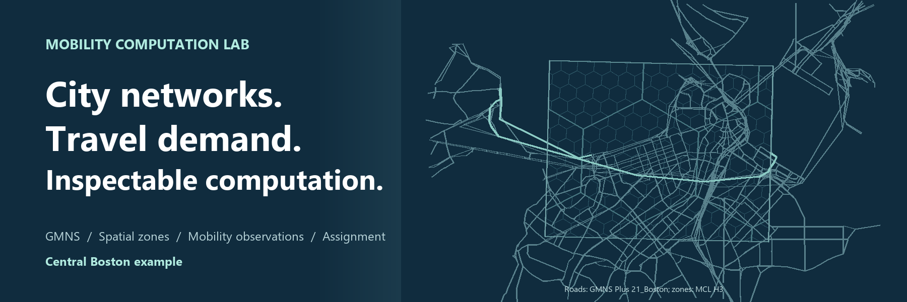</a>

<table class="atlas-quick-facts" width="100%"><colgroup><col width="25%"/><col width="25%"/><col width="25%"/><col width="25%"/></colgroup><thead><tr><th width="25%">City/model foundation</th><th width="25%">Static assignment</th><th width="25%">Finite time-expanded</th><th width="25%">Observation/data scope</th></tr></thead>
<tbody><tr><td width="25%">2,852 physical nodes; 5,091 directed links; 177 H3 fine zones</td><td width="25%">B1: 453 ODs / 1,936.238475 PCE in 2 h; expanded FW and 26-OD controls are distinct</td><td width="25%">90 nodes; 125 links; 10 ODs</td><td width="25%">MBTA inputs and exploratory GPS matching; no held-out citywide calibration</td></tr></tbody></table>

<a href="#boston-sources">Sources and GMNS</a> · <a href="#boston-population">Population, households and activity</a> · <a href="#boston-transit">Transit and observations</a> · <a href="#boston-generation">Trip generation</a> · <a href="#boston-distribution">Trip distribution</a> · <a href="#boston-mode">Mode choice</a> · <a href="#boston-static">Static assignment methods</a> · <a href="#boston-finite">Finite time-expanded computation</a> · <a href="cases/boston.html#reproduction">Tools and reproducibility</a>

<table class="atlas-city-table" data-city="boston" data-stage="boston-sources" width="100%"><colgroup><col width="8.333%"/><col width="8.333%"/><col width="8.333%"/><col width="8.333%"/><col width="8.333%"/><col width="8.333%"/><col width="8.333%"/><col width="8.333%"/><col width="8.333%"/><col width="8.333%"/><col width="8.333%"/><col width="8.333%"/></colgroup><tbody>
<tr class="atlas-stage-heading" data-columns="3" data-items="3" data-stage="boston-sources"><th colspan="12"><h4 id="sources-and-gmns">Sources and GMNS</h4></th></tr>
<tr class="atlas-card-title-row" data-stage="boston-sources">
<th class="atlas-title-cell" colspan="4" scope="col" width="33.333%"><strong>Source data and preparation</strong></th>
<th class="atlas-title-cell" colspan="4" scope="col" width="33.333%"><strong>GMNS network, zones and access</strong> <small class="atlas-depth-badge">[C]</small></th>
<th class="atlas-title-cell" colspan="4" scope="col" width="33.333%"><strong>Special zones and access</strong> <small class="atlas-depth-badge">[C]</small></th>
</tr>
<tr class="atlas-card-preview-row" data-stage="boston-sources">
<td class="atlas-card-cell" colspan="4" width="33.333%"></td>
<td class="atlas-card-cell" colspan="4" width="33.333%"></td>
<td class="atlas-card-cell" colspan="4" width="33.333%"><a href="cases/boston.html#gmns-zones-and-source-evidence">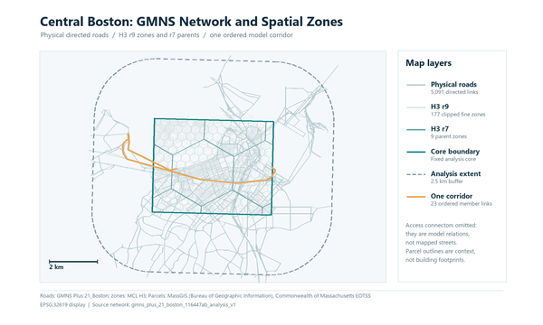</a></td>
</tr>
<tr class="atlas-card-meta-row" data-stage="boston-sources">
<td class="atlas-meta-cell" colspan="4" width="33.333%"><small class="atlas-meta">GMNS Plus, ACS/GTFS and registered source preparation.</small></td>
<td class="atlas-meta-cell" colspan="4" width="33.333%"><small class="atlas-meta">5,091 physical links; 177 H3 fine zones, nine parents; connectors separate.</small></td>
<td class="atlas-meta-cell" colspan="4" width="33.333%"><small class="atlas-meta">GMNS · Central Boston</small></td>
</tr>
<tr class="atlas-card-links-row" data-stage="boston-sources">
<td class="atlas-links-cell" colspan="4" width="33.333%"><small class="atlas-links"><a href="cases/boston.html#gmns-zones-and-source-evidence">Evidence</a> · <a href="assets/homepage_evidence_r2/row_01_boston.png">Figure</a></small></td>
<td class="atlas-links-cell" colspan="4" width="33.333%"><small class="atlas-links"><a href="cases/boston.html#gmns-zones-and-source-evidence">Evidence</a> · <a href="assets/homepage_evidence_r2/row_02_boston.png">Figure</a></small></td>
<td class="atlas-links-cell" colspan="4" width="33.333%"><small class="atlas-links"><a href="cases/boston.html#gmns-zones-and-source-evidence">Evidence</a> · <a href="assets/boston/visual_release_r1/boston_network_zones.png">Figure</a></small></td>
</tr>
</tbody></table>

<table class="atlas-city-table" data-city="boston" data-stage="boston-population" width="100%"><colgroup><col width="8.333%"/><col width="8.333%"/><col width="8.333%"/><col width="8.333%"/><col width="8.333%"/><col width="8.333%"/><col width="8.333%"/><col width="8.333%"/><col width="8.333%"/><col width="8.333%"/><col width="8.333%"/><col width="8.333%"/></colgroup><tbody>
<tr class="atlas-stage-heading" data-columns="2" data-items="2" data-stage="boston-population"><th colspan="12"><h4 id="population-households-and-activity">Population, households and activity</h4></th></tr>
<tr class="atlas-card-title-row" data-stage="boston-population">
<th class="atlas-title-cell" colspan="6" scope="col" width="50%"><strong>Population, households and activity</strong></th>
<th class="atlas-title-cell" colspan="6" scope="col" width="50%"><strong>ACS/H3 allocation</strong></th>
</tr>
<tr class="atlas-card-preview-row" data-stage="boston-population">
<td class="atlas-card-cell" colspan="6" width="50%"></td>
<td class="atlas-card-cell" colspan="6" width="50%"><a href="datasets/boston-population-households.html">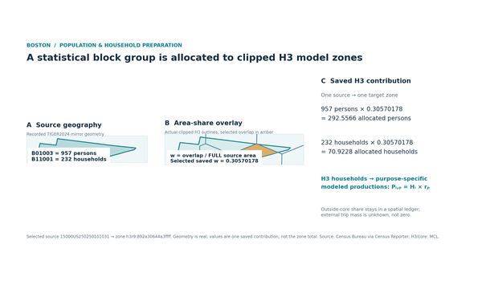</a></td>
</tr>
<tr class="atlas-card-meta-row" data-stage="boston-population">
<td class="atlas-meta-cell" colspan="6" width="50%"><small class="atlas-meta">ACS 2024 five-year block groups allocated to 177 clipped H3 zones.</small></td>
<td class="atlas-meta-cell" colspan="6" width="50%"><small class="atlas-meta">Population · ACS 2024 five-year</small></td>
</tr>
<tr class="atlas-card-links-row" data-stage="boston-population">
<td class="atlas-links-cell" colspan="6" width="50%"><small class="atlas-links"><a href="datasets/boston-population-households.html">Evidence</a> · <a href="assets/homepage_evidence_r2/row_03_boston.png">Figure</a></small></td>
<td class="atlas-links-cell" colspan="6" width="50%"><small class="atlas-links"><a href="datasets/boston-population-households.html">Evidence</a> · <a href="assets/boston/population_r1/population_allocation.png">Figure</a></small></td>
</tr>
</tbody></table>

<table class="atlas-city-table" data-city="boston" data-stage="boston-transit" width="100%"><colgroup><col width="8.333%"/><col width="8.333%"/><col width="8.333%"/><col width="8.333%"/><col width="8.333%"/><col width="8.333%"/><col width="8.333%"/><col width="8.333%"/><col width="8.333%"/><col width="8.333%"/><col width="8.333%"/><col width="8.333%"/></colgroup><tbody>
<tr class="atlas-stage-heading" data-columns="3" data-items="3" data-stage="boston-transit"><th colspan="12"><h4 id="transit-and-observations">Transit and observations</h4></th></tr>
<tr class="atlas-card-title-row" data-stage="boston-transit">
<th class="atlas-title-cell" colspan="4" scope="col" width="33.333%"><strong>Transit and pedestrian inputs</strong></th>
<th class="atlas-title-cell" colspan="4" scope="col" width="33.333%"><strong>GPS, trajectory and detector evidence</strong></th>
<th class="atlas-title-cell" colspan="4" scope="col" width="33.333%"><strong>GPS-to-GMNS association</strong></th>
</tr>
<tr class="atlas-card-preview-row" data-stage="boston-transit">
<td class="atlas-card-cell" colspan="4" width="33.333%"></td>
<td class="atlas-card-cell" colspan="4" width="33.333%"></td>
<td class="atlas-card-cell" colspan="4" width="33.333%"><a href="datasets/boston-behavior-feedback.html">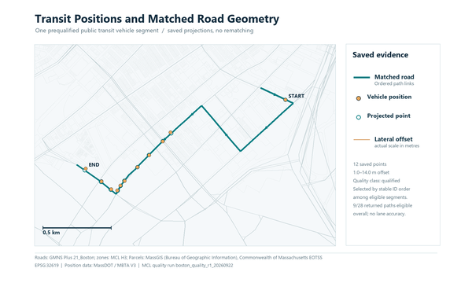</a></td>
</tr>
<tr class="atlas-card-meta-row" data-stage="boston-transit">
<td class="atlas-meta-cell" colspan="4" width="33.333%"><small class="atlas-meta">MBTA service and pedestrian access support the bounded demand/feedback example.</small></td>
<td class="atlas-meta-cell" colspan="4" width="33.333%"><small class="atlas-meta">Exploratory map matching and service feedback; not held-out calibration.</small></td>
<td class="atlas-meta-cell" colspan="4" width="33.333%"><small class="atlas-meta">GPS linkage · exploratory</small></td>
</tr>
<tr class="atlas-card-links-row" data-stage="boston-transit">
<td class="atlas-links-cell" colspan="4" width="33.333%"><small class="atlas-links"><a href="cases/boston.html#demand-transit-and-observations">Evidence</a> · <a href="assets/homepage_evidence_r2/row_04_boston.png">Figure</a></small></td>
<td class="atlas-links-cell" colspan="4" width="33.333%"><small class="atlas-links"><a href="datasets/boston-behavior-feedback.html">Evidence</a> · <a href="assets/homepage_evidence_r2/row_05_boston.png">Figure</a></small></td>
<td class="atlas-links-cell" colspan="4" width="33.333%"><small class="atlas-links"><a href="datasets/boston-behavior-feedback.html">Evidence</a> · <a href="assets/boston/visual_release_r1/boston_gps_projection.png">Figure</a></small></td>
</tr>
</tbody></table>

<table class="atlas-city-table" data-city="boston" data-stage="boston-generation" width="100%"><colgroup><col width="8.333%"/><col width="8.333%"/><col width="8.333%"/><col width="8.333%"/><col width="8.333%"/><col width="8.333%"/><col width="8.333%"/><col width="8.333%"/><col width="8.333%"/><col width="8.333%"/><col width="8.333%"/><col width="8.333%"/></colgroup><tbody>
<tr class="atlas-stage-heading" data-columns="2" data-items="2" data-stage="boston-generation"><th colspan="12"><h4 id="trip-generation">Trip generation</h4></th></tr>
<tr class="atlas-card-title-row" data-stage="boston-generation">
<th class="atlas-title-cell" colspan="6" scope="col" width="50%"><strong>Trip generation — productions / attractions</strong></th>
<th class="atlas-title-cell" colspan="6" scope="col" width="50%"><strong>Generation by purpose</strong></th>
</tr>
<tr class="atlas-card-preview-row" data-stage="boston-generation">
<td class="atlas-card-cell" colspan="6" width="50%"></td>
<td class="atlas-card-cell" colspan="6" width="50%"><a href="cases/boston.html#stage-01-trip-generation">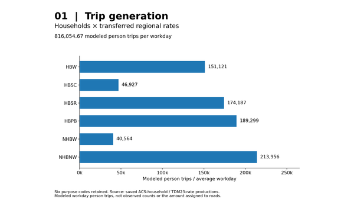</a></td>
</tr>
<tr class="atlas-card-meta-row" data-stage="boston-generation">
<td class="atlas-meta-cell" colspan="6" width="50%"><small class="atlas-meta">Purpose-level productions and attractions in the bounded Boston example.</small></td>
<td class="atlas-meta-cell" colspan="6" width="50%"><small class="atlas-meta">Trip generation · bounded example</small></td>
</tr>
<tr class="atlas-card-links-row" data-stage="boston-generation">
<td class="atlas-links-cell" colspan="6" width="50%"><small class="atlas-links"><a href="cases/boston.html#demand-transit-and-observations">Evidence</a> · <a href="assets/homepage_evidence_r2/row_06_boston.png">Figure</a></small></td>
<td class="atlas-links-cell" colspan="6" width="50%"><small class="atlas-links"><a href="cases/boston.html#stage-01-trip-generation">Evidence</a> · <a href="assets/boston/four_step_results_r1/step1_generation.png">Figure</a></small></td>
</tr>
</tbody></table>

<table class="atlas-city-table" data-city="boston" data-stage="boston-distribution" width="100%"><colgroup><col width="8.333%"/><col width="8.333%"/><col width="8.333%"/><col width="8.333%"/><col width="8.333%"/><col width="8.333%"/><col width="8.333%"/><col width="8.333%"/><col width="8.333%"/><col width="8.333%"/><col width="8.333%"/><col width="8.333%"/></colgroup><tbody>
<tr class="atlas-stage-heading" data-columns="2" data-items="2" data-stage="boston-distribution"><th colspan="12"><h4 id="trip-distribution">Trip distribution</h4></th></tr>
<tr class="atlas-card-title-row" data-stage="boston-distribution">
<th class="atlas-title-cell" colspan="6" scope="col" width="50%"><strong>Trip distribution — zonal OD demand</strong></th>
<th class="atlas-title-cell" colspan="6" scope="col" width="50%"><strong>HBW OD distribution</strong></th>
</tr>
<tr class="atlas-card-preview-row" data-stage="boston-distribution">
<td class="atlas-card-cell" colspan="6" width="50%"></td>
<td class="atlas-card-cell" colspan="6" width="50%"><a href="cases/boston.html#stage-02-trip-distribution">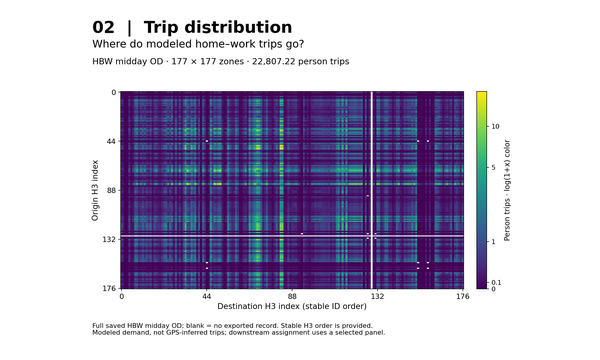</a></td>
</tr>
<tr class="atlas-card-meta-row" data-stage="boston-distribution">
<td class="atlas-meta-cell" colspan="6" width="50%"><small class="atlas-meta">Zonal OD construction for the bounded semantic scenario.</small></td>
<td class="atlas-meta-cell" colspan="6" width="50%"><small class="atlas-meta">Trip distribution · bounded example</small></td>
</tr>
<tr class="atlas-card-links-row" data-stage="boston-distribution">
<td class="atlas-links-cell" colspan="6" width="50%"><small class="atlas-links"><a href="cases/boston.html#demand-transit-and-observations">Evidence</a> · <a href="assets/homepage_evidence_r2/row_07_boston.png">Figure</a></small></td>
<td class="atlas-links-cell" colspan="6" width="50%"><small class="atlas-links"><a href="cases/boston.html#stage-02-trip-distribution">Evidence</a> · <a href="assets/boston/four_step_results_r1/step2_distribution.png">Figure</a></small></td>
</tr>
</tbody></table>

<table class="atlas-city-table" data-city="boston" data-stage="boston-mode" width="100%"><colgroup><col width="8.333%"/><col width="8.333%"/><col width="8.333%"/><col width="8.333%"/><col width="8.333%"/><col width="8.333%"/><col width="8.333%"/><col width="8.333%"/><col width="8.333%"/><col width="8.333%"/><col width="8.333%"/><col width="8.333%"/></colgroup><tbody>
<tr class="atlas-stage-heading" data-columns="2" data-items="2" data-stage="boston-mode"><th colspan="12"><h4 id="mode-choice">Mode choice</h4></th></tr>
<tr class="atlas-card-title-row" data-stage="boston-mode">
<th class="atlas-title-cell" colspan="6" scope="col" width="50%"><strong>Mode choice — mode-specific demand</strong></th>
<th class="atlas-title-cell" colspan="6" scope="col" width="50%"><strong>Service-response mode choice</strong></th>
</tr>
<tr class="atlas-card-preview-row" data-stage="boston-mode">
<td class="atlas-card-cell" colspan="6" width="50%"></td>
<td class="atlas-card-cell" colspan="6" width="50%"><a href="cases/boston.html#stage-03-mode-choice">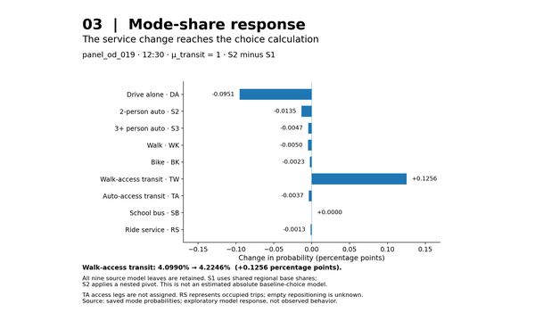</a></td>
</tr>
<tr class="atlas-card-meta-row" data-stage="boston-mode">
<td class="atlas-meta-cell" colspan="6" width="50%"><small class="atlas-meta">S1/S2 service response and conditional absolute choice remain separate.</small></td>
<td class="atlas-meta-cell" colspan="6" width="50%"><small class="atlas-meta">Mode choice · S1/S2 sensitivity</small></td>
</tr>
<tr class="atlas-card-links-row" data-stage="boston-mode">
<td class="atlas-links-cell" colspan="6" width="50%"><small class="atlas-links"><a href="cases/boston.html#demand-transit-and-observations">Evidence</a> · <a href="assets/homepage_evidence_r2/row_08_boston.png">Figure</a></small></td>
<td class="atlas-links-cell" colspan="6" width="50%"><small class="atlas-links"><a href="cases/boston.html#stage-03-mode-choice">Evidence</a> · <a href="assets/boston/four_step_results_r1/step3_mode_response.png">Figure</a></small></td>
</tr>
</tbody></table>

<table class="atlas-city-table" data-city="boston" data-stage="boston-static" width="100%"><colgroup><col width="8.333%"/><col width="8.333%"/><col width="8.333%"/><col width="8.333%"/><col width="8.333%"/><col width="8.333%"/><col width="8.333%"/><col width="8.333%"/><col width="8.333%"/><col width="8.333%"/><col width="8.333%"/><col width="8.333%"/></colgroup><tbody>
<tr class="atlas-stage-heading" data-columns="4" data-items="4" data-stage="boston-static"><th colspan="12"><h4 id="static-assignment-methods">Static assignment methods</h4></th></tr>
<tr class="atlas-card-title-row" data-stage="boston-static">
<th class="atlas-title-cell" colspan="3" scope="col" width="25%"><strong>Frank–Wolfe</strong> <small class="atlas-depth-badge">[A]</small></th>
<th class="atlas-title-cell" colspan="3" scope="col" width="25%"><strong>Official tap-b Algorithm B</strong> <small class="atlas-depth-badge">[A]</small></th>
<th class="atlas-title-cell" colspan="3" scope="col" width="25%"><strong>Finite-path reference</strong> <small class="atlas-depth-badge">[A]</small></th>
<th class="atlas-title-cell" colspan="3" scope="col" width="25%"><strong>Native Diagnostic L3 / compression</strong> <small class="atlas-depth-badge">[A]</small></th>
</tr>
<tr class="atlas-card-preview-row" data-stage="boston-static">
<td class="atlas-card-cell" colspan="3" width="25%"></td>
<td class="atlas-card-cell" colspan="3" width="25%"></td>
<td class="atlas-card-cell" colspan="3" width="25%"></td>
<td class="atlas-card-cell" colspan="3" width="25%"><a href="cases/boston-assignment.html#controlled-comparison-board">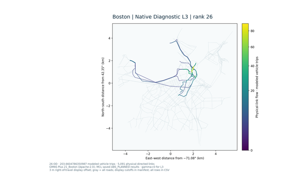</a></td>
</tr>
<tr class="atlas-card-meta-row" data-stage="boston-static">
<td class="atlas-meta-cell" colspan="3" width="25%"><small class="atlas-meta">Expanded Boston FW, up to 17,522 loaded node ODs; separate from 26-OD controls.</small></td>
<td class="atlas-meta-cell" colspan="3" width="25%"><small class="atlas-meta">B0/B1 numerical transfer via task-local lossless TAPLab-compatible adapter.</small></td>
<td class="atlas-meta-cell" colspan="3" width="25%"><small class="atlas-meta">26 OD, 130-path uncompressed SLSQP reference on ABS_PLANNED.</small></td>
<td class="atlas-meta-cell" colspan="3" width="25%"><small class="atlas-meta">ABS_PLANNED 26-OD; rank-26 diagnostic</small></td>
</tr>
<tr class="atlas-card-links-row" data-stage="boston-static">
<td class="atlas-links-cell" colspan="3" width="25%"><small class="atlas-links"><a href="cases/boston-assignment.html#primary-scale-result-versus-controlled-method-comparison">Evidence</a> · <a href="assets/homepage_evidence_r2/row_10_boston.png">Figure</a></small></td>
<td class="atlas-links-cell" colspan="3" width="25%"><small class="atlas-links"><a href="cases/boston-algorithm-b.html">Evidence</a> · <a href="assets/homepage_evidence_r2/row_11_boston.png">Figure</a></small></td>
<td class="atlas-links-cell" colspan="3" width="25%"><small class="atlas-links"><a href="cases/boston-assignment.html#same-instance-saved-result">Evidence</a> · <a href="assets/homepage_evidence_r2/row_12_boston.png">Figure</a></small></td>
<td class="atlas-links-cell" colspan="3" width="25%"><small class="atlas-links"><a href="cases/boston-assignment.html#controlled-comparison-board">Evidence</a> · <a href="assets/boston/assignment_methods_r1/boston_abs_planned_l3_rank26_flow.png">Figure</a></small></td>
</tr>
</tbody></table>

<table class="atlas-city-table" data-city="boston" data-stage="boston-finite" width="100%"><colgroup><col width="8.333%"/><col width="8.333%"/><col width="8.333%"/><col width="8.333%"/><col width="8.333%"/><col width="8.333%"/><col width="8.333%"/><col width="8.333%"/><col width="8.333%"/><col width="8.333%"/><col width="8.333%"/><col width="8.333%"/></colgroup><tbody>
<tr class="atlas-stage-heading" data-columns="4" data-items="15" data-stage="boston-finite"><th colspan="12"><h4 id="finite-time-expanded-computation">Finite time-expanded computation</h4></th></tr>
<tr class="atlas-card-title-row" data-stage="boston-finite">
<th class="atlas-title-cell" colspan="3" scope="col" width="25%"><strong>Network construction and generated columns</strong> <small class="atlas-depth-badge">[B · C]</small></th>
<th class="atlas-title-cell" colspan="3" scope="col" width="25%"><strong>Arc-flow LP reference</strong> <small class="atlas-depth-badge">[D]</small></th>
<th class="atlas-title-cell" colspan="3" scope="col" width="25%"><strong>Two-phase column generation</strong> <small class="atlas-depth-badge">[B]</small></th>
<th class="atlas-title-cell" colspan="3" scope="col" width="25%"><strong>Lagrangian</strong> <small class="atlas-depth-badge">[B · D]</small></th>
</tr>
<tr class="atlas-card-preview-row" data-stage="boston-finite">
<td class="atlas-card-cell" colspan="3" width="25%"></td>
<td class="atlas-card-cell" colspan="3" width="25%"></td>
<td class="atlas-card-cell" colspan="3" width="25%"></td>
<td class="atlas-card-cell" colspan="3" width="25%"></td>
</tr>
<tr class="atlas-card-meta-row" data-stage="boston-finite">
<td class="atlas-meta-cell" colspan="3" width="25%"><small class="atlas-meta">90-node/125-link/10-OD finite graph; saved time-indexed column.</small></td>
<td class="atlas-meta-cell" colspan="3" width="25%"><small class="atlas-meta">Own-graph LP reference for the bounded ten-OD fixed-cost instance.</small></td>
<td class="atlas-meta-cell" colspan="3" width="25%"><small class="atlas-meta">Phase I/II and independent 10/10 pricing closure.</small></td>
<td class="atlas-meta-cell" colspan="3" width="25%"><small class="atlas-meta">Feasible primal, but frozen 1% gap gate missed (1.1002%).</small></td>
</tr>
<tr class="atlas-card-links-row" data-stage="boston-finite">
<td class="atlas-links-cell" colspan="3" width="25%"><small class="atlas-links"><a href="cases/boston-space-time.html#from-the-physical-network-to-the-finite-time-expanded-graph">Evidence</a> · <a href="assets/homepage_evidence_r2/row_14_boston.png">Figure</a></small></td>
<td class="atlas-links-cell" colspan="3" width="25%"><small class="atlas-links"><a href="cases/boston-space-time.html#reference-objective-agreement">Evidence</a> · <a href="assets/homepage_evidence_r2/row_15_boston.png">Figure</a></small></td>
<td class="atlas-links-cell" colspan="3" width="25%"><small class="atlas-links"><a href="cases/boston-space-time.html#phase-i-restores-feasibility">Evidence</a> · <a href="assets/homepage_evidence_r2/row_16_boston.png">Figure</a></small></td>
<td class="atlas-links-cell" colspan="3" width="25%"><small class="atlas-links"><a href="cases/boston.html#finite-time-expanded-algorithms">Evidence</a> · <a href="assets/homepage_evidence_r2/row_17_boston.png">Figure</a></small></td>
</tr>
<tr class="atlas-card-title-row" data-stage="boston-finite">
<th class="atlas-title-cell" colspan="3" scope="col" width="25%"><strong>ADMM</strong> <small class="atlas-depth-badge">[B · D]</small></th>
<th class="atlas-title-cell" colspan="3" scope="col" width="25%"><strong>Case-sequence overview</strong></th>
<th class="atlas-title-cell" colspan="3" scope="col" width="25%"><strong>Physical to time-expanded graph</strong> <small class="atlas-depth-badge">[C]</small></th>
<th class="atlas-title-cell" colspan="3" scope="col" width="25%"><strong>Generated time-indexed column</strong> <small class="atlas-depth-badge">[B · C]</small></th>
</tr>
<tr class="atlas-card-preview-row" data-stage="boston-finite">
<td class="atlas-card-cell" colspan="3" width="25%"></td>
<td class="atlas-card-cell" colspan="3" width="25%"><a href="cases/boston-space-time.html#case-role-scope-and-model-statistics">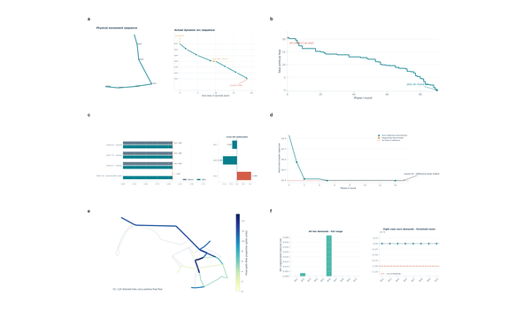</a></td>
<td class="atlas-card-cell" colspan="3" width="25%"><a href="cases/boston-space-time.html#from-the-physical-network-to-the-finite-time-expanded-graph">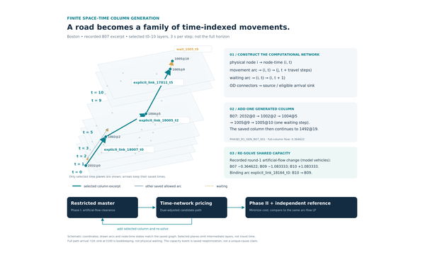</a></td>
<td class="atlas-card-cell" colspan="3" width="25%"><a href="cases/boston-space-time.html#a-generated-column-as-a-time-indexed-path">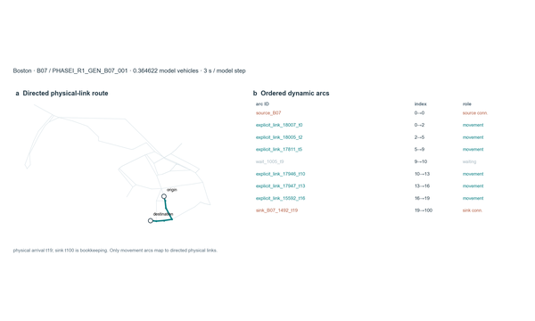</a></td>
</tr>
<tr class="atlas-card-meta-row" data-stage="boston-finite">
<td class="atlas-meta-cell" colspan="3" width="25%"><small class="atlas-meta">Ten-OD original-space checks; own-LP gap 6.68e-6.</small></td>
<td class="atlas-meta-cell" colspan="3" width="25%"><small class="atlas-meta">CG · 10-OD</small></td>
<td class="atlas-meta-cell" colspan="3" width="25%"><small class="atlas-meta">CG construction · 10-OD</small></td>
<td class="atlas-meta-cell" colspan="3" width="25%"><small class="atlas-meta">CG column · 10-OD</small></td>
</tr>
<tr class="atlas-card-links-row" data-stage="boston-finite">
<td class="atlas-links-cell" colspan="3" width="25%"><small class="atlas-links"><a href="cases/boston-admm.html">Evidence</a> · <a href="assets/homepage_evidence_r2/row_18_boston.png">Figure</a></small></td>
<td class="atlas-links-cell" colspan="3" width="25%"><small class="atlas-links"><a href="cases/boston-space-time.html#case-role-scope-and-model-statistics">Evidence</a> · <a href="assets/presentation_r5/boston_cg_case_sequence.png">Figure</a></small></td>
<td class="atlas-links-cell" colspan="3" width="25%"><small class="atlas-links"><a href="cases/boston-space-time.html#from-the-physical-network-to-the-finite-time-expanded-graph">Evidence</a> · <a href="assets/cg_layered_companions_r1/boston_layered_space_time_construction.png">Figure</a></small></td>
<td class="atlas-links-cell" colspan="3" width="25%"><small class="atlas-links"><a href="cases/boston-space-time.html#a-generated-column-as-a-time-indexed-path">Evidence</a> · <a href="assets/three_city_r2/boston_generated_column_time_indexed_path.png">Figure</a></small></td>
</tr>
<tr class="atlas-card-title-row" data-stage="boston-finite">
<th class="atlas-title-cell" colspan="3" scope="col" width="25%"><strong>Phase I artificial-flow clearance</strong> <small class="atlas-depth-badge">[B]</small></th>
<th class="atlas-title-cell" colspan="3" scope="col" width="25%"><strong>Shared-capacity event</strong> <small class="atlas-depth-badge">[D]</small></th>
<th class="atlas-title-cell" colspan="3" scope="col" width="25%"><strong>Phase II objective</strong> <small class="atlas-depth-badge">[B]</small></th>
<th class="atlas-title-cell" colspan="3" scope="col" width="25%"><strong>Final physical-link movement flow</strong> <small class="atlas-depth-badge">[C · D]</small></th>
</tr>
<tr class="atlas-card-preview-row" data-stage="boston-finite">
<td class="atlas-card-cell" colspan="3" width="25%"><a href="cases/boston-space-time.html#phase-i-restores-feasibility">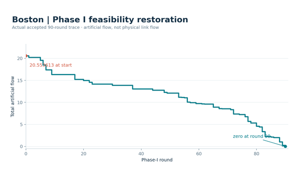</a></td>
<td class="atlas-card-cell" colspan="3" width="25%"><a href="cases/boston-space-time.html#shared-capacity-couples-different-od-demands">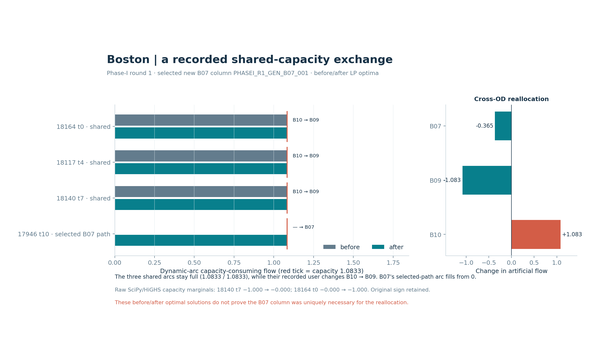</a></td>
<td class="atlas-card-cell" colspan="3" width="25%"><a href="cases/boston-space-time.html#phase-ii-improves-the-real-path-objective">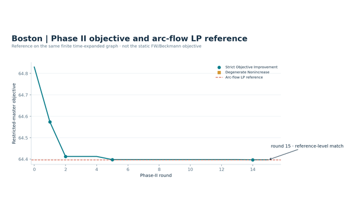</a></td>
<td class="atlas-card-cell" colspan="3" width="25%"><a href="cases/boston-space-time.html#from-time-expanded-flows-back-to-final-physical-link-movement-flow">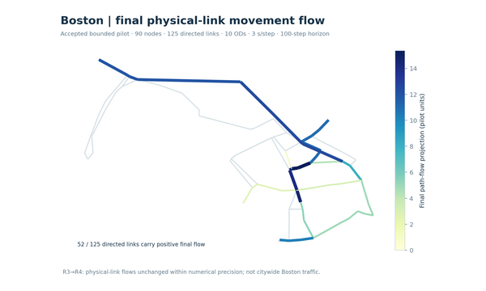</a></td>
</tr>
<tr class="atlas-card-meta-row" data-stage="boston-finite">
<td class="atlas-meta-cell" colspan="3" width="25%"><small class="atlas-meta">CG Phase I · 10-OD</small></td>
<td class="atlas-meta-cell" colspan="3" width="25%"><small class="atlas-meta">CG capacity · 10-OD</small></td>
<td class="atlas-meta-cell" colspan="3" width="25%"><small class="atlas-meta">CG Phase II · 10-OD</small></td>
<td class="atlas-meta-cell" colspan="3" width="25%"><small class="atlas-meta">CG flow · 10-OD</small></td>
</tr>
<tr class="atlas-card-links-row" data-stage="boston-finite">
<td class="atlas-links-cell" colspan="3" width="25%"><small class="atlas-links"><a href="cases/boston-space-time.html#phase-i-restores-feasibility">Evidence</a> · <a href="assets/boston/space_time_cg_r4/boston_phase_i_artificial_flow.png">Figure</a></small></td>
<td class="atlas-links-cell" colspan="3" width="25%"><small class="atlas-links"><a href="cases/boston-space-time.html#shared-capacity-couples-different-od-demands">Evidence</a> · <a href="assets/boston/space_time_cg_r4/boston_shared_capacity_event.png">Figure</a></small></td>
<td class="atlas-links-cell" colspan="3" width="25%"><small class="atlas-links"><a href="cases/boston-space-time.html#phase-ii-improves-the-real-path-objective">Evidence</a> · <a href="assets/boston/space_time_cg_r4/boston_phase_ii_objective.png">Figure</a></small></td>
<td class="atlas-links-cell" colspan="3" width="25%"><small class="atlas-links"><a href="cases/boston-space-time.html#from-time-expanded-flows-back-to-final-physical-link-movement-flow">Evidence</a> · <a href="assets/boston/space_time_cg_r4/boston_cg_final_physical_link_flow.png">Figure</a></small></td>
</tr>
<tr class="atlas-card-title-row" data-stage="boston-finite">
<th class="atlas-title-cell" colspan="3" scope="col" width="25%"><strong>Independent pricing closure</strong> <small class="atlas-depth-badge">[B · D]</small></th>
<th class="atlas-title-cell" colspan="3" scope="col" width="25%"><strong>ADMM convergence</strong> <small class="atlas-depth-badge">[B · D]</small></th>
<th class="atlas-title-cell" colspan="3" scope="col" width="25%"><strong>ADMM physical flow and LP difference</strong> <small class="atlas-depth-badge">[B · D]</small></th>
<th aria-hidden="true" class="atlas-empty" colspan="3" width="25%"></th>
</tr>
<tr class="atlas-card-preview-row" data-stage="boston-finite">
<td class="atlas-card-cell" colspan="3" width="25%"><a href="cases/boston-space-time.html#independent-pricing-closure">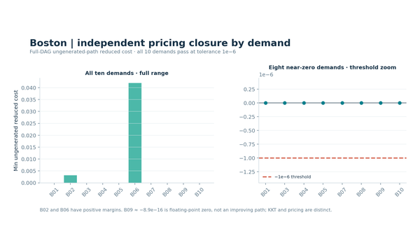</a></td>
<td class="atlas-card-cell" colspan="3" width="25%"><a href="cases/boston-admm.html#original-saved-convergence-view">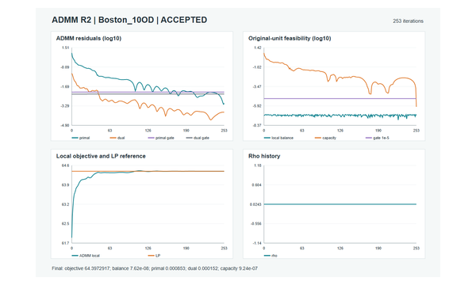</a></td>
<td class="atlas-card-cell" colspan="3" width="25%"><a href="cases/boston-admm.html#physical-link-movement-flow-and-lp-comparison">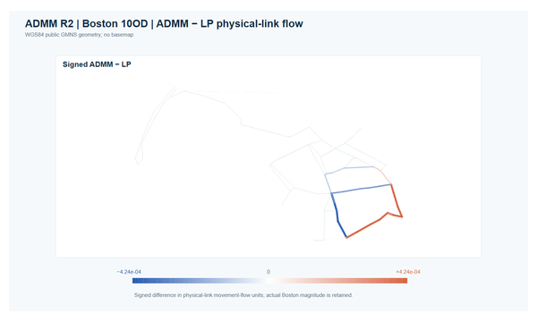</a></td>
<td aria-hidden="true" class="atlas-empty" colspan="3" width="25%"></td>
</tr>
<tr class="atlas-card-meta-row" data-stage="boston-finite">
<td class="atlas-meta-cell" colspan="3" width="25%"><small class="atlas-meta">CG pricing · 10/10</small></td>
<td class="atlas-meta-cell" colspan="3" width="25%"><small class="atlas-meta">R2_S 10-OD accepted</small></td>
<td class="atlas-meta-cell" colspan="3" width="25%"><small class="atlas-meta">R2_S 10-OD accepted</small></td>
<td aria-hidden="true" class="atlas-empty" colspan="3" width="25%"></td>
</tr>
<tr class="atlas-card-links-row" data-stage="boston-finite">
<td class="atlas-links-cell" colspan="3" width="25%"><small class="atlas-links"><a href="cases/boston-space-time.html#independent-pricing-closure">Evidence</a> · <a href="assets/boston/space_time_cg_r4/boston_pricing_closure_by_demand.png">Figure</a></small></td>
<td class="atlas-links-cell" colspan="3" width="25%"><small class="atlas-links"><a href="cases/boston-admm.html#original-saved-convergence-view">Evidence</a> · <a href="assets/admm_r2/figures/convergence_Boston_10OD.png">Figure</a></small></td>
<td class="atlas-links-cell" colspan="3" width="25%"><small class="atlas-links"><a href="cases/boston-admm.html#physical-link-movement-flow-and-lp-comparison">Evidence</a> · <a href="assets/admm_r2/figures/admm_boston_10od_minus_lp.png">Figure</a></small></td>
<td aria-hidden="true" class="atlas-empty" colspan="3" width="25%"></td>
</tr>
</tbody></table>

</article>

<article class="case-atlas" data-city="sioux-falls">
<h3 id="sioux-falls-1">Sioux Falls</h3>

Supplied-OD controlled static benchmark and separate historical selected-OD finite cases; not a four-stage city compiler. <a href="cases/sioux-falls.html">Open complete case →</a>

<a href="cases/sioux-falls.html">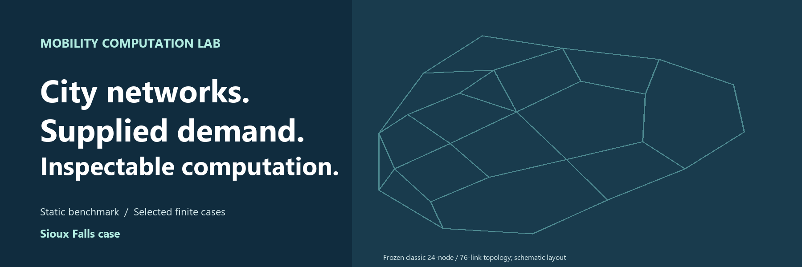</a>

<table class="atlas-quick-facts" width="100%"><colgroup><col width="25%"/><col width="25%"/><col width="25%"/><col width="25%"/></colgroup><thead><tr><th width="25%">City/model foundation</th><th width="25%">Static assignment</th><th width="25%">Finite time-expanded</th><th width="25%">Observation/data scope</th></tr></thead>
<tbody><tr><td width="25%">24 nodes; 76 directed links; supplied benchmark OD</td><td width="25%">528 positive OD records; official Algorithm B, historical FW and native controls</td><td width="25%">24 nodes; 64/69 selected links; 200/250 ODs</td><td width="25%">No modern city population, GTFS, GPS or detector stage</td></tr></tbody></table>

<a href="#sioux-falls-sources">Sources and GMNS</a> · <a href="#sioux-falls-population">Population, households and activity</a> · <a href="#sioux-falls-transit">Transit and observations</a> · <a href="#sioux-falls-generation">Trip generation</a> · <a href="#sioux-falls-distribution">Trip distribution</a> · <a href="#sioux-falls-mode">Mode choice</a> · <a href="#sioux-falls-static">Static assignment methods</a> · <a href="#sioux-falls-finite">Finite time-expanded computation</a> · <a href="cases/sioux-falls.html#reproduction">Tools and reproducibility</a>

<table class="atlas-city-table atlas-benchmark-table" data-city="sioux-falls" width="100%"><colgroup><col width="8.333%"/><col width="8.333%"/><col width="8.333%"/><col width="8.333%"/><col width="8.333%"/><col width="8.333%"/><col width="8.333%"/><col width="8.333%"/><col width="8.333%"/><col width="8.333%"/><col width="8.333%"/><col width="8.333%"/></colgroup><tbody>
<tr class="atlas-benchmark-heading"><th colspan="12"><h4 id="city-data-and-four-stage-scope">City-data and four-stage scope</h4></th></tr>
<tr class="atlas-benchmark-header"><th colspan="4" width="33.333%">Stage</th><th colspan="4" width="33.333%">Scope in Sioux Falls benchmark</th><th colspan="4" width="33.333%">Relevant next entry</th></tr>
<tr class="atlas-benchmark-row"><td colspan="4" width="33.333%">Population, households and activity</td><td colspan="4" width="33.333%">Not part of the supplied benchmark</td><td colspan="4" width="33.333%"><a href="#sioux-falls-static">Static assignment</a></td></tr>
<tr class="atlas-benchmark-row"><td colspan="4" width="33.333%">Transit and observations</td><td colspan="4" width="33.333%">Not part of the supplied benchmark</td><td colspan="4" width="33.333%"><a href="#sioux-falls-static">Static assignment</a></td></tr>
<tr class="atlas-benchmark-row"><td colspan="4" width="33.333%">Trip generation</td><td colspan="4" width="33.333%">Supplied OD enters downstream methods directly</td><td colspan="4" width="33.333%"><a href="#sioux-falls-static">Static assignment</a></td></tr>
<tr class="atlas-benchmark-row"><td colspan="4" width="33.333%">Trip distribution</td><td colspan="4" width="33.333%">Supplied OD enters downstream methods directly</td><td colspan="4" width="33.333%"><a href="#sioux-falls-static">Static assignment</a></td></tr>
<tr class="atlas-benchmark-row"><td colspan="4" width="33.333%">Mode choice</td><td colspan="4" width="33.333%">Vehicle OD is supplied; no mode-choice run</td><td colspan="4" width="33.333%"><a href="#sioux-falls-static">Static assignment</a></td></tr>
</tbody></table>

<table class="atlas-city-table" data-city="sioux-falls" data-stage="sioux-falls-sources" width="100%"><colgroup><col width="8.333%"/><col width="8.333%"/><col width="8.333%"/><col width="8.333%"/><col width="8.333%"/><col width="8.333%"/><col width="8.333%"/><col width="8.333%"/><col width="8.333%"/><col width="8.333%"/><col width="8.333%"/><col width="8.333%"/></colgroup><tbody>
<tr class="atlas-stage-heading" data-columns="3" data-items="3" data-stage="sioux-falls-sources"><th colspan="12"><h4 id="sources-and-gmns-1">Sources and GMNS</h4></th></tr>
<tr class="atlas-card-title-row" data-stage="sioux-falls-sources">
<th class="atlas-title-cell" colspan="4" scope="col" width="33.333%"><strong>Source data and preparation</strong></th>
<th class="atlas-title-cell" colspan="4" scope="col" width="33.333%"><strong>GMNS network, zones and access</strong> <small class="atlas-depth-badge">[C]</small></th>
<th class="atlas-title-cell" colspan="4" scope="col" width="33.333%"><strong>Classic network topology</strong> <small class="atlas-depth-badge">[C]</small></th>
</tr>
<tr class="atlas-card-preview-row" data-stage="sioux-falls-sources">
<td class="atlas-card-cell" colspan="4" width="33.333%"></td>
<td class="atlas-card-cell" colspan="4" width="33.333%"></td>
<td class="atlas-card-cell" colspan="4" width="33.333%"><a href="cases/sioux-falls.html#gmns-zones-and-source-evidence">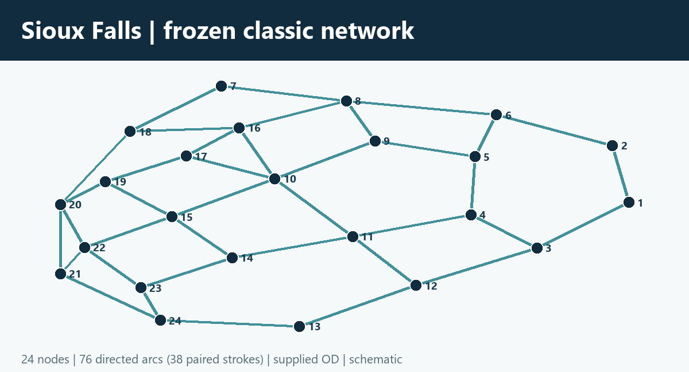</a></td>
</tr>
<tr class="atlas-card-meta-row" data-stage="sioux-falls-sources">
<td class="atlas-meta-cell" colspan="4" width="33.333%"><small class="atlas-meta">Frozen classic 24-node/76-link source graph and supplied vehicle OD.</small></td>
<td class="atlas-meta-cell" colspan="4" width="33.333%"><small class="atlas-meta">24-node, 76-link supplied directed benchmark; schematic topology, no city zone hierarchy.</small></td>
<td class="atlas-meta-cell" colspan="4" width="33.333%"><small class="atlas-meta">Network · 24-node / 76-link</small></td>
</tr>
<tr class="atlas-card-links-row" data-stage="sioux-falls-sources">
<td class="atlas-links-cell" colspan="4" width="33.333%"><small class="atlas-links"><a href="cases/sioux-falls.html#gmns-zones-and-source-evidence">Evidence</a> · <a href="assets/homepage_evidence_r2/row_01_sioux_falls.png">Figure</a></small></td>
<td class="atlas-links-cell" colspan="4" width="33.333%"><small class="atlas-links"><a href="cases/sioux-falls.html#gmns-zones-and-source-evidence">Evidence</a> · <a href="assets/homepage_alignment_r3/sioux_gmns_directed_objects.png">Figure</a></small></td>
<td class="atlas-links-cell" colspan="4" width="33.333%"><small class="atlas-links"><a href="cases/sioux-falls.html#gmns-zones-and-source-evidence">Evidence</a> · <a href="assets/homepage_evidence_r1/sioux_falls_classic_topology.png">Figure</a></small></td>
</tr>
</tbody></table>

<table class="atlas-city-table" data-city="sioux-falls" data-stage="sioux-falls-static" width="100%"><colgroup><col width="8.333%"/><col width="8.333%"/><col width="8.333%"/><col width="8.333%"/><col width="8.333%"/><col width="8.333%"/><col width="8.333%"/><col width="8.333%"/><col width="8.333%"/><col width="8.333%"/><col width="8.333%"/><col width="8.333%"/></colgroup><tbody>
<tr class="atlas-stage-heading" data-columns="4" data-items="4" data-stage="sioux-falls-static"><th colspan="12"><h4 id="static-assignment-methods-1">Static assignment methods</h4></th></tr>
<tr class="atlas-card-title-row" data-stage="sioux-falls-static">
<th class="atlas-title-cell" colspan="3" scope="col" width="25%"><strong>Frank–Wolfe</strong> <small class="atlas-depth-badge">[A]</small></th>
<th class="atlas-title-cell" colspan="3" scope="col" width="25%"><strong>Official tap-b Algorithm B</strong> <small class="atlas-depth-badge">[A]</small></th>
<th class="atlas-title-cell" colspan="3" scope="col" width="25%"><strong>Finite-path reference</strong> <small class="atlas-depth-badge">[A]</small></th>
<th class="atlas-title-cell" colspan="3" scope="col" width="25%"><strong>Native Diagnostic L3 / compression</strong> <small class="atlas-depth-badge">[A]</small></th>
</tr>
<tr class="atlas-card-preview-row" data-stage="sioux-falls-static">
<td class="atlas-card-cell" colspan="3" width="25%"><a href="datasets/sioux-static-fw.html">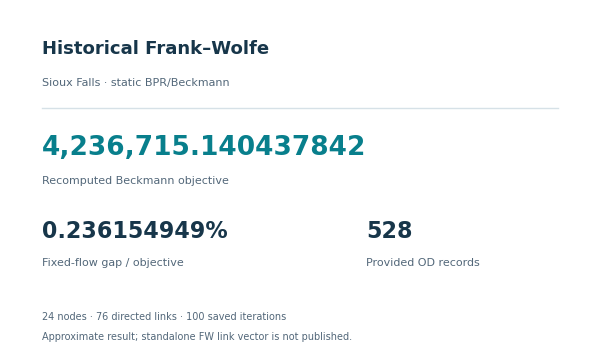</a></td>
<td class="atlas-card-cell" colspan="3" width="25%"></td>
<td class="atlas-card-cell" colspan="3" width="25%"></td>
<td class="atlas-card-cell" colspan="3" width="25%"><a href="cases/sioux-falls.html#static-assignment">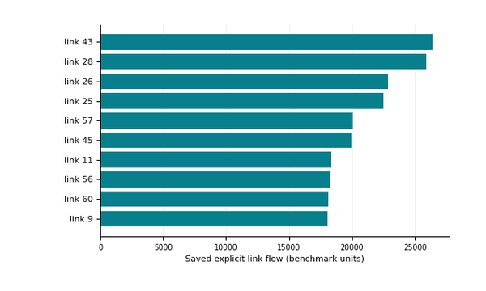</a></td>
</tr>
<tr class="atlas-card-meta-row" data-stage="sioux-falls-static">
<td class="atlas-meta-cell" colspan="3" width="25%"><small class="atlas-meta">528-OD historical approximate result; saved objective and gap</small></td>
<td class="atlas-meta-cell" colspan="3" width="25%"><small class="atlas-meta">Official TAPLab registered-adapter parity passes on Sioux Falls.</small></td>
<td class="atlas-meta-cell" colspan="3" width="25%"><small class="atlas-meta">Frozen 2,218-path static representation; numerical profile is not city demand.</small></td>
<td class="atlas-meta-cell" colspan="3" width="25%"><small class="atlas-meta">rank-50 diagnostic; not UE</small></td>
</tr>
<tr class="atlas-card-links-row" data-stage="sioux-falls-static">
<td class="atlas-links-cell" colspan="3" width="25%"><small class="atlas-links"><a href="datasets/sioux-static-fw.html">Evidence</a> · <a href="assets/homepage_alignment_r3/sioux_historical_fw_summary.png">Figure</a></small></td>
<td class="atlas-links-cell" colspan="3" width="25%"><small class="atlas-links"><a href="cases/sioux-algorithm-b.html">Evidence</a> · <a href="assets/homepage_evidence_r2/row_11_sioux_falls.png">Figure</a></small></td>
<td class="atlas-links-cell" colspan="3" width="25%"><small class="atlas-links"><a href="cases/sioux-falls.html#static-assignment">Evidence</a> · <a href="assets/homepage_evidence_r2/row_12_sioux_falls.png">Figure</a></small></td>
<td class="atlas-links-cell" colspan="3" width="25%"><small class="atlas-links"><a href="cases/sioux-falls.html#static-assignment">Evidence</a> · <a href="assets/homepage_alignment_r3/sioux_native_l3_rank50_link_flows.png">Figure</a></small></td>
</tr>
</tbody></table>

<table class="atlas-city-table" data-city="sioux-falls" data-stage="sioux-falls-finite" width="100%"><colgroup><col width="8.333%"/><col width="8.333%"/><col width="8.333%"/><col width="8.333%"/><col width="8.333%"/><col width="8.333%"/><col width="8.333%"/><col width="8.333%"/><col width="8.333%"/><col width="8.333%"/><col width="8.333%"/><col width="8.333%"/></colgroup><tbody>
<tr class="atlas-stage-heading" data-columns="4" data-items="17" data-stage="sioux-falls-finite"><th colspan="12"><h4 id="finite-time-expanded-computation-1">Finite time-expanded computation</h4></th></tr>
<tr class="atlas-card-title-row" data-stage="sioux-falls-finite">
<th class="atlas-title-cell" colspan="3" scope="col" width="25%"><strong>Network construction and generated columns</strong> <small class="atlas-depth-badge">[B · C]</small></th>
<th class="atlas-title-cell" colspan="3" scope="col" width="25%"><strong>Arc-flow LP reference</strong> <small class="atlas-depth-badge">[D]</small></th>
<th class="atlas-title-cell" colspan="3" scope="col" width="25%"><strong>Two-phase column generation</strong> <small class="atlas-depth-badge">[B]</small></th>
<th class="atlas-title-cell" colspan="3" scope="col" width="25%"><strong>Lagrangian</strong> <small class="atlas-depth-badge">[B · D]</small></th>
</tr>
<tr class="atlas-card-preview-row" data-stage="sioux-falls-finite">
<td class="atlas-card-cell" colspan="3" width="25%"></td>
<td class="atlas-card-cell" colspan="3" width="25%"></td>
<td class="atlas-card-cell" colspan="3" width="25%"></td>
<td class="atlas-card-cell" colspan="3" width="25%"></td>
</tr>
<tr class="atlas-card-meta-row" data-stage="sioux-falls-finite">
<td class="atlas-meta-cell" colspan="3" width="25%"><small class="atlas-meta">Selected 200/250-OD finite graphs; saved time-indexed columns.</small></td>
<td class="atlas-meta-cell" colspan="3" width="25%"><small class="atlas-meta">Own selected-graph LP references for historical 200/250 ODs.</small></td>
<td class="atlas-meta-cell" colspan="3" width="25%"><small class="atlas-meta">200/250-OD own-LP agreement; independent full-DAG closure not established.</small></td>
<td class="atlas-meta-cell" colspan="3" width="25%"><small class="atlas-meta">Selected 200/250-OD feasible recovery and certified bounded gaps.</small></td>
</tr>
<tr class="atlas-card-links-row" data-stage="sioux-falls-finite">
<td class="atlas-links-cell" colspan="3" width="25%"><small class="atlas-links"><a href="cases/sioux-space-time.html#from-the-physical-network-to-the-finite-time-expanded-graph">Evidence</a> · <a href="assets/homepage_evidence_r2/row_14_sioux_falls.png">Figure</a></small></td>
<td class="atlas-links-cell" colspan="3" width="25%"><small class="atlas-links"><a href="cases/sioux-space-time.html#reference-objective-agreement">Evidence</a> · <a href="assets/homepage_evidence_r2/row_15_sioux_falls.png">Figure</a></small></td>
<td class="atlas-links-cell" colspan="3" width="25%"><small class="atlas-links"><a href="cases/sioux-space-time.html#phase-i-restores-feasibility">Evidence</a> · <a href="assets/homepage_evidence_r2/row_16_sioux_falls.png">Figure</a></small></td>
<td class="atlas-links-cell" colspan="3" width="25%"><small class="atlas-links"><a href="methods/distributed-assignment.html">Evidence</a> · <a href="assets/homepage_evidence_r2/row_17_sioux_falls.png">Figure</a></small></td>
</tr>
<tr class="atlas-card-title-row" data-stage="sioux-falls-finite">
<th class="atlas-title-cell" colspan="3" scope="col" width="25%"><strong>ADMM</strong> <small class="atlas-depth-badge">[B · D]</small></th>
<th class="atlas-title-cell" colspan="3" scope="col" width="25%"><strong>200/250-OD case overview</strong></th>
<th class="atlas-title-cell" colspan="3" scope="col" width="25%"><strong>Physical to time-expanded graph</strong> <small class="atlas-depth-badge">[C]</small></th>
<th class="atlas-title-cell" colspan="3" scope="col" width="25%"><strong>Generated time-indexed column</strong> <small class="atlas-depth-badge">[B · C]</small></th>
</tr>
<tr class="atlas-card-preview-row" data-stage="sioux-falls-finite">
<td class="atlas-card-cell" colspan="3" width="25%"></td>
<td class="atlas-card-cell" colspan="3" width="25%"><a href="cases/sioux-space-time.html#case-role-scope-and-model-statistics">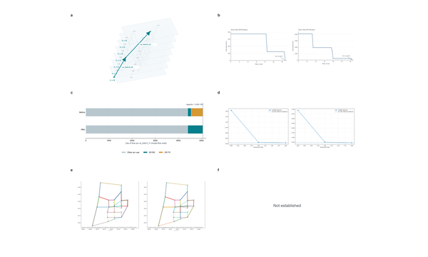</a></td>
<td class="atlas-card-cell" colspan="3" width="25%"><a href="cases/sioux-space-time.html#from-the-physical-network-to-the-finite-time-expanded-graph">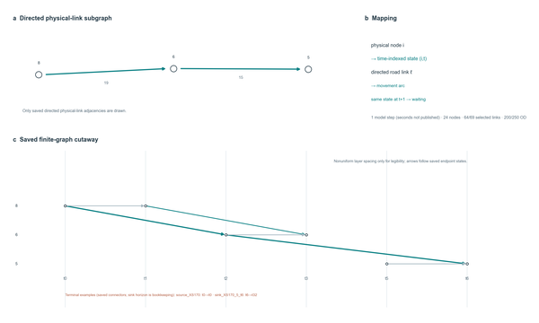</a></td>
<td class="atlas-card-cell" colspan="3" width="25%"><a href="cases/sioux-space-time.html#a-generated-column-as-a-time-indexed-path">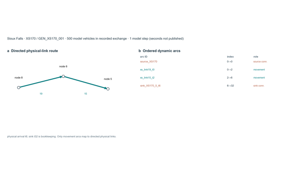</a></td>
</tr>
<tr class="atlas-card-meta-row" data-stage="sioux-falls-finite">
<td class="atlas-meta-cell" colspan="3" width="25%"><small class="atlas-meta">Selected 200/250-OD original-space checks; not the full static 528 ODs.</small></td>
<td class="atlas-meta-cell" colspan="3" width="25%"><small class="atlas-meta">CG · historical selected ODs</small></td>
<td class="atlas-meta-cell" colspan="3" width="25%"><small class="atlas-meta">CG construction · selected graph</small></td>
<td class="atlas-meta-cell" colspan="3" width="25%"><small class="atlas-meta">CG column · selected graph</small></td>
</tr>
<tr class="atlas-card-links-row" data-stage="sioux-falls-finite">
<td class="atlas-links-cell" colspan="3" width="25%"><small class="atlas-links"><a href="cases/sioux-admm.html">Evidence</a> · <a href="assets/homepage_evidence_r2/row_18_sioux_falls.png">Figure</a></small></td>
<td class="atlas-links-cell" colspan="3" width="25%"><small class="atlas-links"><a href="cases/sioux-space-time.html#case-role-scope-and-model-statistics">Evidence</a> · <a href="assets/presentation_r5/sioux_cg_case_sequence.png">Figure</a></small></td>
<td class="atlas-links-cell" colspan="3" width="25%"><small class="atlas-links"><a href="cases/sioux-space-time.html#from-the-physical-network-to-the-finite-time-expanded-graph">Evidence</a> · <a href="assets/three_city_r2/sioux_physical_to_time_expanded_graph.png">Figure</a></small></td>
<td class="atlas-links-cell" colspan="3" width="25%"><small class="atlas-links"><a href="cases/sioux-space-time.html#a-generated-column-as-a-time-indexed-path">Evidence</a> · <a href="assets/three_city_r2/sioux_generated_column_time_indexed_path.png">Figure</a></small></td>
</tr>
<tr class="atlas-card-title-row" data-stage="sioux-falls-finite">
<th class="atlas-title-cell" colspan="3" scope="col" width="25%"><strong>Phase I 200 OD</strong> <small class="atlas-depth-badge">[B]</small></th>
<th class="atlas-title-cell" colspan="3" scope="col" width="25%"><strong>Phase I 250 OD</strong> <small class="atlas-depth-badge">[B]</small></th>
<th class="atlas-title-cell" colspan="3" scope="col" width="25%"><strong>Shared-capacity reallocation</strong> <small class="atlas-depth-badge">[D]</small></th>
<th class="atlas-title-cell" colspan="3" scope="col" width="25%"><strong>Phase II / own-LP objective</strong> <small class="atlas-depth-badge">[B]</small></th>
</tr>
<tr class="atlas-card-preview-row" data-stage="sioux-falls-finite">
<td class="atlas-card-cell" colspan="3" width="25%"><a href="cases/sioux-space-time.html#200-od-pairs">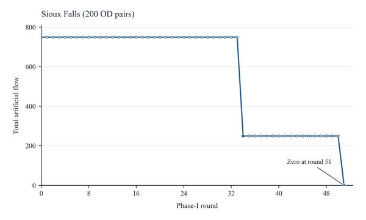</a></td>
<td class="atlas-card-cell" colspan="3" width="25%"><a href="cases/sioux-space-time.html#250-od-pairs">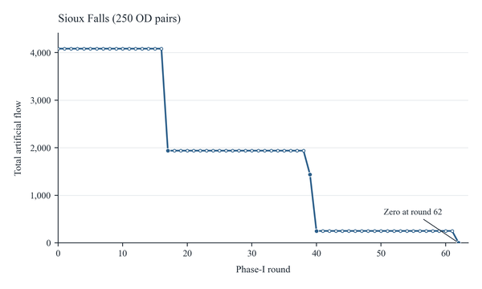</a></td>
<td class="atlas-card-cell" colspan="3" width="25%"><a href="cases/sioux-space-time.html#recorded-shared-capacity-reallocation-event">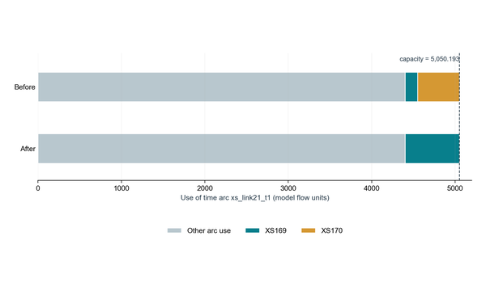</a></td>
<td class="atlas-card-cell" colspan="3" width="25%"><a href="cases/sioux-space-time.html#phase-ii-improves-the-real-path-objective">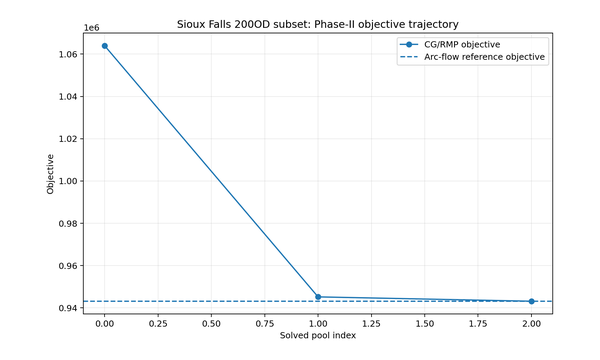</a></td>
</tr>
<tr class="atlas-card-meta-row" data-stage="sioux-falls-finite">
<td class="atlas-meta-cell" colspan="3" width="25%"><small class="atlas-meta">CG Phase I · 200-OD</small></td>
<td class="atlas-meta-cell" colspan="3" width="25%"><small class="atlas-meta">CG Phase I · 250-OD</small></td>
<td class="atlas-meta-cell" colspan="3" width="25%"><small class="atlas-meta">CG capacity · 200-OD example</small></td>
<td class="atlas-meta-cell" colspan="3" width="25%"><small class="atlas-meta">CG Phase II · selected 200-OD trace; 250-OD linked</small></td>
</tr>
<tr class="atlas-card-links-row" data-stage="sioux-falls-finite">
<td class="atlas-links-cell" colspan="3" width="25%"><small class="atlas-links"><a href="cases/sioux-space-time.html#200-od-pairs">Evidence</a> · <a href="assets/sioux/phase_i_r1/sioux_falls_200od_phase_i_academic.png">Figure</a></small></td>
<td class="atlas-links-cell" colspan="3" width="25%"><small class="atlas-links"><a href="cases/sioux-space-time.html#250-od-pairs">Evidence</a> · <a href="assets/sioux/phase_i_r1/sioux_falls_250od_phase_i_academic.png">Figure</a></small></td>
<td class="atlas-links-cell" colspan="3" width="25%"><small class="atlas-links"><a href="cases/sioux-space-time.html#recorded-shared-capacity-reallocation-event">Evidence</a> · <a href="assets/presentation_r5/sioux_shared_capacity_canonical.png">Figure</a></small></td>
<td class="atlas-links-cell" colspan="3" width="25%"><small class="atlas-links"><a href="cases/sioux-space-time.html#phase-ii-improves-the-real-path-objective">Evidence</a> · <a href="assets/benchmarks/sioux_200od_phase2_objective_trace.png">Figure</a></small></td>
</tr>
<tr class="atlas-card-title-row" data-stage="sioux-falls-finite">
<th class="atlas-title-cell" colspan="3" scope="col" width="25%"><strong>Final movement flow 200 OD</strong> <small class="atlas-depth-badge">[C · D]</small></th>
<th class="atlas-title-cell" colspan="3" scope="col" width="25%"><strong>Final movement flow 250 OD</strong> <small class="atlas-depth-badge">[C · D]</small></th>
<th class="atlas-title-cell" colspan="3" scope="col" width="25%"><strong>Lagrangian accepted recovery</strong> <small class="atlas-depth-badge">[B · D]</small></th>
<th class="atlas-title-cell" colspan="3" scope="col" width="25%"><strong>ADMM 200-OD convergence</strong> <small class="atlas-depth-badge">[B · D]</small></th>
</tr>
<tr class="atlas-card-preview-row" data-stage="sioux-falls-finite">
<td class="atlas-card-cell" colspan="3" width="25%"><a href="cases/sioux-space-time.html#from-time-expanded-flows-back-to-final-physical-link-movement-flow">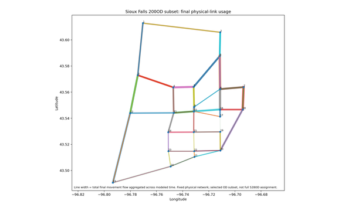</a></td>
<td class="atlas-card-cell" colspan="3" width="25%"><a href="cases/sioux-space-time.html#from-time-expanded-flows-back-to-final-physical-link-movement-flow">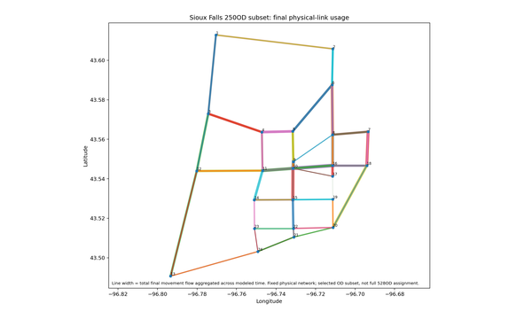</a></td>
<td class="atlas-card-cell" colspan="3" width="25%"><a href="methods/distributed-assignment.html#lagrangian-capacity-pricing-with-separate-primal-recovery">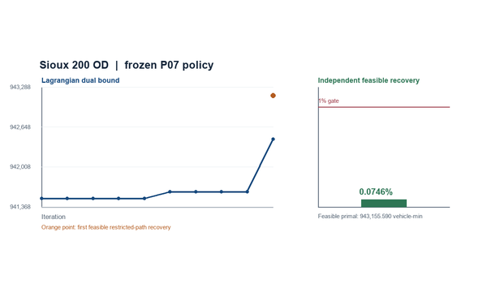</a></td>
<td class="atlas-card-cell" colspan="3" width="25%"><a href="cases/sioux-admm.html#original-saved-convergence-views">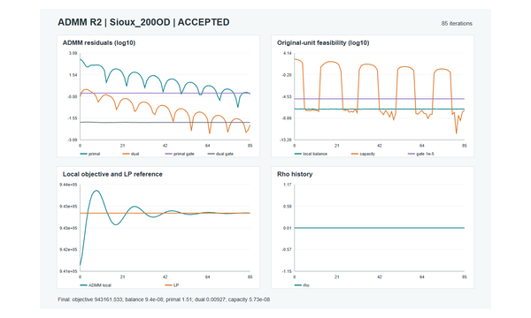</a></td>
</tr>
<tr class="atlas-card-meta-row" data-stage="sioux-falls-finite">
<td class="atlas-meta-cell" colspan="3" width="25%"><small class="atlas-meta">CG flow · 200-OD</small></td>
<td class="atlas-meta-cell" colspan="3" width="25%"><small class="atlas-meta">CG flow · 250-OD</small></td>
<td class="atlas-meta-cell" colspan="3" width="25%"><small class="atlas-meta">selected 200/250-OD</small></td>
<td class="atlas-meta-cell" colspan="3" width="25%"><small class="atlas-meta">R2_S 200-OD</small></td>
</tr>
<tr class="atlas-card-links-row" data-stage="sioux-falls-finite">
<td class="atlas-links-cell" colspan="3" width="25%"><small class="atlas-links"><a href="cases/sioux-space-time.html#from-time-expanded-flows-back-to-final-physical-link-movement-flow">Evidence</a> · <a href="assets/benchmarks/sioux_200od_final_physical_link_flow.png">Figure</a></small></td>
<td class="atlas-links-cell" colspan="3" width="25%"><small class="atlas-links"><a href="cases/sioux-space-time.html#from-time-expanded-flows-back-to-final-physical-link-movement-flow">Evidence</a> · <a href="assets/benchmarks/sioux_250od_final_physical_link_flow.png">Figure</a></small></td>
<td class="atlas-links-cell" colspan="3" width="25%"><small class="atlas-links"><a href="methods/distributed-assignment.html#lagrangian-capacity-pricing-with-separate-primal-recovery">Evidence</a> · <a href="assets/sioux/distributed_r1/Sioux_200OD_P07.png">Figure</a></small></td>
<td class="atlas-links-cell" colspan="3" width="25%"><small class="atlas-links"><a href="cases/sioux-admm.html#original-saved-convergence-views">Evidence</a> · <a href="assets/admm_r2/figures/convergence_Sioux_200OD.png">Figure</a></small></td>
</tr>
<tr class="atlas-card-title-row" data-stage="sioux-falls-finite">
<th class="atlas-title-cell" colspan="3" scope="col" width="25%"><strong>ADMM 250-OD physical flow</strong> <small class="atlas-depth-badge">[B · D]</small></th>
<th aria-hidden="true" class="atlas-empty" colspan="3" width="25%"></th>
<th aria-hidden="true" class="atlas-empty" colspan="3" width="25%"></th>
<th aria-hidden="true" class="atlas-empty" colspan="3" width="25%"></th>
</tr>
<tr class="atlas-card-preview-row" data-stage="sioux-falls-finite">
<td class="atlas-card-cell" colspan="3" width="25%"><a href="cases/sioux-admm.html#physical-link-movement-flow">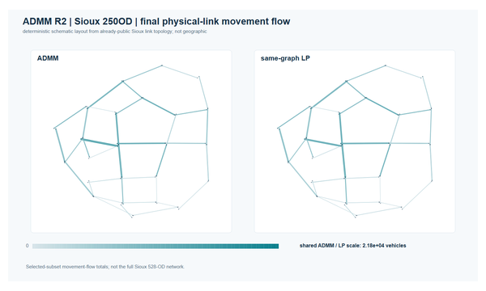</a></td>
<td aria-hidden="true" class="atlas-empty" colspan="3" width="25%"></td>
<td aria-hidden="true" class="atlas-empty" colspan="3" width="25%"></td>
<td aria-hidden="true" class="atlas-empty" colspan="3" width="25%"></td>
</tr>
<tr class="atlas-card-meta-row" data-stage="sioux-falls-finite">
<td class="atlas-meta-cell" colspan="3" width="25%"><small class="atlas-meta">R2_S 250-OD</small></td>
<td aria-hidden="true" class="atlas-empty" colspan="3" width="25%"></td>
<td aria-hidden="true" class="atlas-empty" colspan="3" width="25%"></td>
<td aria-hidden="true" class="atlas-empty" colspan="3" width="25%"></td>
</tr>
<tr class="atlas-card-links-row" data-stage="sioux-falls-finite">
<td class="atlas-links-cell" colspan="3" width="25%"><small class="atlas-links"><a href="cases/sioux-admm.html#physical-link-movement-flow">Evidence</a> · <a href="assets/admm_r2/figures/admm_sioux_250_final_physical_link_flow.png">Figure</a></small></td>
<td aria-hidden="true" class="atlas-empty" colspan="3" width="25%"></td>
<td aria-hidden="true" class="atlas-empty" colspan="3" width="25%"></td>
<td aria-hidden="true" class="atlas-empty" colspan="3" width="25%"></td>
</tr>
</tbody></table>

</article>

<article class="case-atlas" data-city="hong-kong">
<h3 id="hong-kong-1">Hong Kong</h3>

Bounded turn-aware GMNS and four-stage engineering scenario with separate ten-OD finite CG evidence. <a href="cases/hong-kong.html">Open complete case →</a>

<a href="cases/hong-kong.html">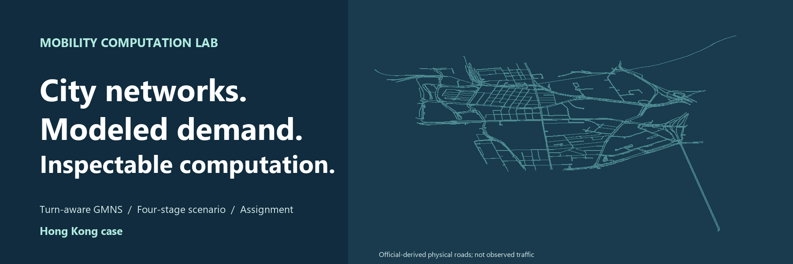</a>

<table class="atlas-quick-facts" width="100%"><colgroup><col width="25%"/><col width="25%"/><col width="25%"/><col width="25%"/></colgroup><thead><tr><th width="25%">City/model foundation</th><th width="25%">Static assignment</th><th width="25%">Finite time-expanded</th><th width="25%">Observation/data scope</th></tr></thead>
<tbody><tr><td width="25%">780 physical nodes; 1,239 directed links; 95 fine zones</td><td width="25%">8,930 OD pairs; 723.191 modeled PCE in 1 h</td><td width="25%">100 selected nodes; 111 links; 10 ODs; approved HK10 generated column</td><td width="25%">Detector/trajectory association is contextual; modeled flow is not observed traffic</td></tr></tbody></table>

<a href="#hong-kong-sources">Sources and GMNS</a> · <a href="#hong-kong-population">Population, households and activity</a> · <a href="#hong-kong-transit">Transit and observations</a> · <a href="#hong-kong-generation">Trip generation</a> · <a href="#hong-kong-distribution">Trip distribution</a> · <a href="#hong-kong-mode">Mode choice</a> · <a href="#hong-kong-static">Static assignment methods</a> · <a href="#hong-kong-finite">Finite time-expanded computation</a> · <a href="cases/hong-kong.html#reproduction">Tools and reproducibility</a>

<table class="atlas-city-table" data-city="hong-kong" data-stage="hong-kong-sources" width="100%"><colgroup><col width="8.333%"/><col width="8.333%"/><col width="8.333%"/><col width="8.333%"/><col width="8.333%"/><col width="8.333%"/><col width="8.333%"/><col width="8.333%"/><col width="8.333%"/><col width="8.333%"/><col width="8.333%"/><col width="8.333%"/></colgroup><tbody>
<tr class="atlas-stage-heading" data-columns="3" data-items="3" data-stage="hong-kong-sources"><th colspan="12"><h4 id="sources-and-gmns-2">Sources and GMNS</h4></th></tr>
<tr class="atlas-card-title-row" data-stage="hong-kong-sources">
<th class="atlas-title-cell" colspan="4" scope="col" width="33.333%"><strong>Source data and preparation</strong></th>
<th class="atlas-title-cell" colspan="4" scope="col" width="33.333%"><strong>GMNS network, zones and access</strong> <small class="atlas-depth-badge">[C]</small></th>
<th class="atlas-title-cell" colspan="4" scope="col" width="33.333%"><strong>Roads, zones and turns</strong> <small class="atlas-depth-badge">[C]</small></th>
</tr>
<tr class="atlas-card-preview-row" data-stage="hong-kong-sources">
<td class="atlas-card-cell" colspan="4" width="33.333%"></td>
<td class="atlas-card-cell" colspan="4" width="33.333%"></td>
<td class="atlas-card-cell" colspan="4" width="33.333%"><a href="cases/hong-kong.html#gmns-zones-and-source-evidence">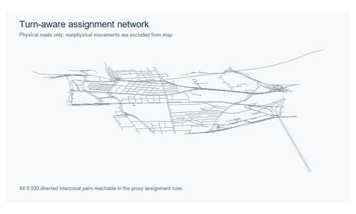</a></td>
</tr>
<tr class="atlas-card-meta-row" data-stage="hong-kong-sources">
<td class="atlas-meta-cell" colspan="4" width="33.333%"><small class="atlas-meta">Official-derived bounded network and source layers.</small></td>
<td class="atlas-meta-cell" colspan="4" width="33.333%"><small class="atlas-meta">780 physical nodes, 1,239 links; 95 fine zones, ten parents and turn-aware access.</small></td>
<td class="atlas-meta-cell" colspan="4" width="33.333%"><small class="atlas-meta">GMNS · 780 nodes / 1,239 links</small></td>
</tr>
<tr class="atlas-card-links-row" data-stage="hong-kong-sources">
<td class="atlas-links-cell" colspan="4" width="33.333%"><small class="atlas-links"><a href="cases/hong-kong.html#gmns-zones-and-source-evidence">Evidence</a> · <a href="assets/homepage_evidence_r2/row_01_hong_kong.png">Figure</a></small></td>
<td class="atlas-links-cell" colspan="4" width="33.333%"><small class="atlas-links"><a href="datasets/hong-kong-gmns.html">Evidence</a> · <a href="assets/homepage_evidence_r2/row_02_hong_kong.png">Figure</a></small></td>
<td class="atlas-links-cell" colspan="4" width="33.333%"><small class="atlas-links"><a href="cases/hong-kong.html#gmns-zones-and-source-evidence">Evidence</a> · <a href="assets/hong_kong/full_stack_r5/r2r4_baseline/figures/hk_assignment_ready_network.png">Figure</a></small></td>
</tr>
</tbody></table>

<table class="atlas-city-table" data-city="hong-kong" data-stage="hong-kong-population" width="100%"><colgroup><col width="8.333%"/><col width="8.333%"/><col width="8.333%"/><col width="8.333%"/><col width="8.333%"/><col width="8.333%"/><col width="8.333%"/><col width="8.333%"/><col width="8.333%"/><col width="8.333%"/><col width="8.333%"/><col width="8.333%"/></colgroup><tbody>
<tr class="atlas-stage-heading" data-columns="2" data-items="2" data-stage="hong-kong-population"><th colspan="12"><h4 id="population-households-and-activity-1">Population, households and activity</h4></th></tr>
<tr class="atlas-card-title-row" data-stage="hong-kong-population">
<th class="atlas-title-cell" colspan="6" scope="col" width="50%"><strong>Population, households and activity</strong></th>
<th class="atlas-title-cell" colspan="6" scope="col" width="50%"><strong>2021 census allocation and activity proxy</strong></th>
</tr>
<tr class="atlas-card-preview-row" data-stage="hong-kong-population">
<td class="atlas-card-cell" colspan="6" width="50%"></td>
<td class="atlas-card-cell" colspan="6" width="50%"><a href="cases/hong-kong-four-stage.html">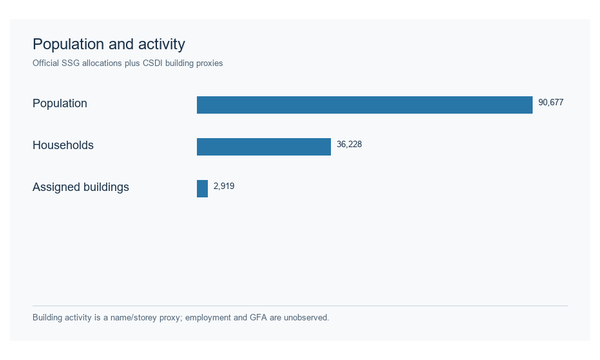</a></td>
</tr>
<tr class="atlas-card-meta-row" data-stage="hong-kong-population">
<td class="atlas-meta-cell" colspan="6" width="50%"><small class="atlas-meta">2021 census households/population and explicitly modeled building activity proxies.</small></td>
<td class="atlas-meta-cell" colspan="6" width="50%"><small class="atlas-meta">Population/proxy · not observed employment</small></td>
</tr>
<tr class="atlas-card-links-row" data-stage="hong-kong-population">
<td class="atlas-links-cell" colspan="6" width="50%"><small class="atlas-links"><a href="cases/hong-kong-four-stage.html">Evidence</a> · <a href="assets/homepage_evidence_r2/row_03_hong_kong.png">Figure</a></small></td>
<td class="atlas-links-cell" colspan="6" width="50%"><small class="atlas-links"><a href="cases/hong-kong-four-stage.html">Evidence</a> · <a href="assets/hong_kong/full_stack_r5/r2r4_baseline/figures/hk_population_households_activity.png">Figure</a></small></td>
</tr>
</tbody></table>

<table class="atlas-city-table" data-city="hong-kong" data-stage="hong-kong-transit" width="100%"><colgroup><col width="8.333%"/><col width="8.333%"/><col width="8.333%"/><col width="8.333%"/><col width="8.333%"/><col width="8.333%"/><col width="8.333%"/><col width="8.333%"/><col width="8.333%"/><col width="8.333%"/><col width="8.333%"/><col width="8.333%"/></colgroup><tbody>
<tr class="atlas-stage-heading" data-columns="3" data-items="3" data-stage="hong-kong-transit"><th colspan="12"><h4 id="transit-and-observations-1">Transit and observations</h4></th></tr>
<tr class="atlas-card-title-row" data-stage="hong-kong-transit">
<th class="atlas-title-cell" colspan="4" scope="col" width="33.333%"><strong>Transit and pedestrian inputs</strong></th>
<th class="atlas-title-cell" colspan="4" scope="col" width="33.333%"><strong>GPS, trajectory and detector evidence</strong></th>
<th class="atlas-title-cell" colspan="4" scope="col" width="33.333%"><strong>Detector/trajectory association</strong></th>
</tr>
<tr class="atlas-card-preview-row" data-stage="hong-kong-transit">
<td class="atlas-card-cell" colspan="4" width="33.333%"></td>
<td class="atlas-card-cell" colspan="4" width="33.333%"></td>
<td class="atlas-card-cell" colspan="4" width="33.333%"><a href="cases/hong-kong.html#demand-transit-and-observations">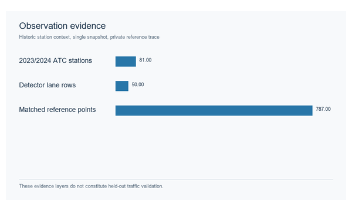</a></td>
</tr>
<tr class="atlas-card-meta-row" data-stage="hong-kong-transit">
<td class="atlas-meta-cell" colspan="4" width="33.333%"><small class="atlas-meta">GTFS same-trip rides, fares, headways and pedestrian access enter generalized costs.</small></td>
<td class="atlas-meta-cell" colspan="4" width="33.333%"><small class="atlas-meta">Detector and private trajectory association; no held-out validation claim.</small></td>
<td class="atlas-meta-cell" colspan="4" width="33.333%"><small class="atlas-meta">Observation linkage · not held-out validation</small></td>
</tr>
<tr class="atlas-card-links-row" data-stage="hong-kong-transit">
<td class="atlas-links-cell" colspan="4" width="33.333%"><small class="atlas-links"><a href="cases/hong-kong-four-stage.html">Evidence</a> · <a href="assets/homepage_evidence_r2/row_04_hong_kong.png">Figure</a></small></td>
<td class="atlas-links-cell" colspan="4" width="33.333%"><small class="atlas-links"><a href="cases/hong-kong-four-stage.html">Evidence</a> · <a href="assets/homepage_evidence_r2/row_05_hong_kong.png">Figure</a></small></td>
<td class="atlas-links-cell" colspan="4" width="33.333%"><small class="atlas-links"><a href="cases/hong-kong.html#demand-transit-and-observations">Evidence</a> · <a href="assets/hong_kong/full_stack_r5/r2r4_baseline/figures/hk_detector_and_trajectory_evidence.png">Figure</a></small></td>
</tr>
</tbody></table>

<table class="atlas-city-table" data-city="hong-kong" data-stage="hong-kong-generation" width="100%"><colgroup><col width="8.333%"/><col width="8.333%"/><col width="8.333%"/><col width="8.333%"/><col width="8.333%"/><col width="8.333%"/><col width="8.333%"/><col width="8.333%"/><col width="8.333%"/><col width="8.333%"/><col width="8.333%"/><col width="8.333%"/></colgroup><tbody>
<tr class="atlas-stage-heading" data-columns="2" data-items="2" data-stage="hong-kong-generation"><th colspan="12"><h4 id="trip-generation-1">Trip generation</h4></th></tr>
<tr class="atlas-card-title-row" data-stage="hong-kong-generation">
<th class="atlas-title-cell" colspan="6" scope="col" width="50%"><strong>Trip generation — productions / attractions</strong></th>
<th class="atlas-title-cell" colspan="6" scope="col" width="50%"><strong>Production/attraction scenario</strong></th>
</tr>
<tr class="atlas-card-preview-row" data-stage="hong-kong-generation">
<td class="atlas-card-cell" colspan="6" width="50%"></td>
<td class="atlas-card-cell" colspan="6" width="50%"><a href="cases/hong-kong-four-stage.html">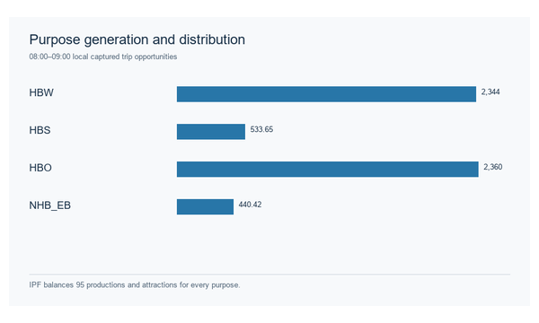</a></td>
</tr>
<tr class="atlas-card-meta-row" data-stage="hong-kong-generation">
<td class="atlas-meta-cell" colspan="6" width="50%"><small class="atlas-meta">Transferred rate and declared capture sensitivity, not local calibration.</small></td>
<td class="atlas-meta-cell" colspan="6" width="50%"><small class="atlas-meta">Trip generation · engineering scenario</small></td>
</tr>
<tr class="atlas-card-links-row" data-stage="hong-kong-generation">
<td class="atlas-links-cell" colspan="6" width="50%"><small class="atlas-links"><a href="cases/hong-kong-four-stage.html">Evidence</a> · <a href="assets/homepage_evidence_r2/row_06_hong_kong.png">Figure</a></small></td>
<td class="atlas-links-cell" colspan="6" width="50%"><small class="atlas-links"><a href="cases/hong-kong-four-stage.html">Evidence</a> · <a href="assets/hong_kong/full_stack_r5/r2r4_baseline/figures/hk_trip_generation_distribution.png">Figure</a></small></td>
</tr>
</tbody></table>

<table class="atlas-city-table" data-city="hong-kong" data-stage="hong-kong-distribution" width="100%"><colgroup><col width="8.333%"/><col width="8.333%"/><col width="8.333%"/><col width="8.333%"/><col width="8.333%"/><col width="8.333%"/><col width="8.333%"/><col width="8.333%"/><col width="8.333%"/><col width="8.333%"/><col width="8.333%"/><col width="8.333%"/></colgroup><tbody>
<tr class="atlas-stage-heading" data-columns="1" data-items="1" data-stage="hong-kong-distribution"><th colspan="12"><h4 id="trip-distribution-1">Trip distribution</h4></th></tr>
<tr class="atlas-card-title-row" data-stage="hong-kong-distribution">
<th class="atlas-title-cell" colspan="12" scope="col" width="100%"><strong>Trip distribution — zonal OD demand</strong></th>
</tr>
<tr class="atlas-card-preview-row" data-stage="hong-kong-distribution">
<td class="atlas-card-cell" colspan="12" width="100%"></td>
</tr>
<tr class="atlas-card-meta-row" data-stage="hong-kong-distribution">
<td class="atlas-meta-cell" colspan="12" width="100%"><small class="atlas-meta">Turn-aware gravity/IPF balances 8,930 reachable directed OD pairs.</small></td>
</tr>
<tr class="atlas-card-links-row" data-stage="hong-kong-distribution">
<td class="atlas-links-cell" colspan="12" width="100%"><small class="atlas-links"><a href="cases/hong-kong-four-stage.html">Evidence</a> · <a href="assets/homepage_evidence_r2/row_07_hong_kong.png">Figure</a></small></td>
</tr>
</tbody></table>

<table class="atlas-city-table" data-city="hong-kong" data-stage="hong-kong-mode" width="100%"><colgroup><col width="8.333%"/><col width="8.333%"/><col width="8.333%"/><col width="8.333%"/><col width="8.333%"/><col width="8.333%"/><col width="8.333%"/><col width="8.333%"/><col width="8.333%"/><col width="8.333%"/><col width="8.333%"/><col width="8.333%"/></colgroup><tbody>
<tr class="atlas-stage-heading" data-columns="2" data-items="2" data-stage="hong-kong-mode"><th colspan="12"><h4 id="mode-choice-1">Mode choice</h4></th></tr>
<tr class="atlas-card-title-row" data-stage="hong-kong-mode">
<th class="atlas-title-cell" colspan="6" scope="col" width="50%"><strong>Mode choice — mode-specific demand</strong></th>
<th class="atlas-title-cell" colspan="6" scope="col" width="50%"><strong>Mode costs and shares</strong></th>
</tr>
<tr class="atlas-card-preview-row" data-stage="hong-kong-mode">
<td class="atlas-card-cell" colspan="6" width="50%"></td>
<td class="atlas-card-cell" colspan="6" width="50%"><a href="cases/hong-kong-four-stage.html">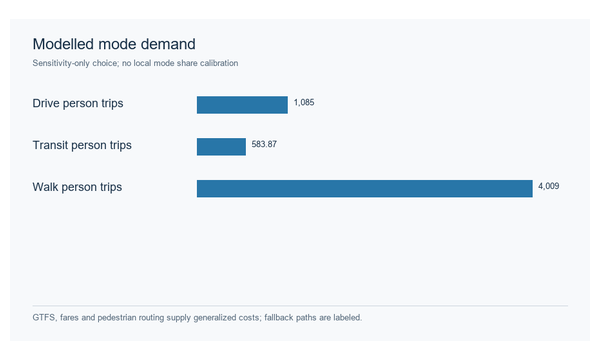</a></td>
</tr>
<tr class="atlas-card-meta-row" data-stage="hong-kong-mode">
<td class="atlas-meta-cell" colspan="6" width="50%"><small class="atlas-meta">GTFS/pedestrian generalized cost and declared sensitivity logit.</small></td>
<td class="atlas-meta-cell" colspan="6" width="50%"><small class="atlas-meta">Mode choice · one-hour AM</small></td>
</tr>
<tr class="atlas-card-links-row" data-stage="hong-kong-mode">
<td class="atlas-links-cell" colspan="6" width="50%"><small class="atlas-links"><a href="cases/hong-kong-four-stage.html">Evidence</a> · <a href="assets/homepage_evidence_r2/row_08_hong_kong.png">Figure</a></small></td>
<td class="atlas-links-cell" colspan="6" width="50%"><small class="atlas-links"><a href="cases/hong-kong-four-stage.html">Evidence</a> · <a href="assets/hong_kong/full_stack_r5/r2r4_baseline/figures/hk_mode_choice_costs_and_shares.png">Figure</a></small></td>
</tr>
</tbody></table>

<table class="atlas-city-table" data-city="hong-kong" data-stage="hong-kong-static" width="100%"><colgroup><col width="8.333%"/><col width="8.333%"/><col width="8.333%"/><col width="8.333%"/><col width="8.333%"/><col width="8.333%"/><col width="8.333%"/><col width="8.333%"/><col width="8.333%"/><col width="8.333%"/><col width="8.333%"/><col width="8.333%"/></colgroup><tbody>
<tr class="atlas-stage-heading" data-columns="2" data-items="2" data-stage="hong-kong-static"><th colspan="12"><h4 id="static-assignment-methods-2">Static assignment methods</h4></th></tr>
<tr class="atlas-card-title-row" data-stage="hong-kong-static">
<th class="atlas-title-cell" colspan="6" scope="col" width="50%"><strong>Frank–Wolfe</strong> <small class="atlas-depth-badge">[A]</small></th>
<th class="atlas-title-cell" colspan="6" scope="col" width="50%"><strong>Official tap-b Algorithm B</strong> <small class="atlas-depth-badge">[A]</small></th>
</tr>
<tr class="atlas-card-preview-row" data-stage="hong-kong-static">
<td class="atlas-card-cell" colspan="6" width="50%"></td>
<td class="atlas-card-cell" colspan="6" width="50%"></td>
</tr>
<tr class="atlas-card-meta-row" data-stage="hong-kong-static">
<td class="atlas-meta-cell" colspan="6" width="50%"><small class="atlas-meta">Turn-aware one-hour 723.191 PCE static engineering scenario.</small></td>
<td class="atlas-meta-cell" colspan="6" width="50%"><small class="atlas-meta">Accepted task-local lossless adapter; not official-adapter parity.</small></td>
</tr>
<tr class="atlas-card-links-row" data-stage="hong-kong-static">
<td class="atlas-links-cell" colspan="6" width="50%"><small class="atlas-links"><a href="cases/hong-kong-static-assignment.html">Evidence</a> · <a href="assets/homepage_evidence_r2/row_10_hong_kong.png">Figure</a></small></td>
<td class="atlas-links-cell" colspan="6" width="50%"><small class="atlas-links"><a href="cases/hong-kong-static-assignment.html">Evidence</a> · <a href="assets/homepage_evidence_r2/row_11_hong_kong.png">Figure</a></small></td>
</tr>
</tbody></table>

<table class="atlas-city-table" data-city="hong-kong" data-stage="hong-kong-finite" width="100%"><colgroup><col width="8.333%"/><col width="8.333%"/><col width="8.333%"/><col width="8.333%"/><col width="8.333%"/><col width="8.333%"/><col width="8.333%"/><col width="8.333%"/><col width="8.333%"/><col width="8.333%"/><col width="8.333%"/><col width="8.333%"/></colgroup><tbody>
<tr class="atlas-stage-heading" data-columns="4" data-items="14" data-stage="hong-kong-finite"><th colspan="12"><h4 id="finite-time-expanded-computation-2">Finite time-expanded computation</h4></th></tr>
<tr class="atlas-card-title-row" data-stage="hong-kong-finite">
<th class="atlas-title-cell" colspan="3" scope="col" width="25%"><strong>Network construction and generated columns</strong> <small class="atlas-depth-badge">[B · C]</small></th>
<th class="atlas-title-cell" colspan="3" scope="col" width="25%"><strong>Arc-flow LP reference</strong> <small class="atlas-depth-badge">[D]</small></th>
<th class="atlas-title-cell" colspan="3" scope="col" width="25%"><strong>Two-phase column generation</strong> <small class="atlas-depth-badge">[B]</small></th>
<th class="atlas-title-cell" colspan="3" scope="col" width="25%"><strong>Lagrangian</strong> <small class="atlas-depth-badge">[B · D]</small></th>
</tr>
<tr class="atlas-card-preview-row" data-stage="hong-kong-finite">
<td class="atlas-card-cell" colspan="3" width="25%"></td>
<td class="atlas-card-cell" colspan="3" width="25%"></td>
<td class="atlas-card-cell" colspan="3" width="25%"></td>
<td class="atlas-card-cell" colspan="3" width="25%"></td>
</tr>
<tr class="atlas-card-meta-row" data-stage="hong-kong-finite">
<td class="atlas-meta-cell" colspan="3" width="25%"><small class="atlas-meta">Approved model-generated HK10 excerpt in the 100-node/111-link/10-OD graph.</small></td>
<td class="atlas-meta-cell" colspan="3" width="25%"><small class="atlas-meta">Own-graph LP reference for R5 ten-OD finite case.</small></td>
<td class="atlas-meta-cell" colspan="3" width="25%"><small class="atlas-meta">Phase I/II, same-graph LP agreement and independent 10/10 closure.</small></td>
<td class="atlas-meta-cell" colspan="3" width="25%"><small class="atlas-meta">Ten-OD feasible recovery with 0.7444% certified gap.</small></td>
</tr>
<tr class="atlas-card-links-row" data-stage="hong-kong-finite">
<td class="atlas-links-cell" colspan="3" width="25%"><small class="atlas-links"><a href="cases/hong-kong-space-time.html#a-generated-column-as-a-time-indexed-path">Evidence</a> · <a href="assets/homepage_evidence_r2/row_14_hong_kong.png">Figure</a></small></td>
<td class="atlas-links-cell" colspan="3" width="25%"><small class="atlas-links"><a href="cases/hong-kong-space-time.html#reference-objective-agreement">Evidence</a> · <a href="assets/homepage_evidence_r2/row_15_hong_kong.png">Figure</a></small></td>
<td class="atlas-links-cell" colspan="3" width="25%"><small class="atlas-links"><a href="cases/hong-kong-space-time.html#phase-i-restores-feasibility">Evidence</a> · <a href="assets/homepage_evidence_r2/row_16_hong_kong.png">Figure</a></small></td>
<td class="atlas-links-cell" colspan="3" width="25%"><small class="atlas-links"><a href="cases/hong-kong-space-time.html">Evidence</a> · <a href="assets/homepage_evidence_r2/row_17_hong_kong.png">Figure</a></small></td>
</tr>
<tr class="atlas-card-title-row" data-stage="hong-kong-finite">
<th class="atlas-title-cell" colspan="3" scope="col" width="25%"><strong>ADMM</strong> <small class="atlas-depth-badge">[B · D]</small></th>
<th class="atlas-title-cell" colspan="3" scope="col" width="25%"><strong>Bounded case overview</strong></th>
<th class="atlas-title-cell" colspan="3" scope="col" width="25%"><strong>Physical to time-indexed movement</strong> <small class="atlas-depth-badge">[C]</small></th>
<th class="atlas-title-cell" colspan="3" scope="col" width="25%"><strong>Approved HK10 77-arc column</strong> <small class="atlas-depth-badge">[B · C]</small></th>
</tr>
<tr class="atlas-card-preview-row" data-stage="hong-kong-finite">
<td class="atlas-card-cell" colspan="3" width="25%"></td>
<td class="atlas-card-cell" colspan="3" width="25%"><a href="cases/hong-kong-space-time.html#case-role-scope-and-model-statistics">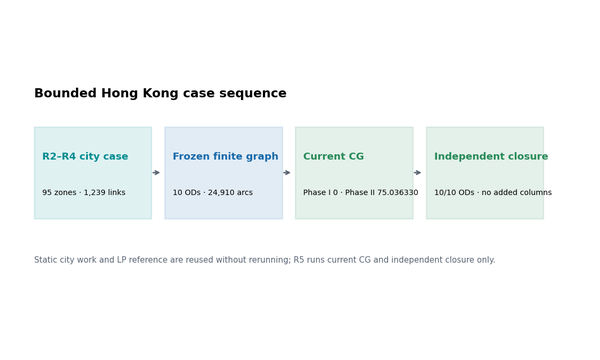</a></td>
<td class="atlas-card-cell" colspan="3" width="25%"><a href="cases/hong-kong-space-time.html#from-the-physical-network-to-the-finite-time-expanded-graph">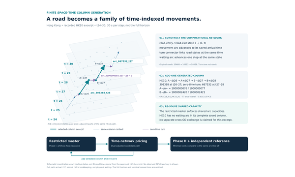</a></td>
<td class="atlas-card-cell" colspan="3" width="25%"><a href="cases/hong-kong-space-time.html#a-generated-column-as-a-time-indexed-path">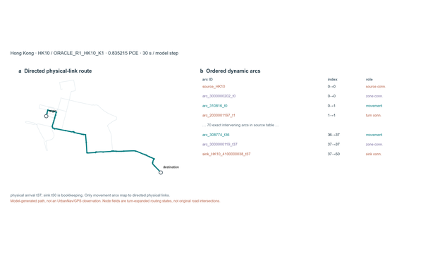</a></td>
</tr>
<tr class="atlas-card-meta-row" data-stage="hong-kong-finite">
<td class="atlas-meta-cell" colspan="3" width="25%"><small class="atlas-meta">Frozen transfer diagnostic; no accepted Hong Kong ADMM objective.</small></td>
<td class="atlas-meta-cell" colspan="3" width="25%"><small class="atlas-meta">CG · R5 10-OD</small></td>
<td class="atlas-meta-cell" colspan="3" width="25%"><small class="atlas-meta">CG construction · R5 10-OD</small></td>
<td class="atlas-meta-cell" colspan="3" width="25%"><small class="atlas-meta">CG column · model-generated; approved exact excerpt</small></td>
</tr>
<tr class="atlas-card-links-row" data-stage="hong-kong-finite">
<td class="atlas-links-cell" colspan="3" width="25%"><small class="atlas-links"><a href="cases/hong-kong-space-time.html">Evidence</a> · <a href="assets/homepage_evidence_r2/row_18_hong_kong.png">Figure</a></small></td>
<td class="atlas-links-cell" colspan="3" width="25%"><small class="atlas-links"><a href="cases/hong-kong-space-time.html#case-role-scope-and-model-statistics">Evidence</a> · <a href="assets/hong_kong/full_stack_r5/figures/hk_cg_case_sequence.png">Figure</a></small></td>
<td class="atlas-links-cell" colspan="3" width="25%"><small class="atlas-links"><a href="cases/hong-kong-space-time.html#from-the-physical-network-to-the-finite-time-expanded-graph">Evidence</a> · <a href="assets/cg_layered_companions_r1/hong_kong_layered_space_time_construction.png">Figure</a></small></td>
<td class="atlas-links-cell" colspan="3" width="25%"><small class="atlas-links"><a href="cases/hong-kong-space-time.html#a-generated-column-as-a-time-indexed-path">Evidence</a> · <a href="assets/three_city_r2/hong_kong_generated_column_time_indexed_path.png">Figure</a></small></td>
</tr>
<tr class="atlas-card-title-row" data-stage="hong-kong-finite">
<th class="atlas-title-cell" colspan="3" scope="col" width="25%"><strong>Phase I artificial flow</strong> <small class="atlas-depth-badge">[B]</small></th>
<th class="atlas-title-cell" colspan="3" scope="col" width="25%"><strong>Phase II objective</strong> <small class="atlas-depth-badge">[B]</small></th>
<th class="atlas-title-cell" colspan="3" scope="col" width="25%"><strong>Final physical-link movement flow</strong> <small class="atlas-depth-badge">[C · D]</small></th>
<th class="atlas-title-cell" colspan="3" scope="col" width="25%"><strong>Independent 10/10 pricing closure</strong> <small class="atlas-depth-badge">[B · D]</small></th>
</tr>
<tr class="atlas-card-preview-row" data-stage="hong-kong-finite">
<td class="atlas-card-cell" colspan="3" width="25%"><a href="cases/hong-kong-space-time.html#phase-i-restores-feasibility">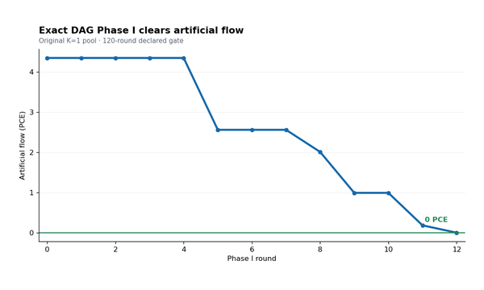</a></td>
<td class="atlas-card-cell" colspan="3" width="25%"><a href="cases/hong-kong-space-time.html#phase-ii-improves-the-real-path-objective">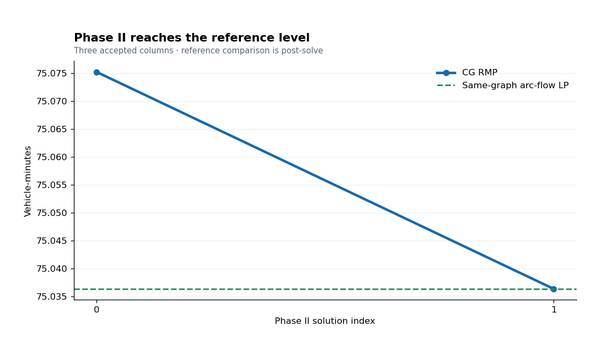</a></td>
<td class="atlas-card-cell" colspan="3" width="25%"><a href="cases/hong-kong-space-time.html#from-time-expanded-flows-back-to-final-physical-link-movement-flow">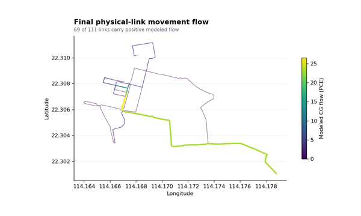</a></td>
<td class="atlas-card-cell" colspan="3" width="25%"><a href="cases/hong-kong-space-time.html#independent-pricing-closure">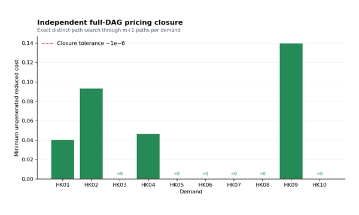</a></td>
</tr>
<tr class="atlas-card-meta-row" data-stage="hong-kong-finite">
<td class="atlas-meta-cell" colspan="3" width="25%"><small class="atlas-meta">CG Phase I · R5 10-OD</small></td>
<td class="atlas-meta-cell" colspan="3" width="25%"><small class="atlas-meta">CG Phase II · R5 10-OD</small></td>
<td class="atlas-meta-cell" colspan="3" width="25%"><small class="atlas-meta">CG flow · R5 10-OD</small></td>
<td class="atlas-meta-cell" colspan="3" width="25%"><small class="atlas-meta">CG pricing · R5 10-OD</small></td>
</tr>
<tr class="atlas-card-links-row" data-stage="hong-kong-finite">
<td class="atlas-links-cell" colspan="3" width="25%"><small class="atlas-links"><a href="cases/hong-kong-space-time.html#phase-i-restores-feasibility">Evidence</a> · <a href="assets/hong_kong/full_stack_r5/figures/hk_cg_phase_i_artificial_flow.png">Figure</a></small></td>
<td class="atlas-links-cell" colspan="3" width="25%"><small class="atlas-links"><a href="cases/hong-kong-space-time.html#phase-ii-improves-the-real-path-objective">Evidence</a> · <a href="assets/hong_kong/full_stack_r5/figures/hk_cg_phase_ii_objective.png">Figure</a></small></td>
<td class="atlas-links-cell" colspan="3" width="25%"><small class="atlas-links"><a href="cases/hong-kong-space-time.html#from-time-expanded-flows-back-to-final-physical-link-movement-flow">Evidence</a> · <a href="assets/hong_kong/full_stack_r5/figures/hk_cg_final_physical_link_movement_flow.png">Figure</a></small></td>
<td class="atlas-links-cell" colspan="3" width="25%"><small class="atlas-links"><a href="cases/hong-kong-space-time.html#independent-pricing-closure">Evidence</a> · <a href="assets/hong_kong/full_stack_r5/figures/hk_cg_pricing_closure.png">Figure</a></small></td>
</tr>
<tr class="atlas-card-title-row" data-stage="hong-kong-finite">
<th class="atlas-title-cell" colspan="3" scope="col" width="25%"><strong>Lagrangian certified gap</strong> <small class="atlas-depth-badge">[B · D]</small></th>
<th class="atlas-title-cell" colspan="3" scope="col" width="25%"><strong>ADMM gated diagnostic</strong> <small class="atlas-depth-badge">[B · D]</small></th>
<th aria-hidden="true" class="atlas-empty" colspan="3" width="25%"></th>
<th aria-hidden="true" class="atlas-empty" colspan="3" width="25%"></th>
</tr>
<tr class="atlas-card-preview-row" data-stage="hong-kong-finite">
<td class="atlas-card-cell" colspan="3" width="25%"><a href="cases/hong-kong-space-time.html#reference-objective-agreement">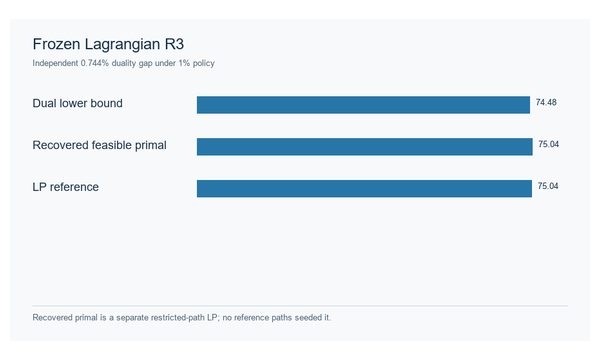</a></td>
<td class="atlas-card-cell" colspan="3" width="25%"><a href="cases/hong-kong-space-time.html#reference-objective-agreement">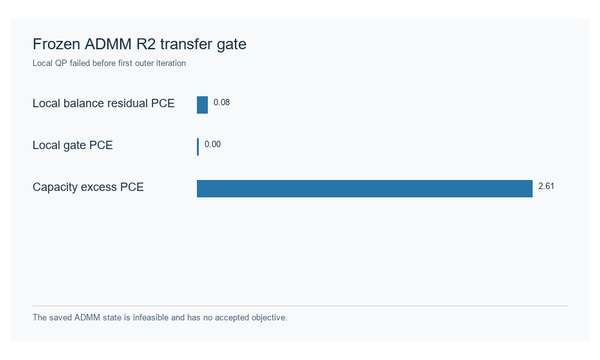</a></td>
<td aria-hidden="true" class="atlas-empty" colspan="3" width="25%"></td>
<td aria-hidden="true" class="atlas-empty" colspan="3" width="25%"></td>
</tr>
<tr class="atlas-card-meta-row" data-stage="hong-kong-finite">
<td class="atlas-meta-cell" colspan="3" width="25%"><small class="atlas-meta">bounded accepted 0.7444%</small></td>
<td class="atlas-meta-cell" colspan="3" width="25%"><small class="atlas-meta">gated; no accepted objective</small></td>
<td aria-hidden="true" class="atlas-empty" colspan="3" width="25%"></td>
<td aria-hidden="true" class="atlas-empty" colspan="3" width="25%"></td>
</tr>
<tr class="atlas-card-links-row" data-stage="hong-kong-finite">
<td class="atlas-links-cell" colspan="3" width="25%"><small class="atlas-links"><a href="cases/hong-kong-space-time.html#reference-objective-agreement">Evidence</a> · <a href="assets/hong_kong/full_stack_r5/r2r4_baseline/figures/hk_lagrangian_dual_primal_gap.png">Figure</a></small></td>
<td class="atlas-links-cell" colspan="3" width="25%"><small class="atlas-links"><a href="cases/hong-kong-space-time.html#reference-objective-agreement">Evidence</a> · <a href="assets/hong_kong/full_stack_r5/r2r4_baseline/figures/hk_admm_residuals_and_feasibility.png">Figure</a></small></td>
<td aria-hidden="true" class="atlas-empty" colspan="3" width="25%"></td>
<td aria-hidden="true" class="atlas-empty" colspan="3" width="25%"></td>
</tr>
</tbody></table>

</article>

<a href="visualizations.html">All retained scientific figure families</a> · <a href="full-walkthrough.html">Full technical walkthrough</a>.

<h2 id="05-run-and-inspect">05 / Run and inspect</h2>

<strong>Inspect saved evidence:</strong> <a href="visualizations.html">result queries and source records</a>. <strong>Run a documented example:</strong> in a compatible Python environment at the repository root, use:

<pre><code class="language-bash">python -B examples/boston/run_saved_example.py --data-dir "examples/boston/behavior_feedback_r1_semantic_fix_r1" --output "results/boston_saved_example"
</code></pre>

This rebuilds a local SQLite query database from released CSV tables and exports five saved-result queries; it does <strong>not</strong> run demand estimation, FW, CG or matching. Use a new output directory. <a href="getting-started.html">Installation and dependencies</a> · <a href="https://github.com/scholarhaozheng/mobility-network-lab/blob/main/examples/boston/SAVED_EXAMPLE.md">Saved-result guide</a>.

<strong>Use your own inputs:</strong> <a href="RUN_YOUR_OWN_GMNS.html">vehicle-OD preparation and static FW</a>, or the separately documented <a href="getting-started.html#run-from-raw-input">generic space–time network command</a>. <strong>Version scope:</strong> <code>tools/mnl.py</code> retains the 0.3.0-rc5 generic engine; later Boston and Hong Kong CG cases use separately versioned implementations and saved-result checks, so that command does not reproduce those case runs unchanged.

<h2 id="06-attribution-scope-and-further-reading">06 / Attribution, scope and further reading</h2>

GMNS, <code>tap-b</code>/TAPLab and source datasets retain their upstream attribution; this project documents its own adapters, computations and bounded results separately. <a href="contributions.html">Contribution/source attribution</a> · <a href="https://github.com/scholarhaozheng/mobility-network-lab/blob/main/THIRD_PARTY_NOTICES.md">Third-party notices</a> · <a href="https://github.com/scholarhaozheng/mobility-network-lab/blob/main/DATA_LICENSES.md">Data licenses</a> · <a href="citation.html">Citation</a>. Results distinguish source-derived city inputs, engineering scenarios, supplied benchmarks and observed evidence; no shown case is a calibrated citywide forecast.

The <a href="open-data-explorer.html">open-data explorer</a> and data tools, including <code>mcl_data.py catalog-city-match</code> for named-entity matching of user-supplied catalogs, support source inspection rather than automatic OD creation. <strong>These evidence layers are not additive.</strong> <a href="data-tools.html">Data-tools instructions</a> · <a href="open-data.html">Source and access scope</a>. Future directions such as Policy Bush remain outside the current demonstrated modules.

<a href="full-walkthrough.html">Full technical walkthrough — every retained experiment, table and figure in reading order</a> · <a href="architecture.html">Architecture and project-map sources</a> · <a href="capabilities.html">Complete case/method coverage</a> · <a href="roadmap.html">Roadmap</a>.

