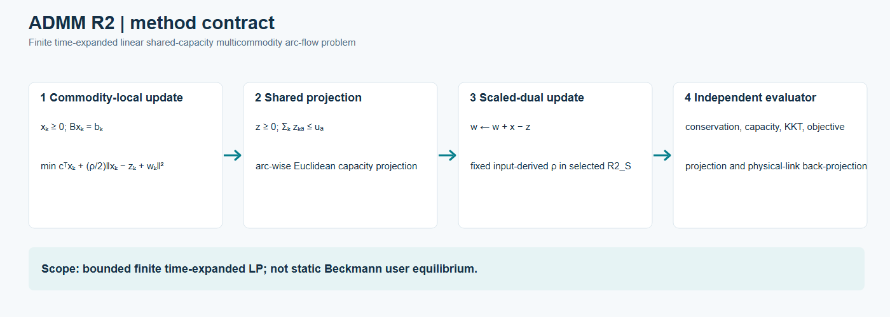
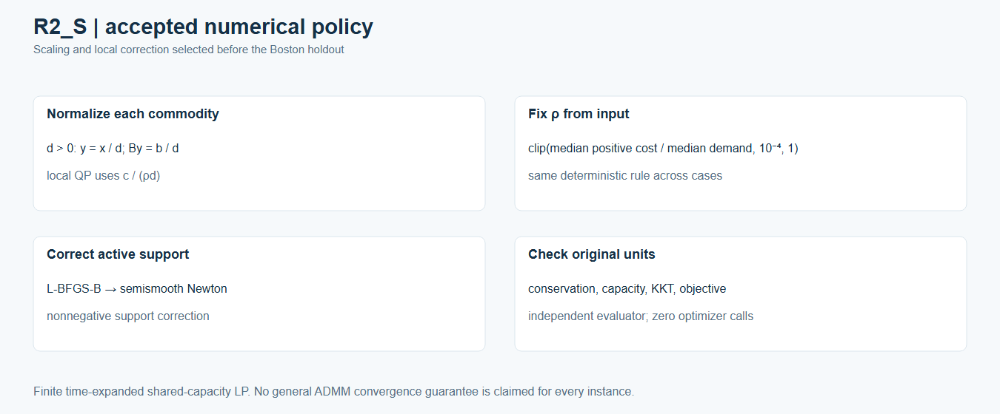

# ADMM for finite space–time shared-capacity flow

This page describes the accepted **R2_S** algorithm for a bounded finite, time-expanded, fixed-linear-cost multicommodity arc-flow problem. It is a separate solver for the same class of hard-capacity LP used by the space–time CG cases. It is **not** static BPR/Beckmann user equilibrium.

[Editable method diagram](../assets/admm_r2/figures/admm_method_contract.svg) · [Frozen Sioux-first and Boston-holdout sequence](../assets/admm_r2/figures/admm_sioux_freeze_boston_holdout.svg) · [R2_S numerical policy](../assets/admm_r2/figures/admm_r2_numerical_policy.svg)

## Problem and split

For each commodity `k`, the nonnegative local arc flow `x_k` satisfies `B x_k = b_k` on its allowed finite time-expanded arcs. The consensus copy `z` is nonnegative and respects `sum_k z_ka <= u_a` on every shared arc `a`, with `x = z`. The linear objective is `sum_k c^T x_k`. Forbidden commodity-arc entries remain zero.

The commodity-local step minimizes `c^T x_k + (rho/2) ||x_k - (z_k - w_k)||_2^2` under its conservation and nonnegativity constraints. The shared step projects `x + w` onto the per-arc nonnegative capacity simplex. The scaled dual then updates `w <- w + x - z`. The [preregistered experiment plan](../assets/admm_r2/provenance/experiment_plan.json) identifies the full algebra, stopping rules and gates; no reference-LP primal or dual values enter the solver.

## Accepted R2_S numerical rule

For commodity demand `d > 0`, the local QP uses `y = x/d`, normalized conservation `B y = b/d`, and cost coefficient `c/(rho*d)`; it maps the answer back to original vehicle units before all public checks. R2_S fixes `rho` at `clip(median positive finite arc cost / median commodity volume, 1e-4, 1)`, determined from the case input alone. The local solve uses scaled-dual L-BFGS-B, a damped active-support semismooth Newton step and nonnegative active-support correction. The accepted implementation includes every strictly positive support arc in the correction.

Policy selection used analytic, C0, C1 and Sioux Falls 30, 60, 100, 150, 200 and 250 OD cases. The selected source, evaluator, plan and R2_S policy were frozen **before** the 10-OD Boston run. Boston was a holdout; it did not set the scaling, rho rule or gates.

## Independent stopping and evaluation

The solver checks primal and dual residuals against absolute/relative thresholds. The independent evaluator also checks original-unit local conservation and capacity excess (`<= 1e-5` vehicles), nonnegativity, forbidden arcs, local KKT (`<= 1e-3`), projection (`<= 1e-7`), dual update (`<= 1e-7`), objective recomputation and physical-link back-projection (`<= 1e-6`). The same-graph reference objective is read **after** a run for evaluation. The evaluator made **zero optimizer calls**; the public figures are deterministic renders of accepted saved outputs, with no scientific rerun.

## Evidence and limits

The selected [Sioux 200/250](../cases/sioux-admm.md) and [Boston 10-OD](../cases/boston-admm.md) cases passed their declared gates. Their objectives are close to same-graph arc-flow LP references, but close objectives do not imply identical primal route or time splits. Sioux 200/250 are selected subsets, not the full 528-OD benchmark; Boston is one 90-node/125-link/10-OD pilot, not citywide assignment. These finite experiments establish no general ADMM convergence guarantee and no equivalence to static UE.

Each new figure has an adjacent `.source.json` with exact accepted-source hashes and a `.caption.md` with limitations. The seven original accepted convergence/scatter SVGs remain individual evidence assets. [Frozen public-safe source](../../algorithms/admm_r2/README.md) and [authored analytic/C0/C1 fixtures](../../examples/admm-r2-fixtures/README.md) are included; the private Sioux/Boston inputs and states are not.
