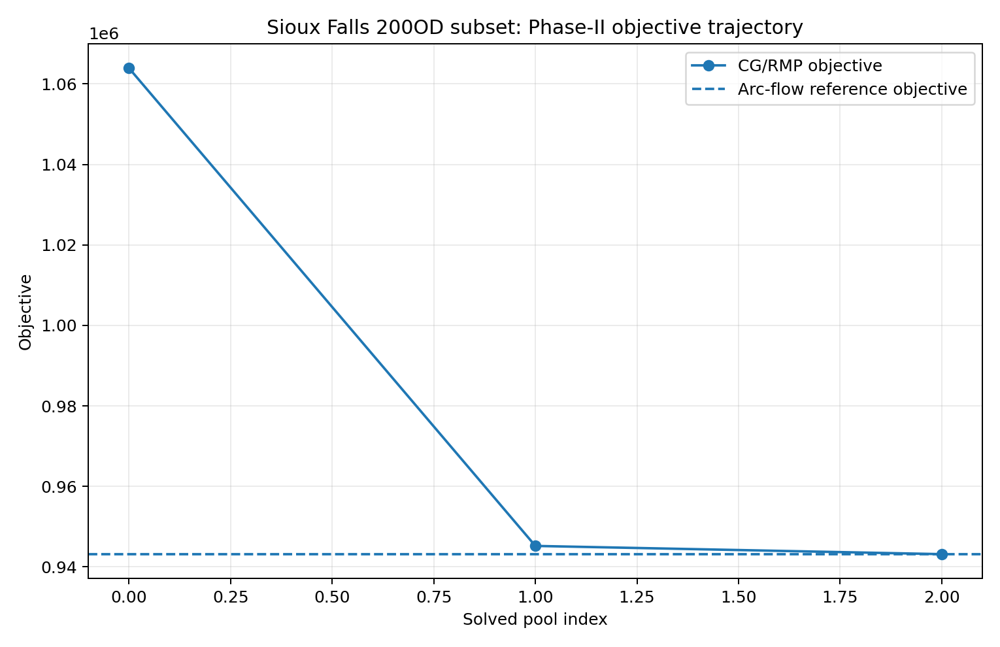
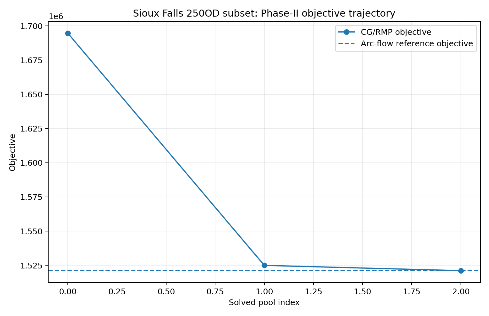
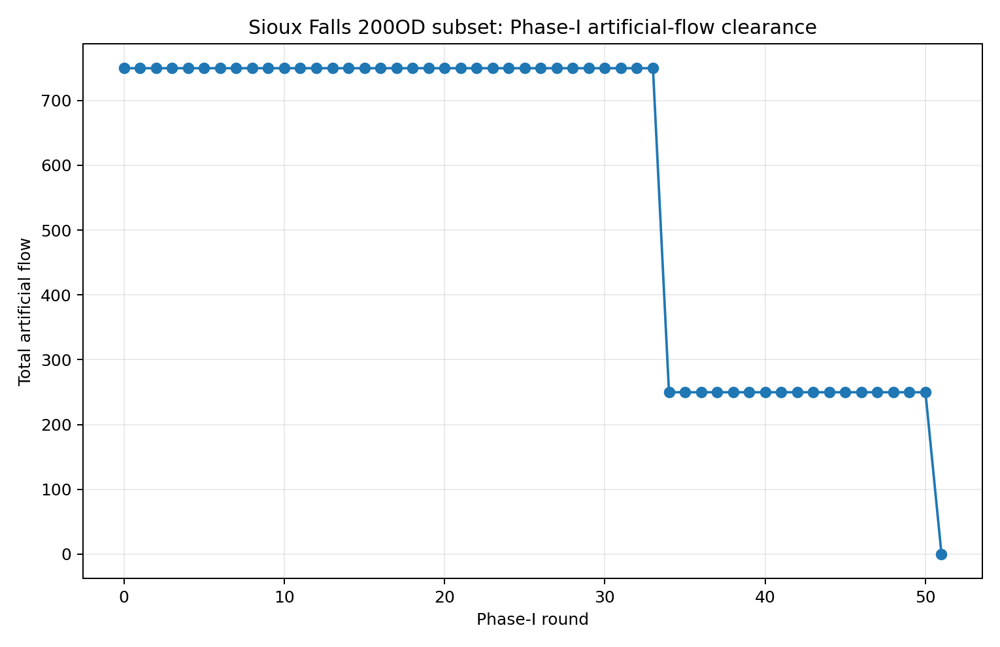
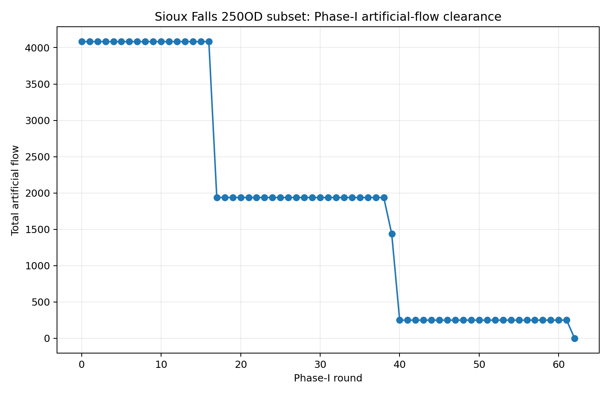

# Visual results: four stages, observations and benchmarks

This gallery links saved-result figures for Boston and Sioux Falls. It does not rerun optimization or invent new observations. The existing Sioux Falls **selected-OD** figures remain unchanged; the separate Boston CG figures are from one accepted bounded pilot.

For the separate real-city example, see the [Central Boston five-map gallery](datasets/boston-central.md#boston-visual-gallery): network and zones, the MassGIS residential-area prior, one qualified GPS projection, and saved S1 and S2−S1 fixed-panel flows. Its source credits and units are documented alongside each map.

## Central Boston: read results in calculation order

The [four-step walkthrough](datasets/boston-behavior-feedback.md) links actual data to each stage. [Generation](datasets/boston-behavior-feedback.md#step-1-trip-generation), [OD distribution](datasets/boston-behavior-feedback.md#step-2-trip-distribution), [mode response](datasets/boston-behavior-feedback.md#step-3-mode-choice) and [road assignment](datasets/boston-behavior-feedback.md#step-4-traffic-assignment) have separate result figures. The [GPS feedback](datasets/boston-behavior-feedback.md#gps-feedback) explains where observations enter; the [original five-map gallery](datasets/boston-central.md#boston-visual-gallery) remains available as spatial context and saved outputs.

The [Boston bounded space–time CG gallery](cases/boston-space-time.md) gives the corresponding scientific figure families: final physical flow, actual time-network cutaway, Phase-I total and per-demand clearance, a saved cross-OD binding-arc event, Phase-II objective/reference, final validation, and Boston-only independent pricing closure. It is **90 nodes / 125 links / 10 ODs**, not a citywide or second-scale Boston solve. [Composed summary](assets/boston/space_time_cg_r4/boston_cg_summary_panel.png) · [all source/figure hashes](assets/boston/space_time_cg_r4/figure_manifest.json).

## Separate historical Sioux Falls benchmarks

These 200/250-OD records agree with their own saved same-subset arc-flow LP objectives; independent full-DAG pricing closure is **not established**. Boston's R4 certificate is not transferred to them.

## Physical-link flow views

<table>
<tr><th>200 OD · 64 selected links</th><th>250 OD · 69 selected links</th></tr>
<tr>
<td width="50%"></td>
<td width="50%"></td>
</tr>
</table>

Line width encodes final movement flow aggregated across modelled time. These are schematic network views: opposite directions may overlap, and colours are not a quantitative colour scale. Do not read them as observed traffic, static V/C, precise road-shape GIS or a full 528-OD assignment.

## Phase-II objective trajectories

<table>
<tr><th>200 OD</th><th>250 OD</th></tr>
<tr>
<td width="50%"></td>
<td width="50%"></td>
</tr>
</table>

Each curve is compared with its own same-model arc-flow reference. Different OD selections define different optimization instances; do not interpret the difference between their objective values as an algorithmic improvement.

## Phase-I artificial-flow clearance

<table>
<tr><th>200 OD</th><th>250 OD</th></tr>
<tr>
<td width="50%"></td>
<td width="50%"></td>
</tr>
</table>

Artificial flow is an algorithmic feasibility device, not an observed queue or discarded trip demand. Its progression belongs to the successful solve and is retained for interpretation.

## Data cards and numerical scope

The [200-OD record](datasets/sioux-200od.md) and [250-OD record](datasets/sioux-250od.md) explain saved versus uniquely reconstructed final path flows, objective checks and remaining certificate boundaries. Full raw inputs and reconstruction evidence are not redistributed here. The [static FW record](datasets/sioux-static-fw.md) is a separate approximate static model, not another point on these CG curves.

[Network catalog](datasets.md) · [Outputs and verification](outputs.md) · [City workflow](city-workflow.md)
