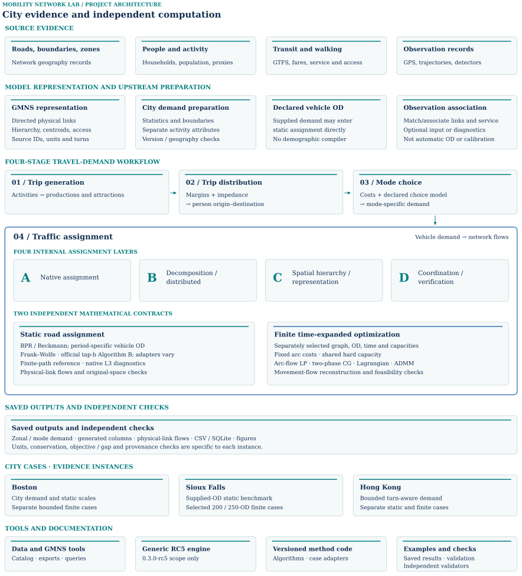
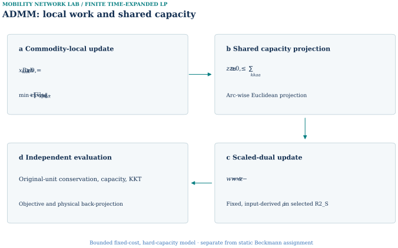

# Complete overview

[Read the synchronized HTML volume](https://scholarhaozheng.github.io/mobility-network-lab/volumes/overview.html) · [Current data, code and reproduction](https://scholarhaozheng.github.io/mobility-network-lab/reproduce.html)

This complete reading export preserves the HTML volume’s text, figures, tables and legacy anchors. Both Sioux finite instances are included; tables, figures and retained details use HTML blocks for fidelity.

> Complete reading edition · 2026-10-04. Source snapshot: [6ce18b8](https://github.com/scholarhaozheng/mobility-network-lab/tree/6ce18b8bea5bf3b9b7caa6ee4c0ff4e701a34a8b). Original long README: [c51c7dfe](https://github.com/scholarhaozheng/mobility-network-lab/blob/c51c7dfe25559ef5fb464f2b9eeea2872d945d29/README.md). Historical appendices preserve earlier claims with their original scope. Current evidence is organized here with the three city volumes. Historical records retain their original claims and do not override later accepted results.

<span id="reading-section-1"></span>
## 01 / Project overview

<span class="anchor-alias" id="src-readme-document"></span>
<span class="anchor-alias" id="src-readme-document-mobility-computation-lab"></span>

<span id="reading-section-2"></span>
### Latest project overview and entry points

The current overview and 19-row coverage table are synchronized with the delivered homepage. The following source-derived implementation records retain their frozen provenance; use the current reproduction portal for tested commands and package availability.

[Source record](https://github.com/scholarhaozheng/mobility-network-lab/blob/6ce18b8bea5bf3b9b7caa6ee4c0ff4e701a34a8b/README.md) · Snapshot 6ce18b8.

<span class="anchor-alias" id="block-1"></span>

**Mobility Computation Lab connects city networks, travel demand, and reproducible network computation.**

<span class="anchor-alias" id="block-2"></span>

This open-source research and learning project is developed by [Hao Zheng](https://scholarhaozheng.github.io/), a recent M.S. graduate from Tsinghua University, under the guidance of **[Professor Xuesong Zhou](https://search.asu.edu/profile/2182101)**. It brings together documented examples in Boston, Sioux Falls, and Hong Kong to study how city data, demand models, and network algorithms work together.

<span class="anchor-alias" id="block-3"></span>

The repository uses the [General Modeling Network Specification (GMNS)](https://github.com/zephyr-data-specs/GMNS) as its portable network and data contract. Selected static traffic-assignment experiments build on [TAPLab: An Open Laboratory for Reproducible Traffic Assignment Experiments](https://github.com/asu-trans-ai-lab/TAPLab) and the official [tap-b Algorithm B](https://github.com/spartalab/tap-b), with upstream software, methods, and datasets attributed explicitly.

<span class="anchor-alias" id="block-4"></span>

Project-specific work includes assembling and adapting the Boston, Sioux Falls, and Hong Kong cases; connecting city data and four-stage demand models to documented network computations; implementing and evaluating project-specific adapters, workflows, and experiments; and making each result traceable to its actual instance, units, assumptions, and evidence.

<span class="anchor-alias" id="block-5"></span>

**Learning companion.** To make these computational ideas easier to explore, the site includes the [Traffic Assignment Lab](https://github.com/scholarhaozheng/mobility-network-lab/blob/6ce18b8bea5bf3b9b7caa6ee4c0ff4e701a34a8b/docs/traffic-assignment-lab.html), an interactive demo of assignment, decomposition, spatial hierarchy, and coordinated computation on one teaching network. The demo was developed collaboratively by **[Professor Xuesong Zhou](https://search.asu.edu/profile/2182101)** and Hao Zheng, with Hao Zheng working under Professor Zhou's guidance and maintaining the web version.

<span class="anchor-alias" id="block-6"></span>

[My contributions and upstream foundations](#src-docs-contributions-document) · [Full technical walkthrough](#src-docs-full-walkthrough-part-0-document) · [Start with a saved example](#src-docs-getting-started-document) · [Source and citation](#src-docs-citation-document)

<span class="anchor-alias" id="block-7"></span>

<span class="anchor-alias" id="src-readme-document-what-this-project-adds"></span>

<span class="anchor-alias" id="block-8"></span>

<span class="anchor-alias" id="src-readme-document-01--what-this-project-adds"></span>

#### 01 / What this project adds

<span class="anchor-alias" id="block-9"></span>

<span class="anchor-alias" id="src-readme-document-city-to-model-representations"></span>

##### City-to-model representations

<span class="anchor-alias" id="block-10"></span>

The project links roads, hierarchical zones, population and activity inputs, transit services, and supported observations to explicit demand and network models. Its adapters preserve identifiers, units, access semantics, and physical-link mappings across the documented city cases. [Implementation and source map](#src-docs-contributions-document-city-to-model-representations).

<span class="anchor-alias" id="block-11"></span>

<span class="anchor-alias" id="src-readme-document-computational-implementations-and-diagnostics"></span>

##### Computational implementations and diagnostics

<span class="anchor-alias" id="block-12"></span>

The repository brings together path-based and compressed static-assignment experiments with finite time-expanded CG, Lagrangian, and ADMM implementations. Project-specific work includes feasibility restoration, pricing and degeneracy handling, local-subproblem scaling, and reconstruction in the original flow space. [Methods and evidence](#src-docs-contributions-document-computational-implementations-and-diagnostics).

<span class="anchor-alias" id="block-13"></span>

<span class="anchor-alias" id="src-readme-document-reusable-cross-city-computational-tools"></span>

##### Reusable cross-city computational tools

<span class="anchor-alias" id="block-14"></span>

The project packages shared data interfaces, case configurations, and analysis tools into an open-source environment for Boston, Sioux Falls, and Hong Kong. Documented examples connect zonal demand, generated paths, and physical-link results, allowing researchers to reuse the supported workflows and compare demand scales, network representations, and solution methods. [Tools, attribution and demonstrated scope](#src-docs-contributions-document-reusable-cross-city-computational-tools).

<span class="anchor-alias" id="block-15"></span>

<span class="anchor-alias" id="src-readme-document-framework"></span>

<span class="anchor-alias" id="block-16"></span>

<span class="anchor-alias" id="src-readme-document-02--complete-project-structure"></span>

#### 02 / Complete project structure

<span class="anchor-alias" id="block-17"></span>

<span class="anchor-alias" id="fig-0001"></span>

<span class="anchor-alias" id="coverage-row-00"></span>

<figure class="canonical-figure" data-figure="G-F001" id="stage-00-framework--g-f001"><a href="../assets/atlas/project-map.svg"></a><figcaption><strong>City evidence and independent computation.</strong> The approved project architecture retains source evidence, model preparation, the four travel-demand stages, saved outputs, city cases and code/documentation entry points. The four stages are 01 Trip generation, 02 Trip distribution, 03 Mode choice and 04 Traffic assignment. Inside stage 04, four assignment layers are shown without sequence arrows: A Native assignment; B Decomposition / distributed; C Spatial hierarchy / representation; D Coordination / verification. These are internal layers of traffic assignment, not four additional travel-demand stages. Static BPR/Beckmann assignment and finite fixed-cost, hard-capacity optimization are parallel independent mathematical contracts, not a sequential solver chain. The finite contract specifies its own selected graph, OD, time and capacities. Population, household and activity preparation is upstream, and declared vehicle OD may enter static assignment directly without asserting that stages 01–03 were run. Observation association does not automatically recover OD or establish calibration. Cases are evidence instances, and generic RC5 scope remains distinct from versioned case adapters and independent validators. All fourteen original documentation targets are retained in the editable SVG, on card backgrounds and their labels.</figcaption><div class="figure-links"><a href="../assets/atlas/project-map.svg">SVG</a><a href="../assets/atlas/figures/g-f001.png">PNG</a><a href="../assets/atlas/figures/g-f001.pdf">PDF</a></div><details class="figure-sources"><summary>Source records</summary><ul><li><a href="https://github.com/scholarhaozheng/mobility-network-lab/blob/6ce18b8bea5bf3b9b7caa6ee4c0ff4e701a34a8b/docs/assets/project_structure_r3/project_structure_model.json">docs/assets/project_structure_r3/project_structure_model.json</a></li><li><a href="https://github.com/scholarhaozheng/mobility-network-lab/blob/6ce18b8bea5bf3b9b7caa6ee4c0ff4e701a34a8b/docs/architecture.md">docs/architecture.md</a></li><li><a href="https://github.com/scholarhaozheng/mobility-network-lab/blob/6ce18b8bea5bf3b9b7caa6ee4c0ff4e701a34a8b/tools/visuals/render_presentation_r3.py">tools/visuals/render_presentation_r3.py</a></li><li><a href="https://github.com/scholarhaozheng/mobility-network-lab/blob/6ce18b8bea5bf3b9b7caa6ee4c0ff4e701a34a8b/tools/visuals/render_project_structure_r3.py">tools/visuals/render_project_structure_r3.py</a></li><li><a href="../assets/atlas/project-map.svg">docs/assets/project_structure_r3/project_structure.svg</a></li></ul></details></figure>

<span class="anchor-alias" id="block-18"></span>

Open the [unified architecture](#stage-00-framework--g-f001) for the current figure and its scope. The [source-grounded module table](#src-docs-architecture-document) retains implementation and data links.

<span class="anchor-alias" id="block-19"></span>

<span class="anchor-alias" id="src-readme-document-gmns-in-action"></span><span class="anchor-alias" id="src-readme-document-four-step-workflow"></span>
GMNS keeps directed physical roads, hierarchical zones, centroids, nonphysical access and source IDs distinct. Population, household and activity preparation precedes **01 trip generation → 02 trip distribution → 03 mode choice → 04 traffic assignment** where those stages are supported; declared vehicle OD can instead enter assignment directly. GPS traces and map matching, service records and detector context require explicit quality and network-association rules. [GMNS exchange](02-boston.md#src-docs-datasets-boston-gmns-exchange-document) · [Four-stage city workflow](#src-docs-city-workflow-document) · [Observation example](02-boston.md#src-docs-datasets-boston-behavior-feedback-document).

<span class="anchor-alias" id="block-20"></span>

Static **BPR/Beckmann** assignment and finite **fixed-cost, hard-capacity time-expanded** optimization use separate mathematical models. [Architecture](#src-docs-architecture-document) · [Data contract](#src-docs-data-contract-document).

<span class="anchor-alias" id="block-21"></span>

<span class="anchor-alias" id="src-readme-document-two-axes"></span><span class="anchor-alias" id="src-readme-document-02a-two-axes-of-mobility-computation-lab"></span>
<span class="anchor-alias" id="src-readme-document-two-axes-of-mobility-computation-lab"></span>

##### Two axes of Mobility Computation Lab

<span class="anchor-alias" id="block-22"></span>

**Horizontal axis — documented city cases:**  
Boston · Sioux Falls · Hong Kong

<span class="anchor-alias" id="block-23"></span>

**Vertical axis — computational depth within network assignment:**

<span class="anchor-alias" id="block-24"></span>

- **A · Native assignment** — Frank–Wolfe, official tap-b Algorithm B, finite-path controls, and native L3 reconstruction.
- **B · Decomposition and distributed computation** — column generation, Lagrangian decomposition, and ADMM local or coupled computations.
- **C · Spatial hierarchy and representation** — fine and parent zones, access relationships, turn/time states, and projection back to physical network objects.
- **D · Coordination and verification** — shared capacities, residuals, pricing closure, independent evaluators, and declared result contracts.

<span class="anchor-alias" id="block-25"></span>

**How to read the two axes.**  
The horizontal axis compares how the documented framework is instantiated in Boston, Sioux Falls, and Hong Kong. The vertical axis organizes increasing computational depth inside the network-assignment branch. Source data, GMNS, population and activity preparation, transit and observations, and the four-stage demand workflow remain the common city-model foundation outside A–D.

<span class="anchor-alias" id="block-26"></span>

<span class="anchor-alias" id="src-readme-document-coverage"></span>

<span class="anchor-alias" id="block-27"></span>

<span class="anchor-alias" id="src-readme-document-05--run-and-inspect"></span>

#### 05 / Run and inspect

<span class="anchor-alias" id="block-28"></span>

**Inspect saved evidence:** [result queries and source records](#src-docs-visualizations-document). **Run a documented example:** in a compatible Python environment at the repository root, use:

<span class="anchor-alias" id="block-29"></span>

```
python -B examples/boston/run_saved_example.py --data-dir "examples/boston/behavior_feedback_r1_semantic_fix_r1" --output "results/boston_saved_example"
```

<span class="anchor-alias" id="block-30"></span>

This rebuilds a local SQLite query database from released CSV tables and exports five saved-result queries; demand estimation, FW, CG and matching require their respective tools. Use a new output directory. [Installation and dependencies](#src-docs-getting-started-document) · [Saved-result guide](02-boston.md#src-examples-boston-saved_example-document).

<span class="anchor-alias" id="block-31"></span>

**Use your own inputs:** [vehicle-OD preparation and static FW](#src-docs-run_your_own_gmns-document), or the separately documented [generic space–time network command](#src-docs-getting-started-document-run-from-raw-input). **Version scope:** `tools/mnl.py` retains the 0.3.0-rc5 generic engine; later Boston and Hong Kong CG cases use separately versioned implementations and saved-result checks, so those cases require their own commands.

<span class="anchor-alias" id="block-32"></span>

<span class="anchor-alias" id="src-readme-document-mobility-data-support"></span>

<span class="anchor-alias" id="block-33"></span>

<span class="anchor-alias" id="src-readme-document-06--attribution-scope-and-further-reading"></span>

#### 06 / Attribution, scope and further reading

<span class="anchor-alias" id="block-34"></span>

GMNS, `tap-b`/TAPLab and source datasets retain their upstream attribution; this project documents its own adapters, computations and bounded results separately. [Contribution/source attribution](#src-docs-contributions-document) · [Third-party notices](#src-third_party_notices-document) · [Data licenses](#src-data_licenses-document) · [Citation](#src-docs-citation-document). Results distinguish source-derived city inputs, engineering scenarios, supplied benchmarks and observed evidence; no shown case is a calibrated citywide forecast.

<span class="anchor-alias" id="block-35"></span>

The [open-data explorer](#src-docs-open-data-explorer-document) and data tools, including `mcl_data.py catalog-city-match` for named-entity matching of user-supplied catalogs, support source inspection. **These evidence layers are not additive.** [Data-tools instructions](#src-docs-data-tools-document) · [Source and access scope](#src-docs-open-data-document). Future directions such as Policy Bush remain outside the current demonstrated modules.

<span class="anchor-alias" id="block-36"></span>

[Full technical walkthrough — every retained experiment, table and figure in reading order](#src-docs-full-walkthrough-part-0-document) · [Architecture and project-map sources](#src-docs-architecture-document) · [Complete case/method coverage](#src-docs-capabilities-document) · [Roadmap](#src-docs-roadmap-document).

<span class="anchor-alias" id="coverage"></span>

<span id="reading-section-3"></span>
## 02 / Cross-city coverage matrix

The matrix records demonstrated scope and explicit absences. Source records and figures are placed with their city experiments.

<table class="coverage-matrix"><thead><tr><th scope="col">Stage / evidence</th><th scope="col">Boston</th><th scope="col">Sioux Falls</th><th scope="col">Hong Kong</th></tr></thead><tbody><tr class="matrix-group"><th colspan="4" scope="colgroup"><span>I</span>City data and model foundations</th></tr><tr id="coverage-stage-01"><th scope="row"><small>01</small>Source data and preparation</th><td>GMNS Plus, ACS/GTFS and registered source preparation. <a aria-label="Boston · Source data and preparation" class="cell-link" href="02-boston.md#coverage-row-01">Read evidence ↗</a></td><td>Frozen classic 24-node/76-link source graph and supplied vehicle OD. <a aria-label="Sioux Falls · Source data and preparation" class="cell-link" href="03-sioux-falls.md#coverage-row-01">Read evidence ↗</a></td><td>Official-derived bounded network and source layers. <a aria-label="Hong Kong · Source data and preparation" class="cell-link" href="04-hong-kong.md#coverage-row-01">Read evidence ↗</a></td></tr><tr id="coverage-stage-02"><th scope="row"><small>02</small>GMNS network, zones and access</th><td>5,091 physical links; 177 H3 fine zones, nine parents; connectors separate. <a aria-label="Boston · GMNS network, zones and access" class="cell-link" href="02-boston.md#coverage-row-02">Read evidence ↗</a></td><td>24-node, 76-link supplied directed benchmark. <a aria-label="Sioux Falls · GMNS network, zones and access" class="cell-link" href="03-sioux-falls.md#coverage-row-02">Read evidence ↗</a></td><td>780 physical nodes, 1,239 links; 95 fine zones, ten parents and turn-aware access. <a aria-label="Hong Kong · GMNS network, zones and access" class="cell-link" href="04-hong-kong.md#coverage-row-02">Read evidence ↗</a></td></tr><tr id="coverage-stage-03"><th scope="row"><small>03</small>Population, households and activity</th><td>ACS 2024 five-year block groups allocated to 177 clipped H3 zones. <a aria-label="Boston · Population, households and activity" class="cell-link" href="02-boston.md#coverage-row-03">Read evidence ↗</a></td><td>Supplied OD; no demographic city compiler. <a aria-label="Sioux Falls · Population, households and activity" class="cell-link" href="03-sioux-falls.md#coverage-row-03">Read evidence ↗</a></td><td>2021 census households/population and explicitly modeled building activity proxies. <a aria-label="Hong Kong · Population, households and activity" class="cell-link" href="04-hong-kong.md#coverage-row-03">Read evidence ↗</a></td></tr><tr class="matrix-group"><th colspan="4" scope="colgroup"><span>II</span>Transit and observation evidence</th></tr><tr id="coverage-stage-04"><th scope="row"><small>04</small>Transit and pedestrian inputs</th><td>MBTA service and pedestrian access support the bounded demand/feedback example. <a aria-label="Boston · Transit and pedestrian inputs" class="cell-link" href="02-boston.md#coverage-row-04">Read evidence ↗</a></td><td>No GTFS or pedestrian city-input lane. <a aria-label="Sioux Falls · Transit and pedestrian inputs" class="cell-link" href="03-sioux-falls.md#coverage-row-04">Read evidence ↗</a></td><td>GTFS same-trip rides, fares, headways and pedestrian access enter generalized costs. <a aria-label="Hong Kong · Transit and pedestrian inputs" class="cell-link" href="04-hong-kong.md#coverage-row-04">Read evidence ↗</a></td></tr><tr id="coverage-stage-05"><th scope="row"><small>05</small>GPS, trajectory and detector evidence</th><td>Exploratory map matching and service feedback. <a aria-label="Boston · GPS, trajectory and detector evidence" class="cell-link" href="02-boston.md#coverage-row-05">Read evidence ↗</a></td><td>No modern GPS or detector observations. <a aria-label="Sioux Falls · GPS, trajectory and detector evidence" class="cell-link" href="03-sioux-falls.md#coverage-row-05">Read evidence ↗</a></td><td>Detector and private trajectory association; no held-out validation claim. <a aria-label="Hong Kong · GPS, trajectory and detector evidence" class="cell-link" href="04-hong-kong.md#coverage-row-05">Read evidence ↗</a></td></tr><tr class="matrix-group"><th colspan="4" scope="colgroup"><span>III</span>Four-stage travel-demand workflow</th></tr><tr id="coverage-stage-06"><th scope="row"><small>06</small>01 / Trip generation — productions / attractions</th><td>Purpose-level productions and attractions in the bounded Boston example. <a aria-label="Boston · 01 / Trip generation — productions / attractions" class="cell-link" href="02-boston.md#coverage-row-06">Read evidence ↗</a></td><td>Vehicle OD supplied; no trip-generation run. <a aria-label="Sioux Falls · 01 / Trip generation — productions / attractions" class="cell-link" href="03-sioux-falls.md#coverage-row-06">Read evidence ↗</a></td><td>Transferred rate and declared capture sensitivity. <a aria-label="Hong Kong · 01 / Trip generation — productions / attractions" class="cell-link" href="04-hong-kong.md#coverage-row-06">Read evidence ↗</a></td></tr><tr id="coverage-stage-07"><th scope="row"><small>07</small>02 / Trip distribution — zonal OD demand</th><td>Zonal OD construction for the bounded semantic scenario. <a aria-label="Boston · 02 / Trip distribution — zonal OD demand" class="cell-link" href="02-boston.md#coverage-row-07">Read evidence ↗</a></td><td>Supplied OD is input. <a aria-label="Sioux Falls · 02 / Trip distribution — zonal OD demand" class="cell-link" href="03-sioux-falls.md#coverage-row-07">Read evidence ↗</a></td><td>Turn-aware gravity/IPF balances 8,930 reachable directed OD pairs. <a aria-label="Hong Kong · 02 / Trip distribution — zonal OD demand" class="cell-link" href="04-hong-kong.md#coverage-row-07">Read evidence ↗</a></td></tr><tr id="coverage-stage-08"><th scope="row"><small>08</small>03 / Mode choice — mode-specific demand</th><td>S1/S2 service response and conditional absolute choice remain separate. <a aria-label="Boston · 03 / Mode choice — mode-specific demand" class="cell-link" href="02-boston.md#coverage-row-08">Read evidence ↗</a></td><td>Vehicle OD supplied; no mode-choice run. <a aria-label="Sioux Falls · 03 / Mode choice — mode-specific demand" class="cell-link" href="03-sioux-falls.md#coverage-row-08">Read evidence ↗</a></td><td>GTFS/pedestrian generalized cost and declared sensitivity logit. <a aria-label="Hong Kong · 03 / Mode choice — mode-specific demand" class="cell-link" href="04-hong-kong.md#coverage-row-08">Read evidence ↗</a></td></tr><tr id="coverage-stage-09"><th scope="row"><small>09</small>04 / Traffic assignment — assigned network flows</th><td>Static road flow from the bounded demand scenario; methods below. <a aria-label="Boston · 04 / Traffic assignment — assigned network flows" class="cell-link" href="02-boston.md#coverage-row-09">Read evidence ↗</a></td><td>Static network flow from supplied vehicle OD; no upstream four-stage compiler. <a aria-label="Sioux Falls · 04 / Traffic assignment — assigned network flows" class="cell-link" href="03-sioux-falls.md#coverage-row-09">Read evidence ↗</a></td><td>Modeled one-hour static PCE road flow. <a aria-label="Hong Kong · 04 / Traffic assignment — assigned network flows" class="cell-link" href="04-hong-kong.md#coverage-row-09">Read evidence ↗</a></td></tr><tr class="matrix-group"><th colspan="4" scope="colgroup"><span>IV</span>Static assignment · BPR / Beckmann</th></tr><tr id="coverage-stage-10"><th scope="row"><small>10</small>Frank–Wolfe</th><td>Expanded Boston FW, up to 17,522 loaded node ODs; separate from 26-OD controls. <a aria-label="Boston · Frank–Wolfe" class="cell-link" href="02-boston.md#coverage-row-10">Read evidence ↗</a></td><td>Classic 528-OD static FW, with ID-matched link-flow comparison against Algorithm B. <a aria-label="Sioux Falls · Frank–Wolfe" class="cell-link" href="03-sioux-falls.md#coverage-row-10">Read evidence ↗</a></td><td>Turn-aware one-hour 723.191 PCE static engineering scenario. <a aria-label="Hong Kong · Frank–Wolfe" class="cell-link" href="04-hong-kong.md#coverage-row-10">Read evidence ↗</a></td></tr><tr id="coverage-stage-11"><th scope="row"><small>11</small>Official tap-b Algorithm B</th><td>B0/B1 numerical transfer via task-local lossless TAPLab-compatible adapter. <a aria-label="Boston · Official tap-b Algorithm B" class="cell-link" href="02-boston.md#coverage-row-11">Read evidence ↗</a></td><td>Official TAPLab registered-adapter parity passes on Sioux Falls. <a aria-label="Sioux Falls · Official tap-b Algorithm B" class="cell-link" href="03-sioux-falls.md#coverage-row-11">Read evidence ↗</a></td><td>Accepted task-local lossless adapter; official-adapter parity remains unverified. <a aria-label="Hong Kong · Official tap-b Algorithm B" class="cell-link" href="04-hong-kong.md#coverage-row-11">Read evidence ↗</a></td></tr><tr id="coverage-stage-12"><th scope="row"><small>12</small>Finite-path reference</th><td>26 OD, 130-path uncompressed SLSQP reference on ABS_PLANNED. <a aria-label="Boston · Finite-path reference" class="cell-link" href="02-boston.md#coverage-row-12">Read evidence ↗</a></td><td>Frozen 2,218-path B_BECKMANN native candidate; full-network UE remains uncertified. <a aria-label="Sioux Falls · Finite-path reference" class="cell-link" href="03-sioux-falls.md#coverage-row-12">Read evidence ↗</a></td><td>Accepted bounded H1: 26 ODs / 126 legal paths; matches H1 FW with full-graph relative gap approximately zero. <a aria-label="Hong Kong · Finite-path reference" class="cell-link" href="04-hong-kong.md#coverage-row-12">Read evidence ↗</a></td></tr><tr id="coverage-stage-13"><th scope="row"><small>13</small>Native Diagnostic L3 / compression</th><td>Rank-26/52 native controls on the same 26-OD ABS_PLANNED instance. <a aria-label="Boston · Native Diagnostic L3 / compression" class="cell-link" href="02-boston.md#coverage-row-13">Read evidence ↗</a></td><td>Rank-50 classic static benchmark candidates. <a aria-label="Sioux Falls · Native Diagnostic L3 / compression" class="cell-link" href="03-sioux-falls.md#coverage-row-13">Read evidence ↗</a></td><td>Accepted H1 ranks 26 and 52; full-graph relative gap approximately 2.31×10⁻¹¹; evaluated under low congestion. <a aria-label="Hong Kong · Native Diagnostic L3 / compression" class="cell-link" href="04-hong-kong.md#coverage-row-13">Read evidence ↗</a></td></tr><tr class="matrix-group"><th colspan="4" scope="colgroup"><span>V</span>Finite time-expanded computation</th></tr><tr id="coverage-stage-14"><th scope="row"><small>14</small>Network construction and generated columns</th><td>90-node/125-link/10-OD finite graph; saved time-indexed column. <a aria-label="Boston · Network construction and generated columns" class="cell-link" href="02-boston.md#coverage-row-14">Read evidence ↗</a></td><td>Selected 200/250-OD finite graphs; saved time-indexed columns. <a aria-label="Sioux Falls · Network construction and generated columns" class="cell-link" href="03-sioux-falls.md#coverage-row-14">Read evidence ↗</a></td><td>100-node / 111-link / ten-OD finite graph, with saved time-layer construction and generated-column evidence. <a aria-label="Hong Kong · Network construction and generated columns" class="cell-link" href="04-hong-kong.md#coverage-row-14">Read evidence ↗</a></td></tr><tr id="coverage-stage-15"><th scope="row"><small>15</small>Arc-flow LP reference</th><td>Own-graph LP reference for the bounded ten-OD fixed-cost instance. <a aria-label="Boston · Arc-flow LP reference" class="cell-link" href="02-boston.md#coverage-row-15">Read evidence ↗</a></td><td>Own selected-graph LP references for historical 200/250 ODs. <a aria-label="Sioux Falls · Arc-flow LP reference" class="cell-link" href="03-sioux-falls.md#coverage-row-15">Read evidence ↗</a></td><td>Own-graph LP reference for R5 ten-OD finite case. <a aria-label="Hong Kong · Arc-flow LP reference" class="cell-link" href="04-hong-kong.md#coverage-row-15">Read evidence ↗</a></td></tr><tr id="coverage-stage-16"><th scope="row"><small>16</small>Two-phase column generation</th><td>Phase I/II and independent 10/10 pricing closure. <a aria-label="Boston · Two-phase column generation" class="cell-link" href="02-boston.md#coverage-row-16">Read evidence ↗</a></td><td>Separate historical 200 / 250-OD CG results; independent full-DAG pricing closure is not established. <a aria-label="Sioux Falls · Two-phase column generation" class="cell-link" href="03-sioux-falls.md#coverage-row-16">Read evidence ↗</a></td><td>Phase I/II, same-graph LP agreement and independent 10/10 closure. <a aria-label="Hong Kong · Two-phase column generation" class="cell-link" href="04-hong-kong.md#coverage-row-16">Read evidence ↗</a></td></tr><tr id="coverage-stage-17"><th scope="row"><small>17</small>Lagrangian</th><td>Saved Boston R2 10-OD best-bound iteration trace; feasible primal, 1.1002% gap misses the frozen 1% gate. <a aria-label="Boston · Lagrangian" class="cell-link" href="02-boston.md#coverage-row-17">Read evidence ↗</a></td><td>Saved P07 best-dual and recovered feasible-primal traces for separate 200-OD and 250-OD instances; final certified gaps are 0.0746% and 0.3177%. <a aria-label="Sioux Falls · Lagrangian" class="cell-link" href="03-sioux-falls.md#coverage-row-17">Read evidence ↗</a></td><td>Ten-OD feasible recovery with 0.7444% certified gap. <a aria-label="Hong Kong · Lagrangian" class="cell-link" href="04-hong-kong.md#coverage-row-17">Read evidence ↗</a></td></tr><tr id="coverage-stage-18"><th scope="row"><small>18</small>ADMM</th><td>Ten-OD original-space checks; own-LP gap 6.68e-6. <a aria-label="Boston · ADMM" class="cell-link" href="02-boston.md#coverage-row-18">Read evidence ↗</a></td><td>Selected 200/250-OD original-space checks on finite graphs; the static 528-OD benchmark is a separate case. <a aria-label="Sioux Falls · ADMM" class="cell-link" href="03-sioux-falls.md#coverage-row-18">Read evidence ↗</a></td><td>Accepted bounded ADMM R3 transfer Fresh preregistered 4-OD holdout · 165 iterations · LP-relative difference 6.83×10⁻⁶ Finite 30-s × 50-step shared-capacity case with modeled OD demand in a bounded study area; empirical traffic validation remains open. <a aria-label="Hong Kong · ADMM" class="cell-link" href="04-hong-kong.md#coverage-row-18">Read evidence ↗</a></td></tr><tr class="matrix-group"><th colspan="4" scope="colgroup"><span>VI</span>Reusable outputs and tools</th></tr><tr id="coverage-stage-19"><th scope="row"><small>19</small>Reusable outputs, queries and checks</th><td>Released source tables, GMNS and saved-result queries; separate static and finite runners. A saved-result check is distinct from a fresh solve. <a aria-label="Boston · Reusable outputs, queries and checks" class="cell-link" href="02-boston.md#coverage-row-19">Read evidence ↗</a></td><td>Given-input benchmark exports, static implementations and selected-OD finite checks. Historical CG pricing closure remains a separate limitation. <a aria-label="Sioux Falls · Reusable outputs, queries and checks" class="cell-link" href="03-sioux-falls.md#coverage-row-19">Read evidence ↗</a></td><td>GMNS and demand tables, static/H1 and finite case packages; accepted four-OD ADMM R3 is separate from ten-OD R2. Source-to-result reproduction has distinct requirements. <a aria-label="Hong Kong · Reusable outputs, queries and checks" class="cell-link" href="04-hong-kong.md#coverage-row-19">Read evidence ↗</a></td></tr></tbody></table>

<span class="anchor-alias" id="comparable-statistics"></span>

<span id="reading-section-4"></span>
## 03 / Comparable statistics

Compare only like model contracts. Static ODs, finite selected ODs, physical networks and time-indexed graphs have different denominators.

<table>
<thead>
<tr>
<th>Contract / statistic</th>
<th>Boston</th>
<th>Sioux Falls</th>
<th>Hong Kong</th>
</tr>
</thead>
<tbody><tr>
<td>Physical network</td>
<td>2,852 nodes · 5,091 directed links</td>
<td>24 nodes · 76 directed links</td>
<td>780 nodes · 1,239 directed links</td>
</tr>
<tr>
<td>Zone representation</td>
<td>177 fine zones · 9 parents</td>
<td>Supplied benchmark vehicle OD</td>
<td>95 fine zones · 10 parents</td>
</tr>
<tr>
<td>Expanded static instance</td>
<td>453 / 1,684 / 17,522 loaded node ODs</td>
<td>528 nonzero supplied static ODs</td>
<td>8,930 static ODs; separate from H1</td>
</tr>
<tr>
<td>Controlled finite-path / L3</td>
<td>26 ODs · 130 paths; rank 26 / 52</td>
<td>Saved bounded native L3 instance</td>
<td>H1: 26 ODs · 126 paths</td>
</tr>
<tr>
<td>Finite CG graph</td>
<td>90 physical nodes · 125 links · 10 ODs</td>
<td>Separate historical 200 / 250-OD cases</td>
<td>Ten-OD R2/R4 graph; R5 pricing closure</td>
</tr>
<tr>
<td>ADMM comparison</td>
<td>Independent bounded ten-OD case</td>
<td>Separate 200 / 250-OD cases</td>
<td>Accepted four-OD R3; ten-OD R2 remains gated</td>
</tr>
</tbody></table>

Detailed objective values, units, tolerances and method-specific checks are retained in each city volume. Historical tables below retain their original date and scope.

<span class="anchor-alias" id="reproduction-status"></span>

<span id="reading-section-5"></span>
## Execution and reproduction scope

<span id="current-reproduction"></span>
### Current experiment-by-experiment reproduction register

A successful numerical check is scoped to the exact recipe and preserved input state. It does not establish a complete source-to-result replay for every city workflow. [Open the complete 108-record reproduction inventory](https://scholarhaozheng.github.io/mobility-network-lab/reproduce.html) for data acquisition, source versions, environments, exact commands, output tolerances and recorded verification receipts.

The unified recipes and complete computational checkout are prepared for review. They have not been published to GitHub. Public source links and frozen result records retain their original release status.

<table><thead><tr><th>Experiment / instance</th><th>Current status</th><th>Scope and remaining requirements</th><th>Run evidence</th></tr></thead><tbody><tr><th scope="row"><a href="https://scholarhaozheng.github.io/mobility-network-lab/reproduce.html#boston-semantic-fix-s1">Semantic-fix S1: prepared-input assignment replay</a><details class="instance-contract"><summary>Instance contract</summary><small>scenario: S1; objects: 108; common loaded objects: 78; physical OD: 26; physical links: 5091; vehicle trips: 202.078384</small></details></th><td>Prepared-input recipe and verification available</td><td>Prepared-input assignment stage only. The physical mcl_solver fields and public zone/access mapping are converted to a solver instance, then unmodified public mcl_assignment Frank–Wolfe is run and independently checked against the published S1 link flows. The original tap_frank_wolfe implementation is not invoked. The upstream service-feedback/four-stage/GPS chain is not recomputed; this is distinct from conditional absolute choice.</td><td><a href="https://scholarhaozheng.github.io/mobility-network-lab/reproduce.html#boston-semantic-fix-s1">Recipe and checks</a> · <a href="../assets/reproduction/verification/boston-semantic-fix-s1-assignment.json">Verification receipt</a></td></tr><tr><th scope="row"><a href="https://scholarhaozheng.github.io/mobility-network-lab/reproduce.html#boston-semantic-fix-s2">Semantic-fix S2: prepared-input assignment replay</a><details class="instance-contract"><summary>Instance contract</summary><small>scenario: S2; objects: 108; common loaded objects: 78; physical OD: 26; physical links: 5091; vehicle trips: 202.070733</small></details></th><td>Prepared-input recipe and verification available</td><td>Prepared-input assignment stage only. The physical mcl_solver fields and public zone/access mapping are converted to a solver instance, then unmodified public mcl_assignment Frank–Wolfe is run and independently checked against the published S2 link flows. The original tap_frank_wolfe implementation is not invoked. The upstream service-feedback/four-stage/GPS chain is not recomputed; this is distinct from conditional absolute choice.</td><td><a href="https://scholarhaozheng.github.io/mobility-network-lab/reproduce.html#boston-semantic-fix-s2">Recipe and checks</a> · <a href="../assets/reproduction/verification/boston-semantic-fix-s2-assignment.json">Verification receipt</a></td></tr><tr><th scope="row"><a href="https://scholarhaozheng.github.io/mobility-network-lab/reproduce.html#boston-conditional-choice-abs_planned">Conditional absolute-attribute choice: ABS_PLANNED</a><details class="instance-contract"><summary>Instance contract</summary><small>scenario: ABS_PLANNED; objects: 108; known objects: 87; unknown objects: 21; loaded common objects: 78; physical OD: 26; nest scales: UNIT_BOUNDARY_PRIMARY, AUTO_0_7_SENSITIVITY</small></details></th><td>Fresh computation and verification passed</td><td>Recomputes all three declared conditional scenarios from frozen 36-OD aggregate skims. It does not reconstruct raw-source skims, infer population composition, or calibrate the transferred choice model.</td><td><a href="https://scholarhaozheng.github.io/mobility-network-lab/reproduce.html#boston-conditional-choice-abs_planned">Recipe and checks</a> · <a href="../assets/reproduction/verification/boston-conditional-choice-three-scenarios.json">Verification receipt</a></td></tr><tr><th scope="row"><a href="https://scholarhaozheng.github.io/mobility-network-lab/reproduce.html#boston-conditional-choice-abs_obs_exploratory">Conditional absolute-attribute choice: ABS_OBS_EXPLORATORY</a><details class="instance-contract"><summary>Instance contract</summary><small>scenario: ABS_OBS_EXPLORATORY; objects: 108; known objects: 87; unknown objects: 21; loaded common objects: 78; physical OD: 26; nest scales: UNIT_BOUNDARY_PRIMARY, AUTO_0_7_SENSITIVITY</small></details></th><td>Fresh computation and verification passed</td><td>Recomputes all three declared conditional scenarios from frozen 36-OD aggregate skims. It does not reconstruct raw-source skims, infer population composition, or calibrate the transferred choice model.</td><td><a href="https://scholarhaozheng.github.io/mobility-network-lab/reproduce.html#boston-conditional-choice-abs_obs_exploratory">Recipe and checks</a> · <a href="../assets/reproduction/verification/boston-conditional-choice-three-scenarios.json">Verification receipt</a></td></tr><tr><th scope="row"><a href="https://scholarhaozheng.github.io/mobility-network-lab/reproduce.html#boston-conditional-choice-abs_restore">Conditional absolute-attribute choice: ABS_RESTORE</a><details class="instance-contract"><summary>Instance contract</summary><small>scenario: ABS_RESTORE; objects: 108; known objects: 87; unknown objects: 21; loaded common objects: 78; physical OD: 26; nest scales: UNIT_BOUNDARY_PRIMARY, AUTO_0_7_SENSITIVITY</small></details></th><td>Fresh computation and verification passed</td><td>Recomputes all three declared conditional scenarios from frozen 36-OD aggregate skims. It does not reconstruct raw-source skims, infer population composition, or calibrate the transferred choice model.</td><td><a href="https://scholarhaozheng.github.io/mobility-network-lab/reproduce.html#boston-conditional-choice-abs_restore">Recipe and checks</a> · <a href="../assets/reproduction/verification/boston-conditional-choice-three-scenarios.json">Verification receipt</a></td></tr><tr><th scope="row"><a href="https://scholarhaozheng.github.io/mobility-network-lab/reproduce.html#boston-abs-planned-fw">26-OD ABS_PLANNED static FW</a><details class="instance-contract"><summary>Instance contract</summary><small>scenario: ABS_PLANNED; physical links: 5091; physical OD: 26; vehicle trips: 203.6604786350987</small></details></th><td>Fresh computation and verification passed</td><td>Calls unchanged public mcl_assignment FW on the exact frozen ABS_PLANNED physical demand. The original config is copied with scenario prose corrected only; all numerical fields and effective two-hour capacities are preserved. Verification reconstructs OD/path/link feasibility and full-network gap, then compares original saved physical-link flows and the independently recomputed Beckmann integral. These light cases satisfy the gate at initial AON (zero line-search iterations); this is a numerical result replay, not historical runtime replication, upstream mode-choice re-estimation, or a semantic-fix S1/S2 result.</td><td><a href="https://scholarhaozheng.github.io/mobility-network-lab/reproduce.html#boston-abs-planned-fw">Recipe and checks</a> · <a href="../assets/reproduction/verification/boston-abs-planned-fw.json">Verification receipt</a></td></tr><tr><th scope="row"><a href="https://scholarhaozheng.github.io/mobility-network-lab/reproduce.html#boston-abs-obs-fw">26-OD ABS_OBS_EXPLORATORY static FW</a><details class="instance-contract"><summary>Instance contract</summary><small>scenario: ABS_OBS_EXPLORATORY; physical links: 5091; physical OD: 26; vehicle trips: 203.6573680559407</small></details></th><td>Fresh computation and verification passed</td><td>Calls unchanged public mcl_assignment FW on the exact frozen ABS_OBS_EXPLORATORY physical demand. The original config is copied with scenario prose corrected only; all numerical fields and effective two-hour capacities are preserved. Verification reconstructs OD/path/link feasibility and full-network gap, then compares original saved physical-link flows and the independently recomputed Beckmann integral. These light cases satisfy the gate at initial AON (zero line-search iterations); this is a numerical result replay, not historical runtime replication, upstream mode-choice re-estimation, or a semantic-fix S1/S2 result.</td><td><a href="https://scholarhaozheng.github.io/mobility-network-lab/reproduce.html#boston-abs-obs-fw">Recipe and checks</a> · <a href="../assets/reproduction/verification/boston-abs-obs-fw.json">Verification receipt</a></td></tr><tr><th scope="row"><a href="https://scholarhaozheng.github.io/mobility-network-lab/reproduce.html#boston-abs-planned-finite-path">ABS_PLANNED 130-path finite SLSQP reference</a><details class="instance-contract"><summary>Instance contract</summary><small>physical links: 5091; physical OD: 26; path count: 130; vehicle trips: 203.6604786350987</small></details></th><td>Fresh computation and verification passed</td><td>Public SLSQP is called unchanged with frozen f0 (already optimal for this light case), maxiter500 and ftol1e-10. Independent checks cover this finite pool, not new path generation, native L3 or cold-start speed. The original saved objective is a comparison reference only.</td><td><a href="https://scholarhaozheng.github.io/mobility-network-lab/reproduce.html#boston-abs-planned-finite-path">Recipe and checks</a> · <a href="../assets/reproduction/verification/boston-abs-planned-130path-slsqp.json">Verification receipt</a></td></tr><tr><th scope="row"><a href="https://scholarhaozheng.github.io/mobility-network-lab/reproduce.html#boston-abs-planned-native-l3-rank26">Native Diagnostic L3 rank 26 outer 02</a><details class="instance-contract"><summary>Instance contract</summary><small>physical links: 5091; physical OD: 26; path count: 130; rank: 26; outer: 2; gamma: 0</small></details></th><td>Fresh computation and verification passed</td><td>Frozen26OD/130path experiment only. Not expanded-scale native success, exact UE or raw-data reconstruction. Published stale whole-file source hash repaired using exact mathematical AST equivalence.</td><td><a href="https://scholarhaozheng.github.io/mobility-network-lab/reproduce.html#boston-abs-planned-native-l3-rank26">Recipe and checks</a> · <a href="../assets/reproduction/verification/boston-native-l3-ranks26-52.json">Verification receipt</a></td></tr><tr><th scope="row"><a href="https://scholarhaozheng.github.io/mobility-network-lab/reproduce.html#boston-abs-planned-native-l3-rank52">Native Diagnostic L3 rank 52 outer 02</a><details class="instance-contract"><summary>Instance contract</summary><small>physical links: 5091; physical OD: 26; path count: 130; rank: 52; outer: 2; gamma: 0</small></details></th><td>Fresh computation and verification passed</td><td>Frozen26OD/130path experiment only. Not expanded-scale native success, exact UE or raw-data reconstruction. Published stale whole-file source hash repaired using exact mathematical AST equivalence.</td><td><a href="https://scholarhaozheng.github.io/mobility-network-lab/reproduce.html#boston-abs-planned-native-l3-rank52">Recipe and checks</a> · <a href="../assets/reproduction/verification/boston-native-l3-ranks26-52.json">Verification receipt</a></td></tr><tr><th scope="row"><a href="https://scholarhaozheng.github.io/mobility-network-lab/reproduce.html#boston-algorithm-b-b0">Official tap-b through task-local lossless adapter: B0</a><details class="instance-contract"><summary>Instance contract</summary><small>physical links: 5091; physical nodes: 2852; physical OD: 26; vehicle PCE: 203.6604786350987</small></details></th><td>Fresh computation and verification passed</td><td>26-OD original ABS_PLANNED static case; independent full-graph Algorithm B validation.</td><td><a href="https://scholarhaozheng.github.io/mobility-network-lab/reproduce.html#boston-algorithm-b-b0">Recipe and checks</a> · <a href="../assets/reproduction/verification/boston-algorithm-b-b0.json">Verification receipt</a></td></tr><tr><th scope="row"><a href="https://scholarhaozheng.github.io/mobility-network-lab/reproduce.html#boston-algorithm-b-b1">Official tap-b through task-local lossless adapter: B1</a><details class="instance-contract"><summary>Instance contract</summary><small>physical links: 5091; physical nodes: 2852; physical OD: 453; vehicle PCE: 1936.2384749100008</small></details></th><td>Fresh computation and verification passed</td><td>500 selected source OD planned case aggregated to 453 positive physical endpoint pairs; independent full-graph Algorithm B validation.</td><td><a href="https://scholarhaozheng.github.io/mobility-network-lab/reproduce.html#boston-algorithm-b-b1">Recipe and checks</a> · <a href="../assets/reproduction/verification/boston-algorithm-b-b1.json">Verification receipt</a></td></tr><tr><th scope="row"><a href="https://scholarhaozheng.github.io/mobility-network-lab/reproduce.html#sioux-public-fw-frozen-528">Fresh public FW on frozen classic 528-OD inputs</a><details class="instance-contract"><summary>Instance contract</summary><small>nodes: 24; links: 76; od pairs: 528; demand: 360600; instance signature: eb3d0421a8e3229161d019b5de71485e48c6c98ba2a5bca3371fb8a0dfc28000</small></details></th><td>Fresh computation and verification passed</td><td>A new reproducible public FW solve on byte-pinned classic inputs. Never labelled the historical 100-iteration run: that historical runtime demand identity/output is unavailable. Acceptance uses the public verifier of this new path-flow output and a declared 1e-5 full-network gap; no requirement of identical route split or iteration count across environments.</td><td><a href="https://scholarhaozheng.github.io/mobility-network-lab/reproduce.html#sioux-public-fw-frozen-528">Recipe and checks</a> · <a href="../assets/reproduction/verification/sioux-public-528od-fw.json">Verification receipt</a></td></tr><tr><th scope="row"><a href="https://scholarhaozheng.github.io/mobility-network-lab/reproduce.html#sioux-algorithm-b">Algorithm B accepted static instance and task-local adapter preparation</a><details class="instance-contract"><summary>Instance contract</summary><small>nodes: 24; links: 76; od pairs: 528; demand: 360600; source hashes match public snapshot: True</small></details></th><td>Fresh computation and verification passed</td><td>Static Sioux Algorithm B only. Distinct from official TAPLab adapter parity, the historical 100-iteration FW run and finite-time experiments.</td><td><a href="https://scholarhaozheng.github.io/mobility-network-lab/reproduce.html#sioux-algorithm-b">Recipe and checks</a> · <a href="../assets/reproduction/verification/sioux-algorithm-b.json">Verification receipt</a></td></tr><tr><th scope="row"><a href="https://scholarhaozheng.github.io/mobility-network-lab/reproduce.html#sioux-lagrangian-p07-200">P07 Lagrangian with feasible recovery, 200 OD</a><details class="instance-contract"><summary>Instance contract</summary><small>nodes: 24; selected links: 64; od pairs: 200; demand: 86100; dynamic nodes: 1192; dynamic arcs: 9406; contract: fixed-cost finite time-expanded shared-capacity flow; not static BPR/UE</small></details></th><td>Fresh computation and verification passed</td><td>Fresh computation from the exact frozen 200-OD modeled Sioux graph and demand using unchanged P07 source and plan. Reference values are read only in post-run verification. This does not rerun raw-source conversion, certify historical CG pricing closure or establish static UE. Inputs are included in the local review bundle, not yet GitHub main.<br/><strong>Remaining:</strong> The immediate GMNS provider revision and applicable redistribution terms for this converted snapshot must be confirmed before external publication. This does not prevent the verified local frozen-input replay.; Original raw-source acquisition and source-to-graph conversion were not rerun.</td><td><a href="https://scholarhaozheng.github.io/mobility-network-lab/reproduce.html#sioux-lagrangian-p07-200">Recipe and checks</a> · <a href="../assets/reproduction/verification/sioux-lagrangian-p07-200.json">Verification receipt</a></td></tr><tr><th scope="row"><a href="https://scholarhaozheng.github.io/mobility-network-lab/reproduce.html#sioux-admm-r2s-200">Accepted full-arc ADMM R2_S, 200 OD</a><details class="instance-contract"><summary>Instance contract</summary><small>nodes: 24; selected links: 64; od pairs: 200; demand: 86100; dynamic nodes: 1192; dynamic arcs: 9406; contract: fixed-cost finite time-expanded shared-capacity flow; not static BPR/UE</small></details></th><td>Fresh computation and verification passed</td><td>Fresh computation from the exact frozen 200-OD modeled Sioux graph and demand using unchanged R2_S source and plan. Reference values are read only in post-run verification. This does not rerun raw-source conversion, certify historical CG pricing closure or establish static UE. Inputs are included in the local review bundle, not yet GitHub main.<br/><strong>Remaining:</strong> The immediate GMNS provider revision and applicable redistribution terms for this converted snapshot must be confirmed before external publication. This does not prevent the verified local frozen-input replay.; Original raw-source acquisition and source-to-graph conversion were not rerun.</td><td><a href="https://scholarhaozheng.github.io/mobility-network-lab/reproduce.html#sioux-admm-r2s-200">Recipe and checks</a> · <a href="../assets/reproduction/verification/sioux-admm-r2s-200.json">Verification receipt</a></td></tr><tr><th scope="row"><a href="https://scholarhaozheng.github.io/mobility-network-lab/reproduce.html#sioux-lagrangian-p07-250">P07 Lagrangian with feasible recovery, 250 OD</a><details class="instance-contract"><summary>Instance contract</summary><small>nodes: 24; selected links: 69; od pairs: 250; demand: 154000; dynamic nodes: 1292; dynamic arcs: 11254; contract: fixed-cost finite time-expanded shared-capacity flow; not static BPR/UE</small></details></th><td>Fresh computation and verification passed</td><td>Fresh computation from the exact frozen 250-OD modeled Sioux graph and demand using unchanged P07 source and plan. Reference values are read only in post-run verification. This does not rerun raw-source conversion, certify historical CG pricing closure or establish static UE. Inputs are included in the local review bundle, not yet GitHub main.<br/><strong>Remaining:</strong> The immediate GMNS provider revision and applicable redistribution terms for this converted snapshot must be confirmed before external publication. This does not prevent the verified local frozen-input replay.; Original raw-source acquisition and source-to-graph conversion were not rerun.</td><td><a href="https://scholarhaozheng.github.io/mobility-network-lab/reproduce.html#sioux-lagrangian-p07-250">Recipe and checks</a> · <a href="../assets/reproduction/verification/sioux-lagrangian-p07-250.json">Verification receipt</a></td></tr><tr><th scope="row"><a href="https://scholarhaozheng.github.io/mobility-network-lab/reproduce.html#sioux-admm-r2s-250">Accepted full-arc ADMM R2_S, 250 OD</a><details class="instance-contract"><summary>Instance contract</summary><small>nodes: 24; selected links: 69; od pairs: 250; demand: 154000; dynamic nodes: 1292; dynamic arcs: 11254; contract: fixed-cost finite time-expanded shared-capacity flow; not static BPR/UE</small></details></th><td>Fresh computation and verification passed</td><td>Fresh computation from the exact frozen 250-OD modeled Sioux graph and demand using unchanged R2_S source and plan. Reference values are read only in post-run verification. This does not rerun raw-source conversion, certify historical CG pricing closure or establish static UE. Inputs are included in the local review bundle, not yet GitHub main.<br/><strong>Remaining:</strong> The immediate GMNS provider revision and applicable redistribution terms for this converted snapshot must be confirmed before external publication. This does not prevent the verified local frozen-input replay.; Original raw-source acquisition and source-to-graph conversion were not rerun.</td><td><a href="https://scholarhaozheng.github.io/mobility-network-lab/reproduce.html#sioux-admm-r2s-250">Recipe and checks</a> · <a href="../assets/reproduction/verification/sioux-admm-r2s-250.json">Verification receipt</a></td></tr><tr><th scope="row"><a href="https://scholarhaozheng.github.io/mobility-network-lab/reproduce.html#admm-r2s-public-analytic">ADMM R2_S public analytic control</a><details class="instance-contract"><summary>Instance contract</summary><small>case: analytic; synthetic control: True; city instance: False; arcs: 3; commodities: 1</small></details></th><td>Fresh computation and verification passed</td><td>Runs the existing authored analytic control with the unchanged accepted R2_S source and policy. This is not Boston, Sioux 200/250 OD, Hong Kong ADMM or static UE. Verification calls the public independent evaluator with zero optimizer calls and compares to the exact single-route objective 1 times 2.</td><td><a href="https://scholarhaozheng.github.io/mobility-network-lab/reproduce.html#admm-r2s-public-analytic">Recipe and checks</a> · <a href="../assets/reproduction/verification/admm-r2s-public-analytic.json">Verification receipt</a></td></tr><tr><th scope="row"><a href="https://scholarhaozheng.github.io/mobility-network-lab/reproduce.html#admm-r2s-public-C0">ADMM R2_S public C0 control</a><details class="instance-contract"><summary>Instance contract</summary><small>case: C0; synthetic control: True; city instance: False; arcs: 8; commodities: 2</small></details></th><td>Fresh computation and verification passed</td><td>Runs the existing authored C0 control with unchanged accepted R2_S source and policy. This is not a city result. Independent checks recompute conservation, shared capacity, consensus and local KKT with no solver calls. The analytic objective is 4 units on the cost-1 route = 4.</td><td><a href="https://scholarhaozheng.github.io/mobility-network-lab/reproduce.html#admm-r2s-public-C0">Recipe and checks</a> · <a href="../assets/reproduction/verification/admm-r2s-public-C0.json">Verification receipt</a></td></tr><tr><th scope="row"><a href="https://scholarhaozheng.github.io/mobility-network-lab/reproduce.html#admm-r2s-public-C1">ADMM R2_S public C1 control</a><details class="instance-contract"><summary>Instance contract</summary><small>case: C1; synthetic control: True; city instance: False; arcs: 8; commodities: 2</small></details></th><td>Fresh computation and verification passed</td><td>Runs the existing authored C1 control with unchanged accepted R2_S source and policy. This is not a city result. Independent checks recompute conservation, shared capacity, consensus and local KKT with no solver calls. The analytic objective is 2 units on the capacity-2 cost-1 route plus 2 units on the cost-3 route = 8.</td><td><a href="https://scholarhaozheng.github.io/mobility-network-lab/reproduce.html#admm-r2s-public-C1">Recipe and checks</a> · <a href="../assets/reproduction/verification/admm-r2s-public-C1.json">Verification receipt</a></td></tr><tr><th scope="row"><a href="https://scholarhaozheng.github.io/mobility-network-lab/reproduce.html#lagrangian-public-analytic-audit-policy">Lagrangian P07 public analytic control (original frozen policy)</a><details class="instance-contract"><summary>Instance contract</summary><small>case: analytic; arcs: 3; commodities: 1; city instance: False</small></details></th><td>Fresh computation and verification passed</td><td>This authored control is not a Sioux Falls or Boston city reproduction. Uses recovered original plan, not the earlier audit-only replacement policy.</td><td><a href="https://scholarhaozheng.github.io/mobility-network-lab/reproduce.html#lagrangian-public-analytic-audit-policy">Recipe and checks</a> · <a href="../assets/reproduction/verification/lagrangian-p07-public-analytic.json">Verification receipt</a></td></tr><tr><th scope="row"><a href="https://scholarhaozheng.github.io/mobility-network-lab/reproduce.html#lagrangian-public-C0-not-run">Lagrangian P07 public C0 control (original frozen policy)</a><details class="instance-contract"><summary>Instance contract</summary><small>case: C0; synthetic control: True; city instance: False</small></details></th><td>Fresh computation and verification passed</td><td>This authored control is not a Sioux Falls or Boston city reproduction. Uses recovered original plan, not the earlier audit-only replacement policy.</td><td><a href="https://scholarhaozheng.github.io/mobility-network-lab/reproduce.html#lagrangian-public-C0-not-run">Recipe and checks</a> · <a href="../assets/reproduction/verification/lagrangian-p07-public-C0.json">Verification receipt</a></td></tr><tr><th scope="row"><a href="https://scholarhaozheng.github.io/mobility-network-lab/reproduce.html#lagrangian-public-C1-not-run">Lagrangian P07 public C1 control (original frozen policy)</a><details class="instance-contract"><summary>Instance contract</summary><small>case: C1; synthetic control: True; city instance: False</small></details></th><td>Fresh computation and verification passed</td><td>This authored control is not a Sioux Falls or Boston city reproduction. Uses recovered original plan, not the earlier audit-only replacement policy.</td><td><a href="https://scholarhaozheng.github.io/mobility-network-lab/reproduce.html#lagrangian-public-C1-not-run">Recipe and checks</a> · <a href="../assets/reproduction/verification/lagrangian-p07-public-C1.json">Verification receipt</a></td></tr><tr><th scope="row"><a href="https://scholarhaozheng.github.io/mobility-network-lab/reproduce.html#HK-GENERATION-CAPTURE">Four-stage trip generation and sensitivity to 0.20/0.30/0.40 capture</a><details class="instance-contract"><summary>Instance contract</summary><small>95 zones / 4 purposes; low/base/high local AM trip opportunities of 3984.354/5976.531/7968.708</small></details></th><td>Fresh computation and verification passed</td><td>Generation totals include low/base/high capture; only base capture and base impedance run through IPF. Mode probabilities include low_drive/base/high_drive, with base mode demand. No raw acquisition or observed calibration claim.</td><td><a href="https://scholarhaozheng.github.io/mobility-network-lab/reproduce.html#HK-GENERATION-CAPTURE">Recipe and checks</a> · <a href="../assets/reproduction/verification/hk-four-stage-r2.json">Verification receipt</a></td></tr><tr><th scope="row"><a href="https://scholarhaozheng.github.io/mobility-network-lab/reproduce.html#HK-DISTRIBUTION-IPF">Gravity / IPF trip distribution at baseline 0.30 capture</a><details class="instance-contract"><summary>Instance contract</summary><small>4 purpose × 8,930 directed interzonal pairs；5,677.704798278519 person trips AM</small></details></th><td>Fresh computation and verification passed</td><td>Generation totals include low/base/high capture; only base capture and base impedance run through IPF. Mode probabilities include low_drive/base/high_drive, with base mode demand. No raw acquisition or observed calibration claim.</td><td><a href="https://scholarhaozheng.github.io/mobility-network-lab/reproduce.html#HK-DISTRIBUTION-IPF">Recipe and checks</a> · <a href="../assets/reproduction/verification/hk-four-stage-r2.json">Verification receipt</a></td></tr><tr><th scope="row"><a href="https://scholarhaozheng.github.io/mobility-network-lab/reproduce.html#HK-MODE-CHOICE-SENSITIVITY">Engineering logit mode choice and one-hour PCE inputs</a><details class="instance-contract"><summary>Instance contract</summary><small>8,930 OD pairs; low-drive/base/high-drive probabilities; baseline 723.1912278850218 PCE/hour</small></details></th><td>Fresh computation and verification passed</td><td>Generation totals include low/base/high capture; only base capture and base impedance run through IPF. Mode probabilities include low_drive/base/high_drive, with base mode demand. No raw acquisition or observed calibration claim.</td><td><a href="https://scholarhaozheng.github.io/mobility-network-lab/reproduce.html#HK-MODE-CHOICE-SENSITIVITY">Recipe and checks</a> · <a href="../assets/reproduction/verification/hk-four-stage-r2.json">Verification receipt</a></td></tr><tr><th scope="row"><a href="https://scholarhaozheng.github.io/mobility-network-lab/reproduce.html#HK-STATIC-A-SMOKE-FW">Static Frank–Wolfe · Phase A smoke</a><details class="instance-contract"><summary>Instance contract</summary><small>Phase A smoke：475 OD，24.18057499260191 modeled PCE/hour；3,446 solver links</small></details></th><td>Fresh computation and verification passed</td><td>Phase A population-proxy modeled demand; not the Phase B four-stage or H1 finite-path experiment.</td><td><a href="https://scholarhaozheng.github.io/mobility-network-lab/reproduce.html#HK-STATIC-A-SMOKE-FW">Recipe and checks</a> · <a href="../assets/reproduction/verification/hk-static-a-smoke-fw.json">Verification receipt</a></td></tr><tr><th scope="row"><a href="https://scholarhaozheng.github.io/mobility-network-lab/reproduce.html#HK-STATIC-A-SMOKE-ALGORITHM_B">Static Algorithm B · Phase A smoke</a><details class="instance-contract"><summary>Instance contract</summary><small>Phase A smoke：475 OD，24.18057499260191 modeled PCE/hour；3,446 solver links</small></details></th><td>Fresh computation and verification passed</td><td>Phase A population-proxy modeled demand; not the Phase B four-stage or H1 finite-path experiment.</td><td><a href="https://scholarhaozheng.github.io/mobility-network-lab/reproduce.html#HK-STATIC-A-SMOKE-ALGORITHM_B">Recipe and checks</a> · <a href="../assets/reproduction/verification/hk-phase-a-smoke-algorithm-b.json">Verification receipt</a></td></tr><tr><th scope="row"><a href="https://scholarhaozheng.github.io/mobility-network-lab/reproduce.html#HK-STATIC-A-PILOT-FW">Static Frank–Wolfe · Phase A pilot</a><details class="instance-contract"><summary>Instance contract</summary><small>Phase A pilot：475 OD，604.5143748150477 modeled PCE/hour；3,446 solver links</small></details></th><td>Fresh computation and verification passed</td><td>Phase A population-proxy modeled demand; not the Phase B four-stage or H1 finite-path experiment.</td><td><a href="https://scholarhaozheng.github.io/mobility-network-lab/reproduce.html#HK-STATIC-A-PILOT-FW">Recipe and checks</a> · <a href="../assets/reproduction/verification/hk-static-a-pilot-fw.json">Verification receipt</a></td></tr><tr><th scope="row"><a href="https://scholarhaozheng.github.io/mobility-network-lab/reproduce.html#HK-STATIC-A-PILOT-ALGORITHM_B">Static Algorithm B · Phase A pilot</a><details class="instance-contract"><summary>Instance contract</summary><small>Phase A pilot：475 OD，604.5143748150477 modeled PCE/hour；3,446 solver links</small></details></th><td>Fresh computation and verification passed</td><td>Phase A population-proxy modeled demand; not the Phase B four-stage or H1 finite-path experiment.</td><td><a href="https://scholarhaozheng.github.io/mobility-network-lab/reproduce.html#HK-STATIC-A-PILOT-ALGORITHM_B">Recipe and checks</a> · <a href="../assets/reproduction/verification/hk-phase-a-pilot-algorithm-b.json">Verification receipt</a></td></tr><tr><th scope="row"><a href="https://scholarhaozheng.github.io/mobility-network-lab/reproduce.html#HK-STATIC-B-SMOKE-FW">Static Frank–Wolfe · Phase B smoke</a><details class="instance-contract"><summary>Instance contract</summary><small>Phase B smoke：10 OD，50.854571492000076 modeled PCE/hour；3,446 solver links</small></details></th><td>Fresh computation and verification passed</td><td>Historical Phase B tier only; not H1 finite-path/L3, Phase A proxy demand, measured traffic, or dynamic time-expanded assignment.</td><td><a href="https://scholarhaozheng.github.io/mobility-network-lab/reproduce.html#HK-STATIC-B-SMOKE-FW">Recipe and checks</a> · <a href="../assets/reproduction/verification/hk-static-b-smoke-fw.json">Verification receipt</a></td></tr><tr><th scope="row"><a href="https://scholarhaozheng.github.io/mobility-network-lab/reproduce.html#HK-STATIC-B-SMOKE-ALGORITHM_B">Static Algorithm B · Phase B smoke</a><details class="instance-contract"><summary>Instance contract</summary><small>Phase B smoke：10 OD，50.854571492000076 modeled PCE/hour；3,446 solver links</small></details></th><td>Fresh computation and verification passed</td><td>Phase B base four-stage one-hour modeled demand; not measured OD or H1 finite-path.</td><td><a href="https://scholarhaozheng.github.io/mobility-network-lab/reproduce.html#HK-STATIC-B-SMOKE-ALGORITHM_B">Recipe and checks</a> · <a href="../assets/reproduction/verification/hk-phase-b-smoke-algorithm-b.json">Verification receipt</a></td></tr><tr><th scope="row"><a href="https://scholarhaozheng.github.io/mobility-network-lab/reproduce.html#HK-STATIC-B-MEDIUM-FW">Static Frank–Wolfe · Phase B medium</a><details class="instance-contract"><summary>Instance contract</summary><small>Phase B medium：1000 OD，486.16552469770807 modeled PCE/hour；3,446 solver links</small></details></th><td>Fresh computation and verification passed</td><td>Historical Phase B tier only; not H1 finite-path/L3, Phase A proxy demand, measured traffic, or dynamic time-expanded assignment.</td><td><a href="https://scholarhaozheng.github.io/mobility-network-lab/reproduce.html#HK-STATIC-B-MEDIUM-FW">Recipe and checks</a> · <a href="../assets/reproduction/verification/hk-static-b-medium-fw.json">Verification receipt</a></td></tr><tr><th scope="row"><a href="https://scholarhaozheng.github.io/mobility-network-lab/reproduce.html#HK-STATIC-B-MEDIUM-ALGORITHM_B">Static Algorithm B · Phase B medium</a><details class="instance-contract"><summary>Instance contract</summary><small>Phase B medium：1000 OD，486.16552469770807 modeled PCE/hour；3,446 solver links</small></details></th><td>Fresh computation and verification passed</td><td>Phase B base four-stage one-hour modeled demand; not measured OD or H1 finite-path.</td><td><a href="https://scholarhaozheng.github.io/mobility-network-lab/reproduce.html#HK-STATIC-B-MEDIUM-ALGORITHM_B">Recipe and checks</a> · <a href="../assets/reproduction/verification/hk-phase-b-medium-algorithm-b.json">Verification receipt</a></td></tr><tr><th scope="row"><a href="https://scholarhaozheng.github.io/mobility-network-lab/reproduce.html#HK-STATIC-B-FULL-FW">Static Frank–Wolfe · Phase B full</a><details class="instance-contract"><summary>Instance contract</summary><small>Phase B full：8930 OD，723.1912278850218 modeled PCE/hour；3,446 solver links</small></details></th><td>Fresh computation and verification passed</td><td>Historical Phase B tier only; not H1 finite-path/L3, Phase A proxy demand, measured traffic, or dynamic time-expanded assignment.</td><td><a href="https://scholarhaozheng.github.io/mobility-network-lab/reproduce.html#HK-STATIC-B-FULL-FW">Recipe and checks</a> · <a href="../assets/reproduction/verification/hk-static-b-full-fw.json">Verification receipt</a></td></tr><tr><th scope="row"><a href="https://scholarhaozheng.github.io/mobility-network-lab/reproduce.html#HK-STATIC-B-FULL-ALGORITHM_B">Static Algorithm B · Phase B full</a><details class="instance-contract"><summary>Instance contract</summary><small>Phase B full：8930 OD，723.1912278850218 modeled PCE/hour；3,446 solver links</small></details></th><td>Fresh computation and verification passed</td><td>Phase B base four-stage one-hour modeled demand; not measured OD or H1 finite-path.</td><td><a href="https://scholarhaozheng.github.io/mobility-network-lab/reproduce.html#HK-STATIC-B-FULL-ALGORITHM_B">Recipe and checks</a> · <a href="../assets/reproduction/verification/hk-phase-b-full-algorithm-b.json">Verification receipt</a></td></tr><tr><th scope="row"><a href="https://scholarhaozheng.github.io/mobility-network-lab/reproduce.html#HK10-ARC-LP">HK10 multicommodity arc-flow LP on the same graph</a><details class="instance-contract"><summary>Instance contract</summary><small>Frozen HK_TST_JORDAN_10OD_30S_50STEPS_R2_R4: 10 OD, 30-second × 50-step horizon, 24,910 arcs, fixed linear costs and shared hard capacities; distinct from full 8,930-OD static BPR and HK4 ADMM R3.</small></details></th><td>Fresh computation and verification passed</td><td>Calls the unchanged public solve_small_subset_arc_lp function with the frozen HK10 input. Independent verification reconstructs original-unit conservation, shared capacity and objective from its exported positive flows (&gt;1e-8), then compares the public same-graph scalar reference. It does not create a new dual/pricing-closure certificate, reproduce an identical optimal flow split, run CG/ADMM, or represent the separate accepted HK4 R3 case.</td><td><a href="https://scholarhaozheng.github.io/mobility-network-lab/reproduce.html#HK10-ARC-LP">Recipe and checks</a> · <a href="../assets/reproduction/verification/hk10-frozen-arc-lp.json">Verification receipt</a></td></tr><tr><th scope="row"><a href="https://scholarhaozheng.github.io/mobility-network-lab/reproduce.html#HK10-LAGRANGIAN-R3">HK10 Lagrangian R3 continuation and independent primal recovery</a><details class="instance-contract"><summary>Instance contract</summary><small>Frozen HK_TST_JORDAN_10OD_30S_50STEPS_R2_R4: 10 OD, 30-second × 50-step horizon, 24,910 arcs, fixed linear costs and shared hard capacities; distinct from full 8,930-OD static BPR and HK4 ADMM R3. R3_CONTINUATION, 25 iterations, 43 columns.</small></details></th><td>Fresh computation and verification passed</td><td>HK10 R3 fixed-cost finite-capacity Lagrangian experiment. Distinct from R2 P07, HK4 ADMM and static BPR/Beckmann. Starts from the publicly available frozen graph; raw-data-to-graph preparation is outside this command.</td><td><a href="https://scholarhaozheng.github.io/mobility-network-lab/reproduce.html#HK10-LAGRANGIAN-R3">Recipe and checks</a> · <a href="../assets/reproduction/verification/hk10-lagrangian-r3-continuation.json">Verification receipt</a></td></tr><tr><th scope="row"><a href="https://scholarhaozheng.github.io/mobility-network-lab/reproduce.html#TOOL-FW-VEHICLE">Generic vehicle OD → static Frank–Wolfe</a><details class="instance-contract"><summary>Instance contract</summary><small>5 physical links / 2 OD / 14 PCE</small></details></th><td>Prepared-input recipe and verification available</td><td>Bounded synthetic public fixture, not a city source-to-result pipeline or empirical validation.</td><td><a href="https://scholarhaozheng.github.io/mobility-network-lab/reproduce.html#TOOL-FW-VEHICLE">Recipe and checks</a> · <a href="../assets/reproduction/verification/public-control-fw.json">Verification receipt</a></td></tr><tr><th scope="row"><a href="https://scholarhaozheng.github.io/mobility-network-lab/reproduce.html#TOOL-FINITE-PATH">Generic finite-path SLSQP</a><details class="instance-contract"><summary>Instance contract</summary><small>5 links / 2 OD / generated 4 paths</small></details></th><td>Prepared-input recipe and verification available</td><td>Bounded synthetic public fixture, not a city source-to-result pipeline or empirical validation.</td><td><a href="https://scholarhaozheng.github.io/mobility-network-lab/reproduce.html#TOOL-FINITE-PATH">Recipe and checks</a> · <a href="../assets/reproduction/verification/public-control-finite-path.json">Verification receipt</a></td></tr><tr><th scope="row"><a href="https://scholarhaozheng.github.io/mobility-network-lab/reproduce.html#TOOL-PERSON-CHOICE">Generic supplied-person-OD conditional choice</a><details class="instance-contract"><summary>Instance contract</summary><small>2 source ODs / 14 person trips / 4 known alternatives</small></details></th><td>Prepared-input recipe and verification available</td><td>Bounded synthetic public fixture, not a city source-to-result pipeline or empirical validation.</td><td><a href="https://scholarhaozheng.github.io/mobility-network-lab/reproduce.html#TOOL-PERSON-CHOICE">Recipe and checks</a> · <a href="../assets/reproduction/verification/public-control-person-choice.json">Verification receipt</a></td></tr><tr><th scope="row"><a href="https://scholarhaozheng.github.io/mobility-network-lab/reproduce.html#TOOL-CG-CAPACITY">Generic capacity-constrained finite CG</a><details class="instance-contract"><summary>Instance contract</summary><small>capacity_zone_probe / one OD</small></details></th><td>Prepared-input recipe and verification available</td><td>Bounded synthetic public fixture, not a city source-to-result pipeline or empirical validation. CG uses the retained generic RC5 engine. The independently checked objective matches the same-graph LP; independent missing-column pricing closure is not claimed.</td><td><a href="https://scholarhaozheng.github.io/mobility-network-lab/reproduce.html#TOOL-CG-CAPACITY">Recipe and checks</a> · <a href="../assets/reproduction/verification/public-control-cg-capacity.json">Verification receipt</a></td></tr><tr><th scope="row"><a href="https://scholarhaozheng.github.io/mobility-network-lab/reproduce.html#TOOL-CG-AUTO">Generic automatic route initialization</a><details class="instance-contract"><summary>Instance contract</summary><small>external_auto_4node / one OD</small></details></th><td>Prepared-input recipe and verification available</td><td>Bounded synthetic public fixture, not a city source-to-result pipeline or empirical validation. CG uses the retained generic RC5 engine. The independently checked objective matches the same-graph LP; independent missing-column pricing closure is not claimed.</td><td><a href="https://scholarhaozheng.github.io/mobility-network-lab/reproduce.html#TOOL-CG-AUTO">Recipe and checks</a> · <a href="../assets/reproduction/verification/public-control-cg-auto.json">Verification receipt</a></td></tr><tr><th scope="row"><a href="https://scholarhaozheng.github.io/mobility-network-lab/reproduce.html#TOOL-CATALOG-MATCH">Feed-catalog normalization and exact city matching</a><details class="instance-contract"><summary>Instance contract</summary><small>5 catalog rows / 8 city rows</small></details></th><td>Prepared-input recipe and verification available</td><td>Bounded synthetic public fixture, not a city source-to-result pipeline or empirical validation.</td><td><a href="https://scholarhaozheng.github.io/mobility-network-lab/reproduce.html#TOOL-CATALOG-MATCH">Recipe and checks</a> · <a href="../assets/reproduction/verification/public-control-catalog-match.json">Verification receipt</a></td></tr><tr><th scope="row"><a href="https://scholarhaozheng.github.io/mobility-network-lab/reproduce.html#TOOL-GTFS-PARSER">Local GTFS ZIP content parser</a><details class="instance-contract"><summary>Instance contract</summary><small>Public synthetic ZIP test; historical Victoria feed is a separate reference</small></details></th><td>Prepared-input recipe and verification available</td><td>Bounded synthetic public fixture, not a city source-to-result pipeline or empirical validation. The fixture is recreated from the published parser test. The historical 5,010-byte Victoria feed is not redistributed or reproduced.</td><td><a href="https://scholarhaozheng.github.io/mobility-network-lab/reproduce.html#TOOL-GTFS-PARSER">Recipe and checks</a> · <a href="../assets/reproduction/verification/public-control-gtfs-parser.json">Verification receipt</a></td></tr></tbody></table>

<details class="archive-record frozen-implementation" id="frozen-implementation-notes"><summary>Frozen implementation notes and earlier availability statements</summary><p>These retained source notes describe their original release snapshot and historical verification scope. Current recipe availability, verification receipts and remaining requirements are listed above; the older notes do not override that register.</p>
<p>The preliminary audit below distinguishes public computation code, saved-result checks and fresh solves. The full source-to-result reproduction audit remains a separate work stage. The checked snapshot has no GitHub Release assets; repository files and externally available inputs have distinct acquisition routes. A working saved-result checker is not evidence of a fresh solve.</p>
<div class="doc-table" tabindex="0"><table>
<thead>
<tr>
<th>Experiment family</th>
<th>Audit status</th>
<th>Result or remaining requirement</th>
</tr>
</thead>
<tbody><tr>
<td>Generic 5-link / 2-OD FW fixture</td>
<td>COMPUTE REPRODUCED</td>
<td>Objective 38.0056431104; full-network gap 0; OD and reconstruction residuals 0. Synthetic fixture, not a full city. <a href="https://github.com/scholarhaozheng/mobility-network-lab/blob/6ce18b8bea5bf3b9b7caa6ee4c0ff4e701a34a8b/docs/RUN_YOUR_OWN_GMNS.md#L20">Evidence</a></td>
</tr>
<tr>
<td>Boston ABS_PLANNED 26-OD / 130-path finite-path SLSQP</td>
<td>COMPUTE REPRODUCED</td>
<td>Objective 707.0579230712882; maximum OD residual 0; 130 path flows match frozen reference exactly (maximum numeric difference 0). Begins with public prepared network/OD/fixed path pool; not a raw-source-to-city rebuild and not a full-network path generator. <a href="https://github.com/scholarhaozheng/mobility-network-lab/blob/6ce18b8bea5bf3b9b7caa6ee4c0ff4e701a34a8b/algorithms/finite_path_reference/README.md#L10">Evidence</a></td>
</tr>
<tr>
<td>Boston / Sioux native L3 saved profiles</td>
<td>INPUT CODE PRESENT NATIVE RERUN NOT VERIFIED</td>
<td>Sioux B_BECKMANN saved-point check passes; objective 4289674.484214505, 528 OD / 2218 paths. Separate Windows Pyomo/IPOPT/MUMPS environment required; no complete native lock/binary or independent portability retest. Saved-point check is not solver execution; Sioux gap remains 4.3818669%, not a full-network UE certificate. <a href="https://github.com/scholarhaozheng/mobility-network-lab/blob/6ce18b8bea5bf3b9b7caa6ee4c0ff4e701a34a8b/algorithms/path_compression/diagnostic_l3/README.md#L15">Evidence</a></td>
</tr>
<tr>
<td>Boston population / four-stage / transit-feedback / conditional choice</td>
<td>PARTIAL SAVED INSPECTION AND SOURCE CODE</td>
<td>Exact county JSON/GeoJSON and all impedance inputs absent. Conditional-choice complete frozen skims absent. Some specification commands still point to original mode_choice_baseline_r1 path instead of public algorithms/mode_choice_conditional path. Raw historical GTFS/OSM/GPS acquisition snapshots are not completely bundled or downloadable. <a href="https://github.com/scholarhaozheng/mobility-network-lab/blob/6ce18b8bea5bf3b9b7caa6ee4c0ff4e701a34a8b/docs/datasets/boston-population-households.md#L75">Evidence</a></td>
</tr>
<tr>
<td>Boston new 500 / 2000 / all-interzonal FW tiers</td>
<td>CODE AND RESULTS PRESENT EXACT INPUTS MISSING</td>
<td>scale_500/2000/all use PATH_TO_... placeholders. Exact prepared instances and full routing inputs are private; public result records substitute private-path labels. Public example profiles omit the private run time extension. <a href="https://github.com/scholarhaozheng/mobility-network-lab/blob/6ce18b8bea5bf3b9b7caa6ee4c0ff4e701a34a8b/examples/boston/scalable_tool_r1/scale_500.json#L2">Evidence</a></td>
</tr>
<tr>
<td>Boston / Sioux / Hong Kong Algorithm B accepted results</td>
<td>ADAPTER PUBLISHED EXACT RUN NOT REPRODUCIBLE</td>
<td>Frozen Boston inputs not supplied. Locally built tap-b required. Two accepted %.17g output-precision changes described but patch not shipped. Sioux procedure asks user to prepare licensed instance; no complete frozen-input acquisition/transform recipe. <a href="https://github.com/scholarhaozheng/mobility-network-lab/blob/6ce18b8bea5bf3b9b7caa6ee4c0ff4e701a34a8b/algorithms/origin_based_algorithm_b/README.md#L20">Evidence</a></td>
</tr>
<tr>
<td>Boston finite CG R4</td>
<td>SAVED PUBLIC PROJECTION ONLY</td>
<td>Full private input archives absent. Generic tools/mnl.py is explicitly not the reproduction entry for later Boston/HK runs. <a href="https://github.com/scholarhaozheng/mobility-network-lab/blob/6ce18b8bea5bf3b9b7caa6ee4c0ff4e701a34a8b/docs/cases/boston-space-time.md#L131">Evidence</a></td>
</tr>
<tr>
<td>Sioux historical 200 / 250-OD CG</td>
<td>SAVED RESULTS ONLY</td>
<td>Historical private input tables/reconstruction volumes absent. Independent full-DAG pricing-closure certificate not established for retained historical runs. <a href="https://github.com/scholarhaozheng/mobility-network-lab/blob/6ce18b8bea5bf3b9b7caa6ee4c0ff4e701a34a8b/docs/data-access.md#L20">Evidence</a></td>
</tr>
<tr>
<td>Sioux 200 / 250 Lagrangian and Boston/Sioux ADMM R2</td>
<td>SOLVER SOURCE PRESENT CITY INPUTS MISSING</td>
<td>Small authored fixtures do not recreate accepted historical city instances. Full city dynamic inputs, LP reference flows, states/logs not supplied. <a href="https://github.com/scholarhaozheng/mobility-network-lab/blob/6ce18b8bea5bf3b9b7caa6ee4c0ff4e701a34a8b/algorithms/distributed_assignment/lagrangian_r2/README.md#L5">Evidence</a></td>
</tr>
<tr>
<td>Hong Kong GMNS R1</td>
<td>PUBLIC RELATIONSHIP VALIDATION PASSES</td>
<td>31 relationship checks pass; 780 physical nodes, 1239 physical links, 95 fine zones. Original extraction requires unshipped source snapshots and preparation scripts. <a href="https://github.com/scholarhaozheng/mobility-network-lab/blob/6ce18b8bea5bf3b9b7caa6ee4c0ff4e701a34a8b/examples/hong-kong/gmns_pilot_r1/USER_WORKFLOW.md#L10">Evidence</a></td>
</tr>
<tr>
<td>Hong Kong four-stage / static R2-R4</td>
<td>SAVED INSTANCE AND RESULTS PARTIAL PIPELINE</td>
<td>No complete published source-to-case pipeline demonstrated; input provenance does not replace reproducible preparation commands. <a href="https://github.com/scholarhaozheng/mobility-network-lab/blob/6ce18b8bea5bf3b9b7caa6ee4c0ff4e701a34a8b/docs/assets/hong_kong/full_stack_r5/r2r4_baseline/README.md#L1">Evidence</a></td>
</tr>
<tr>
<td>Hong Kong CG R5 ten-OD</td>
<td>SAVED PUBLIC PROJECTION VERIFIED EXACT REPLAY BLOCKED</td>
<td>verify_receiver_r5.py PASS in public_projection mode; optimization_invocations=0. PUBLIC_RUN_MANIFEST current_candidate_pool_file is WITHHELD_INTERNAL_K1_SEED_POOL. Full generated pool and duals withheld; receiver deep re-pricing unavailable. <a href="https://github.com/scholarhaozheng/mobility-network-lab/blob/6ce18b8bea5bf3b9b7caa6ee4c0ff4e701a34a8b/docs/assets/hong_kong/full_stack_r5/PUBLIC_RUN_MANIFEST.json#L11">Evidence</a></td>
</tr>
<tr>
<td>Hong Kong finite-path/native L3 H1; ADMM R3 four-OD</td>
<td>NEW RESULTS PUBLISHED REPRODUCTION PACKAGE ABSENT</td>
<td>Result source names internal ZIP hashes but provides no public package URL. ADMM R3 source package provenance explicitly says restricted source files not copied. <a href="https://github.com/scholarhaozheng/mobility-network-lab/blob/6ce18b8bea5bf3b9b7caa6ee4c0ff4e701a34a8b/docs/assets/hong_kong/static_path_l3_r2/RESULT_SOURCE.json#L3">Evidence</a></td>
</tr>
</tbody></table></div>
</details>

<span id="reading-section-6"></span>
## Reference sections

- [04 / Framework and shared model contracts](#group-01--framework-and-shared-model-contracts)
- [05 / Shared mathematical methods](#group-04--shared-mathematical-methods)
- [06 / Computational implementations](#group-05--computational-implementations)
- [07 / Data access and preparation](#group-05--data-access-and-preparation)
- [08 / Reproduction packages and input contracts](#group-06--reproduction-packages-and-input-contracts)
- [09 / Execution, interfaces and navigation](#group-06--reproduction-interfaces-and-navigation)
- [10 / Attribution, release record and governance](#group-07--attribution-release-record-and-governance)
- [11 / Figure interpretation and source contracts](#group-08--figure-captions-and-source-contracts)
- [12 / Historical records — retain original scope](#group-09--historical-records--retain-original-scope)

<span class="anchor-alias" id="group-01--framework-and-shared-model-contracts"></span>

<span id="reading-section-7"></span>
## 04 / Framework and shared model contracts

[Architecture](#src-docs-architecture-document) · [City network workflow](#src-docs-city-workflow-document) · [Project contributions and attribution](#src-docs-contributions-document) · [Input specification](#src-docs-data-contract-document)

<span class="anchor-alias" id="src-docs-architecture-document"></span>
<span class="anchor-alias" id="src-docs-architecture-document-architecture"></span>

<span id="reading-section-8"></span>
### Architecture

[Source record](https://github.com/scholarhaozheng/mobility-network-lab/blob/6ce18b8bea5bf3b9b7caa6ee4c0ff4e701a34a8b/docs/architecture.md) · Snapshot 6ce18b8.

<span class="anchor-alias" id="block-37"></span>

<span class="anchor-alias" id="src-docs-architecture-document-city-modelling-is-the-organizing-workflow"></span>

#### City modelling is the organizing workflow

<span class="anchor-alias" id="block-38"></span>

Mobility Computation Lab centres on **networks, zones, demand, evidence and network computation**. Data catalogs support this workflow; they do not replace a city model. The [city workflow](#src-docs-city-workflow-document) distinguishes currently executable components from extensions.

<span class="anchor-alias" id="block-39"></span>

[See City evidence and independent computation](#stage-00-framework--g-f001)

<span class="anchor-alias" id="block-40"></span>

*Four source groups, model preparation, two independent mathematical contracts, outputs, three case instances and reusable software/documentation entry points.* [Clickable SVG](../assets/atlas/project-map.svg) · [PNG](https://github.com/scholarhaozheng/mobility-network-lab/blob/6ce18b8bea5bf3b9b7caa6ee4c0ff4e701a34a8b/docs/assets/project_structure_r3/project_structure.png) · [Module model](https://github.com/scholarhaozheng/mobility-network-lab/blob/6ce18b8bea5bf3b9b7caa6ee4c0ff4e701a34a8b/docs/assets/project_structure_r3/project_structure_model.json) · [Source and renderer hashes](https://github.com/scholarhaozheng/mobility-network-lab/blob/6ce18b8bea5bf3b9b7caa6ee4c0ff4e701a34a8b/docs/assets/project_structure_r3/project_structure.source.json).

<span class="anchor-alias" id="block-41"></span>

The figure is a **selective module map**, not a claim that one executable runs every row. It does not make the cases downstream of the outputs. Its observation card represents QC and matching/association with physical links or service records—not an automatic `GPS → observed OD → calibrated model` route. City demand stages 01–03 and already-declared vehicle OD are distinct entries to static stage 04; bounded finite time expansion has its own selected graph, OD, time and capacity contract. Static BPR/Beckmann and finite fixed-cost hard-capacity optimization are not sequential solver steps. The [capability table](#src-docs-capabilities-document) gives exact city and method scope.

<span class="anchor-alias" id="block-42"></span>

The earlier R2 and R3 module-map sources remain provenance records. The unified architecture above incorporates their valid framework content together with the four-stage workflow and A–D reading perspectives.

<span class="anchor-alias" id="block-43"></span>

<span class="anchor-alias" id="src-docs-architecture-document-retained-earlier-framework-illustration"></span>

##### Retained earlier framework illustration

<span class="anchor-alias" id="block-44"></span>

<span class="anchor-alias" id="fig-0002"></span>
[See City evidence and independent computation](#stage-00-framework--g-f001)

<span class="anchor-alias" id="block-45"></span>

The valid city-neutral framework roles are incorporated into the unified architecture; this earlier illustration is represented by the same figure.

<span class="anchor-alias" id="block-46"></span>

<span class="anchor-alias" id="src-docs-architecture-document-network-zone-access-and-demand-interface"></span>

#### Network, zone-access and demand interface

<span class="anchor-alias" id="block-47"></span>

- `app/src/gmns_dynamic/external_network_input.py` reads the current explicit model profile.
- `app/cases/` contains self-contained synthetic regression inputs, not new city datasets.
- `schemas/` and [data contract](#src-docs-data-contract-document) document IDs, field mappings, units and model conditions.

<span class="anchor-alias" id="block-48"></span>

The generic engine starts with prepared network and demand tables. Boston and Hong Kong also have separately documented, case-specific source, zone, demand and observation workflows; their results do not turn registry names into model-ready cities or make those steps automatic in the generic CLI.

<span class="anchor-alias" id="block-49"></span>

<span class="anchor-alias" id="src-docs-architecture-document-assignment-and-optimization"></span>

#### Assignment and optimization

<span class="anchor-alias" id="block-50"></span>

- `app/src/gmns_dynamic/explicit_network_workflow.py` prepares the explicit space–time problem.
- `app/src/gmns_dynamic/run_full_cg_v1.py` retains the Phase-I/Phase-II column-generation engine.
- `tools/mnl.py` is the network command entry point.
- `algorithms/static_fw/` is a separate static Beckmann / Frank–Wolfe implementation.

<span class="anchor-alias" id="block-51"></span>

Do not compare these models as if a shared CSV vocabulary made their objectives, capacities or time definitions identical. Official `tap-b` Algorithm B integration and bounded Lagrangian/ADMM results have their own [documented method scopes](#src-docs-methods-document); native internal Policy Bush state inspection remains a research extension. The retained `tools/mnl.py` entry is the generic 0.3.0-rc5 engine, not an automatic reproduction route for later separately versioned Boston and Hong Kong CG cases.

<span class="anchor-alias" id="block-52"></span>

<span class="anchor-alias" id="src-docs-architecture-document-supporting-mobility-data"></span>

#### Supporting mobility data

<span class="anchor-alias" id="block-53"></span>

`src/mobilitylab/omdv/` contains selected authorized city/catalog normalization and exact name/country matching functions. `src/mobilitylab/data/catalog_city_workflow.py` and `tools/mcl_data.py` call them on user-supplied local files. This is independent of the fixed aggregate evidence catalog.

<span class="anchor-alias" id="block-54"></span>

`catalog/open-data-evidence.json`, `omdv-provenance.json`, `omdv-authorized-files.json` and `interoperability-sources.json` preserve summaries, sources and reuse scope. The OMDV study does not supply city OD or GPS observations to the solver automatically.

<span class="anchor-alias" id="block-55"></span>

<span class="anchor-alias" id="src-docs-architecture-document-results-and-visible-verification"></span>

#### Results and visible verification

<span class="anchor-alias" id="block-56"></span>

`launcher/` verifies saved outputs. `catalog/datasets.json` and `benchmark-results.csv` identify bundled examples and historical benchmark records. The [visual gallery](#src-docs-visualizations-document) indexes the retained scientific figure families and their source records; data cards preserve interpretation limits. Original-space flow reconstruction, saved-result SQLite/CSV queries and model-specific independent checks are distinct output routes, not a single universal optimality certificate.

<span class="anchor-alias" id="block-57"></span>

<span class="anchor-alias" id="src-docs-architecture-document-maintain-the-working-implementation"></span>

#### Maintain the working implementation

<span class="anchor-alias" id="block-58"></span>

The existing numerical and data-tool source layouts remain unchanged. The GitHub README and Pages homepage are different presentations of the same project; both must preserve the city-network focus and lead to real tools and figures. `tools/build_site.py` is the Pages generator, not a replacement for root `README.md`.

<span class="anchor-alias" id="block-59"></span>

<span class="anchor-alias" id="src-docs-architecture-document-source-grounded-module-index"></span>

#### Source-grounded module index

<span class="anchor-alias" id="block-60"></span>

The linked table is generated from the [R3 module model](https://github.com/scholarhaozheng/mobility-network-lab/blob/6ce18b8bea5bf3b9b7caa6ee4c0ff4e701a34a8b/docs/assets/project_structure_r3/project_structure_model.json) and its referenced [source ledger](https://github.com/scholarhaozheng/mobility-network-lab/blob/6ce18b8bea5bf3b9b7caa6ee4c0ff4e701a34a8b/docs/assets/project_structure_r2/project_structure_model.json). It includes every drawn module, its actual public source/data entry, the documentation route, and the scope qualifier. A source path is evidence of an implementation or data record, not proof that every city uses it.

<span class="anchor-alias" id="block-61"></span>

 project-structure-node-map:start <table>
<thead>
<tr>
<th>Diagram module</th>
<th>Actual source or data entry</th>
<th>Documentation and demonstrated scope</th>
</tr>
</thead>
<tbody><tr>
<td><code>roads</code> · Roads, boundaries, zones</td>
<td><a href="https://github.com/scholarhaozheng/mobility-network-lab/tree/6ce18b8bea5bf3b9b7caa6ee4c0ff4e701a34a8b/catalog"><code>catalog/</code></a>, <a href="02-boston.md#src-examples-boston-readme-document"><code>examples/boston/</code></a></td>
<td><a href="#src-docs-data-contract-document">Open evidence</a>. source-dependent</td>
</tr>
<tr>
<td><code>people</code> · People and activity</td>
<td><a href="02-boston.md#src-docs-datasets-boston-population-households-document"><code>docs/datasets/boston-population-households.md</code></a>, <a href="04-hong-kong.md#src-docs-datasets-hong-kong-gmns-document"><code>docs/datasets/hong-kong-gmns.md</code></a></td>
<td><a href="02-boston.md#src-docs-datasets-boston-population-households-document">Open evidence</a>. Boston/Hong Kong, distinct sources</td>
</tr>
<tr>
<td><code>transit</code> · Transit and walking</td>
<td><a href="02-boston.md#src-docs-datasets-boston-four-step-sources-document"><code>docs/datasets/boston-four-step-sources.md</code></a>, <a href="04-hong-kong.md#src-docs-cases-hong-kong-four-stage-document"><code>docs/cases/hong-kong-four-stage.md</code></a></td>
<td><a href="#src-docs-city-workflow-document">Open evidence</a>. case-specific</td>
</tr>
<tr>
<td><code>observations</code> · Observation records</td>
<td><a href="02-boston.md#src-docs-datasets-boston-behavior-feedback-document"><code>docs/datasets/boston-behavior-feedback.md</code></a>, <a href="04-hong-kong.md#src-docs-methods-hong-kong-evidence-contract-document"><code>docs/methods/hong-kong-evidence-contract.md</code></a></td>
<td><a href="02-boston.md#src-docs-datasets-boston-behavior-feedback-document">Open evidence</a>. different uses and access rights</td>
</tr>
<tr>
<td><code>gmns</code> · GMNS representation</td>
<td><a href="#src-schemas-readme-document"><code>schemas/</code></a>, <a href="https://github.com/scholarhaozheng/mobility-network-lab/blob/6ce18b8bea5bf3b9b7caa6ee4c0ff4e701a34a8b/app/src/gmns_dynamic/external_network_input.py"><code>app/src/gmns_dynamic/external_network_input.py</code></a>, <a href="02-boston.md#src-docs-datasets-boston-gmns-exchange-document"><code>docs/datasets/boston-gmns-exchange.md</code></a></td>
<td><a href="#src-docs-data-contract-document">Open evidence</a>. portable contract plus documented extensions</td>
</tr>
<tr>
<td><code>city_demand</code> · Demand stages 01–03</td>
<td><a href="02-boston.md#src-docs-datasets-boston-population-households-document"><code>docs/datasets/boston-population-households.md</code></a>, <a href="04-hong-kong.md#src-docs-cases-hong-kong-four-stage-document"><code>docs/cases/hong-kong-four-stage.md</code></a></td>
<td><a href="#src-docs-city-workflow-document">Open evidence</a>. bounded Boston/Hong Kong; not Sioux</td>
</tr>
<tr>
<td><code>declared_od</code> · Already-declared OD</td>
<td><a href="https://github.com/scholarhaozheng/mobility-network-lab/tree/6ce18b8bea5bf3b9b7caa6ee4c0ff4e701a34a8b/examples/scalable_vehicle_fixture"><code>examples/scalable_vehicle_fixture/</code></a>, <a href="#src-docs-run_your_own_gmns-document"><code>docs/RUN_YOUR_OWN_GMNS.md</code></a></td>
<td><a href="03-sioux-falls.md#src-docs-cases-sioux-falls-document">Open evidence</a>. finite cases have separate selected OD/time</td>
</tr>
<tr>
<td><code>association</code> · Observation association</td>
<td><a href="02-boston.md#src-docs-datasets-boston-behavior-feedback-document"><code>docs/datasets/boston-behavior-feedback.md</code></a>, <a href="02-boston.md#src-docs-datasets-boston-gmns-exchange-document"><code>docs/datasets/boston-gmns-exchange.md</code></a>, <a href="04-hong-kong.md#src-docs-methods-hong-kong-evidence-contract-document"><code>docs/methods/hong-kong-evidence-contract.md</code></a></td>
<td><a href="#src-docs-city-workflow-document">Open evidence</a>. case-specific evidence role</td>
</tr>
<tr>
<td><code>static</code> · 04 / Static road assignment</td>
<td><a href="#src-algorithms-static_fw-readme-document"><code>algorithms/static_fw/</code></a>, <a href="#src-algorithms-origin_based_algorithm_b-readme-document"><code>algorithms/origin_based_algorithm_b/</code></a>, <a href="#src-algorithms-finite_path_reference-readme-document"><code>algorithms/finite_path_reference/</code></a>, <a href="#src-algorithms-path_compression-diagnostic_l3-readme-document"><code>algorithms/path_compression/diagnostic_l3/</code></a></td>
<td><a href="#src-docs-methods-document">Open evidence</a>. mode-specific or supplied OD; case/method acceptance varies</td>
</tr>
<tr>
<td><code>finite</code> · Finite time-expanded optimization</td>
<td><a href="https://github.com/scholarhaozheng/mobility-network-lab/blob/6ce18b8bea5bf3b9b7caa6ee4c0ff4e701a34a8b/app/src/gmns_dynamic/run_full_cg_v1.py"><code>app/src/gmns_dynamic/run_full_cg_v1.py</code></a>, <a href="#src-algorithms-distributed_assignment-lagrangian_r2-readme-document"><code>algorithms/distributed_assignment/lagrangian_r2/</code></a>, <a href="#src-algorithms-admm_r2-readme-document"><code>algorithms/admm_r2/</code></a>, <a href="https://github.com/scholarhaozheng/mobility-network-lab/tree/6ce18b8bea5bf3b9b7caa6ee4c0ff4e701a34a8b/docs/assets/hong_kong/full_stack_r5"><code>docs/assets/hong_kong/full_stack_r5/</code></a></td>
<td><a href="#src-docs-methods-space-time-cg-document">Open evidence</a>. not a downstream Frank–Wolfe step</td>
</tr>
<tr>
<td><code>outputs</code> · Saved outputs and independent checks</td>
<td><a href="https://github.com/scholarhaozheng/mobility-network-lab/tree/6ce18b8bea5bf3b9b7caa6ee4c0ff4e701a34a8b/launcher"><code>launcher/</code></a>, <a href="https://github.com/scholarhaozheng/mobility-network-lab/blob/6ce18b8bea5bf3b9b7caa6ee4c0ff4e701a34a8b/tools/mcl_results.py"><code>tools/mcl_results.py</code></a>, <a href="https://github.com/scholarhaozheng/mobility-network-lab/blob/6ce18b8bea5bf3b9b7caa6ee4c0ff4e701a34a8b/examples/boston/run_saved_example.py"><code>examples/boston/run_saved_example.py</code></a>, <a href="#src-docs-visualizations-document"><code>docs/visualizations.md</code></a></td>
<td><a href="#src-docs-capabilities-document">Open evidence</a>. not one universal empirical-validation certificate</td>
</tr>
<tr>
<td><code>boston</code> · Boston</td>
<td><a href="02-boston.md#src-examples-boston-readme-document"><code>examples/boston/</code></a>, <a href="02-boston.md#src-docs-cases-boston-document"><code>docs/cases/boston.md</code></a></td>
<td><a href="02-boston.md#src-docs-cases-boston-document">Open evidence</a>. city data and distinct computational scales</td>
</tr>
<tr>
<td><code>sioux</code> · Sioux Falls</td>
<td><a href="https://github.com/scholarhaozheng/mobility-network-lab/tree/6ce18b8bea5bf3b9b7caa6ee4c0ff4e701a34a8b/examples/sioux-falls"><code>examples/sioux-falls/</code></a>, <a href="03-sioux-falls.md#src-docs-cases-sioux-falls-document"><code>docs/cases/sioux-falls.md</code></a></td>
<td><a href="03-sioux-falls.md#src-docs-cases-sioux-falls-document">Open evidence</a>. not a city demographic compiler</td>
</tr>
<tr>
<td><code>hong_kong</code> · Hong Kong</td>
<td><a href="https://github.com/scholarhaozheng/mobility-network-lab/tree/6ce18b8bea5bf3b9b7caa6ee4c0ff4e701a34a8b/examples/hong-kong"><code>examples/hong-kong/</code></a>, <a href="https://github.com/scholarhaozheng/mobility-network-lab/tree/6ce18b8bea5bf3b9b7caa6ee4c0ff4e701a34a8b/docs/assets/hong_kong/full_stack_r5"><code>docs/assets/hong_kong/full_stack_r5/</code></a></td>
<td><a href="04-hong-kong.md#src-docs-cases-hong-kong-document">Open evidence</a>. not all methods have accepted results</td>
</tr>
<tr>
<td><code>data_tools</code> · Data and GMNS tools</td>
<td><a href="https://github.com/scholarhaozheng/mobility-network-lab/tree/6ce18b8bea5bf3b9b7caa6ee4c0ff4e701a34a8b/src/mobilitylab/data"><code>src/mobilitylab/data/</code></a>, <a href="https://github.com/scholarhaozheng/mobility-network-lab/tree/6ce18b8bea5bf3b9b7caa6ee4c0ff4e701a34a8b/catalog"><code>catalog/</code></a>, <a href="https://github.com/scholarhaozheng/mobility-network-lab/blob/6ce18b8bea5bf3b9b7caa6ee4c0ff4e701a34a8b/tools/mcl_data.py"><code>tools/mcl_data.py</code></a></td>
<td><a href="#src-docs-data-tools-document">Open evidence</a>. source/query support</td>
</tr>
<tr>
<td><code>generic_engine</code> · Generic RC5 engine</td>
<td><a href="https://github.com/scholarhaozheng/mobility-network-lab/tree/6ce18b8bea5bf3b9b7caa6ee4c0ff4e701a34a8b/app/src/gmns_dynamic"><code>app/src/gmns_dynamic/</code></a>, <a href="https://github.com/scholarhaozheng/mobility-network-lab/blob/6ce18b8bea5bf3b9b7caa6ee4c0ff4e701a34a8b/tools/mnl.py"><code>tools/mnl.py</code></a></td>
<td><a href="#src-docs-getting-started-document">Open evidence</a>. distinct from later case adapters</td>
</tr>
<tr>
<td><code>method_code</code> · Versioned method code</td>
<td><a href="https://github.com/scholarhaozheng/mobility-network-lab/tree/6ce18b8bea5bf3b9b7caa6ee4c0ff4e701a34a8b/algorithms"><code>algorithms/</code></a>, <a href="https://github.com/scholarhaozheng/mobility-network-lab/tree/6ce18b8bea5bf3b9b7caa6ee4c0ff4e701a34a8b/docs/assets/hong_kong/full_stack_r5"><code>docs/assets/hong_kong/full_stack_r5/</code></a></td>
<td><a href="#src-docs-source-layout-document">Open evidence</a>. case-specific versions</td>
</tr>
<tr>
<td><code>reproduce</code> · Examples and checks</td>
<td><a href="https://github.com/scholarhaozheng/mobility-network-lab/tree/6ce18b8bea5bf3b9b7caa6ee4c0ff4e701a34a8b/tools"><code>tools/</code></a>, <a href="https://github.com/scholarhaozheng/mobility-network-lab/tree/6ce18b8bea5bf3b9b7caa6ee4c0ff4e701a34a8b/tests"><code>tests/</code></a>, <a href="https://github.com/scholarhaozheng/mobility-network-lab/tree/6ce18b8bea5bf3b9b7caa6ee4c0ff4e701a34a8b/launcher"><code>launcher/</code></a></td>
<td><a href="#src-docs-getting-started-document">Open evidence</a>. builds do not run solvers</td>
</tr>
</tbody></table>

 project-structure-node-map:end <span class="anchor-alias" id="model-interfaces"></span>

<span id="reading-section-9"></span>
### Model objects and four-stage interfaces

<span class="anchor-alias" id="current-interface-1863"></span>

`network + declared demand → [static BPR/Beckmann: FW / Algorithm B / finite-path / L3]`

<span class="anchor-alias" id="current-interface-1864"></span>

`network + selected finite demand + time horizon → [fixed-cost hard-capacity arc-flow LP / CG / Lagrangian / ADMM]`

<span class="anchor-alias" id="current-interface-1866"></span>

The **physical network** contains directed physical links. A **finite time-expanded graph** copies its states in time and adds movement, waiting, source and sink arcs. A **generated column** is one feasible source-to-sink time-indexed path. Final time-expanded movement-arc flow is aggregated back to **final physical-link movement flow**. Static BPR/Beckmann and finite fixed-cost hard-capacity problems have different objectives and units.

<span class="anchor-alias" id="current-interface-1869"></span>

`zone / super_zone → centroid / access → physical node / directed link` keeps the different objects distinct. Source-ID mappings connect supplied demand, matched observations and saved outputs without merging their identities. The exchange profile records directions, units, capacities and supported extensions. A nonphysical connector is not a road; a shared link reference does not make two datasets the same trip or observation.

<span class="anchor-alias" id="current-interface-1872"></span>

Before any optional demand estimation, source statistics and activity evidence need **version, field, unit and geography checks**. Statistical polygons and model zones are different objects: a declared spatial allocation can create zonal population and household attributes with source IDs, coverage and uncertainty limits retained. Activity evidence can supply a separate attraction attribute. A generation model must then declare which attribute it uses; households are one possible input, not a universal rate base. This preparation is **upstream of stage 01**, not a fifth numbered stage or an automatic adapter for every city.

<span class="anchor-alias" id="current-interface-1875"></span>

<table>
<thead>
<tr>
<th>Stage</th>
<th>Question</th>
<th>Computational object</th>
</tr>
</thead>
<tbody><tr>
<td><strong>01 · Trip generation</strong></td>
<td>How much travel is produced and attracted?</td>
<td>Activity/household evidence and a declared model → purpose-specific productions and attractions</td>
</tr>
<tr>
<td><strong>02 · Trip distribution</strong></td>
<td>Where does that travel go?</td>
<td>Margins, impedance and boundary treatment → directed person OD</td>
</tr>
<tr>
<td><strong>03 · Mode choice</strong></td>
<td>Which available alternatives are used?</td>
<td>Absolute costs or a declared pivot model → probabilities and mode demand; occupancy → vehicles</td>
</tr>
<tr>
<td><strong>04 · Traffic assignment</strong></td>
<td>Which paths and roads carry the demand?</td>
<td>A declared network, vehicle demand, period and objective → path/link flows and independent checks</td>
</tr>
</tbody></table>

<span class="anchor-alias" id="current-interface-1878"></span>

```
positions + timestamps → quality checks → road/service matching
                                            ↓
                          a supported interval/cost/parameter input
                                            ↓
                           mode demand and/or network calculation
```

<span class="anchor-alias" id="current-interface-1881"></span>

<table>
<thead>
<tr>
<th>Model family</th>
<th>Existing implementations</th>
<th>What the method returns</th>
</tr>
</thead>
<tbody><tr>
<td><strong>Static, fixed-demand user-equilibrium approximation</strong></td>
<td>Frank–Wolfe; solved finite-path reference; native Diagnostic L3; official <code>tap-b</code> Algorithm B with an explicitly named adapter route</td>
<td>BPR/Beckmann path and link flow under the declared period and units</td>
</tr>
<tr>
<td><strong>Finite space–time, fixed-cost capacitated flow</strong></td>
<td>Arc-flow reference LP; Phase-I/II column generation; Lagrangian with case-specific acceptance gates; Sioux/Boston ADMM R2_S and the independent four-OD Hong Kong ADMM R3</td>
<td>Time-indexed flows and shared-capacity checks; algorithm-specific certificates and physical-link back-projection</td>
</tr>
</tbody></table>

<span class="anchor-alias" id="current-interface-1882"></span>

Compression changes a representation and requires a checked reconstruction. It is **not** the same operation as time expansion. Diagnostic **L3** is an algorithm profile name, not GMNS Level 3 or stage 03 of the demand model. [Official `tap-b` Algorithm B results](#src-docs-methods-origin-based-algorithm-b-document) are a separate static assignment branch. [ADMM R2](#src-docs-methods-admm-space-time-document) has selected Sioux and bounded Boston evidence under the finite time-expanded LP contract. Hong Kong also has an independently accepted [four-OD ADMM R3](04-hong-kong.md#coverage-row-18), distinct from its gated ten-OD R2. [Actual method sources and supported scopes](#src-docs-methods-document).

<span class="anchor-alias" id="current-interface-1884"></span>

A physical node is replicated as `(node, time)`. A movement connects departure to a later arrival state; waiting stays at the same physical node while advancing time; demand-specific source/sink connections attach departure and arrival support. A path through that network becomes a generated column in the restricted master. **Phase I restores feasibility by clearing artificial flow. Phase II improves the real-path objective.** The arc-flow LP on the same finite time-expanded graph is a reference, not another city or the static FW objective.

<span class="anchor-alias" id="src-docs-city-workflow-document"></span>
<span class="anchor-alias" id="src-docs-city-workflow-document-city-network-workflow"></span>

<span id="reading-section-10"></span>
### City network workflow

[Source record](https://github.com/scholarhaozheng/mobility-network-lab/blob/6ce18b8bea5bf3b9b7caa6ee4c0ff4e701a34a8b/docs/city-workflow.md) · Snapshot 6ce18b8.

<span class="anchor-alias" id="block-62"></span>

A city instance connects a study area, road network, zones, demand and mobility evidence to a defined assignment or optimization model. The same identifiers, time conventions and validation rules should carry through the pipeline. This is the organizing direction of Mobility Computation Lab, not a claim that a raw-city compiler is already shipped.

<span class="anchor-alias" id="block-63"></span>

<span class="anchor-alias" id="src-docs-city-workflow-document-the-shared-modelling-sequence"></span>

#### The shared modelling sequence

<span class="anchor-alias" id="block-64"></span>

```
City / study area and data provenance
                 ↓
Road network and mode-specific links
                 ↓
Zones, spatial levels, centroids and network access
                 ↓
OD demand with explicit volume, time and source
                 ↓
Assignment / optimization → paths, flows, costs and checks
                 ↑
Supporting evidence: GPS, counts, speeds and transit services
```

<span class="anchor-alias" id="block-65"></span>

Observation layers can inform model preparation or later calibration. They must not silently become demand or capacity merely because they are spatially nearby.

<span class="anchor-alias" id="block-66"></span>

<span class="anchor-alias" id="src-docs-city-workflow-document-start-with-what-is-executable"></span>

#### Generic engine entry versus case-specific workflows

<span class="anchor-alias" id="block-67"></span>

The current network route begins with **prepared node, link, demand and optional zone-access tables**. Follow the [input contract](#src-docs-data-contract-document), [route initialization guide](#src-docs-routes-document) and [quick start](#src-docs-getting-started-document). The public metadata route separately accepts local catalog and city tables; see [data tools](#src-docs-data-tools-document).

<span class="anchor-alias" id="block-68"></span>

<table>
<thead>
<tr>
<th>City component</th>
<th>What the current release does</th>
<th>What an extension must add</th>
</tr>
</thead>
<tbody><tr>
<td>Study area</td>
<td>Record provenance in the instance data card</td>
<td>Acquire/validate the actual boundary and document subarea treatment</td>
</tr>
<tr>
<td>Road network</td>
<td>Read explicit directed-node/link tables and check the finite model profile</td>
<td>An actual OSM2GMNS or other preparation step with a recorded input/output mapping</td>
</tr>
<tr>
<td>Zones / hierarchy</td>
<td>Use supplied zone-to-node access mappings</td>
<td>Zone geometry, parent/child spatial levels, centroid connectors and boundary gateways</td>
</tr>
<tr>
<td>OD demand</td>
<td>Read supplied demand with explicit time and volume</td>
<td>A separately documented generation, estimation or prediction model</td>
</tr>
<tr>
<td>Mobility evidence</td>
<td>Normalize and match city/catalog metadata; preserve source summaries</td>
<td>Actual GPS/count/speed/transit records mapped to this network and time support</td>
</tr>
<tr>
<td>Computation</td>
<td>Run finite space–time CG; retain a separate static FW baseline</td>
<td>Additional model-compatible adapters; origin-based / Policy Bush extensions</td>
</tr>
<tr>
<td>Results</td>
<td>Export complete solved columns and verify stored outputs; show road benchmark figures</td>
<td>New city-specific results produced by the new instance, with its own checks</td>
</tr>
</tbody></table>

<span class="anchor-alias" id="block-69"></span>

<span class="anchor-alias" id="src-docs-city-workflow-document-reuse-upstream-tools-rather-than-duplicate-them"></span>

#### Reuse upstream tools rather than duplicate them

<span class="anchor-alias" id="block-70"></span>

[GMNS Plus](https://github.com/HanZhengIntelliTransport/GMNS_Plus_Dataset) provides reference network organization. [OSM2GMNS](https://github.com/asu-trans-ai-lab/OSM2GMNS) and [grid2demand](https://github.com/asu-trans-ai-lab/grid2demand) are candidate upstream preparation tools. [TAPLab](https://github.com/asu-trans-ai-lab/TAPLab) provides separate assignment implementations and experiment conventions. Follow [interoperability](#src-docs-interoperability-document) and the actual source licenses; these links do not mean all tools are bundled or already run by this release.

<span class="anchor-alias" id="block-71"></span>

The OMDV modules prepare metadata and support source discovery. Exact city-name matching is **not GPS map matching**. A GTFS service schedule is not passenger OD demand, and the evidence catalog is not a collection of assignment-ready city models.

<span class="anchor-alias" id="block-72"></span>

<span class="anchor-alias" id="src-docs-city-workflow-document-a-complete-city-contribution"></span>

#### A complete city contribution

<span class="anchor-alias" id="block-73"></span>

A contribution should identify its geographic scope; provide lawful inputs or acquisition instructions; document network, zone and OD identifiers; name every estimated or synthetic input; provide the executable model configuration; and retain results that map back to the same physical network. A small actual subarea is acceptable. Renaming a synthetic regression as a city is not.

<span class="anchor-alias" id="block-74"></span>

If trajectories or observations are not available, state the missing layer in the data card. Do not invent an observation layer or display calculated routes as GPS traces. All new executable commands must be backed by an implementation and a tested example.

<span class="anchor-alias" id="block-75"></span>

<span class="anchor-alias" id="src-docs-city-workflow-document-beyond-one-instance"></span>

#### Beyond one instance

<span class="anchor-alias" id="block-76"></span>

Use a bounded complete case to exercise the interfaces before claiming a new citywide model. [Boston](02-boston.md#src-docs-cases-boston-document) and [Hong Kong](04-hong-kong.md#src-docs-cases-hong-kong-document) now have separate accepted bounded technical cases with different evidence grades; neither is a calibrated citywide forecast. Melbourne, Cairo and Paris remain candidate extensions. New cities should differ through data and configuration rather than independent solver rewrites.

<span class="anchor-alias" id="block-77"></span>

[Network catalog](#src-docs-datasets-document) · [Visual results](#src-docs-visualizations-document) · [Development roadmap](#src-docs-roadmap-document)

<span class="anchor-alias" id="src-docs-contributions-document"></span>
<span class="anchor-alias" id="src-docs-contributions-document-project-contributions-and-attribution"></span>

<span id="reading-section-11"></span>
### Project contributions and attribution

[Source record](https://github.com/scholarhaozheng/mobility-network-lab/blob/6ce18b8bea5bf3b9b7caa6ee4c0ff4e701a34a8b/docs/contributions.md) · Snapshot 6ce18b8.

<span class="anchor-alias" id="block-78"></span>

Mobility Computation Lab is presented by [Hao Zheng](https://github.com/scholarhaozheng/mobility-network-lab/blob/6ce18b8bea5bf3b9b7caa6ee4c0ff4e701a34a8b/CITATION.cff). The contribution here is the documented modeling, implementation, integration and case analysis in this repository—not authorship of the upstream GMNS specification, `tap-b`/TAPLab, Frank–Wolfe, CG, ADMM, or underlying city datasets. The [third-party notices](#src-third_party_notices-document), [data licenses](#src-data_licenses-document) and case source records retain distinct provenance and collaborators' credit.

<span class="anchor-alias" id="block-79"></span>

<span class="anchor-alias" id="src-docs-contributions-document-city-to-model-representations"></span>

#### City-to-model representations

<span class="anchor-alias" id="block-80"></span>

[Read the consolidated explanation](#block-10).

<span class="anchor-alias" id="block-81"></span>

The [GMNS contract](#src-docs-data-contract-document) distinguishes a directed physical link from a centroid or other nonphysical connector. Boston's [GMNS exchange](02-boston.md#src-docs-datasets-boston-gmns-exchange-document) and [ACS/H3 population allocation](02-boston.md#src-docs-datasets-boston-population-households-document) connect source IDs and geographically distinct zone systems without declaring an observation to be an OD pair. The [Boston four-stage source record](02-boston.md#src-docs-datasets-boston-four-step-sources-document) and [Hong Kong engineering scenario](04-hong-kong.md#src-docs-cases-hong-kong-four-stage-document) document the different assumptions that turn zonal attributes and service costs into demand. Sioux Falls instead begins with supplied benchmark OD. [Observation and feedback evidence](02-boston.md#src-docs-datasets-boston-behavior-feedback-document) is explicitly associated with the network; it does not silently calibrate all stages.

<span class="anchor-alias" id="block-82"></span>

<span class="anchor-alias" id="src-docs-contributions-document-computational-implementations-and-diagnostics"></span>

#### Computational implementations and diagnostics

<span class="anchor-alias" id="block-83"></span>

[Read the consolidated explanation](#block-12).

<span class="anchor-alias" id="block-84"></span>

The static [Frank–Wolfe implementation](#src-algorithms-static_fw-readme-document) and [finite-path/native L3 controls](02-boston.md#src-docs-cases-boston-assignment-document) use a BPR/Beckmann contract. The [Algorithm B integration](#src-docs-integrations-taplab-tapb-document) reports official TAPLab registered-adapter parity only for classic Sioux Falls; Boston and Hong Kong numerical transfers use task-local lossless TAPLab-compatible adapters. Finite [two-phase CG](#src-docs-methods-space-time-cg-document), [Lagrangian capacity pricing](#src-docs-methods-distributed-assignment-document) and [ADMM R2](#src-docs-methods-admm-space-time-document) instead operate on bounded fixed-cost, hard-capacity time-expanded instances. Their reference agreements, pricing closure, feasible recoveries and residual checks have different meanings. Case pages retain the [Boston](02-boston.md#src-docs-cases-boston-space-time-document), [Sioux Falls](03-sioux-falls.md#src-docs-cases-sioux-space-time-document) and [Hong Kong](04-hong-kong.md#src-docs-cases-hong-kong-space-time-document) results and individual limitations.

<span class="anchor-alias" id="block-85"></span>

<span class="anchor-alias" id="src-docs-contributions-document-reusable-cross-city-computational-tools"></span>

#### Reusable cross-city computational tools

<span class="anchor-alias" id="block-86"></span>

[Read the consolidated explanation](#block-14).

<span class="anchor-alias" id="block-87"></span>

The reusable [vehicle-OD preparation and assignment CLI](#src-docs-run_your_own_gmns-document), [generic network command](#src-docs-getting-started-document), [saved-result inspector](https://github.com/scholarhaozheng/mobility-network-lab/blob/6ce18b8bea5bf3b9b7caa6ee4c0ff4e701a34a8b/tools/mcl_results.py), [public Boston SQLite example](02-boston.md#src-examples-boston-saved_example-document), [source/catalog tools](#src-docs-data-tools-document) and [presentation builders](https://github.com/scholarhaozheng/mobility-network-lab/tree/6ce18b8bea5bf3b9b7caa6ee4c0ff4e701a34a8b/tools) expose separate supported entry points. This is not a universal any-city pipeline: the generic space–time command retains a 0.3.0-rc5 scope, while later Boston and Hong Kong CG case implementations have separately versioned evidence. [Architecture and source paths](#src-docs-architecture-document) · [Capability/instance statistics](#src-docs-capabilities-document) · [Complete technical walkthrough](#src-docs-full-walkthrough-part-0-document).

<span class="anchor-alias" id="block-88"></span>

<span class="anchor-alias" id="src-docs-contributions-document-upstream-foundation-implementation-and-evidence"></span>

#### Upstream foundation, implementation and evidence

<span class="anchor-alias" id="block-89"></span>

<table>
<thead>
<tr>
<th>Established/upstream foundation</th>
<th>Project-specific implementation or integration</th>
<th>Evidence and source</th>
<th>Demonstrated scope</th>
</tr>
</thead>
<tbody><tr>
<td>GMNS vocabulary and source city networks</td>
<td>Directed physical/access/zone mappings, source IDs and unit-preserving exchange</td>
<td><a href="#src-docs-data-contract-document">Data contract</a>, <a href="02-boston.md#src-docs-datasets-boston-gmns-exchange-document">Boston GMNS exchange</a>, <a href="04-hong-kong.md#src-docs-datasets-hong-kong-gmns-document">Hong Kong GMNS</a></td>
<td>City-specific bounded networks; not a new GMNS standard</td>
</tr>
<tr>
<td>Census, land-use, GTFS and observation providers</td>
<td>Versioned zonal preparation, declared cost/choice attributes and qualified network association</td>
<td><a href="02-boston.md#src-docs-datasets-boston-population-households-document">Boston population fields</a>, <a href="02-boston.md#src-docs-datasets-boston-four-step-sources-document">four-stage sources</a>, <a href="04-hong-kong.md#src-docs-cases-hong-kong-four-stage-document">Hong Kong scenario</a></td>
<td>Limited Boston and Hong Kong workflows; Sioux uses supplied OD</td>
</tr>
<tr>
<td>Static BPR/Beckmann and Frank–Wolfe</td>
<td>Static solver, scalable interfaces and independent original-space checks</td>
<td><a href="#src-algorithms-static_fw-readme-document">Static source</a>, <a href="02-boston.md#src-docs-cases-boston-assignment-document">Boston assignment</a>, <a href="03-sioux-falls.md#src-docs-datasets-sioux-static-fw-document">Sioux static</a></td>
<td>Different cohorts and units; no cross-city objective ranking</td>
</tr>
<tr>
<td><code>tap-b</code> Algorithm B and TAPLab</td>
<td>Adapter contracts and independent evaluation of accepted saved runs</td>
<td><a href="#src-docs-methods-origin-based-algorithm-b-document">Algorithm B method</a>, <a href="#src-docs-integrations-taplab-tapb-document">integration</a></td>
<td>Official registered-adapter parity: Sioux only; task-local lossless transfers: Boston/Hong Kong</td>
</tr>
<tr>
<td>Finite path, compression and native L3 ideas</td>
<td>Explicit-path controls, representation change and reconstructed-flow diagnostics</td>
<td><a href="02-boston.md#src-docs-cases-boston-assignment-document">Boston method case</a>, <a href="#src-algorithms-path_compression-diagnostic_l3-readme-document">native source</a></td>
<td>Accepted small controls; expanded tiers remain separately scoped</td>
</tr>
<tr>
<td>Finite time-expanded LP/CG and capacity decomposition</td>
<td>Case preparation, Phase-I/II pricing/degeneracy handling, feasible recovery, local QPs and original-space checks</td>
<td><a href="#src-docs-methods-space-time-cg-document">CG method</a>, <a href="#src-docs-methods-distributed-assignment-document">Lagrangian</a>, <a href="#src-docs-methods-admm-space-time-document">ADMM</a>, <a href="#src-docs-source-layout-document">source layout</a></td>
<td>Bounded Boston/Sioux/Hong Kong evidence with method-specific acceptance</td>
</tr>
<tr>
<td>Open-data registries and documented source files</td>
<td>Catalog/explorer, exact name-country matching and local content-query tools</td>
<td><a href="#src-docs-open-data-explorer-document">Explorer</a>, <a href="#src-docs-data-tools-document">data tools</a>, <a href="#src-docs-open-data-sources-document">provenance</a></td>
<td>Supporting evidence; catalog rows are not automatic model inputs</td>
</tr>
</tbody></table>

<span class="anchor-alias" id="block-90"></span>

The table is a guide to inspectable source and saved evidence. [Cite the repository and original sources](#src-docs-citation-document).

<span class="anchor-alias" id="src-docs-data-contract-document"></span>
<span class="anchor-alias" id="src-docs-data-contract-document-input-specification"></span>

<span id="reading-section-12"></span>
### Input specification

[Source record](https://github.com/scholarhaozheng/mobility-network-lab/blob/6ce18b8bea5bf3b9b7caa6ee4c0ff4e701a34a8b/docs/data-contract.md) · Snapshot 6ce18b8.

<span class="anchor-alias" id="block-91"></span>

The executable profile is `gmns_external_finite_network_v1`. It is a project-specific, GMNS-compatible profile, not a claim to implement every table in the full GMNS specification.

<span class="anchor-alias" id="block-92"></span>

<span class="anchor-alias" id="src-docs-data-contract-document-files-and-identifiers"></span>

#### Files and identifiers

<span class="anchor-alias" id="block-93"></span>

<table>
<thead>
<tr>
<th>File</th>
<th>Required meaning</th>
<th>Example fields</th>
</tr>
</thead>
<tbody><tr>
<td><code>node.csv</code></td>
<td>Nodes used by the allowed graph</td>
<td><code>node_id</code></td>
</tr>
<tr>
<td><code>link.csv</code></td>
<td>Directed physical links, travel time, fixed cost and capacity</td>
<td><code>link_id,from_node_id,to_node_id,travel_time,cost,capacity</code></td>
</tr>
<tr>
<td><code>demand.csv</code></td>
<td>OD identity, endpoints, departure and injected volume</td>
<td><code>demand_id,origin_zone_id,destination_zone_id,departure_time,volume</code></td>
</tr>
<tr>
<td><code>zone_access.csv</code></td>
<td>One access node per zone, when zone endpoints are used</td>
<td><code>zone_id,node_id</code></td>
</tr>
<tr>
<td><code>case.json</code></td>
<td>File mappings, model settings, units, seeds, CG and size limits</td>
<td>See the complete bundled configuration</td>
</tr>
</tbody></table>

<span class="anchor-alias" id="block-94"></span>

Identifiers are strings. Leading zeros and parallel links are retained. Node and zone IDs need not be equal. Blank IDs and reserved delimiters are rejected; demand IDs containing underscores are excluded by the retained engine's arc-ID parser. All file paths in the configuration are relative to the input directory.

<span class="anchor-alias" id="block-95"></span>

Use [`app/cases/capacity_zone_probe/case.json`](https://github.com/scholarhaozheng/mobility-network-lab/blob/6ce18b8bea5bf3b9b7caa6ee4c0ff4e701a34a8b/app/cases/capacity_zone_probe/case.json) as a complete executable configuration. A renamed field is not a unit conversion.

<span class="anchor-alias" id="block-96"></span>

<span class="anchor-alias" id="src-docs-data-contract-document-model-profile"></span>

#### Model profile

<span class="anchor-alias" id="block-97"></span>

The current run interface uses a one-minute time step, positive integer link travel times, a common departure time, a fixed horizon, nonnegative fixed generalized costs and continuous path flows. Capacity is **vehicles per time-indexed movement arc**. Demand is **vehicles injected once at the declared departure time**.

<span class="anchor-alias" id="block-98"></span>

Hourly traffic counts or capacity rates cannot be substituted without a documented conversion. A zero-time connector is not supported by this profile. Multiple access nodes per zone, mixed departure times and implicit unit conversion are also outside this version.

<span class="anchor-alias" id="block-99"></span>

Automatic routes are ordered by travel time and then by link-ID sequence, not by generalized optimization cost. Initial routes do not define the allowed graph. Shared capacities may require Phase-I to add a route before the initial pool becomes feasible.

<span class="anchor-alias" id="block-100"></span>

<span class="anchor-alias" id="src-docs-data-contract-document-spatial-metadata"></span>

#### Spatial metadata

<span class="anchor-alias" id="block-101"></span>

Coordinates, geometric centerlines, area boundaries and TAZ polygons may be stored alongside solver inputs. The current solver profile does not require or invent them. A centroid point is not a zone polygon, and a straight-line network sketch is not surveyed road geometry.

<span class="anchor-alias" id="block-102"></span>

<span class="anchor-alias" id="src-docs-data-contract-document-demand-and-evidence"></span>

#### Demand and evidence

<span class="anchor-alias" id="block-103"></span>

Record whether demand is observed, inferred, synthetic, or inherited from a benchmark. Keep observation time, units and mode separate from solver settings. GPS, traffic observations and GTFS should retain their source schema; future adapters must provide explicit mappings to this network's identifiers. These evidence adapters are not implemented by the present run command.

<span class="anchor-alias" id="block-104"></span>

<span class="anchor-alias" id="src-docs-data-contract-document-validation-scope"></span>

#### Validation scope

<span class="anchor-alias" id="block-105"></span>

The input command checks the declared file contract, attributes and identifiers. The solver performs graph/time feasibility checks. The result verifier recomputes checks from final outputs. These are distinct stages; consult [output semantics](#src-docs-outputs-document).

<span class="anchor-alias" id="group-04--shared-mathematical-methods"></span>

<span id="reading-section-13"></span>
## 05 / Shared mathematical methods

[Ecosystem and integrations](#src-docs-integrations-document) · [TAPLab registered `tapb` adapter and task-local Algorithm B route](#src-docs-integrations-taplab-tapb-document) · [Models and methods](#src-docs-methods-document) · [ADMM for finite space–time shared-capacity flow](#src-docs-methods-admm-space-time-document) · [Distributed assignment / accepted bounded evidence and gates](#src-docs-methods-distributed-assignment-document) · [Origin-based Algorithm B on static BPR user equilibrium](#src-docs-methods-origin-based-algorithm-b-document) · [Finite space–time construction and column generation](#src-docs-methods-space-time-cg-document)

<span class="anchor-alias" id="src-docs-integrations-document"></span>
<span class="anchor-alias" id="src-docs-integrations-document-ecosystem-and-integrations"></span>

<span id="reading-section-14"></span>
### Ecosystem and integrations

[Source record](https://github.com/scholarhaozheng/mobility-network-lab/blob/6ce18b8bea5bf3b9b7caa6ee4c0ff4e701a34a8b/docs/integrations.md) · Snapshot 6ce18b8.

<span class="anchor-alias" id="block-867"></span>

The separate [interoperability catalog](#src-docs-interoperability-document) records model and exchange standards without treating them as city-level availability evidence. The [open-data evidence catalog](#src-docs-open-data-document) records observed source layers without claiming that each layer is a runnable network.

<span class="anchor-alias" id="block-868"></span>

<table>
<thead>
<tr>
<th>Project</th>
<th>Role</th>
<th>Relationship to this repository</th>
</tr>
</thead>
<tbody><tr>
<td><a href="https://github.com/zephyr-data-specs/GMNS">GMNS</a></td>
<td>Network data specification</td>
<td>Vocabulary and explicit identifier conventions</td>
</tr>
<tr>
<td><a href="https://github.com/HanZhengIntelliTransport/GMNS_Plus_Dataset">GMNS Plus Dataset</a></td>
<td>Standardized network collections and preparation tools</td>
<td>Referenced only; no upstream source or dataset is vendored</td>
</tr>
<tr>
<td><a href="https://github.com/asu-trans-ai-lab/TAPLab">TAPLab</a></td>
<td>Assignment interfaces, solver adapters, validation and views</td>
<td>External workflow; not bundled into the CG entry point</td>
</tr>
<tr>
<td><a href="https://github.com/asu-trans-ai-lab/OSM2GMNS">OSM2GMNS</a></td>
<td>OpenStreetMap-to-network conversion</td>
<td>Optional upstream preparation tool</td>
</tr>
<tr>
<td><a href="https://github.com/asu-trans-ai-lab/grid2demand">grid2demand</a></td>
<td>Zone/activity-based demand generation</td>
<td>Optional upstream demand prior, not an observation or forecasting certificate</td>
</tr>
<tr>
<td><a href="https://github.com/bstabler/TransportationNetworks">TransportationNetworks</a></td>
<td>Classical road benchmark collection</td>
<td>General benchmark source; exact historical bytes are not inferred</td>
</tr>
</tbody></table>

<span class="anchor-alias" id="block-869"></span>

<span class="anchor-alias" id="src-docs-integrations-document-map-semantics-not-only-filenames"></span>

#### Map semantics, not only filenames

<span class="anchor-alias" id="block-870"></span>

A TAPLab field such as `o_zone_id` may correspond to a profile's `origin_zone_id`, but time, capacity, demand units and centroid access must also agree. A settings file for static equilibrium is not a space–time configuration.

<span class="anchor-alias" id="block-871"></span>

<span class="anchor-alias" id="src-docs-integrations-document-use-upstream-tools-independently"></span>

#### Use upstream tools independently

<span class="anchor-alias" id="block-872"></span>

Follow the selected upstream version's own installation and execution instructions. Record its commit and the input/output conversion. Do not copy an upstream result into a new run directory and call it a local execution.

<span class="anchor-alias" id="block-873"></span>

<span class="anchor-alias" id="src-docs-integrations-document-attribution"></span>

#### Attribution

<span class="anchor-alias" id="block-874"></span>

GMNS, GMNS Plus, TAPLab, OSM2GMNS, grid2demand and TransportationNetworks retain their own authorship and license terms. No source code or raw dataset from those repositories is bundled here. This repository is not an official distribution of those projects and does not imply institutional sponsorship or endorsement. See the repository's [third-party notices](#src-third_party_notices-document) and [data license boundaries](#src-data_licenses-document).

<span class="anchor-alias" id="src-docs-integrations-taplab-tapb-document"></span>
<span class="anchor-alias" id="src-docs-integrations-taplab-tapb-document-taplab-registered-tapb-adapter-and-task-local-algorithm-b-route"></span>

<span id="reading-section-15"></span>
### TAPLab registered tapb adapter and task-local Algorithm B route

[Source record](https://github.com/scholarhaozheng/mobility-network-lab/blob/6ce18b8bea5bf3b9b7caa6ee4c0ff4e701a34a8b/docs/integrations/taplab-tapb.md) · Snapshot 6ce18b8.

<span class="anchor-alias" id="block-875"></span>

The accepted mathematical solver is official [`spartalab/tap-b`](https://github.com/spartalab/tap-b) **Algorithm B**, frozen at commit `040135a20c771fbb84766df6a97cff981fa5df4b`. The official adapter audit used [`TAPLab`](https://github.com/asu-trans-ai-lab/TAPLab) commit `081e44a0dd451c549d6903933516bccb4166bbd0`. TAPLab is the CLI/registered-adapter and verification environment here, not a separate mathematical solver. Both upstream projects retain their MIT terms; neither upstream source tree nor native binary is redistributed.

<span class="anchor-alias" id="block-876"></span>

<table>
<thead>
<tr>
<th>Case</th>
<th>Official TAPLab registered adapter</th>
<th>Accepted numerical result</th>
</tr>
</thead>
<tbody><tr>
<td>Classic Sioux Falls</td>
<td>CLI + direct callable parity passed; standard <code>taplab verify</code> certified</td>
<td>Official TAPLab adapter result and independent R2 checks</td>
</tr>
<tr>
<td>Boston B0 interface</td>
<td>Stock converter contract blocked <strong>before</strong> solve</td>
<td>Official tap-b Algorithm B via task-local TAPLab-compatible lossless adapter</td>
</tr>
<tr>
<td>Boston B1 frozen holdout</td>
<td>Stock converter contract blocked <strong>before</strong> solve</td>
<td>Official tap-b Algorithm B via task-local TAPLab-compatible lossless adapter</td>
</tr>
<tr>
<td>Hong Kong bounded static case</td>
<td>Official registered-adapter parity <strong>not claimed</strong></td>
<td>Official tap-b Algorithm B through the accepted task-local lossless TAPLab-compatible adapter; independent static evaluator passed</td>
</tr>
</tbody></table>

<span class="anchor-alias" id="block-877"></span>

The [R2.1 parity matrix](https://github.com/scholarhaozheng/mobility-network-lab/blob/6ce18b8bea5bf3b9b7caa6ee4c0ff4e701a34a8b/algorithms/origin_based_algorithm_b/parity/TAPLAB_ADAPTER_PARITY_MATRIX.csv), [entry-point record](https://github.com/scholarhaozheng/mobility-network-lab/blob/6ce18b8bea5bf3b9b7caa6ee4c0ff4e701a34a8b/algorithms/origin_based_algorithm_b/parity/TAPLAB_PUBLIC_ENTRYPOINT_RECORD.json), and [standard-output audit](https://github.com/scholarhaozheng/mobility-network-lab/blob/6ce18b8bea5bf3b9b7caa6ee4c0ff4e701a34a8b/algorithms/origin_based_algorithm_b/parity/STANDARD_OUTPUT_CONTRACT_AUDIT.csv) identify which route was actually exercised. They do not imply that a Boston official-adapter solve failed: none was invoked.

<span class="anchor-alias" id="block-878"></span>

<span class="anchor-alias" id="src-docs-integrations-taplab-tapb-document-official-sioux-falls-route"></span>

#### Official Sioux Falls route

<span class="anchor-alias" id="block-879"></span>

Obtain the pinned TAPLab source and the pinned tap-b source from their official repositories under their MIT notices; build tap-b locally and prepare a licensed classic Sioux instance that preserves the frozen 24-node/76-link/528-positive-OD contract. Use a task-local Python environment and task-local temporary directory. Set `TAPLAB_TAPB_EXE` to the locally built executable. From the pinned TAPLab source root, the accepted R2.1 CLI route was:

<span class="anchor-alias" id="block-880"></span>

```
$env:TAPLAB_TAPB_EXE = '<absolute path to your locally built tap-b executable>'
$inst = '<absolute path to your classic Sioux TAPLab instance>'
python -m taplab.cli validate $inst
python -m taplab.cli run $inst --solver tapb --algorithm B --gap 1e-8 --max-time 1800
python -m taplab.cli verify $inst --solver tapb --gap-target 1e-4
```

<span class="anchor-alias" id="block-881"></span>

For the frozen audit, validation, run and verification returned zero; the registered adapter and `taplab.adapters.tapb.solve` direct call had zero physical-link-flow difference from accepted R2. `taplab verify` certified the standard output. The adapter did not expose R2's explicit 10,000-iteration cap or OD-path export, and did not itself inspect the native subprocess return code; the frozen parity run stopped at 18 iterations, so the cap was nonbinding. The independent R2 [evaluation record](https://github.com/scholarhaozheng/mobility-network-lab/blob/6ce18b8bea5bf3b9b7caa6ee4c0ff4e701a34a8b/algorithms/origin_based_algorithm_b/accepted_results/sioux_evaluation.json) supplies path-level verification. This release does not claim byte-identical parameter settings across the two routes.

<span class="anchor-alias" id="block-882"></span>

<span class="anchor-alias" id="src-docs-integrations-taplab-tapb-document-boston-task-local-lossless-route"></span>

#### Boston task-local lossless route

<span class="anchor-alias" id="block-883"></span>

The pinned stock converter's pre-solve dry-run wrote `FIRST THRU NODE=13` for B0 and `132` for B1 instead of the required `1`, and rounded **26/26** and **453/453** OD values respectively to four decimals. Three positive B1 OD values became zero. B1 also lacked the stock converter's required `length` field; the dry-run supplied a placeholder **only for converter inspection**, while the authoritative BPR `vdf_fftt` was preserved. None of these converted inputs was passed to a Boston official-adapter solve.

<span class="anchor-alias" id="block-884"></span>

To reproduce a *new* compatible Boston-style run, supply your own lawful physical-link/OD CSVs with the original precision, build the pinned official tap-b executable, and use the selected [task-local contract/adapter code](#src-algorithms-origin_based_algorithm_b-readme-document):

<span class="anchor-alias" id="block-885"></span>

```
python algorithms/origin_based_algorithm_b/code/taplab_bush_solver_adapter.py prepare --link LINKS.csv --demand DEMAND.csv --out RUN_DIR
python algorithms/origin_based_algorithm_b/code/taplab_bush_solver_adapter.py run --exe TAP_B_EXECUTABLE --link LINKS.csv --demand DEMAND.csv --out RUN_DIR
python algorithms/origin_based_algorithm_b/code/independent_static_ue_evaluator.py --link LINKS.csv --demand DEMAND.csv --run RUN_DIR
```

<span class="anchor-alias" id="block-886"></span>

The `run` line invokes the external solver and is **documentation only** for the original frozen publication task. The accepted R2 task-local executable had link-flow and OD-path text outputs widened from `%f` to `%.17g`; the source patch was not in the rights-cleared public candidate directory. See the [code README](#src-algorithms-origin_based_algorithm_b-readme-document) for what is and is not supplied. Public accepted B1 aggregate flows and evaluations are inspection artifacts, not a replacement for the original input or path-flow run directory.

<span class="anchor-alias" id="block-887"></span>

<span class="anchor-alias" id="src-docs-integrations-taplab-tapb-document-claim-boundary"></span>

#### Claim boundary

<span class="anchor-alias" id="block-888"></span>

The Boston B1 result is a conditional HBW-midday, two-hour modeled cohort, not observed traffic, an all-day citywide result, or empirical validation. Hong Kong is a separate one-hour 8,930-OD engineering scenario and likewise has no official registered-adapter parity claim. Exported OD paths allow reconstructed origin-link flow; they do not disclose native Policy Bush internal merge/label/restriction-update state. Same-problem FW agreement checks numerical consistency, not a generalized Algorithm B speed or quality advantage. [Sioux case](03-sioux-falls.md#src-docs-cases-sioux-algorithm-b-document) · [Boston case](02-boston.md#src-docs-cases-boston-algorithm-b-document) · [Hong Kong static case](04-hong-kong.md#src-docs-cases-hong-kong-static-assignment-document).

<span class="anchor-alias" id="src-docs-methods-document"></span>
<span class="anchor-alias" id="src-docs-methods-document-models-and-methods"></span>

<span id="reading-section-16"></span>
### Models and methods

[Source record](https://github.com/scholarhaozheng/mobility-network-lab/blob/6ce18b8bea5bf3b9b7caa6ee4c0ff4e701a34a8b/docs/methods.md) · Snapshot 6ce18b8.

<span class="anchor-alias" id="block-889"></span>

<span class="anchor-alias" id="src-docs-methods-document-finite-spacetime-path-flow-optimization"></span>

#### Finite space–time path-flow optimization

<span class="anchor-alias" id="block-890"></span>

The executable workflow allocates continuous path flows with fixed generalized costs, OD demand conservation and shared capacities on time-indexed arcs. In compact form,

<span class="anchor-alias" id="block-891"></span>

```
minimize    c^T f
subject to  A f = q,  B f <= u,  f >= 0
```

<span class="anchor-alias" id="block-892"></span>

Paths are columns. The implementation constructs an explicit allowed graph, initializes a route pool, uses Phase-I for restricted-pool feasibility, and uses Phase-II pricing to add improving candidates. It exports the exact last successfully solved pool and corresponding primal and dual records.

<span class="anchor-alias" id="block-893"></span>

The workflow computes a reference arc-flow LP on the same finite graph. This makes the current interface useful for bounded experiments; the reference model can be the scaling bottleneck. Do not infer large-city or full-DTA support from the small reference examples.

<span class="anchor-alias" id="block-894"></span>

<span class="anchor-alias" id="src-docs-methods-document-static-frankwolfe-reference-implementation"></span>

#### Static Frank–Wolfe reference implementation

<span class="anchor-alias" id="block-895"></span>

The retained implementation in [`algorithms/static_fw/`](#src-algorithms-static_fw-readme-document) uses BPR link costs, the Beckmann integral, all-or-nothing shortest-path loading and line search. The catalog includes saved Boston conditional ABS runs and a separately documented historical approximate Sioux Falls result.

<span class="anchor-alias" id="block-896"></span>

This model is different from the hard-capacitated, fixed-cost space–time LP. Its numerical objective cannot be compared directly with the CG objective. The static file is an optional library source, not part of `tools/mnl.py run`; see its module documentation before calling it.

<span class="anchor-alias" id="block-897"></span>

<span class="anchor-alias" id="src-docs-methods-document-what-a-verification-statement-means"></span>

#### What a verification statement means

<span class="anchor-alias" id="block-898"></span>

Distinguish input consistency, primal feasibility, agreement with a same-model reference, final-RMP optimality information, and independent pricing closure. A reference objective match does not by itself mean a separate missing-column pricing certificate was generated.

<span class="anchor-alias" id="block-899"></span>

Synthetic reference examples protect implementation behavior. Road benchmark records describe previous experiments. Neither category is a calibrated city demand model.

<span class="anchor-alias" id="block-900"></span>

<span class="anchor-alias" id="src-docs-methods-document-solved-finite-path-reference-and-native-diagnostic-l3"></span>

#### Solved finite-path reference and native Diagnostic L3

<span class="anchor-alias" id="block-901"></span>

On the [frozen Boston ABS_PLANNED instance](02-boston.md#src-docs-cases-boston-assignment-document), the [actual uncompressed SLSQP solver](#src-algorithms-finite_path_reference-readme-document) minimizes the original Beckmann objective over 130 nonnegative path variables with exact 26 OD equalities. Its saved F is 707.0579230712882 vehicle-minutes; it is a **finite-pool** reference, not a new full-network method.

<span class="anchor-alias" id="block-902"></span>

The corrected [native Diagnostic L3 implementation](#src-algorithms-path_compression-diagnostic_l3-readme-document) uses one AST-isolated mathematical builder with distinct effective adapters for Boston and Sioux Falls. Boston's accepted rank-26 and rank-52 outer-02 saved results pass their numerical gate on the same ABS_PLANNED network/demand/pool, but small negative signed gaps reflect tolerated OD deficits. Sioux's accepted outer-04 gamma=0.01 and gamma=0 records have remaining full-network cost gaps of 8.167461% and 4.381867%, respectively; neither is a UE certificate. The older unconstrained ordinary-v4 attempt is not the active method.

<span class="anchor-alias" id="block-903"></span>

<table>
<thead>
<tr>
<th>Method</th>
<th>Mathematical role</th>
<th>Actual public implementation</th>
<th>Existing case evidence</th>
</tr>
</thead>
<tbody><tr>
<td>Static FW</td>
<td>BPR/Beckmann link assignment</td>
<td><a href="https://github.com/scholarhaozheng/mobility-network-lab/blob/6ce18b8bea5bf3b9b7caa6ee4c0ff4e701a34a8b/algorithms/static_fw/tap_frank_wolfe.py">Existing source</a></td>
<td><a href="02-boston.md#src-docs-cases-boston-document">Boston ABS and semantic branches</a>; <a href="03-sioux-falls.md#src-docs-cases-sioux-falls-document">historical Sioux FW</a></td>
</tr>
<tr>
<td>Official <code>tap-b</code> Algorithm B</td>
<td>Origin-based static BPR/Beckmann UE, with adapter route made explicit</td>
<td><a href="#src-algorithms-origin_based_algorithm_b-readme-document">Selected task-local adapter, evaluator and accepted derived results</a></td>
<td><a href="03-sioux-falls.md#src-docs-cases-sioux-algorithm-b-document">Classic Sioux official TAPLab adapter parity</a>; <a href="02-boston.md#src-docs-cases-boston-algorithm-b-document">Boston B0/B1 task-local lossless runs</a></td>
</tr>
<tr>
<td>Uncompressed finite path</td>
<td>Exact OD equalities on one finite pool</td>
<td><a href="#src-algorithms-finite_path_reference-readme-document">SLSQP source/config</a></td>
<td><a href="02-boston.md#src-docs-cases-boston-assignment-document">Boston 26OD/130-path reference</a>; <a href="04-hong-kong.md#coverage-row-12">accepted bounded Hong Kong H1 26OD/126-path reference</a></td>
</tr>
<tr>
<td>Native Diagnostic L3</td>
<td>Reduced path coordinates plus explicit links, original-space checks</td>
<td><a href="#src-algorithms-path_compression-diagnostic_l3-readme-document">Builder and two profiles</a></td>
<td><a href="02-boston.md#src-docs-cases-boston-assignment-document">Boston ranks 26/52</a>; <a href="03-sioux-falls.md#src-docs-cases-sioux-falls-document">Sioux A/B</a>; <a href="04-hong-kong.md#coverage-row-13">Hong Kong H1 ranks 26/52</a></td>
</tr>
<tr>
<td>Finite time-expanded CG</td>
<td>Fixed-cost hard-capacity linear space–time path flow</td>
<td><a href="https://github.com/scholarhaozheng/mobility-network-lab/blob/6ce18b8bea5bf3b9b7caa6ee4c0ff4e701a34a8b/app/src/gmns_dynamic/run_full_cg_v1.py">Existing CG source</a></td>
<td><a href="03-sioux-falls.md#src-docs-cases-sioux-falls-document">Sioux 200OD/250OD history</a>; <a href="02-boston.md#src-docs-cases-boston-space-time-document">Boston 10-OD pilot</a>; <a href="04-hong-kong.md#src-docs-cases-hong-kong-space-time-document">Hong Kong R5 10-OD pilot</a></td>
</tr>
<tr>
<td>Lagrangian R2/R3</td>
<td>Shared-capacity dual lower bound plus separate restricted-path feasible recovery</td>
<td><a href="#src-algorithms-distributed_assignment-lagrangian_r2-readme-document">Public source and fixtures</a></td>
<td><a href="#src-docs-methods-distributed-assignment-document">Accepted Sioux 200/250 OD; Boston transfer gated</a>; <a href="04-hong-kong.md#src-docs-cases-hong-kong-space-time-document">Hong Kong bounded 0.7444% certificate</a></td>
</tr>
<tr>
<td>ADMM R2_S / frozen HK R2</td>
<td>Commodity-local QP, shared-capacity projection and scaled-dual updates for finite time-expanded arc flow</td>
<td><a href="#src-algorithms-admm_r2-readme-document">Frozen public-safe source and authored fixtures</a></td>
<td><a href="03-sioux-falls.md#src-docs-cases-sioux-admm-document">Accepted Sioux 200/250 selected ODs</a> and <a href="02-boston.md#src-docs-cases-boston-admm-document">bounded Boston 10-OD holdout</a>; <a href="04-hong-kong.md#src-docs-cases-hong-kong-space-time-document">Hong Kong ten-OD R2 gated at first local conservation test</a></td>
</tr>
<tr>
<td>Independent Hong Kong ADMM R3</td>
<td>Fresh bounded four-OD finite fixed-cost, hard-capacity transfer</td>
<td><a href="04-hong-kong.md#hk-reproduce">Released result package and computation/reproduction boundary</a></td>
<td><a href="04-hong-kong.md#hk-admm">Accepted four-OD case: 165 iterations and 6.83×10⁻⁶ LP-relative difference</a>; does not accept ten-OD R2</td>
</tr>
<tr>
<td>Earlier ADMM R1</td>
<td>Local/consensus decomposition on the same finite model class</td>
<td><a href="#src-algorithms-distributed_assignment-admm_r1-readme-document">Retained R1 source and saved evidence</a></td>
<td><a href="#src-docs-methods-distributed-assignment-document">Earlier Sioux-only records</a>; not the R2_S result</td>
</tr>
</tbody></table>

<span class="anchor-alias" id="block-904"></span>

Inspect selected saved records without any solver: `python -B tools/mcl_results.py list --case boston`, then `python -B tools/mcl_results.py verify-saved --run boston-abs-planned-l3-rank26-outer02`. The optional native rerun requires a separately prepared Pyomo/IPOPT/MUMPS environment and explicit output directory; the original publication integration did not execute it. These existing records are not a strict paired Boston/Sioux performance experiment, cold-start speedup result, or empirical validation.

<span class="anchor-alias" id="block-905"></span>

<span class="anchor-alias" id="src-docs-methods-document-other-method-extensions"></span>

#### Other method extensions

<span class="anchor-alias" id="block-906"></span>

The [ADMM R2 page](#src-docs-methods-admm-space-time-document) reports the frozen Sioux/Boston finite-flow policy and independently checked bounds. The [earlier distributed assignment page](#src-docs-methods-distributed-assignment-document) retains Sioux Lagrangian R2 and ADMM R1 evidence. The accepted [Algorithm B method](#src-docs-methods-origin-based-algorithm-b-document) uses official tap-b; [TAPLab adapter status](#src-docs-integrations-taplab-tapb-document) distinguishes Sioux official parity from Boston/Hong Kong task-local lossless adapters. The [Hong Kong evidence contract](04-hong-kong.md#src-docs-methods-hong-kong-evidence-contract-document) separates its accepted CG/Lagrangian results from its gated ten-OD ADMM R2 transfer and separately accepted [independent four-OD ADMM R3](04-hong-kong.md#hk-admm). Coupled primal–dual work, model fitting and fair cross-case repetition are future work.

<span class="anchor-alias" id="src-docs-methods-admm-space-time-document"></span>
<span class="anchor-alias" id="src-docs-methods-admm-space-time-document-admm-for-finite-spacetime-shared-capacity-flow"></span>

<span id="reading-section-17"></span>
### ADMM for finite space–time shared-capacity flow

[Source record](https://github.com/scholarhaozheng/mobility-network-lab/blob/6ce18b8bea5bf3b9b7caa6ee4c0ff4e701a34a8b/docs/methods/admm-space-time.md) · Snapshot 6ce18b8.

<span class="anchor-alias" id="block-907"></span>

This page describes the accepted **R2_S** algorithm for a bounded finite, time-expanded, fixed-linear-cost multicommodity arc-flow problem. It is a separate solver for the same class of hard-capacity LP used by the space–time CG cases. It is **not** static BPR/Beckmann user equilibrium.

<span class="anchor-alias" id="block-908"></span>

<span class="anchor-alias" id="fig-0121"></span>

<span class="anchor-alias" id="coverage-row-18"></span>

<figure class="canonical-figure" data-figure="G-F121" id="stage-18-admm--g-f121"><a href="../assets/atlas/figures/g-f121.svg"></a><figcaption><strong>ADMM: local work and shared capacity.</strong> Four-block ADMM R2 contract for the finite time-expanded linear shared-capacity multicommodity arc-flow problem. Commodity-local flow x satisfies nonnegativity and node-time conservation. Shared z is projected onto nonnegative arc-capacity constraints; w is the scaled dual variable, rho is fixed from the input in the selected R2_S policy. Independent evaluation checks the original units, KKT residuals, objective and physical-link back-projection without optimizer calls. This schematic records the method contract, not a numerical result or a general ADMM convergence guarantee.</figcaption><div class="figure-links"><a href="../assets/atlas/figures/g-f121.svg">SVG</a><a href="../assets/atlas/figures/g-f121.png">PNG</a><a href="../assets/atlas/figures/g-f121.pdf">PDF</a></div><details class="figure-sources"><summary>Source records</summary><ul><li><a href="https://github.com/scholarhaozheng/mobility-network-lab/blob/6ce18b8bea5bf3b9b7caa6ee4c0ff4e701a34a8b/tools/visuals/render_admm_r2_public.py">tools/visuals/render_admm_r2_public.py</a></li><li><a href="https://github.com/scholarhaozheng/mobility-network-lab/blob/6ce18b8bea5bf3b9b7caa6ee4c0ff4e701a34a8b/docs/assets/admm_r2/figures/admm_method_contract.source.json">docs/assets/admm_r2/figures/admm_method_contract.source.json</a></li></ul></details></figure>

<span class="anchor-alias" id="block-909"></span>

[Editable method diagram](https://github.com/scholarhaozheng/mobility-network-lab/blob/6ce18b8bea5bf3b9b7caa6ee4c0ff4e701a34a8b/docs/assets/admm_r2/figures/admm_method_contract.svg) · [Frozen Sioux-first and Boston-holdout sequence](https://github.com/scholarhaozheng/mobility-network-lab/blob/6ce18b8bea5bf3b9b7caa6ee4c0ff4e701a34a8b/docs/assets/admm_r2/figures/admm_sioux_freeze_boston_holdout.svg) · [R2_S numerical policy](https://github.com/scholarhaozheng/mobility-network-lab/blob/6ce18b8bea5bf3b9b7caa6ee4c0ff4e701a34a8b/docs/assets/admm_r2/figures/admm_r2_numerical_policy.svg)

#### Saved R2_S results in original units

These three independently accepted instances retain their own LP references. Relative objective gaps are dimensionless; conservation residuals and capacity excesses are in original vehicle units after undoing local demand normalization. This table preserves the numerical content of the former overview card.

<table>
<thead>
<tr>
<th>Instance</th>
<th align="right">Iterations</th>
<th align="right">Relative objective gap</th>
<th align="right">Maximum conservation residual (vehicles)</th>
<th align="right">Capacity excess (vehicles)</th>
<th>Declared gates</th>
</tr>
</thead>
<tbody><tr>
<td>Sioux Falls · 200 ODs</td>
<td align="right">85</td>
<td align="right">6.30e-6</td>
<td align="right">9.40e-8</td>
<td align="right">5.73e-8</td>
<td>Passed</td>
</tr>
<tr>
<td>Sioux Falls · 250 ODs</td>
<td align="right">101</td>
<td align="right">7.16e-6</td>
<td align="right">9.63e-8</td>
<td align="right">1.48e-8</td>
<td>Passed</td>
</tr>
<tr>
<td>Boston · 10 ODs</td>
<td align="right">253</td>
<td align="right">6.68e-6</td>
<td align="right">7.62e-8</td>
<td align="right">9.24e-7</td>
<td>Passed</td>
</tr>
</tbody></table>

[Saved results and input hashes](https://github.com/scholarhaozheng/mobility-network-lab/blob/6ce18b8bea5bf3b9b7caa6ee4c0ff4e701a34a8b/docs/assets/admm_r2/figures/admm_results_overview.source.json). These are R2_S records; Hong Kong’s separate accepted four-OD R3 transfer is documented in its [ADMM section](04-hong-kong.md#hk-admm).

<span class="anchor-alias" id="block-910"></span>

<span class="anchor-alias" id="src-docs-methods-admm-space-time-document-problem-and-split"></span>

#### Problem and split

<span class="anchor-alias" id="block-911"></span>

For each commodity `k`, the nonnegative local arc flow `x_k` satisfies `B x_k = b_k` on its allowed finite time-expanded arcs. The consensus copy `z` is nonnegative and respects `sum_k z_ka <= u_a` on every shared arc `a`, with `x = z`. The linear objective is `sum_k c^T x_k`. Forbidden commodity-arc entries remain zero.

<span class="anchor-alias" id="block-912"></span>

The commodity-local step minimizes `c^T x_k + (rho/2) ||x_k - (z_k - w_k)||_2^2` under its conservation and nonnegativity constraints. The shared step projects `x + w` onto the per-arc nonnegative capacity simplex. The scaled dual then updates `w <- w + x - z`. The [preregistered experiment plan](https://github.com/scholarhaozheng/mobility-network-lab/blob/6ce18b8bea5bf3b9b7caa6ee4c0ff4e701a34a8b/docs/assets/admm_r2/provenance/experiment_plan.json) identifies the full algebra, stopping rules and gates; no reference-LP primal or dual values enter the solver.

<span class="anchor-alias" id="block-913"></span>

<span class="anchor-alias" id="src-docs-methods-admm-space-time-document-accepted-r2_s-numerical-rule"></span>

#### Accepted R2_S numerical rule

<span class="anchor-alias" id="block-914"></span>

For commodity demand `d > 0`, the local QP uses `y = x/d`, normalized conservation `B y = b/d`, and cost coefficient `c/(rho*d)`; it maps the answer back to original vehicle units before all public checks. R2_S fixes `rho` at `clip(median positive finite arc cost / median commodity volume, 1e-4, 1)`, determined from the case input alone. The local solve uses scaled-dual L-BFGS-B, a damped active-support semismooth Newton step and nonnegative active-support correction. The accepted implementation includes every strictly positive support arc in the correction.

<span class="anchor-alias" id="block-915"></span>

<span class="anchor-alias" id="fig-0122"></span>
[See the numerical evidence and scope in the ADMM section.](#coverage-row-18)

<span class="anchor-alias" id="block-916"></span>

Policy selection used analytic, C0, C1 and Sioux Falls 30, 60, 100, 150, 200 and 250 OD cases. The selected source, evaluator, plan and R2_S policy were frozen **before** the 10-OD Boston run. Boston was a holdout; it did not set the scaling, rho rule or gates.

<span class="anchor-alias" id="block-917"></span>

<span class="anchor-alias" id="src-docs-methods-admm-space-time-document-independent-stopping-and-evaluation"></span>

#### Independent stopping and evaluation

<span class="anchor-alias" id="block-918"></span>

The solver checks primal and dual residuals against absolute/relative thresholds. The independent evaluator also checks original-unit local conservation and capacity excess (`<= 1e-5` vehicles), nonnegativity, forbidden arcs, local KKT (`<= 1e-3`), projection (`<= 1e-7`), dual update (`<= 1e-7`), objective recomputation and physical-link back-projection (`<= 1e-6`). The same-graph reference objective is read **after** a run for evaluation. The evaluator made **zero optimizer calls**; the public figures are deterministic renders of accepted saved outputs, with no scientific rerun.

<span class="anchor-alias" id="block-919"></span>

<span class="anchor-alias" id="src-docs-methods-admm-space-time-document-evidence-and-limits"></span>

#### Evidence and limits

<span class="anchor-alias" id="block-920"></span>

The selected [Sioux 200/250](03-sioux-falls.md#src-docs-cases-sioux-admm-document) and [Boston 10-OD](02-boston.md#src-docs-cases-boston-admm-document) cases passed their declared gates. Their objectives are close to same-graph arc-flow LP references, but close objectives do not imply identical primal route or time splits. Sioux 200/250 are selected subsets, not the full 528-OD benchmark; Boston is one 90-node/125-link/10-OD pilot, not citywide assignment. These finite experiments establish no general ADMM convergence guarantee and no equivalence to static UE.

<span class="anchor-alias" id="block-921"></span>

Each new figure has an adjacent `.source.json` with exact accepted-source hashes and a `.caption.md` with limitations. The seven original accepted convergence/scatter SVGs remain individual evidence assets. [Frozen public-safe source](#src-algorithms-admm_r2-readme-document) and [authored analytic/C0/C1 fixtures](#src-examples-admm-r2-fixtures-readme-document) are included; the private Sioux/Boston inputs and states are not.

<span class="anchor-alias" id="src-docs-methods-distributed-assignment-document"></span>
<span class="anchor-alias" id="src-docs-methods-distributed-assignment-document-distributed-assignment--accepted-bounded-evidence-and-gates"></span>

<span id="reading-section-18"></span>
### Distributed assignment / accepted bounded evidence and gates

[Source record](https://github.com/scholarhaozheng/mobility-network-lab/blob/6ce18b8bea5bf3b9b7caa6ee4c0ff4e701a34a8b/docs/methods/distributed-assignment.md) · Snapshot 6ce18b8.

<span class="anchor-alias" id="block-922"></span>

These methods sit alongside, not in place of, the [static FW, official Algorithm B and finite space–time CG branches](#src-docs-methods-document). Lagrangian R2 and the earlier ADMM R1 record below use fixed-cost, hard-capacity **selected-OD finite time-expanded** Sioux instances. The current [ADMM R2_S cross-city method](#src-docs-methods-admm-space-time-document) and its [Sioux](03-sioux-falls.md#src-docs-cases-sioux-admm-document) / [Boston](02-boston.md#src-docs-cases-boston-admm-document) evidence are documented separately. [Official `tap-b` Algorithm B](#src-docs-methods-origin-based-algorithm-b-document) addresses a different static BPR/Beckmann user-equilibrium problem. No cross-contract objective ranking is meaningful.

<span class="anchor-alias" id="block-923"></span>

<span class="anchor-alias" id="src-docs-methods-distributed-assignment-document-lagrangian-capacity-pricing-with-separate-primal-recovery"></span>

#### Lagrangian capacity pricing with separate primal recovery

<span class="anchor-alias" id="block-924"></span>

The dual solver prices shared arc capacities and generates commodity paths. Its best dual value is a lower bound. A **separate restricted-path LP** recovers a feasible primal upper bound; the dual routine did not directly output that flow. The independent evaluator checked the recovered path and physical-link flows, demand conservation, capacities, connectors and objective without optimizer calls. Reference-LP primal paths, flows and duals were not used to generate the algorithm's paths. [Public source, fixtures, histories and exact summary](#src-algorithms-distributed_assignment-lagrangian_r2-readme-document).

<span class="anchor-alias" id="block-925"></span>

<table>
<thead>
<tr>
<th>Selected Sioux instance</th>
<th align="right">Dual lower bound (vehicle-min)</th>
<th align="right">Feasible recovered primal (vehicle-min)</th>
<th align="right">Certified gap</th>
<th>Gate</th>
</tr>
</thead>
<tbody><tr>
<td>200 OD</td>
<td align="right">942,452.403471</td>
<td align="right">943,155.589771</td>
<td align="right">0.0746%</td>
<td>Accepted regression gate</td>
</tr>
<tr>
<td>250 OD</td>
<td align="right">1,516,258.347432</td>
<td align="right">1,521,090.836620</td>
<td align="right">0.3177%</td>
<td>Accepted, frozen 1% gate</td>
</tr>
</tbody></table>

<span class="anchor-alias" id="block-926"></span>

<table><tr><td width="50%"><span class="anchor-alias" id="fig-0123"></span>
<a class="figure-reference" href="03-sioux-falls.md#stage-17-lagrangian--c-sioux-lagrangian">See Lagrangian bounds with feasible recovery</a>
</td><td width="50%"><span class="anchor-alias" id="fig-0124"></span>
<a class="figure-reference" href="03-sioux-falls.md#stage-17-lagrangian--c-sioux-lagrangian">See Lagrangian bounds with feasible recovery</a>
</td></tr></table>

<span class="anchor-alias" id="block-927"></span>

*Accepted saved P07 histories. Each recovered primal matches the arc-flow LP objective on **its own** selected-OD finite graph. The two graphs and demands are different; the gap is not a static UE gap.*

<span class="anchor-alias" id="block-928"></span>

Only the accepted Sioux selected-OD Lagrangian results are summarized here; no Boston result is presented as accepted.

<span class="anchor-alias" id="block-929"></span>

<span class="anchor-alias" id="src-docs-methods-distributed-assignment-document-admm-localconsensus-shared-capacity-decomposition"></span>

#### ADMM local/consensus shared-capacity decomposition

<span class="anchor-alias" id="block-930"></span>

The R1 ADMM implementation uses local commodity arc flows and consensus/capacity variables on the same selected-OD fixed-cost space–time model. The declared primal/dual residual thresholds and independent conservation/capacity checks passed for Sioux 200 and 250 OD. The finite nonzero difference from each same-graph arc-flow LP is **not exact equality**. [Public source, C0 fixture, 200-OD saved history and summary](#src-algorithms-distributed_assignment-admm_r1-readme-document).

<span class="anchor-alias" id="block-931"></span>

<table>
<thead>
<tr>
<th>Selected Sioux instance</th>
<th align="right">ADMM objective (vehicle-min)</th>
<th align="right">Own arc-flow LP (vehicle-min)</th>
<th align="right">LP-relative difference</th>
<th align="right">Outer iterations</th>
<th>Status</th>
</tr>
</thead>
<tbody><tr>
<td>200 OD</td>
<td align="right">943,159.682268</td>
<td align="right">943,155.589771</td>
<td align="right">0.000434%</td>
<td align="right">74</td>
<td>Accepted bounded result</td>
</tr>
<tr>
<td>250 OD</td>
<td align="right">1,521,100.065788</td>
<td align="right">1,521,090.836620</td>
<td align="right">0.000607%</td>
<td align="right">94</td>
<td>Accepted bounded result</td>
</tr>
</tbody></table>

<span class="anchor-alias" id="block-932"></span>

<table><tr><td width="50%"><span class="anchor-alias" id="fig-0125"></span>
<a class="text-evidence" href="#coverage-row-18">See the numerical evidence and scope in the ADMM section.</a>
</td><td width="50%"><span class="anchor-alias" id="fig-0126"></span>
<a class="text-evidence" href="#coverage-row-18">See the numerical evidence and scope in the ADMM section.</a>
</td></tr></table>

<span class="anchor-alias" id="block-933"></span>

*Paired scalar saved-result figures, identical axis and layout: the vertical tick is each instance's own LP reference (0%); the dot is the ADMM objective difference. The 250-OD public evidence supplies final metrics, **not an iteration history**, so no 250-OD trajectory was invented. The accepted 200-OD [detailed residual/consensus figure](https://github.com/scholarhaozheng/mobility-network-lab/blob/6ce18b8bea5bf3b9b7caa6ee4c0ff4e701a34a8b/docs/assets/sioux/distributed_r1/admm_sioux_200.svg) is supplemental.*

<span class="anchor-alias" id="block-934"></span>

Only the earlier Sioux selected-OD **R1** ADMM results are summarized in this section. The subsequently accepted frozen-policy [R2_S Boston holdout](02-boston.md#src-docs-cases-boston-admm-document) is a different version and does not retroactively change the R1 record.

<span class="anchor-alias" id="block-935"></span>

The accepted Sioux Lagrangian/ADMM selected subsets are not the full 528-OD network and are not a calibrated city forecast. See the [case coverage matrix](#src-docs-capabilities-document), [Sioux CG page](03-sioux-falls.md#src-docs-cases-sioux-space-time-document), and [static Algorithm B method](#src-docs-methods-origin-based-algorithm-b-document) for the distinct evidence and certificate limits.

<span class="anchor-alias" id="src-docs-methods-origin-based-algorithm-b-document"></span>
<span class="anchor-alias" id="src-docs-methods-origin-based-algorithm-b-document-origin-based-algorithm-b-on-static-bpr-user-equilibrium"></span>

<span id="reading-section-19"></span>
### Origin-based Algorithm B on static BPR user equilibrium

[Source record](https://github.com/scholarhaozheng/mobility-network-lab/blob/6ce18b8bea5bf3b9b7caa6ee4c0ff4e701a34a8b/docs/methods/origin-based-algorithm-b.md) · Snapshot 6ce18b8.

<span class="anchor-alias" id="block-936"></span>

The accepted static branch runs the official `spartalab/tap-b` **Algorithm B** executable on fixed-demand BPR/Beckmann instances. It is separate from the finite space–time fixed-cost, hard-capacity CG/Lagrangian/ADMM branch and from the retained FW and finite-path controls. TAPLab is the integration/verification framework, not a claim that it supplies its own mathematical Bush solver. [Selected source and derived results](#src-algorithms-origin_based_algorithm_b-readme-document).

<span class="anchor-alias" id="block-937"></span>

<span class="anchor-alias" id="src-docs-methods-origin-based-algorithm-b-document-problem-and-frozen-checks"></span>

#### Problem and frozen checks

<span class="anchor-alias" id="block-938"></span>

For every directed physical link, the task-local contract keeps `link_id`, endpoints, capacity and the `vdf_fftt`, `vdf_alpha`, `vdf_beta` BPR fields without mixing distance/speed units. The objective is the Beckmann integral in the case's demand-unit minutes. Positive fixed OD must be conserved, with nonnegative path/link flow; the independent evaluator checks shortest-path gap, used-path and used-arc slack, origin conservation, aggregate flow agreement, and positive-flow acyclicity. `FIRST THRU NODE=1` allows Boston's physical OD endpoints to be through nodes.

<span class="anchor-alias" id="block-939"></span>

The frozen R2 numerical policy used solver gap `1e-8`, evaluator gap gate `1e-4`, 10,000 maximum iterations, 1,800 seconds, one batch, and `RELATIVE GAP`; max used-arc/path slack gate was 0.05 minute. The policy was fixed before Boston B0/B1. The official TAPLab Sioux adapter has no explicit 10,000-iteration override; its default maximum was nonbinding because the parity run stopped at 18 iterations. [Official-adapter audit](#src-docs-integrations-taplab-tapb-document).

<span class="anchor-alias" id="block-940"></span>

<span class="anchor-alias" id="src-docs-methods-origin-based-algorithm-b-document-accepted-results"></span>

#### Accepted results

<span class="anchor-alias" id="block-941"></span>

<table>
<thead>
<tr>
<th>Case</th>
<th>Adapter route</th>
<th align="right">Accepted Beckmann objective</th>
<th align="right">Independent relative gap</th>
<th align="right">Physical links / positive ODs</th>
</tr>
</thead>
<tbody><tr>
<td><a href="03-sioux-falls.md#src-docs-cases-sioux-algorithm-b-document">Classic Sioux Falls</a></td>
<td>Official TAPLab adapter parity and task-local R2 run</td>
<td align="right">4,231,335.287110682 vehicle-min</td>
<td align="right">4.49840770553e-9</td>
<td align="right">76 / 528</td>
</tr>
<tr>
<td><a href="02-boston.md#src-docs-cases-boston-algorithm-b-document">Boston B0 interface</a></td>
<td>Task-local lossless adapter only</td>
<td align="right">707.057923071 vehicle-min</td>
<td align="right">Checks passed in accepted private handoff</td>
<td align="right">5,091 / 26</td>
</tr>
<tr>
<td><a href="02-boston.md#src-docs-cases-boston-algorithm-b-document">Boston B1 holdout</a></td>
<td>Task-local lossless adapter only</td>
<td align="right">7,922.083942188114 PCE-min</td>
<td align="right">−2.29512461878e-16 (floating-point zero)</td>
<td align="right">5,091 / 453</td>
</tr>
<tr>
<td><a href="04-hong-kong.md#src-docs-cases-hong-kong-static-assignment-document">Hong Kong bounded one-hour case</a></td>
<td>Task-local lossless TAPLab-compatible adapter; no official parity claim</td>
<td align="right">1,676.01213133 (case Beckmann objective)</td>
<td align="right">Independent turn/OD and FW-flow checks pass</td>
<td align="right">1,239 physical / 8,930</td>
</tr>
</tbody></table>

<span class="anchor-alias" id="block-942"></span>

Sioux's official TAPLab CLI and direct-callable results have **zero physical-link-flow difference** from accepted R2 and `taplab verify` certified the standard output. The Boston official converter was audited but **not used for solving**: its first-thru-node choice and four-decimal demand output violate the frozen problem contract. Hong Kong's accepted numerical transfer also uses a task-local lossless adapter; official TAPLab registered-adapter parity is not claimed for that case.

<span class="anchor-alias" id="block-943"></span>

<span class="anchor-alias" id="src-docs-methods-origin-based-algorithm-b-document-reading-the-four-figure-families"></span>

#### Reading the four figure families

<span class="anchor-alias" id="block-944"></span>

<span class="anchor-alias" id="fig-0127"></span>

<span class="anchor-alias" id="block-945"></span>

Each column uses the same accepted R2 figure families in order: convergence, same-problem FW physical-link comparison, selected-origin reconstructed flow, independent verification. The Boston B1 convergence figure has one point because the saved low-congestion holdout met its criterion immediately; no additional trace was inferred. The Sioux and Boston objectives belong to **different** instances and demand units, so their magnitudes are not a performance ranking. [SVG composition and source hashes](#src-docs-assets-algorithm_b_r21-figure_contract-document).

<span class="anchor-alias" id="block-946"></span>

The exported OD paths support reconstructed origin-link flow. Native merge, approach-proportion, restriction-update and backward-label state was not exported, so no figure or prose claims to show it. Boston B1's near-zero flow difference from same-problem FW is an agreement check in a low-congestion conditional cohort, **not** solver superiority, observed traffic or citywide validation.

<span class="anchor-alias" id="block-947"></span>

<span class="anchor-alias" id="src-docs-methods-origin-based-algorithm-b-document-reproduction-and-limits"></span>

#### Reproduction and limits

<span class="anchor-alias" id="block-948"></span>

[The TAPLab integration page](#src-docs-integrations-taplab-tapb-document) separates the official Sioux CLI/verification route from the Boston task-local lossless route. Source-build and public-candidate scope are documented in [the code directory](#src-algorithms-origin_based_algorithm_b-readme-document). The original publication update reused accepted artifacts and did not invoke any scientific solver.

<span class="anchor-alias" id="src-docs-methods-space-time-cg-document"></span>
<span class="anchor-alias" id="src-docs-methods-space-time-cg-document-finite-spacetime-construction-and-column-generation"></span>

<span id="reading-section-20"></span>
### Finite space–time construction and column generation

[Source record](https://github.com/scholarhaozheng/mobility-network-lab/blob/6ce18b8bea5bf3b9b7caa6ee4c0ff4e701a34a8b/docs/methods/space-time-cg.md) · Snapshot 6ce18b8.

<span class="anchor-alias" id="block-949"></span>

This page explains the implemented **fixed-cost, hard-capacity finite space–time model branch**. It is not a dynamic traffic simulation, a spillback model, or a complete dynamic user-equilibrium model. Static Frank–Wolfe and Diagnostic L3 solve a separate BPR/Beckmann problem.

<span class="anchor-alias" id="block-950"></span>

<span class="anchor-alias" id="src-docs-methods-space-time-cg-document-canonical-terms-used-in-this-repository"></span>

#### Canonical terms used in this repository

<span class="anchor-alias" id="block-951"></span>

- **finite space–time CG**: the method family;
- **finite time-expanded graph**: the actual node-time graph used by one case;
- **artificial flow**: the Phase-I feasibility device;
- **generated column**: one demand-specific feasible path through the time-expanded graph;
- **final column pool**: the retained generated columns after the accepted solve or certificate continuation;
- **final physical-link movement flow**: time-indexed movement flow aggregated back to physical links;
- **reference-objective agreement**: equality, within the declared tolerance, between CG and the arc-flow LP on the same finite time-expanded graph;
- **independent pricing closure**: an additional certificate that every demand's minimum ungenerated-path reduced cost is nonnegative within the declared tolerance.

<span class="anchor-alias" id="block-952"></span>

Reference-objective agreement and independent pricing closure are separate claims.

<span class="anchor-alias" id="block-953"></span>

<span class="anchor-alias" id="src-docs-methods-space-time-cg-document-1-from-the-physical-network-to-the-finite-time-expanded-graph"></span>

#### 1. From the physical network to the finite time-expanded graph

<span class="anchor-alias" id="block-954"></span>

A physical network and a declared discrete horizon are converted to node-time states. Movement arcs retain `physical_link_id`, tail/head physical nodes, `from_time`, `to_time`, cost and capacity. A movement starts at departure state `(i,t)` and ends at its modeled arrival `(j,t+travel_time)`. Waiting arcs remain at `i` while advancing one allowed time step. Demand-specific source and arrival-to-sink connectors bind origins, departures and destination support. These computational connectors are distinct from geographic centroid access.

<span class="anchor-alias" id="block-955"></span>

The converter's tables are `dynamic_node.csv`, `dynamic_arc.csv`, `dynamic_demand.csv`, and `dynamic_columns.csv` in the current profile. Verify the active schema and header in the actual instance; filenames alone do not establish a contract. A generated column stores its ordered arc sequence, demand ID, cost and time information. Waiting may appear in `arc_sequence` without appearing as a physical road in the condensed node/link list.

<span class="anchor-alias" id="block-956"></span>

The first representation is the **physical network**, the second is its **finite time-expanded graph**. This construction diagram is not a path selected by column generation and not a final flow map. The three case-specific diagrams are [Boston](02-boston.md#src-docs-cases-boston-space-time-document-from-the-physical-network-to-the-finite-time-expanded-graph), [Sioux Falls](03-sioux-falls.md#src-docs-cases-sioux-space-time-document-from-the-physical-network-to-the-finite-time-expanded-graph), and [Hong Kong](04-hong-kong.md#src-docs-cases-hong-kong-space-time-document-from-the-physical-network-to-the-finite-time-expanded-graph).

<span class="anchor-alias" id="block-957"></span>

<span class="anchor-alias" id="src-docs-methods-space-time-cg-document-a-generated-column-as-a-time-indexed-path"></span>

#### A generated column as a time-indexed path

<span class="anchor-alias" id="block-958"></span>

A **generated column** is one feasible demand-specific source-to-sink path through that graph. Its ordered movement, waiting, and source/sink arcs are a third object: neither the whole graph nor the final physical-link movement-flow aggregate. The three case pages show one accepted column each, with source-qualified arc identities. Hong Kong's selected R5 column is a deliberately bounded public excerpt; the full pool and dual arrays are not released.

<span class="anchor-alias" id="block-959"></span>

<span class="anchor-alias" id="src-docs-methods-space-time-cg-document-2-phase-i-restores-feasibility"></span>

#### 2. Phase I restores feasibility

<span class="anchor-alias" id="block-960"></span>

Artificial variables let the restricted master expose demand that the current real-path column pool cannot yet carry while respecting the configured capacity and conservation constraints. The Phase-I objective prioritizes clearing **artificial flow**. Dual information feeds a pricing oracle; selected improving, nonduplicate generated columns enlarge the real-path pool.

<span class="anchor-alias" id="block-961"></span>

Restricted-master reoptimization can redistribute shared capacity across demands. A column generated for one OD may therefore reduce another OD's artificial flow. Artificial flow is not measured unserved passengers, an observed queue or a road-vehicle count. Candidate generation, candidate selection and positive final column flow are distinct events.

<span class="anchor-alias" id="block-962"></span>

<span class="anchor-alias" id="src-docs-methods-space-time-cg-document-3-shared-capacity-couples-different-od-demands"></span>

#### 3. Shared capacity couples different OD demands

<span class="anchor-alias" id="block-963"></span>

The master couples all demands through shared time-indexed capacities. When a newly generated column moves one demand away from a binding arc, another demand may use the released capacity. This cross-OD effect must be demonstrated from saved before/after master solutions; one selected column is not automatically a unique causal explanation.

<span class="anchor-alias" id="block-964"></span>

Boston and Sioux Falls both retain saved shared-capacity examples, with different demand IDs and network structures. No comparable before/after cross-OD event is demonstrated for Hong Kong R5; its common case section says so explicitly.

<span class="anchor-alias" id="block-965"></span>

<span class="anchor-alias" id="src-docs-methods-space-time-cg-document-4-phase-ii-improves-the-real-path-objective"></span>

#### 4. Phase II improves the real-path objective

<span class="anchor-alias" id="block-966"></span>

After Phase I clears artificial flow, Phase II minimizes real path cost on the declared finite time-expanded graph. Pricing uses the current restricted-master duals to seek improving ungenerated columns. A strict objective decrease is not required in every degenerate linear-programming pivot; a valid nonincreasing commit may rotate the optimal basis and dual before a later strict decrease.

<span class="anchor-alias" id="block-967"></span>

A finite candidate cap, partial oracle or reference-objective stopping condition must not be relabeled exhaustive pricing closure. Boston R3 first established reference-objective agreement; Boston R4 then separately established independent pricing closure. Hong Kong R5 likewise establishes both on its unchanged bounded ten-demand graph. The retained Sioux Falls 200/250-OD runs establish reference-objective agreement but not independent pricing closure.

<span class="anchor-alias" id="block-968"></span>

<span class="anchor-alias" id="src-docs-methods-space-time-cg-document-5-from-time-expanded-flows-back-to-final-physical-link-movement-flow"></span>

#### 5. From time-expanded flows back to final physical-link movement flow

<span class="anchor-alias" id="block-969"></span>

Time-indexed movement arcs are aggregated by `physical_link_id` to obtain final physical-link movement flow. Waiting arcs and demand-specific source/sink connectors are not physical road flow. A complete saved-result audit checks at least:

<span class="anchor-alias" id="block-970"></span>

- demand conservation;
- capacity violations;
- path continuity and time monotonicity;
- reported versus independently recomputed objective;
- model/graph identity between CG and the reference LP;
- physical-link back-projection.

<span class="anchor-alias" id="block-971"></span>

<span class="anchor-alias" id="src-docs-methods-space-time-cg-document-6-independent-pricing-closure"></span>

#### 6. Independent pricing closure

<span class="anchor-alias" id="block-972"></span>

For each demand, an independent evaluator searches the complete finite time-expanded graph for the minimum-reduced-cost **ungenerated** feasible path under the final restricted-master duals. Closure is established only if every demand satisfies the declared tolerance. Existing-column KKT/stationarity and ungenerated-path pricing closure are different checks.

<span class="anchor-alias" id="block-973"></span>

Boston R4 and Hong Kong R5 each establish closure for 10/10 demands at `1e-6` on **different** finite graphs. The retained Sioux Falls 200/250-OD results do not have an equivalent certificate.

<span class="anchor-alias" id="block-974"></span>

<span class="anchor-alias" id="src-docs-methods-space-time-cg-document-7-executed-cases-and-boundaries"></span>

#### 7. Executed cases and boundaries

<span class="anchor-alias" id="block-975"></span>

- [Boston bounded pilot](02-boston.md#src-docs-cases-boston-space-time-document): one real-city GMNS subnetwork, 90 physical nodes, 125 directed links, 10 ODs, 3-second steps, 100-step horizon; Phase I and Phase II completed; reference-objective agreement and independent pricing closure established.
- [Sioux Falls historical selected-OD benchmarks](03-sioux-falls.md#src-docs-cases-sioux-space-time-document): 200-OD and 250-OD finite time-expanded instances; Phase I and Phase II completed; reference-objective agreement established; independent pricing closure not established.
- [Hong Kong bounded R5 case](04-hong-kong.md#src-docs-cases-hong-kong-space-time-document): unchanged 10-OD, 30-second, 50-step graph; Phase I artificial flow cleared in 12 rounds, Phase II reached the same-graph arc-flow LP objective, and independent full-DAG pricing closure passed 10/10 demands. Its separately frozen ten-OD ADMM R2 remains gated. The [independent four-OD ADMM R3](04-hong-kong.md#hk-admm) is a new, accepted finite instance.

<span class="anchor-alias" id="block-976"></span>

The [current CG orchestration source](https://github.com/scholarhaozheng/mobility-network-lab/blob/6ce18b8bea5bf3b9b7caa6ee4c0ff4e701a34a8b/app/src/gmns_dynamic/run_full_cg_v1.py) remains available for inspecting the implementation; its external-network and conversion modules govern which graph is actually built. The case pages distinguish inspecting saved results from running that source on new inputs.

<span class="anchor-alias" id="block-977"></span>

These case results do not establish citywide dynamic assignment, unique path-flow patterns, general convergence at arbitrary scale, or comparability with static BPR/Beckmann objectives.

<span class="anchor-alias" id="block-978"></span>

 layered-r2-cross-case-cg:start <span class="anchor-alias" id="src-docs-methods-space-time-cg-document-cg-experiments"></span>
<span class="anchor-alias" id="src-docs-methods-space-time-cg-document-executed-finite-spacetime-cg-experiments"></span>

##### Executed finite space–time CG experiments

<span class="anchor-alias" id="block-979"></span>

The repository contains **three distinct executed CG case families**. Boston is one bounded real-city pilot on an accepted GMNS subnetwork; Sioux Falls contains two historical selected-OD benchmark instances; Hong Kong R5 is a separately frozen ten-demand Tsim Sha Tsui–Jordan finite case. They share a method family, not a graph, demand, objective value or universal certificate.

<span class="anchor-alias" id="block-980"></span>

<span class="anchor-alias" id="fig-0128"></span>
 [Evidence](#src-docs-methods-space-time-cg-document)

<span class="anchor-alias" id="block-981"></span>

<table>
<thead>
<tr>
<th>Executed evidence</th>
<th>Boston</th>
<th>Sioux Falls</th>
<th>Hong Kong</th>
</tr>
</thead>
<tbody><tr>
<td><strong>Instance</strong></td>
<td>90 physical nodes, 125 links, 10 ODs, 3-second steps, 100-step horizon</td>
<td>Historical 200/250-OD selected subsets</td>
<td>111 selected physical links, 10 ODs, 30-second steps, 50-step horizon; 24,910 dynamic arcs</td>
</tr>
<tr>
<td><strong>Phase I</strong></td>
<td>Artificial flow <strong>20.5536128974 → 0</strong> in round <strong>90</strong></td>
<td>Artificial flow reaches zero in rounds <strong>51 / 62</strong></td>
<td>Artificial flow <strong>4.3502187198 → 0</strong> in <strong>12</strong> rounds</td>
</tr>
<tr>
<td><strong>Phase II</strong></td>
<td><strong>64.39686151152954</strong> vehicle-min; own-LP agreement</td>
<td><strong>943,155.589771 / 1,521,090.836620</strong>; each own-LP agreement</td>
<td><strong>75.03632985794835</strong> vehicle-min; own-LP agreement after three added columns</td>
</tr>
<tr>
<td><strong>Pricing certificate</strong></td>
<td>Independent full-DAG closure <strong>10/10</strong> at <code>1e-6</code></td>
<td><strong>Not established</strong> for retained historical runs</td>
<td>Independent full-DAG closure <strong>10/10</strong> at <code>1e-6</code></td>
</tr>
<tr>
<td><strong>Open the evidence</strong></td>
<td><a href="02-boston.md#src-docs-cases-boston-space-time-document">Boston case</a></td>
<td><a href="03-sioux-falls.md#src-docs-cases-sioux-space-time-document">Sioux case</a></td>
<td><a href="04-hong-kong.md#src-docs-cases-hong-kong-space-time-document">Hong Kong R5 case</a></td>
</tr>
</tbody></table>

<span class="anchor-alias" id="block-982"></span>

*The Boston/Sioux image is an earlier two-city saved overview, retained without being relabeled as a three-city figure. Hong Kong's separate R5 figures appear [on its current case page](04-hong-kong.md#src-docs-cases-hong-kong-space-time-document). None is a citywide CG or a calibrated forecast. Fixed-cost hard-capacity CG objectives are not numerically comparable with static BPR/Beckmann FW.* [Boston/Sioux overview SVG](https://github.com/scholarhaozheng/mobility-network-lab/blob/6ce18b8bea5bf3b9b7caa6ee4c0ff4e701a34a8b/docs/assets/presentation_r5/boston_sioux_cg_parallel_overview.svg) · [Source hashes](https://github.com/scholarhaozheng/mobility-network-lab/blob/6ce18b8bea5bf3b9b7caa6ee4c0ff4e701a34a8b/docs/assets/presentation_r5/CG_CASE_SEQUENCE_SOURCES.json) · [Earlier saved overview](https://github.com/scholarhaozheng/mobility-network-lab/blob/6ce18b8bea5bf3b9b7caa6ee4c0ff4e701a34a8b/docs/assets/presentation_r4/cg_experiments_overview.png).

 layered-r2-cross-case-cg:end <span class="anchor-alias" id="group-05--computational-implementations"></span>

<span id="reading-section-21"></span>
## 06 / Computational implementations

[ADMM R2_S source](#src-algorithms-admm_r2-readme-document) · [ADMM formulation, frozen before implementation](#src-algorithms-distributed_assignment-admm_r1-admm_formulation-document) · [ADMM R1 public component](#src-algorithms-distributed_assignment-admm_r1-readme-document) · [Public-safe R2 claims](#src-algorithms-distributed_assignment-lagrangian_r2-public_claims-document) · [Lagrangian capacity-pricing R2 public component](#src-algorithms-distributed_assignment-lagrangian_r2-readme-document) · [Finite-path Boston reference](#src-algorithms-finite_path_reference-readme-document) · [Conditional absolute OD-attribute HBW choice sensitivity](#src-algorithms-mode_choice_conditional-baseline_specification-document) · [TAPLab + tap-b Algorithm B: accepted static UE evidence](#src-algorithms-origin_based_algorithm_b-readme-document) · [Native Diagnostic L3: saved Boston and Sioux Falls profiles](#src-algorithms-path_compression-diagnostic_l3-readme-document) · [Static Frank–Wolfe implementation](#src-algorithms-static_fw-readme-document)

<span class="anchor-alias" id="src-algorithms-admm_r2-readme-document"></span>
<span class="anchor-alias" id="src-algorithms-admm_r2-readme-document-admm-r2_s-source"></span>

<span id="reading-section-22"></span>
### ADMM R2_S source

[Source record](https://github.com/scholarhaozheng/mobility-network-lab/blob/6ce18b8bea5bf3b9b7caa6ee4c0ff4e701a34a8b/algorithms/admm_r2/README.md) · Snapshot 6ce18b8.

<span class="anchor-alias" id="block-983"></span>

These four frozen modules are byte-identical to the accepted source hashes in `docs/assets/admm_r2/provenance/experiment_plan_sha256.json`. The solver handles a bounded finite time-expanded shared-capacity multicommodity arc-flow LP. It is not static UE. The adjacent public fixture directory contains only the authored analytic/C0/C1 controls. The accepted Sioux/Boston numerical evidence is documented in `docs/cases/sioux-admm.md` and `docs/cases/boston-admm.md`.

<span class="anchor-alias" id="block-984"></span>

The public figure renderer reads accepted saved outputs; it does not run this solver. Full historical Sioux/Boston inputs, reference flows, states and logs are not supplied here. The published case pages report accepted bounded runs; these modules and authored fixtures do not reproduce the private city instances by themselves.

<span class="anchor-alias" id="src-algorithms-distributed_assignment-admm_r1-admm_formulation-document"></span>
<span class="anchor-alias" id="src-algorithms-distributed_assignment-admm_r1-admm_formulation-document-admm-formulation-frozen-before-implementation"></span>

<span id="reading-section-23"></span>
### ADMM formulation, frozen before implementation

[Source record](https://github.com/scholarhaozheng/mobility-network-lab/blob/6ce18b8bea5bf3b9b7caa6ee4c0ff4e701a34a8b/algorithms/distributed_assignment/admm_r1/ADMM_FORMULATION.md) · Snapshot 6ce18b8.

<span class="anchor-alias" id="block-985"></span>

Let commodity `k` have nonnegative arc flow `x[k,a]`, incidence balance `B x[k] = b[k]`, and allowed-arc mask `M[k,a]`. Shared arc capacity is `sum_k z[k,a] <= u[a]`. Each commodity has a consensus copy `z[k,a]` and equality `x[k,a] = z[k,a]`.

<span class="anchor-alias" id="block-986"></span>

The scaled augmented Lagrangian is `sum_k c^T x[k] + (rho/2) sum_(k,a) (x[k,a]-z[k,a]+w[k,a])^2` minus the constant squared-dual term. The local update minimizes this expression over `x[k]>=0`, `B x[k]=b[k]`, and forbidden connectors fixed at zero. This is a convex separable quadratic minimum-cost flow on the full allowed DAG. The global update projects `x+w` arc by arc onto `z[k,a]>=0, sum_k z[k,a]<=u[a]`, with forbidden connectors fixed at zero. The scaled dual update is `w <- w+x-z`.

<span class="anchor-alias" id="block-987"></span>

Primal residual: `||x-z||_2`. Dual residual: `rho ||z-z_previous||_2`. The independently checked feasibility metrics are maximum commodity balance residual, maximum capacity excess, minimum flow, and forbidden connector flow. The objective is `sum c[a] x[k,a]`; it is reported as a feasible primal objective only if local conservation, consensus, and capacity tests pass. Fixed `rho=0.001`, no adaptation, 100 outer iterations, and the absolute/relative thresholds in `GATES.json` apply across Sioux cases. No reference optimum or reference path enters updates or stopping.

<span class="anchor-alias" id="block-988"></span>

The local QP's Lagrange multipliers are node potentials. For potential `p`, the minimizing arc flow is `x = max(0, q-(c+B^T p)/rho)`, with `q=z-w`. A smooth convex dual in node potentials is minimized with L-BFGS-B; final conservation is checked separately. Local nonconvergence is a hard numerical gate, never silently projected into a feasible flow.

<span class="anchor-alias" id="src-algorithms-distributed_assignment-admm_r1-readme-document"></span>
<span class="anchor-alias" id="src-algorithms-distributed_assignment-admm_r1-readme-document-admm-r1-public-component"></span>

<span id="reading-section-24"></span>
### ADMM R1 public component

[Source record](https://github.com/scholarhaozheng/mobility-network-lab/blob/6ce18b8bea5bf3b9b7caa6ee4c0ff4e701a34a8b/algorithms/distributed_assignment/admm_r1/README.md) · Snapshot 6ce18b8.

<span class="anchor-alias" id="block-989"></span>

This directory contains the selected public ADMM source, C0 synthetic fixture, saved 200-OD result/history, accepted 200/250-OD final-metric [summary](https://github.com/scholarhaozheng/mobility-network-lab/blob/6ce18b8bea5bf3b9b7caa6ee4c0ff4e701a34a8b/algorithms/distributed_assignment/admm_r1/ADMM_ACCEPTED_RESULT_SUMMARY.csv), and figures. The scientific contract is a bounded selected-OD finite time-expanded fixed-cost shared-capacity model; it is not static UE or the full Sioux 528-OD network.

<span class="anchor-alias" id="block-990"></span>

The final objective differences from each same-graph arc-flow LP are **0.000434%** (200 OD) and **0.000607%** (250 OD). Both passed the declared primal/dual residual and independent conservation/capacity gates. The 200-OD public figure/history supports its trajectory; the 250-OD public evidence supports **final metrics only**. `plot_saved_objective_differences.py` makes one 300-dpi PNG/SVG per case from the summary CSV, without optimization or synthetic 250-OD history. `admm.py` is source for an explicit new run, not invoked by the public renderer.

<span class="anchor-alias" id="block-991"></span>

The Boston transfer failed local conservation and is not accepted. [Method explanation and case captions](#src-docs-methods-distributed-assignment-document).

<span class="anchor-alias" id="src-algorithms-distributed_assignment-lagrangian_r2-public_claims-document"></span>
<span class="anchor-alias" id="src-algorithms-distributed_assignment-lagrangian_r2-public_claims-document-public-safe-r2-claims"></span>

<span id="reading-section-25"></span>
### Public-safe R2 claims

[Source record](https://github.com/scholarhaozheng/mobility-network-lab/blob/6ce18b8bea5bf3b9b7caa6ee4c0ff4e701a34a8b/algorithms/distributed_assignment/lagrangian_r2/PUBLIC_CLAIMS.md) · Snapshot 6ce18b8.

<span class="anchor-alias" id="block-992"></span>

The bounded Sioux 200-OD and 250-OD finite time-expanded shared-capacity Lagrangian runs have independently verified feasible restricted-path recoveries. The selected Sioux 250 policy meets the 1% duality-gap gate. The figures show the Lagrangian lower bound and the separately recovered feasible upper bound.

<span class="anchor-alias" id="block-993"></span>

Do not claim a full 528-OD Sioux result, static user equilibrium, a direct primal produced by the Lagrangian dual solver, or an accepted Boston transfer. Boston failed the frozen 1% gap gate.

<span class="anchor-alias" id="src-algorithms-distributed_assignment-lagrangian_r2-readme-document"></span>
<span class="anchor-alias" id="src-algorithms-distributed_assignment-lagrangian_r2-readme-document-lagrangian-capacity-pricing-r2-public-component"></span>

<span id="reading-section-26"></span>
### Lagrangian capacity-pricing R2 public component

[Source record](https://github.com/scholarhaozheng/mobility-network-lab/blob/6ce18b8bea5bf3b9b7caa6ee4c0ff4e701a34a8b/algorithms/distributed_assignment/lagrangian_r2/README.md) · Snapshot 6ce18b8.

<span class="anchor-alias" id="block-994"></span>

This directory contains the accepted public-safe solver/evaluator source, analytic/C0/C1 fixtures, frozen Sioux P07 history tables, figures and [exact accepted summary](https://github.com/scholarhaozheng/mobility-network-lab/blob/6ce18b8bea5bf3b9b7caa6ee4c0ff4e701a34a8b/algorithms/distributed_assignment/lagrangian_r2/SIOUX_ACCEPTED_RESULT_SUMMARY.csv). Its computational contract is selected-OD finite time-expanded fixed-cost shared-capacity flow, not static UE.

<span class="anchor-alias" id="block-995"></span>

`src/lagrangian_dual_solver.py` generates paths and a dual lower bound; `src/restricted_primal_recovery_adapter.py` separately recovers a feasible restricted-path upper bound. `src/independent_lagrangian_evaluator.py` evaluates saved results without a solver call. The supplied Sioux 200/250 summaries are accepted saved evidence, **not** fully reconstructible numerical runs from the small synthetic fixtures. The 250-OD frozen 1% gate passed at 0.3177%; Boston R2 failed at 1.1002% and is intentionally not an accepted result here.

<span class="anchor-alias" id="block-996"></span>

For a source/fixture inspection without optimization, open `fixtures/analytic/expected.json`, `figure_data/Sioux_200OD_P07_history.csv`, `figure_data/Sioux_250OD_P07_history.csv` and the summary CSV. Do not interpret the illustrative fixtures as the 200/250-OD network inputs. [Public interpretation and paired figures](#src-docs-methods-distributed-assignment-document).

<span class="anchor-alias" id="src-algorithms-finite_path_reference-readme-document"></span>
<span class="anchor-alias" id="src-algorithms-finite_path_reference-readme-document-finite-path-boston-reference"></span>

<span id="reading-section-27"></span>
### Finite-path Boston reference

[Source record](https://github.com/scholarhaozheng/mobility-network-lab/blob/6ce18b8bea5bf3b9b7caa6ee4c0ff4e701a34a8b/algorithms/finite_path_reference/README.md) · Snapshot 6ce18b8.

<span class="anchor-alias" id="block-997"></span>

The frozen Boston ABS_PLANNED comparison used the original 5,091-link network, 26 physical endpoint OD pairs, 203.6604786350987 modeled vehicle trips, and a fixed 130-path pool. [`adapters/solve_full_path.py`](https://github.com/scholarhaozheng/mobility-network-lab/blob/6ce18b8bea5bf3b9b7caa6ee4c0ff4e701a34a8b/algorithms/finite_path_reference/adapters/solve_full_path.py) is the actual SLSQP implementation: nonnegative path variables, exact OD equality constraints, heterogeneous BPR Beckmann objective, and recorded `ftol=1e-10`, `maxiter=500`. Its direct helper and original experiment configuration are retained here. This is a finite-pool reference, not a new path-pool generator or a global UE certificate.

<span class="anchor-alias" id="block-998"></span>

The saved path/link flows and [solver record](https://github.com/scholarhaozheng/mobility-network-lab/blob/6ce18b8bea5bf3b9b7caa6ee4c0ff4e701a34a8b/examples/boston/assignment_methods_r1/reference/full_path_solver_result.json) are directly browsable. Inspect them without solving with `python -B tools/mcl_results.py verify-saved --run boston-abs-planned-full-path`. The original full-path run reported F=707.0579230712882 vehicle-minutes, zero maximum OD residual, and 0.1028839 seconds total recorded wall time; those are frozen-run measurements, not new publication timings.

<span class="anchor-alias" id="block-999"></span>

Optional rerun, in an environment with NumPy and SciPy, from the repository root (do **not** run to inspect saved results):

<span class="anchor-alias" id="block-1000"></span>

```
python -B algorithms/finite_path_reference/adapters/solve_full_path.py --inputs examples/boston/assignment_methods_r1/inputs_snapshot --pool examples/boston/assignment_methods_r1/inputs_snapshot/path_pool --config algorithms/finite_path_reference/config/experiment.json --out results/new-boston-full-path
```

<span class="anchor-alias" id="block-1001"></span>

Choose a new output directory. The original frozen publication task did not execute the optional command. The frozen helper guards small negative link values during objective evaluation; raw OD/path feasibility is evaluated separately.

<span class="anchor-alias" id="src-algorithms-mode_choice_conditional-baseline_specification-document"></span>
<span class="anchor-alias" id="src-algorithms-mode_choice_conditional-baseline_specification-document-conditional-absolute-od-attribute-hbw-choice-sensitivity"></span>

<span id="reading-section-28"></span>
### Conditional absolute OD-attribute HBW choice sensitivity

[Source record](https://github.com/scholarhaozheng/mobility-network-lab/blob/6ce18b8bea5bf3b9b7caa6ee4c0ff4e701a34a8b/algorithms/mode_choice_conditional/BASELINE_SPECIFICATION.md) · Snapshot 6ce18b8.

<span class="anchor-alias" id="block-1002"></span>

Status: **REDUCED_TRANSFER_SENSITIVITY**, executed on the frozen real Boston fixed panel. This is a directed midday OD/departure transfer, not exact TDM23 PA/tour-level reproduction or empirical calibration.

<span class="anchor-alias" id="block-1003"></span>

<span class="anchor-alias" id="src-algorithms-mode_choice_conditional-baseline_specification-document-scope-and-equation"></span>

#### Scope and equation

<span class="anchor-alias" id="block-1004"></span>

The modeled alternatives are DA, S2, S3 in the CTPS Auto nest and TW in the CTPS Transit nest. The scenario is a **conditional sufficient-vehicle household**. WK, BK, TA, and RS remain outside this conditional probability denominator; school bus is not an HBW alternative. No observed trip-weighted vehicle-category mixture is available, so probabilities are not unconditional Boston mode shares.

<span class="anchor-alias" id="block-1005"></span>

For each OD, departure, scenario, and alternative, the implemented utility is

<span class="anchor-alias" id="block-1006"></span>

`V = HBW_ASC + HBW_sufficient_vehicle_term + (-0.0201)*IVTT_minutes + (-0.0431)*OVTT_minutes + (-0.0613)*cost_2010_USD`.

<span class="anchor-alias" id="block-1007"></span>

IVTT, walk and wait, drive distance, and the selected itinerary fare come from each object's frozen path record. Auto operating cost is `0.244 * drive_distance_m / 1609.344`; it is **not** divided by S2/S3 occupancy, consistent with the report's revised shared-ride cost treatment. Fare is converted once from the recorded 2026 nominal year with the accepted CPI-U ratio `218.056/334.980`. The 0.244 price-year interpretation and official CTPS fare deflator remain unverified. Auto terminal minutes, parking, and tolls are fixed at zero **only for this named zero-context sensitivity**, because the panel lacks those values. These omitted costs are not observed zeros.

<span class="anchor-alias" id="block-1008"></span>

The DA HBW constant cell is blank in Table 45 and is treated as the reference normalization at zero, an explicit interpretation that requires implementation confirmation. S2, S3, and TW constants are the reported HBW values. Source path-distance shaping, land-use and intersection-density terms are deliberately omitted. They are not silently assigned observed zero values. The source's full availability and cost specification is therefore incomplete here.

<span class="anchor-alias" id="block-1009"></span>

The evaluator uses the report's Auto/Transit tree on this restricted set. Within nest `n`, `P(i|n)=exp(V_i/mu_n)/sum_j exp(V_j/mu_n)` and `IV_n=mu_n*logsumexp(V_j/mu_n)`; the root uses `P(n)=exp(IV_n)/sum_k exp(IV_k)`. The primary `mu_Auto=mu_Transit=1` is a unit-scale boundary. The second predeclared vector has `mu_Auto=0.7, mu_Transit=1`; it is a sensitivity, not an estimated scale. Transit has one child, so its within-nest scale is not identified by this restricted exercise. The official numeric scale vector remains unknown.

<span class="anchor-alias" id="block-1010"></span>

<span class="anchor-alias" id="src-algorithms-mode_choice_conditional-baseline_specification-document-real-panel-and-comparison-rules"></span>

#### Real-panel and comparison rules

<span class="anchor-alias" id="block-1011"></span>

The panel remains the frozen 36 HBW OD pairs at 12:30, 12:40, and 12:50 on 2026-09-21, with one third of each OD's engineering midday mass at each departure. All 108 objects remain in `exclusion_ledger.csv`. A four-mode probability is computed only when all four required alternatives have known path and fare inputs. An unknown TW path is not treated as physical unavailability or assigned zero probability. No old regional share enters a utility.

<span class="anchor-alias" id="block-1012"></span>

`REFERENCE_PIVOT_PLANNED` in the frozen release is a comparator. On the 78 old/new common objects, its DA/S2/S3/TW values are renormalized within the **same four-mode conditional subset** before model-specification comparison. `ABS_PLANNED` versus `ABS_OBS_EXPLORATORY` is the within-model service comparison. `ABS_RESTORE` independently uses the frozen overlay-off path rows and matches planned probabilities. Nine additional objects have known four-mode new inputs but no old comparator or accepted assignment node map; they appear in choice summaries but are not road-loaded. The 21 unknown four-mode objects retain their person-trip mass outside evaluation.

<span class="anchor-alias" id="block-1013"></span>

The solver receives only the same 78 common objects and 26 endpoint pairs. DA, S2, and S3 person trips are divided by 1, 2, and 3.627 persons/vehicle respectively. TW contributes no private road vehicle in this restricted specification. No auto-access, ride-service deadheading, city background flow, PCE multiplier, or hourly reinterpretation is applied. The frozen 2-hour effective-capacity link convention remains unchanged. A sample of midday departures is not measured two-hour traffic.

<span class="anchor-alias" id="block-1014"></span>

<span class="anchor-alias" id="src-algorithms-mode_choice_conditional-baseline_specification-document-reproduce"></span>

#### Reproduce

<span class="anchor-alias" id="block-1015"></span>

Run from the research root with any Python 3.12+ interpreter for the choice calculation:

<span class="anchor-alias" id="block-1016"></span>

```
python -B mode_choice_baseline_r1/build_and_evaluate.py --snapshot inputs_snapshot --spec mode_choice_baseline_r1/choice_spec.json --out mode_choice_baseline_r1/results
python -B mode_choice_baseline_r1/test_choice.py
python -B mode_choice_baseline_r1/summarize.py --results mode_choice_baseline_r1/results --fw-root mode_choice_baseline_r1/fw_runs
```

<span class="anchor-alias" id="block-1017"></span>

The two optional FW reruns require the existing project's pandas/numpy runtime plus task-local SciPy; the exact command and source hashes are in `fw_runs/*/run_summary.json`. The choice script itself uses the standard library. Reproduction begins from the accepted, hashed derived skims. Rebuilding those skims from raw GTFS/OSM/GMNS requires the original authorized source inputs and the accepted semantic adapter; those bulky original inputs are outside this small handoff.

<span class="anchor-alias" id="src-algorithms-origin_based_algorithm_b-readme-document"></span>
<span class="anchor-alias" id="src-algorithms-origin_based_algorithm_b-readme-document-taplab--tap-b-algorithm-b-accepted-static-ue-evidence"></span>

<span id="reading-section-29"></span>
### TAPLab + tap-b Algorithm B: accepted static UE evidence

[Source record](https://github.com/scholarhaozheng/mobility-network-lab/blob/6ce18b8bea5bf3b9b7caa6ee4c0ff4e701a34a8b/algorithms/origin_based_algorithm_b/README.md) · Snapshot 6ce18b8.

<span class="anchor-alias" id="block-1018"></span>

This directory contains selected public R2 candidate code, accepted derived results and the eight accepted SVG figures, plus selected R2.1 adapter-parity records. The mathematical solver is the official [`spartalab/tap-b`](https://github.com/spartalab/tap-b) Algorithm B at commit `040135a20c771fbb84766df6a97cff981fa5df4b`. The TAPLab integration audit used [`TAPLab`](https://github.com/asu-trans-ai-lab/TAPLab) commit `081e44a0dd451c549d6903933516bccb4166bbd0`.

<span class="anchor-alias" id="block-1019"></span>

The Sioux Falls official registered TAPLab `tapb` adapter passed CLI, direct-callable and `taplab verify` parity. Boston B0/B1 were solved with the same official tap-b executable through the **task-local TAPLab-compatible lossless adapter** in `code/`; the stock TAPLab converter was stopped before Boston solving because it does not preserve the frozen input contract. [Method](#src-docs-methods-origin-based-algorithm-b-document) · [Integration audit](#src-docs-integrations-taplab-tapb-document).

<span class="anchor-alias" id="block-1020"></span>

<span class="anchor-alias" id="src-algorithms-origin_based_algorithm_b-readme-document-contents-and-scope"></span>

#### Contents and scope

<span class="anchor-alias" id="block-1021"></span>

- `code/static_ue_problem_contract.py` validates physical directed links and OD and exports 17-significant-digit TNTP with `FIRST THRU NODE=1`.
- `code/taplab_bush_solver_adapter.py` is the task-local preparation/process adapter. It is not TAPLab's registered adapter.
- `code/independent_static_ue_evaluator.py` rechecks saved link/path results against BPR/Beckmann and original-space conservation and cost gates.
- `accepted_results/` contains the two public accepted R2 evaluations and full aggregate physical-link flows for classic Sioux and Boston B1. B0 is an accepted interface control documented on the Boston case page; its detailed flow is not a public candidate.
- `figures/` contains the eight accepted SVGs. Selected-origin flows are reconstructed from exported OD paths; they are not a dump of native internal Bush state.
- `parity/` contains R2.1 official-adapter status, entry-point and output-contract records.

<span class="anchor-alias" id="block-1022"></span>

The accepted source-file SHA-256 inventory is in [the delivery figure audit](https://github.com/scholarhaozheng/mobility-network-lab/blob/6ce18b8bea5bf3b9b7caa6ee4c0ff4e701a34a8b/docs/assets/algorithm_b_r21/SOURCE_SVG_SHA256.csv). The cross-city overview is a display composition of these eight SVGs, not a scientific rerun.

<span class="anchor-alias" id="block-1023"></span>

<span class="anchor-alias" id="src-algorithms-origin_based_algorithm_b-readme-document-reproduction-boundary"></span>

#### Reproduction boundary

<span class="anchor-alias" id="block-1024"></span>

The published files permit contract preparation and independent evaluation **when the user supplies licensed original inputs and a locally built solver output**. They do not include the frozen raw Boston OD tables, native executable, original paths, private logs, or upstream source tree; hence these files alone cannot recreate the accepted numerical runs. Build the pinned tap-b source under its own MIT terms. The accepted task-local binary used two text-output precision changes (link-flow and OD-path formatting from `%f` to `%.17g`); the patch itself was not in the rights-cleared public candidate set, so this release describes the change rather than linking a missing patch. Do not alter the BPR values or OD demand to make a converter pass.

<span class="anchor-alias" id="block-1025"></span>

For a newly supplied compatible link/demand pair, preparation is solver-free:

<span class="anchor-alias" id="block-1026"></span>

```
python algorithms/origin_based_algorithm_b/code/taplab_bush_solver_adapter.py prepare --link LINKS.csv --demand DEMAND.csv --out RUN_DIR
```

<span class="anchor-alias" id="block-1027"></span>

`run` additionally needs `--exe /path/to/locally-built/tap-b` and invokes the external solver; it was **not** executed during the original frozen publication update. The independent evaluator needs `--link`, `--demand`, and `--run` pointing to a completed run. [Official Sioux CLI route and Boston route](#src-docs-integrations-taplab-tapb-document) are deliberately distinct.

<span class="anchor-alias" id="block-1028"></span>

<span class="anchor-alias" id="src-algorithms-origin_based_algorithm_b-readme-document-rights"></span>

#### Rights

<span class="anchor-alias" id="block-1029"></span>

The selected task-local code is project MIT code; [LICENSE](https://github.com/scholarhaozheng/mobility-network-lab/blob/6ce18b8bea5bf3b9b7caa6ee4c0ff4e701a34a8b/algorithms/origin_based_algorithm_b/LICENSE) retains its notice. TAPLab and tap-b are external MIT projects and are linked, not vendored. Boston network lineage is GMNS Plus `21_Boston`, Apache-2.0, commit `116447ab641cca1ed34797d019c8e704063393c3`; the full source dataset is not redistributed here. See [third-party notices](#src-third_party_notices-document) and [data licenses](#src-data_licenses-document).

<span class="anchor-alias" id="src-algorithms-path_compression-diagnostic_l3-readme-document"></span>
<span class="anchor-alias" id="src-algorithms-path_compression-diagnostic_l3-readme-document-native-diagnostic-l3-saved-boston-and-sioux-falls-profiles"></span>

<span id="reading-section-30"></span>
### Native Diagnostic L3: saved Boston and Sioux Falls profiles

[Source record](https://github.com/scholarhaozheng/mobility-network-lab/blob/6ce18b8bea5bf3b9b7caa6ee4c0ff4e701a34a8b/algorithms/path_compression/diagnostic_l3/README.md) · Snapshot 6ce18b8.

<span class="anchor-alias" id="block-1030"></span>

This is the corrected native Pyomo/IPOPT reduced-coordinate method used for the selected saved results, not the older unconstrained ordinary-v4 approximation. The [isolated mathematical builder](https://github.com/scholarhaozheng/mobility-network-lab/blob/6ce18b8bea5bf3b9b7caa6ee4c0ff4e701a34a8b/algorithms/path_compression/diagnostic_l3/source/build_alm_model_levels.py) has the **same function AST** as `run_diagnostic_levels.py` (original SHA-256 `0a054ab078d46a8b74fa257336a65275564c38cc3e60e5c4d8cb9c412a87a22a`; isolated AST SHA-256 `8109299162b031a96f857c14eea58587ff0f78611067408df6fede9b78429b4b`). Its inactive historical driver, private output path, plots and unrelated levels are not imported or shipped. The public isolated file SHA-256 is `27644472699b1c93f9795b6a7940928c4935e43a2a062c96a6f7a682df8208b5`.

<span class="anchor-alias" id="block-1031"></span>

The effective method is builder **plus** profile adapters. Both profiles set every explicit link-flow lower bound to zero after construction and retain the hard reconstructed minor-path nonnegativity constraints and original ALM updates. Boston's adapter additionally replaces the builder's fixed beta-four BPR integral with the actual linkwise `beta=2` integral `t0*v + t0*alpha/(beta+1)*v*(v/capacity)**beta`; it does not change the effective frozen capacity or floor the 37 small `vdf_fftt` values. Sioux retains its frozen rank-50 representation and separate gamma=0.01 regularized and gamma=0 Beckmann profiles. Solver options and recorded stopping logic remain in the attributed adapters.

<span class="anchor-alias" id="block-1032"></span>

The selected [Boston outer-02 records](02-boston.md#src-examples-boston-assignment_methods_r1-readme-document) and [Sioux outer-04 records](03-sioux-falls.md#src-examples-sioux-falls-native_l3_r1-readme-document) can be inspected without Pyomo/IPOPT:

<span class="anchor-alias" id="block-1033"></span>

```
python -B tools/mcl_results.py list --case boston
python -B tools/mcl_results.py verify-saved --run boston-abs-planned-l3-rank26-outer02
python -B tools/mcl_results.py verify-saved --run sioux-native-l3-b-beckmann-outer04
```

<span class="anchor-alias" id="block-1034"></span>

An optional new native run needs a separately prepared **Windows** Python environment with NumPy, SciPy, Pyomo, native IPOPT with MUMPS, and enough memory. Stage frozen inputs and code into a **new** output directory using `python -B tools/prepare_native_run.py --case boston --output results/new-boston-l3` (or `--case sioux-falls`). That command only copies reviewed public files; it does not solve. Set `MCL_NATIVE_PYTHON` to the chosen interpreter and `MCL_IPOPT` to the native executable. The staged controller requires an explicit `--execute-native` flag; `--help` and the standard saved-result inspector do not start a solve. The Sioux public controller runs Sioux A then B only; the prior Anaheim A/B records are supplemental and are not silently run by this profile. After reviewing the staged source, an **optional** new solve command is:

<span class="anchor-alias" id="src-algorithms-path_compression-diagnostic_l3-readme-document-for-a-separately-staged-sioux-directory-use-runnercontrollerpy---execute-native-instead"></span>
<span class="anchor-alias" id="block-1035"></span>

```
$env:MCL_NATIVE_PYTHON = '<native Python executable>'
$env:MCL_IPOPT = '<IPOPT executable with MUMPS>'
Set-Location results/new-boston-l3
& $env:MCL_NATIVE_PYTHON -B checks/preflight.py
& $env:MCL_NATIVE_PYTHON -B adapters/controller.py --execute-native
### For a separately staged Sioux directory, use runner/controller.py --execute-native instead.
```

<span class="anchor-alias" id="block-1036"></span>

Use a new output directory and do not execute these commands just to inspect the saved records. The original frozen publication task did not retest native portability or execute a solver.

Current review: [Boston native ranks 26/52](https://scholarhaozheng.github.io/mobility-network-lab/reproduce.html#boston-abs-planned-native-l3-rank26) have a tested frozen-input recipe and clean Windows-environment checks. The separate [Sioux rank-50 profiles](https://scholarhaozheng.github.io/mobility-network-lab/reproduce.html#sioux-native-a-reg001-rank50) retain saved-result verification only.

<span class="anchor-alias" id="block-1037"></span>

Boston's very small negative signed gaps reflect tolerated OD deficits, not exact feasibility or improvement below the feasible optimum. Sioux's gamma=0 full-network cost gap remains 4.381867%, so numerical acceptance is **not** a full-network UE certificate. Neither profile establishes cold-start acceleration, peak IPOPT memory, two-city matched performance, or independent empirical validation.

<span class="anchor-alias" id="src-algorithms-static_fw-readme-document"></span>
<span class="anchor-alias" id="src-algorithms-static_fw-readme-document-static-frankwolfe-implementation"></span>

<span id="reading-section-31"></span>
### Static Frank–Wolfe implementation

[Source record](https://github.com/scholarhaozheng/mobility-network-lab/blob/6ce18b8bea5bf3b9b7caa6ee4c0ff4e701a34a8b/algorithms/static_fw/README.md) · Snapshot 6ce18b8.

<span class="anchor-alias" id="block-1038"></span>

`tap_frank_wolfe.py` is retained byte-for-byte from the existing auxiliary project. It contains BPR costs, Beckmann integration, all-or-nothing shortest paths and line search.

<span class="anchor-alias" id="block-1039"></span>

Its historical Sioux result is described in [the data catalog](03-sioux-falls.md#src-docs-datasets-sioux-static-fw-document). This implementation is separate from the finite space–time CG workflow and is not invoked by `tools/mnl.py run`.

<span class="anchor-alias" id="block-1040"></span>

The library callable is `solve_fw_refined(data_dir, run_name, max_iter, cap_scale)`. It writes logs and result CSVs to the working directory. The legacy `__main__` block automatically runs its configured networks, so do not execute the file blindly against a data directory. Use an isolated output directory and inspect the field assumptions before integrating it.

<span class="anchor-alias" id="block-1041"></span>

Additional dependency: pandas. The loader has historical assumptions about OD endpoints, BPR fields and capacity scaling. The saved benchmark result supports the documented approximate baseline, not universal input compatibility. Its original console heading is not a numerical proof of equilibrium accuracy.

<span class="anchor-alias" id="group-05--data-access-and-preparation"></span>

<span id="reading-section-32"></span>
## 07 / Data access and preparation

[Data access and notices](#src-docs-data-access-document) · [Local city-evidence, catalog and GTFS tools](#src-docs-data-tools-document) · [Open mobility evidence files](#src-docs-data-open-mobility-readme-document) · [Local GTFS ZIP content tool](#src-docs-gtfs-zip-tool-document) · [City evidence explorer](#src-docs-open-data-explorer-document) · [Open data sources and reproduction scope](#src-docs-open-data-sources-document) · [Open mobility data evidence](#src-docs-open-data-document)

<span class="anchor-alias" id="src-docs-data-access-document"></span>
<span class="anchor-alias" id="src-docs-data-access-document-data-access-and-notices"></span>

<span id="reading-section-33"></span>
### Data access and notices

[Source record](https://github.com/scholarhaozheng/mobility-network-lab/blob/6ce18b8bea5bf3b9b7caa6ee4c0ff4e701a34a8b/docs/data-access.md) · Snapshot 6ce18b8.

<span class="anchor-alias" id="block-1042"></span>

Code, source datasets and derived results have different provenance and may have different terms. A source repository's top-level license does not automatically resolve the rights of every externally obtained dataset.

<span class="anchor-alias" id="block-1043"></span>

<span class="anchor-alias" id="src-docs-data-access-document-included-content"></span>

#### Included content

<span class="anchor-alias" id="block-1044"></span>

This source tree contains selected engine code, synthetic reference inputs, result metadata, compact aggregate evidence, selected non-geometric city/relationship result projections, user documentation and original presentation assets. Source-file hashes are recorded in `catalog/source-files.json`; OMDV provenance is recorded separately in `catalog/omdv-provenance.json`.

<span class="anchor-alias" id="block-1045"></span>

<span class="anchor-alias" id="src-docs-data-access-document-open-mobility-evidence"></span>

#### Open-mobility evidence

<span class="anchor-alias" id="block-1046"></span>

The OMDV-derived public layer contains factual aggregate summaries plus the
selected 11,422-city result table and accepted source/content/city relationship
tables described in [open-data sources](#src-docs-open-data-sources-document). Raw GTFS ZIPs,
provider and endpoint URLs, credentials, geometries, realtime payloads, OSM/GBFS
source files, SEDAC fields and manuscript materials are excluded. Evidence
layers remain independent and must not be summed into a coverage count.

<span class="anchor-alias" id="block-1047"></span>

<span class="anchor-alias" id="src-docs-data-access-document-historical-road-data"></span>

#### Historical road data

<span class="anchor-alias" id="block-1048"></span>

The public catalog contains results-only records for the two historical Sioux CG experiments and the static FW baseline. Their private input tables and reconstruction volumes are not included. Consult the original data provider and the relevant data card before obtaining or redistributing source tables.

<span class="anchor-alias" id="block-1049"></span>

<span class="anchor-alias" id="src-docs-data-access-document-software-dependencies"></span>

#### Software dependencies

<span class="anchor-alias" id="block-1050"></span>

NumPy, SciPy, PyYAML and optional pandas retain their own licenses. They are installed as dependencies, not copied into the source tree. The separately distributed Windows runtime carries its own third-party notices.

<span class="anchor-alias" id="block-1051"></span>

<span class="anchor-alias" id="src-docs-data-access-document-project-terms"></span>

#### Project terms

<span class="anchor-alias" id="block-1052"></span>

The root [MIT License](https://github.com/scholarhaozheng/mobility-network-lab/blob/6ce18b8bea5bf3b9b7caa6ee4c0ff4e701a34a8b/LICENSE) applies only to original project code for which the copyright holder has the right to grant that license. It does not relicense upstream code, external tools or third-party datasets. Review the repository's [third-party notices](#src-third_party_notices-document) and [data license boundaries](#src-data_licenses-document) before reuse or redistribution.

<span class="anchor-alias" id="block-1053"></span>

<span class="anchor-alias" id="src-docs-data-access-document-contributions"></span>

#### Contributions

<span class="anchor-alias" id="block-1054"></span>

Supply a specific source and access statement for every dataset. Keep private traces, credentials, full personal logs and unreviewed raw datasets out of public submissions.

<span class="anchor-alias" id="src-docs-data-tools-document"></span>
<span class="anchor-alias" id="src-docs-data-tools-document-local-city-evidence-catalog-and-gtfs-tools"></span>

<span id="reading-section-34"></span>
### Local city-evidence, catalog and GTFS tools

[Source record](https://github.com/scholarhaozheng/mobility-network-lab/blob/6ce18b8bea5bf3b9b7caa6ee4c0ff4e701a34a8b/docs/data-tools.md) · Snapshot 6ce18b8.

<span class="anchor-alias" id="block-1055"></span>

Mobility Computation Lab includes a bounded, executable workflow selected from
original Open Mobility Data Visibility code:

<span class="anchor-alias" id="block-1056"></span>

1. normalize a user-supplied MobilityDatabase-style feed catalog;
2. standardize a user-supplied external-city table;
3. match feed municipality names to cities by exact normalized name plus
two-letter country code;
4. write catalog summaries, schema audits, match tables, city summaries, and a
machine-readable quality report.

<span class="anchor-alias" id="block-1057"></span>

This is local metadata processing. It makes no network request and does not
require the OMDV source repository.

<span class="anchor-alias" id="block-1058"></span>

The same command also queries the bundled 11,422-row public evidence table and
runs an authorized OMDV-derived content parser on a user-supplied local GTFS
ZIP. These modes are offline and do not modify the ZIP.

<span class="anchor-alias" id="block-1059"></span>

<span class="anchor-alias" id="src-docs-data-tools-document-isolated-installation"></span>

#### Isolated installation

<span class="anchor-alias" id="block-1060"></span>

The data tools have their own dependency file so the retained RC5 numerical
runtime is not changed. The exact pre-existing environment used for this
release check is recorded in `requirements-data-tools-tested.txt`.

<span class="anchor-alias" id="block-1061"></span>

```
python -m venv .venv-data
.venv-data/bin/python -m pip install -r requirements-data-tools.txt
```

<span class="anchor-alias" id="block-1062"></span>

On Windows PowerShell, use
`.venv-data\Scripts\python.exe` instead of `.venv-data/bin/python`.

<span class="anchor-alias" id="block-1063"></span>

<span class="anchor-alias" id="src-docs-data-tools-document-run-the-included-example"></span>

#### Run the included example

<span class="anchor-alias" id="block-1064"></span>

```
python -B tools/mcl_data.py catalog-city-match --catalog examples/data-tools/feeds_sample.csv --cities examples/data-tools/external_city_universe_sample.csv --output results/data-tools-demo
```

<span class="anchor-alias" id="block-1065"></span>

The output directory must be new or empty. The command writes:

<span class="anchor-alias" id="block-1066"></span>

- `normalized_catalog.csv`;
- `standardized_cities.csv`;
- `feed_city_matches.csv`;
- `city_feed_summary.csv`;
- `ambiguous_city_keys.csv`;
- catalog summary and source-schema audit tables;
- `quality_report.json`.

<span class="anchor-alias" id="block-1067"></span>

The report includes input hashes, row counts, match-status counts, ambiguous
keys, output hashes, and explicit limitations. Every value depends on the
supplied files; headline evidence constants are not used as processing output.

<span class="anchor-alias" id="block-1068"></span>

<span class="anchor-alias" id="src-docs-data-tools-document-query-accepted-city-evidence"></span>

#### Query accepted city evidence

<span class="anchor-alias" id="block-1069"></span>

Use the stable city ID when known:

<span class="anchor-alias" id="block-1070"></span>

```
python -B tools/mcl_data.py query-city --city-id ghsl_urban_centre:R2024A_V1_1:ID_UC_G0:11185 --include-relations
```

<span class="anchor-alias" id="block-1071"></span>

Or use an exact city name plus ISO2/ISO3 country code:

<span class="anchor-alias" id="block-1072"></span>

```
python -B tools/mcl_data.py query-city --name "Hong Kong" --country CHN --include-relations
python -B tools/mcl_data.py query-city --name Melbourne --country AUS
python -B tools/mcl_data.py query-city --name Cairo --country EGY
python -B tools/mcl_data.py query-city --name Paris --country FRA
```

<span class="anchor-alias" id="block-1073"></span>

Hong Kong, Melbourne and Paris return accepted source/content relationships.
Cairo returns a real matched city row with `no_stop_content` in the checked
historical GTFS views; that state is not the same as a failed city lookup and
does not claim Cairo has no transport data today.

<span class="anchor-alias" id="block-1074"></span>

City names are not unique keys. `Lawrence, USA`, for example, resolves to three
city IDs. The command exits with an ambiguity message unless `--all-matches`
is supplied. A name absent from the table returns `not_found`, which remains
distinct from a matched city with `no` evidence in a layer.

<span class="anchor-alias" id="block-1075"></span>

The [browser](#src-docs-open-data-explorer-document) provides a no-server view. CSV, JSON and
field dictionaries are in [`data/open-mobility/`](#src-docs-data-open-mobility-readme-document).

<span class="anchor-alias" id="block-1076"></span>

<span class="anchor-alias" id="src-docs-data-tools-document-process-one-local-gtfs-zip"></span>

#### Process one local GTFS ZIP

<span class="anchor-alias" id="block-1077"></span>

```
python -B tools/mcl_data.py process-gtfs --zip path/to/feed.zip --output results/gtfs-content-report
```

<span class="anchor-alias" id="block-1078"></span>

This OMDV-derived path calculates content/member, row-count, coordinate-quality,
route-type, date and streamed stop-time metrics. It never downloads a feed or
extracts files into the project. See the [GTFS tool specification and real-feed
validation](#src-docs-gtfs-zip-tool-document).

<span class="anchor-alias" id="block-1079"></span>

<span class="anchor-alias" id="src-docs-data-tools-document-catalog-input"></span>

#### Catalog input

<span class="anchor-alias" id="block-1080"></span>

The catalog input is CSV. The normalizer accepts common evolving aliases:

<span class="anchor-alias" id="block-1081"></span>

<table>
<thead>
<tr>
<th>Meaning</th>
<th>Example accepted names</th>
</tr>
</thead>
<tbody><tr>
<td>Feed identifier</td>
<td><code>feed_id</code>, <code>source_id</code>, <code>mdb_source_id</code>, <code>id</code></td>
</tr>
<tr>
<td>Feed type</td>
<td><code>feed_type</code>, <code>data_type</code>, <code>format</code></td>
</tr>
<tr>
<td>Municipality</td>
<td><code>municipality</code>, <code>location.municipality</code>, <code>city</code></td>
</tr>
<tr>
<td>Country code</td>
<td><code>country_iso2</code>, <code>location.country_code</code>, <code>country_code</code></td>
</tr>
<tr>
<td>Provider</td>
<td><code>provider</code>, <code>operator</code>, <code>agency</code>, <code>organization_name</code></td>
</tr>
<tr>
<td>URL</td>
<td><code>url</code>, <code>feed_url</code>, <code>urls.latest</code>, direct-download aliases</td>
</tr>
<tr>
<td>Bounding box</td>
<td>minimum/maximum latitude and longitude aliases</td>
</tr>
</tbody></table>

<span class="anchor-alias" id="block-1082"></span>

Missing optional columns are retained as missing values. Feed types and status
labels are normalized. Invalid two-letter country codes are not silently
accepted as ISO2 codes.

<span class="anchor-alias" id="block-1083"></span>

<span class="anchor-alias" id="src-docs-data-tools-document-city-input"></span>

#### City input

<span class="anchor-alias" id="block-1084"></span>

The city input is CSV. Useful fields are:

<span class="anchor-alias" id="block-1085"></span>

- `external_city_id` (or `city_id`/`id`); a deterministic identifier is
generated when absent;
- `city_name` (or `name`/`city`);
- `country_iso2` (or `country_code`/`iso2`);
- optional country name, population, latitude, longitude, source, source year,
capital/megacity flags, and notes.

<span class="anchor-alias" id="block-1086"></span>

A city name and valid two-letter country code are needed for matching. Other
fields remain available in `standardized_cities.csv`.

<span class="anchor-alias" id="block-1087"></span>

<span class="anchor-alias" id="src-docs-data-tools-document-matching-and-ambiguity"></span>

#### Matching and ambiguity

<span class="anchor-alias" id="block-1088"></span>

The selected OMDV matcher lowercases names, trims whitespace, and treats
hyphens and underscores as spaces. It does not remove diacritics, guess
transliterations, use coordinates, or perform fuzzy matching.

<span class="anchor-alias" id="block-1089"></span>

The MCL adapter detects duplicate normalized city/country keys before invoking
the matcher. Such keys receive `ambiguous_city_key` and are not automatically
assigned. Missing municipality and country fields remain distinct unmatched
statuses. All source feed rows remain in the match output.

<span class="anchor-alias" id="block-1090"></span>

<span class="anchor-alias" id="src-docs-data-tools-document-python-api"></span>

#### Python API

<span class="anchor-alias" id="block-1091"></span>

```
from mobilitylab.data.catalog_city_workflow import run_catalog_city_workflow

report = run_catalog_city_workflow(
    "my_feed_catalog.csv",
    "my_cities.csv",
    "results/my_catalog_match",
)
print(report["quality"]["match_status_counts"])
```

<span class="anchor-alias" id="block-1092"></span>

The selected lower-level functions are also importable from
`mobilitylab.omdv.geospatial` and `mobilitylab.omdv.ingest`.

<span class="anchor-alias" id="block-1093"></span>

<span class="anchor-alias" id="src-docs-data-tools-document-related-evidence-and-next-steps"></span>

#### Related evidence and next steps

<span class="anchor-alias" id="block-1094"></span>

The [open mobility evidence guide](#src-docs-open-data-document) provides fixed research summaries and their source scopes. `query-city` reads the bundled accepted projection; `catalog-city-match` and `process-gtfs` compute results from user-supplied local files. None regenerates the global study. Use the [city workflow](#src-docs-city-workflow-document) to decide which identifiers and observations a network model still needs.

<span class="anchor-alias" id="block-1095"></span>

<span class="anchor-alias" id="src-docs-data-tools-document-scientific-boundary"></span>

#### Scientific boundary

<span class="anchor-alias" id="block-1096"></span>

Named-entity city matching is not GPS map matching. GTFS content metrics are
not a service-quality or assignment model. A metadata URL is not evidence of
current endpoint health. These tools do not compile a city road network,
estimate demand, build hierarchical zones, or connect GTFS/GPS data to the
column-generation solver.

<span class="anchor-alias" id="src-docs-data-open-mobility-readme-document"></span>
<span class="anchor-alias" id="src-docs-data-open-mobility-readme-document-open-mobility-evidence-files"></span>

<span id="reading-section-35"></span>
### Open mobility evidence files

[Source record](https://github.com/scholarhaozheng/mobility-network-lab/blob/6ce18b8bea5bf3b9b7caa6ee4c0ff4e701a34a8b/docs/data/open-mobility/README.md) · Snapshot 6ce18b8.

<span class="anchor-alias" id="block-1097"></span>

These are public, non-geometric projections of accepted Open Mobility Data
Visibility (OMDV) result tables. They are historical research snapshots, not a
live registry or a statement that an unmatched city has no transport data.

<span class="anchor-alias" id="block-1098"></span>

<span class="anchor-alias" id="src-docs-data-open-mobility-readme-document-files"></span>

#### Files

<span class="anchor-alias" id="block-1099"></span>

- `city_evidence.csv` / `.json.gz`: all 11,422 cities in the accepted frame.
- `content_city.csv` / `.json.gz`: all 12,442 accepted content-hash-to-city links.
- `source_content_city.csv` / `.json.gz`: 14,328 complete source-to-content-to-city
relations plus 2,377 explicit source/content rows with no accepted city link.
- `*_schema.json`: field definitions, source columns and transformation rules.

<span class="anchor-alias" id="block-1100"></span>

The JSON copies use deterministic gzip compression to keep the manual upload
small. They expand to the same row arrays as the corresponding CSV files.

<span class="anchor-alias" id="block-1101"></span>

The source/content/city files intentionally preserve many-to-many links. Two
accepted content-city rows have no mapped source record; this state is retained
in `content_city` as `CONTENT_CITY_ONLY_NO_MAPPED_SOURCE_RECORD`.

<span class="anchor-alias" id="block-1102"></span>

No raw GTFS ZIP, provider URL, credential, geometry, SEDAC input or inferred
bbox relationship is included. See [Sources](#src-docs-open-data-sources-document) and
the [browser](#src-docs-open-data-explorer-document).

<span class="anchor-alias" id="src-docs-gtfs-zip-tool-document"></span>
<span class="anchor-alias" id="src-docs-gtfs-zip-tool-document-local-gtfs-zip-content-tool"></span>

<span id="reading-section-36"></span>
### Local GTFS ZIP content tool

[Source record](https://github.com/scholarhaozheng/mobility-network-lab/blob/6ce18b8bea5bf3b9b7caa6ee4c0ff4e701a34a8b/docs/gtfs-zip-tool.md) · Snapshot 6ce18b8.

<span class="anchor-alias" id="block-1103"></span>

`process-gtfs` exposes the accepted OMDV content-metrics implementation as a
small, parameterized offline command. It accepts one user-supplied local ZIP,
never downloads a feed, never extracts into the source directory, and writes
only to a new or empty output directory.

<span class="anchor-alias" id="block-1104"></span>

```
python -m pip install -r requirements-data-tools.txt
python -B tools/mcl_data.py process-gtfs \
  --zip path/to/feed.zip \
  --output results/gtfs-content-report
```

<span class="anchor-alias" id="block-1105"></span>

Outputs:

<span class="anchor-alias" id="block-1106"></span>

- `metrics.json`: content SHA-256; archive/member presence; agency, stop,
route, trip, service, shape, frequency and transfer counts; coordinate
validity; route-type/mode distributions; date evidence; streamed stop-time
counts and referential checks.
- `member_presence.csv`: required/optional member presence and uncompressed
member size.
- `warnings.csv`: retained parse warnings, including invalid stop-time
references.
- `report.json`: concise run state and output list.

<span class="anchor-alias" id="block-1107"></span>

`stop_times.txt` is processed in one streaming pass. The tool does not claim to
evaluate service quality, current operations, road networks, TAZs, OD demand,
GPS map matching or assignment readiness.

<span class="anchor-alias" id="block-1108"></span>

<span class="anchor-alias" id="src-docs-gtfs-zip-tool-document-reused-implementation"></span>

#### Reused implementation

<span class="anchor-alias" id="block-1109"></span>

The public adapter is
[`src/mobilitylab/omdv/gtfs/content_metrics.py`](https://github.com/scholarhaozheng/mobility-network-lab/blob/6ce18b8bea5bf3b9b7caa6ee4c0ff4e701a34a8b/src/mobilitylab/omdv/gtfs/content_metrics.py).
It is adapted from OMDV
`scripts/analysis/parse_v25a_3_gtfs_unique_content.py`, source commit
`b2dca4449445c474c77db72ba4c8d18947108606`, source SHA-256
`bc4636f6eea18a66f4309d31f1e6576f50d5cbddc422e84f53709834426485cd`.
The adaptation removes OMDV repository/SQLite state, makes the input and output
paths caller-controlled, and adds a compact report. Parsing semantics and the
memory-bounded stop-times pass are retained.

<span class="anchor-alias" id="block-1110"></span>

<span class="anchor-alias" id="src-docs-gtfs-zip-tool-document-real-feed-validation"></span>

#### Real-feed validation

<span class="anchor-alias" id="block-1111"></span>

The adapter was run offline on one retained, read-only real feed already inside
the authorized OMDV source root:

<span class="anchor-alias" id="block-1112"></span>

- source record: `tld-821` (`Mobility Database local feeds_v2`)
- accepted city link: Victoria, Canada,
`ghsl_urban_centre:R2024A_V1_1:ID_UC_G0:6`
- input size: 5,010 bytes
- content SHA-256:
`5e16fc5ff45eb58fe99a3200d7f67a7628ec8ed99997c706561234a8f3a00d5b`
- output status: `parsed`
- matched accepted metrics: 1 agency, 3 stops, 2 routes, 11 trips, 22
stop-time rows, 3 valid coordinates, 0 invalid coordinates, ferry mode,
feed-info range 2025-10-30 through 2027-01-03

<span class="anchor-alias" id="block-1113"></span>

All 11 compared fields matched the accepted OMDV content-metrics row. The ZIP
is not redistributed; external users should run the command on a GTFS feed they
are permitted to obtain and process.

<span class="anchor-alias" id="src-docs-open-data-explorer-document"></span>
<span class="anchor-alias" id="src-docs-open-data-explorer-document-city-evidence-explorer"></span>

<span id="reading-section-37"></span>
### City evidence explorer

[Source record](https://github.com/scholarhaozheng/mobility-network-lab/blob/6ce18b8bea5bf3b9b7caa6ee4c0ff4e701a34a8b/docs/open-data-explorer.md) · Snapshot 6ce18b8.

<span class="anchor-alias" id="block-1114"></span>

Search the complete 11,422-row accepted city frame. The page uses an embedded,
non-geometric index, so it works when opened directly with `file://`; it does
not fetch a local file, call an API or test current provider availability.

<span class="anchor-alias" id="block-1115"></span>

Download dataData dictionarySources<span class="anchor-alias" id="block-1116"></span>

For reproducible analysis, use the CSV/JSON files rather than scraping this
page. The [content–city table](https://github.com/scholarhaozheng/mobility-network-lab/blob/6ce18b8bea5bf3b9b7caa6ee4c0ff4e701a34a8b/docs/data/open-mobility/content_city.csv) preserves
all accepted content links; the [source–content–city table](https://github.com/scholarhaozheng/mobility-network-lab/blob/6ce18b8bea5bf3b9b7caa6ee4c0ff4e701a34a8b/docs/data/open-mobility/source_content_city.csv)
also preserves source records without an accepted city link.

<span class="anchor-alias" id="block-1117"></span>

<span id="src-docs-open-data-explorer-document-city-search"></span>
<span id="src-docs-open-data-explorer-document-country-search"></span>
<span id="src-docs-open-data-explorer-document-city-search-button"></span>
SearchExamples: Hong Kong · Melbourne · Cairo · Paris. Results are capped at 100 rows.

<table class="explorer-table">
<thead><tr><th>City</th><th>Country</th><th>Stable ID</th><th>Strict catalog</th><th>GTFS stop evidence</th><th>Content hashes</th><th>Realtime snapshot class</th></tr></thead>
<tbody id="src-docs-open-data-explorer-document-city-search-results"></tbody>
</table>

<span class="anchor-alias" id="block-1118"></span>

<span class="anchor-alias" id="block-1119"></span>

<span class="anchor-alias" id="src-docs-open-data-explorer-document-interpretation"></span>

#### Interpretation

<span class="anchor-alias" id="block-1120"></span>

- `no` means no evidence in that checked historical layer/view; it does not
mean that the city has no transit or no currently available data.
- Network snapshot and all-retained values are different analytical views and
must not be added.
- Realtime classes describe the accepted bounded snapshot, not live endpoint
health.
- City names are not keys. Use the stable city ID in scripts. For example,
`Lawrence, USA` has three city IDs and is deliberately treated as ambiguous
by the command-line query unless `--all-matches` is supplied.

<span class="anchor-alias" id="block-1121"></span>

See [data tools](#src-docs-data-tools-document) for exact-ID queries and relationship output.

<span class="anchor-alias" id="src-docs-open-data-sources-document"></span>
<span class="anchor-alias" id="src-docs-open-data-sources-document-open-data-sources-and-reproduction-scope"></span>

<span id="reading-section-38"></span>
### Open data sources and reproduction scope

[Source record](https://github.com/scholarhaozheng/mobility-network-lab/blob/6ce18b8bea5bf3b9b7caa6ee4c0ff4e701a34a8b/docs/open-data-sources.md) · Snapshot 6ce18b8.

<span class="anchor-alias" id="block-1122"></span>

The downloadable tables are deterministic, non-geometric projections of
tracked accepted results from Open Mobility Data Visibility (OMDV). They were
prepared on 2026-09-17 from OMDV source head
`09575a51973f4289fda7adae85130a10ab554b36` and accepted release commit
`e0c7d2f7ca4e3f72563f14346d96df5f0c04e937`.

<span class="anchor-alias" id="block-1123"></span>

<span class="anchor-alias" id="src-docs-open-data-sources-document-public-products"></span>

#### Public products

<span class="anchor-alias" id="block-1124"></span>

<table>
<thead>
<tr>
<th>Product</th>
<th align="right">Rows</th>
<th>Unit and scope</th>
</tr>
</thead>
<tbody><tr>
<td><a href="https://github.com/scholarhaozheng/mobility-network-lab/blob/6ce18b8bea5bf3b9b7caa6ee4c0ff4e701a34a8b/docs/data/open-mobility/city_evidence.csv">City evidence CSV</a></td>
<td align="right">11,422</td>
<td>One accepted GHSL urban-centre row; selected catalog, GTFS and realtime fields</td>
</tr>
<tr>
<td><a href="https://github.com/scholarhaozheng/mobility-network-lab/blob/6ce18b8bea5bf3b9b7caa6ee4c0ff4e701a34a8b/docs/data/open-mobility/content_city.csv">Content–city CSV</a></td>
<td align="right">12,442</td>
<td>One accepted content-hash/city relationship</td>
</tr>
<tr>
<td><a href="https://github.com/scholarhaozheng/mobility-network-lab/blob/6ce18b8bea5bf3b9b7caa6ee4c0ff4e701a34a8b/docs/data/open-mobility/source_content_city.csv">Source–content–city CSV</a></td>
<td align="right">16,705</td>
<td>14,328 complete chains plus 2,377 explicit source/content rows without an accepted city link</td>
</tr>
</tbody></table>

<span class="anchor-alias" id="block-1125"></span>

Equivalent JSON files and machine-readable schemas are in
[`data/open-mobility/`](#src-docs-data-open-mobility-readme-document). The product hashes and
row checks are recorded in
[`catalog/open-data-products.json`](https://github.com/scholarhaozheng/mobility-network-lab/blob/6ce18b8bea5bf3b9b7caa6ee4c0ff4e701a34a8b/catalog/open-data-products.json).

<span class="anchor-alias" id="block-1126"></span>

<span class="anchor-alias" id="src-docs-open-data-sources-document-accepted-source-files"></span>

#### Accepted source files

<span class="anchor-alias" id="block-1127"></span>

<table>
<thead>
<tr>
<th>Role</th>
<th>OMDV repository path</th>
<th>SHA-256</th>
</tr>
</thead>
<tbody><tr>
<td>Complete city frame</td>
<td><code>outputs/tables/v25a_3_4_global_city_analysis_matrix.csv</code></td>
<td><code>9784dd2b2c4eaef94ae63b82b0904b9cf89920a03d96d77d1a7cd448eb354f09</code></td>
</tr>
<tr>
<td>Source record → content</td>
<td><code>outputs/tables/v25a_3_2_feed_provenance_roles.csv</code></td>
<td><code>109b32d49e7aa4eb3984dbc1aa6f766ba230b77fa16b57816f97086b60a0e90f</code></td>
</tr>
<tr>
<td>Content → city</td>
<td><code>outputs/tables/v25a_3_1_gtfs_content_city_links.csv</code></td>
<td><code>7d591d2ccfed082adcea48cdcc1121f11c7d5bedafbf5408f974013ca254c070</code></td>
</tr>
<tr>
<td>Content view membership</td>
<td><code>outputs/tables/v25a_3_2_gtfs_content_view_membership.csv</code></td>
<td><code>07c9609796f2d92225b47b305d88c8fdca101d0dd691851eda3f753eee78defa</code></td>
</tr>
<tr>
<td>Accepted accounting summary</td>
<td><code>outputs/tables/v25a_3_3_gtfs_global_content_view_summary.csv</code></td>
<td><code>0878b80eddc7109087ce493f4340a46a02006688ef1cab7b785b9e70b3757e8c</code></td>
</tr>
</tbody></table>

<span class="anchor-alias" id="block-1128"></span>

The exporter verifies these hashes before writing. It selects and renames
columns, performs exact `content_sha256` joins, adds explicit relationship-state
labels, and sorts records. It does not spatially rematch stops, infer a city
from a name/bbox, refetch a feed, or recompute an accepted scientific result.

<span class="anchor-alias" id="block-1129"></span>

<span class="anchor-alias" id="src-docs-open-data-sources-document-relationship-accounting"></span>

#### Relationship accounting

<span class="anchor-alias" id="block-1130"></span>

- 5,182 mapped parseable source records reference 4,423 content hashes.
- The all-retained content universe has 4,425 hashes. Two accepted content
hashes have no mapped source record.
- 12,442 accepted content–city pairs cover 2,959 cities.
- Exact joins yield 14,328 source-record–city associations. Source records
that have no accepted city link remain visible as
`SOURCE_CONTENT_ONLY_NO_CITY_LINK`.
- Two content–city rows for one hash have no mapped source record and remain
visible as `CONTENT_CITY_ONLY_NO_MAPPED_SOURCE_RECORD`.

<span class="anchor-alias" id="block-1131"></span>

This deliberately preserves many-to-many relationships: different records can
share one hash, and one content hash can link to several cities.

<span class="anchor-alias" id="block-1132"></span>

<span class="anchor-alias" id="src-docs-open-data-sources-document-source-and-rights-boundaries"></span>

#### Source and rights boundaries

<span class="anchor-alias" id="block-1133"></span>

The city frame originates from GHSL UCDB R2024A under the European Commission
reuse terms referenced by the OMDV source manifest. The public projection keeps
the stable city identifier, label, country codes and accepted population value;
it excludes geometry, area geometry, coordinates and SEDAC fields.

<span class="anchor-alias" id="block-1134"></span>

GTFS and catalog columns are factual identifiers, hash relationships, counts
and accepted research classifications. The projection excludes raw feed files,
provider URLs, endpoint URLs, tokens, logins, cookies and provider metadata not
needed for the relationship. It does not relicense any absent upstream feed.

<span class="anchor-alias" id="block-1135"></span>

The root MIT License covers Mobility Computation Lab software and the selected
OMDV original implementation authorized by the copyright holder. It is not a
blanket license for upstream data. See [Data licenses](#src-data_licenses-document).

<span class="anchor-alias" id="block-1136"></span>

<span class="anchor-alias" id="src-docs-open-data-sources-document-reproduction-modes"></span>

#### Reproduction modes

<span class="anchor-alias" id="block-1137"></span>

- **Compact:** run `tools/build_open_mobility_exports.py` against the named,
hash-matched accepted OMDV outputs. This reproduces these public projections.
- **Exact historical:** reconstruct the accepted OMDV analysis from its
specified historical inputs. Some inputs may require separate lawful access;
the public repository does not pretend to bundle them.
- **Current-source:** acquire current external sources and rerun the relevant
OMDV workflow. Results may differ from the fixed historical snapshot.

<span class="anchor-alias" id="block-1138"></span>

The accepted R1.2.4 Package A and B files remain in the source OMDV project and
were not rebuilt or copied. Their verified source hashes are respectively
`c3e3a3c46a4126e110a6690b21f89e9b2853c0bbf13dedf996d8d2e57189a7bb`
and `565f4edddeb528f2648b3a44e0edba1a1af9bd4eaf81387a31f8a104ad9e83fa`.

<span class="anchor-alias" id="src-docs-open-data-document"></span>
<span class="anchor-alias" id="src-docs-open-data-document-open-mobility-data-evidence"></span>

<span id="reading-section-39"></span>
### Open mobility data evidence

[Source record](https://github.com/scholarhaozheng/mobility-network-lab/blob/6ce18b8bea5bf3b9b7caa6ee4c0ff4e701a34a8b/docs/open-data.md) · Snapshot 6ce18b8.

<span class="anchor-alias" id="block-1139"></span>

Explore source-qualified evidence about cities, scheduled transit, realtime endpoints, map features and shared mobility. These selected OMDV research results support source selection and provenance in the [city network workflow](#src-docs-city-workflow-document); they are separate from the network solver.

<span class="anchor-alias" id="block-1140"></span>

[City frame](#src-docs-open-data-document-global-city-frame) · [GTFS](#src-docs-open-data-document-gtfs-static) · [Realtime](#src-docs-open-data-document-gtfs-realtime) · [OSM](#src-docs-open-data-document-osm) · [GBFS](#src-docs-open-data-document-gbfs-and-shared-mobility) · [Model interfaces](#src-docs-open-data-document-model-and-interoperability-catalog)

<span class="anchor-alias" id="block-1141"></span>

<span class="anchor-alias" id="src-docs-open-data-document-choose-what-you-need"></span>

#### Choose what you need

<span class="anchor-alias" id="block-1142"></span>

<table>
<thead>
<tr>
<th>Your task</th>
<th>Use this part</th>
<th>What you receive</th>
</tr>
</thead>
<tbody><tr>
<td>Query/download accepted city evidence</td>
<td><a href="#src-docs-open-data-explorer-document">City evidence explorer</a></td>
<td>11,422 city rows, schemas and actual content/source relationships</td>
</tr>
<tr>
<td>Understand source availability evidence</td>
<td>The six research layers below</td>
<td>Fixed, clearly scoped summaries with source references</td>
</tr>
<tr>
<td>Organize your own city/feed tables</td>
<td><a href="#src-docs-data-tools-document">Executable local data tools</a></td>
<td>Standardized records, exact name/country matches and a quality report</td>
</tr>
<tr>
<td>Relate data to a network model</td>
<td><a href="#src-docs-city-workflow-document">City workflow</a> and <a href="#src-docs-data-contract-document">input contract</a></td>
<td>Guidance on identifiers, zones, demand and observations; no automatic raw-data compilation</td>
</tr>
</tbody></table>

<span class="anchor-alias" id="block-1143"></span>

The machine-readable source is [catalog/open-data-evidence.json](https://github.com/scholarhaozheng/mobility-network-lab/blob/6ce18b8bea5bf3b9b7caa6ee4c0ff4e701a34a8b/catalog/open-data-evidence.json), with [metric provenance](#src-docs-omdv-provenance-document). Its public selection was checked on 2026-09-17 against accepted OMDV tables. **That is an assembly/check date, not a common observation date for all sources.** The layer-specific research views below retain their own scope. No download, endpoint probe or scientific rerun was performed to create this page.

<span class="anchor-alias" id="block-1144"></span>

The public package includes a selected, non-geometric projection for all 11,422
city rows, accepted content/source relationships, compact summaries and
selected code. It does not include raw GTFS archives, provider/endpoint URLs,
city geometry, OSM extracts, SEDAC fields or manuscript material.
[Browse/download city evidence](#src-docs-open-data-explorer-document) ·
[Sources and reproduction scope](#src-docs-open-data-sources-document) ·
[Data access and licenses](#src-docs-data-access-document)

<span class="anchor-alias" id="block-1145"></span>

<span class="anchor-alias" id="src-docs-open-data-document-how-the-layers-support-a-city-study"></span>

#### How the layers support a city study

<span class="anchor-alias" id="block-1146"></span>

<table>
<thead>
<tr>
<th>Evidence layer</th>
<th>Useful role</th>
<th>Do not substitute it for</th>
</tr>
</thead>
<tbody><tr>
<td>City frame and catalog visibility</td>
<td>Define comparable study units and record city/source identities</td>
<td>Traffic analysis zones, centroid connectors or OD demand</td>
</tr>
<tr>
<td>GTFS static</td>
<td>Describe retained schedule-content evidence and potential transit sources</td>
<td>Passenger demand, observed vehicles or a working transit assignment model</td>
</tr>
<tr>
<td>GTFS-Realtime</td>
<td>Distinguish source metadata from past payload classifications</td>
<td>Current endpoint health, collected GPS trajectories or a continuous live service</td>
</tr>
<tr>
<td>OSM map features</td>
<td>Describe public-transport point evidence in the declared sample</td>
<td>A complete routable road network or an OSM-to-GMNS conversion</td>
</tr>
<tr>
<td>GBFS registry</td>
<td>Locate shared-mobility metadata categories</td>
<td>GPS trips, a bike network or reviewed city matches</td>
</tr>
<tr>
<td>Model-interface crosswalk</td>
<td>Select a relevant data format or upstream tool</td>
<td>Proof that each listed tool is integrated or a city dataset is available</td>
</tr>
</tbody></table>

<span class="anchor-alias" id="block-1147"></span>

<span class="anchor-alias" id="src-docs-open-data-document-global-city-frame"></span>

#### Global city frame

<span class="anchor-alias" id="block-1148"></span>

The common analytical denominator contains **11,422 GHSL urban centres**. It is a frame for comparison, not a list of every settlement and not transport evidence by itself.

<span class="anchor-alias" id="block-1149"></span>

The frozen strict two-registry catalog scenario contains **439 cities**. That number describes a defined metadata-visibility rule; it is not a service-coverage count.

<span class="anchor-alias" id="block-1150"></span>

<span class="anchor-alias" id="src-docs-open-data-document-gtfs-static"></span>

#### GTFS static

<span class="anchor-alias" id="block-1151"></span>

<table>
<thead>
<tr>
<th>Measure</th>
<th align="right">Accepted value</th>
<th>Meaning</th>
</tr>
</thead>
<tbody><tr>
<td>Eligible GTFS source records</td>
<td align="right">6,951</td>
<td>Feed-record universe; not cities</td>
</tr>
<tr>
<td>All-retained parseable source records</td>
<td align="right">5,182</td>
<td>Source records represented in the retained content view</td>
</tr>
<tr>
<td>All-retained unique content hashes</td>
<td align="right">4,425</td>
<td>Deduplicated parseable contents; not source records</td>
</tr>
<tr>
<td>Cities with inside-polygon stop evidence</td>
<td align="right">2,959</td>
<td>Stop-content evidence; not operating-service coverage</td>
</tr>
<tr>
<td>Network-snapshot unique content hashes</td>
<td align="right">4,357</td>
<td>Separate V25A.2 snapshot view</td>
</tr>
</tbody></table>

<span class="anchor-alias" id="block-1152"></span>

The all-retained and network-snapshot values are distinct views; keep their source scopes separate.

<span class="anchor-alias" id="block-1153"></span>

<span class="anchor-alias" id="src-docs-open-data-document-gtfs-realtime"></span>

#### GTFS-Realtime

<span class="anchor-alias" id="block-1154"></span>

The accepted table contains **2,465 metadata-level endpoint representatives**. It does not establish present endpoint health.

<span class="anchor-alias" id="block-1155"></span>

In the bounded network snapshot, 433 cities were classified as having static evidence plus a realtime parse-success snapshot. In the all-retained sensitivity view, the corresponding class contains 505 cities and the requires-key-or-blocked class contains 59 cities. These classes are snapshot evidence, not continuous service availability.

<span class="anchor-alias" id="block-1156"></span>

<span class="anchor-alias" id="src-docs-open-data-document-osm"></span>

#### OSM

<span class="anchor-alias" id="block-1157"></span>

The accepted V6 evidence is a bounded **29-extract** sample. Within the sample countries, 916 GHSL urban-centre rows were evaluated, 791 had at least one bbox-joined OSM point feature, and 245,561 point-feature joins were recorded.

<span class="anchor-alias" id="block-1158"></span>

OSM evidence means map-feature visibility. It does not prove GTFS availability, official service, a timetable, route coverage, or service coverage.

<span class="anchor-alias" id="block-1159"></span>

<span class="anchor-alias" id="src-docs-open-data-document-gbfs-and-shared-mobility"></span>

#### GBFS and shared mobility

<span class="anchor-alias" id="block-1160"></span>

The accepted local registry summary contains **1,516 system rows** across 48 countries and 1,146 location strings. No live GBFS feed was fetched for that summary. Location strings were not treated as reviewed GHSL city matches.

<span class="anchor-alias" id="block-1161"></span>

GBFS is shared-mobility metadata and is kept separate from public-transport feed evidence.

<span class="anchor-alias" id="block-1162"></span>

<span class="anchor-alias" id="src-docs-open-data-document-model-and-interoperability-catalog"></span>

#### Model and interoperability catalog

<span class="anchor-alias" id="block-1163"></span>

The compact [interoperability catalog](https://github.com/scholarhaozheng/mobility-network-lab/blob/6ce18b8bea5bf3b9b7caa6ee4c0ff4e701a34a8b/catalog/interoperability-sources.json) records 13 formats, standards, and tools, including GMNS, OSM2GMNS, TNTP, MATSim, SUMO, AequilibraE, OpenDRIVE, GTFS, NeTEx, and SIRI.

<span class="anchor-alias" id="block-1164"></span>

An entry documents an interface or reuse pathway. It does not establish that a city dataset exists, and it does not mean that every listed tool is implemented here.

<span class="anchor-alias" id="block-1165"></span>

<span class="anchor-alias" id="src-docs-open-data-document-non-additivity-rule"></span>

#### Non-additivity rule

<span class="anchor-alias" id="block-1166"></span>

Never sum these layers into a global “covered cities” total. Their units, source frames, observation dates, and meanings differ. Use a layer-qualified metric and preserve its boundary statement.

<span class="anchor-alias" id="group-06--reproduction-packages-and-input-contracts"></span>

<span id="reading-section-40"></span>
## 08 / Reproduction packages and input contracts

[Authored ADMM R2 controls](#src-examples-admm-r2-fixtures-readme-document)

<span class="anchor-alias" id="src-examples-admm-r2-fixtures-readme-document"></span>
<span class="anchor-alias" id="src-examples-admm-r2-fixtures-readme-document-authored-admm-r2-controls"></span>

<span id="reading-section-41"></span>
### Authored ADMM R2 controls

[Source record](https://github.com/scholarhaozheng/mobility-network-lab/blob/6ce18b8bea5bf3b9b7caa6ee4c0ff4e701a34a8b/examples/admm-r2-fixtures/README.md) · Snapshot 6ce18b8.

<span class="anchor-alias" id="block-1167"></span>

Analytic, C0 and C1 are the small project-authored fixtures already approved in the frozen public-candidate list. They are not the private Sioux or Boston dynamic inputs. Their exact SHA-256 values are in the final candidate manifest.

<span class="anchor-alias" id="group-06--reproduction-interfaces-and-navigation"></span>

<span id="reading-section-42"></span>
## 09 / Execution, interfaces and navigation

[Add a network](#src-docs-add-a-network-document) · [Network and data catalog](#src-docs-datasets-document) · [Reference examples](#src-docs-examples-document) · [Installation and execution](#src-docs-getting-started-document) · [Interoperability source catalog](#src-docs-interoperability-document) · [OMDV provenance and integration boundary](#src-docs-omdv-provenance-document) · [Outputs and verification](#src-docs-outputs-document) · [Framework and case presentation: source and layout notes](#src-docs-presentation-provenance-document) · [Development roadmap](#src-docs-roadmap-document) · [Route initialization](#src-docs-routes-document) · [Run your own static GMNS assignment](#src-docs-run_your_own_gmns-document) · [Source layout](#src-docs-source-layout-document) · [Visual results: four stages, observations, static assignment and CG](#src-docs-visualizations-document) · [Three-city R2 presentation: saved-data build contract](#src-docs-assets-three_city_r2-build_and_source_contract-document)

<span class="anchor-alias" id="src-docs-add-a-network-document"></span>
<span class="anchor-alias" id="src-docs-add-a-network-document-add-a-network"></span>

<span id="reading-section-43"></span>
### Add a network

[Source record](https://github.com/scholarhaozheng/mobility-network-lab/blob/6ce18b8bea5bf3b9b7caa6ee4c0ff4e701a34a8b/docs/add-a-network.md) · Snapshot 6ce18b8.

<span class="anchor-alias" id="block-1320"></span>

Add data and configuration rather than branching the optimization code for each city.

<span class="anchor-alias" id="block-1321"></span>

<span class="anchor-alias" id="src-docs-add-a-network-document-1-define-the-instance"></span>

#### 1. Define the instance

<span class="anchor-alias" id="block-1322"></span>

Choose a stable instance ID, geographical extent, time period, mode and mathematical problem. Record the source and whether each input is observed, inferred, synthetic or inherited from a benchmark.

<span class="anchor-alias" id="block-1323"></span>

<span class="anchor-alias" id="src-docs-add-a-network-document-2-prepare-compatible-inputs"></span>

#### 2. Prepare compatible inputs

<span class="anchor-alias" id="block-1324"></span>

Follow the [input profile](#src-docs-data-contract-document). Preserve upstream IDs or provide a reversible mapping. Declare units. Use explicit zone access and keep the full allowed road set independent of initial routes. A clipped network requires an explicit treatment of boundary demand.

<span class="anchor-alias" id="block-1325"></span>

The current finite CG profile does not accept arbitrary static city data without adaptation. Travel times, capacity rates and demand periods must be translated through a documented modeling choice, not silently rounded or rescaled.

<span class="anchor-alias" id="block-1326"></span>

<span class="anchor-alias" id="src-docs-add-a-network-document-3-validate-run-verify"></span>

#### 3. Validate, run, verify

<span class="anchor-alias" id="block-1327"></span>

Use `tools/mnl.py validate`, `run`, and `verify` with a new output directory. Keep the configuration, exact source identity and a concise result summary. Retain all final columns, including zeros.

<span class="anchor-alias" id="block-1328"></span>

<span class="anchor-alias" id="src-docs-add-a-network-document-4-publish-a-data-card"></span>

#### 4. Publish a data card

<span class="anchor-alias" id="block-1329"></span>

Create `docs/datasets/<instance-id>.md` with scope, source, license/access, network statistics, demand provenance, model profile, commands, outputs and verification limits. Add the corresponding entry to `catalog/datasets.json`.

<span class="anchor-alias" id="block-1330"></span>

The schema in `schemas/instance.schema.json` is catalog metadata; it does not replace the executable `case.json` profile. Reserved optional evidence slots are declarations only, not implemented GPS or transit adapters.

<span class="anchor-alias" id="block-1331"></span>

<span class="anchor-alias" id="src-docs-add-a-network-document-5-update-the-catalog"></span>

#### 5. Update the catalog

<span class="anchor-alias" id="block-1332"></span>

Only list an instance as a bundled runnable case when its required files are present and permitted for redistribution. A results-only record must say so. Regenerate documentation, run the repository checks, and submit a focused change.

<span class="anchor-alias" id="src-docs-datasets-document"></span>
<span class="anchor-alias" id="src-docs-datasets-document-network-and-data-catalog"></span>

<span id="reading-section-44"></span>
### Network and data catalog

[Source record](https://github.com/scholarhaozheng/mobility-network-lab/blob/6ce18b8bea5bf3b9b7caa6ee4c0ff4e701a34a8b/docs/datasets.md) · Snapshot 6ce18b8.

<span class="anchor-alias" id="block-1333"></span>

Browse **network computations and their visual results** first. Supporting data tools and OMDV evidence summaries are separate resources, not a count of runnable city models. Machine-readable records remain in [catalog/datasets.json](https://github.com/scholarhaozheng/mobility-network-lab/blob/6ce18b8bea5bf3b9b7caa6ee4c0ff4e701a34a8b/catalog/datasets.json); use `python tools/mnl.py catalog` to list them.

<span class="anchor-alias" id="block-1334"></span>

<span class="anchor-alias" id="src-docs-datasets-document-source-backed-city-instance"></span>

#### Source-backed city instance

<span class="anchor-alias" id="block-1335"></span>

<table>
<thead>
<tr>
<th>Record</th>
<th>Network</th>
<th>Model</th>
<th>Access</th>
</tr>
</thead>
<tbody><tr>
<td><a href="02-boston.md#src-docs-datasets-boston-central-document">Central Boston</a></td>
<td>2,852 physical nodes, 5,091 directed links, 177 H3 model zones</td>
<td>Preserved network-proxy demand plus actual-assessment activity prior, static FW baseline, real bus GPS road matching, GTFS linkage</td>
<td>Rebuildable component, SQLite queries, two offline maps and a <a href="02-boston.md#src-docs-datasets-boston-central-document-boston-visual-gallery">five-map gallery</a></td>
</tr>
<tr>
<td><a href="02-boston.md#src-docs-datasets-boston-behavior-feedback-document">Central Boston demand and transit feedback</a></td>
<td>Shared Boston road network and 177 H3 zones; fixed 36-OD midday panel</td>
<td>Transferred household rates, activity-weighted distribution, nested mode response, observation sensitivity and static FW</td>
<td>Current semantic-fix component; 26 CSV data tables, queryable SQLite and a <a href="02-boston.md#src-examples-boston-saved_example-document">saved-result example</a></td>
</tr>
<tr>
<td><a href="02-boston.md#src-docs-cases-boston-space-time-document">Boston bounded space–time CG</a></td>
<td>90 physical nodes, 125 directed links, 10 ODs; 3-second steps / 100-step horizon</td>
<td>Fixed-cost hard-capacity Phase I/II; same-graph arc-LP match; R4 independent full-DAG pricing closure</td>
<td>Ten PNG/SVG figure pairs, exact public plot inputs, source hashes and numerical validation; <strong>not citywide</strong></td>
</tr>
<tr>
<td><a href="02-boston.md#src-docs-cases-boston-admm-document">Boston bounded space–time ADMM R2_S</a></td>
<td>Same bounded 90-node / 125-link / 10-OD finite time-expanded model class</td>
<td>Frozen Sioux-selected policy; 253 iterations; 6.68e-6 relative objective gap to same-graph LP and independent feasibility gates</td>
<td>Matched SVG/PNG family, source sidecars and rights-cleared 125-row derived table; <strong>not citywide</strong></td>
</tr>
<tr>
<td><a href="02-boston.md#src-docs-cases-boston-algorithm-b-document">Boston Algorithm B B0/B1</a></td>
<td>2,852 physical nodes, 5,091 directed links; 26-OD interface and 453-OD holdout</td>
<td>Static BPR/Beckmann UE through task-local TAPLab-compatible lossless adapter</td>
<td>Accepted B1 evaluation, aggregate physical-link flow and four SVGs; official TAPLab converter not used to solve Boston</td>
</tr>
<tr>
<td><a href="04-hong-kong.md#src-docs-cases-hong-kong-document">Hong Kong bounded full-stack case</a></td>
<td>780 physical nodes, 1,239 directed links, 95 SSG fine/10 STPUG parent zones</td>
<td>Turn-aware network; four-stage engineering scenario; static FW/Algorithm B; finite LP, current CG and Lagrangian; ten-OD ADMM R2 remains gated and the <a href="04-hong-kong.md#hk-admm">independent four-OD ADMM R3</a> is accepted</td>
<td><a href="04-hong-kong.md#src-docs-datasets-hong-kong-gmns-document">Source/rights register</a>, <a href="04-hong-kong.md#src-docs-cases-hong-kong-four-stage-document">four-stage evidence</a>, <a href="04-hong-kong.md#src-docs-cases-hong-kong-static-assignment-document">static checks</a>, <a href="04-hong-kong.md#src-docs-cases-hong-kong-space-time-document">R5 CG figures and closure</a>. <a href="04-hong-kong.md#src-docs-cases-hong-kong-gmns-pilot-document">Earlier R1 data pilot</a> retained separately</td>
</tr>
</tbody></table>

<span class="anchor-alias" id="block-1336"></span>

The original Boston network and activity-prior tracks remain bounded engineering examples. Their 50,000-trip total and behaviour parameters are assumptions. The newer feedback component uses transferred regional household rates and a conditional midday panel; it does not convert its generation total into assigned traffic. The short bus-position capture is not passenger OD, and no LODES employment association is included. Each bounded CG pilot is a **separate demand/model instance**, not a continuation of its city's static FW scenario.

<span class="anchor-alias" id="block-1337"></span>

<span class="anchor-alias" id="src-docs-datasets-document-road-benchmark-results"></span>

#### Road benchmark results

<span class="anchor-alias" id="block-1338"></span>

<table>
<thead>
<tr>
<th>Record</th>
<th>Network</th>
<th>Model</th>
<th>Access</th>
</tr>
</thead>
<tbody><tr>
<td><a href="03-sioux-falls.md#src-docs-datasets-sioux-200od-document">Sioux Falls · 200 OD</a></td>
<td>24 physical nodes, 64 selected links</td>
<td>Historical finite space–time CG</td>
<td>Result record and figures</td>
</tr>
<tr>
<td><a href="03-sioux-falls.md#src-docs-datasets-sioux-250od-document">Sioux Falls · 250 OD</a></td>
<td>24 physical nodes, 69 selected links</td>
<td>Historical finite space–time CG</td>
<td>Result record and figures</td>
</tr>
<tr>
<td><a href="03-sioux-falls.md#src-docs-cases-sioux-admm-document">Sioux Falls · ADMM R2_S 200/250 OD</a></td>
<td>Distinct 200/250 selected-OD finite shared-capacity instances</td>
<td>Frozen-policy local QP / capacity projection / scaled dual; accepted independent gates</td>
<td>Matched six-panel composites, schematic maps and figure source sidecars; no per-link numerical CSV</td>
</tr>
<tr>
<td><a href="03-sioux-falls.md#src-docs-datasets-sioux-static-fw-document">Sioux Falls · static FW</a></td>
<td>24 physical nodes, 76 links, 528 OD records</td>
<td>Approximate static Beckmann assignment</td>
<td>Result record</td>
</tr>
<tr>
<td><a href="03-sioux-falls.md#src-docs-cases-sioux-algorithm-b-document">Sioux Falls · official <code>tap-b</code> Algorithm B</a></td>
<td>24 physical nodes, 76 links, 528 positive OD pairs</td>
<td>Static BPR/Beckmann UE; official TAPLab registered-adapter parity</td>
<td>Accepted evaluation, aggregate physical-link flow and four SVGs</td>
</tr>
</tbody></table>

<span class="anchor-alias" id="block-1339"></span>

[Open the figure gallery](#src-docs-visualizations-document). Sioux experiments are benchmarks, not newly collected city networks. Historical raw inputs are not bundled; consult each record for access and verification scope. Static and space–time objectives are not the same model.

<span class="anchor-alias" id="block-1340"></span>

Accepted Sioux 200/250-OD [Lagrangian R2](#src-docs-methods-distributed-assignment-document) and [ADMM R2_S](#src-docs-methods-admm-space-time-document) results use selected-OD finite space–time shared-capacity instances; they are additional bounded algorithm evidence, not full-network or static UE results. Earlier ADMM R1 figures are retained separately.

<span class="anchor-alias" id="block-1341"></span>

<span class="anchor-alias" id="src-docs-datasets-document-runnable-reference-inputs"></span>

#### Runnable reference inputs

<span class="anchor-alias" id="block-1342"></span>

[Two bundled synthetic examples](#src-docs-examples-document) cover automatic routes and a zone-based capacity constraint. They support installation and regression checks without redistributing third-party road inputs. [Run the network workflow](#src-docs-getting-started-document).

<span class="anchor-alias" id="block-1343"></span>

<span class="anchor-alias" id="src-docs-datasets-document-common-interfaces-and-additional-cities"></span>

#### Common interfaces and additional cities

<span class="anchor-alias" id="block-1344"></span>

[Add a source-backed network](#src-docs-add-a-network-document) using the shared [city workflow](#src-docs-city-workflow-document). A complete contribution connects network, zones, OD and available observations through explicit identifiers and units. The Boston and Hong Kong cases demonstrate bounded implementations, not a universal raw-city compiler. Future city collections remain in the [roadmap](#src-docs-roadmap-document) until their data and computations actually exist.

<span class="anchor-alias" id="block-1345"></span>

<span class="anchor-alias" id="src-docs-datasets-document-supporting-metadata-tools-and-evidence"></span>

#### Supporting metadata tools and evidence

<span class="anchor-alias" id="block-1346"></span>

[Executable OMDV data tools](#src-docs-data-tools-document) normalize local city/catalog records and perform exact city/country matching. Four authorized OMDV modules and two labelled fixtures are bundled; they are not a live downloader or GPS matcher.

<span class="anchor-alias" id="block-1347"></span>

The separate [open-data evidence guide](#src-docs-open-data-document) documents retained source-specific summaries for GHSL, GTFS, realtime, OSM, GBFS and interoperability. Raw feeds, endpoint lists, geometries and bulk archives are excluded. These evidence layers are not additive and do not imply bundled assignment-ready city models.

<span class="anchor-alias" id="src-docs-examples-document"></span>
<span class="anchor-alias" id="src-docs-examples-document-reference-examples"></span>

<span id="reading-section-45"></span>
### Reference examples

[Source record](https://github.com/scholarhaozheng/mobility-network-lab/blob/6ce18b8bea5bf3b9b7caa6ee4c0ff4e701a34a8b/docs/examples.md) · Snapshot 6ce18b8.

<span class="anchor-alias" id="block-1348"></span>

The source distribution includes two synthetic fixtures. They are intentionally separate from road-network result records.

<span class="anchor-alias" id="block-1349"></span>

<span class="anchor-alias" id="src-docs-examples-document-capacity-and-zone-access"></span>

#### Capacity and zone access

<span class="anchor-alias" id="block-1350"></span>

`app/cases/capacity_zone_probe/` contains nodes, links, OD demand and zone access. Automatic K=1 initialization chooses a route whose capacity is insufficient for all demand. Phase-I adds the alternative route. The final flows are 3 and 7, with objective 27.

<span class="anchor-alias" id="block-1351"></span>

```
python tools/mnl.py run --input app/cases/capacity_zone_probe/input --config app/cases/capacity_zone_probe/case.json --seed-mode auto --seed-k 1 --output results/capacity-demo
python tools/mnl.py verify --run results/capacity-demo
```

<span class="anchor-alias" id="block-1352"></span>

<span class="anchor-alias" id="src-docs-examples-document-automatic-routes"></span>

#### Automatic routes

<span class="anchor-alias" id="block-1353"></span>

`app/cases/external_auto_4node/` contains raw network and demand tables without a precomputed route pool. K=5 yields only the two actual feasible simple routes, not five duplicates. The finite-model objective is 10.

<span class="anchor-alias" id="block-1354"></span>

```
python tools/mnl.py run --input app/cases/external_auto_4node/input --config app/cases/external_auto_4node/case.json --seed-mode auto --seed-k 5 --output results/auto-demo
python tools/mnl.py verify --run results/auto-demo
```

<span class="anchor-alias" id="block-1355"></span>

Run expected-rejection checks when changing input validation. An input correctly rejected by its contract is a successful negative test, not a failed research experiment.

<span class="anchor-alias" id="block-1356"></span>

<span class="anchor-alias" id="src-docs-examples-document-bounded-city-data-and-method-components"></span>

#### Bounded city-data and method components

<span class="anchor-alias" id="block-1357"></span>

The historical [Hong Kong R1 GMNS/data pilot](04-hong-kong.md#src-docs-cases-hong-kong-gmns-pilot-document) supplies official-derived saved tables, five SVGs and offline validation/trace commands; **R1 itself** was not assignment-ready. The later [R2–R5 bounded Hong Kong case](04-hong-kong.md#src-docs-cases-hong-kong-document) adds accepted saved static assignment, finite LP/Lagrangian and current CG evidence with solver-free public verifiers, but is not a generic citywide input fixture. The [Lagrangian R2 component](#src-docs-methods-distributed-assignment-document) and [ADMM R2_S source with authored analytic/C0/C1 fixtures](#src-examples-admm-r2-fixtures-readme-document) support public inspection and bounded tests; these small fixtures do not reconstruct private historical Sioux/Boston dynamic instances. Earlier ADMM R1 material remains available.

<span class="anchor-alias" id="block-1358"></span>

The [Algorithm B public candidate](#src-algorithms-origin_based_algorithm_b-readme-document) supplies task-local adapter/evaluator code and accepted derived Sioux/Boston B1 outputs. Its original frozen inputs and native tap-b executable are not bundled, so the published files support inspection and new-input preparation rather than a self-contained rerun of the accepted cases. [Two reproduction routes](#src-docs-integrations-taplab-tapb-document).

<span class="anchor-alias" id="src-docs-getting-started-document"></span>
<span class="anchor-alias" id="src-docs-getting-started-document-installation-and-execution"></span>

<span id="reading-section-46"></span>
### Installation and execution

[Source record](https://github.com/scholarhaozheng/mobility-network-lab/blob/6ce18b8bea5bf3b9b7caa6ee4c0ff4e701a34a8b/docs/getting-started.md) · Snapshot 6ce18b8.

<span class="anchor-alias" id="block-1359"></span>

<span class="anchor-alias" id="src-docs-getting-started-document-source-installation"></span>

#### Source installation

<span class="anchor-alias" id="block-1360"></span>

Download or clone this repository, then open a terminal in its root. This release was tested locally with Python 3.12.14; the retained source was also exercised with Python 3.13. Consult the requirements files for dependency profiles.

<span class="anchor-alias" id="block-1361"></span>

Windows PowerShell:

<span class="anchor-alias" id="block-1362"></span>

```
py -3.13 -m venv .venv
.\.venv\Scripts\python.exe -m pip install -r requirements.txt
.\.venv\Scripts\python.exe tools/mnl.py catalog
```

<span class="anchor-alias" id="block-1363"></span>

macOS or Linux:

<span class="anchor-alias" id="block-1364"></span>

```
python3.13 -m venv .venv
.venv/bin/python -m pip install -r requirements.txt
.venv/bin/python tools/mnl.py catalog
```

<span class="anchor-alias" id="block-1365"></span>

The rest of the examples use `python` to mean the interpreter of this environment. The listed package minima are dependency constraints, not a claim that every combination has been tested. The inspected numerical baseline is recorded in `requirements-tested.txt`.

<span class="anchor-alias" id="block-1366"></span>

<span class="anchor-alias" id="src-docs-getting-started-document-optional-local-data-tools-environment"></span>

#### Optional local data-tools environment

<span class="anchor-alias" id="block-1367"></span>

Catalog normalization and city matching use pandas and are intentionally kept
outside the retained numerical environment:

<span class="anchor-alias" id="block-1368"></span>

```
python -m venv .venv-data
.venv-data/bin/python -m pip install -r requirements-data-tools.txt
.venv-data/bin/python -B tools/mcl_data.py catalog-city-match --catalog examples/data-tools/feeds_sample.csv --cities examples/data-tools/external_city_universe_sample.csv --output results/data-tools-demo
```

<span class="anchor-alias" id="block-1369"></span>

On Windows use `.venv-data\Scripts\python.exe`. See
[local catalog and city-matching tools](#src-docs-data-tools-document) for schemas, outputs,
ambiguity handling, and scientific limitations.

<span class="anchor-alias" id="block-1370"></span>

<span class="anchor-alias" id="src-docs-getting-started-document-run-from-raw-input"></span>

#### Run from raw input

<span class="anchor-alias" id="block-1371"></span>

```
python tools/mnl.py validate --input app/cases/capacity_zone_probe/input --config app/cases/capacity_zone_probe/case.json
python tools/mnl.py run --input app/cases/capacity_zone_probe/input --config app/cases/capacity_zone_probe/case.json --seed-mode auto --seed-k 1 --output results/capacity-demo
python tools/mnl.py verify --run results/capacity-demo
```

<span class="anchor-alias" id="block-1372"></span>

Open `results/capacity-demo/report.html`. The result JSON and complete path-flow tables are next to it. `validate` checks input schema, attributes and identifiers; it is not a proof of feasibility. `verify` reads existing results without running an optimizer.

<span class="anchor-alias" id="block-1373"></span>

**Version scope.** `tools/mnl.py` uses the retained 0.3.0-rc5 generic engine. Later accepted Boston and Hong Kong CG results use separately versioned case implementations and saved-result checks; this command is not automatically a reproduction entry for those later runs. See the [finite CG method](#src-docs-methods-space-time-cg-document), [Boston case](02-boston.md#src-docs-cases-boston-space-time-document), and [Hong Kong case](04-hong-kong.md#src-docs-cases-hong-kong-space-time-document).

<span class="anchor-alias" id="block-1374"></span>

<span class="anchor-alias" id="src-docs-getting-started-document-supply-an-initial-route-pool"></span>

#### Supply an initial route pool

<span class="anchor-alias" id="block-1375"></span>

```
python tools/mnl.py run --input app/cases/capacity_zone_probe/input --config app/cases/capacity_zone_probe/case.json --seed-mode supplied --seeds results/capacity-demo/seeds/static_seed_candidates.csv --output results/capacity-supplied
python tools/mnl.py verify --run results/capacity-supplied
```

<span class="anchor-alias" id="block-1376"></span>

Do not use `--seed-k` in supplied mode. The allowed network does not shrink to the supplied routes.

<span class="anchor-alias" id="block-1377"></span>

<span class="anchor-alias" id="src-docs-getting-started-document-execution-limits"></span>

#### Execution limits

<span class="anchor-alias" id="block-1378"></span>

The profile specifies bounds on network size, time horizon, search effort and CG rounds. The source entry point applies a 300-second worker timeout by default (`--timeout` changes that outer budget). The engine also has its own time and iteration controls. A timeout or incomplete computation is not a successful result. This wrapper supervises the Python worker; it is not a general operating-system job scheduler.

<span class="anchor-alias" id="block-1379"></span>

<span class="anchor-alias" id="src-docs-getting-started-document-portable-windows-package"></span>

#### Portable Windows package

<span class="anchor-alias" id="block-1380"></span>

The separately distributed `gmns_cg_0.3.0-rc5_win_x64.zip` is the existing Windows runtime artifact. It is not embedded in the Git source tree. When supplied as a release asset, extract it and run:

<span class="anchor-alias" id="block-1381"></span>

```
gmns.cmd doctor
gmns.cmd run --input "app\cases\capacity_zone_probe\input" --config "app\cases\capacity_zone_probe\case.json" --seed-mode auto --seed-k 1 --output "results\capacity-demo"
gmns.cmd verify --run "results\capacity-demo"
```

<span class="anchor-alias" id="block-1382"></span>

The portable distribution and this source tree have different launchers. Do not copy its `runtime/` into the source tree or overwrite a frozen release. Independent Windows receiver testing is recorded separately from Linux source checks. See [release channels](#src-docs-releases-document).

<span class="anchor-alias" id="src-docs-interoperability-document"></span>
<span class="anchor-alias" id="src-docs-interoperability-document-interoperability-source-catalog"></span>

<span id="reading-section-47"></span>
### Interoperability source catalog

[Source record](https://github.com/scholarhaozheng/mobility-network-lab/blob/6ce18b8bea5bf3b9b7caa6ee4c0ff4e701a34a8b/docs/interoperability.md) · Snapshot 6ce18b8.

<span class="anchor-alias" id="block-1383"></span>

The [machine-readable catalog](https://github.com/scholarhaozheng/mobility-network-lab/blob/6ce18b8bea5bf3b9b7caa6ee4c0ff4e701a34a8b/catalog/interoperability-sources.json) separates three ideas:

<span class="anchor-alias" id="block-1384"></span>

1. a source or feed registry;
2. an exchange or file standard;
3. a modeling or conversion tool.

<span class="anchor-alias" id="block-1385"></span>

These roles must not be conflated. GMNS, TNTP, MATSim XML, SUMO, or OpenDRIVE can describe model-ready networks without proving that a current city dataset is publicly available. GTFS, GTFS-Realtime, NeTEx, and SIRI describe information structures or interfaces; they are not global city registries.

<span class="anchor-alias" id="block-1386"></span>

The current executable input path is the declared finite network profile in [the data contract](#src-docs-data-contract-document). OSM2GMNS and other upstream tools may prepare compatible inputs independently, but their code is not vendored and their outputs still require unit, identifier, demand, capacity, and provenance checks.

<span class="anchor-alias" id="src-docs-omdv-provenance-document"></span>
<span class="anchor-alias" id="src-docs-omdv-provenance-document-omdv-provenance-and-integration-boundary"></span>

<span id="reading-section-48"></span>
### OMDV provenance and integration boundary

[Source record](https://github.com/scholarhaozheng/mobility-network-lab/blob/6ce18b8bea5bf3b9b7caa6ee4c0ff4e701a34a8b/docs/omdv-provenance.md) · Snapshot 6ce18b8.

<span class="anchor-alias" id="block-1387"></span>

The Open Mobility Data Visibility source repository was inspected at Git commit 09575a51973f4289fda7adae85130a10ab554b36. Its accepted release evidence records final-release commit e0c7d2f7ca4e3f72563f14346d96df5f0c04e937. The same-name formal Package A/B files were verified as the later recorded R1.2.4 artifacts; they were not rebuilt.

<span class="anchor-alias" id="block-1388"></span>

<span class="anchor-alias" id="src-docs-omdv-provenance-document-accepted-package-identities"></span>

#### Accepted package identities

<span class="anchor-alias" id="block-1389"></span>

<table>
<thead>
<tr>
<th>Package</th>
<th>Role</th>
<th>SHA-256</th>
<th>Included here</th>
</tr>
</thead>
<tbody><tr>
<td>A</td>
<td>Complete code, no research data · 5,632,290 bytes · 1,173 members</td>
<td>c3e3a3c46a4126e110a6690b21f89e9b2853c0bbf13dedf996d8d2e57189a7bb</td>
<td>No</td>
</tr>
<tr>
<td>B</td>
<td>Downloadable reproduction package · 11,172,418 bytes · 1,222 members</td>
<td>565f4edddeb528f2648b3a44e0edba1a1af9bd4eaf81387a31f8a104ad9e83fa</td>
<td>No</td>
</tr>
</tbody></table>

<span class="anchor-alias" id="block-1390"></span>

The packages are identities for provenance. Neither archive is redistributed.

<span class="anchor-alias" id="block-1391"></span>

<span class="anchor-alias" id="src-docs-omdv-provenance-document-what-was-integrated"></span>

#### What was integrated

<span class="anchor-alias" id="block-1392"></span>

- five selected original implementations: external-city normalization, exact
municipality/country matching, MobilityDatabase-style catalog normalization
and schema audit, cleaned-catalog summaries, and GTFS content metrics with a
streamed stop-times pass;
- a thin MCL adapter and public local-file CLI;
- two controlled example fixtures;
- accepted aggregate city-frame, GTFS, realtime, OSM, and GBFS values;
- a non-geometric 11,422-city projection, all accepted content-city links, and
explicit source-record/content/city relationships;
- exact source-table hashes and commit identities;
- layer-specific interpretation boundaries;
- a compact, independently authored interoperability catalog;
- tests for direct functions, the public CLI, perturbed inputs, ambiguity,
unmatched cases, and cross-layer evidence boundaries.

<span class="anchor-alias" id="block-1393"></span>

<span class="anchor-alias" id="src-docs-omdv-provenance-document-selected-copy-license-scope"></span>

#### Selected-copy license scope

<span class="anchor-alias" id="block-1394"></span>

The source OMDV LICENSE.md remains an all-rights-reserved repository
placeholder. Hao Zheng separately authorized the selected original files used
here for MIT distribution in Mobility Computation Lab on 2026-09-17. This
file-specific permission does not relicense the complete research repository.

<span class="anchor-alias" id="block-1395"></span>

Each admitted file is recorded with its repository-relative source path, last
Git commit, source SHA-256, destination path, destination SHA-256, and
adaptation in
[the authorized-file allowlist](https://github.com/scholarhaozheng/mobility-network-lab/blob/6ce18b8bea5bf3b9b7caa6ee4c0ff4e701a34a8b/catalog/omdv-authorized-files.json).
The root MIT license applies to these selected copies and MCL integration glue,
not to external data or unselected repository contents.

<span class="anchor-alias" id="block-1396"></span>

<span class="anchor-alias" id="src-docs-omdv-provenance-document-remaining-upstream-only-scope"></span>

#### Remaining upstream-only scope

<span class="anchor-alias" id="block-1397"></span>

The realtime endpoint probe remains upstream-only because it is coupled to
network access, credentials and versioned research orchestration. The OSM
extractor, GBFS builder and source-layer registry are referenced but not shipped
as executable APIs. The H3 manuscript analysis remains private.

<span class="anchor-alias" id="block-1398"></span>

No OMDV figure was selected. Owner permission for original visual design is
confirmed, but no candidate completed a file-specific review of underlying
third-party data and basemap terms.

<span class="anchor-alias" id="block-1399"></span>

<span class="anchor-alias" id="src-docs-omdv-provenance-document-actual-public-operation"></span>

#### Actual public operation

<span class="anchor-alias" id="block-1400"></span>

`tools/mcl_data.py` has three bounded operations:

<span class="anchor-alias" id="block-1401"></span>

- `query-city` reads the bundled accepted city/relationship projections;
- `catalog-city-match` processes user-supplied local CSV files and writes
input-dependent exact-match/audit outputs;
- `process-gtfs` inspects one user-supplied local GTFS ZIP with the authorized
content parser.

<span class="anchor-alias" id="block-1402"></span>

None downloads data, probes realtime endpoints, performs GPS matching, compiles
a city road network, estimates OD demand or runs the optimization models.

<span class="anchor-alias" id="src-docs-outputs-document"></span>
<span class="anchor-alias" id="src-docs-outputs-document-outputs-and-verification"></span>

<span id="reading-section-49"></span>
### Outputs and verification

[Source record](https://github.com/scholarhaozheng/mobility-network-lab/blob/6ce18b8bea5bf3b9b7caa6ee4c0ff4e701a34a8b/docs/outputs.md) · Snapshot 6ce18b8.

<span class="anchor-alias" id="block-1403"></span>

Every run writes to a new directory. Input files are not overwritten.

<span class="anchor-alias" id="block-1404"></span>

<table>
<thead>
<tr>
<th>Path relative to a run</th>
<th>Meaning</th>
</tr>
</thead>
<tbody><tr>
<td><code>normalized_inputs/</code></td>
<td>Input tables after declared field and ID mapping</td>
</tr>
<tr>
<td><code>seeds/static_seed_candidates.csv</code></td>
<td>Initial physical routes; not a final assignment</td>
</tr>
<tr>
<td><code>dynamic_inputs/</code></td>
<td>Time-expanded nodes, arcs, demands and initial columns</td>
</tr>
<tr>
<td><code>arc_lp_reference_summary.json</code></td>
<td>Same-model finite arc-flow reference</td>
</tr>
<tr>
<td><code>full_cg_v1_run/full_cg_v1_phase_ii_final_pool.csv</code></td>
<td>Path definitions for the final successfully solved pool</td>
</tr>
<tr>
<td><code>full_cg_v1_run/full_cg_v1_phase_ii_final_solution_by_column.csv</code></td>
<td>All final column flows, including genuine zeros</td>
</tr>
<tr>
<td><code>full_cg_v1_run/full_cg_v1_phase_ii_final_dual_solution.json</code></td>
<td>Final RMP row duals and bound marginals</td>
</tr>
<tr>
<td><code>external_run_manifest.json</code></td>
<td>Input/model/pool identity and artifact hashes</td>
</tr>
<tr>
<td><code>offline_verification.json</code></td>
<td>Recomputed validation of saved results</td>
</tr>
<tr>
<td><code>report.html</code></td>
<td>English result summary generated by the source verifier</td>
</tr>
</tbody></table>

<span class="anchor-alias" id="block-1405"></span>

<span class="anchor-alias" id="src-docs-outputs-document-run-verification"></span>

#### Run verification

<span class="anchor-alias" id="block-1406"></span>

```
python tools/mnl.py verify --run results/capacity-demo
```

<span class="anchor-alias" id="block-1407"></span>

This step reads saved records without solving a new optimization problem. It checks path and flow consistency, capacities, objectives, signatures and final-pool correspondence. Do not treat a process exit code, a small aggregate residual or a single matching objective as a substitute for the recorded verification scope.

<span class="anchor-alias" id="block-1408"></span>

Raw logs may contain machine-local paths. They are useful in a private run directory but are not automatically suitable for a public dataset contribution. Publish a reviewed result record and permitted evidence, not a raw copy of every temporary output.

<span class="anchor-alias" id="src-docs-presentation-provenance-document"></span>
<span class="anchor-alias" id="src-docs-presentation-provenance-document-framework-and-case-presentation-source-and-layout-notes"></span>

<span id="reading-section-50"></span>
### Framework and case presentation: source and layout notes

[Source record](https://github.com/scholarhaozheng/mobility-network-lab/blob/6ce18b8bea5bf3b9b7caa6ee4c0ff4e701a34a8b/docs/presentation-provenance.md) · Snapshot 6ce18b8.

<span class="anchor-alias" id="block-1409"></span>

The root introduction is deliberately city-neutral. Its framework image is conceptual, not empirical. Boston and Sioux Falls start at explicitly named case sections, each with its scope and missing capabilities. Underlying code availability is not treated as evidence that a case ran it.

<span class="anchor-alias" id="block-1410"></span>

<span class="anchor-alias" id="src-docs-presentation-provenance-document-source-identities"></span>

#### Source identities

<span class="anchor-alias" id="block-1411"></span>

The Boston scalable handoff actually supplied in this review is **59,092,215 bytes**, SHA-256 `dc9a2908c0a9ce9a37755562d5d4db7854a3995295af9a25be5ee1567ccf8b29`. It includes `FIGURE_LAYOUT_REVISION.md` and 1,532 verified payload records. Its size/hash differs from the earlier completion message; no silent substitution was made. The included note records a map-layout-only revision, and the actual included `SCALE_RESULTS.csv` is the source of displayed status/values.

<span class="anchor-alias" id="block-1412"></span>

The supplied Sioux Phase-I handoff is SHA-256 `13019b0406093571f38171a722916d87b4689929d7c4a54d75cb4d28e8ca962e`. All 57 listed member checksums match. Its observations describe two saved runs, not experiments executed in this presentation task.

<span class="anchor-alias" id="block-1413"></span>

<span class="anchor-alias" id="src-docs-presentation-provenance-document-figure-types"></span>

#### Figure types

<span class="anchor-alias" id="block-1414"></span>

- `framework_overview`: city-neutral conceptual diagram. No empirical results.
- `boston_method_comparison`: composition of the five existing small-control PNGs. The shared scales, numeric legends and source data remain unchanged; empty margins and duplicate titles are removed. It is not the all-OD result.
- `sioux_space_time_construction`: schematic display of a real local time-network slice. Node IDs, arc endpoints/times and the selected XS170 path come from saved records. It omits the full source/sink horizon.
- `sioux_capacity_exchange`: saved before/after capacity accounting; no newly simulated counterfactual.
- `sioux_phase_i_pair`: layout-only combination of the two supplied phase traces. The individual PNG/SVG originals remain available.

<span class="anchor-alias" id="block-1415"></span>

[Exact display-source hashes](https://github.com/scholarhaozheng/mobility-network-lab/blob/6ce18b8bea5bf3b9b7caa6ee4c0ff4e701a34a8b/docs/assets/presentation_r3/FIGURE_PROVENANCE.json) and [public display model](https://github.com/scholarhaozheng/mobility-network-lab/blob/6ce18b8bea5bf3b9b7caa6ee4c0ff4e701a34a8b/docs/assets/presentation_r3/DISPLAY_MODEL.json) support reproduction with `python -B tools/visuals/render_presentation_r3.py`. Source figures and data keep their existing terms; a figure does not grant redistribution rights to an entire historical receiver archive. No raw GPS archive, official report cache, private solver log or unsent email is published by these display additions.

<span class="anchor-alias" id="block-1416"></span>

Run `python -B tools/build_case_presentation.py` after the normal complete documentation build. It reads the root README and the explicit case sources and updates the matched homepage. The original complete build can retain its other pages; it must not overwrite this homepage afterward with a stale hard-coded narrative.

<span class="anchor-alias" id="block-1417"></span>

No new FW, IPOPT, full-path, CG, pricing, SVD, mode estimation, GPS matching or external data collection ran during the redesign. Saved checks/CLI help were inspected separately from any claim of fresh scientific validation.

<span class="anchor-alias" id="src-docs-roadmap-document"></span>
<span class="anchor-alias" id="src-docs-roadmap-document-development-roadmap"></span>

<span id="reading-section-51"></span>
### Development roadmap

[Source record](https://github.com/scholarhaozheng/mobility-network-lab/blob/6ce18b8bea5bf3b9b7caa6ee4c0ff4e701a34a8b/docs/roadmap.md) · Snapshot 6ce18b8.

<span class="anchor-alias" id="block-1418"></span>

The next substantial step is broader, independently validated real-city coverage, not another summary catalog or a new repository. Existing bounded Boston and Hong Kong instances, assignment code and supporting data tools remain the reusable base.

<span class="anchor-alias" id="block-1419"></span>

<span class="anchor-alias" id="src-docs-roadmap-document-1-connect-one-city-through-the-existing-interface"></span>

#### 1. Connect one city through the existing interface

<span class="anchor-alias" id="block-1420"></span>

Choose a bounded study area and reuse a lawful upstream network. Preserve its geometry and directed-link IDs. Supply or prepare zones, centroid/network access and a documented OD input. State whether demand is observed, estimated or synthetic. Run a model whose units and assumptions match those inputs, then map results back to the same network.

<span class="anchor-alias" id="block-1421"></span>

This stage must not rename a synthetic fixture as a city or treat a GTFS feed as an OD matrix. Network acquisition and zone creation remain development work, not released automation.

<span class="anchor-alias" id="block-1422"></span>

<span class="anchor-alias" id="src-docs-roadmap-document-2-add-evidence-and-spatial-hierarchy"></span>

#### 2. Add evidence and spatial hierarchy

<span class="anchor-alias" id="block-1423"></span>

Connect actual GPS, traffic counts, speeds or transit-service data to common network IDs and time intervals. Keep source, quality, unmatched observations and uncertainty. Record parent/child relations between zone or grid levels; coordinate aggregation alone is not a completed hierarchical transport model.

<span class="anchor-alias" id="block-1424"></span>

GPS traces and map matching require a genuine trajectory source and matching implementation. Exact city-name matching in the current metadata tool is a different operation.

<span class="anchor-alias" id="block-1425"></span>

<span class="anchor-alias" id="src-docs-roadmap-document-3-extend-the-computational-methods"></span>

#### 3. Extend the computational methods

<span class="anchor-alias" id="block-1426"></span>

Retain current CG and static FW as distinct, documented baselines. The accepted [official tap-b Algorithm B static results](#src-docs-methods-origin-based-algorithm-b-document) provide a bounded verified origin-based branch: official TAPLab registered-adapter parity is established for classic Sioux; Boston B0/B1 use a task-local lossless adapter because the stock converter changes the frozen input contract. Exporting and inspecting native internal Policy Bush state, and fair repeated runtime comparisons, remain future work.

<span class="anchor-alias" id="block-1427"></span>

Bounded [Sioux Lagrangian R2 results](#src-docs-methods-distributed-assignment-document) and [Sioux/Boston ADMM R2_S results](#src-docs-methods-admm-space-time-document) now have explicit models, source and accepted saved checks. They are not full-network solutions or mandatory substitutions for the working CG baseline. The Boston Lagrangian transfer remains gated; the distinct frozen-policy Boston ADMM holdout passed its declared checks. Coupled primal–dual and queue-state / dynamic-programming extensions need their own models and tests.

<span class="anchor-alias" id="block-1428"></span>

<span class="anchor-alias" id="src-docs-roadmap-document-4-transfer-the-same-workflow"></span>

#### 4. Transfer the same workflow

<span class="anchor-alias" id="block-1429"></span>

The [Hong Kong R1 GMNS/data pilot](04-hong-kong.md#src-docs-cases-hong-kong-gmns-pilot-document) was historically not assignment-ready. The later [R2–R5 bounded technical case](04-hong-kong.md#src-docs-cases-hong-kong-document) has an accepted turn-aware static branch and finite LP/CG/Lagrangian evidence, while its frozen ten-OD ADMM R2 remains gated; the [independent four-OD ADMM R3](04-hong-kong.md#hk-admm) is separately accepted. This is not an empirical or citywide traffic forecast. Melbourne, Cairo and Paris remain candidate extensions; no assignment-ready dataset for them is claimed by this release.

<span class="anchor-alias" id="block-1430"></span>

[City workflow and current interfaces](#src-docs-city-workflow-document) · [Contribute a network](#src-docs-add-a-network-document)

<span class="anchor-alias" id="src-docs-routes-document"></span>
<span class="anchor-alias" id="src-docs-routes-document-route-initialization"></span>

<span id="reading-section-52"></span>
### Route initialization

[Source record](https://github.com/scholarhaozheng/mobility-network-lab/blob/6ce18b8bea5bf3b9b7caa6ee4c0ff4e701a34a8b/docs/routes.md) · Snapshot 6ce18b8.

<span class="anchor-alias" id="block-1431"></span>

Two initialization modes feed the same finite-network optimizer.

<span class="anchor-alias" id="block-1432"></span>

<span class="anchor-alias" id="src-docs-routes-document-automatic-routes"></span>

#### Automatic routes

<span class="anchor-alias" id="block-1433"></span>

Use `--seed-mode auto --seed-k K`. The standard-library generator enumerates a bounded number of simple physical paths in deterministic travel-time/link-ID order. It preserves directed parallel links and rejects routes outside the fixed time horizon. If fewer than K paths exist, it records the actual number rather than duplicating routes.

<span class="anchor-alias" id="block-1434"></span>

`seeds/static_seed_candidates.csv` stores physical link sequences. The time-expansion stage produces `dynamic_inputs/dynamic_columns.csv`, the initial RMP pool. Neither file is the final column pool.

<span class="anchor-alias" id="block-1435"></span>

<span class="anchor-alias" id="src-docs-routes-document-supplied-routes"></span>

#### Supplied routes

<span class="anchor-alias" id="block-1436"></span>

Use `--seed-mode supplied --seeds path/to/seeds.csv`. At minimum the input identifies `column_id`, `demand_id` and `link_sequence`. Paths must refer to this instance's allowed links and satisfy its endpoints and time horizon. The generator output is accepted as a supplied-route file.

<span class="anchor-alias" id="block-1437"></span>

<span class="anchor-alias" id="src-docs-routes-document-optimization-columns"></span>

#### Optimization columns

<span class="anchor-alias" id="block-1438"></span>

After initialization, pricing may add columns. Complete final path definitions are in `full_cg_v1_phase_ii_final_pool.csv`. Their final flows, including zero flows, are in `full_cg_v1_phase_ii_final_solution_by_column.csv`. Always match these files to the last successfully solved pool and its signatures.

<span class="anchor-alias" id="src-docs-run_your_own_gmns-document"></span>
<span class="anchor-alias" id="src-docs-run_your_own_gmns-document-run-your-own-static-gmns-assignment"></span>

<span id="reading-section-53"></span>
### Run your own static GMNS assignment

[Source record](https://github.com/scholarhaozheng/mobility-network-lab/blob/6ce18b8bea5bf3b9b7caa6ee4c0ff4e701a34a8b/docs/RUN_YOUR_OWN_GMNS.md) · Snapshot 6ce18b8.

<span class="anchor-alias" id="block-1439"></span>

This candidate adds an input-driven **single-class, fixed-demand static user equilibrium** workflow. It computes a new result from supplied files. The saved Boston and Sioux Falls pages remain separate inspection examples.

<span class="anchor-alias" id="block-1440"></span>

<span class="anchor-alias" id="src-docs-run_your_own_gmns-document-the-two-preparation-routes"></span>

#### The two preparation routes

<span class="anchor-alias" id="block-1441"></span>

<span class="anchor-alias" id="src-docs-run_your_own_gmns-document-a-direct-vehicle-od"></span>

##### A. Direct vehicle OD

<span class="anchor-alias" id="block-1442"></span>

Provide a directed physical `link.csv`, `vehicle.csv`, and JSON configuration. An optional GMNS `node.csv` is validated for unique IDs and link endpoint membership. This route needs no Boston GPS, ACS, H3, GTFS or old result. The small fixture at `examples/scalable_vehicle_fixture/` includes string IDs, a leading-zero node ID and parallel directed links.

<span class="anchor-alias" id="block-1443"></span>

`link.csv` requires unique text `link_id`, text `from_node_id`/`to_node_id`, positive `vdf_fftt` in minutes, nonnegative `vdf_alpha`, positive `vdf_beta`, and positive `capacity`. Optional `geometry` is WKT `LINESTRING`; maps report missing geometry. `is_physical=false` rows are excluded. The solver retains parallel edges by `link_id`. `turn.csv`/`turn_restrictions.csv` and unsupported mode permissions are rejected because this single-class profile cannot model them.

<span class="anchor-alias" id="block-1444"></span>

`vehicle.csv` requires `o_node_id,d_node_id,volume` or, with an explicit access crosswalk, `o_zone_id,d_zone_id,volume`. IDs are strings. A crosswalk has `zone_id,access_node_id`; it may map several zones to one physical node. Intrazonal and same-access mass is accounted but not loaded. Structural unreachability fails by default; `exclude_and_account` is explicit in configuration. Demand rows with unmodeled class/time columns are rejected.

<span class="anchor-alias" id="block-1445"></span>

Configuration must explicitly declare `scenario`, `period`, `demand_unit`, `period_hours`, `capacity_basis`, and `pce_factor`. Supported demand units: `vehicle_trips_per_period`, `vehicles_per_hour`, `pce_per_hour`. Supported capacity bases: `effective_period_pce` and `hourly_pce_per_lane`. The hourly form multiplies source per-lane capacity by `lanes × period_hours × vdf_plf` exactly once. Vehicle demand is converted to PCE using the declared factor exactly once. For already effective capacity, the input `capacity` is used unchanged. Neither departure sample spacing nor a folder name determines the assignment period.

<span class="anchor-alias" id="block-1446"></span>

From the candidate repository root on Windows (replace `python` with the chosen interpreter):

<span class="anchor-alias" id="block-1447"></span>

```
python -B tools/mcl_assignment.py prepare --input examples/scalable_vehicle_fixture/network --demand examples/scalable_vehicle_fixture/vehicle.csv --config examples/scalable_vehicle_fixture/config.json --output "my results/instance"
python -B tools/mcl_assignment.py solve --instance "my results/instance" --method fw --output "my results/fw"
python -B tools/mcl_assignment.py verify --run "my results/fw"
python -B tools/mcl_assignment.py plot --run "my results/fw" --output "my results/figures"
```

<span class="anchor-alias" id="block-1448"></span>

On POSIX, the same arguments work with `python3` and forward-slash paths:

<span class="anchor-alias" id="block-1449"></span>

```
python3 -B tools/mcl_assignment.py prepare --input examples/scalable_vehicle_fixture/network --demand examples/scalable_vehicle_fixture/vehicle.csv --config examples/scalable_vehicle_fixture/config.json --output 'my results/instance'
python3 -B tools/mcl_assignment.py solve --instance 'my results/instance' --method fw --output 'my results/fw'
python3 -B tools/mcl_assignment.py verify --run 'my results/fw'
python3 -B tools/mcl_assignment.py plot --run 'my results/fw' --output 'my results/figures'
```

<span class="anchor-alias" id="block-1450"></span>

`prepare`, `solve fw`, and `verify` use the Python standard library. `plot` needs Matplotlib. No NLP backend is imported for `--help`, preparation, FW or verification. Each completed directory is immutable; a changed input requires a fresh output directory and produces a new signature.

<span class="anchor-alias" id="block-1451"></span>

<span class="anchor-alias" id="src-docs-run_your_own_gmns-document-b-supplied-person-od-plus-supported-skims-and-choice-specification"></span>

##### B. Supplied person OD plus supported skims and choice specification

<span class="anchor-alias" id="block-1452"></span>

Provide person OD with text `od_id,o_zone_id,d_zone_id,o_node_id,d_node_id` and an explicit person mass field named in choice configuration. Provide a skim CSV with `od_id,departure_time,scenario_id,mode` plus the absolute drive time/distance and scheduled transit ride/walk/wait/fare/boarding fields consumed by the accepted four-mode source function. Provide `choice_spec.json` and a choice configuration declaring departure weights, the source skim scenario, output scenario, nest scale and DA/S2/S3 occupancies. Example config is under `examples/boston/scalable_tool_r1/`.

<span class="anchor-alias" id="block-1453"></span>

```
python3 -B tools/mcl_person_choice.py --person-od selected_person_od.csv --skims supported_skims.csv --spec choice_spec.json --config choice_config.json --output choice_result
python3 -B tools/mcl_assignment.py prepare --input physical_gmns_dir --demand choice_result/vehicle_demand.csv --config assignment_config.json --output instance
python3 -B tools/mcl_assignment.py solve --instance instance --method fw --output fw
python3 -B tools/mcl_assignment.py verify --run fw
```

<span class="anchor-alias" id="block-1454"></span>

The source model is `REDUCED_TRANSFER_SENSITIVITY_HBW_AUTO_TW_SV_R1`, conditional on sufficient vehicles and four known DA/S2/S3/TW alternatives. Its fixed transferred constants, zero parking/toll/terminal context, 2026-to-2010 fare conversion and research nest scales remain explicit assumptions. Unknown fare, route or permissions leave the entire OD/departure conditional scope unknown; they do not silently renormalize auto choices. A route confirmed unavailable **within the declared search limits** receives a separate non-evaluated scope status, also without car-only renormalization. TW passengers add no road vehicle flow. The conversion is an engineering cohort calculation, not a population estimate or new empirical calibration.

<span class="anchor-alias" id="block-1455"></span>

Boston's optional `boston_planned_costs.py` generates *new* supported drive and transit-walk skims from its local accepted road, walk and GTFS inputs. It requires pandas, NumPy, SciPy, NetworkX and pyosmium in the routing interpreter, plus the exact local source files listed in the scale profile. It uses service date 2026-09-21, departures 12:30/12:40/12:50 and no GPS overlay by default. These engineering departure samples each carry one third of each selected saved HBW-midday person OD. It caches completed origin chunks with source hashes. Within one origin/departure, its batch helper shares the destination-independent scheduled-label scan while preserving the original terminal itinerary/fare code. The choice adapter spools intermediate output rows to bound memory. A fully independent city may supply compatible skims instead; the tool does not infer fares, choice parameters or access from a city name.

<span class="anchor-alias" id="block-1456"></span>

<span class="anchor-alias" id="src-docs-run_your_own_gmns-document-optional-finite-path-and-native-diagnostic-l3-methods"></span>

#### Optional finite-path and native Diagnostic L3 methods

<span class="anchor-alias" id="block-1457"></span>

The same `solve` entry accepts `--method full-path` and `--method diagnostic-l3` with a method JSON file. It builds an instance-specific loopless path pool (bounded K=1..5) and validates ordered link identities and sparse incidence against the supplied network. The finite-path reference uses SciPy SLSQP and exact OD equalities. A finite path pool may have a small pool gap but a larger full-network gap; both are reported.

<span class="anchor-alias" id="block-1458"></span>

Diagnostic L3 requires NumPy, SciPy, Pyomo and a configured IPOPT executable. Its configuration declares a rank fraction, executable path and task-local temporary directory; the runner measures a half-free-physical-RAM ceiling before each method. The adapter uses the accepted isolated Diagnostic L3 mathematical builder, heterogeneous per-link BPR potential, gamma=0, legal zero link flow and hard reconstructed minor-path nonnegativity. It builds a new weighted path-by-link SVD basis for each changed instance, not the frozen 26/52 arrays. The seed is demand on each minimum-free-flow path. An exact feasible seed is assigned to the Pyomo variables at each source-convention outer rebuild. A missing native backend fails explicitly; it never returns an FW result under an L3 label.

<span class="anchor-alias" id="block-1459"></span>

<span class="anchor-alias" id="src-docs-run_your_own_gmns-document-verification-interpretation-and-limits"></span>

#### Verification, interpretation and limits

<span class="anchor-alias" id="block-1460"></span>

`verify` re-reads the particular prepared instance and raw returned flow. It checks physical-link identity, per-OD demand, original link reconstruction, negative raw values, BPR potential, and a signed full-network shortest-path gap. Declared default gates are maximum OD error `1e-6 + 1e-8 max(1,q)`, relative total OD L1 `1e-8`, full relative gap magnitude `1e-5`, separate negative-flow and link-reconstruction gates. A result within these is a **checked numerical approximation**. A finite path optimum alone is not a global user-equilibrium certificate. Negative signed gaps with demand deficits are reported, not treated as superior objectives.

<span class="anchor-alias" id="block-1461"></span>

For a Boston selected source-zone panel, `python -B tools/boston_zone_coverage.py --panel selected_500.csv --zones zone.csv --tier-label 500 --output source-zone-figure` draws source production and attraction separately from the generic prepared-instance endpoint/road maps. Its output CSV retains the H3 zone IDs and person mass; source zones are never recast as physical road nodes.

<span class="anchor-alias" id="block-1462"></span>

The result is only the supplied demand on the supplied physical road network. It excludes unmodeled background traffic, endogenous mode/departure response, class interactions, turn-state routing and transit vehicle traffic. Boston HBW midday conditional choice is a scoped research sensitivity. This tool has not been independently calibrated or validated for citywide empirical use.

<span class="anchor-alias" id="block-1463"></span>

GMNS core node/link IDs remain text. Boston's GMNS Plus H3 zone, centroid and nonphysical access connector objects remain separate from its physical solver roads. The `mcl_solver_*` extension and reversible crosswalk connect source physical IDs to solver IDs; access arcs do not acquire invented zero-cost routing semantics. New flow tables join the *same physical `link_id` objects* used in the accepted exchange. Code is under the existing MIT notice; GMNS Plus road data, MBTA GTFS and other inputs retain their own terms and are not bundled merely because the code is open source.

<span class="anchor-alias" id="src-docs-source-layout-document"></span>
<span class="anchor-alias" id="src-docs-source-layout-document-source-layout"></span>

<span id="reading-section-54"></span>
### Source layout

[Source record](https://github.com/scholarhaozheng/mobility-network-lab/blob/6ce18b8bea5bf3b9b7caa6ee4c0ff4e701a34a8b/docs/source-layout.md) · Snapshot 6ce18b8.

<span class="anchor-alias" id="block-1464"></span>

The v2 public navigation uses four layers. The retained numerical engine stays in its tested compatibility paths.

<span class="anchor-alias" id="block-1465"></span>

- src/mobilitylab/data/: compact evidence-catalog loader and guardrails;
- app/src/gmns_dynamic/: city/model input contract and space–time assignment;
- algorithms/static_fw/: static Frank–Wolfe baseline;
- algorithms/origin_based_algorithm_b/: selected task-local TAPLab-compatible lossless adapter, independent static UE evaluator, accepted Sioux/Boston B1 derived results, eight source SVGs and R2.1 official-adapter parity records; no upstream solver binary or source tree;
- algorithms/distributed_assignment/lagrangian_r2/: selected public capacity-pricing, separate feasible-recovery source, fixtures and accepted Sioux 200/250-OD summaries;
- algorithms/distributed_assignment/admm_r1/: selected public local/consensus source, synthetic fixture, saved 200-OD history and accepted 200/250-OD final metrics;
- algorithms/admm_r2/: frozen R2_S source for selected Sioux and bounded Boston finite shared-capacity evidence; authored controls are in examples/admm-r2-fixtures/ and accepted figures/derived Boston table in docs/assets/admm_r2/;
- examples/hong-kong/gmns_pilot_r1/: historical R1 official-derived bounded GMNS/data tables, attribution, five SVGs and offline validation/trace scripts; its R1 assignment gate is retained;
- docs/assets/hong_kong/full_stack_r5/: accepted bounded R2–R4 public full-stack records plus R5 current-CG aggregate traces, redacted closure certificate, figures/source sidecars, and solver-free verifiers; Hong Kong ten-OD ADMM R2 remains gated; the [independent four-OD ADMM R3](04-hong-kong.md#hk-admm) is accepted;
- launcher/ and tools/: verification, repository checks, and publication gate;
- catalog/: open-data evidence, interoperability, datasets, source hashes, and OMDV provenance.

<span class="anchor-alias" id="block-1466"></span>

The numerical code is selected from the known-working GMNS-CG 0.3.0-rc5 distribution. The public external-input runner and solver-free verifier retain their transitive Python dependencies. Some internal helper filenames reflect earlier diagnostics; they are required code, not archived failed runs.

<span class="anchor-alias" id="block-1467"></span>

The original `app/src/gmns_dynamic/` relative location is preserved because the engine resolves some internal paths from it. The public entry point is `tools/mnl.py`; it supplies module paths in a separate worker and writes English reports without editing the retained optimizer files.

<span class="anchor-alias" id="block-1468"></span>

Compare function contracts and run focused regressions when updating the numerical engine. Keep data preparation, solver logic and result verification independently inspectable.

<span class="anchor-alias" id="block-1469"></span>

The distributed method components and Algorithm B are bounded research branches, not substituted into `tools/mnl.py run`. The Hong Kong R1 example is a historical data checkpoint; the later R2–R5 public bundle supplies accepted bounded static and finite-CG evidence, not a generic citywide runner. [Algorithm B adapter scope](#src-docs-integrations-taplab-tapb-document) · [ADMM R2 method and limits](#src-docs-methods-admm-space-time-document) · [Earlier distributed method scope](#src-docs-methods-distributed-assignment-document) · [Current Hong Kong case](04-hong-kong.md#src-docs-cases-hong-kong-document).

<span class="anchor-alias" id="src-docs-visualizations-document"></span>
<span class="anchor-alias" id="src-docs-visualizations-document-visual-results-four-stages-observations-static-assignment-and-cg"></span>

<span id="reading-section-55"></span>
### Visual results: four stages, observations, static assignment and CG

[Source record](https://github.com/scholarhaozheng/mobility-network-lab/blob/6ce18b8bea5bf3b9b7caa6ee4c0ff4e701a34a8b/docs/visualizations.md) · Snapshot 6ce18b8.

<span class="anchor-alias" id="block-1470"></span>

<span class="anchor-alias" id="src-docs-visualizations-document-retained-original-visual-cover"></span>

#### Retained original visual cover

<span class="anchor-alias" id="block-1471"></span>

[See Fine zones, parent zones and physical access](02-boston.md#stage-02-gmns-network-and-access--g-f037)

<span class="anchor-alias" id="block-1472"></span>

The earlier cover remains in this gallery after the landing page adopts the complete project map. Its source-qualified Boston figure families and all numerical case plots remain below.

<span class="anchor-alias" id="block-1473"></span>

This gallery links accepted saved-result figures for Boston, Sioux Falls and the bounded Hong Kong full-stack technical case. It does not rerun optimization or invent observations. The new three-city representation-level series distinguishes network construction, one generated column, and final physical-link movement-flow back-projection. City scales and certificate statuses remain separate.

<span class="anchor-alias" id="block-1474"></span>

<span class="anchor-alias" id="src-docs-visualizations-document-three-representation-levels-across-three-cities"></span>

#### Three representation levels across three cities

<span class="anchor-alias" id="block-1475"></span>

<table>
<thead>
<tr>
<th>Scientific object</th>
<th>Boston</th>
<th>Sioux Falls</th>
<th>Hong Kong</th>
</tr>
</thead>
<tbody><tr>
<td>Physical network → finite time-expanded graph</td>
<td><a href="02-boston.md#src-docs-cases-boston-space-time-document-from-the-physical-network-to-the-finite-time-expanded-graph">Network construction</a></td>
<td><a href="03-sioux-falls.md#src-docs-cases-sioux-space-time-document-from-the-physical-network-to-the-finite-time-expanded-graph">Network construction</a></td>
<td><a href="04-hong-kong.md#src-docs-cases-hong-kong-space-time-document-from-the-physical-network-to-the-finite-time-expanded-graph">Network construction</a></td>
</tr>
<tr>
<td>One generated column as a time-indexed path</td>
<td><a href="02-boston.md#src-docs-cases-boston-space-time-document-a-generated-column-as-a-time-indexed-path">B07 accepted column</a></td>
<td><a href="03-sioux-falls.md#src-docs-cases-sioux-space-time-document-a-generated-column-as-a-time-indexed-path">XS170 retained column</a></td>
<td><a href="04-hong-kong.md#src-docs-cases-hong-kong-space-time-document-a-generated-column-as-a-time-indexed-path">HK10 accepted R5 column</a></td>
</tr>
<tr>
<td>Time-expanded movement-arc flows → final physical-link movement flow</td>
<td><a href="02-boston.md#src-docs-cases-boston-space-time-document-from-time-expanded-flows-back-to-final-physical-link-movement-flow">Boston 125-link projection</a></td>
<td><a href="03-sioux-falls.md#src-docs-cases-sioux-space-time-document-from-time-expanded-flows-back-to-final-physical-link-movement-flow">Sioux 64/69-link projections</a></td>
<td><a href="04-hong-kong.md#src-docs-cases-hong-kong-space-time-document-from-time-expanded-flows-back-to-final-physical-link-movement-flow">Hong Kong 111-link projection</a></td>
</tr>
</tbody></table>

<span class="anchor-alias" id="block-1476"></span>

Each city volume provides the consolidated figures, numerical evidence, captions and exact source records; repeated old figure presentations are replaced by references to the same canonical figure. The [finite statistics table](#src-docs-data-three_city_r1-three_city_finite_time_expanded_statistics-document) keeps objectives on their own graphs; Hong Kong ten-OD ADMM R2 remains gated; the [independent four-OD ADMM R3](04-hong-kong.md#hk-admm) is accepted, and historical Sioux independent pricing closure is not established.

<span class="anchor-alias" id="block-1477"></span>

The additional [Sioux Lagrangian R2 and earlier ADMM R1 paired figures](#src-docs-methods-distributed-assignment-document) document accepted **selected-OD finite space–time shared-capacity** evidence. That R1 ADMM 250-OD view is drawn from final metrics only; no R1 iteration history was invented. The newer R2_S lane below uses its own accepted saved histories. [Hong Kong's five original R1 data-layer SVGs](04-hong-kong.md#src-docs-cases-hong-kong-gmns-pilot-document) remain historical and have no assignment-flow interpretation; the later R2–R5 figures are separate saved computations.

<span class="anchor-alias" id="block-1478"></span>

<span class="anchor-alias" id="src-docs-visualizations-document-hong-kong-bounded-full-stack-and-current-cg-r5"></span>

#### Hong Kong bounded full-stack and current CG R5

<span class="anchor-alias" id="block-1479"></span>

[See Physical network and R2 access nodes](04-hong-kong.md#stage-02-gmns-network-and-access--g-f051)

<span class="anchor-alias" id="block-1480"></span>

*Turn-aware, official-derived bounded network; zone access and model attributes are explicit.* [GMNS/source contract](04-hong-kong.md#src-docs-datasets-hong-kong-gmns-document) · [SVG and source sidecar](https://github.com/scholarhaozheng/mobility-network-lab/blob/6ce18b8bea5bf3b9b7caa6ee4c0ff4e701a34a8b/docs/assets/hong_kong/full_stack_r5/r2r4_baseline/figures/hk_assignment_ready_network.svg).

<span class="anchor-alias" id="block-1481"></span>

[See Phase I feasibility recovery](04-hong-kong.md#stage-16-two-phase-column-generation--c-hk-cg-phase1)

<span class="anchor-alias" id="block-1482"></span>

*The unchanged ten-demand finite case clears Phase I in 12 rounds.* [Current CG case](04-hong-kong.md#src-docs-cases-hong-kong-space-time-document) · [Source record](https://github.com/scholarhaozheng/mobility-network-lab/blob/6ce18b8bea5bf3b9b7caa6ee4c0ff4e701a34a8b/docs/assets/hong_kong/full_stack_r5/figures/hk_cg_phase_i_artificial_flow.source.json).

<span class="anchor-alias" id="block-1483"></span>

[See Independent pricing closure](04-hong-kong.md#stage-16-two-phase-column-generation--g-f093)

<span class="anchor-alias" id="block-1484"></span>

*The independent full-DAG certificate passes 10/10 demands at `1e-6`; this is not inferred from reference-objective agreement.* [Redacted certificate](https://github.com/scholarhaozheng/mobility-network-lab/blob/6ce18b8bea5bf3b9b7caa6ee4c0ff4e701a34a8b/docs/assets/hong_kong/full_stack_r5/closure/INDEPENDENT_PRICING_CLOSURE_CERTIFICATE.json) · [Source record](https://github.com/scholarhaozheng/mobility-network-lab/blob/6ce18b8bea5bf3b9b7caa6ee4c0ff4e701a34a8b/docs/assets/hong_kong/full_stack_r5/figures/hk_cg_pricing_closure.source.json).

<span class="anchor-alias" id="block-1485"></span>

[See Final physical-link movement flow](04-hong-kong.md#stage-16-two-phase-column-generation--g-f092)

<span class="anchor-alias" id="block-1486"></span>

*The modeled finite-CG movement flow is projected onto original physical links, not observed traffic.* [Full case and remaining individual figures](04-hong-kong.md#src-docs-cases-hong-kong-space-time-document) · [R5 figure manifest](https://github.com/scholarhaozheng/mobility-network-lab/blob/6ce18b8bea5bf3b9b7caa6ee4c0ff4e701a34a8b/docs/assets/hong_kong/full_stack_r5/HONG_KONG_CG_R5_FIGURE_MANIFEST.csv). The separate Hong Kong ADMM R2 transfer remains gated before accepted outer iterations.

<span class="anchor-alias" id="block-1487"></span>

<span class="anchor-alias" id="src-docs-visualizations-document-admm-r2--finite-spacetime-shared-capacity"></span>

#### ADMM R2 · finite space–time shared capacity

<span class="anchor-alias" id="block-1488"></span>

<span class="anchor-alias" id="fig-0129"></span>
[See the numerical evidence and scope in the ADMM section.](#coverage-row-18)

<span class="anchor-alias" id="block-1489"></span>

The [ADMM R2 method contract](#src-docs-methods-admm-space-time-document) leads to matched saved-result galleries for [Sioux Falls 200/250 selected ODs](03-sioux-falls.md#src-docs-cases-sioux-admm-document) and the [rights-cleared Boston 10-OD frozen holdout](02-boston.md#src-docs-cases-boston-admm-document). Each includes residual and feasibility traces, same-graph LP objective comparison, physical-link scatter and maps. Sioux 200 and Boston 10 also show commodity-level local conservation. The Boston signed map preserves its `4.24e-4`-vehicle maximum and uses only previously public GMNS geometry. All 22 accepted figure families retain individual SVG/PNG files and source sidecars; the 125-row Boston derived table is published without private dynamic inputs. This gallery does not rerun a solver.

<span class="anchor-alias" id="block-1490"></span>

<span class="anchor-alias" id="src-docs-visualizations-document-static-algorithm-b--matched-saved-figure-families"></span>

#### Static Algorithm B / matched saved figure families

<span class="anchor-alias" id="block-1491"></span>

<span class="anchor-alias" id="block-1492"></span>

The overview uses display crops of the eight accepted R2 SVGs, ordered as convergence, same-problem FW physical-link comparison, selected-origin flow reconstructed from exported OD paths, and independent verification. The complete panels and explanatory captions remain on the [Sioux Falls](03-sioux-falls.md#src-docs-cases-sioux-algorithm-b-document) and [Boston](02-boston.md#src-docs-cases-boston-algorithm-b-document) case pages. Boston's one-point convergence is the saved trace, not an invented sequence; its selected-origin bars are not native Bush internal state or observed traffic. [Editable overview](https://github.com/scholarhaozheng/mobility-network-lab/blob/6ce18b8bea5bf3b9b7caa6ee4c0ff4e701a34a8b/docs/assets/algorithm_b_r21/algorithm_b_cross_city_overview.svg) · [Crop and source-hash contract](#src-docs-assets-algorithm_b_r21-figure_contract-document) · [Adapter status](#src-docs-integrations-taplab-tapb-document).

<span class="anchor-alias" id="block-1493"></span>

<span class="anchor-alias" id="src-docs-visualizations-document-central-boston-demand-observations-and-static-assignment"></span>

#### Central Boston: demand, observations and static assignment

<span class="anchor-alias" id="block-1494"></span>

The [four-stage walkthrough](02-boston.md#src-docs-datasets-boston-behavior-feedback-document) links actual data to each stage. [Generation](02-boston.md#src-docs-datasets-boston-behavior-feedback-document-step-1-trip-generation), [OD distribution](02-boston.md#src-docs-datasets-boston-behavior-feedback-document-step-2-trip-distribution), [mode response](02-boston.md#src-docs-datasets-boston-behavior-feedback-document-step-3-mode-choice) and [road assignment](02-boston.md#src-docs-datasets-boston-behavior-feedback-document-step-4-traffic-assignment) have separate result figures. The [GPS feedback](02-boston.md#src-docs-datasets-boston-behavior-feedback-document-gps-feedback) explains where observations enter; the [original five-map gallery](02-boston.md#src-docs-datasets-boston-central-document-boston-visual-gallery) remains available as spatial context and saved outputs.

<span class="anchor-alias" id="block-1495"></span>

<span class="anchor-alias" id="src-docs-visualizations-document-retained-bostonsioux-finite-cg-figure-families"></span>

#### Retained Boston/Sioux finite CG figure families

<span class="anchor-alias" id="block-1496"></span>

<table>
<thead>
<tr>
<th>Shared figure family</th>
<th>Boston</th>
<th>Sioux Falls</th>
</tr>
</thead>
<tbody><tr>
<td><strong>Historical physical-to-time cutaway</strong></td>
<td><a href="02-boston.md#src-docs-cases-boston-space-time-document-1-from-the-physical-network-to-time-indexed-columns">Actual B07 construction and column</a></td>
<td><a href="03-sioux-falls.md#src-docs-cases-sioux-space-time-document-1-from-the-physical-network-to-time-indexed-columns">Actual XS170 local cutaway</a></td>
</tr>
<tr>
<td><strong>Phase I restores feasibility</strong></td>
<td><a href="02-boston.md#src-docs-cases-boston-space-time-document-2-phase-i-restores-feasibility">Total and B01–B10 artificial-flow clearance</a></td>
<td><a href="03-sioux-falls.md#src-docs-cases-sioux-space-time-document-2-phase-i-restores-feasibility">200/250-OD total and OD-level clearance</a></td>
</tr>
<tr>
<td><strong>A new path can help a different OD</strong></td>
<td><a href="02-boston.md#src-docs-cases-boston-space-time-document-3-a-new-path-can-help-a-different-od">B07/B09/B10 shared-capacity event</a></td>
<td><a href="03-sioux-falls.md#src-docs-cases-sioux-space-time-document-3-a-new-path-can-help-a-different-od">XS170/XS169 shared-capacity event</a></td>
</tr>
<tr>
<td><strong>Phase II improves the real-path objective</strong></td>
<td><a href="02-boston.md#src-docs-cases-boston-space-time-document-4-phase-ii-improves-the-real-path-objective">Boston Phase-II objective and reference</a></td>
<td><a href="03-sioux-falls.md#src-docs-cases-sioux-space-time-document-4-phase-ii-improves-the-real-path-objective">200/250-OD Phase-II objectives and references</a></td>
</tr>
<tr>
<td><strong>Final physical-link movement flow and validation</strong></td>
<td><a href="02-boston.md#src-docs-cases-boston-space-time-document-5-final-physical-link-movement-flow-and-validation">Boston final flow and audit</a></td>
<td><a href="03-sioux-falls.md#src-docs-cases-sioux-space-time-document-5-final-physical-link-movement-flow-and-validation">200/250-OD final flow and audit</a></td>
</tr>
<tr>
<td><strong>Independent pricing closure</strong></td>
<td><a href="02-boston.md#src-docs-cases-boston-space-time-document-6-independent-pricing-closure">Established for 10/10 demands</a></td>
<td><a href="03-sioux-falls.md#src-docs-cases-sioux-space-time-document-6-independent-pricing-closure">Not established for the retained historical runs</a></td>
</tr>
</tbody></table>

<span class="anchor-alias" id="block-1497"></span>

Both cases have matching six-panel saved-result figures with identical canvas and panel order. The figures use restrained panel letters; explanations and limits sit in the case-page captions rather than in title cards inside the images:

<span class="anchor-alias" id="block-1498"></span>

<table><tr><th>Boston · one bounded pilot</th><th>Sioux Falls · two historical selected-OD benchmarks</th></tr><tr><td width="50%">
<a class="text-evidence" href="#coverage-row-16">See the numerical evidence and scope in the Two-phase column generation section.</a>
<a href="#coverage-row-16">Evidence</a></td><td width="50%">
<a class="text-evidence" href="#coverage-row-16">See the numerical evidence and scope in the Two-phase column generation section.</a>
<a href="#coverage-row-16">Evidence</a></td></tr></table>

<span class="anchor-alias" id="block-1499"></span>

Display crops retain the plotted curves, axes, maps and time-network geometry while moving explanatory prose outside the composite; the complete originals remain linked in the case pages. No optimizer, pricing routine, demand model or map-matching routine was rerun. [Exact source hashes, crop coordinates and no-solve renderer](https://github.com/scholarhaozheng/mobility-network-lab/blob/6ce18b8bea5bf3b9b7caa6ee4c0ff4e701a34a8b/docs/assets/presentation_r5/CG_CASE_SEQUENCE_SOURCES.json) · [Boston SVG](https://github.com/scholarhaozheng/mobility-network-lab/blob/6ce18b8bea5bf3b9b7caa6ee4c0ff4e701a34a8b/docs/assets/presentation_r5/boston_cg_case_sequence.svg) · [Sioux Falls SVG](https://github.com/scholarhaozheng/mobility-network-lab/blob/6ce18b8bea5bf3b9b7caa6ee4c0ff4e701a34a8b/docs/assets/presentation_r5/sioux_cg_case_sequence.svg).

<span class="anchor-alias" id="block-1500"></span>

<span class="anchor-alias" id="src-docs-visualizations-document-executed-finite-spacetime-cg-at-a-glance"></span>

#### Executed finite space–time CG at a glance

<span class="anchor-alias" id="block-1501"></span>

<span class="anchor-alias" id="block-1502"></span>

This compact overview uses the canonical six-stage vocabulary without repeating the detailed case panels. No optimizer or pricing oracle was rerun. Boston is one bounded real-city pilot with independent pricing closure for 10/10 demands. Sioux Falls retains separate 200-OD and 250-OD historical selected-OD benchmarks with reference-objective agreement on their own finite time-expanded graphs; independent pricing closure is not established for those runs. [Current SVG](https://github.com/scholarhaozheng/mobility-network-lab/blob/6ce18b8bea5bf3b9b7caa6ee4c0ff4e701a34a8b/docs/assets/presentation_r5/boston_sioux_cg_parallel_overview.svg) · [Current source hashes](https://github.com/scholarhaozheng/mobility-network-lab/blob/6ce18b8bea5bf3b9b7caa6ee4c0ff4e701a34a8b/docs/assets/presentation_r5/CG_CASE_SEQUENCE_SOURCES.json) · [Earlier saved overview](https://github.com/scholarhaozheng/mobility-network-lab/blob/6ce18b8bea5bf3b9b7caa6ee4c0ff4e701a34a8b/docs/assets/presentation_r4/cg_experiments_overview.png) and [its source manifest](https://github.com/scholarhaozheng/mobility-network-lab/blob/6ce18b8bea5bf3b9b7caa6ee4c0ff4e701a34a8b/docs/assets/presentation_r4/CG_EXPERIMENTS_OVERVIEW_SOURCES.json).

<span class="anchor-alias" id="block-1503"></span>

<span class="anchor-alias" id="src-docs-visualizations-document-boston-bounded-cg-figure-family"></span>

#### Boston bounded CG figure family

<span class="anchor-alias" id="block-1504"></span>

<table>
<tr><th>Single-pilot summary</th><th>Physical-to-space–time construction</th></tr>
<tr><td width="50%"><span class="anchor-alias" id="fig-0130"></span>
<a class="text-evidence" href="#coverage-row-16">See the numerical evidence and scope in the Two-phase column generation section.</a>
<a href="02-boston.md#src-docs-cases-boston-space-time-document">Evidence</a></td><td width="50%">
<a class="figure-reference" href="02-boston.md#stage-14-space-time-network-and-columns--g-f075">See One accepted generated column</a>
<a href="02-boston.md#src-docs-cases-boston-space-time-document-1-from-the-physical-network-to-time-indexed-columns">Evidence</a></td></tr>
<tr><th>Phase-I feasibility restoration</th><th>Phase-II objective and reference</th></tr>
<tr><td>
<a class="figure-reference" href="02-boston.md#stage-16-two-phase-column-generation--c-boston-cg-phase1">See Phase I restores feasibility</a>
<a href="02-boston.md#src-docs-cases-boston-space-time-document-2-phase-i-restores-feasibility">Evidence</a></td><td>
<a class="figure-reference" href="02-boston.md#stage-16-two-phase-column-generation--g-f079">See Phase II objective</a>
<a href="02-boston.md#src-docs-cases-boston-space-time-document-4-phase-ii-improves-the-real-path-objective">Evidence</a></td></tr>
<tr><th>R4 continuation</th><th>Independent by-demand pricing closure</th></tr>
<tr><td>
<a class="figure-reference" href="02-boston.md#stage-16-two-phase-column-generation--c-boston-cg-closure">See Continuation and independent pricing closure</a>
<a href="02-boston.md#src-docs-cases-boston-space-time-document-6-independent-pricing-closure">Evidence</a></td><td>
<a class="figure-reference" href="02-boston.md#stage-16-two-phase-column-generation--c-boston-cg-closure">See Continuation and independent pricing closure</a>
<a href="02-boston.md#src-docs-cases-boston-space-time-document-6-independent-pricing-closure">Evidence</a></td></tr>
</table>

<span class="anchor-alias" id="block-1505"></span>

The remaining Boston counterparts—final physical-link flow, OD-level Phase-I clearance, shared-capacity event and final validation—are collected on the [full Boston CG case page](02-boston.md#src-docs-cases-boston-space-time-document).

<span class="anchor-alias" id="block-1506"></span>

<span class="anchor-alias" id="src-docs-visualizations-document-scope-and-supplementary-evidence"></span>

##### Scope and supplementary evidence

<span class="anchor-alias" id="block-1507"></span>

The [Boston finite space–time CG page](02-boston.md#src-docs-cases-boston-space-time-document) retains the full scientific figure family: final physical-link movement flow, actual time-indexed column construction, Phase-I total and per-demand clearance, a recorded cross-OD shared-capacity event, Phase-II objective/reference, final validation and the Boston-only independent pricing-closure continuation. It is **90 physical nodes / 125 directed links / 10 ODs**, not a citywide or second-scale Boston solve.

<span class="anchor-alias" id="block-1508"></span>

[Composed summary](#coverage-row-16) · [All source/figure hashes](https://github.com/scholarhaozheng/mobility-network-lab/blob/6ce18b8bea5bf3b9b7caa6ee4c0ff4e701a34a8b/docs/assets/boston/space_time_cg_r4/figure_manifest.json).

<span class="anchor-alias" id="block-1509"></span>

<span class="anchor-alias" id="src-docs-visualizations-document-sioux-falls-historical-selected-od-benchmarks"></span>

#### Sioux Falls historical selected-OD benchmarks

<span class="anchor-alias" id="block-1510"></span>

The [Sioux Falls finite space–time CG page](03-sioux-falls.md#src-docs-cases-sioux-space-time-document) retains two distinct historical benchmark instances: 200 ODs and 250 ODs. They agree with the arc-flow LP objectives on their own selected-OD finite time-expanded graphs; independent pricing closure is **not established**. Boston's R4 certificate is not transferred to them.

<span class="anchor-alias" id="block-1511"></span>

<span class="anchor-alias" id="src-docs-visualizations-document-final-physical-link-movement-flow"></span>

##### Final physical-link movement flow

<span class="anchor-alias" id="block-1512"></span>

<table>
<tr><th>200 OD · 64 selected links</th><th>250 OD · 69 selected links</th></tr>
<tr>
<td width="50%">
<a class="figure-reference" href="03-sioux-falls.md#stage-16-two-phase-column-generation--c-sioux-cg-flows">See Column generation: final physical movement flow</a>
<a href="03-sioux-falls.md#src-docs-datasets-sioux-200od-document">Evidence</a></td>
<td width="50%">
<a class="figure-reference" href="03-sioux-falls.md#stage-16-two-phase-column-generation--c-sioux-cg-flows">See Column generation: final physical movement flow</a>
<a href="03-sioux-falls.md#src-docs-datasets-sioux-250od-document">Evidence</a></td>
</tr>
</table>

<span class="anchor-alias" id="block-1513"></span>

Line width encodes final movement flow aggregated across modeled time. These are schematic network views: opposite directions may overlap, and colors are not a quantitative scale. Do not read them as observed traffic, static V/C, precise road-shape GIS or a full 528-OD assignment.

<span class="anchor-alias" id="block-1514"></span>

<span class="anchor-alias" id="src-docs-visualizations-document-phase-ii-improves-the-real-path-objective"></span>

##### Phase II improves the real-path objective

<span class="anchor-alias" id="block-1515"></span>

<table>
<tr><th>200 OD</th><th>250 OD</th></tr>
<tr>
<td width="50%">
<a class="text-evidence" href="#coverage-row-16">See the numerical evidence and scope in the Two-phase column generation section.</a>
</td>
<td width="50%">
<a class="text-evidence" href="#coverage-row-16">See the numerical evidence and scope in the Two-phase column generation section.</a>
</td>
</tr>
</table>

<span class="anchor-alias" id="block-1516"></span>

Each curve is compared with the arc-flow LP on its own selected-OD finite time-expanded graph. Different OD selections define different optimization instances; their objective values are not directly comparable as an algorithmic improvement measure.

<span class="anchor-alias" id="block-1517"></span>

<span class="anchor-alias" id="src-docs-visualizations-document-phase-i-restores-feasibility"></span>

##### Phase I restores feasibility

<span class="anchor-alias" id="block-1518"></span>

<table>
<tr><th>200 OD</th><th>250 OD</th></tr>
<tr>
<td width="50%">
<a class="figure-reference" href="03-sioux-falls.md#stage-16-two-phase-column-generation--c-sioux-cg-phase1">See Phase I removes artificial demand</a>
</td>
<td width="50%">
<a class="figure-reference" href="03-sioux-falls.md#stage-16-two-phase-column-generation--c-sioux-cg-phase1">See Phase I removes artificial demand</a>
</td>
</tr>
</table>

<span class="anchor-alias" id="block-1519"></span>

Artificial flow is an algorithmic feasibility device, not an observed queue or discarded real demand. Its progression belongs to the successful solve and is retained for interpretation.

<span class="anchor-alias" id="block-1520"></span>

<span class="anchor-alias" id="src-docs-visualizations-document-data-cards-and-numerical-scope"></span>

#### Data cards and numerical scope

<span class="anchor-alias" id="block-1521"></span>

The [200-OD record](03-sioux-falls.md#src-docs-datasets-sioux-200od-document) and [250-OD record](03-sioux-falls.md#src-docs-datasets-sioux-250od-document) explain saved versus uniquely reconstructed final path flows, objective checks and remaining certificate boundaries. Full raw inputs and reconstruction evidence are not redistributed here. The [static FW record](03-sioux-falls.md#src-docs-datasets-sioux-static-fw-document) is a separate static model, not another point on these CG curves.

<span class="anchor-alias" id="block-1522"></span>

[Network catalog](#src-docs-datasets-document) · [Outputs and verification](#src-docs-outputs-document) · [City workflow](#src-docs-city-workflow-document)

<span class="anchor-alias" id="block-1523"></span>

 retained-figure-formats:start <span class="anchor-alias" id="src-docs-visualizations-document-retained-alternate-formats-and-historical-figures"></span>

#### Retained alternate formats and historical figures

<span class="anchor-alias" id="block-1524"></span>

The case and method pages above display the current scientific panels. The
following original files are retained at their source paths, including vector
counterparts and historical layouts that are not current inline panels. These
links do not imply a new run, a new case scale, or an accepted result.

<span class="anchor-alias" id="block-1525"></span>

<span class="anchor-alias" id="src-docs-visualizations-document-admm-r2"></span>

##### Admm R2

<span class="anchor-alias" id="block-1526"></span>

- [admm_boston_10od_final_physical_link_flow.svg](https://github.com/scholarhaozheng/mobility-network-lab/blob/6ce18b8bea5bf3b9b7caa6ee4c0ff4e701a34a8b/docs/assets/admm_r2/figures/admm_boston_10od_final_physical_link_flow.svg)
- [admm_boston_10od_local_conservation_heatmap.svg](https://github.com/scholarhaozheng/mobility-network-lab/blob/6ce18b8bea5bf3b9b7caa6ee4c0ff4e701a34a8b/docs/assets/admm_r2/figures/admm_boston_10od_local_conservation_heatmap.svg)
- [admm_boston_10od_minus_lp.svg](https://github.com/scholarhaozheng/mobility-network-lab/blob/6ce18b8bea5bf3b9b7caa6ee4c0ff4e701a34a8b/docs/assets/admm_r2/figures/admm_boston_10od_minus_lp.svg)
- [admm_results_overview.svg](https://github.com/scholarhaozheng/mobility-network-lab/blob/6ce18b8bea5bf3b9b7caa6ee4c0ff4e701a34a8b/docs/assets/admm_r2/figures/admm_results_overview.svg)
- [admm_sioux_200_final_physical_link_flow.svg](https://github.com/scholarhaozheng/mobility-network-lab/blob/6ce18b8bea5bf3b9b7caa6ee4c0ff4e701a34a8b/docs/assets/admm_r2/figures/admm_sioux_200_final_physical_link_flow.svg)
- [admm_sioux_200_local_conservation_heatmap.svg](https://github.com/scholarhaozheng/mobility-network-lab/blob/6ce18b8bea5bf3b9b7caa6ee4c0ff4e701a34a8b/docs/assets/admm_r2/figures/admm_sioux_200_local_conservation_heatmap.svg)
- [admm_sioux_200_minus_lp.svg](https://github.com/scholarhaozheng/mobility-network-lab/blob/6ce18b8bea5bf3b9b7caa6ee4c0ff4e701a34a8b/docs/assets/admm_r2/figures/admm_sioux_200_minus_lp.svg)
- [admm_sioux_250_final_physical_link_flow.svg](https://github.com/scholarhaozheng/mobility-network-lab/blob/6ce18b8bea5bf3b9b7caa6ee4c0ff4e701a34a8b/docs/assets/admm_r2/figures/admm_sioux_250_final_physical_link_flow.svg)
- [admm_sioux_250_minus_lp.svg](https://github.com/scholarhaozheng/mobility-network-lab/blob/6ce18b8bea5bf3b9b7caa6ee4c0ff4e701a34a8b/docs/assets/admm_r2/figures/admm_sioux_250_minus_lp.svg)
- [convergence_C1.png](https://github.com/scholarhaozheng/mobility-network-lab/blob/6ce18b8bea5bf3b9b7caa6ee4c0ff4e701a34a8b/docs/assets/admm_r2/figures/convergence_C1.png)
- [convergence_C1.svg](https://github.com/scholarhaozheng/mobility-network-lab/blob/6ce18b8bea5bf3b9b7caa6ee4c0ff4e701a34a8b/docs/assets/admm_r2/figures/convergence_C1.svg)
- [physical_flow_Boston_10OD.png](https://github.com/scholarhaozheng/mobility-network-lab/blob/6ce18b8bea5bf3b9b7caa6ee4c0ff4e701a34a8b/docs/assets/admm_r2/figures/physical_flow_Boston_10OD.png)
- [physical_flow_Sioux_200OD.png](https://github.com/scholarhaozheng/mobility-network-lab/blob/6ce18b8bea5bf3b9b7caa6ee4c0ff4e701a34a8b/docs/assets/admm_r2/figures/physical_flow_Sioux_200OD.png)
- [physical_flow_Sioux_250OD.png](https://github.com/scholarhaozheng/mobility-network-lab/blob/6ce18b8bea5bf3b9b7caa6ee4c0ff4e701a34a8b/docs/assets/admm_r2/figures/physical_flow_Sioux_250OD.png)

<span class="anchor-alias" id="block-1527"></span>

<span class="anchor-alias" id="src-docs-visualizations-document-algorithm-b-r21"></span>

##### Algorithm B R21

<span class="anchor-alias" id="block-1528"></span>

- [boston_b1_fw_flow_compact.png](https://github.com/scholarhaozheng/mobility-network-lab/blob/6ce18b8bea5bf3b9b7caa6ee4c0ff4e701a34a8b/docs/assets/algorithm_b_r21/presentation/boston_b1_fw_flow_compact.png)
- [sioux_fw_flow_compact.png](https://github.com/scholarhaozheng/mobility-network-lab/blob/6ce18b8bea5bf3b9b7caa6ee4c0ff4e701a34a8b/docs/assets/algorithm_b_r21/presentation/sioux_fw_flow_compact.png)

<span class="anchor-alias" id="block-1529"></span>

<span class="anchor-alias" id="src-docs-visualizations-document-boston"></span>

##### Boston

<span class="anchor-alias" id="block-1530"></span>

- [boston_abs_planned_fw_flow.svg](https://github.com/scholarhaozheng/mobility-network-lab/blob/6ce18b8bea5bf3b9b7caa6ee4c0ff4e701a34a8b/docs/assets/boston/assignment_methods_r1/boston_abs_planned_fw_flow.svg)
- [boston_abs_planned_l3_rank26_flow.svg](https://github.com/scholarhaozheng/mobility-network-lab/blob/6ce18b8bea5bf3b9b7caa6ee4c0ff4e701a34a8b/docs/assets/boston/assignment_methods_r1/boston_abs_planned_l3_rank26_flow.svg)
- [boston_abs_planned_l3_rank26_minus_fw.svg](https://github.com/scholarhaozheng/mobility-network-lab/blob/6ce18b8bea5bf3b9b7caa6ee4c0ff4e701a34a8b/docs/assets/boston/assignment_methods_r1/boston_abs_planned_l3_rank26_minus_fw.svg)
- [boston_abs_planned_l3_rank52_flow.svg](https://github.com/scholarhaozheng/mobility-network-lab/blob/6ce18b8bea5bf3b9b7caa6ee4c0ff4e701a34a8b/docs/assets/boston/assignment_methods_r1/boston_abs_planned_l3_rank52_flow.svg)
- [boston_abs_planned_l3_rank52_minus_fw.svg](https://github.com/scholarhaozheng/mobility-network-lab/blob/6ce18b8bea5bf3b9b7caa6ee4c0ff4e701a34a8b/docs/assets/boston/assignment_methods_r1/boston_abs_planned_l3_rank52_minus_fw.svg)
- [step1_generation.svg](https://github.com/scholarhaozheng/mobility-network-lab/blob/6ce18b8bea5bf3b9b7caa6ee4c0ff4e701a34a8b/docs/assets/boston/four_step_results_r1/step1_generation.svg)
- [step2_distribution.svg](https://github.com/scholarhaozheng/mobility-network-lab/blob/6ce18b8bea5bf3b9b7caa6ee4c0ff4e701a34a8b/docs/assets/boston/four_step_results_r1/step2_distribution.svg)
- [step3_mode_response.svg](https://github.com/scholarhaozheng/mobility-network-lab/blob/6ce18b8bea5bf3b9b7caa6ee4c0ff4e701a34a8b/docs/assets/boston/four_step_results_r1/step3_mode_response.svg)
- [gmns_connected_layers.svg](https://github.com/scholarhaozheng/mobility-network-lab/blob/6ce18b8bea5bf3b9b7caa6ee4c0ff4e701a34a8b/docs/assets/boston/gmns_in_action_r1/gmns_connected_layers.svg)
- [gps_to_gmns_evidence.svg](https://github.com/scholarhaozheng/mobility-network-lab/blob/6ce18b8bea5bf3b9b7caa6ee4c0ff4e701a34a8b/docs/assets/boston/gmns_in_action_r1/gps_to_gmns_evidence.svg)
- [endpoint_2000_coverage.png](https://github.com/scholarhaozheng/mobility-network-lab/blob/6ce18b8bea5bf3b9b7caa6ee4c0ff4e701a34a8b/docs/assets/boston/scalable_tool_r1/endpoint_2000_coverage.png)
- [endpoint_2000_coverage.svg](https://github.com/scholarhaozheng/mobility-network-lab/blob/6ce18b8bea5bf3b9b7caa6ee4c0ff4e701a34a8b/docs/assets/boston/scalable_tool_r1/endpoint_2000_coverage.svg)
- [endpoint_500_coverage.svg](https://github.com/scholarhaozheng/mobility-network-lab/blob/6ce18b8bea5bf3b9b7caa6ee4c0ff4e701a34a8b/docs/assets/boston/scalable_tool_r1/endpoint_500_coverage.svg)
- [endpoint_all_coverage.svg](https://github.com/scholarhaozheng/mobility-network-lab/blob/6ce18b8bea5bf3b9b7caa6ee4c0ff4e701a34a8b/docs/assets/boston/scalable_tool_r1/endpoint_all_coverage.svg)
- [fw_2000_flow.svg](https://github.com/scholarhaozheng/mobility-network-lab/blob/6ce18b8bea5bf3b9b7caa6ee4c0ff4e701a34a8b/docs/assets/boston/scalable_tool_r1/fw_2000_flow.svg)
- [fw_500_flow.svg](https://github.com/scholarhaozheng/mobility-network-lab/blob/6ce18b8bea5bf3b9b7caa6ee4c0ff4e701a34a8b/docs/assets/boston/scalable_tool_r1/fw_500_flow.svg)
- [fw_all_flow.svg](https://github.com/scholarhaozheng/mobility-network-lab/blob/6ce18b8bea5bf3b9b7caa6ee4c0ff4e701a34a8b/docs/assets/boston/scalable_tool_r1/fw_all_flow.svg)
- [source_zone_2000_coverage.png](https://github.com/scholarhaozheng/mobility-network-lab/blob/6ce18b8bea5bf3b9b7caa6ee4c0ff4e701a34a8b/docs/assets/boston/scalable_tool_r1/source_zone_2000_coverage.png)
- [source_zone_2000_coverage.svg](https://github.com/scholarhaozheng/mobility-network-lab/blob/6ce18b8bea5bf3b9b7caa6ee4c0ff4e701a34a8b/docs/assets/boston/scalable_tool_r1/source_zone_2000_coverage.svg)
- [source_zone_500_coverage.svg](https://github.com/scholarhaozheng/mobility-network-lab/blob/6ce18b8bea5bf3b9b7caa6ee4c0ff4e701a34a8b/docs/assets/boston/scalable_tool_r1/source_zone_500_coverage.svg)
- [source_zone_all_coverage.svg](https://github.com/scholarhaozheng/mobility-network-lab/blob/6ce18b8bea5bf3b9b7caa6ee4c0ff4e701a34a8b/docs/assets/boston/scalable_tool_r1/source_zone_all_coverage.svg)
- [mcl_boston_hero.svg](https://github.com/scholarhaozheng/mobility-network-lab/blob/6ce18b8bea5bf3b9b7caa6ee4c0ff4e701a34a8b/docs/assets/boston/visual_release_r1/mcl_boston_hero.svg)
- [mcl_social_preview.png](https://github.com/scholarhaozheng/mobility-network-lab/blob/6ce18b8bea5bf3b9b7caa6ee4c0ff4e701a34a8b/docs/assets/boston/visual_release_r1/mcl_social_preview.png)

<span class="anchor-alias" id="block-1531"></span>

<span class="anchor-alias" id="src-docs-visualizations-document-heropng"></span>

##### Hero.Png

<span class="anchor-alias" id="block-1532"></span>

- [hero.png](https://github.com/scholarhaozheng/mobility-network-lab/blob/6ce18b8bea5bf3b9b7caa6ee4c0ff4e701a34a8b/docs/assets/hero.png)

<span class="anchor-alias" id="block-1533"></span>

<span class="anchor-alias" id="src-docs-visualizations-document-herosvg"></span>

##### Hero.Svg

<span class="anchor-alias" id="block-1534"></span>

- [hero.svg](https://github.com/scholarhaozheng/mobility-network-lab/blob/6ce18b8bea5bf3b9b7caa6ee4c0ff4e701a34a8b/docs/assets/hero.svg)

<span class="anchor-alias" id="block-1535"></span>

<span class="anchor-alias" id="src-docs-visualizations-document-hong-kong"></span>

##### Hong Kong

<span class="anchor-alias" id="block-1536"></span>

- [hk_cg_case_sequence.png](#coverage-row-16)
- [hk_cg_case_sequence.svg](https://github.com/scholarhaozheng/mobility-network-lab/blob/6ce18b8bea5bf3b9b7caa6ee4c0ff4e701a34a8b/docs/assets/hong_kong/full_stack_r5/figures/hk_cg_case_sequence.svg)
- [hk_validation_panel.png](https://github.com/scholarhaozheng/mobility-network-lab/blob/6ce18b8bea5bf3b9b7caa6ee4c0ff4e701a34a8b/docs/assets/hong_kong/full_stack_r5/figures/hk_validation_panel.png)
- [hk_validation_panel.svg](https://github.com/scholarhaozheng/mobility-network-lab/blob/6ce18b8bea5bf3b9b7caa6ee4c0ff4e701a34a8b/docs/assets/hong_kong/full_stack_r5/figures/hk_validation_panel.svg)
- [hk_admm_residuals_and_feasibility.svg](https://github.com/scholarhaozheng/mobility-network-lab/blob/6ce18b8bea5bf3b9b7caa6ee4c0ff4e701a34a8b/docs/assets/hong_kong/full_stack_r5/r2r4_baseline/figures/hk_admm_residuals_and_feasibility.svg)
- [hk_cg_phase_i_phase_ii.png](https://github.com/scholarhaozheng/mobility-network-lab/blob/6ce18b8bea5bf3b9b7caa6ee4c0ff4e701a34a8b/docs/assets/hong_kong/full_stack_r5/r2r4_baseline/figures/hk_cg_phase_i_phase_ii.png)
- [hk_cg_phase_i_phase_ii.svg](https://github.com/scholarhaozheng/mobility-network-lab/blob/6ce18b8bea5bf3b9b7caa6ee4c0ff4e701a34a8b/docs/assets/hong_kong/full_stack_r5/r2r4_baseline/figures/hk_cg_phase_i_phase_ii.svg)
- [hk_detector_and_trajectory_evidence.png](../assets/atlas/figures/g-f186.png)
- [hk_detector_and_trajectory_evidence.svg](https://github.com/scholarhaozheng/mobility-network-lab/blob/6ce18b8bea5bf3b9b7caa6ee4c0ff4e701a34a8b/docs/assets/hong_kong/full_stack_r5/r2r4_baseline/figures/hk_detector_and_trajectory_evidence.svg)
- [hk_four_stage_pipeline.png](https://github.com/scholarhaozheng/mobility-network-lab/blob/6ce18b8bea5bf3b9b7caa6ee4c0ff4e701a34a8b/docs/assets/hong_kong/full_stack_r5/r2r4_baseline/figures/hk_four_stage_pipeline.png)
- [hk_four_stage_pipeline.svg](https://github.com/scholarhaozheng/mobility-network-lab/blob/6ce18b8bea5bf3b9b7caa6ee4c0ff4e701a34a8b/docs/assets/hong_kong/full_stack_r5/r2r4_baseline/figures/hk_four_stage_pipeline.svg)
- [hk_lagrangian_dual_primal_gap.png](#coverage-row-17)
- [hk_lagrangian_dual_primal_gap.svg](https://github.com/scholarhaozheng/mobility-network-lab/blob/6ce18b8bea5bf3b9b7caa6ee4c0ff4e701a34a8b/docs/assets/hong_kong/full_stack_r5/r2r4_baseline/figures/hk_lagrangian_dual_primal_gap.svg)
- [hk_physical_to_time_expanded.svg](https://github.com/scholarhaozheng/mobility-network-lab/blob/6ce18b8bea5bf3b9b7caa6ee4c0ff4e701a34a8b/docs/assets/hong_kong/full_stack_r5/r2r4_baseline/figures/hk_physical_to_time_expanded.svg)
- [hk_same_graph_method_comparison.png](https://github.com/scholarhaozheng/mobility-network-lab/blob/6ce18b8bea5bf3b9b7caa6ee4c0ff4e701a34a8b/docs/assets/hong_kong/full_stack_r5/r2r4_baseline/figures/hk_same_graph_method_comparison.png)
- [hk_same_graph_method_comparison.svg](https://github.com/scholarhaozheng/mobility-network-lab/blob/6ce18b8bea5bf3b9b7caa6ee4c0ff4e701a34a8b/docs/assets/hong_kong/full_stack_r5/r2r4_baseline/figures/hk_same_graph_method_comparison.svg)
- [hk_spacetime_final_physical_flow.png](https://github.com/scholarhaozheng/mobility-network-lab/blob/6ce18b8bea5bf3b9b7caa6ee4c0ff4e701a34a8b/docs/assets/hong_kong/full_stack_r5/r2r4_baseline/figures/hk_spacetime_final_physical_flow.png)
- [hk_spacetime_final_physical_flow.svg](https://github.com/scholarhaozheng/mobility-network-lab/blob/6ce18b8bea5bf3b9b7caa6ee4c0ff4e701a34a8b/docs/assets/hong_kong/full_stack_r5/r2r4_baseline/figures/hk_spacetime_final_physical_flow.svg)
- [hk_speed_lane_capacity_evidence.png](https://github.com/scholarhaozheng/mobility-network-lab/blob/6ce18b8bea5bf3b9b7caa6ee4c0ff4e701a34a8b/docs/assets/hong_kong/full_stack_r5/r2r4_baseline/figures/hk_speed_lane_capacity_evidence.png)
- [hk_speed_lane_capacity_evidence.svg](https://github.com/scholarhaozheng/mobility-network-lab/blob/6ce18b8bea5bf3b9b7caa6ee4c0ff4e701a34a8b/docs/assets/hong_kong/full_stack_r5/r2r4_baseline/figures/hk_speed_lane_capacity_evidence.svg)
- [hk_validation_panel.png](https://github.com/scholarhaozheng/mobility-network-lab/blob/6ce18b8bea5bf3b9b7caa6ee4c0ff4e701a34a8b/docs/assets/hong_kong/full_stack_r5/r2r4_baseline/figures/hk_validation_panel.png)
- [hk_validation_panel.svg](https://github.com/scholarhaozheng/mobility-network-lab/blob/6ce18b8bea5bf3b9b7caa6ee4c0ff4e701a34a8b/docs/assets/hong_kong/full_stack_r5/r2r4_baseline/figures/hk_validation_panel.svg)

<span class="anchor-alias" id="block-1537"></span>

<span class="anchor-alias" id="src-docs-visualizations-document-presentation-r3"></span>

##### Presentation R3

<span class="anchor-alias" id="block-1538"></span>

- [framework_overview.svg](https://github.com/scholarhaozheng/mobility-network-lab/blob/6ce18b8bea5bf3b9b7caa6ee4c0ff4e701a34a8b/docs/assets/presentation_r3/framework_overview.svg)
- [sioux_capacity_exchange.svg](https://github.com/scholarhaozheng/mobility-network-lab/blob/6ce18b8bea5bf3b9b7caa6ee4c0ff4e701a34a8b/docs/assets/presentation_r3/sioux_capacity_exchange.svg)
- [sioux_phase_i_pair.png](https://github.com/scholarhaozheng/mobility-network-lab/blob/6ce18b8bea5bf3b9b7caa6ee4c0ff4e701a34a8b/docs/assets/presentation_r3/sioux_phase_i_pair.png)
- [sioux_space_time_construction.svg](https://github.com/scholarhaozheng/mobility-network-lab/blob/6ce18b8bea5bf3b9b7caa6ee4c0ff4e701a34a8b/docs/assets/presentation_r3/sioux_space_time_construction.svg)

<span class="anchor-alias" id="block-1539"></span>

<span class="anchor-alias" id="src-docs-visualizations-document-sioux"></span>

##### Sioux

<span class="anchor-alias" id="block-1540"></span>

- [admm_sioux_200.png](https://github.com/scholarhaozheng/mobility-network-lab/blob/6ce18b8bea5bf3b9b7caa6ee4c0ff4e701a34a8b/docs/assets/sioux/distributed_r1/admm_sioux_200.png)
- [sioux_200od_objective_difference.png](https://github.com/scholarhaozheng/mobility-network-lab/blob/6ce18b8bea5bf3b9b7caa6ee4c0ff4e701a34a8b/docs/assets/sioux/distributed_r1/sioux_200od_objective_difference.png)
- [Sioux_200OD_P07.png](../assets/atlas/figures/c-sioux-lagrangian.png)
- [sioux_250od_objective_difference.png](https://github.com/scholarhaozheng/mobility-network-lab/blob/6ce18b8bea5bf3b9b7caa6ee4c0ff4e701a34a8b/docs/assets/sioux/distributed_r1/sioux_250od_objective_difference.png)
- [Sioux_250OD_P07.png](https://github.com/scholarhaozheng/mobility-network-lab/blob/6ce18b8bea5bf3b9b7caa6ee4c0ff4e701a34a8b/docs/assets/sioux/distributed_r1/Sioux_250OD_P07.png)
- [od_level_phase_i_clearance.svg](https://github.com/scholarhaozheng/mobility-network-lab/blob/6ce18b8bea5bf3b9b7caa6ee4c0ff4e701a34a8b/docs/assets/sioux/phase_i_r1/od_level_phase_i_clearance.svg)
- [sioux_falls_200od_phase_i_academic.svg](https://github.com/scholarhaozheng/mobility-network-lab/blob/6ce18b8bea5bf3b9b7caa6ee4c0ff4e701a34a8b/docs/assets/sioux/phase_i_r1/sioux_falls_200od_phase_i_academic.svg)
- [sioux_falls_250od_phase_i_academic.svg](https://github.com/scholarhaozheng/mobility-network-lab/blob/6ce18b8bea5bf3b9b7caa6ee4c0ff4e701a34a8b/docs/assets/sioux/phase_i_r1/sioux_falls_250od_phase_i_academic.svg)

<span class="anchor-alias" id="block-1541"></span>

<span class="anchor-alias" id="src-docs-visualizations-document-three-city-r1"></span>

##### Three City R1

<span class="anchor-alias" id="block-1542"></span>

- [boston_finite_space_time_case_sequence.svg](https://github.com/scholarhaozheng/mobility-network-lab/blob/6ce18b8bea5bf3b9b7caa6ee4c0ff4e701a34a8b/docs/assets/three_city_r1/boston_finite_space_time_case_sequence.svg)
- [boston_generated_column_time_indexed_path.svg](https://github.com/scholarhaozheng/mobility-network-lab/blob/6ce18b8bea5bf3b9b7caa6ee4c0ff4e701a34a8b/docs/assets/three_city_r1/boston_generated_column_time_indexed_path.svg)
- [boston_physical_to_time_expanded_graph.png](https://github.com/scholarhaozheng/mobility-network-lab/blob/6ce18b8bea5bf3b9b7caa6ee4c0ff4e701a34a8b/docs/assets/three_city_r1/boston_physical_to_time_expanded_graph.png)
- [boston_physical_to_time_expanded_graph.svg](https://github.com/scholarhaozheng/mobility-network-lab/blob/6ce18b8bea5bf3b9b7caa6ee4c0ff4e701a34a8b/docs/assets/three_city_r1/boston_physical_to_time_expanded_graph.svg)
- [boston_time_expanded_to_physical_link_flow.svg](https://github.com/scholarhaozheng/mobility-network-lab/blob/6ce18b8bea5bf3b9b7caa6ee4c0ff4e701a34a8b/docs/assets/three_city_r1/boston_time_expanded_to_physical_link_flow.svg)
- [hong_kong_finite_space_time_case_sequence.svg](https://github.com/scholarhaozheng/mobility-network-lab/blob/6ce18b8bea5bf3b9b7caa6ee4c0ff4e701a34a8b/docs/assets/three_city_r1/hong_kong_finite_space_time_case_sequence.svg)
- [hong_kong_generated_column_time_indexed_path.svg](https://github.com/scholarhaozheng/mobility-network-lab/blob/6ce18b8bea5bf3b9b7caa6ee4c0ff4e701a34a8b/docs/assets/three_city_r1/hong_kong_generated_column_time_indexed_path.svg)
- [hong_kong_physical_to_time_expanded_graph.png](https://github.com/scholarhaozheng/mobility-network-lab/blob/6ce18b8bea5bf3b9b7caa6ee4c0ff4e701a34a8b/docs/assets/three_city_r1/hong_kong_physical_to_time_expanded_graph.png)
- [hong_kong_physical_to_time_expanded_graph.svg](https://github.com/scholarhaozheng/mobility-network-lab/blob/6ce18b8bea5bf3b9b7caa6ee4c0ff4e701a34a8b/docs/assets/three_city_r1/hong_kong_physical_to_time_expanded_graph.svg)
- [hong_kong_time_expanded_to_physical_link_flow.svg](https://github.com/scholarhaozheng/mobility-network-lab/blob/6ce18b8bea5bf3b9b7caa6ee4c0ff4e701a34a8b/docs/assets/three_city_r1/hong_kong_time_expanded_to_physical_link_flow.svg)
- [sioux_finite_space_time_case_sequence.svg](https://github.com/scholarhaozheng/mobility-network-lab/blob/6ce18b8bea5bf3b9b7caa6ee4c0ff4e701a34a8b/docs/assets/three_city_r1/sioux_finite_space_time_case_sequence.svg)
- [sioux_generated_column_time_indexed_path.svg](https://github.com/scholarhaozheng/mobility-network-lab/blob/6ce18b8bea5bf3b9b7caa6ee4c0ff4e701a34a8b/docs/assets/three_city_r1/sioux_generated_column_time_indexed_path.svg)
- [sioux_physical_to_time_expanded_graph.png](https://github.com/scholarhaozheng/mobility-network-lab/blob/6ce18b8bea5bf3b9b7caa6ee4c0ff4e701a34a8b/docs/assets/three_city_r1/sioux_physical_to_time_expanded_graph.png)
- [sioux_physical_to_time_expanded_graph.svg](https://github.com/scholarhaozheng/mobility-network-lab/blob/6ce18b8bea5bf3b9b7caa6ee4c0ff4e701a34a8b/docs/assets/three_city_r1/sioux_physical_to_time_expanded_graph.svg)
- [sioux_time_expanded_to_physical_link_flow.svg](https://github.com/scholarhaozheng/mobility-network-lab/blob/6ce18b8bea5bf3b9b7caa6ee4c0ff4e701a34a8b/docs/assets/three_city_r1/sioux_time_expanded_to_physical_link_flow.svg)

<span class="anchor-alias" id="block-1543"></span>

 retained-figure-formats:end <span class="anchor-alias" id="src-docs-assets-three_city_r2-build_and_source_contract-document"></span>
<span class="anchor-alias" id="src-docs-assets-three_city_r2-build_and_source_contract-document-three-city-r2-presentation-saved-data-build-contract"></span>

<span id="reading-section-56"></span>
### Three-city R2 presentation: saved-data build contract

[Source record](https://github.com/scholarhaozheng/mobility-network-lab/blob/6ce18b8bea5bf3b9b7caa6ee4c0ff4e701a34a8b/docs/assets/three_city_r2/BUILD_AND_SOURCE_CONTRACT.md) · Snapshot 6ce18b8.

<span class="anchor-alias" id="block-1652"></span>

This directory contains presentation-only outputs. It does not contain a scientific solver, a newly estimated demand model, or observed traffic inferred from a generated column.

<span class="anchor-alias" id="block-1653"></span>

<span class="anchor-alias" id="src-docs-assets-three_city_r2-build_and_source_contract-document-repeatable-inputs-and-commands"></span>

#### Repeatable inputs and commands

<span class="anchor-alias" id="block-1654"></span>

Run from the repository root with a Python installation that has the documented project dependencies:

<span class="anchor-alias" id="block-1655"></span>

```
python -B tools/visuals/build_three_city_tables.py
python -B tools/visuals/build_three_city_readable_tables_r2.py
python -B tools/visuals/render_three_city_parallel_r2.py
python -B tools/build_site.py
python -B tools/visuals/check_three_city_parallel_presentation.py
python -B tools/visuals/check_three_city_parallel_r2.py
python -B tools/check_repository.py
python -B tools/check_readme_pages.py
```

<span class="anchor-alias" id="block-1656"></span>

The first table builder reads frozen city/result records and retains the machine-readable `docs/data/three_city_r1/*.csv` field names. The R2 table builder reads those CSVs and writes four-instance, metric-row Markdown to `docs/data/three_city_r2/`; it does not change their numerical fields. The R2 figure builder reads the small, shipped `data/*_construction_edges.csv` cutaways and already accepted public plot inputs. It writes twelve SVG/PNG families with per-figure source hashes. The site builder derives its public homepage and case HTML from the checked-in Markdown; it has no dependency on an unshipped `../prior_public_sources` file. The R1 one-off `compose_three_city_readme.py` and `compose_three_city_cases.py` are not maintained public builders and are not shipped in this R2 overlay.

<span class="anchor-alias" id="block-1657"></span>

Each A-construction edge table records literal arc ID, endpoint state IDs, time indices, arc type and original physical-link ID (if any). Its `evidence_record_sha256` is the frozen dynamic-arc source hash used for the extraction. Boston's selected path arcs are independently present in the public B07 construction-path table; Hong Kong's cutaway arcs can be checked against the public frozen dynamic graph; Sioux's selected/allowed display IDs are identified in the public `presentation_r3/FIGURE_PROVENANCE.json`. The exact extraction audit was performed against accepted read-only saved records; the full Boston/Sioux dynamic graphs are not copied into this presentation package.

<span class="anchor-alias" id="block-1658"></span>

All figure panels are model-output illustrations. Original physical links, time-indexed movement arcs, waiting arcs, and nonphysical source/sink/zone/turn connectors remain different objects. Hong Kong's original road intersections differ from its turn-expanded routing states; `data/hong_kong_physical_to_routing_crosswalk.csv` records the two selected physical-road examples. Sink-horizon connectors are bookkeeping, not extra inferred physical waiting. For Sioux, a model time index is shown without inventing an unpublished duration in seconds.

<span class="anchor-alias" id="block-1659"></span>

<span class="anchor-alias" id="src-docs-assets-three_city_r2-build_and_source_contract-document-publication-boundary"></span>

#### Publication boundary

<span class="anchor-alias" id="block-1660"></span>

The owner has now explicitly approved public disclosure of the **exact HK10 / ORACLE_R1_HK10_K1 model-generated 77-arc excerpt**, its CSV, corresponding R1/R2 B/D figures, captions and necessary provenance. The original `DISCLOSURE_STATUS_R2.json` remains as the historical pending-decision record; the [current file-level approval and hash allowlist](https://github.com/scholarhaozheng/mobility-network-lab/blob/6ce18b8bea5bf3b9b7caa6ee4c0ff4e701a34a8b/docs/assets/three_city_r2/HK10_DISCLOSURE_APPROVAL_CURRENT.json) controls this disclosure. Shared pages and renderers are dependencies, **not blanket authorization for any other data in those files**. The accepted R5 aggregate CG result is separate; no provider trajectories, original observations, full path pool, dual/state arrays or scientific model runtime bundle are included here. This approval does not itself authorize a commit or push in this task.

<span class="anchor-alias" id="block-1661"></span>

The D-family chart uses the saved Boston round-1 B07/B09/B10 deltas and the saved Sioux XS170/XS169 exchange, with category and signed-value labels. Sioux panels c/e display only the 200-OD saved traces; the 250-OD figures remain separately linked in its case page. The D footer states panel-specific instance scope, and an unreported positive-flow count is not rendered as a number.

<span class="anchor-alias" id="group-07--attribution-release-record-and-governance"></span>

<span id="reading-section-57"></span>
## 10 / Attribution, release record and governance

[Changelog](#src-changelog-document) · [Contributing](#src-contributing-document) · [Data licenses and publication boundaries](#src-data_licenses-document) · [Citation](#src-docs-citation-document) · [Release channels](#src-docs-releases-document) · [Code and data boundaries for the scalable-tool candidate](#src-docs-scalable_tool_data_notice-document) · [Metadata schemas](#src-schemas-readme-document) · [Third-party notices](#src-third_party_notices-document) · [ADMM R2 saved-result figure family](#src-docs-assets-admm_r2-readme-document) · [Static finite-path / L3 paired presentation views](#src-docs-assets-static_path_parity_r1-readme-document)

<span class="anchor-alias" id="src-changelog-document"></span>
<span class="anchor-alias" id="src-changelog-document-changelog"></span>

<span id="reading-section-58"></span>
### Changelog

[Source record](https://github.com/scholarhaozheng/mobility-network-lab/blob/6ce18b8bea5bf3b9b7caa6ee4c0ff4e701a34a8b/CHANGELOG.md) · Snapshot 6ce18b8.

<span class="anchor-alias" id="block-1544"></span>

<span class="anchor-alias" id="src-changelog-document-current-results-public-integration-r1--2026-09-26"></span>

#### Current-results public integration R1 — 2026-09-26

<span class="anchor-alias" id="block-1545"></span>

- Preserved the approved case-parallel Boston/Sioux CG text and unique figures.
- Added the official-derived bounded Hong Kong GMNS/data pilot, five public maps, source/rights records and offline relationship checks; assignment remains gated.
- Added accepted Sioux 200/250-OD Lagrangian R2 lower-bound and separately recovered feasible-primal evidence, with exact duality gaps and paired figures.
- Added accepted Sioux 200/250-OD ADMM R1 final metrics, public source/fixtures, a retained 200-OD history and paired saved-result objective-difference figures; no 250-OD iteration trace was invented.
- Documented gated Bush/OBA and Boston Lagrangian/ADMM transfers without recasting them as successes.
- Reconciled pre-existing Windows line-ending provenance hashes and the already-published gzip JSON product inventory without changing accepted Open-data content.

<span class="anchor-alias" id="block-1546"></span>

<span class="anchor-alias" id="src-changelog-document-200-candidate--2026-09-17"></span>

#### 2.0.0 candidate — 2026-09-17

<span class="anchor-alias" id="block-1547"></span>

- Renamed the public product to Mobility Computation Lab.
- Added a compact, non-additive open-mobility evidence catalog with current accepted OMDV values.
- Added an authorized executable OMDV subset: catalog normalization, schema
auditing, city-table standardization, exact city/country matching, catalog
summaries, and an input-dependent quality report.
- Added a public `mcl_data.py catalog-city-match` command, controlled fixtures,
isolated data-tool dependencies, direct/CLI tests, and a selected-file MIT
allowlist with source and destination hashes.
- Retained exact OMDV source, package, commit, and SHA-256 provenance without
copying raw research data.
- Added a four-layer architecture, interoperability catalog, publication gate, and evidence tests.
- Preserved the existing external-network workflow, static Frank–Wolfe code, solver-free verifier, and verified 200-OD / 250-OD benchmark records.

<span class="anchor-alias" id="block-1548"></span>

<span class="anchor-alias" id="src-changelog-document-source-and-documentation-assembly"></span>

#### Source and documentation assembly

<span class="anchor-alias" id="block-1549"></span>

- English public README, data catalog, user documentation and static project website.
- User-facing source entry point for input validation, finite-network runs and saved-result verification.
- Selected numerical source retained from GMNS-CG 0.3.0-rc5 with per-file hashes.
- Two runnable synthetic reference inputs, separate from the road benchmark result catalog.
- Data-access notices and extension metadata for new network contributions.

<span class="anchor-alias" id="block-1550"></span>

The existing Windows engine ZIP is an independent artifact. This source/documentation assembly does not silently replace or re-tag it.

<span class="anchor-alias" id="src-contributing-document"></span>
<span class="anchor-alias" id="src-contributing-document-contributing"></span>

<span id="reading-section-59"></span>
### Contributing

[Source record](https://github.com/scholarhaozheng/mobility-network-lab/blob/6ce18b8bea5bf3b9b7caa6ee4c0ff4e701a34a8b/CONTRIBUTING.md) · Snapshot 6ce18b8.

<span class="anchor-alias" id="block-1551"></span>

Keep one numerical engine and add instances through explicit configuration. A contribution should be usable without access to the contributor's home directory or old outputs.

<span class="anchor-alias" id="block-1552"></span>

<span class="anchor-alias" id="src-contributing-document-add-an-instance"></span>

#### Add an instance

<span class="anchor-alias" id="block-1553"></span>

Follow [Add a network](#src-docs-add-a-network-document). Include source metadata, a data-access statement, identifiers, units, the input profile and a reproducible command. Do not describe synthetic or inferred demand as observed traffic.

<span class="anchor-alias" id="block-1554"></span>

<span class="anchor-alias" id="src-contributing-document-change-code"></span>

#### Change code

<span class="anchor-alias" id="block-1555"></span>

Keep solver changes separate from data transformations. Add a small focused test and preserve the distinction between a feasible solution, a stopping condition, reference agreement and a pricing certificate. Never relax a tolerance merely to turn a result green.

<span class="anchor-alias" id="block-1556"></span>

Run `python tools/check_repository.py --publication`, `python tools/publication_gate.py`, `python -B -m unittest discover -s tests -v`, and the affected input/verification tests. Include expected-rejection tests when they protect the input or evidence contract. Large benchmark runs are not required for documentation changes.

<span class="anchor-alias" id="block-1557"></span>

Open-data contributions must keep layers separate. Do not sum GTFS, realtime, OSM, GBFS, or standards into a synthetic coverage count. Record what a metric supports and what it cannot support.

<span class="anchor-alias" id="block-1558"></span>

<span class="anchor-alias" id="src-contributing-document-public-artifacts"></span>

#### Public artifacts

<span class="anchor-alias" id="block-1559"></span>

Submit selected source, small permitted examples, concise results and reproducible scripts. Exclude credentials, private trajectories, unlicensed input copies, raw personal paths, archived builds and temporary debugging output. Preserve source attribution and record any transformation of upstream data.

<span class="anchor-alias" id="block-1560"></span>

<span class="anchor-alias" id="src-contributing-document-discuss-a-change"></span>

#### Discuss a change

<span class="anchor-alias" id="block-1561"></span>

Use a repository issue to describe the input, expected behavior and a minimal reproducible case. Use a pull request for a focused change; do not replace the full project for a small fix.

<span class="anchor-alias" id="src-data_licenses-document"></span>
<span class="anchor-alias" id="src-data_licenses-document-data-licenses-and-publication-boundaries"></span>

<span id="reading-section-60"></span>
### Data licenses and publication boundaries

[Source record](https://github.com/scholarhaozheng/mobility-network-lab/blob/6ce18b8bea5bf3b9b7caa6ee4c0ff4e701a34a8b/DATA_LICENSES.md) · Snapshot 6ce18b8.

<span class="anchor-alias" id="block-1562"></span>

<span class="anchor-alias" id="src-data_licenses-document-static-algorithm-b-selected-derived-evidence"></span>

#### Static Algorithm B selected derived evidence

<span class="anchor-alias" id="block-1563"></span>

The accepted classic Sioux and Central Boston B1 aggregate physical-link flows, evaluation JSONs and eight figures under [`algorithms/origin_based_algorithm_b/`](#src-algorithms-origin_based_algorithm_b-readme-document) are selected derived public candidates, not redistributed raw benchmark or Boston input tables. Boston geography traces to GMNS Plus `21_Boston`, Apache-2.0, commit `116447ab641cca1ed34797d019c8e704063393c3`. Its B1 demand is a modeled conditional HBW-midday cohort rather than observed citywide traffic. Native executables, upstream source trees, original demand tables, private logs and path-level run archives are excluded. The project MIT notice covers original adapter/evaluator code only; upstream TAPLab and tap-b retain their own MIT terms.

<span class="anchor-alias" id="block-1564"></span>

<span class="anchor-alias" id="src-data_licenses-document-hong-kong-bounded-gmnsdata-pilot"></span>

#### Hong Kong bounded GMNS/data pilot

<span class="anchor-alias" id="block-1565"></span>

The compact official-derived pilot tables and figures under `examples/hong-kong/gmns_pilot_r1/` retain Hong Kong SAR Government, DATA.GOV.HK, CSDI, Transport Department, Census and Statistics Department and Lands Department attribution. [Exact source/download records](https://github.com/scholarhaozheng/mobility-network-lab/blob/6ce18b8bea5bf3b9b7caa6ee4c0ff4e701a34a8b/examples/hong-kong/gmns_pilot_r1/SOURCE_REGISTER.csv), [attribution](04-hong-kong.md#src-examples-hong-kong-gmns_pilot_r1-attribution-document) and [historical R1 rights review](04-hong-kong.md#src-examples-hong-kong-gmns_pilot_r1-rights_and_redistribution_report-document) govern reuse. Provider archives and complete UrbanNav point-level tables remain private. One 12-point rendered projection is distributed under its [narrow publication record](https://github.com/scholarhaozheng/mobility-network-lab/blob/6ce18b8bea5bf3b9b7caa6ee4c0ff4e701a34a8b/docs/assets/hong_kong/visual_release_r1/PUBLICATION_SCOPE.txt), which records the provider's dataset-level MIT designation, exact-file source link, attribution and limits. No other UrbanNav point-level derivative is approved by this exception. The root MIT software license does not relicense these third-party datasets.

<span class="anchor-alias" id="block-1566"></span>

<span class="anchor-alias" id="src-data_licenses-document-distributed-method-benchmark-evidence"></span>

#### Distributed-method benchmark evidence

<span class="anchor-alias" id="block-1567"></span>

The selected public Sioux Lagrangian R2, earlier ADMM R1, and cross-city ADMM R2_S source, authored fixtures, summaries and figures are bounded algorithmic evidence. The ADMM R2 Sioux maps are project-authored schematic derivatives of already-public topology; Sioux per-link numerical comparison CSVs are excluded. The 125-row Boston ADMM/LP physical-link comparison table and its derived figures are released under the user's explicit approval, joined only to previously public GMNS Plus `21_Boston` identifiers and geometry, with Apache-2.0 attribution retained. Private dynamic arcs, demand, raw reference flows, full state arrays, run logs and handoff archives are excluded. No historical Sioux raw input table or upstream provider archive is copied. Existing benchmark-data rights caveats below continue to apply. [ADMM R2 scope and provenance](#src-docs-methods-admm-space-time-document).

<span class="anchor-alias" id="block-1568"></span>

<span class="anchor-alias" id="src-data_licenses-document-selected-omdv-software-and-fixtures"></span>

#### Selected OMDV software and fixtures

<span class="anchor-alias" id="block-1569"></span>

Hao Zheng explicitly authorized five selected original OMDV implementations
and two bounded example fixtures for distribution in this repository under the
root MIT License. The exact source paths, commits, source hashes, destination
paths, destination hashes, and adaptations are recorded in
[the authorized-file allowlist](https://github.com/scholarhaozheng/mobility-network-lab/blob/6ce18b8bea5bf3b9b7caa6ee4c0ff4e701a34a8b/catalog/omdv-authorized-files.json).

<span class="anchor-alias" id="block-1570"></span>

This selected-copy authorization does not change the license of the complete
OMDV research repository. It does not cover third-party code, external data,
basemaps, coauthor material, or other rights the maintainer does not control.

<span class="anchor-alias" id="block-1571"></span>

The two `examples/data-tools/` CSV files are controlled fixtures used to test
schema normalization and exact matching. Their URLs use `example.com` and they
are not raw provider catalogs or bundled transit feeds.

<span class="anchor-alias" id="block-1572"></span>

<span class="anchor-alias" id="src-data_licenses-document-omdv-derived-public-result-projections"></span>

#### OMDV-derived public result projections

<span class="anchor-alias" id="block-1573"></span>

The public evidence area contains compact aggregate values plus selected,
non-geometric fields from accepted OMDV result tables:

<span class="anchor-alias" id="block-1574"></span>

- all 11,422 accepted city-frame rows with identifiers, labels, country codes,
accepted population values and selected catalog/GTFS/realtime states;
- all 12,442 accepted content-hash/city links;
- 14,328 accepted source-record/content/city relations, with explicit rows for
source/content records that have no accepted city link.

<span class="anchor-alias" id="block-1575"></span>

The projection does not contain raw feeds, city geometry, coordinates, endpoint
or provider URLs, credentials, source archives, SEDAC fields or manuscript
tables. Field-level lineage and exact source hashes are documented in
[open-data sources](#src-docs-open-data-sources-document) and the machine-readable schemas.
Blank source values remain blank; unmatched and no-evidence states are not
converted into a claim that transport data do not exist.

<span class="anchor-alias" id="block-1576"></span>

These outputs do not grant a separate license for absent source datasets. The
root MIT License applies to project software and selected authorized original
OMDV code, not automatically to upstream data fields. GHSL-origin fields remain
subject to the European Commission reuse terms referenced by the source
manifest; GTFS/catalog source providers retain their own terms.

<span class="anchor-alias" id="block-1577"></span>

<span class="anchor-alias" id="src-data_licenses-document-external-source-boundaries"></span>

#### External source boundaries

<span class="anchor-alias" id="block-1578"></span>

<table>
<thead>
<tr>
<th>Source family</th>
<th>Included material</th>
<th>Excluded material</th>
</tr>
</thead>
<tbody><tr>
<td>GHSL</td>
<td>Selected non-geometric city-frame identifiers, labels, country codes, accepted population values and aggregate count</td>
<td>Geometry, coordinates, source archive</td>
</tr>
<tr>
<td>MobilityDatabase / Transitland</td>
<td>Selected source registry/record IDs, content hashes and accepted catalog states</td>
<td>Provider URLs, endpoint URLs, raw provider metadata</td>
</tr>
<tr>
<td>GTFS / GTFS-Realtime</td>
<td>Accepted content/city relationships, counts and historical snapshot classifications</td>
<td>Feed archives, payloads, credentials, live endpoint state</td>
</tr>
<tr>
<td>OpenStreetMap / Geofabrik</td>
<td>Aggregate bounded-sample evidence</td>
<td>PBF extracts, feature rows, cached downloads</td>
</tr>
<tr>
<td>GBFS</td>
<td>Aggregate registry summary</td>
<td>Registry rows, live system feeds</td>
</tr>
<tr>
<td>SEDAC and manuscript analyses</td>
<td>None</td>
<td>Raw or derived analytical tables and figures</td>
</tr>
</tbody></table>

<span class="anchor-alias" id="block-1579"></span>

Every source retains its own terms. The root MIT license does not apply to external data.

<span class="anchor-alias" id="block-1580"></span>

<span class="anchor-alias" id="src-data_licenses-document-bundled-synthetic-inputs"></span>

#### Bundled synthetic inputs

<span class="anchor-alias" id="block-1581"></span>

The following directories contain small synthetic regression fixtures created for this project:

<span class="anchor-alias" id="block-1582"></span>

- `app/cases/capacity_zone_probe/`
- `app/cases/external_auto_4node/`
- `examples/data-tools/` (selected controlled metadata examples)

<span class="anchor-alias" id="block-1583"></span>

They contain no observed trips, GPS traces, personal data, downloaded feed
payloads, or city network extract. They are distributed as original software
test materials under the root MIT License.

<span class="anchor-alias" id="block-1584"></span>

<span class="anchor-alias" id="src-data_licenses-document-results-only-benchmark-records"></span>

#### Results-only benchmark records

<span class="anchor-alias" id="block-1585"></span>

The catalog contains documentation and summary metadata for three historical Sioux Falls experiments:

<span class="anchor-alias" id="block-1586"></span>

- `sioux-200od`
- `sioux-250od`
- `sioux-static-fw`

<span class="anchor-alias" id="block-1587"></span>

No historical road-network table, OD table, private reconstruction evidence or upstream dataset snapshot is included. These entries are results-only records and must not be used to infer a license for the absent source data. Obtain any source dataset independently and follow the provider's current license, citation and access terms.

<span class="anchor-alias" id="block-1588"></span>

<span class="anchor-alias" id="src-data_licenses-document-derived-benchmark-figures"></span>

#### Derived benchmark figures

<span class="anchor-alias" id="block-1589"></span>

The PNG files under `docs/assets/benchmarks/` are project-authored summary visualizations generated from previously verified historical results. They may be redistributed as part of this repository's result documentation. They do not include or license the historical source tables, reconstructed raw flow CSVs, private evidence or upstream dataset snapshots.

<span class="anchor-alias" id="block-1590"></span>

The physical-link figures encode aggregate result summaries for the selected OD subsets. Their inclusion does not grant permission to redistribute the absent historical inputs or imply that a separately obtained Sioux Falls dataset is covered by the root software license.

<span class="anchor-alias" id="block-1591"></span>

<span class="anchor-alias" id="src-data_licenses-document-data-and-evidence-excluded-from-publication"></span>

#### Data and evidence excluded from publication

<span class="anchor-alias" id="block-1592"></span>

The upload excludes generated local runs, private evidence, raw external data, local runtimes and machine-specific logs. In particular, none of the following are included:

<span class="anchor-alias" id="block-1593"></span>

- `results/` and `outputs/`
- `external_data/`, `private_data/` and `private_audit/`
- historical private Sioux Falls input tables or evidence volumes
- teacher or course materials
- GPS trajectories, observed OD data or transit feeds
- downloaded third-party repositories, packages, binaries or portable runtimes

<span class="anchor-alias" id="block-1594"></span>

<span class="anchor-alias" id="src-data_licenses-document-adding-data-later"></span>

#### Adding data later

<span class="anchor-alias" id="block-1595"></span>

Every future dataset contribution must identify its provider, exact version or retrieval date, license or access terms, permitted redistribution scope, transformations and checksums. If redistribution rights are unknown, publish only a source link and reproducible acquisition instructions; do not copy the data into this repository.

<span class="anchor-alias" id="src-docs-citation-document"></span>
<span class="anchor-alias" id="src-docs-citation-document-citation"></span>

<span id="reading-section-61"></span>
### Citation

[Source record](https://github.com/scholarhaozheng/mobility-network-lab/blob/6ce18b8bea5bf3b9b7caa6ee4c0ff4e701a34a8b/docs/citation.md) · Snapshot 6ce18b8.

<span class="anchor-alias" id="block-1596"></span>

When using the software, identify **Mobility Computation Lab**, the exact repository revision or release, the chosen input profile, and the dataset or evidence record. Cite original data providers, OMDV provenance, and upstream algorithms separately.

<span class="anchor-alias" id="block-1597"></span>

Repository: [github.com/scholarhaozheng/mobility-network-lab](https://github.com/scholarhaozheng/mobility-network-lab)

<span class="anchor-alias" id="block-1598"></span>

Citation metadata: [CITATION.cff](https://github.com/scholarhaozheng/mobility-network-lab/blob/6ce18b8bea5bf3b9b7caa6ee4c0ff4e701a34a8b/CITATION.cff).

<span class="anchor-alias" id="block-1599"></span>

For historical result records, state whether final flows were directly exported or recovered from saved identities. Do not imply that the current release regenerated those historical experiments.

<span class="anchor-alias" id="block-1600"></span>

For the historical Hong Kong R1 pilot, cite the exact repository revision and the Hong Kong SAR Government source [attribution](04-hong-kong.md#src-examples-hong-kong-gmns_pilot_r1-attribution-document); R1 itself is not an assignment result. For the later [bounded R2–R5 case](04-hong-kong.md#src-docs-cases-hong-kong-document), cite the [source and rights register](https://github.com/scholarhaozheng/mobility-network-lab/blob/6ce18b8bea5bf3b9b7caa6ee4c0ff4e701a34a8b/docs/assets/hong_kong/full_stack_r5/r2r4_baseline/HONG_KONG_SOURCE_AND_RIGHTS_REGISTER.csv), the selected finite-case identity and the [R5 independent closure certificate](https://github.com/scholarhaozheng/mobility-network-lab/blob/6ce18b8bea5bf3b9b7caa6ee4c0ff4e701a34a8b/docs/assets/hong_kong/full_stack_r5/closure/INDEPENDENT_PRICING_CLOSURE_CERTIFICATE.json). Its ten-OD ADMM R2 transfer remains gated. Cite the separately accepted [independent four-OD ADMM R3](04-hong-kong.md#hk-admm) using its own four-OD source package and LP comparison. For Sioux Lagrangian R2, cite the selected-OD instance and separate feasible-recovery record; its Boston transfer is gated. For ADMM R2_S, cite the frozen policy and the specific selected Sioux or bounded Boston finite-graph instance, plus its [method and saved evidence](#src-docs-methods-admm-space-time-document); do not cite a full-network or empirical city validation. Earlier ADMM R1 figures remain a distinct version. Boston ADMM maps use previously public GMNS Plus `21_Boston` identifiers/geometry under Apache-2.0; the project-authored 125-row derived comparison table is released under explicit user approval.

<span class="anchor-alias" id="block-1601"></span>

For Algorithm B, cite official `spartalab/tap-b` commit `040135a20c771fbb84766df6a97cff981fa5df4b`, TAPLab commit `081e44a0dd451c549d6903933516bccb4166bbd0` for the **Sioux official-adapter parity** result, and the exact [case evaluation and adapter route](#src-docs-methods-origin-based-algorithm-b-document). Boston B0/B1 and the separate Hong Kong static case used task-local lossless TAPLab-compatible adapters, not a claimed official registered-adapter parity for those cities. Cite GMNS Plus `21_Boston` commit `116447ab641cca1ed34797d019c8e704063393c3` for Boston geographic lineage. Do not cite modeled static loads as observed traffic or empirical citywide validation.

<span class="anchor-alias" id="block-1602"></span>

A project-specific DOI has not been assigned. Use the repository URL and exact revision when citing the software; do not invent a DOI or an affiliation.

<span class="anchor-alias" id="src-docs-releases-document"></span>
<span class="anchor-alias" id="src-docs-releases-document-release-channels"></span>

<span id="reading-section-62"></span>
### Release channels

[Source record](https://github.com/scholarhaozheng/mobility-network-lab/blob/6ce18b8bea5bf3b9b7caa6ee4c0ff4e701a34a8b/docs/releases.md) · Snapshot 6ce18b8.

<span class="anchor-alias" id="block-1603"></span>

<span class="anchor-alias" id="src-docs-releases-document-current-cumulative-public-integration-r4"></span>

#### Current cumulative public integration R4

<span class="anchor-alias" id="block-1604"></span>

This cumulative source update retains the historical [Hong Kong R1 GMNS/data pilot](04-hong-kong.md#src-docs-cases-hong-kong-gmns-pilot-document), Boston/Sioux CG case-parallel structure, [Sioux Lagrangian R2](#src-docs-methods-distributed-assignment-document), [official tap-b Algorithm B evidence](#src-docs-methods-origin-based-algorithm-b-document), and [ADMM R2_S](#src-docs-methods-admm-space-time-document) selected Sioux/Boston evidence. It adds the accepted [Hong Kong R2–R4 bounded full-stack case](04-hong-kong.md#src-docs-cases-hong-kong-document) and [R5 current CG with independent 10/10 pricing closure](04-hong-kong.md#src-docs-cases-hong-kong-space-time-document). Hong Kong's separately frozen ADMM R2 transfer remains gated; Boston Lagrangian remains gated at its 1% criterion. Scientific models were not rerun for the original integration, and no case is presented as a citywide empirical forecast.

<span class="anchor-alias" id="block-1605"></span>

<span class="anchor-alias" id="src-docs-releases-document-source-repository"></span>

#### Source repository

<span class="anchor-alias" id="block-1606"></span>

The source tree contains the selected engine, user-facing entry point, synthetic reference inputs and documentation. `catalog/source-files.json` identifies retained engine files. The public wrapper and documentation are maintained separately from the numerical engine.

<span class="anchor-alias" id="block-1607"></span>

<span class="anchor-alias" id="src-docs-releases-document-windows-portable-runtime"></span>

#### Windows portable runtime

<span class="anchor-alias" id="block-1608"></span>

The existing engine artifact is `gmns_cg_0.3.0-rc5_win_x64.zip`.

<span class="anchor-alias" id="block-1609"></span>

SHA-256:

<span class="anchor-alias" id="block-1610"></span>

```
03bab302074f52d418723bfc25c8c2b3719478219e806922e4fc6274397f90a7
```

<span class="anchor-alias" id="block-1611"></span>

Its manifest and third-party notices belong to that exact ZIP. If the maintainer publishes it through GitHub Releases, download it as an asset rather than expecting it inside the Git source tree. This documentation does not assert that a release asset has already been uploaded.

<span class="anchor-alias" id="block-1612"></span>

<span class="anchor-alias" id="src-docs-releases-document-verification-scope"></span>

#### Verification scope

<span class="anchor-alias" id="block-1613"></span>

The engine has documented Windows build-environment tests and independent Linux source checks. The selected source assembly receives its own smoke tests. Neither a static homepage nor a local source check proves independent Windows portability.

<span class="anchor-alias" id="src-docs-scalable_tool_data_notice-document"></span>
<span class="anchor-alias" id="src-docs-scalable_tool_data_notice-document-code-and-data-boundaries-for-the-scalable-tool-candidate"></span>

<span id="reading-section-63"></span>
### Code and data boundaries for the scalable-tool candidate

[Source record](https://github.com/scholarhaozheng/mobility-network-lab/blob/6ce18b8bea5bf3b9b7caa6ee4c0ff4e701a34a8b/docs/SCALABLE_TOOL_DATA_NOTICE.md) · Snapshot 6ce18b8.

<span class="anchor-alias" id="block-1614"></span>

The staged tool code and synthetic generic fixtures follow the repository's MIT code notice in `LICENSE`. That notice does not grant rights to external feeds or all source data used in the private Boston computation.

<span class="anchor-alias" id="block-1615"></span>

The accepted Central Boston physical geography descends from GMNS Plus `21_Boston` (Apache-2.0), source commit `116447ab641cca1ed34797d019c8e704063393c3`, as attributed in the existing public case. The versioned flow figures and plotted physical-link source tables in this candidate use those physical links with newly modeled conditional HBW road flow; they are not observed traffic. Keep that geography attribution when displaying the new maps.

<span class="anchor-alias" id="block-1616"></span>

Raw MBTA GTFS, the larger regional/person OD source, OSM source extract, local routing environment and solver binary are not included in `public_candidates/`. Their original providers and terms remain separate. The private delivery contains exact compact prepared inputs and a source asset index for local reproducibility; it is not a blanket public redistribution grant for original feeds. A user of Route A may supply independently licensed GMNS network and vehicle OD without any Boston raw dependency.

<span class="anchor-alias" id="src-schemas-readme-document"></span>
<span class="anchor-alias" id="src-schemas-readme-document-metadata-schemas"></span>

<span id="reading-section-64"></span>
### Metadata schemas

[Source record](https://github.com/scholarhaozheng/mobility-network-lab/blob/6ce18b8bea5bf3b9b7caa6ee4c0ff4e701a34a8b/schemas/README.md) · Snapshot 6ce18b8.

<span class="anchor-alias" id="block-1617"></span>

`instance.schema.json` describes catalog/data-card metadata. The executable model configuration remains `gmns_external_finite_network_v1` as documented in the [input specification](#src-docs-data-contract-document).

<span class="anchor-alias" id="block-1618"></span>

An optional metadata slot is not an implemented data adapter. Only catalog entries with `bundled-input` access and present input/config paths are runnable directly from this repository.

<span class="anchor-alias" id="src-third_party_notices-document"></span>
<span class="anchor-alias" id="src-third_party_notices-document-third-party-notices"></span>

<span id="reading-section-65"></span>
### Third-party notices

[Source record](https://github.com/scholarhaozheng/mobility-network-lab/blob/6ce18b8bea5bf3b9b7caa6ee4c0ff4e701a34a8b/THIRD_PARTY_NOTICES.md) · Snapshot 6ce18b8.

<span class="anchor-alias" id="block-1619"></span>

<span class="anchor-alias" id="src-third_party_notices-document-urbannav-reference-position-figure"></span>

#### UrbanNav reference-position figure

<span class="anchor-alias" id="block-1620"></span>

The selected Hong Kong 12-point projection figure uses PolyU IPNL
UrbanNav-HK-Medium-Urban-1 SPAN-CPT+IE ground-truth/reference positions.
The provider's [UrbanNav resource page](https://www.polyu.edu.hk/aae/ipn-lab/us/en/resources/urbannav-dataset/)
labels the dataset MIT, and its [repository](https://github.com/IPNL-POLYU/UrbanNavDataset/blob/master/README.md#urbannav-hk-medium-urban-1)
links the exact ground-truth file. The [asset-specific publication record](https://github.com/scholarhaozheng/mobility-network-lab/blob/6ce18b8bea5bf3b9b7caa6ee4c0ff4e701a34a8b/docs/assets/hong_kong/visual_release_r1/PUBLICATION_SCOPE.txt)
documents the narrow interpretation and attribution. Original provider files,
full point tables and other point-level derivatives are not included.

<span class="anchor-alias" id="block-1621"></span>

<span class="anchor-alias" id="src-third_party_notices-document-open-mobility-data-visibility"></span>

#### Open Mobility Data Visibility

<span class="anchor-alias" id="block-1622"></span>

This project includes five selected original OMDV implementations and two
controlled example fixtures with the explicit permission of their copyright
holder, Hao Zheng, under the root MIT License. The exact selected-file scope is
recorded in
[catalog/omdv-authorized-files.json](https://github.com/scholarhaozheng/mobility-network-lab/blob/6ce18b8bea5bf3b9b7caa6ee4c0ff4e701a34a8b/catalog/omdv-authorized-files.json).

<span class="anchor-alias" id="block-1623"></span>

The source OMDV repository retains its own all-rights-reserved placeholder.
This selected-copy permission does not relicense that complete repository.
Raw data tables, archives, caches, manuscripts, endpoint lists, and unselected
figures are not copied here. Aggregate factual values retain commit and SHA-256
provenance in
[catalog/omdv-provenance.json](https://github.com/scholarhaozheng/mobility-network-lab/blob/6ce18b8bea5bf3b9b7caa6ee4c0ff4e701a34a8b/catalog/omdv-provenance.json).

<span class="anchor-alias" id="block-1624"></span>

<span class="anchor-alias" id="src-third_party_notices-document-scope-of-the-root-license"></span>

#### Scope of the root license

<span class="anchor-alias" id="block-1625"></span>

The root [MIT License](https://github.com/scholarhaozheng/mobility-network-lab/blob/6ce18b8bea5bf3b9b7caa6ee4c0ff4e701a34a8b/LICENSE) applies only to original project code for which the copyright holder has the right to grant that license. It does not relicense third-party code, third-party data, external tools or upstream projects. Any third-party material added in the future must retain its own copyright, license and attribution notices.

<span class="anchor-alias" id="block-1626"></span>

No source code from the external projects listed below is copied in this
upload. They are referenced for interoperability, data vocabulary, or optional
upstream preparation only.

<span class="anchor-alias" id="block-1627"></span>

<span class="anchor-alias" id="src-third_party_notices-document-runtime-dependencies-not-vendored"></span>

#### Runtime dependencies not vendored

<span class="anchor-alias" id="block-1628"></span>

<table>
<thead>
<tr>
<th>Dependency</th>
<th>Use</th>
<th>Distribution status</th>
</tr>
</thead>
<tbody><tr>
<td><a href="https://numpy.org/">NumPy</a></td>
<td>Numerical arrays</td>
<td>Installed separately; no package source or binary is included</td>
</tr>
<tr>
<td><a href="https://scipy.org/">SciPy</a></td>
<td>Linear programming and sparse algorithms</td>
<td>Installed separately; no package source or binary is included</td>
</tr>
<tr>
<td><a href="https://pyyaml.org/">PyYAML</a></td>
<td>Configuration parsing</td>
<td>Installed separately; no package source or binary is included</td>
</tr>
<tr>
<td><a href="https://pandas.pydata.org/">pandas</a></td>
<td>Authorized OMDV catalog normalization, summaries, and city matching</td>
<td>Installed separately in the data-tools environment; no package source or binary is included</td>
</tr>
<tr>
<td><a href="https://github.com/executablebooks/markdown-it-py">markdown-it-py</a></td>
<td>Documentation generation</td>
<td>Installed separately; no package source or binary is included</td>
</tr>
</tbody></table>

<span class="anchor-alias" id="block-1629"></span>

Each dependency remains governed by the terms supplied by its own maintainers and distributors.

<span class="anchor-alias" id="block-1630"></span>

<span class="anchor-alias" id="src-third_party_notices-document-referenced-upstream-projects-not-bundled"></span>

#### Referenced upstream projects not bundled

<span class="anchor-alias" id="block-1631"></span>

<table>
<thead>
<tr>
<th>Project</th>
<th>Relationship to Mobility Computation Lab</th>
</tr>
</thead>
<tbody><tr>
<td><a href="https://github.com/zephyr-data-specs/GMNS">GMNS</a></td>
<td>Referenced network vocabulary and specification; no GMNS repository source is copied here</td>
</tr>
<tr>
<td><a href="https://github.com/HanZhengIntelliTransport/GMNS_Plus_Dataset">GMNS Plus Dataset</a></td>
<td>Referenced external data ecosystem; no GMNS Plus source dataset is copied here</td>
</tr>
<tr>
<td><a href="https://github.com/asu-trans-ai-lab/TAPLab">TAPLab</a></td>
<td>Referenced external assignment and validation ecosystem; no TAPLab source or benchmark data is copied here</td>
</tr>
<tr>
<td><a href="https://github.com/spartalab/tap-b">tap-b</a></td>
<td>Official Algorithm B mathematical solver referenced at commit <code>040135a20c771fbb84766df6a97cff981fa5df4b</code>; MIT upstream source/binary is not copied here</td>
</tr>
<tr>
<td><a href="https://github.com/asu-trans-ai-lab/OSM2GMNS">OSM2GMNS</a></td>
<td>Referenced optional upstream preparation tool; no OSM2GMNS source is copied here</td>
</tr>
<tr>
<td><a href="https://github.com/asu-trans-ai-lab/grid2demand">grid2demand</a></td>
<td>Referenced optional upstream demand tool; no grid2demand source is copied here</td>
</tr>
<tr>
<td><a href="https://github.com/bstabler/TransportationNetworks">TransportationNetworks</a></td>
<td>Referenced benchmark collection; no raw TransportationNetworks dataset is copied here</td>
</tr>
</tbody></table>

<span class="anchor-alias" id="block-1632"></span>

Follow the license and attribution terms published by the exact upstream version you obtain. A link or compatibility statement in this repository is not a license grant for an upstream project.

<span class="anchor-alias" id="block-1633"></span>

The selected [Algorithm B task-local adapter, contract and evaluator](#src-algorithms-origin_based_algorithm_b-readme-document) are original MIT candidate code. The Sioux official TAPLab adapter audit used TAPLab commit `081e44a0dd451c549d6903933516bccb4166bbd0`. Boston's accepted numerical runs used the task-local lossless adapter, not TAPLab's stock converter. The upstream TAPLab/tap-b MIT notices are retained at their linked sources; this repository does not vendor those trees.

<span class="anchor-alias" id="block-1634"></span>

The [ADMM R2_S public-safe source and authored fixtures](#src-algorithms-admm_r2-readme-document) are project material. Boston derived figures and the 125-row ADMM/LP comparison table use previously public GMNS Plus `21_Boston` geometry and identifiers, source commit `116447ab641cca1ed34797d019c8e704063393c3`, under Apache-2.0 attribution. The root MIT license does not relicense the underlying GMNS Plus dataset. Private city dynamic inputs and solver states are not bundled.

<span class="anchor-alias" id="block-1635"></span>

<span class="anchor-alias" id="src-third_party_notices-document-retained-project-source"></span>

#### Retained project source

<span class="anchor-alias" id="block-1636"></span>

The selected numerical engine, public input workflow, verification modules and static Frank–Wolfe source are recorded in [`catalog/source-files.json`](https://github.com/scholarhaozheng/mobility-network-lab/blob/6ce18b8bea5bf3b9b7caa6ee4c0ff4e701a34a8b/catalog/source-files.json). Their hashes are checked by `tools/check_repository.py`. The maintainer confirmed the right to publish the original project code under the root MIT License on 2026-09-17.

<span class="anchor-alias" id="block-1637"></span>

Selected OMDV copies and their MCL integration glue are separately allowlisted
in
[`catalog/omdv-authorized-files.json`](https://github.com/scholarhaozheng/mobility-network-lab/blob/6ce18b8bea5bf3b9b7caa6ee4c0ff4e701a34a8b/catalog/omdv-authorized-files.json);
their destination hashes are checked by the publication gate.

<span class="anchor-alias" id="src-docs-assets-admm_r2-readme-document"></span>
<span class="anchor-alias" id="src-docs-assets-admm_r2-readme-document-admm-r2-saved-result-figure-family"></span>

<span id="reading-section-66"></span>
### ADMM R2 saved-result figure family

[Source record](https://github.com/scholarhaozheng/mobility-network-lab/blob/6ce18b8bea5bf3b9b7caa6ee4c0ff4e701a34a8b/docs/assets/admm_r2/README.md) · Snapshot 6ce18b8.

<span class="anchor-alias" id="block-1662"></span>

Fifteen new SVG/PNG pairs and seven preserved accepted individual SVG/PNG pairs are published here. Each new figure has an adjacent `.source.json` with exact source SHA-256 values and `.caption.md` with limitations. The renderer in `tools/visuals/render_admm_r2_public.py` takes explicit input roots and performs plotting only. It does not load `state.npz`, invoke an optimizer, or run ADMM/LP/CG/FW/Lagrangian/Bush methods.

<span class="anchor-alias" id="block-1663"></span>

The Boston maps join derived saved physical-link comparisons only to previously public GMNS Plus `21_Boston` geometry and IDs. Its Apache-2.0 source and user release basis are recorded in `provenance/physical_geometry_sources.json`. Sioux maps use a deterministic non-geographic schematic layout from the already-public 76-link topology. The Boston derived per-link table contains IDs and final derived totals only. Sioux per-link numerical tables are intentionally absent.

<span class="anchor-alias" id="src-docs-assets-static_path_parity_r1-readme-document"></span>
<span class="anchor-alias" id="src-docs-assets-static_path_parity_r1-readme-document-static-finite-path--l3-paired-presentation-views"></span>

<span id="reading-section-67"></span>
### Static finite-path / L3 paired presentation views

[Source record](https://github.com/scholarhaozheng/mobility-network-lab/blob/6ce18b8bea5bf3b9b7caa6ee4c0ff4e701a34a8b/docs/assets/static_path_parity_r1/README.md) · Snapshot 6ce18b8.

<span class="anchor-alias" id="block-1664"></span>

Section 03 rows 12 and 13 show two complementary figure types per city: a
saved physical-link distribution and a saved flow/reconstruction view on the
network. These figures are presentation derivatives, not new assignment runs.
The exact images, SHA-256 values, source records, and model-specific baselines
are listed in [FIGURE_PARITY_MAP.csv](https://github.com/scholarhaozheng/mobility-network-lab/blob/6ce18b8bea5bf3b9b7caa6ee4c0ff4e701a34a8b/docs/assets/static_path_parity_r1/FIGURE_PARITY_MAP.csv); each newly rendered
figure also has a `*.source.json` sidecar and an editable SVG.

<span class="anchor-alias" id="block-1665"></span>

Boston uses the 26-OD ABS_PLANNED reference and rank-26 native Diagnostic L3
records. The L3 difference is against the same finite-path reference. Sioux
Falls uses the supplied 24-node/76-directed-link topology in a **schematic**
layout; its row-12 B_BECKMANN link vector is a native candidate on the frozen
2,218-path representation, not an accepted full-network UE. Its row-13 L3
difference is the A_REG001 path-aggregate versus explicit-link residual, not
a comparison with FW. Hong Kong uses the accepted corrected-R2 26-OD H1
finite-path and rank-26 records. Its L3 difference is against its same-instance
H1 FW anchor. None of these local colour scales is comparable across cities.

<span class="anchor-alias" id="block-1666"></span>

The Hong Kong network derivatives omit the prior embedded bottom provenance
sentence; the claim boundary remains in the external case-page captions.
Original corrected-R2 PNG/SVG files and their hashes remain unchanged. The
private corrected-R2 H1 arrays and full path pool are not copied here.

<span class="anchor-alias" id="block-1667"></span>

Regeneration requires Python with NumPy, Matplotlib, Shapely, and NetworkX,
plus the locally retained accepted corrected-R2 H1 result directory:

<span class="anchor-alias" id="block-1668"></span>

```
python -B tools/visuals/render_static_path_parity_r1.py --hk-h1 <local-accepted-H1-result-directory>
```

<span class="anchor-alias" id="block-1669"></span>

This reads saved results only; it does not call a solver, generate new paths,
or recalculate a basis.

<span class="anchor-alias" id="group-08--figure-captions-and-source-contracts"></span>

<span id="reading-section-68"></span>
## 11 / Figure interpretation and source contracts

[admm_method_contract.caption](#src-docs-assets-admm_r2-figures-admm_method_contractcaption-document) · [admm_r2_numerical_policy.caption](#src-docs-assets-admm_r2-figures-admm_r2_numerical_policycaption-document) · [admm_results_overview.caption](#src-docs-assets-admm_r2-figures-admm_results_overviewcaption-document) · [Cross-city Algorithm B figure contract](#src-docs-assets-algorithm_b_r21-figure_contract-document) · [project_structure.caption](#src-docs-assets-project_structure_r2-project_structurecaption-document)

<span class="anchor-alias" id="src-docs-assets-admm_r2-figures-admm_method_contractcaption-document"></span>

<span id="reading-section-69"></span>
### admm_method_contract.caption

[Source record](https://github.com/scholarhaozheng/mobility-network-lab/blob/6ce18b8bea5bf3b9b7caa6ee4c0ff4e701a34a8b/docs/assets/admm_r2/figures/admm_method_contract.caption.md) · Snapshot 6ce18b8.

<span class="anchor-alias" id="block-1682"></span>

**Caption.** Commodity-local, shared-capacity projection, scaled-dual update, and independent-evaluation contract.

<span class="anchor-alias" id="block-1683"></span>

**Limitations.** Finite time-expanded linear model; not static Beckmann UE.

<span class="anchor-alias" id="block-1684"></span>

Deterministic saved-result render; no scientific solver or optimizer rerun.

<span class="anchor-alias" id="src-docs-assets-admm_r2-figures-admm_r2_numerical_policycaption-document"></span>

<span id="reading-section-70"></span>
### admm_r2_numerical_policy.caption

[Source record](https://github.com/scholarhaozheng/mobility-network-lab/blob/6ce18b8bea5bf3b9b7caa6ee4c0ff4e701a34a8b/docs/assets/admm_r2/figures/admm_r2_numerical_policy.caption.md) · Snapshot 6ce18b8.

<span class="anchor-alias" id="block-1685"></span>

**Caption.** Accepted R2_S scaling, fixed input-derived rho, active-support correction, original-unit gates.

<span class="anchor-alias" id="block-1686"></span>

**Limitations.** No general ADMM convergence guarantee.

<span class="anchor-alias" id="block-1687"></span>

Deterministic saved-result render; no scientific solver or optimizer rerun.

<span class="anchor-alias" id="src-docs-assets-admm_r2-figures-admm_results_overviewcaption-document"></span>

<span id="reading-section-71"></span>
### admm_results_overview.caption

[Source record](https://github.com/scholarhaozheng/mobility-network-lab/blob/6ce18b8bea5bf3b9b7caa6ee4c0ff4e701a34a8b/docs/assets/admm_r2/figures/admm_results_overview.caption.md) · Snapshot 6ce18b8.

<span class="anchor-alias" id="block-1688"></span>

**Caption.** Sioux 200/250 and Boston 10-OD independently accepted under frozen R2_S.

<span class="anchor-alias" id="block-1689"></span>

**Limitations.** Selected Sioux subsets and bounded Boston pilot only; objective agreement does not imply identical flows.

<span class="anchor-alias" id="block-1690"></span>

Deterministic saved-result render; no scientific solver or optimizer rerun.

<span class="anchor-alias" id="src-docs-assets-algorithm_b_r21-figure_contract-document"></span>
<span class="anchor-alias" id="src-docs-assets-algorithm_b_r21-figure_contract-document-cross-city-algorithm-b-figure-contract"></span>

<span id="reading-section-72"></span>
### Cross-city Algorithm B figure contract

[Source record](https://github.com/scholarhaozheng/mobility-network-lab/blob/6ce18b8bea5bf3b9b7caa6ee4c0ff4e701a34a8b/docs/assets/algorithm_b_r21/FIGURE_CONTRACT.md) · Snapshot 6ce18b8.

<span class="anchor-alias" id="block-1733"></span>

**Conclusion and scope.** The figure places four accepted R2 static Algorithm B evidence families side by side for classic Sioux Falls and conditional Boston B1. It is a saved-result comparison, not an adapter-parity or performance-speed comparison. Boston's official TAPLab adapter remains blocked at input conversion; the figure itself does not override that status.

<span class="anchor-alias" id="block-1734"></span>

**Evidence logic and panel order.** Two columns (Sioux Falls left, Boston B1 right), four rows: (1) solver convergence, (2) Algorithm B versus same-problem FW physical-link flow, (3) selected-origin flow reconstructed from exported OD paths, (4) independent verification. Every panel uses an accepted SVG unchanged as source. Within each row, both cities use the same display crop: `y=105..520`, `100..550`, `115..520`, and `105..530` respectively. This removes original title bands and footnotes from the montage. Complete source figures remain on the case pages. Boston convergence has only one saved point. No new solver values or extra iterations are drawn.

<span class="anchor-alias" id="block-1735"></span>

**Display and export.** `tools/render_algorithm_b_overview.py` embeds the eight accepted SVG bytes into one self-contained SVG in this directory and rasterizes the same display crops to a PNG using Python/Pillow's primitives for the frozen SVG element set. The script validates the eight frozen source hashes and writes `SOURCE_SVG_SHA256.csv`. The PNG is a display derivative; complete source SVGs and evaluation JSON remain authoritative. Interpretive claims and limits are placed in page captions, not new figure text.

<span class="anchor-alias" id="block-1736"></span>

**Review risks.** The overview hides some source axis labels and source footnotes along with the title bands; readers should open the full panels for exact labels. At narrow page widths individual text is small, so each complete source panel is separately linked on its case page. Sioux and Boston use different demand units and instances. The source figures do not show native Policy Bush internal state or empirical traffic observations.

<span class="anchor-alias" id="block-1737"></span>

**Rights.** The eight selected SVGs were in the approved R2 public-candidate set. Source lineage and notices are in [the code directory](#src-algorithms-origin_based_algorithm_b-readme-document). No raw datasets, private paths or native binaries are embedded.

<span class="anchor-alias" id="src-docs-assets-project_structure_r2-project_structurecaption-document"></span>

<span id="reading-section-73"></span>
### project_structure.caption

[Source record](https://github.com/scholarhaozheng/mobility-network-lab/blob/6ce18b8bea5bf3b9b7caa6ee4c0ff4e701a34a8b/docs/assets/project_structure_r2/project_structure.caption.md) · Snapshot 6ce18b8.

<span class="anchor-alias" id="block-1750"></span>

The project map is a conceptual view of documented public modules. Four-stage demand preparation and already-declared OD are separate entries; static BPR/Beckmann assignment and finite fixed-cost hard-capacity optimization are separate mathematical branches. Dotted links denote optional or case-specific relationships. The software rail points to actual source and documentation locations, not a universal runner. Exact algorithm and city acceptance is recorded in the linked capability table.

<span class="anchor-alias" id="group-09--historical-records--retain-original-scope"></span>

<span id="reading-section-74"></span>
## 12 / Historical records — retain original scope

[Capability coverage and evidence scope](#src-docs-capabilities-document) · [THREE_CITY_CAPABILITY_MATRIX](#src-docs-data-three_city_r1-three_city_capability_matrix-document) · [THREE_CITY_FINITE_TIME_EXPANDED_STATISTICS](#src-docs-data-three_city_r1-three_city_finite_time_expanded_statistics-document) · [THREE_CITY_GMNS_STATISTICS](#src-docs-data-three_city_r1-three_city_gmns_statistics-document) · [THREE_CITY_STATIC_ASSIGNMENT_STATISTICS](#src-docs-data-three_city_r1-three_city_static_assignment_statistics-document) · [FINITE_READABLE](#src-docs-data-three_city_r2-finite_readable-document) · [GMNS_READABLE](#src-docs-data-three_city_r2-gmns_readable-document) · [STATIC_READABLE](#src-docs-data-three_city_r2-static_readable-document) · [Retained walkthrough · introduction](#src-docs-full-walkthrough-part-0-document) · [Retained walkthrough · 01 / Shared computational architecture](#src-docs-full-walkthrough-part-1-document) · [Retained walkthrough · 02 / Cross-city coverage matrix](#src-docs-full-walkthrough-part-2-document) · [Retained walkthrough · 03 / Comparable statistics](#src-docs-full-walkthrough-part-3-document) · [Retained walkthrough · 07 / Methods, reproduction, evidence, and limits](#src-docs-full-walkthrough-part-7-document) · [Original long README · introduction](#src-readme-old-part-0-document) · [Original long README · 01 / Shared computational architecture](#src-readme-old-part-1-document) · [Original long README · 02 / Cross-city coverage matrix](#src-readme-old-part-2-document) · [Original long README · 03 / Comparable statistics](#src-readme-old-part-3-document) · [Original long README · 07 / Methods, reproduction, evidence, and limits](#src-readme-old-part-7-document)

<details class="archive-record"><summary>Capability coverage and evidence scope</summary>
<p><span class="anchor-alias" id="src-docs-capabilities-document"></span>
<span class="anchor-alias" id="src-docs-capabilities-document-capability-coverage-and-evidence-scope"></span></p>
<h3 id="reading-section-75">Capability coverage and evidence scope</h3>
<p><a href="https://github.com/scholarhaozheng/mobility-network-lab/blob/6ce18b8bea5bf3b9b7caa6ee4c0ff4e701a34a8b/docs/capabilities.md">Source record</a> · <strong>Historical record: earlier scope and absence statements are not current coverage.</strong>.</p>
<p><span class="anchor-alias" id="block-1807"></span></p>
<p>Each cell names <strong>executed saved evidence</strong> at its actual scale, not universal software capability or empirical validation. A supplied vehicle OD can enter static assignment without a demographic or four-stage build. Static BPR/Beckmann and finite fixed-cost hard-capacity objectives belong to different model branches.</p>
<p><span class="anchor-alias" id="block-1808"></span></p>
<div class="doc-table" tabindex="0"><table>
<thead>
<tr>
<th>Capability / evidence</th>
<th>Boston</th>
<th>Sioux Falls</th>
<th>Hong Kong</th>
</tr>
</thead>
<tbody><tr>
<td>GMNS network, hierarchy and access</td>
<td>Accepted bounded H3 hierarchy, source-ID round-trip and nonphysical access</td>
<td>Classic benchmark topology and supplied OD; not a present-day H3 city dataset</td>
<td>Accepted bounded Tsim Sha Tsui–Jordan physical network, 95 fine/10 parent zones, turn-aware access</td>
</tr>
<tr>
<td>Population, households and activity</td>
<td>ACS 2024 five-year block-group → H3 allocation; separate MassGIS attraction proxy</td>
<td>Not estimated; benchmark vehicle OD is supplied</td>
<td>2021 census SSG allocation; separate building-name/storey activity proxy, not measured jobs/GFA</td>
</tr>
<tr>
<td>Four-stage scenario</td>
<td>Limited household-rate, activity, gravity/IPF and conditional choice branches</td>
<td>Not estimated from population</td>
<td>Transferred TCS rates, gravity/IPF and GTFS/fare/walk sensitivity choice over 8,930 directed interzonal ODs; not locally calibrated</td>
</tr>
<tr>
<td>GPS / transit / detector context</td>
<td>Exploratory network linkage and default-off service feedback</td>
<td>No classic-benchmark observation layer</td>
<td>GTFS and pedestrian costs; detector snapshot, ATC and private reference trace are descriptive/topology evidence, not held-out traffic validation</td>
</tr>
<tr>
<td>Static Frank–Wolfe</td>
<td>Accepted small controls and three expanded tiers, up to 17,522 loaded node ODs</td>
<td>Historical static benchmark with retained input-identity caveat</td>
<td>Accepted turn-aware one-hour modeled 723.191 PCE scenario</td>
</tr>
<tr>
<td>TAPLab + official <code>tap-b</code> Algorithm B</td>
<td>B0/B1 accepted through task-local lossless TAPLab-compatible adapter; stock converter contract-blocked before solve</td>
<td>Classic Sioux accepted with official TAPLab registered-adapter parity</td>
<td>Accepted static result through task-local lossless TAPLab-compatible adapter; no official registered-adapter parity claimed</td>
</tr>
<tr>
<td>Finite full-path / Diagnostic L3</td>
<td>Solved 26-OD/130-path control; accepted rank-26/52 numerical controls; expanded tiers resource-gated</td>
<td>Rank-50 numerical candidates; full-network gaps 8.17% / 4.38%, not exact UE</td>
<td>Not demonstrated</td>
</tr>
<tr>
<td>Finite arc-flow LP</td>
<td>Bounded 10-OD reference on 90 physical nodes/125 links</td>
<td>Selected 200/250-OD references</td>
<td>Accepted 10-OD reference on 11,954 dynamic nodes/24,910 arcs</td>
</tr>
<tr>
<td>Two-phase column generation</td>
<td>Accepted bounded 10-OD same-graph LP agreement and independent full-DAG pricing closure 10/10</td>
<td>Historical 200/250-OD own-LP agreement; independent pricing closure not established for retained runs</td>
<td>Accepted current R5: Phase I zero in 12 rounds, same-graph LP agreement and independent full-DAG pricing closure 10/10</td>
</tr>
<tr>
<td>Lagrangian decomposition</td>
<td>Separate feasible recovery; frozen 1% gap gate missed at 1.1002%</td>
<td>Accepted R2: feasible recoveries, 0.0746% / 0.3177% gaps</td>
<td>Accepted bounded transfer: separate feasible recovery and 0.7444% certified gap</td>
</tr>
<tr>
<td>Finite space–time ADMM R2</td>
<td>Accepted bounded 10-OD holdout; 253 iterations and 6.68e-6 own-LP relative gap</td>
<td>Accepted 200/250 selected-OD R2_S, 85/101 iterations, 6.30e-6 / 7.16e-6 own-LP gaps</td>
<td>Frozen R2 transfer gated at first original-unit local conservation test; no accepted objective</td>
</tr>
</tbody></table></div>
<p><span class="anchor-alias" id="block-1809"></span></p>
<p><span class="anchor-alias" id="src-docs-capabilities-document-reading-the-matrix"></span></p>
<h4>Reading the matrix</h4>
<p><span class="anchor-alias" id="block-1810"></span></p>
<p>The Boston all-tier FW, 26-OD compression control, B1 Algorithm B holdout and 10-OD finite space–time CG/ADMM experiments are different branches or instances. Sioux static and time-expanded objectives differ. Hong Kong's current full-stack case supersedes only the old <a href="04-hong-kong.md#src-docs-cases-hong-kong-gmns-pilot-document">R1 pre-assignment pilot gate</a>; the R1 files remain as historical source/data evidence. Hong Kong's accepted CG R5 result does <strong>not</strong> accept its separate gated ADMM R2 transfer.</p>
<p><span class="anchor-alias" id="block-1811"></span></p>
<p><a href="02-boston.md#src-docs-cases-boston-document">Boston</a> · <a href="03-sioux-falls.md#src-docs-cases-sioux-falls-document">Sioux Falls</a> · <a href="04-hong-kong.md#src-docs-cases-hong-kong-document">Hong Kong current case</a> · <a href="04-hong-kong.md#src-docs-methods-hong-kong-evidence-contract-document">Hong Kong evidence contract</a> · <a href="#src-docs-methods-admm-space-time-document">ADMM R2</a> · <a href="#src-docs-integrations-taplab-tapb-document">Algorithm B adapter distinction</a> · <a href="#src-docs-run_your_own_gmns-document">Generic input commands</a>.</p>
<p><span class="anchor-alias" id="block-1812"></span></p>
<!-- layered-r2-coverage:start -->
<p><span class="anchor-alias" id="src-docs-capabilities-document-detailed-coverage-and-comparable-statistics-from-the-post-correction-release"></span></p>
<h4>Detailed coverage and comparable statistics from the post-correction release</h4>
<p><span class="anchor-alias" id="block-1813"></span></p>
<p>The following source-aligned tables retain the two distinct old coverage views and all three metric-row tables. The first matrix is a navigational status view; the second records bounded method-specific scope. They supplement, rather than replace, the compact landing table above.</p>
<p><span class="anchor-alias" id="block-1814"></span></p>
<p><span class="anchor-alias" id="src-docs-capabilities-document-02--cross-city-coverage-matrix"></span></p>
<h4>02 / Cross-city coverage matrix</h4>
<p><span class="anchor-alias" id="block-1815"></span></p>
<div class="doc-table" tabindex="0"><table>
<thead>
<tr>
<th>Capability</th>
<th>Boston</th>
<th>Sioux Falls</th>
<th>Hong Kong</th>
</tr>
</thead>
<tbody><tr>
<td>GMNS physical network</td>
<td><a href="02-boston.md#src-docs-cases-boston-document">Verified</a></td>
<td><a href="03-sioux-falls.md#src-docs-cases-sioux-falls-document">Verified</a></td>
<td><a href="04-hong-kong.md#src-docs-cases-hong-kong-document">Verified bounded case</a></td>
</tr>
<tr>
<td>hierarchical zones / parent zones</td>
<td><a href="02-boston.md#src-docs-cases-boston-document">Verified bounded case</a></td>
<td><a href="03-sioux-falls.md#src-docs-cases-sioux-falls-document">Not part of this benchmark</a></td>
<td><a href="04-hong-kong.md#src-docs-cases-hong-kong-document">Verified bounded case</a></td>
</tr>
<tr>
<td>population / households / activity</td>
<td><a href="02-boston.md#src-docs-cases-boston-document">Verified bounded case</a></td>
<td><a href="03-sioux-falls.md#src-docs-cases-sioux-falls-document">Not part of this benchmark</a></td>
<td><a href="04-hong-kong.md#src-docs-cases-hong-kong-document">Verified bounded case</a></td>
</tr>
<tr>
<td>transit / pedestrian layer</td>
<td><a href="02-boston.md#src-docs-cases-boston-document">Verified bounded case</a></td>
<td><a href="03-sioux-falls.md#src-docs-cases-sioux-falls-document">Not part of this benchmark</a></td>
<td><a href="04-hong-kong.md#src-docs-cases-hong-kong-document">Verified bounded case</a></td>
</tr>
<tr>
<td>GPS / detector / trajectory evidence</td>
<td><a href="02-boston.md#src-docs-cases-boston-document">Verified bounded case</a></td>
<td><a href="03-sioux-falls.md#src-docs-cases-sioux-falls-document">Not part of this benchmark</a></td>
<td><a href="04-hong-kong.md#src-docs-cases-hong-kong-document">Verified bounded case</a></td>
</tr>
<tr>
<td>four-stage demand</td>
<td><a href="02-boston.md#src-docs-cases-boston-document">Verified bounded case</a></td>
<td><a href="03-sioux-falls.md#src-docs-cases-sioux-falls-document">Not part of this benchmark</a></td>
<td><a href="04-hong-kong.md#src-docs-cases-hong-kong-document">Verified bounded case</a></td>
</tr>
<tr>
<td>static Frank–Wolfe</td>
<td><a href="02-boston.md#src-docs-cases-boston-assignment-document">Verified bounded case</a></td>
<td><a href="03-sioux-falls.md#src-docs-datasets-sioux-static-fw-document">Verified</a></td>
<td><a href="04-hong-kong.md#src-docs-cases-hong-kong-static-assignment-document">Verified bounded case</a></td>
</tr>
<tr>
<td>origin-based / Algorithm B</td>
<td><a href="02-boston.md#src-docs-cases-boston-algorithm-b-document">Verified bounded case</a></td>
<td><a href="03-sioux-falls.md#src-docs-cases-sioux-algorithm-b-document">Verified</a></td>
<td><a href="04-hong-kong.md#src-docs-cases-hong-kong-static-assignment-document">Verified bounded case</a></td>
</tr>
<tr>
<td>full-path / Diagnostic L3 numerical evidence</td>
<td><a href="02-boston.md#src-docs-cases-boston-document">Verified bounded case</a></td>
<td><a href="03-sioux-falls.md#src-docs-cases-sioux-falls-document">Verified bounded case</a></td>
<td><a href="04-hong-kong.md#src-docs-cases-hong-kong-document">Not demonstrated</a></td>
</tr>
<tr>
<td>finite arc-flow LP</td>
<td><a href="02-boston.md#src-docs-cases-boston-space-time-document">Verified bounded case</a></td>
<td><a href="03-sioux-falls.md#src-docs-cases-sioux-space-time-document">Verified bounded case</a></td>
<td><a href="04-hong-kong.md#src-docs-cases-hong-kong-space-time-document">Verified bounded case</a></td>
</tr>
<tr>
<td>column generation</td>
<td><a href="02-boston.md#src-docs-cases-boston-space-time-document">Verified bounded case</a></td>
<td><a href="03-sioux-falls.md#src-docs-cases-sioux-space-time-document">Verified bounded case</a></td>
<td><a href="04-hong-kong.md#src-docs-cases-hong-kong-space-time-document">Verified bounded case</a></td>
</tr>
<tr>
<td>Lagrangian decomposition</td>
<td><a href="#src-docs-methods-distributed-assignment-document">Gated</a></td>
<td><a href="#src-docs-methods-distributed-assignment-document">Verified bounded case</a></td>
<td><a href="04-hong-kong.md#src-docs-cases-hong-kong-space-time-document">Verified bounded case</a></td>
</tr>
<tr>
<td>ADMM</td>
<td><a href="02-boston.md#src-docs-cases-boston-admm-document">Verified bounded case</a></td>
<td><a href="03-sioux-falls.md#src-docs-cases-sioux-admm-document">Verified bounded case</a></td>
<td><a href="04-hong-kong.md#src-docs-cases-hong-kong-space-time-document">Gated</a></td>
</tr>
<tr>
<td>CG reference-objective agreement</td>
<td><a href="02-boston.md#src-docs-cases-boston-space-time-document">Reference-objective agreement</a></td>
<td><a href="03-sioux-falls.md#src-docs-cases-sioux-space-time-document">Reference-objective agreement</a></td>
<td><a href="04-hong-kong.md#src-docs-cases-hong-kong-space-time-document">Reference-objective agreement</a></td>
</tr>
<tr>
<td>CG independent pricing closure</td>
<td><a href="02-boston.md#src-docs-cases-boston-space-time-document">Independent pricing closure established</a></td>
<td><a href="03-sioux-falls.md#src-docs-cases-sioux-space-time-document">Not established</a></td>
<td><a href="04-hong-kong.md#src-docs-cases-hong-kong-space-time-document">Independent pricing closure established</a></td>
</tr>
<tr>
<td>clean-room / independent evaluator</td>
<td><a href="02-boston.md#src-docs-cases-boston-document">Verified bounded case</a></td>
<td><a href="03-sioux-falls.md#src-docs-cases-sioux-falls-document">Verified bounded case</a></td>
<td><a href="04-hong-kong.md#src-docs-cases-hong-kong-document">Verified bounded case</a></td>
</tr>
</tbody></table></div>
<p><span class="anchor-alias" id="block-1816"></span></p>
<p><em>Status refers to each linked bounded or historical case, not a universal method guarantee. Sioux Falls has no demographic/transit/GPS city-data build; Hong Kong ADMM remains gated.</em> <a href="https://github.com/scholarhaozheng/mobility-network-lab/blob/6ce18b8bea5bf3b9b7caa6ee4c0ff4e701a34a8b/docs/data/three_city_r1/THREE_CITY_CAPABILITY_MATRIX.source.json">Source record</a>.</p>
<p><span class="anchor-alias" id="block-1817"></span></p>
<p><span class="anchor-alias" id="src-docs-capabilities-document-admm-r2"></span></p>
<p><a class="text-evidence" href="#coverage-row-18">See the numerical evidence and scope in the ADMM section.</a></p>
<p><span class="anchor-alias" id="block-1818"></span></p>
<p><em>Selected Sioux 200/250 OD and Boston ten-OD finite LP comparisons; Hong Kong ADMM is gated.</em> <a href="#src-docs-methods-admm-space-time-document">Method-specific figures and gates</a>.</p>
<p><span class="anchor-alias" id="block-1819"></span></p>
<p><span class="anchor-alias" id="src-docs-capabilities-document-capability-scope-and-method-specific-boundaries"></span></p>
<h5>Capability scope and method-specific boundaries</h5>
<p><span class="anchor-alias" id="block-1820"></span></p>
<p>The entries distinguish <strong>available code</strong>, <strong>executed case evidence</strong>, and <strong>the scale at which a method was actually accepted</strong>. A missing result is not a claim that the method can never run on that city. A tiny generic fixture does not certify a large Boston solve.</p>
<p><span class="anchor-alias" id="block-1821"></span></p>
<div class="doc-table" tabindex="0"><table>
<thead>
<tr>
<th>Capability / evidence</th>
<th>Boston</th>
<th>Sioux Falls</th>
<th>Hong Kong bounded case</th>
</tr>
</thead>
<tbody><tr>
<td>GMNS network, zones and access</td>
<td><strong>Demonstrated:</strong> H3 hierarchy, centroid/access and source-ID round-trip</td>
<td><strong>Benchmark network:</strong> supplied topology and demand; not a present-day H3 city dataset</td>
<td><strong>Demonstrated, bounded:</strong> 780 physical nodes, 1,239 links, 95 SSG/10 STPUG zones and 190 nonphysical connectors</td>
</tr>
<tr>
<td>Population, households and activity preparation</td>
<td><strong>Demonstrated, limited:</strong> source-backed ACS block-group → H3 aggregate allocation; separate MassGIS attraction proxy</td>
<td><strong>Not estimated:</strong> classic benchmark supplies vehicle OD without a demographic build</td>
<td><strong>Demonstrated, limited:</strong> 2021 census SSG area allocation; building activity proxy separate from households</td>
</tr>
<tr>
<td>Trip generation / distribution</td>
<td><strong>Demonstrated, limited:</strong> transferred household rates, activity prior, gravity/IPF and PA-to-OD</td>
<td><strong>Not estimated:</strong> given benchmark OD</td>
<td><strong>Engineering scenario:</strong> transferred TCS rates, local-capture sensitivity and gravity/IPF over 8,930 directed interzonal ODs</td>
</tr>
<tr>
<td>Mode choice</td>
<td><strong>Demonstrated, conditional:</strong> regional-share feedback and absolute DA/S2/S3/TW research branch</td>
<td><strong>Not modeled:</strong> fixed vehicle demand</td>
<td><strong>Engineering scenario:</strong> GTFS/fare/walk generalized costs and sensitivity logit, not locally calibrated</td>
</tr>
<tr>
<td>GPS / service evidence</td>
<td><strong>Demonstrated, exploratory:</strong> network linkage and default-off interval feedback; no independent AM validation</td>
<td><strong>Not included</strong> in the classic benchmark</td>
<td><strong>Linked layers:</strong> 183 GTFS stops, 294 routes and 50 detector lane observations; UrbanNav points private</td>
</tr>
<tr>
<td>Static Frank–Wolfe</td>
<td><strong>Demonstrated:</strong> small controls and three expanded tiers, up to 17,522 loaded node ODs</td>
<td><strong>Demonstrated:</strong> historical static benchmark; input-identity caveat retained</td>
<td><strong>Accepted turn-aware one-hour scenario:</strong> 723.191 PCE modeled load</td>
</tr>
<tr>
<td>Finite full-path reference</td>
<td><strong>Solved:</strong> 26-OD / 130-path control; <strong>resource-gated</strong> at expanded tiers</td>
<td>No equivalent solved full-path reference claimed by these supplied records</td>
<td><strong>Not demonstrated</strong> for static assignment</td>
</tr>
<tr>
<td>Native Diagnostic L3 / compression</td>
<td><strong>Accepted numerical controls:</strong> ranks 26/52; not solved at expanded tiers</td>
<td><strong>Executed numerical candidates:</strong> rank 50; full-network gaps 8.17% / 4.38%, not exact UE</td>
<td><strong>Not demonstrated</strong></td>
</tr>
<tr>
<td>Space–time CG</td>
<td><strong>Accepted bounded pilot:</strong> 90 nodes / 125 links / 10 ODs; same-graph LP match and independent 10/10 pricing closure</td>
<td><strong>Historical 200 / 250 OD:</strong> feasible and own-LP matched; independent pricing closure not established</td>
<td><strong>Accepted R5 bounded 10-OD case:</strong> same-graph LP match, Phase I zero in 12 rounds, independent 10/10 pricing closure</td>
</tr>
<tr>
<td>Lagrangian capacity pricing</td>
<td><strong>Gated transfer:</strong> feasible recovery but 1.1002% gap missed frozen 1% gate</td>
<td><strong>Accepted R2:</strong> 200/250 OD separately feasible; duality gaps 0.0746% / 0.3177%</td>
<td><strong>Accepted bounded transfer:</strong> separate feasible recovery and 0.7444% certified gap</td>
</tr>
<tr>
<td>ADMM shared-capacity decomposition</td>
<td><strong>Accepted R2_S bounded holdout:</strong> 10 ODs, 253 iterations, 6.68e-6 own-LP relative gap</td>
<td><strong>Accepted R2_S selected subsets:</strong> 200/250 OD, 85/101 iterations, 6.30e-6 / 7.16e-6 own-LP gaps</td>
<td><strong>Gated R2 transfer:</strong> first local conservation test failed; no accepted objective</td>
</tr>
<tr>
<td>Official <code>tap-b</code> Algorithm B static UE</td>
<td><strong>Accepted B0/B1 through task-local lossless adapter; official converter blocked before solve</strong></td>
<td><strong>Accepted classic benchmark; official TAPLab adapter parity and verification pass</strong></td>
<td><strong>Accepted static result through task-local lossless TAPLab-compatible adapter</strong></td>
</tr>
<tr>
<td>Saved checks and visualization</td>
<td>GMNS tracing, static original-space checks, full bounded CG figure family</td>
<td>Static/CG records plus accepted bounded Lagrangian/ADMM views</td>
<td>Source/rights register, full-stack static/four-stage figures and R5 CG traces, closure and physical-flow projection</td>
</tr>
</tbody></table></div>
<p><span class="anchor-alias" id="block-1822"></span></p>
<p><a href="#src-docs-capabilities-document">Capability definitions and evidence pointers</a>. The earlier <a href="04-hong-kong.md#src-docs-cases-hong-kong-gmns-pilot-document">Hong Kong R1 data pilot</a> remains a historical checkpoint; the current <a href="04-hong-kong.md#src-docs-cases-hong-kong-document">R2–R5 bounded technical case</a> has accepted static and CG evidence under its explicit engineering assumptions.</p>
<p><span class="anchor-alias" id="block-1823"></span></p>
<p><span class="anchor-alias" id="src-docs-capabilities-document-comparable-statistics"></span>
<span class="anchor-alias" id="src-docs-capabilities-document-03--comparable-statistics"></span></p>
<h4>03 / Comparable statistics</h4>
<p><span class="anchor-alias" id="block-1824"></span></p>
<p>These are <em>instance-level</em> descriptions, not a cross-city objective leaderboard. The stable machine-readable CSV retains schema fields; the tables here present metric rows for reading.</p>
<p><span class="anchor-alias" id="block-1825"></span></p>
<p><span class="anchor-alias" id="src-docs-capabilities-document-a-city-data-and-gmns-statistics"></span></p>
<h5>A. City-data and GMNS statistics</h5>
<p><span class="anchor-alias" id="block-1826"></span></p>
<div class="doc-table" tabindex="0"><table>
<thead>
<tr>
<th>Metric</th>
<th>Boston · city-data case</th>
<th>Sioux Falls · benchmark</th>
<th>Hong Kong · bounded city case</th>
</tr>
</thead>
<tbody><tr>
<td>Directed physical roads</td>
<td>2852 nodes / 5091 links</td>
<td>24 nodes / 76 links</td>
<td>780 nodes / 1239 links</td>
</tr>
<tr>
<td>Fine / parent zones</td>
<td>177 / 9</td>
<td>Not part of this benchmark / Not part of this benchmark</td>
<td>95 / 10</td>
</tr>
<tr>
<td>Centroids / nonphysical access</td>
<td>177 / 354</td>
<td>Not part of this benchmark / Not part of this benchmark</td>
<td>95 / 190</td>
</tr>
<tr>
<td>Transit service layer</td>
<td>3,553 referenced stops / 112 routes (dated GTFS slice)</td>
<td>Not part of this benchmark</td>
<td>183 stops / 294 routes (pilot service layer)</td>
</tr>
<tr>
<td>Observation evidence</td>
<td>581 GPS path-link associations; 56 planned-shape links</td>
<td>Not part of this benchmark</td>
<td>50 detector lane snapshot records; UrbanNav point data private</td>
</tr>
<tr>
<td>Evidence grade</td>
<td>Verified bounded case; not a calibrated citywide forecast</td>
<td>Verified static topology; historical selected-OD finite cases are separate</td>
<td>Verified bounded case; activity and demand use graded assumptions</td>
</tr>
</tbody></table></div>
<p><span class="anchor-alias" id="block-1827"></span></p>
<p>Observation counts have different meanings and are not pooled. Sioux is a supplied-demand benchmark, not a demographic or GPS build.</p>
<p><span class="anchor-alias" id="block-1828"></span></p>
<p><a href="https://github.com/scholarhaozheng/mobility-network-lab/blob/6ce18b8bea5bf3b9b7caa6ee4c0ff4e701a34a8b/docs/data/three_city_r1/THREE_CITY_GMNS_STATISTICS.csv">Machine-readable CSV</a> · <a href="https://github.com/scholarhaozheng/mobility-network-lab/blob/6ce18b8bea5bf3b9b7caa6ee4c0ff4e701a34a8b/docs/data/three_city_r2/GMNS_READABLE.source.json">Readable-table source record</a>.</p>
<p><span class="anchor-alias" id="block-1829"></span></p>
<p><span class="anchor-alias" id="src-docs-capabilities-document-b-static-assignment-statistics"></span></p>
<h5>B. Static-assignment statistics</h5>
<p><span class="anchor-alias" id="block-1830"></span></p>
<div class="doc-table" tabindex="0"><table>
<thead>
<tr>
<th>Metric</th>
<th>Boston B1 · conditional 2 h</th>
<th>Sioux Falls · classic 528 OD</th>
<th>Hong Kong · bounded 1 h</th>
</tr>
</thead>
<tbody><tr>
<td>Physical-node / positive OD pairs</td>
<td>453</td>
<td>528</td>
<td>8930</td>
</tr>
<tr>
<td>Assigned demand and period</td>
<td>1936.238475 PCE / 2 h</td>
<td>360600 vehicles</td>
<td>723.191228 PCE / 1 h</td>
</tr>
<tr>
<td>Mathematical problem</td>
<td>static BPR / Beckmann</td>
<td>static BPR / Beckmann</td>
<td>turn-aware static BPR / Beckmann</td>
</tr>
<tr>
<td>FW evidence</td>
<td>Verified bounded case</td>
<td>Verified historical run; input-identity caveat</td>
<td>Verified bounded case</td>
</tr>
<tr>
<td>Algorithm B route</td>
<td>Verified bounded case; task-local TAPLab-compatible lossless adapter</td>
<td>Verified; official TAPLab registered-adapter parity</td>
<td>Verified bounded case; task-local lossless adapter</td>
</tr>
<tr>
<td>Objective and independent gap</td>
<td>Beckmann 7922.083942188 PCE-min; independent relative gap -2.3e-16</td>
<td>Beckmann 4231335.287110682 vehicle-min; independent relative gap 4.5e-09</td>
<td>Beckmann 1676.012131329 PCE-min; independent relative gap 4.21e-15</td>
</tr>
<tr>
<td>Path-to-link reconstruction</td>
<td>Verified; max path/link mismatch 5.68e-14 PCE</td>
<td>Verified; max path/link mismatch 5.46e-11 vehicles</td>
<td>Verified; max path/link mismatch 1.42e-13 PCE</td>
</tr>
</tbody></table></div>
<p><span class="anchor-alias" id="block-1831"></span></p>
<p>Boston B1 is a matched-method holdout, not Boston's largest accepted FW tier. Objectives and demands are not comparable across cities or with finite fixed-cost models.</p>
<p><span class="anchor-alias" id="block-1832"></span></p>
<p><a href="https://github.com/scholarhaozheng/mobility-network-lab/blob/6ce18b8bea5bf3b9b7caa6ee4c0ff4e701a34a8b/docs/data/three_city_r1/THREE_CITY_STATIC_ASSIGNMENT_STATISTICS.csv">Machine-readable CSV</a> · <a href="https://github.com/scholarhaozheng/mobility-network-lab/blob/6ce18b8bea5bf3b9b7caa6ee4c0ff4e701a34a8b/docs/data/three_city_r2/STATIC_READABLE.source.json">Readable-table source record</a>.</p>
<p><span class="anchor-alias" id="block-1833"></span></p>
<p><span class="anchor-alias" id="src-docs-capabilities-document-c-finite-time-expanded-statistics"></span></p>
<h5>C. Finite time-expanded statistics</h5>
<p><span class="anchor-alias" id="block-1834"></span></p>
<div class="doc-table" tabindex="0"><table>
<thead>
<tr>
<th>Metric</th>
<th>Boston · 10 OD</th>
<th>Sioux · 200 OD</th>
<th>Sioux · 250 OD</th>
<th>Hong Kong · 10 OD</th>
</tr>
</thead>
<tbody><tr>
<td>Selected physical subnetwork</td>
<td>90 nodes / 125 links</td>
<td>24 nodes / 64 links</td>
<td>24 nodes / 69 links</td>
<td>100 nodes / 111 links</td>
</tr>
<tr>
<td>Selected OD demands</td>
<td>10</td>
<td>200</td>
<td>250</td>
<td>10</td>
</tr>
<tr>
<td>One model time step</td>
<td>3 s</td>
<td>seconds not reported</td>
<td>seconds not reported</td>
<td>30 s</td>
</tr>
<tr>
<td>Number of model steps</td>
<td>100</td>
<td>not reported in public summary</td>
<td>not reported in public summary</td>
<td>50</td>
</tr>
<tr>
<td>Elapsed model horizon</td>
<td>300 s</td>
<td>not derivable from released summary</td>
<td>not derivable from released summary</td>
<td>1,500 s</td>
</tr>
<tr>
<td>Dynamic graph</td>
<td>9,110 nodes / 22,217 arcs</td>
<td>1,192 nodes / 9,406 arcs</td>
<td>1,292 nodes / 11,254 arcs</td>
<td>11,954 nodes / 24,910 arcs</td>
</tr>
<tr>
<td>Same-graph reference LP objective</td>
<td>64.396861511530</td>
<td>943,155.589771</td>
<td>1,521,090.83662</td>
<td>75.036329857948</td>
</tr>
<tr>
<td>CG Phase-I zero round</td>
<td>90</td>
<td>51</td>
<td>62</td>
<td>12</td>
</tr>
<tr>
<td>Final CG column pool</td>
<td>167</td>
<td>446</td>
<td>567</td>
<td>25</td>
</tr>
<tr>
<td>CG independent full-DAG pricing</td>
<td>Independent pricing closure established; 10/10</td>
<td>Not established</td>
<td>Not established</td>
<td>Independent pricing closure established; 10/10</td>
</tr>
<tr>
<td>Lagrangian status / gap</td>
<td>Gated; 1.1002% exceeds frozen 1% gate</td>
<td>Accepted; 0.0746% duality gap</td>
<td>Accepted; 0.3177% duality gap</td>
<td>Verified bounded case; 0.7444% duality gap</td>
</tr>
<tr>
<td>ADMM status / own-LP difference</td>
<td>Verified bounded case; R2_S own-LP gap 6.68e−6</td>
<td>Accepted R2_S; 6.30e−6</td>
<td>Accepted R2_S; 7.16e−6</td>
<td>Gated; first local conservation residual 0.082467622 PCE</td>
</tr>
</tbody></table></div>
<p><span class="anchor-alias" id="block-1835"></span></p>
<p>Fixed-cost, hard-capacity finite problems; each column is a separate graph. Objective values are vehicle-minutes, but no cross-city ranking is implied. CG pricing closure does not transfer to Lagrangian or ADMM.</p>
<p><span class="anchor-alias" id="block-1836"></span></p>
<p><a href="https://github.com/scholarhaozheng/mobility-network-lab/blob/6ce18b8bea5bf3b9b7caa6ee4c0ff4e701a34a8b/docs/data/three_city_r1/THREE_CITY_FINITE_TIME_EXPANDED_STATISTICS.csv">Machine-readable CSV</a> · <a href="https://github.com/scholarhaozheng/mobility-network-lab/blob/6ce18b8bea5bf3b9b7caa6ee4c0ff4e701a34a8b/docs/data/three_city_r2/FINITE_READABLE.source.json">Readable-table source record</a>.</p>
<!-- layered-r2-coverage:end -->
</details>

<details class="archive-record"><summary>THREE_CITY_CAPABILITY_MATRIX</summary>
<p><span class="anchor-alias" id="src-docs-data-three_city_r1-three_city_capability_matrix-document"></span></p>
<h3 id="reading-section-76">THREE_CITY_CAPABILITY_MATRIX</h3>
<p><a href="https://github.com/scholarhaozheng/mobility-network-lab/blob/6ce18b8bea5bf3b9b7caa6ee4c0ff4e701a34a8b/docs/data/three_city_r1/THREE_CITY_CAPABILITY_MATRIX.md">Source record</a> · <strong>Historical record: earlier scope and absence statements are not current coverage.</strong>.</p>
<p><span class="anchor-alias" id="block-1837"></span></p>
<div class="doc-table" tabindex="0"><table>
<thead>
<tr>
<th>capability</th>
<th>Boston</th>
<th>Sioux Falls</th>
<th>Hong Kong</th>
</tr>
</thead>
<tbody><tr>
<td>GMNS physical network</td>
<td>Verified</td>
<td>Verified</td>
<td>Verified bounded case</td>
</tr>
<tr>
<td>hierarchical zones / parent zones</td>
<td>Verified bounded case</td>
<td>Not part of this benchmark</td>
<td>Verified bounded case</td>
</tr>
<tr>
<td>population / households / activity</td>
<td>Verified bounded case</td>
<td>Not part of this benchmark</td>
<td>Verified bounded case</td>
</tr>
<tr>
<td>transit / pedestrian layer</td>
<td>Verified bounded case</td>
<td>Not part of this benchmark</td>
<td>Verified bounded case</td>
</tr>
<tr>
<td>GPS / detector / trajectory evidence</td>
<td>Verified bounded case</td>
<td>Not part of this benchmark</td>
<td>Verified bounded case</td>
</tr>
<tr>
<td>four-stage demand</td>
<td>Verified bounded case</td>
<td>Not part of this benchmark</td>
<td>Verified bounded case</td>
</tr>
<tr>
<td>static Frank–Wolfe</td>
<td>Verified bounded case</td>
<td>Verified</td>
<td>Verified bounded case</td>
</tr>
<tr>
<td>origin-based / Algorithm B</td>
<td>Verified bounded case</td>
<td>Verified</td>
<td>Verified bounded case</td>
</tr>
<tr>
<td>full-path / compression evidence</td>
<td>Verified bounded case</td>
<td>Verified bounded case</td>
<td>Not demonstrated</td>
</tr>
<tr>
<td>finite arc-flow LP</td>
<td>Verified bounded case</td>
<td>Verified bounded case</td>
<td>Verified bounded case</td>
</tr>
<tr>
<td>column generation</td>
<td>Verified bounded case</td>
<td>Verified bounded case</td>
<td>Verified bounded case</td>
</tr>
<tr>
<td>Lagrangian decomposition</td>
<td>Gated</td>
<td>Verified bounded case</td>
<td>Verified bounded case</td>
</tr>
<tr>
<td>ADMM</td>
<td>Verified bounded case</td>
<td>Verified bounded case</td>
<td>Gated</td>
</tr>
<tr>
<td>reference-objective agreement</td>
<td>Reference-objective agreement</td>
<td>Reference-objective agreement</td>
<td>Reference-objective agreement</td>
</tr>
<tr>
<td>independent pricing closure</td>
<td>Independent pricing closure established</td>
<td>Not established</td>
<td>Independent pricing closure established</td>
</tr>
<tr>
<td>clean-room / independent evaluator</td>
<td>Verified bounded case</td>
<td>Verified bounded case</td>
<td>Verified bounded case</td>
</tr>
</tbody></table></div>
<p><span class="anchor-alias" id="block-1838"></span></p>
<p>Status labels describe only the executed scope linked by each city case; a gated or absent result is not upgraded for symmetry. ADMM in Hong Kong remains gated.</p>
</details>

<details class="archive-record"><summary>THREE_CITY_FINITE_TIME_EXPANDED_STATISTICS</summary>
<p><span class="anchor-alias" id="src-docs-data-three_city_r1-three_city_finite_time_expanded_statistics-document"></span></p>
<h3 id="reading-section-77">THREE_CITY_FINITE_TIME_EXPANDED_STATISTICS</h3>
<p><a href="https://github.com/scholarhaozheng/mobility-network-lab/blob/6ce18b8bea5bf3b9b7caa6ee4c0ff4e701a34a8b/docs/data/three_city_r1/THREE_CITY_FINITE_TIME_EXPANDED_STATISTICS.md">Source record</a> · <strong>Historical record: earlier scope and absence statements are not current coverage.</strong>.</p>
<p><span class="anchor-alias" id="block-1839"></span></p>
<div class="doc-table" tabindex="0"><table>
<thead>
<tr>
<th>city</th>
<th>physical_subnetwork_nodes_links</th>
<th>dynamic_od_demands</th>
<th>time_step_horizon</th>
<th>dynamic_nodes_arcs</th>
<th>reference_lp_objective_vehicle_min</th>
<th>cg_phase_i_zero_round</th>
<th>final_column_pool</th>
<th>lagrangian_status_gap</th>
<th>admm_status_residual_gate</th>
<th>independent_pricing_closure</th>
</tr>
</thead>
<tbody><tr>
<td>Boston</td>
<td>90 / 125</td>
<td>10</td>
<td>3 s / 100 steps</td>
<td>9,110 / 22,217</td>
<td>64.396861511530</td>
<td>90</td>
<td>167</td>
<td>Gated; 1.1002% exceeds frozen 1% gate</td>
<td>Verified bounded case; R2_S own-LP gap 6.68e−6</td>
<td>Independent pricing closure established; 10/10</td>
</tr>
<tr>
<td>Sioux Falls (200 / 250 OD)</td>
<td>24 / 64 or 69</td>
<td>200 / 250</td>
<td>Not stated in released summary</td>
<td>1,192 / 9,406; 1,292 / 11,254</td>
<td>943,155.589771 / 1,521,090.83662</td>
<td>51 / 62</td>
<td>446 / 567</td>
<td>Verified bounded case; 0.0746% / 0.3177% duality gaps</td>
<td>Verified bounded case; R2_S own-LP gaps 6.30e−6 / 7.16e−6</td>
<td>Not established</td>
</tr>
<tr>
<td>Hong Kong</td>
<td>100 / 111</td>
<td>10</td>
<td>30 s / 50 steps</td>
<td>11,954 / 24,910</td>
<td>75.036329857948</td>
<td>12</td>
<td>25</td>
<td>Verified bounded case; 0.7444% duality gap</td>
<td>Gated; first local conservation residual 0.082467622 PCE</td>
<td>Independent pricing closure established; 10/10</td>
</tr>
</tbody></table></div>
<p><span class="anchor-alias" id="block-1840"></span></p>
<p>Each row is a different bounded finite graph. Sioux 200/250 values are paired in consistent order; its retained historical pricing closure is not established. Dynamic objectives are vehicle-minutes on separate graphs.</p>
</details>

<details class="archive-record"><summary>THREE_CITY_GMNS_STATISTICS</summary>
<p><span class="anchor-alias" id="src-docs-data-three_city_r1-three_city_gmns_statistics-document"></span></p>
<h3 id="reading-section-78">THREE_CITY_GMNS_STATISTICS</h3>
<p><a href="https://github.com/scholarhaozheng/mobility-network-lab/blob/6ce18b8bea5bf3b9b7caa6ee4c0ff4e701a34a8b/docs/data/three_city_r1/THREE_CITY_GMNS_STATISTICS.md">Source record</a> · <strong>Historical record: earlier scope and absence statements are not current coverage.</strong>.</p>
<p><span class="anchor-alias" id="block-1841"></span></p>
<div class="doc-table" tabindex="0"><table>
<thead>
<tr>
<th>city</th>
<th>study_role</th>
<th>physical_nodes</th>
<th>directed_physical_links</th>
<th>fine_zones</th>
<th>parent_zones</th>
<th>centroids</th>
<th>nonphysical_connectors</th>
<th>transit_stops_routes</th>
<th>observation_records</th>
<th>data_evidence_status</th>
</tr>
</thead>
<tbody><tr>
<td>Boston</td>
<td>bounded real-city GMNS / four-stage case</td>
<td>2852</td>
<td>5091</td>
<td>177</td>
<td>9</td>
<td>177</td>
<td>354</td>
<td>3,553 referenced stops / 112 routes (dated GTFS slice)</td>
<td>581 GPS path-link associations; 56 planned-shape links</td>
<td>Verified bounded case; not a calibrated citywide forecast</td>
</tr>
<tr>
<td>Sioux Falls</td>
<td>classic supplied vehicle-OD road benchmark</td>
<td>24</td>
<td>76</td>
<td>Not part of this benchmark</td>
<td>Not part of this benchmark</td>
<td>Not part of this benchmark</td>
<td>Not part of this benchmark</td>
<td>Not part of this benchmark</td>
<td>Not part of this benchmark</td>
<td>Verified static topology; historical selected-OD finite cases are separate</td>
</tr>
<tr>
<td>Hong Kong</td>
<td>bounded turn-aware real-city engineering case</td>
<td>780</td>
<td>1239</td>
<td>95</td>
<td>10</td>
<td>95</td>
<td>190</td>
<td>183 stops / 294 routes (pilot service layer)</td>
<td>50 detector lane snapshot records; UrbanNav point data private</td>
<td>Verified bounded case; activity and demand use graded assumptions</td>
</tr>
</tbody></table></div>
<p><span class="anchor-alias" id="block-1842"></span></p>
<p>Counts refer to distinct current city-data instances. Sioux Falls has supplied road/OD benchmark input, not a demographic or transit build. Observation record types differ and are not pooled.</p>
</details>

<details class="archive-record"><summary>THREE_CITY_STATIC_ASSIGNMENT_STATISTICS</summary>
<p><span class="anchor-alias" id="src-docs-data-three_city_r1-three_city_static_assignment_statistics-document"></span></p>
<h3 id="reading-section-79">THREE_CITY_STATIC_ASSIGNMENT_STATISTICS</h3>
<p><a href="https://github.com/scholarhaozheng/mobility-network-lab/blob/6ce18b8bea5bf3b9b7caa6ee4c0ff4e701a34a8b/docs/data/three_city_r1/THREE_CITY_STATIC_ASSIGNMENT_STATISTICS.md">Source record</a> · <strong>Historical record: earlier scope and absence statements are not current coverage.</strong>.</p>
<p><span class="anchor-alias" id="block-1843"></span></p>
<div class="doc-table" tabindex="0"><table>
<thead>
<tr>
<th>city</th>
<th>static_od_pairs</th>
<th>assigned_demand_and_unit</th>
<th>cost_model</th>
<th>fw_status</th>
<th>algorithm_b_status</th>
<th>objective_gap_certificate</th>
<th>physical_link_back_projection</th>
</tr>
</thead>
<tbody><tr>
<td>Boston B1</td>
<td>453</td>
<td>1936.238475 PCE / 2 h</td>
<td>static BPR / Beckmann</td>
<td>Verified bounded case</td>
<td>Verified bounded case; task-local TAPLab-compatible lossless adapter</td>
<td>Beckmann 7922.083942188 PCE-min; independent relative gap -2.3e-16</td>
<td>Verified; max path/link mismatch 5.68e-14 PCE</td>
</tr>
<tr>
<td>Sioux Falls</td>
<td>528</td>
<td>360600 vehicles</td>
<td>static BPR / Beckmann</td>
<td>Verified historical run; input-identity caveat</td>
<td>Verified; official TAPLab registered-adapter parity</td>
<td>Beckmann 4231335.287110682 vehicle-min; independent relative gap 4.5e-09</td>
<td>Verified; max path/link mismatch 5.46e-11 vehicles</td>
</tr>
<tr>
<td>Hong Kong</td>
<td>8930</td>
<td>723.191228 PCE / 1 h</td>
<td>turn-aware static BPR / Beckmann</td>
<td>Verified bounded case</td>
<td>Verified bounded case; task-local lossless adapter</td>
<td>Beckmann 1676.012131329 PCE-min; independent relative gap 4.21e-15</td>
<td>Verified; max path/link mismatch 1.42e-13 PCE</td>
</tr>
</tbody></table></div>
<p><span class="anchor-alias" id="block-1844"></span></p>
<p>Static BPR/Beckmann objectives are case- and unit-specific; no cross-city objective leaderboard or comparison with finite fixed-cost vehicle-minute objectives is implied.</p>
</details>

<details class="archive-record"><summary>FINITE_READABLE</summary>
<p><span class="anchor-alias" id="src-docs-data-three_city_r2-finite_readable-document"></span></p>
<h3 id="reading-section-80">FINITE_READABLE</h3>
<p><a href="https://github.com/scholarhaozheng/mobility-network-lab/blob/6ce18b8bea5bf3b9b7caa6ee4c0ff4e701a34a8b/docs/data/three_city_r2/FINITE_READABLE.md">Source record</a> · <strong>Historical record: earlier scope and absence statements are not current coverage.</strong>.</p>
<p><span class="anchor-alias" id="block-1847"></span></p>
<p><a href="https://github.com/scholarhaozheng/mobility-network-lab/blob/6ce18b8bea5bf3b9b7caa6ee4c0ff4e701a34a8b/docs/data/three_city_r1/THREE_CITY_FINITE_TIME_EXPANDED_STATISTICS.csv">Machine-readable CSV</a> · <a href="https://github.com/scholarhaozheng/mobility-network-lab/blob/6ce18b8bea5bf3b9b7caa6ee4c0ff4e701a34a8b/docs/data/three_city_r2/FINITE_READABLE.source.json">Readable-table source record</a>.</p>
<details><summary>Shared passages retained once (2)</summary>
<p><a href="#block-1834">Passage 1</a> · <a href="#block-1835">Passage 2</a></p>
</details>
</details>

<details class="archive-record"><summary>GMNS_READABLE</summary>
<p><span class="anchor-alias" id="src-docs-data-three_city_r2-gmns_readable-document"></span></p>
<h3 id="reading-section-81">GMNS_READABLE</h3>
<p><a href="https://github.com/scholarhaozheng/mobility-network-lab/blob/6ce18b8bea5bf3b9b7caa6ee4c0ff4e701a34a8b/docs/data/three_city_r2/GMNS_READABLE.md">Source record</a> · <strong>Historical record: earlier scope and absence statements are not current coverage.</strong>.</p>
<p><span class="anchor-alias" id="block-1849"></span></p>
<p>Observation counts have different meanings and are not pooled. Sioux is a supplied-demand benchmark, not a demographic or GPS build.</p>
<details><summary>Shared passages retained once (2)</summary>
<p><a href="#block-1826">Passage 1</a> · <a href="#block-1828">Passage 2</a></p>
</details>
</details>

<details class="archive-record"><summary>STATIC_READABLE</summary>
<p><span class="anchor-alias" id="src-docs-data-three_city_r2-static_readable-document"></span></p>
<h3 id="reading-section-82">STATIC_READABLE</h3>
<p><a href="https://github.com/scholarhaozheng/mobility-network-lab/blob/6ce18b8bea5bf3b9b7caa6ee4c0ff4e701a34a8b/docs/data/three_city_r2/STATIC_READABLE.md">Source record</a> · <strong>Historical record: earlier scope and absence statements are not current coverage.</strong>.</p>
<details><summary>Shared passages retained once (3)</summary>
<p><a href="#block-1830">Passage 1</a> · <a href="#block-1831">Passage 2</a> · <a href="#block-1832">Passage 3</a></p>
</details>
</details>

<details class="archive-record"><summary>Retained walkthrough · introduction</summary>
<p><span class="anchor-alias" id="src-docs-full-walkthrough-part-0-document"></span></p>
<h3 id="reading-section-83">Retained walkthrough · introduction</h3>
<p><a href="https://github.com/scholarhaozheng/mobility-network-lab/blob/6ce18b8bea5bf3b9b7caa6ee4c0ff4e701a34a8b/docs/full-walkthrough.md">Source record</a> · <strong>Historical record: earlier scope and absence statements are not current coverage.</strong>.</p>
<p><span class="anchor-alias" id="block-1854"></span></p>
<!-- Continuous pre-layered README, preserved from the post-F01–F04 baseline. Only relative link bases and this navigation note changed. -->
<p><a href="#src-readme-document">Current research entry</a> · <a href="#src-docs-architecture-document">Architecture</a> · <a href="#src-docs-capabilities-document">Case coverage</a></p>
<p><span class="anchor-alias" id="block-1855"></span></p>
<p align="center">
<a class="figure-reference" href="#stage-00-framework--g-f001">See City evidence and independent computation</a>
</p>
<p><span class="anchor-alias" id="block-1856"></span></p>
<p><span class="anchor-alias" id="src-docs-full-walkthrough-part-0-document-mobility-computation-lab"></span></p>
<h3 id="reading-section-84">Mobility Computation Lab</h3>
<p><span class="anchor-alias" id="block-1857"></span></p>
<p><strong>An open-source computational framework for GMNS city models, four-stage demand, static assignment, and finite space–time optimization.</strong> City networks, travel demand and reproducible network computation.</p>
<p><span class="anchor-alias" id="block-1858"></span></p>
<p>The reusable objects come first; cities are instances. Networks, zones and explicit units enter shared interfaces. Users can start with supplied vehicle OD, or prepare vehicle demand from a supported person-demand and choice specification. Static assignment and finite space–time capacitated flow are <strong>different model branches</strong>, not interchangeable algorithms for one universal problem.</p>
<p><span class="anchor-alias" id="block-1859"></span></p>
<blockquote>
<p><strong>Executed CG evidence is part of the public release—not only a roadmap.</strong> Boston and Hong Kong each have a distinct accepted bounded ten-demand pilot with same-graph arc-flow LP agreement and independent pricing closure for 10/10 demands. Sioux Falls retains separate 200-OD and 250-OD historical selected-OD runs with reference-objective agreement; independent pricing closure is not established for those retained runs. These are three different instances, not one interchangeable citywide result.</p>
</blockquote>
<p><span class="anchor-alias" id="block-1860"></span></p>
<p><a href="01-overview.md">Overview</a> · <a href="02-boston.md">Boston</a> · <a href="03-sioux-falls.md">Sioux Falls</a> · <a href="04-hong-kong.md">Hong Kong</a> · <a href="#reproduction-status">Execution and reproduction</a></p>
<p><span class="anchor-alias" id="block-1861"></span></p>
<p><span class="anchor-alias" id="src-docs-full-walkthrough-part-0-document-framework"></span></p>
</details>

<details class="archive-record"><summary>Retained walkthrough · 01 / Shared computational architecture</summary>
<p><span class="anchor-alias" id="src-docs-full-walkthrough-part-1-document"></span></p>
<h3 id="reading-section-85">Retained walkthrough · 01 / Shared computational architecture</h3>
<p><a href="https://github.com/scholarhaozheng/mobility-network-lab/blob/6ce18b8bea5bf3b9b7caa6ee4c0ff4e701a34a8b/docs/full-walkthrough.md">Source record</a> · <strong>Historical record: earlier scope and absence statements are not current coverage.</strong>.</p>
<p><span class="anchor-alias" id="block-1862"></span></p>
<p><span class="anchor-alias" id="src-docs-full-walkthrough-part-1-document-01--shared-computational-architecture"></span></p>
<h4>01 / Shared computational architecture</h4>
<p><span class="anchor-alias" id="block-1863"></span></p>
<p><a href="#current-interface-1863">Read this interface in the current framework</a>.</p>
<p><span class="anchor-alias" id="block-1864"></span></p>
<p><a href="#current-interface-1864">Read this interface in the current framework</a>.</p>
<p><span class="anchor-alias" id="block-1865"></span></p>
<p>Population, household, activity, transit and observation preparation may inform a declared demand branch; a supplied vehicle OD can bypass preparation. The static result is <strong>not</strong> a prerequisite for time expansion, and their objectives are not compared numerically.</p>
<p><span class="anchor-alias" id="block-1866"></span></p>
<p><a href="#current-interface-1866">Read this interface in the current framework</a>.</p>
<p><span class="anchor-alias" id="block-1867"></span></p>
<p>The same vocabulary and figure order are used below, while each city's scale, evidence and gates remain distinct. <a href="#src-docs-methods-space-time-cg-document">CG method</a> · <a href="#src-docs-data-contract-document">Data contract</a> · <a href="https://github.com/scholarhaozheng/mobility-network-lab/blob/6ce18b8bea5bf3b9b7caa6ee4c0ff4e701a34a8b/docs/data/three_city_r1/THREE_CITY_FINITE_TIME_EXPANDED_STATISTICS.csv">Figure source table</a>.</p>
<p><span class="anchor-alias" id="block-1868"></span></p>
<p><span class="anchor-alias" id="src-docs-full-walkthrough-part-1-document-gmns-is-the-common-object-contract"></span></p>
<h5>GMNS is the common object contract</h5>
<p><span class="anchor-alias" id="block-1869"></span></p>
<p><a href="#current-interface-1869">Read this interface in the current framework</a>.</p>
<p><span class="anchor-alias" id="block-1870"></span></p>
<p>The <strong>framework diagram above is conceptual</strong>. It contains no city geography or empirical values. Actual source-backed objects and record-level demonstrations appear inside each labeled case below. <a href="#src-docs-data-contract-document">Data contract</a> · <a href="#src-docs-city-workflow-document">City and hierarchy workflow</a>.</p>
<p><span class="anchor-alias" id="block-1871"></span></p>
<p><span class="anchor-alias" id="src-docs-full-walkthrough-part-1-document-population-households--activity-preparation"></span></p>
<h5>Population, Households &amp; Activity Preparation</h5>
<p><span class="anchor-alias" id="block-1872"></span></p>
<p><a href="#current-interface-1872">Read this interface in the current framework</a>.</p>
<p><span class="anchor-alias" id="block-1873"></span></p>
<p>Boston below demonstrates an actual aggregate ACS-to-H3 allocation and transferred household-rate example. Sioux Falls begins with supplied benchmark vehicle OD and has <strong>no estimated demographic stage</strong>. A user with valid vehicle OD may bypass population preparation and stages 01–03. <a href="02-boston.md#src-docs-datasets-boston-population-households-document">Boston's exact source fields, allocation and saved-table check</a>.</p>
<p><span class="anchor-alias" id="block-1874"></span></p>
<p><span class="anchor-alias" id="src-docs-full-walkthrough-part-1-document-four-step-workflow"></span>
<span class="anchor-alias" id="src-docs-full-walkthrough-part-1-document-four-stages-with-explicit-inputs-and-outputs"></span></p>
<h5>Four stages, with explicit inputs and outputs</h5>
<p><span class="anchor-alias" id="block-1875"></span></p>
<p><a href="#current-interface-1875">Read this interface in the current framework</a>.</p>
<p><span class="anchor-alias" id="block-1876"></span></p>
<p>A four-stage label is not a guarantee of a calibrated regional model. Input support, modeling assumptions and empirical status are recorded per case. <strong>Users who already have vehicle OD can enter directly at stage 04.</strong> No GPS, census or transit feed is required by the generic direct-vehicle entry.</p>
<p><span class="anchor-alias" id="block-1877"></span></p>
<p><span class="anchor-alias" id="src-docs-full-walkthrough-part-1-document-gps-and-service-evidence-enter-through-explicit-relationships"></span></p>
<h5>GPS and service evidence enter through explicit relationships</h5>
<p><span class="anchor-alias" id="block-1878"></span></p>
<p><a href="#current-interface-1878">Read this interface in the current framework</a>.</p>
<p><span class="anchor-alias" id="block-1879"></span></p>
<p>Map matching is a computation, not a property supplied automatically by the GMNS file format. A position sample is not a traffic count, and matched vehicle paths do not automatically reveal all passenger OD. Each application must define what an observation supports. Boston below separates spatial linkage from an exploratory transit-time feedback experiment.</p>
<p><span class="anchor-alias" id="block-1880"></span></p>
<p><span class="anchor-alias" id="src-docs-full-walkthrough-part-1-document-methods-choose-the-mathematical-problem-before-the-solver"></span></p>
<h5>Methods: choose the mathematical problem before the solver</h5>
<p><span class="anchor-alias" id="block-1881"></span></p>
<p><a href="#current-interface-1881">Read this interface in the current framework</a>.</p>
<p><span class="anchor-alias" id="block-1882"></span></p>
<p><a href="#current-interface-1882">Read this interface in the current framework</a>.</p>
<p><span class="anchor-alias" id="block-1883"></span></p>
<p><span class="anchor-alias" id="src-docs-full-walkthrough-part-1-document-why-a-spacetime-network-is-built-before-cg"></span></p>
<h5>Why a space–time network is built before CG</h5>
<p><span class="anchor-alias" id="block-1884"></span></p>
<p><a href="#current-interface-1884">Read this interface in the current framework</a>.</p>
<p><span class="anchor-alias" id="block-1885"></span></p>
<p><a href="#src-docs-methods-space-time-cg-document">Construction and master/pricing guide</a>. The established Boston/Sioux parallel figures retain their shared vocabulary and reading order; <a href="04-hong-kong.md#src-docs-cases-hong-kong-space-time-document">Hong Kong's separate bounded 10-OD R5 case</a> now adds its own accepted current-CG and closure evidence. Boston and Hong Kong each have independent pricing closure; neither certificate is imputed to Sioux Falls.</p>
<p><span class="anchor-alias" id="block-1886"></span></p>
<p><span class="anchor-alias" id="src-docs-full-walkthrough-part-1-document-coverage"></span></p>
</details>

<details class="archive-record"><summary>Retained walkthrough · 02 / Cross-city coverage matrix</summary>
<p><span class="anchor-alias" id="src-docs-full-walkthrough-part-2-document"></span></p>
<h3 id="reading-section-86">Retained walkthrough · 02 / Cross-city coverage matrix</h3>
<p><a href="https://github.com/scholarhaozheng/mobility-network-lab/blob/6ce18b8bea5bf3b9b7caa6ee4c0ff4e701a34a8b/docs/full-walkthrough.md">Source record</a> · <strong>Historical record: earlier scope and absence statements are not current coverage.</strong>.</p>
<p><span class="anchor-alias" id="block-1887"></span></p>
<p><span class="anchor-alias" id="src-docs-full-walkthrough-part-2-document-02--cross-city-coverage-matrix"></span></p>
<h4>02 / Cross-city coverage matrix</h4>
<p><span class="anchor-alias" id="block-1890"></span></p>
<p><span class="anchor-alias" id="src-docs-full-walkthrough-part-2-document-admm-r2"></span></p>
<p><a class="text-evidence" href="#coverage-row-18">See the numerical evidence and scope in the ADMM section.</a></p>
<p><span class="anchor-alias" id="block-1892"></span></p>
<p><span class="anchor-alias" id="src-docs-full-walkthrough-part-2-document-capability-scope-and-method-specific-boundaries"></span></p>
<h5>Capability scope and method-specific boundaries</h5>
<details><summary>Shared passages retained once (6)</summary>
<p><a href="#block-1815">Passage 1</a> · <a href="#block-1816">Passage 2</a> · <a href="#block-1818">Passage 3</a> · <a href="#block-1820">Passage 4</a> · <a href="#block-1821">Passage 5</a> · <a href="#block-1822">Passage 6</a></p>
</details>
</details>

<details class="archive-record"><summary>Retained walkthrough · 03 / Comparable statistics</summary>
<p><span class="anchor-alias" id="src-docs-full-walkthrough-part-3-document"></span></p>
<h3 id="reading-section-87">Retained walkthrough · 03 / Comparable statistics</h3>
<p><a href="https://github.com/scholarhaozheng/mobility-network-lab/blob/6ce18b8bea5bf3b9b7caa6ee4c0ff4e701a34a8b/docs/full-walkthrough.md">Source record</a> · <strong>Historical record: earlier scope and absence statements are not current coverage.</strong>.</p>
<p><span class="anchor-alias" id="block-1896"></span></p>
<p><span class="anchor-alias" id="src-docs-full-walkthrough-part-3-document-03--comparable-statistics"></span></p>
<h4>03 / Comparable statistics</h4>
<p><span class="anchor-alias" id="block-1898"></span></p>
<p><span class="anchor-alias" id="src-docs-full-walkthrough-part-3-document-a-city-data-and-gmns-statistics"></span></p>
<h5>A. City-data and GMNS statistics</h5>
<p><span class="anchor-alias" id="block-1900"></span></p>
<p>Observation counts have different meanings and are not pooled. Sioux is a supplied-demand benchmark, not a demographic or GPS build.</p>
<p><span class="anchor-alias" id="block-1902"></span></p>
<p><span class="anchor-alias" id="src-docs-full-walkthrough-part-3-document-b-static-assignment-statistics"></span></p>
<h5>B. Static-assignment statistics</h5>
<p><span class="anchor-alias" id="block-1906"></span></p>
<p><span class="anchor-alias" id="src-docs-full-walkthrough-part-3-document-c-finite-time-expanded-statistics"></span></p>
<h5>C. Finite time-expanded statistics</h5>
<p><span class="anchor-alias" id="block-1910"></span></p>
<p><span class="anchor-alias" id="src-docs-full-walkthrough-part-3-document-boston"></span></p>
<details><summary>Shared passages retained once (9)</summary>
<p><a href="#block-1824">Passage 1</a> · <a href="#block-1826">Passage 2</a> · <a href="#block-1828">Passage 3</a> · <a href="#block-1830">Passage 4</a> · <a href="#block-1831">Passage 5</a> · <a href="#block-1832">Passage 6</a> · <a href="#block-1834">Passage 7</a> · <a href="#block-1835">Passage 8</a> · <a href="#block-1847">Passage 9</a></p>
</details>
</details>

<details class="archive-record"><summary>Retained walkthrough · 07 / Methods, reproduction, evidence, and limits</summary>
<p><span class="anchor-alias" id="src-docs-full-walkthrough-part-7-document"></span></p>
<h3 id="reading-section-88">Retained walkthrough · 07 / Methods, reproduction, evidence, and limits</h3>
<p><a href="https://github.com/scholarhaozheng/mobility-network-lab/blob/6ce18b8bea5bf3b9b7caa6ee4c0ff4e701a34a8b/docs/full-walkthrough.md">Source record</a> · <strong>Historical record: earlier scope and absence statements are not current coverage.</strong>.</p>
<p><span class="anchor-alias" id="block-2186"></span></p>
<p><span class="anchor-alias" id="src-docs-full-walkthrough-part-7-document-07--methods-reproduction-evidence-and-limits"></span></p>
<h4>07 / Methods, reproduction, evidence, and limits</h4>
<p><span class="anchor-alias" id="block-2187"></span></p>
<p><a href="#src-docs-methods-document">Methods</a> · <a href="#src-docs-visualizations-document">Visual evidence</a> · <a href="#src-docs-run_your_own_gmns-document">Run your own GMNS</a> · <a href="#src-docs-integrations-document">Licenses and source policies</a>.</p>
<p><span class="anchor-alias" id="block-2188"></span></p>
<p><span class="anchor-alias" id="src-docs-full-walkthrough-part-7-document-cg-experiments"></span>
<span class="anchor-alias" id="src-docs-full-walkthrough-part-7-document-executed-finite-spacetime-cg-experiments"></span></p>
<h5>Executed finite space–time CG experiments</h5>
<p><span class="anchor-alias" id="block-2190"></span></p>
<p align="center">
<p> <a href="#src-docs-methods-space-time-cg-document">Evidence</a></p></p>
<p><span class="anchor-alias" id="block-2192"></span></p>
<p><em>The Boston/Sioux image is an earlier two-city saved overview, retained without being relabeled as a three-city figure. Hong Kong's separate R5 figures appear <a href="04-hong-kong.md#src-docs-full-walkthrough-part-6-document-hong-kong-cg-r5">above on this homepage</a> and in its case page. None is a citywide CG or a calibrated forecast. Fixed-cost hard-capacity CG objectives are not numerically comparable with static BPR/Beckmann FW.</em> <a href="https://github.com/scholarhaozheng/mobility-network-lab/blob/6ce18b8bea5bf3b9b7caa6ee4c0ff4e701a34a8b/docs/assets/presentation_r5/boston_sioux_cg_parallel_overview.svg">Boston/Sioux overview SVG</a> · <a href="https://github.com/scholarhaozheng/mobility-network-lab/blob/6ce18b8bea5bf3b9b7caa6ee4c0ff4e701a34a8b/docs/assets/presentation_r5/CG_CASE_SEQUENCE_SOURCES.json">Source hashes</a> · <a href="https://github.com/scholarhaozheng/mobility-network-lab/blob/6ce18b8bea5bf3b9b7caa6ee4c0ff4e701a34a8b/docs/assets/presentation_r4/cg_experiments_overview.png">Earlier saved overview</a>.</p>
<p><span class="anchor-alias" id="block-2193"></span></p>
<p><span class="anchor-alias" id="src-docs-full-walkthrough-part-7-document-run-your-input"></span>
<span class="anchor-alias" id="src-docs-full-walkthrough-part-7-document-run-new-inputs-or-inspect-saved-results"></span></p>
<h5>Run new inputs, or inspect saved results</h5>
<p><span class="anchor-alias" id="block-2194"></span></p>
<p><strong>These are two different operations.</strong> The new generic preparation/solve entry computes a fresh result from supplied inputs. The saved-result entries below inspect frozen experiments. A documentation build never silently invokes a solver.</p>
<p><span class="anchor-alias" id="block-2195"></span></p>
<p>For repeatable presentation-only builds and source-hash boundaries, see the <a href="#src-docs-assets-three_city_r2-build_and_source_contract-document">three-city saved-data build contract</a>. The older one-off R1 composition helpers are not required.</p>
<p><span class="anchor-alias" id="block-2196"></span></p>
<p><span class="anchor-alias" id="src-docs-full-walkthrough-part-7-document-new-vehicle-od--preparation--fw--verification--map"></span></p>
<h6>New vehicle OD → preparation → FW → verification → map</h6>
<p><span class="anchor-alias" id="block-2197"></span></p>
<pre><code class="language-bash">python -B tools/mcl_assignment.py prepare --input examples/scalable_vehicle_fixture/network --demand examples/scalable_vehicle_fixture/vehicle.csv --config examples/scalable_vehicle_fixture/config.json --output "my results/instance"
python -B tools/mcl_assignment.py solve --instance "my results/instance" --method fw --output "my results/fw"
python -B tools/mcl_assignment.py verify --run "my results/fw"
python -B tools/mcl_assignment.py plot --run "my results/fw" --output "my results/figures"
</code></pre>
<p><span class="anchor-alias" id="block-2198"></span></p>
<p>The supported direct-vehicle profile is single-class, fixed-demand and static. It retains text IDs and parallel physical links; units, capacity basis, period and PCE factor are explicit. Unsupported turn-state or class/time inputs are rejected rather than ignored. <code>prepare</code>, FW and <code>verify</code> use the standard library; plotting and optional native methods have separate dependencies.</p>
<p><span class="anchor-alias" id="block-2199"></span></p>
<p>A second entry accepts person OD, supported absolute skims, the fixed conditional choice specification and occupancy configuration. It feeds the same vehicle-assignment interface; it is not an arbitrary calibrated choice-model library. <a href="#src-docs-run_your_own_gmns-document">Full new-input contract and commands</a> · <a href="02-boston.md#src-examples-boston-scalable_tool_r1-readme-document">Boston scale profile</a> · <a href="#src-docs-scalable_tool_data_notice-document">Data and dependency terms</a>.</p>
<p><span class="anchor-alias" id="block-2200"></span></p>
<p><span class="anchor-alias" id="src-docs-full-walkthrough-part-7-document-mobility-data-support"></span></p>
<h5>Mobility data support</h5>
<p><span class="anchor-alias" id="block-2201"></span></p>
<p>Supporting mobility data remain distinct from runnable city models and from both the historical Hong Kong R1 data pilot and the later bounded R2–R5 technical case.</p>
<p><span class="anchor-alias" id="block-2202"></span></p>
<p><span class="anchor-alias" id="src-docs-full-walkthrough-part-7-document-open-mobility-evidence"></span></p>
<h6>Open mobility evidence</h6>
<p><span class="anchor-alias" id="block-2203"></span></p>
<p><strong>Explore the data behind a city model, then prepare the records you need.</strong> Selected Open Mobility Data Visibility (OMDV) results now include a downloadable, non-geometric 11,422-city evidence table and actual source-record → content-SHA → city relationships. The executable tools query those records, organize local catalogs and inspect a user-supplied GTFS ZIP.</p>
<p><span class="anchor-alias" id="block-2204"></span></p>
<!-- open-evidence-overview:start -->
<div class="doc-table" tabindex="0"><table>
<tr>
<td data-evidence-layer="global_city_frame" width="50%"><b>11,422 urban centres</b><br/><a href="#src-docs-open-data-document-global-city-frame">City frame &amp; catalog visibility</a><br/>A common GHSL study frame with explicitly defined catalog-matching scenarios.</td>
<td data-evidence-layer="gtfs_static" width="50%"><b>2,959 cities with GTFS stop evidence</b><br/><a href="#src-docs-open-data-document-gtfs-static">Scheduled-transit evidence</a><br/>4,425 unique parseable content hashes in the all-retained view; city evidence uses inside-polygon stops.</td>
</tr>
<tr>
<td data-evidence-layer="gtfs_realtime"><b>2,465 endpoint representatives</b><br/><a href="#src-docs-open-data-document-gtfs-realtime">GTFS-Realtime source context</a><br/>Metadata accounting and bounded snapshot classifications, not a live health monitor.</td>
<td data-evidence-layer="osm_map_features"><b>29 regional extracts</b><br/><a href="#src-docs-open-data-document-osm">OSM map-feature evidence</a><br/>791 of 916 sampled urban-centre rows have bbox-joined point-feature evidence.</td>
</tr>
<tr>
<td data-evidence-layer="gbfs_shared_mobility"><b>1,516 shared-mobility registry rows</b><br/><a href="#src-docs-open-data-document-gbfs-and-shared-mobility">GBFS source context</a><br/>48 countries represented; location strings are not reviewed city matches.</td>
<td data-evidence-layer="model_interoperability"><b>13 standards and tools</b><br/><a href="#src-docs-interoperability-document">Model-interface crosswalk</a><br/>GMNS, TNTP, GTFS and related formats: references and reuse pathways, not thirteen bundled converters.</td>
</tr>
</table></div>
<!-- open-evidence-overview:end -->
<p><span class="anchor-alias" id="block-2205"></span></p>
<p>These evidence layers are not additive. Each value is tied to its own unit, source frame and retained research snapshot. They do not measure live service coverage or the number of runnable city models. The public release includes a <strong>selected result projection</strong>, provenance and executable tools—not raw feeds, provider URLs, geometry or live endpoint checks. <a href="#src-docs-open-data-explorer-document">Browse/download 11,422 city rows</a> · <a href="#src-docs-open-data-sources-document">Sources and reproduction scope</a> · <a href="#src-docs-omdv-provenance-document">Trace each metric</a></p>
<p><span class="anchor-alias" id="block-2206"></span></p>
<p><span class="anchor-alias" id="src-docs-full-walkthrough-part-7-document-executable-data-tools-query-evidence-and-prepare-your-own-records"></span></p>
<h6>Executable data tools: query evidence and prepare your own records</h6>
<p><span class="anchor-alias" id="block-2207"></span></p>
<p>The authorized OMDV workflow normalizes a user-supplied feed catalog and city table, performs exact city/country <strong>named-entity matching</strong>, and writes standardized records, unmatched/ambiguous statuses and quality checks.</p>
<p><span class="anchor-alias" id="block-2208"></span></p>
<pre><code class="language-bash">python -m pip install -r requirements-data-tools.txt
python -B tools/mcl_data.py catalog-city-match --catalog examples/data-tools/feeds_sample.csv --cities examples/data-tools/external_city_universe_sample.csv --output results/data-tools-demo
python -B tools/mcl_data.py query-city --name "Hong Kong" --country CHN --include-relations
python -B tools/mcl_data.py process-gtfs --zip path/to/feed.zip --output results/gtfs-content-report
</code></pre>
<p><span class="anchor-alias" id="block-2209"></span></p>
<p><code>query-city</code> prefers the stable city ID and explicitly rejects duplicate name/country keys unless <code>--all-matches</code> is requested. <code>process-gtfs</code> reuses the authorized OMDV content parser with a streamed stop-times pass; it makes no network request and does not extract or modify the ZIP. These are evidence/content tools, not GPS-to-road matching, traffic-zone creation, OD estimation or an automatic connection to the solver.</p>
<p><span class="anchor-alias" id="block-2210"></span></p>
<p><a href="#src-docs-open-data-explorer-document"><strong>Browse city evidence</strong></a> · <a href="#src-docs-data-tools-document"><strong>Use the data tools</strong></a> · <a href="#src-docs-open-data-document"><strong>Explore all six evidence layers</strong></a> · <a href="#src-docs-city-workflow-document"><strong>Connect data to the city workflow</strong></a></p>
<p><span class="anchor-alias" id="block-2211"></span></p>
<p><span class="anchor-alias" id="src-docs-full-walkthrough-part-7-document-quick-start"></span></p>
<h6>Quick start</h6>
<p><span class="anchor-alias" id="block-2212"></span></p>
<p>Use a compatible Python environment and install the network-workflow dependencies. The source has been exercised with Python 3.12 and 3.13; see the <a href="#src-docs-getting-started-document">tested profiles and installation guide</a>.</p>
<p><span class="anchor-alias" id="block-2213"></span></p>
<pre><code class="language-bash">python -m pip install -r requirements.txt
python tools/mnl.py catalog
</code></pre>
<p><span class="anchor-alias" id="block-2214"></span></p>
<p>Run the self-contained capacity regression from network and demand tables:</p>
<p><span class="anchor-alias" id="block-2215"></span></p>
<pre><code class="language-bash">python tools/mnl.py run --input app/cases/capacity_zone_probe/input --config app/cases/capacity_zone_probe/case.json --seed-mode auto --seed-k 1 --output results/capacity-demo
python tools/mnl.py verify --run results/capacity-demo
</code></pre>
<p><span class="anchor-alias" id="block-2216"></span></p>
<p>Open <code>results/capacity-demo/report.html</code>. The reference example allocates 3 units to one route and 7 to the alternative, with objective <strong>27</strong>. This is a labelled regression example, not a city dataset. Use a new output directory for each run.</p>
<p><span class="anchor-alias" id="block-2217"></span></p>
<p>To inspect the <strong>saved</strong> Central Boston feedback results without rerunning a model, use the included compact component and a new output directory:</p>
<p><span class="anchor-alias" id="block-2218"></span></p>
<pre><code class="language-bash">python -B examples/boston/run_saved_example.py --data-dir "examples/boston/behavior_feedback_r1_semantic_fix_r1" --output "results/boston_saved_example"
</code></pre>
<p><span class="anchor-alias" id="block-2219"></span></p>
<p>The command rebuilds a query database from the released CSVs and exports five saved-result queries; it does not acquire sources, fit parameters, run FW/CG or validate predictions. The <a href="02-boston.md#src-examples-boston-saved_example-document">saved-result guide</a> also explains how to point <code>--data-dir</code> at <code>public_component</code> after extracting the separate full data asset. The trusted code stays beside the wrapper in this checkout.</p>
<p><span class="anchor-alias" id="block-2220"></span></p>
<p><span class="anchor-alias" id="src-docs-full-walkthrough-part-7-document-use-your-own-network"></span></p>
<h6>Use your own network</h6>
<p><span class="anchor-alias" id="block-2221"></span></p>
<p>Declare node/link/demand fields, units and zone-access rules in <code>case.json</code>, then use the same numerical entry point:</p>
<p><span class="anchor-alias" id="block-2222"></span></p>
<pre><code class="language-bash">python tools/mnl.py validate --input /path/to/network/input --config /path/to/network/case.json
python tools/mnl.py run --input /path/to/network/input --config /path/to/network/case.json --seed-mode auto --seed-k 5 --output results/network-run
python tools/mnl.py verify --run results/network-run
</code></pre>
<p><span class="anchor-alias" id="block-2223"></span></p>
<p><strong>Version scope.</strong> <code>tools/mnl.py</code> uses the retained 0.3.0-rc5 generic engine. Later accepted Boston and Hong Kong CG experiments use separately versioned case implementations and saved-result checks; this quick start does not automatically reproduce those later runs unchanged. See the <a href="#src-docs-methods-space-time-cg-document">finite CG method</a>, <a href="02-boston.md#src-docs-cases-boston-space-time-document">Boston case</a>, and <a href="04-hong-kong.md#src-docs-cases-hong-kong-space-time-document">Hong Kong case</a>.</p>
<p><span class="anchor-alias" id="block-2224"></span></p>
<p>The current CG profile uses one-minute steps, positive integer travel times, a common departure time, fixed costs, continuous path flows and shared hard arc capacities. <a href="#src-docs-data-contract-document">Read the exact contract</a> before adapting a dataset; this is not a general static user-equilibrium or unrestricted city-scale DTA interface.</p>
<p><span class="anchor-alias" id="block-2225"></span></p>
<p><strong>Network + demand → route initialization → explicit space–time network → reference LP + Phase-I/II → final pool, flows and duals → independent checks.</strong></p>
<p><span class="anchor-alias" id="block-2226"></span></p>
<p>The allowed network is independent of the initial route pool. Every column in the last successfully solved pool is exported, including zero-flow columns. Reference agreement and independently established pricing closure are distinct statements.</p>
<p><span class="anchor-alias" id="block-2227"></span></p>
<p><span class="anchor-alias" id="src-docs-full-walkthrough-part-7-document-tools-methods-and-extensions"></span></p>
<h6>Tools, methods and extensions</h6>
<p><span class="anchor-alias" id="block-2228"></span></p>
<p><a href="https://github.com/zephyr-data-specs/GMNS">GMNS</a> supplies the common network vocabulary. <a href="https://github.com/HanZhengIntelliTransport/GMNS_Plus_Dataset">GMNS Plus Dataset</a>, <a href="https://github.com/asu-trans-ai-lab/OSM2GMNS">OSM2GMNS</a>, <a href="https://github.com/asu-trans-ai-lab/grid2demand">grid2demand</a> and <a href="https://github.com/asu-trans-ai-lab/TAPLab">TAPLab</a> are upstream data/tools with their own implementations and licenses. A reference link is not evidence of a bundled executable integration.</p>
<p><span class="anchor-alias" id="block-2229"></span></p>
<p>The computational release includes <strong>space–time CG</strong>, <strong>static Frank–Wolfe</strong>, the solved <strong>finite-path Boston reference</strong>, corrected <strong>native Diagnostic L3</strong>, accepted <strong>official <code>tap-b</code> Algorithm B</strong> case evidence, bounded <strong>Sioux Lagrangian R2</strong>, and cross-city bounded <strong>ADMM R2_S</strong> source/evidence. <a href="#src-docs-methods-document">The method table</a> states their distinct objectives, instances and accuracy scopes; <code>python -B tools/mcl_results.py list</code> and <code>verify-saved --run &lt;run-id&gt;</code> inspect previously released points without solving. Generalized raw-city automation, broader GPS traces and map matching, coupled primal–dual work and native internal Policy Bush state inspection remain research extensions. <a href="#src-docs-city-workflow-document">City workflow</a> · <a href="#src-docs-methods-origin-based-algorithm-b-document">Algorithm B method</a> · <a href="#src-docs-methods-admm-space-time-document">ADMM R2</a> · <a href="#src-docs-roadmap-document">Roadmap</a></p>
<p><span class="anchor-alias" id="block-2230"></span></p>
<p><span class="anchor-alias" id="src-docs-full-walkthrough-part-7-document-project-layout"></span></p>
<h6>Project layout</h6>
<p><span class="anchor-alias" id="block-2231"></span></p>
<pre><code class="language-text">app/src/gmns_dynamic/   Existing network input and space–time CG engine
app/cases/             Self-contained, labelled regression examples
algorithms/static_fw/  Separate static traffic-assignment baseline
algorithms/origin_based_algorithm_b/  Selected Algorithm B adapter, evaluator and saved evidence
algorithms/finite_path_reference/  Boston 130-path SLSQP source/config
algorithms/path_compression/diagnostic_l3/  Corrected native builder and profiles
algorithms/distributed_assignment/  Earlier bounded Lagrangian R2 and ADMM R1 source/evidence
algorithms/admm_r2/                  Frozen cross-city bounded R2_S source
algorithms/mode_choice_conditional/  Reduced absolute-attribute choice evaluator
examples/boston/assignment_methods_r1/  Saved FW/full-path/native results
examples/sioux-falls/native_l3_r1/  Selected Sioux native results
examples/hong-kong/gmns_pilot_r1/  Bounded public GMNS/data instance and offline checks
docs/assets/hong_kong/full_stack_r5/  Public R2–R4 full-stack and R5 CG saved-result bundle with solver-free checks
launcher/              Saved-output verification
src/mobilitylab/        Authorized metadata tools and supporting adapters
catalog/               Network records, evidence summaries and provenance
schemas/               Explicit input and output contracts
docs/                  City workflow, visual results and project website
tools/                 User commands, documentation build and checks
</code></pre>
<p><span class="anchor-alias" id="block-2232"></span></p>
<p><span class="anchor-alias" id="src-docs-full-walkthrough-part-7-document-contributing-citation-and-licenses"></span></p>
<h6>Contributing, citation and licenses</h6>
<p><span class="anchor-alias" id="block-2233"></span></p>
<p>Contribute a traceable city/network instance, a focused adapter, a verification improvement or a documented method. Keep observed, estimated and synthetic inputs distinct. <a href="#src-contributing-document">Contribution guide</a> · <a href="#src-docs-add-a-network-document">Add a network</a> · <a href="#src-docs-citation-document">Citation</a></p>
<p><span class="anchor-alias" id="block-2234"></span></p>
<p>Original code in the public tree is distributed under <a href="https://github.com/scholarhaozheng/mobility-network-lab/blob/6ce18b8bea5bf3b9b7caa6ee4c0ff4e701a34a8b/LICENSE">MIT</a> within the stated authorization scope. Datasets and third-party tools retain their own terms. See <a href="#src-data_licenses-document">data licenses</a>, <a href="#src-third_party_notices-document">third-party notices</a> and <a href="#src-docs-data-access-document">data access</a>.</p>
<details><summary>Shared passages retained once (2)</summary>
<p><a href="#block-979">Passage 1</a> · <a href="#block-981">Passage 2</a></p>
</details>
</details>

<details class="archive-record"><summary>Original long README · introduction</summary>
<p><span class="anchor-alias" id="src-readme-old-part-0-document"></span></p>
<h3 id="reading-section-89">Original long README · introduction</h3>
<p><a href="https://github.com/scholarhaozheng/mobility-network-lab/blob/c51c7dfe25559ef5fb464f2b9eeea2872d945d29/README.md">Source record</a> · <strong>Historical record: earlier scope and absence statements are not current coverage.</strong>.</p>
<p><span class="anchor-alias" id="block-2255"></span></p>
<p align="center">
<a class="figure-reference" href="#stage-00-framework--g-f001">See City evidence and independent computation</a>
</p>
<p><span class="anchor-alias" id="block-2256"></span></p>
<p><span class="anchor-alias" id="src-readme-old-part-0-document-mobility-computation-lab"></span></p>
<h3 id="reading-section-90">Mobility Computation Lab</h3>
<p><span class="anchor-alias" id="block-2260"></span></p>
<p><a href="#block-1860">Read the four-volume navigation</a>.</p>
<p><span class="anchor-alias" id="block-2261"></span></p>
<p><span class="anchor-alias" id="src-readme-old-part-0-document-framework"></span></p>
<details><summary>Shared passages retained once (3)</summary>
<p><a href="#block-1857">Passage 1</a> · <a href="#block-1858">Passage 2</a> · <a href="#block-1859">Passage 3</a></p>
</details>
</details>

<details class="archive-record"><summary>Original long README · 01 / Shared computational architecture</summary>
<p><span class="anchor-alias" id="src-readme-old-part-1-document"></span></p>
<h3 id="reading-section-91">Original long README · 01 / Shared computational architecture</h3>
<p><a href="https://github.com/scholarhaozheng/mobility-network-lab/blob/c51c7dfe25559ef5fb464f2b9eeea2872d945d29/README.md">Source record</a> · <strong>Historical record: earlier scope and absence statements are not current coverage.</strong>.</p>
<p><span class="anchor-alias" id="block-2262"></span></p>
<p><span class="anchor-alias" id="src-readme-old-part-1-document-01--shared-computational-architecture"></span></p>
<h4>01 / Shared computational architecture</h4>
<p><span class="anchor-alias" id="block-2263"></span></p>
<p><a href="#block-1863">Read the consolidated explanation</a>.</p>
<p><span class="anchor-alias" id="block-2264"></span></p>
<p><a href="#block-1864">Read the consolidated explanation</a>.</p>
<p><span class="anchor-alias" id="block-2268"></span></p>
<p><span class="anchor-alias" id="src-readme-old-part-1-document-gmns-is-the-common-object-contract"></span></p>
<h5>GMNS is the common object contract</h5>
<p><span class="anchor-alias" id="block-2271"></span></p>
<p><span class="anchor-alias" id="src-readme-old-part-1-document-population-households--activity-preparation"></span></p>
<h5>Population, Households &amp; Activity Preparation</h5>
<p><span class="anchor-alias" id="block-2274"></span></p>
<p><span class="anchor-alias" id="src-readme-old-part-1-document-four-step-workflow"></span>
<span class="anchor-alias" id="src-readme-old-part-1-document-four-stages-with-explicit-inputs-and-outputs"></span></p>
<h5>Four stages, with explicit inputs and outputs</h5>
<p><span class="anchor-alias" id="block-2277"></span></p>
<p><span class="anchor-alias" id="src-readme-old-part-1-document-gps-and-service-evidence-enter-through-explicit-relationships"></span></p>
<h5>GPS and service evidence enter through explicit relationships</h5>
<p><span class="anchor-alias" id="block-2278"></span></p>
<pre><code class="language-text">positions + timestamps → quality checks → road/service matching
                                            ↓
                          a supported interval/cost/parameter input
                                            ↓
                           mode demand and/or network calculation
</code></pre>
<p><span class="anchor-alias" id="block-2280"></span></p>
<p><span class="anchor-alias" id="src-readme-old-part-1-document-methods-choose-the-mathematical-problem-before-the-solver"></span></p>
<h5>Methods: choose the mathematical problem before the solver</h5>
<p><span class="anchor-alias" id="block-2283"></span></p>
<p><span class="anchor-alias" id="src-readme-old-part-1-document-why-a-spacetime-network-is-built-before-cg"></span></p>
<h5>Why a space–time network is built before CG</h5>
<p><span class="anchor-alias" id="block-2286"></span></p>
<p><span class="anchor-alias" id="src-readme-old-part-1-document-coverage"></span></p>
<details><summary>Shared passages retained once (14)</summary>
<p><a href="#block-1865">Passage 1</a> · <a href="#block-1866">Passage 2</a> · <a href="#block-1867">Passage 3</a> · <a href="#block-1869">Passage 4</a> · <a href="#block-1870">Passage 5</a> · <a href="#block-1872">Passage 6</a> · <a href="#block-1873">Passage 7</a> · <a href="#block-1875">Passage 8</a> · <a href="#block-1876">Passage 9</a> · <a href="#block-1879">Passage 10</a> · <a href="#block-1881">Passage 11</a> · <a href="#block-1882">Passage 12</a> · <a href="#block-1884">Passage 13</a> · <a href="#block-1885">Passage 14</a></p>
</details>
</details>

<details class="archive-record"><summary>Original long README · 02 / Cross-city coverage matrix</summary>
<p><span class="anchor-alias" id="src-readme-old-part-2-document"></span></p>
<h3 id="reading-section-92">Original long README · 02 / Cross-city coverage matrix</h3>
<p><a href="https://github.com/scholarhaozheng/mobility-network-lab/blob/c51c7dfe25559ef5fb464f2b9eeea2872d945d29/README.md">Source record</a> · <strong>Historical record: earlier scope and absence statements are not current coverage.</strong>.</p>
<p><span class="anchor-alias" id="block-2287"></span></p>
<p><span class="anchor-alias" id="src-readme-old-part-2-document-02--cross-city-coverage-matrix"></span></p>
<h4>02 / Cross-city coverage matrix</h4>
<p><span class="anchor-alias" id="block-2290"></span></p>
<p><span class="anchor-alias" id="src-readme-old-part-2-document-admm-r2"></span></p>
<p><a class="text-evidence" href="#coverage-row-18">See the numerical evidence and scope in the ADMM section.</a></p>
<p><span class="anchor-alias" id="block-2292"></span></p>
<p><span class="anchor-alias" id="src-readme-old-part-2-document-capability-scope-and-method-specific-boundaries"></span></p>
<h5>Capability scope and method-specific boundaries</h5>
<details><summary>Shared passages retained once (6)</summary>
<p><a href="#block-1815">Passage 1</a> · <a href="#block-1816">Passage 2</a> · <a href="#block-1818">Passage 3</a> · <a href="#block-1820">Passage 4</a> · <a href="#block-1821">Passage 5</a> · <a href="#block-1822">Passage 6</a></p>
</details>
</details>

<details class="archive-record"><summary>Original long README · 03 / Comparable statistics</summary>
<p><span class="anchor-alias" id="src-readme-old-part-3-document"></span></p>
<h3 id="reading-section-93">Original long README · 03 / Comparable statistics</h3>
<p><a href="https://github.com/scholarhaozheng/mobility-network-lab/blob/c51c7dfe25559ef5fb464f2b9eeea2872d945d29/README.md">Source record</a> · <strong>Historical record: earlier scope and absence statements are not current coverage.</strong>.</p>
<p><span class="anchor-alias" id="block-2296"></span></p>
<p><span class="anchor-alias" id="src-readme-old-part-3-document-03--comparable-statistics"></span></p>
<h4>03 / Comparable statistics</h4>
<p><span class="anchor-alias" id="block-2298"></span></p>
<p><span class="anchor-alias" id="src-readme-old-part-3-document-a-city-data-and-gmns-statistics"></span></p>
<h5>A. City-data and GMNS statistics</h5>
<p><span class="anchor-alias" id="block-2300"></span></p>
<p>Observation counts have different meanings and are not pooled. Sioux is a supplied-demand benchmark, not a demographic or GPS build.</p>
<p><span class="anchor-alias" id="block-2302"></span></p>
<p><span class="anchor-alias" id="src-readme-old-part-3-document-b-static-assignment-statistics"></span></p>
<h5>B. Static-assignment statistics</h5>
<p><span class="anchor-alias" id="block-2306"></span></p>
<p><span class="anchor-alias" id="src-readme-old-part-3-document-c-finite-time-expanded-statistics"></span></p>
<h5>C. Finite time-expanded statistics</h5>
<p><span class="anchor-alias" id="block-2310"></span></p>
<p><span class="anchor-alias" id="src-readme-old-part-3-document-boston"></span></p>
<details><summary>Shared passages retained once (9)</summary>
<p><a href="#block-1824">Passage 1</a> · <a href="#block-1826">Passage 2</a> · <a href="#block-1828">Passage 3</a> · <a href="#block-1830">Passage 4</a> · <a href="#block-1831">Passage 5</a> · <a href="#block-1832">Passage 6</a> · <a href="#block-1834">Passage 7</a> · <a href="#block-1835">Passage 8</a> · <a href="#block-1847">Passage 9</a></p>
</details>
</details>

<details class="archive-record"><summary>Original long README · 07 / Methods, reproduction, evidence, and limits</summary>
<p><span class="anchor-alias" id="src-readme-old-part-7-document"></span></p>
<h3 id="reading-section-94">Original long README · 07 / Methods, reproduction, evidence, and limits</h3>
<p><a href="https://github.com/scholarhaozheng/mobility-network-lab/blob/c51c7dfe25559ef5fb464f2b9eeea2872d945d29/README.md">Source record</a> · <strong>Historical record: earlier scope and absence statements are not current coverage.</strong>.</p>
<p><span class="anchor-alias" id="block-2586"></span></p>
<p><span class="anchor-alias" id="src-readme-old-part-7-document-07--methods-reproduction-evidence-and-limits"></span></p>
<h4>07 / Methods, reproduction, evidence, and limits</h4>
<p><span class="anchor-alias" id="block-2588"></span></p>
<p><span class="anchor-alias" id="src-readme-old-part-7-document-cg-experiments"></span>
<span class="anchor-alias" id="src-readme-old-part-7-document-executed-finite-spacetime-cg-experiments"></span></p>
<h5>Executed finite space–time CG experiments</h5>
<p><span class="anchor-alias" id="block-2590"></span></p>
<p align="center">
<p> <a href="https://github.com/scholarhaozheng/mobility-network-lab/blob/c51c7dfe25559ef5fb464f2b9eeea2872d945d29/docs/methods/space-time-cg.md">Evidence</a></p></p>
<p><span class="anchor-alias" id="block-2592"></span></p>
<p><em>The Boston/Sioux image is an earlier two-city saved overview, retained without being relabeled as a three-city figure. Hong Kong's separate R5 figures appear <a href="04-hong-kong.md#src-readme-old-part-6-document-hong-kong-cg-r5">above on this homepage</a> and in its case page. None is a citywide CG or a calibrated forecast. Fixed-cost hard-capacity CG objectives are not numerically comparable with static BPR/Beckmann FW.</em> <a href="https://github.com/scholarhaozheng/mobility-network-lab/blob/c51c7dfe25559ef5fb464f2b9eeea2872d945d29/docs/assets/presentation_r5/boston_sioux_cg_parallel_overview.svg">Boston/Sioux overview SVG</a> · <a href="https://github.com/scholarhaozheng/mobility-network-lab/blob/c51c7dfe25559ef5fb464f2b9eeea2872d945d29/docs/assets/presentation_r5/CG_CASE_SEQUENCE_SOURCES.json">Source hashes</a> · <a href="https://github.com/scholarhaozheng/mobility-network-lab/blob/c51c7dfe25559ef5fb464f2b9eeea2872d945d29/docs/assets/presentation_r4/cg_experiments_overview.png">Earlier saved overview</a>.</p>
<p><span class="anchor-alias" id="block-2593"></span></p>
<p><span class="anchor-alias" id="src-readme-old-part-7-document-run-your-input"></span>
<span class="anchor-alias" id="src-readme-old-part-7-document-run-new-inputs-or-inspect-saved-results"></span></p>
<h5>Run new inputs, or inspect saved results</h5>
<p><span class="anchor-alias" id="block-2596"></span></p>
<p><span class="anchor-alias" id="src-readme-old-part-7-document-new-vehicle-od--preparation--fw--verification--map"></span></p>
<h6>New vehicle OD → preparation → FW → verification → map</h6>
<p><span class="anchor-alias" id="block-2597"></span></p>
<pre><code class="language-bash">python -B tools/mcl_assignment.py prepare --input examples/scalable_vehicle_fixture/network --demand examples/scalable_vehicle_fixture/vehicle.csv --config examples/scalable_vehicle_fixture/config.json --output "my results/instance"
python -B tools/mcl_assignment.py solve --instance "my results/instance" --method fw --output "my results/fw"
python -B tools/mcl_assignment.py verify --run "my results/fw"
python -B tools/mcl_assignment.py plot --run "my results/fw" --output "my results/figures"
</code></pre>
<p><span class="anchor-alias" id="block-2600"></span></p>
<p><span class="anchor-alias" id="src-readme-old-part-7-document-mobility-data-support"></span></p>
<h5>Mobility data support</h5>
<p><span class="anchor-alias" id="block-2602"></span></p>
<p><span class="anchor-alias" id="src-readme-old-part-7-document-open-mobility-evidence"></span></p>
<h6>Open mobility evidence</h6>
<p><span class="anchor-alias" id="block-2606"></span></p>
<p><span class="anchor-alias" id="src-readme-old-part-7-document-executable-data-tools-query-evidence-and-prepare-your-own-records"></span></p>
<h6>Executable data tools: query evidence and prepare your own records</h6>
<p><span class="anchor-alias" id="block-2608"></span></p>
<pre><code class="language-bash">python -m pip install -r requirements-data-tools.txt
python -B tools/mcl_data.py catalog-city-match --catalog examples/data-tools/feeds_sample.csv --cities examples/data-tools/external_city_universe_sample.csv --output results/data-tools-demo
python -B tools/mcl_data.py query-city --name "Hong Kong" --country CHN --include-relations
python -B tools/mcl_data.py process-gtfs --zip path/to/feed.zip --output results/gtfs-content-report
</code></pre>
<p><span class="anchor-alias" id="block-2611"></span></p>
<p><span class="anchor-alias" id="src-readme-old-part-7-document-quick-start"></span></p>
<h6>Quick start</h6>
<p><span class="anchor-alias" id="block-2613"></span></p>
<pre><code class="language-bash">python -m pip install -r requirements.txt
python tools/mnl.py catalog
</code></pre>
<p><span class="anchor-alias" id="block-2614"></span></p>
<p>Run the self-contained capacity regression from network and demand tables:</p>
<p><span class="anchor-alias" id="block-2615"></span></p>
<pre><code class="language-bash">python tools/mnl.py run --input app/cases/capacity_zone_probe/input --config app/cases/capacity_zone_probe/case.json --seed-mode auto --seed-k 1 --output results/capacity-demo
python tools/mnl.py verify --run results/capacity-demo
</code></pre>
<p><span class="anchor-alias" id="block-2617"></span></p>
<p>To inspect the <strong>saved</strong> Central Boston feedback results without rerunning a model, use the included compact component and a new output directory:</p>
<p><span class="anchor-alias" id="block-2618"></span></p>
<pre><code class="language-bash">python -B examples/boston/run_saved_example.py --data-dir "examples/boston/behavior_feedback_r1_semantic_fix_r1" --output "results/boston_saved_example"
</code></pre>
<p><span class="anchor-alias" id="block-2620"></span></p>
<p><span class="anchor-alias" id="src-readme-old-part-7-document-use-your-own-network"></span></p>
<h6>Use your own network</h6>
<p><span class="anchor-alias" id="block-2621"></span></p>
<p>Declare node/link/demand fields, units and zone-access rules in <code>case.json</code>, then use the same numerical entry point:</p>
<p><span class="anchor-alias" id="block-2622"></span></p>
<pre><code class="language-bash">python tools/mnl.py validate --input /path/to/network/input --config /path/to/network/case.json
python tools/mnl.py run --input /path/to/network/input --config /path/to/network/case.json --seed-mode auto --seed-k 5 --output results/network-run
python tools/mnl.py verify --run results/network-run
</code></pre>
<p><span class="anchor-alias" id="block-2627"></span></p>
<p><span class="anchor-alias" id="src-readme-old-part-7-document-tools-methods-and-extensions"></span></p>
<h6>Tools, methods and extensions</h6>
<p><span class="anchor-alias" id="block-2630"></span></p>
<p><span class="anchor-alias" id="src-readme-old-part-7-document-project-layout"></span></p>
<h6>Project layout</h6>
<p><span class="anchor-alias" id="block-2631"></span></p>
<pre><code class="language-text">app/src/gmns_dynamic/   Existing network input and space–time CG engine
app/cases/             Self-contained, labelled regression examples
algorithms/static_fw/  Separate static traffic-assignment baseline
algorithms/origin_based_algorithm_b/  Selected Algorithm B adapter, evaluator and saved evidence
algorithms/finite_path_reference/  Boston 130-path SLSQP source/config
algorithms/path_compression/diagnostic_l3/  Corrected native builder and profiles
algorithms/distributed_assignment/  Earlier bounded Lagrangian R2 and ADMM R1 source/evidence
algorithms/admm_r2/                  Frozen cross-city bounded R2_S source
algorithms/mode_choice_conditional/  Reduced absolute-attribute choice evaluator
examples/boston/assignment_methods_r1/  Saved FW/full-path/native results
examples/sioux-falls/native_l3_r1/  Selected Sioux native results
examples/hong-kong/gmns_pilot_r1/  Bounded public GMNS/data instance and offline checks
docs/assets/hong_kong/full_stack_r5/  Public R2–R4 full-stack and R5 CG saved-result bundle with solver-free checks
launcher/              Saved-output verification
src/mobilitylab/        Authorized metadata tools and supporting adapters
catalog/               Network records, evidence summaries and provenance
schemas/               Explicit input and output contracts
docs/                  City workflow, visual results and project website
tools/                 User commands, documentation build and checks
</code></pre>
<p><span class="anchor-alias" id="block-2632"></span></p>
<p><span class="anchor-alias" id="src-readme-old-part-7-document-contributing-citation-and-licenses"></span></p>
<h6>Contributing, citation and licenses</h6>
<details><summary>Shared passages retained once (25)</summary>
<p><a href="#block-2187">Passage 1</a> · <a href="#block-979">Passage 2</a> · <a href="#block-981">Passage 3</a> · <a href="#block-2194">Passage 4</a> · <a href="#block-2195">Passage 5</a> · <a href="#block-2198">Passage 6</a> · <a href="#block-2199">Passage 7</a> · <a href="#block-2201">Passage 8</a> · <a href="#block-2203">Passage 9</a> · <a href="#block-2204">Passage 10</a> · <a href="#block-2205">Passage 11</a> · <a href="#block-2207">Passage 12</a> · <a href="#block-2209">Passage 13</a> · <a href="#block-2210">Passage 14</a> · <a href="#block-2212">Passage 15</a> · <a href="#block-2216">Passage 16</a> · <a href="#block-2219">Passage 17</a> · <a href="#block-2223">Passage 18</a> · <a href="#block-2224">Passage 19</a> · <a href="#block-2225">Passage 20</a> · <a href="#block-2226">Passage 21</a> · <a href="#block-2228">Passage 22</a> · <a href="#block-2229">Passage 23</a> · <a href="#block-2233">Passage 24</a> · <a href="#block-2234">Passage 25</a></p>
</details>
</details>

[Mobility Computation Lab](01-overview.md) · [Boston](02-boston.md) · [Sioux Falls](03-sioux-falls.md) · [Hong Kong](04-hong-kong.md)

<span class="anchor-alias" id="coverage-row-01"></span>

<span class="anchor-alias" id="coverage-row-02"></span>

<span class="anchor-alias" id="coverage-row-03"></span>

<span class="anchor-alias" id="coverage-row-04"></span>

<span class="anchor-alias" id="coverage-row-05"></span>

<span class="anchor-alias" id="coverage-row-06"></span>

<span class="anchor-alias" id="coverage-row-07"></span>

<span class="anchor-alias" id="coverage-row-08"></span>

<span class="anchor-alias" id="coverage-row-09"></span>

<span class="anchor-alias" id="coverage-row-10"></span>

<span class="anchor-alias" id="coverage-row-11"></span>

<span class="anchor-alias" id="coverage-row-12"></span>

<span class="anchor-alias" id="coverage-row-13"></span>

<span class="anchor-alias" id="coverage-row-14"></span>

<span class="anchor-alias" id="coverage-row-15"></span>

<span class="anchor-alias" id="coverage-row-16"></span>

<span class="anchor-alias" id="coverage-row-17"></span>

<span class="anchor-alias" id="coverage-row-19"></span>

<span class="anchor-alias" id="coverage-row-20"></span>

