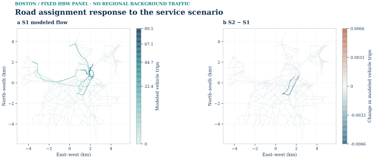
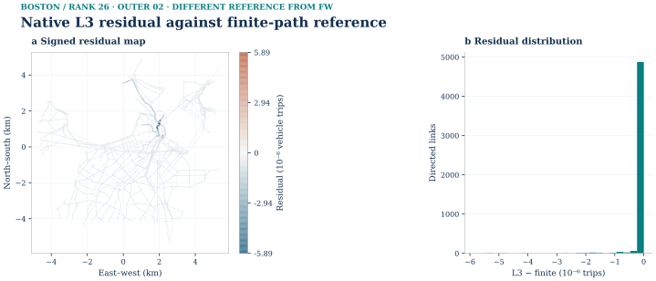
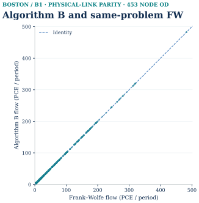
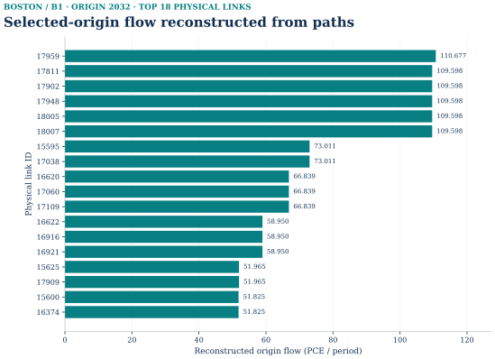
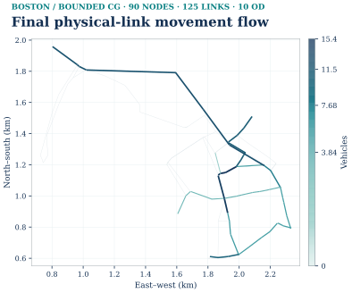
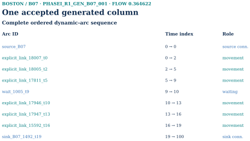
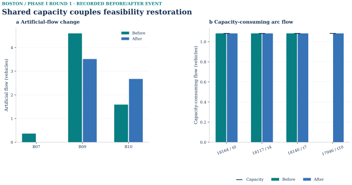

# Boston

[Read the synchronized HTML volume](https://scholarhaozheng.github.io/mobility-network-lab/volumes/boston.html) · [Current data, code and reproduction](https://scholarhaozheng.github.io/mobility-network-lab/reproduce.html)

This complete reading export preserves the HTML volume’s text, figures, tables and legacy anchors. Both Sioux finite instances are included; tables, figures and retained details use HTML blocks for fidelity.

<span class="anchor-alias" id="boston-case"></span>

<span id="reading-section-1"></span>
## Scope and distinct Boston instances

<span class="anchor-alias" id="block-1916"></span>
<span class="anchor-alias" id="block-1917"></span>
<span class="anchor-alias" id="block-2317"></span>

> Complete reading edition · 2026-10-04. Source snapshot: [6ce18b8](https://github.com/scholarhaozheng/mobility-network-lab/tree/6ce18b8bea5bf3b9b7caa6ee4c0ff4e701a34a8b). Original long README: [c51c7dfe](https://github.com/scholarhaozheng/mobility-network-lab/blob/c51c7dfe25559ef5fb464f2b9eeea2872d945d29/README.md). Earlier activity priors and the historical behavior-feedback result remain explicitly separated from the current semantic-fix and expanded experiments.

[Sources and GMNS](#boston-sources) · [Demand and households](#boston-population) · [Service feedback](#boston-feedback) · [Static experiments](#boston-conditional) · [Finite optimization](#boston-finite) · [Data and code](#boston-code) · [Historical results](#boston-history) · [Source contracts](#boston-provenance)

Primary expanded FW tiers contain 453 / 1,684 / 17,522 loaded physical-node ODs. The 26-OD static comparison is a separate controlled instance; accepted expanded full-path / native L3 solutions are not reported. The finite CG/ADMM cases have their own fixed-cost, hard-capacity contracts. The separate 10-OD Lagrangian result has a 1.1002% gap and does not meet the 1% target.

<span class="anchor-alias" id="block-107"></span>

 CASE COVER R1 START <span class="anchor-alias" id="fig-0003"></span>

<span class="anchor-alias" id="coverage-row-20"></span>
<span class="anchor-alias" id="stage-20-city-overview--g-f003"></span>Canonical geographic context for central Boston: real physical GMNS road geometry, the model core boundary and clipped fine H3 resolution-9 zones. This context map is neither an observed traffic map nor an assignment result. [See the consolidated Fine zones, parent zones and physical access](#stage-02-gmns-network-and-access--g-f037).Source records[examples/boston/gmns_exchange_r1/data/link.csv](https://github.com/scholarhaozheng/mobility-network-lab/blob/6ce18b8bea5bf3b9b7caa6ee4c0ff4e701a34a8b/examples/boston/gmns_exchange_r1/data/link.csv)[examples/boston/gmns_exchange_r1/data/zone.csv](https://github.com/scholarhaozheng/mobility-network-lab/blob/6ce18b8bea5bf3b9b7caa6ee4c0ff4e701a34a8b/examples/boston/gmns_exchange_r1/data/zone.csv)Additional saved input: core.geojson; its public acquisition route remains subject to the reproduction audit.

<span class="anchor-alias" id="src-docs-cases-boston-document"></span>
<span class="anchor-alias" id="src-docs-cases-boston-document-boston-case--gmns-four-stages-gps-and-assignment-methods"></span>
<span class="anchor-alias" id="block-106"></span>
<span class="anchor-alias" id="block-108"></span>
<span class="anchor-alias" id="block-109"></span>
<span class="anchor-alias" id="coverage-row-00"></span>
<span class="anchor-alias" id="src-docs-cases-boston-document-role-in-the-repository"></span>
<span class="anchor-alias" id="block-110"></span>
<span class="anchor-alias" id="block-111"></span>
<span class="anchor-alias" id="block-112"></span>
<span class="anchor-alias" id="src-docs-full-walkthrough-part-4-document"></span>
<span class="anchor-alias" id="block-1911"></span>
<span class="anchor-alias" id="src-docs-full-walkthrough-part-4-document-04--case-study--boston"></span>
<span class="anchor-alias" id="block-1912"></span>
<span class="anchor-alias" id="src-docs-full-walkthrough-part-4-document-role-in-the-repository"></span>
<span class="anchor-alias" id="block-1913"></span>
<span class="anchor-alias" id="block-1914"></span>
<span class="anchor-alias" id="src-readme-old-part-4-document"></span>
<span class="anchor-alias" id="block-2311"></span>
<span class="anchor-alias" id="src-readme-old-part-4-document-04--case-study--boston"></span>
<span class="anchor-alias" id="block-2312"></span>
<span class="anchor-alias" id="src-readme-old-part-4-document-role-in-the-repository"></span>
<span class="anchor-alias" id="block-2313"></span>

Boston is the real-city instance of the shared framework. Its separate public branches are (1) the accepted semantic S1/S2 service-feedback example, (2) the conditional absolute-attribute ABS_PLANNED / ABS_OBS_EXPLORATORY sensitivity and fixed ABS_PLANNED FW/full-path/native-L3 comparison, and (3) bounded **90-node/125-link/10-OD finite space–time CG and ADMM R2_S** evidence on the same fixed-cost model class. These branches use related Boston source geography but **not** the same demand identity or optimization objective as the static branch. [Start at the project homepage](01-overview.md#src-readme-document).

Related source records: [Boston case · GMNS, four stages, GPS and assignment methods](https://github.com/scholarhaozheng/mobility-network-lab/blob/6ce18b8bea5bf3b9b7caa6ee4c0ff4e701a34a8b/docs/cases/boston.md) · [Retained walkthrough · 04 / Case study — Boston](https://github.com/scholarhaozheng/mobility-network-lab/blob/6ce18b8bea5bf3b9b7caa6ee4c0ff4e701a34a8b/docs/full-walkthrough.md).

<span class="anchor-alias" id="block-1915"></span>

<table>
<thead>
<tr>
<th>Boston branch</th>
<th>Scope and purpose</th>
<th>Keep it distinct from</th>
</tr>
</thead>
<tbody><tr>
<td><strong>Semantic service-feedback baseline</strong></td>
<td>36 selected zone ODs × three departures; regional baseline shares; about 202.078 / 202.071 assigned vehicle trips</td>
<td>An absolute-cost baseline-choice model or the expanded all-OD run</td>
</tr>
<tr>
<td><strong>Conditional ABS_PLANNED control</strong></td>
<td>26 road-node ODs, 203.660479 vehicles, frozen 130-path comparison; FW and accepted native ranks 26/52</td>
<td>Expanded L3 performance</td>
</tr>
<tr>
<td><strong>Algorithm B B0/B1 static controls</strong></td>
<td>B0 26-OD interface; B1 453 physical-node ODs, 1,936.23847491 PCE in two hours; official tap-b through task-local lossless adapter</td>
<td>Official TAPLab Boston adapter parity or observed/citywide demand</td>
</tr>
<tr>
<td><strong>Scalable conditional planned service</strong></td>
<td>500 / 2,000 / all 30,790 interzonal source ODs; new absolute attributes and eligible demand</td>
<td>All real Boston traffic or independent behavioral validation</td>
</tr>
<tr>
<td><strong>Bounded finite space–time CG pilot</strong></td>
<td>90 nodes / 125 links / 10 ODs; Phase I + Phase II + independent full-DAG pricing closure</td>
<td>Citywide Boston CG, static BPR/Beckmann assignment, or a second Boston scale</td>
</tr>
<tr>
<td><strong>Bounded finite space–time ADMM R2_S holdout</strong></td>
<td>Same bounded 90-node / 125-link / 10-OD finite graph; 253 iterations, 6.68e-6 own-LP relative objective gap and independent gates</td>
<td>Citywide Boston ADMM, static UE, or observed traffic</td>
</tr>
</tbody></table>

<span class="anchor-alias" id="boston-sources"></span>

<span id="reading-section-2"></span>
## 01 / Sources, study area and network identity

The shared geography provides a consistent reference for roads, zones, transit and observations. Demand identities and solver instances are defined separately below.

<span class="anchor-alias" id="block-115"></span>
<span class="anchor-alias" id="src-docs-cases-boston-document-scope-and-statistics"></span>
<span class="anchor-alias" id="block-116"></span>
<span class="anchor-alias" id="block-117"></span>
<span class="anchor-alias" id="src-docs-datasets-boston-central-document"></span>
<span class="anchor-alias" id="src-docs-datasets-boston-central-document-central-boston-source-backed-city-instance"></span>
<span class="anchor-alias" id="block-421"></span>
<span class="anchor-alias" id="block-422"></span>
<span class="anchor-alias" id="block-445"></span>
<span class="anchor-alias" id="src-docs-datasets-boston-central-document-study-area-and-data-identity"></span>
<span class="anchor-alias" id="block-446"></span>
<span class="anchor-alias" id="block-1918"></span>
<span class="anchor-alias" id="src-docs-full-walkthrough-part-4-document-scope-and-statistics"></span>
<span class="anchor-alias" id="block-1919"></span>
<span class="anchor-alias" id="block-1920"></span>
<span class="anchor-alias" id="homepage-evidence"></span>
<span class="anchor-alias" id="coverage-row-01"></span>
<span class="anchor-alias" id="group-01--sources-gmns-and-case-definition"></span>

<table>
<thead>
<tr>
<th>Item</th>
<th>Value</th>
</tr>
</thead>
<tbody><tr>
<td>Core</td>
<td>Central Boston, bbox <code>[-71.105, 42.335, -71.045, 42.370]</code>, about 19.22 km²</td>
</tr>
<tr>
<td>Analysis buffer</td>
<td>2.5 km for road context and GPS matching</td>
</tr>
<tr>
<td>Road source</td>
<td>GMNS Plus <code>21_Boston</code>, commit <code>116447ab641cca1ed34797d019c8e704063393c3</code> (Apache-2.0)</td>
</tr>
<tr>
<td>Physical matcher network</td>
<td>2,852 nodes; 5,091 directed links; source <code>link_type=0</code> connectors excluded</td>
</tr>
<tr>
<td>Project zones</td>
<td>177 H3 r9 cells; 9 logical H3 r7 parents; 177 explicit access records</td>
</tr>
<tr>
<td>Activity source</td>
<td>Official MassGIS Property Tax Parcels slice: 54,411 assessment rows, 13,585 unique parcel geometries; Boston FY2023 and Cambridge FY2026</td>
</tr>
<tr>
<td>Transit source</td>
<td>MBTA feed <code>mdb-437</code>, Fall 2026 version D; service date 2026-09-22</td>
</tr>
<tr>
<td>GPS source</td>
<td>Twelve MBTA V3 bus-position snapshots captured during a short 2026-09-21 local window</td>
</tr>
</tbody></table>

Related source records: [Central Boston source-backed city instance](https://github.com/scholarhaozheng/mobility-network-lab/blob/6ce18b8bea5bf3b9b7caa6ee4c0ff4e701a34a8b/docs/datasets/boston-central.md) · [Open the corrected network/GPS map](https://github.com/scholarhaozheng/mobility-network-lab/blob/6ce18b8bea5bf3b9b7caa6ee4c0ff4e701a34a8b/examples/boston/map/boston_central_layers.html) · [Open the activity-prior map](https://github.com/scholarhaozheng/mobility-network-lab/blob/6ce18b8bea5bf3b9b7caa6ee4c0ff4e701a34a8b/examples/boston/map/boston_activity_prior_layers.html) · [Browse the component](#src-examples-boston-readme-document) · [Query the compact SQLite copy](https://github.com/scholarhaozheng/mobility-network-lab/blob/6ce18b8bea5bf3b9b7caa6ee4c0ff4e701a34a8b/examples/boston/query_boston.py).

<span class="anchor-alias" id="block-447"></span>

Catalog city IDs, GHSL IDs, feed IDs, source TAZ IDs and project H3 IDs remain separate. The component does not infer identity from similar labels.

<span class="anchor-alias" id="block-297"></span>

Road source: [GMNS Plus Dataset](https://github.com/HanZhengIntelliTransport/GMNS_Plus_Dataset), Apache-2.0; retain its source license and notice. Parcel source and credit: [MassGIS Property Tax Parcels](https://www.mass.gov/info-details/massgis-data-property-tax-parcels), MassGIS (Bureau of Geographic Information), Commonwealth of Massachusetts EOTSS. Position source: MassDOT / MBTA V3, subject to the [MassDOT developer license](https://www.mass.gov/doc/developers-license-agreement-11132009/download) and provider acknowledgement. Project-derived zones, matched progression and saved assignment figures: Mobility Computation Lab. Consult [data licenses](01-overview.md#src-data_licenses-document), [third-party notices](01-overview.md#src-third_party_notices-document) and [Boston data sources](#src-examples-boston-data_sources-document) for the wider release terms.

<span class="anchor-alias" id="figure-001"></span>

<span class="anchor-alias" id="fig-0131"></span>
[See the numerical evidence and scope in the Source data and preparation section.](#coverage-row-01)

[Evidence](#src-docs-cases-boston-document-gmns-zones-and-source-evidence) · [Source record](https://github.com/scholarhaozheng/mobility-network-lab/blob/6ce18b8bea5bf3b9b7caa6ee4c0ff4e701a34a8b/examples/boston/gmns_exchange_r1/data/link.csv)

[Evidence](#src-docs-cases-boston-document-gmns-zones-and-source-evidence) · [Figure](#coverage-row-01)

<span class="anchor-alias" id="boston-gmns"></span>

<span id="reading-section-3"></span>
### GMNS objects, reversible IDs and access

<span class="anchor-alias" id="src-docs-datasets-boston-gmns-exchange-document"></span>
<span class="anchor-alias" id="src-docs-datasets-boston-gmns-exchange-document-boston-gmns-foundation-and-toolchain-alignment"></span>
<span class="anchor-alias" id="block-1921"></span>
<span class="anchor-alias" id="src-docs-full-walkthrough-part-4-document-gmns-zones-and-source-evidence"></span>
<span class="anchor-alias" id="block-1922"></span>
<span class="anchor-alias" id="block-1925"></span>
<span class="anchor-alias" id="block-1926"></span>
<span class="anchor-alias" id="block-1930"></span>
<span class="anchor-alias" id="block-1933"></span>
<span class="anchor-alias" id="block-1934"></span>
<span class="anchor-alias" id="block-2318"></span>
<span class="anchor-alias" id="src-readme-old-part-4-document-scope-and-statistics"></span>
<span class="anchor-alias" id="block-2321"></span>
<span class="anchor-alias" id="src-readme-old-part-4-document-gmns-zones-and-source-evidence"></span>
<span class="anchor-alias" id="block-2323"></span>
<span class="anchor-alias" id="src-readme-old-part-4-document-gmns-in-action"></span>
<span class="anchor-alias" id="src-readme-old-part-4-document-boston--gmns-in-action"></span>
<span class="anchor-alias" id="block-2325"></span>
<span class="anchor-alias" id="block-2328"></span>
<span class="anchor-alias" id="src-readme-old-part-4-document-city-network-workflow"></span>
<span class="anchor-alias" id="block-2331"></span>
<span class="anchor-alias" id="src-readme-old-part-4-document-gmns-foundation-and-toolchain-alignment"></span>
<span class="anchor-alias" id="block-2333"></span>

[Source record](https://github.com/scholarhaozheng/mobility-network-lab/blob/6ce18b8bea5bf3b9b7caa6ee4c0ff4e701a34a8b/docs/datasets/boston-gmns-exchange.md) · Snapshot 6ce18b8.

Related source records: [Read-only relationship lookup](https://github.com/scholarhaozheng/mobility-network-lab/blob/6ce18b8bea5bf3b9b7caa6ee4c0ff4e701a34a8b/tools/gmns/trace_gmns_figure.py) · [GMNS-compatible input contract](01-overview.md#src-docs-data-contract-document) · [City and hierarchy guide](01-overview.md#src-docs-city-workflow-document) · [boston-gmns-exchange.md#one-network-multiple-connected-data-layers](https://github.com/scholarhaozheng/mobility-network-lab/blob/c51c7dfe25559ef5fb464f2b9eeea2872d945d29/docs/datasets/boston-gmns-exchange.md#one-network-multiple-connected-data-layers) · [boston-central.md#boston-visual-gallery](https://github.com/scholarhaozheng/mobility-network-lab/blob/c51c7dfe25559ef5fb464f2b9eeea2872d945d29/docs/datasets/boston-central.md#boston-visual-gallery).

<span class="anchor-alias" id="block-273"></span>
<span class="anchor-alias" id="block-293"></span>
<span class="anchor-alias" id="block-423"></span>

The [actual exchange tables](#src-examples-boston-gmns_exchange_r1-readme-document) are a new, reversible interface to the **existing** four-stage/GPS example—not a different demand model. Open the [network links](https://github.com/scholarhaozheng/mobility-network-lab/blob/6ce18b8bea5bf3b9b7caa6ee4c0ff4e701a34a8b/examples/boston/gmns_exchange_r1/data/link.csv), [nodes](https://github.com/scholarhaozheng/mobility-network-lab/blob/6ce18b8bea5bf3b9b7caa6ee4c0ff4e701a34a8b/examples/boston/gmns_exchange_r1/data/node.csv), [zones](https://github.com/scholarhaozheng/mobility-network-lab/blob/6ce18b8bea5bf3b9b7caa6ee4c0ff4e701a34a8b/examples/boston/gmns_exchange_r1/data/zone.csv), [S1](https://github.com/scholarhaozheng/mobility-network-lab/blob/6ce18b8bea5bf3b9b7caa6ee4c0ff4e701a34a8b/examples/boston/gmns_exchange_r1/data/demand_S1.csv) or [S2](https://github.com/scholarhaozheng/mobility-network-lab/blob/6ce18b8bea5bf3b9b7caa6ee4c0ff4e701a34a8b/examples/boston/gmns_exchange_r1/data/demand_S2.csv) panel demand, then use the [ID crosswalk](https://github.com/scholarhaozheng/mobility-network-lab/blob/6ce18b8bea5bf3b9b7caa6ee4c0ff4e701a34a8b/examples/boston/gmns_exchange_r1/data/id_crosswalk.csv) to return to the original H3 and road IDs. [Profile](https://github.com/scholarhaozheng/mobility-network-lab/blob/6ce18b8bea5bf3b9b7caa6ee4c0ff4e701a34a8b/examples/boston/gmns_exchange_r1/TARGET_PROFILE.json), [manifest](https://github.com/scholarhaozheng/mobility-network-lab/blob/6ce18b8bea5bf3b9b7caa6ee4c0ff4e701a34a8b/examples/boston/gmns_exchange_r1/data/manifest.json), [tool usage](https://github.com/scholarhaozheng/mobility-network-lab/blob/6ce18b8bea5bf3b9b7caa6ee4c0ff4e701a34a8b/examples/boston/gmns_exchange_r1/TOOLCHAIN_USAGE.json) and [commands](#src-examples-boston-gmns_exchange_r1-readme-document-rebuild-and-inspect-no-optimization) make the format checkable.

<span class="anchor-alias" id="block-118"></span>
<span class="anchor-alias" id="src-docs-cases-boston-document-gmns-zones-and-source-evidence"></span>
<span class="anchor-alias" id="block-119"></span>
<span class="anchor-alias" id="block-120"></span>
<span class="anchor-alias" id="block-274"></span>
<span class="anchor-alias" id="block-1928"></span>
<span class="anchor-alias" id="src-docs-full-walkthrough-part-4-document-city-network-workflow"></span>
<span class="anchor-alias" id="block-1929"></span>
<span class="anchor-alias" id="coverage-row-02"></span>

<table>
<thead>
<tr>
<th>Object</th>
<th>Exchange table / fields</th>
<th>Authority</th>
<th>Actual producer → consumer; evidence and scope</th>
</tr>
</thead>
<tbody><tr>
<td>Physical roads</td>
<td><code>node.csv</code>; <code>link.csv</code> with <code>directed</code>, <code>dir_flag</code>, WKT, source IDs, source hourly capacity</td>
<td>GMNS core node/link; accepted MCL fields prefixed <code>mcl_solver_</code></td>
<td>GMNS Plus 21_Boston → MCL adapter and pinned GMNS Plus Level 2 reader. 2,852 nodes, 5,091 directed physical links.</td>
</tr>
<tr>
<td>Fine zones / boundaries</td>
<td><code>zone.csv</code> <code>zone_id,boundary,super_zone</code>; H3 extension fields</td>
<td>GMNS core zone plus MCL H3 fields</td>
<td>177 H3 r9 full-cell polygons; clipped-core geometry retained separately.</td>
</tr>
<tr>
<td>Hierarchy</td>
<td><code>zone.csv.super_zone</code>; <code>id_crosswalk.csv</code> original H3 IDs</td>
<td>GMNS optional hierarchy plus MCL mapping</td>
<td>Nine r7 parents are aggregation objects, not additional loaded OD origins.</td>
</tr>
<tr>
<td>Centroids and access</td>
<td><code>node.csv</code> centroid rows; 354 nonphysical <code>link.csv</code> arcs; <code>id_crosswalk.csv</code></td>
<td>GMNS Plus integer centroid convention; MCL connector semantics</td>
<td>177 centroids map to 139 distinct physical nodes without merging H3 identities. No arbitrary connector cost/through-routing claim.</td>
</tr>
<tr>
<td>Panel zonal demand</td>
<td><code>demand_S1.csv</code>, <code>demand_S2.csv</code> exactly three fields; <code>selected_demand_ledger.csv</code></td>
<td>GMNS Plus consumer profile; MCL scenario ledger</td>
<td>Frozen person-to-vehicle crosswalk → 26 H3 OD pairs/scenario; 202.078384 / 202.070733 modeled vehicle trips. Full regional purpose/time OD remains in separate full-data asset.</td>
</tr>
<tr>
<td>Physical solver view</td>
<td><code>mcl_solver_*</code> link fields and <code>roundtrip</code> CLI</td>
<td>MCL extension, not core GMNS</td>
<td>Export → read → original 5,091-row S1/S2 link inputs, 26 physical-node OD pairs, maximum OD error <code>1.78e-15</code>; no solver rerun.</td>
</tr>
<tr>
<td>GPS/service evidence</td>
<td><code>gps_path_links.csv</code> source <code>link_id</code>; <code>transit_shape_conflation.csv</code> matched link; <code>transit_stop_route_relation.csv</code> access node</td>
<td>MCL evidence extension; native GTFS IDs separate</td>
<td>Accepted mapmatching4gmns/mapmatcher4gmns roles; MBTA V3 JSON positions, not GTFS-Realtime. 581 GPS path-link rows, 56 planned-shape link rows, and 5,520 stop-route rows (2,614 with candidate physical access) retain quality/status distinctions.</td>
</tr>
<tr>
<td>Corridor and saved results</td>
<td><code>corridor_link.csv</code>, <code>assignment_result_by_scenario.csv</code></td>
<td>MCL extensions</td>
<td>One ordered 23-link corridor and 5,091 saved road result rows join by original physical <code>link_id</code>. Not official TAPLab output.</td>
</tr>
</tbody></table>

<span class="anchor-alias" id="block-275"></span>
<span class="anchor-alias" id="block-1248"></span>
<span class="anchor-alias" id="block-1931"></span>
<span class="anchor-alias" id="src-docs-full-walkthrough-part-4-document-gmns-foundation-and-toolchain-alignment"></span>
<span class="anchor-alias" id="block-1932"></span>

The pinned [community GMNS 0.96](https://github.com/zephyr-data-specs/GMNS) schema commit is `4e51f4c7893f5df2c8c69ab21c5dc0abd9b69f48`; the snapshots are bundled [here](https://github.com/scholarhaozheng/mobility-network-lab/tree/6ce18b8bea5bf3b9b7caa6ee4c0ff4e701a34a8b/examples/boston/gmns_exchange_r1/schema); the actual [GMNS Plus Dataset](https://github.com/HanZhengIntelliTransport/GMNS_Plus_Dataset) structural reader at commit `116447ab641cca1ed34797d019c8e704063393c3` read both new node/link/demand scenarios at Level 2 with zero errors/warnings. It does not parse `zone.csv` at that level; our separate project runner validates that table against the pinned upstream zone schema. This is a structural/format result, not simulation, connector cost suitability, observed-volume readiness, empirical validation or supervisor approval. The exact teacher grid2demand2 and competition-specific target remain unverified. The tool [usage register](https://github.com/scholarhaozheng/mobility-network-lab/blob/6ce18b8bea5bf3b9b7caa6ee4c0ff4e701a34a8b/examples/boston/gmns_exchange_r1/TOOLCHAIN_USAGE.json) separates what was run from what is merely referenced.

Related source records: [GMNS_Plus_Readiness_Validator.py](https://github.com/scholarhaozheng/mobility-network-lab/blob/6ce18b8bea5bf3b9b7caa6ee4c0ff4e701a34a8b/tools/gmns/vendor/GMNS_Plus_Readiness_Validator.py).

<span class="anchor-alias" id="block-276"></span>
<span class="anchor-alias" id="src-docs-datasets-boston-gmns-exchange-document-one-network-multiple-connected-data-layers"></span>
<span class="anchor-alias" id="block-277"></span>

<span class="anchor-alias" id="fig-0022"></span>

<figure class="canonical-figure" data-figure="G-F022" id="stage-02-gmns-network-and-access--g-f022"><a href="../assets/atlas/figures/g-f022.svg"></a><figcaption><strong>Zone, access and road objects.</strong> Real Boston GMNS zone 35→71 demand and the centroid/access/physical-road object chain. The demand relation is 10.349852758647414 modeled trips. Centroid connectors are nonphysical; physical road links can carry saved results and GPS associations. The route-60 GPS sample illustrates a separate observed journey.</figcaption><div class="figure-links"><a href="../assets/atlas/figures/g-f022.svg">SVG</a><a href="../assets/atlas/figures/g-f022.png">PNG</a><a href="../assets/atlas/figures/g-f022.pdf">PDF</a></div><details class="figure-sources"><summary>Source records</summary><ul><li><a href="https://github.com/scholarhaozheng/mobility-network-lab/blob/6ce18b8bea5bf3b9b7caa6ee4c0ff4e701a34a8b/examples/boston/gmns_exchange_r1/data/zone.csv">examples/boston/gmns_exchange_r1/data/zone.csv</a></li><li><a href="https://github.com/scholarhaozheng/mobility-network-lab/blob/6ce18b8bea5bf3b9b7caa6ee4c0ff4e701a34a8b/examples/boston/gmns_exchange_r1/data/id_crosswalk.csv">examples/boston/gmns_exchange_r1/data/id_crosswalk.csv</a></li><li><a href="https://github.com/scholarhaozheng/mobility-network-lab/blob/6ce18b8bea5bf3b9b7caa6ee4c0ff4e701a34a8b/examples/boston/gmns_exchange_r1/data/node.csv">examples/boston/gmns_exchange_r1/data/node.csv</a></li><li><a href="https://github.com/scholarhaozheng/mobility-network-lab/blob/6ce18b8bea5bf3b9b7caa6ee4c0ff4e701a34a8b/examples/boston/gmns_exchange_r1/data/link.csv">examples/boston/gmns_exchange_r1/data/link.csv</a></li><li><a href="https://github.com/scholarhaozheng/mobility-network-lab/blob/6ce18b8bea5bf3b9b7caa6ee4c0ff4e701a34a8b/examples/boston/gmns_exchange_r1/data/demand_S1.csv">examples/boston/gmns_exchange_r1/data/demand_S1.csv</a></li></ul></details></figure>

<span class="anchor-alias" id="block-278"></span>

*Separate objects, explicit relationships. Model access connectors are not physical roads. Shared link references do not imply a shared observed trip.* The geographic panel is transformed from source EPSG:4326 to metric EPSG:32619 for display. Its straight dotted arrow shows a zonal **OD relation, not an assigned road route**; the inset shows the true projected 24.97 m node-to-node access geometry. Parent `1003` is a logical `super_zone` relation, not a clipped polygon invented for this figure.

<span class="anchor-alias" id="block-279"></span>
<span class="anchor-alias" id="block-1923"></span>
<span class="anchor-alias" id="src-docs-full-walkthrough-part-4-document-gmns-in-action"></span>
<span class="anchor-alias" id="src-docs-full-walkthrough-part-4-document-boston--gmns-in-action"></span>
<span class="anchor-alias" id="block-1924"></span>

<table>
<thead>
<tr>
<th>Record and authority</th>
<th>Actual key/value</th>
<th>What the join does</th>
</tr>
</thead>
<tbody><tr>
<td>GMNS core <code>zone.csv</code></td>
<td><code>zone_id=35</code>, <code>name=h3r9:892a306602bffff</code>, <code>super_zone=1003</code>; parent name <code>h3r7:872a30660ffffff</code></td>
<td>Retains the actual fine H3 boundary and its r7 hierarchy key.</td>
</tr>
<tr>
<td>GMNS Plus profile <code>node.csv</code></td>
<td>centroid <code>node_id=35</code>; physical access <code>node_id=14285</code></td>
<td>Separate centroid and physical road node.</td>
</tr>
<tr>
<td>MCL <code>id_crosswalk.csv</code></td>
<td>origin 35: <code>physical_access_node_id=14285</code>, source <code>4285</code>; destination 71: exported access <code>11492</code>, source <code>1492</code></td>
<td>Maps H3 and exported IDs without merging zones.</td>
</tr>
<tr>
<td>GMNS Plus profile / MCL semantics <code>link.csv</code></td>
<td>outbound access <code>link_id=1020334</code>, <code>35 → 14285</code>; physical outgoing <code>link_id=16918</code>, <code>14285 → 15112</code></td>
<td>The connector is nonphysical and <code>mcl_gps_match_allowed=false</code>; the road is physical and directed.</td>
</tr>
<tr>
<td>GMNS Plus profile <code>demand_S1.csv</code></td>
<td><code>35 → 71</code>, <code>volume=10.349852758647414</code>; crosswalked physical access OD <code>4285 → 1492</code></td>
<td>Modeled fixed-panel vehicle trips, aggregated from eligible ledger rows. This row does not say which physical road the OD used.</td>
</tr>
<tr>
<td>Separate MCL evidence/result branch</td>
<td>route-60 saved path occurrence <code>1 → link_id=15893 → S1 result 13.167906406832085</code></td>
<td>A shared physical-link key supports a separate lookup; it is <strong>not</strong> the above OD's trip or an observed road count.</td>
</tr>
</tbody></table>

<span class="anchor-alias" id="block-280"></span>
<span class="anchor-alias" id="block-1249"></span>

The active 177 H3 r9 zones are mapped reversibly to integers 1–177. Nine r7 parents are aggregation metadata, not extra demand origins. Each fine zone has its own centroid even where multiple zones share one of 139 physical access nodes. Physical node IDs are `10000 + original node ID`; physical link IDs remain original link IDs. The 354 zone-access arcs are nonphysical and cannot be GPS matched. `node.zone_id` no longer ambiguously carries source TAZ values. All original source TAZs and connectors remain intact in the `source_inputs/source_gmns_plus_21_boston/` asset member ([source identity](https://github.com/scholarhaozheng/mobility-network-lab/blob/6ce18b8bea5bf3b9b7caa6ee4c0ff4e701a34a8b/examples/boston/gmns_exchange_r1/SOURCE_LINEAGE.json)), but are inactive in this H3 graph.

The full r9 H3 ID, exported integer, source physical-node ID and GMNS link ID remain different namespaces. The published [figure-source record](https://github.com/scholarhaozheng/mobility-network-lab/blob/6ce18b8bea5bf3b9b7caa6ee4c0ff4e701a34a8b/docs/assets/boston/gmns_in_action_r1/FIGURE_SOURCES.json) supplies exact public CSV hashes and selected IDs; the [renderer](https://github.com/scholarhaozheng/mobility-network-lab/blob/6ce18b8bea5bf3b9b7caa6ee4c0ff4e701a34a8b/tools/visuals/render_gmns_in_action.py) reads those same files. The [minimal route-60 display sample](https://github.com/scholarhaozheng/mobility-network-lab/blob/6ce18b8bea5bf3b9b7caa6ee4c0ff4e701a34a8b/examples/boston/gmns_exchange_r1/figure_sample/SOURCE_RECORD.json) retains only 12 already approved derived positions, 26 ordered path rows and one quality row, with source hashes and no vehicle-identity field; the full saved GPS tables are not required in the upload set.

<span class="anchor-alias" id="block-430"></span>
<span class="anchor-alias" id="src-docs-datasets-boston-central-document-physical-network-zones-and-corridor"></span>
<span class="anchor-alias" id="block-431"></span>

<span class="anchor-alias" id="fig-0037"></span>

<figure class="canonical-figure" data-figure="G-F037" id="stage-02-gmns-network-and-access--g-f037"><a href="../assets/atlas/figures/g-f037.svg"></a><figcaption><strong>Fine zones, parent zones and physical access.</strong> Fine H3 r9 zones and coarser parent H3 r7 structure use their saved geometry. Panel a also retains the model core boundary from the study-area map. Small centroid symbols are nonphysical model objects; access links join them to physical roads. The 177 fine zones map to 139 distinct physical access nodes. Connectors encode model access; GPS matching uses physical road links.</figcaption><div class="figure-links"><a href="../assets/atlas/figures/g-f037.svg">SVG</a><a href="../assets/atlas/figures/g-f037.png">PNG</a><a href="../assets/atlas/figures/g-f037.pdf">PDF</a></div><details class="figure-sources"><summary>Source records</summary><ul><li><a href="https://github.com/scholarhaozheng/mobility-network-lab/blob/6ce18b8bea5bf3b9b7caa6ee4c0ff4e701a34a8b/examples/boston/gmns_exchange_r1/data/link.csv">examples/boston/gmns_exchange_r1/data/link.csv</a></li><li><a href="https://github.com/scholarhaozheng/mobility-network-lab/blob/6ce18b8bea5bf3b9b7caa6ee4c0ff4e701a34a8b/examples/boston/gmns_exchange_r1/data/zone.csv">examples/boston/gmns_exchange_r1/data/zone.csv</a></li><li><a href="https://github.com/scholarhaozheng/mobility-network-lab/blob/6ce18b8bea5bf3b9b7caa6ee4c0ff4e701a34a8b/examples/boston/gmns_exchange_r1/data/node.csv">examples/boston/gmns_exchange_r1/data/node.csv</a></li><li><a href="https://github.com/scholarhaozheng/mobility-network-lab/blob/6ce18b8bea5bf3b9b7caa6ee4c0ff4e701a34a8b/examples/boston/gmns_exchange_r1/data/id_crosswalk.csv">examples/boston/gmns_exchange_r1/data/id_crosswalk.csv</a></li><li>Additional saved input: core.geojson; its public acquisition route remains subject to the reproduction audit.</li></ul></details></figure>

<span class="anchor-alias" id="block-432"></span>

Central Boston contains 5,091 directed physical GMNS links, 177 clipped H3 r9 zones, nine r7 parent zones, the core boundary and a 2.5 km analysis buffer. Orange marks one continuous model corridor with 23 ordered member links. MassGIS parcel outlines supply context and are not building footprints; model access connectors are omitted. Roads: GMNS Plus 21_Boston (Apache-2.0), commit `116447ab641cca1ed34797d019c8e704063393c3`; parcels: MassGIS (Bureau of Geographic Information), Commonwealth of Massachusetts EOTSS; zones and boundaries: Mobility Computation Lab.

<span class="anchor-alias" id="block-1247"></span>

This is a **data-interface view of the accepted Boston result**, not a new model run. Open [zone.csv](https://github.com/scholarhaozheng/mobility-network-lab/blob/6ce18b8bea5bf3b9b7caa6ee4c0ff4e701a34a8b/examples/boston/gmns_exchange_r1/data/zone.csv), [node.csv](https://github.com/scholarhaozheng/mobility-network-lab/blob/6ce18b8bea5bf3b9b7caa6ee4c0ff4e701a34a8b/examples/boston/gmns_exchange_r1/data/node.csv), [link.csv](https://github.com/scholarhaozheng/mobility-network-lab/blob/6ce18b8bea5bf3b9b7caa6ee4c0ff4e701a34a8b/examples/boston/gmns_exchange_r1/data/link.csv), [S1 zonal demand](https://github.com/scholarhaozheng/mobility-network-lab/blob/6ce18b8bea5bf3b9b7caa6ee4c0ff4e701a34a8b/examples/boston/gmns_exchange_r1/data/demand_S1.csv), [S2 zonal demand](https://github.com/scholarhaozheng/mobility-network-lab/blob/6ce18b8bea5bf3b9b7caa6ee4c0ff4e701a34a8b/examples/boston/gmns_exchange_r1/data/demand_S2.csv), [ID crosswalk](https://github.com/scholarhaozheng/mobility-network-lab/blob/6ce18b8bea5bf3b9b7caa6ee4c0ff4e701a34a8b/examples/boston/gmns_exchange_r1/data/id_crosswalk.csv) or the [machine manifest](https://github.com/scholarhaozheng/mobility-network-lab/blob/6ce18b8bea5bf3b9b7caa6ee4c0ff4e701a34a8b/examples/boston/gmns_exchange_r1/data/manifest.json) directly. The selected GMNS Plus reader consumed node/link/demand for both scenarios at structural Level 2 with zero errors and zero warnings; its Level 2 path does not parse `zone.csv`, which our separate pinned-schema runner checks. These results do not establish ODME, routed-centroid costs, empirical calibration or a teacher/competition approval.

<span class="anchor-alias" id="block-1250"></span>

The `link.capacity` core field is source PCE/hour/lane; `mcl_solver_capacity_effective` is the accepted two-hour physical solver value. The exporter preserves the entire frozen S1/S2 link row in explicitly prefixed MCL columns so the physical solver input is exactly reconstructible. The original `dir_flag` describes WKT orientation; `directed=true` describes travel. Blank connector speed/capacity/length is intentional: a structural reader can parse this graph, but generic routing through its centroids has **not** been certified. The supported solver adapter collapses zonal OD onto the accepted physical access-node injection without rerunning assignment.

<span class="anchor-alias" id="block-1251"></span>

The per-scenario demand CSVs have exactly `o_zone_id,d_zone_id,volume`, in vehicle trips for the fixed midday panel. The saved crosswalk selects S1 `mu=0.25` and S2's accepted FW boundary variant `mu=1.0` before aggregating modes and departures. [selected_demand_ledger.csv](https://github.com/scholarhaozheng/mobility-network-lab/blob/6ce18b8bea5bf3b9b7caa6ee4c0ff4e701a34a8b/examples/boston/gmns_exchange_r1/data/selected_demand_ledger.csv) retains the included/excluded row semantics. The full regional 177×177 purpose/time OD is **not** replaced by these 26-row panel tables; it remains in `derived/regional_od_h3.csv` in the separate immutable `BOSTON_BEHAVIOR_FEEDBACK_PUBLIC_DATA_EN.zip` release asset.

<span class="anchor-alias" id="block-1252"></span>

The [GPS path relation](https://github.com/scholarhaozheng/mobility-network-lab/blob/6ce18b8bea5bf3b9b7caa6ee4c0ff4e701a34a8b/examples/boston/gmns_exchange_r1/data/gps_path_links.csv), [planned GTFS shape-to-link relation](https://github.com/scholarhaozheng/mobility-network-lab/blob/6ce18b8bea5bf3b9b7caa6ee4c0ff4e701a34a8b/examples/boston/gmns_exchange_r1/data/transit_shape_conflation.csv), [stop-to-physical-node access candidates](https://github.com/scholarhaozheng/mobility-network-lab/blob/6ce18b8bea5bf3b9b7caa6ee4c0ff4e701a34a8b/examples/boston/gmns_exchange_r1/data/transit_stop_route_relation.csv), [ordered corridor membership](https://github.com/scholarhaozheng/mobility-network-lab/blob/6ce18b8bea5bf3b9b7caa6ee4c0ff4e701a34a8b/examples/boston/gmns_exchange_r1/data/corridor_link.csv), and [saved road result](https://github.com/scholarhaozheng/mobility-network-lab/blob/6ce18b8bea5bf3b9b7caa6ee4c0ff4e701a34a8b/examples/boston/gmns_exchange_r1/data/assignment_result_by_scenario.csv) are MCL evidence/result extensions, not universal GMNS schema tables. The 2,906 stop-route rows without a known access node stay blank, not zero. GPS observations were MBTA V3 JSON positions, not GTFS-Realtime protobuf. Native GTFS feed/route/stop IDs remain distinct from H3 and road IDs. No incomplete GMNS `location` rows have been fabricated.

<span class="anchor-alias" id="figure-002"></span>

<span class="anchor-alias" id="fig-0132"></span>
[See Fine zones, parent zones and physical access](#stage-02-gmns-network-and-access--g-f037)

[Evidence](#src-docs-cases-boston-document-gmns-zones-and-source-evidence) · [Figure](../assets/atlas/figures/g-f037.png)

<span class="anchor-alias" id="figure-003"></span>

<span class="anchor-alias" id="fig-0152"></span>
[See Fine zones, parent zones and physical access](#stage-02-gmns-network-and-access--g-f037)

[Evidence](#src-docs-cases-boston-document-gmns-zones-and-source-evidence) · [Figure](../assets/atlas/figures/g-f037.png)

<span class="anchor-alias" id="boston-transit"></span>

<span id="reading-section-4"></span>
### Transit, pedestrian access and GPS coverage

<span class="anchor-alias" id="block-457"></span>
<span class="anchor-alias" id="src-docs-datasets-boston-central-document-transit-and-query-scope"></span>
<span class="anchor-alias" id="block-458"></span>
<span class="anchor-alias" id="coverage-row-04"></span>

For 2026-09-22, the local GTFS slice contains 12,901 trips on 112 routes, 3,553 referenced stops (1,391 in the analysis area), and 286,151 stop-time records. Foreign-key and time checks pass. Stop access is a modelled nearest-road-node relation. One planned shape was geometrically conflated to roads; a planned shape is not an observed vehicle path. Planned shape conflation remains separate from observed vehicle paths. The stop-access overlay uses deduplicated stop IDs and modeled nearest-physical-node access candidates; its straight connectors are not field-verified pedestrian routes.

<span class="anchor-alias" id="block-453"></span>
<span class="anchor-alias" id="src-docs-datasets-boston-central-document-gps-and-calibration-evidence"></span>
<span class="anchor-alias" id="block-454"></span>
<span class="anchor-alias" id="coverage-row-05"></span>

The original local build retained 2,091 cleaned bus-position points in 235 capture-window-censored segments. Thirty entered matching: 28 returned continuous paths and two did not. The other 205 were not selected. The later joint spatial/time/path checks qualified nine of the returned segments; all nine native-fallback paths were rejected for trusted-observation use. Returning a connected path is not an accuracy certificate. The coverage figure includes **all 28 returned path segments**, comprising **581 path records and 431 distinct physical links**. It does not overlay the separate 12-point sample and must not be read as 28 accepted observation trajectories.

<span class="anchor-alias" id="block-455"></span>

The earlier path-time scale was corrected to approximately 2.185624 after aligning first/last partial-link windows. It remains a development diagnostic: the previously inspected holdout is not new independent validation, and the observed midday period does not align with the separate AM engineering scenario. It is not applied as an automobile cost multiplier.

<span class="anchor-alias" id="block-281"></span>
<span class="anchor-alias" id="src-docs-datasets-boston-gmns-exchange-document-from-gps-coordinates-to-gmns-linked-evidence"></span>
<span class="anchor-alias" id="block-282"></span>

<span class="anchor-alias" id="fig-0023"></span>
[See One GPS segment and its GMNS association](#stage-05-gps-and-detectors--c-boston-gps-sample)

<span class="anchor-alias" id="block-133"></span>
<span class="anchor-alias" id="src-docs-cases-boston-document-matched-evidence-and-feedback"></span>
<span class="anchor-alias" id="block-134"></span>
<span class="anchor-alias" id="block-283"></span>

The fixed route-60 sample contains **12 saved source positions** and **26 ordered path occurrences** for the quality-eligible segment `mbtav:4624d3319dcfdec1:s01`, with both capture-window ends censored. Source positions, algorithm-derived projections and the saved matched path remain different objects. The original comparison used EPSG:32619 and paired 140 m point-1 windows; the consolidated figure retains the source/projection map, lateral-error series and separate S1 link-result lookup. Matching is not rerun and source positions are not moved. The segment was selected by a stable quality-eligible rule, not by its largest offset. One successful case does not estimate independent matching accuracy.

<span class="anchor-alias" id="block-284"></span>
<span class="anchor-alias" id="block-285"></span>

<table>
<thead>
<tr>
<th>Record type</th>
<th>Actual key</th>
<th>Reference, status and unit</th>
</tr>
</thead>
<tbody><tr>
<td>Source position in <a href="https://github.com/scholarhaozheng/mobility-network-lab/blob/6ce18b8bea5bf3b9b7caa6ee4c0ff4e701a34a8b/examples/boston/gmns_exchange_r1/figure_sample/gps_point_progress.csv">sample <code>gps_point_progress.csv</code></a></td>
<td>segment <code>mbtav:4624d3319dcfdec1:s01</code>, <code>point_seq=1</code>, <code>2026-09-21T12:48:42-04:00</code></td>
<td>Saved original coordinate and algorithm-derived projection; lateral offset <code>1.128122562325221 m</code>.</td>
</tr>
<tr>
<td>Saved matching in <a href="https://github.com/scholarhaozheng/mobility-network-lab/blob/6ce18b8bea5bf3b9b7caa6ee4c0ff4e701a34a8b/examples/boston/gmns_exchange_r1/figure_sample/gps_path_links.csv">sample <code>gps_path_links.csv</code></a></td>
<td><code>path_order=1</code>, <code>path_occurrence=1</code>, <code>link_id=15893</code>, direction <code>AB</code>; next links <code>15882</code>, <code>16110</code></td>
<td>Ordered algorithm-derived physical-link path. Point 1 is associated with occurrence 1; intermediate occurrences with zero projected points are inferred traversal, not new observations.</td>
</tr>
<tr>
<td>Physical road in <code>link.csv</code></td>
<td><code>link_id=15893</code>, exported physical nodes <code>14999 → 13587</code></td>
<td>Directed, GPS-match-allowed network geometry and attributes. This is not a nonphysical centroid connector.</td>
</tr>
<tr>
<td>Saved model result in <code>assignment_result_by_scenario.csv</code></td>
<td><code>link_id=15893</code>, <code>s1_volume=13.167906406832085</code>, <code>s1_travel_time=0.5249053659293993</code></td>
<td>S1 aggregate modeled panel vehicle trips and link minutes; <code>delta_status=MODEL_INTERNAL_PANEL_RESPONSE_NOT_OBSERVED_CAUSAL_EFFECT</code>. These are not GPS-derived counts.</td>
</tr>
</tbody></table>

<span class="anchor-alias" id="block-286"></span>
<span class="anchor-alias" id="block-1259"></span>

*Source observations → algorithm-derived matching → network attributes → separately modeled assignment results. Shared network reference—not the same observed trip.* This route-60 spatial example is distinct from the route-749, stop-1788-to-5093 [numerical service-feedback event](#src-docs-datasets-boston-behavior-feedback-document-gps-feedback). The former demonstrates reference/link lookup; the latter demonstrates a saved calculation dependency. Neither makes GMNS itself a matcher or proves better prediction. MBTA V3 JSON-derived positions retain MBTA/MassDOT attribution; no raw vehicle feed or exact vehicle identity is redistributed by these figures.

<span class="anchor-alias" id="block-436"></span>
<span class="anchor-alias" id="src-docs-datasets-boston-central-document-one-saved-transit-position-projection"></span>
<span class="anchor-alias" id="block-437"></span>

<span class="anchor-alias" id="figure-008"></span>
<span class="anchor-alias" id="fig-0039"></span>

<figure class="canonical-figure" data-figure="C-BOSTON-GPS-SAMPLE" id="stage-05-gps-and-detectors--c-boston-gps-sample"><a href="../assets/atlas/figures/c-boston-gps-sample.svg"></a><figcaption><strong>One GPS segment and its GMNS association.</strong> One fixed segment mbtav:4624d3319dcfdec1:s01 on route 60: 12 reported points and 26 path occurrences. Panel a shows the geographic association above panels b–c. Hollow points denote source locations; solid points are derived projections. Panel b reports lateral projection distances by point; panel c queries saved S1 modeled link-volume values. Association identity is supported by saved sample rows; no independent asset manifest is invented.</figcaption><div class="figure-links"><a href="../assets/atlas/figures/c-boston-gps-sample.svg">SVG</a><a href="../assets/atlas/figures/c-boston-gps-sample.png">PNG</a><a href="../assets/atlas/figures/c-boston-gps-sample.pdf">PDF</a></div><details class="figure-sources"><summary>Source records</summary><ul><li><a href="https://github.com/scholarhaozheng/mobility-network-lab/blob/6ce18b8bea5bf3b9b7caa6ee4c0ff4e701a34a8b/examples/boston/gmns_exchange_r1/figure_sample/gps_point_progress.csv">examples/boston/gmns_exchange_r1/figure_sample/gps_point_progress.csv</a></li><li><a href="https://github.com/scholarhaozheng/mobility-network-lab/blob/6ce18b8bea5bf3b9b7caa6ee4c0ff4e701a34a8b/examples/boston/gmns_exchange_r1/figure_sample/gps_path_links.csv">examples/boston/gmns_exchange_r1/figure_sample/gps_path_links.csv</a></li><li><a href="https://github.com/scholarhaozheng/mobility-network-lab/blob/6ce18b8bea5bf3b9b7caa6ee4c0ff4e701a34a8b/examples/boston/gmns_exchange_r1/figure_sample/gps_segment_quality.csv">examples/boston/gmns_exchange_r1/figure_sample/gps_segment_quality.csv</a></li><li><a href="https://github.com/scholarhaozheng/mobility-network-lab/blob/6ce18b8bea5bf3b9b7caa6ee4c0ff4e701a34a8b/examples/boston/gmns_exchange_r1/data/link.csv">examples/boston/gmns_exchange_r1/data/link.csv</a></li><li><a href="https://github.com/scholarhaozheng/mobility-network-lab/blob/6ce18b8bea5bf3b9b7caa6ee4c0ff4e701a34a8b/examples/boston/gmns_exchange_r1/data/assignment_result_by_scenario.csv">examples/boston/gmns_exchange_r1/data/assignment_result_by_scenario.csv</a></li></ul></details></figure>

[Historical GPS SVG](https://github.com/scholarhaozheng/mobility-network-lab/blob/6ce18b8bea5bf3b9b7caa6ee4c0ff4e701a34a8b/docs/assets/boston/visual_release_r1/boston_gps_projection.svg)

<span class="anchor-alias" id="block-438"></span>

The segment is the first eligible one by stable identifier among those with at least six published derived points; the rule does not select a large effect. Lateral offsets span 0.98–14.04 m. This representative view is neither passenger travel nor an overall or lane-level accuracy certificate, and it is not necessarily the observation used in the feedback trace. Position source: MassDOT / MBTA V3; derived projection: Mobility Computation Lab; roads: GMNS Plus 21_Boston (Apache-2.0); parcel context: MassGIS (Bureau of Geographic Information), Commonwealth of Massachusetts EOTSS.

<span class="anchor-alias" id="figure-006"></span>

<span class="anchor-alias" id="fig-0134"></span>

<figure class="canonical-figure" data-figure="G-F134" id="stage-04-transit-and-walk--g-f134"><a href="../assets/atlas/figures/g-f134.svg"></a><figcaption><strong>Transit and modeled walking access.</strong> Planned GTFS services and modeled stop access for the saved MBTA feed/service date. Stops are deduplicated by stop ID. Fine straight connectors show the saved nearest-physical-node walking access candidates. Transit shape conflation represents planned service. The viewport follows the central GMNS analysis extent; feed stops outside that window are not drawn.</figcaption><div class="figure-links"><a href="../assets/atlas/figures/g-f134.svg">SVG</a><a href="../assets/atlas/figures/g-f134.png">PNG</a><a href="../assets/atlas/figures/g-f134.pdf">PDF</a></div><details class="figure-sources"><summary>Source records</summary><ul><li><a href="https://github.com/scholarhaozheng/mobility-network-lab/blob/6ce18b8bea5bf3b9b7caa6ee4c0ff4e701a34a8b/examples/boston/gmns_exchange_r1/data/link.csv">examples/boston/gmns_exchange_r1/data/link.csv</a></li><li><a href="https://github.com/scholarhaozheng/mobility-network-lab/blob/6ce18b8bea5bf3b9b7caa6ee4c0ff4e701a34a8b/examples/boston/gmns_exchange_r1/data/node.csv">examples/boston/gmns_exchange_r1/data/node.csv</a></li><li><a href="https://github.com/scholarhaozheng/mobility-network-lab/blob/6ce18b8bea5bf3b9b7caa6ee4c0ff4e701a34a8b/examples/boston/gmns_exchange_r1/data/transit_stop_route_relation.csv">examples/boston/gmns_exchange_r1/data/transit_stop_route_relation.csv</a></li><li><a href="https://github.com/scholarhaozheng/mobility-network-lab/blob/6ce18b8bea5bf3b9b7caa6ee4c0ff4e701a34a8b/examples/boston/gmns_exchange_r1/data/transit_shape_conflation.csv">examples/boston/gmns_exchange_r1/data/transit_shape_conflation.csv</a></li></ul></details></figure>

[Evidence](#src-docs-cases-boston-document-demand-transit-and-observations) · [Source record](https://github.com/scholarhaozheng/mobility-network-lab/blob/6ce18b8bea5bf3b9b7caa6ee4c0ff4e701a34a8b/examples/boston/gmns_exchange_r1/data/transit_stop_route_relation.csv)

<span class="anchor-alias" id="figure-007"></span>

<span class="anchor-alias" id="fig-0135"></span>

<figure class="canonical-figure" data-figure="G-F135" id="stage-05-gps-and-detectors--g-f135"><a href="../assets/atlas/figures/g-f135.svg"></a><figcaption><strong>Returned GPS path coverage.</strong> Coverage of all 28 returned path segments: 581 path records and 431 distinct physical road links. No single-segment 12-point sample is overlaid here. Returned paths provide exploratory association evidence; the point-projection sample is shown separately.</figcaption><div class="figure-links"><a href="../assets/atlas/figures/g-f135.svg">SVG</a><a href="../assets/atlas/figures/g-f135.png">PNG</a><a href="../assets/atlas/figures/g-f135.pdf">PDF</a></div><details class="figure-sources"><summary>Source records</summary><ul><li><a href="https://github.com/scholarhaozheng/mobility-network-lab/blob/6ce18b8bea5bf3b9b7caa6ee4c0ff4e701a34a8b/examples/boston/gmns_exchange_r1/data/gps_path_links.csv">examples/boston/gmns_exchange_r1/data/gps_path_links.csv</a></li><li><a href="https://github.com/scholarhaozheng/mobility-network-lab/blob/6ce18b8bea5bf3b9b7caa6ee4c0ff4e701a34a8b/examples/boston/gmns_exchange_r1/data/link.csv">examples/boston/gmns_exchange_r1/data/link.csv</a></li></ul></details></figure>

[Evidence](#src-docs-datasets-boston-central-document-one-saved-transit-position-projection) · [Source record](https://github.com/scholarhaozheng/mobility-network-lab/blob/6ce18b8bea5bf3b9b7caa6ee4c0ff4e701a34a8b/examples/boston/gmns_exchange_r1/figure_sample/gps_point_progress.csv)

[Evidence](#src-docs-cases-boston-document-demand-transit-and-observations) · [Figure](../assets/atlas/figures/g-f134.png)

[Evidence](#src-docs-datasets-boston-behavior-feedback-document) · [Figure](../assets/atlas/figures/g-f135.png)

[Evidence](#src-docs-datasets-boston-central-document-one-saved-transit-position-projection) · [Figure](../assets/atlas/figures/c-boston-gps-sample.png)

<span class="anchor-alias" id="boston-population"></span>

<span id="reading-section-5"></span>
## 02 / Population, households and travel demand

Household allocation precedes the four travel-demand stages. Population, households, activity proxies and modeled person trips have different units and are kept separate.

<span class="anchor-alias" id="src-docs-datasets-boston-population-households-document"></span>
<span class="anchor-alias" id="src-docs-datasets-boston-population-households-document-boston-population-and-household-preparation"></span>
<span class="anchor-alias" id="block-1940"></span>
<span class="anchor-alias" id="block-2335"></span>
<span class="anchor-alias" id="src-readme-old-part-4-document-demand-transit-and-observations"></span>
<span class="anchor-alias" id="block-2337"></span>
<span class="anchor-alias" id="src-readme-old-part-4-document-boston--population-and-household-preparation"></span>
<span class="anchor-alias" id="block-2340"></span>

[Source record](https://github.com/scholarhaozheng/mobility-network-lab/blob/6ce18b8bea5bf3b9b7caa6ee4c0ff4e701a34a8b/docs/datasets/boston-population-households.md) · Snapshot 6ce18b8.

Related source records: [boston-population-households.md](https://github.com/scholarhaozheng/mobility-network-lab/blob/c51c7dfe25559ef5fb464f2b9eeea2872d945d29/docs/datasets/boston-population-households.md).

<span class="anchor-alias" id="block-367"></span>
<span class="anchor-alias" id="src-docs-datasets-boston-behavior-feedback-document-upstream-population-and-household-preparation"></span>
<span class="anchor-alias" id="block-368"></span>
<span class="anchor-alias" id="block-473"></span>

This is an upstream preparation step for the saved Boston four-stage example, **not a fifth model stage**. Its source statistics, model zones, transferred trip rates and activity-attraction proxy are distinct objects. The figures below are area-weighted estimates for the fixed union of 177 clipped H3 r9 zones—not the City of Boston, the road buffer, or all three source counties. No household microdata, synthetic persons or observed external-trip matrix was produced.

<span class="anchor-alias" id="block-475"></span>

[Editable SVG](https://github.com/scholarhaozheng/mobility-network-lab/blob/6ce18b8bea5bf3b9b7caa6ee4c0ff4e701a34a8b/docs/assets/boston/population_r1/population_allocation.svg) · [Displayed geometry cutout](https://github.com/scholarhaozheng/mobility-network-lab/blob/6ce18b8bea5bf3b9b7caa6ee4c0ff4e701a34a8b/docs/assets/boston/population_r1/source_h3_cutout.geojson) · [Figure provenance](https://github.com/scholarhaozheng/mobility-network-lab/blob/6ce18b8bea5bf3b9b7caa6ee4c0ff4e701a34a8b/docs/assets/boston/population_r1/FIGURE_PROVENANCE.json) · [Rendering source](https://github.com/scholarhaozheng/mobility-network-lab/blob/6ce18b8bea5bf3b9b7caa6ee4c0ff4e701a34a8b/tools/visuals/render_boston_population.py). On narrow screens, scroll the figure horizontally. The figure selects the lexicographically first Suffolk GEOID in the released source-statistics table, not the largest allocation or effect. Its geometry is from the recorded Census Reporter TIGER2024 mirror file and the released clipped-zone WKT. Its numbers are one saved source-to-zone contribution, **not** that H3 zone's total. The cutout is a display subset, not a substitute for all raw county geometry.

<span class="anchor-alias" id="block-121"></span>
<span class="anchor-alias" id="block-476"></span>
<span class="anchor-alias" id="src-docs-datasets-boston-population-households-document-inputs-identities-and-saved-transformation"></span>
<span class="anchor-alias" id="block-477"></span>
<span class="anchor-alias" id="block-1937"></span>
<span class="anchor-alias" id="src-docs-full-walkthrough-part-4-document-boston--population-and-household-preparation"></span>
<span class="anchor-alias" id="block-1938"></span>
<span class="anchor-alias" id="coverage-row-03"></span>
<span class="anchor-alias" id="group-02--travel-demand-transit-and-observations"></span>

<table>
<thead>
<tr>
<th>Role</th>
<th>Recorded input and version</th>
<th>Important distinction</th>
</tr>
</thead>
<tbody><tr>
<td>Population and households</td>
<td>U.S. Census Bureau <strong>ACS 2024 five-year detailed tables</strong>, reference period <strong>2020–2024</strong>, accessed through Census Reporter <code>acs2024_5yr</code> for block groups in Massachusetts Suffolk <code>025</code>, Middlesex <code>017</code>, Norfolk <code>021</code> (state <code>25</code>)</td>
<td><code>B01003</code> total persons and <code>B11001</code> total households; households are not family-household subtotal or dwelling units.</td>
</tr>
<tr>
<td>Statistical boundaries</td>
<td>Census Reporter <code>tiger2024</code> block-group GeoJSON, joined by <code>source_geoid</code></td>
<td>Not an H3 population raster or an original direct TIGER shapefile download.</td>
</tr>
<tr>
<td>Target geography</td>
<td><a href="https://github.com/scholarhaozheng/mobility-network-lab/blob/6ce18b8bea5bf3b9b7caa6ee4c0ff4e701a34a8b/examples/boston/gmns_exchange_r1/data/zone.csv">177 clipped H3 r9 zones</a>, <a href="https://github.com/scholarhaozheng/mobility-network-lab/blob/6ce18b8bea5bf3b9b7caa6ee4c0ff4e701a34a8b/examples/boston/data/zone_hierarchy.csv">nine-parent hierarchy</a>, and <a href="https://github.com/scholarhaozheng/mobility-network-lab/blob/6ce18b8bea5bf3b9b7caa6ee4c0ff4e701a34a8b/examples/boston/gmns_exchange_r1/data/id_crosswalk.csv">reversible GMNS IDs/access</a></td>
<td>The core is the union of the stored <code>mcl_clipped_geometry_wkt</code> values. Source block-group IDs and H3 IDs remain separate.</td>
</tr>
<tr>
<td>Production parameters</td>
<td>CTPS <strong>TDM23.2.0 Structures and Performance</strong>, March 2025, <a href="https://ctps.org/pub/tdm23_sc/tdm23.2.0/TDM23.2.0_Structures%20and%20Performance.pdf#page=148">Table 74, printed p. 148, <code>hh_mean</code></a></td>
<td>Transferred regional effective mean rates, not local calibration or the full TDM23 package.</td>
</tr>
<tr>
<td>Attraction weights</td>
<td><a href="https://www.mass.gov/info-details/massgis-data-property-tax-parcels">MassGIS Property Tax Parcels</a>, separately recorded assessment slice</td>
<td>Nonresidential/mixed building-area proxy, <strong>not measured employment</strong> and <strong>not</strong> a household disaggregation weight. The earlier residential-area/50,000-trip scenario is separate.</td>
</tr>
</tbody></table>

<span class="anchor-alias" id="block-478"></span>

The recorded code transforms source and target polygons to **EPSG:32619** before taking areas. For source block group *g* and clipped H3 zone *i*:

<span class="anchor-alias" id="block-479"></span>

`w_gi = area(G_g ∩ H_i_clipped) / area(G_g)`; `N_i = Σ_g N_g w_gi`; `H_i = Σ_g H_g w_gi`.

<span class="anchor-alias" id="block-480"></span>

The denominator is the **full source polygon**, not its in-core portion. This is uniform-within-source-area allocation; it is not address-, building-, land-only- or population-density-weighted. The remainder outside the core stays in the [spatial ledger](https://github.com/scholarhaozheng/mobility-network-lab/blob/6ce18b8bea5bf3b9b7caa6ee4c0ff4e701a34a8b/examples/boston/behavior_feedback_r1_semantic_fix_r1/data/external_flow_ledger.csv). The ledger's `external_person_trips` is blank and `external_trip_status` is `UNKNOWN_NOT_ZERO_NO_REGIONAL_OD_INPUT`: external travel is unknown, not zero. A no-data zone must not be interpreted as a known zero; all 177 saved zones happen to have source coverage.

<span class="anchor-alias" id="block-481"></span>
<span class="anchor-alias" id="block-1261"></span>
<span class="anchor-alias" id="block-1939"></span>
<span class="anchor-alias" id="block-1941"></span>

<table>
<thead>
<tr>
<th>Saved result</th>
<th align="right">Quantity and unit</th>
<th>Open file</th>
</tr>
</thead>
<tbody><tr>
<td>Source block groups intersecting the core</td>
<td align="right">174 block groups</td>
<td><a href="https://github.com/scholarhaozheng/mobility-network-lab/blob/6ce18b8bea5bf3b9b7caa6ee4c0ff4e701a34a8b/examples/boston/population_r1/data/acs_block_group_stats.csv">ACS source statistics</a></td>
</tr>
<tr>
<td>Source-to-zone contributions</td>
<td align="right">724 overlap rows</td>
<td><a href="https://github.com/scholarhaozheng/mobility-network-lab/blob/6ce18b8bea5bf3b9b7caa6ee4c0ff4e701a34a8b/examples/boston/population_r1/data/acs_block_group_h3_crosswalk.csv">Area-share crosswalk</a></td>
</tr>
<tr>
<td>Area-weighted core population</td>
<td align="right"><strong>171,049.52015979076 persons</strong></td>
<td><a href="https://github.com/scholarhaozheng/mobility-network-lab/blob/6ce18b8bea5bf3b9b7caa6ee4c0ff4e701a34a8b/examples/boston/population_r1/data/population_or_household_by_zone.csv">H3 attributes</a></td>
</tr>
<tr>
<td>Area-weighted core households</td>
<td align="right"><strong>79,537.49255074753 households</strong></td>
<td><a href="https://github.com/scholarhaozheng/mobility-network-lab/blob/6ce18b8bea5bf3b9b7caa6ee4c0ff4e701a34a8b/examples/boston/population_r1/data/population_or_household_by_zone.csv">H3 attributes</a></td>
</tr>
<tr>
<td>Six-purpose modeled daily productions</td>
<td align="right"><strong>816,054.6735706696 person trips</strong></td>
<td><a href="https://github.com/scholarhaozheng/mobility-network-lab/blob/6ce18b8bea5bf3b9b7caa6ee4c0ff4e701a34a8b/examples/boston/behavior_feedback_r1_semantic_fix_r1/data/trip_generation_by_purpose.csv">Generation rows</a></td>
</tr>
</tbody></table>

Related source records: [Census Reporter `acs2024_5yr`](https://github.com/censusreporter/census-api/blob/master/API.md).

<span class="anchor-alias" id="block-482"></span>

The direct generation input is **households**, not the population total: `P_i,p = H_i × r_p` in modeled person trips per average weekday. The saved effective rates per household are HBW 1.90, HBSC 0.59, HBSR 2.19, HBPB 2.38, NHBW 0.51 and NHBNW 2.69. Their **displayed six-rate sum is 10.26**, while CTPS Table 74's separate `all_trips` `hh_mean` row displays **10.25**. Both are reported as printed; the saved project used the six displayed purpose values. The population column is retained as a zonal attribute, not multiplied by these rates. No household income, worker count or vehicle-sufficiency distribution is inferred from these two totals.

<span class="anchor-alias" id="block-483"></span>

The saved source table retains ACS margin-of-error fields. The H3 sums **do not have a validated propagated MOE**; do not read confidence bands into this allocation. Attractions were balanced separately by purpose from the MassGIS nonresidential/mixed building-area prior. No LODES WAC/RAC/OD values were acquired for this accepted branch.

<span class="anchor-alias" id="block-484"></span>
<span class="anchor-alias" id="src-docs-datasets-boston-population-households-document-trace-one-actual-contribution"></span>
<span class="anchor-alias" id="block-485"></span>

In the released crosswalk, source `15000US250250101031` has **957 persons** and **232 households**. Its contribution to target `h3r9:892a30644a3ffff` has `source_area_share = 0.30570178112615354`, yielding `allocated_population = 292.55660453772896` and `allocated_households = 70.92281322126762`. Other source rows may also contribute to that target, and the block group's other overlap rows and outside-core remainder remain separately accounted for.

<span class="anchor-alias" id="block-486"></span>

The original build code used source IDs `census_reporter_acs2024_5yr_bg_mirror`, `ctps_tdm23_2_0_structures_performance_202503` and `massgis_property_tax_parcels_feature_service_20260917`; the release-normalized rows use `acs2024_5yr_bg_census_reporter_mirror`, `ctps_tdm23_2_0_report` and `massgis_property_assessment_20260917`. This is an explicit [alias map](https://github.com/scholarhaozheng/mobility-network-lab/blob/6ce18b8bea5bf3b9b7caa6ee4c0ff4e701a34a8b/examples/boston/behavior_feedback_r1_semantic_fix_r1/data/source_id_alias_map.csv), not a rewrite of frozen source IDs.

<span class="anchor-alias" id="block-122"></span>
<span class="anchor-alias" id="block-474"></span>

<span class="anchor-alias" id="fig-0005"></span>

<figure class="canonical-figure" data-figure="G-F005" id="stage-03-population-households-and-activity--g-f005"><a href="../assets/atlas/card-layout/g-f005.svg"></a><figcaption><strong>One source geography allocated to H3.</strong> One selected ACS source block group, 15000US250250101031, allocated to clipped H3 zones. Source estimates are 957 persons and 232 households. The selected source-to-target weight is 0.30570178, yielding one contribution of 292.5566 persons and 70.9228 households. Weight uses the full source area. </figcaption><div class="figure-links"><a href="../assets/atlas/card-layout/g-f005.svg">SVG</a><a href="../assets/atlas/card-layout/g-f005.png">PNG</a><a href="../assets/atlas/card-layout/g-f005.pdf">PDF</a></div><details class="figure-sources"><summary>Source records</summary><ul><li><a href="https://github.com/scholarhaozheng/mobility-network-lab/blob/6ce18b8bea5bf3b9b7caa6ee4c0ff4e701a34a8b/docs/assets/boston/population_r1/source_h3_cutout.geojson">docs/assets/boston/population_r1/source_h3_cutout.geojson</a></li><li><a href="https://github.com/scholarhaozheng/mobility-network-lab/blob/6ce18b8bea5bf3b9b7caa6ee4c0ff4e701a34a8b/examples/boston/population_r1/data/acs_block_group_h3_crosswalk.csv">examples/boston/population_r1/data/acs_block_group_h3_crosswalk.csv</a></li><li><a href="https://github.com/scholarhaozheng/mobility-network-lab/blob/6ce18b8bea5bf3b9b7caa6ee4c0ff4e701a34a8b/examples/boston/population_r1/data/acs_block_group_stats.csv">examples/boston/population_r1/data/acs_block_group_stats.csv</a></li></ul></details></figure>

<span class="anchor-alias" id="block-123"></span>

<table>
<thead>
<tr>
<th>Prepared input</th>
<th>Use in this saved case</th>
<th>Source/reproduction</th>
</tr>
</thead>
<tbody><tr>
<td>H3 households</td>
<td><code>P_i,p = H_i × r_p</code> with transferred CTPS TDM23.2.0 Table 74 effective mean rates</td>
<td><a href="#src-docs-datasets-boston-population-households-document">ACS fields, crosswalk and read-only verification</a></td>
</tr>
<tr>
<td>H3 population</td>
<td>Retained zonal demographic attribute; <strong>not</strong> multiplied by household rates</td>
<td><a href="https://github.com/scholarhaozheng/mobility-network-lab/blob/6ce18b8bea5bf3b9b7caa6ee4c0ff4e701a34a8b/examples/boston/population_r1/data/population_or_household_by_zone.csv">Released H3 table</a></td>
</tr>
<tr>
<td>MassGIS nonresidential/mixed area</td>
<td>Separate purpose-attraction proxy, not measured jobs or household allocation</td>
<td><a href="https://github.com/scholarhaozheng/mobility-network-lab/blob/6ce18b8bea5bf3b9b7caa6ee4c0ff4e701a34a8b/examples/boston/sources/activity_prior_r1/source_manifest.json">Recorded parcel source</a></td>
</tr>
</tbody></table>

<span class="anchor-alias" id="figure-004"></span>

<span class="anchor-alias" id="fig-0133"></span>

<figure class="canonical-figure" data-figure="G-F133" id="stage-03-population-households-and-activity--g-f133"><a href="../assets/atlas/figures/g-f133.svg"></a><figcaption><strong>Population, households and activity.</strong> Panels a–b use ACS 2024 five-year population and household estimates allocated by area to 177 clipped H3 resolution-9 zones. Panel c shows the HBW midday attraction margin from the demand model. Panel d retains the earlier MassGIS property-tax-parcel residential assessment-area prior, measured in square feet and used with the earlier 50,000-person-trip normalization. That earlier prior is distinct from the later ACS preparation. Gray zones indicate missing source coverage. All four panels use the same clipped-zone geometry with separate, explicitly labeled color scales.</figcaption><div class="figure-links"><a href="../assets/atlas/figures/g-f133.svg">SVG</a><a href="../assets/atlas/figures/g-f133.png">PNG</a><a href="../assets/atlas/figures/g-f133.pdf">PDF</a></div><details class="figure-sources"><summary>Source records</summary><ul><li><a href="https://github.com/scholarhaozheng/mobility-network-lab/blob/6ce18b8bea5bf3b9b7caa6ee4c0ff4e701a34a8b/examples/boston/population_r1/data/population_or_household_by_zone.csv">examples/boston/population_r1/data/population_or_household_by_zone.csv</a></li><li><a href="https://github.com/scholarhaozheng/mobility-network-lab/blob/6ce18b8bea5bf3b9b7caa6ee4c0ff4e701a34a8b/docs/assets/boston/four_step_results_r1/data/hbw_midday_matrix.csv">docs/assets/boston/four_step_results_r1/data/hbw_midday_matrix.csv</a></li><li><a href="https://github.com/scholarhaozheng/mobility-network-lab/blob/6ce18b8bea5bf3b9b7caa6ee4c0ff4e701a34a8b/examples/boston/gmns_exchange_r1/data/zone.csv">examples/boston/gmns_exchange_r1/data/zone.csv</a></li><li>Additional saved input: zone_activity_r9.csv; its public acquisition route remains subject to the reproduction audit.</li><li><a href="https://github.com/scholarhaozheng/mobility-network-lab/blob/6ce18b8bea5bf3b9b7caa6ee4c0ff4e701a34a8b/docs/assets/boston/four_step_results_r1/data/zone_order.csv">docs/assets/boston/four_step_results_r1/data/zone_order.csv</a></li><li><a href="https://github.com/scholarhaozheng/mobility-network-lab/blob/6ce18b8bea5bf3b9b7caa6ee4c0ff4e701a34a8b/examples/boston/gmns_exchange_r1/data/link.csv">examples/boston/gmns_exchange_r1/data/link.csv</a></li></ul></details></figure>

[Evidence](#src-docs-datasets-boston-population-households-document) · [Source record](https://github.com/scholarhaozheng/mobility-network-lab/blob/6ce18b8bea5bf3b9b7caa6ee4c0ff4e701a34a8b/examples/boston/population_r1/data/population_or_household_by_zone.csv)

[Evidence](#src-docs-datasets-boston-population-households-document) · [Figure](../assets/atlas/figures/g-f133.png)

<span class="anchor-alias" id="figure-005"></span>

<span class="anchor-alias" id="fig-0153"></span>
[See One source geography allocated to H3](#stage-03-population-households-and-activity--g-f005)

[Evidence](#src-docs-datasets-boston-population-households-document) · [Figure](../assets/atlas/figures/g-f005.png)

<span class="anchor-alias" id="boston-generation"></span>

<span id="reading-section-6"></span>
### Trip generation: six household-rate purposes

<span class="anchor-alias" id="block-369"></span>
<span class="anchor-alias" id="src-docs-datasets-boston-behavior-feedback-document-step-1-trip-generation"></span>
<span class="anchor-alias" id="src-docs-datasets-boston-behavior-feedback-document-01--trip-generation"></span>
<span class="anchor-alias" id="block-370"></span>
<span class="anchor-alias" id="src-docs-datasets-boston-behavior-feedback-document-how-many-trips-are-produced-and-attracted"></span>
<span class="anchor-alias" id="block-371"></span>
<span class="anchor-alias" id="coverage-row-06"></span>

**Input.** Area-allocated ACS household estimates; CTPS TDM23.2.0 effective regional mean rates by purpose; MassGIS nonresidential/mixed assessment activity for attraction weights.

<span class="anchor-alias" id="block-372"></span>

**Calculation.** For each purpose, multiply each zone's estimated households by the corresponding transferred effective mean rate. The saved area allocation yields about **79,537.49 households**. The six rounded report rates sum to **10.26**, yielding approximately **816,054.67 person trips per modeled workday**. The rates are regional summary transfers, not the complete segmented TDM23 generation model. The source purpose codes mean home-based work (HBW), home-based school (HBSC), home-based social/recreation (HBSR), home-based personal business (HBPB), non-home-based work (NHBW) and non-home-based non-work (NHBNW). In particular, HBSR is not a shopping category.

<span class="anchor-alias" id="block-127"></span>
<span class="anchor-alias" id="src-docs-cases-boston-document-stage-01--trip-generation"></span>
<span class="anchor-alias" id="block-128"></span>
<span class="anchor-alias" id="block-373"></span>

**Output.** Zonal, purpose-specific productions and attraction margins in [trip_generation_by_purpose.csv](https://github.com/scholarhaozheng/mobility-network-lab/blob/6ce18b8bea5bf3b9b7caa6ee4c0ff4e701a34a8b/examples/boston/behavior_feedback_r1_semantic_fix_r1/data/trip_generation_by_purpose.csv). The chart sums the saved production column across zones for each original purpose code; it does not rerun the model.

Related source records: [Saved generation chart and table](#src-docs-datasets-boston-behavior-feedback-document-step-1-trip-generation).

<span class="anchor-alias" id="block-374"></span>

<span class="anchor-alias" id="fig-0032"></span>

<figure class="canonical-figure" data-figure="G-F032" id="stage-06-trip-generation--g-f032"><a href="../assets/atlas/figures/g-f032.svg"></a><figcaption><strong>Workday trip generation.</strong> Saved modeled workday productions across six purpose codes, from ACS households and transferred regional rates. These modeled person trips cover six daily purposes and precede the HBW midday subset and vehicle assignment. CTPS TDM23.2.0 purpose definitions: HBW is home-based work; HBSC is home-based school; HBSR is home-based social/recreation; HBPB is home-based personal business; NHBW is non-home-based work; NHBNW is non-home-based non-work. Category definitions were verified against the official CTPS user guide; no new rates are inferred.</figcaption><div class="figure-links"><a href="../assets/atlas/figures/g-f032.svg">SVG</a><a href="../assets/atlas/figures/g-f032.png">PNG</a><a href="../assets/atlas/figures/g-f032.pdf">PDF</a></div><details class="figure-sources"><summary>Source records</summary><ul><li><a href="https://github.com/scholarhaozheng/mobility-network-lab/blob/6ce18b8bea5bf3b9b7caa6ee4c0ff4e701a34a8b/docs/assets/boston/four_step_results_r1/data/generation_by_purpose.csv">docs/assets/boston/four_step_results_r1/data/generation_by_purpose.csv</a></li><li><a href="https://github.com/scholarhaozheng/mobility-network-lab/blob/6ce18b8bea5bf3b9b7caa6ee4c0ff4e701a34a8b/docs/assets/boston/four_step_results_r1/data/PROVENANCE.json">docs/assets/boston/four_step_results_r1/data/PROVENANCE.json</a></li></ul></details></figure>

<span class="anchor-alias" id="block-375"></span>

[Download the six plotted totals](https://github.com/scholarhaozheng/mobility-network-lab/blob/6ce18b8bea5bf3b9b7caa6ee4c0ff4e701a34a8b/docs/assets/boston/four_step_results_r1/data/generation_by_purpose.csv) · [Chart provenance](#src-docs-datasets-boston-four-step-sources-document)

<span class="anchor-alias" id="block-376"></span>

The [residential assessment map](#src-docs-datasets-boston-central-document-residential-assessment-area-activity-prior) is an **activity input** from the earlier 50,000-person-trip prior. It is not the current generation result or an observed population/trip map. That earlier scenario remains available as a separate baseline.

<span class="anchor-alias" id="figure-009"></span>

<span class="anchor-alias" id="fig-0136"></span>

<figure class="canonical-figure" data-figure="G-F136" id="stage-06-trip-generation--g-f136"><a href="../assets/atlas/figures/g-f136.svg"></a><figcaption><strong>Midday home–work demand margins.</strong> Productions and attractions are the row and column margins of the saved HBW midday OD matrix, with a shared color scale. They show the HBW midday subset of the six-purpose daily total. Geometry: clipped H3 resolution 9 model zones.</figcaption><div class="figure-links"><a href="../assets/atlas/figures/g-f136.svg">SVG</a><a href="../assets/atlas/figures/g-f136.png">PNG</a><a href="../assets/atlas/figures/g-f136.pdf">PDF</a></div><details class="figure-sources"><summary>Source records</summary><ul><li><a href="https://github.com/scholarhaozheng/mobility-network-lab/blob/6ce18b8bea5bf3b9b7caa6ee4c0ff4e701a34a8b/docs/assets/boston/four_step_results_r1/data/hbw_midday_matrix.csv">docs/assets/boston/four_step_results_r1/data/hbw_midday_matrix.csv</a></li><li><a href="https://github.com/scholarhaozheng/mobility-network-lab/blob/6ce18b8bea5bf3b9b7caa6ee4c0ff4e701a34a8b/examples/boston/gmns_exchange_r1/data/zone.csv">examples/boston/gmns_exchange_r1/data/zone.csv</a></li><li><a href="https://github.com/scholarhaozheng/mobility-network-lab/blob/6ce18b8bea5bf3b9b7caa6ee4c0ff4e701a34a8b/docs/assets/boston/four_step_results_r1/data/zone_order.csv">docs/assets/boston/four_step_results_r1/data/zone_order.csv</a></li><li><a href="https://github.com/scholarhaozheng/mobility-network-lab/blob/6ce18b8bea5bf3b9b7caa6ee4c0ff4e701a34a8b/examples/boston/gmns_exchange_r1/data/link.csv">examples/boston/gmns_exchange_r1/data/link.csv</a></li></ul></details></figure>

[Evidence](#src-docs-cases-boston-document-demand-transit-and-observations) · [Source record](https://github.com/scholarhaozheng/mobility-network-lab/blob/6ce18b8bea5bf3b9b7caa6ee4c0ff4e701a34a8b/docs/assets/boston/four_step_results_r1/data/hbw_midday_matrix.csv)

[Evidence](#src-docs-cases-boston-document-demand-transit-and-observations) · [Figure](../assets/atlas/figures/g-f136.png)

<span class="anchor-alias" id="figure-010"></span>

<span class="anchor-alias" id="fig-0154"></span>
[See Workday trip generation](#stage-06-trip-generation--g-f032)

[Evidence](#src-docs-cases-boston-document-stage-01--trip-generation) · [Figure](../assets/atlas/figures/g-f032.png)

<span class="anchor-alias" id="boston-distribution"></span>

<span id="reading-section-7"></span>
### Trip distribution: balanced purpose/time OD

<span class="anchor-alias" id="block-377"></span>
<span class="anchor-alias" id="src-docs-datasets-boston-behavior-feedback-document-step-2-trip-distribution"></span>
<span class="anchor-alias" id="src-docs-datasets-boston-behavior-feedback-document-02--trip-distribution"></span>
<span class="anchor-alias" id="block-378"></span>
<span class="anchor-alias" id="src-docs-datasets-boston-behavior-feedback-document-where-do-those-trips-go"></span>
<span class="anchor-alias" id="block-379"></span>
<span class="anchor-alias" id="coverage-row-07"></span>

**Input.** Purpose-specific productions, activity-based attraction weights and the existing zone-to-zone free-flow impedance.

<span class="anchor-alias" id="block-380"></span>

**Calculation.** Gravity/IPF balances the PA matrix. Registered purpose/time factors convert PA into directed OD, including reverse-direction support. The retained friction factor is `exp(-0.08 × time_in_minutes)`; the coefficient remains an engineering assumption. The core is treated as a bounded scenario: outside travel has not been estimated or loaded.

<span class="anchor-alias" id="block-129"></span>
<span class="anchor-alias" id="src-docs-cases-boston-document-stage-02--trip-distribution"></span>
<span class="anchor-alias" id="block-130"></span>
<span class="anchor-alias" id="block-381"></span>

**Output.** The full accepted data asset contains `derived/regional_od_h3.csv`. The chart extracts its **HBW midday** field only, retaining all 177 origin and destination IDs in stable order. Exported cells sum to **22,807.216914 person trips**.

Related source records: [Distribution evidence](#src-docs-datasets-boston-behavior-feedback-document-step-2-trip-distribution).

<span class="anchor-alias" id="block-382"></span>

<span class="anchor-alias" id="fig-0033"></span>

<figure class="canonical-figure" data-figure="G-F033" id="stage-07-trip-distribution--g-f033"><a href="../assets/atlas/figures/g-f033.svg"></a><figcaption><strong>Home–work OD distribution.</strong> Full saved 177 × 177 home-based-work (HBW) midday matrix. Color shows log(1+x); gray marks cells without an exported record. Stable H3 order is supplied. These modeled person trips are neither GPS estimates nor the selected downstream assignment panel.</figcaption><div class="figure-links"><a href="../assets/atlas/figures/g-f033.svg">SVG</a><a href="../assets/atlas/figures/g-f033.png">PNG</a><a href="../assets/atlas/figures/g-f033.pdf">PDF</a></div><details class="figure-sources"><summary>Source records</summary><ul><li><a href="https://github.com/scholarhaozheng/mobility-network-lab/blob/6ce18b8bea5bf3b9b7caa6ee4c0ff4e701a34a8b/docs/assets/boston/four_step_results_r1/data/hbw_midday_matrix.csv">docs/assets/boston/four_step_results_r1/data/hbw_midday_matrix.csv</a></li><li><a href="https://github.com/scholarhaozheng/mobility-network-lab/blob/6ce18b8bea5bf3b9b7caa6ee4c0ff4e701a34a8b/docs/assets/boston/four_step_results_r1/data/zone_order.csv">docs/assets/boston/four_step_results_r1/data/zone_order.csv</a></li></ul></details></figure>

<span class="anchor-alias" id="block-383"></span>

[Download the plotted matrix](https://github.com/scholarhaozheng/mobility-network-lab/blob/6ce18b8bea5bf3b9b7caa6ee4c0ff4e701a34a8b/docs/assets/boston/four_step_results_r1/data/hbw_midday_matrix.csv) · [Index-to-H3 table](https://github.com/scholarhaozheng/mobility-network-lab/blob/6ce18b8bea5bf3b9b7caa6ee4c0ff4e701a34a8b/docs/assets/boston/four_step_results_r1/data/zone_order.csv)

<span class="anchor-alias" id="block-384"></span>

Color uses `log(1+x)` to expose the spread while the colorbar is labeled in original person-trip units. Blank cells have no exported record; they are not silently treated as observed zeros. This is **modeled demand**, not a GPS-derived passenger OD or a map of traveled paths.

<span class="anchor-alias" id="block-385"></span>

**Selection into later stages.** [validation_panel.csv](https://github.com/scholarhaozheng/mobility-network-lab/blob/6ce18b8bea5bf3b9b7caa6ee4c0ff4e701a34a8b/examples/boston/behavior_feedback_r1_semantic_fix_r1/data/validation_panel.csv) records the fixed 36 HBW OD pairs. [regional_od_panel_sample.csv](https://github.com/scholarhaozheng/mobility-network-lab/blob/6ce18b8bea5bf3b9b7caa6ee4c0ff4e701a34a8b/examples/boston/behavior_feedback_r1_semantic_fix_r1/data/regional_od_panel_sample.csv) links those pairs to the regional demand. Only this selected panel, with its declared departure weights and exclusions, proceeds to the feedback calculation.

<span class="anchor-alias" id="figure-011"></span>

<span class="anchor-alias" id="fig-0137"></span>
[See Home–work OD distribution](#stage-07-trip-distribution--g-f033)

[Evidence](#src-docs-cases-boston-document-demand-transit-and-observations) · [Figure](../assets/atlas/figures/g-f033.png)

<span class="anchor-alias" id="figure-012"></span>

<span class="anchor-alias" id="fig-0155"></span>
[See Home–work OD distribution](#stage-07-trip-distribution--g-f033)

[Evidence](#src-docs-cases-boston-document-stage-02--trip-distribution) · [Figure](../assets/atlas/figures/g-f033.png)

<span class="anchor-alias" id="boston-feedback"></span>

<span id="reading-section-8"></span>
## 03 / Semantic service feedback and panel road assignment

Current review: the prepared-input assignment stages of [S1](https://scholarhaozheng.github.io/mobility-network-lab/reproduce.html#boston-semantic-fix-s1) and [S2](https://scholarhaozheng.github.io/mobility-network-lab/reproduce.html#boston-semantic-fix-s2) have tested commands and independent numerical verification. These recipes recover the physical assignment inputs from the pinned public exchange and use the public mcl_assignment Frank–Wolfe implementation. They do not rerun upstream service-feedback or four-stage demand preparation, and do not invoke the historical tap_frank_wolfe implementation.

<span class="anchor-alias" id="src-docs-datasets-boston-behavior-feedback-document"></span>
<span class="anchor-alias" id="src-docs-datasets-boston-behavior-feedback-document-central-boston-the-four-stages-and-the-gps-feedback"></span>
<span class="anchor-alias" id="block-1935"></span>
<span class="anchor-alias" id="src-docs-full-walkthrough-part-4-document-demand-transit-and-observations"></span>
<span class="anchor-alias" id="block-1936"></span>
<span class="anchor-alias" id="block-1942"></span>
<span class="anchor-alias" id="src-docs-full-walkthrough-part-4-document-boston--the-retained-semantic-four-stage-chain"></span>
<span class="anchor-alias" id="block-1943"></span>
<span class="anchor-alias" id="block-1946"></span>
<span class="anchor-alias" id="block-1947"></span>
<span class="anchor-alias" id="block-1959"></span>
<span class="anchor-alias" id="src-docs-full-walkthrough-part-4-document-static-assignment"></span>
<span class="anchor-alias" id="block-1960"></span>
<span class="anchor-alias" id="block-2342"></span>
<span class="anchor-alias" id="src-readme-old-part-4-document-boston--the-retained-semantic-four-stage-chain"></span>
<span class="anchor-alias" id="block-2346"></span>

[Source record](https://github.com/scholarhaozheng/mobility-network-lab/blob/6ce18b8bea5bf3b9b7caa6ee4c0ff4e701a34a8b/docs/datasets/boston-behavior-feedback.md) · Snapshot 6ce18b8.

Related source records: [Retained walkthrough · 04 / Case study — Boston](#src-docs-full-walkthrough-part-4-document) · [Original long README · 04 / Case study — Boston](#src-readme-old-part-4-document) · [boston-behavior-feedback.md#step-1-trip-generation](https://github.com/scholarhaozheng/mobility-network-lab/blob/c51c7dfe25559ef5fb464f2b9eeea2872d945d29/docs/datasets/boston-behavior-feedback.md#step-1-trip-generation) · [boston-behavior-feedback.md#step-2-trip-distribution](https://github.com/scholarhaozheng/mobility-network-lab/blob/c51c7dfe25559ef5fb464f2b9eeea2872d945d29/docs/datasets/boston-behavior-feedback.md#step-2-trip-distribution) · [boston-behavior-feedback.md#step-3-mode-choice](https://github.com/scholarhaozheng/mobility-network-lab/blob/c51c7dfe25559ef5fb464f2b9eeea2872d945d29/docs/datasets/boston-behavior-feedback.md#step-3-mode-choice) · [boston-behavior-feedback.md#step-4-traffic-assignment](https://github.com/scholarhaozheng/mobility-network-lab/blob/c51c7dfe25559ef5fb464f2b9eeea2872d945d29/docs/datasets/boston-behavior-feedback.md#step-4-traffic-assignment).

<span class="anchor-alias" id="block-363"></span>
<span class="anchor-alias" id="src-docs-datasets-boston-behavior-feedback-document-shared-foundation-different-scopes"></span>
<span class="anchor-alias" id="block-364"></span>

[The real-city network](#src-docs-datasets-boston-central-document) has 2,852 physical nodes, 5,091 directed roads, 177 H3 r9 zones and nine r7 parents. Zone access, transit, observations and results retain their source IDs and link to this common network. Model access connections are not automatically verified physical paths.

<span class="anchor-alias" id="block-125"></span>
<span class="anchor-alias" id="src-docs-cases-boston-document-demand-transit-and-observations"></span>
<span class="anchor-alias" id="block-126"></span>
<span class="anchor-alias" id="block-361"></span>
<span class="anchor-alias" id="block-362"></span>
<span class="anchor-alias" id="block-365"></span>
<span class="anchor-alias" id="block-424"></span>
<span class="anchor-alias" id="src-docs-datasets-boston-central-document-start-with-the-four-step-result"></span>
<span class="anchor-alias" id="block-425"></span>
<span class="anchor-alias" id="block-426"></span>
<span class="anchor-alias" id="block-1201"></span>
<span class="anchor-alias" id="block-1215"></span>
<span class="anchor-alias" id="src-examples-boston-behavior_feedback_r1_semantic_fix_r1-readme-document-four-step-workflow"></span>
<span class="anchor-alias" id="block-1216"></span>
<span class="anchor-alias" id="block-1944"></span>

<table>
<thead>
<tr>
<th>Scope</th>
<th>What it contains</th>
<th>What it does not mean</th>
</tr>
</thead>
<tbody><tr>
<td>Regional generation</td>
<td>Six transferred purpose totals, approximately 816,054.67 person trips per modeled workday</td>
<td>A measured trip total or the amount assigned in this example</td>
</tr>
<tr>
<td>Regional distribution</td>
<td>Saved purpose/time-specific PA and directed OD; the illustrated HBW midday total is 22,807.22 person trips</td>
<td>That every trip is included in the downstream panel</td>
</tr>
<tr>
<td>Fixed feedback panel</td>
<td>36 HBW OD pairs and three departure samples; 78 eligible OD–time cases</td>
<td>A random population sample or a whole-region assignment</td>
</tr>
<tr>
<td>Road assignment</td>
<td>S1/S2 private and occupied ride-service inputs, approximately 202 vehicle trips each</td>
<td>Regional background traffic or complete allocation of all modes</td>
</tr>
</tbody></table>

Related source records: [03 Mode choice](#src-docs-datasets-boston-behavior-feedback-document-step-3-mode-choice) · [Run the saved example](#src-docs-datasets-boston-behavior-feedback-document-run-the-saved-example).

<span class="anchor-alias" id="block-366"></span>
<span class="anchor-alias" id="block-1217"></span>
<span class="anchor-alias" id="block-1945"></span>

Thirty incomplete panel cases retain 78.079907 person trips in the exclusion ledger. The panel's three departure samples use declared engineering weights, not an observed continuous departure profile.

<span class="anchor-alias" id="block-386"></span>
<span class="anchor-alias" id="src-docs-datasets-boston-behavior-feedback-document-step-3-mode-choice"></span>
<span class="anchor-alias" id="src-docs-datasets-boston-behavior-feedback-document-03--mode-choice"></span>
<span class="anchor-alias" id="block-387"></span>
<span class="anchor-alias" id="src-docs-datasets-boston-behavior-feedback-document-how-does-the-service-alternative-change-mode-demand"></span>
<span class="anchor-alias" id="block-388"></span>

**Input.** The same panel person-demand weights; scheduled/adjusted itineraries and costs; the registered regional base shares, utility-change coefficients and nested response definition.

<span class="anchor-alias" id="block-131"></span>
<span class="anchor-alias" id="src-docs-cases-boston-document-stage-03--mode-choice"></span>
<span class="anchor-alias" id="block-132"></span>
<span class="anchor-alias" id="block-389"></span>
<span class="anchor-alias" id="block-1181"></span>
<span class="anchor-alias" id="src-examples-boston-behavior_feedback_r1_semantic_fix_r1-feedback_trace-document-2-update-the-declared-service-input"></span>
<span class="anchor-alias" id="block-1182"></span>
<span class="anchor-alias" id="coverage-row-08"></span>

**Calculation.** S1 copies regional baseline shares. S2 uses the actual OD-specific service-cost change in a nested pivot response. The release includes multiple declared nest-scale sensitivity branches; the saved FW comparison uses **μ_transit = 1**. This does not estimate an absolute-cost S1 baseline separately for each OD.

<span class="anchor-alias" id="block-390"></span>

**Output.** [od_multimodal_skims.csv](https://github.com/scholarhaozheng/mobility-network-lab/blob/6ce18b8bea5bf3b9b7caa6ee4c0ff4e701a34a8b/examples/boston/behavior_feedback_r1_semantic_fix_r1/data/od_multimodal_skims.csv) records journey costs and availability; [od_mode_probabilities.csv](https://github.com/scholarhaozheng/mobility-network-lab/blob/6ce18b8bea5bf3b9b7caa6ee4c0ff4e701a34a8b/examples/boston/behavior_feedback_r1_semantic_fix_r1/data/od_mode_probabilities.csv) records probabilities. The example chart includes all nine source leaves and plots **percentage-point changes**, not relative percentages.

<span class="anchor-alias" id="block-391"></span>

<span class="anchor-alias" id="fig-0034"></span>

<figure class="canonical-figure" data-figure="C-BOSTON-MODE-RESPONSE" id="stage-08-mode-choice--c-boston-mode-response"><a href="../assets/atlas/figures/c-boston-mode-response.svg"></a><figcaption><strong>Service response in mode choice.</strong> One fixed panel OD at 12:30. Left: S1 nine leaves aggregated into four probability classes. Right: all nine S2−S1 probability changes in percentage points. DA: drive alone; S2/S3: two/three-plus person auto; WK: walk; BK: bike; TW/TA: walk/auto-access transit; SB: school bus; RS: occupied ride service. The scenario S2 label is distinct from the S2 auto leaf. Regional base shares and nested pivot response come from the mode-choice model.</figcaption><div class="figure-links"><a href="../assets/atlas/figures/c-boston-mode-response.svg">SVG</a><a href="../assets/atlas/figures/c-boston-mode-response.png">PNG</a><a href="../assets/atlas/figures/c-boston-mode-response.pdf">PDF</a></div><details class="figure-sources"><summary>Source records</summary><ul><li><a href="https://github.com/scholarhaozheng/mobility-network-lab/blob/6ce18b8bea5bf3b9b7caa6ee4c0ff4e701a34a8b/docs/assets/boston/four_step_results_r1/data/selected_mode_response.csv">docs/assets/boston/four_step_results_r1/data/selected_mode_response.csv</a></li><li><a href="https://github.com/scholarhaozheng/mobility-network-lab/blob/6ce18b8bea5bf3b9b7caa6ee4c0ff4e701a34a8b/docs/assets/boston/four_step_results_r1/data/PROVENANCE.json">docs/assets/boston/four_step_results_r1/data/PROVENANCE.json</a></li></ul></details></figure>

<span class="anchor-alias" id="block-392"></span>

[Download the plotted S1/S2 probabilities](https://github.com/scholarhaozheng/mobility-network-lab/blob/6ce18b8bea5bf3b9b7caa6ee4c0ff4e701a34a8b/docs/assets/boston/four_step_results_r1/data/selected_mode_response.csv)

<span class="anchor-alias" id="block-393"></span>

For `panel_od_019` at `12:30`, walk-access transit changes from **4.0990% to 4.2246%**, an increase of **0.1256 percentage points**. Unknown alternatives remain explicit. Auto-access transit legs are not assigned; ride service represents occupied movements, with empty repositioning unknown. A zero school-bus response in this panel is a saved model value, not a statement about service availability across Boston.

<span class="anchor-alias" id="block-394"></span>
<span class="anchor-alias" id="src-docs-datasets-boston-behavior-feedback-document-step-4-traffic-assignment"></span>
<span class="anchor-alias" id="src-docs-datasets-boston-behavior-feedback-document-04--traffic-assignment"></span>
<span class="anchor-alias" id="block-395"></span>
<span class="anchor-alias" id="src-docs-datasets-boston-behavior-feedback-document-which-roads-carry-the-resulting-vehicles"></span>
<span class="anchor-alias" id="block-396"></span>

**Input.** Eligible panel person trips are converted to vehicles under the registered occupancy/loading rules. Both scenarios use the same directed network, effective-capacity interpretation and static Frank–Wolfe implementation.

<span class="anchor-alias" id="block-397"></span>
<span class="anchor-alias" id="block-1190"></span>
<span class="anchor-alias" id="src-examples-boston-behavior_feedback_r1_semantic_fix_r1-feedback_trace-document-4-pass-vehicle-demand-to-the-common-assignment-model"></span>
<span class="anchor-alias" id="block-1191"></span>

**Calculation.** The existing static solver distributes private and occupied ride-service demand. This Boston panel does not run the project's separate space–time CG engine, and it does not allocate every mode's passengers to their full network.

<span class="anchor-alias" id="block-139"></span>
<span class="anchor-alias" id="block-398"></span>
<span class="anchor-alias" id="block-1224"></span>
<span class="anchor-alias" id="src-examples-boston-behavior_feedback_r1_semantic_fix_r1-readme-document-saved-panel-results"></span>
<span class="anchor-alias" id="block-1225"></span>
<span class="anchor-alias" id="block-1226"></span>
<span class="anchor-alias" id="coverage-row-09"></span>

<table>
<thead>
<tr>
<th>Saved panel result</th>
<th align="right">S1 · planned service</th>
<th align="right">S2 · exploratory adjustment</th>
</tr>
</thead>
<tbody><tr>
<td>Vehicle trips</td>
<td align="right">202.078384</td>
<td align="right">202.070733</td>
</tr>
<tr>
<td>Road-node demand pairs</td>
<td align="right">26</td>
<td align="right">26</td>
</tr>
<tr>
<td>Beckmann objective</td>
<td align="right">700.850087</td>
<td align="right">700.814799</td>
</tr>
</tbody></table>

<span class="anchor-alias" id="block-399"></span>
<span class="anchor-alias" id="block-439"></span>
<span class="anchor-alias" id="src-docs-datasets-boston-central-document-s1-fixed-panel-road-flow"></span>
<span class="anchor-alias" id="block-440"></span>

<span class="anchor-alias" id="fig-0035"></span>

<figure class="canonical-figure" data-figure="C-BOSTON-FEEDBACK-FLOW" id="stage-09-traffic-assignment--c-boston-feedback-flow"><a href="../assets/atlas/figures/c-boston-feedback-flow.svg"></a><figcaption><strong>Road assignment response to the service scenario.</strong> S1 fixed-panel Frank–Wolfe road flow and the signed S2−S1 change. Both use modeled vehicle trips, with no regional background traffic. Difference uses a symmetric zero-centered scale and has maximum absolute change about 0.00660264. It is an internal scenario response, not observed causal traffic change.</figcaption><div class="figure-links"><a href="../assets/atlas/figures/c-boston-feedback-flow.svg">SVG</a><a href="../assets/atlas/figures/c-boston-feedback-flow.png">PNG</a><a href="../assets/atlas/figures/c-boston-feedback-flow.pdf">PDF</a></div><details class="figure-sources"><summary>Source records</summary><ul><li><a href="https://github.com/scholarhaozheng/mobility-network-lab/blob/6ce18b8bea5bf3b9b7caa6ee4c0ff4e701a34a8b/examples/boston/gmns_exchange_r1/data/assignment_result_by_scenario.csv">examples/boston/gmns_exchange_r1/data/assignment_result_by_scenario.csv</a></li><li><a href="https://github.com/scholarhaozheng/mobility-network-lab/blob/6ce18b8bea5bf3b9b7caa6ee4c0ff4e701a34a8b/examples/boston/gmns_exchange_r1/data/link.csv">examples/boston/gmns_exchange_r1/data/link.csv</a></li></ul></details></figure>

Related source records: [Central Boston network map with teal directed links scaled to S1 modeled vehicle trips and a fixed 0–89.5 legend.](https://github.com/scholarhaozheng/mobility-network-lab/blob/6ce18b8bea5bf3b9b7caa6ee4c0ff4e701a34a8b/docs/assets/boston/visual_release_r1/boston_panel_flow_s1.svg).

<span class="anchor-alias" id="block-400"></span>
<span class="anchor-alias" id="block-442"></span>
<span class="anchor-alias" id="src-docs-datasets-boston-central-document-s2s1-exploratory-panel-flow-difference"></span>
<span class="anchor-alias" id="block-443"></span>

<span class="anchor-alias" id="fig-0036"></span>
[See Road assignment response to the service scenario](#stage-09-traffic-assignment--c-boston-feedback-flow)

Related source records: [Central Boston network map with 78 blue directed links for small negative S2 minus S1 modeled flow differences and a symmetric signed legend.](https://github.com/scholarhaozheng/mobility-network-lab/blob/6ce18b8bea5bf3b9b7caa6ee4c0ff4e701a34a8b/docs/assets/boston/visual_release_r1/boston_panel_flow_delta.svg).

<span class="anchor-alias" id="block-401"></span>

The paired maps use the same saved S1/S2 values and directed physical-link identities. There is **no regional background traffic**. The exact signed change and link count are given below; these small simulated differences do not establish measured congestion relief or empirical policy effects. [Map sources and units](#src-docs-datasets-boston-visual-sources-document).

<span class="anchor-alias" id="block-402"></span>
<span class="anchor-alias" id="block-1228"></span>

Saved-output checks covered costs, aggregate node balance and a shortest-path gap at the saved flow. They are computational checks, not a separate full per-OD path decomposition or validation against traffic counts.

<span class="anchor-alias" id="block-441"></span>

Saved S1 planned-service road flow appears on 319 nonzero directed links, with a maximum of 89.481820 modeled vehicle trips. The earlier map used a 2.7-screen-pixel reciprocal-direction offset; the consolidated flow figure is redrawn from the same link values. This fixed home-based-work panel has no regional background traffic; values are modeled panel trips, not observed road counts. Roads: GMNS Plus 21_Boston (Apache-2.0), commit `116447ab641cca1ed34797d019c8e704063393c3`; saved assignment: Mobility Computation Lab.

<span class="anchor-alias" id="block-444"></span>
<span class="anchor-alias" id="block-1227"></span>
<span class="anchor-alias" id="block-1955"></span>

Saved S2 exploratory GPS-overlay flow minus saved S1 planned-service flow uses identical directed physical links and the same viewport. Seventy-eight links decrease and none increase beyond `1e-10`; the largest absolute difference is about `0.006602639857` modeled vehicle trips. The signed legend is symmetric about zero. This is a small fixed-panel sensitivity without regional background traffic, not congestion relief or a citywide causal effect. Roads: GMNS Plus 21_Boston (Apache-2.0), commit `116447ab641cca1ed34797d019c8e704063393c3`; saved assignments: Mobility Computation Lab. See the [current feedback data card](#src-docs-datasets-boston-behavior-feedback-document) for the precise panel and scenario scope.

<span class="anchor-alias" id="figure-013"></span>

<span class="anchor-alias" id="fig-0138"></span>
[See Service response in mode choice](#stage-08-mode-choice--c-boston-mode-response)

[Evidence](#src-docs-cases-boston-document-demand-transit-and-observations) · [Source record](https://github.com/scholarhaozheng/mobility-network-lab/blob/6ce18b8bea5bf3b9b7caa6ee4c0ff4e701a34a8b/docs/assets/boston/four_step_results_r1/data/selected_mode_response.csv)

<span class="anchor-alias" id="figure-095"></span>

<span class="anchor-alias" id="fig-0139"></span>
[See Frank–Wolfe across selected-demand scales](#stage-10-frank-wolfe--c-boston-fw-scales)

[Evidence](#src-docs-cases-boston-document-static-assignment) · [Source record](https://github.com/scholarhaozheng/mobility-network-lab/blob/6ce18b8bea5bf3b9b7caa6ee4c0ff4e701a34a8b/examples/boston/scalable_tool_r1/runs/all/physical_link_flow.csv)

[Evidence](#src-docs-cases-boston-document-demand-transit-and-observations) · [Figure](../assets/atlas/figures/c-boston-mode-response.png)

<span class="anchor-alias" id="figure-014"></span>

<span class="anchor-alias" id="fig-0156"></span>
[See Service response in mode choice](#stage-08-mode-choice--c-boston-mode-response)

[Evidence](#src-docs-cases-boston-document-stage-03--mode-choice) · [Figure](../assets/atlas/figures/c-boston-mode-response.png)

<span class="anchor-alias" id="src-examples-boston-data_sources-document"></span>
<span class="anchor-alias" id="src-examples-boston-data_sources-document-data-sources-and-redistribution-boundaries"></span>

[Source record](https://github.com/scholarhaozheng/mobility-network-lab/blob/6ce18b8bea5bf3b9b7caa6ee4c0ff4e701a34a8b/examples/boston/DATA_SOURCES.md) · Snapshot 6ce18b8.

<span class="anchor-alias" id="boston-feedback-trace"></span>

<span id="reading-section-9"></span>
### A source-keyed route-749 dependency trace

<span class="anchor-alias" id="block-403"></span>
<span class="anchor-alias" id="src-docs-datasets-boston-behavior-feedback-document-gps-feedback"></span>
<span class="anchor-alias" id="src-docs-datasets-boston-behavior-feedback-document-how-gps-changes-stages-03-and-04"></span>
<span class="anchor-alias" id="block-404"></span>
<span class="anchor-alias" id="src-docs-datasets-boston-behavior-feedback-document-two-distinct-uses-spatial-linkage-and-a-service-time-input"></span>
<span class="anchor-alias" id="block-405"></span>
<span class="anchor-alias" id="block-1948"></span>
<span class="anchor-alias" id="src-docs-full-walkthrough-part-4-document-how-gps-changes-the-result"></span>
<span class="anchor-alias" id="src-docs-full-walkthrough-part-4-document-boston--how-gps-changes-the-result"></span>
<span class="anchor-alias" id="block-1949"></span>
<span class="anchor-alias" id="block-1950"></span>
<span class="anchor-alias" id="block-1951"></span>
<span class="anchor-alias" id="block-1952"></span>
<span class="anchor-alias" id="block-1957"></span>
<span class="anchor-alias" id="block-1958"></span>
<span class="anchor-alias" id="block-2348"></span>
<span class="anchor-alias" id="src-readme-old-part-4-document-how-gps-changes-the-result"></span>
<span class="anchor-alias" id="src-readme-old-part-4-document-boston--how-gps-changes-the-result"></span>
<span class="anchor-alias" id="block-2350"></span>
<span class="anchor-alias" id="block-2352"></span>

The [GPS projection map](#src-docs-datasets-boston-central-document-one-saved-transit-position-projection) shows one selected quality-qualified segment aligned to road reference lines. That illustration is **not the same segment** as the numeric trace below. It shows spatial linkage; this trace shows the subsequent model use.

Related source records: [#src-docs-datasets-boston-gmns-exchange-document-from-gps-coordinates-to-gmns-linked-evidence](#src-docs-datasets-boston-gmns-exchange-document-from-gps-coordinates-to-gmns-linked-evidence) · [Scope and assumptions](#src-docs-datasets-boston-behavior-feedback-document-scope-and-assumptions) · [boston-gmns-exchange.md#from-gps-coordinates-to-gmns-linked-evidence](https://github.com/scholarhaozheng/mobility-network-lab/blob/c51c7dfe25559ef5fb464f2b9eeea2872d945d29/docs/datasets/boston-gmns-exchange.md#from-gps-coordinates-to-gmns-linked-evidence).

<span class="anchor-alias" id="block-407"></span>

```
Raw positions → road/service identity → observed interval estimate
                                             ↓
                           exploratory interval adjustment
                                             ↓
GTFS itinerary/time/cost → 03 mode response → vehicle conversion
                                             ↓
                                04 same-network FW → road flow
```

<span class="anchor-alias" id="block-410"></span>

[Follow the full, source-keyed trace](#src-examples-boston-behavior_feedback_r1_semantic_fix_r1-feedback_trace-document) · [Inspect its source row](https://github.com/scholarhaozheng/mobility-network-lab/blob/6ce18b8bea5bf3b9b7caa6ee4c0ff4e701a34a8b/examples/boston/behavior_feedback_r1_semantic_fix_r1/data/feedback_trace.csv)

<span class="anchor-alias" id="block-411"></span>

A road's aggregate response sums multiple OD contributions; it is not solely caused by this one illustrated trace. GPS is **not** used here to estimate the regional household trip total, gravity β, all passenger OD or automobile BPR parameters. No independent AM validation is included.

<span class="anchor-alias" id="block-406"></span>
<span class="anchor-alias" id="block-1174"></span>
<span class="anchor-alias" id="block-1176"></span>
<span class="anchor-alias" id="src-examples-boston-behavior_feedback_r1_semantic_fix_r1-feedback_trace-document-1-identify-the-observation-and-its-scope"></span>
<span class="anchor-alias" id="block-1177"></span>
<span class="anchor-alias" id="block-1178"></span>
<span class="anchor-alias" id="block-1179"></span>
<span class="anchor-alias" id="block-1953"></span>

```
Observation: gps-stop-pair:mbtav:cccdb505033abedc:s01:5-10
MBTA trip:   78591067
Route:       749
Direction:   1
Stop pair:   1788 -> 5093
```

The derived elapsed time is **86 seconds**, compared with **180 seconds** in the corresponding planned interval. These are sample-derived interval estimates; a vehicle-position snapshot at a stop is not an exact door-open or door-close event.

<span class="anchor-alias" id="block-409"></span>
<span class="anchor-alias" id="block-1180"></span>
<span class="anchor-alias" id="block-1218"></span>
<span class="anchor-alias" id="src-examples-boston-behavior_feedback_r1_semantic_fix_r1-readme-document-transit-observation-feedback"></span>
<span class="anchor-alias" id="block-1219"></span>
<span class="anchor-alias" id="block-1220"></span>
<span class="anchor-alias" id="block-1221"></span>
<span class="anchor-alias" id="block-1222"></span>
<span class="anchor-alias" id="block-1223"></span>

The overlay parameter `gps_midday_stop_pair_09` stores an approximate ratio of `0.477778`. It is disabled by default and applies only within its declared exploratory scope. Each of the 13 registered adjustments has one supporting event; they are not 13 independently validated population parameters.

<span class="anchor-alias" id="block-1183"></span>

The road network, panel objects and person weights, base transit feed, baseline mode shares, non-overlay inputs, and assignment solver are held fixed. The scenario changes the service overlay and recomputes the dependent itineraries, travel costs, mode responses, and vehicle demand.

<span class="anchor-alias" id="block-408"></span>
<span class="anchor-alias" id="block-1184"></span>
<span class="anchor-alias" id="src-examples-boston-behavior_feedback_r1_semantic_fix_r1-feedback_trace-document-3-recompute-the-passengers-transit-alternative"></span>
<span class="anchor-alias" id="block-1185"></span>
<span class="anchor-alias" id="block-1186"></span>
<span class="anchor-alias" id="block-1954"></span>

<table>
<thead>
<tr>
<th><code>panel_od_019</code>, <code>12:30:00</code></th>
<th align="right">S1</th>
<th align="right">S2</th>
</tr>
</thead>
<tbody><tr>
<td>Transit journey time</td>
<td align="right">29.052381 min</td>
<td align="right">27.485714 min</td>
</tr>
<tr>
<td>Selected-itinerary adult CharlieCard fare</td>
<td align="right">USD 1.70</td>
<td align="right">USD 1.70</td>
</tr>
<tr>
<td>Walk-access-transit probability, <code>mu_transit=1</code> branch</td>
<td align="right">0.040990</td>
<td align="right">0.042246</td>
</tr>
<tr>
<td>Walk-access-transit person trips</td>
<td align="right">0.111465</td>
<td align="right">0.114880</td>
</tr>
<tr>
<td>Private/occupied ride-service vehicle trips</td>
<td align="right">2.164631</td>
<td align="right">2.161796</td>
</tr>
</tbody></table>

<span class="anchor-alias" id="block-1187"></span>

Each available transit alternative contains a permitted ride. Its leg records expose access, waiting, riding, transfers, and egress rather than treating a pure walking route as transit.

<span class="anchor-alias" id="block-1188"></span>

The zero fare difference here follows from the selected paths' equal fares. It is not a rule that all service changes have zero monetary effect. The implementation retains the actual path-derived cost difference and its declared price-year conversion when applicable.

<span class="anchor-alias" id="block-1192"></span>

On link `16105`, aggregate panel flow changes from **19.280398** to **19.273796** vehicle trips. This road-link difference aggregates all contributing panel OD cases; it must not be attributed entirely to the single OD highlighted above.

<span class="anchor-alias" id="block-1194"></span>
<span class="anchor-alias" id="src-examples-boston-behavior_feedback_r1_semantic_fix_r1-feedback_trace-document-5-check-the-dependency-by-disabling-the-overlay"></span>
<span class="anchor-alias" id="block-1195"></span>
<span class="anchor-alias" id="block-1956"></span>

Srestore rebuilds the affected service connections without the overlay and recomputes the downstream journey costs, probabilities, and vehicle demand. Its comparable outcomes return to S1 within the recorded numerical tolerances.

<span class="anchor-alias" id="block-1196"></span>

This restoration check establishes that the named service input is connected to the reported response. It does not establish that a new day or an unobserved population will behave as predicted.

<span class="anchor-alias" id="block-456"></span>

The current [service-feedback example](#src-docs-datasets-boston-behavior-feedback-document-gps-feedback) instead uses 13 separately registered station-interval events as default-off exploratory inputs. Those interval-event counts are not the same objects as the nine quality-qualified road-matching segments. The gallery's GPS illustration and the numeric feedback trace preserve their distinct source identities.

<span class="anchor-alias" id="boston-feedback-limits"></span>

<span id="reading-section-10"></span>
### Scope and unavailable movements

<span class="anchor-alias" id="block-152"></span>
<span class="anchor-alias" id="src-docs-cases-boston-document-city-specific-evidence-and-limits"></span>
<span class="anchor-alias" id="block-153"></span>
<span class="anchor-alias" id="block-417"></span>
<span class="anchor-alias" id="src-docs-datasets-boston-behavior-feedback-document-scope-and-assumptions"></span>
<span class="anchor-alias" id="block-418"></span>
<span class="anchor-alias" id="block-1231"></span>
<span class="anchor-alias" id="src-examples-boston-behavior_feedback_r1_semantic_fix_r1-readme-document-scope-and-assumptions"></span>
<span class="anchor-alias" id="block-1232"></span>
<span class="anchor-alias" id="block-1265"></span>
<span class="anchor-alias" id="block-2036"></span>
<span class="anchor-alias" id="src-docs-full-walkthrough-part-4-document-city-specific-evidence-and-limits"></span>
<span class="anchor-alias" id="block-2037"></span>
<span class="anchor-alias" id="block-2436"></span>
<span class="anchor-alias" id="src-readme-old-part-4-document-city-specific-evidence-and-limits"></span>
<span class="anchor-alias" id="block-2437"></span>

This is a source-backed, bounded four-step **technical example** with exploratory observation feedback. Household rates are transferred regional effective means; attraction, impedance, external travel and discrete departures retain explicit assumptions. Baseline shares are common regional shares, not a local absolute-cost choice model. The service overlay is retrospective midday evidence, not an independently validated AM parameter set.

Related source records: [behavior-feedback pilot](#src-examples-boston-behavior_feedback_r1-readme-document).

<span class="anchor-alias" id="block-419"></span>

The original 50,000-person-trip engineering scenarios, MassGIS activity prior, current regional-rate output and fixed feedback panel are distinct versions and scopes. Their charts and totals must not be silently mixed. [Earlier layers and retained maps](#src-docs-datasets-boston-central-document).

<span class="anchor-alias" id="block-420"></span>

All source registrations and data terms remain in force. A code license does not replace network, ACS, MassGIS, MBTA or CTPS source terms. Private reviews, correspondence and unnecessary report caches are not required to use this public component.

<span class="anchor-alias" id="block-1189"></span>
<span class="anchor-alias" id="block-1233"></span>

The baseline uses common regional shares. The reported assignment follows the `mu_transit=1` sensitivity branch; unavailable official nest scales are not fabricated. Attraction weights, impedance parameters, external traffic, and the panel's discrete departure weights retain their documented limitations.

<span class="anchor-alias" id="block-1193"></span>
<span class="anchor-alias" id="block-1234"></span>

Only private and occupied ride-service vehicle movements represented by this panel are loaded onto roads. Empty ride-service repositioning is unknown and excluded, not assumed to be zero; transit-auto access legs are not assigned. The saved capacity interpretation remains an explicit engineering assumption where the original Boston generator's basis has not been independently established.

<span class="anchor-alias" id="block-1235"></span>

The observation overlay is retrospective and uses limited midday evidence. It does not estimate all passenger OD, calibrate automobile congestion parameters, or establish independent morning-peak performance. The restoration scenario verifies a computational dependency; it is not an empirical validation experiment.

<span class="anchor-alias" id="boston-conditional"></span>

<span id="reading-section-11"></span>
## 04 / Distinct static BPR–Beckmann instances

The conditional absolute-attribute sensitivity, its fixed method-control panel and the expanded FW tiers use different demand cohorts. Each result retains its own network/demand identity and acceptance gate.

<span class="anchor-alias" id="src-examples-boston-conditional_choice_r1-readme-document"></span>
<span class="anchor-alias" id="src-examples-boston-conditional_choice_r1-readme-document-boston-conditional-absolute-attribute-choice-sensitivity"></span>

[Source record](https://github.com/scholarhaozheng/mobility-network-lab/blob/6ce18b8bea5bf3b9b7caa6ee4c0ff4e701a34a8b/examples/boston/conditional_choice_r1/README.md) · Snapshot 6ce18b8.

<span class="anchor-alias" id="block-1242"></span>
<span class="anchor-alias" id="group-03--static-bprbeckmann-assignment"></span>

The [standard-library evaluator and exact reduced specification](01-overview.md#src-algorithms-mode_choice_conditional-baseline_specification-document) were used previously on a frozen 108-object HBW midday panel. Four alternatives (DA, S2, S3, TW) are conditional on a sufficient-vehicle household; 87 objects had known four-mode inputs and 21 remained unknown. Only 78 common objects were loaded on 26 endpoint OD pairs. The archived complete input skims are not reproduced in this compact public folder, so the evaluator is a published implementation/specification, not a promise that the full old panel can be rebuilt from this folder alone.

<span class="anchor-alias" id="block-1243"></span>

`od_baseline_probabilities.csv` and `scenario_comparison.csv` are previously saved **derived** project outputs; `PARAMETER_REGISTER.csv` and `VARIABLE_MAPPING.csv` document the reduced transfer specification. `demand_abs_obs_exploratory.csv` and `fw_abs_obs_exploratory_solution.csv` are the saved static FW input/output for the exploratory service scenario. Its 203.6573680559407 modeled vehicle trips and Beckmann F=707.043586277782 are distinct from ABS_PLANNED's 203.6604786350987 and F=707.0579230712884. The older semantic S1 baseline (about 202.078384) is a third, separately labelled line.

<span class="anchor-alias" id="block-1244"></span>

The reduced sensitivity does not reproduce official complete TDM23 utility/availability, estimate local choice parameters, validate AM forecasts or infer regional traffic. The report-derived parameters, price-year conversion, zero terminal/parking/toll sensitivity and missing alternatives are qualified in the [model specification](01-overview.md#src-algorithms-mode_choice_conditional-baseline_specification-document). No source PDF, raw GTFS, private skims or unsent correspondence is distributed here.

<span class="anchor-alias" id="boston-static-control"></span>

<span id="reading-section-12"></span>
### ABS_PLANNED: 26-OD, 130-path method control

<span class="anchor-alias" id="src-docs-cases-boston-assignment-document"></span>
<span class="anchor-alias" id="src-docs-cases-boston-assignment-document-boston--same-instance-static-assignment-methods"></span>
<span class="anchor-alias" id="block-1977"></span>
<span class="anchor-alias" id="block-1979"></span>
<span class="anchor-alias" id="block-2372"></span>
<span class="anchor-alias" id="src-readme-old-part-4-document-boston-case--saved-assignment-methods"></span>
<span class="anchor-alias" id="src-readme-old-part-4-document-boston--small-controlled-assignment-method-comparison"></span>
<span class="anchor-alias" id="block-2377"></span>
<span class="anchor-alias" id="block-2381"></span>
<span class="anchor-alias" id="block-2382"></span>

[Source record](https://github.com/scholarhaozheng/mobility-network-lab/blob/6ce18b8bea5bf3b9b7caa6ee4c0ff4e701a34a8b/docs/cases/boston-assignment.md) · Snapshot 6ce18b8.

Related source records: [#src-docs-cases-boston-assignment-document-comparison-board](#src-docs-cases-boston-assignment-document-comparison-board) · [boston-assignment.md#comparison-board](https://github.com/scholarhaozheng/mobility-network-lab/blob/c51c7dfe25559ef5fb464f2b9eeea2872d945d29/docs/cases/boston-assignment.md#comparison-board).

<span class="anchor-alias" id="block-138"></span>
<span class="anchor-alias" id="block-556"></span>
<span class="anchor-alias" id="block-557"></span>
<span class="anchor-alias" id="block-1168"></span>
<span class="anchor-alias" id="block-1972"></span>
<span class="anchor-alias" id="src-docs-full-walkthrough-part-4-document-boston-case--saved-assignment-methods"></span>
<span class="anchor-alias" id="src-docs-full-walkthrough-part-4-document-boston--small-controlled-assignment-method-comparison"></span>
<span class="anchor-alias" id="block-1973"></span>

The frozen **ABS_PLANNED** conditional panel is one 5,091-physical-link, 26-endpoint-OD, 203.6604786350987-modelled-vehicle-trip Beckmann/BPR instance with a 130-path finite pool. FW, the uncompressed SLSQP path reference, and the two accepted native Diagnostic L3 representations use those identical link/demand/pool bytes. This algorithm comparison is **not** the earlier semantic S1/S2 service-feedback comparison (about 202.078384/202.070733 vehicle trips) and is not measured congestion.

Related source records: [Saved files](#src-examples-boston-assignment_methods_r1-readme-document).

<span class="anchor-alias" id="block-560"></span>
<span class="anchor-alias" id="src-docs-cases-boston-assignment-document-comparison-board"></span>
<span class="anchor-alias" id="src-docs-cases-boston-assignment-document-controlled-comparison-board"></span>
<span class="anchor-alias" id="block-561"></span>

<span class="anchor-alias" id="fig-0050"></span>

<p id="native-l3-reference-context"><strong>What this comparison checks.</strong> Native Diagnostic L3 solves a reduced path representation and reconstructs flow on the original physical links. The saved Frank–Wolfe result on the same ABS_PLANNED 26-OD, 130-path instance is a numerical reference for that reconstruction. The maps show reconstructed flow and reconstruction error; they do not establish an algorithm ranking or a speedup. This bounded case does not establish performance on the full city demand.</p>
<figure class="canonical-figure" data-figure="C-BOSTON-ABS-L3" id="stage-13-native-l3--c-boston-abs-l3"><a href="../assets/atlas/figures/c-boston-abs-l3.svg"></a><figcaption><strong>FW and native L3 reconstruction.</strong> One frozen ABS_PLANNED instance: 26 node ODs, 130 paths and 203.6604786350987 modeled vehicle trips. Five fixed panels retain one FW baseline, rank 26/52 absolute flows and signed L3−FW differences. Absolute panels share the square-root flow scale; difference panels share a symmetric scale in millionths of a vehicle trip. Maximum difference is about 5.889×10⁻⁶, so enhanced difference colors do not imply substantial traffic effects. Colored directed geometries are offset 3 m for legibility; no new background traffic or optimization.</figcaption><div class="figure-links"><a href="../assets/atlas/figures/c-boston-abs-l3.svg">SVG</a><a href="../assets/atlas/figures/c-boston-abs-l3.png">PNG</a><a href="../assets/atlas/figures/c-boston-abs-l3.pdf">PDF</a></div><details class="figure-sources"><summary>Source records</summary><ul><li><a href="https://github.com/scholarhaozheng/mobility-network-lab/blob/6ce18b8bea5bf3b9b7caa6ee4c0ff4e701a34a8b/docs/assets/boston/assignment_methods_r1/boston_abs_planned_assignment_links.csv">docs/assets/boston/assignment_methods_r1/boston_abs_planned_assignment_links.csv</a></li><li><a href="https://github.com/scholarhaozheng/mobility-network-lab/blob/6ce18b8bea5bf3b9b7caa6ee4c0ff4e701a34a8b/examples/boston/assignment_methods_r1/reference/fw_solution.csv">examples/boston/assignment_methods_r1/reference/fw_solution.csv</a></li><li><a href="https://github.com/scholarhaozheng/mobility-network-lab/blob/6ce18b8bea5bf3b9b7caa6ee4c0ff4e701a34a8b/examples/boston/assignment_methods_r1/runs/rank26/outer_02_link_flows.csv">examples/boston/assignment_methods_r1/runs/rank26/outer_02_link_flows.csv</a></li><li><a href="https://github.com/scholarhaozheng/mobility-network-lab/blob/6ce18b8bea5bf3b9b7caa6ee4c0ff4e701a34a8b/examples/boston/assignment_methods_r1/runs/rank52/outer_02_link_flows.csv">examples/boston/assignment_methods_r1/runs/rank52/outer_02_link_flows.csv</a></li></ul></details></figure>

<span class="anchor-alias" id="block-562"></span>

The five-panel comparison is redrawn from the common full-precision link table, retaining one FW baseline, two native absolute maps and two signed differences. The earlier individual exports remain source records: [FW original](../assets/atlas/figures/c-boston-abs-l3.png) · [rank26 original](../assets/atlas/figures/c-boston-abs-l3.png) · [rank52 original](../assets/atlas/figures/c-boston-abs-l3.png) · [rank26 difference](../assets/atlas/figures/c-boston-abs-l3.png) · [rank52 difference](../assets/atlas/figures/c-boston-abs-l3.png).

<span class="anchor-alias" id="block-140"></span>
<span class="anchor-alias" id="block-563"></span>
<span class="anchor-alias" id="src-docs-cases-boston-assignment-document-same-instance-saved-result"></span>
<span class="anchor-alias" id="block-564"></span>
<span class="anchor-alias" id="block-1974"></span>
<span class="anchor-alias" id="block-1975"></span>
<span class="anchor-alias" id="coverage-row-12"></span>

<table>
<thead>
<tr>
<th>Method / selected run</th>
<th align="right">Path representation</th>
<th align="right">Original Beckmann F (vehicle-minutes)</th>
<th align="right">Max OD residual (trips)</th>
<th align="right">Signed full-network gap</th>
<th align="right">Full-network relative gap</th>
</tr>
</thead>
<tbody><tr>
<td><a href="https://github.com/scholarhaozheng/mobility-network-lab/blob/6ce18b8bea5bf3b9b7caa6ee4c0ff4e701a34a8b/examples/boston/assignment_methods_r1/reference/fw_solution.csv">FW · ABS_PLANNED</a></td>
<td align="right">network assignment</td>
<td align="right">707.0579230712884</td>
<td align="right">no public path decomposition</td>
<td align="right">approximately zero in frozen audit</td>
<td align="right">approximately zero</td>
</tr>
<tr>
<td><a href="https://github.com/scholarhaozheng/mobility-network-lab/blob/6ce18b8bea5bf3b9b7caa6ee4c0ff4e701a34a8b/examples/boston/assignment_methods_r1/reference/full_path_flow.csv">Full path · SLSQP</a></td>
<td align="right">130 nonnegative paths</td>
<td align="right">707.0579230712882</td>
<td align="right">0</td>
<td align="right">7.958078640513122e-13</td>
<td align="right">1.1254939019453976e-15</td>
</tr>
<tr>
<td><a href="https://github.com/scholarhaozheng/mobility-network-lab/blob/6ce18b8bea5bf3b9b7caa6ee4c0ff4e701a34a8b/examples/boston/assignment_methods_r1/runs/rank26/outer_02_check.json">Native L3 · rank 26 · outer 02</a></td>
<td align="right">52 reduced path coordinates + 5,091 explicit links = 5,143 native variables</td>
<td align="right">707.0578811137339</td>
<td align="right">8.255328278750085e-7</td>
<td align="right">−4.19575542309758e-5</td>
<td align="right">−5.933966773022305e-8</td>
</tr>
<tr>
<td><a href="https://github.com/scholarhaozheng/mobility-network-lab/blob/6ce18b8bea5bf3b9b7caa6ee4c0ff4e701a34a8b/examples/boston/assignment_methods_r1/runs/rank52/outer_02_check.json">Native L3 · rank 52 · outer 02</a></td>
<td align="right">78 reduced path coordinates + 5,091 explicit links = 5,169 native variables</td>
<td align="right">707.0578811562873</td>
<td align="right">8.254705861077127e-7</td>
<td align="right">−4.191500090655609e-5</td>
<td align="right">−5.927948547394401e-8</td>
</tr>
</tbody></table>

Related source records: [FW · ABS_OBS_EXPLORATORY](https://github.com/scholarhaozheng/mobility-network-lab/blob/6ce18b8bea5bf3b9b7caa6ee4c0ff4e701a34a8b/examples/boston/conditional_choice_r1/fw_abs_obs_exploratory_solution.csv).

<span class="anchor-alias" id="block-565"></span>
<span class="anchor-alias" id="block-1976"></span>
<span class="anchor-alias" id="coverage-row-13"></span>

These native points pass the recorded numerical tolerances but are **not exact feasible equilibria**: the small negative signed gaps reflect accepted OD deficits, not rounding or a superior solution below the feasible optimum. The native initial path flow reuses the full-path reference; this is a reference-informed fixed-instance transfer, not a cold-start or general speedup test. IPOPT peak memory was not recorded. No independent empirical validation or strict cross-city performance comparison was made.

<span class="anchor-alias" id="block-566"></span>

Complementary saved-result views: [finite-path distribution](../assets/atlas/figures/c-boston-finite-static.png) and [physical-network flow/support](../assets/atlas/figures/c-boston-finite-static.png); [rank-26 L3 distribution](../assets/atlas/figures/g-f145.png) and [physical-network reconstruction/difference](../assets/atlas/figures/g-f145.png). The latter difference uses the same-instance finite-path vector as reference. [Figure source hashes](https://github.com/scholarhaozheng/mobility-network-lab/blob/6ce18b8bea5bf3b9b7caa6ee4c0ff4e701a34a8b/docs/assets/static_path_parity_r1/FIGURE_PARITY_MAP.csv). The consolidated rank-26 residual diagnostic compares native flow with the **finite-path reference**, while the five-panel absolute/difference comparison uses **FW** as its baseline. The two reference identities are not interchangeable.

<span class="anchor-alias" id="block-567"></span>
<span class="anchor-alias" id="src-docs-cases-boston-assignment-document-physical-link-flow-maps"></span>
<span class="anchor-alias" id="block-568"></span>
<span class="anchor-alias" id="block-1978"></span>

The three absolute maps share one EPSG:4326 source geometry, local map projection, extent, background, PowerNorm colour scale and line-width rule. Modelled vehicle trips are the unit. Directed links are drawn with a **3 m right-of-travel display offset** so reciprocal arcs can be distinguished; source WKT and all numerical joins remain unaltered. Gray shows all 5,091 physical road links, including zero-flow links. The legacy maps used a colored absolute-flow cutoff of **1e-6** trips. The consolidated display uses `|flow| > 1e-12`; every physical link remains in the full-precision table and background geometry. A common scale means the three maps can legitimately look visually indistinguishable.

<span class="anchor-alias" id="block-569"></span>
<span class="anchor-alias" id="src-docs-cases-boston-assignment-document-signed-native-minus-fw-differences"></span>
<span class="anchor-alias" id="block-570"></span>
<span class="anchor-alias" id="block-1980"></span>

Both maps use the same zero-centred symmetric scale. The maximum absolute link differences are **5.888579437396402e-6** (rank 26) and **5.88828736169944e-6** (rank 52) modelled vehicle trips. Full-path versus FW differs by at most **1.4210854715202004e-14**. The difference figures show micro-scale numerical variation; they are not service changes, observed traffic, or a congestion benefit. Values with `|Δ| ≤ 1e-12` are omitted from the coloured overlay but remain in the full-precision table.

<span class="anchor-alias" id="block-571"></span>

[All 5,091 linked rows with original WKT and full-precision FW/full/rank values](https://github.com/scholarhaozheng/mobility-network-lab/blob/6ce18b8bea5bf3b9b7caa6ee4c0ff4e701a34a8b/docs/assets/boston/assignment_methods_r1/boston_abs_planned_assignment_links.csv) · [Figure member hashes, fields, extents, scale and credits](https://github.com/scholarhaozheng/mobility-network-lab/blob/6ce18b8bea5bf3b9b7caa6ee4c0ff4e701a34a8b/docs/assets/boston/assignment_methods_r1/BOSTON_ASSIGNMENT_FIGURE_SOURCES.json) · [No-solve renderer](https://github.com/scholarhaozheng/mobility-network-lab/blob/6ce18b8bea5bf3b9b7caa6ee4c0ff4e701a34a8b/tools/visuals/render_boston_assignment.py)

<span class="anchor-alias" id="block-572"></span>

GMNS physical `link_id` and the [documented exchange crosswalk](https://github.com/scholarhaozheng/mobility-network-lab/blob/6ce18b8bea5bf3b9b7caa6ee4c0ff4e701a34a8b/examples/boston/gmns_exchange_r1/data/id_crosswalk.csv) let method outputs attach to the **same** road geometry. For example, the plotting table's physical link **4624** has `from_node_id=192`, `to_node_id=193`, source `link_id=4624` and a saved FW flow of zero; that source key remains distinct from any exported numeric link ID. The old route-60 GMNS/GPS figure and its S1 value are a different evidence object, not a measurement of these ABS_PLANNED outputs.

<span class="anchor-alias" id="figure-017"></span>

<span class="anchor-alias" id="fig-0142"></span>

<figure class="canonical-figure" data-figure="C-BOSTON-FINITE-STATIC" id="stage-12-finite-path-reference--c-boston-finite-static"><a href="../assets/atlas/card-layout/c-boston-finite-static.svg"></a><figcaption><strong>Finite-path reference flow and feasibility.</strong> Static finite-path reference on the ABS_PLANNED 26-OD, 130-path instance. The physical-flow map and distribution use all 5,091 link values, including zeros. All 26 per-OD equality residuals are retained and recomputed as saved path-flow sum minus saved demand; no optimizer is rerun. This static, finite-path result uses modeled vehicle-trip units distinct from B1/scalable-tool PCE units. Full-path-space optimality remains unverified.</figcaption><div class="figure-links"><a href="../assets/atlas/card-layout/c-boston-finite-static.svg">SVG</a><a href="../assets/atlas/card-layout/c-boston-finite-static.png">PNG</a><a href="../assets/atlas/card-layout/c-boston-finite-static.pdf">PDF</a></div><details class="figure-sources"><summary>Source records</summary><ul><li><a href="https://github.com/scholarhaozheng/mobility-network-lab/blob/6ce18b8bea5bf3b9b7caa6ee4c0ff4e701a34a8b/examples/boston/assignment_methods_r1/reference/link_flow.csv">examples/boston/assignment_methods_r1/reference/link_flow.csv</a></li><li><a href="https://github.com/scholarhaozheng/mobility-network-lab/blob/6ce18b8bea5bf3b9b7caa6ee4c0ff4e701a34a8b/examples/boston/assignment_methods_r1/reference/full_path_flow.csv">examples/boston/assignment_methods_r1/reference/full_path_flow.csv</a></li><li><a href="https://github.com/scholarhaozheng/mobility-network-lab/blob/6ce18b8bea5bf3b9b7caa6ee4c0ff4e701a34a8b/examples/boston/assignment_methods_r1/inputs_snapshot/path_pool/od_index.csv">examples/boston/assignment_methods_r1/inputs_snapshot/path_pool/od_index.csv</a></li><li><a href="https://github.com/scholarhaozheng/mobility-network-lab/blob/6ce18b8bea5bf3b9b7caa6ee4c0ff4e701a34a8b/examples/boston/assignment_methods_r1/inputs_snapshot/link.csv">examples/boston/assignment_methods_r1/inputs_snapshot/link.csv</a></li><li><a href="https://github.com/scholarhaozheng/mobility-network-lab/blob/6ce18b8bea5bf3b9b7caa6ee4c0ff4e701a34a8b/docs/assets/boston/assignment_methods_r1/boston_abs_planned_assignment_links.csv">docs/assets/boston/assignment_methods_r1/boston_abs_planned_assignment_links.csv</a></li></ul></details></figure>

[Evidence](#src-docs-cases-boston-assignment-document-same-instance-saved-result)

<span class="anchor-alias" id="figure-099"></span>

<span class="anchor-alias" id="fig-0143"></span>
[See Finite-path reference flow and feasibility](#stage-12-finite-path-reference--c-boston-finite-static)

<span class="anchor-alias" id="figure-103"></span>

<span class="anchor-alias" id="fig-0144"></span>
[See Native L3 residual against finite-path reference](#stage-13-native-l3--g-f145)

[Evidence](#src-docs-cases-boston-assignment-document-controlled-comparison-board)

<span class="anchor-alias" id="figure-104"></span>

<span class="anchor-alias" id="fig-0145"></span>

<figure class="canonical-figure" data-figure="G-F145" id="stage-13-native-l3--g-f145"><a href="../assets/atlas/figures/g-f145.svg"></a><figcaption><strong>Native L3 residual against finite-path reference.</strong> Residual-only diagnostic for rank 26 outer 02 against the finite-path reference. No duplicate rank-26 absolute map or finite-reference flow histogram is included. Signed difference and distribution use the finite reference, distinct from FW in the five-panel comparison.</figcaption><div class="figure-links"><a href="../assets/atlas/figures/g-f145.svg">SVG</a><a href="../assets/atlas/figures/g-f145.png">PNG</a><a href="../assets/atlas/figures/g-f145.pdf">PDF</a></div><details class="figure-sources"><summary>Source records</summary><ul><li><a href="https://github.com/scholarhaozheng/mobility-network-lab/blob/6ce18b8bea5bf3b9b7caa6ee4c0ff4e701a34a8b/examples/boston/assignment_methods_r1/reference/link_flow.csv">examples/boston/assignment_methods_r1/reference/link_flow.csv</a></li><li><a href="https://github.com/scholarhaozheng/mobility-network-lab/blob/6ce18b8bea5bf3b9b7caa6ee4c0ff4e701a34a8b/examples/boston/assignment_methods_r1/runs/rank26/outer_02_link_flows.csv">examples/boston/assignment_methods_r1/runs/rank26/outer_02_link_flows.csv</a></li><li><a href="https://github.com/scholarhaozheng/mobility-network-lab/blob/6ce18b8bea5bf3b9b7caa6ee4c0ff4e701a34a8b/examples/boston/assignment_methods_r1/inputs_snapshot/link.csv">examples/boston/assignment_methods_r1/inputs_snapshot/link.csv</a></li><li><a href="https://github.com/scholarhaozheng/mobility-network-lab/blob/6ce18b8bea5bf3b9b7caa6ee4c0ff4e701a34a8b/docs/assets/boston/assignment_methods_r1/boston_abs_planned_assignment_links.csv">docs/assets/boston/assignment_methods_r1/boston_abs_planned_assignment_links.csv</a></li></ul></details></figure>

[Evidence](#src-docs-cases-boston-assignment-document-same-instance-saved-result) · [Figure](../assets/atlas/figures/c-boston-finite-static.png)

<span class="anchor-alias" id="figure-018"></span>

<span class="anchor-alias" id="fig-0157"></span>
[See FW and native L3 reconstruction](#stage-13-native-l3--c-boston-abs-l3)

[Evidence](#src-docs-cases-boston-assignment-document-controlled-comparison-board) · [Figure](../assets/atlas/figures/c-boston-abs-l3.png)

<span class="anchor-alias" id="boston-expanded"></span>

<span id="reading-section-13"></span>
### Expanded conditional FW: 500, 2,000 and all source-zone OD

<span class="anchor-alias" id="src-docs-boston_scale_results-document"></span>
<span class="anchor-alias" id="src-docs-boston_scale_results-document-boston-hbw-midday-scalable-tool-research-result"></span>
<span class="anchor-alias" id="block-1968"></span>
<span class="anchor-alias" id="block-1969"></span>
<span class="anchor-alias" id="block-2359"></span>
<span class="anchor-alias" id="src-readme-old-part-4-document-static-assignment"></span>
<span class="anchor-alias" id="block-2361"></span>
<span class="anchor-alias" id="src-readme-old-part-4-document-accepted-boston-fw-scale-ladder--source-od--physical-node-od"></span>
<span class="anchor-alias" id="block-2364"></span>
<span class="anchor-alias" id="src-readme-old-part-4-document-boston--scalable-assignment-is-now-the-primary-road-flow-result"></span>
<span class="anchor-alias" id="block-2368"></span>

[Source record](https://github.com/scholarhaozheng/mobility-network-lab/blob/6ce18b8bea5bf3b9b7caa6ee4c0ff4e701a34a8b/docs/BOSTON_SCALE_RESULTS.md) · Snapshot 6ce18b8.

Related source records: [500-tier map](../assets/atlas/figures/c-boston-fw-scales.png) · [2,000-tier map](../assets/atlas/figures/c-boston-fw-scales.png) · [All-tier endpoint coverage](../assets/atlas/figures/c-boston-endpoints.png) · [BOSTON_SCALE_RESULTS.md](https://github.com/scholarhaozheng/mobility-network-lab/blob/c51c7dfe25559ef5fb464f2b9eeea2872d945d29/docs/BOSTON_SCALE_RESULTS.md).

<span class="anchor-alias" id="block-137"></span>
<span class="anchor-alias" id="block-502"></span>
<span class="anchor-alias" id="block-558"></span>
<span class="anchor-alias" id="src-docs-cases-boston-assignment-document-primary-scale-result-versus-controlled-method-comparison"></span>
<span class="anchor-alias" id="block-559"></span>
<span class="anchor-alias" id="block-1964"></span>
<span class="anchor-alias" id="src-docs-full-walkthrough-part-4-document-boston--scalable-assignment-is-now-the-primary-road-flow-result"></span>
<span class="anchor-alias" id="block-1965"></span>
<span class="anchor-alias" id="coverage-row-10"></span>

This page reports calculations on the accepted Central Boston **5,091 physical directed links**. The existing 36-source-zone-pair / 26-physical-node-pair ABS_PLANNED case is retained as the **Fixed-panel algorithm check**: it had 203.6604786350987 modeled vehicle trips and 319 strictly positive physical links. The new scenario selects additional OD from saved HBW-midday **person** demand, computes new planned-service costs, applies a fixed conditional four-mode specification, and assigns the eligible resulting vehicles. It does not estimate citywide traffic or validate behavior with new observations.

<span class="anchor-alias" id="block-503"></span>
<span class="anchor-alias" id="src-docs-boston_scale_results-document-input-and-selection-scope"></span>
<span class="anchor-alias" id="block-504"></span>

The locked regional source has 30,790 positive interzonal and 171 positive intrazonal HBW-midday H3 OD, totaling 22,807.21691394174 modeled person trips. The all-eligible selection is interzonal only, with 22,633.46972887332 person trips (99.2382% of source person mass); the remainder is intrazonal. Selection uses a deterministic coverage-first ordering with parent-pair and distance-stratum support followed by demand rank. Its expansion factor is 1. The labels 500 and 2000 count **selected source-zone OD**, not final road OD.

<span class="anchor-alias" id="block-505"></span>

<table>
<thead>
<tr>
<th>Selection</th>
<th align="right">Source-zone OD</th>
<th align="right">Source person mass</th>
<th align="right">Fraction of full HBW midday</th>
<th align="right">Distinct source-zone endpoints</th>
<th align="right">Parent pairs</th>
<th align="right">Mapped node OD before choice</th>
</tr>
</thead>
<tbody><tr>
<td>500</td>
<td align="right">500</td>
<td align="right">2,643.766735</td>
<td align="right">11.5918%</td>
<td align="right">176</td>
<td align="right">80</td>
<td align="right">493</td>
</tr>
<tr>
<td>2000</td>
<td align="right">2,000</td>
<td align="right">8,415.295048</td>
<td align="right">36.8975%</td>
<td align="right">176</td>
<td align="right">80</td>
<td align="right">1,944</td>
</tr>
<tr>
<td>All interzonal</td>
<td align="right">30,790</td>
<td align="right">22,633.469729</td>
<td align="right">99.2382%</td>
<td align="right">176</td>
<td align="right">80</td>
<td align="right">19,182</td>
</tr>
</tbody></table>

<span class="anchor-alias" id="block-506"></span>
<span class="anchor-alias" id="block-1963"></span>

The source-zone access crosswalk has 139 distinct physical endpoint nodes. Some zone OD collapse to the same physical access node and are accounted as not road-loaded. Eligibility from complete DA/S2/S3/TW attributes is assessed after selection. No person's unknown alternative is assigned a guessed mode or vehicle count.

<span class="anchor-alias" id="block-507"></span>
<span class="anchor-alias" id="src-docs-boston_scale_results-document-accepted-expanded-500-source-zone-run"></span>
<span class="anchor-alias" id="block-508"></span>

New PLANNED, observation-overlay-off routing on 2026-09-21 at 12:30, 12:40 and 12:50 generated 3,000 OD-mode-time rows from the selected 500 source-zone OD. The three departure samples each represent one third of the saved midday person mass. This is an engineering sampling assumption; the assignment period is separately declared as two hours with effective-period PCE capacity. The routing stage took 1,924.046 s, including 24.150 s setup, across 176 origin chunks. The immutable skim output SHA-256 is `866e4c809d96b05b54c3cf6d89584fe2057bf02bd5e38dedf5c476fcb1b328a0`.

<span class="anchor-alias" id="block-509"></span>

The candidate retains the accepted semantic transit adapter. Eight reused OSM/service graph and four pure choice function definitions were compared by Python AST to their locked public sources and were identical; their unused historical fixed-panel entries were removed from the candidate modules. The fixed-panel probability adapter was separately regressed on all 348 saved supported planned probability rows (maximum absolute difference 1.11e−16). Neither check substitutes for the actual new 500-pair routing and assignment above.

<span class="anchor-alias" id="block-510"></span>

The fixed `REDUCED_TRANSFER_SENSITIVITY_HBW_AUTO_TW_SV_R1` choice model evaluated 2,413.603497 of the selected 2,643.766735 **person trips** and left 230.163238 person trips unknown because at least one required attribute or fare was unavailable. Of 1,500 OD-time objects, 1,353 had the four known alternatives. The selected source OD map through 139 physical access origins and 139 destinations before eligibility. Explicit DA/S2/S3 occupancy conversion produced 1,936.238475 **vehicle trips/PCE in the declared period**, aggregated into 453 physical-node OD over 130 physical origins, 131 physical destinations and 131 endpoint nodes in their union. Transit-walk person choices add no modeled road vehicle. The resulting vehicle quantity is a conditional engineering cohort sensitivity, not a population estimate.

<span class="anchor-alias" id="block-511"></span>

The instance signature is `bb1ac850c6ce0f530c2127f4b3a9dabb12e68319517929fce1e2be0a0eb98829`. The same generic FW CLI used for the independent direct-vehicle fixture solved it in 31.060 s, with a cold minimum-free-flow path seed that already satisfied the declared gap gate (0 line-search iterations). The independent verifier found objective **7,922.083942188114 PCE-minutes**, maximum OD residual 0, link reconstruction error 0 and signed full-network relative gap **−4.590249237557149e−16**. The tiny negative signed gap is floating-point evaluation roundoff, not a better-than-equilibrium flow. There are 1,653 strictly positive links (32.47% of physical links), including 1,650 above the disclosed map cutoff of 1e−6 PCE. The other physical links remain in the flow table and map background.

<span class="anchor-alias" id="block-512"></span>

<span class="anchor-alias" id="fig-0040"></span>
[See Frank–Wolfe across selected-demand scales](#stage-10-frank-wolfe--c-boston-fw-scales)

<span class="anchor-alias" id="block-513"></span>

<span class="anchor-alias" id="fig-0041"></span>
[See Physical endpoint coverage](#stage-10-frank-wolfe--c-boston-endpoints)

<span class="anchor-alias" id="block-514"></span>

<span class="anchor-alias" id="fig-0042"></span>

<figure class="canonical-figure" data-figure="C-BOSTON-SOURCE-MARGINS" id="stage-10-frank-wolfe--c-boston-source-margins"><a href="../assets/atlas/figures/c-boston-source-margins.svg"></a><figcaption><strong>Selected source-zone demand margins.</strong> Fixed 500-selected versus all 30,790 source-zone OD demand margins. Totals are 2,643.766735 and 22,633.469729 person trips respectively. The same 176 source-zone endpoints carry different masses; these are selected demand margins. Each map explicitly labels its quantity and scale.</figcaption><div class="figure-links"><a href="../assets/atlas/figures/c-boston-source-margins.svg">SVG</a><a href="../assets/atlas/figures/c-boston-source-margins.png">PNG</a><a href="../assets/atlas/figures/c-boston-source-margins.pdf">PDF</a></div><details class="figure-sources"><summary>Source records</summary><ul><li><a href="https://github.com/scholarhaozheng/mobility-network-lab/blob/6ce18b8bea5bf3b9b7caa6ee4c0ff4e701a34a8b/docs/assets/boston/scalable_tool_r1/source_zone_coverage_500.csv">docs/assets/boston/scalable_tool_r1/source_zone_coverage_500.csv</a></li><li><a href="https://github.com/scholarhaozheng/mobility-network-lab/blob/6ce18b8bea5bf3b9b7caa6ee4c0ff4e701a34a8b/docs/assets/boston/scalable_tool_r1/source_zone_coverage_all.csv">docs/assets/boston/scalable_tool_r1/source_zone_coverage_all.csv</a></li><li><a href="https://github.com/scholarhaozheng/mobility-network-lab/blob/6ce18b8bea5bf3b9b7caa6ee4c0ff4e701a34a8b/examples/boston/gmns_exchange_r1/data/zone.csv">examples/boston/gmns_exchange_r1/data/zone.csv</a></li><li><a href="https://github.com/scholarhaozheng/mobility-network-lab/blob/6ce18b8bea5bf3b9b7caa6ee4c0ff4e701a34a8b/examples/boston/gmns_exchange_r1/data/link.csv">examples/boston/gmns_exchange_r1/data/link.csv</a></li></ul></details></figure>

<span class="anchor-alias" id="block-515"></span>

The road-flow and mapped-endpoint figures use the complete physical-link table and explicit access mapping. The source-zone figure separately uses selected H3 person OD and the locked source zone centroids; source zones are not road nodes. Vector SVG versions and plotted source CSVs are beside the PNG files. Colors show modeled PCE or selected person mass on the clipped study network, not observed counts.

<span class="anchor-alias" id="block-516"></span>
<span class="anchor-alias" id="src-docs-boston_scale_results-document-larger-fixed-demand-fw-calculations"></span>
<span class="anchor-alias" id="block-517"></span>

The 2,000 selection generated 12,000 planned-service cost rows. Its 500 overlapping OD were copied only after the preceding panel and skim hashes passed; the remaining OD were routed against the same source road, walk and service files. The original time-capped attempt completed 162 of 176 origin chunks, and the authorized continuation finished the remaining 14. The two routing-source wall times were 5,231.047 and 279.522 seconds. These are separate attempts, not a single uninterrupted wall measurement.

<span class="anchor-alias" id="block-518"></span>

The all-interzonal selection generated 184,740 cost rows, reusing the verified 2,000 OD and calculating the other 28,790. A destination-independent scheduled-label scan was shared within each origin and departure; the original stop-state and terminal itinerary statements match by AST, and eight synthetic route cases returned identical full outputs. The all-tier skim took 776.937 source seconds. The faster calculation is not a speedup estimate because these stages have different OD and cache scopes.

<span class="anchor-alias" id="block-113"></span>
<span class="anchor-alias" id="block-519"></span>
<span class="anchor-alias" id="block-1290"></span>
<span class="anchor-alias" id="block-1961"></span>
<span class="anchor-alias" id="src-docs-full-walkthrough-part-4-document-accepted-boston-fw-scale-ladder--source-od--physical-node-od"></span>
<span class="anchor-alias" id="block-1962"></span>
<span class="anchor-alias" id="block-1966"></span>

<table>
<thead>
<tr>
<th>Fixed-demand tier</th>
<th align="right">Selected person trips</th>
<th align="right">Evaluated person trips</th>
<th align="right">Unknown person trips</th>
<th align="right">Loaded vehicle/PCE trips</th>
<th align="right">Final node OD</th>
<th align="right">Distinct physical endpoints</th>
<th align="right">FW objective, PCE-min</th>
<th align="right">Signed full gap</th>
<th align="right">Positive links / 5,091</th>
</tr>
</thead>
<tbody><tr>
<td>500</td>
<td align="right">2,643.767</td>
<td align="right">2,413.603</td>
<td align="right">230.163</td>
<td align="right">1,936.238</td>
<td align="right">453</td>
<td align="right">131</td>
<td align="right">7,922.083942</td>
<td align="right">−4.59e−16</td>
<td align="right">1,653</td>
</tr>
<tr>
<td>2,000</td>
<td align="right">8,415.295</td>
<td align="right">7,248.674</td>
<td align="right">1,166.621</td>
<td align="right">5,815.569</td>
<td align="right">1,684</td>
<td align="right">132</td>
<td align="right">24,238.470872</td>
<td align="right">5.60e−6</td>
<td align="right">1,784</td>
</tr>
<tr>
<td>All 30,790 interzonal</td>
<td align="right">22,633.470</td>
<td align="right">20,231.449</td>
<td align="right">2,402.021</td>
<td align="right">16,259.122</td>
<td align="right">17,522</td>
<td align="right">133</td>
<td align="right">73,552.277556</td>
<td align="right">6.81e−6</td>
<td align="right">2,147</td>
</tr>
</tbody></table>

Related source records: [Full scale and resource details](#src-docs-boston_scale_results-document).

<span class="anchor-alias" id="block-520"></span>
<span class="anchor-alias" id="block-1967"></span>

All three independent FW checks found zero per-OD demand residual and no negative raw flow. The 2,000 result has zero link reconstruction error; all-interzonal link error is 2.84e−14 PCE. The all-tier FW made one line-search step (step length 1) after its free-flow seed, then met the prospective 1e−5 full-gap gate. These results increase modeled OD and physical-link coverage on the same 5,091-link clipped network; they do not establish citywide traffic coverage. Source origins and destinations each number 176 at every tier, while eligible physical endpoints expand from 131 to 133 between the new tiers.

<span class="anchor-alias" id="block-521"></span>

<span class="anchor-alias" id="fig-0043"></span>
[See Frank–Wolfe across selected-demand scales](#stage-10-frank-wolfe--c-boston-fw-scales)

<span class="anchor-alias" id="block-523"></span>

<span class="anchor-alias" id="fig-0044"></span>
[See Selected source-zone demand margins](#stage-10-frank-wolfe--c-boston-source-margins)

<span class="anchor-alias" id="block-524"></span>

The consolidated 500 / 2,000 / all-interzonal road maps use **one shared physical-flow color scale**, in PCE per modeled period. All 5,091 physical links remain in every plotting table, including exact zeros. The saved legacy maps used a separate maximum and a colored-flow cutoff of `1e−6` PCE per tier; the consolidated renderer uses `|flow| > 1e−12` for its colored overlay and retains zero-flow roads in the background. These display rules do not change any flow or acceptance result.

<span class="anchor-alias" id="block-114"></span>
<span class="anchor-alias" id="block-522"></span>

<span class="anchor-alias" id="fig-0004"></span>

<figure class="canonical-figure" data-figure="C-BOSTON-FW-SCALES" id="stage-10-frank-wolfe--c-boston-fw-scales"><a href="../assets/atlas/card-layout/c-boston-fw-scales.svg"></a><figcaption><strong>Frank–Wolfe across selected-demand scales.</strong> Three independent selected-demand scales: 500, 2,000 and all 30,790 source-zone OD pairs become 453, 1,684 and 17,522 loaded node ODs. Source pair count refers to directed OD pairs. The three maps share one physical-flow scale in passenger-car equivalents (PCE) per modeled period. Panel d shows separate distributions of all 5,091 directed-link values in each run, including zeros, with shared bins and a logarithmic count axis. Each run retains its own vector. These selected-demand runs are separate from the 26-OD ABS_PLANNED vehicle-trip instance.</figcaption><div class="figure-links"><a href="../assets/atlas/card-layout/c-boston-fw-scales.svg">SVG</a><a href="../assets/atlas/card-layout/c-boston-fw-scales.png">PNG</a><a href="../assets/atlas/card-layout/c-boston-fw-scales.pdf">PDF</a></div><details class="figure-sources"><summary>Source records</summary><ul><li><a href="https://github.com/scholarhaozheng/mobility-network-lab/blob/6ce18b8bea5bf3b9b7caa6ee4c0ff4e701a34a8b/docs/assets/boston/scalable_tool_r1/plot_link_table_500.csv">docs/assets/boston/scalable_tool_r1/plot_link_table_500.csv</a></li><li><a href="https://github.com/scholarhaozheng/mobility-network-lab/blob/6ce18b8bea5bf3b9b7caa6ee4c0ff4e701a34a8b/docs/assets/boston/scalable_tool_r1/plot_link_table_2000.csv">docs/assets/boston/scalable_tool_r1/plot_link_table_2000.csv</a></li><li><a href="https://github.com/scholarhaozheng/mobility-network-lab/blob/6ce18b8bea5bf3b9b7caa6ee4c0ff4e701a34a8b/docs/assets/boston/scalable_tool_r1/plot_link_table_all.csv">docs/assets/boston/scalable_tool_r1/plot_link_table_all.csv</a></li></ul></details></figure>

<span class="anchor-alias" id="block-135"></span>
<span class="anchor-alias" id="src-docs-cases-boston-document-static-assignment"></span>
<span class="anchor-alias" id="block-136"></span>

<span class="anchor-alias" id="fig-0006"></span>

<figure class="canonical-figure" data-figure="C-BOSTON-ENDPOINTS" id="stage-10-frank-wolfe--c-boston-endpoints"><a href="../assets/atlas/card-layout/c-boston-endpoints.svg"></a><figcaption><strong>Physical endpoint coverage.</strong> The selected 500-source-zone-OD and all-source-zone-OD cases share one fixed physical-access framework, shown once. All-input endpoints are 133 physical origins and 133 destinations. The 500 subset has 130 origins and 131 destinations, and both sets are verified subsets of the all-input sets at identical coordinates. Outlined squares identify nodes not covered by the 500 subset: 339 lacks origin coverage (O), while 3589 and 3900 lack both origin and destination coverage (O, D). The count table preserves the distinct source-zone tiers (500 and 30,790 pairs) and the loaded node-OD counts (453 and 17,522). Small endpoint symbols leave the same 5,091-link physical road context visible. The map records input endpoint coverage.</figcaption><div class="figure-links"><a href="../assets/atlas/card-layout/c-boston-endpoints.svg">SVG</a><a href="../assets/atlas/card-layout/c-boston-endpoints.png">PNG</a><a href="../assets/atlas/card-layout/c-boston-endpoints.pdf">PDF</a></div><details class="figure-sources"><summary>Source records</summary><ul><li><a href="https://github.com/scholarhaozheng/mobility-network-lab/blob/6ce18b8bea5bf3b9b7caa6ee4c0ff4e701a34a8b/docs/assets/boston/scalable_tool_r1/endpoint_coverage_500.csv">docs/assets/boston/scalable_tool_r1/endpoint_coverage_500.csv</a></li><li><a href="https://github.com/scholarhaozheng/mobility-network-lab/blob/6ce18b8bea5bf3b9b7caa6ee4c0ff4e701a34a8b/docs/assets/boston/scalable_tool_r1/endpoint_coverage_all.csv">docs/assets/boston/scalable_tool_r1/endpoint_coverage_all.csv</a></li><li><a href="https://github.com/scholarhaozheng/mobility-network-lab/blob/6ce18b8bea5bf3b9b7caa6ee4c0ff4e701a34a8b/examples/boston/gmns_exchange_r1/data/link.csv">examples/boston/gmns_exchange_r1/data/link.csv</a></li><li><a href="https://github.com/scholarhaozheng/mobility-network-lab/blob/6ce18b8bea5bf3b9b7caa6ee4c0ff4e701a34a8b/examples/boston/scalable_tool_r1/SCALE_RESULTS_PUBLIC.csv">examples/boston/scalable_tool_r1/SCALE_RESULTS_PUBLIC.csv</a></li></ul></details></figure>

<span class="anchor-alias" id="figure-015"></span>

<span class="anchor-alias" id="fig-0140"></span>
[See Frank–Wolfe across selected-demand scales](#stage-10-frank-wolfe--c-boston-fw-scales)

[Evidence](#src-docs-cases-boston-assignment-document-primary-scale-result-versus-controlled-method-comparison) · [Source record](https://github.com/scholarhaozheng/mobility-network-lab/blob/6ce18b8bea5bf3b9b7caa6ee4c0ff4e701a34a8b/examples/boston/scalable_tool_r1/runs/all/physical_link_flow.csv)

[Evidence](#src-docs-cases-boston-assignment-document-primary-scale-result-versus-controlled-method-comparison) · [Figure](../assets/atlas/figures/c-boston-fw-scales.png)

<span class="anchor-alias" id="boston-resource"></span>

<span id="reading-section-14"></span>
### Expanded path/L3 gates and the separate generic fixture

<span class="anchor-alias" id="block-525"></span>
<span class="anchor-alias" id="src-docs-boston_scale_results-document-method-and-resource-status"></span>
<span class="anchor-alias" id="block-526"></span>
<span class="anchor-alias" id="block-1970"></span>

<table>
<thead>
<tr>
<th>Instance</th>
<th>FW</th>
<th>Finite full path</th>
<th>Native Diagnostic L3, 25%</th>
<th>Native Diagnostic L3, 50%</th>
</tr>
</thead>
<tbody><tr>
<td>New 500-source-zone selection</td>
<td><strong>Accepted</strong>, 453 loaded node OD</td>
<td><code>RESOURCE_LIMIT</code> before solve</td>
<td><code>RESOURCE_LIMIT</code> before basis/solve</td>
<td><code>RESOURCE_LIMIT</code> before basis/solve</td>
</tr>
<tr>
<td>New 2,000-source-zone selection</td>
<td><strong>Accepted</strong>, 1,684 loaded node OD</td>
<td><code>RESOURCE_LIMIT</code> after valid K=5 pool, before solve</td>
<td><code>RESOURCE_LIMIT</code> before basis/solve</td>
<td><code>RESOURCE_LIMIT</code> before basis/solve</td>
</tr>
<tr>
<td>All 30,790 interzonal pairs</td>
<td><strong>Accepted</strong>, 17,522 loaded node OD</td>
<td><code>RESOURCE_LIMIT</code> at path-pool preparation gate</td>
<td><code>RESOURCE_LIMIT</code> at path-pool preparation gate</td>
<td><code>RESOURCE_LIMIT</code> at path-pool preparation gate</td>
</tr>
<tr>
<td>New two-OD generic fixture</td>
<td><strong>Accepted</strong></td>
<td><strong>Accepted</strong></td>
<td><strong>Accepted</strong> at actual rank 1</td>
<td>Not requested</td>
</tr>
</tbody></table>

<span class="anchor-alias" id="block-527"></span>

An accepted generic fixture demonstrates tool execution and numerical checking on changed inputs. It does not upgrade the expanded Boston native cells to accepted status.

<span class="anchor-alias" id="block-528"></span>

The 500 instance has a new loopless K=5 path pool of 2,261 paths (453 OD, 1,808 nonseed/minor paths, 62,400 nonzero link-path incidences). Pool construction took 34.148 s. This pool is input-signature checked and shared by the expanded finite-path and native L3 attempts. The finite full-path SLSQP estimate was 707,637,600 bytes; the measured half-free-memory ceiling at that invocation was 307,646,464 bytes. It stopped at `RESOURCE_LIMIT` before optimization. Both requested native rank fractions were attempted against the same pool; basis construction estimated 909,785,600 bytes and exceeded the measured ceilings of 427,237,376 and 214,028,288 bytes. No 500-level L3 optimum or accepted rank is claimed.

<span class="anchor-alias" id="block-529"></span>

For the 2,000 tier a separate K=5 pool was actually built and independently checked: **8,412 paths**, 1,684 OD, 6,728 minor paths and 223,685 nonzero physical link-path incidences. Construction took 130.176 source seconds (135.557 monitored wall seconds) with an 80.237 MB sampled process-tree working-set peak. The prospective finite full-path workspace is 9,787,143,264 bytes and the weighted basis workspace is 3,650,343,680 bytes, both above the 286,369,792-byte measured half-free-memory ceiling at their gate. Those 2,000 methods were therefore not invoked. For all 30,790 source pairs, a conservative preparation projection from the observed 500 path-pool peak was 5,379,431,308 bytes, above the 1,344,948,224-byte half-free ceiling measured before that gate; no all-tier path pool or compression basis was allocated. These are resource-gated statuses, not failed numerical iterates or a claim that an adequately resourced machine could not solve them.

<span class="anchor-alias" id="block-530"></span>
<span class="anchor-alias" id="block-1971"></span>

Separately, the **new-input generic person/vehicle fixture** generated four paths over two OD and five physical links. Finite full-path SLSQP and native Diagnostic L3 rank 1 were actually invoked. The native Pyomo/IPOPT implementation used the accepted isolated Diagnostic L3 source, heterogeneous BPR potential, gamma 0, legal zero link bounds, nonnegative reconstructed minor paths and the source ALM update convention. IPOPT reported optimal subproblems in three outer iterations; the independent original-space check accepted outer 3 with maximum OD residual 9.596e−11, maximum link reconstruction error 1.78e−15, objective 30.28438606667062 and full relative gap 2.257e−12. This demonstrates new-dimension execution, not expanded-Boston compression performance.

<span class="anchor-alias" id="block-531"></span>

For that native fixture, two seed-major and two minor paths yielded rank 1, three path coordinates, five explicit link variables, **eight total NLP variables and seven constraints** (five link equalities and two minor-flow inequalities). The accepted state is essentially a one-path-per-OD example; it is a correctness check, not evidence of compression on a hard route-splitting instance. The expanded 500 FW output also has one positive seed path per loaded OD. A nominal 25%/50% expanded rank was never materialized after its memory gate, so no effective basis rank or expanded minor activity is claimed.

<span class="anchor-alias" id="block-532"></span>

Detailed stage times, memory samples, the retained first 2,000-tier partial skim attempt and the method gates are recorded in the delivery `SCALE_RESULTS.csv`, `RESOURCE_REPORT.md` and private run ledger. The FW tier is solved even where a later finite-path method is resource-gated. Sampled process-tree memory can miss short peaks. No speedup statistic is inferred from these one-off runs.

<span class="anchor-alias" id="block-533"></span>
<span class="anchor-alias" id="src-docs-boston_scale_results-document-numerical-and-interpretation-limits"></span>
<span class="anchor-alias" id="block-534"></span>

The prospective numerical gates were frozen before the expanded solves: per-OD absolute residual at most `1e-6 + 1e-8 max(1,q)`, relative total OD L1 at most `1e-8`, full-network relative gap magnitude at most `1e-5`, raw negative-flow tolerance `1e-8`, and link reconstruction tolerance `1e-7`. Solver termination alone is never an acceptance check. A finite path pool can have a small within-pool gap while failing the full-network gate. Accepted results are checked numerical approximations under fixed demand, not exact equilibria or empirically validated forecasts.

<span class="anchor-alias" id="block-535"></span>

The assignment excludes regional background traffic, turn-state constraints, transit vehicles, endogenous mode/departure feedback and observations. The conditional choice parameters were transferred and fixed; unknown four-mode inputs were retained as unknown. GMNS Plus H3 zone, centroid and nonphysical connector objects are distinct from physical roads. Source-to-solver flow correspondence is by physical `link_id` and the declared access crosswalk, not by connector flow or GPS point count.

<span class="anchor-alias" id="boston-algorithm-b"></span>

<span id="reading-section-15"></span>
### Algorithm B: B0 interface control and B1 453-OD holdout

<span class="anchor-alias" id="src-docs-cases-boston-algorithm-b-document"></span>
<span class="anchor-alias" id="src-docs-cases-boston-algorithm-b-document-central-boston--task-local-algorithm-b-b0b1"></span>
<span class="anchor-alias" id="block-1983"></span>
<span class="anchor-alias" id="src-docs-full-walkthrough-part-4-document-algorithm-b"></span>
<span class="anchor-alias" id="src-docs-full-walkthrough-part-4-document-boston-b1--official-tap-b-executable-via-task-local-lossless-adapter"></span>
<span class="anchor-alias" id="block-1984"></span>
<span class="anchor-alias" id="block-1985"></span>
<span class="anchor-alias" id="block-1986"></span>
<span class="anchor-alias" id="block-1987"></span>
<span class="anchor-alias" id="block-2383"></span>
<span class="anchor-alias" id="src-readme-old-part-4-document-algorithm-b"></span>
<span class="anchor-alias" id="src-readme-old-part-4-document-boston-b1--official-tap-b-executable-via-task-local-lossless-adapter"></span>
<span class="anchor-alias" id="block-2384"></span>
<span class="anchor-alias" id="block-2385"></span>
<span class="anchor-alias" id="block-2386"></span>
<span class="anchor-alias" id="block-2387"></span>

[Source record](https://github.com/scholarhaozheng/mobility-network-lab/blob/6ce18b8bea5bf3b9b7caa6ee4c0ff4e701a34a8b/docs/cases/boston-algorithm-b.md) · Snapshot 6ce18b8.

<span class="anchor-alias" id="block-141"></span>
<span class="anchor-alias" id="block-536"></span>
<span class="anchor-alias" id="src-docs-cases-boston-algorithm-b-document-1-problem-contract-and-frozen-policy"></span>
<span class="anchor-alias" id="block-537"></span>
<span class="anchor-alias" id="coverage-row-11"></span>

The bounded Central Boston static BPR problem uses **2,852 physical nodes and 5,091 directed physical links** from GMNS Plus `21_Boston` (Apache-2.0; source commit `116447ab641cca1ed34797d019c8e704063393c3`). Centroid connectors are not physical roads in this assignment. B0 is the 26-OD interface control with **203.660478635** modeled vehicle trips. B1 is a frozen holdout with **453 physical-node OD pairs and 1,936.23847491 PCE** over a two-hour conditional HBW-midday period. These are not observed all-day or citywide Boston traffic. `FIRST THRU NODE=1` and full OD precision are part of the frozen input contract. The numerical policy was fixed before either Boston run; no Boston-specific tuning was performed. [Shared method](01-overview.md#src-docs-methods-origin-based-algorithm-b-document).

<span class="anchor-alias" id="block-538"></span>
<span class="anchor-alias" id="src-docs-cases-boston-algorithm-b-document-2-solver-and-adapter-path"></span>
<span class="anchor-alias" id="block-539"></span>
<span class="anchor-alias" id="block-1988"></span>

Both accepted Boston controls used the same official `spartalab/tap-b` Algorithm B executable as Sioux, through the [task-local TAPLab-compatible lossless adapter](https://github.com/scholarhaozheng/mobility-network-lab/blob/6ce18b8bea5bf3b9b7caa6ee4c0ff4e701a34a8b/algorithms/origin_based_algorithm_b/code/taplab_bush_solver_adapter.py). They are **not official TAPLab registered-adapter runs**. The pinned stock TAPLab converter was audited before solving and changes B0/B1 first-thru-node values from 1 to 13/132, respectively, and rounds all OD values to four decimals; three positive B1 values become zero. Consequently no official TAPLab Boston solve was invoked. [Exact converter matrix](https://github.com/scholarhaozheng/mobility-network-lab/blob/6ce18b8bea5bf3b9b7caa6ee4c0ff4e701a34a8b/algorithms/origin_based_algorithm_b/parity/TAPLAB_ADAPTER_PARITY_MATRIX.csv) · [Integration status](01-overview.md#src-docs-integrations-taplab-tapb-document).

<span class="anchor-alias" id="block-540"></span>
<span class="anchor-alias" id="src-docs-cases-boston-algorithm-b-document-3-convergence"></span>
<span class="anchor-alias" id="block-541"></span>

<span class="anchor-alias" id="fig-0045"></span>
[See the numerical evidence and scope in the Official tap-b Algorithm B section.](#coverage-row-11)

<span class="anchor-alias" id="block-542"></span>

The accepted **B1** low-congestion holdout reached its frozen criterion in **one reported iteration**. This is the saved trace length, not a general one-iteration convergence rate. The B0 interface control has no public detailed convergence artifact.

<span class="anchor-alias" id="block-543"></span>
<span class="anchor-alias" id="src-docs-cases-boston-algorithm-b-document-4-physical-link-comparison-with-same-problem-fw"></span>
<span class="anchor-alias" id="block-544"></span>

<span class="anchor-alias" id="fig-0046"></span>

<figure class="canonical-figure" data-figure="G-F046" id="stage-11-algorithm-b--g-f046"><a href="../assets/atlas/figures/g-f046.svg"></a><figcaption><strong>Algorithm B and same-problem FW.</strong> Same-problem physical-link comparison for the B1 453-node-OD, 1,936.238475-PCE instance. Each point is a physical directed link joined by link ID; the diagonal indicates equal values. Algorithm B uses the task-specific lossless adapter. Independent large-scale FW results are separate instances.</figcaption><div class="figure-links"><a href="../assets/atlas/figures/g-f046.svg">SVG</a><a href="../assets/atlas/figures/g-f046.png">PNG</a><a href="../assets/atlas/figures/g-f046.pdf">PDF</a></div><details class="figure-sources"><summary>Source records</summary><ul><li><a href="https://github.com/scholarhaozheng/mobility-network-lab/blob/6ce18b8bea5bf3b9b7caa6ee4c0ff4e701a34a8b/algorithms/origin_based_algorithm_b/accepted_results/boston_b1_physical_link_flow.csv">algorithms/origin_based_algorithm_b/accepted_results/boston_b1_physical_link_flow.csv</a></li><li><a href="https://github.com/scholarhaozheng/mobility-network-lab/blob/6ce18b8bea5bf3b9b7caa6ee4c0ff4e701a34a8b/examples/boston/scalable_tool_r1/runs/500/physical_link_flow.csv">examples/boston/scalable_tool_r1/runs/500/physical_link_flow.csv</a></li></ul></details></figure>

<span class="anchor-alias" id="block-545"></span>

<span class="anchor-alias" id="fig-0047"></span>
[See Algorithm B and same-problem FW](#stage-11-algorithm-b--g-f046)

<span class="anchor-alias" id="block-546"></span>
<span class="anchor-alias" id="block-547"></span>

B1's independently recomputed Beckmann objective is **7,922.083942188114 PCE-minutes**; same-problem FW is **7,922.08394219 PCE-minutes**, with physical-link flow RMSE approximately `5.1e-15` PCE. This is an agreement check on a light, conditional cohort, **not** a superiority or speedup claim. [Full aggregate B1 physical-link flow](https://github.com/scholarhaozheng/mobility-network-lab/blob/6ce18b8bea5bf3b9b7caa6ee4c0ff4e701a34a8b/algorithms/origin_based_algorithm_b/accepted_results/boston_b1_physical_link_flow.csv). B0's accepted objective is **707.057923071 vehicle-minutes**; detailed B0 flow is outside the public candidate set and is not plotted here.

<span class="anchor-alias" id="block-548"></span>
<span class="anchor-alias" id="src-docs-cases-boston-algorithm-b-document-5-selected-origin-reconstructed-flow"></span>
<span class="anchor-alias" id="block-549"></span>

<span class="anchor-alias" id="fig-0048"></span>

<figure class="canonical-figure" data-figure="G-F048" id="stage-11-algorithm-b--g-f048"><a href="../assets/atlas/figures/g-f048.svg"></a><figcaption><strong>Selected-origin flow reconstructed from paths.</strong> Selected origin 2032, with the top 18 physical directed links ranked by reconstructed origin flow. Values derive from exported tap-b OD path flows. This is not total network flow or invented native internal bush merge/label state; the full path export retains the origin identity.</figcaption><div class="figure-links"><a href="../assets/atlas/figures/g-f048.svg">SVG</a><a href="../assets/atlas/figures/g-f048.png">PNG</a><a href="../assets/atlas/figures/g-f048.pdf">PDF</a></div><details class="figure-sources"><summary>Source records</summary><ul><li>Additional saved input: origin_arc_flow.csv; its public acquisition route remains subject to the reproduction audit.</li></ul></details></figure>

<span class="anchor-alias" id="block-550"></span>

This selected-origin view is reconstructed from exported OD paths. Native Bush merge state, approach proportions, restriction updates and backward labels were not exported. The plotted flow is modeled assignment output, not GPS counts or observed road traffic.

<span class="anchor-alias" id="block-551"></span>
<span class="anchor-alias" id="src-docs-cases-boston-algorithm-b-document-6-independent-verification"></span>
<span class="anchor-alias" id="block-552"></span>

<span class="anchor-alias" id="fig-0049"></span>
[See the numerical evidence and scope in the Official tap-b Algorithm B section.](#coverage-row-11)

<span class="anchor-alias" id="block-553"></span>

The [accepted B1 evaluation](https://github.com/scholarhaozheng/mobility-network-lab/blob/6ce18b8bea5bf3b9b7caa6ee4c0ff4e701a34a8b/algorithms/origin_based_algorithm_b/accepted_results/boston_b1_evaluation.json) records 453 exported paths, zero cyclic positive-flow origins, max OD residual `0`, aggregate link mismatch `5.68e-14`, max used-arc/path slack `0`, and an independent relative gap of `−2.295e-16` (floating-point zero). Its 452 used paths do not create a second citywide model scale. B0 passed the private interface gate but lacks public detailed evaluation/flow artifacts; no B0 figure is inferred.

<span class="anchor-alias" id="block-554"></span>
<span class="anchor-alias" id="src-docs-cases-boston-algorithm-b-document-7-reproduction-and-limits"></span>
<span class="anchor-alias" id="block-555"></span>

Original public-release scope: The [task-local reproduction route](01-overview.md#src-docs-integrations-taplab-tapb-document-boston-task-local-lossless-route) needs separately obtained lawful original inputs and a locally built official tap-b executable; this release includes selected code, accepted B1 aggregate outputs and checks, **not** the raw demand, native binary, private paths or run logs. Do not substitute the stock TAPLab converter or round the OD to make it accept Boston. No model was rerun during the original public integration. The Boston figures do not establish empirical/citywide validation or native internal Policy Bush state.

Current reproduction review: the exact frozen-input [B0](https://scholarhaozheng.github.io/mobility-network-lab/reproduce.html#boston-algorithm-b-b0) and [B1](https://scholarhaozheng.github.io/mobility-network-lab/reproduce.html#boston-algorithm-b-b1) recipes have completed fresh computation and independent verification. Their pinned input/code overlay is prepared for review; this does not establish a raw-source city-demand rebuild.

<span class="anchor-alias" id="figure-016"></span>

<span class="anchor-alias" id="fig-0141"></span>

<figure class="canonical-figure" data-figure="G-F141" id="stage-11-algorithm-b--g-f141"><a href="../assets/atlas/card-layout/g-f141.svg"></a><figcaption><strong>Algorithm B physical-link flow.</strong> Boston B1 Algorithm B from the saved task-specific lossless adapter: 453 node ODs and 1,936.238475 PCE in the modeled period. The map and distribution use the same complete 5,091-link saved volume vector, including zero-flow links; background roads remain visible. This preserved method result uses a separate instance from the 26-OD ABS_PLANNED vehicle-trip case; stock-official adapter parity remains unverified.</figcaption><div class="figure-links"><a href="../assets/atlas/card-layout/g-f141.svg">SVG</a><a href="../assets/atlas/card-layout/g-f141.png">PNG</a><a href="../assets/atlas/card-layout/g-f141.pdf">PDF</a></div><details class="figure-sources"><summary>Source records</summary><ul><li><a href="https://github.com/scholarhaozheng/mobility-network-lab/blob/6ce18b8bea5bf3b9b7caa6ee4c0ff4e701a34a8b/algorithms/origin_based_algorithm_b/accepted_results/boston_b1_physical_link_flow.csv">algorithms/origin_based_algorithm_b/accepted_results/boston_b1_physical_link_flow.csv</a></li><li><a href="https://github.com/scholarhaozheng/mobility-network-lab/blob/6ce18b8bea5bf3b9b7caa6ee4c0ff4e701a34a8b/docs/assets/boston/scalable_tool_r1/plot_link_table_500.csv">docs/assets/boston/scalable_tool_r1/plot_link_table_500.csv</a></li><li><a href="https://github.com/scholarhaozheng/mobility-network-lab/blob/6ce18b8bea5bf3b9b7caa6ee4c0ff4e701a34a8b/algorithms/origin_based_algorithm_b/accepted_results/boston_b1_evaluation.json">algorithms/origin_based_algorithm_b/accepted_results/boston_b1_evaluation.json</a></li></ul></details></figure>

[Evidence](#src-docs-cases-boston-algorithm-b-document) · [Source record](https://github.com/scholarhaozheng/mobility-network-lab/blob/6ce18b8bea5bf3b9b7caa6ee4c0ff4e701a34a8b/algorithms/origin_based_algorithm_b/accepted_results/boston_b1_physical_link_flow.csv)

[Evidence](#src-docs-cases-boston-algorithm-b-document) · [Figure](../assets/atlas/figures/g-f141.png)

<span class="anchor-alias" id="boston-finite"></span>

<span id="reading-section-16"></span>
## 05 / Bounded finite time-expanded optimization

The finite graph supports a bounded fixed-cost, hard-capacity model. CG, ADMM and Lagrangian retain separate traces and certificates even where they use the same graph or reference LP.

<span class="anchor-alias" id="src-docs-cases-boston-space-time-document"></span>
<span class="anchor-alias" id="src-docs-cases-boston-space-time-document-boston--bounded-finite-spacetime-cg-pilot"></span>
<span class="anchor-alias" id="block-1989"></span>
<span class="anchor-alias" id="src-docs-full-walkthrough-part-4-document-finite-time-expanded-algorithms"></span>
<span class="anchor-alias" id="block-1990"></span>
<span class="anchor-alias" id="block-1991"></span>
<span class="anchor-alias" id="block-1992"></span>
<span class="anchor-alias" id="block-1995"></span>
<span class="anchor-alias" id="block-1997"></span>
<span class="anchor-alias" id="block-1998"></span>
<span class="anchor-alias" id="block-1999"></span>
<span class="anchor-alias" id="block-2001"></span>
<span class="anchor-alias" id="block-2002"></span>
<span class="anchor-alias" id="block-2005"></span>
<span class="anchor-alias" id="block-2389"></span>
<span class="anchor-alias" id="src-readme-old-part-4-document-finite-time-expanded-algorithms"></span>
<span class="anchor-alias" id="block-2391"></span>
<span class="anchor-alias" id="block-2393"></span>
<span class="anchor-alias" id="src-readme-old-part-4-document-boston--from-the-physical-network-to-the-finite-time-expanded-graph"></span>
<span class="anchor-alias" id="block-2395"></span>
<span class="anchor-alias" id="block-2397"></span>
<span class="anchor-alias" id="block-2399"></span>
<span class="anchor-alias" id="block-2401"></span>

[Source record](https://github.com/scholarhaozheng/mobility-network-lab/blob/6ce18b8bea5bf3b9b7caa6ee4c0ff4e701a34a8b/docs/cases/boston-space-time.md) · Snapshot 6ce18b8.

Related source records: [boston-space-time.md](https://github.com/scholarhaozheng/mobility-network-lab/blob/c51c7dfe25559ef5fb464f2b9eeea2872d945d29/docs/cases/boston-space-time.md).

<span class="anchor-alias" id="block-649"></span>
<span class="anchor-alias" id="src-docs-cases-boston-space-time-document-case-role-scope-and-model-statistics"></span>
<span class="anchor-alias" id="block-650"></span>

One accepted 90-node/125-link, ten-demand, 3-second/100-step fixed-cost hard-capacity pilot; 9,110 time-indexed nodes and 22,217 arcs. Not citywide DTA. [Cross-city finite statistics](01-overview.md#src-docs-data-three_city_r1-three_city_finite_time_expanded_statistics-document).

<span class="anchor-alias" id="block-142"></span>
<span class="anchor-alias" id="src-docs-cases-boston-document-finite-time-expanded-algorithms"></span>
<span class="anchor-alias" id="block-143"></span>
<span class="anchor-alias" id="block-147"></span>
<span class="anchor-alias" id="block-648"></span>
<span class="anchor-alias" id="block-652"></span>
<span class="anchor-alias" id="block-2003"></span>
<span class="anchor-alias" id="src-docs-full-walkthrough-part-4-document-boston--bounded-finite-spacetime-cg-pilot"></span>
<span class="anchor-alias" id="block-2004"></span>
<span class="anchor-alias" id="group-04--finite-time-expanded-optimization"></span>

This case contains **one accepted bounded Boston pilot**, not a citywide assignment or a second Boston scale: **90 physical nodes, 125 directed physical links, 10 OD demands, 3-second time steps and a 100-step horizon**. It solves a fixed-cost, hard-capacity flow problem on a finite time-expanded graph. Its objective and flows must not be compared numerically with Boston's separate [static BPR/Beckmann FW and native-L3 instance](#src-docs-cases-boston-assignment-document), the semantic GPS feedback panel, or the Sioux Falls selected-OD benchmarks.

<span class="anchor-alias" id="block-654"></span>
<span class="anchor-alias" id="src-docs-assets-three_city_r1-boston_finite_space_time_case_sequencecaption-document"></span>
<span class="anchor-alias" id="src-docs-assets-three_city_r2-boston_finite_space_time_case_sequencecaption-document"></span>
<span class="anchor-alias" id="block-2021"></span>

<table>
<thead>
<tr>
<th>Item</th>
<th align="right">Boston bounded pilot</th>
</tr>
</thead>
<tbody><tr>
<td>Physical nodes</td>
<td align="right">90</td>
</tr>
<tr>
<td>Directed physical links</td>
<td align="right">125</td>
</tr>
<tr>
<td>OD demands</td>
<td align="right">10</td>
</tr>
<tr>
<td>Time step</td>
<td align="right">3 seconds</td>
</tr>
<tr>
<td>Horizon</td>
<td align="right">100 steps</td>
</tr>
<tr>
<td>Phase-I zero round</td>
<td align="right">90</td>
</tr>
<tr>
<td>Final column pool after closure</td>
<td align="right">167</td>
</tr>
<tr>
<td>Reference-objective agreement</td>
<td align="right">Yes</td>
</tr>
<tr>
<td>Independent pricing closure</td>
<td align="right">10/10 demands at <code>1e-6</code></td>
</tr>
</tbody></table>

Related source records: [boston_finite_space_time_case_sequence.caption](https://github.com/scholarhaozheng/mobility-network-lab/blob/6ce18b8bea5bf3b9b7caa6ee4c0ff4e701a34a8b/docs/assets/three_city_r1/boston_finite_space_time_case_sequence.caption.md) · [boston_finite_space_time_case_sequence.caption](https://github.com/scholarhaozheng/mobility-network-lab/blob/6ce18b8bea5bf3b9b7caa6ee4c0ff4e701a34a8b/docs/assets/three_city_r2/boston_finite_space_time_case_sequence.caption.md).

<span class="anchor-alias" id="block-655"></span>

<span class="anchor-alias" id="fig-0070"></span>
[See the numerical evidence and scope in the Two-phase column generation section.](#coverage-row-16)

<span class="anchor-alias" id="block-145"></span>
<span class="anchor-alias" id="block-658"></span>

*Source-matched R2 reconstruction from saved records.* [SVG](https://github.com/scholarhaozheng/mobility-network-lab/blob/6ce18b8bea5bf3b9b7caa6ee4c0ff4e701a34a8b/docs/assets/three_city_r2/boston_finite_space_time_case_sequence.svg) · [Exact figure sources](https://github.com/scholarhaozheng/mobility-network-lab/blob/6ce18b8bea5bf3b9b7caa6ee4c0ff4e701a34a8b/docs/assets/three_city_r2/boston_finite_space_time_case_sequence.source.json) · [Full caption](#src-docs-assets-three_city_r2-boston_finite_space_time_case_sequencecaption-document).

<span class="anchor-alias" id="block-146"></span>
<span class="anchor-alias" id="block-656"></span>
<span class="anchor-alias" id="block-659"></span>
<span class="anchor-alias" id="src-docs-cases-boston-space-time-document-network-and-construction-physical-geography-versus-time-states"></span>
<span class="anchor-alias" id="src-docs-cases-boston-space-time-document-1-from-the-physical-network-to-time-indexed-columns"></span>
<span class="anchor-alias" id="src-docs-cases-boston-space-time-document-from-the-physical-network-to-the-finite-time-expanded-graph"></span>
<span class="anchor-alias" id="block-660"></span>
<span class="anchor-alias" id="src-docs-assets-cg_layered_companions_r1-boston_layered_space_time_constructioncaption-document"></span>
<span class="anchor-alias" id="block-1751"></span>
<span class="anchor-alias" id="src-docs-assets-three_city_r1-boston_physical_to_time_expanded_graphcaption-document"></span>
<span class="anchor-alias" id="block-1753"></span>
<span class="anchor-alias" id="block-1763"></span>
<span class="anchor-alias" id="src-docs-assets-three_city_r2-boston_physical_to_time_expanded_graphcaption-document"></span>
<span class="anchor-alias" id="block-1765"></span>
<span class="anchor-alias" id="block-1993"></span>
<span class="anchor-alias" id="src-docs-full-walkthrough-part-4-document-boston--from-the-physical-network-to-the-finite-time-expanded-graph"></span>
<span class="anchor-alias" id="block-1994"></span>
<span class="anchor-alias" id="coverage-row-14"></span>

**The CG example solves a finite space–time linear flow model with fixed arc costs and explicit capacities.** This differs from static BPR/Beckmann assignment. A physical node `i` becomes a node-time state `(i,t)`; a directed road link becomes a movement arc `(i,t) → (j,t + travel steps)`, and waiting connects `(i,t)` to `(i,t+1)`. One time step is 3 seconds. The local graph excerpt retains literal saved arc identities, endpoint states and time indices; its schematic row positions and equally spaced displayed columns do not imply geographically spaced nodes or uniformly spaced displayed time indices. Local alternatives at nodes 2032 and 1002 and the actual B07 wait at node 1005 from t9 to t10 remain separate arcs.

Related source records: [boston_cg_case_sequence.svg](https://github.com/scholarhaozheng/mobility-network-lab/blob/6ce18b8bea5bf3b9b7caa6ee4c0ff4e701a34a8b/docs/assets/presentation_r5/boston_cg_case_sequence.svg) · [Exact source hashes and display crops](https://github.com/scholarhaozheng/mobility-network-lab/blob/6ce18b8bea5bf3b9b7caa6ee4c0ff4e701a34a8b/docs/assets/presentation_r5/CG_CASE_SEQUENCE_SOURCES.json) · [boston_layered_space_time_construction.caption](https://github.com/scholarhaozheng/mobility-network-lab/blob/6ce18b8bea5bf3b9b7caa6ee4c0ff4e701a34a8b/docs/assets/cg_layered_companions_r1/boston_layered_space_time_construction.caption.md) · [boston_physical_to_time_expanded_graph.caption](https://github.com/scholarhaozheng/mobility-network-lab/blob/6ce18b8bea5bf3b9b7caa6ee4c0ff4e701a34a8b/docs/assets/three_city_r1/boston_physical_to_time_expanded_graph.caption.md) · [boston_physical_to_time_expanded_graph.caption](https://github.com/scholarhaozheng/mobility-network-lab/blob/6ce18b8bea5bf3b9b7caa6ee4c0ff4e701a34a8b/docs/assets/three_city_r2/boston_physical_to_time_expanded_graph.caption.md).

<span class="anchor-alias" id="block-661"></span>

<span class="anchor-alias" id="fig-0071"></span>
[See Physical roads to time-indexed states](#stage-14-space-time-network-and-columns--g-f072)


<span class="anchor-alias" id="block-662"></span>
<span class="anchor-alias" id="block-1738"></span>

*Source-grounded local excerpt; one time step is 3 seconds. The full B07 path arrives at t19; its sink at t100 is bookkeeping, not physical waiting.* [Editable SVG](https://github.com/scholarhaozheng/mobility-network-lab/blob/6ce18b8bea5bf3b9b7caa6ee4c0ff4e701a34a8b/docs/assets/cg_layered_companions_r1/boston_layered_space_time_construction.svg) · [Source record](https://github.com/scholarhaozheng/mobility-network-lab/blob/6ce18b8bea5bf3b9b7caa6ee4c0ff4e701a34a8b/docs/assets/cg_layered_companions_r1/boston_layered_space_time_construction.source.json) · [Displayed arcs](https://github.com/scholarhaozheng/mobility-network-lab/blob/6ce18b8bea5bf3b9b7caa6ee4c0ff4e701a34a8b/docs/assets/cg_layered_companions_r1/boston_display_edges.csv).

 Integration: G-F072 body_prose is incorporated here and in the complete-column and capacity-event passages below. The restricted master first minimizes artificial flow in Phase I. Dual-adjusted pricing on the finite time network supplies a candidate path; adding that column and re-solving the shared-capacity master can redistribute flow across OD demands. After artificial flow is cleared, Phase II minimizes real-path cost against the arc-flow LP reference on the same finite graph. The local construction excerpt explains how states and arcs are formed; the complete B07 path below explains the full ordered column.

<span class="anchor-alias" id="block-663"></span>

<span class="anchor-alias" id="fig-0072"></span>

<figure class="canonical-figure" data-figure="R07-BOSTON-LAYERED-CONSTRUCTION" id="stage-14-layered-construction--r07-boston-layered-construction"><a href="../assets/atlas/construction/r07-boston-layered-construction.svg"></a><figcaption><strong>Time-expanded network in layers.</strong> Boston: the selected time layers are t0, t1, t2, t3, t5, t9 and t10, with 3 seconds per time step and vertical separation proportional to time. The saved B07 excerpt is 2032@0 → 1002@2 → 1004@5 → 1005@9 → 1005@10, following explicit_link_18007_t0, explicit_link_18005_t2, explicit_link_17811_t5 and wait_1005_t9. The final one-step wait is an actual saved arc. Pale arcs are saved allowed alternatives. The full column reaches physical node 1492 at t19; the terminal at t100 is bookkeeping, not physical waiting. Time planes are schematic display surfaces. Directed arcs and selected path states preserve the saved identities and endpoint times; this is a local construction view, not a full-horizon network or an observed trajectory. </figcaption><div class="figure-links"><a href="../assets/atlas/construction/r07-boston-layered-construction.svg">SVG</a><a href="../assets/atlas/construction/r07-boston-layered-construction.png">PNG</a></div><details class="figure-sources"><summary>Source records</summary><ul><li><a href="https://github.com/scholarhaozheng/mobility-network-lab/blob/6ce18b8bea5bf3b9b7caa6ee4c0ff4e701a34a8b/docs/assets/cg_layered_companions_r1/DISPLAY_INPUTS.json">docs/assets/cg_layered_companions_r1/DISPLAY_INPUTS.json</a></li><li><a href="https://github.com/scholarhaozheng/mobility-network-lab/blob/6ce18b8bea5bf3b9b7caa6ee4c0ff4e701a34a8b/docs/assets/cg_layered_companions_r1/boston_display_edges.csv">docs/assets/cg_layered_companions_r1/boston_display_edges.csv</a></li><li><a href="https://github.com/scholarhaozheng/mobility-network-lab/blob/6ce18b8bea5bf3b9b7caa6ee4c0ff4e701a34a8b/docs/assets/cg_layered_companions_r1/boston_display_states.csv">docs/assets/cg_layered_companions_r1/boston_display_states.csv</a></li><li><a href="https://github.com/scholarhaozheng/mobility-network-lab/blob/6ce18b8bea5bf3b9b7caa6ee4c0ff4e701a34a8b/docs/assets/cg_layered_companions_r1/boston_layered_space_time_construction.source.json">docs/assets/cg_layered_companions_r1/boston_layered_space_time_construction.source.json</a></li></ul></details></figure>

<details><summary>Saved column and computational context</summary><p>The original round-1 restricted-master evidence records artificial-flow changes B07 −0.364622, B09 −1.083333 and B10 +1.083333 model vehicles. Binding explicit_link_18164_t0 transfers capacity from B10 to B09. These saved reoptimization changes do not establish a unique causal explanation. The construction supports the same column-generation workflow: Phase I restricted master ↔ time-network pricing; add selected columns and re-solve; Phase II minimizes real path cost and compares with the same-instance arc-flow LP reference. The redraw makes no numerical optimization or new certificate claim.</p></details>

<figure class="canonical-figure" data-figure="G-F072" id="stage-14-space-time-network-and-columns--g-f072"><a href="../assets/atlas/figures/g-f072.svg"></a><figcaption><strong>Physical roads to time-indexed states.</strong> Source-matched local construction cutaway of the bounded Boston time-expanded directed acyclic graph (DAG): 90 physical nodes, 125 physical links, 10 origin–destination (OD) demands, 9,110 states and 22,217 arcs. Panel a uses real physical-link geometry and labels physical origin 2032 and destination 1492; panel b uses schematic node-row positions and equally spaced displayed layer columns, although the saved time indices are nonuniform. One time step is 3 seconds. A physical node i becomes state (i,t); a directed road link becomes a movement arc (i,t) → (j,t + travel steps); waiting joins (i,t) to (i,t+1). All displayed dynamic arcs retain their saved endpoint states and time indices, including the actual B07 wait at node 1005 from t9 to t10 and the local alternatives at nodes 2032 and 1002. Source connector t0 and sink connector t19 → t100 are retained in the linked edge table; physical arrival is t19; t100 marks the terminal bookkeeping state.</figcaption><div class="figure-links"><a href="../assets/atlas/figures/g-f072.svg">SVG</a><a href="../assets/atlas/figures/g-f072.png">PNG</a><a href="../assets/atlas/figures/g-f072.pdf">PDF</a></div><details class="figure-sources"><summary>Source records</summary><ul><li><a href="https://github.com/scholarhaozheng/mobility-network-lab/blob/6ce18b8bea5bf3b9b7caa6ee4c0ff4e701a34a8b/docs/assets/three_city_r2/data/boston_construction_edges.csv">docs/assets/three_city_r2/data/boston_construction_edges.csv</a></li><li><a href="https://github.com/scholarhaozheng/mobility-network-lab/blob/6ce18b8bea5bf3b9b7caa6ee4c0ff4e701a34a8b/docs/assets/boston/space_time_cg_r4/data/physical_link_flow_geometry.csv">docs/assets/boston/space_time_cg_r4/data/physical_link_flow_geometry.csv</a></li><li><a href="https://github.com/scholarhaozheng/mobility-network-lab/blob/6ce18b8bea5bf3b9b7caa6ee4c0ff4e701a34a8b/docs/assets/cg_layered_companions_r1/boston_display_edges.csv">docs/assets/cg_layered_companions_r1/boston_display_edges.csv</a></li><li><a href="https://github.com/scholarhaozheng/mobility-network-lab/blob/6ce18b8bea5bf3b9b7caa6ee4c0ff4e701a34a8b/docs/assets/boston/space_time_cg_r4/data/construction_path.json">docs/assets/boston/space_time_cg_r4/data/construction_path.json</a></li><li><a href="https://github.com/scholarhaozheng/mobility-network-lab/blob/6ce18b8bea5bf3b9b7caa6ee4c0ff4e701a34a8b/docs/assets/boston/space_time_cg_r4/data/phase_i_round1_od_change.csv">docs/assets/boston/space_time_cg_r4/data/phase_i_round1_od_change.csv</a></li><li><a href="https://github.com/scholarhaozheng/mobility-network-lab/blob/6ce18b8bea5bf3b9b7caa6ee4c0ff4e701a34a8b/docs/assets/boston/space_time_cg_r4/data/phase_i_round1_capacity_exchange.csv">docs/assets/boston/space_time_cg_r4/data/phase_i_round1_capacity_exchange.csv</a></li></ul></details></figure>

<span class="anchor-alias" id="block-664"></span>

*Source-matched R2 reconstruction from saved records.* [SVG](https://github.com/scholarhaozheng/mobility-network-lab/blob/6ce18b8bea5bf3b9b7caa6ee4c0ff4e701a34a8b/docs/assets/three_city_r2/boston_physical_to_time_expanded_graph.svg) · [Exact figure sources](https://github.com/scholarhaozheng/mobility-network-lab/blob/6ce18b8bea5bf3b9b7caa6ee4c0ff4e701a34a8b/docs/assets/three_city_r2/boston_physical_to_time_expanded_graph.source.json) · [Full caption](#src-docs-assets-three_city_r2-boston_physical_to_time_expanded_graphcaption-document).

<span class="anchor-alias" id="block-665"></span>

Physical pilot network and final movement flow

Actual physical-to-time construction cutaway

<span class="anchor-alias" id="figure-112"></span>
<span class="anchor-alias" id="fig-0073"></span>

<figure class="canonical-figure" data-figure="G-F073" id="stage-16-two-phase-column-generation--g-f073"><a href="../assets/atlas/figures/g-f073.svg"></a><figcaption><strong>Final physical-link movement flow.</strong> Accepted bounded Boston CG pilot: 52 of 125 directed physical links carry positive flow. Final-column flow is joined to physical GMNS geometry. R4 certificate additions leave physical movement flow unchanged within numerical precision. This is not citywide Boston traffic; flow is measured in vehicles under the frozen pilot demand.</figcaption><div class="figure-links"><a href="../assets/atlas/figures/g-f073.svg">SVG</a><a href="../assets/atlas/figures/g-f073.png">PNG</a><a href="../assets/atlas/figures/g-f073.pdf">PDF</a></div><details class="figure-sources"><summary>Source records</summary><ul><li><a href="https://github.com/scholarhaozheng/mobility-network-lab/blob/6ce18b8bea5bf3b9b7caa6ee4c0ff4e701a34a8b/docs/assets/boston/space_time_cg_r4/data/physical_link_flow_geometry.csv">docs/assets/boston/space_time_cg_r4/data/physical_link_flow_geometry.csv</a></li><li><a href="https://github.com/scholarhaozheng/mobility-network-lab/blob/6ce18b8bea5bf3b9b7caa6ee4c0ff4e701a34a8b/docs/assets/boston/space_time_cg_r4/data/validation_summary.json">docs/assets/boston/space_time_cg_r4/data/validation_summary.json</a></li></ul></details></figure>

 [Evidence](https://github.com/scholarhaozheng/mobility-network-lab/blob/6ce18b8bea5bf3b9b7caa6ee4c0ff4e701a34a8b/docs/assets/boston/space_time_cg_r4/boston_cg_final_physical_link_flow.svg)

<span class="anchor-alias" id="fig-0074"></span>
[See One accepted generated column](#stage-14-space-time-network-and-columns--g-f075)
[Evidence](https://github.com/scholarhaozheng/mobility-network-lab/blob/6ce18b8bea5bf3b9b7caa6ee4c0ff4e701a34a8b/docs/assets/boston/space_time_cg_r4/boston_space_time_construction.svg)

<span class="anchor-alias" id="block-666"></span>

*Physical network.* Accepted R3 final path flow is joined by `physical_link_id` to accepted [GMNS Plus 21_Boston](https://github.com/HanZhengIntelliTransport/GMNS_Plus_Dataset) geometry. The R4 closure continuation leaves the final physical-link movement flow unchanged within numerical precision. **This is the 90-node/125-link pilot subnetwork, not all Boston traffic.** [Exact 125-link geometry/flow join](https://github.com/scholarhaozheng/mobility-network-lab/blob/6ce18b8bea5bf3b9b7caa6ee4c0ff4e701a34a8b/docs/assets/boston/space_time_cg_r4/data/physical_link_flow_geometry.csv).

<span class="anchor-alias" id="block-667"></span>
<span class="anchor-alias" id="block-672"></span>
<span class="anchor-alias" id="src-docs-assets-three_city_r1-boston_generated_column_time_indexed_pathcaption-document"></span>
<span class="anchor-alias" id="block-1752"></span>
<span class="anchor-alias" id="src-docs-assets-three_city_r2-boston_generated_column_time_indexed_pathcaption-document"></span>
<span class="anchor-alias" id="block-1764"></span>
<span class="anchor-alias" id="block-2000"></span>
<span class="anchor-alias" id="block-2008"></span>

*Time-indexed column.* The complete accepted column, with **0.364622 modeled vehicles**, `PHASEI_R1_GEN_B07_001`, goes from physical node 2032 through links `18007 → 18005 → 17811`, waits at node 1005 from time 9 to 10, then uses `17946 → 17947 → 15592` to node 1492. Movement, waiting and demand-specific source/sink arcs have separate colors and labels. Physical IDs and time indices come from the [published selected column](https://github.com/scholarhaozheng/mobility-network-lab/blob/6ce18b8bea5bf3b9b7caa6ee4c0ff4e701a34a8b/docs/assets/boston/space_time_cg_r4/data/construction_path.json), [dynamic arcs](https://github.com/scholarhaozheng/mobility-network-lab/blob/6ce18b8bea5bf3b9b7caa6ee4c0ff4e701a34a8b/docs/assets/boston/space_time_cg_r4/data/construction_path_arcs.csv) and [dynamic nodes](https://github.com/scholarhaozheng/mobility-network-lab/blob/6ce18b8bea5bf3b9b7caa6ee4c0ff4e701a34a8b/docs/assets/boston/space_time_cg_r4/data/construction_path_nodes.csv); display coordinates are schematic. The sink at t100 is annotated rather than drawn to x-scale. This is a local cutaway, **not** the full 9,110-node/22,217-arc time-expanded graph. Physical arrival is t19; the t100 terminal sink is bookkeeping, not physical waiting. The full nine-arc column is model-generated, not an observed trajectory or a path taken from the reference LP.

Related source records: [boston_generated_column_time_indexed_path.caption](https://github.com/scholarhaozheng/mobility-network-lab/blob/6ce18b8bea5bf3b9b7caa6ee4c0ff4e701a34a8b/docs/assets/three_city_r1/boston_generated_column_time_indexed_path.caption.md) · [boston_generated_column_time_indexed_path.caption](https://github.com/scholarhaozheng/mobility-network-lab/blob/6ce18b8bea5bf3b9b7caa6ee4c0ff4e701a34a8b/docs/assets/three_city_r2/boston_generated_column_time_indexed_path.caption.md).

<span class="anchor-alias" id="block-144"></span>
<span class="anchor-alias" id="block-657"></span>

<span class="anchor-alias" id="fig-0007"></span>
[See the numerical evidence and scope in the Two-phase column generation section.](#coverage-row-16)

<span class="anchor-alias" id="figure-109"></span>

<span class="anchor-alias" id="fig-0146"></span>
[See Physical roads to time-indexed states](#stage-14-space-time-network-and-columns--g-f072)

[Evidence](../assets/atlas/figures/g-f072.png) · [Source record](https://github.com/scholarhaozheng/mobility-network-lab/blob/6ce18b8bea5bf3b9b7caa6ee4c0ff4e701a34a8b/docs/assets/three_city_r2/data/boston_construction_edges.csv)

<span class="anchor-alias" id="figure-020"></span>

<span class="anchor-alias" id="fig-0147"></span>
[See Physical roads to time-indexed states](#stage-14-space-time-network-and-columns--g-f072)

[Evidence](../assets/atlas/figures/g-f072.png) · [Source record](https://github.com/scholarhaozheng/mobility-network-lab/blob/6ce18b8bea5bf3b9b7caa6ee4c0ff4e701a34a8b/docs/assets/three_city_r2/data/boston_construction_edges.csv)

<span class="anchor-alias" id="figure-023"></span>

<span class="anchor-alias" id="fig-0148"></span>
[See Phase I restores feasibility](#stage-16-two-phase-column-generation--c-boston-cg-phase1)

[Evidence](../assets/atlas/figures/g-f073.png) · [Source record](https://github.com/scholarhaozheng/mobility-network-lab/blob/6ce18b8bea5bf3b9b7caa6ee4c0ff4e701a34a8b/docs/assets/boston/space_time_cg_r4/data/phase_i_total.csv)

<span class="anchor-alias" id="figure-021"></span>

<span class="anchor-alias" id="fig-0149"></span>
[See One accepted generated column](#stage-14-space-time-network-and-columns--g-f075)

[Evidence](../assets/atlas/figures/g-f075.png) · [Source record](https://github.com/scholarhaozheng/mobility-network-lab/blob/6ce18b8bea5bf3b9b7caa6ee4c0ff4e701a34a8b/docs/assets/boston/space_time_cg_r4/data/phase_i_total.csv)

<span class="anchor-alias" id="figure-019"></span>

<span class="anchor-alias" id="fig-0158"></span>
[See Physical roads to time-indexed states](#stage-14-space-time-network-and-columns--g-f072)

[Evidence](#src-docs-cases-boston-space-time-document-from-the-physical-network-to-the-finite-time-expanded-graph) · [Figure](../assets/atlas/figures/g-f072.png)

[Evidence](#src-docs-cases-boston-space-time-document-from-the-physical-network-to-the-finite-time-expanded-graph) · [Figure](../assets/atlas/figures/g-f072.png)

[Evidence](#src-docs-cases-boston-space-time-document-phase-i-restores-feasibility) · [Figure](../assets/atlas/figures/c-boston-cg-phase1.png)

<span class="anchor-alias" id="figure-026"></span>

<span class="anchor-alias" id="fig-0159"></span>
[See the numerical evidence and scope in the Two-phase column generation section.](#coverage-row-16)

[Evidence](#src-docs-cases-boston-space-time-document-case-role-scope-and-model-statistics) · [Figure](#coverage-row-16)

<span class="anchor-alias" id="boston-column"></span>

<span id="reading-section-17"></span>
### The complete B07 column

<span class="anchor-alias" id="block-668"></span>
<span class="anchor-alias" id="src-docs-cases-boston-space-time-document-a-generated-column-as-a-time-indexed-path"></span>
<span class="anchor-alias" id="block-669"></span>
<span class="anchor-alias" id="block-2006"></span>
<span class="anchor-alias" id="src-docs-full-walkthrough-part-4-document-boston--from-the-physical-network-to-time-indexed-columns"></span>
<span class="anchor-alias" id="src-docs-full-walkthrough-part-4-document-boston--a-generated-column-as-a-time-indexed-path"></span>
<span class="anchor-alias" id="block-2007"></span>
<span class="anchor-alias" id="block-2403"></span>
<span class="anchor-alias" id="src-readme-old-part-4-document-boston--bounded-finite-spacetime-cg-pilot"></span>
<span class="anchor-alias" id="block-2406"></span>
<span class="anchor-alias" id="src-readme-old-part-4-document-boston--from-the-physical-network-to-time-indexed-columns"></span>
<span class="anchor-alias" id="src-readme-old-part-4-document-boston--a-generated-column-as-a-time-indexed-path"></span>
<span class="anchor-alias" id="block-2407"></span>
<span class="anchor-alias" id="block-2408"></span>

<span class="anchor-alias" id="fig-0075"></span>

<figure class="canonical-figure" data-figure="G-F075" id="stage-14-space-time-network-and-columns--g-f075"><a href="../assets/atlas/figures/g-f075.svg"></a><figcaption><strong>One accepted generated column.</strong> Full nine-arc sequence of accepted B07 column PHASEI_R1_GEN_B07_001 with positive final flow 0.364622. One time index is 3 seconds. It includes the source connector, six physical movement arcs, the wait at node 1005 (t9→t10), and the sink connector. Physical arrival is t19; sink t100 is bookkeeping, not 81 time steps of physical waiting. All nine exact arc IDs are shown without truncation or a second version. The physical route from origin 2032 to destination 1492 is shown once in G-F072.</figcaption><div class="figure-links"><a href="../assets/atlas/figures/g-f075.svg">SVG</a><a href="../assets/atlas/figures/g-f075.png">PNG</a><a href="../assets/atlas/figures/g-f075.pdf">PDF</a></div><details class="figure-sources"><summary>Source records</summary><ul><li><a href="https://github.com/scholarhaozheng/mobility-network-lab/blob/6ce18b8bea5bf3b9b7caa6ee4c0ff4e701a34a8b/docs/assets/boston/space_time_cg_r4/data/construction_path_arcs.csv">docs/assets/boston/space_time_cg_r4/data/construction_path_arcs.csv</a></li><li><a href="https://github.com/scholarhaozheng/mobility-network-lab/blob/6ce18b8bea5bf3b9b7caa6ee4c0ff4e701a34a8b/docs/assets/boston/space_time_cg_r4/data/construction_path.json">docs/assets/boston/space_time_cg_r4/data/construction_path.json</a></li><li><a href="https://github.com/scholarhaozheng/mobility-network-lab/blob/6ce18b8bea5bf3b9b7caa6ee4c0ff4e701a34a8b/docs/assets/boston/space_time_cg_r4/data/physical_link_flow_geometry.csv">docs/assets/boston/space_time_cg_r4/data/physical_link_flow_geometry.csv</a></li></ul></details></figure>

<span class="anchor-alias" id="block-670"></span>

*Source-matched R2 reconstruction from saved records.* [SVG](https://github.com/scholarhaozheng/mobility-network-lab/blob/6ce18b8bea5bf3b9b7caa6ee4c0ff4e701a34a8b/docs/assets/three_city_r2/boston_generated_column_time_indexed_path.svg) · [Exact figure sources](https://github.com/scholarhaozheng/mobility-network-lab/blob/6ce18b8bea5bf3b9b7caa6ee4c0ff4e701a34a8b/docs/assets/three_city_r2/boston_generated_column_time_indexed_path.source.json) · [Full caption](#src-docs-assets-three_city_r2-boston_generated_column_time_indexed_pathcaption-document).

<span class="anchor-alias" id="block-671"></span>

[Historical R1 generated-column layout](https://github.com/scholarhaozheng/mobility-network-lab/blob/6ce18b8bea5bf3b9b7caa6ee4c0ff4e701a34a8b/docs/assets/three_city_r1/boston_generated_column_time_indexed_path.png) · [R1 source record](https://github.com/scholarhaozheng/mobility-network-lab/blob/6ce18b8bea5bf3b9b7caa6ee4c0ff4e701a34a8b/docs/assets/three_city_r1/boston_generated_column_time_indexed_path.source.json). Both earlier layouts describe the same saved column; the consolidated figure does not create another experiment.

[Evidence](#src-docs-cases-boston-space-time-document-a-generated-column-as-a-time-indexed-path) · [Figure](../assets/atlas/figures/g-f075.png)

<span class="anchor-alias" id="boston-phase-i"></span>

<span id="reading-section-18"></span>
### Phase I: artificial-flow clearance and shared capacity

<span class="anchor-alias" id="block-675"></span>

Total artificial flow, all 90 rounds

OD-level artificial-flow clearance, B01–B10

<span class="anchor-alias" id="fig-0076"></span>

<figure class="canonical-figure" data-figure="C-BOSTON-CG-PHASE1" id="stage-16-two-phase-column-generation--c-boston-cg-phase1"><a href="../assets/atlas/figures/c-boston-cg-phase1.svg"></a><figcaption><strong>Phase I restores feasibility.</strong> Accepted bounded Boston CG pilot with ten ODs. The total declines from 20.5536128974 to zero at round 90. Each heatmap cell is the saved per-demand artificial flow; individual ODs can temporarily rise because shared-capacity feasibility restoration couples them. Curves are unsmoothed step traces.</figcaption><div class="figure-links"><a href="../assets/atlas/figures/c-boston-cg-phase1.svg">SVG</a><a href="../assets/atlas/figures/c-boston-cg-phase1.png">PNG</a><a href="../assets/atlas/figures/c-boston-cg-phase1.pdf">PDF</a></div><details class="figure-sources"><summary>Source records</summary><ul><li><a href="https://github.com/scholarhaozheng/mobility-network-lab/blob/6ce18b8bea5bf3b9b7caa6ee4c0ff4e701a34a8b/docs/assets/boston/space_time_cg_r4/data/phase_i_total.csv">docs/assets/boston/space_time_cg_r4/data/phase_i_total.csv</a></li><li><a href="https://github.com/scholarhaozheng/mobility-network-lab/blob/6ce18b8bea5bf3b9b7caa6ee4c0ff4e701a34a8b/docs/assets/boston/space_time_cg_r4/data/phase_i_by_demand.csv">docs/assets/boston/space_time_cg_r4/data/phase_i_by_demand.csv</a></li></ul></details></figure>

 [Evidence](https://github.com/scholarhaozheng/mobility-network-lab/blob/6ce18b8bea5bf3b9b7caa6ee4c0ff4e701a34a8b/docs/assets/boston/space_time_cg_r4/boston_phase_i_artificial_flow.svg)

<span class="anchor-alias" id="fig-0077"></span>
[See Phase I restores feasibility](#stage-16-two-phase-column-generation--c-boston-cg-phase1)
[Evidence](https://github.com/scholarhaozheng/mobility-network-lab/blob/6ce18b8bea5bf3b9b7caa6ee4c0ff4e701a34a8b/docs/assets/boston/space_time_cg_r4/boston_phase_i_od_clearance.svg)

<span class="anchor-alias" id="block-673"></span>
<span class="anchor-alias" id="src-docs-cases-boston-space-time-document-phase-i-total-feasibility-and-od-level-coupling"></span>
<span class="anchor-alias" id="src-docs-cases-boston-space-time-document-2-phase-i-restores-feasibility"></span>
<span class="anchor-alias" id="src-docs-cases-boston-space-time-document-phase-i-restores-feasibility"></span>
<span class="anchor-alias" id="block-674"></span>
<span class="anchor-alias" id="block-676"></span>
<span class="anchor-alias" id="block-2009"></span>
<span class="anchor-alias" id="src-docs-full-walkthrough-part-4-document-phase-i-restores-feasibility"></span>
<span class="anchor-alias" id="block-2010"></span>
<span class="anchor-alias" id="block-2011"></span>
<span class="anchor-alias" id="block-2012"></span>
<span class="anchor-alias" id="src-docs-full-walkthrough-part-4-document-a-new-path-can-help-a-different-od"></span>
<span class="anchor-alias" id="block-2013"></span>
<span class="anchor-alias" id="block-2409"></span>
<span class="anchor-alias" id="src-readme-old-part-4-document-phase-i-restores-feasibility"></span>
<span class="anchor-alias" id="block-2410"></span>
<span class="anchor-alias" id="block-2411"></span>
<span class="anchor-alias" id="block-2412"></span>
<span class="anchor-alias" id="src-readme-old-part-4-document-a-new-path-can-help-a-different-od"></span>
<span class="anchor-alias" id="block-2413"></span>
<span class="anchor-alias" id="block-2414"></span>
<span class="anchor-alias" id="coverage-row-16"></span>

The [total-flow input](https://github.com/scholarhaozheng/mobility-network-lab/blob/6ce18b8bea5bf3b9b7caa6ee4c0ff4e701a34a8b/docs/assets/boston/space_time_cg_r4/data/phase_i_total.csv) starts at **20.55361289739253** and reaches zero in round **90**. The chart is stepwise, with no smoothing. The [per-demand input](https://github.com/scholarhaozheng/mobility-network-lab/blob/6ce18b8bea5bf3b9b7caa6ee4c0ff4e701a34a8b/docs/assets/boston/space_time_cg_r4/data/phase_i_by_demand.csv) retains all B01–B10 values for rounds 0–90. A single demand's artificial flow can rise even while total artificial flow falls; this is shared-master feasibility reallocation, not a time series of observed queues.

Related source records: [B01–B10 clearance](../assets/atlas/figures/c-boston-cg-phase1.png).

<span class="anchor-alias" id="block-677"></span>
<span class="anchor-alias" id="src-docs-cases-boston-space-time-document-3-a-new-path-can-help-a-different-od"></span>
<span class="anchor-alias" id="src-docs-cases-boston-space-time-document-shared-capacity-couples-different-od-demands"></span>
<span class="anchor-alias" id="block-678"></span>

<span class="anchor-alias" id="fig-0078"></span>

<figure class="canonical-figure" data-figure="G-F078" id="stage-16-two-phase-column-generation--g-f078"><a href="../assets/atlas/figures/g-f078.svg"></a><figcaption><strong>Shared capacity couples feasibility restoration.</strong> Saved round-1 before/after LP snapshots expose cross-OD feasibility exchange: B07 can decrease while another OD rises as shared resource use changes. Arc labels identify physical link and time. Raw snapshots establish an exchange, not unique necessity of the selected column; this event is specific to Boston, not inferred for other cities.</figcaption><div class="figure-links"><a href="../assets/atlas/figures/g-f078.svg">SVG</a><a href="../assets/atlas/figures/g-f078.png">PNG</a><a href="../assets/atlas/figures/g-f078.pdf">PDF</a></div><details class="figure-sources"><summary>Source records</summary><ul><li><a href="https://github.com/scholarhaozheng/mobility-network-lab/blob/6ce18b8bea5bf3b9b7caa6ee4c0ff4e701a34a8b/docs/assets/boston/space_time_cg_r4/data/phase_i_round1_od_change.csv">docs/assets/boston/space_time_cg_r4/data/phase_i_round1_od_change.csv</a></li><li><a href="https://github.com/scholarhaozheng/mobility-network-lab/blob/6ce18b8bea5bf3b9b7caa6ee4c0ff4e701a34a8b/docs/assets/boston/space_time_cg_r4/data/phase_i_round1_capacity_exchange.csv">docs/assets/boston/space_time_cg_r4/data/phase_i_round1_capacity_exchange.csv</a></li><li><a href="https://github.com/scholarhaozheng/mobility-network-lab/blob/6ce18b8bea5bf3b9b7caa6ee4c0ff4e701a34a8b/docs/assets/boston/space_time_cg_r4/data/phase_i_round1_selected_column.json">docs/assets/boston/space_time_cg_r4/data/phase_i_round1_selected_column.json</a></li></ul></details></figure>

 [Evidence](https://github.com/scholarhaozheng/mobility-network-lab/blob/6ce18b8bea5bf3b9b7caa6ee4c0ff4e701a34a8b/docs/assets/boston/space_time_cg_r4/boston_shared_capacity_event.svg)

<span class="anchor-alias" id="block-679"></span>
<span class="anchor-alias" id="block-2014"></span>

Phase-I round 1 selects new B07 column `PHASEI_R1_GEN_B07_001`. Its dynamic arc `explicit_link_17946_t10` goes from zero to its **1.083333** capacity. Three other saturated arcs, `explicit_link_18164_t0`, `18117_t4` and `18140_t7`, remain at **1.083333/1.083333** but change recorded user **B10 → B09**. B07 artificial flow changes **−0.364622**, B09 **−1.083333**, B10 **+1.083333**; total artificial flow falls by **0.364622**. Raw SciPy/HiGHS capacity marginals retain their solver signs: 18140 t7 moves about **−1 → 0**, while 18164 t0 moves about **0 → −1**. [Before/after arc usage and duals](https://github.com/scholarhaozheng/mobility-network-lab/blob/6ce18b8bea5bf3b9b7caa6ee4c0ff4e701a34a8b/docs/assets/boston/space_time_cg_r4/data/phase_i_round1_capacity_exchange.csv) · [OD changes](https://github.com/scholarhaozheng/mobility-network-lab/blob/6ce18b8bea5bf3b9b7caa6ee4c0ff4e701a34a8b/docs/assets/boston/space_time_cg_r4/data/phase_i_round1_od_change.csv) · [Selected column](https://github.com/scholarhaozheng/mobility-network-lab/blob/6ce18b8bea5bf3b9b7caa6ee4c0ff4e701a34a8b/docs/assets/boston/space_time_cg_r4/data/phase_i_round1_selected_column.json).

<span class="anchor-alias" id="block-680"></span>

These saved before/after restricted-master optima show a cross-OD capacity reallocation. They **do not prove the selected B07 path was uniquely necessary** for the exchange.

<span class="anchor-alias" id="figure-027"></span>

<span class="anchor-alias" id="fig-0160"></span>
[See Phase I restores feasibility](#stage-16-two-phase-column-generation--c-boston-cg-phase1)

[Evidence](#src-docs-cases-boston-space-time-document-phase-i-restores-feasibility) · [Figure](../assets/atlas/figures/c-boston-cg-phase1.png)

<span class="anchor-alias" id="figure-028"></span>

<span class="anchor-alias" id="fig-0161"></span>
[See Shared capacity couples feasibility restoration](#stage-16-two-phase-column-generation--g-f078)

[Evidence](#src-docs-cases-boston-space-time-document-shared-capacity-couples-different-od-demands) · [Figure](../assets/atlas/figures/g-f078.png)

<span class="anchor-alias" id="boston-phase-ii"></span>

<span id="reading-section-19"></span>
### Phase II: cost and same-graph LP reference

<span class="anchor-alias" id="block-683"></span>
<span class="anchor-alias" id="figure-022"></span>

<span class="anchor-alias" id="fig-0079"></span>

<figure class="canonical-figure" data-figure="G-F079" id="stage-16-two-phase-column-generation--g-f079"><a href="../assets/atlas/figures/g-f079.svg"></a><figcaption><strong>Phase II objective.</strong> Sixteen saved states cover rounds 0–15, meaning 15 updates. The objective falls from 64.8296764834 to 64.3968615115 vehicle-minutes and matches the arc-flow LP on the same finite graph. Filled circles denote strict improvement and open squares degenerate nonincrease. The separate R4 continuation establishes pricing closure beyond objective agreement.</figcaption><div class="figure-links"><a href="../assets/atlas/figures/g-f079.svg">SVG</a><a href="../assets/atlas/figures/g-f079.png">PNG</a><a href="../assets/atlas/figures/g-f079.pdf">PDF</a></div><details class="figure-sources"><summary>Source records</summary><ul><li><a href="https://github.com/scholarhaozheng/mobility-network-lab/blob/6ce18b8bea5bf3b9b7caa6ee4c0ff4e701a34a8b/docs/assets/boston/space_time_cg_r4/data/phase_ii_objective.csv">docs/assets/boston/space_time_cg_r4/data/phase_ii_objective.csv</a></li><li><a href="https://github.com/scholarhaozheng/mobility-network-lab/blob/6ce18b8bea5bf3b9b7caa6ee4c0ff4e701a34a8b/docs/assets/boston/space_time_cg_r4/data/validation_summary.json">docs/assets/boston/space_time_cg_r4/data/validation_summary.json</a></li></ul></details></figure>

 [Evidence](https://github.com/scholarhaozheng/mobility-network-lab/blob/6ce18b8bea5bf3b9b7caa6ee4c0ff4e701a34a8b/docs/assets/boston/space_time_cg_r4/boston_phase_ii_objective.svg)

<span class="anchor-alias" id="block-681"></span>
<span class="anchor-alias" id="src-docs-cases-boston-space-time-document-4-phase-ii-improves-the-real-path-objective"></span>
<span class="anchor-alias" id="src-docs-cases-boston-space-time-document-phase-ii-improves-the-real-path-objective"></span>
<span class="anchor-alias" id="block-682"></span>
<span class="anchor-alias" id="block-684"></span>
<span class="anchor-alias" id="block-2015"></span>
<span class="anchor-alias" id="src-docs-full-walkthrough-part-4-document-phase-ii-improves-the-real-path-objective"></span>
<span class="anchor-alias" id="block-2016"></span>
<span class="anchor-alias" id="block-2017"></span>
<span class="anchor-alias" id="block-2415"></span>
<span class="anchor-alias" id="src-readme-old-part-4-document-phase-ii-improves-the-real-path-objective"></span>
<span class="anchor-alias" id="block-2416"></span>
<span class="anchor-alias" id="block-2417"></span>
<span class="anchor-alias" id="coverage-row-15"></span>

The [accepted R3 round log projection](https://github.com/scholarhaozheng/mobility-network-lab/blob/6ce18b8bea5bf3b9b7caa6ee4c0ff4e701a34a8b/docs/assets/boston/space_time_cg_r4/data/phase_ii_objective.csv) starts from feasible objective **64.82967648341466** and reaches **64.39686151152952** after **15** rounds, with **52** added columns and **152** columns in the R3 pool. Strict-improvement and degenerate-nonincreasing commits use different markers. The dashed line is the objective of the **arc-flow LP on the same finite time-expanded graph**, not a static FW objective. Reference-objective agreement alone did not establish independent pricing closure; that separate R4 certificate appears below.

[Evidence](#src-docs-cases-boston-space-time-document-reference-objective-agreement) · [Source record](https://github.com/scholarhaozheng/mobility-network-lab/blob/6ce18b8bea5bf3b9b7caa6ee4c0ff4e701a34a8b/docs/assets/boston/space_time_cg_r4/data/validation_summary.json)

[Evidence](#src-docs-cases-boston-space-time-document-reference-objective-agreement) · [Figure](../assets/atlas/figures/g-f079.png)

<span class="anchor-alias" id="figure-029"></span>

<span class="anchor-alias" id="fig-0162"></span>
[See Phase II objective](#stage-16-two-phase-column-generation--g-f079)

[Evidence](#src-docs-cases-boston-space-time-document-phase-ii-improves-the-real-path-objective) · [Figure](../assets/atlas/figures/g-f079.png)

<span class="anchor-alias" id="boston-closure"></span>

<span id="reading-section-20"></span>
### Movement-only projection and independent pricing closure

<span class="anchor-alias" id="block-685"></span>
<span class="anchor-alias" id="src-docs-cases-boston-space-time-document-r4-independent-pricing-closure-and-final-validation"></span>
<span class="anchor-alias" id="src-docs-cases-boston-space-time-document-5-final-physical-link-movement-flow-and-validation"></span>
<span class="anchor-alias" id="src-docs-cases-boston-space-time-document-from-time-expanded-flows-back-to-final-physical-link-movement-flow"></span>
<span class="anchor-alias" id="block-686"></span>
<span class="anchor-alias" id="block-2018"></span>
<span class="anchor-alias" id="src-docs-full-walkthrough-part-4-document-final-physical-link-movement-flow-and-validation"></span>
<span class="anchor-alias" id="src-docs-full-walkthrough-part-4-document-independent-pricing-closure"></span>
<span class="anchor-alias" id="src-docs-full-walkthrough-part-4-document-final-physical-link-movement-flow-and-independent-pricing-closure"></span>
<span class="anchor-alias" id="block-2019"></span>
<span class="anchor-alias" id="block-2020"></span>
<span class="anchor-alias" id="block-2022"></span>
<span class="anchor-alias" id="block-2029"></span>
<span class="anchor-alias" id="src-docs-full-walkthrough-part-4-document-final-physical-link-movement-flow"></span>
<span class="anchor-alias" id="block-2030"></span>
<span class="anchor-alias" id="block-2418"></span>
<span class="anchor-alias" id="src-readme-old-part-4-document-final-physical-link-movement-flow-and-validation"></span>
<span class="anchor-alias" id="src-readme-old-part-4-document-independent-pricing-closure"></span>
<span class="anchor-alias" id="src-readme-old-part-4-document-final-physical-link-movement-flow-and-independent-pricing-closure"></span>
<span class="anchor-alias" id="block-2419"></span>
<span class="anchor-alias" id="block-2420"></span>
<span class="anchor-alias" id="block-2429"></span>
<span class="anchor-alias" id="src-readme-old-part-4-document-final-physical-link-movement-flow"></span>
<span class="anchor-alias" id="block-2430"></span>

<table>
<thead>
<tr>
<th>Movement-only projection audit</th>
<th>Released value</th>
</tr>
</thead>
<tbody><tr>
<td>Physical links</td>
<td>125</td>
</tr>
<tr>
<td>Positive-flow links</td>
<td>52</td>
</tr>
<tr>
<td>Mapping failures</td>
<td>Not reported in public evidence</td>
</tr>
<tr>
<td>Reconstruction residual</td>
<td>Not reported in public evidence</td>
</tr>
<tr>
<td>Flow units</td>
<td>Modeled vehicles over the finite horizon</td>
</tr>
</tbody></table>

[Projection source record](https://github.com/scholarhaozheng/mobility-network-lab/blob/6ce18b8bea5bf3b9b7caa6ee4c0ff4e701a34a8b/docs/assets/three_city_r2/boston_time_expanded_to_physical_link_flow.source.json). These are the CG projection audit fields, distinct from the independently released ADMM back-projection check.

<span class="anchor-alias" id="fig-0080"></span>
[See the numerical evidence and scope in the Two-phase column generation section.](#coverage-row-16)

Related source records: [Sioux Falls finite-case closure](03-sioux-falls.md#sioux-closure) · [Sioux Falls movement-flow projection](03-sioux-falls.md#stage-16-two-phase-column-generation--c-sioux-cg-flows) · [Earlier four-panel summary](#coverage-row-16).

<span class="anchor-alias" id="block-687"></span>

*Source-matched R2 reconstruction from saved records.* [SVG](https://github.com/scholarhaozheng/mobility-network-lab/blob/6ce18b8bea5bf3b9b7caa6ee4c0ff4e701a34a8b/docs/assets/three_city_r2/boston_time_expanded_to_physical_link_flow.svg) · [Exact figure sources](https://github.com/scholarhaozheng/mobility-network-lab/blob/6ce18b8bea5bf3b9b7caa6ee4c0ff4e701a34a8b/docs/assets/three_city_r2/boston_time_expanded_to_physical_link_flow.source.json) · [Full caption](#src-docs-assets-three_city_r2-boston_time_expanded_to_physical_link_flowcaption-document).

<span class="anchor-alias" id="block-688"></span>

[Historical R1 physical-link aggregation layout](https://github.com/scholarhaozheng/mobility-network-lab/blob/6ce18b8bea5bf3b9b7caa6ee4c0ff4e701a34a8b/docs/assets/three_city_r1/boston_time_expanded_to_physical_link_flow.png) · [R1 source record](https://github.com/scholarhaozheng/mobility-network-lab/blob/6ce18b8bea5bf3b9b7caa6ee4c0ff4e701a34a8b/docs/assets/three_city_r1/boston_time_expanded_to_physical_link_flow.source.json). Both layouts refer to the same saved movement-only projection.

<span class="anchor-alias" id="block-653"></span>
<span class="anchor-alias" id="block-689"></span>
<span class="anchor-alias" id="src-docs-assets-three_city_r1-boston_time_expanded_to_physical_link_flowcaption-document"></span>
<span class="anchor-alias" id="block-1754"></span>
<span class="anchor-alias" id="src-docs-assets-three_city_r2-boston_time_expanded_to_physical_link_flowcaption-document"></span>
<span class="anchor-alias" id="block-1766"></span>

Accepted final movement-arc flow maps to 125 physical-link IDs; 52 have positive modeled flow. Nonphysical connectors are excluded. [Full map and joining record](../assets/atlas/figures/g-f073.png).

Related source records: [four-panel summary](#coverage-row-16) · [boston_cg_summary_panel.svg](https://github.com/scholarhaozheng/mobility-network-lab/blob/6ce18b8bea5bf3b9b7caa6ee4c0ff4e701a34a8b/docs/assets/boston/space_time_cg_r4/boston_cg_summary_panel.svg) · [boston_time_expanded_to_physical_link_flow.caption](https://github.com/scholarhaozheng/mobility-network-lab/blob/6ce18b8bea5bf3b9b7caa6ee4c0ff4e701a34a8b/docs/assets/three_city_r1/boston_time_expanded_to_physical_link_flow.caption.md) · [boston_time_expanded_to_physical_link_flow.caption](https://github.com/scholarhaozheng/mobility-network-lab/blob/6ce18b8bea5bf3b9b7caa6ee4c0ff4e701a34a8b/docs/assets/three_city_r2/boston_time_expanded_to_physical_link_flow.caption.md).

<span class="anchor-alias" id="block-690"></span>

<span class="anchor-alias" id="fig-0081"></span>
[See the numerical evidence and scope in the Two-phase column generation section.](#coverage-row-16)

<span class="anchor-alias" id="block-150"></span>
<span class="anchor-alias" id="src-docs-cases-boston-document-independent-verification"></span>
<span class="anchor-alias" id="block-151"></span>
<span class="anchor-alias" id="block-691"></span>
<span class="anchor-alias" id="block-692"></span>
<span class="anchor-alias" id="src-docs-cases-boston-space-time-document-reference-objective-agreement"></span>
<span class="anchor-alias" id="block-693"></span>

[Editable SVG](https://github.com/scholarhaozheng/mobility-network-lab/blob/6ce18b8bea5bf3b9b7caa6ee4c0ff4e701a34a8b/docs/assets/boston/space_time_cg_r4/boston_cg_validation.svg) · [Exact plot-input summary](https://github.com/scholarhaozheng/mobility-network-lab/blob/6ce18b8bea5bf3b9b7caa6ee4c0ff4e701a34a8b/docs/assets/boston/space_time_cg_r4/data/validation_summary.json). The final R4 objective **64.39686151152954** and the arc-flow LP objective on the same finite time-expanded graph **64.3968615115296** differ by about **5.68×10⁻¹⁴**. Maximum demand residual and capacity violation are each **8.88×10⁻¹⁶**; the count of material capacity violations is zero. The accepted final physical-link movement flow is the 125-link movement-only projection described here. A second-machine receiver check is still **pending**.

Related source records: [Validation](#coverage-row-16).

<span class="anchor-alias" id="block-696"></span>

Five closure-continuation rounds

Independent by-demand pricing certificate

<span class="anchor-alias" id="fig-0082"></span>

<figure class="canonical-figure" data-figure="C-BOSTON-CG-CLOSURE" id="stage-16-two-phase-column-generation--c-boston-cg-closure"><a href="../assets/atlas/figures/c-boston-cg-closure.svg"></a><figcaption><strong>Continuation and independent pricing closure.</strong> Five continuation rounds expand the pool from 152 to 167 columns without changing the final objective. All 15 added certificate columns have zero final flow. Independent full-DAG pricing passes all ten demands at tolerance 10⁻⁶. B02/B06 have positive margins; near-machine-zero B09 has no improving reduced cost. Existing-path KKT checks and independent ungenerated-path pricing are distinct.</figcaption><div class="figure-links"><a href="../assets/atlas/figures/c-boston-cg-closure.svg">SVG</a><a href="../assets/atlas/figures/c-boston-cg-closure.png">PNG</a><a href="../assets/atlas/figures/c-boston-cg-closure.pdf">PDF</a></div><details class="figure-sources"><summary>Source records</summary><ul><li><a href="https://github.com/scholarhaozheng/mobility-network-lab/blob/6ce18b8bea5bf3b9b7caa6ee4c0ff4e701a34a8b/docs/assets/boston/space_time_cg_r4/data/closure_continuation.csv">docs/assets/boston/space_time_cg_r4/data/closure_continuation.csv</a></li><li><a href="https://github.com/scholarhaozheng/mobility-network-lab/blob/6ce18b8bea5bf3b9b7caa6ee4c0ff4e701a34a8b/docs/assets/boston/space_time_cg_r4/data/closure_by_demand.csv">docs/assets/boston/space_time_cg_r4/data/closure_by_demand.csv</a></li><li><a href="https://github.com/scholarhaozheng/mobility-network-lab/blob/6ce18b8bea5bf3b9b7caa6ee4c0ff4e701a34a8b/docs/assets/boston/space_time_cg_r4/data/validation_summary.json">docs/assets/boston/space_time_cg_r4/data/validation_summary.json</a></li></ul></details></figure>

 [Evidence](https://github.com/scholarhaozheng/mobility-network-lab/blob/6ce18b8bea5bf3b9b7caa6ee4c0ff4e701a34a8b/docs/assets/boston/space_time_cg_r4/boston_pricing_closure_continuation.svg)

<span class="anchor-alias" id="fig-0083"></span>
[See Continuation and independent pricing closure](#stage-16-two-phase-column-generation--c-boston-cg-closure)
[Evidence](https://github.com/scholarhaozheng/mobility-network-lab/blob/6ce18b8bea5bf3b9b7caa6ee4c0ff4e701a34a8b/docs/assets/boston/space_time_cg_r4/boston_pricing_closure_by_demand.svg)

<span class="anchor-alias" id="block-694"></span>
<span class="anchor-alias" id="src-docs-cases-boston-space-time-document-6-independent-pricing-closure"></span>
<span class="anchor-alias" id="src-docs-cases-boston-space-time-document-independent-pricing-closure"></span>
<span class="anchor-alias" id="block-695"></span>
<span class="anchor-alias" id="block-697"></span>
<span class="anchor-alias" id="block-2034"></span>
<span class="anchor-alias" id="src-docs-full-walkthrough-part-4-document-independent-verification"></span>
<span class="anchor-alias" id="block-2035"></span>
<span class="anchor-alias" id="block-2434"></span>
<span class="anchor-alias" id="src-readme-old-part-4-document-independent-verification"></span>
<span class="anchor-alias" id="block-2435"></span>

The [R4 continuation trace](https://github.com/scholarhaozheng/mobility-network-lab/blob/6ce18b8bea5bf3b9b7caa6ee4c0ff4e701a34a8b/docs/assets/boston/space_time_cg_r4/data/closure_continuation.csv) records five `DEGENERATE_NONINCREASE` commits and final-column-pool growth **152 → 167**. All 15 added certificate columns have zero final flow, and the objective remains **64.39686151152954** within numerical precision. The [by-demand full-DAG check](https://github.com/scholarhaozheng/mobility-network-lab/blob/6ce18b8bea5bf3b9b7caa6ee4c0ff4e701a34a8b/docs/assets/boston/space_time_cg_r4/data/closure_by_demand.csv) finds no ungenerated path with reduced cost below **−1e−6** for B01–B10. Floating-point values near zero are not improving columns. Existing-column KKT/stationarity and ungenerated-path pricing closure are **different** checks.

<span class="anchor-alias" id="figure-030"></span>

<span class="anchor-alias" id="fig-0163"></span>
[See Final physical-link movement flow](#stage-16-two-phase-column-generation--g-f073)

[Evidence](#src-docs-cases-boston-space-time-document-from-time-expanded-flows-back-to-final-physical-link-movement-flow) · [Figure](../assets/atlas/figures/g-f073.png)

<span class="anchor-alias" id="figure-031"></span>

<span class="anchor-alias" id="fig-0164"></span>
[See Continuation and independent pricing closure](#stage-16-two-phase-column-generation--c-boston-cg-closure)

[Evidence](#src-docs-cases-boston-space-time-document-independent-pricing-closure) · [Figure](../assets/atlas/figures/c-boston-cg-closure.png)

<span class="anchor-alias" id="boston-admm"></span>

<span id="reading-section-21"></span>
### ADMM R2_S: separate frozen-policy holdout

<span class="anchor-alias" id="src-docs-cases-boston-admm-document"></span>
<span class="anchor-alias" id="src-docs-cases-boston-admm-document-boston-admm-r2--frozen-policy-10-od-holdout"></span>
<span class="anchor-alias" id="block-2025"></span>
<span class="anchor-alias" id="src-docs-full-walkthrough-part-4-document-convergence-and-original-unit-feasibility"></span>
<span class="anchor-alias" id="block-2026"></span>
<span class="anchor-alias" id="block-2027"></span>
<span class="anchor-alias" id="src-docs-full-walkthrough-part-4-document-commodity-conservation"></span>
<span class="anchor-alias" id="block-2028"></span>
<span class="anchor-alias" id="block-2031"></span>
<span class="anchor-alias" id="src-docs-full-walkthrough-part-4-document-signed-admmlp-physical-link-difference"></span>
<span class="anchor-alias" id="block-2032"></span>
<span class="anchor-alias" id="block-2423"></span>
<span class="anchor-alias" id="src-readme-old-part-4-document-boston-admm-readme"></span>
<span class="anchor-alias" id="src-readme-old-part-4-document-boston--bounded-finite-spacetime-admm-r2_s"></span>
<span class="anchor-alias" id="block-2425"></span>
<span class="anchor-alias" id="src-readme-old-part-4-document-convergence-and-original-unit-feasibility"></span>
<span class="anchor-alias" id="block-2426"></span>
<span class="anchor-alias" id="block-2427"></span>
<span class="anchor-alias" id="src-readme-old-part-4-document-commodity-conservation"></span>
<span class="anchor-alias" id="block-2428"></span>
<span class="anchor-alias" id="block-2431"></span>
<span class="anchor-alias" id="src-readme-old-part-4-document-signed-admmlp-physical-link-difference"></span>
<span class="anchor-alias" id="block-2432"></span>

[Source record](https://github.com/scholarhaozheng/mobility-network-lab/blob/6ce18b8bea5bf3b9b7caa6ee4c0ff4e701a34a8b/docs/cases/boston-admm.md) · Snapshot 6ce18b8.

<span class="anchor-alias" id="block-629"></span>
<span class="anchor-alias" id="block-634"></span>
<span class="anchor-alias" id="src-docs-assets-admm_r2-figures-admm_sioux_freeze_boston_holdoutcaption-document"></span>
<span class="anchor-alias" id="block-1712"></span>
<span class="anchor-alias" id="block-2023"></span>
<span class="anchor-alias" id="src-docs-full-walkthrough-part-4-document-boston-admm-readme"></span>
<span class="anchor-alias" id="src-docs-full-walkthrough-part-4-document-boston--bounded-finite-spacetime-admm-r2_s"></span>
<span class="anchor-alias" id="block-2024"></span>
<span class="anchor-alias" id="coverage-row-18"></span>

The Boston ADMM R2 run used the already-selected, frozen **R2_S** source, input-derived fixed-rho rule and independent gates. It is one bounded finite time-expanded, fixed-cost, shared-capacity pilot: **10 ODs, 90 physical nodes, 125 directed physical links, 3-second steps and a 100-step horizon**. It is not a citywide Boston assignment or static Beckmann UE.

Related source records: [admm_sioux_freeze_boston_holdout.caption](https://github.com/scholarhaozheng/mobility-network-lab/blob/6ce18b8bea5bf3b9b7caa6ee4c0ff4e701a34a8b/docs/assets/admm_r2/figures/admm_sioux_freeze_boston_holdout.caption.md).

<span class="anchor-alias" id="block-148"></span>
<span class="anchor-alias" id="block-630"></span>
<span class="anchor-alias" id="src-docs-assets-admm_r2-figures-admm_boston_10od_case_sequencecaption-document"></span>
<span class="anchor-alias" id="block-1670"></span>

<table>
<thead>
<tr>
<th>Accepted saved result</th>
<th align="right">Value</th>
</tr>
</thead>
<tbody><tr>
<td>ADMM iterations</td>
<td align="right">253</td>
</tr>
<tr>
<td>ADMM objective (vehicle-minutes)</td>
<td align="right">64.39729165541078</td>
</tr>
<tr>
<td>Same-graph arc-flow LP objective (vehicle-minutes)</td>
<td align="right">64.3968615115296</td>
</tr>
<tr>
<td>Relative objective gap</td>
<td align="right">6.68e-6</td>
</tr>
<tr>
<td>Max local conservation residual (vehicles)</td>
<td align="right">7.62e-8</td>
</tr>
<tr>
<td>Max capacity excess (vehicles)</td>
<td align="right">9.24e-7</td>
</tr>
<tr>
<td>Max physical back-projection error (vehicles)</td>
<td align="right">0</td>
</tr>
<tr>
<td>Fixed rho (frozen policy)</td>
<td align="right">0.024261355</td>
</tr>
<tr>
<td>Saved status</td>
<td align="right">SOLVER_CONVERGED</td>
</tr>
<tr>
<td>Maximum local KKT check</td>
<td align="right">4.44e-16</td>
</tr>
<tr>
<td>Maximum projection check</td>
<td align="right">8.88e-16</td>
</tr>
</tbody></table>

Related source records: [admm_boston_10od_case_sequence.caption](https://github.com/scholarhaozheng/mobility-network-lab/blob/6ce18b8bea5bf3b9b7caa6ee4c0ff4e701a34a8b/docs/assets/admm_r2/figures/admm_boston_10od_case_sequence.caption.md).

<span class="anchor-alias" id="block-631"></span>
<span class="anchor-alias" id="block-1713"></span>

All declared independent gates passed. The independent evaluator made **zero optimizer calls**. The policy was frozen after Sioux development, and no Boston retuning or scientific rerun contributed to these figures. Frozen-policy primal residual `||x − z||` is measured in vehicles; dual residual `ρ ||z − z_previous||` is measured in cost per vehicle. They therefore have separate axes and stopping thresholds. Original-unit conservation/capacity residuals are vehicles, and the objective is vehicle-minutes.

<span class="anchor-alias" id="block-632"></span>
<span class="anchor-alias" id="src-docs-cases-boston-admm-document-original-saved-convergence-view"></span>
<span class="anchor-alias" id="block-633"></span>

<span class="anchor-alias" id="fig-0065"></span>

<figure class="canonical-figure" data-figure="G-F065" id="stage-18-admm--g-f065"><a href="../assets/atlas/figures/g-f065.svg"></a><figcaption><strong>ADMM convergence and feasibility.</strong> Saved R2 Boston 10-OD alternating direction method of multipliers (ADMM) history. Frozen-policy primal residual ||x-z|| is in vehicles; dual residual rho||z-z_previous|| is in cost per vehicle, so they have separate panels and their own stopping thresholds. Original-unit capacity/conservation feasibility is in vehicles; objective is in vehicle-minutes. Values below 10⁻¹⁴ are displayed at the floor on log axes, without changing source records. The rho-history panel is absent. The reference linear program (LP) uses the same finite graph. Objective agreement does not imply identical route/time splits.</figcaption><div class="figure-links"><a href="../assets/atlas/figures/g-f065.svg">SVG</a><a href="../assets/atlas/figures/g-f065.png">PNG</a><a href="../assets/atlas/figures/g-f065.pdf">PDF</a></div><details class="figure-sources"><summary>Source records</summary><ul><li>Additional saved input: history.csv; its public acquisition route remains subject to the reproduction audit.</li><li>Additional saved input: evaluation.json; its public acquisition route remains subject to the reproduction audit.</li><li>Additional saved input: result.json; its public acquisition route remains subject to the reproduction audit.</li><li>Additional saved input: ADMM_R2_FROZEN_POLICY.json; its public acquisition route remains subject to the reproduction audit.</li><li><a href="https://github.com/scholarhaozheng/mobility-network-lab/blob/6ce18b8bea5bf3b9b7caa6ee4c0ff4e701a34a8b/docs/assets/boston/space_time_cg_r4/data/validation_summary.json">docs/assets/boston/space_time_cg_r4/data/validation_summary.json</a></li></ul></details></figure>

<span class="anchor-alias" id="block-635"></span>

<span class="anchor-alias" id="fig-0066"></span>
[See the numerical evidence and scope in the ADMM section.](#coverage-row-18)

<span class="anchor-alias" id="block-636"></span>

[Editable six-panel SVG](https://github.com/scholarhaozheng/mobility-network-lab/blob/6ce18b8bea5bf3b9b7caa6ee4c0ff4e701a34a8b/docs/assets/admm_r2/figures/admm_boston_10od_case_sequence.svg) · [original accepted convergence SVG](https://github.com/scholarhaozheng/mobility-network-lab/blob/6ce18b8bea5bf3b9b7caa6ee4c0ff4e701a34a8b/docs/assets/admm_r2/figures/convergence_Boston_10OD.svg) · [original accepted physical scatter SVG](https://github.com/scholarhaozheng/mobility-network-lab/blob/6ce18b8bea5bf3b9b7caa6ee4c0ff4e701a34a8b/docs/assets/admm_r2/figures/physical_flow_Boston_10OD.svg)

<span class="anchor-alias" id="block-637"></span>
<span class="anchor-alias" id="src-docs-cases-boston-admm-document-physical-link-movement-flow-and-lp-comparison"></span>
<span class="anchor-alias" id="block-638"></span>
<span class="anchor-alias" id="src-docs-assets-admm_r2-figures-admm_boston_10od_final_physical_link_flowcaption-document"></span>
<span class="anchor-alias" id="block-1674"></span>
<span class="anchor-alias" id="block-1680"></span>

The 125 saved project-generated per-link ADMM/LP comparison rows are joined by `physical_link_id` to **previously public Boston GMNS Plus `21_Boston` physical-link geometry and identifiers**. The public repository already records source commit `116447ab641cca1ed34797d019c8e704063393c3` and Apache-2.0 terms. The geometry file's SHA-256 is `673405a563e325678f79cbbaa1379d23a0aff2691c0b7f4843715c38170a7a84`. No basemap or private dynamic arcs are embedded.

Related source records: [admm_boston_10od_final_physical_link_flow.caption](https://github.com/scholarhaozheng/mobility-network-lab/blob/6ce18b8bea5bf3b9b7caa6ee4c0ff4e701a34a8b/docs/assets/admm_r2/figures/admm_boston_10od_final_physical_link_flow.caption.md).

<span class="anchor-alias" id="block-639"></span>

<span class="anchor-alias" id="fig-0067"></span>

<figure class="canonical-figure" data-figure="C-BOSTON-ADMM-FLOWS" id="stage-18-admm--c-boston-admm-flows"><a href="../assets/atlas/card-layout/c-boston-admm-flows.svg"></a><figcaption><strong>ADMM and LP physical-link flow.</strong> ADMM and same-graph LP absolute physical movement flows share a color scale, followed by the signed ADMM−LP difference on a symmetric zero-centered scale. These preserve distinct feasible primal projections even when objectives agree; the CG solution is not substituted. Movement flow is in vehicles, summed over movement arcs associated with each physical link in the frozen 10-OD pilot. Difference colorbar units are 10⁻⁴ vehicles. Panel d plots every one of the 125 matched physical-link rows against the identity line, including zero-flow rows. Its linear x/y axes use the same range, and the maximum absolute saved difference is 0.000423660785206 vehicles; no difference is rounded to zero.</figcaption><div class="figure-links"><a href="../assets/atlas/card-layout/c-boston-admm-flows.svg">SVG</a><a href="../assets/atlas/card-layout/c-boston-admm-flows.png">PNG</a><a href="../assets/atlas/card-layout/c-boston-admm-flows.pdf">PDF</a></div><details class="figure-sources"><summary>Source records</summary><ul><li><a href="https://github.com/scholarhaozheng/mobility-network-lab/blob/6ce18b8bea5bf3b9b7caa6ee4c0ff4e701a34a8b/docs/assets/admm_r2/data/boston_10od_physical_link_admm_lp_comparison.csv">docs/assets/admm_r2/data/boston_10od_physical_link_admm_lp_comparison.csv</a></li><li><a href="https://github.com/scholarhaozheng/mobility-network-lab/blob/6ce18b8bea5bf3b9b7caa6ee4c0ff4e701a34a8b/docs/assets/boston/space_time_cg_r4/data/physical_link_flow_geometry.csv">docs/assets/boston/space_time_cg_r4/data/physical_link_flow_geometry.csv</a></li></ul></details></figure>

<span class="anchor-alias" id="block-640"></span>

<span class="anchor-alias" id="fig-0068"></span>
[See ADMM and LP physical-link flow](#stage-18-admm--c-boston-admm-flows)

<span class="anchor-alias" id="block-641"></span>
<span class="anchor-alias" id="block-1671"></span>
<span class="anchor-alias" id="block-1673"></span>
<span class="anchor-alias" id="src-docs-assets-admm_r2-figures-admm_boston_10od_minus_lpcaption-document"></span>
<span class="anchor-alias" id="block-1679"></span>
<span class="anchor-alias" id="block-2033"></span>

The absolute panels use **one shared ADMM/LP scale**. The signed map is centered at zero and labels its actual micro-scale maximum (`4.24e-4` vehicles); it does not magnify the scientific value. The full permitted [125-row derived ADMM/LP table](https://github.com/scholarhaozheng/mobility-network-lab/blob/6ce18b8bea5bf3b9b7caa6ee4c0ff4e701a34a8b/docs/assets/admm_r2/data/boston_10od_physical_link_admm_lp_comparison.csv) contains only physical-link ID, two derived flow totals and signed difference. Objective closeness does not imply identical primal route/time splits.

Related source records: [admm_boston_10od_minus_lp.caption](https://github.com/scholarhaozheng/mobility-network-lab/blob/6ce18b8bea5bf3b9b7caa6ee4c0ff4e701a34a8b/docs/assets/admm_r2/figures/admm_boston_10od_minus_lp.caption.md).

<span class="anchor-alias" id="block-642"></span>
<span class="anchor-alias" id="src-docs-cases-boston-admm-document-commodity-level-local-conservation"></span>
<span class="anchor-alias" id="block-643"></span>

<span class="anchor-alias" id="fig-0069"></span>

<figure class="canonical-figure" data-figure="G-F069" id="stage-18-admm--g-f069"><a href="../assets/atlas/figures/g-f069.svg"></a><figcaption><strong>Local conservation by demand.</strong> Ten saved OD commodity rows show local-conservation residual in vehicles by iteration. Color uses log10(max(residual,10⁻¹²)); the floor handles zeros without changing the numerical source. The feasibility gate is 10⁻⁵. The panel shows the local balance residual.</figcaption><div class="figure-links"><a href="../assets/atlas/figures/g-f069.svg">SVG</a><a href="../assets/atlas/figures/g-f069.png">PNG</a><a href="../assets/atlas/figures/g-f069.pdf">PDF</a></div><details class="figure-sources"><summary>Source records</summary><ul><li>Additional saved input: local_conservation_by_commodity_iteration.csv; its public acquisition route remains subject to the reproduction audit.</li></ul></details></figure>

<span class="anchor-alias" id="block-644"></span>
<span class="anchor-alias" id="src-docs-assets-admm_r2-figures-admm_boston_10od_local_conservation_heatmapcaption-document"></span>
<span class="anchor-alias" id="block-1676"></span>
<span class="anchor-alias" id="block-1677"></span>

The heatmap plots all ten saved commodity-by-iteration balance residuals as `log10(max(residual, 1e-12))` and marks the frozen `1e-5` original-unit gate. It is a plot of saved derived evidence, not a state replay. All ten commodities are included. The logarithmic floor is a display convention; it does not replace the saved residuals with zeros.

Related source records: [admm_boston_10od_local_conservation_heatmap.caption](https://github.com/scholarhaozheng/mobility-network-lab/blob/6ce18b8bea5bf3b9b7caa6ee4c0ff4e701a34a8b/docs/assets/admm_r2/figures/admm_boston_10od_local_conservation_heatmap.caption.md).

<span class="anchor-alias" id="block-645"></span>
<span class="anchor-alias" id="src-docs-cases-boston-admm-document-rights-provenance-and-limitations"></span>
<span class="anchor-alias" id="block-646"></span>

**Rights basis:** “User-authorized project-generated derived output, joined only to previously public Boston GMNS geometry and identifiers.” The approved release covers the bounded numerical summary, figures, derived per-link table, captions, hashes and limitations. It does **not** include private `dynamic_arc.csv` or `dynamic_demand.csv`, `state.npz`, full dynamic-arc/commodity arrays, raw LP reference-flow files, private run logs or handoff archives. Public geometry remains credited to [GMNS Plus `21_Boston`](https://github.com/HanZhengIntelliTransport/GMNS_Plus_Dataset) under Apache-2.0; the project's [existing Boston source record](#src-examples-boston-data_sources-document) and [visual provenance record](https://github.com/scholarhaozheng/mobility-network-lab/blob/6ce18b8bea5bf3b9b7caa6ee4c0ff4e701a34a8b/docs/assets/boston/space_time_cg_r4/data/figure_source_provenance.json) provide the local publication trail.

<span class="anchor-alias" id="block-647"></span>
<span class="anchor-alias" id="block-1672"></span>
<span class="anchor-alias" id="block-1675"></span>
<span class="anchor-alias" id="block-1678"></span>
<span class="anchor-alias" id="block-1681"></span>
<span class="anchor-alias" id="block-1714"></span>

Each new figure has editable SVG, caption/limitations and a source-hash sidecar. The plotting-only renderer uses accepted saved results and previously public physical geometry. This ADMM result is separate from the [bounded Boston CG pilot](#src-docs-cases-boston-space-time-document); a CG full-DAG pricing certificate is not an ADMM certificate or an independent ADMM convergence theorem.

<span class="anchor-alias" id="figure-025"></span>

<span class="anchor-alias" id="fig-0151"></span>
[See ADMM convergence and feasibility](#stage-18-admm--g-f065)

[Evidence](#src-docs-cases-boston-admm-document) · [Source record](https://github.com/scholarhaozheng/mobility-network-lab/blob/6ce18b8bea5bf3b9b7caa6ee4c0ff4e701a34a8b/docs/assets/homepage_evidence_r2/row_18_boston_r4.source.json)

[Evidence](#src-docs-cases-boston-admm-document) · [Figure](../assets/atlas/figures/g-f065.png)

<span class="anchor-alias" id="figure-032"></span>

<span class="anchor-alias" id="fig-0165"></span>
[See ADMM convergence and feasibility](#stage-18-admm--g-f065)

[Evidence](#src-docs-cases-boston-admm-document-original-saved-convergence-view) · [Figure](../assets/atlas/figures/g-f065.png)

<span class="anchor-alias" id="figure-033"></span>

<span class="anchor-alias" id="fig-0166"></span>
[See ADMM and LP physical-link flow](#stage-18-admm--c-boston-admm-flows)

[Evidence](#src-docs-cases-boston-admm-document-physical-link-movement-flow-and-lp-comparison) · [Figure](../assets/atlas/figures/c-boston-admm-flows.png)

[Evidence](#src-docs-cases-boston-document)

<span class="anchor-alias" id="boston-lagrangian"></span>

<span id="reading-section-22"></span>
### Lagrangian R2: feasible recovery, unmet bound gate

<span class="anchor-alias" id="block-149"></span>
<span class="anchor-alias" id="coverage-row-17"></span>

The separate [Lagrangian R2 transfer](01-overview.md#src-docs-methods-distributed-assignment-document) recovered a feasible primal but missed its frozen 1% duality-gap gate at 1.1002%; it is not an accepted Boston Lagrangian result. The earlier ADMM R1 record is retained as historical context, not substituted for the accepted R2_S holdout. The saved R2 trace covers iterations 1–300; absent best-primal or gap values remain missing rather than being drawn as zero. The display is derived from the approved history and does not broaden the raw-history publication boundary.

<span class="anchor-alias" id="figure-024"></span>

<span class="anchor-alias" id="fig-0150"></span>

<figure class="canonical-figure" data-figure="G-F147" id="stage-17-lagrangian--g-f147"><a href="../assets/atlas/figures/g-f147.svg"></a><figcaption><strong>Lagrangian bounds and certified gap.</strong> Saved Boston R2 10-OD Lagrangian history, iterations 1–300. Empty best-primal/gap values remain unplotted. The final feasible-primal certified gap is 1.1002%, which does not pass the frozen 1% gate; the result is not labeled accepted. This local derivative uses the approved history; raw history remains restricted.</figcaption><div class="figure-links"><a href="../assets/atlas/figures/g-f147.svg">SVG</a><a href="../assets/atlas/figures/g-f147.png">PNG</a><a href="../assets/atlas/figures/g-f147.pdf">PDF</a></div><details class="figure-sources"><summary>Source records</summary><ul><li>Additional saved input: history.csv; its public acquisition route remains subject to the reproduction audit.</li><li><a href="https://github.com/scholarhaozheng/mobility-network-lab/blob/6ce18b8bea5bf3b9b7caa6ee4c0ff4e701a34a8b/docs/assets/homepage_evidence_r2/BOSTON_ROW17_DERIVED_FIGURE_APPROVAL.json">docs/assets/homepage_evidence_r2/BOSTON_ROW17_DERIVED_FIGURE_APPROVAL.json</a></li></ul></details></figure>

<figure class="canonical-figure" data-figure="C-BOSTON-LAGRANGIAN-PRICES" id="stage-17-lagrangian--c-boston-lagrangian-prices"><a href="../assets/atlas/figures/c-boston-lagrangian-prices.svg"></a><figcaption><strong>Capacity prices across links and time.</strong> Saved Boston P07 best-bound multipliers on the finite 10-OD graph: 255 of 22,217 arcs have strictly positive capacity price, spanning 61 physical links. Panel a shows the ten largest saved movement-arc prices, identified by physical link and departure index; ties use link/time order. Panel b counts every positive-price arc by departure index (one step = 3 seconds), including the unshown smaller prices. Capacity prices have units of minutes per additional unit of vehicle capacity. They represent dual penalties; an LP-optimal multiplier certificate remains unavailable. Boston still misses its 1% certified-gap gate; these prices do not establish an accepted solution.</figcaption><div class="figure-links"><a href="../assets/atlas/figures/c-boston-lagrangian-prices.svg">SVG</a><a href="../assets/atlas/figures/c-boston-lagrangian-prices.png">PNG</a><a href="../assets/atlas/figures/c-boston-lagrangian-prices.pdf">PDF</a></div><details class="figure-sources"><summary>Source records</summary><ul><li>Additional saved input: best_multipliers.csv; its public acquisition route remains subject to the reproduction audit.</li><li>Additional saved input: result.json; its public acquisition route remains subject to the reproduction audit.</li><li>Additional saved input: evaluation.json; its public acquisition route remains subject to the reproduction audit.</li></ul></details></figure>

<figure class="canonical-figure" data-figure="C-BOSTON-LAGRANGIAN-RECOVERY" id="stage-17-lagrangian--c-boston-lagrangian-recovery"><a href="../assets/atlas/figures/c-boston-lagrangian-recovery.svg"></a><figcaption><strong>Path-pool growth and primal recovery.</strong> Saved Boston P07 restricted-path LP recovery calls: 31 calls grow the available pool from 10 to 138 paths. The first recorded feasible call is at iteration 20 with 107 paths; the 2 earlier infeasible call(s) have no objective value and are shown as open markers, never as zero-cost solutions. The best feasible objective is 64.39686151153 vehicle-minutes, compared with the saved same-graph arc-flow LP reference 64.39686151153. Lines connect saved call checkpoints; no unsaved recovery states are inferred. Feasible recovery does not pass Boston's separate 1% duality-gap gate: the saved gap remains 1.1002%.</figcaption><div class="figure-links"><a href="../assets/atlas/figures/c-boston-lagrangian-recovery.svg">SVG</a><a href="../assets/atlas/figures/c-boston-lagrangian-recovery.png">PNG</a><a href="../assets/atlas/figures/c-boston-lagrangian-recovery.pdf">PDF</a></div><details class="figure-sources"><summary>Source records</summary><ul><li>Additional saved input: recovery_history.json; its public acquisition route remains subject to the reproduction audit.</li><li>Additional saved input: result.json; its public acquisition route remains subject to the reproduction audit.</li><li>Additional saved input: evaluation.json; its public acquisition route remains subject to the reproduction audit.</li></ul></details></figure>

[Evidence](#src-docs-cases-boston-document-finite-time-expanded-algorithms) · [Source record](https://github.com/scholarhaozheng/mobility-network-lab/blob/6ce18b8bea5bf3b9b7caa6ee4c0ff4e701a34a8b/docs/assets/homepage_evidence_r2/BOSTON_ROW17_DERIVED_FIGURE_APPROVAL.json)

[Evidence](#src-docs-cases-boston-document-finite-time-expanded-algorithms) · [Figure](../assets/atlas/figures/g-f147.png)

<span class="anchor-alias" id="boston-code"></span>

<span id="reading-section-23"></span>
## 06 / Data and computational reproduction contracts

<span id="current-reproduction"></span>
### Current experiment-by-experiment reproduction register

A successful numerical check is scoped to the exact recipe and preserved input state. It does not establish a complete source-to-result replay for every city workflow. [Open the complete 108-record reproduction inventory](https://scholarhaozheng.github.io/mobility-network-lab/reproduce.html) for data acquisition, source versions, environments, exact commands, output tolerances and recorded verification receipts.

The unified recipes and complete computational checkout are prepared for review. They have not been published to GitHub. Public source links and frozen result records retain their original release status.

<table><thead><tr><th>Experiment / instance</th><th>Current status</th><th>Scope and remaining requirements</th><th>Run evidence</th></tr></thead><tbody><tr><th scope="row"><a href="https://scholarhaozheng.github.io/mobility-network-lab/reproduce.html#boston-gmns-exchange-r1">GMNS/H3 source model and exchange validation</a><details class="instance-contract"><summary>Instance contract</summary><small>physical nodes: 2852; physical links: 5091; fine zones: 177; parent zones: 9; export nodes: 3029; export links: 5445; nonphysical access arcs: 354</small></details></th><td>Saved evidence checked; fresh recipe unavailable</td><td>Structural and geometry validation actually pass. Does not reacquire original GMNS, generate clipped H3 geometry, or rerun assignment. Published mcl_solver fields do allow audited S1/S2 prepared-input assignment replay separately.<br/><strong>Remaining:</strong> Source GMNS exchange, upstream reader and roundtrip evidence are available. Source rebuild must use pinned GMNS source and distinguish exchange validation from original data acquisition.</td><td><a href="https://scholarhaozheng.github.io/mobility-network-lab/reproduce.html#boston-gmns-exchange-r1">Recipe and checks</a></td></tr><tr><th scope="row"><a href="https://scholarhaozheng.github.io/mobility-network-lab/reproduce.html#boston-massgis-activity-prior-r1">MassGIS residential/nonresidential activity allocation</a><details class="instance-contract"><summary>Instance contract</summary><small>run: boston_activity_prior_r1_20260922; assessment records: 54411; unique parcels: 13585; fine zones: 177; parent zones: 9</small></details></th><td>Replay blocked by stated requirements</td><td>Area prior distinct from ACS households. Contains the residential prior panel of the merged population figure; does not establish jobs or calibrated travel.<br/><strong>Remaining:</strong> Recovered activity preparation and sealed delivery. Inputs include property assessment source records; only source URLs/instructions and aggregate derived model tables may enter the public integration. Historical v1/v2 must remain distinct.</td><td><a href="https://scholarhaozheng.github.io/mobility-network-lab/reproduce.html#boston-massgis-activity-prior-r1">Recipe and checks</a></td></tr><tr><th scope="row"><a href="https://scholarhaozheng.github.io/mobility-network-lab/reproduce.html#boston-legacy-network-proxy-am-r1">Historical network-proxy AM baseline and stress</a><details class="instance-contract"><summary>Instance contract</summary><small>run: boston_quality_r1_20260922; period: 2026-09-22 07:00–09:00; physical links: 5091; scenario: legacy-network-proxy</small></details></th><td>Replay blocked by stated requirements</td><td>Retained historical scenario; do not substitute later ACS semantic S1/S2 or ABS choices. Daily total/modes/gravity/occupancy are assumptions.<br/><strong>Remaining:</strong> Historical proxy baseline precedes corrected quality/semantic branches. Generic FW alone is not a complete replay; locate matching historical input lock before enabling run.</td><td><a href="https://scholarhaozheng.github.io/mobility-network-lab/reproduce.html#boston-legacy-network-proxy-am-r1">Recipe and checks</a></td></tr><tr><th scope="row"><a href="https://scholarhaozheng.github.io/mobility-network-lab/reproduce.html#boston-activity-informed-50000-am-r1">Historical activity-informed 50,000 daily-trip prior and AM assignment</a><details class="instance-contract"><summary>Instance contract</summary><small>run: boston_activity_prior_r1_20260922; period: 2026-09-22 07:00–09:00; physical links: 5091; scenario: activity-informed-50000</small></details></th><td>Replay blocked by stated requirements</td><td>Retained historical scenario; do not substitute later ACS semantic S1/S2 or ABS choices. Daily total/modes/gravity/occupancy are assumptions.<br/><strong>Remaining:</strong> Recovered activity preparation and sealed delivery. Inputs include property assessment source records; only source URLs/instructions and aggregate derived model tables may enter the public integration. Historical v1/v2 must remain distinct.</td><td><a href="https://scholarhaozheng.github.io/mobility-network-lab/reproduce.html#boston-activity-informed-50000-am-r1">Recipe and checks</a></td></tr><tr><th scope="row"><a href="https://scholarhaozheng.github.io/mobility-network-lab/reproduce.html#boston-acs-population-allocation-r1">ACS 2024 block-group to clipped H3 population/household allocation</a><details class="instance-contract"><summary>Instance contract</summary><small>source block groups: 174; crosswalk rows: 724; H3 zones: 177; population: 171049.52015979076; households: 79537.49255074753</small></details></th><td>Saved evidence checked; fresh recipe unavailable</td><td>Public saved crosswalk arithmetic verified; this is not fresh Census acquisition or GIS overlay.<br/><strong>Remaining:</strong> Recovered ACS/CTPS population-allocation, production, gravity/IPF and purpose-time pipeline. Existing local script includes later semantic corrections: use archived exact source/config for historical branch, not the latest script under an old experiment label. No raw private source records copied.</td><td><a href="https://scholarhaozheng.github.io/mobility-network-lab/reproduce.html#boston-acs-population-allocation-r1">Recipe and checks</a></td></tr><tr><th scope="row"><a href="https://scholarhaozheng.github.io/mobility-network-lab/reproduce.html#boston-regional-trip-generation-r1">ACS household × transferred CTPS purpose rates</a><details class="instance-contract"><summary>Instance contract</summary><small>zones: 177; purposes: 6; rows: 1062; modelled daily person trips: 816054.6735706696</small></details></th><td>Saved evidence checked; fresh recipe unavailable</td><td>Saved household-to-production arithmetic and table integrity checked. Does not recalibrate trip-generation rates or imply observed trips.<br/><strong>Remaining:</strong> Recovered ACS/CTPS population-allocation, production, gravity/IPF and purpose-time pipeline. Existing local script includes later semantic corrections: use archived exact source/config for historical branch, not the latest script under an old experiment label. No raw private source records copied.</td><td><a href="https://scholarhaozheng.github.io/mobility-network-lab/reproduce.html#boston-regional-trip-generation-r1">Recipe and checks</a></td></tr><tr><th scope="row"><a href="https://scholarhaozheng.github.io/mobility-network-lab/reproduce.html#boston-regional-distribution-r1">Gravity/IPF, directional and purpose/time conversion</a><details class="instance-contract"><summary>Instance contract</summary><small>zones: 177; HBW midday person trips: 22807.21691394174; positive interzonal OD: 30790; positive intrazonal OD: 171</small></details></th><td>Saved evidence checked; fresh recipe unavailable</td><td>One complete HBW midday projected matrix is public; matrix arithmetic validated separately. Saved sample/ledger are not the full regional multi-purpose/time OD dataset.<br/><strong>Remaining:</strong> Recovered ACS/CTPS population-allocation, production, gravity/IPF and purpose-time pipeline. Existing local script includes later semantic corrections: use archived exact source/config for historical branch, not the latest script under an old experiment label. No raw private source records copied.</td><td><a href="https://scholarhaozheng.github.io/mobility-network-lab/reproduce.html#boston-regional-distribution-r1">Recipe and checks</a></td></tr><tr><th scope="row"><a href="https://scholarhaozheng.github.io/mobility-network-lab/reproduce.html#boston-transit-walk-semantic-preparation">Planned transit/walk network, availability, itinerary legs and fares</a><details class="instance-contract"><summary>Instance contract</summary><small>fixed panel pairs: 36; departures: 12:30, 12:40, 12:50; objects: 108; service date: 2026-09-21</small></details></th><td>Saved evidence checked; fresh recipe unavailable</td><td>Saved table hashes/SQLite checks, available-transit ride requirement and restoration tables checked. Does not reroute itineraries or reproduce fares from raw GTFS.<br/><strong>Remaining:</strong> Prepared aggregate skims and association evidence located. Source rebuilding also needs dated GTFS, OSM/GMNS and observation acquisition policy. Raw GPS must not be bundled; aggregate fixed-panel skims support bounded downstream replay.</td><td><a href="https://scholarhaozheng.github.io/mobility-network-lab/reproduce.html#boston-transit-walk-semantic-preparation">Recipe and checks</a></td></tr><tr><th scope="row"><a href="https://scholarhaozheng.github.io/mobility-network-lab/reproduce.html#boston-gps-network-association">GPS source positions, accepted association and route-60 sample</a><details class="instance-contract"><summary>Instance contract</summary><small>all segments: 235; not selected: 205; no route: 2; returned route: 28; joint quality pass: 9; example route: 60; sample positions: 12; path link occurrences: 26</small></details></th><td>Saved evidence checked; fresh recipe unavailable</td><td>Actual public record trace succeeds. Route-60 map sample is not the route-749 numeric service-feedback event. Capture does not coincide with engineering AM window.<br/><strong>Remaining:</strong> Prepared aggregate skims and association evidence located. Source rebuilding also needs dated GTFS, OSM/GMNS and observation acquisition policy. Raw GPS must not be bundled; aggregate fixed-panel skims support bounded downstream replay.</td><td><a href="https://scholarhaozheng.github.io/mobility-network-lab/reproduce.html#boston-gps-network-association">Recipe and checks</a></td></tr><tr><th scope="row"><a href="https://scholarhaozheng.github.io/mobility-network-lab/reproduce.html#boston-behavior-feedback-historical-r1">Historical pre-semantic-fix service feedback R1</a><details class="instance-contract"><summary>Instance contract</summary><small>objects: 108; eligible objects: 78; S1 vehicle trips: 202.078384; S2 vehicle trips: 202.033061; changed links: 87</small></details></th><td>Replay blocked by stated requirements</td><td>Historical transit/fare/directional version. Do not replace its S2 202.033061/87 changed links with semantic-fix S2 202.070733/78 changed links.<br/><strong>Remaining:</strong> Recovered ACS/CTPS population-allocation, production, gravity/IPF and purpose-time pipeline. Existing local script includes later semantic corrections: use archived exact source/config for historical branch, not the latest script under an old experiment label. No raw private source records copied.</td><td><a href="https://scholarhaozheng.github.io/mobility-network-lab/reproduce.html#boston-behavior-feedback-historical-r1">Recipe and checks</a></td></tr><tr><th scope="row"><a href="https://scholarhaozheng.github.io/mobility-network-lab/reproduce.html#boston-semantic-fix-s1">Semantic-fix S1: prepared-input assignment replay</a><details class="instance-contract"><summary>Instance contract</summary><small>scenario: S1; objects: 108; common loaded objects: 78; physical OD: 26; physical links: 5091; vehicle trips: 202.078384</small></details></th><td>Prepared-input recipe and verification available</td><td>Prepared-input assignment stage only. The physical mcl_solver fields and public zone/access mapping are converted to a solver instance, then unmodified public mcl_assignment Frank–Wolfe is run and independently checked against the published S1 link flows. The original tap_frank_wolfe implementation is not invoked. The upstream service-feedback/four-stage/GPS chain is not recomputed; this is distinct from conditional absolute choice.</td><td><a href="https://scholarhaozheng.github.io/mobility-network-lab/reproduce.html#boston-semantic-fix-s1">Recipe and checks</a> · <a href="../assets/reproduction/verification/boston-semantic-fix-s1-assignment.json">Verification receipt</a></td></tr><tr><th scope="row"><a href="https://scholarhaozheng.github.io/mobility-network-lab/reproduce.html#boston-semantic-fix-s2">Semantic-fix S2: prepared-input assignment replay</a><details class="instance-contract"><summary>Instance contract</summary><small>scenario: S2; objects: 108; common loaded objects: 78; physical OD: 26; physical links: 5091; vehicle trips: 202.070733</small></details></th><td>Prepared-input recipe and verification available</td><td>Prepared-input assignment stage only. The physical mcl_solver fields and public zone/access mapping are converted to a solver instance, then unmodified public mcl_assignment Frank–Wolfe is run and independently checked against the published S2 link flows. The original tap_frank_wolfe implementation is not invoked. The upstream service-feedback/four-stage/GPS chain is not recomputed; this is distinct from conditional absolute choice.</td><td><a href="https://scholarhaozheng.github.io/mobility-network-lab/reproduce.html#boston-semantic-fix-s2">Recipe and checks</a> · <a href="../assets/reproduction/verification/boston-semantic-fix-s2-assignment.json">Verification receipt</a></td></tr><tr><th scope="row"><a href="https://scholarhaozheng.github.io/mobility-network-lab/reproduce.html#boston-semantic-fix-srestore">Semantic-fix Srestore service-feedback branch</a><details class="instance-contract"><summary>Instance contract</summary><small>scenario: Srestore; objects: 108; common loaded objects: 78; physical OD: 26; physical links: 5091; vehicle trips: None</small></details></th><td>Saved evidence checked; fresh recipe unavailable</td><td>Rebuilt saved database and checked restoration comparisons; restoration routing and choice were not re-executed.<br/><strong>Remaining:</strong> S1, S2 exploratory overlay and Srestore use the semantic-fixed service-feedback model. They must not share the new conditional absolute-choice recipe; aggregate prepared-data replay is a different coverage boundary from full raw-source reconstruction.</td><td><a href="https://scholarhaozheng.github.io/mobility-network-lab/reproduce.html#boston-semantic-fix-srestore">Recipe and checks</a></td></tr><tr><th scope="row"><a href="https://scholarhaozheng.github.io/mobility-network-lab/reproduce.html#boston-conditional-choice-abs_planned">Conditional absolute-attribute choice: ABS_PLANNED</a><details class="instance-contract"><summary>Instance contract</summary><small>scenario: ABS_PLANNED; objects: 108; known objects: 87; unknown objects: 21; loaded common objects: 78; physical OD: 26; nest scales: UNIT_BOUNDARY_PRIMARY, AUTO_0_7_SENSITIVITY</small></details></th><td>Fresh computation and verification passed</td><td>Recomputes all three declared conditional scenarios from frozen 36-OD aggregate skims. It does not reconstruct raw-source skims, infer population composition, or calibrate the transferred choice model.</td><td><a href="https://scholarhaozheng.github.io/mobility-network-lab/reproduce.html#boston-conditional-choice-abs_planned">Recipe and checks</a> · <a href="../assets/reproduction/verification/boston-conditional-choice-three-scenarios.json">Verification receipt</a></td></tr><tr><th scope="row"><a href="https://scholarhaozheng.github.io/mobility-network-lab/reproduce.html#boston-conditional-choice-abs_obs_exploratory">Conditional absolute-attribute choice: ABS_OBS_EXPLORATORY</a><details class="instance-contract"><summary>Instance contract</summary><small>scenario: ABS_OBS_EXPLORATORY; objects: 108; known objects: 87; unknown objects: 21; loaded common objects: 78; physical OD: 26; nest scales: UNIT_BOUNDARY_PRIMARY, AUTO_0_7_SENSITIVITY</small></details></th><td>Fresh computation and verification passed</td><td>Recomputes all three declared conditional scenarios from frozen 36-OD aggregate skims. It does not reconstruct raw-source skims, infer population composition, or calibrate the transferred choice model.</td><td><a href="https://scholarhaozheng.github.io/mobility-network-lab/reproduce.html#boston-conditional-choice-abs_obs_exploratory">Recipe and checks</a> · <a href="../assets/reproduction/verification/boston-conditional-choice-three-scenarios.json">Verification receipt</a></td></tr><tr><th scope="row"><a href="https://scholarhaozheng.github.io/mobility-network-lab/reproduce.html#boston-conditional-choice-abs_restore">Conditional absolute-attribute choice: ABS_RESTORE</a><details class="instance-contract"><summary>Instance contract</summary><small>scenario: ABS_RESTORE; objects: 108; known objects: 87; unknown objects: 21; loaded common objects: 78; physical OD: 26; nest scales: UNIT_BOUNDARY_PRIMARY, AUTO_0_7_SENSITIVITY</small></details></th><td>Fresh computation and verification passed</td><td>Recomputes all three declared conditional scenarios from frozen 36-OD aggregate skims. It does not reconstruct raw-source skims, infer population composition, or calibrate the transferred choice model.</td><td><a href="https://scholarhaozheng.github.io/mobility-network-lab/reproduce.html#boston-conditional-choice-abs_restore">Recipe and checks</a> · <a href="../assets/reproduction/verification/boston-conditional-choice-three-scenarios.json">Verification receipt</a></td></tr><tr><th scope="row"><a href="https://scholarhaozheng.github.io/mobility-network-lab/reproduce.html#boston-abs-planned-fw">26-OD ABS_PLANNED static FW</a><details class="instance-contract"><summary>Instance contract</summary><small>scenario: ABS_PLANNED; physical links: 5091; physical OD: 26; vehicle trips: 203.6604786350987</small></details></th><td>Fresh computation and verification passed</td><td>Calls unchanged public mcl_assignment FW on the exact frozen ABS_PLANNED physical demand. The original config is copied with scenario prose corrected only; all numerical fields and effective two-hour capacities are preserved. Verification reconstructs OD/path/link feasibility and full-network gap, then compares original saved physical-link flows and the independently recomputed Beckmann integral. These light cases satisfy the gate at initial AON (zero line-search iterations); this is a numerical result replay, not historical runtime replication, upstream mode-choice re-estimation, or a semantic-fix S1/S2 result.</td><td><a href="https://scholarhaozheng.github.io/mobility-network-lab/reproduce.html#boston-abs-planned-fw">Recipe and checks</a> · <a href="../assets/reproduction/verification/boston-abs-planned-fw.json">Verification receipt</a></td></tr><tr><th scope="row"><a href="https://scholarhaozheng.github.io/mobility-network-lab/reproduce.html#boston-abs-obs-fw">26-OD ABS_OBS_EXPLORATORY static FW</a><details class="instance-contract"><summary>Instance contract</summary><small>scenario: ABS_OBS_EXPLORATORY; physical links: 5091; physical OD: 26; vehicle trips: 203.6573680559407</small></details></th><td>Fresh computation and verification passed</td><td>Calls unchanged public mcl_assignment FW on the exact frozen ABS_OBS_EXPLORATORY physical demand. The original config is copied with scenario prose corrected only; all numerical fields and effective two-hour capacities are preserved. Verification reconstructs OD/path/link feasibility and full-network gap, then compares original saved physical-link flows and the independently recomputed Beckmann integral. These light cases satisfy the gate at initial AON (zero line-search iterations); this is a numerical result replay, not historical runtime replication, upstream mode-choice re-estimation, or a semantic-fix S1/S2 result.</td><td><a href="https://scholarhaozheng.github.io/mobility-network-lab/reproduce.html#boston-abs-obs-fw">Recipe and checks</a> · <a href="../assets/reproduction/verification/boston-abs-obs-fw.json">Verification receipt</a></td></tr><tr><th scope="row"><a href="https://scholarhaozheng.github.io/mobility-network-lab/reproduce.html#boston-abs-planned-finite-path">ABS_PLANNED 130-path finite SLSQP reference</a><details class="instance-contract"><summary>Instance contract</summary><small>physical links: 5091; physical OD: 26; path count: 130; vehicle trips: 203.6604786350987</small></details></th><td>Fresh computation and verification passed</td><td>Public SLSQP is called unchanged with frozen f0 (already optimal for this light case), maxiter500 and ftol1e-10. Independent checks cover this finite pool, not new path generation, native L3 or cold-start speed. The original saved objective is a comparison reference only.</td><td><a href="https://scholarhaozheng.github.io/mobility-network-lab/reproduce.html#boston-abs-planned-finite-path">Recipe and checks</a> · <a href="../assets/reproduction/verification/boston-abs-planned-130path-slsqp.json">Verification receipt</a></td></tr><tr><th scope="row"><a href="https://scholarhaozheng.github.io/mobility-network-lab/reproduce.html#boston-abs-planned-native-l3-rank26">Native Diagnostic L3 rank 26 outer 02</a><details class="instance-contract"><summary>Instance contract</summary><small>physical links: 5091; physical OD: 26; path count: 130; rank: 26; outer: 2; gamma: 0</small></details></th><td>Fresh computation and verification passed</td><td>Frozen26OD/130path experiment only. Not expanded-scale native success, exact UE or raw-data reconstruction. Published stale whole-file source hash repaired using exact mathematical AST equivalence.</td><td><a href="https://scholarhaozheng.github.io/mobility-network-lab/reproduce.html#boston-abs-planned-native-l3-rank26">Recipe and checks</a> · <a href="../assets/reproduction/verification/boston-native-l3-ranks26-52.json">Verification receipt</a></td></tr><tr><th scope="row"><a href="https://scholarhaozheng.github.io/mobility-network-lab/reproduce.html#boston-abs-planned-native-l3-rank52">Native Diagnostic L3 rank 52 outer 02</a><details class="instance-contract"><summary>Instance contract</summary><small>physical links: 5091; physical OD: 26; path count: 130; rank: 52; outer: 2; gamma: 0</small></details></th><td>Fresh computation and verification passed</td><td>Frozen26OD/130path experiment only. Not expanded-scale native success, exact UE or raw-data reconstruction. Published stale whole-file source hash repaired using exact mathematical AST equivalence.</td><td><a href="https://scholarhaozheng.github.io/mobility-network-lab/reproduce.html#boston-abs-planned-native-l3-rank52">Recipe and checks</a> · <a href="../assets/reproduction/verification/boston-native-l3-ranks26-52.json">Verification receipt</a></td></tr><tr><th scope="row"><a href="https://scholarhaozheng.github.io/mobility-network-lab/reproduce.html#boston-expanded-fw-500">Expanded 500 source-OD planned-service FW</a><details class="instance-contract"><summary>Instance contract</summary><small>selected source OD: 500; loaded node OD: 453; physical links: 5091; vehicle PCE: 1936.238474910001</small></details></th><td>Saved evidence checked; fresh recipe unavailable</td><td>5091 saved physical-link flows re-evaluated against exact prepared public BPR links. Objective agrees within 1.7e-10; saved OD/gap certificates are not fresh checks without demand/path inputs. This tier is independent of the 26-OD accepted native controls.<br/><strong>Remaining:</strong> Exact frozen scalable source, inputs and FW run located; large replay not invoked here. Source-OD counts must be distinguished from physical endpoint aggregation.</td><td><a href="https://scholarhaozheng.github.io/mobility-network-lab/reproduce.html#boston-expanded-fw-500">Recipe and checks</a></td></tr><tr><th scope="row"><a href="https://scholarhaozheng.github.io/mobility-network-lab/reproduce.html#boston-expanded-finite-path-500">Expanded 500 finite-path resource-gated attempt</a><details class="instance-contract"><summary>Instance contract</summary><small>selected source OD: 500; loaded node OD: 453; physical links: 5091; vehicle PCE: 1936.238474910001</small></details></th><td>Not run</td><td>Historical attempts remain distinct from accepted expanded FW; do not claim full-path/native success. Public generic two-OD fixture success does not change these statuses.<br/><strong>Remaining:</strong> Resource-gated original attempt, not an accepted completed experiment. Preserve not-run/attempt status even though staging and generic method code exist.</td><td><a href="https://scholarhaozheng.github.io/mobility-network-lab/reproduce.html#boston-expanded-finite-path-500">Recipe and checks</a></td></tr><tr><th scope="row"><a href="https://scholarhaozheng.github.io/mobility-network-lab/reproduce.html#boston-expanded-native-l3-500">Expanded 500 native-l3 resource-gated attempt</a><details class="instance-contract"><summary>Instance contract</summary><small>selected source OD: 500; loaded node OD: 453; physical links: 5091; vehicle PCE: 1936.238474910001; requested rank fractions: 0.25, 0.5; realized accepted rank: None</small></details></th><td>Not run</td><td>Historical attempts remain distinct from accepted expanded FW; do not claim full-path/native success. Public generic two-OD fixture success does not change these statuses.<br/><strong>Remaining:</strong> Resource-gated original attempt, not an accepted completed experiment. Preserve not-run/attempt status even though staging and generic method code exist.</td><td><a href="https://scholarhaozheng.github.io/mobility-network-lab/reproduce.html#boston-expanded-native-l3-500">Recipe and checks</a></td></tr><tr><th scope="row"><a href="https://scholarhaozheng.github.io/mobility-network-lab/reproduce.html#boston-expanded-fw-2000">Expanded 2000 source-OD planned-service FW</a><details class="instance-contract"><summary>Instance contract</summary><small>selected source OD: 2000; loaded node OD: 1684; physical links: 5091; vehicle PCE: 5815.568823761062</small></details></th><td>Saved evidence checked; fresh recipe unavailable</td><td>5091 saved physical-link flows re-evaluated against exact prepared public BPR links. Objective agrees within 1.7e-10; saved OD/gap certificates are not fresh checks without demand/path inputs. This tier is independent of the 26-OD accepted native controls.<br/><strong>Remaining:</strong> Exact frozen scalable source, inputs and FW run located; large replay not invoked here. Source-OD counts must be distinguished from physical endpoint aggregation.</td><td><a href="https://scholarhaozheng.github.io/mobility-network-lab/reproduce.html#boston-expanded-fw-2000">Recipe and checks</a></td></tr><tr><th scope="row"><a href="https://scholarhaozheng.github.io/mobility-network-lab/reproduce.html#boston-expanded-finite-path-2000">Expanded 2000 finite-path resource-gated attempt</a><details class="instance-contract"><summary>Instance contract</summary><small>selected source OD: 2000; loaded node OD: 1684; physical links: 5091; vehicle PCE: 5815.568823761062</small></details></th><td>Not run</td><td>Historical attempts remain distinct from accepted expanded FW; do not claim full-path/native success. Public generic two-OD fixture success does not change these statuses.<br/><strong>Remaining:</strong> Resource-gated original attempt, not an accepted completed experiment. Preserve not-run/attempt status even though staging and generic method code exist.</td><td><a href="https://scholarhaozheng.github.io/mobility-network-lab/reproduce.html#boston-expanded-finite-path-2000">Recipe and checks</a></td></tr><tr><th scope="row"><a href="https://scholarhaozheng.github.io/mobility-network-lab/reproduce.html#boston-expanded-native-l3-2000">Expanded 2000 native-l3 resource-gated attempt</a><details class="instance-contract"><summary>Instance contract</summary><small>selected source OD: 2000; loaded node OD: 1684; physical links: 5091; vehicle PCE: 5815.568823761062; requested rank fractions: 0.25, 0.5; realized accepted rank: None</small></details></th><td>Not run</td><td>Historical attempts remain distinct from accepted expanded FW; do not claim full-path/native success. Public generic two-OD fixture success does not change these statuses.<br/><strong>Remaining:</strong> Resource-gated original attempt, not an accepted completed experiment. Preserve not-run/attempt status even though staging and generic method code exist.</td><td><a href="https://scholarhaozheng.github.io/mobility-network-lab/reproduce.html#boston-expanded-native-l3-2000">Recipe and checks</a></td></tr><tr><th scope="row"><a href="https://scholarhaozheng.github.io/mobility-network-lab/reproduce.html#boston-expanded-fw-all">Expanded all source-OD planned-service FW</a><details class="instance-contract"><summary>Instance contract</summary><small>selected source OD: 30790; loaded node OD: 17522; physical links: 5091; vehicle PCE: 16259.122416746477</small></details></th><td>Saved evidence checked; fresh recipe unavailable</td><td>5091 saved physical-link flows re-evaluated against exact prepared public BPR links. Objective agrees within 1.7e-10; saved OD/gap certificates are not fresh checks without demand/path inputs. This tier is independent of the 26-OD accepted native controls.<br/><strong>Remaining:</strong> Exact frozen scalable source, inputs and FW run located; large replay not invoked here. Source-OD counts must be distinguished from physical endpoint aggregation.</td><td><a href="https://scholarhaozheng.github.io/mobility-network-lab/reproduce.html#boston-expanded-fw-all">Recipe and checks</a></td></tr><tr><th scope="row"><a href="https://scholarhaozheng.github.io/mobility-network-lab/reproduce.html#boston-expanded-finite-path-all">Expanded all finite-path resource-gated attempt</a><details class="instance-contract"><summary>Instance contract</summary><small>selected source OD: 30790; loaded node OD: 17522; physical links: 5091; vehicle PCE: 16259.122416746477</small></details></th><td>Not run</td><td>Historical attempts remain distinct from accepted expanded FW; do not claim full-path/native success. Public generic two-OD fixture success does not change these statuses.<br/><strong>Remaining:</strong> Resource-gated original attempt, not an accepted completed experiment. Preserve not-run/attempt status even though staging and generic method code exist.</td><td><a href="https://scholarhaozheng.github.io/mobility-network-lab/reproduce.html#boston-expanded-finite-path-all">Recipe and checks</a></td></tr><tr><th scope="row"><a href="https://scholarhaozheng.github.io/mobility-network-lab/reproduce.html#boston-expanded-native-l3-all">Expanded all native-l3 resource-gated attempt</a><details class="instance-contract"><summary>Instance contract</summary><small>selected source OD: 30790; loaded node OD: 17522; physical links: 5091; vehicle PCE: 16259.122416746477; requested rank fractions: 0.25, 0.5; realized accepted rank: None</small></details></th><td>Not run</td><td>Historical attempts remain distinct from accepted expanded FW; do not claim full-path/native success. Public generic two-OD fixture success does not change these statuses.<br/><strong>Remaining:</strong> Resource-gated original attempt, not an accepted completed experiment. Preserve not-run/attempt status even though staging and generic method code exist.</td><td><a href="https://scholarhaozheng.github.io/mobility-network-lab/reproduce.html#boston-expanded-native-l3-all">Recipe and checks</a></td></tr><tr><th scope="row"><a href="https://scholarhaozheng.github.io/mobility-network-lab/reproduce.html#boston-algorithm-b-b0">Official tap-b through task-local lossless adapter: B0</a><details class="instance-contract"><summary>Instance contract</summary><small>physical links: 5091; physical nodes: 2852; physical OD: 26; vehicle PCE: 203.6604786350987</small></details></th><td>Fresh computation and verification passed</td><td>26-OD original ABS_PLANNED static case; independent full-graph Algorithm B validation.</td><td><a href="https://scholarhaozheng.github.io/mobility-network-lab/reproduce.html#boston-algorithm-b-b0">Recipe and checks</a> · <a href="../assets/reproduction/verification/boston-algorithm-b-b0.json">Verification receipt</a></td></tr><tr><th scope="row"><a href="https://scholarhaozheng.github.io/mobility-network-lab/reproduce.html#boston-algorithm-b-b1">Official tap-b through task-local lossless adapter: B1</a><details class="instance-contract"><summary>Instance contract</summary><small>physical links: 5091; physical nodes: 2852; physical OD: 453; vehicle PCE: 1936.2384749100008</small></details></th><td>Fresh computation and verification passed</td><td>500 selected source OD planned case aggregated to 453 positive physical endpoint pairs; independent full-graph Algorithm B validation.</td><td><a href="https://scholarhaozheng.github.io/mobility-network-lab/reproduce.html#boston-algorithm-b-b1">Recipe and checks</a> · <a href="../assets/reproduction/verification/boston-algorithm-b-b1.json">Verification receipt</a></td></tr><tr><th scope="row"><a href="https://scholarhaozheng.github.io/mobility-network-lab/reproduce.html#boston-finite-construction">Bounded finite time-expanded network and actual B07 column</a><details class="instance-contract"><summary>Instance contract</summary><small>physical nodes: 90; physical links: 125; OD: 10; time step seconds: 3; horizon steps: 100; dynamic nodes: 9110; dynamic arcs: 22217</small></details></th><td>Saved evidence checked; fresh recipe unavailable</td><td>Recovered exact bounded Boston graph, R2/R3 implementation and R4 continuation/certificate locally. The later R4 closure is separately verified; it is not substituted for this earlier construction, LP or Phase I/II record. The graph/demand identity is shared with the private Boston distributed-method inputs; no raw input/state payload is copied into this release.<br/><strong>Remaining:</strong> Public download/release of the exact bounded Boston graph and demand remains unresolved under the prior explicit raw-input exclusion.; A portable public CG run package must include the exact R2/R3 solver and R4 continuation, not the older generic RC5 engine.</td><td><a href="https://scholarhaozheng.github.io/mobility-network-lab/reproduce.html#boston-finite-construction">Recipe and checks</a></td></tr><tr><th scope="row"><a href="https://scholarhaozheng.github.io/mobility-network-lab/reproduce.html#boston-finite-arc-flow-lp">Same-graph finite arc-flow LP reference</a><details class="instance-contract"><summary>Instance contract</summary><small>physical nodes: 90; physical links: 125; OD: 10; time step seconds: 3; horizon steps: 100; dynamic nodes: 9110; dynamic arcs: 22217</small></details></th><td>Saved evidence checked; fresh recipe unavailable</td><td>Recovered exact bounded Boston graph, R2/R3 implementation and R4 continuation/certificate locally. The later R4 closure is separately verified; it is not substituted for this earlier construction, LP or Phase I/II record. The graph/demand identity is shared with the private Boston distributed-method inputs; no raw input/state payload is copied into this release.<br/><strong>Remaining:</strong> Public download/release of the exact bounded Boston graph and demand remains unresolved under the prior explicit raw-input exclusion.; A portable public CG run package must include the exact R2/R3 solver and R4 continuation, not the older generic RC5 engine.</td><td><a href="https://scholarhaozheng.github.io/mobility-network-lab/reproduce.html#boston-finite-arc-flow-lp">Recipe and checks</a></td></tr><tr><th scope="row"><a href="https://scholarhaozheng.github.io/mobility-network-lab/reproduce.html#boston-finite-cg-pilot-r2-r3">Two-phase CG pilot, R2/R3 Phase I and Phase II</a><details class="instance-contract"><summary>Instance contract</summary><small>physical nodes: 90; physical links: 125; OD: 10; time step seconds: 3; horizon steps: 100; dynamic nodes: 9110; dynamic arcs: 22217</small></details></th><td>Saved evidence checked; fresh recipe unavailable</td><td>Recovered exact bounded Boston graph, R2/R3 implementation and R4 continuation/certificate locally. The later R4 closure is separately verified; it is not substituted for this earlier construction, LP or Phase I/II record. The graph/demand identity is shared with the private Boston distributed-method inputs; no raw input/state payload is copied into this release.<br/><strong>Remaining:</strong> Public download/release of the exact bounded Boston graph and demand remains unresolved under the prior explicit raw-input exclusion.; A portable public CG run package must include the exact R2/R3 solver and R4 continuation, not the older generic RC5 engine.</td><td><a href="https://scholarhaozheng.github.io/mobility-network-lab/reproduce.html#boston-finite-cg-pilot-r2-r3">Recipe and checks</a></td></tr><tr><th scope="row"><a href="https://scholarhaozheng.github.io/mobility-network-lab/reproduce.html#boston-finite-cg-r4-pricing-closure">R4 full-DAG pricing closure continuation on the same CG pilot</a><details class="instance-contract"><summary>Instance contract</summary><small>physical nodes: 90; physical links: 125; OD: 10; time step seconds: 3; horizon steps: 100; dynamic nodes: 9110; dynamic arcs: 22217</small></details></th><td>Saved evidence checked; fresh recipe unavailable</td><td>Recovered exact bounded Boston graph, R2/R3 implementation and R4 continuation/certificate locally. Recomputed full-DAG pricing closure with zero optimizer calls: 167 columns, 10 demands, objective 64.39686151152954, demand/capacity/stationarity residuals below 1e-15. The graph/demand identity is shared with the private Boston distributed-method inputs; no raw input/state payload is copied into this release.<br/><strong>Remaining:</strong> Public download/release of the exact bounded Boston graph and demand remains unresolved under the prior explicit raw-input exclusion.; A portable public CG run package must include the exact R2/R3 solver and R4 continuation, not the older generic RC5 engine.</td><td><a href="https://scholarhaozheng.github.io/mobility-network-lab/reproduce.html#boston-finite-cg-r4-pricing-closure">Recipe and checks</a></td></tr><tr><th scope="row"><a href="https://scholarhaozheng.github.io/mobility-network-lab/reproduce.html#boston-lagrangian-r2-transfer">Lagrangian R2 10-OD frozen-policy transfer (failed acceptance gate)</a><details class="instance-contract"><summary>Instance contract</summary><small>physical nodes: 90; physical links: 125; OD: 10; time step seconds: 3; horizon steps: 100; dynamic nodes: 9110; dynamic arcs: 22217</small></details></th><td>Saved evidence checked; fresh recipe unavailable</td><td>Recovered exact historical inputs, frozen plan and complete saved state locally; all original input hashes match. Recomputed numerical feasibility and objective with the unchanged independent evaluator (zero optimizer calls). The frozen numerical policy is P07. The 1.10016% certified gap still fails the 1% acceptance threshold; successful consistency checks do not change the historical failed acceptance status. Exact city inputs and full states remain outside the previous public release scope; this is a local saved-state verification, not a new solve or a public runnable recipe.<br/><strong>Remaining:</strong> The exact historical dynamic arc/demand inputs and full states were excluded from the earlier public release. A public data acquisition/release route is still needed.</td><td><a href="https://scholarhaozheng.github.io/mobility-network-lab/reproduce.html#boston-lagrangian-r2-transfer">Recipe and checks</a></td></tr><tr><th scope="row"><a href="https://scholarhaozheng.github.io/mobility-network-lab/reproduce.html#boston-admm-r2-s">ADMM R2_S frozen-policy Boston 10-OD holdout</a><details class="instance-contract"><summary>Instance contract</summary><small>physical nodes: 90; physical links: 125; OD: 10; time step seconds: 3; horizon steps: 100; dynamic nodes: 9110; dynamic arcs: 22217; iterations: 253</small></details></th><td>Saved evidence checked; fresh recipe unavailable</td><td>Recovered exact historical inputs, frozen plan and complete saved state locally; all original input hashes match. Recomputed numerical feasibility and objective with the unchanged independent evaluator (zero optimizer calls). This is the frozen Boston 10-OD holdout. Exact city inputs and full states remain outside the previous public release scope; this is a local saved-state verification, not a new solve or a public runnable recipe.<br/><strong>Remaining:</strong> The exact historical dynamic arc/demand inputs and full states were excluded from the earlier public release. A public data acquisition/release route is still needed.</td><td><a href="https://scholarhaozheng.github.io/mobility-network-lab/reproduce.html#boston-admm-r2-s">Recipe and checks</a></td></tr><tr><th scope="row"><a href="https://scholarhaozheng.github.io/mobility-network-lab/reproduce.html#boston-lodes-employment-association">LODES residence–workplace employment association</a><details class="instance-contract"><summary>Instance contract</summary><small>status: not acquired</small></details></th><td>No accepted computational experiment</td><td>Do not present MassGIS attraction proxy as LODES jobs or residence–workplace OD.<br/><strong>Remaining:</strong> Official host timed out during historical acquisition; no source data, derived association or accepted experiment.</td><td><a href="https://scholarhaozheng.github.io/mobility-network-lab/reproduce.html#boston-lodes-employment-association">Recipe and checks</a></td></tr></tbody></table>

<details class="archive-record frozen-implementation" id="frozen-implementation-notes"><summary>Frozen implementation notes and earlier availability statements</summary><p>These retained source notes describe their original release snapshot and historical verification scope. Current recipe availability, verification receipts and remaining requirements are listed above; the older notes do not override that register.</p>
<p>The linked tools support different levels of reproduction: inspecting saved records, rebuilding interface/database products, or recomputing a model from separately obtained complete inputs. A successful saved-record query is not a new optimization run.</p>
<p><span class="anchor-alias" id="block-1246"></span>
<span class="anchor-alias" id="coverage-row-19"></span>
<span class="anchor-alias" id="group-06--reproduction-packages-and-input-contracts"></span></p>
<ul>
<li>GMNS Plus <code>21_Boston</code>, commit <code>116447ab641cca1ed34797d019c8e704063393c3</code>, Apache-2.0. The physical road slice and source-field derivatives are included with the source license.</li>
<li>MBTA GTFS feed <code>mdb-437</code> and 12 MBTA V3 vehicle-position snapshots were used locally. The raw ZIP and raw JSON snapshots are excluded; only derived research relations with hashed vehicle identifiers are included.</li>
<li>H3 zone identifiers are project model identifiers. They are not source TAZ, Mobility Database city, feed, or GHSL identifiers.</li>
<li>MassGIS Property Tax Parcels official FeatureServer item <code>73d4c766167848b795f1048cad3919c7</code> supplies the activity run. The redistributed slice contains only selected parcel/assessment identifiers, fiscal year, use classification, year built, official building/residential area, units, stories text, and geometry. No owner, mailing, contact, site-address, or registry fields were requested. Boston FY2023 and Cambridge FY2026 are both retained; their different vintages are not merged into one reference year.</li>
<li>Source parcel geometry, assessment record, and derived H3 allocation remain separate. Area overlay is performed in EPSG:32619, outside-core allocation is retained, and r7 values aggregate the r9 table.</li>
<li>U.S. Census LODES8 Massachusetts 2023 WAC/RAC/OD was identified but not downloaded because <code>lehd.ces.census.gov</code> timed out after bounded sandboxed and approved unrestricted attempts. Consequently this release contains no employment association. WAC, RAC, and OD would describe workplace jobs, residence-associated jobs, and home–work job associations respectively—not all-purpose travel.</li>
<li>The original demand remains an engineering network proxy. The independent activity-informed scenario uses official assessment area as a spatial prior, but its 50,000 daily total, beta, mode shares, AM share, and occupancy remain assumptions; neither scenario is observed travel demand.</li>
</ul>
<p><span class="anchor-alias" id="block-156"></span></p>
<ul>
<li><a href="#src-examples-boston-saved_example-document">Semantic four-stage/GPS saved example</a>, including a read-only query database.</li>
<li><a href="#src-examples-boston-conditional_choice_r1-readme-document">Conditional probabilities, source scope and ABS_OBS FW result</a>.</li>
<li><a href="#src-docs-cases-boston-assignment-document">FW / finite-path / native-L3 same-instance comparison, figures and limits</a>.</li>
<li><a href="#src-docs-cases-boston-space-time-document">Bounded finite space–time CG, all figure families, public plot inputs and R4 closure</a>.</li>
<li><a href="#src-docs-cases-boston-admm-document">Frozen-policy finite space–time ADMM R2_S holdout, matched figures and derived physical-link table</a>.</li>
<li><a href="01-overview.md#src-algorithms-path_compression-diagnostic_l3-readme-document">Shared method implementation and optional native reproduction boundary</a>.</li>
</ul>
<p><span class="anchor-alias" id="boston-code-population"></span></p>
<h3 id="reading-section-24">Population arithmetic and upstream reacquisition</h3>
<p><span class="anchor-alias" id="block-487"></span>
<span class="anchor-alias" id="src-docs-datasets-boston-population-households-document-level-a--verify-released-arithmetic-without-a-solver"></span>
<span class="anchor-alias" id="block-488"></span></p>
<p>From the repository root, using Python 3.12+ standard library only:</p>
<p><span class="anchor-alias" id="block-489"></span>
<span class="anchor-alias" id="block-1262"></span></p>
<pre><code class="language-powershell">python -B tools/population/verify_saved_allocation.py `
  --data-dir examples/boston/population_r1/data `
  --generation examples/boston/behavior_feedback_r1_semantic_fix_r1/data/trip_generation_by_purpose.csv `
  --ledger examples/boston/behavior_feedback_r1_semantic_fix_r1/data/external_flow_ledger.csv
</code></pre>
<p><span class="anchor-alias" id="block-490"></span>
<span class="anchor-alias" id="block-1263"></span></p>
<p>The helper validates required fields and string GEOIDs, the selected row, source × stored full-area share, per-H3 aggregation, <code>H_i × r_p</code>, and the distinct outside-core status; it exits nonzero for inconsistent inputs. <code>--help</code> documents configurable paths and an optional output JSON. It verifies <strong>saved-table arithmetic</strong>, not fresh county acquisition, spatial intersections, source MOE propagation, IPF, mode choice or assignment. The companion immutable <code>BOSTON_BEHAVIOR_FEEDBACK_PUBLIC_DATA_EN.zip</code> (SHA-256 <code>a3f33648c4dff3d3f462e4bbf4ebedb198665afd165688d0f481c88cded31d71</code>) retains more of the original data chain; no live Release URL is asserted here.</p>
<p><span class="anchor-alias" id="block-124"></span>
<span class="anchor-alias" id="block-491"></span>
<span class="anchor-alias" id="src-docs-datasets-boston-population-households-document-level-b--reacquire-source-inputs-and-rebuild-upstream-steps"></span>
<span class="anchor-alias" id="block-492"></span></p>
<p>Use the <a href="https://github.com/scholarhaozheng/mobility-network-lab/blob/6ce18b8bea5bf3b9b7caa6ee4c0ff4e701a34a8b/catalog/boston-population-sources.json">machine-readable source/asset registry</a> for the six recorded county JSON/GeoJSON snapshot hashes, fields and URLs. The exact historical raw files are <strong>not</strong> in this source upload. The following are <strong>reconstructed request recipes</strong>, not recovered historical request logs; availability of current bodies has not been verified:</p>
<p><span class="anchor-alias" id="block-493"></span></p>
<pre><code class="language-text">https://api.censusreporter.org/1.0/data/show/acs2024_5yr?table_ids=B01003%2CB11001&amp;geo_ids=150%7C05000US25025
https://api.censusreporter.org/1.0/data/show/acs2024_5yr?table_ids=B01003%2CB11001&amp;geo_ids=150%7C05000US25017
https://api.censusreporter.org/1.0/data/show/acs2024_5yr?table_ids=B01003%2CB11001&amp;geo_ids=150%7C05000US25021
https://api.censusreporter.org/1.0/geo/show/tiger2024?geo_ids=150%7C05000US25025
https://api.censusreporter.org/1.0/geo/show/tiger2024?geo_ids=150%7C05000US25017
https://api.censusreporter.org/1.0/geo/show/tiger2024?geo_ids=150%7C05000US25021
</code></pre>
<p><span class="anchor-alias" id="block-494"></span></p>
<p>The recorded <a href="https://github.com/scholarhaozheng/mobility-network-lab/blob/6ce18b8bea5bf3b9b7caa6ee4c0ff4e701a34a8b/examples/boston/behavior_feedback_r1/pipeline/build_regional_demand.py">builder</a> expects these files as <code>raw/demographics/acs2024_5yr_bg/{suffolk_025,middlesex_017,norfolk_021}.json</code> and matching <code>_tiger2024.geojson</code>, plus <code>database/zones/zone.csv</code> with <code>clipped_geometry_wkt</code>, the saved MassGIS activity prior and road impedance inputs under a supplied <code>--root</code>. It filters intersecting block groups after reading all three counties, projects to EPSG:32619 and produces the published table types. With a <strong>complete</strong> compatible instance assembled independently, its actual entry point is:</p>
<p><span class="anchor-alias" id="block-495"></span></p>
<pre><code class="language-powershell">python -B examples/boston/behavior_feedback_r1/pipeline/build_regional_demand.py --root "path/to/complete-instance" --run-dir "path/to/new-output"
</code></pre>
<p><span class="anchor-alias" id="block-496"></span></p>
<p>Its <code>main()</code> <strong>continues into gravity/IPF and other demand steps</strong>; it is not a population-only command and was not run for the original documentation update. A raw-source rebuild requires all those inputs, accepted code dependencies and source terms. The present public exchange includes clipped H3 geometry, but not all exact county raw JSON/GeoJSON or every private impedance input, so complete byte-identical upstream replay from this source tree alone is <strong>not claimed</strong>. Freshly acquired bytes should receive new hashes and be compared, not renamed to fake a historical snapshot.</p>
<p><span class="anchor-alias" id="block-497"></span></p>
<p>The Census Reporter's <code>estimate.B01003001</code> / <code>error.B01003001</code> and <code>estimate.B11001001</code> / <code>error.B11001001</code> correspond to official Census <code>B01003_001E/M</code> and <code>B11001_001E/M</code>. The <a href="https://api.census.gov/data/2024/acs/acs5.html">official ACS 2024 API</a>, <a href="https://api.census.gov/data/2024/acs/acs5/groups/B01003.html">population field definition</a>, <a href="https://api.census.gov/data/2024/acs/acs5/groups/B11001.html">household field definition</a> and <a href="https://api.census.gov/data/2024/acs/acs5/examples.html">examples/key notice</a> support an <strong>alternative</strong> acquisition route. An illustrative Suffolk request template is:</p>
<p><span class="anchor-alias" id="block-498"></span></p>
<pre><code class="language-text">https://api.census.gov/data/2024/acs/acs5?get=NAME,B01003_001E,B01003_001M,B11001_001E,B11001_001M&amp;for=block%20group:*&amp;in=state:25&amp;in=county:025&amp;in=tract:*&amp;key=YOUR_KEY_GOES_HERE
</code></pre>
<p><span class="anchor-alias" id="block-499"></span></p>
<p>For Middlesex and Norfolk, replace county <code>025</code> with <code>017</code> and <code>021</code>. The official response is a different JSON contract requiring field, <code>state</code>/<code>county</code>/<code>tract</code>/<code>block group</code> → <code>15000US...</code> GEOID and geometry mapping before this builder can read it. The current examples page says data queries require an API key; use an environment variable or literal placeholder and never publish a real key. Similarly, the <a href="https://www2.census.gov/geo/tiger/TIGER2024/BG/">official TIGER2024 block-group directory</a> and <a href="https://www2.census.gov/geo/tiger/TIGER2024/BG/tl_2024_25_bg.zip">Massachusetts ZIP</a> are alternative geometry sources, <strong>not</strong> demonstrated coordinate- or byte-identical replacements for the used mirror GeoJSON. Older mirror geometry availability is not guaranteed.</p>
<p><span class="anchor-alias" id="block-500"></span></p>
<p>The <a href="https://www.ctps.org/travel-demand-model">CTPS TDM23.2.0 model page</a> and <a href="https://ctpsstaff.github.io/tdm23_users_guide/2.0/">user guide</a> give context, not the full source/input package. The recorded <a href="https://services1.arcgis.com/hGdibHYSPO59RG1h/ArcGIS/rest/services/Massachusetts_Property_Tax_Parcels/FeatureServer/0">MassGIS FeatureServer layer</a> was accessed for a 2026-09-22 local slice with Boston FY2023, Cambridge FY2026 and retained null-FY rows. Selected fields included <code>OBJECTID</code>, <code>GlobalID</code>, <code>LOC_ID</code>, <code>MAP_PAR_ID</code>, <code>POLY_TYPE</code>, <code>TOWN_ID</code>, <code>PROP_ID</code>, <code>FY</code>, <code>USE_CODE</code>, <code>CITY</code>, <code>YEAR_BUILT</code>, <code>BLD_AREA</code>, <code>UNITS</code>, <code>RES_AREA</code>, <code>STORIES</code>, <code>USE_DESC</code> and <code>Shape__Area</code>; owner and address fields were not requested. Current service access does not establish the historical bytes. <a href="https://github.com/scholarhaozheng/mobility-network-lab/blob/6ce18b8bea5bf3b9b7caa6ee4c0ff4e701a34a8b/examples/boston/sources/activity_prior_r1/source_manifest.json">Original project parcel-source manifest</a> and <a href="https://github.com/scholarhaozheng/mobility-network-lab/blob/6ce18b8bea5bf3b9b7caa6ee4c0ff4e701a34a8b/examples/boston/sources/activity_prior_r1/selected_field_dictionary.csv">selected field dictionary</a> document the retained privacy-minimized slice.</p>
<p><span class="anchor-alias" id="block-501"></span></p>
<p><a href="#src-docs-cases-boston-document">Boston case</a> · <a href="#src-docs-datasets-boston-behavior-feedback-document">Four-stage saved results</a> · <a href="#src-docs-datasets-boston-visual-sources-document">Road/GTFS/GPS/walk-bike source index</a> · <a href="01-overview.md#src-data_licenses-document">Data terms</a></p>
<p><span class="anchor-alias" id="src-examples-boston-population_r1-readme-document"></span>
<span class="anchor-alias" id="src-examples-boston-population_r1-readme-document-boston-saved-populationhousehold-allocation-tables"></span></p>
<p><a href="https://github.com/scholarhaozheng/mobility-network-lab/blob/6ce18b8bea5bf3b9b7caa6ee4c0ff4e701a34a8b/examples/boston/population_r1/README.md">Source record</a> · Snapshot 6ce18b8.</p>
<p><span class="anchor-alias" id="block-1260"></span></p>
<p>These three released CSVs are the source statistics, source-to-H3 contribution crosswalk and H3 aggregate attributes used by the accepted Boston four-stage branch. They are <strong>not</strong> raw county API/geometry files or a new population estimate. Their fields, source versions, allocation formula, preserved raw snapshot hashes and limits are documented in the <a href="#src-docs-datasets-boston-population-households-document">public data card</a> and <a href="https://github.com/scholarhaozheng/mobility-network-lab/blob/6ce18b8bea5bf3b9b7caa6ee4c0ff4e701a34a8b/catalog/boston-population-sources.json">source registry</a>.</p>
<p><span class="anchor-alias" id="boston-code-gmns"></span></p>
<h3 id="reading-section-25">GMNS export, validation and round trip</h3>
<p><span class="anchor-alias" id="block-287"></span>
<span class="anchor-alias" id="src-docs-datasets-boston-gmns-exchange-document-reproduce-the-relationships"></span>
<span class="anchor-alias" id="block-288"></span></p>
<p>From the repository root, the existing generic inspector prints <strong>separate</strong> current relationship examples (its first GPS row need not be the figure segment):</p>
<p><span class="anchor-alias" id="block-289"></span>
<span class="anchor-alias" id="block-1927"></span></p>
<pre><code class="language-powershell">python -B tools/gmns/boston_exchange.py trace --exchange examples/boston/gmns_exchange_r1/data
</code></pre>
<p>Related source records: <a href="#src-docs-datasets-boston-gmns-exchange-document-reproduce-the-relationships">exact figure segment query</a>.</p>
<p><span class="anchor-alias" id="block-290"></span>
<span class="anchor-alias" id="block-1257"></span></p>
<p>The separate read-only helper queries the <strong>exact displayed</strong> zone and eligible segment from published CSVs. It does not create a new path, move a point or update the exchange:</p>
<p>Related source records: <a href="#src-docs-datasets-boston-gmns-exchange-document-one-network-multiple-connected-data-layers">two real-data GMNS in Action figures</a>.</p>
<p><span class="anchor-alias" id="block-291"></span>
<span class="anchor-alias" id="block-1258"></span></p>
<pre><code class="language-powershell">python -B tools/gmns/trace_gmns_figure.py --exchange examples/boston/gmns_exchange_r1/data --gps-dir examples/boston/gmns_exchange_r1/figure_sample --zone-id 35 --segment-id mbtav:4624d3319dcfdec1:s01
</code></pre>
<p><span class="anchor-alias" id="block-292"></span></p>
<p>For a reproducible image export, run <code>python -B tools/visuals/render_gmns_in_action.py --help</code> and supply the same public paths, selected IDs and an output directory. The helper needs only Python's standard library; rendering additionally uses Matplotlib, Shapely and pyproj. Coordinate reprojection, algorithmic map matching and ID crosswalk lookup are different operations. The core/profile/extension boundaries above also limit interoperability claims: the pinned GMNS Plus Level 2 reader accepted both node/link/demand sets, the zone schema was checked separately, and the round-trip uses declared <code>mcl_solver_*</code> fields—not hypothetical universal core-only solver compatibility.</p>
<p><span class="anchor-alias" id="src-examples-boston-gmns_exchange_r1-readme-document"></span>
<span class="anchor-alias" id="src-examples-boston-gmns_exchange_r1-readme-document-central-boston-gmns-exchange-r1"></span></p>
<p><a href="https://github.com/scholarhaozheng/mobility-network-lab/blob/6ce18b8bea5bf3b9b7caa6ee4c0ff4e701a34a8b/examples/boston/gmns_exchange_r1/README.md">Source record</a> · Snapshot 6ce18b8.</p>
<p><span class="anchor-alias" id="block-1253"></span>
<span class="anchor-alias" id="src-examples-boston-gmns_exchange_r1-readme-document-rebuild-and-inspect-no-optimization"></span>
<span class="anchor-alias" id="block-1254"></span></p>
<p>Download/extract the companion <code>BOSTON_GMNS_SOURCE_INPUTS_R1.zip</code> data asset to obtain <code>source_inputs/</code>. With Python 3.12 and Shapely 2.1, pandas 2.3 and scikit-learn 1.5 for the optional upstream reader (the exporter itself uses the standard library), run from the repository root:</p>
<p><span class="anchor-alias" id="block-1255"></span></p>
<pre><code class="language-powershell">python -B tools/gmns/boston_exchange.py export --inputs "path with spaces/input/source_inputs" --output "path with spaces/new export"
python -B tools/gmns/boston_exchange.py validate --exchange "path with spaces/new export" --schema examples/boston/gmns_exchange_r1/schema
python -B tools/gmns/boston_exchange.py roundtrip --exchange "path with spaces/new export" --expected "path with spaces/input/source_inputs" --output "path with spaces/readback"
python -B tools/gmns/boston_exchange.py trace --exchange "path with spaces/new export"
python -B tools/gmns/run_gmns_plus_reader.py --upstream-file tools/gmns/vendor/GMNS_Plus_Readiness_Validator.py --exchange "path with spaces/new export" --level 2 --demand S1
python -B tools/gmns/run_gmns_plus_reader.py --upstream-file tools/gmns/vendor/GMNS_Plus_Readiness_Validator.py --exchange "path with spaces/new export" --level 2 --demand S2
</code></pre>
<p><span class="anchor-alias" id="block-1256"></span></p>
<p>The accepted physical files reappear at <code>readback/S1</code> and <code>readback/S2</code>. <a href="#src-docs-datasets-boston-gmns-exchange-document">Full mapping, exact status and evidence</a> explain each claim. Road data: GMNS Plus 21_Boston, Apache-2.0. Zone indexing and derived exchange: Mobility Computation Lab. MBTA/MassGIS evidence retains its source-specific rights; this repository's code license is not a blanket data sublicense.</p>
<p><span class="anchor-alias" id="boston-code-feedback"></span></p>
<h3 id="reading-section-26">Saved semantic component: wrapper, queries and schema</h3>
<p><span class="anchor-alias" id="block-412"></span>
<span class="anchor-alias" id="src-docs-datasets-boston-behavior-feedback-document-run-the-saved-example"></span>
<span class="anchor-alias" id="block-413"></span>
<span class="anchor-alias" id="block-2040"></span>
<span class="anchor-alias" id="src-docs-full-walkthrough-part-4-document-sioux-falls"></span>
<span class="anchor-alias" id="block-2244"></span>
<span class="anchor-alias" id="src-examples-boston-behavior_feedback_r1-readme-document-rebuild-and-query"></span>
<span class="anchor-alias" id="block-2245"></span>
<span class="anchor-alias" id="block-2440"></span>
<span class="anchor-alias" id="src-readme-old-part-4-document-sioux-falls"></span></p>
<p>From the repository root:</p>
<p><span class="anchor-alias" id="block-414"></span></p>
<pre><code class="language-bash">python -B examples/boston/run_saved_example.py --data-dir "examples/boston/behavior_feedback_r1_semantic_fix_r1" --output "results/boston_saved_example"
</code></pre>
<p><span class="anchor-alias" id="block-415"></span></p>
<p>Use a new output directory. This rebuilds the compact query database from released CSVs and exports five saved queries. It does not retrieve observations, estimate demand, match GPS, reroute transit or run FW/CG. <a href="#src-examples-boston-saved_example-document">Complete command and download guide</a>.</p>
<p><span class="anchor-alias" id="block-416"></span>
<span class="anchor-alias" id="block-1205"></span></p>
<p>The compact component has <strong>26 data tables plus one build-manifest table, two views and 38,800 records</strong>. To use the full English data asset, keep the trusted code in the checkout and point <code>--data-dir</code> to the extracted asset's <code>public_component/</code> directory. The full regional OD is in that asset's <code>derived/</code> directory, not the small panel query table.</p>
<p><span class="anchor-alias" id="src-examples-boston-behavior_feedback_r1_semantic_fix_r1-feedback_trace-document"></span>
<span class="anchor-alias" id="src-examples-boston-behavior_feedback_r1_semantic_fix_r1-feedback_trace-document-from-transit-observations-to-road-flows"></span></p>
<p><a href="https://github.com/scholarhaozheng/mobility-network-lab/blob/6ce18b8bea5bf3b9b7caa6ee4c0ff4e701a34a8b/examples/boston/behavior_feedback_r1_semantic_fix_r1/FEEDBACK_TRACE.md">Source record</a> · Snapshot 6ce18b8.</p>
<p><span class="anchor-alias" id="block-1197"></span>
<span class="anchor-alias" id="src-examples-boston-behavior_feedback_r1_semantic_fix_r1-feedback_trace-document-reproduce-the-public-inspection"></span>
<span class="anchor-alias" id="block-1198"></span></p>
<p>From this component directory:</p>
<p><span class="anchor-alias" id="block-1199"></span></p>
<pre><code class="language-bash">python -B build_public_database.py
python -B query_behavior_feedback.py trace
python -B query_behavior_feedback.py response
python -B query_behavior_feedback.py parameters
</code></pre>
<p><span class="anchor-alias" id="block-1200"></span></p>
<p>These commands rebuild and query the saved CSV results. They do not rerun observation extraction, passenger routing, mode-choice estimation, or assignment. Re-executing those upstream stages requires the documented source inputs and their applicable permissions.</p>
<p><span class="anchor-alias" id="src-examples-boston-behavior_feedback_r1_semantic_fix_r1-readme-document"></span>
<span class="anchor-alias" id="src-examples-boston-behavior_feedback_r1_semantic_fix_r1-readme-document-central-boston-four-step-modeling-and-transit-observation-feedback"></span></p>
<p><a href="https://github.com/scholarhaozheng/mobility-network-lab/blob/6ce18b8bea5bf3b9b7caa6ee4c0ff4e701a34a8b/examples/boston/behavior_feedback_r1_semantic_fix_r1/README.md">Source record</a> · Snapshot 6ce18b8.</p>
<p><span class="anchor-alias" id="block-1210"></span>
<span class="anchor-alias" id="block-1211"></span></p>
<pre><code class="language-powershell">python -B examples/boston/behavior_feedback_r1_semantic_fix_r1/build_public_database.py
python -B examples/boston/behavior_feedback_r1_semantic_fix_r1/validate_public.py
python -B examples/boston/behavior_feedback_r1_semantic_fix_r1/query_behavior_feedback.py trace
python -B examples/boston/behavior_feedback_r1_semantic_fix_r1/query_behavior_feedback.py response
python -B examples/boston/behavior_feedback_r1_semantic_fix_r1/query_behavior_feedback.py unavailable
python -B examples/boston/behavior_feedback_r1_semantic_fix_r1/query_behavior_feedback.py transfers
python -B examples/boston/behavior_feedback_r1_semantic_fix_r1/query_behavior_feedback.py parameters
</code></pre>
<p><span class="anchor-alias" id="block-1212"></span></p>
<p>The builder reads <code>data/public_table_manifest.csv</code>, checks declared row counts, and creates <code>boston_central_public.sqlite</code> beside the scripts. CSV SHA-256 checks are performed by <code>validate_public.py</code> or the <code>run_saved_example.py</code> wrapper. A prebuilt database is not required. The builder creates indexes and views and checks SQLite integrity.</p>
<p><span class="anchor-alias" id="block-1213"></span></p>
<p>With a standalone copy of this component, open its directory and run the same script names without the repository-relative prefix.</p>
<p><span class="anchor-alias" id="block-1214"></span></p>
<p>Keep the complete component layout when extracting a data download. Missing required CSVs are not replaced by a demonstration subset. The upstream scripts under <code>pipeline/</code> require the separately acquired Boston network, transit inputs, and authorized source data; this CSV-to-database workflow is not an internet-source acquisition pipeline.</p>
<p><span class="anchor-alias" id="block-1229"></span>
<span class="anchor-alias" id="src-examples-boston-behavior_feedback_r1_semantic_fix_r1-readme-document-explore-the-data"></span>
<span class="anchor-alias" id="block-1230"></span></p>
<div class="doc-table" tabindex="0"><table>
<thead>
<tr>
<th>Question</th>
<th>Public entry</th>
</tr>
</thead>
<tbody><tr>
<td>How does a transit observation affect road flows?</td>
<td><code>query_behavior_feedback.py trace</code> and <a href="#src-examples-boston-behavior_feedback_r1_semantic_fix_r1-feedback_trace-document">FEEDBACK_TRACE.md</a></td>
</tr>
<tr>
<td>How does the representative OD respond?</td>
<td><code>query_behavior_feedback.py response</code></td>
</tr>
<tr>
<td>Which alternatives cannot be evaluated or are unavailable?</td>
<td><code>query_behavior_feedback.py unavailable</code></td>
</tr>
<tr>
<td>Which transit journeys include transfers?</td>
<td><code>query_behavior_feedback.py transfers</code></td>
</tr>
<tr>
<td>Where do the parameters come from?</td>
<td><code>query_behavior_feedback.py parameters</code></td>
</tr>
<tr>
<td>What does each table mean?</td>
<td><a href="#src-examples-boston-behavior_feedback_r1_semantic_fix_r1-schema-document">SCHEMA.md</a></td>
</tr>
<tr>
<td>Which source records are registered?</td>
<td><a href="https://github.com/scholarhaozheng/mobility-network-lab/blob/6ce18b8bea5bf3b9b7caa6ee4c0ff4e701a34a8b/examples/boston/behavior_feedback_r1_semantic_fix_r1/data/source_registry.csv">data/source_registry.csv</a></td>
</tr>
<tr>
<td>Which scenarios and exclusions are represented?</td>
<td><a href="https://github.com/scholarhaozheng/mobility-network-lab/blob/6ce18b8bea5bf3b9b7caa6ee4c0ff4e701a34a8b/examples/boston/behavior_feedback_r1_semantic_fix_r1/data/feedback_scenario_registry.csv">data/feedback_scenario_registry.csv</a> and <a href="https://github.com/scholarhaozheng/mobility-network-lab/blob/6ce18b8bea5bf3b9b7caa6ee4c0ff4e701a34a8b/examples/boston/behavior_feedback_r1_semantic_fix_r1/data/mode_choice_exclusions.csv">data/mode_choice_exclusions.csv</a></td>
</tr>
</tbody></table></div>
<p><span class="anchor-alias" id="block-1236"></span>
<span class="anchor-alias" id="src-examples-boston-behavior_feedback_r1_semantic_fix_r1-readme-document-data-sources-and-reuse"></span>
<span class="anchor-alias" id="block-1237"></span></p>
<p>Use the registered source and parameter records to identify the contributing network, household, activity, transit, and regional-model materials. Preserve their individual attribution and reuse conditions. A code license does not replace data-source terms.</p>
<p><span class="anchor-alias" id="block-1238"></span></p>
<p>This public component does not require private review archives, unpublished correspondence, or local copies of third-party reports. Additional source inputs needed for a complete upstream rebuild must be obtained and used under their respective permissions.</p>
<p><span class="anchor-alias" id="src-examples-boston-behavior_feedback_r1_semantic_fix_r1-schema-document"></span>
<span class="anchor-alias" id="src-examples-boston-behavior_feedback_r1_semantic_fix_r1-schema-document-behavior-feedback-semantic-fix-schema"></span></p>
<p><a href="https://github.com/scholarhaozheng/mobility-network-lab/blob/6ce18b8bea5bf3b9b7caa6ee4c0ff4e701a34a8b/examples/boston/behavior_feedback_r1_semantic_fix_r1/SCHEMA.md">Source record</a> · Snapshot 6ce18b8.</p>
<p><span class="anchor-alias" id="block-1175"></span>
<span class="anchor-alias" id="block-1239"></span></p>
<p>Identifiers—including H3, GTFS, source geography, source aliases and code-like
fields—load as SQLite <code>TEXT</code>; empty scientific values become <code>NULL</code>, never zero.</p>
<p><span class="anchor-alias" id="block-1240"></span></p>
<div class="doc-table" tabindex="0"><table>
<thead>
<tr>
<th>Table</th>
<th>Key or grain</th>
<th>Corrected purpose</th>
</tr>
</thead>
<tbody><tr>
<td><code>source_registry</code></td>
<td><code>source_id</code></td>
<td>canonical provenance records</td>
</tr>
<tr>
<td><code>source_id_alias_map</code></td>
<td>alias → canonical</td>
<td>retained spelling crosswalk</td>
</tr>
<tr>
<td><code>parameter_registry</code></td>
<td><code>parameter_id</code></td>
<td>values, units, price year and source</td>
</tr>
<tr>
<td><code>pa_direction_conversion_ledger</code></td>
<td>purpose</td>
<td>directional conservation and recovered demand</td>
</tr>
<tr>
<td><code>validation_panel</code></td>
<td><code>od_id</code></td>
<td>unchanged 36-OD panel and weights</td>
</tr>
<tr>
<td><code>od_multimodal_skims</code></td>
<td>OD/departure/scenario/mode</td>
<td>S1/S2/Srestore time, Fare v2 and availability</td>
</tr>
<tr>
<td><code>itinerary_legs</code></td>
<td>scenario/path/sequence</td>
<td>permitted boarding, ride, transfer and egress account</td>
</tr>
<tr>
<td><code>mode_utility_delta_components</code></td>
<td>OD/departure/target</td>
<td>time, nominal fare, CPI conversion and utility delta</td>
</tr>
<tr>
<td><code>od_mode_probabilities</code></td>
<td>OD/departure/scenario/μ/mode</td>
<td>regional-base-share nested-pivot sensitivity</td>
</tr>
<tr>
<td><code>person_to_vehicle_crosswalk</code></td>
<td>model grain</td>
<td>complete mode ledger, RS/TA loading status</td>
</tr>
<tr>
<td><code>srestore_skim_comparison</code></td>
<td>OD/departure/mode</td>
<td>S1 versus independent overlay-off skim</td>
</tr>
<tr>
<td><code>srestore_model_comparison</code></td>
<td>OD/departure/μ/mode</td>
<td>probability and person-demand restore errors</td>
</tr>
<tr>
<td><code>assignment_result_by_scenario</code></td>
<td><code>link_id</code></td>
<td>corrected panel-only S1/S2 FW delta</td>
</tr>
<tr>
<td><code>feedback_trace</code></td>
<td><code>trace_id</code></td>
<td>GPS→path/fare→utility→probability→vehicle→link chain</td>
</tr>
<tr>
<td><code>feedback_scenario_registry</code></td>
<td><code>scenario_id</code></td>
<td>S0/S1/S2/Srestore scope and identity</td>
</tr>
<tr>
<td><code>readiness</code></td>
<td><code>readiness_area</code></td>
<td>technical versus empirical status</td>
</tr>
<tr>
<td><code>targeted_validation_checks</code></td>
<td>check</td>
<td>26 semantic acceptance results</td>
</tr>
</tbody></table></div>
<p><span class="anchor-alias" id="block-1241"></span></p>
<p>The remaining tables retain ACS allocation, trip generation, external-flow,
GPS observation, overlay and panel-sample evidence. <code>scenario_transit_response</code>
and <code>end_to_end_feedback_trace</code> expose the central comparisons. The manifest
contains row counts and SHA-256 hashes for every packaged CSV.</p>
<p><span class="anchor-alias" id="src-examples-boston-saved_example-document"></span>
<span class="anchor-alias" id="src-examples-boston-saved_example-document-run-the-central-boston-saved-result-example"></span></p>
<p><a href="https://github.com/scholarhaozheng/mobility-network-lab/blob/6ce18b8bea5bf3b9b7caa6ee4c0ff4e701a34a8b/examples/boston/SAVED_EXAMPLE.md">Source record</a> · Snapshot 6ce18b8.</p>
<p><span class="anchor-alias" id="block-154"></span>
<span class="anchor-alias" id="src-docs-cases-boston-document-experiments--reproduction"></span>
<span class="anchor-alias" id="src-docs-cases-boston-document-reproduction"></span>
<span class="anchor-alias" id="block-155"></span>
<span class="anchor-alias" id="block-1202"></span>
<span class="anchor-alias" id="block-1203"></span>
<span class="anchor-alias" id="src-examples-boston-behavior_feedback_r1_semantic_fix_r1-readme-document-what-you-can-use"></span>
<span class="anchor-alias" id="block-1204"></span>
<span class="anchor-alias" id="block-1209"></span>
<span class="anchor-alias" id="block-1275"></span>
<span class="anchor-alias" id="block-2038"></span>
<span class="anchor-alias" id="src-docs-full-walkthrough-part-4-document-reproduction"></span>
<span class="anchor-alias" id="block-2039"></span>
<span class="anchor-alias" id="block-2438"></span>
<span class="anchor-alias" id="src-readme-old-part-4-document-reproduction"></span>
<span class="anchor-alias" id="block-2439"></span></p>
<p>This command rebuilds a small SQLite database from the accepted public CSV component and exports five saved-result queries. It uses Python 3.12 or a compatible Python 3 interpreter and the standard library. The tested platform was Windows with Python 3.12.14. The public CSV component must already be present locally; this command does not download or extract it.</p>
<p>Related source records: <a href="#src-docs-cases-boston-document-experiments--reproduction">experiments and reproduction</a> · <a href="#src-examples-boston-population_r1-readme-document">Boston saved population/household allocation tables</a> · <a href="#src-examples-boston-scalable_tool_r1-readme-document">Boston HBW-midday scale profile (research candidate)</a> · <a href="#src-examples-boston-scalable_tool_r1-scale_results_public_readme-document">Scale results display ledger</a> · <a href="#src-examples-boston-behavior_feedback_r1_semantic_fix_r1-readme-document-quick-start">Quick start</a> · <a href="#src-examples-boston-behavior_feedback_r1_semantic_fix_r1-readme-document-four-step-workflow">Four-step workflow</a> · <a href="#src-examples-boston-behavior_feedback_r1_semantic_fix_r1-readme-document-scope-and-assumptions">Scope and assumptions</a> · <a href="https://github.com/scholarhaozheng/mobility-network-lab/blob/c51c7dfe25559ef5fb464f2b9eeea2872d945d29/docs/cases/boston.md#experiments--reproduction">Use saved result checks and case entry points</a>.</p>
<p><span class="anchor-alias" id="block-1206"></span>
<span class="anchor-alias" id="src-examples-boston-behavior_feedback_r1_semantic_fix_r1-readme-document-quick-start"></span>
<span class="anchor-alias" id="block-1207"></span>
<span class="anchor-alias" id="block-1208"></span>
<span class="anchor-alias" id="block-1276"></span></p>
<p>Place <code>run_saved_example.py</code> in <code>examples/boston/</code> beside the existing <code>behavior_feedback_r1_semantic_fix_r1/</code> directory, which supplies the trusted builder and query definitions. Point <code>--data-dir</code> to an extracted copy of that versioned public component containing <code>data/public_table_manifest.csv</code>. The copied data can be in a different directory from the trusted code.</p>
<p><span class="anchor-alias" id="block-1277"></span></p>
<p>Two accepted data locations are available. With the compact component already included in this repository, use <code>--data-dir "examples/boston/behavior_feedback_r1_semantic_fix_r1"</code>. With the separately downloaded <code>BOSTON_BEHAVIOR_FEEDBACK_PUBLIC_DATA_EN.zip</code>, extract the ZIP and use the extracted <strong><code>public_component/</code> subdirectory</strong> as <code>--data-dir</code>; it contains the same accepted manifest and CSVs. Do not pass the outer ZIP or its parent directory. The trusted builder and query utility still come from the sibling repository component, even when CSV data live elsewhere.</p>
<p><span class="anchor-alias" id="block-1278"></span>
<span class="anchor-alias" id="block-1279"></span></p>
<pre><code class="language-sh">python -B examples/boston/run_saved_example.py \
  --data-dir "examples/boston/behavior_feedback_r1_semantic_fix_r1" \
  --output "saved example output"
</code></pre>
<p><span class="anchor-alias" id="block-1280"></span></p>
<p>On PowerShell, put the command on one line or replace each trailing <code>\</code> with a backtick. Choose a new or empty output directory outside both the data and code directories. Paths with spaces and non-ASCII characters are supported.</p>
<p><span class="anchor-alias" id="block-1281"></span></p>
<p>The output contains <code>boston_saved_example.sqlite</code>, <code>queries/trace.csv</code>, <code>queries/response.csv</code>, <code>queries/unavailable.csv</code>, <code>queries/parameters.csv</code>, <code>queries/transfers.csv</code>, <code>DEMO_RESULTS.md</code>, and <code>demo_summary.json</code>. The response query defaults to saved OD <code>panel_od_019</code> at <code>12:30:00</code>; use <code>--od-id</code> and <code>--departure-time</code> to inspect another saved key. A key with no response rows yields a header-only response CSV and a <code>no_saved_rows_for_selected_key</code> status. Input and build failures exit nonzero. A failed build or query leaves <code>demo_failure.log</code> in its output directory for local diagnosis; choose a fresh output directory to retry.</p>
<p><span class="anchor-alias" id="block-1282"></span></p>
<p>The wrapper checks the accepted semantic-fix manifest, its 26 declared CSV files, hashes, rows, and required query columns before invoking the shipped builder. It rejects source paths that escape the component. It preserves the builder's identifier policy, including leading zeros in identifier fields. This entry point is version-pinned; newer scientific components require deliberate review and an updated wrapper.</p>
<p><span class="anchor-alias" id="block-1283"></span></p>
<p>The generation total in the report is a transferred household-rate daily person-trip estimate. Fixed-panel assigned S1/S2 vehicle-trip totals are separate modeled quantities. The scenario execution and validation labels are read from saved tables and do not mean that any scientific experiment ran during this command.</p>
<p><span class="anchor-alias" id="block-1284"></span></p>
<p>This rebuilds and inspects saved results. It did <strong>not</strong> download sources, estimate demand, match GPS, reroute transit, estimate parameters, run FW/CG, or validate predictions.</p>
<p><span class="anchor-alias" id="boston-code-static"></span></p>
<h3 id="reading-section-27">Saved static methods and the expanded computational entry point</h3>
<p><span class="anchor-alias" id="block-573"></span>
<span class="anchor-alias" id="src-docs-cases-boston-assignment-document-sources-and-read-only-checks"></span>
<span class="anchor-alias" id="block-574"></span></p>
<ul>
<li><a href="https://github.com/scholarhaozheng/mobility-network-lab/blob/6ce18b8bea5bf3b9b7caa6ee4c0ff4e701a34a8b/algorithms/static_fw/tap_frank_wolfe.py">Static FW implementation</a>, source SHA-256 <code>1e46f39280f6bbcc1183ab78f6ae1007572c4997b4857ff4e041232676e88149</code>; original frozen link/demand hashes <code>a5a7bbf9e18ceadacbe29335e572d2ccbfa919b46960845efc3d79d876007479</code> and <code>00d8c615a03b77f3a28be674cbbed4ef435efd301732dcfd1765f88a74399b49</code>.</li>
<li><a href="01-overview.md#src-algorithms-finite_path_reference-readme-document">Actual finite-path SLSQP source and config</a>; its 130-path solution and 5,091-link reconstruction are directly released.</li>
<li><a href="01-overview.md#src-algorithms-path_compression-diagnostic_l3-readme-document">Corrected native L3 builder and Boston adapter</a>; gamma=0, linkwise beta-aware BPR and zero explicit-link lower bound. Only the accepted outer-02 rank-26/rank-52 records are selected.</li>
</ul>
<p><span class="anchor-alias" id="block-575"></span>
<span class="anchor-alias" id="block-1981"></span></p>
<pre><code class="language-bash">python -B tools/mcl_results.py list --case boston
python -B tools/mcl_results.py verify-saved --run boston-abs-planned-full-path
python -B tools/mcl_results.py verify-saved --run boston-abs-planned-l3-rank26-outer02
python -B tools/mcl_results.py verify-saved --run boston-abs-planned-l3-rank52-outer02
python -B tools/visuals/render_boston_assignment.py --source-root examples/boston/assignment_methods_r1 --output results/boston_assignment_maps
</code></pre>
<p><span class="anchor-alias" id="block-158"></span>
<span class="anchor-alias" id="block-576"></span>
<span class="anchor-alias" id="block-1982"></span></p>
<p>These commands inspect or plot saved files. A new native solve, path generation, basis calculation, probability evaluation, GPS matching or model calibration is <strong>not</strong> part of this result.</p>
<p><span class="anchor-alias" id="src-examples-boston-assignment_methods_r1-readme-document"></span>
<span class="anchor-alias" id="src-examples-boston-assignment_methods_r1-readme-document-boston-abs_planned-saved-static-assignment-panel"></span></p>
<p><a href="https://github.com/scholarhaozheng/mobility-network-lab/blob/6ce18b8bea5bf3b9b7caa6ee4c0ff4e701a34a8b/examples/boston/assignment_methods_r1/README.md">Source record</a> · Snapshot 6ce18b8.</p>
<p><span class="anchor-alias" id="block-1169"></span></p>
<p><code>reference/fw_solution.csv</code> is the saved <a href="01-overview.md#src-algorithms-static_fw-readme-document">static FW</a> flow; <code>reference/full_path_flow.csv</code> and <code>reference/link_flow.csv</code> are the solved <a href="01-overview.md#src-algorithms-finite_path_reference-readme-document">uncompressed finite-path</a> reference; <code>runs/rank26</code> and <code>runs/rank52</code> contain only the accepted native L3 outer-02 path, OD, link and coordinate records, plus original-space check JSON. The full path-pool membership and sanitized accepted bases are retained. No old failed theta, failed outer-01 iterates or private IPOPT logs are included.</p>
<p><span class="anchor-alias" id="block-1170"></span>
<span class="anchor-alias" id="block-1171"></span></p>
<pre><code class="language-bash">python -B tools/mcl_results.py show --run boston-abs-planned-l3-rank26-outer02
python -B tools/mcl_results.py verify-saved --run boston-abs-planned-l3-rank26-outer02
</code></pre>
<p><span class="anchor-alias" id="block-1172"></span></p>
<p>The five <a href="#src-docs-cases-boston-assignment-document">source-grounded assignment maps</a> use <code>FW volume</code> and accepted <code>v_from_paths</code> fields joined one-to-one by original physical <code>link_id</code>. Their full-precision 5,091-row plotting table and figure source manifest are in <code>docs/assets/boston/assignment_methods_r1/</code>. Re-render using <code>python -B tools/visuals/render_boston_assignment.py --source-root examples/boston/assignment_methods_r1 --output results/boston_assignment_maps</code> (saved-data plotting only).</p>
<p><span class="anchor-alias" id="block-1173"></span></p>
<p>The source network is GMNS Plus 21_Boston, Apache-2.0, commit <code>116447ab641cca1ed34797d019c8e704063393c3</code>; modeled results and their limitations are described on the case page. An accepted numerical approximation is not an exact feasible equilibrium or independent traffic validation.</p>
<p><span class="anchor-alias" id="block-1245"></span></p>
<pre><code class="language-bash">python -B tools/mcl_results.py show --run boston-abs-obs-exploratory-fw
python -B tools/mcl_results.py verify-saved --run boston-abs-obs-exploratory-fw
</code></pre>
<p><span class="anchor-alias" id="src-examples-boston-scalable_tool_r1-readme-document"></span>
<span class="anchor-alias" id="src-examples-boston-scalable_tool_r1-readme-document-boston-hbw-midday-scale-profile-research-candidate"></span></p>
<p><a href="https://github.com/scholarhaozheng/mobility-network-lab/blob/6ce18b8bea5bf3b9b7caa6ee4c0ff4e701a34a8b/examples/boston/scalable_tool_r1/README.md">Source record</a> · Snapshot 6ce18b8.</p>
<p><span class="anchor-alias" id="block-1285"></span></p>
<p>The 36-zone-pair / 26-physical-node-pair ABS_PLANNED result remains the read-only <strong>Fixed-panel algorithm check</strong>. This profile selects new zonal OD from the saved HBW-midday person-OD asset. It does not regenerate distribution, collect observations, or rescale selected demand.</p>
<p><span class="anchor-alias" id="block-1286"></span></p>
<p><code>scale_500.json</code>, <code>scale_2000.json</code>, and <code>scale_all.json</code> are nested scenario configurations. Replace their <code>PATH_TO_*</code> input values with exact local files and choose interpreters with the documented routing and solver dependencies. The 500, 2,000 and all labels count <strong>selected source-zone pairs</strong>; the final physical-node OD count and eligible vehicle mass are measured after new planned-service routing and fixed-spec choice. The generic vehicle-OD route is demonstrated separately in <code>examples/scalable_vehicle_fixture/</code>.</p>
<p><span class="anchor-alias" id="block-1287"></span></p>
<p>From repository root:</p>
<p><span class="anchor-alias" id="block-1288"></span></p>
<pre><code class="language-sh">python3 -B tools/mcl_assignment.py scale --profile examples/boston/scalable_tool_r1/scale_500.json --output results/boston-hbw-midday-r1
python3 -B tools/mcl_assignment.py scale --profile examples/boston/scalable_tool_r1/scale_2000.json --output results/boston-hbw-midday-r1
python3 -B tools/mcl_assignment.py scale --profile examples/boston/scalable_tool_r1/scale_all.json --output results/boston-hbw-midday-r1
</code></pre>
<p><span class="anchor-alias" id="block-1289"></span></p>
<p>The same commands use <code>python</code> on Windows. The scale runner executes one stage process group at a time, checks completed source/skim chunks, and stops with a nonzero partial status at the stated skim/heavy limits. It does not advertise an unfinished tier as solved. It first computes scheduled drive/TW attributes with the accepted semantic adapter; <code>mcl_person_choice.py</code> then applies the fixed DA/S2/S3/TW absolute-attribute model. The same <code>mcl_assignment.py</code> FW route solves the resulting physical-node vehicle demand. Full-path and native L3 are separately configurable method attempts on the exact prepared instance.</p>
<p><span class="anchor-alias" id="block-1291"></span></p>
<p>The local Boston routing sources required by the profile are the accepted directed road graph, H3 zone centroids/access, bounded OSM walk graph, MBTA GTFS feed and transit text tables. Their acquisition and licenses must be handled separately; these files are not embedded in this candidate. The source-to-solver <code>id_crosswalk.csv</code> preserves H3 zone and physical access identities. Nonphysical GMNS centroid connectors are excluded from route cost and link-flow maps.</p>
<p><span class="anchor-alias" id="block-1292"></span></p>
<p>See <code>docs/RUN_YOUR_OWN_GMNS.md</code> for input contracts, numerical gates and method limits, and <code>docs/BOSTON_SCALE_RESULTS.md</code> for actual measured outcomes from this bounded execution.</p>
<p><span class="anchor-alias" id="src-examples-boston-scalable_tool_r1-scale_results_public_readme-document"></span>
<span class="anchor-alias" id="src-examples-boston-scalable_tool_r1-scale_results_public_readme-document-scale-results-display-ledger"></span></p>
<p><a href="https://github.com/scholarhaozheng/mobility-network-lab/blob/6ce18b8bea5bf3b9b7caa6ee4c0ff4e701a34a8b/examples/boston/scalable_tool_r1/SCALE_RESULTS_PUBLIC_README.md">Source record</a> · Snapshot 6ce18b8.</p>
<p><span class="anchor-alias" id="block-1293"></span></p>
<p>This is the supplied SCALE_RESULTS.csv with only the private run-location column omitted. All numerical values, method status, timings and resource limits are unchanged. Source SHA-256: <code>d1801f307a322f7c87aa2cff2c6b287d55e6a5817e402cb09985b2a10febdb8c</code>. It is a saved research ledger, not new execution. The code and graphs do not upgrade resource-gated methods to accepted solutions.</p>
<p><span class="anchor-alias" id="block-1294"></span></p>
<p>The three public <code>runs/*/fw_run.json</code> records also replace local interpreter, input, config and output paths with explicit private-path placeholders. Their original record SHA-256 values are stored in each JSON; objective, gap, iteration, time, instance signature and flow-hash fields remain unchanged. The placeholders are not runnable input paths.</p>
<p><span class="anchor-alias" id="block-157"></span></p>
<pre><code class="language-bash">python -B tools/gmns/trace_gmns_figure.py --help
python -B tools/mcl_results.py list --case boston
python -B tools/mcl_results.py verify-saved --run boston-abs-planned-l3-rank26-outer02
</code></pre>
<p><span class="anchor-alias" id="boston-code-finite"></span></p>
<h3 id="reading-section-28">Finite result access and replay boundary</h3>
<p><span class="anchor-alias" id="block-698"></span>
<span class="anchor-alias" id="src-docs-cases-boston-space-time-document-source-reproduction-and-limits"></span>
<span class="anchor-alias" id="src-docs-cases-boston-space-time-document-reproduction-evidence-boundary-and-limits"></span>
<span class="anchor-alias" id="block-699"></span></p>
<p>No optimizer or pricing routine was rerun for this presentation. A second-machine receiver check remains pending; see the retained original commands and source records below.</p>
<p><span class="anchor-alias" id="block-700"></span></p>
<p>The public release contains <strong>projected, plot-ready</strong> accepted R2/R3/R4 values, selected real dynamic records and accepted GMNS geometry, not the full private input archives. <a href="https://github.com/scholarhaozheng/mobility-network-lab/blob/6ce18b8bea5bf3b9b7caa6ee4c0ff4e701a34a8b/docs/assets/boston/space_time_cg_r4/figure_manifest.json">Per-figure input names, captions and output hashes</a> and <a href="https://github.com/scholarhaozheng/mobility-network-lab/blob/6ce18b8bea5bf3b9b7caa6ee4c0ff4e701a34a8b/docs/assets/boston/space_time_cg_r4/data/figure_source_provenance.json">accepted-source SHA-256 hashes</a> allow audit without private absolute paths. The geometry source is GMNS Plus <code>21_Boston</code>, commit <code>116447ab641cca1ed34797d019c8e704063393c3</code>, Apache-2.0. No basemap or external web asset is embedded.</p>
<p><span class="anchor-alias" id="block-701"></span></p>
<p>To redraw the PNG/SVG figures from the released plot inputs, run <code>python -B tools/visuals/render_boston_cg_r4.py</code> from the repository root with Python, NumPy, Matplotlib and Shapely available. Run <code>python -B tools/visuals/check_boston_cg_r4.py</code> for standard-library-only checks of public plot-input consistency, numerical summaries and figure hashes. These operations <strong>inspect or render saved results only</strong>; they do not run Phase I, Phase II, pricing, the reference LP, demand, GPS, FW or Sioux Falls models. The public plot inputs are the exact data used by the renderer. The 90-node pilot has no citywide calibration claim, no second Boston scale and no completed second-machine receiver check.</p>
<p><span class="anchor-alias" id="block-702"></span></p>
<p>For the corresponding Sioux Falls figure families, see <a href="03-sioux-falls.md#src-docs-cases-sioux-space-time-document">Sioux Falls finite space–time CG evidence</a>. The Sioux Falls 200/250-OD records are feasible and have reference-objective agreement on their own selected-OD finite time-expanded graphs, but <strong>independent pricing closure has not been established</strong> there.</p>
<p><span class="anchor-alias" id="boston-history"></span></p>
</details>

<span id="reading-section-29"></span>
## 07 / Earlier activity priors and historical feedback

The following records retain earlier scientific scopes and numerical results. They do not replace the current semantic-fix feedback result or the expanded conditional FW tiers.

<span class="anchor-alias" id="block-427"></span>
<span class="anchor-alias" id="block-448"></span>
<span class="anchor-alias" id="src-docs-datasets-boston-central-document-retained-activity-and-engineering-demand-scenarios"></span>
<span class="anchor-alias" id="block-449"></span>
<span class="anchor-alias" id="block-1264"></span>
<span class="anchor-alias" id="group-09--historical-records--retain-original-scope"></span>

These two earlier demand tracks coexist with the later regional-rate and feedback example linked above. The original network-accessibility proxy remains byte-separated as the legacy engineering scenario. The activity run `boston_activity_prior_r1_20260922` provides generation, distribution, fixed-share conversion and assignment-ready inputs with new spatial margins:

<span class="anchor-alias" id="block-450"></span>

1. Trip generation scales official residential assessment area to the production margin and official nonresidential/mixed building area to the attraction margin. These inputs are no longer network proxies. Parcel geometry and stacked assessment records are kept distinct, area overlay uses EPSG:32619, outside-core weights are retained, and r7 is summed from r9.
2. A doubly constrained gravity model reuses the unchanged free-flow network skim. The new matrix has 25,075 positive OD cells and balances to the assumed 50,000 total with relative maximum margin error below `7.2e-8`.
3. Fixed engineering shares split mode and the weekday AM period. This is not a calibrated discrete-choice model.
4. Drive demand is converted at 1.2 persons per vehicle. Of 2,750 AM vehicle trips, 2,723.944 are assignment-ready and 26.056 remain explicitly unassigned because endpoints share an access node or are intrazonal. No new FW assignment was run.

<span class="anchor-alias" id="block-451"></span>

The 50,000 daily total, gravity beta, mode shares, AM share, and occupancy remain explicit assumptions. MassGIS assessment area is an activity prior, not observed trips, population, or employment. LODES8 WAC/RAC/OD was identified but the official host timed out after bounded retries, so the release contains no workplace/residence job association and makes no all-purpose-travel claim from LODES.

<span class="anchor-alias" id="block-452"></span>
<span class="anchor-alias" id="block-1274"></span>

The network-proxy baseline and capacity-stress calculations used the existing `solve_fw_refined(...)` entry. They are separate from both the activity-prior input and the current 36-OD feedback panel. The current behavior-feedback maps use the semantic-fix S1/S2 records; see [their exact scope and saved numbers](#src-docs-datasets-boston-behavior-feedback-document-step-4-traffic-assignment). Do not use an earlier scenario's V/C, gamma or flow map as the latest result. Link-volume sums are not trip totals.

<span class="anchor-alias" id="block-433"></span>
<span class="anchor-alias" id="src-docs-datasets-boston-central-document-residential-assessment-area-activity-prior"></span>
<span class="anchor-alias" id="block-434"></span>

<span class="anchor-alias" id="fig-0038"></span>

<span class="anchor-alias" id="history-03-population-households-and-activity--g-f038"></span>Earlier activity-prior construction uses area-weighted residential assessment area from MassGIS property-tax-parcel records. This is an assessment-area measure in square feet, not employment, observed persons or the current ACS population model. The prior was used with the earlier 50,000-person-trip normalization; later ACS preparation is a separate product. Gray zones indicate missing source coverage; they are not zero. [See the consolidated Population, households and activity](#stage-03-population-households-and-activity--g-f133).Source recordsAdditional saved input: zone_activity_r9.csv; its public acquisition route remains subject to the reproduction audit.[examples/boston/gmns_exchange_r1/data/zone.csv](https://github.com/scholarhaozheng/mobility-network-lab/blob/6ce18b8bea5bf3b9b7caa6ee4c0ff4e701a34a8b/examples/boston/gmns_exchange_r1/data/zone.csv)[examples/boston/gmns_exchange_r1/data/link.csv](https://github.com/scholarhaozheng/mobility-network-lab/blob/6ce18b8bea5bf3b9b7caa6ee4c0ff4e701a34a8b/examples/boston/gmns_exchange_r1/data/link.csv)

<span class="anchor-alias" id="block-435"></span>

Official MassGIS residential assessment area (`RES_AREA`, square feet) is allocated by parcel intersection area in EPSG:32619 to the 177 clipped r9 zones. Boston records use FY2023 and Cambridge records FY2026. The selected field has values in 145 zones and is blank in 32; blank is not zero and does **not** mean those zones lack every source record. This is a spatial activity prior, not observed trips, population or the full generated demand result. Source: MassGIS (Bureau of Geographic Information), Commonwealth of Massachusetts EOTSS; roads: GMNS Plus 21_Boston (Apache-2.0); zones: Mobility Computation Lab.

<span class="anchor-alias" id="block-459"></span>

The corrected baseline keeps its acceptance-query families. Seven additional executed queries cover one source record's zone allocation, a zone activity/prior chain, one complete OD chain, municipality/fiscal-year coverage, allocation conservation, old/new scenario differences, and assignment-input accounting. Their compact result CSVs and SQL are included in `examples/boston/queries/`.

<span class="anchor-alias" id="block-460"></span>
<span class="anchor-alias" id="src-docs-datasets-boston-central-document-publication-boundary"></span>
<span class="anchor-alias" id="block-461"></span>

The public component includes the Apache-licensed physical road slice, project-derived relations and engineering results, the privacy-minimised MassGIS source slice and dictionary, H3 crosswalks, both demand tracks, assignment-ready new input, aggregated GPS link use, executed query examples, a rebuildable SQLite database, and two self-contained maps. It excludes the raw MBTA GTFS ZIP, raw real-time snapshots, complete private observation tables, and the run-named 301 MB private SQLite copy. Third-party terms remain distinct from the project license.

<span class="anchor-alias" id="src-examples-boston-readme-document"></span>
<span class="anchor-alias" id="src-examples-boston-readme-document-central-boston-corrected-public-research-component"></span>

[Source record](https://github.com/scholarhaozheng/mobility-network-lab/blob/6ce18b8bea5bf3b9b7caa6ee4c0ff4e701a34a8b/examples/boston/README.md) · Snapshot 6ce18b8.

<span class="anchor-alias" id="block-1266"></span>
<span class="anchor-alias" id="src-examples-boston-readme-document-current-correction-and-activity-prior-runs"></span>
<span class="anchor-alias" id="block-1267"></span>

- Run: `boston_quality_r1_20260922`; all selected derived outputs carry the same configuration signature.
- Activity run: `boston_activity_prior_r1_20260922`; it preserves the corrected network, GPS evidence, 177 r9 zones, nine r7 parents, and the legacy network-proxy scenario.
- The activity run uses an official MassGIS parcel-assessment slice with 54,411 assessment records and 13,585 unique parcel geometries. Boston FY2023 and Cambridge FY2026 are both present; personal owner, mailing, contact, site-address, and registry fields were not requested.
- Parcel polygons were intersected with the existing clipped r9 zones in EPSG:32619. Every assessment feature retains an explicit outside-core weight, and r7 values are sums of r9 results rather than a second overlay.
- Raw GMNS files, the retained MBTA GTFS archive, and 12 raw vehicle-position snapshots remain local and byte-unchanged; they are not redistributed here.
- Of 235 GPS segments, 205 were not selected, 2 selected attempts returned no route, and 28 returned a route. Only 9 of those 28 pass the joint spatial, temporal, along-route, detour, and topology rules. Route return is not a quality pass.
- The saved GPS capture is 2026-09-21 12:28:57–12:55:19 Boston local time. It does not overlap the 2026-09-22 07:00–09:00 engineering assignment window and is not used to calibrate that assignment.
- Demand is vehicle trips over two hours. The existing capacity adapter interprets GMNS source capacity as PCE/hour/lane; assignment capacity is `source_capacity × lanes × 2 hours × vdf_plf`. The schema supports that convention, but no Boston-snapshot configuration proving the authored unit was found, so this remains an explicit engineering interpretation. Stress divides that effective capacity by 1.2.
- Full engineering demand relations are included. `demand_top_1000` is no longer presented as a rebuild input.
- The new activity-informed prior scales official residential area to the production margin and official nonresidential/mixed building area to the attraction margin. The 50,000 daily total, gravity beta, mode shares, AM share, and vehicle occupancy remain assumptions; this is not calibrated or observed travel.

<span class="anchor-alias" id="block-1268"></span>
<span class="anchor-alias" id="src-examples-boston-readme-document-build-and-query-in-this-directory"></span>
<span class="anchor-alias" id="block-1269"></span>

Only Python's standard library is required by the public database builder and query helper.

<span class="anchor-alias" id="block-1270"></span>

```
python build_public_database.py --output rebuilt.sqlite
python query_boston.py --database rebuilt.sqlite --list
python query_boston.py --database rebuilt.sqlite road --limit 5
python query_boston.py --database rebuilt.sqlite gps-quality --limit 10
python query_boston.py --database rebuilt.sqlite capacity --limit 10
python query_boston.py --database rebuilt.sqlite demand --limit 5
python query_boston.py --database rebuilt.sqlite activity-zone --limit 5
python query_boston.py --database rebuilt.sqlite activity-sources
python query_boston.py --database rebuilt.sqlite activity-accounting
```

<span class="anchor-alias" id="block-1271"></span>

`queries/public_acceptance_queries.sql` covers the corrected baseline. `queries/activity_prior_queries.sql` adds seven executed activity/prior checks, including a source-record allocation and a full OD-chain example. The CSV files beside them are query outputs, not hand-written examples.

<span class="anchor-alias" id="block-1272"></span>
<span class="anchor-alias" id="src-examples-boston-readme-document-contents-and-boundaries"></span>
<span class="anchor-alias" id="block-1273"></span>

- `data/`: physical GMNS road slice, the preserved network-proxy scenario, corrected assignment tables, GPS relations, and `activity_prior_r1/` with actual assessment activity, crosswalks, an independent demand prior, comparisons, and assignment-ready input.
- `sources/activity_prior_r1/`: the privacy-minimised official source slice, metadata, selected-field dictionary, coverage, hashes, LODES acquisition status, and quality reports.
- `map/`: the corrected 18-layer network/GPS map plus a self-contained four-layer H3 activity-prior map. Neither loads an external basemap.
- `CAPACITY_BASIS.md`: unit evidence and conversion formula.
- `DATA_SOURCES.md`: source, license, and redistribution boundaries.

<span class="anchor-alias" id="boston-history-feedback"></span>

<span id="reading-section-30"></span>
### Historical behavior_feedback_r1: distinct saved numbers

<span class="anchor-alias" id="src-examples-boston-behavior_feedback_r1-feedback_trace-document"></span>
<span class="anchor-alias" id="src-examples-boston-behavior_feedback_r1-feedback_trace-document-one-auditable-feedback-trace"></span>

[Source record](https://github.com/scholarhaozheng/mobility-network-lab/blob/6ce18b8bea5bf3b9b7caa6ee4c0ff4e701a34a8b/examples/boston/behavior_feedback_r1/FEEDBACK_TRACE.md) · **Historical record: earlier scope and absence statements are not current coverage.**.

<span class="anchor-alias" id="block-2235"></span>

This is the historical `behavior_feedback_r1` trace. For the corrected selected scenario, use the [current feedback walkthrough](#src-examples-boston-behavior_feedback_r1_semantic_fix_r1-feedback_trace-document).

<span class="anchor-alias" id="block-2236"></span>

Status: **technical propagation demonstrated; empirical validation not established**.

<span class="anchor-alias" id="block-2237"></span>

1. GPS observation `gps-stop-pair:mbtav:cccdb505033abedc:s01:5-10` is the pre-qualified MBTA trip `78591067` on route `749`, direction `1`, stop interval `1788→5093`. Its elapsed time is 86 s versus 180 s scheduled.
2. Disabled-by-default parameter `gps_midday_stop_pair_09` carries factor 0.477778; it is a same-sample midday exploratory overlay, not an independently validated AM parameter.
3. For `panel_od_019` at `12:30:00`, the time-dependent GTFS path changes from 28.099 to 27.403 min.
4. Under the explicitly non-empirical `mu_transit=1.0` boundary diagnostic, walk-access-transit probability changes from 0.040990 to 0.046064; corresponding TW person trips change from 0.111465 to 0.125262.
5. Selected-OD auto vehicle trips change from 2.164631 to 2.153178. The same FW solver then changes aggregate panel-only flow on link `16105` from 19.280398 to 19.237405 vehicles (Δ=-0.042993).

<span class="anchor-alias" id="block-2238"></span>

Fixed: OD person weight; GMNS network; GTFS feed; TDM23 coefficients/base shares; all non-overlay service; FW solver/capacity.

<span class="anchor-alias" id="block-2239"></span>

Changed: only named GPS service overlay, affected GTFS times, nested-pivot demand, derived vehicle OD.

<span class="anchor-alias" id="block-2240"></span>

This difference is a model-internal dependency-chain result, not observed causal evidence.

<span class="anchor-alias" id="src-examples-boston-behavior_feedback_r1-readme-document"></span>
<span class="anchor-alias" id="src-examples-boston-behavior_feedback_r1-readme-document-central-boston-behavior-feedback-pilot"></span>

[Source record](https://github.com/scholarhaozheng/mobility-network-lab/blob/6ce18b8bea5bf3b9b7caa6ee4c0ff4e701a34a8b/examples/boston/behavior_feedback_r1/README.md) · **Historical record: earlier scope and absence statements are not current coverage.**.

<span class="anchor-alias" id="block-2241"></span>

This directory preserves the historical `behavior_feedback_r1` result. The [current semantic-fix component](#src-examples-boston-behavior_feedback_r1_semantic_fix_r1-readme-document) corrects transit routing, fare handling, directed OD conversion and restoration testing. The numbers below belong only to the earlier run.

<span class="anchor-alias" id="block-2242"></span>

This public component is one bounded, real-data technical pilot. It combines ACS 2024 five-year block-group estimates, transferred CTPS TDM23.2.0 regional parameters, actual OSM walking/cycling ways, the archived MBTA Fall 2026 GTFS feed, pre-qualified MBTA vehicle observations, and the existing directed GMNS/FW implementation.

<span class="anchor-alias" id="block-2243"></span>

It is not a full TDM23 reproduction, a calibrated local behavior model, a representative Boston congestion run, or an independently validated forecast. The public CTPS report did not provide numeric nested-logit scale parameters or the full zonal inputs; the code therefore preserves the published tree, reports a `mu_transit` sensitivity grid, and labels the `mu=1` FW interface as a boundary diagnostic. The 2026-09-21 midday GPS overlay is disabled by default and does not validate the existing 07:00–09:00 AM configuration.

<span class="anchor-alias" id="block-2246"></span>

```
python examples/boston/behavior_feedback_r1/build_public_database.py
python examples/boston/behavior_feedback_r1/query_behavior_feedback.py trace
python examples/boston/behavior_feedback_r1/query_behavior_feedback.py response
python examples/boston/behavior_feedback_r1/query_behavior_feedback.py unavailable
python examples/boston/behavior_feedback_r1/validate_public.py
```

<span class="anchor-alias" id="block-2247"></span>

The builder verifies manifest row counts, preserves identifier text, creates unique indexes and views, and runs SQLite integrity checking. See [SCHEMA.md](#src-examples-boston-behavior_feedback_r1-schema-document), [FEEDBACK_TRACE.md](#src-examples-boston-behavior_feedback_r1-feedback_trace-document), and [acceptance_queries.sql](https://github.com/scholarhaozheng/mobility-network-lab/blob/6ce18b8bea5bf3b9b7caa6ee4c0ff4e701a34a8b/examples/boston/behavior_feedback_r1/queries/acceptance_queries.sql).

<span class="anchor-alias" id="block-2248"></span>

The executed upstream adapters are retained under `pipeline/`. They require the full local Boston source layout (including licensed/source archives that are not bundled) and accept `--root <boston-work-root>` where applicable. The public SQLite rebuild above is the clean-room path supported entirely by packaged files; it does not pretend to reacquire restricted or version-drifting sources.

<span class="anchor-alias" id="block-2249"></span>
<span class="anchor-alias" id="src-examples-boston-behavior_feedback_r1-readme-document-executed-scope"></span>
<span class="anchor-alias" id="block-2250"></span>

- 177 H3 r9 zones; 171,049.52 area-weighted ACS residents and 79,537.49 households.
- 816,054.67 transferred average-weekday person trips across six purposes. Attractions and gravity distribution remain documented proxies; external travel is unknown, not zero.
- 36 frozen HBW midday OD pairs and three departure instants, covering 1.4568% of the pilot HBW midday demand.
- 864 modal skim rows: real directed GMNS drive paths, OSM walk/bike paths, and time-dependent GTFS paths with access, waiting, in-vehicle, transfer and egress components.
- 13 exact-trip GPS stop-pair observations; all are same-sample exploratory evidence and the overlay is off by default.
- 78 OD-departure rows enter the conditional sensitivity; 30 incomplete-access rows remain in an explicit exclusion ledger with positive demand rather than being set to zero.
- Exactly two panel-only FW runs on an identical network. The S1/S2 input vehicle totals are 202.078384 and 202.033061; 87 link volumes change. These are model-internal responses with no background traffic.
- 23 targeted checks pass, including a leg-level time-account identity and a leading-zero SQLite fixture.

<span class="anchor-alias" id="block-2251"></span>

Third-party data remain governed by their source terms. The component contains derived/tabular evidence and a small true panel; source archives such as the MBTA GTFS ZIP and OSM extract are not silently relicensed here.

<span class="anchor-alias" id="src-examples-boston-behavior_feedback_r1-schema-document"></span>
<span class="anchor-alias" id="src-examples-boston-behavior_feedback_r1-schema-document-behavior-feedback-schema"></span>

[Source record](https://github.com/scholarhaozheng/mobility-network-lab/blob/6ce18b8bea5bf3b9b7caa6ee4c0ff4e701a34a8b/examples/boston/behavior_feedback_r1/SCHEMA.md) · **Historical record: earlier scope and absence statements are not current coverage.**.

<span class="anchor-alias" id="block-2252"></span>

All identifiers—including H3, GTFS, source geography and `use_code`-like fields—are loaded as SQLite `TEXT`; empty scientific values become `NULL`, never zero.

<span class="anchor-alias" id="block-2253"></span>

<table>
<thead>
<tr>
<th>Table</th>
<th>Primary/unique key</th>
<th>Main foreign-key relationships</th>
<th>Scope</th>
</tr>
</thead>
<tbody><tr>
<td><code>source_registry</code></td>
<td><code>source_id</code></td>
<td>referenced by parameter/source fields</td>
<td>provenance and redistribution status</td>
</tr>
<tr>
<td><code>parameter_registry</code></td>
<td><code>parameter_id</code></td>
<td><code>source_id → source_registry</code></td>
<td>values, units, page/table/row and transfer status</td>
</tr>
<tr>
<td><code>zonal_population_households</code></td>
<td><code>zone_id</code></td>
<td>H3 zone used throughout</td>
<td>ACS estimate area-weighted to H3</td>
</tr>
<tr>
<td><code>trip_generation_by_purpose</code></td>
<td><code>(zone_id,purpose)</code></td>
<td>zone</td>
<td>average-weekday person trips</td>
</tr>
<tr>
<td><code>validation_panel</code></td>
<td><code>od_id</code></td>
<td>origin/destination H3</td>
<td>36 frozen HBW pilot OD pairs</td>
</tr>
<tr>
<td><code>od_multimodal_skims</code></td>
<td><code>(od_id,departure_time,scenario_id,mode)</code></td>
<td>panel OD</td>
<td>physical time components, fare and availability</td>
</tr>
<tr>
<td><code>itinerary_legs</code></td>
<td><code>(path_id,leg_sequence)</code></td>
<td>skim <code>path_id</code></td>
<td>access/transfer/ride/egress time account</td>
</tr>
<tr>
<td><code>transit_observations</code></td>
<td><code>observation_id</code></td>
<td>quality-run segment/trip/stops</td>
<td>13 exploratory exact-trip stop pairs</td>
</tr>
<tr>
<td><code>service_overlay</code></td>
<td><code>parameter_id</code></td>
<td>route/direction/stops and observations</td>
<td>disabled by default</td>
</tr>
<tr>
<td><code>od_mode_probabilities</code></td>
<td><code>(od_id,departure_time,scenario_id,mu_transit_sensitivity,mode)</code></td>
<td>skims/model</td>
<td>nested-pivot sensitivity; not full TDM23</td>
</tr>
<tr>
<td><code>person_to_vehicle_crosswalk</code></td>
<td>composite model key</td>
<td>probabilities/panel/access nodes</td>
<td>occupancy conversion and unresolved TA road legs</td>
</tr>
<tr>
<td><code>assignment_result_by_scenario</code></td>
<td><code>link_id</code></td>
<td>GMNS link</td>
<td>S1/S2 panel-only FW delta</td>
</tr>
<tr>
<td><code>feedback_trace</code></td>
<td><code>trace_id</code></td>
<td>observation/overlay/OD/link</td>
<td>one complete technical dependency chain</td>
</tr>
<tr>
<td><code>feedback_scenario_registry</code></td>
<td><code>scenario_id</code></td>
<td>parent scenario</td>
<td>S0/S1/S2/Srestore execution and validation identity</td>
</tr>
<tr>
<td><code>readiness</code></td>
<td><code>readiness_area</code></td>
<td>source/execution/validation fields</td>
<td>technical versus empirical status by area</td>
</tr>
</tbody></table>

<span class="anchor-alias" id="block-2254"></span>

Views `scenario_transit_response` and `end_to_end_feedback_trace` expose the central comparisons. The manifest gives row counts and SHA-256 for every packaged CSV.

<span class="anchor-alias" id="boston-provenance"></span>

<span id="reading-section-31"></span>
## 08 / Source and display contracts

Original plot-input tables, hashes, licenses and display exports remain source records. Their earlier layouts do not define the consolidated figure arrangement.

<span class="anchor-alias" id="src-docs-datasets-boston-visual-sources-document"></span>
<span class="anchor-alias" id="src-docs-datasets-boston-visual-sources-document-central-boston-visual-sources-and-units"></span>

[Source record](https://github.com/scholarhaozheng/mobility-network-lab/blob/6ce18b8bea5bf3b9b7caa6ee4c0ff4e701a34a8b/docs/datasets/boston-visual-sources.md) · Snapshot 6ce18b8.

<span class="anchor-alias" id="block-294"></span>

The original [five-map gallery](#src-docs-datasets-boston-central-document-boston-visual-gallery) uses images under the repository-relative directory `docs/assets/boston/visual_release_r1/`. The same directory holds `mcl_boston_hero.png` / `.svg` and the separate `mcl_social_preview.png` for a manual repository Social preview setting. The cover depicts geography, not traffic. Each analytical PNG also has a static SVG counterpart with the same stem; the figures have English labels, units and attribution in the image and gallery.

<span class="anchor-alias" id="block-295"></span>
<span class="anchor-alias" id="group-08--figure-captions-and-source-contracts"></span>

<table>
<thead>
<tr>
<th>Image stem</th>
<th>Saved source and version</th>
<th>Encoded quantity / boundary</th>
</tr>
</thead>
<tbody><tr>
<td><code>boston_network_zones</code></td>
<td>GMNS Plus <code>21_Boston</code>, commit <code>116447ab641cca1ed34797d019c8e704063393c3</code>; project H3 r9/r7 zones and one ordered corridor</td>
<td>Physical directed roads, zones and kilometres; parcel outlines are context, not building footprints</td>
</tr>
<tr>
<td><code>boston_activity_prior</code></td>
<td>MassGIS Property Tax Parcels, Boston FY2023 and Cambridge FY2026; activity run <code>boston_activity_prior_r1_20260922</code></td>
<td>Selected residential assessment field <code>RES_AREA</code>, square feet allocated to zones; 145 nonmissing, 32 blank; not trips or population</td>
</tr>
<tr>
<td><code>boston_gps_projection</code></td>
<td>MassDOT / MBTA V3 derived position progression, quality run <code>boston_quality_r1_20260922</code></td>
<td>One quality-eligible 12-point segment, lateral offsets in metres; not passenger OD or an overall matching-accuracy estimate</td>
</tr>
<tr>
<td><code>boston_panel_flow_s1</code></td>
<td>Saved <code>behavior_feedback_r1_semantic_fix_r1</code> S1 planned-service assignment</td>
<td>Directed modeled vehicle trips in the fixed HBW panel; no background traffic</td>
</tr>
<tr>
<td><code>boston_panel_flow_delta</code></td>
<td>Saved semantic-fix S2 exploratory GPS overlay minus S1 on the same directed links</td>
<td>Signed modeled vehicle-trip difference, symmetric legend; maximum absolute change about <code>0.00660264</code></td>
</tr>
</tbody></table>

Related source records: [admm_boston_10od_case_sequence.caption](#src-docs-assets-admm_r2-figures-admm_boston_10od_case_sequencecaption-document) · [admm_boston_10od_final_physical_link_flow.caption](#src-docs-assets-admm_r2-figures-admm_boston_10od_final_physical_link_flowcaption-document) · [admm_boston_10od_local_conservation_heatmap.caption](#src-docs-assets-admm_r2-figures-admm_boston_10od_local_conservation_heatmapcaption-document) · [admm_boston_10od_minus_lp.caption](#src-docs-assets-admm_r2-figures-admm_boston_10od_minus_lpcaption-document) · [admm_sioux_freeze_boston_holdout.caption](#src-docs-assets-admm_r2-figures-admm_sioux_freeze_boston_holdoutcaption-document) · [boston_layered_space_time_construction.caption](#src-docs-assets-cg_layered_companions_r1-boston_layered_space_time_constructioncaption-document) · [boston_finite_space_time_case_sequence.caption](#src-docs-assets-three_city_r1-boston_finite_space_time_case_sequencecaption-document) · [boston_generated_column_time_indexed_path.caption](#src-docs-assets-three_city_r1-boston_generated_column_time_indexed_pathcaption-document) · [boston_physical_to_time_expanded_graph.caption](#src-docs-assets-three_city_r1-boston_physical_to_time_expanded_graphcaption-document) · [boston_time_expanded_to_physical_link_flow.caption](#src-docs-assets-three_city_r1-boston_time_expanded_to_physical_link_flowcaption-document).

<span class="anchor-alias" id="block-296"></span>
<span class="anchor-alias" id="block-428"></span>
<span class="anchor-alias" id="src-docs-datasets-boston-central-document-boston-visual-gallery"></span>
<span class="anchor-alias" id="block-429"></span>

The original `visual_release_r1` geographic displays use WGS84 / UTM zone 19N (`EPSG:32619`); the source network geometry remains WGS84 (`EPSG:4326`). The consolidated figures record their own display projection and common extent in their source sidecars. The activity field, route-60 GPS sample and route-749 feedback event retain separate source identities.

<span class="anchor-alias" id="block-298"></span>

The public [renderer and required input mapping](https://github.com/scholarhaozheng/mobility-network-lab/blob/6ce18b8bea5bf3b9b7caa6ee4c0ff4e701a34a8b/tools/visuals/README.md) accept explicit saved geometry and result files. The seven PNGs are not a self-contained source-data pipeline; no new data or model run is needed to view them.

<span class="anchor-alias" id="block-299"></span>

The separate [population/household preparation panel](#src-docs-datasets-boston-population-households-document) traces Census Bureau ACS 2024 five-year statistics through the Census Reporter `acs2024_5yr` and `tiger2024` routes into clipped H3 zones; [its machine-readable source/asset registry](https://github.com/scholarhaozheng/mobility-network-lab/blob/6ce18b8bea5bf3b9b7caa6ee4c0ff4e701a34a8b/catalog/boston-population-sources.json) holds fields, historical hashes and access status. The existing [Boston source index](#src-examples-boston-data_sources-document) continues to identify GMNS roads, MBTA GTFS and V3 position evidence, and OSM walk/bike inputs. These providers, the H3 processing library, and the CTPS parameter report serve different roles; none is a substitute for an ACS source table.

<span class="anchor-alias" id="src-docs-datasets-boston-four-step-sources-document"></span>
<span class="anchor-alias" id="src-docs-datasets-boston-four-step-sources-document-boston-four-step-figures-display-data-and-provenance"></span>

[Source record](https://github.com/scholarhaozheng/mobility-network-lab/blob/6ce18b8bea5bf3b9b7caa6ee4c0ff4e701a34a8b/docs/datasets/boston-four-step-sources.md) · Snapshot 6ce18b8.

<span class="anchor-alias" id="block-462"></span>
<span class="anchor-alias" id="block-472"></span>

The following records document the original display-data exports for generation, distribution and mode response. They retain the accepted saved values and the source-to-display transformations; the consolidated figures are redrawn from those records. Neither display workflow executes trip generation, IPF, mode choice, GPS matching or assignment.

<span class="anchor-alias" id="block-463"></span>

<table>
<thead>
<tr>
<th>Figure</th>
<th>Saved source</th>
<th>Display operation</th>
<th>Download</th>
</tr>
</thead>
<tbody><tr>
<td>01 · Trip generation</td>
<td><code>public_component/data/trip_generation_by_purpose.csv</code></td>
<td>Sum <code>productions_person_trips_daily</code> by original purpose code</td>
<td><a href="https://github.com/scholarhaozheng/mobility-network-lab/blob/6ce18b8bea5bf3b9b7caa6ee4c0ff4e701a34a8b/docs/assets/boston/four_step_results_r1/data/generation_by_purpose.csv">Six totals</a></td>
</tr>
<tr>
<td>02 · Trip distribution</td>
<td><code>derived/regional_od_h3.csv</code> in the full English public asset</td>
<td>Filter <code>purpose=HBW</code>; pivot the saved <code>person_trips_midday_od</code> into stable H3 order</td>
<td><a href="https://github.com/scholarhaozheng/mobility-network-lab/blob/6ce18b8bea5bf3b9b7caa6ee4c0ff4e701a34a8b/docs/assets/boston/four_step_results_r1/data/hbw_midday_matrix.csv">Matrix</a> · <a href="https://github.com/scholarhaozheng/mobility-network-lab/blob/6ce18b8bea5bf3b9b7caa6ee4c0ff4e701a34a8b/docs/assets/boston/four_step_results_r1/data/zone_order.csv">ID order</a></td>
</tr>
<tr>
<td>03 · Mode response</td>
<td><code>public_component/data/od_mode_probabilities.csv</code></td>
<td>Select <code>panel_od_019</code>, <code>12:30:00</code>, <code>mu_transit_sensitivity=1</code>; compute 100 × (S2−S1)</td>
<td><a href="https://github.com/scholarhaozheng/mobility-network-lab/blob/6ce18b8bea5bf3b9b7caa6ee4c0ff4e701a34a8b/docs/assets/boston/four_step_results_r1/data/selected_mode_response.csv">Saved probabilities and percentage-point change</a></td>
</tr>
<tr>
<td>Numeric GPS trace</td>
<td><code>public_component/data/feedback_trace.csv</code></td>
<td>Read the single published source-keyed trace</td>
<td><a href="https://github.com/scholarhaozheng/mobility-network-lab/blob/6ce18b8bea5bf3b9b7caa6ee4c0ff4e701a34a8b/docs/assets/boston/four_step_results_r1/data/selected_feedback_trace.json">Display copy</a></td>
</tr>
</tbody></table>

<span class="anchor-alias" id="block-464"></span>

[Exact member hashes and transformations](https://github.com/scholarhaozheng/mobility-network-lab/blob/6ce18b8bea5bf3b9b7caa6ee4c0ff4e701a34a8b/docs/assets/boston/four_step_results_r1/data/PROVENANCE.json) identify the accepted English data archive (`a3f33648c4dff3d3f462e4bbf4ebedb198665afd165688d0f481c88cded31d71`). Full precision is retained in display data; chart text is rounded for legibility.

<span class="anchor-alias" id="block-465"></span>

The generation chart uses modeled workday **person trips**. The OD image uses modeled **midday HBW person trips**, not the whole daily total. Its `log(1+x)` colors have original-unit tick labels; blank means no exported entry, not a measured zero. The mode chart uses **percentage points**, with all nine source leaves retained. These scopes must not be added together.

<span class="anchor-alias" id="block-466"></span>

The 36-OD panel is a selected subset. Its approximately 202 vehicle trips are not the full regional demand. S1 shares are a common regional baseline; S2 is a nested pivot response. The illustrated GPS event does not necessarily match the segment in the separate road-projection map.

<span class="anchor-alias" id="block-467"></span>
<span class="anchor-alias" id="src-docs-datasets-boston-four-step-sources-document-render-the-supplied-display-data"></span>
<span class="anchor-alias" id="block-468"></span>

Use an existing environment with NumPy and Matplotlib, then run from the repository root:

<span class="anchor-alias" id="block-469"></span>

```
python -B tools/visuals/render_boston_four_step_results.py
```

<span class="anchor-alias" id="block-470"></span>

The script reads the included display CSVs and writes PNG/SVG files under `docs/assets/boston/four_step_results_r1/`. It checks totals, zone order and probability sums before plotting. It makes no network request and does not change numerical results. Rendering libraries may produce different file bytes across versions even with identical numerical data.

<span class="anchor-alias" id="block-471"></span>

The credited underlying sources remain ACS, MassGIS, CTPS TDM23 and MBTA, as registered by the public Boston component. [Population/household source versions, fields, preserved tables and reproduction](#src-docs-datasets-boston-population-households-document) now document the upstream step. The original [network/map credits](#src-docs-datasets-boston-visual-sources-document) continue to apply to the retained maps. Project-derived display tables are not a new release of household microdata or raw vehicle archives.

<span class="anchor-alias" id="block-651"></span>

Earlier CG presentation records: [Historical R1 layout](https://github.com/scholarhaozheng/mobility-network-lab/blob/6ce18b8bea5bf3b9b7caa6ee4c0ff4e701a34a8b/docs/assets/three_city_r1/boston_finite_space_time_case_sequence.png) · [R1 source record](https://github.com/scholarhaozheng/mobility-network-lab/blob/6ce18b8bea5bf3b9b7caa6ee4c0ff4e701a34a8b/docs/assets/three_city_r1/boston_finite_space_time_case_sequence.source.json).

