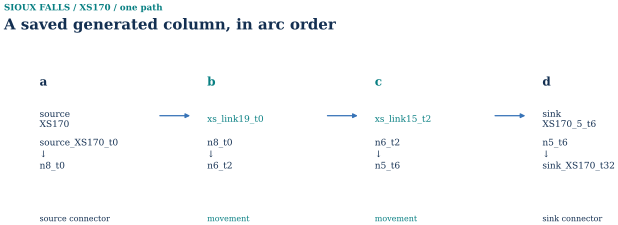

# Sioux Falls

[Read the synchronized HTML volume](https://scholarhaozheng.github.io/mobility-network-lab/volumes/sioux-falls.html) · [Current data, code and reproduction](https://scholarhaozheng.github.io/mobility-network-lab/reproduce.html)

This complete reading export preserves the HTML volume’s text, figures, tables and legacy anchors. Both Sioux finite instances are included; tables, figures and retained details use HTML blocks for fidelity.

> Not published. Content snapshot: [6ce18b8](https://github.com/scholarhaozheng/mobility-network-lab/tree/6ce18b8bea5bf3b9b7caa6ee4c0ff4e701a34a8b/). Current and historical results retain their own model, data and verification scope.

<span id="reading-section-1"></span>
<span class="anchor-alias" id="sioux-scope"></span>
<span class="anchor-alias" id="group-01--sources-gmns-and-case-definition"></span>
<span class="anchor-alias" id="src-docs-cases-sioux-falls-document"></span>
<span class="anchor-alias" id="src-docs-cases-sioux-falls-document-sioux-falls-case--static-assignment-and-historical-spacetime-cg"></span>
<span class="anchor-alias" id="coverage-row-00"></span>
<span class="anchor-alias" id="src-docs-cases-sioux-falls-document-role-in-the-repository"></span>
<span class="anchor-alias" id="src-docs-cases-sioux-falls-document-scope-and-statistics"></span>
<span class="anchor-alias" id="src-docs-full-walkthrough-part-5-document-role-in-the-repository"></span>
<span class="anchor-alias" id="block-2043"></span>
<span class="anchor-alias" id="block-2044"></span>
<span class="anchor-alias" id="block-2045"></span>
<span class="anchor-alias" id="src-docs-full-walkthrough-part-5-document-scope-and-statistics"></span>
<span class="anchor-alias" id="block-2046"></span>
<span class="anchor-alias" id="block-2047"></span>
<span class="anchor-alias" id="block-2048"></span>
<span class="anchor-alias" id="src-readme-old-part-5-document-role-in-the-repository"></span>
<span class="anchor-alias" id="block-2443"></span>
<span class="anchor-alias" id="block-2445"></span>
<span class="anchor-alias" id="src-readme-old-part-5-document-scope-and-statistics"></span>
<span class="anchor-alias" id="block-2446"></span>
<span class="anchor-alias" id="block-2448"></span>

<span id="reading-section-2"></span>
## 01 / Benchmark identity, sources and supplied demand

Sioux Falls is a classical supplied-vehicle-demand benchmark. Its static network and two selected finite time-expanded cases are distinct computational instances. None is a present-day demographic, GPS or calibrated urban-demand model.

<table>
<thead>
<tr>
<th>Contract</th>
<th align="right">Physical nodes</th>
<th align="right">Directed links</th>
<th align="right">Positive OD pairs</th>
<th align="right">Fixed demand</th>
<th>Interpretation</th>
</tr>
</thead>
<tbody><tr>
<td>Classic static BPR/Beckmann</td>
<td align="right">24</td>
<td align="right">76</td>
<td align="right">528</td>
<td align="right">360,600 vehicles</td>
<td>Historical FW, official Algorithm B and frozen native L3 records have separate verification scopes.</td>
</tr>
<tr>
<td>Finite 200-OD selection</td>
<td align="right">24</td>
<td align="right">64</td>
<td align="right">200</td>
<td align="right">86,100 model vehicles</td>
<td>Fixed costs and shared hard capacities on a selected time-expanded graph.</td>
</tr>
<tr>
<td>Finite 250-OD selection</td>
<td align="right">24</td>
<td align="right">69</td>
<td align="right">250</td>
<td align="right">154,000 model vehicles</td>
<td>A different graph/demand instance, not a repeat of the 200-OD run.</td>
</tr>
</tbody></table>

The 200-OD selection is contained in the 250-OD selection, with matching OD IDs, origins, destinations and demand volumes for shared records. Neither finite case is a full 528-OD finite assignment.

<span class="anchor-alias" id="fig-0017"></span>

<span class="anchor-alias" id="coverage-row-20"></span>
<span class="anchor-alias" id="stage-20-city-overview--g-f017"></span>Sioux Falls case cover. The classic supplied network is represented schematically. Static benchmark demand and selected 200/250-OD finite time-expanded experiments are separate computation contracts; no population, transit, GPS, or mode-choice experiment is implied. [See the consolidated Network objects and directed link identities](#stage-02-gmns-network-and-access--g-f151).Source records[examples/sioux-falls/native_l3_r1/inputs_snapshot/SiouxFalls/link.csv](https://github.com/scholarhaozheng/mobility-network-lab/blob/6ce18b8bea5bf3b9b7caa6ee4c0ff4e701a34a8b/examples/sioux-falls/native_l3_r1/inputs_snapshot/SiouxFalls/link.csv)

<span class="anchor-alias" id="sioux-sources"></span>
<span class="anchor-alias" id="block-222"></span>
<span class="anchor-alias" id="block-223"></span>
<span class="anchor-alias" id="block-224"></span>
<span class="anchor-alias" id="block-225"></span>
<span class="anchor-alias" id="src-docs-cases-sioux-falls-document-gmns-zones-and-source-evidence"></span>
<span class="anchor-alias" id="block-235"></span>
<span class="anchor-alias" id="block-236"></span>
<span class="anchor-alias" id="block-237"></span>
<span class="anchor-alias" id="src-docs-full-walkthrough-part-5-document-gmns-zones-and-source-evidence"></span>
<span class="anchor-alias" id="block-2049"></span>
<span class="anchor-alias" id="block-2050"></span>
<span class="anchor-alias" id="src-readme-old-part-5-document-gmns-zones-and-source-evidence"></span>
<span class="anchor-alias" id="block-2449"></span>
<span class="anchor-alias" id="block-2450"></span>
<span class="anchor-alias" id="coverage-row-01"></span>
<span class="anchor-alias" id="figure-034"></span>
<span class="anchor-alias" id="coverage-row-02"></span>
<span class="anchor-alias" id="figure-036"></span>

<span id="reading-section-3"></span>
### Frozen network, GMNS identities and geometry

The classic 76-link topology and OD table are [frozen with the native representation](#src-examples-sioux-falls-native_l3_r1-readme-document). Their IDs and path/OD/link records are explicit; no Boston H3 zones, GTFS, GPS traces or present-day physical street tiles are imputed to this benchmark. The two CG diagrams below are schematic flows of their different selected-link instances.

The directed node/link records, zone/access identity, demand and incidence arrays define this benchmark. Network figures use deterministic schematic coordinates, not geographic street geometry. All 24 nodes and 76 directed-link identities remain available; a node-10 extract demonstrates link IDs and endpoints without placing every link label on the network.

<span class="anchor-alias" id="fig-0167"></span>
[See Network objects and directed link identities](#stage-02-gmns-network-and-access--g-f151)

<span class="anchor-alias" id="fig-0168"></span>

<figure class="canonical-figure" data-figure="G-F151" id="stage-02-gmns-network-and-access--g-f151"><a href="../assets/atlas/figures/g-f151.svg"></a><figcaption><strong>Network objects and directed link identities.</strong> All supplied node and directed-link identities are retained. Arrows show direction; the adjacent node-10 extract demonstrates link IDs and endpoints without placing 76 labels over the network. The deterministic layout uses schematic coordinates.</figcaption><div class="figure-links"><a href="../assets/atlas/figures/g-f151.svg">SVG</a><a href="../assets/atlas/figures/g-f151.png">PNG</a><a href="../assets/atlas/figures/g-f151.pdf">PDF</a></div><details class="figure-sources"><summary>Source records</summary><ul><li><a href="https://github.com/scholarhaozheng/mobility-network-lab/blob/6ce18b8bea5bf3b9b7caa6ee4c0ff4e701a34a8b/examples/sioux-falls/native_l3_r1/inputs_snapshot/SiouxFalls/link.csv">examples/sioux-falls/native_l3_r1/inputs_snapshot/SiouxFalls/link.csv</a></li></ul></details></figure>

<span class="anchor-alias" id="fig-0188"></span>
[See Network objects and directed link identities](#stage-02-gmns-network-and-access--g-f151)

<span class="anchor-alias" id="sioux-demand"></span>
<span class="anchor-alias" id="src-docs-cases-sioux-falls-document-demand-transit-and-observations"></span>
<span class="anchor-alias" id="block-238"></span>
<span class="anchor-alias" id="block-239"></span>
<span class="anchor-alias" id="src-docs-cases-sioux-falls-document-stage-01--trip-generation--not-estimated"></span>
<span class="anchor-alias" id="block-240"></span>
<span class="anchor-alias" id="block-241"></span>
<span class="anchor-alias" id="src-docs-cases-sioux-falls-document-stage-02--trip-distribution--supplied-od"></span>
<span class="anchor-alias" id="block-242"></span>
<span class="anchor-alias" id="block-243"></span>
<span class="anchor-alias" id="src-docs-cases-sioux-falls-document-stage-03--mode-choice--not-estimated"></span>
<span class="anchor-alias" id="block-244"></span>
<span class="anchor-alias" id="block-245"></span>
<span class="anchor-alias" id="block-246"></span>
<span class="anchor-alias" id="src-docs-cases-sioux-falls-document-static-assignment"></span>
<span class="anchor-alias" id="src-docs-full-walkthrough-part-5-document-demand-transit-and-observations"></span>
<span class="anchor-alias" id="block-2051"></span>
<span class="anchor-alias" id="block-2052"></span>
<span class="anchor-alias" id="block-2053"></span>
<span class="anchor-alias" id="src-docs-full-walkthrough-part-5-document-static-assignment"></span>
<span class="anchor-alias" id="src-readme-old-part-5-document-demand-transit-and-observations"></span>
<span class="anchor-alias" id="block-2451"></span>
<span class="anchor-alias" id="block-2452"></span>
<span class="anchor-alias" id="block-2453"></span>
<span class="anchor-alias" id="src-readme-old-part-5-document-static-assignment"></span>
<span class="anchor-alias" id="figure-035"></span>
<span class="anchor-alias" id="coverage-row-03"></span>
<span class="anchor-alias" id="figure-088"></span>
<span class="anchor-alias" id="coverage-row-04"></span>
<span class="anchor-alias" id="figure-089"></span>
<span class="anchor-alias" id="coverage-row-05"></span>
<span class="anchor-alias" id="figure-090"></span>
<span class="anchor-alias" id="coverage-row-06"></span>
<span class="anchor-alias" id="figure-092"></span>
<span class="anchor-alias" id="coverage-row-07"></span>
<span class="anchor-alias" id="figure-093"></span>
<span class="anchor-alias" id="coverage-row-08"></span>
<span class="anchor-alias" id="figure-094"></span>
<span class="anchor-alias" id="stage-03-population-households-and-activity--f152"></span>
<span class="anchor-alias" id="stage-04-transit-and-walk--f153"></span>
<span class="anchor-alias" id="stage-05-gps-and-detectors--f154"></span>
<span class="anchor-alias" id="stage-06-trip-generation--f155"></span>
<span class="anchor-alias" id="stage-07-trip-distribution--f156"></span>
<span class="anchor-alias" id="stage-08-mode-choice--f157"></span>

<span id="reading-section-4"></span>
### What was not estimated

<table>
<thead>
<tr>
<th>Workflow element</th>
<th>Evidence boundary</th>
</tr>
</thead>
<tbody><tr>
<td>Population, households and activity</td>
<td>No demographic compiler or activity-preparation run.</td>
</tr>
<tr>
<td>Transit, walking and GTFS</td>
<td>No present-day GTFS or pedestrian city-input workflow.</td>
</tr>
<tr>
<td>GPS, trajectories and detectors</td>
<td>No modern GPS/detector observations or Boston-style service feedback.</td>
</tr>
<tr>
<td>Trip generation</td>
<td>Vehicle OD is exogenous; production rates were not estimated.</td>
</tr>
<tr>
<td>Trip distribution</td>
<td>The 528-record static OD table is supplied input, not a gravity/IPF result. Finite cases select different subsets.</td>
</tr>
<tr>
<td>Mode choice</td>
<td>No traveller choice model was estimated; fixed vehicle demand is distinct from Boston's conditional DA/S2/S3/TW experiment.</td>
</tr>
<tr>
<td>Traffic assignment</td>
<td>Static flow is computed from supplied vehicle OD; upstream demand stages were not thereby executed.</td>
</tr>
</tbody></table>

Status previews of absent upstream components are coverage statements, not experimental results.

<span class="anchor-alias" id="fig-0169"></span>
[See the numerical evidence and scope in the Population, households and activity section.](#coverage-row-03)

<span class="anchor-alias" id="fig-0170"></span>
[See the numerical evidence and scope in the Transit and pedestrian inputs section.](#coverage-row-04)

<span class="anchor-alias" id="fig-0171"></span>
[See the numerical evidence and scope in the GPS, trajectory and detector evidence section.](#coverage-row-05)

<span class="anchor-alias" id="fig-0172"></span>
[See the numerical evidence and scope in the 01 / Trip generation — productions / attractions section.](#coverage-row-06)

<span class="anchor-alias" id="fig-0173"></span>
[See the numerical evidence and scope in the 02 / Trip distribution — zonal OD demand section.](#coverage-row-07)

<span class="anchor-alias" id="fig-0174"></span>
[See the numerical evidence and scope in the 03 / Mode choice — mode-specific demand section.](#coverage-row-08)

<span class="anchor-alias" id="sioux-static"></span>
<span class="anchor-alias" id="block-226"></span>
<span class="anchor-alias" id="block-227"></span>
<span class="anchor-alias" id="block-228"></span>
<span class="anchor-alias" id="block-229"></span>
<span class="anchor-alias" id="block-230"></span>
<span class="anchor-alias" id="block-231"></span>
<span class="anchor-alias" id="block-232"></span>
<span class="anchor-alias" id="block-233"></span>
<span class="anchor-alias" id="block-234"></span>
<span class="anchor-alias" id="block-247"></span>
<span class="anchor-alias" id="block-248"></span>
<span class="anchor-alias" id="block-253"></span>
<span class="anchor-alias" id="block-254"></span>
<span class="anchor-alias" id="src-docs-cases-sioux-falls-document-finite-time-expanded-algorithms"></span>
<span class="anchor-alias" id="block-255"></span>
<span class="anchor-alias" id="block-256"></span>
<span class="anchor-alias" id="block-257"></span>
<span class="anchor-alias" id="block-258"></span>
<span class="anchor-alias" id="block-259"></span>
<span class="anchor-alias" id="block-260"></span>
<span class="anchor-alias" id="block-261"></span>
<span class="anchor-alias" id="block-262"></span>
<span class="anchor-alias" id="block-263"></span>
<span class="anchor-alias" id="block-264"></span>
<span class="anchor-alias" id="block-267"></span>
<span class="anchor-alias" id="block-268"></span>
<span class="anchor-alias" id="src-docs-cases-sioux-falls-document-reproduction"></span>
<span class="anchor-alias" id="block-269"></span>
<span class="anchor-alias" id="group-03--static-bprbeckmann-assignment"></span>
<span class="anchor-alias" id="block-2054"></span>
<span class="anchor-alias" id="block-2055"></span>
<span class="anchor-alias" id="src-docs-full-walkthrough-part-5-document-sioux-falls-benchmark-series"></span>
<span class="anchor-alias" id="src-docs-full-walkthrough-part-5-document-sioux-falls--static-methods-and-retained-numerical-candidates"></span>
<span class="anchor-alias" id="block-2056"></span>
<span class="anchor-alias" id="block-2057"></span>
<span class="anchor-alias" id="block-2058"></span>
<span class="anchor-alias" id="block-2059"></span>
<span class="anchor-alias" id="block-2060"></span>
<span class="anchor-alias" id="block-2455"></span>
<span class="anchor-alias" id="src-readme-old-part-5-document-sioux-falls-benchmark-series"></span>
<span class="anchor-alias" id="src-readme-old-part-5-document-sioux-falls--static-methods-and-retained-numerical-candidates"></span>
<span class="anchor-alias" id="block-2460"></span>
<span class="anchor-alias" id="coverage-row-09"></span>
<span class="anchor-alias" id="figure-096"></span>

<span id="reading-section-5"></span>
## 02 / Static BPR–Beckmann methods

Historical Frank–Wolfe, official Algorithm B and the two native Diagnostic L3 profiles retain their own input-identity and verification records. They share the static congestion-dependent BPR/Beckmann contract. Numerical feasibility in a frozen path representation does not certify full-network user equilibrium.

<span class="anchor-alias" id="fig-0175"></span>
[See Algorithm B physical-link flow](#stage-11-algorithm-b--g-f160)

<span class="anchor-alias" id="sioux-fw"></span>
<span class="anchor-alias" id="block-624"></span>
<span class="anchor-alias" id="block-625"></span>
<span class="anchor-alias" id="block-626"></span>
<span class="anchor-alias" id="block-627"></span>
<span class="anchor-alias" id="block-628"></span>
<span class="anchor-alias" id="coverage-row-10"></span>
<span class="anchor-alias" id="figure-098"></span>
<span class="anchor-alias" id="stage-10-frank-wolfe--f159"></span>
<span class="anchor-alias" id="stage-10-frank-wolfe--f169"></span>

<span id="reading-section-6"></span>
### Historical Frank–Wolfe record

<table>
<thead>
<tr>
<th>Quantity</th>
<th align="right">Value</th>
</tr>
</thead>
<tbody><tr>
<td>Physical nodes / directed links</td>
<td align="right">24 / 76</td>
</tr>
<tr>
<td>OD records</td>
<td align="right">528</td>
</tr>
<tr>
<td>Total provided demand</td>
<td align="right">360,600</td>
</tr>
<tr>
<td>Saved iterations</td>
<td align="right">100</td>
</tr>
<tr>
<td>Recomputed Beckmann objective</td>
<td align="right">4,236,715.140437842</td>
</tr>
<tr>
<td>Maximum aggregate node-balance residual</td>
<td align="right">1.4552e-11</td>
</tr>
<tr>
<td>Fixed-flow gap / Beckmann objective</td>
<td align="right">0.236154949%</td>
</tr>
</tbody></table>

BPR travel times, the saved link flows and the Beckmann objective were recomputed. The gap above uses the final saved flow and the provided OD matrix, with the Beckmann objective as denominator. It is not interchangeable with a gap normalized by total travel cost. The original iteration log used a pre-update point, while its final CSV used the post-update flow.

This is not a high-precision UE ground truth. Runtime OD-file hashes and a complete OD/path disaggregation were not preserved, so aggregate node balance is not presented as a full OD-level feasibility certificate.

Raw input and output tables are not included in this public result record. The retained [static implementation](01-overview.md#src-algorithms-static_fw-readme-document) is separate from the space–time CG run command.

The historical per-link vector is not publicly redistributed here. Its missing runtime OD-file hash prevents treating it as an exact same-input reference for the frozen native profiles.

<span class="anchor-alias" id="fig-0176"></span>
[See the numerical evidence and scope in the Frank–Wolfe section.](#coverage-row-10)

<span class="anchor-alias" id="fig-0189"></span>
[See the numerical evidence and scope in the Frank–Wolfe section.](#coverage-row-10)

<figure class="canonical-figure" data-figure="C-SIOUX-FW-STATIC" id="stage-10-frank-wolfe--c-sioux-fw-static"><a href="../assets/atlas/card-layout/c-sioux-fw-static.svg"></a><figcaption><strong>Historical Frank–Wolfe physical-link flow.</strong> Historical approximate Sioux Falls static Frank–Wolfe result, with 100 saved iterations. The map and distribution use the same 76 saved physical-link volumes; node positions are schematic. The source table SHA-256 and all 76 directed link IDs/endpoints were verified against the saved audit/topology. The Beckmann objective recomputed from this table is 4,236,715.140437842. The public result record describes 528 OD records and total provided demand 360,600, but runtime OD-file hashes and complete OD/path disaggregation were not preserved. Runtime demand-byte identity remains unverified. This approximate historical result lacks preserved demand-byte identity and high-precision UE certification.</figcaption><div class="figure-links"><a href="../assets/atlas/card-layout/c-sioux-fw-static.svg">SVG</a><a href="../assets/atlas/card-layout/c-sioux-fw-static.png">PNG</a><a href="../assets/atlas/card-layout/c-sioux-fw-static.pdf">PDF</a></div><details class="figure-sources"><summary>Source records</summary><ul><li>Additional saved input: siouxfalls_fw_nonlinear_solution.csv; its public acquisition route remains subject to the reproduction audit.</li><li><a href="https://github.com/scholarhaozheng/mobility-network-lab/blob/6ce18b8bea5bf3b9b7caa6ee4c0ff4e701a34a8b/examples/sioux-falls/native_l3_r1/inputs_snapshot/SiouxFalls/link.csv">examples/sioux-falls/native_l3_r1/inputs_snapshot/SiouxFalls/link.csv</a></li><li><a href="https://github.com/scholarhaozheng/mobility-network-lab/blob/6ce18b8bea5bf3b9b7caa6ee4c0ff4e701a34a8b/docs/datasets/sioux-static-fw.md">docs/datasets/sioux-static-fw.md</a></li><li>Additional saved input: fw_anchor_comparison.json; its public acquisition route remains subject to the reproduction audit.</li></ul></details></figure>

<span class="anchor-alias" id="sioux-algorithm"></span>
<span class="anchor-alias" id="src-docs-cases-sioux-algorithm-b-document"></span>
<span class="anchor-alias" id="src-docs-cases-sioux-algorithm-b-document-sioux-falls--official-taplabtap-b-algorithm-b"></span>
<span class="anchor-alias" id="block-604"></span>
<span class="anchor-alias" id="src-docs-cases-sioux-algorithm-b-document-1-problem-contract-and-frozen-policy"></span>
<span class="anchor-alias" id="block-605"></span>
<span class="anchor-alias" id="block-606"></span>
<span class="anchor-alias" id="src-docs-cases-sioux-algorithm-b-document-2-solver-and-adapter-path"></span>
<span class="anchor-alias" id="block-607"></span>
<span class="anchor-alias" id="block-608"></span>
<span class="anchor-alias" id="block-612"></span>
<span class="anchor-alias" id="block-613"></span>
<span class="anchor-alias" id="block-614"></span>
<span class="anchor-alias" id="block-616"></span>
<span class="anchor-alias" id="src-docs-datasets-sioux-static-fw-document"></span>
<span class="anchor-alias" id="src-docs-datasets-sioux-static-fw-document-sioux-falls--static-frankwolfe"></span>
<span class="anchor-alias" id="src-docs-full-walkthrough-part-5-document-sioux-falls--official-taplab-registered-adapter-parity-for-tap-b-algorithm-b"></span>
<span class="anchor-alias" id="block-2061"></span>
<span class="anchor-alias" id="block-2062"></span>
<span class="anchor-alias" id="block-2063"></span>
<span class="anchor-alias" id="block-2064"></span>
<span class="anchor-alias" id="block-2065"></span>
<span class="anchor-alias" id="block-2066"></span>
<span class="anchor-alias" id="src-docs-full-walkthrough-part-5-document-finite-time-expanded-algorithms"></span>
<span class="anchor-alias" id="src-readme-old-part-5-document-sioux-falls--official-taplab-registered-adapter-parity-for-tap-b-algorithm-b"></span>
<span class="anchor-alias" id="block-2461"></span>
<span class="anchor-alias" id="block-2462"></span>
<span class="anchor-alias" id="block-2463"></span>
<span class="anchor-alias" id="block-2464"></span>
<span class="anchor-alias" id="block-2466"></span>
<span class="anchor-alias" id="src-readme-old-part-5-document-finite-time-expanded-algorithms"></span>
<span class="anchor-alias" id="coverage-row-11"></span>
<span class="anchor-alias" id="figure-038"></span>
<span class="anchor-alias" id="figure-037"></span>

<span id="reading-section-7"></span>
### Official Algorithm B: classic 528-OD instance

This is the **classic static** Sioux Falls BPR user-equilibrium instance: 24 physical nodes, 76 directed links, 528 positive vehicle OD pairs, and 360,600 vehicles of fixed demand. It is not either of the 200/250-OD finite space–time CG selections. The R2 policy fixes a `1e-8` solver gap, `1e-4` independent gap gate, 0.05-minute used-arc/path slack gate, 1,800-second runtime cap, and BPR/Beckmann objective in vehicle-minutes. [Shared method and policy](01-overview.md#src-docs-methods-origin-based-algorithm-b-document).

The official `spartalab/tap-b` Algorithm B executable at commit `040135a20c771fbb84766df6a97cff981fa5df4b` produced the accepted R2 run. A separate R2.1 audit at TAPLab commit `081e44a0dd451c549d6903933516bccb4166bbd0` exercised TAPLab's **official registered `tapb` CLI adapter** and direct callable `taplab.adapters.tapb.solve`. Both reproduced the accepted R2 physical-link flows exactly; `taplab verify` certified the standard output. The official adapter does not export the OD paths needed for all R2 path-level checks; the accepted R2 independent evaluator record remains the authority for those checks. [Adapter routes and caveats](01-overview.md#src-docs-integrations-taplab-tapb-document).

<span class="anchor-alias" id="fig-0177"></span>

<figure class="canonical-figure" data-figure="G-F160" id="stage-11-algorithm-b--g-f160"><a href="../assets/atlas/card-layout/g-f160.svg"></a><figcaption><strong>Algorithm B physical-link flow.</strong> Official tap-b Algorithm B on the supplied 528-OD Sioux benchmark. The map and distribution use the same 76 physical-link volumes from the independently evaluated accepted output. Node positions use schematic coordinates. The 200/250-OD finite experiments use separate instances; demand-byte identity with historical FW remains unverified.</figcaption><div class="figure-links"><a href="../assets/atlas/card-layout/g-f160.svg">SVG</a><a href="../assets/atlas/card-layout/g-f160.png">PNG</a><a href="../assets/atlas/card-layout/g-f160.pdf">PDF</a></div><details class="figure-sources"><summary>Source records</summary><ul><li><a href="https://github.com/scholarhaozheng/mobility-network-lab/blob/6ce18b8bea5bf3b9b7caa6ee4c0ff4e701a34a8b/examples/sioux-falls/native_l3_r1/inputs_snapshot/SiouxFalls/link.csv">examples/sioux-falls/native_l3_r1/inputs_snapshot/SiouxFalls/link.csv</a></li><li><a href="https://github.com/scholarhaozheng/mobility-network-lab/blob/6ce18b8bea5bf3b9b7caa6ee4c0ff4e701a34a8b/algorithms/origin_based_algorithm_b/accepted_results/sioux_physical_link_flow.csv">algorithms/origin_based_algorithm_b/accepted_results/sioux_physical_link_flow.csv</a></li><li><a href="https://github.com/scholarhaozheng/mobility-network-lab/blob/6ce18b8bea5bf3b9b7caa6ee4c0ff4e701a34a8b/algorithms/origin_based_algorithm_b/accepted_results/sioux_evaluation.json">algorithms/origin_based_algorithm_b/accepted_results/sioux_evaluation.json</a></li></ul></details></figure>

<span class="anchor-alias" id="sioux-algconvergence"></span>
<span class="anchor-alias" id="src-docs-cases-sioux-algorithm-b-document-3-convergence"></span>
<span class="anchor-alias" id="block-609"></span>
<span class="anchor-alias" id="block-610"></span>
<span class="anchor-alias" id="block-611"></span>
<span class="anchor-alias" id="src-docs-cases-sioux-algorithm-b-document-4-physical-link-comparison-with-same-problem-fw"></span>
<span class="anchor-alias" id="block-615"></span>
<span class="anchor-alias" id="src-docs-cases-sioux-algorithm-b-document-5-selected-origin-reconstructed-flow"></span>
<span class="anchor-alias" id="block-617"></span>
<span class="anchor-alias" id="block-618"></span>
<span class="anchor-alias" id="block-619"></span>

#### Convergence, physical-link comparison and origin reconstruction

*Saved R2 solver trace only.* The independent final relative gap is `4.49840770553e-9`. The R2.1 official-adapter parity run stopped at 18 iterations; its absent explicit 10,000-iteration override was nonbinding, not proof of byte-identical configurations.

The accepted R2 Algorithm B Beckmann objective is **4,231,335.287110682 vehicle-minutes**, compared with **4,236,715.14044 vehicle-minutes** for the retained historical FW result. The saved physical-link flow RMSE is **63.4701149406 vehicles**. This is a saved classic-static benchmark comparison, not a runtime speedup or empirical validation. [Aggregate Algorithm B link flows](https://github.com/scholarhaozheng/mobility-network-lab/blob/6ce18b8bea5bf3b9b7caa6ee4c0ff4e701a34a8b/algorithms/origin_based_algorithm_b/accepted_results/sioux_physical_link_flow.csv).

The retained solver polylines and 76 comparison points are redrawn from accepted SVG evidence at stored coordinate/tick precision. They are not newly computed solver histories or a reconstruction of a missing raw FW table. Both comparison axes use log10(1 + benchmark flow). The saved static comparison does not establish additional byte-identical runtime-OD guarantees for the historical FW input.

Origin 10 is represented by its top 18 physical-link flows reconstructed from exported OD paths, at original SVG label precision. This does not expose native Policy Bush merge, approach or backward-label state.

<span class="anchor-alias" id="fig-0060"></span>

<figure class="canonical-figure" data-figure="G-F060" id="stage-11-algorithm-b--g-f060"><a href="../assets/atlas/card-layout/g-f060.svg"></a><figcaption><strong>Algorithm B convergence.</strong> Native tap-b trace preserved from the accepted vector panel. The two polylines retain all 18 stored points and are redrawn at source SVG coordinate/tick precision; they are not newly recomputed solver histories. Log10 relative gap and Beckmann objective retain separate axes and units. The separately evaluated final relative gap is approximately 4.5 × 10⁻9.</figcaption><div class="figure-links"><a href="../assets/atlas/card-layout/g-f060.svg">SVG</a><a href="../assets/atlas/card-layout/g-f060.png">PNG</a><a href="../assets/atlas/card-layout/g-f060.pdf">PDF</a></div><details class="figure-sources"><summary>Source records</summary><ul><li><a href="https://github.com/scholarhaozheng/mobility-network-lab/blob/6ce18b8bea5bf3b9b7caa6ee4c0ff4e701a34a8b/algorithms/origin_based_algorithm_b/figures/sioux_convergence.svg">algorithms/origin_based_algorithm_b/figures/sioux_convergence.svg</a></li><li><a href="https://github.com/scholarhaozheng/mobility-network-lab/blob/6ce18b8bea5bf3b9b7caa6ee4c0ff4e701a34a8b/algorithms/origin_based_algorithm_b/accepted_results/sioux_evaluation.json">algorithms/origin_based_algorithm_b/accepted_results/sioux_evaluation.json</a></li></ul></details></figure>

<span class="anchor-alias" id="fig-0061"></span>

<figure class="canonical-figure" data-figure="G-F061" id="stage-11-algorithm-b--g-f061"><a href="../assets/atlas/figures/g-f061.svg"></a><figcaption><strong>Algorithm B versus the saved FW reference.</strong> The 76 accepted SVG scatter points are reframed at their saved display precision. Both axes show log10(1 + benchmark flow); the diagonal denotes equality. The FW comparator is the historical saved reference; this redraw neither reconstructs a missing FW link table nor establishes additional input-identity guarantees.</figcaption><div class="figure-links"><a href="../assets/atlas/figures/g-f061.svg">SVG</a><a href="../assets/atlas/figures/g-f061.png">PNG</a><a href="../assets/atlas/figures/g-f061.pdf">PDF</a></div><details class="figure-sources"><summary>Source records</summary><ul><li><a href="https://github.com/scholarhaozheng/mobility-network-lab/blob/6ce18b8bea5bf3b9b7caa6ee4c0ff4e701a34a8b/algorithms/origin_based_algorithm_b/accepted_results/sioux_physical_link_flow.csv">algorithms/origin_based_algorithm_b/accepted_results/sioux_physical_link_flow.csv</a></li><li><a href="https://github.com/scholarhaozheng/mobility-network-lab/blob/6ce18b8bea5bf3b9b7caa6ee4c0ff4e701a34a8b/algorithms/origin_based_algorithm_b/figures/sioux_fw_flow.svg">algorithms/origin_based_algorithm_b/figures/sioux_fw_flow.svg</a></li><li><a href="https://github.com/scholarhaozheng/mobility-network-lab/blob/6ce18b8bea5bf3b9b7caa6ee4c0ff4e701a34a8b/tools/visuals/render_algorithm_b_fw_compact.py">tools/visuals/render_algorithm_b_fw_compact.py</a></li></ul></details></figure>

<span class="anchor-alias" id="fig-0062"></span>
[See Algorithm B versus the saved FW reference](#stage-11-algorithm-b--g-f061)

<span class="anchor-alias" id="fig-0063"></span>

<figure class="canonical-figure" data-figure="G-F063" id="stage-11-algorithm-b--g-f063"><a href="../assets/atlas/figures/g-f063.svg"></a><figcaption><strong>Selected-origin flow reconstructed from OD paths.</strong> Origin 10: the top 18 directed physical links by flow reconstructed from exported tap-b OD paths. Values are the labels preserved in the accepted source SVG, at that figure’s displayed precision. This panel reconstructs flow from OD paths.</figcaption><div class="figure-links"><a href="../assets/atlas/figures/g-f063.svg">SVG</a><a href="../assets/atlas/figures/g-f063.png">PNG</a><a href="../assets/atlas/figures/g-f063.pdf">PDF</a></div><details class="figure-sources"><summary>Source records</summary><ul><li><a href="https://github.com/scholarhaozheng/mobility-network-lab/blob/6ce18b8bea5bf3b9b7caa6ee4c0ff4e701a34a8b/algorithms/origin_based_algorithm_b/figures/sioux_origin_flow.svg">algorithms/origin_based_algorithm_b/figures/sioux_origin_flow.svg</a></li></ul></details></figure>

<span class="anchor-alias" id="sioux-algchecks"></span>
<span class="anchor-alias" id="src-docs-cases-sioux-algorithm-b-document-6-independent-verification"></span>
<span class="anchor-alias" id="block-620"></span>
<span class="anchor-alias" id="block-621"></span>
<span class="anchor-alias" id="block-622"></span>
<span class="anchor-alias" id="block-623"></span>
<span class="anchor-alias" id="stage-11-algorithm-b--f064"></span>

#### Independent static checks

The [accepted evaluation](https://github.com/scholarhaozheng/mobility-network-lab/blob/6ce18b8bea5bf3b9b7caa6ee4c0ff4e701a34a8b/algorithms/origin_based_algorithm_b/accepted_results/sioux_evaluation.json) records 705 exported OD paths, zero cyclic positive-flow origins, max OD residual `4.55e-13`, aggregate link mismatch `5.46e-11`, max used-arc slack `8.20e-5` minutes, max used-path slack `8.33e-5` minutes, and no issues. The R2.1 official TAPLab parity matrix separately reports zero maximum physical-link-flow difference and a certified `taplab verify` result. These are distinct checks, not one combined certificate.

Original public-release scope: [Official TAPLab CLI commands](01-overview.md#src-docs-integrations-taplab-tapb-document-official-sioux-falls-route) require the pinned upstream source, its external solver executable and correctly licensed classic Sioux input; this repository does not bundle either upstream tree or executable. The [public candidate source](01-overview.md#src-algorithms-origin_based_algorithm_b-readme-document) and accepted aggregate output support offline inspection. No solver was rerun for the original frozen publication update. Neither the static objective nor its figures are comparable to the finite space–time hard-capacity CG objective.

Current reproduction review: the [528-OD Algorithm B recipe](https://scholarhaozheng.github.io/mobility-network-lab/reproduce.html#sioux-algorithm-b) has completed fresh computation and independent full-network verification on the frozen classic input. Its tested recipe is part of the review overlay; this does not reproduce the separate 200/250-OD time-expanded runs.

The 1e-8 solver target, 1e-4 independent gap gate and 0.05-minute used-arc/path slack gate are separate tests. Accepted R2 path-level evaluation and R2.1 official CLI/direct-call parity must remain separately identifiable.

<span class="anchor-alias" id="fig-0064"></span>
[See the numerical evidence and scope in the Official tap-b Algorithm B section.](#coverage-row-11)

<span class="anchor-alias" id="sioux-native"></span>
<span class="anchor-alias" id="block-249"></span>
<span class="anchor-alias" id="block-250"></span>
<span class="anchor-alias" id="block-251"></span>
<span class="anchor-alias" id="block-252"></span>
<span class="anchor-alias" id="block-1315"></span>
<span class="anchor-alias" id="block-1316"></span>
<span class="anchor-alias" id="coverage-row-12"></span>
<span class="anchor-alias" id="figure-039"></span>
<span class="anchor-alias" id="figure-100"></span>
<span class="anchor-alias" id="coverage-row-13"></span>
<span class="anchor-alias" id="figure-105"></span>

<span id="reading-section-8"></span>
### Frozen finite-path reference and native Diagnostic L3

The corrected [native Diagnostic L3 method](01-overview.md#src-algorithms-path_compression-diagnostic_l3-readme-document) has accepted outer-04 results on the static 76-link instance. It keeps the rank-50 basis, 535 major and 1,683 minor paths, 585 reduced path coordinates and **661 total native variables**, including the explicit link flows.

<table>
<thead>
<tr>
<th>Native configuration</th>
<th align="right">Gamma</th>
<th align="right">Original Beckmann component F</th>
<th align="right">Max OD residual</th>
<th align="right">Full-network relative cost gap</th>
<th>Meaning</th>
</tr>
</thead>
<tbody><tr>
<td><a href="https://github.com/scholarhaozheng/mobility-network-lab/blob/6ce18b8bea5bf3b9b7caa6ee4c0ff4e701a34a8b/examples/sioux-falls/native_l3_r1/runs/SiouxFalls/A_REG001/outer_04_check.json">A_REG001 · outer 04</a></td>
<td align="right">0.01</td>
<td align="right">4,325,864.946597109</td>
<td align="right">5.548833712509804e-7</td>
<td align="right">8.167461%</td>
<td>Regularized diagnostic, numerically accepted</td>
</tr>
<tr>
<td><a href="https://github.com/scholarhaozheng/mobility-network-lab/blob/6ce18b8bea5bf3b9b7caa6ee4c0ff4e701a34a8b/examples/sioux-falls/native_l3_r1/runs/SiouxFalls/B_BECKMANN/outer_04_check.json">B_BECKMANN · outer 04</a></td>
<td align="right">0</td>
<td align="right">4,289,674.484214505</td>
<td align="right">6.957361051718181e-7</td>
<td align="right">4.381867%</td>
<td>Unregularized numerical candidate, <strong>not</strong> full-network UE</td>
</tr>
</tbody></table>

Both have zero negative path-flow mass and passed recorded original-space numerical tests. Their nonzero full-network gaps remain visible; a passing numerical-feasibility gate is not an equilibrium or empirical-validation certificate. Gamma=0.01 adds a reference-centred term, so the two F values are not a shared-objective leaderboard. The source and effective zero-link-bound adapter are released, but native portability has not been retested in the original frozen publication task. The current review still provides saved-state verification for these Sioux rank-50 profiles; a fresh native recipe is not registered. Boston’s separately verified rank-26/52 recipe does not change that status.

The B_BECKMANN map/distribution uses saved explicit_v on all 76 links of the frozen 2,218-path representation. A_REG001 is the gamma=0.01 profile: its path-aggregate versus explicit-link residual is a reconstruction-consistency diagnostic, not a Frank–Wolfe difference and not B_BECKMANN.

The frozen inputs_snapshot/SiouxFalls/ package includes network, demand, incidence, rank-50 representation and source arrays. Reading an accepted point needs no new path generation or SVD. The A_REG001 and B_BECKMANN run directories retain selected outer-04 path, OD and link flows, native coordinates and original-space checks; failed/intermediate iterates and private logs are omitted.

<span class="anchor-alias" id="fig-0178"></span>
[See Finite-path candidate: flow and distribution](#stage-12-finite-path-reference--c-sioux-finite-static)

<span class="anchor-alias" id="fig-0179"></span>

<figure class="canonical-figure" data-figure="C-SIOUX-FINITE-STATIC" id="stage-12-finite-path-reference--c-sioux-finite-static"><a href="../assets/atlas/figures/c-sioux-finite-static.svg"></a><figcaption><strong>Finite-path candidate: flow and distribution.</strong> B_BECKMANN outer-04 candidate on the frozen 2,218-path representation. The map and distribution use saved explicit_v on all 76 directed links. Node coordinates are schematic. Its full-network relative cost gap is 4.381867%; this is a finite-path candidate.</figcaption><div class="figure-links"><a href="../assets/atlas/figures/c-sioux-finite-static.svg">SVG</a><a href="../assets/atlas/figures/c-sioux-finite-static.png">PNG</a><a href="../assets/atlas/figures/c-sioux-finite-static.pdf">PDF</a></div><details class="figure-sources"><summary>Source records</summary><ul><li><a href="https://github.com/scholarhaozheng/mobility-network-lab/blob/6ce18b8bea5bf3b9b7caa6ee4c0ff4e701a34a8b/examples/sioux-falls/native_l3_r1/inputs_snapshot/SiouxFalls/link.csv">examples/sioux-falls/native_l3_r1/inputs_snapshot/SiouxFalls/link.csv</a></li><li><a href="https://github.com/scholarhaozheng/mobility-network-lab/blob/6ce18b8bea5bf3b9b7caa6ee4c0ff4e701a34a8b/examples/sioux-falls/native_l3_r1/runs/SiouxFalls/B_BECKMANN/outer_04_link_flows.csv">examples/sioux-falls/native_l3_r1/runs/SiouxFalls/B_BECKMANN/outer_04_link_flows.csv</a></li><li><a href="https://github.com/scholarhaozheng/mobility-network-lab/blob/6ce18b8bea5bf3b9b7caa6ee4c0ff4e701a34a8b/examples/sioux-falls/native_l3_r1/runs/SiouxFalls/B_BECKMANN/outer_04_check.json">examples/sioux-falls/native_l3_r1/runs/SiouxFalls/B_BECKMANN/outer_04_check.json</a></li></ul></details></figure>

<span class="anchor-alias" id="fig-0180"></span>
[See Native L3 reconstruction: flow and residual](#stage-13-native-l3--g-f164)

<span class="anchor-alias" id="fig-0181"></span>

<figure class="canonical-figure" data-figure="G-F164" id="stage-13-native-l3--g-f164"><a href="../assets/atlas/card-layout/g-f164.svg"></a><figcaption><strong>Native L3 reconstruction: flow and residual.</strong> A_REG001 outer-04 saved path aggregation and its absolute difference from the explicit link variable. The residual measures reconstruction consistency against the explicit link variable. The rank-50 regularized candidate has gamma = 0.01 and full-network relative cost gap 8.167461%. All 76 links are included. The nonnegative residual map and distribution use an explicit 10⁻¹² scaling, preserving the maximum absolute residual 1.4551915228366852e-11 benchmark units.</figcaption><div class="figure-links"><a href="../assets/atlas/card-layout/g-f164.svg">SVG</a><a href="../assets/atlas/card-layout/g-f164.png">PNG</a><a href="../assets/atlas/card-layout/g-f164.pdf">PDF</a></div><details class="figure-sources"><summary>Source records</summary><ul><li><a href="https://github.com/scholarhaozheng/mobility-network-lab/blob/6ce18b8bea5bf3b9b7caa6ee4c0ff4e701a34a8b/examples/sioux-falls/native_l3_r1/inputs_snapshot/SiouxFalls/link.csv">examples/sioux-falls/native_l3_r1/inputs_snapshot/SiouxFalls/link.csv</a></li><li><a href="https://github.com/scholarhaozheng/mobility-network-lab/blob/6ce18b8bea5bf3b9b7caa6ee4c0ff4e701a34a8b/examples/sioux-falls/native_l3_r1/runs/SiouxFalls/A_REG001/outer_04_link_flows.csv">examples/sioux-falls/native_l3_r1/runs/SiouxFalls/A_REG001/outer_04_link_flows.csv</a></li><li><a href="https://github.com/scholarhaozheng/mobility-network-lab/blob/6ce18b8bea5bf3b9b7caa6ee4c0ff4e701a34a8b/examples/sioux-falls/native_l3_r1/runs/SiouxFalls/A_REG001/outer_04_check.json">examples/sioux-falls/native_l3_r1/runs/SiouxFalls/A_REG001/outer_04_check.json</a></li></ul></details></figure>

<span class="anchor-alias" id="sioux-nativevalues"></span>
<span class="anchor-alias" id="figure-040"></span>
<span class="anchor-alias" id="stage-13-native-l3--f170"></span>

#### A_REG001: retained top-ten link values

The former rank-50 thumbnail selected the ten largest saved explicit_v values. The table preserves these fields at source precision. The signed link_residual is path_aggregate − explicit_v, in benchmark flow units; the network diagnostic displays its absolute value.

<table>
<thead>
<tr>
<th>Directed link ID</th>
<th align="right">explicit_v</th>
<th align="right">Path aggregate</th>
<th align="right">Aggregate − explicit_v</th>
<th align="right">Audit absolute tolerance</th>
</tr>
</thead>
<tbody><tr>
<td>43</td>
<td align="right">26408.950678296274</td>
<td align="right">26408.950678296274</td>
<td align="right">0.0</td>
<td align="right">0.0002650895067829628</td>
</tr>
<tr>
<td>28</td>
<td align="right">25887.822451923676</td>
<td align="right">25887.82245192368</td>
<td align="right">3.637978807091713e-12</td>
<td align="right">0.0002598782245192368</td>
</tr>
<tr>
<td>26</td>
<td align="right">22888.56250576467</td>
<td align="right">22888.562505764658</td>
<td align="right">-1.0913936421275139e-11</td>
<td align="right">0.00022988562505764658</td>
</tr>
<tr>
<td>25</td>
<td align="right">22495.392083404477</td>
<td align="right">22495.392083404484</td>
<td align="right">7.275957614183426e-12</td>
<td align="right">0.00022595392083404485</td>
</tr>
<tr>
<td>57</td>
<td align="right">20059.581796018076</td>
<td align="right">20059.58179601808</td>
<td align="right">3.637978807091713e-12</td>
<td align="right">0.00020159581796018079</td>
</tr>
<tr>
<td>45</td>
<td align="right">19975.039834940428</td>
<td align="right">19975.039834940428</td>
<td align="right">0.0</td>
<td align="right">0.00020075039834940427</td>
</tr>
<tr>
<td>11</td>
<td align="right">18350.98703392272</td>
<td align="right">18350.987033922716</td>
<td align="right">-3.637978807091713e-12</td>
<td align="right">0.00018450987033922717</td>
</tr>
<tr>
<td>56</td>
<td align="right">18213.71229260679</td>
<td align="right">18213.71229260678</td>
<td align="right">-1.0913936421275139e-11</td>
<td align="right">0.00018313712292606778</td>
</tr>
<tr>
<td>60</td>
<td align="right">18132.31310480715</td>
<td align="right">18132.31310480716</td>
<td align="right">1.0913936421275139e-11</td>
<td align="right">0.0001823231310480716</td>
</tr>
<tr>
<td>9</td>
<td align="right">18049.807756768427</td>
<td align="right">18049.807756768423</td>
<td align="right">-3.637978807091713e-12</td>
<td align="right">0.00018149807756768423</td>
</tr>
</tbody></table>

Source: [All 76 source link values](https://github.com/scholarhaozheng/mobility-network-lab/blob/6ce18b8bea5bf3b9b7caa6ee4c0ff4e701a34a8b/examples/sioux-falls/native_l3_r1/runs/SiouxFalls/A_REG001/outer_04_link_flows.csv).

<span class="anchor-alias" id="fig-0190"></span>
[See the numerical evidence and scope in the Native Diagnostic L3 / compression section.](#coverage-row-13)

<span class="anchor-alias" id="sioux-finite"></span>
<span class="anchor-alias" id="group-04--finite-time-expanded-optimization"></span>
<span class="anchor-alias" id="block-797"></span>
<span class="anchor-alias" id="src-docs-cases-sioux-space-time-document-case-role-scope-and-model-statistics"></span>
<span class="anchor-alias" id="block-798"></span>
<span class="anchor-alias" id="block-799"></span>
<span class="anchor-alias" id="block-800"></span>
<span class="anchor-alias" id="block-801"></span>
<span class="anchor-alias" id="block-802"></span>
<span class="anchor-alias" id="block-803"></span>
<span class="anchor-alias" id="block-804"></span>
<span class="anchor-alias" id="block-805"></span>
<span class="anchor-alias" id="block-806"></span>
<span class="anchor-alias" id="block-807"></span>
<span class="anchor-alias" id="block-808"></span>
<span class="anchor-alias" id="block-863"></span>
<span class="anchor-alias" id="block-1759"></span>
<span class="anchor-alias" id="block-1771"></span>
<span class="anchor-alias" id="block-2067"></span>
<span class="anchor-alias" id="block-2068"></span>
<span class="anchor-alias" id="block-2069"></span>
<span class="anchor-alias" id="block-2070"></span>
<span class="anchor-alias" id="block-2071"></span>
<span class="anchor-alias" id="block-2072"></span>
<span class="anchor-alias" id="block-2073"></span>
<span class="anchor-alias" id="block-2074"></span>
<span class="anchor-alias" id="block-2075"></span>
<span class="anchor-alias" id="block-2076"></span>
<span class="anchor-alias" id="src-docs-full-walkthrough-part-5-document-sioux-falls--historical-200250-od-finite-spacetime-cg"></span>
<span class="anchor-alias" id="block-2077"></span>
<span class="anchor-alias" id="block-2078"></span>
<span class="anchor-alias" id="block-2079"></span>
<span class="anchor-alias" id="block-2080"></span>
<span class="anchor-alias" id="block-2081"></span>
<span class="anchor-alias" id="block-2082"></span>
<span class="anchor-alias" id="block-2105"></span>
<span class="anchor-alias" id="block-2106"></span>
<span class="anchor-alias" id="block-2107"></span>
<span class="anchor-alias" id="block-2108"></span>
<span class="anchor-alias" id="block-2109"></span>
<span class="anchor-alias" id="block-2110"></span>
<span class="anchor-alias" id="block-2468"></span>
<span class="anchor-alias" id="block-2470"></span>
<span class="anchor-alias" id="block-2472"></span>
<span class="anchor-alias" id="block-2474"></span>
<span class="anchor-alias" id="block-2476"></span>
<span class="anchor-alias" id="src-readme-old-part-5-document-sioux-falls--historical-200250-od-finite-spacetime-cg"></span>
<span class="anchor-alias" id="block-2478"></span>
<span class="anchor-alias" id="block-2480"></span>
<span class="anchor-alias" id="block-2482"></span>
<span class="anchor-alias" id="block-2505"></span>
<span class="anchor-alias" id="block-2506"></span>
<span class="anchor-alias" id="block-2507"></span>
<span class="anchor-alias" id="block-2508"></span>
<span class="anchor-alias" id="block-2510"></span>
<span class="anchor-alias" id="coverage-row-16"></span>
<span class="anchor-alias" id="figure-045"></span>
<span class="anchor-alias" id="stage-16-two-phase-column-generation--f019"></span>
<span class="anchor-alias" id="stage-16-two-phase-column-generation--f113"></span>

<span id="reading-section-9"></span>
## 03 / Selected finite time-expanded experiments

These historical experiments solve fixed-cost linear multicommodity flow with explicit shared capacities. They are separate from static BPR/Beckmann assignment. Each selected graph has its own arc-flow LP reference; objectives from different OD selections do not form a same-demand ranking.

Two-instance reference table — both scales are retained here for comparison.

<table>
<thead>
<tr>
<th>Retained CG field</th>
<th align="right">200 OD</th>
<th align="right">250 OD</th>
</tr>
</thead>
<tbody><tr>
<td>Physical nodes / selected links</td>
<td align="right">24 / 64</td>
<td align="right">24 / 69</td>
</tr>
<tr>
<td>Dynamic nodes / dynamic arcs</td>
<td align="right">1,192 / 9,406</td>
<td align="right">1,292 / 11,254</td>
</tr>
<tr>
<td>Total model demand</td>
<td align="right">86,100</td>
<td align="right">154,000</td>
</tr>
<tr>
<td>Phase-I zero round / added columns</td>
<td align="right">51 / 51</td>
<td align="right">62 / 62</td>
</tr>
<tr>
<td>Phase-II added columns</td>
<td align="right">195</td>
<td align="right">255</td>
</tr>
<tr>
<td>Final column pool</td>
<td align="right">446</td>
<td align="right">567</td>
</tr>
<tr>
<td>Final CG objective (vehicle-minutes)</td>
<td align="right">943,155.589771</td>
<td align="right">1,521,090.836620</td>
</tr>
<tr>
<td>Runtime (seconds; differing run caps)</td>
<td align="right">1,416.7</td>
<td align="right">2,634.1</td>
</tr>
<tr>
<td>Final maximum demand residual / capacity violations</td>
<td align="right">0 / 0</td>
<td align="right">0 / 0</td>
</tr>
<tr>
<td>Own arc-flow LP objective agreement</td>
<td align="right">Yes</td>
<td align="right">Yes</td>
</tr>
<tr>
<td>Independent complete-DAG pricing closure</td>
<td align="right">Not established</td>
<td align="right">Not established</td>
</tr>
</tbody></table>

Coverage includes physical/time representation, generated columns, same-graph LP references, Phase-I clearance, Phase-II improvement, physical-link back-projection and recorded shared-capacity exchange. One run at each size, with different runtime/candidate caps, supports descriptive historical evidence rather than a scaling estimate.

<span class="anchor-alias" id="fig-0019"></span>
[See the numerical evidence and scope in the Two-phase column generation section.](#coverage-row-16)

<span class="anchor-alias" id="fig-0184"></span>
[See Phase I removes artificial demand](#stage-16-two-phase-column-generation--c-sioux-cg-phase1)

<span class="anchor-alias" id="fig-0192"></span>
[See the numerical evidence and scope in the Two-phase column generation section.](#coverage-row-16)

<span class="anchor-alias" id="fig-0113"></span>
[See the numerical evidence and scope in the Two-phase column generation section.](#coverage-row-16)

<span class="anchor-alias" id="sioux-case200"></span>
<span class="anchor-alias" id="src-docs-datasets-sioux-200od-document"></span>
<span class="anchor-alias" id="src-docs-datasets-sioux-200od-document-sioux-falls--200-od"></span>
<span class="anchor-alias" id="block-305"></span>
<span class="anchor-alias" id="block-306"></span>
<span class="anchor-alias" id="block-307"></span>
<span class="anchor-alias" id="block-308"></span>
<span class="anchor-alias" id="src-docs-datasets-sioux-200od-document-final-physical-link-flow"></span>
<span class="anchor-alias" id="block-309"></span>
<span class="anchor-alias" id="block-310"></span>
<span class="anchor-alias" id="block-311"></span>
<span class="anchor-alias" id="block-312"></span>
<span class="anchor-alias" id="src-docs-datasets-sioux-200od-document-phase-ii-objective-trajectory"></span>
<span class="anchor-alias" id="block-313"></span>
<span class="anchor-alias" id="block-314"></span>
<span class="anchor-alias" id="block-315"></span>
<span class="anchor-alias" id="src-docs-datasets-sioux-200od-document-phase-i-artificial-flow-trace"></span>
<span class="anchor-alias" id="block-316"></span>
<span class="anchor-alias" id="block-317"></span>
<span class="anchor-alias" id="block-318"></span>
<span class="anchor-alias" id="src-docs-datasets-sioux-200od-document-verification-boundary"></span>
<span class="anchor-alias" id="block-319"></span>
<span class="anchor-alias" id="block-320"></span>
<span class="anchor-alias" id="block-321"></span>
<span class="anchor-alias" id="block-323"></span>

<span id="reading-section-10"></span>
### 200-OD instance: recovered final-flow evidence

Of the 446 final column flows, 195 were directly saved and 251 were uniquely reconstructed from preserved final-flow identities using the saved final arc loads and final path-link incidence. The reconstruction did not constrain the objective to the reference value. Path connectivity, demand conservation, shared capacity, nonnegativity and the objective were checked against saved records; the independently recomputed reference-primal objective agrees within the stated audit tolerance.

The physical-link totals were cross-checked independently from (1) saved final dynamic-arc loads aggregated to physical links and (2) the reconstructed all-column final-flow vector mapped back through dynamic arcs. The maximum absolute aggregation difference was approximately `5.46e-12`.

<span class="anchor-alias" id="sioux-case250"></span>
<span class="anchor-alias" id="block-325"></span>
<span class="anchor-alias" id="block-326"></span>
<span class="anchor-alias" id="block-327"></span>
<span class="anchor-alias" id="block-328"></span>
<span class="anchor-alias" id="src-docs-datasets-sioux-250od-document-final-physical-link-flow"></span>
<span class="anchor-alias" id="block-329"></span>
<span class="anchor-alias" id="block-330"></span>
<span class="anchor-alias" id="block-331"></span>
<span class="anchor-alias" id="block-332"></span>
<span class="anchor-alias" id="src-docs-datasets-sioux-250od-document-phase-ii-objective-trajectory"></span>
<span class="anchor-alias" id="block-333"></span>
<span class="anchor-alias" id="block-334"></span>
<span class="anchor-alias" id="block-335"></span>
<span class="anchor-alias" id="src-docs-datasets-sioux-250od-document-phase-i-artificial-flow-trace"></span>
<span class="anchor-alias" id="block-336"></span>
<span class="anchor-alias" id="block-338"></span>
<span class="anchor-alias" id="src-docs-datasets-sioux-250od-document-verification-boundary"></span>
<span class="anchor-alias" id="block-339"></span>
<span class="anchor-alias" id="block-341"></span>
<span class="anchor-alias" id="block-343"></span>

<span id="reading-section-11"></span>
### 250-OD instance: recovered final-flow evidence

Of the 567 final column flows, 255 were directly saved and 312 were uniquely reconstructed from preserved final-flow identities using the saved final arc loads and final path-link incidence. The reconstruction did not constrain the objective to the reference value. Path connectivity, demand conservation, shared capacity, nonnegativity and the objective were checked against saved records; the independently recomputed reference-primal objective agrees within the stated audit tolerance.

The physical-link totals were cross-checked independently from (1) saved final dynamic-arc loads aggregated to physical links and (2) the reconstructed all-column final-flow vector mapped back through dynamic arcs. The maximum absolute aggregation difference was approximately `1.09e-11`.

For both cases, conditional recovery used saved final arc loads and path-link incidence without imposing the reference objective. It does not establish uniqueness of the original LP optimum. These recovered historical results are not replays of the current source distribution; final RMP duals and a separate complete pricing certificate were not preserved.

<span class="anchor-alias" id="sioux-construction"></span>
<span class="anchor-alias" id="src-docs-cases-sioux-space-time-document-construction-cutaway"></span>
<span class="anchor-alias" id="src-docs-cases-sioux-space-time-document-1-from-the-physical-network-to-time-indexed-columns"></span>
<span class="anchor-alias" id="src-docs-cases-sioux-space-time-document-from-the-physical-network-to-the-finite-time-expanded-graph"></span>
<span class="anchor-alias" id="block-809"></span>
<span class="anchor-alias" id="block-810"></span>
<span class="anchor-alias" id="block-811"></span>
<span class="anchor-alias" id="block-812"></span>
<span class="anchor-alias" id="block-813"></span>
<span class="anchor-alias" id="block-1761"></span>
<span class="anchor-alias" id="block-1773"></span>
<span class="anchor-alias" id="src-docs-full-walkthrough-part-5-document-sioux-falls--from-the-physical-network-to-time-indexed-columns"></span>
<span class="anchor-alias" id="src-docs-full-walkthrough-part-5-document-sioux-falls--from-the-physical-network-to-the-finite-time-expanded-graph"></span>
<span class="anchor-alias" id="block-2083"></span>
<span class="anchor-alias" id="block-2084"></span>
<span class="anchor-alias" id="block-2085"></span>
<span class="anchor-alias" id="block-2086"></span>
<span class="anchor-alias" id="src-readme-old-part-5-document-sioux-falls--from-the-physical-network-to-time-indexed-columns"></span>
<span class="anchor-alias" id="src-readme-old-part-5-document-sioux-falls--from-the-physical-network-to-the-finite-time-expanded-graph"></span>
<span class="anchor-alias" id="block-2484"></span>
<span class="anchor-alias" id="block-2486"></span>
<span class="anchor-alias" id="figure-106"></span>
<span class="anchor-alias" id="coverage-row-14"></span>
<span class="anchor-alias" id="figure-110"></span>
<span class="anchor-alias" id="figure-041"></span>

<span id="reading-section-12"></span>
### From physical links to the finite graph

Source/sink connectors attach demand to the time network; movement arcs advance to arrival states and waiting arcs permit modeled delay. The historical local cutaway includes nodes 8, 6, 5, 9 and 4 at time indices 0–6. It is not the entire graph or horizon.

The selected current construction focuses on physical links 19 and 15 and the XS170 route 8 → 6 → 5, with movement, alternative waiting and terminal arcs taken from saved edge records. Time positions use nonuniform display spacing. One time index is one model step; its duration in seconds was not published. Physical arrival is at time 6; terminal sink time 32 is bookkeeping, not physical waiting.

[Generic construction and pricing explanation](01-overview.md#src-docs-methods-space-time-cg-document) · [Figure provenance](https://github.com/scholarhaozheng/mobility-network-lab/blob/6ce18b8bea5bf3b9b7caa6ee4c0ff4e701a34a8b/docs/assets/presentation_r3/FIGURE_PROVENANCE.json).

<span class="anchor-alias" id="fig-0018"></span>
[See From physical links to a finite time-expanded graph](#stage-14-space-time-network-and-columns--g-f114)

<span class="anchor-alias" id="fig-0114"></span>

<figure class="canonical-figure" data-figure="R07-SIOUX-LAYERED-CONSTRUCTION" id="stage-14-layered-construction--r07-sioux-layered-construction"><a href="../assets/atlas/construction/r07-sioux-layered-construction.svg"></a><figcaption><strong>Time-expanded network in layers.</strong> Sioux Falls: nodes are repeated at time indices 0–6; movement arcs advance between nodes, while waiting arcs remain at the same node for one step. The saved XS170 column follows 8@0 → 6@2 → 5@6 using xs_link19_t0 and xs_link15_t2, with no selected waiting arc. Pale arcs are the saved allowed local movement/waiting slice. Source and sink connectors are outside the displayed slice; the physical arrival is t6, while the terminal connector ends at t32 for bookkeeping. Time planes are schematic display surfaces. Directed arcs and selected path states preserve the saved identities and endpoint times; this is a local construction view, not a full-horizon network or an observed trajectory. </figcaption><div class="figure-links"><a href="../assets/atlas/construction/r07-sioux-layered-construction.svg">SVG</a><a href="../assets/atlas/construction/r07-sioux-layered-construction.png">PNG</a></div><details class="figure-sources"><summary>Source records</summary><ul><li><a href="https://github.com/scholarhaozheng/mobility-network-lab/blob/6ce18b8bea5bf3b9b7caa6ee4c0ff4e701a34a8b/docs/assets/presentation_r3/DISPLAY_MODEL.json">docs/assets/presentation_r3/DISPLAY_MODEL.json</a></li><li><a href="https://github.com/scholarhaozheng/mobility-network-lab/blob/6ce18b8bea5bf3b9b7caa6ee4c0ff4e701a34a8b/docs/assets/presentation_r3/FIGURE_PROVENANCE.json">docs/assets/presentation_r3/FIGURE_PROVENANCE.json</a></li><li><a href="https://github.com/scholarhaozheng/mobility-network-lab/blob/6ce18b8bea5bf3b9b7caa6ee4c0ff4e701a34a8b/docs/assets/three_city_r2/data/sioux_construction_edges.csv">docs/assets/three_city_r2/data/sioux_construction_edges.csv</a></li></ul></details></figure>

<details><summary>Saved column and computational context</summary><p>The original capacity-exchange narrative is retained in the Sioux evidence: adding this XS170 path releases 500 units on xs_link21_t1 for XS169 while the shared arc remains at 5,050.193/5,050.193. This is a recorded restricted-master reoptimization event, not a unique-cause proof, DTA claim, or independent full-pricing-closure certificate. The construction supports the same column-generation workflow: Phase I restricted master ↔ time-network pricing; add selected columns and re-solve; Phase II minimizes real path cost and compares with the same-instance arc-flow LP reference. The redraw makes no numerical optimization or new certificate claim.</p></details>

<figure class="canonical-figure" data-figure="G-F114" id="stage-14-space-time-network-and-columns--g-f114"><a href="../assets/atlas/figures/g-f114.svg"></a><figcaption><strong>From physical links to a finite time-expanded graph.</strong> Source-matched XS170 local construction example with physical links 19 and 15, movement arcs, alternative waiting arcs, and terminal connectors. Time positions are deliberately nonuniform for legibility; sink time 32 is a bookkeeping state. This local cutaway is shared by the recorded 200/250-OD experiments.</figcaption><div class="figure-links"><a href="../assets/atlas/figures/g-f114.svg">SVG</a><a href="../assets/atlas/figures/g-f114.png">PNG</a><a href="../assets/atlas/figures/g-f114.pdf">PDF</a></div><details class="figure-sources"><summary>Source records</summary><ul><li><a href="https://github.com/scholarhaozheng/mobility-network-lab/blob/6ce18b8bea5bf3b9b7caa6ee4c0ff4e701a34a8b/docs/assets/three_city_r2/data/sioux_construction_edges.csv">docs/assets/three_city_r2/data/sioux_construction_edges.csv</a></li></ul></details></figure>

<span class="anchor-alias" id="fig-0182"></span>
[See From physical links to a finite time-expanded graph](#stage-14-space-time-network-and-columns--g-f114)

<span class="anchor-alias" id="fig-0191"></span>
[See From physical links to a finite time-expanded graph](#stage-14-space-time-network-and-columns--g-f114)

<span class="anchor-alias" id="fig-0183"></span>
[See From physical links to a finite time-expanded graph](#stage-14-space-time-network-and-columns--g-f114)

<span class="anchor-alias" id="sioux-columns"></span>
<span class="anchor-alias" id="src-docs-cases-sioux-space-time-document-a-generated-column-as-a-time-indexed-path"></span>
<span class="anchor-alias" id="block-814"></span>
<span class="anchor-alias" id="block-815"></span>
<span class="anchor-alias" id="block-816"></span>
<span class="anchor-alias" id="block-817"></span>
<span class="anchor-alias" id="block-818"></span>
<span class="anchor-alias" id="src-docs-cases-sioux-space-time-document-recorded-results-what-the-two-saved-runs-show"></span>
<span class="anchor-alias" id="block-819"></span>
<span class="anchor-alias" id="src-docs-assets-three_city_r1-sioux_generated_column_time_indexed_pathcaption-document"></span>
<span class="anchor-alias" id="block-1760"></span>
<span class="anchor-alias" id="src-docs-assets-three_city_r1-sioux_physical_to_time_expanded_graphcaption-document"></span>
<span class="anchor-alias" id="src-docs-assets-three_city_r2-sioux_generated_column_time_indexed_pathcaption-document"></span>
<span class="anchor-alias" id="block-1772"></span>
<span class="anchor-alias" id="src-docs-assets-three_city_r2-sioux_physical_to_time_expanded_graphcaption-document"></span>

#### One generated column: ordered arc identities

The accepted GEN_XS170_001 column carries 500 model vehicles in the recorded exchange. It is a generated path, not a reference-LP path or a proxy for all paths of either instance.

<table>
<thead>
<tr>
<th>Order</th>
<th>Arc identity</th>
<th>From state</th>
<th>To state</th>
<th>Role</th>
</tr>
</thead>
<tbody><tr>
<td>1</td>
<td>source_XS170</td>
<td>source_XS170_t0</td>
<td>n8_t0</td>
<td>Demand-specific source connector</td>
</tr>
<tr>
<td>2</td>
<td>xs_link19_t0</td>
<td>n8_t0</td>
<td>n6_t2</td>
<td>Physical movement, link 19</td>
</tr>
<tr>
<td>3</td>
<td>xs_link15_t2</td>
<td>n6_t2</td>
<td>n5_t6</td>
<td>Physical movement, link 15</td>
</tr>
<tr>
<td>4</td>
<td>sink_XS170_5_t6</td>
<td>n5_t6</td>
<td>sink_XS170_t32</td>
<td>Bookkeeping sink connector</td>
</tr>
</tbody></table>

The source table preserves literal arc IDs, endpoint states, types and link mappings. Physical nodes follow 8 → 6 → 5 at time indices 0 → 2 → 6. No shortest-path search, pricing routine or optimizer was rerun for the presentation.

<span class="anchor-alias" id="fig-0115"></span>

<figure class="canonical-figure" data-figure="G-F115" id="stage-14-space-time-network-and-columns--g-f115"><a href="../assets/atlas/figures/g-f115.svg"></a><figcaption><strong>A saved generated column, in arc order.</strong> One actual saved generated XS170 column: source connector, physical movement link 19 at time 0, link 15 at time 2, and sink connector from node 5 at time 6. Its ordered arc IDs and endpoint states are copied from the saved edge table. This does not stand for all paths of either 200 or 250 OD.</figcaption><div class="figure-links"><a href="../assets/atlas/figures/g-f115.svg">SVG</a><a href="../assets/atlas/figures/g-f115.png">PNG</a><a href="../assets/atlas/figures/g-f115.pdf">PDF</a></div><details class="figure-sources"><summary>Source records</summary><ul><li><a href="https://github.com/scholarhaozheng/mobility-network-lab/blob/6ce18b8bea5bf3b9b7caa6ee4c0ff4e701a34a8b/docs/assets/three_city_r2/data/sioux_construction_edges.csv">docs/assets/three_city_r2/data/sioux_construction_edges.csv</a></li></ul></details></figure>

<span class="anchor-alias" id="fig-0185"></span>
[See A saved generated column, in arc order](#stage-14-space-time-network-and-columns--g-f115)

<span class="anchor-alias" id="sioux-phase1"></span>
<span class="anchor-alias" id="src-docs-cases-sioux-space-time-document-paired-phase-i-figures"></span>
<span class="anchor-alias" id="src-docs-cases-sioux-space-time-document-2-phase-i-restores-feasibility"></span>
<span class="anchor-alias" id="src-docs-cases-sioux-space-time-document-phase-i-restores-feasibility"></span>
<span class="anchor-alias" id="block-820"></span>
<span class="anchor-alias" id="block-821"></span>
<span class="anchor-alias" id="block-822"></span>
<span class="anchor-alias" id="block-823"></span>
<span class="anchor-alias" id="src-docs-cases-sioux-space-time-document-od-level-clearance"></span>
<span class="anchor-alias" id="src-docs-cases-sioux-space-time-document-od-level-artificial-flow-clearance"></span>
<span class="anchor-alias" id="block-824"></span>
<span class="anchor-alias" id="src-docs-cases-sioux-space-time-document-200-od-pairs"></span>
<span class="anchor-alias" id="block-825"></span>
<span class="anchor-alias" id="block-826"></span>
<span class="anchor-alias" id="src-docs-cases-sioux-space-time-document-250-od-pairs"></span>
<span class="anchor-alias" id="block-827"></span>
<span class="anchor-alias" id="block-828"></span>
<span class="anchor-alias" id="src-docs-cases-sioux-space-time-document-od-level-supplementary-view"></span>
<span class="anchor-alias" id="block-829"></span>
<span class="anchor-alias" id="block-830"></span>
<span class="anchor-alias" id="src-docs-cases-sioux-space-time-document-clearance-events-and-selected-columns"></span>
<span class="anchor-alias" id="block-831"></span>
<span class="anchor-alias" id="src-docs-full-walkthrough-part-5-document-sioux-falls--phase-i-restores-feasibility"></span>
<span class="anchor-alias" id="block-2087"></span>
<span class="anchor-alias" id="block-2088"></span>
<span class="anchor-alias" id="block-2089"></span>
<span class="anchor-alias" id="block-2090"></span>
<span class="anchor-alias" id="src-readme-old-part-5-document-sioux-falls--phase-i-restores-feasibility"></span>
<span class="anchor-alias" id="block-2487"></span>
<span class="anchor-alias" id="block-2490"></span>
<span class="anchor-alias" id="figure-048"></span>
<span class="anchor-alias" id="figure-049"></span>

<span id="reading-section-13"></span>
### Phase I: artificial-flow clearance

Two-instance reference table — both scales are retained here for comparison.

<table>
<thead>
<tr>
<th>Saved observation</th>
<th align="right">200 OD</th>
<th align="right">250 OD</th>
</tr>
</thead>
<tbody><tr>
<td>Initial artificial flow</td>
<td align="right">749.806844</td>
<td align="right">4,082.887577</td>
</tr>
<tr>
<td>Total demand</td>
<td align="right">86,100</td>
<td align="right">154,000</td>
</tr>
<tr>
<td>Initial artificial-flow share</td>
<td align="right">0.87%</td>
<td align="right">2.65%</td>
</tr>
<tr>
<td>Demands initially carrying artificial flow</td>
<td align="right">2</td>
<td align="right">5</td>
</tr>
<tr>
<td>Phase-I zero round</td>
<td align="right">51</td>
<td align="right">62</td>
</tr>
<tr>
<td>Phase-I added columns</td>
<td align="right">51</td>
<td align="right">62</td>
</tr>
</tbody></table>

#### 200-OD clearance by commodity

<table>
<thead>
<tr>
<th>OD ID</th>
<th align="right">Initial artificial flow</th>
<th align="right">First zero round</th>
</tr>
</thead>
<tbody><tr>
<td>XS168</td>
<td align="right">200.000</td>
<td align="right">51</td>
</tr>
<tr>
<td>XS169</td>
<td align="right">549.807</td>
<td align="right">51</td>
</tr>
</tbody></table>

#### 250-OD clearance by commodity

<table>
<thead>
<tr>
<th>OD ID</th>
<th align="right">Initial artificial flow</th>
<th align="right">First zero round</th>
</tr>
</thead>
<tbody><tr>
<td>XS168</td>
<td align="right">200.000</td>
<td align="right">62</td>
</tr>
<tr>
<td>XS169</td>
<td align="right">549.807</td>
<td align="right">62</td>
</tr>
<tr>
<td>XS216</td>
<td align="right">1,900.000</td>
<td align="right">17</td>
</tr>
<tr>
<td>XS222</td>
<td align="right">1,187.998</td>
<td align="right">40</td>
</tr>
<tr>
<td>XS223</td>
<td align="right">245.082</td>
<td align="right">17</td>
</tr>
</tbody></table>

Artificial flow is an algorithmic feasibility device. It is not an observed queue, discarded real demand or measured unserved passengers.

The paired display retains every saved OD and round, sorted by numeric XS commodity ID. Both heatmaps use one log10(1 + artificial flow) scale, preserving zero without a floor. The two original total-flow trajectories remain distinct.

<span class="anchor-alias" id="fig-0026"></span>
[See Phase I removes artificial demand](#stage-16-two-phase-column-generation--c-sioux-cg-phase1)

<span class="anchor-alias" id="fig-0028"></span>
[See Phase I removes artificial demand](#stage-16-two-phase-column-generation--c-sioux-cg-phase1)

<span class="anchor-alias" id="fig-0116"></span>

<span id="stage-16-two-phase-column-generation--c-sioux-cg-phase1"></span>
<figure class="canonical-figure instance-figure" data-figure="R05-SIOUX200-CG-PHASE1" data-instance-od="200" id="figure-r05-sioux200-cg-phase1"><a href="../assets/atlas/sioux-scale/r05-sioux200-cg-phase1.svg"></a><figcaption><strong>Phase I: artificial-flow clearance · 200 OD. </strong>The 200-OD saved restricted-master history reaches zero total artificial flow at round 51. Every saved commodity and round is included; commodity order follows numeric XS IDs. The heatmap uses log10(1 + flow), preserving zero. These feasibility traces do not establish independent full-DAG pricing closure.</figcaption><div class="figure-links"><a href="../assets/atlas/sioux-scale/r05-sioux200-cg-phase1.svg">Full SVG</a><a href="https://scholarhaozheng.github.io/mobility-network-lab/reproduce.html#sioux-cg-200">Data &amp; reproduction</a></div><details class="figure-sources"><summary>Published source records</summary><ul><li><a href="https://github.com/scholarhaozheng/mobility-network-lab/blob/6ce18b8bea5bf3b9b7caa6ee4c0ff4e701a34a8b/docs/assets/sioux/phase_i_r1/data/200_phase_i_trace.csv">docs/assets/sioux/phase_i_r1/data/200_phase_i_trace.csv</a></li></ul></details></figure>

<figure class="canonical-figure instance-figure" data-figure="R05-SIOUX250-CG-PHASE1" data-instance-od="250" id="figure-r05-sioux250-cg-phase1"><a href="../assets/atlas/sioux-scale/r05-sioux250-cg-phase1.svg"></a><figcaption><strong>Phase I: artificial-flow clearance · 250 OD. </strong>The 250-OD saved restricted-master history reaches zero total artificial flow at round 62. Every saved commodity and round is included; commodity order follows numeric XS IDs. The heatmap uses log10(1 + flow), preserving zero. These feasibility traces do not establish independent full-DAG pricing closure.</figcaption><div class="figure-links"><a href="../assets/atlas/sioux-scale/r05-sioux250-cg-phase1.svg">Full SVG</a><a href="https://scholarhaozheng.github.io/mobility-network-lab/reproduce.html#sioux-cg-250">Data &amp; reproduction</a></div><details class="figure-sources"><summary>Published source records</summary><ul><li><a href="https://github.com/scholarhaozheng/mobility-network-lab/blob/6ce18b8bea5bf3b9b7caa6ee4c0ff4e701a34a8b/docs/assets/sioux/phase_i_r1/data/250_phase_i_trace.csv">docs/assets/sioux/phase_i_r1/data/250_phase_i_trace.csv</a></li></ul></details></figure>

<span class="anchor-alias" id="fig-0117"></span>
[See Phase I removes artificial demand](#stage-16-two-phase-column-generation--c-sioux-cg-phase1)

<span class="anchor-alias" id="fig-0118"></span>
[See Phase I removes artificial demand](#stage-16-two-phase-column-generation--c-sioux-cg-phase1)

<span class="anchor-alias" id="fig-0193"></span>
[See Phase I removes artificial demand](#stage-16-two-phase-column-generation--c-sioux-cg-phase1)

<span class="anchor-alias" id="fig-0194"></span>
[See Phase I removes artificial demand](#stage-16-two-phase-column-generation--c-sioux-cg-phase1)

<span class="anchor-alias" id="sioux-exchange"></span>
<span class="anchor-alias" id="src-docs-cases-sioux-space-time-document-3-a-new-path-can-help-a-different-od"></span>
<span class="anchor-alias" id="src-docs-cases-sioux-space-time-document-shared-capacity-couples-different-od-demands"></span>
<span class="anchor-alias" id="block-832"></span>
<span class="anchor-alias" id="block-833"></span>
<span class="anchor-alias" id="block-834"></span>
<span class="anchor-alias" id="block-835"></span>
<span class="anchor-alias" id="src-docs-cases-sioux-space-time-document-xs170xs169-capacity-reallocation-audit"></span>
<span class="anchor-alias" id="src-docs-cases-sioux-space-time-document-shared-capacity-event"></span>
<span class="anchor-alias" id="src-docs-cases-sioux-space-time-document-recorded-shared-capacity-reallocation-event"></span>
<span class="anchor-alias" id="block-836"></span>
<span class="anchor-alias" id="block-837"></span>
<span class="anchor-alias" id="block-838"></span>
<span class="anchor-alias" id="block-839"></span>
<span class="anchor-alias" id="block-840"></span>
<span class="anchor-alias" id="block-841"></span>
<span class="anchor-alias" id="src-docs-full-walkthrough-part-5-document-sioux-falls--a-new-path-can-help-a-different-od"></span>
<span class="anchor-alias" id="block-2091"></span>
<span class="anchor-alias" id="block-2092"></span>
<span class="anchor-alias" id="block-2093"></span>
<span class="anchor-alias" id="block-2094"></span>
<span class="anchor-alias" id="src-readme-old-part-5-document-sioux-falls--a-new-path-can-help-a-different-od"></span>
<span class="anchor-alias" id="block-2492"></span>
<span class="anchor-alias" id="block-2494"></span>
<span class="anchor-alias" id="figure-050"></span>

<span id="reading-section-14"></span>
### Shared-capacity exchange between XS170 and XS169

The generated candidate is the column added before re-solving that round. OD artificial-flow changes are observed after re-solving; the table does not prove that the selected column alone caused the changes.

Two-instance reference table — both scales are retained here for comparison.

<table>
<thead>
<tr>
<th>Case</th>
<th align="right">Round</th>
<th align="right">Total artificial-flow decrease</th>
<th>Selected column (OD)</th>
<th>OD-level artificial-flow changes</th>
</tr>
</thead>
<tbody><tr>
<td>200 OD</td>
<td align="right">34</td>
<td align="right">500.000</td>
<td>GEN_XS170_001 (XS170)</td>
<td>XS169: -500.000</td>
</tr>
<tr>
<td>200 OD</td>
<td align="right">51</td>
<td align="right">249.807</td>
<td>GEN_XS169_001 (XS169)</td>
<td>XS168: -200.000; XS169: -49.807</td>
</tr>
<tr>
<td>250 OD</td>
<td align="right">17</td>
<td align="right">2,145.082</td>
<td>GEN_XS223_001 (XS223)</td>
<td>XS216: -1,900.000; XS223: -245.082</td>
</tr>
<tr>
<td>250 OD</td>
<td align="right">39</td>
<td align="right">500.000</td>
<td>GEN_XS170_001 (XS170)</td>
<td>XS169: -500.000</td>
</tr>
<tr>
<td>250 OD</td>
<td align="right">40</td>
<td align="right">1,187.998</td>
<td>GEN_XS222_001 (XS222)</td>
<td>XS222: -1,187.998</td>
</tr>
<tr>
<td>250 OD</td>
<td align="right">62</td>
<td align="right">249.807</td>
<td>GEN_XS169_001 (XS169)</td>
<td>XS168: -200.000; XS169: -49.807</td>
</tr>
</tbody></table>

The added XS170 path is `source_XS170 → xs_link19_t0 → xs_link15_t2 → sink_XS170_5_t6`. Before the addition, XS170's 500 units use `EXTSIOUX_CUR_XS170_DELAYED`, which traverses `xs_link21_t1`. After the addition, all 500 units use the new path and the delayed XS170 column no longer appears on `xs_link21_t1`. XS169's existing delayed column also traverses that arc.

Two-instance reference table — both scales are retained here for comparison.

<table>
<thead>
<tr>
<th>Case</th>
<th align="right">Round</th>
<th align="right">XS170 real flow (before → after)</th>
<th align="right">XS169 real flow (before → after)</th>
<th align="right">XS169 artificial-flow decrease</th>
<th align="right"><code>xs_link21_t1</code> flow / capacity (before → after)</th>
<th align="right">Raw capacity dual (before → after)</th>
</tr>
</thead>
<tbody><tr>
<td>200 OD</td>
<td align="right">34</td>
<td align="right">500.000 → 500.000</td>
<td align="right">150.193 → 650.193</td>
<td align="right">500.000</td>
<td align="right">5,050.193 / 5,050.193 → 5,050.193 / 5,050.193</td>
<td align="right">-1 → -1</td>
</tr>
<tr>
<td>250 OD</td>
<td align="right">39</td>
<td align="right">500.000 → 500.000</td>
<td align="right">150.193 → 650.193</td>
<td align="right">500.000</td>
<td align="right">5,050.193 / 5,050.193 → 5,050.193 / 5,050.193</td>
<td align="right">-1 → -1</td>
</tr>
</tbody></table>

The recorded primal flows support a 500-unit exchange on a binding arc: XS170 leaves the shared delayed route and XS169 takes its place. The raw capacity dual stays approximately −1; its sign follows the solver's reported convention. This is a mechanism in these recorded restricted-master solutions, not evidence that one path is uniquely necessary.

<span class="anchor-alias" id="fig-0119"></span>

<span id="stage-16-two-phase-column-generation--g-f119"></span>
<figure class="canonical-figure instance-figure" data-figure="R05-SIOUX200-CG-EXCHANGE" data-instance-od="200" id="figure-r05-sioux200-cg-exchange"><a href="../assets/atlas/sioux-scale/r05-sioux200-cg-exchange.svg"></a><figcaption><strong>Shared-capacity exchange · 200 OD. </strong>At saved Phase I round 34 of the 200-OD run, XS170 releases 500 units on xs_link21_t1 and XS169 takes the same capacity. XS169 artificial flow decreases by 500 while total arc use remains 5,050.193. These before/after restricted-master optima document an exchange; they do not prove that the new XS170 column was uniquely necessary.</figcaption><div class="figure-links"><a href="../assets/atlas/sioux-scale/r05-sioux200-cg-exchange.svg">Full SVG</a><a href="https://scholarhaozheng.github.io/mobility-network-lab/reproduce.html#sioux-cg-200">Data &amp; reproduction</a></div><details class="figure-sources"><summary>Published source records</summary><ul><li><a href="https://github.com/scholarhaozheng/mobility-network-lab/blob/6ce18b8bea5bf3b9b7caa6ee4c0ff4e701a34a8b/docs/assets/presentation_r5/data/sioux_shared_capacity_saved.csv">docs/assets/presentation_r5/data/sioux_shared_capacity_saved.csv</a></li><li><a href="https://github.com/scholarhaozheng/mobility-network-lab/blob/6ce18b8bea5bf3b9b7caa6ee4c0ff4e701a34a8b/docs/assets/presentation_r5/SIOUX_CAPACITY_CANONICAL_SOURCES.json">docs/assets/presentation_r5/SIOUX_CAPACITY_CANONICAL_SOURCES.json</a></li></ul></details></figure>

<figure class="canonical-figure instance-figure" data-figure="R05-SIOUX250-CG-EXCHANGE" data-instance-od="250" id="figure-r05-sioux250-cg-exchange"><a href="../assets/atlas/sioux-scale/r05-sioux250-cg-exchange.svg"></a><figcaption><strong>Shared-capacity exchange · 250 OD. </strong>At saved Phase I round 39 of the 250-OD run, XS170 releases 500 units on xs_link21_t1 and XS169 takes the same capacity. XS169 artificial flow decreases by 500 while total arc use remains 5,050.193. These before/after restricted-master optima document an exchange; they do not prove that the new XS170 column was uniquely necessary.</figcaption><div class="figure-links"><a href="../assets/atlas/sioux-scale/r05-sioux250-cg-exchange.svg">Full SVG</a><a href="https://scholarhaozheng.github.io/mobility-network-lab/reproduce.html#sioux-cg-250">Data &amp; reproduction</a></div><details class="figure-sources"><summary>Published source records</summary><ul><li><a href="https://github.com/scholarhaozheng/mobility-network-lab/blob/6ce18b8bea5bf3b9b7caa6ee4c0ff4e701a34a8b/docs/assets/presentation_r5/data/sioux_shared_capacity_saved.csv">docs/assets/presentation_r5/data/sioux_shared_capacity_saved.csv</a></li><li><a href="https://github.com/scholarhaozheng/mobility-network-lab/blob/6ce18b8bea5bf3b9b7caa6ee4c0ff4e701a34a8b/docs/assets/presentation_r5/SIOUX_CAPACITY_CANONICAL_SOURCES.json">docs/assets/presentation_r5/SIOUX_CAPACITY_CANONICAL_SOURCES.json</a></li></ul></details></figure>

<span class="anchor-alias" id="fig-0195"></span>
[See A shared-capacity exchange reduces artificial demand](#stage-16-two-phase-column-generation--g-f119)

<span class="anchor-alias" id="sioux-phase2"></span>
<span class="anchor-alias" id="figure-044"></span>
<span class="anchor-alias" id="src-docs-cases-sioux-space-time-document-4-phase-ii-improves-the-real-path-objective"></span>
<span class="anchor-alias" id="src-docs-cases-sioux-space-time-document-phase-ii-improves-the-real-path-objective"></span>
<span class="anchor-alias" id="block-842"></span>
<span class="anchor-alias" id="block-843"></span>
<span class="anchor-alias" id="block-844"></span>
<span class="anchor-alias" id="block-845"></span>
<span class="anchor-alias" id="block-846"></span>
<span class="anchor-alias" id="src-docs-cases-sioux-space-time-document-final-validation"></span>
<span class="anchor-alias" id="src-docs-cases-sioux-space-time-document-5-final-physical-link-movement-flow-and-validation"></span>
<span class="anchor-alias" id="src-docs-cases-sioux-space-time-document-from-time-expanded-flows-back-to-final-physical-link-movement-flow"></span>
<span class="anchor-alias" id="src-docs-full-walkthrough-part-5-document-sioux-falls--phase-ii-improves-the-real-path-objective"></span>
<span class="anchor-alias" id="block-2095"></span>
<span class="anchor-alias" id="block-2096"></span>
<span class="anchor-alias" id="block-2097"></span>
<span class="anchor-alias" id="src-docs-full-walkthrough-part-5-document-sioux-falls--final-physical-link-movement-flow-and-validation"></span>
<span class="anchor-alias" id="src-readme-old-part-5-document-sioux-falls--phase-ii-improves-the-real-path-objective"></span>
<span class="anchor-alias" id="block-2495"></span>
<span class="anchor-alias" id="block-2497"></span>
<span class="anchor-alias" id="src-readme-old-part-5-document-sioux-falls--final-physical-link-movement-flow-and-validation"></span>
<span class="anchor-alias" id="figure-042"></span>
<span class="anchor-alias" id="coverage-row-15"></span>
<span class="anchor-alias" id="figure-051"></span>
<span class="anchor-alias" id="figure-052"></span>
<span class="anchor-alias" id="stage-16-two-phase-column-generation--f025"></span>
<span class="anchor-alias" id="stage-16-two-phase-column-generation--f027"></span>

<span id="reading-section-15"></span>
### Phase II and the same-instance arc-flow LP references

Two-instance reference table — both scales are retained here for comparison.

<table>
<thead>
<tr>
<th>Case</th>
<th align="right">Phase-II added columns</th>
<th align="right">Final column pool</th>
<th align="right">CG objective</th>
<th align="right">Arc-flow LP objective on the same selected-OD finite time-expanded graph</th>
<th align="right">Absolute difference</th>
</tr>
</thead>
<tbody><tr>
<td>200 OD</td>
<td align="right">195</td>
<td align="right">446</td>
<td align="right">943,155.589771</td>
<td align="right">943,155.589771</td>
<td align="right">2.33e-10</td>
</tr>
<tr>
<td>250 OD</td>
<td align="right">255</td>
<td align="right">567</td>
<td align="right">1,521,090.836620</td>
<td align="right">1,521,090.836620</td>
<td align="right">0</td>
</tr>
</tbody></table>

Each trace is compared with the arc-flow LP on its own selected-OD finite time-expanded graph. Different OD selections define different optimization instances; the difference between their objective values is not an algorithmic improvement measure.

All three saved solved-pool records for each case are tabulated below. Objectives, signed differences and changes are in vehicle-minutes. Each row has solver_status = optimal for its **restricted master**, zero demand residual and zero capacity violations; this status does not establish full-DAG pricing closure. Blank first-round change means no preceding solve. Phase I had already restored feasibility.

#### 200 OD: all retained Phase-II solves

<table>
<thead>
<tr>
<th>Round / solution index</th>
<th align="right">Solved pool columns</th>
<th align="right">RMP objective</th>
<th align="right">Signed objective − own LP</th>
<th align="right">Change from prior solve</th>
<th>Reference match</th>
</tr>
</thead>
<tbody><tr>
<td>0 / 0</td>
<td align="right">251</td>
<td align="right">1063900.0</td>
<td align="right">120744.4102289998</td>
<td align="right">—</td>
<td>False</td>
</tr>
<tr>
<td>1 / 1</td>
<td align="right">400</td>
<td align="right">945199.2597</td>
<td align="right">2043.6699289998505</td>
<td align="right">-118700.74029999995</td>
<td>False</td>
</tr>
<tr>
<td>2 / 2</td>
<td align="right">446</td>
<td align="right">943155.589771</td>
<td align="right">-2.3283064365386963e-10</td>
<td align="right">-2043.6699290000834</td>
<td>True</td>
</tr>
</tbody></table>

Own LP reference: 943155.5897710002. [Full source CSV, including candidate IDs](https://github.com/scholarhaozheng/mobility-network-lab/blob/6ce18b8bea5bf3b9b7caa6ee4c0ff4e701a34a8b/docs/assets/sioux/phase_i_r1/data/200_phase_ii_trace.csv).

#### 250 OD: all retained Phase-II solves

<table>
<thead>
<tr>
<th>Round / solution index</th>
<th align="right">Solved pool columns</th>
<th align="right">RMP objective</th>
<th align="right">Signed objective − own LP</th>
<th align="right">Change from prior solve</th>
<th>Reference match</th>
</tr>
</thead>
<tbody><tr>
<td>0 / 0</td>
<td align="right">312</td>
<td align="right">1694625.411415</td>
<td align="right">173534.57479500002</td>
<td align="right">—</td>
<td>False</td>
</tr>
<tr>
<td>1 / 1</td>
<td align="right">504</td>
<td align="right">1524934.506549</td>
<td align="right">3843.6699290000834</td>
<td align="right">-169690.90486599994</td>
<td>False</td>
</tr>
<tr>
<td>2 / 2</td>
<td align="right">567</td>
<td align="right">1521090.83662</td>
<td align="right">0.0</td>
<td align="right">-3843.6699290000834</td>
<td>True</td>
</tr>
</tbody></table>

Own LP reference: 1521090.83662. [Full source CSV, including candidate IDs](https://github.com/scholarhaozheng/mobility-network-lab/blob/6ce18b8bea5bf3b9b7caa6ee4c0ff4e701a34a8b/docs/assets/sioux/phase_i_r1/data/250_phase_ii_trace.csv).

<span class="anchor-alias" id="fig-0025"></span>
[See the numerical evidence and scope in the Two-phase column generation section.](#coverage-row-16)

<span class="anchor-alias" id="fig-0027"></span>
[See the numerical evidence and scope in the Two-phase column generation section.](#coverage-row-16)

<span class="anchor-alias" id="fig-0196"></span>
[See the numerical evidence and scope in the Two-phase column generation section.](#coverage-row-16)

<span class="anchor-alias" id="sioux-flows"></span>
<span class="anchor-alias" id="figure-113"></span>
<span class="anchor-alias" id="block-847"></span>
<span class="anchor-alias" id="block-848"></span>
<span class="anchor-alias" id="block-849"></span>
<span class="anchor-alias" id="block-850"></span>
<span class="anchor-alias" id="block-851"></span>
<span class="anchor-alias" id="block-852"></span>
<span class="anchor-alias" id="block-853"></span>
<span class="anchor-alias" id="block-855"></span>
<span class="anchor-alias" id="src-docs-assets-three_city_r1-sioux_time_expanded_to_physical_link_flowcaption-document"></span>
<span class="anchor-alias" id="block-1762"></span>
<span class="anchor-alias" id="src-docs-assets-three_city_r2-sioux_finite_space_time_case_sequencecaption-document"></span>
<span class="anchor-alias" id="src-docs-assets-three_city_r2-sioux_time_expanded_to_physical_link_flowcaption-document"></span>
<span class="anchor-alias" id="block-1774"></span>
<span class="anchor-alias" id="block-2098"></span>
<span class="anchor-alias" id="block-2099"></span>
<span class="anchor-alias" id="block-2100"></span>
<span class="anchor-alias" id="src-docs-full-walkthrough-part-5-document-final-physical-link-movement-flow"></span>
<span class="anchor-alias" id="block-2111"></span>
<span class="anchor-alias" id="block-2112"></span>
<span class="anchor-alias" id="block-2113"></span>
<span class="anchor-alias" id="block-2498"></span>
<span class="anchor-alias" id="block-2500"></span>
<span class="anchor-alias" id="src-readme-old-part-5-document-final-physical-link-movement-flow"></span>
<span class="anchor-alias" id="block-2511"></span>
<span class="anchor-alias" id="block-2512"></span>
<span class="anchor-alias" id="block-2513"></span>
<span class="anchor-alias" id="figure-053"></span>
<span class="anchor-alias" id="stage-16-two-phase-column-generation--f120"></span>

<span id="reading-section-16"></span>
### Physical-link movement-flow back-projection

Two-instance reference table — both scales are retained here for comparison.

<table>
<thead>
<tr>
<th>Movement-only projection audit</th>
<th>200 OD</th>
<th>250 OD</th>
</tr>
</thead>
<tbody><tr>
<td>Physical links</td>
<td>64</td>
<td>69</td>
</tr>
<tr>
<td>Positive-flow links</td>
<td>Not reported in public evidence</td>
<td>Not reported in public evidence</td>
</tr>
<tr>
<td>Mapping failures</td>
<td>Not reported in public evidence</td>
<td>Not reported in public evidence</td>
</tr>
<tr>
<td>Reconstruction residual (vehicles)</td>
<td>5.46e-12</td>
<td>1.09e-11</td>
</tr>
<tr>
<td>Flow units</td>
<td>Modeled vehicles over its selected horizon</td>
<td>Modeled vehicles over its selected horizon</td>
</tr>
</tbody></table>

[Five-field source record](https://github.com/scholarhaozheng/mobility-network-lab/blob/6ce18b8bea5bf3b9b7caa6ee4c0ff4e701a34a8b/docs/assets/three_city_r2/sioux_time_expanded_to_physical_link_flow.source.json). Unreported quantities remain unknown, rather than numerical zero.

Final movement-arc flows are summed over the modeled horizon by persistent directed physical_link_id; nonphysical source/sink connectors are excluded. The 200-OD and 250-OD views each use their own saved final capacity-audit records, with 64 and 69 selected physical links. The 250-OD flow is not sourced from a 200-OD Phase-I trace.

Both panels share an absolute scale on the 24-node schematic. Grey network context outside a selected result is unmodeled, not a zero-flow observation. These values are modeled horizon totals, not observed traffic, static V/C, production-scale DTA or a full 528-OD assignment. Unavailable audit fields remain explicitly unreported, not zero.

<span class="anchor-alias" id="fig-0020"></span>

<span id="stage-16-two-phase-column-generation--c-sioux-cg-flows"></span>
<figure class="canonical-figure instance-figure" data-figure="R05-SIOUX200-CG-FLOWS" data-instance-od="200" id="figure-r05-sioux200-cg-flows"><a href="../assets/atlas/sioux-scale/r05-sioux200-cg-flows.svg"></a><figcaption><strong>Final physical-link movement flow · 200 OD. </strong>The 200-OD saved final-capacity audit is summed over time by physical_link_id, yielding 64 selected directed physical-link totals. The map and ranked distribution show those same totals, including zero-flow selected links. Grey links show context outside the selected graph. Both scale views use one common absolute-flow range. No new pricing-closure certificate is implied.</figcaption><div class="figure-links"><a href="../assets/atlas/sioux-scale/r05-sioux200-cg-flows.svg">Full SVG</a><a href="https://scholarhaozheng.github.io/mobility-network-lab/reproduce.html#sioux-cg-200">Data &amp; reproduction</a></div><details class="figure-sources"><summary>Published source records</summary><ul><li><a href="https://github.com/scholarhaozheng/mobility-network-lab/blob/6ce18b8bea5bf3b9b7caa6ee4c0ff4e701a34a8b/examples/sioux-falls/native_l3_r1/inputs_snapshot/SiouxFalls/link.csv">examples/sioux-falls/native_l3_r1/inputs_snapshot/SiouxFalls/link.csv</a></li></ul></details></figure>

<figure class="canonical-figure instance-figure" data-figure="R05-SIOUX250-CG-FLOWS" data-instance-od="250" id="figure-r05-sioux250-cg-flows"><a href="../assets/atlas/sioux-scale/r05-sioux250-cg-flows.svg"></a><figcaption><strong>Final physical-link movement flow · 250 OD. </strong>The 250-OD saved final-capacity audit is summed over time by physical_link_id, yielding 69 selected directed physical-link totals. The map and ranked distribution show those same totals, including zero-flow selected links. Grey links show context outside the selected graph. Both scale views use one common absolute-flow range. No new pricing-closure certificate is implied.</figcaption><div class="figure-links"><a href="../assets/atlas/sioux-scale/r05-sioux250-cg-flows.svg">Full SVG</a><a href="https://scholarhaozheng.github.io/mobility-network-lab/reproduce.html#sioux-cg-250">Data &amp; reproduction</a></div><details class="figure-sources"><summary>Published source records</summary><ul><li><a href="https://github.com/scholarhaozheng/mobility-network-lab/blob/6ce18b8bea5bf3b9b7caa6ee4c0ff4e701a34a8b/examples/sioux-falls/native_l3_r1/inputs_snapshot/SiouxFalls/link.csv">examples/sioux-falls/native_l3_r1/inputs_snapshot/SiouxFalls/link.csv</a></li></ul></details></figure>

<span class="anchor-alias" id="fig-0021"></span>
[See Column generation: final physical movement flow](#stage-16-two-phase-column-generation--c-sioux-cg-flows)

<span class="anchor-alias" id="fig-0120"></span>
[See the numerical evidence and scope in the Two-phase column generation section.](#coverage-row-16)

<span class="anchor-alias" id="fig-0197"></span>
[See Column generation: final physical movement flow](#stage-16-two-phase-column-generation--c-sioux-cg-flows)

<span class="anchor-alias" id="fig-0198"></span>
[See Column generation: final physical movement flow](#stage-16-two-phase-column-generation--c-sioux-cg-flows)

<span class="anchor-alias" id="sioux-closure"></span>
<span class="anchor-alias" id="src-docs-cases-sioux-falls-document-independent-verification"></span>
<span class="anchor-alias" id="block-265"></span>
<span class="anchor-alias" id="block-266"></span>
<span class="anchor-alias" id="src-docs-cases-sioux-falls-document-city-specific-evidence-and-limits"></span>
<span class="anchor-alias" id="block-854"></span>
<span class="anchor-alias" id="src-docs-cases-sioux-space-time-document-reference-objective-agreement"></span>
<span class="anchor-alias" id="block-856"></span>
<span class="anchor-alias" id="block-857"></span>
<span class="anchor-alias" id="src-docs-cases-sioux-space-time-document-6-independent-pricing-closure"></span>
<span class="anchor-alias" id="src-docs-cases-sioux-space-time-document-independent-pricing-closure"></span>
<span class="anchor-alias" id="block-858"></span>
<span class="anchor-alias" id="block-859"></span>
<span class="anchor-alias" id="block-860"></span>
<span class="anchor-alias" id="block-861"></span>
<span class="anchor-alias" id="block-862"></span>
<span class="anchor-alias" id="src-docs-cases-sioux-space-time-document-limits-and-next-experiment"></span>
<span class="anchor-alias" id="src-docs-cases-sioux-space-time-document-reproduction-and-source-boundaries"></span>
<span class="anchor-alias" id="block-864"></span>
<span class="anchor-alias" id="src-docs-full-walkthrough-part-5-document-sioux-falls--independent-pricing-closure"></span>
<span class="anchor-alias" id="block-2101"></span>
<span class="anchor-alias" id="block-2102"></span>
<span class="anchor-alias" id="src-docs-full-walkthrough-part-5-document-independent-verification"></span>
<span class="anchor-alias" id="block-2126"></span>
<span class="anchor-alias" id="block-2127"></span>
<span class="anchor-alias" id="src-docs-full-walkthrough-part-5-document-city-specific-evidence-and-limits"></span>
<span class="anchor-alias" id="src-readme-old-part-5-document-sioux-falls--independent-pricing-closure"></span>
<span class="anchor-alias" id="block-2502"></span>
<span class="anchor-alias" id="src-readme-old-part-5-document-independent-verification"></span>
<span class="anchor-alias" id="block-2526"></span>
<span class="anchor-alias" id="block-2527"></span>
<span class="anchor-alias" id="src-readme-old-part-5-document-city-specific-evidence-and-limits"></span>

<span id="reading-section-17"></span>
### Verification boundary and historical pricing closure

Both runs report reference-objective agreement on their own selected-OD finite time-expanded graphs, zero final demand residual and zero capacity violations. Their original run summaries set `optimality_claimed` and `full_cg_global_convergence_claimed` to false. The defensible statement is objective-level reference agreement on the retained selected-OD benchmarks, not a global convergence or unique flow-pattern claim.

**Not established** for the retained 200- and 250-OD runs. No independent complete-DAG pricing certificate comparable to Boston R4 or Hong Kong R5 was retained.

A future closure continuation should begin from the existing final column pools rather than rerunning Phase I from scratch. Until that work is completed, the public status remains:

```
reference_objective_agreement = true
independent_pricing_closure_established = false
```

- There is one retained run at each of 200 and 250 OD pairs; no sampling uncertainty or significance test can be estimated from these two traces alone.
- The Phase-I round caps differ (120 versus 160); Phase-II per-round candidate caps also differ (600 versus 750). Runtime differences therefore remain descriptive.
- For a scaling claim, run several independently selected, preferably nested OD subsets at each size with one fixed solver configuration; report median and range or a confidence interval for clearance rounds, candidate additions and wall time.
- The XS170/XS169 mechanism is documented for these recorded restricted-master solutions. A broader claim about necessity or uniqueness would require counterfactual runs or further sensitivity analysis.

<span class="anchor-alias" id="sioux-lagrangian"></span>
<span class="anchor-alias" id="figure-043"></span>
<span class="anchor-alias" id="coverage-row-17"></span>
<span class="anchor-alias" id="figure-046"></span>
<span class="anchor-alias" id="figure-054"></span>
<span class="anchor-alias" id="figure-055"></span>
<span class="anchor-alias" id="stage-17-lagrangian--f166"></span>

<span id="reading-section-18"></span>
## 04 / Lagrangian pricing and separate primal recovery

Current review package: the exact frozen 200-OD and 250-OD input pairs are bundled for these Lagrangian P07 recipes. Both recipes have completed fresh computation and independent numerical verification. [200 OD: recipe and verification](https://scholarhaozheng.github.io/mobility-network-lab/reproduce.html#sioux-lagrangian-p07-200) · [250 OD: recipe and verification](https://scholarhaozheng.github.io/mobility-network-lab/reproduce.html#sioux-lagrangian-p07-250). This is a tested local review delivery, not a claim that the inputs or new commands have been published to GitHub. The separate historical CG results retain their own unestablished full-DAG pricing closure.

The R2 dual solver prices shared capacities and generates commodity paths. Its best dual is a lower bound. A **separate restricted-path LP** recovers a feasible primal upper bound; the dual routine does not directly produce that feasible flow. Reference-LP primal paths, flows and duals were not used to generate the algorithm's paths.

Two-instance reference table — both scales are retained here for comparison.

<table>
<thead>
<tr>
<th>Selected finite instance</th>
<th align="right">P07 dual lower bound (vehicle-min)</th>
<th align="right">Recovered feasible primal (vehicle-min)</th>
<th align="right">Certified gap</th>
<th>Acceptance gate</th>
</tr>
</thead>
<tbody><tr>
<td>200 OD</td>
<td align="right">942,452.403471</td>
<td align="right">943,155.589771</td>
<td align="right">0.0746%</td>
<td>Accepted regression gate</td>
</tr>
<tr>
<td>250 OD</td>
<td align="right">1,516,258.347432</td>
<td align="right">1,521,090.836620</td>
<td align="right">0.3177%</td>
<td>Below frozen 1% gate</td>
</tr>
</tbody></table>

Each primal matches its own same-graph arc-flow LP objective. The independent evaluator checks path/physical-link flows, demand conservation, capacities, connectors and objective without optimizer calls. Missing early feasible-primal values are not filled or treated as zero. These are finite-model duality gaps, not static UE gaps.

Original public-release scope: Public-safe source, analytic/C0/C1 fixtures, P07 histories and accepted summary are retained. Small fixtures do not replace the selected Sioux inputs or fully reproduce their saved numerical runs. Boston R2 failed its frozen 1% gate at 1.1002%; that separate transfer is not an accepted Sioux result.

[Solver, recovery adapter, evaluator, fixtures and saved histories](https://github.com/scholarhaozheng/mobility-network-lab/blob/6ce18b8bea5bf3b9b7caa6ee4c0ff4e701a34a8b/algorithms/distributed_assignment/lagrangian_r2/README.md).

<span class="anchor-alias" id="fig-0186"></span>
[See the numerical evidence and scope in the Lagrangian section.](#coverage-row-17)

<span class="anchor-alias" id="fig-0199"></span>

<span id="stage-17-lagrangian--c-sioux-lagrangian"></span>
<figure class="canonical-figure instance-figure" data-figure="R05-SIOUX200-LAGRANGIAN-BOUNDS" data-instance-od="200" id="figure-r05-sioux200-lagrangian-bounds"><a href="../assets/atlas/sioux-scale/r05-sioux200-lagrangian-bounds.svg"></a><figcaption><strong>Lagrangian bounds and certified gap · 200 OD. </strong>Saved P07 best-dual bounds for the 200-OD instance and feasible primal recovery when actually available. Early primal bounds appear only where saved. The final independently checked certified gap is 0.0746%. Recovery LP and dual iteration remain distinct operations.</figcaption><div class="figure-links"><a href="../assets/atlas/sioux-scale/r05-sioux200-lagrangian-bounds.svg">Full SVG</a><a href="https://scholarhaozheng.github.io/mobility-network-lab/reproduce.html#sioux-lagrangian-p07-200">Data &amp; reproduction</a></div><details class="figure-sources"><summary>Published source records</summary><ul><li><a href="https://github.com/scholarhaozheng/mobility-network-lab/blob/6ce18b8bea5bf3b9b7caa6ee4c0ff4e701a34a8b/algorithms/distributed_assignment/lagrangian_r2/figure_data/Sioux_200OD_P07_history.csv">algorithms/distributed_assignment/lagrangian_r2/figure_data/Sioux_200OD_P07_history.csv</a></li><li><a href="https://github.com/scholarhaozheng/mobility-network-lab/blob/6ce18b8bea5bf3b9b7caa6ee4c0ff4e701a34a8b/algorithms/distributed_assignment/lagrangian_r2/SIOUX_ACCEPTED_RESULT_SUMMARY.csv">algorithms/distributed_assignment/lagrangian_r2/SIOUX_ACCEPTED_RESULT_SUMMARY.csv</a></li></ul></details></figure>

<figure class="canonical-figure instance-figure" data-figure="R05-SIOUX250-LAGRANGIAN-BOUNDS" data-instance-od="250" id="figure-r05-sioux250-lagrangian-bounds"><a href="../assets/atlas/sioux-scale/r05-sioux250-lagrangian-bounds.svg"></a><figcaption><strong>Lagrangian bounds and certified gap · 250 OD. </strong>Saved P07 best-dual bounds for the 250-OD instance and feasible primal recovery when actually available. Early primal bounds appear only where saved. The final independently checked certified gap is 0.3177%. Recovery LP and dual iteration remain distinct operations.</figcaption><div class="figure-links"><a href="../assets/atlas/sioux-scale/r05-sioux250-lagrangian-bounds.svg">Full SVG</a><a href="https://scholarhaozheng.github.io/mobility-network-lab/reproduce.html#sioux-lagrangian-p07-250">Data &amp; reproduction</a></div><details class="figure-sources"><summary>Published source records</summary><ul><li><a href="https://github.com/scholarhaozheng/mobility-network-lab/blob/6ce18b8bea5bf3b9b7caa6ee4c0ff4e701a34a8b/algorithms/distributed_assignment/lagrangian_r2/figure_data/Sioux_250OD_P07_history.csv">algorithms/distributed_assignment/lagrangian_r2/figure_data/Sioux_250OD_P07_history.csv</a></li><li><a href="https://github.com/scholarhaozheng/mobility-network-lab/blob/6ce18b8bea5bf3b9b7caa6ee4c0ff4e701a34a8b/algorithms/distributed_assignment/lagrangian_r2/SIOUX_ACCEPTED_RESULT_SUMMARY.csv">algorithms/distributed_assignment/lagrangian_r2/SIOUX_ACCEPTED_RESULT_SUMMARY.csv</a></li></ul></details></figure>

<span id="stage-17-lagrangian--c-sioux-lagrangian-prices"></span>
<figure class="canonical-figure instance-figure" data-figure="R05-SIOUX200-LAGRANGIAN-PRICES" data-instance-od="200" id="figure-r05-sioux200-lagrangian-prices"><a href="../assets/atlas/sioux-scale/r05-sioux200-lagrangian-prices.svg"></a><figcaption><strong>Capacity prices at the best dual bound · 200 OD. </strong>All 3 positive saved multipliers from the best-dual P07 iterate 10 of the 200-OD instance; the other 9,403 time arcs have zero saved price. Labels identify physical link and departure time index. The two scale views use a shared zero-based price axis. The curves show dual capacity penalties.</figcaption><div class="figure-links"><a href="../assets/atlas/sioux-scale/r05-sioux200-lagrangian-prices.svg">Full SVG</a><a href="https://scholarhaozheng.github.io/mobility-network-lab/reproduce.html#sioux-lagrangian-p07-200">Data &amp; reproduction</a></div><details class="figure-sources"><summary>Published source records</summary><ul><li><a href="https://github.com/scholarhaozheng/mobility-network-lab/blob/6ce18b8bea5bf3b9b7caa6ee4c0ff4e701a34a8b/algorithms/distributed_assignment/lagrangian_r2/figure_data/Sioux_200OD_P07_history.csv">algorithms/distributed_assignment/lagrangian_r2/figure_data/Sioux_200OD_P07_history.csv</a></li><li><a href="https://github.com/scholarhaozheng/mobility-network-lab/blob/6ce18b8bea5bf3b9b7caa6ee4c0ff4e701a34a8b/algorithms/distributed_assignment/lagrangian_r2/SIOUX_ACCEPTED_RESULT_SUMMARY.csv">algorithms/distributed_assignment/lagrangian_r2/SIOUX_ACCEPTED_RESULT_SUMMARY.csv</a></li></ul></details></figure>

<figure class="canonical-figure instance-figure" data-figure="R05-SIOUX250-LAGRANGIAN-PRICES" data-instance-od="250" id="figure-r05-sioux250-lagrangian-prices"><a href="../assets/atlas/sioux-scale/r05-sioux250-lagrangian-prices.svg"></a><figcaption><strong>Capacity prices at the best dual bound · 250 OD. </strong>All 7 positive saved multipliers from the best-dual P07 iterate 9 of the 250-OD instance; the other 11,247 time arcs have zero saved price. Labels identify physical link and departure time index. The two scale views use a shared zero-based price axis. The curves show dual capacity penalties.</figcaption><div class="figure-links"><a href="../assets/atlas/sioux-scale/r05-sioux250-lagrangian-prices.svg">Full SVG</a><a href="https://scholarhaozheng.github.io/mobility-network-lab/reproduce.html#sioux-lagrangian-p07-250">Data &amp; reproduction</a></div><details class="figure-sources"><summary>Published source records</summary><ul><li><a href="https://github.com/scholarhaozheng/mobility-network-lab/blob/6ce18b8bea5bf3b9b7caa6ee4c0ff4e701a34a8b/algorithms/distributed_assignment/lagrangian_r2/figure_data/Sioux_250OD_P07_history.csv">algorithms/distributed_assignment/lagrangian_r2/figure_data/Sioux_250OD_P07_history.csv</a></li><li><a href="https://github.com/scholarhaozheng/mobility-network-lab/blob/6ce18b8bea5bf3b9b7caa6ee4c0ff4e701a34a8b/algorithms/distributed_assignment/lagrangian_r2/SIOUX_ACCEPTED_RESULT_SUMMARY.csv">algorithms/distributed_assignment/lagrangian_r2/SIOUX_ACCEPTED_RESULT_SUMMARY.csv</a></li></ul></details></figure>

<span id="stage-17-lagrangian--c-sioux-lagrangian-recovery"></span>
<figure class="canonical-figure instance-figure" data-figure="R05-SIOUX200-LAGRANGIAN-RECOVERY" data-instance-od="200" id="figure-r05-sioux200-lagrangian-recovery"><a href="../assets/atlas/sioux-scale/r05-sioux200-lagrangian-recovery.svg"></a><figcaption><strong>Path-pool growth and primal recovery · 200 OD. </strong>The 200-OD P07 candidate pool grows from 200 to 220 paths. All ten saved pool records are shown. Only iterations 1 and 10 have recorded independent recovery-LP calls: the first is infeasible, and the last feasible. Intermediate recovery feasibility was not tested. Final independently checked capacity and balance violations are zero.</figcaption><div class="figure-links"><a href="../assets/atlas/sioux-scale/r05-sioux200-lagrangian-recovery.svg">Full SVG</a><a href="https://scholarhaozheng.github.io/mobility-network-lab/reproduce.html#sioux-lagrangian-p07-200">Data &amp; reproduction</a></div><details class="figure-sources"><summary>Published source records</summary><ul><li><a href="https://github.com/scholarhaozheng/mobility-network-lab/blob/6ce18b8bea5bf3b9b7caa6ee4c0ff4e701a34a8b/algorithms/distributed_assignment/lagrangian_r2/figure_data/Sioux_200OD_P07_history.csv">algorithms/distributed_assignment/lagrangian_r2/figure_data/Sioux_200OD_P07_history.csv</a></li><li><a href="https://github.com/scholarhaozheng/mobility-network-lab/blob/6ce18b8bea5bf3b9b7caa6ee4c0ff4e701a34a8b/algorithms/distributed_assignment/lagrangian_r2/SIOUX_ACCEPTED_RESULT_SUMMARY.csv">algorithms/distributed_assignment/lagrangian_r2/SIOUX_ACCEPTED_RESULT_SUMMARY.csv</a></li></ul></details></figure>

<figure class="canonical-figure instance-figure" data-figure="R05-SIOUX250-LAGRANGIAN-RECOVERY" data-instance-od="250" id="figure-r05-sioux250-lagrangian-recovery"><a href="../assets/atlas/sioux-scale/r05-sioux250-lagrangian-recovery.svg"></a><figcaption><strong>Path-pool growth and primal recovery · 250 OD. </strong>The 250-OD P07 candidate pool grows from 250 to 279 paths. All ten saved pool records are shown. Only iterations 1 and 10 have recorded independent recovery-LP calls: the first is infeasible, and the last feasible. Intermediate recovery feasibility was not tested. Final independently checked capacity and balance violations are zero.</figcaption><div class="figure-links"><a href="../assets/atlas/sioux-scale/r05-sioux250-lagrangian-recovery.svg">Full SVG</a><a href="https://scholarhaozheng.github.io/mobility-network-lab/reproduce.html#sioux-lagrangian-p07-250">Data &amp; reproduction</a></div><details class="figure-sources"><summary>Published source records</summary><ul><li><a href="https://github.com/scholarhaozheng/mobility-network-lab/blob/6ce18b8bea5bf3b9b7caa6ee4c0ff4e701a34a8b/algorithms/distributed_assignment/lagrangian_r2/figure_data/Sioux_250OD_P07_history.csv">algorithms/distributed_assignment/lagrangian_r2/figure_data/Sioux_250OD_P07_history.csv</a></li><li><a href="https://github.com/scholarhaozheng/mobility-network-lab/blob/6ce18b8bea5bf3b9b7caa6ee4c0ff4e701a34a8b/algorithms/distributed_assignment/lagrangian_r2/SIOUX_ACCEPTED_RESULT_SUMMARY.csv">algorithms/distributed_assignment/lagrangian_r2/SIOUX_ACCEPTED_RESULT_SUMMARY.csv</a></li></ul></details></figure>

<span class="anchor-alias" id="sioux-admm"></span>
<span class="anchor-alias" id="src-docs-cases-sioux-admm-document"></span>
<span class="anchor-alias" id="src-docs-cases-sioux-admm-document-sioux-falls-admm-r2--selected-finite-spacetime-cases"></span>
<span class="anchor-alias" id="block-772"></span>
<span class="anchor-alias" id="block-773"></span>
<span class="anchor-alias" id="block-774"></span>
<span class="anchor-alias" id="block-775"></span>
<span class="anchor-alias" id="block-776"></span>
<span class="anchor-alias" id="src-docs-cases-sioux-admm-document-matched-case-sequences"></span>
<span class="anchor-alias" id="block-777"></span>
<span class="anchor-alias" id="block-778"></span>
<span class="anchor-alias" id="src-docs-cases-sioux-space-time-document"></span>
<span class="anchor-alias" id="src-docs-cases-sioux-space-time-document-sioux-falls--historical-selected-od-finite-spacetime-cg-benchmarks"></span>
<span class="anchor-alias" id="src-docs-full-walkthrough-part-5-document-sioux-admm-readme"></span>
<span class="anchor-alias" id="src-docs-full-walkthrough-part-5-document-sioux-falls--selected-od-finite-spacetime-admm-r2_s"></span>
<span class="anchor-alias" id="block-2103"></span>
<span class="anchor-alias" id="block-2104"></span>
<span class="anchor-alias" id="src-readme-old-part-5-document-sioux-admm-readme"></span>
<span class="anchor-alias" id="src-readme-old-part-5-document-sioux-falls--selected-od-finite-spacetime-admm-r2_s"></span>
<span class="anchor-alias" id="coverage-row-18"></span>
<span class="anchor-alias" id="figure-047"></span>

<span id="reading-section-19"></span>
## 05 / ADMM R2_S: two accepted finite instances

Current review package: the exact frozen 200-OD and 250-OD input pairs are bundled for these ADMM R2_S recipes. Both recipes have completed fresh computation and independent numerical verification. [200 OD: recipe and verification](https://scholarhaozheng.github.io/mobility-network-lab/reproduce.html#sioux-admm-r2s-200) · [250 OD: recipe and verification](https://scholarhaozheng.github.io/mobility-network-lab/reproduce.html#sioux-admm-r2s-250). This is a tested local review delivery, not a claim that the inputs or new commands have been published to GitHub. The separate historical CG results retain their own unestablished full-DAG pricing closure.

The accepted R2_S development ladder ran analytic, C0, C1, then Sioux Falls 30, 60, 100, 150, 200 and 250 OD subsets. All mandatory cases passed before the policy and source hashes were frozen for Boston. These are selected time-expanded shared-capacity instances, **not** the complete 528-positive-OD Sioux benchmark and not static Beckmann UE.

Two-instance reference table — both scales are retained here for comparison.

<table>
<thead>
<tr>
<th>Saved case</th>
<th align="right">Iterations</th>
<th align="right">ADMM objective</th>
<th align="right">Same-graph LP objective</th>
<th align="right">Relative objective gap</th>
<th align="right">Max local balance</th>
<th align="right">Max capacity excess</th>
</tr>
</thead>
<tbody><tr>
<td>Sioux 200 OD</td>
<td align="right">85</td>
<td align="right">943161.533307</td>
<td align="right">943155.589771</td>
<td align="right">6.30e-6</td>
<td align="right">9.40e-8</td>
<td align="right">5.73e-8</td>
</tr>
<tr>
<td>Sioux 250 OD</td>
<td align="right">101</td>
<td align="right">1521101.731718</td>
<td align="right">1521090.836620</td>
<td align="right">7.16e-6</td>
<td align="right">9.63e-8</td>
<td align="right">1.48e-8</td>
</tr>
</tbody></table>

Two-instance reference table — both scales are retained here for comparison.

<table>
<thead>
<tr>
<th>Frozen R2_S checks</th>
<th align="right">200 OD</th>
<th align="right">250 OD</th>
</tr>
</thead>
<tbody><tr>
<td>Fixed rho</td>
<td align="right">0.01</td>
<td align="right">0.0075</td>
</tr>
<tr>
<td>Saved status</td>
<td align="right">SOLVER_CONVERGED</td>
<td align="right">SOLVER_CONVERGED</td>
</tr>
<tr>
<td>Maximum local KKT check</td>
<td align="right">3.55e-15</td>
<td align="right">2.50e-9</td>
</tr>
<tr>
<td>Maximum projection check</td>
<td align="right">2.84e-13</td>
<td align="right">4.55e-13</td>
</tr>
</tbody></table>

At original display precision, the 250-OD run ended with primal consensus residual **1.69 vehicles** and rho-weighted dual residual **0.0151 cost per vehicle**. These are recorded final values, not stopping thresholds; each was assessed against its own frozen, dimensionally matched threshold. [200-OD checks](https://github.com/scholarhaozheng/mobility-network-lab/blob/6ce18b8bea5bf3b9b7caa6ee4c0ff4e701a34a8b/docs/assets/admm_r2/figures/admm_sioux_200_case_sequence.source.json) · [250-OD checks](https://github.com/scholarhaozheng/mobility-network-lab/blob/6ce18b8bea5bf3b9b7caa6ee4c0ff4e701a34a8b/docs/assets/admm_r2/figures/admm_sioux_250_case_sequence.source.json) · [Original final-residual labels](https://github.com/scholarhaozheng/mobility-network-lab/blob/6ce18b8bea5bf3b9b7caa6ee4c0ff4e701a34a8b/docs/assets/admm_r2/figures/convergence_Sioux_250OD.svg).

The independent evaluator passed conservation, capacity, KKT, projection, objective recomputation and physical back-projection with **zero optimizer calls**. The ADMM solver itself made local QP optimizer calls during the original accepted runs; zero applies to independent evaluation and this saved-result figure build.

The frozen input-derived R2_S policy is distinct from earlier R1. The primal consensus norm has model-flow units; the rho-weighted dual norm has cost per flow unit. Their saved thresholds retain separate dimensions. The 1e-5 original-unit feasibility gate does not replace either norm's stopping threshold.

<span class="anchor-alias" id="fig-0103"></span>
[See the numerical evidence and scope in the ADMM section.](#coverage-row-18)

<span class="anchor-alias" id="fig-0187"></span>
[See ADMM convergence and original-unit feasibility](#stage-18-admm--g-f104)

<span class="anchor-alias" id="sioux-admm200"></span>
<span class="anchor-alias" id="src-docs-cases-sioux-admm-document-original-saved-convergence-views"></span>
<span class="anchor-alias" id="block-779"></span>
<span class="anchor-alias" id="block-780"></span>
<span class="anchor-alias" id="block-781"></span>
<span class="anchor-alias" id="block-782"></span>
<span class="anchor-alias" id="block-783"></span>
<span class="anchor-alias" id="block-784"></span>
<span class="anchor-alias" id="block-785"></span>
<span class="anchor-alias" id="block-786"></span>
<span class="anchor-alias" id="src-docs-cases-sioux-admm-document-commodity-level-local-conservation"></span>
<span class="anchor-alias" id="block-792"></span>
<span class="anchor-alias" id="block-793"></span>
<span class="anchor-alias" id="block-794"></span>
<span class="anchor-alias" id="src-docs-assets-admm_r2-figures-admm_sioux_200_case_sequencecaption-document"></span>
<span class="anchor-alias" id="block-1691"></span>
<span class="anchor-alias" id="block-1692"></span>
<span class="anchor-alias" id="block-1693"></span>
<span class="anchor-alias" id="src-docs-assets-admm_r2-figures-admm_sioux_200_local_conservation_heatmapcaption-document"></span>
<span class="anchor-alias" id="block-1697"></span>
<span class="anchor-alias" id="block-1698"></span>
<span class="anchor-alias" id="block-1699"></span>
<span class="anchor-alias" id="src-docs-assets-admm_r2-figures-admm_sioux_200_minus_lpcaption-document"></span>
<span class="anchor-alias" id="src-docs-full-walkthrough-part-5-document-convergence-and-original-unit-feasibility"></span>
<span class="anchor-alias" id="src-docs-full-walkthrough-part-5-document-commodity-conservation"></span>
<span class="anchor-alias" id="src-readme-old-part-5-document-convergence-and-original-unit-feasibility"></span>
<span class="anchor-alias" id="src-readme-old-part-5-document-commodity-conservation"></span>
<span class="anchor-alias" id="stage-18-admm--f106"></span>

<span id="reading-section-20"></span>
### 200 OD: convergence and all-commodity conservation

The 200-OD R2_S result stops at 85 iterations. Its convergence family retains primal/dual residuals with saved thresholds, the objective trajectory, and original-unit capacity/conservation checks. The physical-flow group compares ADMM with its same-graph LP on a shared absolute scale and displays signed ADMM minus LP separately.

The conservation heatmap includes **all 200 commodities at all 85 saved iterations**. Colour uses log10(max(residual, 1e-12)); values at or below 1e-12 share a display floor, not a scientific zero. Tick labels remain original residual units on a log scale with the 1e-5 gate marked. The old caption's “only selected commodities” wording does not mean that this heatmap subsamples the 200-OD case.

<span class="anchor-alias" id="fig-0104"></span>

<span id="stage-18-admm--g-f104"></span>
<span class="anchor-alias" id="fig-0106"></span>
[See the numerical evidence and scope in the ADMM section.](#coverage-row-18)

<span class="anchor-alias" id="fig-0112"></span>

<span id="stage-18-admm--g-f112"></span>
<span class="anchor-alias" id="fig-0200"></span>
[See ADMM convergence and original-unit feasibility](#stage-18-admm--g-f104)

<figure class="canonical-figure instance-figure" data-figure="R05-SIOUX200-ADMM-CONVERGENCE" data-instance-od="200" id="figure-r05-sioux200-admm-convergence"><a href="../assets/atlas/sioux-scale/r05-sioux200-admm-convergence.svg"></a><figcaption><strong>ADMM convergence and feasibility · 200 OD. </strong>R2_S 200-OD result: 85 saved iterations. Primal and dual residuals are shown in their respective units against their recorded thresholds. Capacity and commodity conservation use original flow units and the 1e−5 gate. Only the feasibility log display is floored at 1e−12; the rho panel is omitted. This figure reads the accepted 200-OD history directly.</figcaption><div class="figure-links"><a href="../assets/atlas/sioux-scale/r05-sioux200-admm-convergence.svg">Full SVG</a><a href="https://scholarhaozheng.github.io/mobility-network-lab/reproduce.html#sioux-admm-r2s-200">Data &amp; reproduction</a></div></figure>

<figure class="canonical-figure instance-figure" data-figure="R05-SIOUX200-ADMM-CONSERVATION" data-instance-od="200" id="figure-r05-sioux200-admm-conservation"><a href="../assets/atlas/sioux-scale/r05-sioux200-admm-conservation.svg"></a><figcaption><strong>Commodity conservation across ADMM iterations · 200 OD. </strong>All 200 commodities over all 85 accepted R2_S iterations. Colours encode original-unit local conservation residuals on the same log scale in both instance views. Values at or below 1e−12 share the floor colour; the upper colour limit is the 1e−5 acceptance gate. The saved maximum is 9.92e-08 model flow units.</figcaption><div class="figure-links"><a href="../assets/atlas/sioux-scale/r05-sioux200-admm-conservation.svg">Full SVG</a><a href="https://scholarhaozheng.github.io/mobility-network-lab/reproduce.html#sioux-admm-r2s-200">Data &amp; reproduction</a></div></figure>

<figure class="canonical-figure instance-figure" data-figure="R05-SIOUX200-ADMM-FLOWS" data-instance-od="200" id="figure-r05-sioux200-admm-flows"><a href="../assets/atlas/sioux-scale/r05-sioux200-admm-flows.svg"></a><figcaption><strong>ADMM and arc-flow LP: physical-link flow · 200 OD. </strong>The 200-OD accepted R2_S flow and same-graph arc-flow LP baseline on 64 selected physical links. The maps use shared absolute and signed-difference colour limits across both 200/250-OD views; the scatter includes every matched link with equal x/y scaling. Maximum absolute difference: 600.000 model flow units. Grey links show context outside this selected graph. Coordinates are schematic; objective agreement does not imply identical route or time splits.</figcaption><div class="figure-links"><a href="../assets/atlas/sioux-scale/r05-sioux200-admm-flows.svg">Full SVG</a><a href="https://scholarhaozheng.github.io/mobility-network-lab/reproduce.html#sioux-admm-r2s-200">Data &amp; reproduction</a></div><details class="figure-sources"><summary>Published source records</summary><ul><li><a href="https://github.com/scholarhaozheng/mobility-network-lab/blob/6ce18b8bea5bf3b9b7caa6ee4c0ff4e701a34a8b/examples/sioux-falls/native_l3_r1/inputs_snapshot/SiouxFalls/link.csv">examples/sioux-falls/native_l3_r1/inputs_snapshot/SiouxFalls/link.csv</a></li></ul></details></figure>

<span class="anchor-alias" id="sioux-admm250"></span>
<span class="anchor-alias" id="src-docs-assets-admm_r2-figures-admm_sioux_250_case_sequencecaption-document"></span>
<span class="anchor-alias" id="block-1703"></span>
<span class="anchor-alias" id="block-1704"></span>
<span class="anchor-alias" id="block-1705"></span>
<span class="anchor-alias" id="src-docs-assets-admm_r2-figures-admm_sioux_250_final_physical_link_flowcaption-document"></span>
<span class="anchor-alias" id="block-1706"></span>
<span class="anchor-alias" id="block-1708"></span>
<span class="anchor-alias" id="src-docs-assets-admm_r2-figures-admm_sioux_250_minus_lpcaption-document"></span>
<span class="anchor-alias" id="block-1709"></span>
<span class="anchor-alias" id="block-1711"></span>
<span class="anchor-alias" id="src-docs-assets-three_city_r1-sioux_finite_space_time_case_sequencecaption-document"></span>
<span class="anchor-alias" id="block-2504"></span>
<span class="anchor-alias" id="figure-056"></span>
<span class="anchor-alias" id="figure-057"></span>
<span class="anchor-alias" id="stage-18-admm--f105"></span>
<span class="anchor-alias" id="stage-18-admm--f107"></span>

<span id="reading-section-21"></span>
### 250 OD: separate metrics and physical-flow result

The 250-OD R2_S run stops at 101 iterations. Its objective 1,521,101.731718 vehicle-min, own-LP reference 1,521,090.836620, relative difference 7.16e-6, maximum local balance 9.63e-8 and capacity excess 1.48e-8 remain separately recorded in the table above. It is a different graph and demand set from the 200-OD case.

The 250-OD case now has its own convergence and original-unit feasibility figure, all-commodity conservation heatmap and ADMM/LP physical-flow comparison. Each reads the accepted 101-iteration R2_S record for this instance; the 200-OD figures are not reused.

<span class="anchor-alias" id="fig-0105"></span>
[See the numerical evidence and scope in the ADMM section.](#coverage-row-18)

<span class="anchor-alias" id="fig-0107"></span>
[See the numerical evidence and scope in the ADMM section.](#coverage-row-18)

<span class="anchor-alias" id="fig-0110"></span>

<span id="stage-18-admm--c-sioux250-admm-flows"></span>
<span class="anchor-alias" id="fig-0111"></span>
[See ADMM and LP physical-link flow](#stage-18-admm--c-sioux250-admm-flows)

<span class="anchor-alias" id="fig-0201"></span>
[See ADMM and LP physical-link flow](#stage-18-admm--c-sioux250-admm-flows)

<figure class="canonical-figure instance-figure" data-figure="R05-SIOUX250-ADMM-CONVERGENCE" data-instance-od="250" id="figure-r05-sioux250-admm-convergence"><a href="../assets/atlas/sioux-scale/r05-sioux250-admm-convergence.svg"></a><figcaption><strong>ADMM convergence and feasibility · 250 OD. </strong>R2_S 250-OD result: 101 saved iterations. Primal and dual residuals are shown in their respective units against their recorded thresholds. Capacity and commodity conservation use original flow units and the 1e−5 gate. Only the feasibility log display is floored at 1e−12; the rho panel is omitted. This figure reads the accepted 250-OD history directly.</figcaption><div class="figure-links"><a href="../assets/atlas/sioux-scale/r05-sioux250-admm-convergence.svg">Full SVG</a><a href="https://scholarhaozheng.github.io/mobility-network-lab/reproduce.html#sioux-admm-r2s-250">Data &amp; reproduction</a></div></figure>

<figure class="canonical-figure instance-figure" data-figure="R05-SIOUX250-ADMM-CONSERVATION" data-instance-od="250" id="figure-r05-sioux250-admm-conservation"><a href="../assets/atlas/sioux-scale/r05-sioux250-admm-conservation.svg"></a><figcaption><strong>Commodity conservation across ADMM iterations · 250 OD. </strong>All 250 commodities over all 101 accepted R2_S iterations. Colours encode original-unit local conservation residuals on the same log scale in both instance views. Values at or below 1e−12 share the floor colour; the upper colour limit is the 1e−5 acceptance gate. The saved maximum is 9.96e-08 model flow units.</figcaption><div class="figure-links"><a href="../assets/atlas/sioux-scale/r05-sioux250-admm-conservation.svg">Full SVG</a><a href="https://scholarhaozheng.github.io/mobility-network-lab/reproduce.html#sioux-admm-r2s-250">Data &amp; reproduction</a></div></figure>

<figure class="canonical-figure instance-figure" data-figure="R05-SIOUX250-ADMM-FLOWS" data-instance-od="250" id="figure-r05-sioux250-admm-flows"><a href="../assets/atlas/sioux-scale/r05-sioux250-admm-flows.svg"></a><figcaption><strong>ADMM and arc-flow LP: physical-link flow · 250 OD. </strong>The 250-OD accepted R2_S flow and same-graph arc-flow LP baseline on 69 selected physical links. The maps use shared absolute and signed-difference colour limits across both 200/250-OD views; the scatter includes every matched link with equal x/y scaling. Maximum absolute difference: 3,031.780 model flow units. Grey links show context outside this selected graph. Coordinates are schematic; objective agreement does not imply identical route or time splits.</figcaption><div class="figure-links"><a href="../assets/atlas/sioux-scale/r05-sioux250-admm-flows.svg">Full SVG</a><a href="https://scholarhaozheng.github.io/mobility-network-lab/reproduce.html#sioux-admm-r2s-250">Data &amp; reproduction</a></div><details class="figure-sources"><summary>Published source records</summary><ul><li><a href="https://github.com/scholarhaozheng/mobility-network-lab/blob/6ce18b8bea5bf3b9b7caa6ee4c0ff4e701a34a8b/examples/sioux-falls/native_l3_r1/inputs_snapshot/SiouxFalls/link.csv">examples/sioux-falls/native_l3_r1/inputs_snapshot/SiouxFalls/link.csv</a></li></ul></details></figure>

<span class="anchor-alias" id="sioux-admmflows"></span>
<span class="anchor-alias" id="src-docs-cases-sioux-admm-document-physical-link-movement-flow"></span>
<span class="anchor-alias" id="block-787"></span>
<span class="anchor-alias" id="block-788"></span>
<span class="anchor-alias" id="block-789"></span>
<span class="anchor-alias" id="block-790"></span>
<span class="anchor-alias" id="block-791"></span>
<span class="anchor-alias" id="src-docs-assets-admm_r2-figures-admm_sioux_200_final_physical_link_flowcaption-document"></span>
<span class="anchor-alias" id="block-1694"></span>
<span class="anchor-alias" id="block-1695"></span>
<span class="anchor-alias" id="block-1696"></span>
<span class="anchor-alias" id="block-1700"></span>
<span class="anchor-alias" id="block-1702"></span>
<span class="anchor-alias" id="src-docs-full-walkthrough-part-5-document-signed-admmlp-physical-link-difference"></span>
<span class="anchor-alias" id="block-2114"></span>
<span class="anchor-alias" id="block-2115"></span>
<span class="anchor-alias" id="block-2116"></span>
<span class="anchor-alias" id="block-2117"></span>
<span class="anchor-alias" id="src-docs-full-walkthrough-part-5-document-distributed-assignment"></span>
<span class="anchor-alias" id="src-docs-full-walkthrough-part-5-document-distributed-assignment-algorithms--bounded-accepted-results"></span>
<span class="anchor-alias" id="src-readme-old-part-5-document-signed-admmlp-physical-link-difference"></span>
<span class="anchor-alias" id="block-2514"></span>
<span class="anchor-alias" id="block-2515"></span>
<span class="anchor-alias" id="block-2517"></span>
<span class="anchor-alias" id="src-readme-old-part-5-document-distributed-assignment"></span>
<span class="anchor-alias" id="src-readme-old-part-5-document-distributed-assignment-algorithms--bounded-accepted-results"></span>

<span id="reading-section-22"></span>
### Interpreting ADMM–LP physical-flow differences

The maps join the saved project-generated per-link ADMM/LP comparisons to the already-public 76-link Sioux topology by physical_link_id. The layout is deterministic and schematic. Both instance views now use common absolute-flow limits and common symmetric signed-difference limits; the values remain those of their separate accepted runs.

**Interpretation.** The largest saved physical-link ADMM/LP differences are about 600 vehicles (200 OD) and 3,032 vehicles (250 OD), even though objective gaps are small. The finite LP can have alternate route and time splits; objective agreement is not primal-flow identity. Movement flow sums over modeled time and is not observed traffic or static volume/capacity. The 200 and 250 cases have 64 and 69 selected physical links respectively.

Grey context outside a selected result is unmodeled, not zero. Absolute maps and signed differences use shared limits across the two scale views. Conservation, capacity, KKT, projection and objective checks concern distinct mathematical properties and do not require identical route/time splits.

<span class="anchor-alias" id="fig-0108"></span>

<span id="stage-18-admm--c-sioux200-admm-flows"></span>
<span class="anchor-alias" id="fig-0109"></span>
[See ADMM and LP physical-link flow](#stage-18-admm--c-sioux200-admm-flows)

<span class="anchor-alias" id="sioux-code"></span>
<span class="anchor-alias" id="src-docs-cases-sioux-falls-document-experiments--reproduction"></span>
<span class="anchor-alias" id="block-270"></span>
<span class="anchor-alias" id="block-271"></span>
<span class="anchor-alias" id="block-272"></span>
<span class="anchor-alias" id="src-docs-datasets-sioux-200od-document-data-access"></span>
<span class="anchor-alias" id="block-322"></span>
<span class="anchor-alias" id="src-docs-datasets-sioux-200od-document-reuse"></span>
<span class="anchor-alias" id="block-324"></span>
<span class="anchor-alias" id="src-docs-datasets-sioux-250od-document"></span>
<span class="anchor-alias" id="src-docs-datasets-sioux-250od-document-sioux-falls--250-od"></span>
<span class="anchor-alias" id="src-docs-datasets-sioux-250od-document-data-access"></span>
<span class="anchor-alias" id="src-docs-datasets-sioux-250od-document-reuse"></span>
<span class="anchor-alias" id="src-docs-cases-sioux-algorithm-b-document-7-reproduction-and-limits"></span>
<span class="anchor-alias" id="src-docs-cases-sioux-admm-document-reproduction-and-rights-boundary"></span>
<span class="anchor-alias" id="block-795"></span>
<span class="anchor-alias" id="src-docs-cases-sioux-space-time-document-reproduction-evidence-boundary-and-limits"></span>
<span class="anchor-alias" id="block-865"></span>
<span class="anchor-alias" id="block-866"></span>
<span class="anchor-alias" id="group-06--reproduction-packages-and-input-contracts"></span>
<span class="anchor-alias" id="src-examples-sioux-falls-native_l3_r1-readme-document"></span>
<span class="anchor-alias" id="src-examples-sioux-falls-native_l3_r1-readme-document-sioux-falls-native-diagnostic-l3-saved-records"></span>
<span class="anchor-alias" id="block-1317"></span>
<span class="anchor-alias" id="block-1318"></span>
<span class="anchor-alias" id="block-1319"></span>
<span class="anchor-alias" id="group-08--figure-captions-and-source-contracts"></span>
<span class="anchor-alias" id="coverage-row-19"></span>

<span id="reading-section-23"></span>
## 06 / Computational code, data access and reproduction limits

<span id="current-reproduction"></span>
### Current experiment-by-experiment reproduction register

A successful numerical check is scoped to the exact recipe and preserved input state. It does not establish a complete source-to-result replay for every city workflow. [Open the complete 108-record reproduction inventory](https://scholarhaozheng.github.io/mobility-network-lab/reproduce.html) for data acquisition, source versions, environments, exact commands, output tolerances and recorded verification receipts.

The unified recipes and complete computational checkout are prepared for review. They have not been published to GitHub. Public source links and frozen result records retain their original release status.

<table><thead><tr><th>Experiment / instance</th><th>Current status</th><th>Scope and remaining requirements</th><th>Run evidence</th></tr></thead><tbody><tr><th scope="row"><a href="https://scholarhaozheng.github.io/mobility-network-lab/reproduce.html#sioux-classic-input">Classic static input and representation audit</a><details class="instance-contract"><summary>Instance contract</summary><small>nodes: 24; directed links: 76; positive od pairs: 528; demand: 360600; paths: 2218; rank: 50</small></details></th><td>Input preparation only</td><td>This establishes public static input availability and fresh preparation, not a historical FW byte-identical replay or full finite dynamic-city reconstruction.</td><td><a href="https://scholarhaozheng.github.io/mobility-network-lab/reproduce.html#sioux-classic-input">Recipe and checks</a></td></tr><tr><th scope="row"><a href="https://scholarhaozheng.github.io/mobility-network-lab/reproduce.html#sioux-historical-fw-100">Historical approximate Frank-Wolfe, 100 saved iterations</a><details class="instance-contract"><summary>Instance contract</summary><small>nodes: 24; links: 76; od pairs: 528; demand: 360600; saved iterations: 100</small></details></th><td>Replay blocked by stated requirements</td><td>No locally retained unpublished historical FW table is offered as a reader-downloadable artifact. New public FW run below is a separate experiment. The legacy script main driver was not run.<br/><strong>Remaining:</strong> {'type': 'historical_input_identity', 'detail': 'Runtime demand-file hash and complete OD/path disaggregation were not preserved.'}; {'type': 'public_artifact', 'detail': 'Original historical link-flow CSV, raw run logs and exact historical execution configuration are not public.'}; {'type': 'historical_environment', 'detail': 'The exact historical dependency lock is not preserved; this source is not yet registered as an exact historical replay.'}</td><td><a href="https://scholarhaozheng.github.io/mobility-network-lab/reproduce.html#sioux-historical-fw-100">Recipe and checks</a></td></tr><tr><th scope="row"><a href="https://scholarhaozheng.github.io/mobility-network-lab/reproduce.html#sioux-public-fw-frozen-528">Fresh public FW on frozen classic 528-OD inputs</a><details class="instance-contract"><summary>Instance contract</summary><small>nodes: 24; links: 76; od pairs: 528; demand: 360600; instance signature: eb3d0421a8e3229161d019b5de71485e48c6c98ba2a5bca3371fb8a0dfc28000</small></details></th><td>Fresh computation and verification passed</td><td>A new reproducible public FW solve on byte-pinned classic inputs. Never labelled the historical 100-iteration run: that historical runtime demand identity/output is unavailable. Acceptance uses the public verifier of this new path-flow output and a declared 1e-5 full-network gap; no requirement of identical route split or iteration count across environments.</td><td><a href="https://scholarhaozheng.github.io/mobility-network-lab/reproduce.html#sioux-public-fw-frozen-528">Recipe and checks</a> · <a href="../assets/reproduction/verification/sioux-public-528od-fw.json">Verification receipt</a></td></tr><tr><th scope="row"><a href="https://scholarhaozheng.github.io/mobility-network-lab/reproduce.html#sioux-algorithm-b">Algorithm B accepted static instance and task-local adapter preparation</a><details class="instance-contract"><summary>Instance contract</summary><small>nodes: 24; links: 76; od pairs: 528; demand: 360600; source hashes match public snapshot: True</small></details></th><td>Fresh computation and verification passed</td><td>Static Sioux Algorithm B only. Distinct from official TAPLab adapter parity, the historical 100-iteration FW run and finite-time experiments.</td><td><a href="https://scholarhaozheng.github.io/mobility-network-lab/reproduce.html#sioux-algorithm-b">Recipe and checks</a> · <a href="../assets/reproduction/verification/sioux-algorithm-b.json">Verification receipt</a></td></tr><tr><th scope="row"><a href="https://scholarhaozheng.github.io/mobility-network-lab/reproduce.html#sioux-taplab-official-parity">Registered TAPLab adapter versus direct Algorithm B parity</a><details class="instance-contract"><summary>Instance contract</summary><small>case: Sioux classic 24/76/528; pinned TAPLab commit: 081e44a0dd451c549d6903933516bccb4166bbd0</small></details></th><td>Saved evidence checked; fresh recipe unavailable</td><td>Recovered the original pinned tap-b source/build, high-precision output compatibility patch, task-local adapter and accepted Sioux output. The official TAPLab R2.1 parity route is identified separately. A public pinned build/download command is still needed before marking this route ready.<br/><strong>Remaining:</strong> Package a reproducible pinned native tap-b build plus the exact output-precision patch and TAPLab environment; the accepted local executable is not a portable downloadable public binary.</td><td><a href="https://scholarhaozheng.github.io/mobility-network-lab/reproduce.html#sioux-taplab-official-parity">Recipe and checks</a></td></tr><tr><th scope="row"><a href="https://scholarhaozheng.github.io/mobility-network-lab/reproduce.html#sioux-native-a-reg001-rank50">Native A_REG001 rank-50 outer-04 saved candidate</a><details class="instance-contract"><summary>Instance contract</summary><small>nodes: 24; links: 76; od pairs: 528; original paths: 2218; major paths: 535; minor paths: 1683; rank: 50; path coordinates: 585; total variables with link flows: 661; gamma: 0.01</small></details></th><td>Saved evidence checked; fresh recipe unavailable</td><td>Recovered the corrected native alignment controller, inner solver, independent checker and selected outer-04 state. A_REG001 remains a separate rank-50 experiment; its numerical feasibility is not a full-network UE certificate. No native solver is rerun in this recovery.<br/><strong>Remaining:</strong> The task-local native IPOPT/MUMPS runtime and exact environment/build route must be matched before enabling a portable fresh-run command.</td><td><a href="https://scholarhaozheng.github.io/mobility-network-lab/reproduce.html#sioux-native-a-reg001-rank50">Recipe and checks</a></td></tr><tr><th scope="row"><a href="https://scholarhaozheng.github.io/mobility-network-lab/reproduce.html#sioux-native-b-beckmann-rank50">Native B_BECKMANN rank-50 outer-04 saved candidate</a><details class="instance-contract"><summary>Instance contract</summary><small>nodes: 24; links: 76; od pairs: 528; original paths: 2218; major paths: 535; minor paths: 1683; rank: 50; path coordinates: 585; total variables with link flows: 661; gamma: 0</small></details></th><td>Saved evidence checked; fresh recipe unavailable</td><td>Recovered the corrected native alignment controller, inner solver, independent checker and selected outer-04 state. B_BECKMANN remains a separate rank-50 experiment; its numerical feasibility is not a full-network UE certificate. No native solver is rerun in this recovery.<br/><strong>Remaining:</strong> The task-local native IPOPT/MUMPS runtime and exact environment/build route must be matched before enabling a portable fresh-run command.</td><td><a href="https://scholarhaozheng.github.io/mobility-network-lab/reproduce.html#sioux-native-b-beckmann-rank50">Recipe and checks</a></td></tr><tr><th scope="row"><a href="https://scholarhaozheng.github.io/mobility-network-lab/reproduce.html#sioux-cg-200">Historical finite two-phase CG, 200 OD</a><details class="instance-contract"><summary>Instance contract</summary><small>nodes: 24; selected links: 64; od pairs: 200; demand: 86100; dynamic nodes: 1192; dynamic arcs: 9406; contract: fixed-cost finite time-expanded shared-capacity flow; not static BPR/UE</small></details></th><td>Saved evidence checked; fresh recipe unavailable</td><td>Recovered the exact 200-OD dynamic graph, demand, current-pool input, historical command and accepted run locally. The accepted 200-OD case is the Phase-I 120-round-budget retry; the first 10-round-budget run remains failed. Recomputed final aggregate arc-flow objective/capacity and saved demand audit consistency without optimization. Historical full-DAG pricing closure was not supplied; the objective-level reference match does not certify it. The exact arc/demand pair is now available in the local r05 review bundle for Lagrangian and ADMM replay; this does not enable the historical CG recipe or its missing complete pricing-closure certificate.<br/><strong>Remaining:</strong> Exact dynamic arc/demand tables are now present in the local r05 review bundle. The historical CG initialization columns, run manifest and portable replay have not yet been integrated.; No independent complete pricing-closure certificate for this historical Sioux CG run.</td><td><a href="https://scholarhaozheng.github.io/mobility-network-lab/reproduce.html#sioux-cg-200">Recipe and checks</a></td></tr><tr><th scope="row"><a href="https://scholarhaozheng.github.io/mobility-network-lab/reproduce.html#sioux-lagrangian-p07-200">P07 Lagrangian with feasible recovery, 200 OD</a><details class="instance-contract"><summary>Instance contract</summary><small>nodes: 24; selected links: 64; od pairs: 200; demand: 86100; dynamic nodes: 1192; dynamic arcs: 9406; contract: fixed-cost finite time-expanded shared-capacity flow; not static BPR/UE</small></details></th><td>Fresh computation and verification passed</td><td>Fresh computation from the exact frozen 200-OD modeled Sioux graph and demand using unchanged P07 source and plan. Reference values are read only in post-run verification. This does not rerun raw-source conversion, certify historical CG pricing closure or establish static UE. Inputs are included in the local review bundle, not yet GitHub main.<br/><strong>Remaining:</strong> The immediate GMNS provider revision and applicable redistribution terms for this converted snapshot must be confirmed before external publication. This does not prevent the verified local frozen-input replay.; Original raw-source acquisition and source-to-graph conversion were not rerun.</td><td><a href="https://scholarhaozheng.github.io/mobility-network-lab/reproduce.html#sioux-lagrangian-p07-200">Recipe and checks</a> · <a href="../assets/reproduction/verification/sioux-lagrangian-p07-200.json">Verification receipt</a></td></tr><tr><th scope="row"><a href="https://scholarhaozheng.github.io/mobility-network-lab/reproduce.html#sioux-admm-r2s-200">Accepted full-arc ADMM R2_S, 200 OD</a><details class="instance-contract"><summary>Instance contract</summary><small>nodes: 24; selected links: 64; od pairs: 200; demand: 86100; dynamic nodes: 1192; dynamic arcs: 9406; contract: fixed-cost finite time-expanded shared-capacity flow; not static BPR/UE</small></details></th><td>Fresh computation and verification passed</td><td>Fresh computation from the exact frozen 200-OD modeled Sioux graph and demand using unchanged R2_S source and plan. Reference values are read only in post-run verification. This does not rerun raw-source conversion, certify historical CG pricing closure or establish static UE. Inputs are included in the local review bundle, not yet GitHub main.<br/><strong>Remaining:</strong> The immediate GMNS provider revision and applicable redistribution terms for this converted snapshot must be confirmed before external publication. This does not prevent the verified local frozen-input replay.; Original raw-source acquisition and source-to-graph conversion were not rerun.</td><td><a href="https://scholarhaozheng.github.io/mobility-network-lab/reproduce.html#sioux-admm-r2s-200">Recipe and checks</a> · <a href="../assets/reproduction/verification/sioux-admm-r2s-200.json">Verification receipt</a></td></tr><tr><th scope="row"><a href="https://scholarhaozheng.github.io/mobility-network-lab/reproduce.html#sioux-admm-r1-200">Earlier ADMM R1 historical 200-OD result</a><details class="instance-contract"><summary>Instance contract</summary><small>nodes: 24; selected links: 64; od pairs: 200; demand: 86100; dynamic nodes: 1192; dynamic arcs: 9406; contract: fixed-cost finite time-expanded shared-capacity flow; not static BPR/UE</small></details></th><td>Saved evidence checked; fresh recipe unavailable</td><td>Recovered the exact predecessor R1 feasibility-repair run and independently recomputed its complete saved ADMM state with zero optimizer calls. It remains distinct from the later R2_S support-corrected series. The historical graph, demand and state payloads remain outside the previous release scope.<br/><strong>Remaining:</strong> Exact historical dynamic input and full state are locally recovered but are not covered by the previous public release.</td><td><a href="https://scholarhaozheng.github.io/mobility-network-lab/reproduce.html#sioux-admm-r1-200">Recipe and checks</a></td></tr><tr><th scope="row"><a href="https://scholarhaozheng.github.io/mobility-network-lab/reproduce.html#sioux-cg-250">Historical finite two-phase CG, 250 OD</a><details class="instance-contract"><summary>Instance contract</summary><small>nodes: 24; selected links: 69; od pairs: 250; demand: 154000; dynamic nodes: 1292; dynamic arcs: 11254; contract: fixed-cost finite time-expanded shared-capacity flow; not static BPR/UE</small></details></th><td>Saved evidence checked; fresh recipe unavailable</td><td>Recovered the exact 250-OD dynamic graph, demand, current-pool input, historical command and accepted run locally. Recomputed final aggregate arc-flow objective/capacity and saved demand audit consistency without optimization. Historical full-DAG pricing closure was not supplied; the objective-level reference match does not certify it. The exact arc/demand pair is now available in the local r05 review bundle for Lagrangian and ADMM replay; this does not enable the historical CG recipe or its missing complete pricing-closure certificate.<br/><strong>Remaining:</strong> Exact dynamic arc/demand tables are now present in the local r05 review bundle. The historical CG initialization columns, run manifest and portable replay have not yet been integrated.; No independent complete pricing-closure certificate for this historical Sioux CG run.</td><td><a href="https://scholarhaozheng.github.io/mobility-network-lab/reproduce.html#sioux-cg-250">Recipe and checks</a></td></tr><tr><th scope="row"><a href="https://scholarhaozheng.github.io/mobility-network-lab/reproduce.html#sioux-lagrangian-p07-250">P07 Lagrangian with feasible recovery, 250 OD</a><details class="instance-contract"><summary>Instance contract</summary><small>nodes: 24; selected links: 69; od pairs: 250; demand: 154000; dynamic nodes: 1292; dynamic arcs: 11254; contract: fixed-cost finite time-expanded shared-capacity flow; not static BPR/UE</small></details></th><td>Fresh computation and verification passed</td><td>Fresh computation from the exact frozen 250-OD modeled Sioux graph and demand using unchanged P07 source and plan. Reference values are read only in post-run verification. This does not rerun raw-source conversion, certify historical CG pricing closure or establish static UE. Inputs are included in the local review bundle, not yet GitHub main.<br/><strong>Remaining:</strong> The immediate GMNS provider revision and applicable redistribution terms for this converted snapshot must be confirmed before external publication. This does not prevent the verified local frozen-input replay.; Original raw-source acquisition and source-to-graph conversion were not rerun.</td><td><a href="https://scholarhaozheng.github.io/mobility-network-lab/reproduce.html#sioux-lagrangian-p07-250">Recipe and checks</a> · <a href="../assets/reproduction/verification/sioux-lagrangian-p07-250.json">Verification receipt</a></td></tr><tr><th scope="row"><a href="https://scholarhaozheng.github.io/mobility-network-lab/reproduce.html#sioux-admm-r2s-250">Accepted full-arc ADMM R2_S, 250 OD</a><details class="instance-contract"><summary>Instance contract</summary><small>nodes: 24; selected links: 69; od pairs: 250; demand: 154000; dynamic nodes: 1292; dynamic arcs: 11254; contract: fixed-cost finite time-expanded shared-capacity flow; not static BPR/UE</small></details></th><td>Fresh computation and verification passed</td><td>Fresh computation from the exact frozen 250-OD modeled Sioux graph and demand using unchanged R2_S source and plan. Reference values are read only in post-run verification. This does not rerun raw-source conversion, certify historical CG pricing closure or establish static UE. Inputs are included in the local review bundle, not yet GitHub main.<br/><strong>Remaining:</strong> The immediate GMNS provider revision and applicable redistribution terms for this converted snapshot must be confirmed before external publication. This does not prevent the verified local frozen-input replay.; Original raw-source acquisition and source-to-graph conversion were not rerun.</td><td><a href="https://scholarhaozheng.github.io/mobility-network-lab/reproduce.html#sioux-admm-r2s-250">Recipe and checks</a> · <a href="../assets/reproduction/verification/sioux-admm-r2s-250.json">Verification receipt</a></td></tr><tr><th scope="row"><a href="https://scholarhaozheng.github.io/mobility-network-lab/reproduce.html#sioux-admm-r1-250">Earlier ADMM R1 historical 250-OD result</a><details class="instance-contract"><summary>Instance contract</summary><small>nodes: 24; selected links: 69; od pairs: 250; demand: 154000; dynamic nodes: 1292; dynamic arcs: 11254; contract: fixed-cost finite time-expanded shared-capacity flow; not static BPR/UE</small></details></th><td>Saved evidence checked; fresh recipe unavailable</td><td>Recovered the exact predecessor R1 feasibility-repair run and independently recomputed its complete saved ADMM state with zero optimizer calls. It remains distinct from the later R2_S support-corrected series. The historical graph, demand and state payloads remain outside the previous release scope.<br/><strong>Remaining:</strong> Exact historical dynamic input and full state are locally recovered but are not covered by the previous public release.</td><td><a href="https://scholarhaozheng.github.io/mobility-network-lab/reproduce.html#sioux-admm-r1-250">Recipe and checks</a></td></tr><tr><th scope="row"><a href="https://scholarhaozheng.github.io/mobility-network-lab/reproduce.html#sioux-admm-r2s-development-30">ADMM R2_S documented development ladder, 30 OD</a><details class="instance-contract"><summary>Instance contract</summary><small>od pairs: 30; contract: selected finite time-expanded shared-capacity instance; full shape public: False</small></details></th><td>Saved evidence checked; fresh recipe unavailable</td><td>Recovered exact historical inputs, frozen plan and complete saved state locally; all original input hashes match. Recomputed numerical feasibility and objective with the unchanged independent evaluator (zero optimizer calls). The accepted Sioux state is the support-corrected R2_S series, not the failed earlier 250-OD intermediate state. Exact city inputs and full states remain outside the previous public release scope; this is a local saved-state verification, not a new solve or a public runnable recipe.<br/><strong>Remaining:</strong> The exact historical dynamic arc/demand inputs and full states were excluded from the earlier public release. A public data acquisition/release route is still needed.</td><td><a href="https://scholarhaozheng.github.io/mobility-network-lab/reproduce.html#sioux-admm-r2s-development-30">Recipe and checks</a></td></tr><tr><th scope="row"><a href="https://scholarhaozheng.github.io/mobility-network-lab/reproduce.html#sioux-admm-r2s-development-60">ADMM R2_S documented development ladder, 60 OD</a><details class="instance-contract"><summary>Instance contract</summary><small>od pairs: 60; contract: selected finite time-expanded shared-capacity instance; full shape public: False</small></details></th><td>Saved evidence checked; fresh recipe unavailable</td><td>Recovered exact historical inputs, frozen plan and complete saved state locally; all original input hashes match. Recomputed numerical feasibility and objective with the unchanged independent evaluator (zero optimizer calls). The accepted Sioux state is the support-corrected R2_S series, not the failed earlier 250-OD intermediate state. Exact city inputs and full states remain outside the previous public release scope; this is a local saved-state verification, not a new solve or a public runnable recipe.<br/><strong>Remaining:</strong> The exact historical dynamic arc/demand inputs and full states were excluded from the earlier public release. A public data acquisition/release route is still needed.</td><td><a href="https://scholarhaozheng.github.io/mobility-network-lab/reproduce.html#sioux-admm-r2s-development-60">Recipe and checks</a></td></tr><tr><th scope="row"><a href="https://scholarhaozheng.github.io/mobility-network-lab/reproduce.html#sioux-admm-r2s-development-100">ADMM R2_S documented development ladder, 100 OD</a><details class="instance-contract"><summary>Instance contract</summary><small>od pairs: 100; contract: selected finite time-expanded shared-capacity instance; full shape public: False</small></details></th><td>Saved evidence checked; fresh recipe unavailable</td><td>Recovered exact historical inputs, frozen plan and complete saved state locally; all original input hashes match. Recomputed numerical feasibility and objective with the unchanged independent evaluator (zero optimizer calls). The accepted Sioux state is the support-corrected R2_S series, not the failed earlier 250-OD intermediate state. Exact city inputs and full states remain outside the previous public release scope; this is a local saved-state verification, not a new solve or a public runnable recipe.<br/><strong>Remaining:</strong> The exact historical dynamic arc/demand inputs and full states were excluded from the earlier public release. A public data acquisition/release route is still needed.</td><td><a href="https://scholarhaozheng.github.io/mobility-network-lab/reproduce.html#sioux-admm-r2s-development-100">Recipe and checks</a></td></tr><tr><th scope="row"><a href="https://scholarhaozheng.github.io/mobility-network-lab/reproduce.html#sioux-admm-r2s-development-150">ADMM R2_S documented development ladder, 150 OD</a><details class="instance-contract"><summary>Instance contract</summary><small>od pairs: 150; contract: selected finite time-expanded shared-capacity instance; full shape public: False</small></details></th><td>Saved evidence checked; fresh recipe unavailable</td><td>Recovered exact historical inputs, frozen plan and complete saved state locally; all original input hashes match. Recomputed numerical feasibility and objective with the unchanged independent evaluator (zero optimizer calls). The accepted Sioux state is the support-corrected R2_S series, not the failed earlier 250-OD intermediate state. Exact city inputs and full states remain outside the previous public release scope; this is a local saved-state verification, not a new solve or a public runnable recipe.<br/><strong>Remaining:</strong> The exact historical dynamic arc/demand inputs and full states were excluded from the earlier public release. A public data acquisition/release route is still needed.</td><td><a href="https://scholarhaozheng.github.io/mobility-network-lab/reproduce.html#sioux-admm-r2s-development-150">Recipe and checks</a></td></tr><tr><th scope="row"><a href="https://scholarhaozheng.github.io/mobility-network-lab/reproduce.html#sioux-upstream-model-stages-no-experiment">No retained empirical demand/observation pipeline experiment</a><details class="instance-contract"><summary>Instance contract</summary><small>scope: Sioux benchmark upstream demand, observation and hierarchy evidence</small></details></th><td>No accepted computational experiment</td><td>The classic supplied OD matrix and selected finite experiments are computational benchmarks. No additional empirical pipeline or Sioux alternate-rank experiment is publicly retained; rank50 is the only published Sioux native representation.</td><td><a href="https://scholarhaozheng.github.io/mobility-network-lab/reproduce.html#sioux-upstream-model-stages-no-experiment">Recipe and checks</a></td></tr></tbody></table>

<details class="archive-record frozen-implementation" id="frozen-implementation-notes"><summary>Frozen implementation notes and earlier availability statements</summary><p>These retained source notes describe their original release snapshot and historical verification scope. Current recipe availability, verification receipts and remaining requirements are listed above; the older notes do not override that register.</p>
<pre><code class="language-bash">python -B tools/mcl_results.py list --case sioux-falls
python -B tools/mcl_results.py verify-saved --run sioux-native-l3-a-reg001-outer04
python -B tools/mcl_results.py verify-saved --run sioux-native-l3-b-beckmann-outer04
</code></pre>
<p>The saved inspector reconstructs path-to-OD/link flows and the original Beckmann component without solving. <a href="#src-examples-sioux-falls-native_l3_r1-readme-document">Selected frozen data and checks</a> and <a href="01-overview.md#src-algorithms-path_compression-diagnostic_l3-readme-document">optional native staging instructions</a> are separate from the historical <a href="https://github.com/scholarhaozheng/mobility-network-lab/blob/6ce18b8bea5bf3b9b7caa6ee4c0ff4e701a34a8b/app/src/gmns_dynamic/run_full_cg_v1.py">CG implementation</a>. No new Sioux run was made for the original publication snapshot.</p>
<p>Original public-release scope: Public access is limited to this result record, its derived summary figures and catalog metadata. Historical raw inputs, reconstructed raw flow CSVs and private reconstruction evidence are not redistributed here. The general Sioux Falls data source is linked under <a href="01-overview.md#src-docs-integrations-document">upstream sources</a>; a freshly obtained upstream snapshot is not automatically byte-identical to the historical input.</p>
<p>Cite the exact instance and verification scope. To execute a new experiment with the current engine, supply a compatible input profile and record a new run; do not label it as a replay of this historical run without checking model and source identity.</p>
<p>Original public-release scope: Each image has an editable SVG, caption/limitations sidecar and SHA-256 source record. The plotting-only renderer accepts a frozen handoff path and an existing public-repository path; it makes no optimizer calls. This release does <strong>not</strong> include historical Sioux raw road/OD tables, full arc flows, raw LP reference flows, state files or run logs. Sioux per-link numerical comparison CSVs are not released; the project-authored derived figures are covered by the repository's existing derived-benchmark-figure permission. See <a href="01-overview.md#src-docs-methods-admm-space-time-document">ADMM method</a> and the separate <a href="#src-docs-cases-sioux-space-time-document">historical Sioux CG record</a>.</p>
<p>Approved trace CSVs preserve the 200/250-OD Phase-I and Phase-II histories and candidate identities. No final dual vector is newly reconstructed here. Original source-data redistribution terms apply; full private receiver archives and local paths are not public data-download links.</p>
<p>The separately bundled synthetic inputs support installation and regression testing. A computational source link, saved figure or successful offline checker does not itself establish that public downloads reproduce every historical Sioux run exactly.</p>
<div class="doc-table" tabindex="0"><table>
<thead>
<tr>
<th>Component</th>
<th>Computational source or input record</th>
<th>Reproduction scope</th>
</tr>
</thead>
<tbody><tr>
<td>Static Frank–Wolfe</td>
<td><a href="https://github.com/scholarhaozheng/mobility-network-lab/blob/6ce18b8bea5bf3b9b7caa6ee4c0ff4e701a34a8b/algorithms/static_fw/README.md">README.md</a></td>
<td>Separate static implementation; historical raw flow/OD replay remains uncertified.</td>
</tr>
<tr>
<td>Algorithm B</td>
<td><a href="https://github.com/scholarhaozheng/mobility-network-lab/blob/6ce18b8bea5bf3b9b7caa6ee4c0ff4e701a34a8b/algorithms/origin_based_algorithm_b/README.md">README.md</a></td>
<td>Public candidate source and accepted outputs; external tap-b/TAPLab and licensed input are separate dependencies.</td>
</tr>
<tr>
<td>TAPLab/tap-b route</td>
<td><a href="https://github.com/scholarhaozheng/mobility-network-lab/blob/6ce18b8bea5bf3b9b7caa6ee4c0ff4e701a34a8b/docs/integrations/taplab-tapb.md">taplab-tapb.md</a></td>
<td>Pinned registered CLI and callable routes; R2 evaluation and R2.1 parity remain distinct.</td>
</tr>
<tr>
<td>Native Diagnostic L3</td>
<td><a href="https://github.com/scholarhaozheng/mobility-network-lab/blob/6ce18b8bea5bf3b9b7caa6ee4c0ff4e701a34a8b/algorithms/path_compression/diagnostic_l3/README.md">README.md</a></td>
<td>Shared native source/adapters; optional solver staging is separate from offline inspection.</td>
</tr>
<tr>
<td>Frozen Sioux static package</td>
<td><a href="https://github.com/scholarhaozheng/mobility-network-lab/blob/6ce18b8bea5bf3b9b7caa6ee4c0ff4e701a34a8b/examples/sioux-falls/native_l3_r1/README.md">README.md</a></td>
<td>Network/demand/incidence/source arrays and accepted outer-04 records; portability was not rerun.</td>
</tr>
<tr>
<td>Historical CG engine</td>
<td><a href="https://github.com/scholarhaozheng/mobility-network-lab/blob/6ce18b8bea5bf3b9b7caa6ee4c0ff4e701a34a8b/app/src/gmns_dynamic/run_full_cg_v1.py">run_full_cg_v1.py</a></td>
<td>A compatible new profile creates a new experiment, not automatic historical replay.</td>
</tr>
<tr>
<td>Finite model contract</td>
<td><a href="https://github.com/scholarhaozheng/mobility-network-lab/blob/6ce18b8bea5bf3b9b7caa6ee4c0ff4e701a34a8b/docs/methods/space-time-cg.md">space-time-cg.md</a></td>
<td>Construction, pricing and same-graph LP interpretation.</td>
</tr>
<tr>
<td>Lagrangian R2</td>
<td><a href="https://github.com/scholarhaozheng/mobility-network-lab/blob/6ce18b8bea5bf3b9b7caa6ee4c0ff4e701a34a8b/algorithms/distributed_assignment/lagrangian_r2/README.md">README.md</a></td>
<td>Solver, separate recovery, evaluator and small fixtures; not complete selected Sioux input.</td>
</tr>
<tr>
<td>Earlier ADMM R1</td>
<td><a href="https://github.com/scholarhaozheng/mobility-network-lab/blob/6ce18b8bea5bf3b9b7caa6ee4c0ff4e701a34a8b/algorithms/distributed_assignment/admm_r1/README.md">README.md</a></td>
<td>Source, C0 fixture and saved 200-OD history with separate R1 summary.</td>
</tr>
<tr>
<td>Current ADMM R2_S</td>
<td><a href="https://github.com/scholarhaozheng/mobility-network-lab/blob/6ce18b8bea5bf3b9b7caa6ee4c0ff4e701a34a8b/docs/methods/admm-space-time.md">admm-space-time.md</a></td>
<td>Frozen method contract and implementation links; independent evaluator makes zero optimizer calls.</td>
</tr>
<tr>
<td>Synthetic inputs</td>
<td><a href="https://github.com/scholarhaozheng/mobility-network-lab/blob/6ce18b8bea5bf3b9b7caa6ee4c0ff4e701a34a8b/docs/examples.md">examples.md</a></td>
<td>Self-contained installation/regression fixtures, separate from historical road inputs.</td>
</tr>
</tbody></table></div>
<p><span class="anchor-alias" id="sioux-history"></span>
<span class="anchor-alias" id="group-09--historical-records--retain-original-scope"></span>
<span class="anchor-alias" id="src-docs-full-walkthrough-part-5-document"></span>
<span class="anchor-alias" id="block-2041"></span>
<span class="anchor-alias" id="src-docs-full-walkthrough-part-5-document-05--case-study--sioux-falls"></span>
<span class="anchor-alias" id="block-2042"></span>
<span class="anchor-alias" id="block-2118"></span>
<span class="anchor-alias" id="block-2119"></span>
<span class="anchor-alias" id="block-2120"></span>
<span class="anchor-alias" id="block-2121"></span>
<span class="anchor-alias" id="block-2122"></span>
<span class="anchor-alias" id="block-2123"></span>
<span class="anchor-alias" id="block-2124"></span>
<span class="anchor-alias" id="block-2125"></span>
<span class="anchor-alias" id="block-2128"></span>
<span class="anchor-alias" id="block-2129"></span>
<span class="anchor-alias" id="src-docs-full-walkthrough-part-5-document-reproduction"></span>
<span class="anchor-alias" id="block-2130"></span>
<span class="anchor-alias" id="block-2131"></span>
<span class="anchor-alias" id="src-docs-full-walkthrough-part-5-document-hong-kong"></span>
<span class="anchor-alias" id="src-readme-old-part-5-document"></span>
<span class="anchor-alias" id="block-2441"></span>
<span class="anchor-alias" id="src-readme-old-part-5-document-05--case-study--sioux-falls"></span>
<span class="anchor-alias" id="block-2442"></span>
<span class="anchor-alias" id="block-2520"></span>
<span class="anchor-alias" id="block-2522"></span>
<span class="anchor-alias" id="block-2525"></span>
<span class="anchor-alias" id="block-2528"></span>
<span class="anchor-alias" id="block-2529"></span>
<span class="anchor-alias" id="src-readme-old-part-5-document-reproduction"></span>
<span class="anchor-alias" id="block-2530"></span>
<span class="anchor-alias" id="block-2531"></span>
<span class="anchor-alias" id="src-readme-old-part-5-document-hong-kong"></span>
<span class="anchor-alias" id="stage-18-admm--f125"></span>
<span class="anchor-alias" id="stage-18-admm--f126"></span></p>
</details>

<span id="reading-section-24"></span>
## 07 / Historical versions and retained interpretation

Valid Sioux material from the retained walkthrough and original long README is incorporated above. Old anchors point to the corresponding retained content. Earlier absence statements and figure arrangements remain historical source records, not current coverage.

<span id="reading-section-25"></span>
### Earlier ADMM R1 numerical record

<table>
<thead>
<tr>
<th>R1 selected case</th>
<th align="right">ADMM objective (vehicle-min)</th>
<th align="right">Own LP (vehicle-min)</th>
<th align="right">LP-relative difference</th>
<th align="right">Outer iterations</th>
</tr>
</thead>
<tbody><tr>
<td>200 OD</td>
<td align="right">943,159.682268</td>
<td align="right">943,155.589771</td>
<td align="right">0.000434%</td>
<td align="right">74</td>
</tr>
<tr>
<td>250 OD</td>
<td align="right">1,521,100.065788</td>
<td align="right">1,521,090.836620</td>
<td align="right">0.000607%</td>
<td align="right">94</td>
</tr>
</tbody></table>

R1 used commodity-local flows and consensus/capacity variables. Declared primal/dual thresholds and independent conservation/capacity checks passed, but finite nonzero objective differences are not exact LP equality. The public R1 record supplies a 200-OD history and final 250-OD metrics, not a 250-OD iteration history. No such trajectory is invented. These values and counts must not replace the later R2_S 85/101-iteration results.

<span id="reading-section-26"></span>
### Version-specific cross-city statements

The older narrative reported Hong Kong Lagrangian recovery with a 0.7444% certificate, Boston Lagrangian transfer gated by the frozen 1% criterion, a separately accepted Boston 10-OD R2_S holdout, and a gated Hong Kong frozen R2 transfer. That last R2 statement is version-specific and does not describe the later independent accepted Hong Kong R3 experiment; current details are in the [Hong Kong volume](04-hong-kong.md).

Old composite panels, alternative crops and status cards are provenance records. They do not create additional experiments or establish independent Sioux pricing closure. The current document uses one selected representation of each evidence family.

[Original R1 and Lagrangian interpretation](https://github.com/scholarhaozheng/mobility-network-lab/blob/6ce18b8bea5bf3b9b7caa6ee4c0ff4e701a34a8b/docs/methods/distributed-assignment.md).

<span class="anchor-alias" id="sioux-records"></span>
<span class="anchor-alias" id="homepage-evidence"></span>

<span id="reading-section-27"></span>
### Source and figure-record index

These retained links lead to original source documents, numerical tables, figure records and historical material. They preserve provenance without repeating the scientific narrative.

<details><summary>Original linked records (97)</summary>
<ul>
<li><a href="https://github.com/scholarhaozheng/mobility-network-lab/blob/c51c7dfe25559ef5fb464f2b9eeea2872d945d29/README.md">Historical README snapshot · README.md</a></li>
<li><a href="https://github.com/scholarhaozheng/mobility-network-lab/blob/6ce18b8bea5bf3b9b7caa6ee4c0ff4e701a34a8b/docs/cases/sioux-falls.md">docs/cases/sioux-falls.md</a></li>
<li><a href="../assets/atlas/figures/c-sioux-finite-static.png">docs/assets/homepage_evidence_r2/row_12_sioux_falls.png</a></li>
<li><a href="../assets/atlas/figures/c-sioux-finite-static.png">docs/assets/static_path_parity_r1/sioux_falls_finite_network.png</a></li>
<li><a href="../assets/atlas/figures/g-f164.png">docs/assets/homepage_evidence_r2/row_13_sioux_falls.png</a></li>
<li><a href="../assets/atlas/figures/g-f164.png">docs/assets/static_path_parity_r1/sioux_falls_l3_network.png</a></li>
<li><a href="https://github.com/scholarhaozheng/mobility-network-lab/blob/6ce18b8bea5bf3b9b7caa6ee4c0ff4e701a34a8b/docs/assets/static_path_parity_r1/FIGURE_PARITY_MAP.csv">docs/assets/static_path_parity_r1/FIGURE_PARITY_MAP.csv</a></li>
<li><a href="https://github.com/scholarhaozheng/mobility-network-lab/blob/6ce18b8bea5bf3b9b7caa6ee4c0ff4e701a34a8b/docs/assets/three_city_r2/sioux_finite_space_time_case_sequence.svg">docs/assets/three_city_r2/sioux_finite_space_time_case_sequence.svg</a></li>
<li><a href="https://github.com/scholarhaozheng/mobility-network-lab/blob/6ce18b8bea5bf3b9b7caa6ee4c0ff4e701a34a8b/docs/assets/three_city_r2/sioux_finite_space_time_case_sequence.source.json">docs/assets/three_city_r2/sioux_finite_space_time_case_sequence.source.json</a></li>
<li><a href="https://github.com/scholarhaozheng/mobility-network-lab/blob/6ce18b8bea5bf3b9b7caa6ee4c0ff4e701a34a8b/docs/assets/three_city_r1/sioux_finite_space_time_case_sequence.png">docs/assets/three_city_r1/sioux_finite_space_time_case_sequence.png</a></li>
<li><a href="https://github.com/scholarhaozheng/mobility-network-lab/blob/6ce18b8bea5bf3b9b7caa6ee4c0ff4e701a34a8b/docs/datasets/sioux-200od.md">docs/datasets/sioux-200od.md</a></li>
<li><a href="https://github.com/scholarhaozheng/mobility-network-lab/blob/6ce18b8bea5bf3b9b7caa6ee4c0ff4e701a34a8b/docs/datasets/sioux-250od.md">docs/datasets/sioux-250od.md</a></li>
<li><a href="https://github.com/scholarhaozheng/mobility-network-lab/blob/6ce18b8bea5bf3b9b7caa6ee4c0ff4e701a34a8b/docs/cases/sioux-algorithm-b.md">docs/cases/sioux-algorithm-b.md</a></li>
<li><a href="https://github.com/scholarhaozheng/mobility-network-lab/blob/6ce18b8bea5bf3b9b7caa6ee4c0ff4e701a34a8b/docs/datasets/sioux-static-fw.md">docs/datasets/sioux-static-fw.md</a></li>
<li><a href="https://github.com/scholarhaozheng/mobility-network-lab/blob/6ce18b8bea5bf3b9b7caa6ee4c0ff4e701a34a8b/docs/cases/sioux-admm.md">docs/cases/sioux-admm.md</a></li>
<li><a href="https://github.com/scholarhaozheng/mobility-network-lab/blob/6ce18b8bea5bf3b9b7caa6ee4c0ff4e701a34a8b/docs/assets/admm_r2/figures/convergence_Sioux_200OD.svg">docs/assets/admm_r2/figures/convergence_Sioux_200OD.svg</a></li>
<li><a href="https://github.com/scholarhaozheng/mobility-network-lab/blob/6ce18b8bea5bf3b9b7caa6ee4c0ff4e701a34a8b/docs/assets/admm_r2/figures/convergence_Sioux_250OD.svg">docs/assets/admm_r2/figures/convergence_Sioux_250OD.svg</a></li>
<li><a href="https://github.com/scholarhaozheng/mobility-network-lab/blob/6ce18b8bea5bf3b9b7caa6ee4c0ff4e701a34a8b/docs/assets/admm_r2/figures/admm_sioux_200_case_sequence.svg">docs/assets/admm_r2/figures/admm_sioux_200_case_sequence.svg</a></li>
<li><a href="https://github.com/scholarhaozheng/mobility-network-lab/blob/6ce18b8bea5bf3b9b7caa6ee4c0ff4e701a34a8b/docs/assets/admm_r2/figures/physical_flow_Sioux_200OD.svg">docs/assets/admm_r2/figures/physical_flow_Sioux_200OD.svg</a></li>
<li><a href="https://github.com/scholarhaozheng/mobility-network-lab/blob/6ce18b8bea5bf3b9b7caa6ee4c0ff4e701a34a8b/docs/assets/admm_r2/figures/admm_sioux_250_case_sequence.svg">docs/assets/admm_r2/figures/admm_sioux_250_case_sequence.svg</a></li>
<li><a href="https://github.com/scholarhaozheng/mobility-network-lab/blob/6ce18b8bea5bf3b9b7caa6ee4c0ff4e701a34a8b/docs/assets/admm_r2/figures/physical_flow_Sioux_250OD.svg">docs/assets/admm_r2/figures/physical_flow_Sioux_250OD.svg</a></li>
<li><a href="https://github.com/scholarhaozheng/mobility-network-lab/blob/6ce18b8bea5bf3b9b7caa6ee4c0ff4e701a34a8b/docs/cases/sioux-space-time.md">docs/cases/sioux-space-time.md</a></li>
<li><a href="https://github.com/scholarhaozheng/mobility-network-lab/blob/6ce18b8bea5bf3b9b7caa6ee4c0ff4e701a34a8b/docs/assets/three_city_r1/sioux_finite_space_time_case_sequence.source.json">docs/assets/three_city_r1/sioux_finite_space_time_case_sequence.source.json</a></li>
<li><a href="https://github.com/scholarhaozheng/mobility-network-lab/blob/6ce18b8bea5bf3b9b7caa6ee4c0ff4e701a34a8b/docs/assets/presentation_r5/sioux_cg_case_sequence.svg">docs/assets/presentation_r5/sioux_cg_case_sequence.svg</a></li>
<li><a href="https://github.com/scholarhaozheng/mobility-network-lab/blob/6ce18b8bea5bf3b9b7caa6ee4c0ff4e701a34a8b/docs/assets/presentation_r5/CG_CASE_SEQUENCE_SOURCES.json">docs/assets/presentation_r5/CG_CASE_SEQUENCE_SOURCES.json</a></li>
<li><a href="https://github.com/scholarhaozheng/mobility-network-lab/blob/6ce18b8bea5bf3b9b7caa6ee4c0ff4e701a34a8b/docs/assets/three_city_r2/sioux_physical_to_time_expanded_graph.svg">docs/assets/three_city_r2/sioux_physical_to_time_expanded_graph.svg</a></li>
<li><a href="https://github.com/scholarhaozheng/mobility-network-lab/blob/6ce18b8bea5bf3b9b7caa6ee4c0ff4e701a34a8b/docs/assets/three_city_r2/sioux_physical_to_time_expanded_graph.source.json">docs/assets/three_city_r2/sioux_physical_to_time_expanded_graph.source.json</a></li>
<li><a href="../assets/atlas/figures/g-f114.png">docs/assets/presentation_r3/sioux_space_time_construction.png</a></li>
<li><a href="https://github.com/scholarhaozheng/mobility-network-lab/blob/6ce18b8bea5bf3b9b7caa6ee4c0ff4e701a34a8b/docs/assets/three_city_r2/sioux_generated_column_time_indexed_path.svg">docs/assets/three_city_r2/sioux_generated_column_time_indexed_path.svg</a></li>
<li><a href="https://github.com/scholarhaozheng/mobility-network-lab/blob/6ce18b8bea5bf3b9b7caa6ee4c0ff4e701a34a8b/docs/assets/three_city_r2/sioux_generated_column_time_indexed_path.source.json">docs/assets/three_city_r2/sioux_generated_column_time_indexed_path.source.json</a></li>
<li><a href="../assets/atlas/figures/g-f115.png">docs/assets/three_city_r1/sioux_generated_column_time_indexed_path.png</a></li>
<li><a href="https://github.com/scholarhaozheng/mobility-network-lab/blob/6ce18b8bea5bf3b9b7caa6ee4c0ff4e701a34a8b/docs/assets/three_city_r1/sioux_generated_column_time_indexed_path.source.json">docs/assets/three_city_r1/sioux_generated_column_time_indexed_path.source.json</a></li>
<li><a href="https://github.com/scholarhaozheng/mobility-network-lab/blob/6ce18b8bea5bf3b9b7caa6ee4c0ff4e701a34a8b/docs/assets/presentation_r5/sioux_shared_capacity_canonical.svg">docs/assets/presentation_r5/sioux_shared_capacity_canonical.svg</a></li>
<li><a href="https://github.com/scholarhaozheng/mobility-network-lab/blob/6ce18b8bea5bf3b9b7caa6ee4c0ff4e701a34a8b/docs/assets/presentation_r5/SIOUX_CAPACITY_CANONICAL_SOURCES.json">docs/assets/presentation_r5/SIOUX_CAPACITY_CANONICAL_SOURCES.json</a></li>
<li><a href="https://github.com/scholarhaozheng/mobility-network-lab/blob/6ce18b8bea5bf3b9b7caa6ee4c0ff4e701a34a8b/docs/assets/presentation_r3/sioux_capacity_exchange.png">docs/assets/presentation_r3/sioux_capacity_exchange.png</a></li>
<li><a href="https://github.com/scholarhaozheng/mobility-network-lab/blob/6ce18b8bea5bf3b9b7caa6ee4c0ff4e701a34a8b/docs/assets/three_city_r2/sioux_time_expanded_to_physical_link_flow.svg">docs/assets/three_city_r2/sioux_time_expanded_to_physical_link_flow.svg</a></li>
<li><a href="https://github.com/scholarhaozheng/mobility-network-lab/blob/6ce18b8bea5bf3b9b7caa6ee4c0ff4e701a34a8b/docs/assets/three_city_r2/sioux_time_expanded_to_physical_link_flow.source.json">docs/assets/three_city_r2/sioux_time_expanded_to_physical_link_flow.source.json</a></li>
<li><a href="https://github.com/scholarhaozheng/mobility-network-lab/blob/6ce18b8bea5bf3b9b7caa6ee4c0ff4e701a34a8b/docs/assets/three_city_r1/sioux_time_expanded_to_physical_link_flow.png">docs/assets/three_city_r1/sioux_time_expanded_to_physical_link_flow.png</a></li>
<li><a href="https://github.com/scholarhaozheng/mobility-network-lab/blob/6ce18b8bea5bf3b9b7caa6ee4c0ff4e701a34a8b/docs/assets/three_city_r1/sioux_time_expanded_to_physical_link_flow.source.json">docs/assets/three_city_r1/sioux_time_expanded_to_physical_link_flow.source.json</a></li>
<li><a href="https://github.com/scholarhaozheng/mobility-network-lab/blob/6ce18b8bea5bf3b9b7caa6ee4c0ff4e701a34a8b/docs/assets/sioux/phase_i_r1/data/200_phase_i_trace.csv">docs/assets/sioux/phase_i_r1/data/200_phase_i_trace.csv</a></li>
<li><a href="https://github.com/scholarhaozheng/mobility-network-lab/blob/6ce18b8bea5bf3b9b7caa6ee4c0ff4e701a34a8b/docs/assets/sioux/phase_i_r1/data/250_phase_i_trace.csv">docs/assets/sioux/phase_i_r1/data/250_phase_i_trace.csv</a></li>
<li><a href="https://github.com/scholarhaozheng/mobility-network-lab/blob/6ce18b8bea5bf3b9b7caa6ee4c0ff4e701a34a8b/docs/assets/admm_r2/figures/admm_sioux_200_case_sequence.caption.md">docs/assets/admm_r2/figures/admm_sioux_200_case_sequence.caption.md</a></li>
<li><a href="https://github.com/scholarhaozheng/mobility-network-lab/blob/6ce18b8bea5bf3b9b7caa6ee4c0ff4e701a34a8b/docs/assets/admm_r2/figures/admm_sioux_200_final_physical_link_flow.caption.md">docs/assets/admm_r2/figures/admm_sioux_200_final_physical_link_flow.caption.md</a></li>
<li><a href="https://github.com/scholarhaozheng/mobility-network-lab/blob/6ce18b8bea5bf3b9b7caa6ee4c0ff4e701a34a8b/docs/assets/admm_r2/figures/admm_sioux_200_local_conservation_heatmap.caption.md">docs/assets/admm_r2/figures/admm_sioux_200_local_conservation_heatmap.caption.md</a></li>
<li><a href="https://github.com/scholarhaozheng/mobility-network-lab/blob/6ce18b8bea5bf3b9b7caa6ee4c0ff4e701a34a8b/docs/assets/admm_r2/figures/admm_sioux_200_minus_lp.caption.md">docs/assets/admm_r2/figures/admm_sioux_200_minus_lp.caption.md</a></li>
<li><a href="https://github.com/scholarhaozheng/mobility-network-lab/blob/6ce18b8bea5bf3b9b7caa6ee4c0ff4e701a34a8b/docs/assets/admm_r2/figures/admm_sioux_250_case_sequence.caption.md">docs/assets/admm_r2/figures/admm_sioux_250_case_sequence.caption.md</a></li>
<li><a href="https://github.com/scholarhaozheng/mobility-network-lab/blob/6ce18b8bea5bf3b9b7caa6ee4c0ff4e701a34a8b/docs/assets/admm_r2/figures/admm_sioux_250_final_physical_link_flow.caption.md">docs/assets/admm_r2/figures/admm_sioux_250_final_physical_link_flow.caption.md</a></li>
<li><a href="https://github.com/scholarhaozheng/mobility-network-lab/blob/6ce18b8bea5bf3b9b7caa6ee4c0ff4e701a34a8b/docs/assets/admm_r2/figures/admm_sioux_250_minus_lp.caption.md">docs/assets/admm_r2/figures/admm_sioux_250_minus_lp.caption.md</a></li>
<li><a href="https://github.com/scholarhaozheng/mobility-network-lab/blob/6ce18b8bea5bf3b9b7caa6ee4c0ff4e701a34a8b/docs/assets/three_city_r1/sioux_finite_space_time_case_sequence.caption.md">docs/assets/three_city_r1/sioux_finite_space_time_case_sequence.caption.md</a></li>
<li><a href="https://github.com/scholarhaozheng/mobility-network-lab/blob/6ce18b8bea5bf3b9b7caa6ee4c0ff4e701a34a8b/docs/assets/three_city_r1/sioux_generated_column_time_indexed_path.caption.md">docs/assets/three_city_r1/sioux_generated_column_time_indexed_path.caption.md</a></li>
<li><a href="https://github.com/scholarhaozheng/mobility-network-lab/blob/6ce18b8bea5bf3b9b7caa6ee4c0ff4e701a34a8b/docs/assets/three_city_r1/sioux_physical_to_time_expanded_graph.caption.md">docs/assets/three_city_r1/sioux_physical_to_time_expanded_graph.caption.md</a></li>
<li><a href="https://github.com/scholarhaozheng/mobility-network-lab/blob/6ce18b8bea5bf3b9b7caa6ee4c0ff4e701a34a8b/docs/assets/three_city_r1/sioux_time_expanded_to_physical_link_flow.caption.md">docs/assets/three_city_r1/sioux_time_expanded_to_physical_link_flow.caption.md</a></li>
<li><a href="https://github.com/scholarhaozheng/mobility-network-lab/blob/6ce18b8bea5bf3b9b7caa6ee4c0ff4e701a34a8b/docs/assets/three_city_r2/sioux_finite_space_time_case_sequence.caption.md">docs/assets/three_city_r2/sioux_finite_space_time_case_sequence.caption.md</a></li>
<li><a href="https://github.com/scholarhaozheng/mobility-network-lab/blob/6ce18b8bea5bf3b9b7caa6ee4c0ff4e701a34a8b/docs/assets/three_city_r2/sioux_generated_column_time_indexed_path.caption.md">docs/assets/three_city_r2/sioux_generated_column_time_indexed_path.caption.md</a></li>
<li><a href="https://github.com/scholarhaozheng/mobility-network-lab/blob/6ce18b8bea5bf3b9b7caa6ee4c0ff4e701a34a8b/docs/assets/three_city_r2/sioux_physical_to_time_expanded_graph.caption.md">docs/assets/three_city_r2/sioux_physical_to_time_expanded_graph.caption.md</a></li>
<li><a href="https://github.com/scholarhaozheng/mobility-network-lab/blob/6ce18b8bea5bf3b9b7caa6ee4c0ff4e701a34a8b/docs/assets/three_city_r2/sioux_time_expanded_to_physical_link_flow.caption.md">docs/assets/three_city_r2/sioux_time_expanded_to_physical_link_flow.caption.md</a></li>
<li><a href="https://github.com/scholarhaozheng/mobility-network-lab/blob/6ce18b8bea5bf3b9b7caa6ee4c0ff4e701a34a8b/docs/full-walkthrough.md">docs/full-walkthrough.md</a></li>
<li><a href="#coverage-row-16">docs/assets/presentation_r5/sioux_cg_case_sequence.png</a></li>
<li><a href="../assets/atlas/figures/c-sioux-cg-phase1.png">docs/assets/sioux/phase_i_r1/od_level_phase_i_clearance.png</a></li>
<li><a href="https://github.com/scholarhaozheng/mobility-network-lab/blob/c51c7dfe25559ef5fb464f2b9eeea2872d945d29/examples/sioux-falls/native_l3_r1/README.md">Historical README snapshot · examples/sioux-falls/native_l3_r1/README.md</a></li>
<li><a href="https://github.com/scholarhaozheng/mobility-network-lab/blob/c51c7dfe25559ef5fb464f2b9eeea2872d945d29/docs/cases/sioux-space-time.md">Historical README snapshot · docs/cases/sioux-space-time.md</a></li>
<li><a href="#coverage-row-16">Historical README snapshot · docs/assets/presentation_r5/sioux_cg_case_sequence.png</a></li>
<li><a href="https://github.com/scholarhaozheng/mobility-network-lab/blob/c51c7dfe25559ef5fb464f2b9eeea2872d945d29/docs/assets/presentation_r5/sioux_cg_case_sequence.svg">Historical README snapshot · docs/assets/presentation_r5/sioux_cg_case_sequence.svg</a></li>
<li><a href="https://github.com/scholarhaozheng/mobility-network-lab/blob/c51c7dfe25559ef5fb464f2b9eeea2872d945d29/docs/assets/presentation_r5/CG_CASE_SEQUENCE_SOURCES.json">Historical README snapshot · docs/assets/presentation_r5/CG_CASE_SEQUENCE_SOURCES.json</a></li>
<li><a href="https://github.com/scholarhaozheng/mobility-network-lab/blob/c51c7dfe25559ef5fb464f2b9eeea2872d945d29/docs/visualizations.md">Historical README snapshot · docs/visualizations.md</a></li>
<li><a href="https://github.com/scholarhaozheng/mobility-network-lab/blob/c51c7dfe25559ef5fb464f2b9eeea2872d945d29/docs/datasets.md">Historical README snapshot · docs/datasets.md</a></li>
<li><a href="https://github.com/scholarhaozheng/mobility-network-lab/blob/c51c7dfe25559ef5fb464f2b9eeea2872d945d29/docs/outputs.md">Historical README snapshot · docs/outputs.md</a></li>
<li><a href="https://github.com/scholarhaozheng/mobility-network-lab/blob/c51c7dfe25559ef5fb464f2b9eeea2872d945d29/docs/datasets/sioux-200od.md">Historical README snapshot · docs/datasets/sioux-200od.md</a></li>
<li><a href="https://github.com/scholarhaozheng/mobility-network-lab/blob/c51c7dfe25559ef5fb464f2b9eeea2872d945d29/docs/datasets/sioux-250od.md">Historical README snapshot · docs/datasets/sioux-250od.md</a></li>
<li><a href="https://github.com/scholarhaozheng/mobility-network-lab/blob/c51c7dfe25559ef5fb464f2b9eeea2872d945d29/docs/methods/distributed-assignment.md#lagrangian-capacity-pricing-with-separate-primal-recovery">Historical README snapshot · docs/methods/distributed-assignment.md#lagrangian-capacity-pricing-with-separate-primal-recovery</a></li>
<li><a href="https://github.com/scholarhaozheng/mobility-network-lab/blob/c51c7dfe25559ef5fb464f2b9eeea2872d945d29/docs/methods/distributed-assignment.md#admm-localconsensus-shared-capacity-decomposition">Historical README snapshot · docs/methods/distributed-assignment.md#admm-localconsensus-shared-capacity-decomposition</a></li>
<li><a href="https://github.com/scholarhaozheng/mobility-network-lab/blob/c51c7dfe25559ef5fb464f2b9eeea2872d945d29/docs/cases/sioux-falls.md#experiments--reproduction">Historical README snapshot · docs/cases/sioux-falls.md#experiments--reproduction</a></li>
<li><a href="https://github.com/scholarhaozheng/mobility-network-lab/blob/6ce18b8bea5bf3b9b7caa6ee4c0ff4e701a34a8b/examples/sioux-falls/native_l3_r1/inputs_snapshot/SiouxFalls/link.csv">examples/sioux-falls/native_l3_r1/inputs_snapshot/SiouxFalls/link.csv</a></li>
<li><a href="../assets/atlas/figures/g-f061.svg">docs/assets/algorithm_b_r21/source_panels/sioux_fw_flow.svg</a></li>
<li><a href="../assets/atlas/figures/g-f114.png">docs/assets/three_city_r2/sioux_physical_to_time_expanded_graph.png</a></li>
<li><a href="https://github.com/scholarhaozheng/mobility-network-lab/blob/6ce18b8bea5bf3b9b7caa6ee4c0ff4e701a34a8b/docs/assets/three_city_r2/data/sioux_construction_edges.csv">docs/assets/three_city_r2/data/sioux_construction_edges.csv</a></li>
<li><a href="../assets/atlas/figures/c-sioux-cg-flows.png">docs/assets/benchmarks/sioux_200od_final_physical_link_flow.png</a></li>
<li><a href="../assets/atlas/figures/g-f115.png">docs/assets/three_city_r2/sioux_generated_column_time_indexed_path.png</a></li>
<li><a href="https://github.com/scholarhaozheng/mobility-network-lab/blob/6ce18b8bea5bf3b9b7caa6ee4c0ff4e701a34a8b/algorithms/distributed_assignment/lagrangian_r2/figure_data/Sioux_200OD_P07_history.csv">algorithms/distributed_assignment/lagrangian_r2/figure_data/Sioux_200OD_P07_history.csv</a></li>
<li><a href="https://github.com/scholarhaozheng/mobility-network-lab/blob/6ce18b8bea5bf3b9b7caa6ee4c0ff4e701a34a8b/docs/assets/homepage_evidence_r2/row_18_sioux_falls_r4.source.json">docs/assets/homepage_evidence_r2/row_18_sioux_falls_r4.source.json</a></li>
<li><a href="../assets/atlas/figures/g-f151.png">docs/assets/homepage_evidence_r2/row_01_sioux_falls.png</a></li>
<li><a href="../assets/atlas/figures/g-f151.png">docs/assets/homepage_alignment_r3/sioux_gmns_directed_objects.png</a></li>
<li><a href="../assets/atlas/figures/g-f151.png">docs/assets/homepage_evidence_r1/sioux_falls_classic_topology.png</a></li>
<li><a href="#coverage-row-10">docs/assets/homepage_alignment_r3/sioux_historical_fw_summary.png</a></li>
<li><a href="../assets/atlas/figures/g-f160.png">docs/assets/homepage_evidence_r2/row_11_sioux_falls.png</a></li>
<li><a href="#coverage-row-13">docs/assets/homepage_alignment_r3/sioux_native_l3_rank50_link_flows.png</a></li>
<li><a href="#coverage-row-16">docs/assets/benchmarks/sioux_200od_phase2_objective_trace.png</a></li>
<li><a href="../assets/atlas/figures/c-sioux-cg-phase1.png">docs/assets/homepage_evidence_r2/row_16_sioux_falls_r3.png</a></li>
<li><a href="#coverage-row-17">docs/assets/homepage_evidence_r2/row_17_sioux_falls.png</a></li>
<li><a href="../assets/atlas/figures/g-f104.png">docs/assets/homepage_evidence_r2/row_18_sioux_falls_r4.png</a></li>
<li><a href="../assets/atlas/figures/c-sioux-cg-phase1.png">docs/assets/sioux/phase_i_r1/sioux_falls_200od_phase_i_academic.png</a></li>
<li><a href="../assets/atlas/figures/c-sioux-cg-phase1.png">docs/assets/sioux/phase_i_r1/sioux_falls_250od_phase_i_academic.png</a></li>
<li><a href="../assets/atlas/figures/g-f119.png">docs/assets/presentation_r5/sioux_shared_capacity_canonical.png</a></li>
<li><a href="../assets/atlas/figures/c-sioux-cg-flows.png">docs/assets/benchmarks/sioux_250od_final_physical_link_flow.png</a></li>
<li><a href="../assets/atlas/figures/c-sioux-lagrangian.png">docs/assets/sioux/distributed_r1/Sioux_200OD_P07.png</a></li>
<li><a href="../assets/atlas/figures/g-f104.png">docs/assets/admm_r2/figures/convergence_Sioux_200OD.png</a></li>
<li><a href="../assets/atlas/figures/c-sioux250-admm-flows.png">docs/assets/admm_r2/figures/admm_sioux_250_final_physical_link_flow.png</a></li>
</ul>
</details>

[Mobility Computation Lab](01-overview.md) · [Boston](02-boston.md) · [Hong Kong](04-hong-kong.md)

